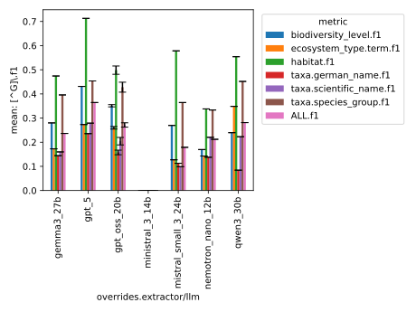
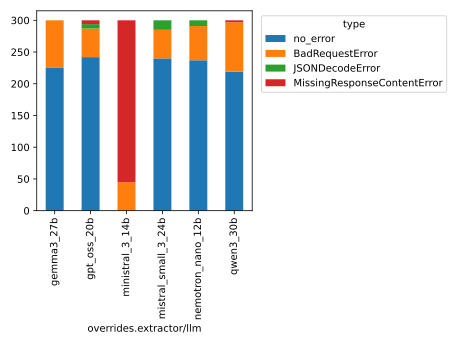

This folder contains the logs and predictions of the baseline experiments
conducted with the faktencheck_core_schema_v1, across the following LLMs:

- gpt_oss_20b
- qwen3_30b
- gemma3_27b
- ministral_3_14b
- mistral_small_3_24b
- nemotron_nano_12b
- gpt_5 (single run to save costs)

See Issue https://github.com/DFKI-NLP/kibad-llm/issues/159  for more documentation.

All LLMs were tested with 3 runs and result averaging (except `gpt_5`), their logs and predictions
are therefore multiruns.

When using the evaluation notebook (`plot_multirun_evaluation.ipynb`) with this data, use 
```python
NAME = "159_core_schema_baseline"
METRICS_DIR_PATTERN = ["evaluate/**/2026-01-08_16-46-51/", "evaluate/**/2026-01-08_16-44-31/"]
ERRORS_DIR_PATTERN = "evaluate/**/2026-01-09_12-07-41/"
# since this is the default and was not explicitly set
FILL_NA = {"overrides.extractor/llm": "gpt_oss_20b"}
```

## Details

- use "dev set" of 100 documents stored on the cluster in /ds/text/kiba-d/dev-set-100
- use core schema https://github.com/DFKI-NLP/kibad-llm/pull/209
- 3 runs, averaging (see https://github.com/DFKI-NLP/kibad-llm/issues/207)
- Models:  gpt_oss_20b, gemma3_27b, mistral_small_3_24b, nemotron_nano_12b, qwen3_30b, ministral_3_14b, gpt_5
- Core schema, flat micro F1 evaluation

### Predict commands:
#### gpt_oss_20b
```
./run_with_llm.sh -v "openai/gpt-oss-20b --max-model-len 131072" -pa "H100-SLT,H100-Trails" -t 1-00:00:00  -u "-m kibad_llm.predict paths.save_dir=/netscratch/hennig/kiba-d experiment/predict=faktencheck_core_fields_schema pdf_directory=/ds/text/kiba-d/dev-set-100 +request_parameters.extra_body.seed=42,1337,7331 --multirun"
```

<details>
<summary>Output</summary>

```
[2026-01-05 17:01:46,703][HYDRA] Saving job_return in /netscratch/hennig/kiba-d/logs/multiruns/default/2026-01-05_15-43-25/job_return_value.json
[2026-01-05 17:01:46,727][HYDRA] Saving job_return in /netscratch/hennig/kiba-d/logs/multiruns/default/2026-01-05_15-43-25/job_return_value.md
[2026-01-05 17:01:46,904][HYDRA] Contents of /netscratch/hennig/kiba-d/logs/multiruns/default/2026-01-05_15-43-25/job_return_value.md:
```

|                                          | branch   | commit_hash                              | is_dirty   | output_file                                                                                                    | overrides.experiment/predict   | overrides.paths.save_dir   | overrides.pdf_directory     |   overrides.request_parameters.extra_body.seed |   time_extraction |   time_pdf_conversion |
|:-----------------------------------------|:---------|:-----------------------------------------|:-----------|:---------------------------------------------------------------------------------------------------------------|:-------------------------------|:---------------------------|:----------------------------|-----------------------------------------------:|------------------:|----------------------:|
| +request_parameters.extra_body.seed=1337 | main     | d9c85c21b26dc578f0a358c0a31422a4f330e56b | True       | /netscratch/hennig/kiba-d/predictions/default/2026-01-05_15-43-25/2026-01-05_16-11-36_107614/predictions.jsonl | faktencheck_core_fields_schema | /netscratch/hennig/kiba-d  | /ds/text/kiba-d/dev-set-100 |                                           1337 |           1492.28 |             0.010036  |
| +request_parameters.extra_body.seed=42   | main     | d9c85c21b26dc578f0a358c0a31422a4f330e56b | False      | /netscratch/hennig/kiba-d/predictions/default/2026-01-05_15-43-25/2026-01-05_15-43-28_289602/predictions.jsonl | faktencheck_core_fields_schema | /netscratch/hennig/kiba-d  | /ds/text/kiba-d/dev-set-100 |                                             42 |           1555.65 |             0.0165837 |
| +request_parameters.extra_body.seed=7331 | main     | d9c85c21b26dc578f0a358c0a31422a4f330e56b | True       | /netscratch/hennig/kiba-d/predictions/default/2026-01-05_15-43-25/2026-01-05_16-36-28_986760/predictions.jsonl | faktencheck_core_fields_schema | /netscratch/hennig/kiba-d  | /ds/text/kiba-d/dev-set-100 |                                           7331 |           1517.23 |             0.0106895 |

</details>

#### gemma3_27b (context_window/max-model-len = 65536 due to memory issues)
```
./run_with_llm.sh -v "google/gemma-3-27b-it --max-model-len 65536 --hf-token $HF_TOKEN" -pa "H100-SLT,H100-Trails" -t 1-00:00:00  -u "-m kibad_llm.predict paths.save_dir=/netscratch/hennig/kiba-d experiment/predict=faktencheck_core_fields_schema pdf_directory=/ds/text/kiba-d/dev-set-100 +request_parameters.extra_body.seed=42,1337,7331 extractor/llm=gemma3_27b --multirun"
```

<details>
<summary>Output</summary>

```
[2026-01-05 17:23:41,882][HYDRA] Saving job_return in /netscratch/hennig/kiba-d/logs/multiruns/default/2026-01-05_16-49-33/job_return_value.json
[2026-01-05 17:23:41,913][HYDRA] Saving job_return in /netscratch/hennig/kiba-d/logs/multiruns/default/2026-01-05_16-49-33/job_return_value.md
[2026-01-05 17:23:41,968][HYDRA] Contents of /netscratch/hennig/kiba-d/logs/multiruns/default/2026-01-05_16-49-33/job_return_value.md:
```

|                                          | branch             | commit_hash                              | is_dirty   | output_file                                                                                                    | overrides.experiment/predict   | overrides.extractor/llm   | overrides.paths.save_dir   | overrides.pdf_directory     |   overrides.request_parameters.extra_body.seed |   time_extraction |   time_pdf_conversion |
|:-----------------------------------------|:-------------------|:-----------------------------------------|:-----------|:---------------------------------------------------------------------------------------------------------------|:-------------------------------|:--------------------------|:---------------------------|:----------------------------|-----------------------------------------------:|------------------:|----------------------:|
| +request_parameters.extra_body.seed=1337 | update_llm_configs | d4c5b0fd702eaba0d92c44e8d69850f0096b0183 | True       | /netscratch/hennig/kiba-d/predictions/default/2026-01-05_16-49-33/2026-01-05_17-03-04_618557/predictions.jsonl | faktencheck_core_fields_schema | gemma3_27b                | /netscratch/hennig/kiba-d  | /ds/text/kiba-d/dev-set-100 |                                           1337 |           617.386 |            0.00966156 |
| +request_parameters.extra_body.seed=42   | update_llm_configs | d4c5b0fd702eaba0d92c44e8d69850f0096b0183 | True       | /netscratch/hennig/kiba-d/predictions/default/2026-01-05_16-49-33/2026-01-05_16-49-34_911017/predictions.jsonl | faktencheck_core_fields_schema | gemma3_27b                | /netscratch/hennig/kiba-d  | /ds/text/kiba-d/dev-set-100 |                                             42 |           631.926 |            0.00715311 |
| +request_parameters.extra_body.seed=7331 | update_llm_configs | d4c5b0fd702eaba0d92c44e8d69850f0096b0183 | True       | /netscratch/hennig/kiba-d/predictions/default/2026-01-05_16-49-33/2026-01-05_17-13-22_561248/predictions.jsonl | faktencheck_core_fields_schema | gemma3_27b                | /netscratch/hennig/kiba-d  | /ds/text/kiba-d/dev-set-100 |     

</details>

#### mistral_small_3_24b 
```
./run_with_llm.sh -v "mistralai/Mistral-Small-3.2-24B-Instruct-2506 --tokenizer_mode mistral --config_format mistral --load_format mistral --max-model-len 131072" -pa "H100-SLT,H100-Trails" -t 1-00:00:00  -u "-m kibad_llm.predict paths.save_dir=/netscratch/hennig/kiba-d experiment/predict=faktencheck_core_fields_schema pdf_directory=/ds/text/kiba-d/dev-set-100 +request_parameters.extra_body.seed=42,1337,7331 extractor/llm=mistral_small_3_24b --multirun"
```

<details>
<summary>Output</summary>

```
[2026-01-05 18:39:09,599][HYDRA] Saving job_return in /netscratch/hennig/kiba-d/logs/multiruns/default/2026-01-05_16-49-42/job_return_value.json
[2026-01-05 18:39:09,638][HYDRA] Saving job_return in /netscratch/hennig/kiba-d/logs/multiruns/default/2026-01-05_16-49-42/job_return_value.md
[2026-01-05 18:39:09,690][HYDRA] Contents of /netscratch/hennig/kiba-d/logs/multiruns/default/2026-01-05_16-49-42/job_return_value.md:
```

|                                          | branch             | commit_hash                              | is_dirty   | output_file                                                                                                    | overrides.experiment/predict   | overrides.extractor/llm   | overrides.paths.save_dir   | overrides.pdf_directory     |   overrides.request_parameters.extra_body.seed |   time_extraction |   time_pdf_conversion |
|:-----------------------------------------|:-------------------|:-----------------------------------------|:-----------|:---------------------------------------------------------------------------------------------------------------|:-------------------------------|:--------------------------|:---------------------------|:----------------------------|-----------------------------------------------:|------------------:|----------------------:|
| +request_parameters.extra_body.seed=1337 | update_llm_configs | d4c5b0fd702eaba0d92c44e8d69850f0096b0183 | True       | /netscratch/hennig/kiba-d/predictions/default/2026-01-05_16-49-42/2026-01-05_17-27-54_696555/predictions.jsonl | faktencheck_core_fields_schema | mistral_small_3_24b       | /netscratch/hennig/kiba-d  | /ds/text/kiba-d/dev-set-100 |                                           1337 |           2134.87 |             0.0144225 |
| +request_parameters.extra_body.seed=42   | update_llm_configs | d4c5b0fd702eaba0d92c44e8d69850f0096b0183 | True       | /netscratch/hennig/kiba-d/predictions/default/2026-01-05_16-49-42/2026-01-05_16-49-43_624440/predictions.jsonl | faktencheck_core_fields_schema | mistral_small_3_24b       | /netscratch/hennig/kiba-d  | /ds/text/kiba-d/dev-set-100 |                                             42 |           2119.12 |             0.0149375 |
| +request_parameters.extra_body.seed=7331 | update_llm_configs | d4c5b0fd702eaba0d92c44e8d69850f0096b0183 | True       | /netscratch/hennig/kiba-d/predictions/default/2026-01-05_16-49-42/2026-01-05_18-03-30_367524/predictions.jsonl | faktencheck_core_fields_schema | mistral_small_3_24b       | /netscratch/hennig/kiba-d  | /ds/text/kiba-d/dev-set-100 |      

</details>

#### nemotron_nano_12b
```
./run_with_llm.sh -v "nvidia/NVIDIA-Nemotron-Nano-12B-v2  --trust-remote-code --max-num-seqs 64 --mamba_ssm_cache_dtype float32  --max-model-len 131072" -pa "H100-SLT,H100-Trails" -t 1-00:00:00  -u "-m kibad_llm.predict paths.save_dir=/netscratch/hennig/kiba-d experiment/predict=faktencheck_core_fields_schema pdf_directory=/ds/text/kiba-d/dev-set-100 +request_parameters.extra_body.seed=42,1337,7331 extractor/llm=nemotron_nano_12b --multirun"
```

<details>
<summary>Output</summary>

```
[2026-01-05 17:20:39,392][HYDRA] Saving job_return in /netscratch/hennig/kiba-d/logs/multiruns/default/2026-01-05_16-48-34/job_return_value.json
[2026-01-05 17:20:39,399][HYDRA] Saving job_return in /netscratch/hennig/kiba-d/logs/multiruns/default/2026-01-05_16-48-34/job_return_value.md
[2026-01-05 17:20:39,440][HYDRA] Contents of /netscratch/hennig/kiba-d/logs/multiruns/default/2026-01-05_16-48-34/job_return_value.md:
```

|                                          | branch             | commit_hash                              | is_dirty   | output_file                                                                                                    | overrides.experiment/predict   | overrides.extractor/llm   | overrides.paths.save_dir   | overrides.pdf_directory     |   overrides.request_parameters.extra_body.seed |   time_extraction |   time_pdf_conversion |
|:-----------------------------------------|:-------------------|:-----------------------------------------|:-----------|:---------------------------------------------------------------------------------------------------------------|:-------------------------------|:--------------------------|:---------------------------|:----------------------------|-----------------------------------------------:|------------------:|----------------------:|
| +request_parameters.extra_body.seed=1337 | update_llm_configs | d4c5b0fd702eaba0d92c44e8d69850f0096b0183 | True       | /netscratch/hennig/kiba-d/predictions/default/2026-01-05_16-48-34/2026-01-05_17-02-05_611020/predictions.jsonl | faktencheck_core_fields_schema | nemotron_nano_12b         | /netscratch/hennig/kiba-d  | /ds/text/kiba-d/dev-set-100 |                                           1337 |           556.43  |            0.0136674  |
| +request_parameters.extra_body.seed=42   | update_llm_configs | d4c5b0fd702eaba0d92c44e8d69850f0096b0183 | True       | /netscratch/hennig/kiba-d/predictions/default/2026-01-05_16-48-34/2026-01-05_16-48-36_047611/predictions.jsonl | faktencheck_core_fields_schema | nemotron_nano_12b         | /netscratch/hennig/kiba-d  | /ds/text/kiba-d/dev-set-100 |                                             42 |           628.67  |            0.00905219 |
| +request_parameters.extra_body.seed=7331 | update_llm_configs | d4c5b0fd702eaba0d92c44e8d69850f0096b0183 | True       | /netscratch/hennig/kiba-d/predictions/default/2026-01-05_16-48-34/2026-01-05_17-11-22_704076/predictions.jsonl | faktencheck_core_fields_schema | nemotron_nano_12b         | /netscratch/hennig/kiba-d  | /ds/text/kiba-d/dev-set-100 |                                           7331 |           556.361 |            0.0130048  |

</details>

#### qwen3_30b   (context_window/max-model-len = 65536 due to memory issues)
```
./run_with_llm.sh -v "Qwen/Qwen3-30B-A3B-Thinking-2507 --max-model-len 65536 --reasoning-parser deepseek_r1" -pa "H100-SLT,H100-Trails" -t 1-00:00:00  -u "-m kibad_llm.predict paths.save_dir=/netscratch/hennig/kiba-d experiment/predict=faktencheck_core_fields_schema pdf_directory=/ds/text/kiba-d/dev-set-100 +request_parameters.extra_body.seed=42,1337,7331 extractor/llm=qwen3_30b --multirun"
```

<details>
<summary>Output</summary>

```
[2026-01-06 09:47:27,312][HYDRA] Saving job_return in /netscratch/hennig/kiba-d/logs/multiruns/default/2026-01-06_08-05-12/job_return_value.json
[2026-01-06 09:47:27,316][HYDRA] Saving job_return in /netscratch/hennig/kiba-d/logs/multiruns/default/2026-01-06_08-05-12/job_return_value.md
[2026-01-06 09:47:27,371][HYDRA] Contents of /netscratch/hennig/kiba-d/logs/multiruns/default/2026-01-06_08-05-12/job_return_value.md:
```

|                                          | branch             | commit_hash                              | is_dirty   | output_file                                                                                                    | overrides.experiment/predict   | overrides.extractor/llm   | overrides.paths.save_dir   | overrides.pdf_directory     |   overrides.request_parameters.extra_body.seed |   time_extraction |   time_pdf_conversion |
|:-----------------------------------------|:-------------------|:-----------------------------------------|:-----------|:---------------------------------------------------------------------------------------------------------------|:-------------------------------|:--------------------------|:---------------------------|:----------------------------|-----------------------------------------------:|------------------:|----------------------:|
| +request_parameters.extra_body.seed=1337 | update_llm_configs | d4c5b0fd702eaba0d92c44e8d69850f0096b0183 | True       | /netscratch/hennig/kiba-d/predictions/default/2026-01-06_08-05-12/2026-01-06_08-40-42_294971/predictions.jsonl | faktencheck_core_fields_schema | qwen3_30b                 | /netscratch/hennig/kiba-d  | /ds/text/kiba-d/dev-set-100 |                                           1337 |           1998.73 |            0.00895117 |
| +request_parameters.extra_body.seed=42   | update_llm_configs | d4c5b0fd702eaba0d92c44e8d69850f0096b0183 | True       | /netscratch/hennig/kiba-d/predictions/default/2026-01-06_08-05-12/2026-01-06_08-05-13_659180/predictions.jsonl | faktencheck_core_fields_schema | qwen3_30b                 | /netscratch/hennig/kiba-d  | /ds/text/kiba-d/dev-set-100 |                                             42 |           2000.66 |            0.0119889  |
| +request_parameters.extra_body.seed=7331 | update_llm_configs | d4c5b0fd702eaba0d92c44e8d69850f0096b0183 | True       | /netscratch/hennig/kiba-d/predictions/default/2026-01-06_08-05-12/2026-01-06_09-14-01_582824/predictions.jsonl | faktencheck_core_fields_schema | qwen3_30b                 | /netscratch/hennig/kiba-d  | /ds/text/kiba-d/dev-set-100 |      

</details>

#### ministral_3_14b 
```
./run_with_llm.sh -v "mistralai/Ministral-3-14B-Reasoning-2512 --tokenizer_mode mistral --config_format mistral --load_format mistral --max-model-len 131072 --reasoning-parser mistral" -pa "H100-SLT,H100-Trails" -t 1-00:00:00  -u "-m kibad_llm.predict paths.save_dir=/netscratch/hennig/kiba-d experiment/predict=faktencheck_core_fields_schema pdf_directory=/ds/text/kiba-d/dev-set-100 +request_parameters.extra_body.seed=42,1337,7331 extractor/llm=ministral_3_14b --multirun"
```

Ministral doesn't seem to produce a result at all, log output is full of :

```
[2026-01-05 18:07:16,007][kibad_llm.extractors.base][WARNING] - Failed to process document XQ7DW4VS.pdf: MissingResponseContentError: LLM response is missing content., response_content = '...'  
```

<details>
<summary>Output</summary>

```
[2026-01-05 18:07:39,197][HYDRA] Saving job_return in /netscratch/hennig/kiba-d/logs/multiruns/default/2026-01-05_16-54-54/job_return_value.json
[2026-01-05 18:07:39,222][HYDRA] Saving job_return in /netscratch/hennig/kiba-d/logs/multiruns/default/2026-01-05_16-54-54/job_return_value.md
[2026-01-05 18:07:39,307][HYDRA] Contents of /netscratch/hennig/kiba-d/logs/multiruns/default/2026-01-05_16-54-54/job_return_value.md:
```

|                                          | branch             | commit_hash                              | is_dirty   | output_file                                                                                                    | overrides.experiment/predict   | overrides.extractor/llm   | overrides.paths.save_dir   | overrides.pdf_directory     |   overrides.request_parameters.extra_body.seed |   time_extraction |   time_pdf_conversion |
|:-----------------------------------------|:-------------------|:-----------------------------------------|:-----------|:---------------------------------------------------------------------------------------------------------------|:-------------------------------|:--------------------------|:---------------------------|:----------------------------|-----------------------------------------------:|------------------:|----------------------:|
| +request_parameters.extra_body.seed=1337 | update_llm_configs | d4c5b0fd702eaba0d92c44e8d69850f0096b0183 | True       | /netscratch/hennig/kiba-d/predictions/default/2026-01-05_16-54-54/2026-01-05_17-20-12_492066/predictions.jsonl | faktencheck_core_fields_schema | ministral_3_14b           | /netscratch/hennig/kiba-d  | /ds/text/kiba-d/dev-set-100 |                                           1337 |           1422.11 |            0.0114058  |
| +request_parameters.extra_body.seed=42   | update_llm_configs | d4c5b0fd702eaba0d92c44e8d69850f0096b0183 | True       | /netscratch/hennig/kiba-d/predictions/default/2026-01-05_16-54-54/2026-01-05_16-54-55_650959/predictions.jsonl | faktencheck_core_fields_schema | ministral_3_14b           | /netscratch/hennig/kiba-d  | /ds/text/kiba-d/dev-set-100 |                                             42 |           1420.38 |            0.00951683 |
| +request_parameters.extra_body.seed=7331 | update_llm_configs | d4c5b0fd702eaba0d92c44e8d69850f0096b0183 | True       | /netscratch/hennig/kiba-d/predictions/default/2026-01-05_16-54-54/2026-01-05_17-43-55_409535/predictions.jsonl | faktencheck_core_fields_schema | ministral_3_14b           | /netscratch/hennig/kiba-d  | /ds/text/kiba-d/dev-set-100 | 

</details>

#### gpt_5 

Note: We skip the multirun here to reduce costs. If you want to add it, use `+request_parameters.extra_body.seed=42,1337,7331 --multirun`  (Cost for a single run ~$6, costs for 3 runs: $17.76, for 276 API calls, i.e. docs that could be processed)

```
srun --partition=RTXA6000-SLT --nodes=1 --ntasks=1 --cpus-per-task=2 --gpus-per-task=0 --mem-per-cpu=4G --time=1-00:00:00 uv run --cache-dir /netscratch/hennig/.cache/uv -m kibad_llm.predict paths.save_dir=/netscratch/hennig/kiba-d pdf_directory=/ds/text/kiba-d/dev-set-100  extractor/llm=gpt_5 experiment/predict=faktencheck_core_fields_schema 
```


<details>
<summary>Output</summary>

```
[2026-01-08 12:22:41,469][__main__][INFO] - Writing results to /netscratch/hennig/kiba-d/predictions/default/2026-01-08_10-35-47/2026-01-08_10-35-47_225434/predictions.jsonl ...
Creating json from Arrow format: 100%|██████████| 1/1 [00:00<00:00, 94.68ba/s]
[2026-01-08 12:22:41,500][kibad_llm.hydra_callbacks.save_job_return_value.SaveJobReturnValueCallback][INFO] - Saving job_return in /netscratch/hennig/kiba-d/logs/runs/default/2026-01-08_10-35-47/job_return_value.json
[2026-01-08 12:22:41,505][kibad_llm.hydra_callbacks.save_job_return_value.SaveJobReturnValueCallback][INFO] - Saving job_return in /netscratch/hennig/kiba-d/logs/runs/default/2026-01-08_10-35-47/job_return_value.md

Contents of /netscratch/hennig/kiba-d/logs/runs/default/2026-01-08_10-35-47/job_return_value.md:
```
|    | branch   | commit_hash                              | is_dirty   | output_file                                                                                                    |   time_extraction |   time_pdf_conversion |
|---:|:---------|:-----------------------------------------|:-----------|:---------------------------------------------------------------------------------------------------------------|------------------:|----------------------:|
|  0 | main     | cff4416f67a1688f8d785de44f2264e8612bdaf9 | False      | /netscratch/hennig/kiba-d/predictions/default/2026-01-08_10-35-47/2026-01-08_10-35-47_225434/predictions.jsonl |           6349.56 |                 0.005 |


</details>

### Evaluate commands
#### All-in-one-version (todo add paths.save_dir=/netscratch/hennig/kiba-d)
 - requires:
   - #241
   - #242
   - #243
   - #244
```
uv run -m kibad_llm.evaluate \
experiment/evaluate=faktencheck_core_f1_micro_flat \
predictions_multirun_logs=[/netscratch/hennig/kiba-d/logs/multiruns/default/2026-01-05_15-43-25,/netscratch/hennig/kiba-d/logs/multiruns/default/2026-01-05_16-49-33,/netscratch/hennig/kiba-d/logs/multiruns/default/2026-01-05_16-49-42,/netscratch/hennig/kiba-d/logs/multiruns/default/2026-01-05_16-48-34,/netscratch/hennig/kiba-d/logs/multiruns/default/2026-01-05_16-54-54,/netscratch/hennig/kiba-d/logs/multiruns/default/2026-01-06_08-05-12] \
+hydra.callbacks.save_job_return.multirun_markdown_group_by=overrides.extractor/llm \
--multirun
```

<details>
<summary>Output</summary>

```
[2026-01-06 13:17:34,020][HYDRA] Saving job_return in /netscratch/binder/projects/kibad-llm/logs/multiruns/default/2026-01-06_13-17-23/job_return_value.json
[2026-01-06 13:17:34,026][HYDRA] Saving job_return in /netscratch/binder/projects/kibad-llm/logs/multiruns/default/2026-01-06_13-17-23/job_return_value.md
[2026-01-06 13:17:34,075][HYDRA] Contents of /netscratch/binder/projects/kibad-llm/logs/multiruns/default/2026-01-06_13-17-23/job_return_value.md: 
```

| overrides.extractor/llm   |   ALL.f1.mean |   ALL.f1.std |   ALL.precision.mean |   ALL.precision.std |   ALL.recall.mean |   ALL.recall.std |   ALL.support.mean |   ALL.support.std |   AVG.f1.mean |   AVG.f1.std |   AVG.precision.mean |   AVG.precision.std |   AVG.recall.mean |   AVG.recall.std |   AVG.support.mean |   AVG.support.std |   biodiversity_level.f1.mean |   biodiversity_level.f1.std |   biodiversity_level.precision.mean |   biodiversity_level.precision.std |   biodiversity_level.recall.mean |   biodiversity_level.recall.std |   biodiversity_level.support.mean |   biodiversity_level.support.std |   ecosystem_type.term.f1.mean |   ecosystem_type.term.f1.std |   ecosystem_type.term.precision.mean |   ecosystem_type.term.precision.std |   ecosystem_type.term.recall.mean |   ecosystem_type.term.recall.std |   ecosystem_type.term.support.mean |   ecosystem_type.term.support.std |   habitat.f1.mean |   habitat.f1.std |   habitat.precision.mean |   habitat.precision.std |   habitat.recall.mean |   habitat.recall.std |   habitat.support.mean |   habitat.support.std |   prediction.job_return_value.time_extraction.mean |   prediction.job_return_value.time_extraction.std |   prediction.job_return_value.time_pdf_conversion.mean |   prediction.job_return_value.time_pdf_conversion.std |   taxa.german_name.f1.mean |   taxa.german_name.f1.std |   taxa.german_name.precision.mean |   taxa.german_name.precision.std |   taxa.german_name.recall.mean |   taxa.german_name.recall.std |   taxa.german_name.support.mean |   taxa.german_name.support.std |   taxa.scientific_name.f1.mean |   taxa.scientific_name.f1.std |   taxa.scientific_name.precision.mean |   taxa.scientific_name.precision.std |   taxa.scientific_name.recall.mean |   taxa.scientific_name.recall.std |   taxa.scientific_name.support.mean |   taxa.scientific_name.support.std |   taxa.species_group.f1.mean |   taxa.species_group.f1.std |   taxa.species_group.precision.mean |   taxa.species_group.precision.std |   taxa.species_group.recall.mean |   taxa.species_group.recall.std |   taxa.species_group.support.mean |   taxa.species_group.support.std | overrides.experiment/predict                                                                           | overrides.paths.save_dir                                                                | overrides.pdf_directory                                                                       | overrides.request_parameters.extra_body.seed   | prediction.job_return_value.branch                                 | prediction.job_return_value.commit_hash                                                                                              | prediction.job_return_value.is_dirty   | prediction.job_return_value.output_file                                                                                                                                                                                                                                                                                                                |
|:--------------------------|--------------:|-------------:|---------------------:|--------------------:|------------------:|-----------------:|-------------------:|------------------:|--------------:|-------------:|---------------------:|--------------------:|------------------:|-----------------:|-------------------:|------------------:|-----------------------------:|----------------------------:|------------------------------------:|-----------------------------------:|---------------------------------:|--------------------------------:|----------------------------------:|---------------------------------:|------------------------------:|-----------------------------:|-------------------------------------:|------------------------------------:|----------------------------------:|---------------------------------:|-----------------------------------:|----------------------------------:|------------------:|-----------------:|-------------------------:|------------------------:|----------------------:|---------------------:|-----------------------:|----------------------:|---------------------------------------------------:|--------------------------------------------------:|-------------------------------------------------------:|------------------------------------------------------:|---------------------------:|--------------------------:|----------------------------------:|---------------------------------:|-------------------------------:|------------------------------:|--------------------------------:|-------------------------------:|-------------------------------:|------------------------------:|--------------------------------------:|-------------------------------------:|-----------------------------------:|----------------------------------:|------------------------------------:|-----------------------------------:|-----------------------------:|----------------------------:|------------------------------------:|-----------------------------------:|---------------------------------:|--------------------------------:|----------------------------------:|---------------------------------:|:-------------------------------------------------------------------------------------------------------|:----------------------------------------------------------------------------------------|:----------------------------------------------------------------------------------------------|:-----------------------------------------------|:-------------------------------------------------------------------|:-------------------------------------------------------------------------------------------------------------------------------------|:---------------------------------------|:-------------------------------------------------------------------------------------------------------------------------------------------------------------------------------------------------------------------------------------------------------------------------------------------------------------------------------------------------------|
|                           |         0.272 |        0.009 |                0.237 |               0.016 |             0.319 |            0.003 |                792 |                 0 |         0.317 |        0.003 |                0.301 |               0.008 |             0.352 |            0.004 |                132 |                 0 |                        0.351 |                       0.005 |                               0.298 |                              0.002 |                            0.428 |                           0.009 |                                67 |                                0 |                         0.26  |                        0.005 |                                0.213 |                               0.003 |                             0.333 |                            0.011 |                                 53 |                                 0 |             0.498 |            0.017 |                    0.593 |                   0.008 |                 0.43  |                0.021 |                    138 |                     0 |                                           1521.72  |                                            31.92  |                                                  0.012 |                                                 0.004 |                      0.158 |                     0.009 |                             0.135 |                            0.014 |                          0.19  |                             0 |                             231 |                              0 |                          0.204 |                         0.015 |                                 0.161 |                                0.019 |                              0.281 |                             0.003 |                                 197 |                                  0 |                        0.428 |                       0.021 |                               0.408 |                              0.029 |                            0.45  |                           0.011 |                               106 |                                0 | ['faktencheck_core_fields_schema', 'faktencheck_core_fields_schema', 'faktencheck_core_fields_schema'] | ['/netscratch/hennig/kiba-d', '/netscratch/hennig/kiba-d', '/netscratch/hennig/kiba-d'] | ['/ds/text/kiba-d/dev-set-100', '/ds/text/kiba-d/dev-set-100', '/ds/text/kiba-d/dev-set-100'] | ['1337', '42', '7331']                         | ['main', 'main', 'main']                                           | ['d9c85c21b26dc578f0a358c0a31422a4f330e56b', 'd9c85c21b26dc578f0a358c0a31422a4f330e56b', 'd9c85c21b26dc578f0a358c0a31422a4f330e56b'] | [np.True_, np.False_, np.True_]        | ['/netscratch/hennig/kiba-d/predictions/default/2026-01-05_15-43-25/2026-01-05_16-11-36_107614/predictions.jsonl', '/netscratch/hennig/kiba-d/predictions/default/2026-01-05_15-43-25/2026-01-05_15-43-28_289602/predictions.jsonl', '/netscratch/hennig/kiba-d/predictions/default/2026-01-05_15-43-25/2026-01-05_16-36-28_986760/predictions.jsonl'] |
| gemma3_27b                |         0.236 |        0     |                0.212 |               0     |             0.268 |            0     |                792 |                 0 |         0.271 |        0     |                0.269 |               0     |             0.302 |            0     |                132 |                 0 |                        0.28  |                       0     |                               0.253 |                              0     |                            0.313 |                           0     |                                67 |                                0 |                         0.173 |                        0     |                                0.114 |                               0     |                             0.358 |                            0     |                                 53 |                                 0 |             0.474 |            0     |                    0.522 |                   0     |                 0.435 |                0     |                    138 |                     0 |                                            622.786 |                                             7.959 |                                                  0.009 |                                                 0.001 |                      0.144 |                     0     |                             0.142 |                            0     |                          0.147 |                             0 |                             231 |                              0 |                          0.16  |                         0     |                                 0.13  |                                0     |                              0.208 |                             0     |                                 197 |                                  0 |                        0.396 |                       0     |                               0.457 |                              0     |                            0.349 |                           0     |                               106 |                                0 | ['faktencheck_core_fields_schema', 'faktencheck_core_fields_schema', 'faktencheck_core_fields_schema'] | ['/netscratch/hennig/kiba-d', '/netscratch/hennig/kiba-d', '/netscratch/hennig/kiba-d'] | ['/ds/text/kiba-d/dev-set-100', '/ds/text/kiba-d/dev-set-100', '/ds/text/kiba-d/dev-set-100'] | ['1337', '42', '7331']                         | ['update_llm_configs', 'update_llm_configs', 'update_llm_configs'] | ['d4c5b0fd702eaba0d92c44e8d69850f0096b0183', 'd4c5b0fd702eaba0d92c44e8d69850f0096b0183', 'd4c5b0fd702eaba0d92c44e8d69850f0096b0183'] | [np.True_, np.True_, np.True_]         | ['/netscratch/hennig/kiba-d/predictions/default/2026-01-05_16-49-33/2026-01-05_17-03-04_618557/predictions.jsonl', '/netscratch/hennig/kiba-d/predictions/default/2026-01-05_16-49-33/2026-01-05_16-49-34_911017/predictions.jsonl', '/netscratch/hennig/kiba-d/predictions/default/2026-01-05_16-49-33/2026-01-05_17-13-22_561248/predictions.jsonl'] |
| ministral_3_14b           |         0     |        0     |                0     |               0     |             0     |            0     |                792 |                 0 |         0     |        0     |                0     |               0     |             0     |            0     |                132 |                 0 |                        0     |                       0     |                               0     |                              0     |                            0     |                           0     |                                67 |                                0 |                         0     |                        0     |                                0     |                               0     |                             0     |                            0     |                                 53 |                                 0 |             0     |            0     |                    0     |                   0     |                 0     |                0     |                    138 |                     0 |                                           1421.95  |                                             1.499 |                                                  0.012 |                                                 0.002 |                      0     |                     0     |                             0     |                            0     |                          0     |                             0 |                             231 |                              0 |                          0     |                         0     |                                 0     |                                0     |                              0     |                             0     |                                 197 |                                  0 |                        0     |                       0     |                               0     |                              0     |                            0     |                           0     |                               106 |                                0 | ['faktencheck_core_fields_schema', 'faktencheck_core_fields_schema', 'faktencheck_core_fields_schema'] | ['/netscratch/hennig/kiba-d', '/netscratch/hennig/kiba-d', '/netscratch/hennig/kiba-d'] | ['/ds/text/kiba-d/dev-set-100', '/ds/text/kiba-d/dev-set-100', '/ds/text/kiba-d/dev-set-100'] | ['1337', '42', '7331']                         | ['update_llm_configs', 'update_llm_configs', 'update_llm_configs'] | ['d4c5b0fd702eaba0d92c44e8d69850f0096b0183', 'd4c5b0fd702eaba0d92c44e8d69850f0096b0183', 'd4c5b0fd702eaba0d92c44e8d69850f0096b0183'] | [np.True_, np.True_, np.True_]         | ['/netscratch/hennig/kiba-d/predictions/default/2026-01-05_16-54-54/2026-01-05_17-20-12_492066/predictions.jsonl', '/netscratch/hennig/kiba-d/predictions/default/2026-01-05_16-54-54/2026-01-05_16-54-55_650959/predictions.jsonl', '/netscratch/hennig/kiba-d/predictions/default/2026-01-05_16-54-54/2026-01-05_17-43-55_409535/predictions.jsonl'] |
| mistral_small_3_24b       |         0.179 |        0     |                0.121 |               0     |             0.347 |            0     |                792 |                 0 |         0.258 |        0     |                0.229 |               0     |             0.398 |            0     |                132 |                 0 |                        0.269 |                       0     |                               0.206 |                              0     |                            0.388 |                           0     |                                67 |                                0 |                         0.127 |                        0     |                                0.072 |                               0     |                             0.566 |                            0     |                                 53 |                                 0 |             0.578 |            0     |                    0.649 |                   0     |                 0.522 |                0     |                    138 |                     0 |                                           2130.93  |                                            10.405 |                                                  0.013 |                                                 0.002 |                      0.113 |                     0     |                             0.077 |                            0     |                          0.212 |                             0 |                             231 |                              0 |                          0.099 |                         0     |                                 0.061 |                                0     |                              0.259 |                             0     |                                 197 |                                  0 |                        0.364 |                       0     |                               0.309 |                              0     |                            0.443 |                           0     |                               106 |                                0 | ['faktencheck_core_fields_schema', 'faktencheck_core_fields_schema', 'faktencheck_core_fields_schema'] | ['/netscratch/hennig/kiba-d', '/netscratch/hennig/kiba-d', '/netscratch/hennig/kiba-d'] | ['/ds/text/kiba-d/dev-set-100', '/ds/text/kiba-d/dev-set-100', '/ds/text/kiba-d/dev-set-100'] | ['1337', '42', '7331']                         | ['update_llm_configs', 'update_llm_configs', 'update_llm_configs'] | ['d4c5b0fd702eaba0d92c44e8d69850f0096b0183', 'd4c5b0fd702eaba0d92c44e8d69850f0096b0183', 'd4c5b0fd702eaba0d92c44e8d69850f0096b0183'] | [np.True_, np.True_, np.True_]         | ['/netscratch/hennig/kiba-d/predictions/default/2026-01-05_16-49-42/2026-01-05_17-27-54_696555/predictions.jsonl', '/netscratch/hennig/kiba-d/predictions/default/2026-01-05_16-49-42/2026-01-05_16-49-43_624440/predictions.jsonl', '/netscratch/hennig/kiba-d/predictions/default/2026-01-05_16-49-42/2026-01-05_18-03-30_367524/predictions.jsonl'] |
| nemotron_nano_12b         |         0.212 |        0     |                0.198 |               0     |             0.229 |            0     |                792 |                 0 |         0.224 |        0     |                0.231 |               0     |             0.237 |            0     |                132 |                 0 |                        0.17  |                       0     |                               0.143 |                              0     |                            0.209 |                           0     |                                67 |                                0 |                         0.143 |                        0     |                                0.104 |                               0     |                             0.226 |                            0     |                                 53 |                                 0 |             0.338 |            0     |                    0.457 |                   0     |                 0.268 |                0     |                    138 |                     0 |                                            580.487 |                                            41.728 |                                                  0.012 |                                                 0.002 |                      0.138 |                     0     |                             0.129 |                            0     |                          0.147 |                             0 |                             231 |                              0 |                          0.22  |                         0     |                                 0.192 |                                0     |                              0.259 |                             0     |                                 197 |                                  0 |                        0.333 |                       0     |                               0.359 |                              0     |                            0.311 |                           0     |                               106 |                                0 | ['faktencheck_core_fields_schema', 'faktencheck_core_fields_schema', 'faktencheck_core_fields_schema'] | ['/netscratch/hennig/kiba-d', '/netscratch/hennig/kiba-d', '/netscratch/hennig/kiba-d'] | ['/ds/text/kiba-d/dev-set-100', '/ds/text/kiba-d/dev-set-100', '/ds/text/kiba-d/dev-set-100'] | ['1337', '42', '7331']                         | ['update_llm_configs', 'update_llm_configs', 'update_llm_configs'] | ['d4c5b0fd702eaba0d92c44e8d69850f0096b0183', 'd4c5b0fd702eaba0d92c44e8d69850f0096b0183', 'd4c5b0fd702eaba0d92c44e8d69850f0096b0183'] | [np.True_, np.True_, np.True_]         | ['/netscratch/hennig/kiba-d/predictions/default/2026-01-05_16-48-34/2026-01-05_17-02-05_611020/predictions.jsonl', '/netscratch/hennig/kiba-d/predictions/default/2026-01-05_16-48-34/2026-01-05_16-48-36_047611/predictions.jsonl', '/netscratch/hennig/kiba-d/predictions/default/2026-01-05_16-48-34/2026-01-05_17-11-22_704076/predictions.jsonl'] |
| qwen3_30b                 |         0.281 |        0     |                0.319 |               0     |             0.251 |            0     |                792 |                 0 |         0.317 |        0     |                0.363 |               0     |             0.299 |            0     |                132 |                 0 |                        0.239 |                       0     |                               0.227 |                              0     |                            0.254 |                           0     |                                67 |                                0 |                         0.348 |                        0     |                                0.291 |                               0     |                             0.434 |                            0     |                                 53 |                                 0 |             0.554 |            0     |                    0.787 |                   0     |                 0.428 |                0     |                    138 |                     0 |                                           2001.61  |                                             3.45  |                                                  0.012 |                                                 0.002 |                      0.084 |                     0     |                             0.12  |                            0     |                          0.065 |                             0 |                             231 |                              0 |                          0.223 |                         0     |                                 0.228 |                                0     |                              0.218 |                             0     |                                 197 |                                  0 |                        0.452 |                       0     |                               0.525 |                              0     |                            0.396 |                           0     |                               106 |                                0 | ['faktencheck_core_fields_schema', 'faktencheck_core_fields_schema', 'faktencheck_core_fields_schema'] | ['/netscratch/hennig/kiba-d', '/netscratch/hennig/kiba-d', '/netscratch/hennig/kiba-d'] | ['/ds/text/kiba-d/dev-set-100', '/ds/text/kiba-d/dev-set-100', '/ds/text/kiba-d/dev-set-100'] | ['1337', '42', '7331']                         | ['update_llm_configs', 'update_llm_configs', 'update_llm_configs'] | ['d4c5b0fd702eaba0d92c44e8d69850f0096b0183', 'd4c5b0fd702eaba0d92c44e8d69850f0096b0183', 'd4c5b0fd702eaba0d92c44e8d69850f0096b0183'] | [np.True_, np.True_, np.True_]         | ['/netscratch/hennig/kiba-d/predictions/default/2026-01-06_08-05-12/2026-01-06_08-40-42_294971/predictions.jsonl', '/netscratch/hennig/kiba-d/predictions/default/2026-01-06_08-05-12/2026-01-06_08-05-13_659180/predictions.jsonl', '/netscratch/hennig/kiba-d/predictions/default/2026-01-06_08-05-12/2026-01-06_09-14-01_582824/predictions.jsonl'] |

</details>

Results for GPT 5:

```uv run -m kibad_llm.evaluate experiment/evaluate=faktencheck_core_f1_micro_flat  dataset.predictions.log=/netscratch/hennig/kiba-d/logs/runs/default/2026-01-08_10-35-47```

<details>
<summary>Output</summary>

| field                |   precision |   recall |    f1 |   support |
|:---------------------|------------:|---------:|------:|----------:|
| biodiversity_level   |       0.342 |    0.582 | 0.431 |        67 |
| ecosystem_type.term  |       0.166 |    0.774 | 0.273 |        53 |
| habitat              |       0.655 |    0.783 | 0.713 |       138 |
| taxa.german_name     |       0.198 |    0.29  | 0.236 |       231 |
| taxa.scientific_name |       0.23  |    0.355 | 0.279 |       197 |
| taxa.species_group   |       0.357 |    0.623 | 0.454 |       106 |
| AVG                  |       0.325 |    0.568 | 0.398 |       132 |
| ALL                  |       0.289 |    0.494 | 0.364 |       792 |

</details>




