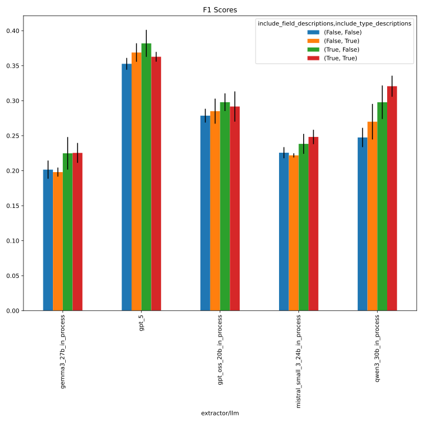
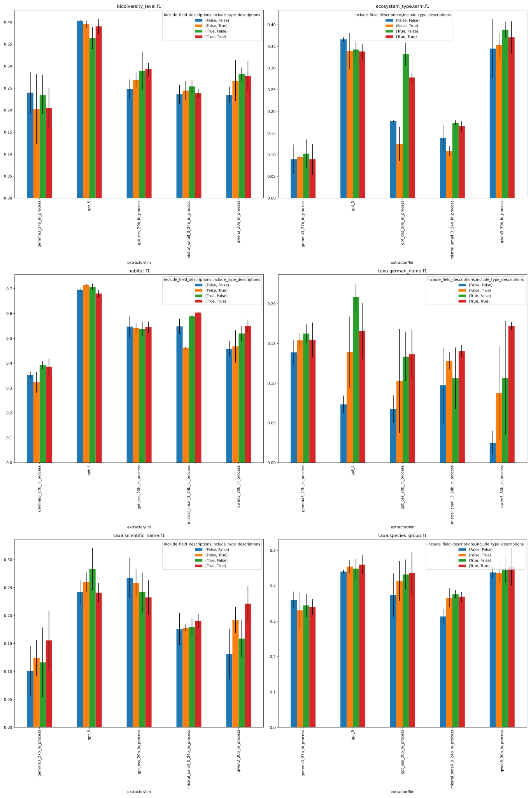
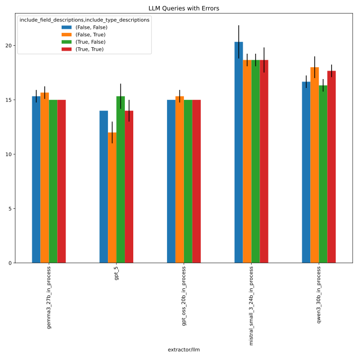
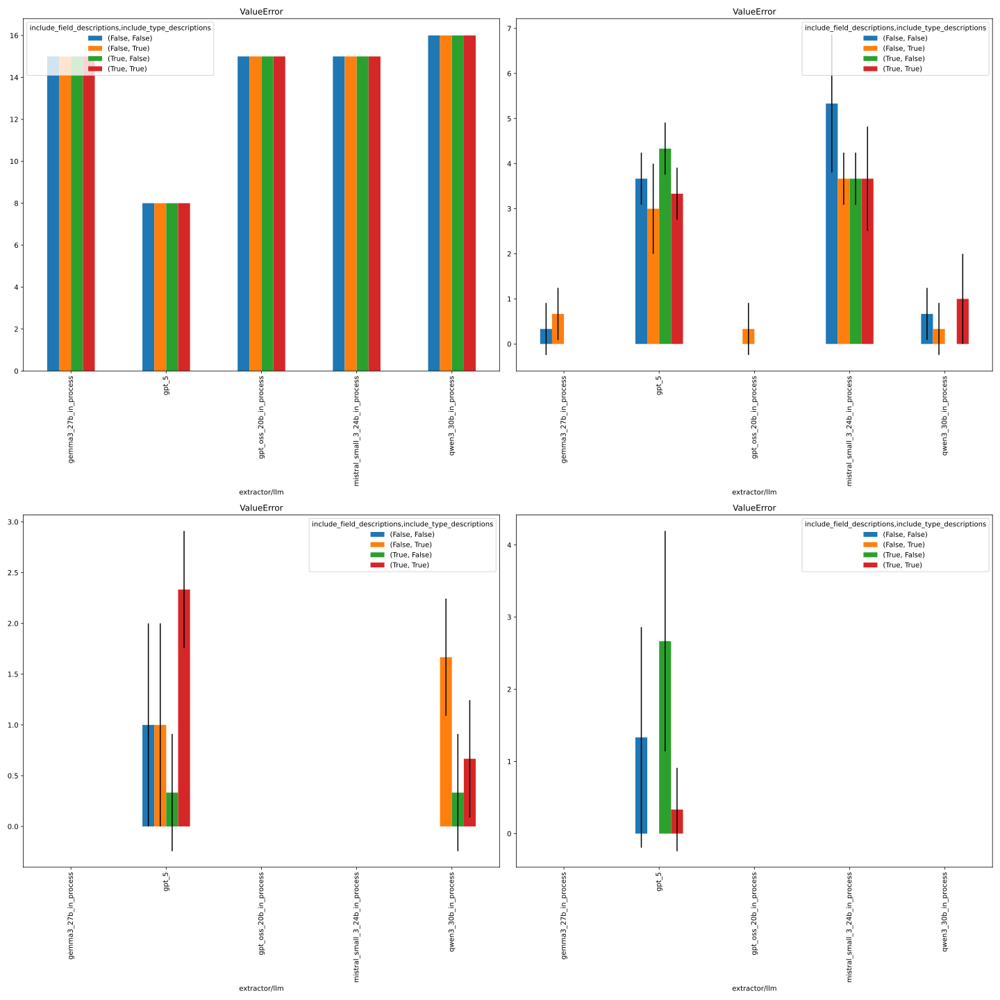

# 226_dont_include_field_and_type_descriptions

## notebook parameters

```python
NAME = "226_dont_include_field_and_type_descriptions"
# used to group the data
INDEX_COLUMNS = ["prediction.overrides.extractor/llm","prediction.overrides.extractor.schema_description_kwargs.include_field_descriptions","prediction.overrides.extractor.schema_description_kwargs.include_type_descriptions"]
PLOT_KWARGS = {
    # can be either "metric" or one of the INDEX_COLUMNS (or multiple of them)
    "xgroup": ["prediction.overrides.extractor.schema_description_kwargs.include_field_descriptions","prediction.overrides.extractor.schema_description_kwargs.include_type_descriptions"],
    # add any more arguments passed to pd.DataFrame.plot
    "create_subplot_for_each": "metric",
    "subplot_columns": 2,
}
```

## metrics



## errors




Details below.

---

 - based on command from [here](https://github.com/DFKI-NLP/kibad-llm/issues/311#issuecomment-3790517808)
 - use `name=226_dont_include_field_and_type_descriptions`
 - adjust `include_field_descriptions` and `include_type_descriptions` (requires #254)
 - with `extractor.return_reasoning=true`
 - **without Nemotron** (since it performed worse than other models, see #311), but **with gpt5**
```
./run_in_process.sh -pa "H100-SLT,H100-Trails,H100,A100-80GB" \
-u "-m kibad_llm.predict \
name=226_dont_include_field_and_type_descriptions \
experiment/predict=faktencheck_core_fields_schema_with_evidence \
+extractor.schema_description_kwargs.include_field_descriptions=false,true \
+extractor.schema_description_kwargs.include_type_descriptions=false,true \
pdf_directory=/ds/text/kiba-d/dev-set-100 \
extractor.return_reasoning=true \
extractor/llm=gpt_oss_20b_in_process,gemma3_27b_in_process,qwen3_30b_in_process,mistral_small_3_24b_in_process,gpt_5 \
seed=42,1337,7331 \
--multirun"
```
at `screen -r kibad-llm-1`
srun: job 2493513 queued and waiting for resources
time stamp: `2026-01-28_22-20-49`

terminated because of time limit

error: *** STEP 2493513.0 ON serv-3310 CANCELLED AT 2026-01-29T22:20:24 DUE TO TIME LIMIT ***
srun: Job step aborted: Waiting up to 32 seconds for job step to finish.
srun: error: serv-3310: task 0: Terminated

finished for `extractor.schema_description_kwargs.include_field_descriptions=false`
 - except for: `extractor.schema_description_kwargs.include_type_descriptions=true extractor/llm=gpt_5 seed=7331`

### restart A: with `+extractor.schema_description_kwargs.include_field_descriptions=true`
but   
 - `-t 3-00:00:00` and 
 - not on partition `H100` since mistral seems to have problems there and
 - without `gpt_5` since we reached our OpenAI budget limits
 
```
./run_in_process.sh -pa "H100-SLT,H100-Trails,A100-80GB" \
-t 3-00:00:00 \
-u "-m kibad_llm.predict \
name=226_dont_include_field_and_type_descriptions \
experiment/predict=faktencheck_core_fields_schema_with_evidence \
+extractor.schema_description_kwargs.include_field_descriptions=true \
+extractor.schema_description_kwargs.include_type_descriptions=false,true \
pdf_directory=/ds/text/kiba-d/dev-set-100 \
extractor.return_reasoning=true \
extractor/llm=gpt_oss_20b_in_process,gemma3_27b_in_process,qwen3_30b_in_process,mistral_small_3_24b_in_process \
seed=42,1337,7331 \
--multirun"
```
Job 2499397: Running on node(s) serv-3310
Job 2499397: Started at 2026-01-30 17:10:56+0100
Monitor this job here: http://monitoring.pegasus.kl.dfki.de/d/slurm-job-details/job-details?var-jobid=2499397&from=1769789456000

[2026-01-31 05:42:40,985][HYDRA] Contents of /netscratch/binder/projects/kibad-llm/logs/226_dont_include_field_and_type_descriptions/predict/multiruns/2026-01-30_17-11-03/job_return_value.md:

<details>
<summary>click to see result</summary>

|                                                                                                                             | branch   | commit_hash                              | is_dirty   | output_file                                                                                                               | output_file_absolute                                                                                                                                            | overrides.experiment/predict                 | overrides.extractor.return_reasoning   | overrides.extractor.schema_description_kwargs.include_field_descriptions   | overrides.extractor.schema_description_kwargs.include_type_descriptions   | overrides.extractor/llm        | overrides.name                               | overrides.pdf_directory     |   overrides.seed |   time_extraction |   time_pdf_conversion |
|:----------------------------------------------------------------------------------------------------------------------------|:---------|:-----------------------------------------|:-----------|:--------------------------------------------------------------------------------------------------------------------------|:----------------------------------------------------------------------------------------------------------------------------------------------------------------|:---------------------------------------------|:---------------------------------------|:---------------------------------------------------------------------------|:--------------------------------------------------------------------------|:-------------------------------|:---------------------------------------------|:----------------------------|-----------------:|------------------:|----------------------:|
| +extractor.schema_description_kwargs.include_type_descriptions=False#extractor/llm=gemma3_27b_in_process#seed=1337          | main     | 02dfc60fee42df6c76bf67c280cf7327f910e976 | False      | predictions/226_dont_include_field_and_type_descriptions/2026-01-30_17-11-03/2026-01-30_18-44-48_086416/predictions.jsonl | /netscratch/binder/projects/kibad-llm/predictions/226_dont_include_field_and_type_descriptions/2026-01-30_17-11-03/2026-01-30_18-44-48_086416/predictions.jsonl | faktencheck_core_fields_schema_with_evidence | True                                   | True                                                                       | False                                                                     | gemma3_27b_in_process          | 226_dont_include_field_and_type_descriptions | /ds/text/kiba-d/dev-set-100 |             1337 |           960.513 |            0.002691   |
| +extractor.schema_description_kwargs.include_type_descriptions=False#extractor/llm=gemma3_27b_in_process#seed=42            | main     | 02dfc60fee42df6c76bf67c280cf7327f910e976 | False      | predictions/226_dont_include_field_and_type_descriptions/2026-01-30_17-11-03/2026-01-30_18-26-25_266431/predictions.jsonl | /netscratch/binder/projects/kibad-llm/predictions/226_dont_include_field_and_type_descriptions/2026-01-30_17-11-03/2026-01-30_18-26-25_266431/predictions.jsonl | faktencheck_core_fields_schema_with_evidence | True                                   | True                                                                       | False                                                                     | gemma3_27b_in_process          | 226_dont_include_field_and_type_descriptions | /ds/text/kiba-d/dev-set-100 |               42 |          1011.24  |            0.00297516 |
| +extractor.schema_description_kwargs.include_type_descriptions=False#extractor/llm=gemma3_27b_in_process#seed=7331          | main     | 02dfc60fee42df6c76bf67c280cf7327f910e976 | False      | predictions/226_dont_include_field_and_type_descriptions/2026-01-30_17-11-03/2026-01-30_19-02-07_995649/predictions.jsonl | /netscratch/binder/projects/kibad-llm/predictions/226_dont_include_field_and_type_descriptions/2026-01-30_17-11-03/2026-01-30_19-02-07_995649/predictions.jsonl | faktencheck_core_fields_schema_with_evidence | True                                   | True                                                                       | False                                                                     | gemma3_27b_in_process          | 226_dont_include_field_and_type_descriptions | /ds/text/kiba-d/dev-set-100 |             7331 |           928.384 |            0.00305375 |
| +extractor.schema_description_kwargs.include_type_descriptions=False#extractor/llm=gpt_oss_20b_in_process#seed=1337         | main     | 02dfc60fee42df6c76bf67c280cf7327f910e976 | False      | predictions/226_dont_include_field_and_type_descriptions/2026-01-30_17-11-03/2026-01-30_17-36-23_341433/predictions.jsonl | /netscratch/binder/projects/kibad-llm/predictions/226_dont_include_field_and_type_descriptions/2026-01-30_17-11-03/2026-01-30_17-36-23_341433/predictions.jsonl | faktencheck_core_fields_schema_with_evidence | True                                   | True                                                                       | False                                                                     | gpt_oss_20b_in_process         | 226_dont_include_field_and_type_descriptions | /ds/text/kiba-d/dev-set-100 |             1337 |          1404.15  |            0.00275249 |
| +extractor.schema_description_kwargs.include_type_descriptions=False#extractor/llm=gpt_oss_20b_in_process#seed=42           | main     | 02dfc60fee42df6c76bf67c280cf7327f910e976 | False      | predictions/226_dont_include_field_and_type_descriptions/2026-01-30_17-11-03/2026-01-30_17-11-06_093175/predictions.jsonl | /netscratch/binder/projects/kibad-llm/predictions/226_dont_include_field_and_type_descriptions/2026-01-30_17-11-03/2026-01-30_17-11-06_093175/predictions.jsonl | faktencheck_core_fields_schema_with_evidence | True                                   | True                                                                       | False                                                                     | gpt_oss_20b_in_process         | 226_dont_include_field_and_type_descriptions | /ds/text/kiba-d/dev-set-100 |               42 |          1431.41  |            0.00460945 |
| +extractor.schema_description_kwargs.include_type_descriptions=False#extractor/llm=gpt_oss_20b_in_process#seed=7331         | main     | 02dfc60fee42df6c76bf67c280cf7327f910e976 | False      | predictions/226_dont_include_field_and_type_descriptions/2026-01-30_17-11-03/2026-01-30_18-00-40_396761/predictions.jsonl | /netscratch/binder/projects/kibad-llm/predictions/226_dont_include_field_and_type_descriptions/2026-01-30_17-11-03/2026-01-30_18-00-40_396761/predictions.jsonl | faktencheck_core_fields_schema_with_evidence | True                                   | True                                                                       | False                                                                     | gpt_oss_20b_in_process         | 226_dont_include_field_and_type_descriptions | /ds/text/kiba-d/dev-set-100 |             7331 |          1487.96  |            0.00279751 |
| +extractor.schema_description_kwargs.include_type_descriptions=False#extractor/llm=mistral_small_3_24b_in_process#seed=1337 | main     | 02dfc60fee42df6c76bf67c280cf7327f910e976 | False      | predictions/226_dont_include_field_and_type_descriptions/2026-01-30_17-11-03/2026-01-30_21-57-37_135632/predictions.jsonl | /netscratch/binder/projects/kibad-llm/predictions/226_dont_include_field_and_type_descriptions/2026-01-30_17-11-03/2026-01-30_21-57-37_135632/predictions.jsonl | faktencheck_core_fields_schema_with_evidence | True                                   | True                                                                       | False                                                                     | mistral_small_3_24b_in_process | 226_dont_include_field_and_type_descriptions | /ds/text/kiba-d/dev-set-100 |             1337 |          2541.28  |            0.0026741  |
| +extractor.schema_description_kwargs.include_type_descriptions=False#extractor/llm=mistral_small_3_24b_in_process#seed=42   | main     | 02dfc60fee42df6c76bf67c280cf7327f910e976 | False      | predictions/226_dont_include_field_and_type_descriptions/2026-01-30_17-11-03/2026-01-30_21-14-12_744616/predictions.jsonl | /netscratch/binder/projects/kibad-llm/predictions/226_dont_include_field_and_type_descriptions/2026-01-30_17-11-03/2026-01-30_21-14-12_744616/predictions.jsonl | faktencheck_core_fields_schema_with_evidence | True                                   | True                                                                       | False                                                                     | mistral_small_3_24b_in_process | 226_dont_include_field_and_type_descriptions | /ds/text/kiba-d/dev-set-100 |               42 |          2523.75  |            0.00293906 |
| +extractor.schema_description_kwargs.include_type_descriptions=False#extractor/llm=mistral_small_3_24b_in_process#seed=7331 | main     | 02dfc60fee42df6c76bf67c280cf7327f910e976 | False      | predictions/226_dont_include_field_and_type_descriptions/2026-01-30_17-11-03/2026-01-30_22-41-08_853240/predictions.jsonl | /netscratch/binder/projects/kibad-llm/predictions/226_dont_include_field_and_type_descriptions/2026-01-30_17-11-03/2026-01-30_22-41-08_853240/predictions.jsonl | faktencheck_core_fields_schema_with_evidence | True                                   | True                                                                       | False                                                                     | mistral_small_3_24b_in_process | 226_dont_include_field_and_type_descriptions | /ds/text/kiba-d/dev-set-100 |             7331 |          2674.76  |            0.00277147 |
| +extractor.schema_description_kwargs.include_type_descriptions=False#extractor/llm=qwen3_30b_in_process#seed=1337           | main     | 02dfc60fee42df6c76bf67c280cf7327f910e976 | False      | predictions/226_dont_include_field_and_type_descriptions/2026-01-30_17-11-03/2026-01-30_19-57-58_695477/predictions.jsonl | /netscratch/binder/projects/kibad-llm/predictions/226_dont_include_field_and_type_descriptions/2026-01-30_17-11-03/2026-01-30_19-57-58_695477/predictions.jsonl | faktencheck_core_fields_schema_with_evidence | True                                   | True                                                                       | False                                                                     | qwen3_30b_in_process           | 226_dont_include_field_and_type_descriptions | /ds/text/kiba-d/dev-set-100 |             1337 |          2109.59  |            0.00355031 |
| +extractor.schema_description_kwargs.include_type_descriptions=False#extractor/llm=qwen3_30b_in_process#seed=42             | main     | 02dfc60fee42df6c76bf67c280cf7327f910e976 | False      | predictions/226_dont_include_field_and_type_descriptions/2026-01-30_17-11-03/2026-01-30_19-19-06_827286/predictions.jsonl | /netscratch/binder/projects/kibad-llm/predictions/226_dont_include_field_and_type_descriptions/2026-01-30_17-11-03/2026-01-30_19-19-06_827286/predictions.jsonl | faktencheck_core_fields_schema_with_evidence | True                                   | True                                                                       | False                                                                     | qwen3_30b_in_process           | 226_dont_include_field_and_type_descriptions | /ds/text/kiba-d/dev-set-100 |               42 |          2270.17  |            0.00300365 |
| +extractor.schema_description_kwargs.include_type_descriptions=False#extractor/llm=qwen3_30b_in_process#seed=7331           | main     | 02dfc60fee42df6c76bf67c280cf7327f910e976 | False      | predictions/226_dont_include_field_and_type_descriptions/2026-01-30_17-11-03/2026-01-30_20-34-18_715944/predictions.jsonl | /netscratch/binder/projects/kibad-llm/predictions/226_dont_include_field_and_type_descriptions/2026-01-30_17-11-03/2026-01-30_20-34-18_715944/predictions.jsonl | faktencheck_core_fields_schema_with_evidence | True                                   | True                                                                       | False                                                                     | qwen3_30b_in_process           | 226_dont_include_field_and_type_descriptions | /ds/text/kiba-d/dev-set-100 |             7331 |          2326.86  |            0.0030081  |
| +extractor.schema_description_kwargs.include_type_descriptions=True#extractor/llm=gemma3_27b_in_process#seed=1337           | main     | 02dfc60fee42df6c76bf67c280cf7327f910e976 | False      | predictions/226_dont_include_field_and_type_descriptions/2026-01-30_17-11-03/2026-01-31_00-58-50_478317/predictions.jsonl | /netscratch/binder/projects/kibad-llm/predictions/226_dont_include_field_and_type_descriptions/2026-01-30_17-11-03/2026-01-31_00-58-50_478317/predictions.jsonl | faktencheck_core_fields_schema_with_evidence | True                                   | True                                                                       | True                                                                      | gemma3_27b_in_process          | 226_dont_include_field_and_type_descriptions | /ds/text/kiba-d/dev-set-100 |             1337 |           888.911 |            0.00248153 |
| +extractor.schema_description_kwargs.include_type_descriptions=True#extractor/llm=gemma3_27b_in_process#seed=42             | main     | 02dfc60fee42df6c76bf67c280cf7327f910e976 | False      | predictions/226_dont_include_field_and_type_descriptions/2026-01-30_17-11-03/2026-01-31_00-41-29_990227/predictions.jsonl | /netscratch/binder/projects/kibad-llm/predictions/226_dont_include_field_and_type_descriptions/2026-01-30_17-11-03/2026-01-31_00-41-29_990227/predictions.jsonl | faktencheck_core_fields_schema_with_evidence | True                                   | True                                                                       | True                                                                      | gemma3_27b_in_process          | 226_dont_include_field_and_type_descriptions | /ds/text/kiba-d/dev-set-100 |               42 |           958.711 |            0.00287366 |
| +extractor.schema_description_kwargs.include_type_descriptions=True#extractor/llm=gemma3_27b_in_process#seed=7331           | main     | 02dfc60fee42df6c76bf67c280cf7327f910e976 | False      | predictions/226_dont_include_field_and_type_descriptions/2026-01-30_17-11-03/2026-01-31_01-15-00_268624/predictions.jsonl | /netscratch/binder/projects/kibad-llm/predictions/226_dont_include_field_and_type_descriptions/2026-01-30_17-11-03/2026-01-31_01-15-00_268624/predictions.jsonl | faktencheck_core_fields_schema_with_evidence | True                                   | True                                                                       | True                                                                      | gemma3_27b_in_process          | 226_dont_include_field_and_type_descriptions | /ds/text/kiba-d/dev-set-100 |             7331 |           902.057 |            0.00257166 |
| +extractor.schema_description_kwargs.include_type_descriptions=True#extractor/llm=gpt_oss_20b_in_process#seed=1337          | main     | 02dfc60fee42df6c76bf67c280cf7327f910e976 | False      | predictions/226_dont_include_field_and_type_descriptions/2026-01-30_17-11-03/2026-01-30_23-52-14_478576/predictions.jsonl | /netscratch/binder/projects/kibad-llm/predictions/226_dont_include_field_and_type_descriptions/2026-01-30_17-11-03/2026-01-30_23-52-14_478576/predictions.jsonl | faktencheck_core_fields_schema_with_evidence | True                                   | True                                                                       | True                                                                      | gpt_oss_20b_in_process         | 226_dont_include_field_and_type_descriptions | /ds/text/kiba-d/dev-set-100 |             1337 |          1463.19  |            0.002694   |
| +extractor.schema_description_kwargs.include_type_descriptions=True#extractor/llm=gpt_oss_20b_in_process#seed=42            | main     | 02dfc60fee42df6c76bf67c280cf7327f910e976 | False      | predictions/226_dont_include_field_and_type_descriptions/2026-01-30_17-11-03/2026-01-30_23-26-55_868180/predictions.jsonl | /netscratch/binder/projects/kibad-llm/predictions/226_dont_include_field_and_type_descriptions/2026-01-30_17-11-03/2026-01-30_23-26-55_868180/predictions.jsonl | faktencheck_core_fields_schema_with_evidence | True                                   | True                                                                       | True                                                                      | gpt_oss_20b_in_process         | 226_dont_include_field_and_type_descriptions | /ds/text/kiba-d/dev-set-100 |               42 |          1460.05  |            0.00312717 |
| +extractor.schema_description_kwargs.include_type_descriptions=True#extractor/llm=gpt_oss_20b_in_process#seed=7331          | main     | 02dfc60fee42df6c76bf67c280cf7327f910e976 | False      | predictions/226_dont_include_field_and_type_descriptions/2026-01-30_17-11-03/2026-01-31_00-18-16_706829/predictions.jsonl | /netscratch/binder/projects/kibad-llm/predictions/226_dont_include_field_and_type_descriptions/2026-01-30_17-11-03/2026-01-31_00-18-16_706829/predictions.jsonl | faktencheck_core_fields_schema_with_evidence | True                                   | True                                                                       | True                                                                      | gpt_oss_20b_in_process         | 226_dont_include_field_and_type_descriptions | /ds/text/kiba-d/dev-set-100 |             7331 |          1344.15  |            0.00303314 |
| +extractor.schema_description_kwargs.include_type_descriptions=True#extractor/llm=mistral_small_3_24b_in_process#seed=1337  | main     | 02dfc60fee42df6c76bf67c280cf7327f910e976 | False      | predictions/226_dont_include_field_and_type_descriptions/2026-01-30_17-11-03/2026-01-31_04-17-08_550736/predictions.jsonl | /netscratch/binder/projects/kibad-llm/predictions/226_dont_include_field_and_type_descriptions/2026-01-30_17-11-03/2026-01-31_04-17-08_550736/predictions.jsonl | faktencheck_core_fields_schema_with_evidence | True                                   | True                                                                       | True                                                                      | mistral_small_3_24b_in_process | 226_dont_include_field_and_type_descriptions | /ds/text/kiba-d/dev-set-100 |             1337 |          2370.51  |            0.00270543 |
| +extractor.schema_description_kwargs.include_type_descriptions=True#extractor/llm=mistral_small_3_24b_in_process#seed=42    | main     | 02dfc60fee42df6c76bf67c280cf7327f910e976 | False      | predictions/226_dont_include_field_and_type_descriptions/2026-01-30_17-11-03/2026-01-31_03-37-48_797791/predictions.jsonl | /netscratch/binder/projects/kibad-llm/predictions/226_dont_include_field_and_type_descriptions/2026-01-30_17-11-03/2026-01-31_03-37-48_797791/predictions.jsonl | faktencheck_core_fields_schema_with_evidence | True                                   | True                                                                       | True                                                                      | mistral_small_3_24b_in_process | 226_dont_include_field_and_type_descriptions | /ds/text/kiba-d/dev-set-100 |               42 |          2298.97  |            0.00259452 |
| +extractor.schema_description_kwargs.include_type_descriptions=True#extractor/llm=mistral_small_3_24b_in_process#seed=7331  | main     | 02dfc60fee42df6c76bf67c280cf7327f910e976 | False      | predictions/226_dont_include_field_and_type_descriptions/2026-01-30_17-11-03/2026-01-31_04-57-37_114784/predictions.jsonl | /netscratch/binder/projects/kibad-llm/predictions/226_dont_include_field_and_type_descriptions/2026-01-30_17-11-03/2026-01-31_04-57-37_114784/predictions.jsonl | faktencheck_core_fields_schema_with_evidence | True                                   | True                                                                       | True                                                                      | mistral_small_3_24b_in_process | 226_dont_include_field_and_type_descriptions | /ds/text/kiba-d/dev-set-100 |             7331 |          2644.28  |            0.00300975 |
| +extractor.schema_description_kwargs.include_type_descriptions=True#extractor/llm=qwen3_30b_in_process#seed=1337            | main     | 02dfc60fee42df6c76bf67c280cf7327f910e976 | False      | predictions/226_dont_include_field_and_type_descriptions/2026-01-30_17-11-03/2026-01-31_02-15-32_375896/predictions.jsonl | /netscratch/binder/projects/kibad-llm/predictions/226_dont_include_field_and_type_descriptions/2026-01-30_17-11-03/2026-01-31_02-15-32_375896/predictions.jsonl | faktencheck_core_fields_schema_with_evidence | True                                   | True                                                                       | True                                                                      | qwen3_30b_in_process           | 226_dont_include_field_and_type_descriptions | /ds/text/kiba-d/dev-set-100 |             1337 |          2327.03  |            0.00401657 |
| +extractor.schema_description_kwargs.include_type_descriptions=True#extractor/llm=qwen3_30b_in_process#seed=42              | main     | 02dfc60fee42df6c76bf67c280cf7327f910e976 | False      | predictions/226_dont_include_field_and_type_descriptions/2026-01-30_17-11-03/2026-01-31_01-31-48_189968/predictions.jsonl | /netscratch/binder/projects/kibad-llm/predictions/226_dont_include_field_and_type_descriptions/2026-01-30_17-11-03/2026-01-31_01-31-48_189968/predictions.jsonl | faktencheck_core_fields_schema_with_evidence | True                                   | True                                                                       | True                                                                      | qwen3_30b_in_process           | 226_dont_include_field_and_type_descriptions | /ds/text/kiba-d/dev-set-100 |               42 |          2568.21  |            0.00264253 |
| +extractor.schema_description_kwargs.include_type_descriptions=True#extractor/llm=qwen3_30b_in_process#seed=7331            | main     | 02dfc60fee42df6c76bf67c280cf7327f910e976 | False      | predictions/226_dont_include_field_and_type_descriptions/2026-01-30_17-11-03/2026-01-31_02-55-25_236155/predictions.jsonl | /netscratch/binder/projects/kibad-llm/predictions/226_dont_include_field_and_type_descriptions/2026-01-30_17-11-03/2026-01-31_02-55-25_236155/predictions.jsonl | faktencheck_core_fields_schema_with_evidence | True                                   | True                                                                       | True                                                                      | qwen3_30b_in_process           | 226_dont_include_field_and_type_descriptions | /ds/text/kiba-d/dev-set-100 |             7331 |          2478.88  |            0.00263067 |

</details>

### restart A2: gpt 5 for `include_field_descriptions=true`
 - requires #342 for parameter `-ng 0`
```
./run_in_process.sh \
-pa "H100-SLT,H100-Trails,H100,A100-80GB" \
-ng 0 \
-t 3-00:00:00 \
-u "-m kibad_llm.predict \
name=226_dont_include_field_and_type_descriptions \
experiment/predict=faktencheck_core_fields_schema_with_evidence \
+extractor.schema_description_kwargs.include_field_descriptions=true \
+extractor.schema_description_kwargs.include_type_descriptions=false,true \
pdf_directory=/ds/text/kiba-d/dev-set-100 \
extractor.return_reasoning=true \
extractor/llm=gpt_5 \
seed=42,1337,7331 \
--multirun"
```

Job 2500414: Running on node(s) serv-3338
Job 2500414: Started at 2026-01-31 15:04:10+0100
Monitor this job here: http://monitoring.pegasus.kl.dfki.de/d/slurm-job-details/job-details?var-jobid=2500414&from=1769868250000

[2026-02-01 03:22:18,044][HYDRA] Contents of /netscratch/binder/projects/kibad-llm/logs/226_dont_include_field_and_type_descriptions/predict/multiruns/2026-01-31_15-04-22/job_return_value.md:

<details>
<summary>click to see results</summary>

|                                                                                | branch                          | commit_hash                              | is_dirty   | output_file                                                                                                               | output_file_absolute                                                                                                                                            | overrides.experiment/predict                 | overrides.extractor.return_reasoning   | overrides.extractor.schema_description_kwargs.include_field_descriptions   | overrides.extractor.schema_description_kwargs.include_type_descriptions   | overrides.extractor/llm   | overrides.name                               | overrides.pdf_directory     |   overrides.seed |   time_extraction |   time_pdf_conversion |
|:-------------------------------------------------------------------------------|:--------------------------------|:-----------------------------------------|:-----------|:--------------------------------------------------------------------------------------------------------------------------|:----------------------------------------------------------------------------------------------------------------------------------------------------------------|:---------------------------------------------|:---------------------------------------|:---------------------------------------------------------------------------|:--------------------------------------------------------------------------|:--------------------------|:---------------------------------------------|:----------------------------|-----------------:|------------------:|----------------------:|
| +extractor.schema_description_kwargs.include_type_descriptions=False#seed=1337 | run-script/parametrize-num-gpus | dd1413a20fc344dbbb95a79b18a4ab5c625cd3c5 | False      | predictions/226_dont_include_field_and_type_descriptions/2026-01-31_15-04-22/2026-01-31_17-15-06_667710/predictions.jsonl | /netscratch/binder/projects/kibad-llm/predictions/226_dont_include_field_and_type_descriptions/2026-01-31_15-04-22/2026-01-31_17-15-06_667710/predictions.jsonl | faktencheck_core_fields_schema_with_evidence | True                                   | True                                                                       | False                                                                     | gpt_5                     | 226_dont_include_field_and_type_descriptions | /ds/text/kiba-d/dev-set-100 |             1337 |           7030.81 |            0.00300288 |
| +extractor.schema_description_kwargs.include_type_descriptions=False#seed=42   | run-script/parametrize-num-gpus | dd1413a20fc344dbbb95a79b18a4ab5c625cd3c5 | False      | predictions/226_dont_include_field_and_type_descriptions/2026-01-31_15-04-22/2026-01-31_15-04-23_660449/predictions.jsonl | /netscratch/binder/projects/kibad-llm/predictions/226_dont_include_field_and_type_descriptions/2026-01-31_15-04-22/2026-01-31_15-04-23_660449/predictions.jsonl | faktencheck_core_fields_schema_with_evidence | True                                   | True                                                                       | False                                                                     | gpt_5                     | 226_dont_include_field_and_type_descriptions | /ds/text/kiba-d/dev-set-100 |               42 |           7807.53 |            0.11962    |
| +extractor.schema_description_kwargs.include_type_descriptions=False#seed=7331 | run-script/parametrize-num-gpus | dd1413a20fc344dbbb95a79b18a4ab5c625cd3c5 | False      | predictions/226_dont_include_field_and_type_descriptions/2026-01-31_15-04-22/2026-01-31_19-12-18_089591/predictions.jsonl | /netscratch/binder/projects/kibad-llm/predictions/226_dont_include_field_and_type_descriptions/2026-01-31_15-04-22/2026-01-31_19-12-18_089591/predictions.jsonl | faktencheck_core_fields_schema_with_evidence | True                                   | True                                                                       | False                                                                     | gpt_5                     | 226_dont_include_field_and_type_descriptions | /ds/text/kiba-d/dev-set-100 |             7331 |           6475.45 |            0.0028528  |
| +extractor.schema_description_kwargs.include_type_descriptions=True#seed=1337  | run-script/parametrize-num-gpus | dd1413a20fc344dbbb95a79b18a4ab5c625cd3c5 | False      | predictions/226_dont_include_field_and_type_descriptions/2026-01-31_15-04-22/2026-01-31_22-49-57_144695/predictions.jsonl | /netscratch/binder/projects/kibad-llm/predictions/226_dont_include_field_and_type_descriptions/2026-01-31_15-04-22/2026-01-31_22-49-57_144695/predictions.jsonl | faktencheck_core_fields_schema_with_evidence | True                                   | True                                                                       | True                                                                      | gpt_5                     | 226_dont_include_field_and_type_descriptions | /ds/text/kiba-d/dev-set-100 |             1337 |           7845.31 |            0.00303301 |
| +extractor.schema_description_kwargs.include_type_descriptions=True#seed=42    | run-script/parametrize-num-gpus | dd1413a20fc344dbbb95a79b18a4ab5c625cd3c5 | False      | predictions/226_dont_include_field_and_type_descriptions/2026-01-31_15-04-22/2026-01-31_21-00-14_037151/predictions.jsonl | /netscratch/binder/projects/kibad-llm/predictions/226_dont_include_field_and_type_descriptions/2026-01-31_15-04-22/2026-01-31_21-00-14_037151/predictions.jsonl | faktencheck_core_fields_schema_with_evidence | True                                   | True                                                                       | True                                                                      | gpt_5                     | 226_dont_include_field_and_type_descriptions | /ds/text/kiba-d/dev-set-100 |               42 |           6582.58 |            0.00292585 |
| +extractor.schema_description_kwargs.include_type_descriptions=True#seed=7331  | run-script/parametrize-num-gpus | dd1413a20fc344dbbb95a79b18a4ab5c625cd3c5 | False      | predictions/226_dont_include_field_and_type_descriptions/2026-01-31_15-04-22/2026-02-01_01-00-43_056378/predictions.jsonl | /netscratch/binder/projects/kibad-llm/predictions/226_dont_include_field_and_type_descriptions/2026-01-31_15-04-22/2026-02-01_01-00-43_056378/predictions.jsonl | faktencheck_core_fields_schema_with_evidence | True                                   | True                                                                       | True                                                                      | gpt_5                     | 226_dont_include_field_and_type_descriptions | /ds/text/kiba-d/dev-set-100 |             7331 |           8494.37 |            0.00382054 |

</details>

### restart B: gpt 5 for `include_field_descriptions=false` at `screen -r kibad-llm-2`
 - despite low on OpenAI budget, but just single run to complete `extractor.schema_description_kwargs.include_field_descriptions=false`
 
```
./run_in_process.sh -pa "H100-SLT,H100-Trails,H100,A100-80GB" \
-t 3-00:00:00 \
-u "-m kibad_llm.predict \
name=226_dont_include_field_and_type_descriptions \
experiment/predict=faktencheck_core_fields_schema_with_evidence \
+extractor.schema_description_kwargs.include_field_descriptions=false \
+extractor.schema_description_kwargs.include_type_descriptions=true \
pdf_directory=/ds/text/kiba-d/dev-set-100 \
extractor.return_reasoning=true \
extractor/llm=gpt_5 \
seed=7331 \
--multirun"
```
srun: job 2499417 has been allocated resources
Job 2499417: Running on node(s) serv-3310
Job 2499417: Started at 2026-01-30 17:22:19+0100
Monitor this job here: http://monitoring.pegasus.kl.dfki.de/d/slurm-job-details/job-details?var-jobid=2499417&from=1769790139000

[2026-01-30 20:07:47,405][HYDRA] Contents of /netscratch/binder/projects/kibad-llm/logs/226_dont_include_field_and_type_descriptions/predict/multiruns/2026-01-30_17-22-25/job_return_value.md:

<details>
<summary>click to see result</summary>

|                                                                                                                                                                                                                                                                                                                                                                     | branch   | commit_hash                              | is_dirty   | output_file                                                                                                               | output_file_absolute                                                                                                                                            | overrides.experiment/predict                 | overrides.extractor.return_reasoning   | overrides.extractor.schema_description_kwargs.include_field_descriptions   | overrides.extractor.schema_description_kwargs.include_type_descriptions   | overrides.extractor/llm   | overrides.name                               | overrides.pdf_directory     |   overrides.seed |   time_extraction |   time_pdf_conversion |
|:--------------------------------------------------------------------------------------------------------------------------------------------------------------------------------------------------------------------------------------------------------------------------------------------------------------------------------------------------------------------|:---------|:-----------------------------------------|:-----------|:--------------------------------------------------------------------------------------------------------------------------|:----------------------------------------------------------------------------------------------------------------------------------------------------------------|:---------------------------------------------|:---------------------------------------|:---------------------------------------------------------------------------|:--------------------------------------------------------------------------|:--------------------------|:---------------------------------------------|:----------------------------|-----------------:|------------------:|----------------------:|
| name=226_dont_include_field_and_type_descriptions#experiment/predict=faktencheck_core_fields_schema_with_evidence#+extractor.schema_description_kwargs.include_field_descriptions=False#+extractor.schema_description_kwargs.include_type_descriptions=True#pdf_directory=/ds/text/kiba-d/dev-set-100#extractor.return_reasoning=True#extractor/llm=gpt_5#seed=7331 | main     | 02dfc60fee42df6c76bf67c280cf7327f910e976 | False      | predictions/226_dont_include_field_and_type_descriptions/2026-01-30_17-22-25/2026-01-30_17-22-25_853702/predictions.jsonl | /netscratch/binder/projects/kibad-llm/predictions/226_dont_include_field_and_type_descriptions/2026-01-30_17-22-25/2026-01-30_17-22-25_853702/predictions.jsonl | faktencheck_core_fields_schema_with_evidence | True                                   | False                                                                      | True                                                                      | gpt_5                     | 226_dont_include_field_and_type_descriptions | /ds/text/kiba-d/dev-set-100 |             7331 |           9898.57 |            0.00311267 |

</details>

## evaluate

### f1
 - use `include_field_descriptions` and `include_type_descriptions` in group_by (in addition to `llm`)
```
uv run -m kibad_llm.evaluate \
name=226_dont_include_field_and_type_descriptions  \
experiment/evaluate=faktencheck_core_f1_micro_flat \
prediction_logs=logs/226_dont_include_field_and_type_descriptions/predict \
+hydra.callbacks.save_job_return.multirun_markdown_group_by=[prediction.overrides.extractor/llm,prediction.overrides.extractor.schema_description_kwargs.include_field_descriptions,prediction.overrides.extractor.schema_description_kwargs.include_type_descriptions] \
--multirun
```

[2026-02-01 17:52:19,037][HYDRA] Contents of /netscratch/binder/projects/kibad-llm/logs/226_dont_include_field_and_type_descriptions/evaluate/multiruns/2026-02-01_17-51-48/job_return_value.md:

<details>
<summary>click to see result</summary>
                                                                                                                                                                                                                                 
| prediction.overrides.extractor/llm   | prediction.overrides.extractor.schema_description_kwargs.include_field_descriptions   | prediction.overrides.extractor.schema_description_kwargs.include_type_descriptions   |   ALL.f1.mean |   ALL.f1.std |   ALL.precision.mean |   ALL.precision.std |   ALL.recall.mean |   ALL.recall.std |   ALL.support.mean |   ALL.support.std |   AVG.f1.mean |   AVG.f1.std |   AVG.precision.mean |   AVG.precision.std |   AVG.recall.mean |   AVG.recall.std |   AVG.support.mean |   AVG.support.std |   biodiversity_level.f1.mean |   biodiversity_level.f1.std |   biodiversity_level.precision.mean |   biodiversity_level.precision.std |   biodiversity_level.recall.mean |   biodiversity_level.recall.std |   biodiversity_level.support.mean |   biodiversity_level.support.std |   ecosystem_type.term.f1.mean |   ecosystem_type.term.f1.std |   ecosystem_type.term.precision.mean |   ecosystem_type.term.precision.std |   ecosystem_type.term.recall.mean |   ecosystem_type.term.recall.std |   ecosystem_type.term.support.mean |   ecosystem_type.term.support.std |   habitat.f1.mean |   habitat.f1.std |   habitat.precision.mean |   habitat.precision.std |   habitat.recall.mean |   habitat.recall.std |   habitat.support.mean |   habitat.support.std |   prediction.job_return_value.time_extraction.mean |   prediction.job_return_value.time_extraction.std |   prediction.job_return_value.time_pdf_conversion.mean |   prediction.job_return_value.time_pdf_conversion.std |   taxa.german_name.f1.mean |   taxa.german_name.f1.std |   taxa.german_name.precision.mean |   taxa.german_name.precision.std |   taxa.german_name.recall.mean |   taxa.german_name.recall.std |   taxa.german_name.support.mean |   taxa.german_name.support.std |   taxa.scientific_name.f1.mean |   taxa.scientific_name.f1.std |   taxa.scientific_name.precision.mean |   taxa.scientific_name.precision.std |   taxa.scientific_name.recall.mean |   taxa.scientific_name.recall.std |   taxa.scientific_name.support.mean |   taxa.scientific_name.support.std |   taxa.species_group.f1.mean |   taxa.species_group.f1.std |   taxa.species_group.precision.mean |   taxa.species_group.precision.std |   taxa.species_group.recall.mean |   taxa.species_group.recall.std |   taxa.species_group.support.mean |   taxa.species_group.support.std | overrides.dataset.predictions.log                                                                                                                                                                                                                                                          | overrides.experiment/evaluate                                                                          | overrides.name                                                                                                                                   | overrides.prediction_logs                                                                                                                                                               | prediction.job_return_value.branch                                                                        | prediction.job_return_value.commit_hash                                                                                              | prediction.job_return_value.is_dirty   | prediction.job_return_value.output_file                                                                                                                                                                                                                                                                                                                                                 | prediction.job_return_value.output_file_absolute                                                                                                                                                                                                                                                                                                                                                                                                                                                          | prediction.overrides.experiment/predict                                                                                                          | prediction.overrides.extractor.return_reasoning   | prediction.overrides.name                                                                                                                        | prediction.overrides.pdf_directory                                                            | prediction.overrides.seed   |
|:-------------------------------------|:--------------------------------------------------------------------------------------|:-------------------------------------------------------------------------------------|--------------:|-------------:|---------------------:|--------------------:|------------------:|-----------------:|-------------------:|------------------:|--------------:|-------------:|---------------------:|--------------------:|------------------:|-----------------:|-------------------:|------------------:|-----------------------------:|----------------------------:|------------------------------------:|-----------------------------------:|---------------------------------:|--------------------------------:|----------------------------------:|---------------------------------:|------------------------------:|-----------------------------:|-------------------------------------:|------------------------------------:|----------------------------------:|---------------------------------:|-----------------------------------:|----------------------------------:|------------------:|-----------------:|-------------------------:|------------------------:|----------------------:|---------------------:|-----------------------:|----------------------:|---------------------------------------------------:|--------------------------------------------------:|-------------------------------------------------------:|------------------------------------------------------:|---------------------------:|--------------------------:|----------------------------------:|---------------------------------:|-------------------------------:|------------------------------:|--------------------------------:|-------------------------------:|-------------------------------:|------------------------------:|--------------------------------------:|-------------------------------------:|-----------------------------------:|----------------------------------:|------------------------------------:|-----------------------------------:|-----------------------------:|----------------------------:|------------------------------------:|-----------------------------------:|---------------------------------:|--------------------------------:|----------------------------------:|---------------------------------:|:-------------------------------------------------------------------------------------------------------------------------------------------------------------------------------------------------------------------------------------------------------------------------------------------|:-------------------------------------------------------------------------------------------------------|:-------------------------------------------------------------------------------------------------------------------------------------------------|:----------------------------------------------------------------------------------------------------------------------------------------------------------------------------------------|:----------------------------------------------------------------------------------------------------------|:-------------------------------------------------------------------------------------------------------------------------------------|:---------------------------------------|:----------------------------------------------------------------------------------------------------------------------------------------------------------------------------------------------------------------------------------------------------------------------------------------------------------------------------------------------------------------------------------------|:----------------------------------------------------------------------------------------------------------------------------------------------------------------------------------------------------------------------------------------------------------------------------------------------------------------------------------------------------------------------------------------------------------------------------------------------------------------------------------------------------------|:-------------------------------------------------------------------------------------------------------------------------------------------------|:--------------------------------------------------|:-------------------------------------------------------------------------------------------------------------------------------------------------|:----------------------------------------------------------------------------------------------|:----------------------------|
| gemma3_27b_in_process                | False                                                                                 | False                                                                                |         0.201 |        0.013 |                0.244 |               0.016 |             0.172 |            0.013 |                792 |                 0 |         0.214 |        0.008 |                0.261 |               0.013 |             0.195 |            0.013 |                132 |                 0 |                        0.24  |                       0.047 |                               0.221 |                              0.047 |                            0.264 |                           0.052 |                                67 |                                0 |                         0.09  |                        0.034 |                                0.068 |                               0.026 |                             0.132 |                            0.05  |                                 53 |                                 0 |             0.353 |            0.014 |                    0.407 |                   0.012 |                 0.312 |                0.014 |                    138 |                     0 |                                           1056.14  |                                           140.357 |                                                  0.003 |                                                 0     |                      0.139 |                     0.016 |                             0.232 |                            0.029 |                          0.1   |                         0.013 |                             231 |                              0 |                          0.101 |                         0.045 |                                 0.144 |                                0.063 |                              0.078 |                             0.035 |                                 197 |                                  0 |                        0.36  |                       0.024 |                               0.495 |                              0.039 |                            0.283 |                           0.019 |                               106 |                                0 | ['logs/226_dont_include_field_and_type_descriptions/predict/multiruns/2026-01-28_22-20-49/3', 'logs/226_dont_include_field_and_type_descriptions/predict/multiruns/2026-01-28_22-20-49/4', 'logs/226_dont_include_field_and_type_descriptions/predict/multiruns/2026-01-28_22-20-49/5']    | ['faktencheck_core_f1_micro_flat', 'faktencheck_core_f1_micro_flat', 'faktencheck_core_f1_micro_flat'] | ['226_dont_include_field_and_type_descriptions', '226_dont_include_field_and_type_descriptions', '226_dont_include_field_and_type_descriptions'] | ['logs/226_dont_include_field_and_type_descriptions/predict', 'logs/226_dont_include_field_and_type_descriptions/predict', 'logs/226_dont_include_field_and_type_descriptions/predict'] | ['main', 'main', 'main']                                                                                  | ['c5b7387b495e7871fc5b3e3abec22a61dfd9bd74', 'c5b7387b495e7871fc5b3e3abec22a61dfd9bd74', 'c5b7387b495e7871fc5b3e3abec22a61dfd9bd74'] | [np.False_, np.False_, np.False_]      | ['predictions/226_dont_include_field_and_type_descriptions/2026-01-28_22-20-49/2026-01-28_23-27-15_617755/predictions.jsonl', 'predictions/226_dont_include_field_and_type_descriptions/2026-01-28_22-20-49/2026-01-28_23-49-12_114794/predictions.jsonl', 'predictions/226_dont_include_field_and_type_descriptions/2026-01-28_22-20-49/2026-01-29_00-06-15_785264/predictions.jsonl'] | ['/netscratch/binder/projects/kibad-llm/predictions/226_dont_include_field_and_type_descriptions/2026-01-28_22-20-49/2026-01-28_23-27-15_617755/predictions.jsonl', '/netscratch/binder/projects/kibad-llm/predictions/226_dont_include_field_and_type_descriptions/2026-01-28_22-20-49/2026-01-28_23-49-12_114794/predictions.jsonl', '/netscratch/binder/projects/kibad-llm/predictions/226_dont_include_field_and_type_descriptions/2026-01-28_22-20-49/2026-01-29_00-06-15_785264/predictions.jsonl'] | ['faktencheck_core_fields_schema_with_evidence', 'faktencheck_core_fields_schema_with_evidence', 'faktencheck_core_fields_schema_with_evidence'] | ['True', 'True', 'True']                          | ['226_dont_include_field_and_type_descriptions', '226_dont_include_field_and_type_descriptions', '226_dont_include_field_and_type_descriptions'] | ['/ds/text/kiba-d/dev-set-100', '/ds/text/kiba-d/dev-set-100', '/ds/text/kiba-d/dev-set-100'] | ['42', '1337', '7331']      |
| gemma3_27b_in_process                | False                                                                                 | True                                                                                 |         0.198 |        0.006 |                0.266 |               0.036 |             0.159 |            0.01  |                792 |                 0 |         0.205 |        0.014 |                0.283 |               0.025 |             0.171 |            0.014 |                132 |                 0 |                        0.202 |                       0.079 |                               0.207 |                              0.07  |                            0.199 |                           0.09  |                                67 |                                0 |                         0.095 |                        0.004 |                                0.088 |                               0.02  |                             0.113 |                            0.033 |                                 53 |                                 0 |             0.323 |            0.042 |                    0.404 |                   0.025 |                 0.271 |                0.047 |                    138 |                     0 |                                           1021.44  |                                           173.378 |                                                  0.003 |                                                 0     |                      0.154 |                     0.009 |                             0.265 |                            0.045 |                          0.111 |                         0.017 |                             231 |                              0 |                          0.124 |                         0.032 |                                 0.192 |                                0.076 |                              0.093 |                             0.016 |                                 197 |                                  0 |                        0.331 |                       0.051 |                               0.542 |                              0.056 |                            0.239 |                           0.045 |                               106 |                                0 | ['logs/226_dont_include_field_and_type_descriptions/predict/multiruns/2026-01-28_22-20-49/18', 'logs/226_dont_include_field_and_type_descriptions/predict/multiruns/2026-01-28_22-20-49/19', 'logs/226_dont_include_field_and_type_descriptions/predict/multiruns/2026-01-28_22-20-49/20'] | ['faktencheck_core_f1_micro_flat', 'faktencheck_core_f1_micro_flat', 'faktencheck_core_f1_micro_flat'] | ['226_dont_include_field_and_type_descriptions', '226_dont_include_field_and_type_descriptions', '226_dont_include_field_and_type_descriptions'] | ['logs/226_dont_include_field_and_type_descriptions/predict', 'logs/226_dont_include_field_and_type_descriptions/predict', 'logs/226_dont_include_field_and_type_descriptions/predict'] | ['main', 'main', 'main']                                                                                  | ['c5b7387b495e7871fc5b3e3abec22a61dfd9bd74', 'c5b7387b495e7871fc5b3e3abec22a61dfd9bd74', 'c5b7387b495e7871fc5b3e3abec22a61dfd9bd74'] | [np.False_, np.False_, np.False_]      | ['predictions/226_dont_include_field_and_type_descriptions/2026-01-28_22-20-49/2026-01-29_11-14-26_931016/predictions.jsonl', 'predictions/226_dont_include_field_and_type_descriptions/2026-01-28_22-20-49/2026-01-29_11-36-07_550777/predictions.jsonl', 'predictions/226_dont_include_field_and_type_descriptions/2026-01-28_22-20-49/2026-01-29_11-53-14_319675/predictions.jsonl'] | ['/netscratch/binder/projects/kibad-llm/predictions/226_dont_include_field_and_type_descriptions/2026-01-28_22-20-49/2026-01-29_11-14-26_931016/predictions.jsonl', '/netscratch/binder/projects/kibad-llm/predictions/226_dont_include_field_and_type_descriptions/2026-01-28_22-20-49/2026-01-29_11-36-07_550777/predictions.jsonl', '/netscratch/binder/projects/kibad-llm/predictions/226_dont_include_field_and_type_descriptions/2026-01-28_22-20-49/2026-01-29_11-53-14_319675/predictions.jsonl'] | ['faktencheck_core_fields_schema_with_evidence', 'faktencheck_core_fields_schema_with_evidence', 'faktencheck_core_fields_schema_with_evidence'] | ['True', 'True', 'True']                          | ['226_dont_include_field_and_type_descriptions', '226_dont_include_field_and_type_descriptions', '226_dont_include_field_and_type_descriptions'] | ['/ds/text/kiba-d/dev-set-100', '/ds/text/kiba-d/dev-set-100', '/ds/text/kiba-d/dev-set-100'] | ['42', '1337', '7331']      |
| gemma3_27b_in_process                | True                                                                                  | False                                                                                |         0.225 |        0.023 |                0.29  |               0.039 |             0.184 |            0.017 |                792 |                 0 |         0.226 |        0.02  |                0.274 |               0.031 |             0.201 |            0.019 |                132 |                 0 |                        0.235 |                       0.044 |                               0.227 |                              0.043 |                            0.244 |                           0.046 |                                67 |                                0 |                         0.102 |                        0.033 |                                0.106 |                               0.045 |                             0.101 |                            0.022 |                                 53 |                                 0 |             0.392 |            0.017 |                    0.46  |                   0.012 |                 0.343 |                0.029 |                    138 |                     0 |                                            966.714 |                                            41.777 |                                                  0.003 |                                                 0     |                      0.162 |                     0.012 |                             0.287 |                            0.037 |                          0.114 |                         0.011 |                             231 |                              0 |                          0.116 |                         0.062 |                                 0.186 |                                0.115 |                              0.085 |                             0.042 |                                 197 |                                  0 |                        0.345 |                       0.033 |                               0.377 |                              0.026 |                            0.318 |                           0.038 |                               106 |                                0 | ['logs/226_dont_include_field_and_type_descriptions/predict/multiruns/2026-01-30_17-11-03/3', 'logs/226_dont_include_field_and_type_descriptions/predict/multiruns/2026-01-30_17-11-03/4', 'logs/226_dont_include_field_and_type_descriptions/predict/multiruns/2026-01-30_17-11-03/5']    | ['faktencheck_core_f1_micro_flat', 'faktencheck_core_f1_micro_flat', 'faktencheck_core_f1_micro_flat'] | ['226_dont_include_field_and_type_descriptions', '226_dont_include_field_and_type_descriptions', '226_dont_include_field_and_type_descriptions'] | ['logs/226_dont_include_field_and_type_descriptions/predict', 'logs/226_dont_include_field_and_type_descriptions/predict', 'logs/226_dont_include_field_and_type_descriptions/predict'] | ['main', 'main', 'main']                                                                                  | ['02dfc60fee42df6c76bf67c280cf7327f910e976', '02dfc60fee42df6c76bf67c280cf7327f910e976', '02dfc60fee42df6c76bf67c280cf7327f910e976'] | [np.False_, np.False_, np.False_]      | ['predictions/226_dont_include_field_and_type_descriptions/2026-01-30_17-11-03/2026-01-30_18-26-25_266431/predictions.jsonl', 'predictions/226_dont_include_field_and_type_descriptions/2026-01-30_17-11-03/2026-01-30_18-44-48_086416/predictions.jsonl', 'predictions/226_dont_include_field_and_type_descriptions/2026-01-30_17-11-03/2026-01-30_19-02-07_995649/predictions.jsonl'] | ['/netscratch/binder/projects/kibad-llm/predictions/226_dont_include_field_and_type_descriptions/2026-01-30_17-11-03/2026-01-30_18-26-25_266431/predictions.jsonl', '/netscratch/binder/projects/kibad-llm/predictions/226_dont_include_field_and_type_descriptions/2026-01-30_17-11-03/2026-01-30_18-44-48_086416/predictions.jsonl', '/netscratch/binder/projects/kibad-llm/predictions/226_dont_include_field_and_type_descriptions/2026-01-30_17-11-03/2026-01-30_19-02-07_995649/predictions.jsonl'] | ['faktencheck_core_fields_schema_with_evidence', 'faktencheck_core_fields_schema_with_evidence', 'faktencheck_core_fields_schema_with_evidence'] | ['True', 'True', 'True']                          | ['226_dont_include_field_and_type_descriptions', '226_dont_include_field_and_type_descriptions', '226_dont_include_field_and_type_descriptions'] | ['/ds/text/kiba-d/dev-set-100', '/ds/text/kiba-d/dev-set-100', '/ds/text/kiba-d/dev-set-100'] | ['42', '1337', '7331']      |
| gemma3_27b_in_process                | True                                                                                  | True                                                                                 |         0.225 |        0.014 |                0.299 |               0.031 |             0.181 |            0.007 |                792 |                 0 |         0.222 |        0.011 |                0.281 |               0.028 |             0.191 |            0.004 |                132 |                 0 |                        0.205 |                       0.046 |                               0.211 |                              0.045 |                            0.199 |                           0.046 |                                67 |                                0 |                         0.09  |                        0.036 |                                0.086 |                               0.038 |                             0.094 |                            0.033 |                                 53 |                                 0 |             0.386 |            0.032 |                    0.456 |                   0.034 |                 0.336 |                0.034 |                    138 |                     0 |                                            916.56  |                                            37.091 |                                                  0.003 |                                                 0     |                      0.155 |                     0.022 |                             0.283 |                            0.054 |                          0.107 |                         0.013 |                             231 |                              0 |                          0.156 |                         0.052 |                                 0.251 |                                0.076 |                              0.113 |                             0.041 |                                 197 |                                  0 |                        0.341 |                       0.022 |                               0.399 |                              0.046 |                            0.299 |                           0.027 |                               106 |                                0 | ['logs/226_dont_include_field_and_type_descriptions/predict/multiruns/2026-01-30_17-11-03/15', 'logs/226_dont_include_field_and_type_descriptions/predict/multiruns/2026-01-30_17-11-03/16', 'logs/226_dont_include_field_and_type_descriptions/predict/multiruns/2026-01-30_17-11-03/17'] | ['faktencheck_core_f1_micro_flat', 'faktencheck_core_f1_micro_flat', 'faktencheck_core_f1_micro_flat'] | ['226_dont_include_field_and_type_descriptions', '226_dont_include_field_and_type_descriptions', '226_dont_include_field_and_type_descriptions'] | ['logs/226_dont_include_field_and_type_descriptions/predict', 'logs/226_dont_include_field_and_type_descriptions/predict', 'logs/226_dont_include_field_and_type_descriptions/predict'] | ['main', 'main', 'main']                                                                                  | ['02dfc60fee42df6c76bf67c280cf7327f910e976', '02dfc60fee42df6c76bf67c280cf7327f910e976', '02dfc60fee42df6c76bf67c280cf7327f910e976'] | [np.False_, np.False_, np.False_]      | ['predictions/226_dont_include_field_and_type_descriptions/2026-01-30_17-11-03/2026-01-31_00-41-29_990227/predictions.jsonl', 'predictions/226_dont_include_field_and_type_descriptions/2026-01-30_17-11-03/2026-01-31_00-58-50_478317/predictions.jsonl', 'predictions/226_dont_include_field_and_type_descriptions/2026-01-30_17-11-03/2026-01-31_01-15-00_268624/predictions.jsonl'] | ['/netscratch/binder/projects/kibad-llm/predictions/226_dont_include_field_and_type_descriptions/2026-01-30_17-11-03/2026-01-31_00-41-29_990227/predictions.jsonl', '/netscratch/binder/projects/kibad-llm/predictions/226_dont_include_field_and_type_descriptions/2026-01-30_17-11-03/2026-01-31_00-58-50_478317/predictions.jsonl', '/netscratch/binder/projects/kibad-llm/predictions/226_dont_include_field_and_type_descriptions/2026-01-30_17-11-03/2026-01-31_01-15-00_268624/predictions.jsonl'] | ['faktencheck_core_fields_schema_with_evidence', 'faktencheck_core_fields_schema_with_evidence', 'faktencheck_core_fields_schema_with_evidence'] | ['True', 'True', 'True']                          | ['226_dont_include_field_and_type_descriptions', '226_dont_include_field_and_type_descriptions', '226_dont_include_field_and_type_descriptions'] | ['/ds/text/kiba-d/dev-set-100', '/ds/text/kiba-d/dev-set-100', '/ds/text/kiba-d/dev-set-100'] | ['42', '1337', '7331']      |
| gpt_5                                | False                                                                                 | False                                                                                |         0.353 |        0.008 |                0.338 |               0.006 |             0.369 |            0.015 |                792 |                 0 |         0.37  |        0.006 |                0.33  |               0.004 |             0.472 |            0.016 |                132 |                 0 |                        0.403 |                       0.003 |                               0.333 |                              0.01  |                            0.512 |                           0.023 |                                67 |                                0 |                         0.366 |                        0.005 |                                0.244 |                               0.004 |                             0.73  |                            0.011 |                                 53 |                                 0 |             0.695 |            0.009 |                    0.673 |                   0.005 |                 0.72  |                0.018 |                    138 |                     0 |                                           7096     |                                          1784.62  |                                                  0.003 |                                                 0     |                      0.073 |                     0.011 |                             0.125 |                            0.016 |                          0.052 |                         0.009 |                             231 |                              0 |                          0.242 |                         0.023 |                                 0.248 |                                0.021 |                              0.235 |                             0.024 |                                 197 |                                  0 |                        0.44  |                       0.005 |                               0.355 |                              0.006 |                            0.582 |                           0.03  |                               106 |                                0 | ['logs/226_dont_include_field_and_type_descriptions/predict/multiruns/2026-01-28_22-20-49/12', 'logs/226_dont_include_field_and_type_descriptions/predict/multiruns/2026-01-28_22-20-49/13', 'logs/226_dont_include_field_and_type_descriptions/predict/multiruns/2026-01-28_22-20-49/14'] | ['faktencheck_core_f1_micro_flat', 'faktencheck_core_f1_micro_flat', 'faktencheck_core_f1_micro_flat'] | ['226_dont_include_field_and_type_descriptions', '226_dont_include_field_and_type_descriptions', '226_dont_include_field_and_type_descriptions'] | ['logs/226_dont_include_field_and_type_descriptions/predict', 'logs/226_dont_include_field_and_type_descriptions/predict', 'logs/226_dont_include_field_and_type_descriptions/predict'] | ['main', 'main', 'main']                                                                                  | ['c5b7387b495e7871fc5b3e3abec22a61dfd9bd74', 'c5b7387b495e7871fc5b3e3abec22a61dfd9bd74', 'c5b7387b495e7871fc5b3e3abec22a61dfd9bd74'] | [np.False_, np.False_, np.False_]      | ['predictions/226_dont_include_field_and_type_descriptions/2026-01-28_22-20-49/2026-01-29_04-22-58_013162/predictions.jsonl', 'predictions/226_dont_include_field_and_type_descriptions/2026-01-28_22-20-49/2026-01-29_05-51-30_163130/predictions.jsonl', 'predictions/226_dont_include_field_and_type_descriptions/2026-01-28_22-20-49/2026-01-29_07-49-48_993542/predictions.jsonl'] | ['/netscratch/binder/projects/kibad-llm/predictions/226_dont_include_field_and_type_descriptions/2026-01-28_22-20-49/2026-01-29_04-22-58_013162/predictions.jsonl', '/netscratch/binder/projects/kibad-llm/predictions/226_dont_include_field_and_type_descriptions/2026-01-28_22-20-49/2026-01-29_05-51-30_163130/predictions.jsonl', '/netscratch/binder/projects/kibad-llm/predictions/226_dont_include_field_and_type_descriptions/2026-01-28_22-20-49/2026-01-29_07-49-48_993542/predictions.jsonl'] | ['faktencheck_core_fields_schema_with_evidence', 'faktencheck_core_fields_schema_with_evidence', 'faktencheck_core_fields_schema_with_evidence'] | ['True', 'True', 'True']                          | ['226_dont_include_field_and_type_descriptions', '226_dont_include_field_and_type_descriptions', '226_dont_include_field_and_type_descriptions'] | ['/ds/text/kiba-d/dev-set-100', '/ds/text/kiba-d/dev-set-100', '/ds/text/kiba-d/dev-set-100'] | ['42', '1337', '7331']      |
| gpt_5                                | False                                                                                 | True                                                                                 |         0.369 |        0.013 |                0.355 |               0.011 |             0.384 |            0.018 |                792 |                 0 |         0.384 |        0.013 |                0.353 |               0.013 |             0.473 |            0.019 |                132 |                 0 |                        0.395 |                       0.008 |                               0.33  |                              0.013 |                            0.493 |                           0.015 |                                67 |                                0 |                         0.339 |                        0.042 |                                0.226 |                               0.032 |                             0.679 |                            0.05  |                                 53 |                                 0 |             0.715 |            0.004 |                    0.698 |                   0.015 |                 0.732 |                0.007 |                    138 |                     0 |                                          10543     |                                           766.361 |                                                  0.004 |                                                 0.001 |                      0.139 |                     0.045 |                             0.218 |                            0.06  |                          0.102 |                         0.035 |                             231 |                              0 |                          0.26  |                         0.017 |                                 0.272 |                                0.024 |                              0.249 |                             0.013 |                                 197 |                                  0 |                        0.455 |                       0.019 |                               0.373 |                              0.018 |                            0.582 |                           0.03  |                               106 |                                0 | ['logs/226_dont_include_field_and_type_descriptions/predict/multiruns/2026-01-28_22-20-49/27', 'logs/226_dont_include_field_and_type_descriptions/predict/multiruns/2026-01-28_22-20-49/28', 'logs/226_dont_include_field_and_type_descriptions/predict/multiruns/2026-01-30_17-22-25/0']  | ['faktencheck_core_f1_micro_flat', 'faktencheck_core_f1_micro_flat', 'faktencheck_core_f1_micro_flat'] | ['226_dont_include_field_and_type_descriptions', '226_dont_include_field_and_type_descriptions', '226_dont_include_field_and_type_descriptions'] | ['logs/226_dont_include_field_and_type_descriptions/predict', 'logs/226_dont_include_field_and_type_descriptions/predict', 'logs/226_dont_include_field_and_type_descriptions/predict'] | ['main', 'main', 'main']                                                                                  | ['c5b7387b495e7871fc5b3e3abec22a61dfd9bd74', 'c5b7387b495e7871fc5b3e3abec22a61dfd9bd74', '02dfc60fee42df6c76bf67c280cf7327f910e976'] | [np.False_, np.False_, np.False_]      | ['predictions/226_dont_include_field_and_type_descriptions/2026-01-28_22-20-49/2026-01-29_16-13-40_418000/predictions.jsonl', 'predictions/226_dont_include_field_and_type_descriptions/2026-01-28_22-20-49/2026-01-29_19-06-01_505734/predictions.jsonl', 'predictions/226_dont_include_field_and_type_descriptions/2026-01-30_17-22-25/2026-01-30_17-22-25_853702/predictions.jsonl'] | ['/netscratch/binder/projects/kibad-llm/predictions/226_dont_include_field_and_type_descriptions/2026-01-28_22-20-49/2026-01-29_16-13-40_418000/predictions.jsonl', '/netscratch/binder/projects/kibad-llm/predictions/226_dont_include_field_and_type_descriptions/2026-01-28_22-20-49/2026-01-29_19-06-01_505734/predictions.jsonl', '/netscratch/binder/projects/kibad-llm/predictions/226_dont_include_field_and_type_descriptions/2026-01-30_17-22-25/2026-01-30_17-22-25_853702/predictions.jsonl'] | ['faktencheck_core_fields_schema_with_evidence', 'faktencheck_core_fields_schema_with_evidence', 'faktencheck_core_fields_schema_with_evidence'] | ['True', 'True', 'True']                          | ['226_dont_include_field_and_type_descriptions', '226_dont_include_field_and_type_descriptions', '226_dont_include_field_and_type_descriptions'] | ['/ds/text/kiba-d/dev-set-100', '/ds/text/kiba-d/dev-set-100', '/ds/text/kiba-d/dev-set-100'] | ['42', '1337', '7331']      |
| gpt_5                                | True                                                                                  | False                                                                                |         0.382 |        0.019 |                0.368 |               0.031 |             0.398 |            0.006 |                792 |                 0 |         0.392 |        0.012 |                0.369 |               0.025 |             0.473 |            0.003 |                132 |                 0 |                        0.364 |                       0.024 |                               0.3   |                              0.017 |                            0.463 |                           0.039 |                                67 |                                0 |                         0.343 |                        0.017 |                                0.232 |                               0.015 |                             0.654 |                            0.011 |                                 53 |                                 0 |             0.707 |            0.013 |                    0.692 |                   0.015 |                 0.722 |                0.011 |                    138 |                     0 |                                           7104.6   |                                           669.098 |                                                  0.042 |                                                 0.067 |                      0.208 |                     0.017 |                             0.325 |                            0.068 |                          0.154 |                         0.002 |                             231 |                              0 |                          0.283 |                         0.037 |                                 0.293 |                                0.062 |                              0.276 |                             0.016 |                                 197 |                                  0 |                        0.448 |                       0.028 |                               0.372 |                              0.033 |                            0.566 |                           0.016 |                               106 |                                0 | ['logs/226_dont_include_field_and_type_descriptions/predict/multiruns/2026-01-31_15-04-22/0', 'logs/226_dont_include_field_and_type_descriptions/predict/multiruns/2026-01-31_15-04-22/1', 'logs/226_dont_include_field_and_type_descriptions/predict/multiruns/2026-01-31_15-04-22/2']    | ['faktencheck_core_f1_micro_flat', 'faktencheck_core_f1_micro_flat', 'faktencheck_core_f1_micro_flat'] | ['226_dont_include_field_and_type_descriptions', '226_dont_include_field_and_type_descriptions', '226_dont_include_field_and_type_descriptions'] | ['logs/226_dont_include_field_and_type_descriptions/predict', 'logs/226_dont_include_field_and_type_descriptions/predict', 'logs/226_dont_include_field_and_type_descriptions/predict'] | ['run-script/parametrize-num-gpus', 'run-script/parametrize-num-gpus', 'run-script/parametrize-num-gpus'] | ['dd1413a20fc344dbbb95a79b18a4ab5c625cd3c5', 'dd1413a20fc344dbbb95a79b18a4ab5c625cd3c5', 'dd1413a20fc344dbbb95a79b18a4ab5c625cd3c5'] | [np.False_, np.False_, np.False_]      | ['predictions/226_dont_include_field_and_type_descriptions/2026-01-31_15-04-22/2026-01-31_15-04-23_660449/predictions.jsonl', 'predictions/226_dont_include_field_and_type_descriptions/2026-01-31_15-04-22/2026-01-31_17-15-06_667710/predictions.jsonl', 'predictions/226_dont_include_field_and_type_descriptions/2026-01-31_15-04-22/2026-01-31_19-12-18_089591/predictions.jsonl'] | ['/netscratch/binder/projects/kibad-llm/predictions/226_dont_include_field_and_type_descriptions/2026-01-31_15-04-22/2026-01-31_15-04-23_660449/predictions.jsonl', '/netscratch/binder/projects/kibad-llm/predictions/226_dont_include_field_and_type_descriptions/2026-01-31_15-04-22/2026-01-31_17-15-06_667710/predictions.jsonl', '/netscratch/binder/projects/kibad-llm/predictions/226_dont_include_field_and_type_descriptions/2026-01-31_15-04-22/2026-01-31_19-12-18_089591/predictions.jsonl'] | ['faktencheck_core_fields_schema_with_evidence', 'faktencheck_core_fields_schema_with_evidence', 'faktencheck_core_fields_schema_with_evidence'] | ['True', 'True', 'True']                          | ['226_dont_include_field_and_type_descriptions', '226_dont_include_field_and_type_descriptions', '226_dont_include_field_and_type_descriptions'] | ['/ds/text/kiba-d/dev-set-100', '/ds/text/kiba-d/dev-set-100', '/ds/text/kiba-d/dev-set-100'] | ['42', '1337', '7331']      |
| gpt_5                                | True                                                                                  | True                                                                                 |         0.363 |        0.007 |                0.352 |               0.008 |             0.374 |            0.008 |                792 |                 0 |         0.379 |        0.004 |                0.354 |               0.01  |             0.457 |            0.001 |                132 |                 0 |                        0.39  |                       0.017 |                               0.333 |                              0.02  |                            0.473 |                           0.017 |                                67 |                                0 |                         0.338 |                        0.017 |                                0.228 |                               0.015 |                             0.654 |                            0.011 |                                 53 |                                 0 |             0.68  |            0.014 |                    0.67  |                   0.008 |                 0.691 |                0.021 |                    138 |                     0 |                                           7640.76  |                                           972.174 |                                                  0.003 |                                                 0     |                      0.166 |                     0.035 |                             0.251 |                            0.064 |                          0.124 |                         0.024 |                             231 |                              0 |                          0.241 |                         0.017 |                                 0.255 |                                0.023 |                              0.228 |                             0.015 |                                 197 |                                  0 |                        0.46  |                       0.027 |                               0.384 |                              0.027 |                            0.572 |                           0.024 |                               106 |                                0 | ['logs/226_dont_include_field_and_type_descriptions/predict/multiruns/2026-01-31_15-04-22/3', 'logs/226_dont_include_field_and_type_descriptions/predict/multiruns/2026-01-31_15-04-22/4', 'logs/226_dont_include_field_and_type_descriptions/predict/multiruns/2026-01-31_15-04-22/5']    | ['faktencheck_core_f1_micro_flat', 'faktencheck_core_f1_micro_flat', 'faktencheck_core_f1_micro_flat'] | ['226_dont_include_field_and_type_descriptions', '226_dont_include_field_and_type_descriptions', '226_dont_include_field_and_type_descriptions'] | ['logs/226_dont_include_field_and_type_descriptions/predict', 'logs/226_dont_include_field_and_type_descriptions/predict', 'logs/226_dont_include_field_and_type_descriptions/predict'] | ['run-script/parametrize-num-gpus', 'run-script/parametrize-num-gpus', 'run-script/parametrize-num-gpus'] | ['dd1413a20fc344dbbb95a79b18a4ab5c625cd3c5', 'dd1413a20fc344dbbb95a79b18a4ab5c625cd3c5', 'dd1413a20fc344dbbb95a79b18a4ab5c625cd3c5'] | [np.False_, np.False_, np.False_]      | ['predictions/226_dont_include_field_and_type_descriptions/2026-01-31_15-04-22/2026-01-31_21-00-14_037151/predictions.jsonl', 'predictions/226_dont_include_field_and_type_descriptions/2026-01-31_15-04-22/2026-01-31_22-49-57_144695/predictions.jsonl', 'predictions/226_dont_include_field_and_type_descriptions/2026-01-31_15-04-22/2026-02-01_01-00-43_056378/predictions.jsonl'] | ['/netscratch/binder/projects/kibad-llm/predictions/226_dont_include_field_and_type_descriptions/2026-01-31_15-04-22/2026-01-31_21-00-14_037151/predictions.jsonl', '/netscratch/binder/projects/kibad-llm/predictions/226_dont_include_field_and_type_descriptions/2026-01-31_15-04-22/2026-01-31_22-49-57_144695/predictions.jsonl', '/netscratch/binder/projects/kibad-llm/predictions/226_dont_include_field_and_type_descriptions/2026-01-31_15-04-22/2026-02-01_01-00-43_056378/predictions.jsonl'] | ['faktencheck_core_fields_schema_with_evidence', 'faktencheck_core_fields_schema_with_evidence', 'faktencheck_core_fields_schema_with_evidence'] | ['True', 'True', 'True']                          | ['226_dont_include_field_and_type_descriptions', '226_dont_include_field_and_type_descriptions', '226_dont_include_field_and_type_descriptions'] | ['/ds/text/kiba-d/dev-set-100', '/ds/text/kiba-d/dev-set-100', '/ds/text/kiba-d/dev-set-100'] | ['42', '1337', '7331']      |
| gpt_oss_20b_in_process               | False                                                                                 | False                                                                                |         0.279 |        0.01  |                0.367 |               0.022 |             0.225 |            0.007 |                792 |                 0 |         0.28  |        0.012 |                0.35  |               0.02  |             0.24  |            0.01  |                132 |                 0 |                        0.248 |                       0.022 |                               0.271 |                              0.022 |                            0.229 |                           0.023 |                                67 |                                0 |                         0.177 |                        0.002 |                                0.252 |                               0.033 |                             0.138 |                            0.011 |                                 53 |                                 0 |             0.547 |            0.043 |                    0.707 |                   0.049 |                 0.447 |                0.044 |                    138 |                     0 |                                           1251.09  |                                            97.282 |                                                  0.003 |                                                 0     |                      0.067 |                     0.017 |                             0.155 |                            0.045 |                          0.043 |                         0.011 |                             231 |                              0 |                          0.267 |                         0.036 |                                 0.302 |                                0.06  |                              0.24  |                             0.021 |                                 197 |                                  0 |                        0.374 |                       0.061 |                               0.412 |                              0.061 |                            0.343 |                           0.061 |                               106 |                                0 | ['logs/226_dont_include_field_and_type_descriptions/predict/multiruns/2026-01-28_22-20-49/0', 'logs/226_dont_include_field_and_type_descriptions/predict/multiruns/2026-01-28_22-20-49/1', 'logs/226_dont_include_field_and_type_descriptions/predict/multiruns/2026-01-28_22-20-49/2']    | ['faktencheck_core_f1_micro_flat', 'faktencheck_core_f1_micro_flat', 'faktencheck_core_f1_micro_flat'] | ['226_dont_include_field_and_type_descriptions', '226_dont_include_field_and_type_descriptions', '226_dont_include_field_and_type_descriptions'] | ['logs/226_dont_include_field_and_type_descriptions/predict', 'logs/226_dont_include_field_and_type_descriptions/predict', 'logs/226_dont_include_field_and_type_descriptions/predict'] | ['main', 'main', 'main']                                                                                  | ['c5b7387b495e7871fc5b3e3abec22a61dfd9bd74', 'c5b7387b495e7871fc5b3e3abec22a61dfd9bd74', 'c5b7387b495e7871fc5b3e3abec22a61dfd9bd74'] | [np.False_, np.False_, np.False_]      | ['predictions/226_dont_include_field_and_type_descriptions/2026-01-28_22-20-49/2026-01-28_22-20-56_050894/predictions.jsonl', 'predictions/226_dont_include_field_and_type_descriptions/2026-01-28_22-20-49/2026-01-28_22-43-12_659894/predictions.jsonl', 'predictions/226_dont_include_field_and_type_descriptions/2026-01-28_22-20-49/2026-01-28_23-03-44_773923/predictions.jsonl'] | ['/netscratch/binder/projects/kibad-llm/predictions/226_dont_include_field_and_type_descriptions/2026-01-28_22-20-49/2026-01-28_22-20-56_050894/predictions.jsonl', '/netscratch/binder/projects/kibad-llm/predictions/226_dont_include_field_and_type_descriptions/2026-01-28_22-20-49/2026-01-28_22-43-12_659894/predictions.jsonl', '/netscratch/binder/projects/kibad-llm/predictions/226_dont_include_field_and_type_descriptions/2026-01-28_22-20-49/2026-01-28_23-03-44_773923/predictions.jsonl'] | ['faktencheck_core_fields_schema_with_evidence', 'faktencheck_core_fields_schema_with_evidence', 'faktencheck_core_fields_schema_with_evidence'] | ['True', 'True', 'True']                          | ['226_dont_include_field_and_type_descriptions', '226_dont_include_field_and_type_descriptions', '226_dont_include_field_and_type_descriptions'] | ['/ds/text/kiba-d/dev-set-100', '/ds/text/kiba-d/dev-set-100', '/ds/text/kiba-d/dev-set-100'] | ['42', '1337', '7331']      |
| gpt_oss_20b_in_process               | False                                                                                 | True                                                                                 |         0.285 |        0.018 |                0.375 |               0.024 |             0.23  |            0.016 |                792 |                 0 |         0.285 |        0.018 |                0.363 |               0.024 |             0.24  |            0.016 |                132 |                 0 |                        0.269 |                       0.017 |                               0.292 |                              0.016 |                            0.249 |                           0.017 |                                67 |                                0 |                         0.125 |                        0.039 |                                0.221 |                               0.069 |                             0.088 |                            0.029 |                                 53 |                                 0 |             0.541 |            0.019 |                    0.681 |                   0.004 |                 0.449 |                0.026 |                    138 |                     0 |                                           1083.51  |                                            49.494 |                                                  0.003 |                                                 0     |                      0.103 |                     0.065 |                             0.181 |                            0.108 |                          0.072 |                         0.047 |                             231 |                              0 |                          0.258 |                         0.025 |                                 0.295 |                                0.02  |                              0.23  |                             0.028 |                                 197 |                                  0 |                        0.414 |                       0.056 |                               0.51  |                              0.072 |                            0.349 |                           0.049 |                               106 |                                0 | ['logs/226_dont_include_field_and_type_descriptions/predict/multiruns/2026-01-28_22-20-49/15', 'logs/226_dont_include_field_and_type_descriptions/predict/multiruns/2026-01-28_22-20-49/16', 'logs/226_dont_include_field_and_type_descriptions/predict/multiruns/2026-01-28_22-20-49/17'] | ['faktencheck_core_f1_micro_flat', 'faktencheck_core_f1_micro_flat', 'faktencheck_core_f1_micro_flat'] | ['226_dont_include_field_and_type_descriptions', '226_dont_include_field_and_type_descriptions', '226_dont_include_field_and_type_descriptions'] | ['logs/226_dont_include_field_and_type_descriptions/predict', 'logs/226_dont_include_field_and_type_descriptions/predict', 'logs/226_dont_include_field_and_type_descriptions/predict'] | ['main', 'main', 'main']                                                                                  | ['c5b7387b495e7871fc5b3e3abec22a61dfd9bd74', 'c5b7387b495e7871fc5b3e3abec22a61dfd9bd74', 'c5b7387b495e7871fc5b3e3abec22a61dfd9bd74'] | [np.False_, np.False_, np.False_]      | ['predictions/226_dont_include_field_and_type_descriptions/2026-01-28_22-20-49/2026-01-29_10-17-49_123985/predictions.jsonl', 'predictions/226_dont_include_field_and_type_descriptions/2026-01-28_22-20-49/2026-01-29_10-37-00_813776/predictions.jsonl', 'predictions/226_dont_include_field_and_type_descriptions/2026-01-28_22-20-49/2026-01-29_10-54-56_832053/predictions.jsonl'] | ['/netscratch/binder/projects/kibad-llm/predictions/226_dont_include_field_and_type_descriptions/2026-01-28_22-20-49/2026-01-29_10-17-49_123985/predictions.jsonl', '/netscratch/binder/projects/kibad-llm/predictions/226_dont_include_field_and_type_descriptions/2026-01-28_22-20-49/2026-01-29_10-37-00_813776/predictions.jsonl', '/netscratch/binder/projects/kibad-llm/predictions/226_dont_include_field_and_type_descriptions/2026-01-28_22-20-49/2026-01-29_10-54-56_832053/predictions.jsonl'] | ['faktencheck_core_fields_schema_with_evidence', 'faktencheck_core_fields_schema_with_evidence', 'faktencheck_core_fields_schema_with_evidence'] | ['True', 'True', 'True']                          | ['226_dont_include_field_and_type_descriptions', '226_dont_include_field_and_type_descriptions', '226_dont_include_field_and_type_descriptions'] | ['/ds/text/kiba-d/dev-set-100', '/ds/text/kiba-d/dev-set-100', '/ds/text/kiba-d/dev-set-100'] | ['42', '1337', '7331']      |
| gpt_oss_20b_in_process               | True                                                                                  | False                                                                                |         0.298 |        0.013 |                0.314 |               0.013 |             0.283 |            0.013 |                792 |                 0 |         0.328 |        0.012 |                0.349 |               0.013 |             0.319 |            0.013 |                132 |                 0 |                        0.289 |                       0.043 |                               0.282 |                              0.055 |                            0.299 |                           0.039 |                                67 |                                0 |                         0.332 |                        0.026 |                                0.31  |                               0.023 |                             0.358 |                            0.038 |                                 53 |                                 0 |             0.538 |            0.029 |                    0.67  |                   0.049 |                 0.449 |                0.019 |                    138 |                     0 |                                           1441.17  |                                            42.751 |                                                  0.003 |                                                 0.001 |                      0.133 |                     0.031 |                             0.175 |                            0.032 |                          0.108 |                         0.028 |                             231 |                              0 |                          0.242 |                         0.035 |                                 0.22  |                                0.037 |                              0.269 |                             0.03  |                                 197 |                                  0 |                        0.432 |                       0.042 |                               0.437 |                              0.047 |                            0.428 |                           0.038 |                               106 |                                0 | ['logs/226_dont_include_field_and_type_descriptions/predict/multiruns/2026-01-30_17-11-03/0', 'logs/226_dont_include_field_and_type_descriptions/predict/multiruns/2026-01-30_17-11-03/1', 'logs/226_dont_include_field_and_type_descriptions/predict/multiruns/2026-01-30_17-11-03/2']    | ['faktencheck_core_f1_micro_flat', 'faktencheck_core_f1_micro_flat', 'faktencheck_core_f1_micro_flat'] | ['226_dont_include_field_and_type_descriptions', '226_dont_include_field_and_type_descriptions', '226_dont_include_field_and_type_descriptions'] | ['logs/226_dont_include_field_and_type_descriptions/predict', 'logs/226_dont_include_field_and_type_descriptions/predict', 'logs/226_dont_include_field_and_type_descriptions/predict'] | ['main', 'main', 'main']                                                                                  | ['02dfc60fee42df6c76bf67c280cf7327f910e976', '02dfc60fee42df6c76bf67c280cf7327f910e976', '02dfc60fee42df6c76bf67c280cf7327f910e976'] | [np.False_, np.False_, np.False_]      | ['predictions/226_dont_include_field_and_type_descriptions/2026-01-30_17-11-03/2026-01-30_17-11-06_093175/predictions.jsonl', 'predictions/226_dont_include_field_and_type_descriptions/2026-01-30_17-11-03/2026-01-30_17-36-23_341433/predictions.jsonl', 'predictions/226_dont_include_field_and_type_descriptions/2026-01-30_17-11-03/2026-01-30_18-00-40_396761/predictions.jsonl'] | ['/netscratch/binder/projects/kibad-llm/predictions/226_dont_include_field_and_type_descriptions/2026-01-30_17-11-03/2026-01-30_17-11-06_093175/predictions.jsonl', '/netscratch/binder/projects/kibad-llm/predictions/226_dont_include_field_and_type_descriptions/2026-01-30_17-11-03/2026-01-30_17-36-23_341433/predictions.jsonl', '/netscratch/binder/projects/kibad-llm/predictions/226_dont_include_field_and_type_descriptions/2026-01-30_17-11-03/2026-01-30_18-00-40_396761/predictions.jsonl'] | ['faktencheck_core_fields_schema_with_evidence', 'faktencheck_core_fields_schema_with_evidence', 'faktencheck_core_fields_schema_with_evidence'] | ['True', 'True', 'True']                          | ['226_dont_include_field_and_type_descriptions', '226_dont_include_field_and_type_descriptions', '226_dont_include_field_and_type_descriptions'] | ['/ds/text/kiba-d/dev-set-100', '/ds/text/kiba-d/dev-set-100', '/ds/text/kiba-d/dev-set-100'] | ['42', '1337', '7331']      |
| gpt_oss_20b_in_process               | True                                                                                  | True                                                                                 |         0.292 |        0.022 |                0.31  |               0.038 |             0.277 |            0.008 |                792 |                 0 |         0.32  |        0.012 |                0.347 |               0.022 |             0.304 |            0.004 |                132 |                 0 |                        0.293 |                       0.014 |                               0.293 |                              0.007 |                            0.294 |                           0.023 |                                67 |                                0 |                         0.278 |                        0.01  |                                0.269 |                               0.022 |                             0.289 |                            0.011 |                                 53 |                                 0 |             0.545 |            0.023 |                    0.666 |                   0.033 |                 0.461 |                0.017 |                    138 |                     0 |                                           1422.46  |                                            67.839 |                                                  0.003 |                                                 0     |                      0.136 |                     0.031 |                             0.172 |                            0.057 |                          0.114 |                         0.018 |                             231 |                              0 |                          0.232 |                         0.031 |                                 0.215 |                                0.042 |                              0.255 |                             0.016 |                                 197 |                                  0 |                        0.436 |                       0.059 |                               0.465 |                              0.086 |                            0.412 |                           0.043 |                               106 |                                0 | ['logs/226_dont_include_field_and_type_descriptions/predict/multiruns/2026-01-30_17-11-03/12', 'logs/226_dont_include_field_and_type_descriptions/predict/multiruns/2026-01-30_17-11-03/13', 'logs/226_dont_include_field_and_type_descriptions/predict/multiruns/2026-01-30_17-11-03/14'] | ['faktencheck_core_f1_micro_flat', 'faktencheck_core_f1_micro_flat', 'faktencheck_core_f1_micro_flat'] | ['226_dont_include_field_and_type_descriptions', '226_dont_include_field_and_type_descriptions', '226_dont_include_field_and_type_descriptions'] | ['logs/226_dont_include_field_and_type_descriptions/predict', 'logs/226_dont_include_field_and_type_descriptions/predict', 'logs/226_dont_include_field_and_type_descriptions/predict'] | ['main', 'main', 'main']                                                                                  | ['02dfc60fee42df6c76bf67c280cf7327f910e976', '02dfc60fee42df6c76bf67c280cf7327f910e976', '02dfc60fee42df6c76bf67c280cf7327f910e976'] | [np.False_, np.False_, np.False_]      | ['predictions/226_dont_include_field_and_type_descriptions/2026-01-30_17-11-03/2026-01-30_23-26-55_868180/predictions.jsonl', 'predictions/226_dont_include_field_and_type_descriptions/2026-01-30_17-11-03/2026-01-30_23-52-14_478576/predictions.jsonl', 'predictions/226_dont_include_field_and_type_descriptions/2026-01-30_17-11-03/2026-01-31_00-18-16_706829/predictions.jsonl'] | ['/netscratch/binder/projects/kibad-llm/predictions/226_dont_include_field_and_type_descriptions/2026-01-30_17-11-03/2026-01-30_23-26-55_868180/predictions.jsonl', '/netscratch/binder/projects/kibad-llm/predictions/226_dont_include_field_and_type_descriptions/2026-01-30_17-11-03/2026-01-30_23-52-14_478576/predictions.jsonl', '/netscratch/binder/projects/kibad-llm/predictions/226_dont_include_field_and_type_descriptions/2026-01-30_17-11-03/2026-01-31_00-18-16_706829/predictions.jsonl'] | ['faktencheck_core_fields_schema_with_evidence', 'faktencheck_core_fields_schema_with_evidence', 'faktencheck_core_fields_schema_with_evidence'] | ['True', 'True', 'True']                          | ['226_dont_include_field_and_type_descriptions', '226_dont_include_field_and_type_descriptions', '226_dont_include_field_and_type_descriptions'] | ['/ds/text/kiba-d/dev-set-100', '/ds/text/kiba-d/dev-set-100', '/ds/text/kiba-d/dev-set-100'] | ['42', '1337', '7331']      |
| mistral_small_3_24b_in_process       | False                                                                                 | False                                                                                |         0.226 |        0.008 |                0.206 |               0.01  |             0.25  |            0.007 |                792 |                 0 |         0.252 |        0.005 |                0.26  |               0.009 |             0.285 |            0.003 |                132 |                 0 |                        0.236 |                       0.021 |                               0.2   |                              0.015 |                            0.289 |                           0.038 |                                67 |                                0 |                         0.139 |                        0.029 |                                0.091 |                               0.024 |                             0.296 |                            0.047 |                                 53 |                                 0 |             0.548 |            0.031 |                    0.744 |                   0.012 |                 0.435 |                0.036 |                    138 |                     0 |                                           2542.29  |                                           245.485 |                                                  0.003 |                                                 0     |                      0.097 |                     0.047 |                             0.116 |                            0.057 |                          0.084 |                         0.04  |                             231 |                              0 |                          0.176 |                         0.029 |                                 0.152 |                                0.032 |                              0.21  |                             0.021 |                                 197 |                                  0 |                        0.313 |                       0.021 |                               0.259 |                              0.024 |                            0.396 |                           0.016 |                               106 |                                0 | ['logs/226_dont_include_field_and_type_descriptions/predict/multiruns/2026-01-28_22-20-49/10', 'logs/226_dont_include_field_and_type_descriptions/predict/multiruns/2026-01-28_22-20-49/11', 'logs/226_dont_include_field_and_type_descriptions/predict/multiruns/2026-01-28_22-20-49/9']  | ['faktencheck_core_f1_micro_flat', 'faktencheck_core_f1_micro_flat', 'faktencheck_core_f1_micro_flat'] | ['226_dont_include_field_and_type_descriptions', '226_dont_include_field_and_type_descriptions', '226_dont_include_field_and_type_descriptions'] | ['logs/226_dont_include_field_and_type_descriptions/predict', 'logs/226_dont_include_field_and_type_descriptions/predict', 'logs/226_dont_include_field_and_type_descriptions/predict'] | ['main', 'main', 'main']                                                                                  | ['c5b7387b495e7871fc5b3e3abec22a61dfd9bd74', 'c5b7387b495e7871fc5b3e3abec22a61dfd9bd74', 'c5b7387b495e7871fc5b3e3abec22a61dfd9bd74'] | [np.False_, np.False_, np.False_]      | ['predictions/226_dont_include_field_and_type_descriptions/2026-01-28_22-20-49/2026-01-29_02-53-38_481214/predictions.jsonl', 'predictions/226_dont_include_field_and_type_descriptions/2026-01-28_22-20-49/2026-01-29_03-41-36_729665/predictions.jsonl', 'predictions/226_dont_include_field_and_type_descriptions/2026-01-28_22-20-49/2026-01-29_02-12-58_449728/predictions.jsonl'] | ['/netscratch/binder/projects/kibad-llm/predictions/226_dont_include_field_and_type_descriptions/2026-01-28_22-20-49/2026-01-29_02-53-38_481214/predictions.jsonl', '/netscratch/binder/projects/kibad-llm/predictions/226_dont_include_field_and_type_descriptions/2026-01-28_22-20-49/2026-01-29_03-41-36_729665/predictions.jsonl', '/netscratch/binder/projects/kibad-llm/predictions/226_dont_include_field_and_type_descriptions/2026-01-28_22-20-49/2026-01-29_02-12-58_449728/predictions.jsonl'] | ['faktencheck_core_fields_schema_with_evidence', 'faktencheck_core_fields_schema_with_evidence', 'faktencheck_core_fields_schema_with_evidence'] | ['True', 'True', 'True']                          | ['226_dont_include_field_and_type_descriptions', '226_dont_include_field_and_type_descriptions', '226_dont_include_field_and_type_descriptions'] | ['/ds/text/kiba-d/dev-set-100', '/ds/text/kiba-d/dev-set-100', '/ds/text/kiba-d/dev-set-100'] | ['1337', '7331', '42']      |
| mistral_small_3_24b_in_process       | False                                                                                 | True                                                                                 |         0.222 |        0.003 |                0.202 |               0.011 |             0.247 |            0.017 |                792 |                 0 |         0.248 |        0.005 |                0.255 |               0.003 |             0.278 |            0.024 |                132 |                 0 |                        0.244 |                       0.022 |                               0.204 |                              0.016 |                            0.303 |                           0.031 |                                67 |                                0 |                         0.109 |                        0.012 |                                0.069 |                               0.012 |                             0.277 |                            0.071 |                                 53 |                                 0 |             0.462 |            0.004 |                    0.604 |                   0.018 |                 0.374 |                0.011 |                    138 |                     0 |                                           2419.16  |                                           163.116 |                                                  0.003 |                                                 0     |                      0.128 |                     0.011 |                             0.147 |                            0.013 |                          0.114 |                         0.01  |                             231 |                              0 |                          0.178 |                         0.006 |                                 0.156 |                                0.005 |                              0.208 |                             0.013 |                                 197 |                                  0 |                        0.366 |                       0.027 |                               0.348 |                              0.041 |                            0.39  |                           0.047 |                               106 |                                0 | ['logs/226_dont_include_field_and_type_descriptions/predict/multiruns/2026-01-28_22-20-49/24', 'logs/226_dont_include_field_and_type_descriptions/predict/multiruns/2026-01-28_22-20-49/25', 'logs/226_dont_include_field_and_type_descriptions/predict/multiruns/2026-01-28_22-20-49/26'] | ['faktencheck_core_f1_micro_flat', 'faktencheck_core_f1_micro_flat', 'faktencheck_core_f1_micro_flat'] | ['226_dont_include_field_and_type_descriptions', '226_dont_include_field_and_type_descriptions', '226_dont_include_field_and_type_descriptions'] | ['logs/226_dont_include_field_and_type_descriptions/predict', 'logs/226_dont_include_field_and_type_descriptions/predict', 'logs/226_dont_include_field_and_type_descriptions/predict'] | ['main', 'main', 'main']                                                                                  | ['c5b7387b495e7871fc5b3e3abec22a61dfd9bd74', 'c5b7387b495e7871fc5b3e3abec22a61dfd9bd74', 'c5b7387b495e7871fc5b3e3abec22a61dfd9bd74'] | [np.False_, np.False_, np.False_]      | ['predictions/226_dont_include_field_and_type_descriptions/2026-01-28_22-20-49/2026-01-29_14-09-19_703655/predictions.jsonl', 'predictions/226_dont_include_field_and_type_descriptions/2026-01-28_22-20-49/2026-01-29_14-53-30_683076/predictions.jsonl', 'predictions/226_dont_include_field_and_type_descriptions/2026-01-28_22-20-49/2026-01-29_15-32-19_016310/predictions.jsonl'] | ['/netscratch/binder/projects/kibad-llm/predictions/226_dont_include_field_and_type_descriptions/2026-01-28_22-20-49/2026-01-29_14-09-19_703655/predictions.jsonl', '/netscratch/binder/projects/kibad-llm/predictions/226_dont_include_field_and_type_descriptions/2026-01-28_22-20-49/2026-01-29_14-53-30_683076/predictions.jsonl', '/netscratch/binder/projects/kibad-llm/predictions/226_dont_include_field_and_type_descriptions/2026-01-28_22-20-49/2026-01-29_15-32-19_016310/predictions.jsonl'] | ['faktencheck_core_fields_schema_with_evidence', 'faktencheck_core_fields_schema_with_evidence', 'faktencheck_core_fields_schema_with_evidence'] | ['True', 'True', 'True']                          | ['226_dont_include_field_and_type_descriptions', '226_dont_include_field_and_type_descriptions', '226_dont_include_field_and_type_descriptions'] | ['/ds/text/kiba-d/dev-set-100', '/ds/text/kiba-d/dev-set-100', '/ds/text/kiba-d/dev-set-100'] | ['42', '1337', '7331']      |
| mistral_small_3_24b_in_process       | True                                                                                  | False                                                                                |         0.238 |        0.014 |                0.204 |               0.017 |             0.288 |            0.011 |                792 |                 0 |         0.28  |        0.007 |                0.279 |               0.011 |             0.333 |            0     |                132 |                 0 |                        0.254 |                       0.014 |                               0.207 |                              0.013 |                            0.328 |                           0.015 |                                67 |                                0 |                         0.174 |                        0.006 |                                0.11  |                               0.006 |                             0.415 |                            0.033 |                                 53 |                                 0 |             0.588 |            0.009 |                    0.778 |                   0.015 |                 0.473 |                0.015 |                    138 |                     0 |                                           2579.93  |                                            82.589 |                                                  0.003 |                                                 0     |                      0.106 |                     0.039 |                             0.097 |                            0.036 |                          0.118 |                         0.043 |                             231 |                              0 |                          0.18  |                         0.015 |                                 0.147 |                                0.016 |                              0.23  |                             0.015 |                                 197 |                                  0 |                        0.376 |                       0.011 |                               0.332 |                              0.012 |                            0.434 |                           0.009 |                               106 |                                0 | ['logs/226_dont_include_field_and_type_descriptions/predict/multiruns/2026-01-30_17-11-03/10', 'logs/226_dont_include_field_and_type_descriptions/predict/multiruns/2026-01-30_17-11-03/11', 'logs/226_dont_include_field_and_type_descriptions/predict/multiruns/2026-01-30_17-11-03/9']  | ['faktencheck_core_f1_micro_flat', 'faktencheck_core_f1_micro_flat', 'faktencheck_core_f1_micro_flat'] | ['226_dont_include_field_and_type_descriptions', '226_dont_include_field_and_type_descriptions', '226_dont_include_field_and_type_descriptions'] | ['logs/226_dont_include_field_and_type_descriptions/predict', 'logs/226_dont_include_field_and_type_descriptions/predict', 'logs/226_dont_include_field_and_type_descriptions/predict'] | ['main', 'main', 'main']                                                                                  | ['02dfc60fee42df6c76bf67c280cf7327f910e976', '02dfc60fee42df6c76bf67c280cf7327f910e976', '02dfc60fee42df6c76bf67c280cf7327f910e976'] | [np.False_, np.False_, np.False_]      | ['predictions/226_dont_include_field_and_type_descriptions/2026-01-30_17-11-03/2026-01-30_21-57-37_135632/predictions.jsonl', 'predictions/226_dont_include_field_and_type_descriptions/2026-01-30_17-11-03/2026-01-30_22-41-08_853240/predictions.jsonl', 'predictions/226_dont_include_field_and_type_descriptions/2026-01-30_17-11-03/2026-01-30_21-14-12_744616/predictions.jsonl'] | ['/netscratch/binder/projects/kibad-llm/predictions/226_dont_include_field_and_type_descriptions/2026-01-30_17-11-03/2026-01-30_21-57-37_135632/predictions.jsonl', '/netscratch/binder/projects/kibad-llm/predictions/226_dont_include_field_and_type_descriptions/2026-01-30_17-11-03/2026-01-30_22-41-08_853240/predictions.jsonl', '/netscratch/binder/projects/kibad-llm/predictions/226_dont_include_field_and_type_descriptions/2026-01-30_17-11-03/2026-01-30_21-14-12_744616/predictions.jsonl'] | ['faktencheck_core_fields_schema_with_evidence', 'faktencheck_core_fields_schema_with_evidence', 'faktencheck_core_fields_schema_with_evidence'] | ['True', 'True', 'True']                          | ['226_dont_include_field_and_type_descriptions', '226_dont_include_field_and_type_descriptions', '226_dont_include_field_and_type_descriptions'] | ['/ds/text/kiba-d/dev-set-100', '/ds/text/kiba-d/dev-set-100', '/ds/text/kiba-d/dev-set-100'] | ['1337', '7331', '42']      |
| mistral_small_3_24b_in_process       | True                                                                                  | True                                                                                 |         0.248 |        0.01  |                0.213 |               0.012 |             0.298 |            0.008 |                792 |                 0 |         0.285 |        0.009 |                0.285 |               0.009 |             0.335 |            0.01  |                132 |                 0 |                        0.238 |                       0.01  |                               0.196 |                              0.01  |                            0.303 |                           0.009 |                                67 |                                0 |                         0.166 |                        0.012 |                                0.103 |                               0.008 |                             0.421 |                            0.029 |                                 53 |                                 0 |             0.604 |            0.003 |                    0.78  |                   0.024 |                 0.493 |                0.013 |                    138 |                     0 |                                           2437.92  |                                           182.259 |                                                  0.003 |                                                 0     |                      0.14  |                     0.007 |                             0.128 |                            0.009 |                          0.156 |                         0.007 |                             231 |                              0 |                          0.19  |                         0.013 |                                 0.159 |                                0.015 |                              0.237 |                             0.008 |                                 197 |                                  0 |                        0.369 |                       0.014 |                               0.343 |                              0.022 |                            0.399 |                           0.005 |                               106 |                                0 | ['logs/226_dont_include_field_and_type_descriptions/predict/multiruns/2026-01-30_17-11-03/21', 'logs/226_dont_include_field_and_type_descriptions/predict/multiruns/2026-01-30_17-11-03/22', 'logs/226_dont_include_field_and_type_descriptions/predict/multiruns/2026-01-30_17-11-03/23'] | ['faktencheck_core_f1_micro_flat', 'faktencheck_core_f1_micro_flat', 'faktencheck_core_f1_micro_flat'] | ['226_dont_include_field_and_type_descriptions', '226_dont_include_field_and_type_descriptions', '226_dont_include_field_and_type_descriptions'] | ['logs/226_dont_include_field_and_type_descriptions/predict', 'logs/226_dont_include_field_and_type_descriptions/predict', 'logs/226_dont_include_field_and_type_descriptions/predict'] | ['main', 'main', 'main']                                                                                  | ['02dfc60fee42df6c76bf67c280cf7327f910e976', '02dfc60fee42df6c76bf67c280cf7327f910e976', '02dfc60fee42df6c76bf67c280cf7327f910e976'] | [np.False_, np.False_, np.False_]      | ['predictions/226_dont_include_field_and_type_descriptions/2026-01-30_17-11-03/2026-01-31_03-37-48_797791/predictions.jsonl', 'predictions/226_dont_include_field_and_type_descriptions/2026-01-30_17-11-03/2026-01-31_04-17-08_550736/predictions.jsonl', 'predictions/226_dont_include_field_and_type_descriptions/2026-01-30_17-11-03/2026-01-31_04-57-37_114784/predictions.jsonl'] | ['/netscratch/binder/projects/kibad-llm/predictions/226_dont_include_field_and_type_descriptions/2026-01-30_17-11-03/2026-01-31_03-37-48_797791/predictions.jsonl', '/netscratch/binder/projects/kibad-llm/predictions/226_dont_include_field_and_type_descriptions/2026-01-30_17-11-03/2026-01-31_04-17-08_550736/predictions.jsonl', '/netscratch/binder/projects/kibad-llm/predictions/226_dont_include_field_and_type_descriptions/2026-01-30_17-11-03/2026-01-31_04-57-37_114784/predictions.jsonl'] | ['faktencheck_core_fields_schema_with_evidence', 'faktencheck_core_fields_schema_with_evidence', 'faktencheck_core_fields_schema_with_evidence'] | ['True', 'True', 'True']                          | ['226_dont_include_field_and_type_descriptions', '226_dont_include_field_and_type_descriptions', '226_dont_include_field_and_type_descriptions'] | ['/ds/text/kiba-d/dev-set-100', '/ds/text/kiba-d/dev-set-100', '/ds/text/kiba-d/dev-set-100'] | ['42', '1337', '7331']      |
| qwen3_30b_in_process                 | False                                                                                 | False                                                                                |         0.247 |        0.014 |                0.424 |               0.02  |             0.175 |            0.011 |                792 |                 0 |         0.272 |        0.015 |                0.389 |               0.028 |             0.231 |            0.01  |                132 |                 0 |                        0.234 |                       0.019 |                               0.259 |                              0.021 |                            0.214 |                           0.017 |                                67 |                                0 |                         0.345 |                        0.068 |                                0.323 |                               0.073 |                             0.371 |                            0.061 |                                 53 |                                 0 |             0.458 |            0.031 |                    0.733 |                   0.039 |                 0.333 |                0.025 |                    138 |                     0 |                                           2086.42  |                                            74.15  |                                                  0.003 |                                                 0     |                      0.025 |                     0.015 |                             0.098 |                            0.04  |                          0.014 |                         0.009 |                             231 |                              0 |                          0.131 |                         0.045 |                                 0.385 |                                0.128 |                              0.08  |                             0.028 |                                 197 |                                  0 |                        0.438 |                       0.017 |                               0.534 |                              0.012 |                            0.371 |                           0.022 |                               106 |                                0 | ['logs/226_dont_include_field_and_type_descriptions/predict/multiruns/2026-01-28_22-20-49/6', 'logs/226_dont_include_field_and_type_descriptions/predict/multiruns/2026-01-28_22-20-49/7', 'logs/226_dont_include_field_and_type_descriptions/predict/multiruns/2026-01-28_22-20-49/8']    | ['faktencheck_core_f1_micro_flat', 'faktencheck_core_f1_micro_flat', 'faktencheck_core_f1_micro_flat'] | ['226_dont_include_field_and_type_descriptions', '226_dont_include_field_and_type_descriptions', '226_dont_include_field_and_type_descriptions'] | ['logs/226_dont_include_field_and_type_descriptions/predict', 'logs/226_dont_include_field_and_type_descriptions/predict', 'logs/226_dont_include_field_and_type_descriptions/predict'] | ['main', 'main', 'main']                                                                                  | ['c5b7387b495e7871fc5b3e3abec22a61dfd9bd74', 'c5b7387b495e7871fc5b3e3abec22a61dfd9bd74', 'c5b7387b495e7871fc5b3e3abec22a61dfd9bd74'] | [np.False_, np.False_, np.False_]      | ['predictions/226_dont_include_field_and_type_descriptions/2026-01-28_22-20-49/2026-01-29_00-24-54_638308/predictions.jsonl', 'predictions/226_dont_include_field_and_type_descriptions/2026-01-28_22-20-49/2026-01-29_01-00-10_219752/predictions.jsonl', 'predictions/226_dont_include_field_and_type_descriptions/2026-01-28_22-20-49/2026-01-29_01-36-56_270034/predictions.jsonl'] | ['/netscratch/binder/projects/kibad-llm/predictions/226_dont_include_field_and_type_descriptions/2026-01-28_22-20-49/2026-01-29_00-24-54_638308/predictions.jsonl', '/netscratch/binder/projects/kibad-llm/predictions/226_dont_include_field_and_type_descriptions/2026-01-28_22-20-49/2026-01-29_01-00-10_219752/predictions.jsonl', '/netscratch/binder/projects/kibad-llm/predictions/226_dont_include_field_and_type_descriptions/2026-01-28_22-20-49/2026-01-29_01-36-56_270034/predictions.jsonl'] | ['faktencheck_core_fields_schema_with_evidence', 'faktencheck_core_fields_schema_with_evidence', 'faktencheck_core_fields_schema_with_evidence'] | ['True', 'True', 'True']                          | ['226_dont_include_field_and_type_descriptions', '226_dont_include_field_and_type_descriptions', '226_dont_include_field_and_type_descriptions'] | ['/ds/text/kiba-d/dev-set-100', '/ds/text/kiba-d/dev-set-100', '/ds/text/kiba-d/dev-set-100'] | ['42', '1337', '7331']      |
| qwen3_30b_in_process                 | False                                                                                 | True                                                                                 |         0.27  |        0.025 |                0.384 |               0.021 |             0.208 |            0.025 |                792 |                 0 |         0.301 |        0.025 |                0.405 |               0.029 |             0.26  |            0.027 |                132 |                 0 |                        0.267 |                       0.046 |                               0.288 |                              0.045 |                            0.249 |                           0.048 |                                67 |                                0 |                         0.353 |                        0.028 |                                0.302 |                               0.037 |                             0.428 |                            0.022 |                                 53 |                                 0 |             0.468 |            0.065 |                    0.752 |                   0.057 |                 0.341 |                0.059 |                    138 |                     0 |                                           2321.03  |                                            37.725 |                                                  0.003 |                                                 0     |                      0.088 |                     0.058 |                             0.203 |                            0.129 |                          0.056 |                         0.038 |                             231 |                              0 |                          0.192 |                         0.023 |                                 0.261 |                                0.018 |                              0.152 |                             0.023 |                                 197 |                                  0 |                        0.436 |                       0.026 |                               0.624 |                              0.024 |                            0.336 |                           0.038 |                               106 |                                0 | ['logs/226_dont_include_field_and_type_descriptions/predict/multiruns/2026-01-28_22-20-49/21', 'logs/226_dont_include_field_and_type_descriptions/predict/multiruns/2026-01-28_22-20-49/22', 'logs/226_dont_include_field_and_type_descriptions/predict/multiruns/2026-01-28_22-20-49/23'] | ['faktencheck_core_f1_micro_flat', 'faktencheck_core_f1_micro_flat', 'faktencheck_core_f1_micro_flat'] | ['226_dont_include_field_and_type_descriptions', '226_dont_include_field_and_type_descriptions', '226_dont_include_field_and_type_descriptions'] | ['logs/226_dont_include_field_and_type_descriptions/predict', 'logs/226_dont_include_field_and_type_descriptions/predict', 'logs/226_dont_include_field_and_type_descriptions/predict'] | ['main', 'main', 'main']                                                                                  | ['c5b7387b495e7871fc5b3e3abec22a61dfd9bd74', 'c5b7387b495e7871fc5b3e3abec22a61dfd9bd74', 'c5b7387b495e7871fc5b3e3abec22a61dfd9bd74'] | [np.False_, np.False_, np.False_]      | ['predictions/226_dont_include_field_and_type_descriptions/2026-01-28_22-20-49/2026-01-29_12-09-59_825973/predictions.jsonl', 'predictions/226_dont_include_field_and_type_descriptions/2026-01-28_22-20-49/2026-01-29_12-49-50_595987/predictions.jsonl', 'predictions/226_dont_include_field_and_type_descriptions/2026-01-28_22-20-49/2026-01-29_13-29-07_015036/predictions.jsonl'] | ['/netscratch/binder/projects/kibad-llm/predictions/226_dont_include_field_and_type_descriptions/2026-01-28_22-20-49/2026-01-29_12-09-59_825973/predictions.jsonl', '/netscratch/binder/projects/kibad-llm/predictions/226_dont_include_field_and_type_descriptions/2026-01-28_22-20-49/2026-01-29_12-49-50_595987/predictions.jsonl', '/netscratch/binder/projects/kibad-llm/predictions/226_dont_include_field_and_type_descriptions/2026-01-28_22-20-49/2026-01-29_13-29-07_015036/predictions.jsonl'] | ['faktencheck_core_fields_schema_with_evidence', 'faktencheck_core_fields_schema_with_evidence', 'faktencheck_core_fields_schema_with_evidence'] | ['True', 'True', 'True']                          | ['226_dont_include_field_and_type_descriptions', '226_dont_include_field_and_type_descriptions', '226_dont_include_field_and_type_descriptions'] | ['/ds/text/kiba-d/dev-set-100', '/ds/text/kiba-d/dev-set-100', '/ds/text/kiba-d/dev-set-100'] | ['42', '1337', '7331']      |
| qwen3_30b_in_process                 | True                                                                                  | False                                                                                |         0.298 |        0.024 |                0.44  |               0.03  |             0.226 |            0.023 |                792 |                 0 |         0.317 |        0.021 |                0.429 |               0.035 |             0.294 |            0.022 |                132 |                 0 |                        0.282 |                       0.015 |                               0.286 |                              0.014 |                            0.279 |                           0.023 |                                67 |                                0 |                         0.388 |                        0.019 |                                0.314 |                               0.016 |                             0.509 |                            0.033 |                                 53 |                                 0 |             0.52  |            0.03  |                    0.741 |                   0.005 |                 0.401 |                0.036 |                    138 |                     0 |                                           2235.54  |                                           112.701 |                                                  0.003 |                                                 0     |                      0.106 |                     0.072 |                             0.343 |                            0.202 |                          0.063 |                         0.044 |                             231 |                              0 |                          0.159 |                         0.034 |                                 0.4   |                                0.153 |                              0.1   |                             0.016 |                                 197 |                                  0 |                        0.444 |                       0.037 |                               0.487 |                              0.042 |                            0.409 |                           0.033 |                               106 |                                0 | ['logs/226_dont_include_field_and_type_descriptions/predict/multiruns/2026-01-30_17-11-03/6', 'logs/226_dont_include_field_and_type_descriptions/predict/multiruns/2026-01-30_17-11-03/7', 'logs/226_dont_include_field_and_type_descriptions/predict/multiruns/2026-01-30_17-11-03/8']    | ['faktencheck_core_f1_micro_flat', 'faktencheck_core_f1_micro_flat', 'faktencheck_core_f1_micro_flat'] | ['226_dont_include_field_and_type_descriptions', '226_dont_include_field_and_type_descriptions', '226_dont_include_field_and_type_descriptions'] | ['logs/226_dont_include_field_and_type_descriptions/predict', 'logs/226_dont_include_field_and_type_descriptions/predict', 'logs/226_dont_include_field_and_type_descriptions/predict'] | ['main', 'main', 'main']                                                                                  | ['02dfc60fee42df6c76bf67c280cf7327f910e976', '02dfc60fee42df6c76bf67c280cf7327f910e976', '02dfc60fee42df6c76bf67c280cf7327f910e976'] | [np.False_, np.False_, np.False_]      | ['predictions/226_dont_include_field_and_type_descriptions/2026-01-30_17-11-03/2026-01-30_19-19-06_827286/predictions.jsonl', 'predictions/226_dont_include_field_and_type_descriptions/2026-01-30_17-11-03/2026-01-30_19-57-58_695477/predictions.jsonl', 'predictions/226_dont_include_field_and_type_descriptions/2026-01-30_17-11-03/2026-01-30_20-34-18_715944/predictions.jsonl'] | ['/netscratch/binder/projects/kibad-llm/predictions/226_dont_include_field_and_type_descriptions/2026-01-30_17-11-03/2026-01-30_19-19-06_827286/predictions.jsonl', '/netscratch/binder/projects/kibad-llm/predictions/226_dont_include_field_and_type_descriptions/2026-01-30_17-11-03/2026-01-30_19-57-58_695477/predictions.jsonl', '/netscratch/binder/projects/kibad-llm/predictions/226_dont_include_field_and_type_descriptions/2026-01-30_17-11-03/2026-01-30_20-34-18_715944/predictions.jsonl'] | ['faktencheck_core_fields_schema_with_evidence', 'faktencheck_core_fields_schema_with_evidence', 'faktencheck_core_fields_schema_with_evidence'] | ['True', 'True', 'True']                          | ['226_dont_include_field_and_type_descriptions', '226_dont_include_field_and_type_descriptions', '226_dont_include_field_and_type_descriptions'] | ['/ds/text/kiba-d/dev-set-100', '/ds/text/kiba-d/dev-set-100', '/ds/text/kiba-d/dev-set-100'] | ['42', '1337', '7331']      |
| qwen3_30b_in_process                 | True                                                                                  | True                                                                                 |         0.321 |        0.015 |                0.431 |               0.009 |             0.255 |            0.017 |                792 |                 0 |         0.341 |        0.022 |                0.434 |               0.014 |             0.306 |            0.022 |                132 |                 0 |                        0.278 |                       0.035 |                               0.288 |                              0.029 |                            0.269 |                           0.039 |                                67 |                                0 |                         0.371 |                        0.037 |                                0.308 |                               0.03  |                             0.465 |                            0.047 |                                 53 |                                 0 |             0.551 |            0.025 |                    0.798 |                   0.033 |                 0.42  |                0.022 |                    138 |                     0 |                                           2458.04  |                                           121.935 |                                                  0.003 |                                                 0.001 |                      0.172 |                     0.005 |                             0.332 |                            0.039 |                          0.117 |                         0.007 |                             231 |                              0 |                          0.221 |                         0.032 |                                 0.361 |                                0.003 |                              0.161 |                             0.033 |                                 197 |                                  0 |                        0.454 |                       0.053 |                               0.516 |                              0.08  |                            0.406 |                           0.034 |                               106 |                                0 | ['logs/226_dont_include_field_and_type_descriptions/predict/multiruns/2026-01-30_17-11-03/18', 'logs/226_dont_include_field_and_type_descriptions/predict/multiruns/2026-01-30_17-11-03/19', 'logs/226_dont_include_field_and_type_descriptions/predict/multiruns/2026-01-30_17-11-03/20'] | ['faktencheck_core_f1_micro_flat', 'faktencheck_core_f1_micro_flat', 'faktencheck_core_f1_micro_flat'] | ['226_dont_include_field_and_type_descriptions', '226_dont_include_field_and_type_descriptions', '226_dont_include_field_and_type_descriptions'] | ['logs/226_dont_include_field_and_type_descriptions/predict', 'logs/226_dont_include_field_and_type_descriptions/predict', 'logs/226_dont_include_field_and_type_descriptions/predict'] | ['main', 'main', 'main']                                                                                  | ['02dfc60fee42df6c76bf67c280cf7327f910e976', '02dfc60fee42df6c76bf67c280cf7327f910e976', '02dfc60fee42df6c76bf67c280cf7327f910e976'] | [np.False_, np.False_, np.False_]      | ['predictions/226_dont_include_field_and_type_descriptions/2026-01-30_17-11-03/2026-01-31_01-31-48_189968/predictions.jsonl', 'predictions/226_dont_include_field_and_type_descriptions/2026-01-30_17-11-03/2026-01-31_02-15-32_375896/predictions.jsonl', 'predictions/226_dont_include_field_and_type_descriptions/2026-01-30_17-11-03/2026-01-31_02-55-25_236155/predictions.jsonl'] | ['/netscratch/binder/projects/kibad-llm/predictions/226_dont_include_field_and_type_descriptions/2026-01-30_17-11-03/2026-01-31_01-31-48_189968/predictions.jsonl', '/netscratch/binder/projects/kibad-llm/predictions/226_dont_include_field_and_type_descriptions/2026-01-30_17-11-03/2026-01-31_02-15-32_375896/predictions.jsonl', '/netscratch/binder/projects/kibad-llm/predictions/226_dont_include_field_and_type_descriptions/2026-01-30_17-11-03/2026-01-31_02-55-25_236155/predictions.jsonl'] | ['faktencheck_core_fields_schema_with_evidence', 'faktencheck_core_fields_schema_with_evidence', 'faktencheck_core_fields_schema_with_evidence'] | ['True', 'True', 'True']                          | ['226_dont_include_field_and_type_descriptions', '226_dont_include_field_and_type_descriptions', '226_dont_include_field_and_type_descriptions'] | ['/ds/text/kiba-d/dev-set-100', '/ds/text/kiba-d/dev-set-100', '/ds/text/kiba-d/dev-set-100'] | ['42', '1337', '7331']      |                                                                                                                                                                                                                                                                                                                                                                                                                                                                                                                                                                                                       

</details>


### errors
 - use `include_field_descriptions` and `include_type_descriptions` in group_by (in addition to `llm`)
```
uv run -m kibad_llm.evaluate \
name=226_dont_include_field_and_type_descriptions \
experiment/evaluate=prediction_errors \
prediction_logs=logs/226_dont_include_field_and_type_descriptions/predict \
+hydra.callbacks.save_job_return.multirun_markdown_group_by=[prediction.overrides.extractor/llm,prediction.overrides.extractor.schema_description_kwargs.include_field_descriptions,prediction.overrides.extractor.schema_description_kwargs.include_type_descriptions] \
--multirun
```

[2026-02-01 17:55:45,329][HYDRA] Contents of /netscratch/binder/projects/kibad-llm/logs/226_dont_include_field_and_type_descriptions/evaluate/multiruns/2026-02-01_17-55-24/job_return_value.md:

<details>
<summary>click to see result</summary>

| prediction.overrides.extractor/llm   | prediction.overrides.extractor.schema_description_kwargs.include_field_descriptions   | prediction.overrides.extractor.schema_description_kwargs.include_type_descriptions   |   JSONDecodeError.mean |   JSONDecodeError.std |   MissingResponseContentError.mean |   MissingResponseContentError.std |   ReasoningExtractionError.mean |   ReasoningExtractionError.std |   ValueError.mean |   ValueError.std |   no_error.mean |   no_error.std |   prediction.job_return_value.time_extraction.mean |   prediction.job_return_value.time_extraction.std |   prediction.job_return_value.time_pdf_conversion.mean |   prediction.job_return_value.time_pdf_conversion.std |   with_error.mean |   with_error.std | overrides.dataset.predictions.log                                                                                                                                                                                                                                                          | overrides.experiment/evaluate                                   | overrides.name                                                                                                                                   | overrides.prediction_logs                                                                                                                                                               | prediction.job_return_value.branch                                                                        | prediction.job_return_value.commit_hash                                                                                              | prediction.job_return_value.is_dirty   | prediction.job_return_value.output_file                                                                                                                                                                                                                                                                                                                                                 | prediction.job_return_value.output_file_absolute                                                                                                                                                                                                                                                                                                                                                                                                                                                          | prediction.overrides.experiment/predict                                                                                                          | prediction.overrides.extractor.return_reasoning   | prediction.overrides.name                                                                                                                        | prediction.overrides.pdf_directory                                                            | prediction.overrides.seed   |
|:-------------------------------------|:--------------------------------------------------------------------------------------|:-------------------------------------------------------------------------------------|-----------------------:|----------------------:|-----------------------------------:|----------------------------------:|--------------------------------:|-------------------------------:|------------------:|-----------------:|----------------:|---------------:|---------------------------------------------------:|--------------------------------------------------:|-------------------------------------------------------:|------------------------------------------------------:|------------------:|-----------------:|:-------------------------------------------------------------------------------------------------------------------------------------------------------------------------------------------------------------------------------------------------------------------------------------------|:----------------------------------------------------------------|:-------------------------------------------------------------------------------------------------------------------------------------------------|:----------------------------------------------------------------------------------------------------------------------------------------------------------------------------------------|:----------------------------------------------------------------------------------------------------------|:-------------------------------------------------------------------------------------------------------------------------------------|:---------------------------------------|:----------------------------------------------------------------------------------------------------------------------------------------------------------------------------------------------------------------------------------------------------------------------------------------------------------------------------------------------------------------------------------------|:----------------------------------------------------------------------------------------------------------------------------------------------------------------------------------------------------------------------------------------------------------------------------------------------------------------------------------------------------------------------------------------------------------------------------------------------------------------------------------------------------------|:-------------------------------------------------------------------------------------------------------------------------------------------------|:--------------------------------------------------|:-------------------------------------------------------------------------------------------------------------------------------------------------|:----------------------------------------------------------------------------------------------|:----------------------------|
| gemma3_27b_in_process                | False                                                                                 | False                                                                                |                  1     |                 0     |                              0     |                             0     |                           0     |                          0     |                15 |                0 |          84.667 |          0.577 |                                           1056.14  |                                           140.357 |                                                  0.003 |                                                 0     |            15.333 |            0.577 | ['logs/226_dont_include_field_and_type_descriptions/predict/multiruns/2026-01-28_22-20-49/3', 'logs/226_dont_include_field_and_type_descriptions/predict/multiruns/2026-01-28_22-20-49/4', 'logs/226_dont_include_field_and_type_descriptions/predict/multiruns/2026-01-28_22-20-49/5']    | ['prediction_errors', 'prediction_errors', 'prediction_errors'] | ['226_dont_include_field_and_type_descriptions', '226_dont_include_field_and_type_descriptions', '226_dont_include_field_and_type_descriptions'] | ['logs/226_dont_include_field_and_type_descriptions/predict', 'logs/226_dont_include_field_and_type_descriptions/predict', 'logs/226_dont_include_field_and_type_descriptions/predict'] | ['main', 'main', 'main']                                                                                  | ['c5b7387b495e7871fc5b3e3abec22a61dfd9bd74', 'c5b7387b495e7871fc5b3e3abec22a61dfd9bd74', 'c5b7387b495e7871fc5b3e3abec22a61dfd9bd74'] | [np.False_, np.False_, np.False_]      | ['predictions/226_dont_include_field_and_type_descriptions/2026-01-28_22-20-49/2026-01-28_23-27-15_617755/predictions.jsonl', 'predictions/226_dont_include_field_and_type_descriptions/2026-01-28_22-20-49/2026-01-28_23-49-12_114794/predictions.jsonl', 'predictions/226_dont_include_field_and_type_descriptions/2026-01-28_22-20-49/2026-01-29_00-06-15_785264/predictions.jsonl'] | ['/netscratch/binder/projects/kibad-llm/predictions/226_dont_include_field_and_type_descriptions/2026-01-28_22-20-49/2026-01-28_23-27-15_617755/predictions.jsonl', '/netscratch/binder/projects/kibad-llm/predictions/226_dont_include_field_and_type_descriptions/2026-01-28_22-20-49/2026-01-28_23-49-12_114794/predictions.jsonl', '/netscratch/binder/projects/kibad-llm/predictions/226_dont_include_field_and_type_descriptions/2026-01-28_22-20-49/2026-01-29_00-06-15_785264/predictions.jsonl'] | ['faktencheck_core_fields_schema_with_evidence', 'faktencheck_core_fields_schema_with_evidence', 'faktencheck_core_fields_schema_with_evidence'] | ['True', 'True', 'True']                          | ['226_dont_include_field_and_type_descriptions', '226_dont_include_field_and_type_descriptions', '226_dont_include_field_and_type_descriptions'] | ['/ds/text/kiba-d/dev-set-100', '/ds/text/kiba-d/dev-set-100', '/ds/text/kiba-d/dev-set-100'] | ['42', '1337', '7331']      |
| gemma3_27b_in_process                | False                                                                                 | True                                                                                 |                  1     |                 0     |                              0     |                             0     |                           0     |                          0     |                15 |                0 |          84.333 |          0.577 |                                           1021.44  |                                           173.378 |                                                  0.003 |                                                 0     |            15.667 |            0.577 | ['logs/226_dont_include_field_and_type_descriptions/predict/multiruns/2026-01-28_22-20-49/18', 'logs/226_dont_include_field_and_type_descriptions/predict/multiruns/2026-01-28_22-20-49/19', 'logs/226_dont_include_field_and_type_descriptions/predict/multiruns/2026-01-28_22-20-49/20'] | ['prediction_errors', 'prediction_errors', 'prediction_errors'] | ['226_dont_include_field_and_type_descriptions', '226_dont_include_field_and_type_descriptions', '226_dont_include_field_and_type_descriptions'] | ['logs/226_dont_include_field_and_type_descriptions/predict', 'logs/226_dont_include_field_and_type_descriptions/predict', 'logs/226_dont_include_field_and_type_descriptions/predict'] | ['main', 'main', 'main']                                                                                  | ['c5b7387b495e7871fc5b3e3abec22a61dfd9bd74', 'c5b7387b495e7871fc5b3e3abec22a61dfd9bd74', 'c5b7387b495e7871fc5b3e3abec22a61dfd9bd74'] | [np.False_, np.False_, np.False_]      | ['predictions/226_dont_include_field_and_type_descriptions/2026-01-28_22-20-49/2026-01-29_11-14-26_931016/predictions.jsonl', 'predictions/226_dont_include_field_and_type_descriptions/2026-01-28_22-20-49/2026-01-29_11-36-07_550777/predictions.jsonl', 'predictions/226_dont_include_field_and_type_descriptions/2026-01-28_22-20-49/2026-01-29_11-53-14_319675/predictions.jsonl'] | ['/netscratch/binder/projects/kibad-llm/predictions/226_dont_include_field_and_type_descriptions/2026-01-28_22-20-49/2026-01-29_11-14-26_931016/predictions.jsonl', '/netscratch/binder/projects/kibad-llm/predictions/226_dont_include_field_and_type_descriptions/2026-01-28_22-20-49/2026-01-29_11-36-07_550777/predictions.jsonl', '/netscratch/binder/projects/kibad-llm/predictions/226_dont_include_field_and_type_descriptions/2026-01-28_22-20-49/2026-01-29_11-53-14_319675/predictions.jsonl'] | ['faktencheck_core_fields_schema_with_evidence', 'faktencheck_core_fields_schema_with_evidence', 'faktencheck_core_fields_schema_with_evidence'] | ['True', 'True', 'True']                          | ['226_dont_include_field_and_type_descriptions', '226_dont_include_field_and_type_descriptions', '226_dont_include_field_and_type_descriptions'] | ['/ds/text/kiba-d/dev-set-100', '/ds/text/kiba-d/dev-set-100', '/ds/text/kiba-d/dev-set-100'] | ['42', '1337', '7331']      |
| gemma3_27b_in_process                | True                                                                                  | False                                                                                |                  0     |                 0     |                              0     |                             0     |                           0     |                          0     |                15 |                0 |          85     |          0     |                                            966.714 |                                            41.777 |                                                  0.003 |                                                 0     |            15     |            0     | ['logs/226_dont_include_field_and_type_descriptions/predict/multiruns/2026-01-30_17-11-03/3', 'logs/226_dont_include_field_and_type_descriptions/predict/multiruns/2026-01-30_17-11-03/4', 'logs/226_dont_include_field_and_type_descriptions/predict/multiruns/2026-01-30_17-11-03/5']    | ['prediction_errors', 'prediction_errors', 'prediction_errors'] | ['226_dont_include_field_and_type_descriptions', '226_dont_include_field_and_type_descriptions', '226_dont_include_field_and_type_descriptions'] | ['logs/226_dont_include_field_and_type_descriptions/predict', 'logs/226_dont_include_field_and_type_descriptions/predict', 'logs/226_dont_include_field_and_type_descriptions/predict'] | ['main', 'main', 'main']                                                                                  | ['02dfc60fee42df6c76bf67c280cf7327f910e976', '02dfc60fee42df6c76bf67c280cf7327f910e976', '02dfc60fee42df6c76bf67c280cf7327f910e976'] | [np.False_, np.False_, np.False_]      | ['predictions/226_dont_include_field_and_type_descriptions/2026-01-30_17-11-03/2026-01-30_18-26-25_266431/predictions.jsonl', 'predictions/226_dont_include_field_and_type_descriptions/2026-01-30_17-11-03/2026-01-30_18-44-48_086416/predictions.jsonl', 'predictions/226_dont_include_field_and_type_descriptions/2026-01-30_17-11-03/2026-01-30_19-02-07_995649/predictions.jsonl'] | ['/netscratch/binder/projects/kibad-llm/predictions/226_dont_include_field_and_type_descriptions/2026-01-30_17-11-03/2026-01-30_18-26-25_266431/predictions.jsonl', '/netscratch/binder/projects/kibad-llm/predictions/226_dont_include_field_and_type_descriptions/2026-01-30_17-11-03/2026-01-30_18-44-48_086416/predictions.jsonl', '/netscratch/binder/projects/kibad-llm/predictions/226_dont_include_field_and_type_descriptions/2026-01-30_17-11-03/2026-01-30_19-02-07_995649/predictions.jsonl'] | ['faktencheck_core_fields_schema_with_evidence', 'faktencheck_core_fields_schema_with_evidence', 'faktencheck_core_fields_schema_with_evidence'] | ['True', 'True', 'True']                          | ['226_dont_include_field_and_type_descriptions', '226_dont_include_field_and_type_descriptions', '226_dont_include_field_and_type_descriptions'] | ['/ds/text/kiba-d/dev-set-100', '/ds/text/kiba-d/dev-set-100', '/ds/text/kiba-d/dev-set-100'] | ['42', '1337', '7331']      |
| gemma3_27b_in_process                | True                                                                                  | True                                                                                 |                  0     |                 0     |                              0     |                             0     |                           0     |                          0     |                15 |                0 |          85     |          0     |                                            916.56  |                                            37.091 |                                                  0.003 |                                                 0     |            15     |            0     | ['logs/226_dont_include_field_and_type_descriptions/predict/multiruns/2026-01-30_17-11-03/15', 'logs/226_dont_include_field_and_type_descriptions/predict/multiruns/2026-01-30_17-11-03/16', 'logs/226_dont_include_field_and_type_descriptions/predict/multiruns/2026-01-30_17-11-03/17'] | ['prediction_errors', 'prediction_errors', 'prediction_errors'] | ['226_dont_include_field_and_type_descriptions', '226_dont_include_field_and_type_descriptions', '226_dont_include_field_and_type_descriptions'] | ['logs/226_dont_include_field_and_type_descriptions/predict', 'logs/226_dont_include_field_and_type_descriptions/predict', 'logs/226_dont_include_field_and_type_descriptions/predict'] | ['main', 'main', 'main']                                                                                  | ['02dfc60fee42df6c76bf67c280cf7327f910e976', '02dfc60fee42df6c76bf67c280cf7327f910e976', '02dfc60fee42df6c76bf67c280cf7327f910e976'] | [np.False_, np.False_, np.False_]      | ['predictions/226_dont_include_field_and_type_descriptions/2026-01-30_17-11-03/2026-01-31_00-41-29_990227/predictions.jsonl', 'predictions/226_dont_include_field_and_type_descriptions/2026-01-30_17-11-03/2026-01-31_00-58-50_478317/predictions.jsonl', 'predictions/226_dont_include_field_and_type_descriptions/2026-01-30_17-11-03/2026-01-31_01-15-00_268624/predictions.jsonl'] | ['/netscratch/binder/projects/kibad-llm/predictions/226_dont_include_field_and_type_descriptions/2026-01-30_17-11-03/2026-01-31_00-41-29_990227/predictions.jsonl', '/netscratch/binder/projects/kibad-llm/predictions/226_dont_include_field_and_type_descriptions/2026-01-30_17-11-03/2026-01-31_00-58-50_478317/predictions.jsonl', '/netscratch/binder/projects/kibad-llm/predictions/226_dont_include_field_and_type_descriptions/2026-01-30_17-11-03/2026-01-31_01-15-00_268624/predictions.jsonl'] | ['faktencheck_core_fields_schema_with_evidence', 'faktencheck_core_fields_schema_with_evidence', 'faktencheck_core_fields_schema_with_evidence'] | ['True', 'True', 'True']                          | ['226_dont_include_field_and_type_descriptions', '226_dont_include_field_and_type_descriptions', '226_dont_include_field_and_type_descriptions'] | ['/ds/text/kiba-d/dev-set-100', '/ds/text/kiba-d/dev-set-100', '/ds/text/kiba-d/dev-set-100'] | ['42', '1337', '7331']      |
| gpt_5                                | False                                                                                 | False                                                                                |                  3.667 |                 0.577 |                              1.5   |                             0.707 |                           2     |                          1.414 |                 8 |                0 |          86     |          0     |                                           7096     |                                          1784.62  |                                                  0.003 |                                                 0     |            14     |            0     | ['logs/226_dont_include_field_and_type_descriptions/predict/multiruns/2026-01-28_22-20-49/12', 'logs/226_dont_include_field_and_type_descriptions/predict/multiruns/2026-01-28_22-20-49/13', 'logs/226_dont_include_field_and_type_descriptions/predict/multiruns/2026-01-28_22-20-49/14'] | ['prediction_errors', 'prediction_errors', 'prediction_errors'] | ['226_dont_include_field_and_type_descriptions', '226_dont_include_field_and_type_descriptions', '226_dont_include_field_and_type_descriptions'] | ['logs/226_dont_include_field_and_type_descriptions/predict', 'logs/226_dont_include_field_and_type_descriptions/predict', 'logs/226_dont_include_field_and_type_descriptions/predict'] | ['main', 'main', 'main']                                                                                  | ['c5b7387b495e7871fc5b3e3abec22a61dfd9bd74', 'c5b7387b495e7871fc5b3e3abec22a61dfd9bd74', 'c5b7387b495e7871fc5b3e3abec22a61dfd9bd74'] | [np.False_, np.False_, np.False_]      | ['predictions/226_dont_include_field_and_type_descriptions/2026-01-28_22-20-49/2026-01-29_04-22-58_013162/predictions.jsonl', 'predictions/226_dont_include_field_and_type_descriptions/2026-01-28_22-20-49/2026-01-29_05-51-30_163130/predictions.jsonl', 'predictions/226_dont_include_field_and_type_descriptions/2026-01-28_22-20-49/2026-01-29_07-49-48_993542/predictions.jsonl'] | ['/netscratch/binder/projects/kibad-llm/predictions/226_dont_include_field_and_type_descriptions/2026-01-28_22-20-49/2026-01-29_04-22-58_013162/predictions.jsonl', '/netscratch/binder/projects/kibad-llm/predictions/226_dont_include_field_and_type_descriptions/2026-01-28_22-20-49/2026-01-29_05-51-30_163130/predictions.jsonl', '/netscratch/binder/projects/kibad-llm/predictions/226_dont_include_field_and_type_descriptions/2026-01-28_22-20-49/2026-01-29_07-49-48_993542/predictions.jsonl'] | ['faktencheck_core_fields_schema_with_evidence', 'faktencheck_core_fields_schema_with_evidence', 'faktencheck_core_fields_schema_with_evidence'] | ['True', 'True', 'True']                          | ['226_dont_include_field_and_type_descriptions', '226_dont_include_field_and_type_descriptions', '226_dont_include_field_and_type_descriptions'] | ['/ds/text/kiba-d/dev-set-100', '/ds/text/kiba-d/dev-set-100', '/ds/text/kiba-d/dev-set-100'] | ['42', '1337', '7331']      |
| gpt_5                                | False                                                                                 | True                                                                                 |                  3     |                 1     |                              1.5   |                             0.707 |                           0     |                          0     |                 8 |                0 |          88     |          1     |                                          10543     |                                           766.361 |                                                  0.004 |                                                 0.001 |            12     |            1     | ['logs/226_dont_include_field_and_type_descriptions/predict/multiruns/2026-01-28_22-20-49/27', 'logs/226_dont_include_field_and_type_descriptions/predict/multiruns/2026-01-28_22-20-49/28', 'logs/226_dont_include_field_and_type_descriptions/predict/multiruns/2026-01-30_17-22-25/0']  | ['prediction_errors', 'prediction_errors', 'prediction_errors'] | ['226_dont_include_field_and_type_descriptions', '226_dont_include_field_and_type_descriptions', '226_dont_include_field_and_type_descriptions'] | ['logs/226_dont_include_field_and_type_descriptions/predict', 'logs/226_dont_include_field_and_type_descriptions/predict', 'logs/226_dont_include_field_and_type_descriptions/predict'] | ['main', 'main', 'main']                                                                                  | ['c5b7387b495e7871fc5b3e3abec22a61dfd9bd74', 'c5b7387b495e7871fc5b3e3abec22a61dfd9bd74', '02dfc60fee42df6c76bf67c280cf7327f910e976'] | [np.False_, np.False_, np.False_]      | ['predictions/226_dont_include_field_and_type_descriptions/2026-01-28_22-20-49/2026-01-29_16-13-40_418000/predictions.jsonl', 'predictions/226_dont_include_field_and_type_descriptions/2026-01-28_22-20-49/2026-01-29_19-06-01_505734/predictions.jsonl', 'predictions/226_dont_include_field_and_type_descriptions/2026-01-30_17-22-25/2026-01-30_17-22-25_853702/predictions.jsonl'] | ['/netscratch/binder/projects/kibad-llm/predictions/226_dont_include_field_and_type_descriptions/2026-01-28_22-20-49/2026-01-29_16-13-40_418000/predictions.jsonl', '/netscratch/binder/projects/kibad-llm/predictions/226_dont_include_field_and_type_descriptions/2026-01-28_22-20-49/2026-01-29_19-06-01_505734/predictions.jsonl', '/netscratch/binder/projects/kibad-llm/predictions/226_dont_include_field_and_type_descriptions/2026-01-30_17-22-25/2026-01-30_17-22-25_853702/predictions.jsonl'] | ['faktencheck_core_fields_schema_with_evidence', 'faktencheck_core_fields_schema_with_evidence', 'faktencheck_core_fields_schema_with_evidence'] | ['True', 'True', 'True']                          | ['226_dont_include_field_and_type_descriptions', '226_dont_include_field_and_type_descriptions', '226_dont_include_field_and_type_descriptions'] | ['/ds/text/kiba-d/dev-set-100', '/ds/text/kiba-d/dev-set-100', '/ds/text/kiba-d/dev-set-100'] | ['42', '1337', '7331']      |
| gpt_5                                | True                                                                                  | False                                                                                |                  4.333 |                 0.577 |                              1     |                             0     |                           2.667 |                          1.528 |                 8 |                0 |          84.667 |          1.155 |                                           7104.6   |                                           669.098 |                                                  0.042 |                                                 0.067 |            15.333 |            1.155 | ['logs/226_dont_include_field_and_type_descriptions/predict/multiruns/2026-01-31_15-04-22/0', 'logs/226_dont_include_field_and_type_descriptions/predict/multiruns/2026-01-31_15-04-22/1', 'logs/226_dont_include_field_and_type_descriptions/predict/multiruns/2026-01-31_15-04-22/2']    | ['prediction_errors', 'prediction_errors', 'prediction_errors'] | ['226_dont_include_field_and_type_descriptions', '226_dont_include_field_and_type_descriptions', '226_dont_include_field_and_type_descriptions'] | ['logs/226_dont_include_field_and_type_descriptions/predict', 'logs/226_dont_include_field_and_type_descriptions/predict', 'logs/226_dont_include_field_and_type_descriptions/predict'] | ['run-script/parametrize-num-gpus', 'run-script/parametrize-num-gpus', 'run-script/parametrize-num-gpus'] | ['dd1413a20fc344dbbb95a79b18a4ab5c625cd3c5', 'dd1413a20fc344dbbb95a79b18a4ab5c625cd3c5', 'dd1413a20fc344dbbb95a79b18a4ab5c625cd3c5'] | [np.False_, np.False_, np.False_]      | ['predictions/226_dont_include_field_and_type_descriptions/2026-01-31_15-04-22/2026-01-31_15-04-23_660449/predictions.jsonl', 'predictions/226_dont_include_field_and_type_descriptions/2026-01-31_15-04-22/2026-01-31_17-15-06_667710/predictions.jsonl', 'predictions/226_dont_include_field_and_type_descriptions/2026-01-31_15-04-22/2026-01-31_19-12-18_089591/predictions.jsonl'] | ['/netscratch/binder/projects/kibad-llm/predictions/226_dont_include_field_and_type_descriptions/2026-01-31_15-04-22/2026-01-31_15-04-23_660449/predictions.jsonl', '/netscratch/binder/projects/kibad-llm/predictions/226_dont_include_field_and_type_descriptions/2026-01-31_15-04-22/2026-01-31_17-15-06_667710/predictions.jsonl', '/netscratch/binder/projects/kibad-llm/predictions/226_dont_include_field_and_type_descriptions/2026-01-31_15-04-22/2026-01-31_19-12-18_089591/predictions.jsonl'] | ['faktencheck_core_fields_schema_with_evidence', 'faktencheck_core_fields_schema_with_evidence', 'faktencheck_core_fields_schema_with_evidence'] | ['True', 'True', 'True']                          | ['226_dont_include_field_and_type_descriptions', '226_dont_include_field_and_type_descriptions', '226_dont_include_field_and_type_descriptions'] | ['/ds/text/kiba-d/dev-set-100', '/ds/text/kiba-d/dev-set-100', '/ds/text/kiba-d/dev-set-100'] | ['42', '1337', '7331']      |
| gpt_5                                | True                                                                                  | True                                                                                 |                  3.333 |                 0.577 |                              2.333 |                             0.577 |                           1     |                          0     |                 8 |                0 |          86     |          1     |                                           7640.76  |                                           972.174 |                                                  0.003 |                                                 0     |            14     |            1     | ['logs/226_dont_include_field_and_type_descriptions/predict/multiruns/2026-01-31_15-04-22/3', 'logs/226_dont_include_field_and_type_descriptions/predict/multiruns/2026-01-31_15-04-22/4', 'logs/226_dont_include_field_and_type_descriptions/predict/multiruns/2026-01-31_15-04-22/5']    | ['prediction_errors', 'prediction_errors', 'prediction_errors'] | ['226_dont_include_field_and_type_descriptions', '226_dont_include_field_and_type_descriptions', '226_dont_include_field_and_type_descriptions'] | ['logs/226_dont_include_field_and_type_descriptions/predict', 'logs/226_dont_include_field_and_type_descriptions/predict', 'logs/226_dont_include_field_and_type_descriptions/predict'] | ['run-script/parametrize-num-gpus', 'run-script/parametrize-num-gpus', 'run-script/parametrize-num-gpus'] | ['dd1413a20fc344dbbb95a79b18a4ab5c625cd3c5', 'dd1413a20fc344dbbb95a79b18a4ab5c625cd3c5', 'dd1413a20fc344dbbb95a79b18a4ab5c625cd3c5'] | [np.False_, np.False_, np.False_]      | ['predictions/226_dont_include_field_and_type_descriptions/2026-01-31_15-04-22/2026-01-31_21-00-14_037151/predictions.jsonl', 'predictions/226_dont_include_field_and_type_descriptions/2026-01-31_15-04-22/2026-01-31_22-49-57_144695/predictions.jsonl', 'predictions/226_dont_include_field_and_type_descriptions/2026-01-31_15-04-22/2026-02-01_01-00-43_056378/predictions.jsonl'] | ['/netscratch/binder/projects/kibad-llm/predictions/226_dont_include_field_and_type_descriptions/2026-01-31_15-04-22/2026-01-31_21-00-14_037151/predictions.jsonl', '/netscratch/binder/projects/kibad-llm/predictions/226_dont_include_field_and_type_descriptions/2026-01-31_15-04-22/2026-01-31_22-49-57_144695/predictions.jsonl', '/netscratch/binder/projects/kibad-llm/predictions/226_dont_include_field_and_type_descriptions/2026-01-31_15-04-22/2026-02-01_01-00-43_056378/predictions.jsonl'] | ['faktencheck_core_fields_schema_with_evidence', 'faktencheck_core_fields_schema_with_evidence', 'faktencheck_core_fields_schema_with_evidence'] | ['True', 'True', 'True']                          | ['226_dont_include_field_and_type_descriptions', '226_dont_include_field_and_type_descriptions', '226_dont_include_field_and_type_descriptions'] | ['/ds/text/kiba-d/dev-set-100', '/ds/text/kiba-d/dev-set-100', '/ds/text/kiba-d/dev-set-100'] | ['42', '1337', '7331']      |
| gpt_oss_20b_in_process               | False                                                                                 | False                                                                                |                  0     |                 0     |                              0     |                             0     |                           0     |                          0     |                15 |                0 |          85     |          0     |                                           1251.09  |                                            97.282 |                                                  0.003 |                                                 0     |            15     |            0     | ['logs/226_dont_include_field_and_type_descriptions/predict/multiruns/2026-01-28_22-20-49/0', 'logs/226_dont_include_field_and_type_descriptions/predict/multiruns/2026-01-28_22-20-49/1', 'logs/226_dont_include_field_and_type_descriptions/predict/multiruns/2026-01-28_22-20-49/2']    | ['prediction_errors', 'prediction_errors', 'prediction_errors'] | ['226_dont_include_field_and_type_descriptions', '226_dont_include_field_and_type_descriptions', '226_dont_include_field_and_type_descriptions'] | ['logs/226_dont_include_field_and_type_descriptions/predict', 'logs/226_dont_include_field_and_type_descriptions/predict', 'logs/226_dont_include_field_and_type_descriptions/predict'] | ['main', 'main', 'main']                                                                                  | ['c5b7387b495e7871fc5b3e3abec22a61dfd9bd74', 'c5b7387b495e7871fc5b3e3abec22a61dfd9bd74', 'c5b7387b495e7871fc5b3e3abec22a61dfd9bd74'] | [np.False_, np.False_, np.False_]      | ['predictions/226_dont_include_field_and_type_descriptions/2026-01-28_22-20-49/2026-01-28_22-20-56_050894/predictions.jsonl', 'predictions/226_dont_include_field_and_type_descriptions/2026-01-28_22-20-49/2026-01-28_22-43-12_659894/predictions.jsonl', 'predictions/226_dont_include_field_and_type_descriptions/2026-01-28_22-20-49/2026-01-28_23-03-44_773923/predictions.jsonl'] | ['/netscratch/binder/projects/kibad-llm/predictions/226_dont_include_field_and_type_descriptions/2026-01-28_22-20-49/2026-01-28_22-20-56_050894/predictions.jsonl', '/netscratch/binder/projects/kibad-llm/predictions/226_dont_include_field_and_type_descriptions/2026-01-28_22-20-49/2026-01-28_22-43-12_659894/predictions.jsonl', '/netscratch/binder/projects/kibad-llm/predictions/226_dont_include_field_and_type_descriptions/2026-01-28_22-20-49/2026-01-28_23-03-44_773923/predictions.jsonl'] | ['faktencheck_core_fields_schema_with_evidence', 'faktencheck_core_fields_schema_with_evidence', 'faktencheck_core_fields_schema_with_evidence'] | ['True', 'True', 'True']                          | ['226_dont_include_field_and_type_descriptions', '226_dont_include_field_and_type_descriptions', '226_dont_include_field_and_type_descriptions'] | ['/ds/text/kiba-d/dev-set-100', '/ds/text/kiba-d/dev-set-100', '/ds/text/kiba-d/dev-set-100'] | ['42', '1337', '7331']      |
| gpt_oss_20b_in_process               | False                                                                                 | True                                                                                 |                  1     |                 0     |                              0     |                             0     |                           0     |                          0     |                15 |                0 |          84.667 |          0.577 |                                           1083.51  |                                            49.494 |                                                  0.003 |                                                 0     |            15.333 |            0.577 | ['logs/226_dont_include_field_and_type_descriptions/predict/multiruns/2026-01-28_22-20-49/15', 'logs/226_dont_include_field_and_type_descriptions/predict/multiruns/2026-01-28_22-20-49/16', 'logs/226_dont_include_field_and_type_descriptions/predict/multiruns/2026-01-28_22-20-49/17'] | ['prediction_errors', 'prediction_errors', 'prediction_errors'] | ['226_dont_include_field_and_type_descriptions', '226_dont_include_field_and_type_descriptions', '226_dont_include_field_and_type_descriptions'] | ['logs/226_dont_include_field_and_type_descriptions/predict', 'logs/226_dont_include_field_and_type_descriptions/predict', 'logs/226_dont_include_field_and_type_descriptions/predict'] | ['main', 'main', 'main']                                                                                  | ['c5b7387b495e7871fc5b3e3abec22a61dfd9bd74', 'c5b7387b495e7871fc5b3e3abec22a61dfd9bd74', 'c5b7387b495e7871fc5b3e3abec22a61dfd9bd74'] | [np.False_, np.False_, np.False_]      | ['predictions/226_dont_include_field_and_type_descriptions/2026-01-28_22-20-49/2026-01-29_10-17-49_123985/predictions.jsonl', 'predictions/226_dont_include_field_and_type_descriptions/2026-01-28_22-20-49/2026-01-29_10-37-00_813776/predictions.jsonl', 'predictions/226_dont_include_field_and_type_descriptions/2026-01-28_22-20-49/2026-01-29_10-54-56_832053/predictions.jsonl'] | ['/netscratch/binder/projects/kibad-llm/predictions/226_dont_include_field_and_type_descriptions/2026-01-28_22-20-49/2026-01-29_10-17-49_123985/predictions.jsonl', '/netscratch/binder/projects/kibad-llm/predictions/226_dont_include_field_and_type_descriptions/2026-01-28_22-20-49/2026-01-29_10-37-00_813776/predictions.jsonl', '/netscratch/binder/projects/kibad-llm/predictions/226_dont_include_field_and_type_descriptions/2026-01-28_22-20-49/2026-01-29_10-54-56_832053/predictions.jsonl'] | ['faktencheck_core_fields_schema_with_evidence', 'faktencheck_core_fields_schema_with_evidence', 'faktencheck_core_fields_schema_with_evidence'] | ['True', 'True', 'True']                          | ['226_dont_include_field_and_type_descriptions', '226_dont_include_field_and_type_descriptions', '226_dont_include_field_and_type_descriptions'] | ['/ds/text/kiba-d/dev-set-100', '/ds/text/kiba-d/dev-set-100', '/ds/text/kiba-d/dev-set-100'] | ['42', '1337', '7331']      |
| gpt_oss_20b_in_process               | True                                                                                  | False                                                                                |                  0     |                 0     |                              0     |                             0     |                           0     |                          0     |                15 |                0 |          85     |          0     |                                           1441.17  |                                            42.751 |                                                  0.003 |                                                 0.001 |            15     |            0     | ['logs/226_dont_include_field_and_type_descriptions/predict/multiruns/2026-01-30_17-11-03/0', 'logs/226_dont_include_field_and_type_descriptions/predict/multiruns/2026-01-30_17-11-03/1', 'logs/226_dont_include_field_and_type_descriptions/predict/multiruns/2026-01-30_17-11-03/2']    | ['prediction_errors', 'prediction_errors', 'prediction_errors'] | ['226_dont_include_field_and_type_descriptions', '226_dont_include_field_and_type_descriptions', '226_dont_include_field_and_type_descriptions'] | ['logs/226_dont_include_field_and_type_descriptions/predict', 'logs/226_dont_include_field_and_type_descriptions/predict', 'logs/226_dont_include_field_and_type_descriptions/predict'] | ['main', 'main', 'main']                                                                                  | ['02dfc60fee42df6c76bf67c280cf7327f910e976', '02dfc60fee42df6c76bf67c280cf7327f910e976', '02dfc60fee42df6c76bf67c280cf7327f910e976'] | [np.False_, np.False_, np.False_]      | ['predictions/226_dont_include_field_and_type_descriptions/2026-01-30_17-11-03/2026-01-30_17-11-06_093175/predictions.jsonl', 'predictions/226_dont_include_field_and_type_descriptions/2026-01-30_17-11-03/2026-01-30_17-36-23_341433/predictions.jsonl', 'predictions/226_dont_include_field_and_type_descriptions/2026-01-30_17-11-03/2026-01-30_18-00-40_396761/predictions.jsonl'] | ['/netscratch/binder/projects/kibad-llm/predictions/226_dont_include_field_and_type_descriptions/2026-01-30_17-11-03/2026-01-30_17-11-06_093175/predictions.jsonl', '/netscratch/binder/projects/kibad-llm/predictions/226_dont_include_field_and_type_descriptions/2026-01-30_17-11-03/2026-01-30_17-36-23_341433/predictions.jsonl', '/netscratch/binder/projects/kibad-llm/predictions/226_dont_include_field_and_type_descriptions/2026-01-30_17-11-03/2026-01-30_18-00-40_396761/predictions.jsonl'] | ['faktencheck_core_fields_schema_with_evidence', 'faktencheck_core_fields_schema_with_evidence', 'faktencheck_core_fields_schema_with_evidence'] | ['True', 'True', 'True']                          | ['226_dont_include_field_and_type_descriptions', '226_dont_include_field_and_type_descriptions', '226_dont_include_field_and_type_descriptions'] | ['/ds/text/kiba-d/dev-set-100', '/ds/text/kiba-d/dev-set-100', '/ds/text/kiba-d/dev-set-100'] | ['42', '1337', '7331']      |
| gpt_oss_20b_in_process               | True                                                                                  | True                                                                                 |                  0     |                 0     |                              0     |                             0     |                           0     |                          0     |                15 |                0 |          85     |          0     |                                           1422.46  |                                            67.839 |                                                  0.003 |                                                 0     |            15     |            0     | ['logs/226_dont_include_field_and_type_descriptions/predict/multiruns/2026-01-30_17-11-03/12', 'logs/226_dont_include_field_and_type_descriptions/predict/multiruns/2026-01-30_17-11-03/13', 'logs/226_dont_include_field_and_type_descriptions/predict/multiruns/2026-01-30_17-11-03/14'] | ['prediction_errors', 'prediction_errors', 'prediction_errors'] | ['226_dont_include_field_and_type_descriptions', '226_dont_include_field_and_type_descriptions', '226_dont_include_field_and_type_descriptions'] | ['logs/226_dont_include_field_and_type_descriptions/predict', 'logs/226_dont_include_field_and_type_descriptions/predict', 'logs/226_dont_include_field_and_type_descriptions/predict'] | ['main', 'main', 'main']                                                                                  | ['02dfc60fee42df6c76bf67c280cf7327f910e976', '02dfc60fee42df6c76bf67c280cf7327f910e976', '02dfc60fee42df6c76bf67c280cf7327f910e976'] | [np.False_, np.False_, np.False_]      | ['predictions/226_dont_include_field_and_type_descriptions/2026-01-30_17-11-03/2026-01-30_23-26-55_868180/predictions.jsonl', 'predictions/226_dont_include_field_and_type_descriptions/2026-01-30_17-11-03/2026-01-30_23-52-14_478576/predictions.jsonl', 'predictions/226_dont_include_field_and_type_descriptions/2026-01-30_17-11-03/2026-01-31_00-18-16_706829/predictions.jsonl'] | ['/netscratch/binder/projects/kibad-llm/predictions/226_dont_include_field_and_type_descriptions/2026-01-30_17-11-03/2026-01-30_23-26-55_868180/predictions.jsonl', '/netscratch/binder/projects/kibad-llm/predictions/226_dont_include_field_and_type_descriptions/2026-01-30_17-11-03/2026-01-30_23-52-14_478576/predictions.jsonl', '/netscratch/binder/projects/kibad-llm/predictions/226_dont_include_field_and_type_descriptions/2026-01-30_17-11-03/2026-01-31_00-18-16_706829/predictions.jsonl'] | ['faktencheck_core_fields_schema_with_evidence', 'faktencheck_core_fields_schema_with_evidence', 'faktencheck_core_fields_schema_with_evidence'] | ['True', 'True', 'True']                          | ['226_dont_include_field_and_type_descriptions', '226_dont_include_field_and_type_descriptions', '226_dont_include_field_and_type_descriptions'] | ['/ds/text/kiba-d/dev-set-100', '/ds/text/kiba-d/dev-set-100', '/ds/text/kiba-d/dev-set-100'] | ['42', '1337', '7331']      |
| mistral_small_3_24b_in_process       | False                                                                                 | False                                                                                |                  5.333 |                 1.528 |                              0     |                             0     |                           0     |                          0     |                15 |                0 |          79.667 |          1.528 |                                           2542.29  |                                           245.485 |                                                  0.003 |                                                 0     |            20.333 |            1.528 | ['logs/226_dont_include_field_and_type_descriptions/predict/multiruns/2026-01-28_22-20-49/10', 'logs/226_dont_include_field_and_type_descriptions/predict/multiruns/2026-01-28_22-20-49/11', 'logs/226_dont_include_field_and_type_descriptions/predict/multiruns/2026-01-28_22-20-49/9']  | ['prediction_errors', 'prediction_errors', 'prediction_errors'] | ['226_dont_include_field_and_type_descriptions', '226_dont_include_field_and_type_descriptions', '226_dont_include_field_and_type_descriptions'] | ['logs/226_dont_include_field_and_type_descriptions/predict', 'logs/226_dont_include_field_and_type_descriptions/predict', 'logs/226_dont_include_field_and_type_descriptions/predict'] | ['main', 'main', 'main']                                                                                  | ['c5b7387b495e7871fc5b3e3abec22a61dfd9bd74', 'c5b7387b495e7871fc5b3e3abec22a61dfd9bd74', 'c5b7387b495e7871fc5b3e3abec22a61dfd9bd74'] | [np.False_, np.False_, np.False_]      | ['predictions/226_dont_include_field_and_type_descriptions/2026-01-28_22-20-49/2026-01-29_02-53-38_481214/predictions.jsonl', 'predictions/226_dont_include_field_and_type_descriptions/2026-01-28_22-20-49/2026-01-29_03-41-36_729665/predictions.jsonl', 'predictions/226_dont_include_field_and_type_descriptions/2026-01-28_22-20-49/2026-01-29_02-12-58_449728/predictions.jsonl'] | ['/netscratch/binder/projects/kibad-llm/predictions/226_dont_include_field_and_type_descriptions/2026-01-28_22-20-49/2026-01-29_02-53-38_481214/predictions.jsonl', '/netscratch/binder/projects/kibad-llm/predictions/226_dont_include_field_and_type_descriptions/2026-01-28_22-20-49/2026-01-29_03-41-36_729665/predictions.jsonl', '/netscratch/binder/projects/kibad-llm/predictions/226_dont_include_field_and_type_descriptions/2026-01-28_22-20-49/2026-01-29_02-12-58_449728/predictions.jsonl'] | ['faktencheck_core_fields_schema_with_evidence', 'faktencheck_core_fields_schema_with_evidence', 'faktencheck_core_fields_schema_with_evidence'] | ['True', 'True', 'True']                          | ['226_dont_include_field_and_type_descriptions', '226_dont_include_field_and_type_descriptions', '226_dont_include_field_and_type_descriptions'] | ['/ds/text/kiba-d/dev-set-100', '/ds/text/kiba-d/dev-set-100', '/ds/text/kiba-d/dev-set-100'] | ['1337', '7331', '42']      |
| mistral_small_3_24b_in_process       | False                                                                                 | True                                                                                 |                  3.667 |                 0.577 |                              0     |                             0     |                           0     |                          0     |                15 |                0 |          81.333 |          0.577 |                                           2419.16  |                                           163.116 |                                                  0.003 |                                                 0     |            18.667 |            0.577 | ['logs/226_dont_include_field_and_type_descriptions/predict/multiruns/2026-01-28_22-20-49/24', 'logs/226_dont_include_field_and_type_descriptions/predict/multiruns/2026-01-28_22-20-49/25', 'logs/226_dont_include_field_and_type_descriptions/predict/multiruns/2026-01-28_22-20-49/26'] | ['prediction_errors', 'prediction_errors', 'prediction_errors'] | ['226_dont_include_field_and_type_descriptions', '226_dont_include_field_and_type_descriptions', '226_dont_include_field_and_type_descriptions'] | ['logs/226_dont_include_field_and_type_descriptions/predict', 'logs/226_dont_include_field_and_type_descriptions/predict', 'logs/226_dont_include_field_and_type_descriptions/predict'] | ['main', 'main', 'main']                                                                                  | ['c5b7387b495e7871fc5b3e3abec22a61dfd9bd74', 'c5b7387b495e7871fc5b3e3abec22a61dfd9bd74', 'c5b7387b495e7871fc5b3e3abec22a61dfd9bd74'] | [np.False_, np.False_, np.False_]      | ['predictions/226_dont_include_field_and_type_descriptions/2026-01-28_22-20-49/2026-01-29_14-09-19_703655/predictions.jsonl', 'predictions/226_dont_include_field_and_type_descriptions/2026-01-28_22-20-49/2026-01-29_14-53-30_683076/predictions.jsonl', 'predictions/226_dont_include_field_and_type_descriptions/2026-01-28_22-20-49/2026-01-29_15-32-19_016310/predictions.jsonl'] | ['/netscratch/binder/projects/kibad-llm/predictions/226_dont_include_field_and_type_descriptions/2026-01-28_22-20-49/2026-01-29_14-09-19_703655/predictions.jsonl', '/netscratch/binder/projects/kibad-llm/predictions/226_dont_include_field_and_type_descriptions/2026-01-28_22-20-49/2026-01-29_14-53-30_683076/predictions.jsonl', '/netscratch/binder/projects/kibad-llm/predictions/226_dont_include_field_and_type_descriptions/2026-01-28_22-20-49/2026-01-29_15-32-19_016310/predictions.jsonl'] | ['faktencheck_core_fields_schema_with_evidence', 'faktencheck_core_fields_schema_with_evidence', 'faktencheck_core_fields_schema_with_evidence'] | ['True', 'True', 'True']                          | ['226_dont_include_field_and_type_descriptions', '226_dont_include_field_and_type_descriptions', '226_dont_include_field_and_type_descriptions'] | ['/ds/text/kiba-d/dev-set-100', '/ds/text/kiba-d/dev-set-100', '/ds/text/kiba-d/dev-set-100'] | ['42', '1337', '7331']      |
| mistral_small_3_24b_in_process       | True                                                                                  | False                                                                                |                  3.667 |                 0.577 |                              0     |                             0     |                           0     |                          0     |                15 |                0 |          81.333 |          0.577 |                                           2579.93  |                                            82.589 |                                                  0.003 |                                                 0     |            18.667 |            0.577 | ['logs/226_dont_include_field_and_type_descriptions/predict/multiruns/2026-01-30_17-11-03/10', 'logs/226_dont_include_field_and_type_descriptions/predict/multiruns/2026-01-30_17-11-03/11', 'logs/226_dont_include_field_and_type_descriptions/predict/multiruns/2026-01-30_17-11-03/9']  | ['prediction_errors', 'prediction_errors', 'prediction_errors'] | ['226_dont_include_field_and_type_descriptions', '226_dont_include_field_and_type_descriptions', '226_dont_include_field_and_type_descriptions'] | ['logs/226_dont_include_field_and_type_descriptions/predict', 'logs/226_dont_include_field_and_type_descriptions/predict', 'logs/226_dont_include_field_and_type_descriptions/predict'] | ['main', 'main', 'main']                                                                                  | ['02dfc60fee42df6c76bf67c280cf7327f910e976', '02dfc60fee42df6c76bf67c280cf7327f910e976', '02dfc60fee42df6c76bf67c280cf7327f910e976'] | [np.False_, np.False_, np.False_]      | ['predictions/226_dont_include_field_and_type_descriptions/2026-01-30_17-11-03/2026-01-30_21-57-37_135632/predictions.jsonl', 'predictions/226_dont_include_field_and_type_descriptions/2026-01-30_17-11-03/2026-01-30_22-41-08_853240/predictions.jsonl', 'predictions/226_dont_include_field_and_type_descriptions/2026-01-30_17-11-03/2026-01-30_21-14-12_744616/predictions.jsonl'] | ['/netscratch/binder/projects/kibad-llm/predictions/226_dont_include_field_and_type_descriptions/2026-01-30_17-11-03/2026-01-30_21-57-37_135632/predictions.jsonl', '/netscratch/binder/projects/kibad-llm/predictions/226_dont_include_field_and_type_descriptions/2026-01-30_17-11-03/2026-01-30_22-41-08_853240/predictions.jsonl', '/netscratch/binder/projects/kibad-llm/predictions/226_dont_include_field_and_type_descriptions/2026-01-30_17-11-03/2026-01-30_21-14-12_744616/predictions.jsonl'] | ['faktencheck_core_fields_schema_with_evidence', 'faktencheck_core_fields_schema_with_evidence', 'faktencheck_core_fields_schema_with_evidence'] | ['True', 'True', 'True']                          | ['226_dont_include_field_and_type_descriptions', '226_dont_include_field_and_type_descriptions', '226_dont_include_field_and_type_descriptions'] | ['/ds/text/kiba-d/dev-set-100', '/ds/text/kiba-d/dev-set-100', '/ds/text/kiba-d/dev-set-100'] | ['1337', '7331', '42']      |
| mistral_small_3_24b_in_process       | True                                                                                  | True                                                                                 |                  3.667 |                 1.155 |                              0     |                             0     |                           0     |                          0     |                15 |                0 |          81.333 |          1.155 |                                           2437.92  |                                           182.259 |                                                  0.003 |                                                 0     |            18.667 |            1.155 | ['logs/226_dont_include_field_and_type_descriptions/predict/multiruns/2026-01-30_17-11-03/21', 'logs/226_dont_include_field_and_type_descriptions/predict/multiruns/2026-01-30_17-11-03/22', 'logs/226_dont_include_field_and_type_descriptions/predict/multiruns/2026-01-30_17-11-03/23'] | ['prediction_errors', 'prediction_errors', 'prediction_errors'] | ['226_dont_include_field_and_type_descriptions', '226_dont_include_field_and_type_descriptions', '226_dont_include_field_and_type_descriptions'] | ['logs/226_dont_include_field_and_type_descriptions/predict', 'logs/226_dont_include_field_and_type_descriptions/predict', 'logs/226_dont_include_field_and_type_descriptions/predict'] | ['main', 'main', 'main']                                                                                  | ['02dfc60fee42df6c76bf67c280cf7327f910e976', '02dfc60fee42df6c76bf67c280cf7327f910e976', '02dfc60fee42df6c76bf67c280cf7327f910e976'] | [np.False_, np.False_, np.False_]      | ['predictions/226_dont_include_field_and_type_descriptions/2026-01-30_17-11-03/2026-01-31_03-37-48_797791/predictions.jsonl', 'predictions/226_dont_include_field_and_type_descriptions/2026-01-30_17-11-03/2026-01-31_04-17-08_550736/predictions.jsonl', 'predictions/226_dont_include_field_and_type_descriptions/2026-01-30_17-11-03/2026-01-31_04-57-37_114784/predictions.jsonl'] | ['/netscratch/binder/projects/kibad-llm/predictions/226_dont_include_field_and_type_descriptions/2026-01-30_17-11-03/2026-01-31_03-37-48_797791/predictions.jsonl', '/netscratch/binder/projects/kibad-llm/predictions/226_dont_include_field_and_type_descriptions/2026-01-30_17-11-03/2026-01-31_04-17-08_550736/predictions.jsonl', '/netscratch/binder/projects/kibad-llm/predictions/226_dont_include_field_and_type_descriptions/2026-01-30_17-11-03/2026-01-31_04-57-37_114784/predictions.jsonl'] | ['faktencheck_core_fields_schema_with_evidence', 'faktencheck_core_fields_schema_with_evidence', 'faktencheck_core_fields_schema_with_evidence'] | ['True', 'True', 'True']                          | ['226_dont_include_field_and_type_descriptions', '226_dont_include_field_and_type_descriptions', '226_dont_include_field_and_type_descriptions'] | ['/ds/text/kiba-d/dev-set-100', '/ds/text/kiba-d/dev-set-100', '/ds/text/kiba-d/dev-set-100'] | ['42', '1337', '7331']      |
| qwen3_30b_in_process                 | False                                                                                 | False                                                                                |                  1     |                 0     |                              0     |                             0     |                           0     |                          0     |                16 |                0 |          83.333 |          0.577 |                                           2086.42  |                                            74.15  |                                                  0.003 |                                                 0     |            16.667 |            0.577 | ['logs/226_dont_include_field_and_type_descriptions/predict/multiruns/2026-01-28_22-20-49/6', 'logs/226_dont_include_field_and_type_descriptions/predict/multiruns/2026-01-28_22-20-49/7', 'logs/226_dont_include_field_and_type_descriptions/predict/multiruns/2026-01-28_22-20-49/8']    | ['prediction_errors', 'prediction_errors', 'prediction_errors'] | ['226_dont_include_field_and_type_descriptions', '226_dont_include_field_and_type_descriptions', '226_dont_include_field_and_type_descriptions'] | ['logs/226_dont_include_field_and_type_descriptions/predict', 'logs/226_dont_include_field_and_type_descriptions/predict', 'logs/226_dont_include_field_and_type_descriptions/predict'] | ['main', 'main', 'main']                                                                                  | ['c5b7387b495e7871fc5b3e3abec22a61dfd9bd74', 'c5b7387b495e7871fc5b3e3abec22a61dfd9bd74', 'c5b7387b495e7871fc5b3e3abec22a61dfd9bd74'] | [np.False_, np.False_, np.False_]      | ['predictions/226_dont_include_field_and_type_descriptions/2026-01-28_22-20-49/2026-01-29_00-24-54_638308/predictions.jsonl', 'predictions/226_dont_include_field_and_type_descriptions/2026-01-28_22-20-49/2026-01-29_01-00-10_219752/predictions.jsonl', 'predictions/226_dont_include_field_and_type_descriptions/2026-01-28_22-20-49/2026-01-29_01-36-56_270034/predictions.jsonl'] | ['/netscratch/binder/projects/kibad-llm/predictions/226_dont_include_field_and_type_descriptions/2026-01-28_22-20-49/2026-01-29_00-24-54_638308/predictions.jsonl', '/netscratch/binder/projects/kibad-llm/predictions/226_dont_include_field_and_type_descriptions/2026-01-28_22-20-49/2026-01-29_01-00-10_219752/predictions.jsonl', '/netscratch/binder/projects/kibad-llm/predictions/226_dont_include_field_and_type_descriptions/2026-01-28_22-20-49/2026-01-29_01-36-56_270034/predictions.jsonl'] | ['faktencheck_core_fields_schema_with_evidence', 'faktencheck_core_fields_schema_with_evidence', 'faktencheck_core_fields_schema_with_evidence'] | ['True', 'True', 'True']                          | ['226_dont_include_field_and_type_descriptions', '226_dont_include_field_and_type_descriptions', '226_dont_include_field_and_type_descriptions'] | ['/ds/text/kiba-d/dev-set-100', '/ds/text/kiba-d/dev-set-100', '/ds/text/kiba-d/dev-set-100'] | ['42', '1337', '7331']      |
| qwen3_30b_in_process                 | False                                                                                 | True                                                                                 |                  1     |                 0     |                              1.667 |                             0.577 |                           0     |                          0     |                16 |                0 |          82     |          1     |                                           2321.03  |                                            37.725 |                                                  0.003 |                                                 0     |            18     |            1     | ['logs/226_dont_include_field_and_type_descriptions/predict/multiruns/2026-01-28_22-20-49/21', 'logs/226_dont_include_field_and_type_descriptions/predict/multiruns/2026-01-28_22-20-49/22', 'logs/226_dont_include_field_and_type_descriptions/predict/multiruns/2026-01-28_22-20-49/23'] | ['prediction_errors', 'prediction_errors', 'prediction_errors'] | ['226_dont_include_field_and_type_descriptions', '226_dont_include_field_and_type_descriptions', '226_dont_include_field_and_type_descriptions'] | ['logs/226_dont_include_field_and_type_descriptions/predict', 'logs/226_dont_include_field_and_type_descriptions/predict', 'logs/226_dont_include_field_and_type_descriptions/predict'] | ['main', 'main', 'main']                                                                                  | ['c5b7387b495e7871fc5b3e3abec22a61dfd9bd74', 'c5b7387b495e7871fc5b3e3abec22a61dfd9bd74', 'c5b7387b495e7871fc5b3e3abec22a61dfd9bd74'] | [np.False_, np.False_, np.False_]      | ['predictions/226_dont_include_field_and_type_descriptions/2026-01-28_22-20-49/2026-01-29_12-09-59_825973/predictions.jsonl', 'predictions/226_dont_include_field_and_type_descriptions/2026-01-28_22-20-49/2026-01-29_12-49-50_595987/predictions.jsonl', 'predictions/226_dont_include_field_and_type_descriptions/2026-01-28_22-20-49/2026-01-29_13-29-07_015036/predictions.jsonl'] | ['/netscratch/binder/projects/kibad-llm/predictions/226_dont_include_field_and_type_descriptions/2026-01-28_22-20-49/2026-01-29_12-09-59_825973/predictions.jsonl', '/netscratch/binder/projects/kibad-llm/predictions/226_dont_include_field_and_type_descriptions/2026-01-28_22-20-49/2026-01-29_12-49-50_595987/predictions.jsonl', '/netscratch/binder/projects/kibad-llm/predictions/226_dont_include_field_and_type_descriptions/2026-01-28_22-20-49/2026-01-29_13-29-07_015036/predictions.jsonl'] | ['faktencheck_core_fields_schema_with_evidence', 'faktencheck_core_fields_schema_with_evidence', 'faktencheck_core_fields_schema_with_evidence'] | ['True', 'True', 'True']                          | ['226_dont_include_field_and_type_descriptions', '226_dont_include_field_and_type_descriptions', '226_dont_include_field_and_type_descriptions'] | ['/ds/text/kiba-d/dev-set-100', '/ds/text/kiba-d/dev-set-100', '/ds/text/kiba-d/dev-set-100'] | ['42', '1337', '7331']      |
| qwen3_30b_in_process                 | True                                                                                  | False                                                                                |                  0     |                 0     |                              1     |                             0     |                           0     |                          0     |                16 |                0 |          83.667 |          0.577 |                                           2235.54  |                                           112.701 |                                                  0.003 |                                                 0     |            16.333 |            0.577 | ['logs/226_dont_include_field_and_type_descriptions/predict/multiruns/2026-01-30_17-11-03/6', 'logs/226_dont_include_field_and_type_descriptions/predict/multiruns/2026-01-30_17-11-03/7', 'logs/226_dont_include_field_and_type_descriptions/predict/multiruns/2026-01-30_17-11-03/8']    | ['prediction_errors', 'prediction_errors', 'prediction_errors'] | ['226_dont_include_field_and_type_descriptions', '226_dont_include_field_and_type_descriptions', '226_dont_include_field_and_type_descriptions'] | ['logs/226_dont_include_field_and_type_descriptions/predict', 'logs/226_dont_include_field_and_type_descriptions/predict', 'logs/226_dont_include_field_and_type_descriptions/predict'] | ['main', 'main', 'main']                                                                                  | ['02dfc60fee42df6c76bf67c280cf7327f910e976', '02dfc60fee42df6c76bf67c280cf7327f910e976', '02dfc60fee42df6c76bf67c280cf7327f910e976'] | [np.False_, np.False_, np.False_]      | ['predictions/226_dont_include_field_and_type_descriptions/2026-01-30_17-11-03/2026-01-30_19-19-06_827286/predictions.jsonl', 'predictions/226_dont_include_field_and_type_descriptions/2026-01-30_17-11-03/2026-01-30_19-57-58_695477/predictions.jsonl', 'predictions/226_dont_include_field_and_type_descriptions/2026-01-30_17-11-03/2026-01-30_20-34-18_715944/predictions.jsonl'] | ['/netscratch/binder/projects/kibad-llm/predictions/226_dont_include_field_and_type_descriptions/2026-01-30_17-11-03/2026-01-30_19-19-06_827286/predictions.jsonl', '/netscratch/binder/projects/kibad-llm/predictions/226_dont_include_field_and_type_descriptions/2026-01-30_17-11-03/2026-01-30_19-57-58_695477/predictions.jsonl', '/netscratch/binder/projects/kibad-llm/predictions/226_dont_include_field_and_type_descriptions/2026-01-30_17-11-03/2026-01-30_20-34-18_715944/predictions.jsonl'] | ['faktencheck_core_fields_schema_with_evidence', 'faktencheck_core_fields_schema_with_evidence', 'faktencheck_core_fields_schema_with_evidence'] | ['True', 'True', 'True']                          | ['226_dont_include_field_and_type_descriptions', '226_dont_include_field_and_type_descriptions', '226_dont_include_field_and_type_descriptions'] | ['/ds/text/kiba-d/dev-set-100', '/ds/text/kiba-d/dev-set-100', '/ds/text/kiba-d/dev-set-100'] | ['42', '1337', '7331']      |
| qwen3_30b_in_process                 | True                                                                                  | True                                                                                 |                  1.5   |                 0.707 |                              1     |                             0     |                           0     |                          0     |                16 |                0 |          82.333 |          0.577 |                                           2458.04  |                                           121.935 |                                                  0.003 |                                                 0.001 |            17.667 |            0.577 | ['logs/226_dont_include_field_and_type_descriptions/predict/multiruns/2026-01-30_17-11-03/18', 'logs/226_dont_include_field_and_type_descriptions/predict/multiruns/2026-01-30_17-11-03/19', 'logs/226_dont_include_field_and_type_descriptions/predict/multiruns/2026-01-30_17-11-03/20'] | ['prediction_errors', 'prediction_errors', 'prediction_errors'] | ['226_dont_include_field_and_type_descriptions', '226_dont_include_field_and_type_descriptions', '226_dont_include_field_and_type_descriptions'] | ['logs/226_dont_include_field_and_type_descriptions/predict', 'logs/226_dont_include_field_and_type_descriptions/predict', 'logs/226_dont_include_field_and_type_descriptions/predict'] | ['main', 'main', 'main']                                                                                  | ['02dfc60fee42df6c76bf67c280cf7327f910e976', '02dfc60fee42df6c76bf67c280cf7327f910e976', '02dfc60fee42df6c76bf67c280cf7327f910e976'] | [np.False_, np.False_, np.False_]      | ['predictions/226_dont_include_field_and_type_descriptions/2026-01-30_17-11-03/2026-01-31_01-31-48_189968/predictions.jsonl', 'predictions/226_dont_include_field_and_type_descriptions/2026-01-30_17-11-03/2026-01-31_02-15-32_375896/predictions.jsonl', 'predictions/226_dont_include_field_and_type_descriptions/2026-01-30_17-11-03/2026-01-31_02-55-25_236155/predictions.jsonl'] | ['/netscratch/binder/projects/kibad-llm/predictions/226_dont_include_field_and_type_descriptions/2026-01-30_17-11-03/2026-01-31_01-31-48_189968/predictions.jsonl', '/netscratch/binder/projects/kibad-llm/predictions/226_dont_include_field_and_type_descriptions/2026-01-30_17-11-03/2026-01-31_02-15-32_375896/predictions.jsonl', '/netscratch/binder/projects/kibad-llm/predictions/226_dont_include_field_and_type_descriptions/2026-01-30_17-11-03/2026-01-31_02-55-25_236155/predictions.jsonl'] | ['faktencheck_core_fields_schema_with_evidence', 'faktencheck_core_fields_schema_with_evidence', 'faktencheck_core_fields_schema_with_evidence'] | ['True', 'True', 'True']                          | ['226_dont_include_field_and_type_descriptions', '226_dont_include_field_and_type_descriptions', '226_dont_include_field_and_type_descriptions'] | ['/ds/text/kiba-d/dev-set-100', '/ds/text/kiba-d/dev-set-100', '/ds/text/kiba-d/dev-set-100'] | ['42', '1337', '7331']      |

</details>