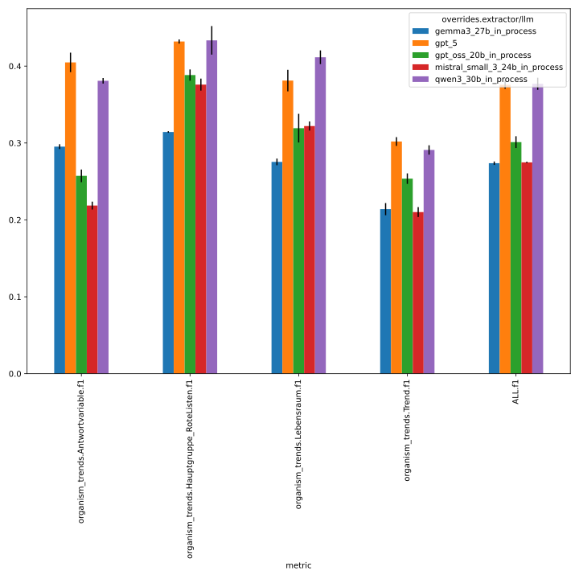
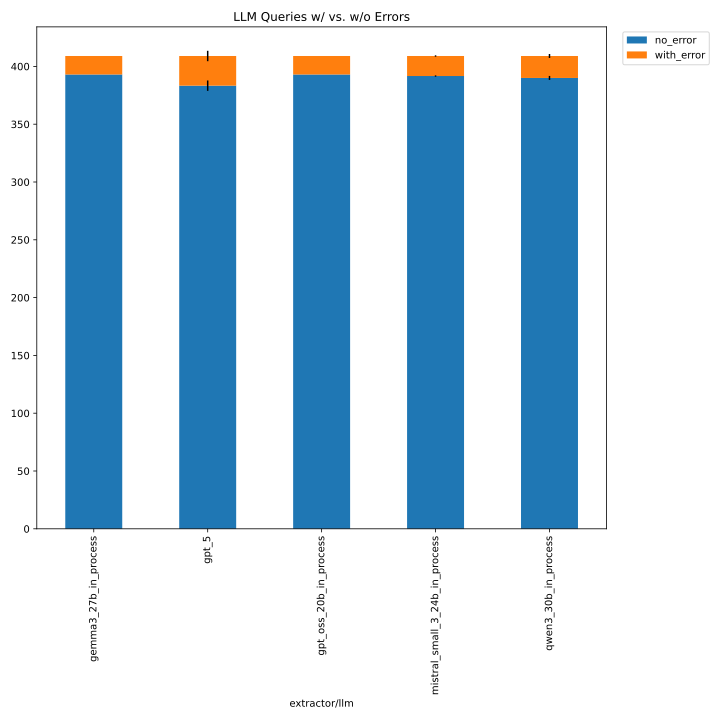

This folder contains the logs of the baseline experiments
conducted with the organism_trends schema and the simple extractor (default prompt template), across the following LLMs:

- gpt_oss_20b
- gemma3_27b
- gpt_5

See Issue https://github.com/DFKI-NLP/kibad-llm/issues/255  for more documentation.

Evaluation Notebook Parameters:
```python
NAME = "255_organism_trend_baseline_no_evi"
METRICS_DIR_PATTERN = "evaluate/**/2026-01-30_09-00-21/"
ERRORS_DIR_PATTERN = "evaluate/**/2026-01-30_09-19-41/"
# set any missing (default) values as column name -> value
FILL_NA = {}
```
IMPORTANT: Since #337, you need the following code to get the `metrics_df` and `errors_df` with this evaluation data correctly:
```python
from kibad_llm.utils.job_return import load

errors_df = (
    pd.DataFrame.from_records(
        load(
            directory=BASE_LOG_DIR / NAME,
            subdir_pattern=ERRORS_DIR_PATTERN,
            strip_id_keys=True,
            flatten=True,
            exclude_keys=EXCLUDE_KEYS,
        )
    )
    .fillna(FILL_NA)
    .fillna(0)
)
# display(errors_df)

metrics_df = pd.DataFrame.from_records(
    load(
        directory=BASE_LOG_DIR / NAME,
        subdir_pattern=METRICS_DIR_PATTERN,
        strip_id_keys=True,
        flatten=True,
        exclude_keys=EXCLUDE_KEYS,
    )
).fillna(FILL_NA)
# display(metrics_df)
```

Inference:

```
./run_in_process.sh -pa "H100-SLT,H100-Trails,H100,A100-80GB"  \
-u "-m kibad_llm.predict \
name=255_organism_trend_baseline_no_evi \
experiment/predict=organism_trends \
pdf_directory=/ds/text/kiba-d/dev-set-Wald-WVC \
extractor.return_reasoning=true \
extractor/llm=gpt_oss_20b_in_process,gemma3_27b_in_process,qwen3_30b_in_process,mistral_small_3_24b_in_process,gpt_5 \               
seed=42,1337,7331 \
--multirun"
```

Output folder: `/netscratch/hennig/kiba-d/logs/255_organism_trend_baseline_no_evi/predict/multiruns/2026-01-28_13-34-25`

Due to timeout, had to rerun the last seed for gpt_5:
```
./run_in_process.sh -pa "H100-SLT,H100-Trails,H100,A100-80GB" -u "-m kibad_llm.predict \
name=255_organism_trend_baseline_no_evi \
experiment/predict=organism_trends \
pdf_directory=/ds/text/kiba-d/dev-set-Wald-WVC \
extractor.return_reasoning=true extractor/llm=gpt_5 \
seed=7331 \
--multirun"
```

Output folder: `/netscratch/hennig/kiba-d/logs/255_organism_trend_baseline_no_evi/predict/multiruns/2026-01-29_13-43-56`


Evaluate F1:

```
uv run -m kibad_llm.evaluate \
name=255_organism_trend_baseline_no_evi \
experiment/evaluate=organism_trends_f1_micro_flat \
prediction_logs=[logs/255_organism_trend_baseline_no_evi/predict/multiruns/2026-01-28_13-34-25,logs/255_organism_trend_baseline_no_evi/predict/multiruns/2026-01-29_13-43-56] \
+hydra.callbacks.save_job_return.multirun_markdown_group_by=overrides.extractor/llm \
--multirun
```

<details>
<summary>Log output</summary>

```
[2026-01-30 09:00:30,923][HYDRA] Saving job_return in /netscratch/hennig/code/kibad-llm/logs/255_organism_trend_baseline_no_evi/evaluate/multiruns/2026-01-30_09-00-21/job_return_value.json                                               
[2026-01-30 09:00:30,931][HYDRA] Saving job_return in /netscratch/hennig/code/kibad-llm/logs/255_organism_trend_baseline_no_evi/evaluate/multiruns/2026-01-30_09-00-21/job_return_value.md                                                    
[2026-01-30 09:00:30,992][HYDRA] Contents of /netscratch/hennig/code/kibad-llm/logs/255_organism_trend_baseline_no_evi/evaluate/multiruns/2026-01-30_09-00-21/job_return_value.md:
``` 

| overrides.extractor/llm        |   ALL.f1.mean |   ALL.f1.std |   ALL.precision.mean |   ALL.precision.std |   ALL.recall.mean |   ALL.recall.std |   ALL.support.mean |   ALL.support.std |   AVG.f1.mean |   AVG.f1.std |   AVG.precision.mean |   AVG.precision.std |   AVG.recall.mean |   AVG.recall.std |   AVG.support.mean |   AVG.support.std |   organism_trends.Antwortvariable.f1.mean |   organism_trends.Antwortvariable.f1.std |   organism_trends.Antwortvariable.precision.mean |   organism_trends.Antwortvariable.precision.std |   organism_trends.Antwortvariable.recall.mean |   organism_trends.Antwortvariable.recall.std |   organism_trends.Antwortvariable.support.mean |   organism_trends.Antwortvariable.support.std |   organism_trends.Hauptgruppe_RoteListen.f1.mean |   organism_trends.Hauptgruppe_RoteListen.f1.std |   organism_trends.Hauptgruppe_RoteListen.precision.mean |   organism_trends.Hauptgruppe_RoteListen.precision.std |   organism_trends.Hauptgruppe_RoteListen.recall.mean |   organism_trends.Hauptgruppe_RoteListen.recall.std |   organism_trends.Hauptgruppe_RoteListen.support.mean |   organism_trends.Hauptgruppe_RoteListen.support.std |   organism_trends.Lebensraum.f1.mean |   organism_trends.Lebensraum.f1.std |   organism_trends.Lebensraum.precision.mean |   organism_trends.Lebensraum.precision.std |   organism_trends.Lebensraum.recall.mean |   organism_trends.Lebensraum.recall.std |   organism_trends.Lebensraum.support.mean |   organism_trends.Lebensraum.support.std |   organism_trends.Trend.f1.mean |   organism_trends.Trend.f1.std |   organism_trends.Trend.precision.mean |   organism_trends.Trend.precision.std |   organism_trends.Trend.recall.mean |   organism_trends.Trend.recall.std |   organism_trends.Trend.support.mean |   organism_trends.Trend.support.std |   prediction.job_return_value.time_extraction.mean |   prediction.job_return_value.time_extraction.std |   prediction.job_return_value.time_pdf_conversion.mean |   prediction.job_return_value.time_pdf_conversion.std | overrides.experiment/predict                              | overrides.extractor.return_reasoning   | overrides.name                                                                                                     | overrides.pdf_directory                                                                                      | overrides.seed         | prediction.job_return_value.branch   | prediction.job_return_value.commit_hash                                                                                              | prediction.job_return_value.is_dirty   | prediction.job_return_value.output_file                                                                                                                                                                                                                                                                                                                   | prediction.job_return_value.output_file_absolute                                                                                                                                                                                                                                                                                                                                                                                                                |
|:-------------------------------|--------------:|-------------:|---------------------:|--------------------:|------------------:|-----------------:|-------------------:|------------------:|--------------:|-------------:|---------------------:|--------------------:|------------------:|-----------------:|-------------------:|------------------:|------------------------------------------:|-----------------------------------------:|-------------------------------------------------:|------------------------------------------------:|----------------------------------------------:|---------------------------------------------:|-----------------------------------------------:|----------------------------------------------:|-------------------------------------------------:|------------------------------------------------:|--------------------------------------------------------:|-------------------------------------------------------:|-----------------------------------------------------:|----------------------------------------------------:|------------------------------------------------------:|-----------------------------------------------------:|-------------------------------------:|------------------------------------:|--------------------------------------------:|-------------------------------------------:|-----------------------------------------:|----------------------------------------:|------------------------------------------:|-----------------------------------------:|--------------------------------:|-------------------------------:|---------------------------------------:|--------------------------------------:|------------------------------------:|-----------------------------------:|-------------------------------------:|------------------------------------:|---------------------------------------------------:|--------------------------------------------------:|-------------------------------------------------------:|------------------------------------------------------:|:----------------------------------------------------------|:---------------------------------------|:-------------------------------------------------------------------------------------------------------------------|:-------------------------------------------------------------------------------------------------------------|:-----------------------|:-------------------------------------|:-------------------------------------------------------------------------------------------------------------------------------------|:---------------------------------------|:----------------------------------------------------------------------------------------------------------------------------------------------------------------------------------------------------------------------------------------------------------------------------------------------------------------------------------------------------------|:----------------------------------------------------------------------------------------------------------------------------------------------------------------------------------------------------------------------------------------------------------------------------------------------------------------------------------------------------------------------------------------------------------------------------------------------------------------|
| gemma3_27b_in_process          |         0.274 |        0.002 |                0.184 |               0.001 |             0.532 |            0.009 |                491 |                 0 |         0.275 |        0.003 |                0.185 |               0.001 |             0.537 |            0.008 |             122.75 |                 0 |                                     0.295 |                                    0.003 |                                            0.201 |                                           0.004 |                                         0.553 |                                        0.011 |                                            132 |                                             0 |                                            0.314 |                                           0.001 |                                                   0.213 |                                                  0.001 |                                                0.6   |                                               0     |                                                   115 |                                                    0 |                                0.275 |                               0.004 |                                       0.179 |                                      0.004 |                                    0.599 |                                   0.006 |                                       111 |                                        0 |                           0.214 |                          0.008 |                                  0.147 |                                 0.004 |                               0.395 |                              0.027 |                                  133 |                                   0 |                                            2095.17 |                                            10.253 |                                                  0.009 |                                                 0     | ['organism_trends', 'organism_trends']                    | ['True', 'True']                       | ['255_organism_trend_baseline_no_evi', '255_organism_trend_baseline_no_evi']                                       | ['/ds/text/kiba-d/dev-set-Wald-WVC', '/ds/text/kiba-d/dev-set-Wald-WVC']                                     | ['1337', '7331']       | ['main', 'main']                     | ['5ef34482e2f0e2c83bf9aac2319d36e912532e47', '5ef34482e2f0e2c83bf9aac2319d36e912532e47']                                             | [np.False_, np.False_]                 | ['predictions/255_organism_trend_baseline_no_evi/2026-01-28_13-34-25/2026-01-28_15-54-15_193033/predictions.jsonl', 'predictions/255_organism_trend_baseline_no_evi/2026-01-28_13-34-25/2026-01-28_16-31-12_480423/predictions.jsonl']                                                                                                                    | ['/netscratch/hennig/code/kibad-llm/predictions/255_organism_trend_baseline_no_evi/2026-01-28_13-34-25/2026-01-28_15-54-15_193033/predictions.jsonl', '/netscratch/hennig/code/kibad-llm/predictions/255_organism_trend_baseline_no_evi/2026-01-28_13-34-25/2026-01-28_16-31-12_480423/predictions.jsonl']                                                                                                                                                      |
| gpt_5                          |         0.376 |        0.005 |                0.253 |               0.004 |             0.73  |            0.01  |                491 |                 0 |         0.38  |        0.005 |                0.257 |               0.004 |             0.735 |            0.01  |             122.75 |                 0 |                                     0.405 |                                    0.013 |                                            0.283 |                                           0.009 |                                         0.712 |                                        0.026 |                                            132 |                                             0 |                                            0.432 |                                           0.003 |                                                   0.294 |                                                  0.003 |                                                0.814 |                                               0.005 |                                                   115 |                                                    0 |                                0.381 |                               0.014 |                                       0.251 |                                      0.011 |                                    0.793 |                                   0.009 |                                       111 |                                        0 |                           0.302 |                          0.006 |                                  0.199 |                                 0.004 |                               0.622 |                              0.009 |                                  133 |                                   0 |                                           15965.5  |                                          2702.41  |                                                  0.009 |                                                 0.005 | ['organism_trends', 'organism_trends', 'organism_trends'] | ['True', 'True', 'True']               | ['255_organism_trend_baseline_no_evi', '255_organism_trend_baseline_no_evi', '255_organism_trend_baseline_no_evi'] | ['/ds/text/kiba-d/dev-set-Wald-WVC', '/ds/text/kiba-d/dev-set-Wald-WVC', '/ds/text/kiba-d/dev-set-Wald-WVC'] | ['1337', '42', '7331'] | ['main', 'main', 'main']             | ['5ef34482e2f0e2c83bf9aac2319d36e912532e47', '5ef34482e2f0e2c83bf9aac2319d36e912532e47', '5ef34482e2f0e2c83bf9aac2319d36e912532e47'] | [np.False_, np.False_, np.False_]      | ['predictions/255_organism_trend_baseline_no_evi/2026-01-28_13-34-25/2026-01-29_05-11-50_865289/predictions.jsonl', 'predictions/255_organism_trend_baseline_no_evi/2026-01-28_13-34-25/2026-01-29_01-15-47_594876/predictions.jsonl', 'predictions/255_organism_trend_baseline_no_evi/2026-01-29_13-43-56/2026-01-29_13-43-56_770924/predictions.jsonl'] | ['/netscratch/hennig/code/kibad-llm/predictions/255_organism_trend_baseline_no_evi/2026-01-28_13-34-25/2026-01-29_05-11-50_865289/predictions.jsonl', '/netscratch/hennig/code/kibad-llm/predictions/255_organism_trend_baseline_no_evi/2026-01-28_13-34-25/2026-01-29_01-15-47_594876/predictions.jsonl', '/netscratch/hennig/code/kibad-llm/predictions/255_organism_trend_baseline_no_evi/2026-01-29_13-43-56/2026-01-29_13-43-56_770924/predictions.jsonl'] |
| gpt_oss_20b_in_process         |         0.301 |        0.008 |                0.202 |               0.005 |             0.592 |            0.018 |                491 |                 0 |         0.305 |        0.008 |                0.205 |               0.005 |             0.6   |            0.018 |             122.75 |                 0 |                                     0.257 |                                    0.008 |                                            0.181 |                                           0.005 |                                         0.444 |                                        0.017 |                                            132 |                                             0 |                                            0.388 |                                           0.007 |                                                   0.262 |                                                  0.005 |                                                0.754 |                                               0.013 |                                                   115 |                                                    0 |                                0.319 |                               0.019 |                                       0.211 |                                      0.012 |                                    0.655 |                                   0.044 |                                       111 |                                        0 |                           0.254 |                          0.007 |                                  0.165 |                                 0.005 |                               0.546 |                              0.016 |                                  133 |                                   0 |                                            2670.19 |                                            41.619 |                                                  0.008 |                                                 0.001 | ['organism_trends', 'organism_trends', 'organism_trends'] | ['True', 'True', 'True']               | ['255_organism_trend_baseline_no_evi', '255_organism_trend_baseline_no_evi', '255_organism_trend_baseline_no_evi'] | ['/ds/text/kiba-d/dev-set-Wald-WVC', '/ds/text/kiba-d/dev-set-Wald-WVC', '/ds/text/kiba-d/dev-set-Wald-WVC'] | ['1337', '42', '7331'] | ['main', 'main', 'main']             | ['7fa7aed7d04f991102207a57ba59854e6a496a93', 'b453e5d59d899f651be56b0ed8764693e3892db2', '5ef34482e2f0e2c83bf9aac2319d36e912532e47'] | [np.False_, np.False_, np.False_]      | ['predictions/255_organism_trend_baseline_no_evi/2026-01-28_13-34-25/2026-01-28_14-22-05_033669/predictions.jsonl', 'predictions/255_organism_trend_baseline_no_evi/2026-01-28_13-34-25/2026-01-28_13-34-28_714572/predictions.jsonl', 'predictions/255_organism_trend_baseline_no_evi/2026-01-28_13-34-25/2026-01-28_15-07-56_840288/predictions.jsonl'] | ['/netscratch/hennig/code/kibad-llm/predictions/255_organism_trend_baseline_no_evi/2026-01-28_13-34-25/2026-01-28_14-22-05_033669/predictions.jsonl', '/netscratch/hennig/code/kibad-llm/predictions/255_organism_trend_baseline_no_evi/2026-01-28_13-34-25/2026-01-28_13-34-28_714572/predictions.jsonl', '/netscratch/hennig/code/kibad-llm/predictions/255_organism_trend_baseline_no_evi/2026-01-28_13-34-25/2026-01-28_15-07-56_840288/predictions.jsonl'] |
| mistral_small_3_24b_in_process |         0.275 |        0.001 |                0.177 |               0.001 |             0.618 |            0.002 |                491 |                 0 |         0.282 |        0.001 |                0.182 |               0.001 |             0.629 |            0.003 |             122.75 |                 0 |                                     0.219 |                                    0.005 |                                            0.14  |                                           0.003 |                                         0.495 |                                        0.012 |                                            132 |                                             0 |                                            0.376 |                                           0.008 |                                                   0.246 |                                                  0.005 |                                                0.797 |                                               0.013 |                                                   115 |                                                    0 |                                0.322 |                               0.006 |                                       0.206 |                                      0.005 |                                    0.739 |                                   0     |                                       111 |                                        0 |                           0.21  |                          0.006 |                                  0.134 |                                 0.004 |                               0.486 |                              0.016 |                                  133 |                                   0 |                                            2248.57 |                                           128.247 |                                                  0.007 |                                                 0     | ['organism_trends', 'organism_trends', 'organism_trends'] | ['True', 'True', 'True']               | ['255_organism_trend_baseline_no_evi', '255_organism_trend_baseline_no_evi', '255_organism_trend_baseline_no_evi'] | ['/ds/text/kiba-d/dev-set-Wald-WVC', '/ds/text/kiba-d/dev-set-Wald-WVC', '/ds/text/kiba-d/dev-set-Wald-WVC'] | ['1337', '42', '7331'] | ['main', 'main', 'main']             | ['5ef34482e2f0e2c83bf9aac2319d36e912532e47', '5ef34482e2f0e2c83bf9aac2319d36e912532e47', '5ef34482e2f0e2c83bf9aac2319d36e912532e47'] | [np.False_, np.False_, np.False_]      | ['predictions/255_organism_trend_baseline_no_evi/2026-01-28_13-34-25/2026-01-29_00-00-50_655014/predictions.jsonl', 'predictions/255_organism_trend_baseline_no_evi/2026-01-28_13-34-25/2026-01-28_23-18-21_844688/predictions.jsonl', 'predictions/255_organism_trend_baseline_no_evi/2026-01-28_13-34-25/2026-01-29_00-38-07_951431/predictions.jsonl'] | ['/netscratch/hennig/code/kibad-llm/predictions/255_organism_trend_baseline_no_evi/2026-01-28_13-34-25/2026-01-29_00-00-50_655014/predictions.jsonl', '/netscratch/hennig/code/kibad-llm/predictions/255_organism_trend_baseline_no_evi/2026-01-28_13-34-25/2026-01-28_23-18-21_844688/predictions.jsonl', '/netscratch/hennig/code/kibad-llm/predictions/255_organism_trend_baseline_no_evi/2026-01-28_13-34-25/2026-01-29_00-38-07_951431/predictions.jsonl'] |
| qwen3_30b_in_process           |         0.377 |        0.008 |                0.261 |               0.007 |             0.679 |            0.007 |                491 |                 0 |         0.379 |        0.008 |                0.262 |               0.007 |             0.688 |            0.008 |             122.75 |                 0 |                                     0.381 |                                    0.004 |                                            0.276 |                                           0.004 |                                         0.614 |                                        0.008 |                                            132 |                                             0 |                                            0.433 |                                           0.019 |                                                   0.293 |                                                  0.015 |                                                0.838 |                                               0.031 |                                                   115 |                                                    0 |                                0.412 |                               0.009 |                                       0.28  |                                      0.008 |                                    0.778 |                                   0.005 |                                       111 |                                        0 |                           0.291 |                          0.006 |                                  0.201 |                                 0.005 |                               0.524 |                              0.004 |                                  133 |                                   0 |                                            7333.85 |                                           166.472 |                                                  0.007 |                                                 0.001 | ['organism_trends', 'organism_trends', 'organism_trends'] | ['True', 'True', 'True']               | ['255_organism_trend_baseline_no_evi', '255_organism_trend_baseline_no_evi', '255_organism_trend_baseline_no_evi'] | ['/ds/text/kiba-d/dev-set-Wald-WVC', '/ds/text/kiba-d/dev-set-Wald-WVC', '/ds/text/kiba-d/dev-set-Wald-WVC'] | ['1337', '42', '7331'] | ['main', 'main', 'main']             | ['5ef34482e2f0e2c83bf9aac2319d36e912532e47', '5ef34482e2f0e2c83bf9aac2319d36e912532e47', '5ef34482e2f0e2c83bf9aac2319d36e912532e47'] | [np.False_, np.False_, np.False_]      | ['predictions/255_organism_trend_baseline_no_evi/2026-01-28_13-34-25/2026-01-28_19-08-15_225976/predictions.jsonl', 'predictions/255_organism_trend_baseline_no_evi/2026-01-28_13-34-25/2026-01-28_17-07-44_956840/predictions.jsonl', 'predictions/255_organism_trend_baseline_no_evi/2026-01-28_13-34-25/2026-01-28_21-14-14_953436/predictions.jsonl'] | ['/netscratch/hennig/code/kibad-llm/predictions/255_organism_trend_baseline_no_evi/2026-01-28_13-34-25/2026-01-28_19-08-15_225976/predictions.jsonl', '/netscratch/hennig/code/kibad-llm/predictions/255_organism_trend_baseline_no_evi/2026-01-28_13-34-25/2026-01-28_17-07-44_956840/predictions.jsonl', '/netscratch/hennig/code/kibad-llm/predictions/255_organism_trend_baseline_no_evi/2026-01-28_13-34-25/2026-01-28_21-14-14_953436/predictions.jsonl'] |


</details>



Evaluate errors

```
uv run -m kibad_llm.evaluate \
name=255_organism_trend_baseline_no_evi \
experiment/evaluate=prediction_errors \
prediction_logs=[logs/255_organism_trend_baseline_no_evi/predict/multiruns/2026-01-28_13-34-25,logs/255_organism_trend_baseline_no_evi/predict/multiruns/2026-01-29_13-43-56] \
+hydra.callbacks.save_job_return.multirun_markdown_group_by=overrides.extractor/llm \
--multirun
```

<details>
<summary>Log output</summary>

```
[2026-01-30 09:19:49,136][HYDRA] Saving job_return in /netscratch/hennig/code/kibad-llm/logs/255_organism_trend_baseline_no_evi/evaluate/multiruns/2026-01-30_09-19-41/job_return_value.json                                                  
[2026-01-30 09:19:49,142][HYDRA] Saving job_return in /netscratch/hennig/code/kibad-llm/logs/255_organism_trend_baseline_no_evi/evaluate/multiruns/2026-01-30_09-19-41/job_return_value.md                                                    
[2026-01-30 09:19:49,193][HYDRA] Contents of /netscratch/hennig/code/kibad-llm/logs/255_organism_trend_baseline_no_evi/evaluate/multiruns/2026-01-30_09-19-41/job_return_value.md: 
``` 

| overrides.extractor/llm        |   JSONDecodeError.mean |   JSONDecodeError.std |   MissingResponseContentError.mean |   MissingResponseContentError.std |   ReasoningExtractionError.mean |   ReasoningExtractionError.std |   ValueError.mean |   ValueError.std |   no_error.mean |   no_error.std |   prediction.job_return_value.time_extraction.mean |   prediction.job_return_value.time_extraction.std |   prediction.job_return_value.time_pdf_conversion.mean |   prediction.job_return_value.time_pdf_conversion.std |   with_error.mean |   with_error.std | overrides.experiment/predict                              | overrides.extractor.return_reasoning   | overrides.name                                                                                                     | overrides.pdf_directory                                                                                      | overrides.seed         | prediction.job_return_value.branch   | prediction.job_return_value.commit_hash                                                                                              | prediction.job_return_value.is_dirty   | prediction.job_return_value.output_file                                                                                                                                                                                                                                                                                                                   | prediction.job_return_value.output_file_absolute                                                                                                                                                                                                                                                                                                                                                                                                                |
|:-------------------------------|-----------------------:|----------------------:|-----------------------------------:|----------------------------------:|--------------------------------:|-------------------------------:|------------------:|-----------------:|----------------:|---------------:|---------------------------------------------------:|--------------------------------------------------:|-------------------------------------------------------:|------------------------------------------------------:|------------------:|-----------------:|:----------------------------------------------------------|:---------------------------------------|:-------------------------------------------------------------------------------------------------------------------|:-------------------------------------------------------------------------------------------------------------|:-----------------------|:-------------------------------------|:-------------------------------------------------------------------------------------------------------------------------------------|:---------------------------------------|:----------------------------------------------------------------------------------------------------------------------------------------------------------------------------------------------------------------------------------------------------------------------------------------------------------------------------------------------------------|:----------------------------------------------------------------------------------------------------------------------------------------------------------------------------------------------------------------------------------------------------------------------------------------------------------------------------------------------------------------------------------------------------------------------------------------------------------------|
| gemma3_27b_in_process          |                  0     |                 0     |                              0     |                             0     |                           0     |                          0     |                16 |                0 |         393     |          0     |                                            2095.17 |                                            10.253 |                                                  0.009 |                                                 0     |            16     |            0     | ['organism_trends', 'organism_trends']                    | ['True', 'True']                       | ['255_organism_trend_baseline_no_evi', '255_organism_trend_baseline_no_evi']                                       | ['/ds/text/kiba-d/dev-set-Wald-WVC', '/ds/text/kiba-d/dev-set-Wald-WVC']                                     | ['1337', '7331']       | ['main', 'main']                     | ['5ef34482e2f0e2c83bf9aac2319d36e912532e47', '5ef34482e2f0e2c83bf9aac2319d36e912532e47']                                             | [np.False_, np.False_]                 | ['predictions/255_organism_trend_baseline_no_evi/2026-01-28_13-34-25/2026-01-28_15-54-15_193033/predictions.jsonl', 'predictions/255_organism_trend_baseline_no_evi/2026-01-28_13-34-25/2026-01-28_16-31-12_480423/predictions.jsonl']                                                                                                                    | ['/netscratch/hennig/code/kibad-llm/predictions/255_organism_trend_baseline_no_evi/2026-01-28_13-34-25/2026-01-28_15-54-15_193033/predictions.jsonl', '/netscratch/hennig/code/kibad-llm/predictions/255_organism_trend_baseline_no_evi/2026-01-28_13-34-25/2026-01-28_16-31-12_480423/predictions.jsonl']                                                                                                                                                      |
| gpt_5                          |                  0     |                 0     |                              0     |                             0     |                          17.667 |                          4.509 |                 8 |                0 |         383.333 |          4.509 |                                           15965.5  |                                          2702.41  |                                                  0.009 |                                                 0.005 |            25.667 |            4.509 | ['organism_trends', 'organism_trends', 'organism_trends'] | ['True', 'True', 'True']               | ['255_organism_trend_baseline_no_evi', '255_organism_trend_baseline_no_evi', '255_organism_trend_baseline_no_evi'] | ['/ds/text/kiba-d/dev-set-Wald-WVC', '/ds/text/kiba-d/dev-set-Wald-WVC', '/ds/text/kiba-d/dev-set-Wald-WVC'] | ['1337', '42', '7331'] | ['main', 'main', 'main']             | ['5ef34482e2f0e2c83bf9aac2319d36e912532e47', '5ef34482e2f0e2c83bf9aac2319d36e912532e47', '5ef34482e2f0e2c83bf9aac2319d36e912532e47'] | [np.False_, np.False_, np.False_]      | ['predictions/255_organism_trend_baseline_no_evi/2026-01-28_13-34-25/2026-01-29_05-11-50_865289/predictions.jsonl', 'predictions/255_organism_trend_baseline_no_evi/2026-01-28_13-34-25/2026-01-29_01-15-47_594876/predictions.jsonl', 'predictions/255_organism_trend_baseline_no_evi/2026-01-29_13-43-56/2026-01-29_13-43-56_770924/predictions.jsonl'] | ['/netscratch/hennig/code/kibad-llm/predictions/255_organism_trend_baseline_no_evi/2026-01-28_13-34-25/2026-01-29_05-11-50_865289/predictions.jsonl', '/netscratch/hennig/code/kibad-llm/predictions/255_organism_trend_baseline_no_evi/2026-01-28_13-34-25/2026-01-29_01-15-47_594876/predictions.jsonl', '/netscratch/hennig/code/kibad-llm/predictions/255_organism_trend_baseline_no_evi/2026-01-29_13-43-56/2026-01-29_13-43-56_770924/predictions.jsonl'] |
| gpt_oss_20b_in_process         |                  0     |                 0     |                              0     |                             0     |                           0     |                          0     |                16 |                0 |         393     |          0     |                                            2670.19 |                                            41.619 |                                                  0.008 |                                                 0.001 |            16     |            0     | ['organism_trends', 'organism_trends', 'organism_trends'] | ['True', 'True', 'True']               | ['255_organism_trend_baseline_no_evi', '255_organism_trend_baseline_no_evi', '255_organism_trend_baseline_no_evi'] | ['/ds/text/kiba-d/dev-set-Wald-WVC', '/ds/text/kiba-d/dev-set-Wald-WVC', '/ds/text/kiba-d/dev-set-Wald-WVC'] | ['1337', '42', '7331'] | ['main', 'main', 'main']             | ['7fa7aed7d04f991102207a57ba59854e6a496a93', 'b453e5d59d899f651be56b0ed8764693e3892db2', '5ef34482e2f0e2c83bf9aac2319d36e912532e47'] | [np.False_, np.False_, np.False_]      | ['predictions/255_organism_trend_baseline_no_evi/2026-01-28_13-34-25/2026-01-28_14-22-05_033669/predictions.jsonl', 'predictions/255_organism_trend_baseline_no_evi/2026-01-28_13-34-25/2026-01-28_13-34-28_714572/predictions.jsonl', 'predictions/255_organism_trend_baseline_no_evi/2026-01-28_13-34-25/2026-01-28_15-07-56_840288/predictions.jsonl'] | ['/netscratch/hennig/code/kibad-llm/predictions/255_organism_trend_baseline_no_evi/2026-01-28_13-34-25/2026-01-28_14-22-05_033669/predictions.jsonl', '/netscratch/hennig/code/kibad-llm/predictions/255_organism_trend_baseline_no_evi/2026-01-28_13-34-25/2026-01-28_13-34-28_714572/predictions.jsonl', '/netscratch/hennig/code/kibad-llm/predictions/255_organism_trend_baseline_no_evi/2026-01-28_13-34-25/2026-01-28_15-07-56_840288/predictions.jsonl'] |
| mistral_small_3_24b_in_process |                  1.333 |                 0.577 |                              0     |                             0     |                           0     |                          0     |                16 |                0 |         391.667 |          0.577 |                                            2248.57 |                                           128.247 |                                                  0.007 |                                                 0     |            17.333 |            0.577 | ['organism_trends', 'organism_trends', 'organism_trends'] | ['True', 'True', 'True']               | ['255_organism_trend_baseline_no_evi', '255_organism_trend_baseline_no_evi', '255_organism_trend_baseline_no_evi'] | ['/ds/text/kiba-d/dev-set-Wald-WVC', '/ds/text/kiba-d/dev-set-Wald-WVC', '/ds/text/kiba-d/dev-set-Wald-WVC'] | ['1337', '42', '7331'] | ['main', 'main', 'main']             | ['5ef34482e2f0e2c83bf9aac2319d36e912532e47', '5ef34482e2f0e2c83bf9aac2319d36e912532e47', '5ef34482e2f0e2c83bf9aac2319d36e912532e47'] | [np.False_, np.False_, np.False_]      | ['predictions/255_organism_trend_baseline_no_evi/2026-01-28_13-34-25/2026-01-29_00-00-50_655014/predictions.jsonl', 'predictions/255_organism_trend_baseline_no_evi/2026-01-28_13-34-25/2026-01-28_23-18-21_844688/predictions.jsonl', 'predictions/255_organism_trend_baseline_no_evi/2026-01-28_13-34-25/2026-01-29_00-38-07_951431/predictions.jsonl'] | ['/netscratch/hennig/code/kibad-llm/predictions/255_organism_trend_baseline_no_evi/2026-01-28_13-34-25/2026-01-29_00-00-50_655014/predictions.jsonl', '/netscratch/hennig/code/kibad-llm/predictions/255_organism_trend_baseline_no_evi/2026-01-28_13-34-25/2026-01-28_23-18-21_844688/predictions.jsonl', '/netscratch/hennig/code/kibad-llm/predictions/255_organism_trend_baseline_no_evi/2026-01-28_13-34-25/2026-01-29_00-38-07_951431/predictions.jsonl'] |
| qwen3_30b_in_process           |                  1     |                 0     |                              1.667 |                             1.155 |                           0     |                          0     |                17 |                0 |         390     |          1.732 |                                            7333.85 |                                           166.472 |                                                  0.007 |                                                 0.001 |            19     |            1.732 | ['organism_trends', 'organism_trends', 'organism_trends'] | ['True', 'True', 'True']               | ['255_organism_trend_baseline_no_evi', '255_organism_trend_baseline_no_evi', '255_organism_trend_baseline_no_evi'] | ['/ds/text/kiba-d/dev-set-Wald-WVC', '/ds/text/kiba-d/dev-set-Wald-WVC', '/ds/text/kiba-d/dev-set-Wald-WVC'] | ['1337', '42', '7331'] | ['main', 'main', 'main']             | ['5ef34482e2f0e2c83bf9aac2319d36e912532e47', '5ef34482e2f0e2c83bf9aac2319d36e912532e47', '5ef34482e2f0e2c83bf9aac2319d36e912532e47'] | [np.False_, np.False_, np.False_]      | ['predictions/255_organism_trend_baseline_no_evi/2026-01-28_13-34-25/2026-01-28_19-08-15_225976/predictions.jsonl', 'predictions/255_organism_trend_baseline_no_evi/2026-01-28_13-34-25/2026-01-28_17-07-44_956840/predictions.jsonl', 'predictions/255_organism_trend_baseline_no_evi/2026-01-28_13-34-25/2026-01-28_21-14-14_953436/predictions.jsonl'] | ['/netscratch/hennig/code/kibad-llm/predictions/255_organism_trend_baseline_no_evi/2026-01-28_13-34-25/2026-01-28_19-08-15_225976/predictions.jsonl', '/netscratch/hennig/code/kibad-llm/predictions/255_organism_trend_baseline_no_evi/2026-01-28_13-34-25/2026-01-28_17-07-44_956840/predictions.jsonl', '/netscratch/hennig/code/kibad-llm/predictions/255_organism_trend_baseline_no_evi/2026-01-28_13-34-25/2026-01-28_21-14-14_953436/predictions.jsonl'] |


</details>

