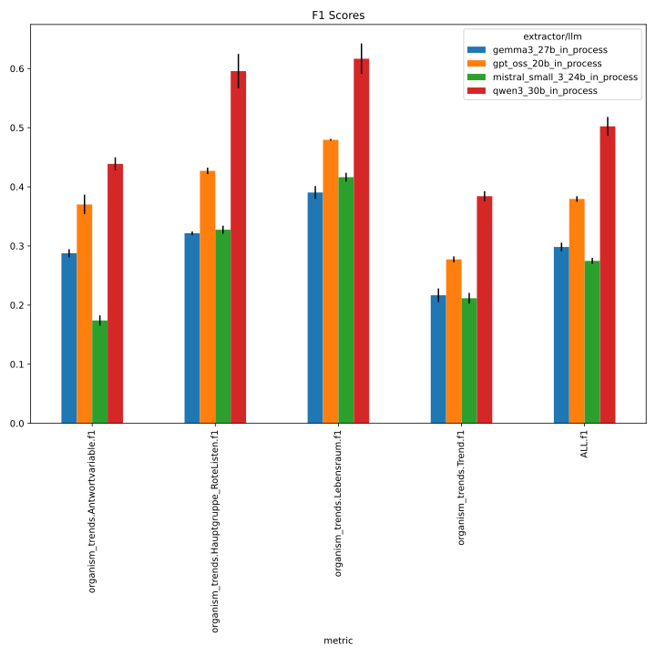
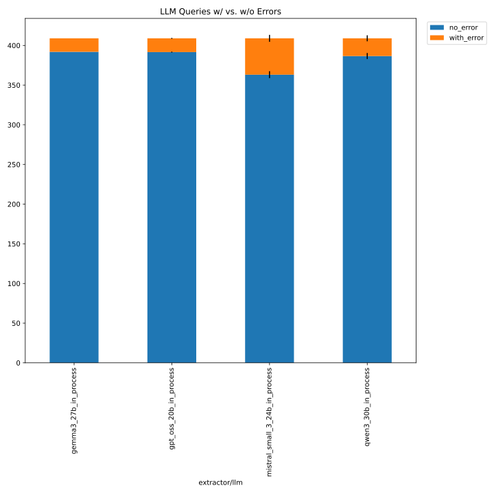
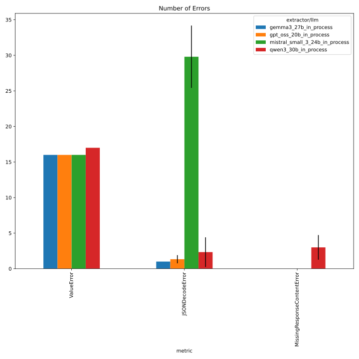
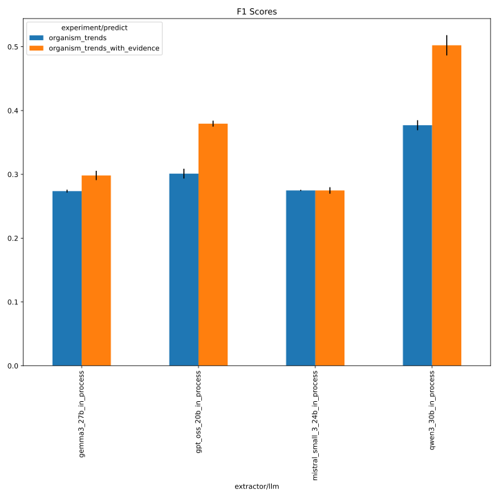
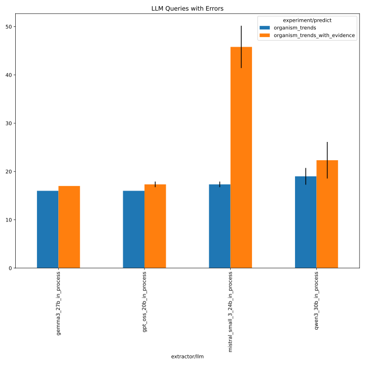
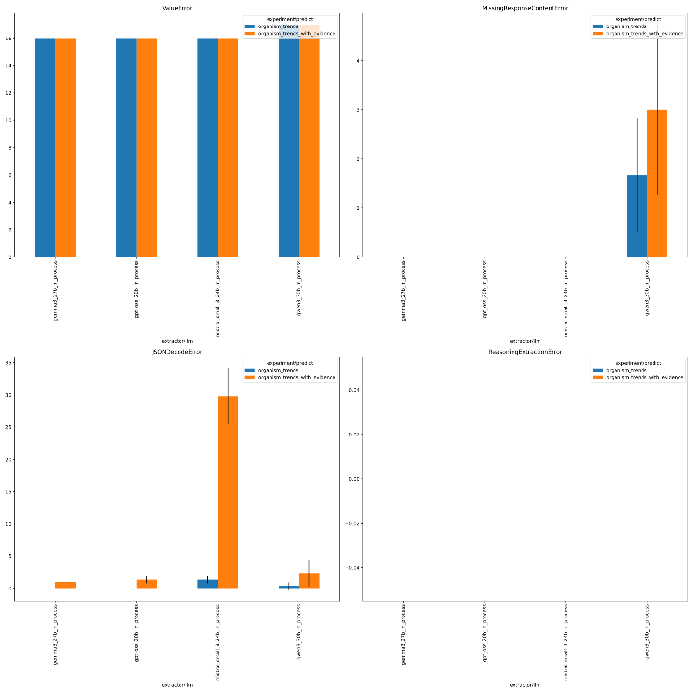

# 257_organism_trends_v1_with_evi

This folder contains the logs of the organism trend experiments with an improved prompt template (v1) 
and evidence retrieval, across the following LLMs:

- gpt_oss_20b
- gemma3_27b
- qwen3_30b
- mistral_small_3_24b

See https://github.com/DFKI-NLP/kibad-llm/issues/257 and https://github.com/DFKI-NLP/kibad-llm/pull/338 for more documentation.

## Notebook Parameters

### Just this experiment

```python
NAME = "257_organism_trends_v1_with_evi"

# used to group the data
INDEX_COLUMNS = ["prediction.overrides.extractor/llm"]
PLOT_KWARGS = {
    # can be either "metric" or one of the INDEX_COLUMNS (or multiple of them)
    "xgroup": "prediction.overrides.extractor/llm",
    # add any more arguments passed to pd.DataFrame.plot
}
```





### comparison with baseline
```python
NAME = "257_organism_trends_v1_with_evi"
METRICS_DIR_PATTERN = [
    "evaluate/**/2026-02-02_10-48-14/",
    "../255_organism_trend_baseline_no_evi/evaluate/**/2026-02-02_11-36-38/",
]
ERRORS_DIR_PATTERN = [
    "evaluate/**/2026-02-02_10-48-14/",
    "../255_organism_trend_baseline_no_evi/evaluate/**/2026-02-02_11-37-16/",
]

# used to group the data
INDEX_COLUMNS = ["prediction.overrides.extractor/llm"]
PLOT_KWARGS = {
    # can be either "metric" or one of the INDEX_COLUMNS (or multiple of them)
    "xgroup": "prediction.overrides.extractor/llm",
    # add any more arguments passed to pd.DataFrame.plot
    "create_subplot_for_each": "metric",
    "subplot_columns": 2,
}
FILL_NA = {}

```
IMPORTANT: Since #337, you need the following code to get the `metrics_df` and `errors_df` with this evaluation data correctly:
```python
from kibad_llm.utils.job_return import load

errors_df = (
    pd.DataFrame.from_records(
        load(
            directory=BASE_LOG_DIR / NAME,
            subdir_pattern=ERRORS_DIR_PATTERN,
            strip_id_keys=True,
            flatten=True,
            exclude_keys=EXCLUDE_KEYS,
        )
    )
    .fillna(FILL_NA)
    .fillna(0)
)
# display(errors_df)

metrics_df = pd.DataFrame.from_records(
    load(
        directory=BASE_LOG_DIR / NAME,
        subdir_pattern=METRICS_DIR_PATTERN,
        strip_id_keys=True,
        flatten=True,
        exclude_keys=EXCLUDE_KEYS,
    )
).fillna(FILL_NA)
# display(metrics_df)
```

**IMPORTANT: This requires some filtering of the data, since the other experiments contain multiple data points for llms other than gpt5.** Do this:
```python
mask = (metrics_df["overrides.extractor/llm"] == "gpt_5") | (
    metrics_df["prediction.job_return_value.branch"] != "main"
)
metrics_df = metrics_df[mask]
```
and similarly for errors_df:
```python
mask = (errors_df["overrides.extractor/llm"] == "gpt_5") | (
    errors_df["prediction.job_return_value.branch"] != "main"
)
errors_df = errors_df[mask]
```
before plotting.








## Inference

Run with new set of models:

- same setup as #255 
- use name=257_organism_trends_v1_with_evi
- but with new prompt template (organism_trend_v1_with_evidence)
- and with evidence


```bash
./run_in_process.sh -pa "H100-SLT,H100-Trails,H100,A100-80GB" \
-u "-m kibad_llm.predict \
name=257_organism_trends_v1_with_evi \
experiment/predict=organism_trends_with_evidence \
pdf_directory=/ds/text/kiba-d/dev-set-Wald-WVC \
extractor.return_reasoning=true extractor/llm=gpt_oss_20b_in_process,gemma3_27b_in_process,qwen3_30b_in_process,mistral_small_3_24b_in_process,gpt_5 \
seed=42,1337,7331 \
--multirun"
```  

Output folder: `/netscratch/hennig/code/kibad-llm/logs/257_organism_trends_v1_with_evi/pred
ict/multiruns/2026-01-28_13-51-36`

Due to timeouts, this run had to be restarted starting with run 11  (mistral, first seed). Excluded gpt_5 due to budget constraints.

```bash
./run_in_process.sh -pa "H100-SLT,H100-Trails,H100,A100-80GB" \
-u "-m kibad_llm.predict \
name=257_organism_trends_v1_with_evi \
experiment/predict=organism_trends_with_evidence \
pdf_directory=/ds/text/kiba-d/dev-set-Wald-WVC \
extractor.return_reasoning=true extractor/llm=mistral_small_3_24b_in_process \
seed=42,1337,7331 \
--multirun"
```  

Output folder: `/netscratch/hennig/code/kibad-llm/logs/257_organism_trends_v1_with_evi/pred
ict/multiruns/2026-01-30_09-16-13`

## Evaluate F1:

```
uv run -m kibad_llm.evaluate \
name=257_organism_trends_v1_with_evi \
experiment/evaluate=organism_trends_f1_micro_flat \
prediction_logs=[logs/257_organism_trends_v1_with_evi/predict/multiruns/2026-01-28_13-51-36,logs/257_organism_trends_v1_with_evi/predict/multiruns/2026-01-30_09-16-13] \
+hydra.callbacks.save_job_return.multirun_markdown_group_by=prediction.overrides.extractor/llm \
--multirun
```

<details>
<summary>Log output</summary>

```
[2026-02-02 10:48:26,979][HYDRA] Saving job_return in /netscratch/hennig/code/kibad-llm/logs/257_organism_trends_v1_with_evi/evaluate/multiruns/2026-02-02_10-48-14/job_return_value.json       
[2026-02-02 10:48:26,987][HYDRA] Saving job_return in /netscratch/hennig/code/kibad-llm/logs/257_organism_trends_v1_with_evi/evaluate/multiruns/2026-02-02_10-48-14/job_return_value.md         
[2026-02-02 10:48:27,174][HYDRA] Contents of /netscratch/hennig/code/kibad-llm/logs/257_organism_trends_v1_with_evi/evaluate/multiruns/2026-02-02_10-48-14/job_return_value.md:
``` 

| prediction.overrides.extractor/llm   |   ALL.f1.mean |   ALL.f1.std |   ALL.precision.mean |   ALL.precision.std |   ALL.recall.mean |   ALL.recall.std |   ALL.support.mean |   ALL.support.std |   AVG.f1.mean |   AVG.f1.std |   AVG.precision.mean |   AVG.precision.std |   AVG.recall.mean |   AVG.recall.std |   AVG.support.mean |   AVG.support.std |   organism_trends.Antwortvariable.f1.mean |   organism_trends.Antwortvariable.f1.std |   organism_trends.Antwortvariable.precision.mean |   organism_trends.Antwortvariable.precision.std |   organism_trends.Antwortvariable.recall.mean |   organism_trends.Antwortvariable.recall.std |   organism_trends.Antwortvariable.support.mean |   organism_trends.Antwortvariable.support.std |   organism_trends.Hauptgruppe_RoteListen.f1.mean |   organism_trends.Hauptgruppe_RoteListen.f1.std |   organism_trends.Hauptgruppe_RoteListen.precision.mean |   organism_trends.Hauptgruppe_RoteListen.precision.std |   organism_trends.Hauptgruppe_RoteListen.recall.mean |   organism_trends.Hauptgruppe_RoteListen.recall.std |   organism_trends.Hauptgruppe_RoteListen.support.mean |   organism_trends.Hauptgruppe_RoteListen.support.std |   organism_trends.Lebensraum.f1.mean |   organism_trends.Lebensraum.f1.std |   organism_trends.Lebensraum.precision.mean |   organism_trends.Lebensraum.precision.std |   organism_trends.Lebensraum.recall.mean |   organism_trends.Lebensraum.recall.std |   organism_trends.Lebensraum.support.mean |   organism_trends.Lebensraum.support.std |   organism_trends.Trend.f1.mean |   organism_trends.Trend.f1.std |   organism_trends.Trend.precision.mean |   organism_trends.Trend.precision.std |   organism_trends.Trend.recall.mean |   organism_trends.Trend.recall.std |   organism_trends.Trend.support.mean |   organism_trends.Trend.support.std |   prediction.job_return_value.time_extraction.mean |   prediction.job_return_value.time_extraction.std |   prediction.job_return_value.time_pdf_conversion.mean |   prediction.job_return_value.time_pdf_conversion.std | overrides.dataset.predictions.log                                                                                                                                                                                                                                                                                                                                                                                 | overrides.experiment/evaluate                                                                                                                                         | overrides.name                                                                                                                                                                  | overrides.prediction_logs                                                                                                                                                                                                                                                                                                                                                                                                                                                                                                                                                                                                                                                                                                                                                                               | prediction.job_return_value.branch       | prediction.job_return_value.commit_hash                                                                                                                                                                                      | prediction.job_return_value.is_dirty                    | prediction.job_return_value.output_file                                                                                                                                                                                                                                                                                                                                                                                                                                                                                                                                          | prediction.job_return_value.output_file_absolute                                                                                                                                                                                                                                                                                                                                                                                                                                                                                                                                                                                                                                                                                                           | prediction.overrides.experiment/predict                                                                                                                               | prediction.overrides.extractor.return_reasoning   | prediction.overrides.name                                                                                                                                                       | prediction.overrides.pdf_directory                                                                                                                                                   | prediction.overrides.seed            |
|:-------------------------------------|--------------:|-------------:|---------------------:|--------------------:|------------------:|-----------------:|-------------------:|------------------:|--------------:|-------------:|---------------------:|--------------------:|------------------:|-----------------:|-------------------:|------------------:|------------------------------------------:|-----------------------------------------:|-------------------------------------------------:|------------------------------------------------:|----------------------------------------------:|---------------------------------------------:|-----------------------------------------------:|----------------------------------------------:|-------------------------------------------------:|------------------------------------------------:|--------------------------------------------------------:|-------------------------------------------------------:|-----------------------------------------------------:|----------------------------------------------------:|------------------------------------------------------:|-----------------------------------------------------:|-------------------------------------:|------------------------------------:|--------------------------------------------:|-------------------------------------------:|-----------------------------------------:|----------------------------------------:|------------------------------------------:|-----------------------------------------:|--------------------------------:|-------------------------------:|---------------------------------------:|--------------------------------------:|------------------------------------:|-----------------------------------:|-------------------------------------:|------------------------------------:|---------------------------------------------------:|--------------------------------------------------:|-------------------------------------------------------:|------------------------------------------------------:|:------------------------------------------------------------------------------------------------------------------------------------------------------------------------------------------------------------------------------------------------------------------------------------------------------------------------------------------------------------------------------------------------------------------|:----------------------------------------------------------------------------------------------------------------------------------------------------------------------|:--------------------------------------------------------------------------------------------------------------------------------------------------------------------------------|:--------------------------------------------------------------------------------------------------------------------------------------------------------------------------------------------------------------------------------------------------------------------------------------------------------------------------------------------------------------------------------------------------------------------------------------------------------------------------------------------------------------------------------------------------------------------------------------------------------------------------------------------------------------------------------------------------------------------------------------------------------------------------------------------------------|:-----------------------------------------|:-----------------------------------------------------------------------------------------------------------------------------------------------------------------------------------------------------------------------------|:--------------------------------------------------------|:---------------------------------------------------------------------------------------------------------------------------------------------------------------------------------------------------------------------------------------------------------------------------------------------------------------------------------------------------------------------------------------------------------------------------------------------------------------------------------------------------------------------------------------------------------------------------------|:-----------------------------------------------------------------------------------------------------------------------------------------------------------------------------------------------------------------------------------------------------------------------------------------------------------------------------------------------------------------------------------------------------------------------------------------------------------------------------------------------------------------------------------------------------------------------------------------------------------------------------------------------------------------------------------------------------------------------------------------------------------|:----------------------------------------------------------------------------------------------------------------------------------------------------------------------|:--------------------------------------------------|:--------------------------------------------------------------------------------------------------------------------------------------------------------------------------------|:-------------------------------------------------------------------------------------------------------------------------------------------------------------------------------------|:-------------------------------------|
| gemma3_27b_in_process                |         0.298 |        0.007 |                0.193 |               0.005 |             0.659 |            0.018 |                491 |                 0 |         0.304 |        0.007 |                0.197 |               0.005 |             0.668 |            0.018 |             122.75 |                 0 |                                     0.288 |                                    0.007 |                                            0.188 |                                           0.004 |                                         0.614 |                                        0.02  |                                            132 |                                             0 |                                            0.322 |                                           0.003 |                                                   0.204 |                                                  0.003 |                                                0.762 |                                               0.01  |                                                   115 |                                                    0 |                                0.39  |                               0.011 |                                       0.257 |                                      0.008 |                                    0.808 |                                   0.019 |                                       111 |                                        0 |                           0.217 |                          0.011 |                                  0.139 |                                 0.007 |                               0.489 |                              0.027 |                                  133 |                                   0 |                                            4973.76 |                                            46.392 |                                                  0.009 |                                                 0.002 | ['logs/257_organism_trends_v1_with_evi/predict/multiruns/2026-01-28_13-51-36/3', 'logs/257_organism_trends_v1_with_evi/predict/multiruns/2026-01-28_13-51-36/4', 'logs/257_organism_trends_v1_with_evi/predict/multiruns/2026-01-28_13-51-36/5']                                                                                                                                                                  | ['organism_trends_f1_micro_flat', 'organism_trends_f1_micro_flat', 'organism_trends_f1_micro_flat']                                                                   | ['257_organism_trends_v1_with_evi', '257_organism_trends_v1_with_evi', '257_organism_trends_v1_with_evi']                                                                       | ['[logs/257_organism_trends_v1_with_evi/predict/multiruns/2026-01-28_13-51-36,logs/257_organism_trends_v1_with_evi/predict/multiruns/2026-01-30_09-16-13]', '[logs/257_organism_trends_v1_with_evi/predict/multiruns/2026-01-28_13-51-36,logs/257_organism_trends_v1_with_evi/predict/multiruns/2026-01-30_09-16-13]', '[logs/257_organism_trends_v1_with_evi/predict/multiruns/2026-01-28_13-51-36,logs/257_organism_trends_v1_with_evi/predict/multiruns/2026-01-30_09-16-13]']                                                                                                                                                                                                                                                                                                                       | ['main', 'main', 'main']                 | ['5ef34482e2f0e2c83bf9aac2319d36e912532e47', '5ef34482e2f0e2c83bf9aac2319d36e912532e47', '5ef34482e2f0e2c83bf9aac2319d36e912532e47']                                                                                         | [np.False_, np.False_, np.False_]                       | ['predictions/257_organism_trends_v1_with_evi/2026-01-28_13-51-36/2026-01-28_17-42-43_160474/predictions.jsonl', 'predictions/257_organism_trends_v1_with_evi/2026-01-28_13-51-36/2026-01-28_19-08-10_065106/predictions.jsonl', 'predictions/257_organism_trends_v1_with_evi/2026-01-28_13-51-36/2026-01-28_20-32-46_528900/predictions.jsonl']                                                                                                                                                                                                                                 | ['/netscratch/hennig/code/kibad-llm/predictions/257_organism_trends_v1_with_evi/2026-01-28_13-51-36/2026-01-28_17-42-43_160474/predictions.jsonl', '/netscratch/hennig/code/kibad-llm/predictions/257_organism_trends_v1_with_evi/2026-01-28_13-51-36/2026-01-28_19-08-10_065106/predictions.jsonl', '/netscratch/hennig/code/kibad-llm/predictions/257_organism_trends_v1_with_evi/2026-01-28_13-51-36/2026-01-28_20-32-46_528900/predictions.jsonl']                                                                                                                                                                                                                                                                                                     | ['organism_trends_with_evidence', 'organism_trends_with_evidence', 'organism_trends_with_evidence']                                                                   | ['True', 'True', 'True']                          | ['257_organism_trends_v1_with_evi', '257_organism_trends_v1_with_evi', '257_organism_trends_v1_with_evi']                                                                       | ['/ds/text/kiba-d/dev-set-Wald-WVC', '/ds/text/kiba-d/dev-set-Wald-WVC', '/ds/text/kiba-d/dev-set-Wald-WVC']                                                                         | ['42', '1337', '7331']               |
| gpt_oss_20b_in_process               |         0.379 |        0.005 |                0.272 |               0.005 |             0.627 |            0.001 |                491 |                 0 |         0.388 |        0.005 |                0.281 |               0.005 |             0.635 |            0.001 |             122.75 |                 0 |                                     0.37  |                                    0.017 |                                            0.276 |                                           0.015 |                                         0.561 |                                        0.015 |                                            132 |                                             0 |                                            0.427 |                                           0.006 |                                                   0.307 |                                                  0.005 |                                                0.699 |                                               0.005 |                                                   115 |                                                    0 |                                0.479 |                               0.001 |                                       0.348 |                                      0.002 |                                    0.772 |                                   0.005 |                                       111 |                                        0 |                           0.277 |                          0.005 |                                  0.191 |                                 0.003 |                               0.509 |                              0.016 |                                  133 |                                   0 |                                            4528.84 |                                           189.866 |                                                  0.008 |                                                 0.001 | ['logs/257_organism_trends_v1_with_evi/predict/multiruns/2026-01-28_13-51-36/0', 'logs/257_organism_trends_v1_with_evi/predict/multiruns/2026-01-28_13-51-36/1', 'logs/257_organism_trends_v1_with_evi/predict/multiruns/2026-01-28_13-51-36/2']                                                                                                                                                                  | ['organism_trends_f1_micro_flat', 'organism_trends_f1_micro_flat', 'organism_trends_f1_micro_flat']                                                                   | ['257_organism_trends_v1_with_evi', '257_organism_trends_v1_with_evi', '257_organism_trends_v1_with_evi']                                                                       | ['[logs/257_organism_trends_v1_with_evi/predict/multiruns/2026-01-28_13-51-36,logs/257_organism_trends_v1_with_evi/predict/multiruns/2026-01-30_09-16-13]', '[logs/257_organism_trends_v1_with_evi/predict/multiruns/2026-01-28_13-51-36,logs/257_organism_trends_v1_with_evi/predict/multiruns/2026-01-30_09-16-13]', '[logs/257_organism_trends_v1_with_evi/predict/multiruns/2026-01-28_13-51-36,logs/257_organism_trends_v1_with_evi/predict/multiruns/2026-01-30_09-16-13]']                                                                                                                                                                                                                                                                                                                       | ['main', 'main', 'main']                 | ['5fe16c6fc677d4a9ddc8c0a4d75888d7f369b3ae', '5ef34482e2f0e2c83bf9aac2319d36e912532e47', '5ef34482e2f0e2c83bf9aac2319d36e912532e47']                                                                                         | [np.False_, np.False_, np.False_]                       | ['predictions/257_organism_trends_v1_with_evi/2026-01-28_13-51-36/2026-01-28_13-51-39_512590/predictions.jsonl', 'predictions/257_organism_trends_v1_with_evi/2026-01-28_13-51-36/2026-01-28_15-13-01_182291/predictions.jsonl', 'predictions/257_organism_trends_v1_with_evi/2026-01-28_13-51-36/2026-01-28_16-27-25_638239/predictions.jsonl']                                                                                                                                                                                                                                 | ['/netscratch/hennig/code/kibad-llm/predictions/257_organism_trends_v1_with_evi/2026-01-28_13-51-36/2026-01-28_13-51-39_512590/predictions.jsonl', '/netscratch/hennig/code/kibad-llm/predictions/257_organism_trends_v1_with_evi/2026-01-28_13-51-36/2026-01-28_15-13-01_182291/predictions.jsonl', '/netscratch/hennig/code/kibad-llm/predictions/257_organism_trends_v1_with_evi/2026-01-28_13-51-36/2026-01-28_16-27-25_638239/predictions.jsonl']                                                                                                                                                                                                                                                                                                     | ['organism_trends_with_evidence', 'organism_trends_with_evidence', 'organism_trends_with_evidence']                                                                   | ['True', 'True', 'True']                          | ['257_organism_trends_v1_with_evi', '257_organism_trends_v1_with_evi', '257_organism_trends_v1_with_evi']                                                                       | ['/ds/text/kiba-d/dev-set-Wald-WVC', '/ds/text/kiba-d/dev-set-Wald-WVC', '/ds/text/kiba-d/dev-set-Wald-WVC']                                                                         | ['42', '1337', '7331']               |
| mistral_small_3_24b_in_process       |         0.275 |        0.005 |                0.181 |               0.003 |             0.572 |            0.013 |                491 |                 0 |         0.282 |        0.005 |                0.187 |               0.003 |             0.586 |            0.012 |             122.75 |                 0 |                                     0.174 |                                    0.009 |                                            0.12  |                                           0.005 |                                         0.317 |                                        0.021 |                                            132 |                                             0 |                                            0.327 |                                           0.007 |                                                   0.21  |                                                  0.005 |                                                0.741 |                                               0.011 |                                                   115 |                                                    0 |                                0.416 |                               0.007 |                                       0.282 |                                      0.006 |                                    0.796 |                                   0.01  |                                       111 |                                        0 |                           0.212 |                          0.009 |                                  0.135 |                                 0.006 |                               0.492 |                              0.019 |                                  133 |                                   0 |                                           16668.1  |                                          4936.65  |                                                  0.012 |                                                 0.01  | ['logs/257_organism_trends_v1_with_evi/predict/multiruns/2026-01-28_13-51-36/10', 'logs/257_organism_trends_v1_with_evi/predict/multiruns/2026-01-28_13-51-36/9', 'logs/257_organism_trends_v1_with_evi/predict/multiruns/2026-01-30_09-16-13/0', 'logs/257_organism_trends_v1_with_evi/predict/multiruns/2026-01-30_09-16-13/1', 'logs/257_organism_trends_v1_with_evi/predict/multiruns/2026-01-30_09-16-13/2'] | ['organism_trends_f1_micro_flat', 'organism_trends_f1_micro_flat', 'organism_trends_f1_micro_flat', 'organism_trends_f1_micro_flat', 'organism_trends_f1_micro_flat'] | ['257_organism_trends_v1_with_evi', '257_organism_trends_v1_with_evi', '257_organism_trends_v1_with_evi', '257_organism_trends_v1_with_evi', '257_organism_trends_v1_with_evi'] | ['[logs/257_organism_trends_v1_with_evi/predict/multiruns/2026-01-28_13-51-36,logs/257_organism_trends_v1_with_evi/predict/multiruns/2026-01-30_09-16-13]', '[logs/257_organism_trends_v1_with_evi/predict/multiruns/2026-01-28_13-51-36,logs/257_organism_trends_v1_with_evi/predict/multiruns/2026-01-30_09-16-13]', '[logs/257_organism_trends_v1_with_evi/predict/multiruns/2026-01-28_13-51-36,logs/257_organism_trends_v1_with_evi/predict/multiruns/2026-01-30_09-16-13]', '[logs/257_organism_trends_v1_with_evi/predict/multiruns/2026-01-28_13-51-36,logs/257_organism_trends_v1_with_evi/predict/multiruns/2026-01-30_09-16-13]', '[logs/257_organism_trends_v1_with_evi/predict/multiruns/2026-01-28_13-51-36,logs/257_organism_trends_v1_with_evi/predict/multiruns/2026-01-30_09-16-13]'] | ['main', 'main', 'main', 'main', 'main'] | ['5ef34482e2f0e2c83bf9aac2319d36e912532e47', '5ef34482e2f0e2c83bf9aac2319d36e912532e47', '5ef34482e2f0e2c83bf9aac2319d36e912532e47', '5ef34482e2f0e2c83bf9aac2319d36e912532e47', '5ef34482e2f0e2c83bf9aac2319d36e912532e47'] | [np.False_, np.False_, np.False_, np.False_, np.False_] | ['predictions/257_organism_trends_v1_with_evi/2026-01-28_13-51-36/2026-01-29_08-12-27_698080/predictions.jsonl', 'predictions/257_organism_trends_v1_with_evi/2026-01-28_13-51-36/2026-01-29_04-53-59_671626/predictions.jsonl', 'predictions/257_organism_trends_v1_with_evi/2026-01-30_09-16-13/2026-01-30_09-16-14_125701/predictions.jsonl', 'predictions/257_organism_trends_v1_with_evi/2026-01-30_09-16-13/2026-01-30_15-15-58_178041/predictions.jsonl', 'predictions/257_organism_trends_v1_with_evi/2026-01-30_09-16-13/2026-01-30_20-53-26_365836/predictions.jsonl'] | ['/netscratch/hennig/code/kibad-llm/predictions/257_organism_trends_v1_with_evi/2026-01-28_13-51-36/2026-01-29_08-12-27_698080/predictions.jsonl', '/netscratch/hennig/code/kibad-llm/predictions/257_organism_trends_v1_with_evi/2026-01-28_13-51-36/2026-01-29_04-53-59_671626/predictions.jsonl', '/netscratch/hennig/code/kibad-llm/predictions/257_organism_trends_v1_with_evi/2026-01-30_09-16-13/2026-01-30_09-16-14_125701/predictions.jsonl', '/netscratch/hennig/code/kibad-llm/predictions/257_organism_trends_v1_with_evi/2026-01-30_09-16-13/2026-01-30_15-15-58_178041/predictions.jsonl', '/netscratch/hennig/code/kibad-llm/predictions/257_organism_trends_v1_with_evi/2026-01-30_09-16-13/2026-01-30_20-53-26_365836/predictions.jsonl'] | ['organism_trends_with_evidence', 'organism_trends_with_evidence', 'organism_trends_with_evidence', 'organism_trends_with_evidence', 'organism_trends_with_evidence'] | ['True', 'True', 'True', 'True', 'True']          | ['257_organism_trends_v1_with_evi', '257_organism_trends_v1_with_evi', '257_organism_trends_v1_with_evi', '257_organism_trends_v1_with_evi', '257_organism_trends_v1_with_evi'] | ['/ds/text/kiba-d/dev-set-Wald-WVC', '/ds/text/kiba-d/dev-set-Wald-WVC', '/ds/text/kiba-d/dev-set-Wald-WVC', '/ds/text/kiba-d/dev-set-Wald-WVC', '/ds/text/kiba-d/dev-set-Wald-WVC'] | ['1337', '42', '42', '1337', '7331'] |
| qwen3_30b_in_process                 |         0.502 |        0.016 |                0.434 |               0.011 |             0.597 |            0.027 |                491 |                 0 |         0.509 |        0.017 |                0.439 |               0.012 |             0.607 |            0.027 |             122.75 |                 0 |                                     0.439 |                                    0.011 |                                            0.397 |                                           0.006 |                                         0.49  |                                        0.019 |                                            132 |                                             0 |                                            0.596 |                                           0.029 |                                                   0.503 |                                                  0.024 |                                                0.73  |                                               0.04  |                                                   115 |                                                    0 |                                0.617 |                               0.026 |                                       0.528 |                                      0.021 |                                    0.742 |                                   0.036 |                                       111 |                                        0 |                           0.384 |                          0.008 |                                  0.327 |                                 0.002 |                               0.466 |                              0.02  |                                  133 |                                   0 |                                            8275.76 |                                           457.493 |                                                  0.007 |                                                 0.001 | ['logs/257_organism_trends_v1_with_evi/predict/multiruns/2026-01-28_13-51-36/6', 'logs/257_organism_trends_v1_with_evi/predict/multiruns/2026-01-28_13-51-36/7', 'logs/257_organism_trends_v1_with_evi/predict/multiruns/2026-01-28_13-51-36/8']                                                                                                                                                                  | ['organism_trends_f1_micro_flat', 'organism_trends_f1_micro_flat', 'organism_trends_f1_micro_flat']                                                                   | ['257_organism_trends_v1_with_evi', '257_organism_trends_v1_with_evi', '257_organism_trends_v1_with_evi']                                                                       | ['[logs/257_organism_trends_v1_with_evi/predict/multiruns/2026-01-28_13-51-36,logs/257_organism_trends_v1_with_evi/predict/multiruns/2026-01-30_09-16-13]', '[logs/257_organism_trends_v1_with_evi/predict/multiruns/2026-01-28_13-51-36,logs/257_organism_trends_v1_with_evi/predict/multiruns/2026-01-30_09-16-13]', '[logs/257_organism_trends_v1_with_evi/predict/multiruns/2026-01-28_13-51-36,logs/257_organism_trends_v1_with_evi/predict/multiruns/2026-01-30_09-16-13]']                                                                                                                                                                                                                                                                                                                       | ['main', 'main', 'main']                 | ['5ef34482e2f0e2c83bf9aac2319d36e912532e47', '5ef34482e2f0e2c83bf9aac2319d36e912532e47', '5ef34482e2f0e2c83bf9aac2319d36e912532e47']                                                                                         | [np.False_, np.False_, np.False_]                       | ['predictions/257_organism_trends_v1_with_evi/2026-01-28_13-51-36/2026-01-28_21-56-29_725085/predictions.jsonl', 'predictions/257_organism_trends_v1_with_evi/2026-01-28_13-51-36/2026-01-29_00-06-53_963897/predictions.jsonl', 'predictions/257_organism_trends_v1_with_evi/2026-01-28_13-51-36/2026-01-29_02-30-38_760322/predictions.jsonl']                                                                                                                                                                                                                                 | ['/netscratch/hennig/code/kibad-llm/predictions/257_organism_trends_v1_with_evi/2026-01-28_13-51-36/2026-01-28_21-56-29_725085/predictions.jsonl', '/netscratch/hennig/code/kibad-llm/predictions/257_organism_trends_v1_with_evi/2026-01-28_13-51-36/2026-01-29_00-06-53_963897/predictions.jsonl', '/netscratch/hennig/code/kibad-llm/predictions/257_organism_trends_v1_with_evi/2026-01-28_13-51-36/2026-01-29_02-30-38_760322/predictions.jsonl']                                                                                                                                                                                                                                                                                                     | ['organism_trends_with_evidence', 'organism_trends_with_evidence', 'organism_trends_with_evidence']                                                                   | ['True', 'True', 'True']                          | ['257_organism_trends_v1_with_evi', '257_organism_trends_v1_with_evi', '257_organism_trends_v1_with_evi']                                                                       | ['/ds/text/kiba-d/dev-set-Wald-WVC', '/ds/text/kiba-d/dev-set-Wald-WVC', '/ds/text/kiba-d/dev-set-Wald-WVC']                                                                         | ['42', '1337', '7331']               |


</details>

## Evaluate errors

```
uv run -m kibad_llm.evaluate \
name=257_organism_trends_v1_with_evi \
experiment/evaluate=prediction_errors \
prediction_logs=[logs/257_organism_trends_v1_with_evi/predict/multiruns/2026-01-28_13-51-36,logs/257_organism_trends_v1_with_evi/predict/multiruns/2026-01-30_09-16-13] \
+hydra.callbacks.save_job_return.multirun_markdown_group_by=prediction.overrides.extractor/llm \
--multirun
```

<details>
<summary>Log output</summary>

```
[2026-02-02 10:50:44,654][HYDRA] Saving job_return in /netscratch/hennig/code/kibad-llm/logs/257_organism_trends_v1_with_evi/evaluate/multiruns/2026-02-02_10-50-35/job_return_value.json       [2026-02-02 10:50:44,661][HYDRA] Saving job_return in /netscratch/hennig/code/kibad-llm/logs/257_organism_trends_v1_with_evi/evaluate/multiruns/2026-02-02_10-50-35/job_return_value.md         [2026-02-02 10:50:44,717][HYDRA] Contents of /netscratch/hennig/code/kibad-llm/logs/257_organism_trends_v1_with_evi/evaluate/multiruns/2026-02-02_10-50-35/job_return_value.md:
``` 

| prediction.overrides.extractor/llm   |   JSONDecodeError.mean |   JSONDecodeError.std |   MissingResponseContentError.mean |   MissingResponseContentError.std |   ValueError.mean |   ValueError.std |   no_error.mean |   no_error.std |   prediction.job_return_value.time_extraction.mean |   prediction.job_return_value.time_extraction.std |   prediction.job_return_value.time_pdf_conversion.mean |   prediction.job_return_value.time_pdf_conversion.std |   with_error.mean |   with_error.std | overrides.dataset.predictions.log                                                                                                                                                                                                                                                                                                                                                                                 | overrides.experiment/evaluate                                                                             | overrides.name                                                                                                                                                                  | overrides.prediction_logs                                                                                                                                                                                                                                                                                                                                                                                                                                                                                                                                                                                                                                                                                                                                                                               | prediction.job_return_value.branch       | prediction.job_return_value.commit_hash                                                                                                                                                                                      | prediction.job_return_value.is_dirty                    | prediction.job_return_value.output_file                                                                                                                                                                                                                                                                                                                                                                                                                                                                                                                                          | prediction.job_return_value.output_file_absolute                                                                                                                                                                                                                                                                                                                                                                                                                                                                                                                                                                                                                                                                                                           | prediction.overrides.experiment/predict                                                                                                                               | prediction.overrides.extractor.return_reasoning   | prediction.overrides.name                                                                                                                                                       | prediction.overrides.pdf_directory                                                                                                                                                   | prediction.overrides.seed            |
|:-------------------------------------|-----------------------:|----------------------:|-----------------------------------:|----------------------------------:|------------------:|-----------------:|----------------:|---------------:|---------------------------------------------------:|--------------------------------------------------:|-------------------------------------------------------:|------------------------------------------------------:|------------------:|-----------------:|:------------------------------------------------------------------------------------------------------------------------------------------------------------------------------------------------------------------------------------------------------------------------------------------------------------------------------------------------------------------------------------------------------------------|:----------------------------------------------------------------------------------------------------------|:--------------------------------------------------------------------------------------------------------------------------------------------------------------------------------|:--------------------------------------------------------------------------------------------------------------------------------------------------------------------------------------------------------------------------------------------------------------------------------------------------------------------------------------------------------------------------------------------------------------------------------------------------------------------------------------------------------------------------------------------------------------------------------------------------------------------------------------------------------------------------------------------------------------------------------------------------------------------------------------------------------|:-----------------------------------------|:-----------------------------------------------------------------------------------------------------------------------------------------------------------------------------------------------------------------------------|:--------------------------------------------------------|:---------------------------------------------------------------------------------------------------------------------------------------------------------------------------------------------------------------------------------------------------------------------------------------------------------------------------------------------------------------------------------------------------------------------------------------------------------------------------------------------------------------------------------------------------------------------------------|:-----------------------------------------------------------------------------------------------------------------------------------------------------------------------------------------------------------------------------------------------------------------------------------------------------------------------------------------------------------------------------------------------------------------------------------------------------------------------------------------------------------------------------------------------------------------------------------------------------------------------------------------------------------------------------------------------------------------------------------------------------------|:----------------------------------------------------------------------------------------------------------------------------------------------------------------------|:--------------------------------------------------|:--------------------------------------------------------------------------------------------------------------------------------------------------------------------------------|:-------------------------------------------------------------------------------------------------------------------------------------------------------------------------------------|:-------------------------------------|
| gemma3_27b_in_process                |                  1     |                 0     |                                  0 |                             0     |                16 |                0 |         392     |          0     |                                            4973.76 |                                            46.392 |                                                  0.009 |                                                 0.002 |            17     |            0     | ['logs/257_organism_trends_v1_with_evi/predict/multiruns/2026-01-28_13-51-36/3', 'logs/257_organism_trends_v1_with_evi/predict/multiruns/2026-01-28_13-51-36/4', 'logs/257_organism_trends_v1_with_evi/predict/multiruns/2026-01-28_13-51-36/5']                                                                                                                                                                  | ['prediction_errors', 'prediction_errors', 'prediction_errors']                                           | ['257_organism_trends_v1_with_evi', '257_organism_trends_v1_with_evi', '257_organism_trends_v1_with_evi']                                                                       | ['[logs/257_organism_trends_v1_with_evi/predict/multiruns/2026-01-28_13-51-36,logs/257_organism_trends_v1_with_evi/predict/multiruns/2026-01-30_09-16-13]', '[logs/257_organism_trends_v1_with_evi/predict/multiruns/2026-01-28_13-51-36,logs/257_organism_trends_v1_with_evi/predict/multiruns/2026-01-30_09-16-13]', '[logs/257_organism_trends_v1_with_evi/predict/multiruns/2026-01-28_13-51-36,logs/257_organism_trends_v1_with_evi/predict/multiruns/2026-01-30_09-16-13]']                                                                                                                                                                                                                                                                                                                       | ['main', 'main', 'main']                 | ['5ef34482e2f0e2c83bf9aac2319d36e912532e47', '5ef34482e2f0e2c83bf9aac2319d36e912532e47', '5ef34482e2f0e2c83bf9aac2319d36e912532e47']                                                                                         | [np.False_, np.False_, np.False_]                       | ['predictions/257_organism_trends_v1_with_evi/2026-01-28_13-51-36/2026-01-28_17-42-43_160474/predictions.jsonl', 'predictions/257_organism_trends_v1_with_evi/2026-01-28_13-51-36/2026-01-28_19-08-10_065106/predictions.jsonl', 'predictions/257_organism_trends_v1_with_evi/2026-01-28_13-51-36/2026-01-28_20-32-46_528900/predictions.jsonl']                                                                                                                                                                                                                                 | ['/netscratch/hennig/code/kibad-llm/predictions/257_organism_trends_v1_with_evi/2026-01-28_13-51-36/2026-01-28_17-42-43_160474/predictions.jsonl', '/netscratch/hennig/code/kibad-llm/predictions/257_organism_trends_v1_with_evi/2026-01-28_13-51-36/2026-01-28_19-08-10_065106/predictions.jsonl', '/netscratch/hennig/code/kibad-llm/predictions/257_organism_trends_v1_with_evi/2026-01-28_13-51-36/2026-01-28_20-32-46_528900/predictions.jsonl']                                                                                                                                                                                                                                                                                                     | ['organism_trends_with_evidence', 'organism_trends_with_evidence', 'organism_trends_with_evidence']                                                                   | ['True', 'True', 'True']                          | ['257_organism_trends_v1_with_evi', '257_organism_trends_v1_with_evi', '257_organism_trends_v1_with_evi']                                                                       | ['/ds/text/kiba-d/dev-set-Wald-WVC', '/ds/text/kiba-d/dev-set-Wald-WVC', '/ds/text/kiba-d/dev-set-Wald-WVC']                                                                         | ['42', '1337', '7331']               |
| gpt_oss_20b_in_process               |                  1.333 |                 0.577 |                                  0 |                             0     |                16 |                0 |         391.667 |          0.577 |                                            4528.84 |                                           189.866 |                                                  0.008 |                                                 0.001 |            17.333 |            0.577 | ['logs/257_organism_trends_v1_with_evi/predict/multiruns/2026-01-28_13-51-36/0', 'logs/257_organism_trends_v1_with_evi/predict/multiruns/2026-01-28_13-51-36/1', 'logs/257_organism_trends_v1_with_evi/predict/multiruns/2026-01-28_13-51-36/2']                                                                                                                                                                  | ['prediction_errors', 'prediction_errors', 'prediction_errors']                                           | ['257_organism_trends_v1_with_evi', '257_organism_trends_v1_with_evi', '257_organism_trends_v1_with_evi']                                                                       | ['[logs/257_organism_trends_v1_with_evi/predict/multiruns/2026-01-28_13-51-36,logs/257_organism_trends_v1_with_evi/predict/multiruns/2026-01-30_09-16-13]', '[logs/257_organism_trends_v1_with_evi/predict/multiruns/2026-01-28_13-51-36,logs/257_organism_trends_v1_with_evi/predict/multiruns/2026-01-30_09-16-13]', '[logs/257_organism_trends_v1_with_evi/predict/multiruns/2026-01-28_13-51-36,logs/257_organism_trends_v1_with_evi/predict/multiruns/2026-01-30_09-16-13]']                                                                                                                                                                                                                                                                                                                       | ['main', 'main', 'main']                 | ['5fe16c6fc677d4a9ddc8c0a4d75888d7f369b3ae', '5ef34482e2f0e2c83bf9aac2319d36e912532e47', '5ef34482e2f0e2c83bf9aac2319d36e912532e47']                                                                                         | [np.False_, np.False_, np.False_]                       | ['predictions/257_organism_trends_v1_with_evi/2026-01-28_13-51-36/2026-01-28_13-51-39_512590/predictions.jsonl', 'predictions/257_organism_trends_v1_with_evi/2026-01-28_13-51-36/2026-01-28_15-13-01_182291/predictions.jsonl', 'predictions/257_organism_trends_v1_with_evi/2026-01-28_13-51-36/2026-01-28_16-27-25_638239/predictions.jsonl']                                                                                                                                                                                                                                 | ['/netscratch/hennig/code/kibad-llm/predictions/257_organism_trends_v1_with_evi/2026-01-28_13-51-36/2026-01-28_13-51-39_512590/predictions.jsonl', '/netscratch/hennig/code/kibad-llm/predictions/257_organism_trends_v1_with_evi/2026-01-28_13-51-36/2026-01-28_15-13-01_182291/predictions.jsonl', '/netscratch/hennig/code/kibad-llm/predictions/257_organism_trends_v1_with_evi/2026-01-28_13-51-36/2026-01-28_16-27-25_638239/predictions.jsonl']                                                                                                                                                                                                                                                                                                     | ['organism_trends_with_evidence', 'organism_trends_with_evidence', 'organism_trends_with_evidence']                                                                   | ['True', 'True', 'True']                          | ['257_organism_trends_v1_with_evi', '257_organism_trends_v1_with_evi', '257_organism_trends_v1_with_evi']                                                                       | ['/ds/text/kiba-d/dev-set-Wald-WVC', '/ds/text/kiba-d/dev-set-Wald-WVC', '/ds/text/kiba-d/dev-set-Wald-WVC']                                                                         | ['42', '1337', '7331']               |
| mistral_small_3_24b_in_process       |                 29.8   |                 4.382 |                                  0 |                             0     |                16 |                0 |         363.2   |          4.382 |                                           16668.1  |                                          4936.65  |                                                  0.012 |                                                 0.01  |            45.8   |            4.382 | ['logs/257_organism_trends_v1_with_evi/predict/multiruns/2026-01-28_13-51-36/10', 'logs/257_organism_trends_v1_with_evi/predict/multiruns/2026-01-28_13-51-36/9', 'logs/257_organism_trends_v1_with_evi/predict/multiruns/2026-01-30_09-16-13/0', 'logs/257_organism_trends_v1_with_evi/predict/multiruns/2026-01-30_09-16-13/1', 'logs/257_organism_trends_v1_with_evi/predict/multiruns/2026-01-30_09-16-13/2'] | ['prediction_errors', 'prediction_errors', 'prediction_errors', 'prediction_errors', 'prediction_errors'] | ['257_organism_trends_v1_with_evi', '257_organism_trends_v1_with_evi', '257_organism_trends_v1_with_evi', '257_organism_trends_v1_with_evi', '257_organism_trends_v1_with_evi'] | ['[logs/257_organism_trends_v1_with_evi/predict/multiruns/2026-01-28_13-51-36,logs/257_organism_trends_v1_with_evi/predict/multiruns/2026-01-30_09-16-13]', '[logs/257_organism_trends_v1_with_evi/predict/multiruns/2026-01-28_13-51-36,logs/257_organism_trends_v1_with_evi/predict/multiruns/2026-01-30_09-16-13]', '[logs/257_organism_trends_v1_with_evi/predict/multiruns/2026-01-28_13-51-36,logs/257_organism_trends_v1_with_evi/predict/multiruns/2026-01-30_09-16-13]', '[logs/257_organism_trends_v1_with_evi/predict/multiruns/2026-01-28_13-51-36,logs/257_organism_trends_v1_with_evi/predict/multiruns/2026-01-30_09-16-13]', '[logs/257_organism_trends_v1_with_evi/predict/multiruns/2026-01-28_13-51-36,logs/257_organism_trends_v1_with_evi/predict/multiruns/2026-01-30_09-16-13]'] | ['main', 'main', 'main', 'main', 'main'] | ['5ef34482e2f0e2c83bf9aac2319d36e912532e47', '5ef34482e2f0e2c83bf9aac2319d36e912532e47', '5ef34482e2f0e2c83bf9aac2319d36e912532e47', '5ef34482e2f0e2c83bf9aac2319d36e912532e47', '5ef34482e2f0e2c83bf9aac2319d36e912532e47'] | [np.False_, np.False_, np.False_, np.False_, np.False_] | ['predictions/257_organism_trends_v1_with_evi/2026-01-28_13-51-36/2026-01-29_08-12-27_698080/predictions.jsonl', 'predictions/257_organism_trends_v1_with_evi/2026-01-28_13-51-36/2026-01-29_04-53-59_671626/predictions.jsonl', 'predictions/257_organism_trends_v1_with_evi/2026-01-30_09-16-13/2026-01-30_09-16-14_125701/predictions.jsonl', 'predictions/257_organism_trends_v1_with_evi/2026-01-30_09-16-13/2026-01-30_15-15-58_178041/predictions.jsonl', 'predictions/257_organism_trends_v1_with_evi/2026-01-30_09-16-13/2026-01-30_20-53-26_365836/predictions.jsonl'] | ['/netscratch/hennig/code/kibad-llm/predictions/257_organism_trends_v1_with_evi/2026-01-28_13-51-36/2026-01-29_08-12-27_698080/predictions.jsonl', '/netscratch/hennig/code/kibad-llm/predictions/257_organism_trends_v1_with_evi/2026-01-28_13-51-36/2026-01-29_04-53-59_671626/predictions.jsonl', '/netscratch/hennig/code/kibad-llm/predictions/257_organism_trends_v1_with_evi/2026-01-30_09-16-13/2026-01-30_09-16-14_125701/predictions.jsonl', '/netscratch/hennig/code/kibad-llm/predictions/257_organism_trends_v1_with_evi/2026-01-30_09-16-13/2026-01-30_15-15-58_178041/predictions.jsonl', '/netscratch/hennig/code/kibad-llm/predictions/257_organism_trends_v1_with_evi/2026-01-30_09-16-13/2026-01-30_20-53-26_365836/predictions.jsonl'] | ['organism_trends_with_evidence', 'organism_trends_with_evidence', 'organism_trends_with_evidence', 'organism_trends_with_evidence', 'organism_trends_with_evidence'] | ['True', 'True', 'True', 'True', 'True']          | ['257_organism_trends_v1_with_evi', '257_organism_trends_v1_with_evi', '257_organism_trends_v1_with_evi', '257_organism_trends_v1_with_evi', '257_organism_trends_v1_with_evi'] | ['/ds/text/kiba-d/dev-set-Wald-WVC', '/ds/text/kiba-d/dev-set-Wald-WVC', '/ds/text/kiba-d/dev-set-Wald-WVC', '/ds/text/kiba-d/dev-set-Wald-WVC', '/ds/text/kiba-d/dev-set-Wald-WVC'] | ['1337', '42', '42', '1337', '7331'] |
| qwen3_30b_in_process                 |                  3.5   |                 0.707 |                                  3 |                             1.732 |                17 |                0 |         386.667 |          3.786 |                                            8275.76 |                                           457.493 |                                                  0.007 |                                                 0.001 |            22.333 |            3.786 | ['logs/257_organism_trends_v1_with_evi/predict/multiruns/2026-01-28_13-51-36/6', 'logs/257_organism_trends_v1_with_evi/predict/multiruns/2026-01-28_13-51-36/7', 'logs/257_organism_trends_v1_with_evi/predict/multiruns/2026-01-28_13-51-36/8']                                                                                                                                                                  | ['prediction_errors', 'prediction_errors', 'prediction_errors']                                           | ['257_organism_trends_v1_with_evi', '257_organism_trends_v1_with_evi', '257_organism_trends_v1_with_evi']                                                                       | ['[logs/257_organism_trends_v1_with_evi/predict/multiruns/2026-01-28_13-51-36,logs/257_organism_trends_v1_with_evi/predict/multiruns/2026-01-30_09-16-13]', '[logs/257_organism_trends_v1_with_evi/predict/multiruns/2026-01-28_13-51-36,logs/257_organism_trends_v1_with_evi/predict/multiruns/2026-01-30_09-16-13]', '[logs/257_organism_trends_v1_with_evi/predict/multiruns/2026-01-28_13-51-36,logs/257_organism_trends_v1_with_evi/predict/multiruns/2026-01-30_09-16-13]']                                                                                                                                                                                                                                                                                                                       | ['main', 'main', 'main']                 | ['5ef34482e2f0e2c83bf9aac2319d36e912532e47', '5ef34482e2f0e2c83bf9aac2319d36e912532e47', '5ef34482e2f0e2c83bf9aac2319d36e912532e47']                                                                                         | [np.False_, np.False_, np.False_]                       | ['predictions/257_organism_trends_v1_with_evi/2026-01-28_13-51-36/2026-01-28_21-56-29_725085/predictions.jsonl', 'predictions/257_organism_trends_v1_with_evi/2026-01-28_13-51-36/2026-01-29_00-06-53_963897/predictions.jsonl', 'predictions/257_organism_trends_v1_with_evi/2026-01-28_13-51-36/2026-01-29_02-30-38_760322/predictions.jsonl']                                                                                                                                                                                                                                 | ['/netscratch/hennig/code/kibad-llm/predictions/257_organism_trends_v1_with_evi/2026-01-28_13-51-36/2026-01-28_21-56-29_725085/predictions.jsonl', '/netscratch/hennig/code/kibad-llm/predictions/257_organism_trends_v1_with_evi/2026-01-28_13-51-36/2026-01-29_00-06-53_963897/predictions.jsonl', '/netscratch/hennig/code/kibad-llm/predictions/257_organism_trends_v1_with_evi/2026-01-28_13-51-36/2026-01-29_02-30-38_760322/predictions.jsonl']                                                                                                                                                                                                                                                                                                     | ['organism_trends_with_evidence', 'organism_trends_with_evidence', 'organism_trends_with_evidence']                                                                   | ['True', 'True', 'True']                          | ['257_organism_trends_v1_with_evi', '257_organism_trends_v1_with_evi', '257_organism_trends_v1_with_evi']                                                                       | ['/ds/text/kiba-d/dev-set-Wald-WVC', '/ds/text/kiba-d/dev-set-Wald-WVC', '/ds/text/kiba-d/dev-set-Wald-WVC']                                                                         | ['42', '1337', '7331']               |


</details>