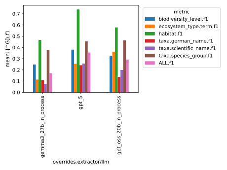
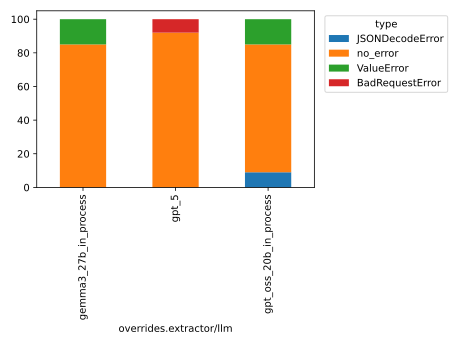

This folder contains the logs of the baseline experiments
conducted with the faktencheck_core_fields_schema and the default prompt template, across the following LLMs:

- gpt_oss_20b
- gemma3_27b
- gpt_5

See Issue https://github.com/DFKI-NLP/kibad-llm/issues/260  for more documentation.

Evaluation Notebook Parameters:
```python
NAME = "260_baseline_default_no_evi"
METRICS_DIR_PATTERN = "evaluate/**/2026-01-14_15-34-51/"
ERRORS_DIR_PATTERN = "evaluate/**/2026-01-14_15-36-57/"
# set any missing (default) values as column name -> value
FILL_NA = {}
```

Inference:
```
./run_in_process.sh -pa "H100-SLT,H100-Trails,H100,A100-80GB" \
-u "-m kibad_llm.predict \
name=260_baseline_default_no_evi \
experiment/predict=faktencheck_core_fields_schema \
pdf_directory=/ds/text/kiba-d/dev-set-100 \
extractor/llm=gpt_oss_20b_in_process,gemma3_27b_in_process,gpt_5 \
seed=42 \
extractor/prompt_template=default \
--multirun"
```

<details>
<summary>Output</summary>

```
[2026-01-14 15:23:21,634][HYDRA] Saving job_return in /netscratch/hennig/code/kibad-llm/logs/260_baseline_default_no_evi/predict/multiruns/2026-01-14_12-17-35/job_return_value.json
[2026-01-14 15:23:21,639][HYDRA] Saving job_return in /netscratch/hennig/code/kibad-llm/logs/260_baseline_default_no_evi/predict/multiruns/2026-01-14_12-17-35/job_return_value.md
[2026-01-14 15:23:21,679][HYDRA] Contents of /netscratch/hennig/code/kibad-llm/logs/260_baseline_default_no_evi/predict/multiruns/2026-01-14_12-17-35/job_return_value.md:
```

|                                      | branch   | commit_hash                              | is_dirty   | output_file                                                                                                                                | overrides.experiment/predict   | overrides.extractor.adjust_schema_for_evidence_detection   | overrides.extractor/llm   | overrides.extractor/prompt_template   | overrides.name              | overrides.pdf_directory     |   overrides.seed |   time_extraction |   time_pdf_conversion |
|:-------------------------------------|:---------|:-----------------------------------------|:-----------|:-------------------------------------------------------------------------------------------------------------------------------------------|:-------------------------------|:-----------------------------------------------------------|:--------------------------|:--------------------------------------|:----------------------------|:----------------------------|-----------------:|------------------:|----------------------:|
| extractor/llm=gemma3_27b_in_process  | main     | c224f0eafac75c170d28c736c19d718409f42757 | False      | /netscratch/hennig/code/kibad-llm/predictions/260_baseline_default_no_evi/2026-01-14_12-17-35/2026-01-14_13-29-53_925770/predictions.jsonl | faktencheck_core_fields_schema | False                                                      | gemma3_27b_in_process     | default                               | 260_baseline_default_no_evi | /ds/text/kiba-d/dev-set-100 |               42 |           1947.78 |            0.00930447 |
| extractor/llm=gpt_5                  | main     | c224f0eafac75c170d28c736c19d718409f42757 | False      | /netscratch/hennig/code/kibad-llm/predictions/260_baseline_default_no_evi/2026-01-14_12-17-35/2026-01-14_14-04-28_731361/predictions.jsonl | faktencheck_core_fields_schema | False                                                      | gpt_5                     | default                               | 260_baseline_default_no_evi | /ds/text/kiba-d/dev-set-100 |               42 |           4732.35 |            0.00835055 |
| extractor/llm=gpt_oss_20b_in_process | main     | c224f0eafac75c170d28c736c19d718409f42757 | False      | /netscratch/hennig/code/kibad-llm/predictions/260_baseline_default_no_evi/2026-01-14_12-17-35/2026-01-14_12-17-36_177045/predictions.jsonl | faktencheck_core_fields_schema | False                                                      | gpt_oss_20b_in_process    | default                               | 260_baseline_default_no_evi | /ds/text/kiba-d/dev-set-100 |               42 |           3990.33 |            0.0795131  |


</details>

Evaluate F1:
```
uv run -m kibad_llm.evaluate \
name=260_baseline_default_no_evi \
experiment/evaluate=faktencheck_core_f1_micro_flat \
predictions_multirun_logs=[logs/260_baseline_default_no_evi/predict/multiruns/2026-01-14_12-17-35/] \
+hydra.callbacks.save_job_return.multirun_markdown_group_by=overrides.extractor/llm \
--multirun
```

<details>
<summary>Output</summary>

```
[2026-01-14 15:34:53,818][HYDRA] Saving job_return in /netscratch/hennig/code/kibad-llm/logs/260_baseline_default_no_evi/evaluate/multiruns/2026-01-14_15-34-51/job_return_value.json                                                                                                                                                                         [2026-01-14 15:34:53,823][HYDRA] Saving job_return in /netscratch/hennig/code/kibad-llm/logs/260_baseline_default_no_evi/evaluate/multiruns/2026-01-14_15-34-51/job_return_value.md                                                                                                                                                                           [2026-01-14 15:34:53,906][HYDRA] Contents of /netscratch/hennig/code/kibad-llm/logs/260_baseline_default_no_evi/evaluate/multiruns/2026-01-14_15-34-51/job_return_value.md:
```

| overrides.extractor/llm   |   ALL.f1.mean |   ALL.f1.std |   ALL.precision.mean |   ALL.precision.std |   ALL.recall.mean |   ALL.recall.std |   ALL.support.mean |   ALL.support.std |   AVG.f1.mean |   AVG.f1.std |   AVG.precision.mean |   AVG.precision.std |   AVG.recall.mean |   AVG.recall.std |   AVG.support.mean |   AVG.support.std |   biodiversity_level.f1.mean |   biodiversity_level.f1.std |   biodiversity_level.precision.mean |   biodiversity_level.precision.std |   biodiversity_level.recall.mean |   biodiversity_level.recall.std |   biodiversity_level.support.mean |   biodiversity_level.support.std |   ecosystem_type.term.f1.mean |   ecosystem_type.term.f1.std |   ecosystem_type.term.precision.mean |   ecosystem_type.term.precision.std |   ecosystem_type.term.recall.mean |   ecosystem_type.term.recall.std |   ecosystem_type.term.support.mean |   ecosystem_type.term.support.std |   habitat.f1.mean |   habitat.f1.std |   habitat.precision.mean |   habitat.precision.std |   habitat.recall.mean |   habitat.recall.std |   habitat.support.mean |   habitat.support.std |   prediction.job_return_value.time_extraction.mean |   prediction.job_return_value.time_extraction.std |   prediction.job_return_value.time_pdf_conversion.mean |   prediction.job_return_value.time_pdf_conversion.std |   taxa.german_name.f1.mean |   taxa.german_name.f1.std |   taxa.german_name.precision.mean |   taxa.german_name.precision.std |   taxa.german_name.recall.mean |   taxa.german_name.recall.std |   taxa.german_name.support.mean |   taxa.german_name.support.std |   taxa.scientific_name.f1.mean |   taxa.scientific_name.f1.std |   taxa.scientific_name.precision.mean |   taxa.scientific_name.precision.std |   taxa.scientific_name.recall.mean |   taxa.scientific_name.recall.std |   taxa.scientific_name.support.mean |   taxa.scientific_name.support.std |   taxa.species_group.f1.mean |   taxa.species_group.f1.std |   taxa.species_group.precision.mean |   taxa.species_group.precision.std |   taxa.species_group.recall.mean |   taxa.species_group.recall.std |   taxa.species_group.support.mean |   taxa.species_group.support.std | overrides.experiment/predict       | overrides.extractor.adjust_schema_for_evidence_detection   | overrides.extractor/prompt_template   | overrides.name                  | overrides.pdf_directory         | overrides.seed   | prediction.job_return_value.branch   | prediction.job_return_value.commit_hash      | prediction.job_return_value.is_dirty   | prediction.job_return_value.output_file                                                                                                        |
|:--------------------------|--------------:|-------------:|---------------------:|--------------------:|------------------:|-----------------:|-------------------:|------------------:|--------------:|-------------:|---------------------:|--------------------:|------------------:|-----------------:|-------------------:|------------------:|-----------------------------:|----------------------------:|------------------------------------:|-----------------------------------:|---------------------------------:|--------------------------------:|----------------------------------:|---------------------------------:|------------------------------:|-----------------------------:|-------------------------------------:|------------------------------------:|----------------------------------:|---------------------------------:|-----------------------------------:|----------------------------------:|------------------:|-----------------:|-------------------------:|------------------------:|----------------------:|---------------------:|-----------------------:|----------------------:|---------------------------------------------------:|--------------------------------------------------:|-------------------------------------------------------:|------------------------------------------------------:|---------------------------:|--------------------------:|----------------------------------:|---------------------------------:|-------------------------------:|------------------------------:|--------------------------------:|-------------------------------:|-------------------------------:|------------------------------:|--------------------------------------:|-------------------------------------:|-----------------------------------:|----------------------------------:|------------------------------------:|-----------------------------------:|-----------------------------:|----------------------------:|------------------------------------:|-----------------------------------:|---------------------------------:|--------------------------------:|----------------------------------:|---------------------------------:|:-----------------------------------|:-----------------------------------------------------------|:--------------------------------------|:--------------------------------|:--------------------------------|:-----------------|:-------------------------------------|:---------------------------------------------|:---------------------------------------|:-----------------------------------------------------------------------------------------------------------------------------------------------|
| gemma3_27b_in_process     |         0.17  |            0 |                0.132 |                   0 |             0.24  |                0 |                792 |                 0 |         0.232 |            0 |                0.234 |                   0 |             0.268 |                0 |                132 |                 0 |                        0.248 |                           0 |                               0.231 |                                  0 |                            0.269 |                               0 |                                67 |                                0 |                         0.114 |                            0 |                                0.071 |                                   0 |                             0.283 |                                0 |                                 53 |                                 0 |             0.468 |                0 |                    0.581 |                       0 |                 0.391 |                    0 |                    138 |                     0 |                                            1947.78 |                                                 0 |                                                  0.009 |                                                     0 |                      0.109 |                         0 |                             0.081 |                                0 |                          0.165 |                             0 |                             231 |                              0 |                          0.076 |                             0 |                                 0.053 |                                    0 |                              0.132 |                                 0 |                                 197 |                                  0 |                        0.377 |                           0 |                               0.386 |                                  0 |                            0.368 |                               0 |                               106 |                                0 | ['faktencheck_core_fields_schema'] | ['False']                                                  | ['default']                           | ['260_baseline_default_no_evi'] | ['/ds/text/kiba-d/dev-set-100'] | ['42']           | ['main']                             | ['c224f0eafac75c170d28c736c19d718409f42757'] | [np.False_]                            | ['/netscratch/hennig/code/kibad-llm/predictions/260_baseline_default_no_evi/2026-01-14_12-17-35/2026-01-14_13-29-53_925770/predictions.jsonl'] |
| gpt_5                     |         0.355 |            0 |                0.274 |                   0 |             0.503 |                0 |                792 |                 0 |         0.388 |            0 |                0.312 |                   0 |             0.579 |                0 |                132 |                 0 |                        0.38  |                           0 |                               0.283 |                                  0 |                            0.582 |                               0 |                                67 |                                0 |                         0.254 |                            0 |                                0.151 |                                   0 |                             0.811 |                                0 |                                 53 |                                 0 |             0.739 |                0 |                    0.673 |                       0 |                 0.819 |                    0 |                    138 |                     0 |                                            4732.35 |                                                 0 |                                                  0.008 |                                                     0 |                      0.241 |                         0 |                             0.201 |                                0 |                          0.303 |                             0 |                             231 |                              0 |                          0.257 |                             0 |                                 0.205 |                                    0 |                              0.345 |                                 0 |                                 197 |                                  0 |                        0.455 |                           0 |                               0.361 |                                  0 |                            0.613 |                               0 |                               106 |                                0 | ['faktencheck_core_fields_schema'] | ['False']                                                  | ['default']                           | ['260_baseline_default_no_evi'] | ['/ds/text/kiba-d/dev-set-100'] | ['42']           | ['main']                             | ['c224f0eafac75c170d28c736c19d718409f42757'] | [np.False_]                            | ['/netscratch/hennig/code/kibad-llm/predictions/260_baseline_default_no_evi/2026-01-14_12-17-35/2026-01-14_14-04-28_731361/predictions.jsonl'] |
| gpt_oss_20b_in_process    |         0.292 |            0 |                0.264 |                   0 |             0.327 |                0 |                792 |                 0 |         0.345 |            0 |                0.327 |                   0 |             0.385 |                0 |                132 |                 0 |                        0.326 |                           0 |                               0.261 |                                  0 |                            0.433 |                               0 |                                67 |                                0 |                         0.362 |                            0 |                                0.281 |                                   0 |                             0.509 |                                0 |                                 53 |                                 0 |             0.578 |                0 |                    0.649 |                       0 |                 0.522 |                    0 |                    138 |                     0 |                                            3990.33 |                                                 0 |                                                  0.08  |                                                     0 |                      0.138 |                         0 |                             0.126 |                                0 |                          0.152 |                             0 |                             231 |                              0 |                          0.2   |                             0 |                                 0.169 |                                    0 |                              0.244 |                                 0 |                                 197 |                                  0 |                        0.464 |                           0 |                               0.475 |                                  0 |                            0.453 |                               0 |                               106 |                                0 | ['faktencheck_core_fields_schema'] | ['False']                                                  | ['default']                           | ['260_baseline_default_no_evi'] | ['/ds/text/kiba-d/dev-set-100'] | ['42']           | ['main']                             | ['c224f0eafac75c170d28c736c19d718409f42757'] | [np.False_]                            | ['/netscratch/hennig/code/kibad-llm/predictions/260_baseline_default_no_evi/2026-01-14_12-17-35/2026-01-14_12-17-36_177045/predictions.jsonl'] |

</details>



Evaluate errors:

```
uv run -m kibad_llm.evaluate \
name=260_baseline_default_no_evi \
experiment/evaluate=prediction_errors \
predictions_multirun_logs=[logs/260_baseline_default_no_evi/predict/multiruns/2026-01-14_12-17-35/] \
+hydra.callbacks.save_job_return.multirun_markdown_group_by=overrides.extractor/llm \
--multirun
```

<details>
<summary>Output</summary>

```
[2026-01-14 15:36:58,840][HYDRA] Saving job_return in /netscratch/hennig/code/kibad-llm/logs/260_baseline_default_no_evi/evaluate/multiruns/2026-01-14_15-36-57/job_return_valu
e.json
[2026-01-14 15:36:58,845][HYDRA] Saving job_return in /netscratch/hennig/code/kibad-llm/logs/260_baseline_default_no_evi/evaluate/multiruns/2026-01-14_15-36-57/job_return_valu
e.md
[2026-01-14 15:36:58,891][HYDRA] Contents of /netscratch/hennig/code/kibad-llm/logs/260_baseline_default_no_evi/evaluate/multiruns/2026-01-14_15-36-57/job_return_value.md:
```

| overrides.extractor/llm   |   BadRequestError.mean |   BadRequestError.std |   JSONDecodeError.mean |   JSONDecodeError.std |   ValueError.mean |   ValueError.std |   no_error.mean |   no_error.std |   prediction.job_return_value.time_extraction.mean |   prediction.job_return_value.time_extraction.std |   prediction.job_return_value.time_pdf_conversion.mean |   prediction.job_return_value.time_pdf_conversion.std | overrides.experiment/predict       | overrides.extractor.adjust_schema_for_evidence_detection   | overrides.extractor/prompt_template   | overrides.name                  | overrides.pdf_directory         | overrides.seed   | prediction.job_return_value.branch   | prediction.job_return_value.commit_hash      | prediction.job_return_value.is_dirty   | prediction.job_return_value.output_file                                                                                                        |
|:--------------------------|-----------------------:|----------------------:|-----------------------:|----------------------:|------------------:|-----------------:|----------------:|---------------:|---------------------------------------------------:|--------------------------------------------------:|-------------------------------------------------------:|------------------------------------------------------:|:-----------------------------------|:-----------------------------------------------------------|:--------------------------------------|:--------------------------------|:--------------------------------|:-----------------|:-------------------------------------|:---------------------------------------------|:---------------------------------------|:-----------------------------------------------------------------------------------------------------------------------------------------------|
| gemma3_27b_in_process     |                      0 |                     0 |                      0 |                     0 |                15 |                0 |              85 |              0 |                                            1947.78 |                                                 0 |                                                  0.009 |                                                     0 | ['faktencheck_core_fields_schema'] | ['False']                                                  | ['default']                           | ['260_baseline_default_no_evi'] | ['/ds/text/kiba-d/dev-set-100'] | ['42']           | ['main']                             | ['c224f0eafac75c170d28c736c19d718409f42757'] | [np.False_]                            | ['/netscratch/hennig/code/kibad-llm/predictions/260_baseline_default_no_evi/2026-01-14_12-17-35/2026-01-14_13-29-53_925770/predictions.jsonl'] |
| gpt_5                     |                      8 |                     0 |                      0 |                     0 |                 0 |                0 |              92 |              0 |                                            4732.35 |                                                 0 |                                                  0.008 |                                                     0 | ['faktencheck_core_fields_schema'] | ['False']                                                  | ['default']                           | ['260_baseline_default_no_evi'] | ['/ds/text/kiba-d/dev-set-100'] | ['42']           | ['main']                             | ['c224f0eafac75c170d28c736c19d718409f42757'] | [np.False_]                            | ['/netscratch/hennig/code/kibad-llm/predictions/260_baseline_default_no_evi/2026-01-14_12-17-35/2026-01-14_14-04-28_731361/predictions.jsonl'] |
| gpt_oss_20b_in_process    |                      0 |                     0 |                      9 |                     0 |                15 |                0 |              76 |              0 |                                            3990.33 |                                                 0 |                                                  0.08  |                                                     0 | ['faktencheck_core_fields_schema'] | ['False']                                                  | ['default']                           | ['260_baseline_default_no_evi'] | ['/ds/text/kiba-d/dev-set-100'] | ['42']           | ['main']                             | ['c224f0eafac75c170d28c736c19d718409f42757'] | [np.False_]                            | ['/netscratch/hennig/code/kibad-llm/predictions/260_baseline_default_no_evi/2026-01-14_12-17-35/2026-01-14_12-17-36_177045/predictions.jsonl'] |

</details>

