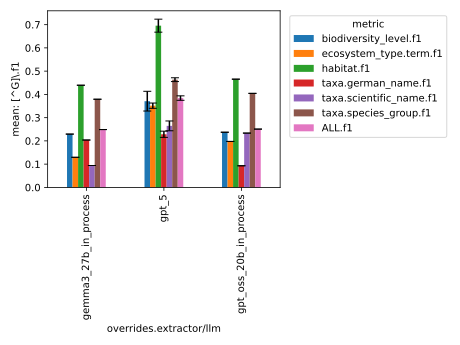
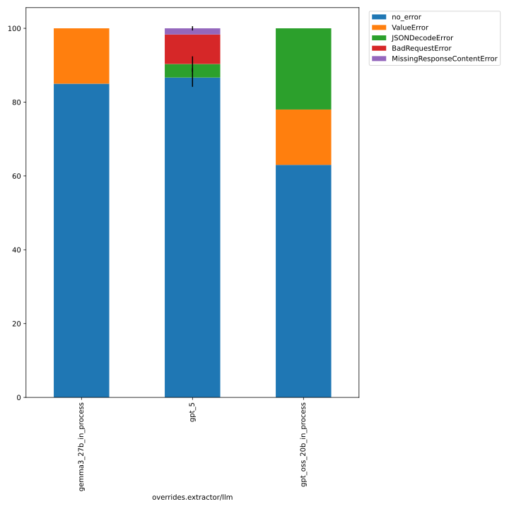
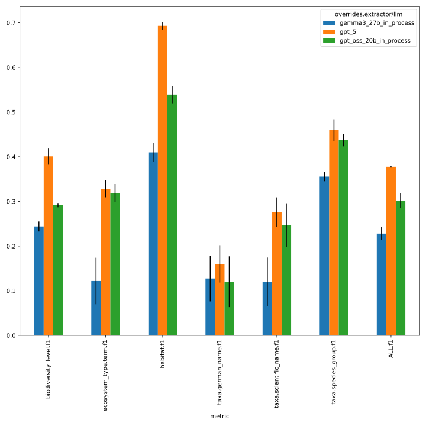
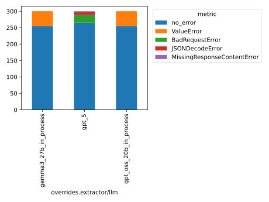
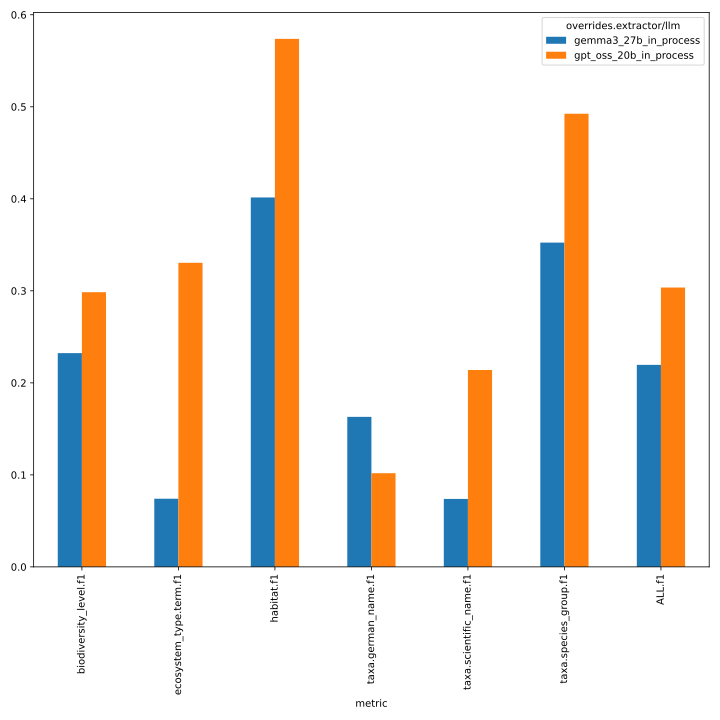
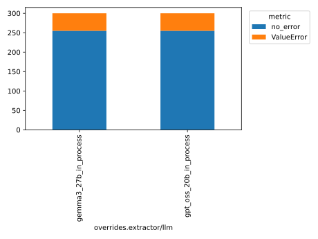
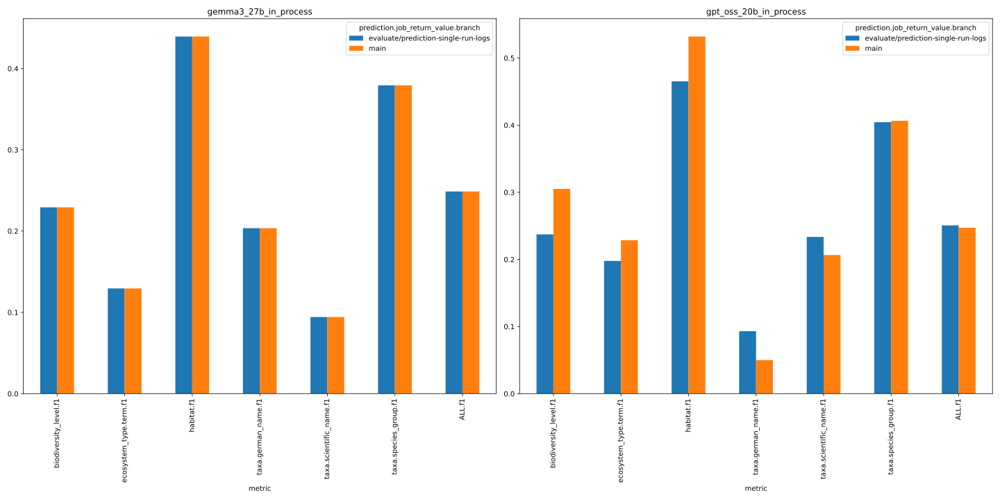
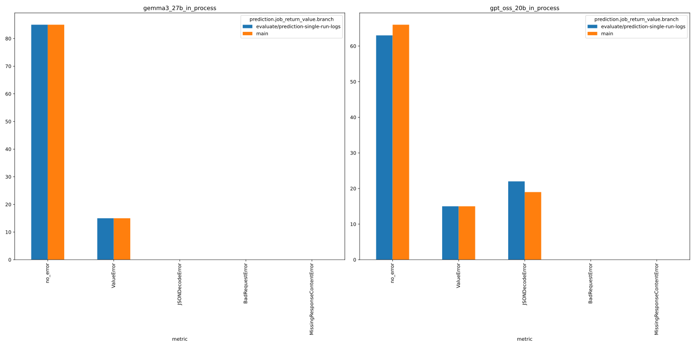
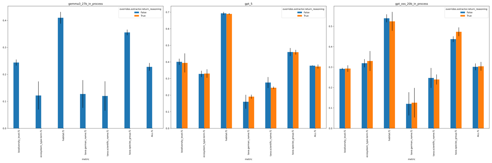

# Variance Analysis for Faktencheck
variance analysis for faktencheck (core fields with evidence; 3 llms; 3 seeds)
 - id: `name=261_baseline_faktencheck_core_variance`
 - core fields with evidence: `experiment/predict=faktencheck_core_fields_schema_with_evidence`
 - 3 llms: `extractor/llm=gpt_oss_20b_in_process,gemma3_27b_in_process,gpt_5`
 - 3 seeds: `seed=42,1337,7331`

see https://github.com/DFKI-NLP/kibad-llm/issues/261 for details.

## Evaluation Notebook Parameters
```python
# temperature=0.0 (different seeds)
NAME = "261_baseline_faktencheck_core_variance"
METRICS_DIR_PATTERN = "evaluate/**/2026-01-15_13-23-46/"
ERRORS_DIR_PATTERN = "evaluate/**/2026-01-15_13-25-18/"
# used to group the data
INDEX_COLUMNS = ["overrides.extractor/llm"]
PLOT_KWARGS = {
    # can be either "metric" or one of the INDEX_COLUMNS (or multiple of them)
    "xgroup": "overrides.extractor/llm",
    "figsize": (10, 10),
    # add any more arguments passed to pd.DataFrame.plot
}
```

```python
# temperature=1.0 (different seeds)
NAME = "261_baseline_faktencheck_core_variance"
METRICS_DIR_PATTERN = "evaluate/**/2026-01-20_11-08-02/"
ERRORS_DIR_PATTERN = "evaluate/**/2026-01-20_11-09-01/"

# (remaining as above)
```

```python
# temperature=1.0, but identical seed
NAME = "261_baseline_faktencheck_core_variance"
METRICS_DIR_PATTERN = "evaluate/**/2026-01-20_11-16-30/"
ERRORS_DIR_PATTERN = "evaluate/**/2026-01-20_11-17-23/"

# (remaining as above)
```

```python
# re-run all (except gpt_5) with temperature=0.0 (and different seeds)
NAME = "261_baseline_faktencheck_core_variance"
METRICS_DIR_PATTERN = "evaluate/**/2026-01-21_10-39-10/"
ERRORS_DIR_PATTERN = "evaluate/**/2026-01-21_10-39-52/"

# (remaining as above)
```

```python
# run all with `temperature=1.0` and `return_reasoning=true`
NAME = "261_baseline_faktencheck_core_variance"
METRICS_DIR_PATTERN = "evaluate/**/2026-01-21_10-41-13/"
ERRORS_DIR_PATTERN = "evaluate/**/2026-01-21_10-41-50/"

# (remaining as above)
```
IMPORTANT: Since #337, you need the following code to get the `metrics_df` and `errors_df` with this evaluation data correctly:
```python
from kibad_llm.utils.job_return import load

errors_df = (
    pd.DataFrame.from_records(
        load(
            directory=BASE_LOG_DIR / NAME,
            subdir_pattern=ERRORS_DIR_PATTERN,
            strip_id_keys=True,
            flatten=True,
            exclude_keys=EXCLUDE_KEYS,
        )
    )
    .fillna(FILL_NA)
    .fillna(0)
)
# display(errors_df)

metrics_df = pd.DataFrame.from_records(
    load(
        directory=BASE_LOG_DIR / NAME,
        subdir_pattern=METRICS_DIR_PATTERN,
        strip_id_keys=True,
        flatten=True,
        exclude_keys=EXCLUDE_KEYS,
    )
).fillna(FILL_NA)
# display(metrics_df)
```

## temperature=0.0 (different seeds)

### Predict
- command from [here](https://github.com/DFKI-NLP/kibad-llm/issues/277#issue-3812729930) (adjusted `seed`)
```
./run_in_process.sh -pa "H100-SLT,H100-Trails,H100,A100-80GB" \
-u "-m kibad_llm.predict \
name=261_baseline_faktencheck_core_variance \
experiment/predict=faktencheck_core_fields_schema_with_evidence \
pdf_directory=/ds/text/kiba-d/dev-set-100 \
extractor/llm=gpt_oss_20b_in_process,gemma3_27b_in_process,gpt_5 \
seed=42,1337,7331 \
--multirun"
```
Running on node(s) serv-3310

[2026-01-15 07:53:51,762][HYDRA] Contents of /netscratch/binder/projects/kibad-llm/logs/261_baseline_faktencheck_core_variance/predict/multiruns/2026-01-14_20-01-33/job_return_value.md:

<details>
<summary>click to see content</summary>

|                                                | branch                              | commit_hash                              | is_dirty   | output_file                                                                                                                                               | overrides.experiment/predict                 | overrides.extractor/llm   | overrides.name                         | overrides.pdf_directory     |   overrides.seed |   time_extraction |   time_pdf_conversion |
|:-----------------------------------------------|:------------------------------------|:-----------------------------------------|:-----------|:----------------------------------------------------------------------------------------------------------------------------------------------------------|:---------------------------------------------|:--------------------------|:---------------------------------------|:----------------------------|-----------------:|------------------:|----------------------:|
| extractor/llm=gemma3_27b_in_process#seed=1337  | evaluate/prediction-single-run-logs | b35b5be19ec9c451153ea30580afd67e4959e04f | False      | /netscratch/binder/projects/kibad-llm/predictions/261_baseline_faktencheck_core_variance/2026-01-14_20-01-33/2026-01-14_23-25-49_094244/predictions.jsonl | faktencheck_core_fields_schema_with_evidence | gemma3_27b_in_process     | 261_baseline_faktencheck_core_variance | /ds/text/kiba-d/dev-set-100 |             1337 |           1183.71 |            0.00318527 |
| extractor/llm=gemma3_27b_in_process#seed=42    | evaluate/prediction-single-run-logs | b35b5be19ec9c451153ea30580afd67e4959e04f | False      | /netscratch/binder/projects/kibad-llm/predictions/261_baseline_faktencheck_core_variance/2026-01-14_20-01-33/2026-01-14_23-03-09_530693/predictions.jsonl | faktencheck_core_fields_schema_with_evidence | gemma3_27b_in_process     | 261_baseline_faktencheck_core_variance | /ds/text/kiba-d/dev-set-100 |               42 |           1190.83 |            0.00333859 |
| extractor/llm=gemma3_27b_in_process#seed=7331  | evaluate/prediction-single-run-logs | b35b5be19ec9c451153ea30580afd67e4959e04f | False      | /netscratch/binder/projects/kibad-llm/predictions/261_baseline_faktencheck_core_variance/2026-01-14_20-01-33/2026-01-14_23-46-52_856949/predictions.jsonl | faktencheck_core_fields_schema_with_evidence | gemma3_27b_in_process     | 261_baseline_faktencheck_core_variance | /ds/text/kiba-d/dev-set-100 |             7331 |           1185.7  |            0.00321815 |
| extractor/llm=gpt_5#seed=1337                  | evaluate/prediction-single-run-logs | b35b5be19ec9c451153ea30580afd67e4959e04f | False      | /netscratch/binder/projects/kibad-llm/predictions/261_baseline_faktencheck_core_variance/2026-01-14_20-01-33/2026-01-15_02-25-18_645425/predictions.jsonl | faktencheck_core_fields_schema_with_evidence | gpt_5                     | 261_baseline_faktencheck_core_variance | /ds/text/kiba-d/dev-set-100 |             1337 |           9371.32 |            0.00345354 |
| extractor/llm=gpt_5#seed=42                    | evaluate/prediction-single-run-logs | b35b5be19ec9c451153ea30580afd67e4959e04f | False      | /netscratch/binder/projects/kibad-llm/predictions/261_baseline_faktencheck_core_variance/2026-01-14_20-01-33/2026-01-15_00-07-57_741907/predictions.jsonl | faktencheck_core_fields_schema_with_evidence | gpt_5                     | 261_baseline_faktencheck_core_variance | /ds/text/kiba-d/dev-set-100 |               42 |           8239.5  |            0.00334754 |
| extractor/llm=gpt_5#seed=7331                  | evaluate/prediction-single-run-logs | b35b5be19ec9c451153ea30580afd67e4959e04f | False      | /netscratch/binder/projects/kibad-llm/predictions/261_baseline_faktencheck_core_variance/2026-01-14_20-01-33/2026-01-15_05-01-31_207954/predictions.jsonl | faktencheck_core_fields_schema_with_evidence | gpt_5                     | 261_baseline_faktencheck_core_variance | /ds/text/kiba-d/dev-set-100 |             7331 |          10339.4  |            0.00373619 |
| extractor/llm=gpt_oss_20b_in_process#seed=1337 | evaluate/prediction-single-run-logs | b35b5be19ec9c451153ea30580afd67e4959e04f | False      | /netscratch/binder/projects/kibad-llm/predictions/261_baseline_faktencheck_core_variance/2026-01-14_20-01-33/2026-01-14_21-02-04_048772/predictions.jsonl | faktencheck_core_fields_schema_with_evidence | gpt_oss_20b_in_process    | 261_baseline_faktencheck_core_variance | /ds/text/kiba-d/dev-set-100 |             1337 |           3571.3  |            0.00353332 |
| extractor/llm=gpt_oss_20b_in_process#seed=42   | evaluate/prediction-single-run-logs | b35b5be19ec9c451153ea30580afd67e4959e04f | False      | /netscratch/binder/projects/kibad-llm/predictions/261_baseline_faktencheck_core_variance/2026-01-14_20-01-33/2026-01-14_20-01-34_711848/predictions.jsonl | faktencheck_core_fields_schema_with_evidence | gpt_oss_20b_in_process    | 261_baseline_faktencheck_core_variance | /ds/text/kiba-d/dev-set-100 |               42 |           3534.36 |            0.00473654 |
| extractor/llm=gpt_oss_20b_in_process#seed=7331 | evaluate/prediction-single-run-logs | b35b5be19ec9c451153ea30580afd67e4959e04f | False      | /netscratch/binder/projects/kibad-llm/predictions/261_baseline_faktencheck_core_variance/2026-01-14_20-01-33/2026-01-14_22-02-30_848268/predictions.jsonl | faktencheck_core_fields_schema_with_evidence | gpt_oss_20b_in_process    | 261_baseline_faktencheck_core_variance | /ds/text/kiba-d/dev-set-100 |             7331 |           3584.31 |            0.00371006 |

</details>

### Evaluate

#### f1
```
uv run -m kibad_llm.evaluate \
name=261_baseline_faktencheck_core_variance  \
experiment/evaluate=faktencheck_core_f1_micro_flat \
prediction_logs=logs/261_baseline_faktencheck_core_variance/predict/multiruns/2026-01-14_20-01-33 \
+hydra.callbacks.save_job_return.multirun_markdown_group_by=overrides.extractor/llm \
--multirun
```

[2026-01-15 13:23:53,912][HYDRA] Contents of /netscratch/binder/projects/kibad-llm/logs/261_baseline_faktencheck_core_variance/evaluate/multiruns/2026-01-15_13-23-46/job_return_value.md:

| overrides.extractor/llm   |   ALL.f1.mean |   ALL.f1.std |   ALL.precision.mean |   ALL.precision.std |   ALL.recall.mean |   ALL.recall.std |   ALL.support.mean |   ALL.support.std |   AVG.f1.mean |   AVG.f1.std |   AVG.precision.mean |   AVG.precision.std |   AVG.recall.mean |   AVG.recall.std |   AVG.support.mean |   AVG.support.std |   biodiversity_level.f1.mean |   biodiversity_level.f1.std |   biodiversity_level.precision.mean |   biodiversity_level.precision.std |   biodiversity_level.recall.mean |   biodiversity_level.recall.std |   biodiversity_level.support.mean |   biodiversity_level.support.std |   ecosystem_type.term.f1.mean |   ecosystem_type.term.f1.std |   ecosystem_type.term.precision.mean |   ecosystem_type.term.precision.std |   ecosystem_type.term.recall.mean |   ecosystem_type.term.recall.std |   ecosystem_type.term.support.mean |   ecosystem_type.term.support.std |   habitat.f1.mean |   habitat.f1.std |   habitat.precision.mean |   habitat.precision.std |   habitat.recall.mean |   habitat.recall.std |   habitat.support.mean |   habitat.support.std |   prediction.job_return_value.time_extraction.mean |   prediction.job_return_value.time_extraction.std |   prediction.job_return_value.time_pdf_conversion.mean |   prediction.job_return_value.time_pdf_conversion.std |   taxa.german_name.f1.mean |   taxa.german_name.f1.std |   taxa.german_name.precision.mean |   taxa.german_name.precision.std |   taxa.german_name.recall.mean |   taxa.german_name.recall.std |   taxa.german_name.support.mean |   taxa.german_name.support.std |   taxa.scientific_name.f1.mean |   taxa.scientific_name.f1.std |   taxa.scientific_name.precision.mean |   taxa.scientific_name.precision.std |   taxa.scientific_name.recall.mean |   taxa.scientific_name.recall.std |   taxa.scientific_name.support.mean |   taxa.scientific_name.support.std |   taxa.species_group.f1.mean |   taxa.species_group.f1.std |   taxa.species_group.precision.mean |   taxa.species_group.precision.std |   taxa.species_group.recall.mean |   taxa.species_group.recall.std |   taxa.species_group.support.mean |   taxa.species_group.support.std | overrides.experiment/predict                                                                                                                     | overrides.name                                                                                                                 | overrides.pdf_directory                                                                       | overrides.seed         | prediction.job_return_value.branch                                                                                    | prediction.job_return_value.commit_hash                                                                                              | prediction.job_return_value.is_dirty   | prediction.job_return_value.output_file                                                                                                                                                                                                                                                                                                                                                                                                                                                 |
|:--------------------------|--------------:|-------------:|---------------------:|--------------------:|------------------:|-----------------:|-------------------:|------------------:|--------------:|-------------:|---------------------:|--------------------:|------------------:|-----------------:|-------------------:|------------------:|-----------------------------:|----------------------------:|------------------------------------:|-----------------------------------:|---------------------------------:|--------------------------------:|----------------------------------:|---------------------------------:|------------------------------:|-----------------------------:|-------------------------------------:|------------------------------------:|----------------------------------:|---------------------------------:|-----------------------------------:|----------------------------------:|------------------:|-----------------:|-------------------------:|------------------------:|----------------------:|---------------------:|-----------------------:|----------------------:|---------------------------------------------------:|--------------------------------------------------:|-------------------------------------------------------:|------------------------------------------------------:|---------------------------:|--------------------------:|----------------------------------:|---------------------------------:|-------------------------------:|------------------------------:|--------------------------------:|-------------------------------:|-------------------------------:|------------------------------:|--------------------------------------:|-------------------------------------:|-----------------------------------:|----------------------------------:|------------------------------------:|-----------------------------------:|-----------------------------:|----------------------------:|------------------------------------:|-----------------------------------:|---------------------------------:|--------------------------------:|----------------------------------:|---------------------------------:|:-------------------------------------------------------------------------------------------------------------------------------------------------|:-------------------------------------------------------------------------------------------------------------------------------|:----------------------------------------------------------------------------------------------|:-----------------------|:----------------------------------------------------------------------------------------------------------------------|:-------------------------------------------------------------------------------------------------------------------------------------|:---------------------------------------|:----------------------------------------------------------------------------------------------------------------------------------------------------------------------------------------------------------------------------------------------------------------------------------------------------------------------------------------------------------------------------------------------------------------------------------------------------------------------------------------|
| gemma3_27b_in_process     |         0.249 |         0    |                0.281 |                0    |             0.223 |            0     |                792 |                 0 |         0.246 |        0     |                0.264 |                0    |             0.249 |            0     |                132 |                 0 |                        0.229 |                       0     |                               0.2   |                              0     |                            0.269 |                            0    |                                67 |                                0 |                         0.129 |                        0     |                                0.105 |                               0     |                             0.17  |                            0     |                                 53 |                                 0 |             0.439 |            0     |                    0.46  |                   0     |                 0.42  |                0     |                    138 |                     0 |                                            1186.75 |                                             3.674 |                                                  0.003 |                                                 0     |                      0.204 |                     0     |                             0.33  |                            0     |                          0.147 |                         0     |                             231 |                              0 |                          0.094 |                         0     |                                 0.14  |                                0     |                              0.071 |                             0     |                                 197 |                                  0 |                        0.379 |                       0     |                               0.349 |                              0     |                            0.415 |                           0     |                               106 |                                0 | ['faktencheck_core_fields_schema_with_evidence', 'faktencheck_core_fields_schema_with_evidence', 'faktencheck_core_fields_schema_with_evidence'] | ['261_baseline_faktencheck_core_variance', '261_baseline_faktencheck_core_variance', '261_baseline_faktencheck_core_variance'] | ['/ds/text/kiba-d/dev-set-100', '/ds/text/kiba-d/dev-set-100', '/ds/text/kiba-d/dev-set-100'] | ['1337', '42', '7331'] | ['evaluate/prediction-single-run-logs', 'evaluate/prediction-single-run-logs', 'evaluate/prediction-single-run-logs'] | ['b35b5be19ec9c451153ea30580afd67e4959e04f', 'b35b5be19ec9c451153ea30580afd67e4959e04f', 'b35b5be19ec9c451153ea30580afd67e4959e04f'] | [np.False_, np.False_, np.False_]      | ['/netscratch/binder/projects/kibad-llm/predictions/261_baseline_faktencheck_core_variance/2026-01-14_20-01-33/2026-01-14_23-25-49_094244/predictions.jsonl', '/netscratch/binder/projects/kibad-llm/predictions/261_baseline_faktencheck_core_variance/2026-01-14_20-01-33/2026-01-14_23-03-09_530693/predictions.jsonl', '/netscratch/binder/projects/kibad-llm/predictions/261_baseline_faktencheck_core_variance/2026-01-14_20-01-33/2026-01-14_23-46-52_856949/predictions.jsonl'] |
| gpt_5                     |         0.384 |         0.01 |                0.373 |                0.01 |             0.397 |            0.015 |                792 |                 0 |         0.396 |        0.011 |                0.377 |                0.01 |             0.473 |            0.021 |                132 |                 0 |                        0.371 |                       0.042 |                               0.309 |                              0.032 |                            0.463 |                            0.06 |                                67 |                                0 |                         0.352 |                        0.011 |                                0.239 |                               0.007 |                             0.667 |                            0.029 |                                 53 |                                 0 |             0.696 |            0.028 |                    0.687 |                   0.009 |                 0.705 |                0.048 |                    138 |                     0 |                                            9316.74 |                                          1051.02  |                                                  0.004 |                                                 0     |                      0.229 |                     0.013 |                             0.368 |                            0.037 |                          0.166 |                         0.007 |                             231 |                              0 |                          0.265 |                         0.021 |                                 0.27  |                                0.035 |                              0.261 |                             0.008 |                                 197 |                                  0 |                        0.463 |                       0.008 |                               0.388 |                              0.013 |                            0.575 |                           0.016 |                               106 |                                0 | ['faktencheck_core_fields_schema_with_evidence', 'faktencheck_core_fields_schema_with_evidence', 'faktencheck_core_fields_schema_with_evidence'] | ['261_baseline_faktencheck_core_variance', '261_baseline_faktencheck_core_variance', '261_baseline_faktencheck_core_variance'] | ['/ds/text/kiba-d/dev-set-100', '/ds/text/kiba-d/dev-set-100', '/ds/text/kiba-d/dev-set-100'] | ['1337', '42', '7331'] | ['evaluate/prediction-single-run-logs', 'evaluate/prediction-single-run-logs', 'evaluate/prediction-single-run-logs'] | ['b35b5be19ec9c451153ea30580afd67e4959e04f', 'b35b5be19ec9c451153ea30580afd67e4959e04f', 'b35b5be19ec9c451153ea30580afd67e4959e04f'] | [np.False_, np.False_, np.False_]      | ['/netscratch/binder/projects/kibad-llm/predictions/261_baseline_faktencheck_core_variance/2026-01-14_20-01-33/2026-01-15_02-25-18_645425/predictions.jsonl', '/netscratch/binder/projects/kibad-llm/predictions/261_baseline_faktencheck_core_variance/2026-01-14_20-01-33/2026-01-15_00-07-57_741907/predictions.jsonl', '/netscratch/binder/projects/kibad-llm/predictions/261_baseline_faktencheck_core_variance/2026-01-14_20-01-33/2026-01-15_05-01-31_207954/predictions.jsonl'] |
| gpt_oss_20b_in_process    |         0.251 |         0    |                0.304 |                0    |             0.213 |            0     |                792 |                 0 |         0.272 |        0     |                0.351 |                0    |             0.228 |            0     |                132 |                 0 |                        0.237 |                       0     |                               0.275 |                              0     |                            0.209 |                            0    |                                67 |                                0 |                         0.198 |                        0     |                                0.237 |                               0     |                             0.17  |                            0     |                                 53 |                                 0 |             0.465 |            0     |                    0.734 |                   0     |                 0.341 |                0     |                    138 |                     0 |                                            3563.32 |                                            25.911 |                                                  0.004 |                                                 0.001 |                      0.093 |                     0     |                             0.127 |                            0     |                          0.074 |                         0     |                             231 |                              0 |                          0.234 |                         0     |                                 0.234 |                                0     |                              0.234 |                             0     |                                 197 |                                  0 |                        0.404 |                       0     |                               0.5   |                              0     |                            0.34  |                           0     |                               106 |                                0 | ['faktencheck_core_fields_schema_with_evidence', 'faktencheck_core_fields_schema_with_evidence', 'faktencheck_core_fields_schema_with_evidence'] | ['261_baseline_faktencheck_core_variance', '261_baseline_faktencheck_core_variance', '261_baseline_faktencheck_core_variance'] | ['/ds/text/kiba-d/dev-set-100', '/ds/text/kiba-d/dev-set-100', '/ds/text/kiba-d/dev-set-100'] | ['1337', '42', '7331'] | ['evaluate/prediction-single-run-logs', 'evaluate/prediction-single-run-logs', 'evaluate/prediction-single-run-logs'] | ['b35b5be19ec9c451153ea30580afd67e4959e04f', 'b35b5be19ec9c451153ea30580afd67e4959e04f', 'b35b5be19ec9c451153ea30580afd67e4959e04f'] | [np.False_, np.False_, np.False_]      | ['/netscratch/binder/projects/kibad-llm/predictions/261_baseline_faktencheck_core_variance/2026-01-14_20-01-33/2026-01-14_21-02-04_048772/predictions.jsonl', '/netscratch/binder/projects/kibad-llm/predictions/261_baseline_faktencheck_core_variance/2026-01-14_20-01-33/2026-01-14_20-01-34_711848/predictions.jsonl', '/netscratch/binder/projects/kibad-llm/predictions/261_baseline_faktencheck_core_variance/2026-01-14_20-01-33/2026-01-14_22-02-30_848268/predictions.jsonl'] |




#### errors
```
uv run -m kibad_llm.evaluate \
name=261_baseline_faktencheck_core_variance \
experiment/evaluate=prediction_errors \
prediction_logs=logs/261_baseline_faktencheck_core_variance/predict/multiruns/2026-01-14_20-01-33 \
+hydra.callbacks.save_job_return.multirun_markdown_group_by=overrides.extractor/llm \
--multirun
```

[2026-01-15 13:25:24,141][HYDRA] Contents of /netscratch/binder/projects/kibad-llm/logs/261_baseline_faktencheck_core_variance/evaluate/multiruns/2026-01-15_13-25-18/job_return_value.md:

| overrides.extractor/llm   |   BadRequestError.mean |   BadRequestError.std |   JSONDecodeError.mean |   JSONDecodeError.std |   MissingResponseContentError.mean |   MissingResponseContentError.std |   ValueError.mean |   ValueError.std |   no_error.mean |   no_error.std |   prediction.job_return_value.time_extraction.mean |   prediction.job_return_value.time_extraction.std |   prediction.job_return_value.time_pdf_conversion.mean |   prediction.job_return_value.time_pdf_conversion.std | overrides.experiment/predict                                                                                                                     | overrides.name                                                                                                                 | overrides.pdf_directory                                                                       | overrides.seed         | prediction.job_return_value.branch                                                                                    | prediction.job_return_value.commit_hash                                                                                              | prediction.job_return_value.is_dirty   | prediction.job_return_value.output_file                                                                                                                                                                                                                                                                                                                                                                                                                                                 |
|:--------------------------|-----------------------:|----------------------:|-----------------------:|----------------------:|-----------------------------------:|----------------------------------:|------------------:|-----------------:|----------------:|---------------:|---------------------------------------------------:|--------------------------------------------------:|-------------------------------------------------------:|------------------------------------------------------:|:-------------------------------------------------------------------------------------------------------------------------------------------------|:-------------------------------------------------------------------------------------------------------------------------------|:----------------------------------------------------------------------------------------------|:-----------------------|:----------------------------------------------------------------------------------------------------------------------|:-------------------------------------------------------------------------------------------------------------------------------------|:---------------------------------------|:----------------------------------------------------------------------------------------------------------------------------------------------------------------------------------------------------------------------------------------------------------------------------------------------------------------------------------------------------------------------------------------------------------------------------------------------------------------------------------------|
| gemma3_27b_in_process     |                      0 |                     0 |                  0     |                 0     |                              0     |                             0     |                15 |                0 |          85     |          0     |                                            1186.75 |                                             3.674 |                                                  0.003 |                                                 0     | ['faktencheck_core_fields_schema_with_evidence', 'faktencheck_core_fields_schema_with_evidence', 'faktencheck_core_fields_schema_with_evidence'] | ['261_baseline_faktencheck_core_variance', '261_baseline_faktencheck_core_variance', '261_baseline_faktencheck_core_variance'] | ['/ds/text/kiba-d/dev-set-100', '/ds/text/kiba-d/dev-set-100', '/ds/text/kiba-d/dev-set-100'] | ['1337', '42', '7331'] | ['evaluate/prediction-single-run-logs', 'evaluate/prediction-single-run-logs', 'evaluate/prediction-single-run-logs'] | ['b35b5be19ec9c451153ea30580afd67e4959e04f', 'b35b5be19ec9c451153ea30580afd67e4959e04f', 'b35b5be19ec9c451153ea30580afd67e4959e04f'] | [np.False_, np.False_, np.False_]      | ['/netscratch/binder/projects/kibad-llm/predictions/261_baseline_faktencheck_core_variance/2026-01-14_20-01-33/2026-01-14_23-25-49_094244/predictions.jsonl', '/netscratch/binder/projects/kibad-llm/predictions/261_baseline_faktencheck_core_variance/2026-01-14_20-01-33/2026-01-14_23-03-09_530693/predictions.jsonl', '/netscratch/binder/projects/kibad-llm/predictions/261_baseline_faktencheck_core_variance/2026-01-14_20-01-33/2026-01-14_23-46-52_856949/predictions.jsonl'] |
| gpt_5                     |                      8 |                     0 |                  3.667 |                 2.082 |                              1.667 |                             0.577 |                 0 |                0 |          86.667 |          2.517 |                                            9316.74 |                                          1051.02  |                                                  0.004 |                                                 0     | ['faktencheck_core_fields_schema_with_evidence', 'faktencheck_core_fields_schema_with_evidence', 'faktencheck_core_fields_schema_with_evidence'] | ['261_baseline_faktencheck_core_variance', '261_baseline_faktencheck_core_variance', '261_baseline_faktencheck_core_variance'] | ['/ds/text/kiba-d/dev-set-100', '/ds/text/kiba-d/dev-set-100', '/ds/text/kiba-d/dev-set-100'] | ['1337', '42', '7331'] | ['evaluate/prediction-single-run-logs', 'evaluate/prediction-single-run-logs', 'evaluate/prediction-single-run-logs'] | ['b35b5be19ec9c451153ea30580afd67e4959e04f', 'b35b5be19ec9c451153ea30580afd67e4959e04f', 'b35b5be19ec9c451153ea30580afd67e4959e04f'] | [np.False_, np.False_, np.False_]      | ['/netscratch/binder/projects/kibad-llm/predictions/261_baseline_faktencheck_core_variance/2026-01-14_20-01-33/2026-01-15_02-25-18_645425/predictions.jsonl', '/netscratch/binder/projects/kibad-llm/predictions/261_baseline_faktencheck_core_variance/2026-01-14_20-01-33/2026-01-15_00-07-57_741907/predictions.jsonl', '/netscratch/binder/projects/kibad-llm/predictions/261_baseline_faktencheck_core_variance/2026-01-14_20-01-33/2026-01-15_05-01-31_207954/predictions.jsonl'] |
| gpt_oss_20b_in_process    |                      0 |                     0 |                 22     |                 0     |                              0     |                             0     |                15 |                0 |          63     |          0     |                                            3563.32 |                                            25.911 |                                                  0.004 |                                                 0.001 | ['faktencheck_core_fields_schema_with_evidence', 'faktencheck_core_fields_schema_with_evidence', 'faktencheck_core_fields_schema_with_evidence'] | ['261_baseline_faktencheck_core_variance', '261_baseline_faktencheck_core_variance', '261_baseline_faktencheck_core_variance'] | ['/ds/text/kiba-d/dev-set-100', '/ds/text/kiba-d/dev-set-100', '/ds/text/kiba-d/dev-set-100'] | ['1337', '42', '7331'] | ['evaluate/prediction-single-run-logs', 'evaluate/prediction-single-run-logs', 'evaluate/prediction-single-run-logs'] | ['b35b5be19ec9c451153ea30580afd67e4959e04f', 'b35b5be19ec9c451153ea30580afd67e4959e04f', 'b35b5be19ec9c451153ea30580afd67e4959e04f'] | [np.False_, np.False_, np.False_]      | ['/netscratch/binder/projects/kibad-llm/predictions/261_baseline_faktencheck_core_variance/2026-01-14_20-01-33/2026-01-14_21-02-04_048772/predictions.jsonl', '/netscratch/binder/projects/kibad-llm/predictions/261_baseline_faktencheck_core_variance/2026-01-14_20-01-33/2026-01-14_20-01-34_711848/predictions.jsonl', '/netscratch/binder/projects/kibad-llm/predictions/261_baseline_faktencheck_core_variance/2026-01-14_20-01-33/2026-01-14_22-02-30_848268/predictions.jsonl'] |



#### Outcome

`gpt_5` shows some variance, but `gemma3_27b_in_process` and `gpt_oss_20b_in_process` don't. We should investigate further why these in-process models show no variance at all. See runs below.

## temperature=1.0 (different seeds)

 - expected outcome: variance for all models :white_check_mark:
 - It looks like that for `gpt_5`, the temperature is hard-coded to `1.0`, so the result is identical to previous runs. However, we include it here again for better result analysis.
 - we prefix `extractor.llm.temperature` with `++` since `*_in_process` have it in the config, but `gpt_5` hasn't
```
./run_in_process.sh -pa "H100-SLT,H100-Trails,H100" \
-u "-m kibad_llm.predict \
name=261_baseline_faktencheck_core_variance \
experiment/predict=faktencheck_core_fields_schema_with_evidence \
pdf_directory=/ds/text/kiba-d/dev-set-100 \
extractor/llm=gpt_oss_20b_in_process,gemma3_27b_in_process,gpt_5 \
++extractor.llm.temperature=1.0 \
seed=42,1337,7331 \
--multirun"
```

Running on node(s) serv-3310

[2026-01-20 02:18:16,882][HYDRA] Contents of /netscratch/binder/projects/kibad-llm/logs/261_baseline_faktencheck_core_variance/predict/multiruns/2026-01-19_16-20-03/job_return_value.md:

<details>
<summary>click to see content</summary>

|                                                | branch   | commit_hash                              | is_dirty   | output_file                                                                                                             | output_file_absolute                                                                                                                                          |   overrides.+extractor.llm.temperature | overrides.experiment/predict                 | overrides.extractor/llm   | overrides.name                         | overrides.pdf_directory     |   overrides.seed |   time_extraction |   time_pdf_conversion |
|:-----------------------------------------------|:---------|:-----------------------------------------|:-----------|:------------------------------------------------------------------------------------------------------------------------|:--------------------------------------------------------------------------------------------------------------------------------------------------------------|---------------------------------------:|:---------------------------------------------|:--------------------------|:---------------------------------------|:----------------------------|-----------------:|------------------:|----------------------:|
| extractor/llm=gemma3_27b_in_process#seed=1337  | main     | 679648010298c91fed1bf2b3070a428a0542a154 | False      | predictions/261_baseline_faktencheck_core_variance/2026-01-19_16-20-03/2026-01-19_18-20-54_145862/predictions.jsonl.zip | /netscratch/binder/projects/kibad-llm/predictions/261_baseline_faktencheck_core_variance/2026-01-19_16-20-03/2026-01-19_18-20-54_145862/predictions.jsonl.zip |                                      1 | faktencheck_core_fields_schema_with_evidence | gemma3_27b_in_process     | 261_baseline_faktencheck_core_variance | /ds/text/kiba-d/dev-set-100 |             1337 |           1128.67 |            0.00271643 |
| extractor/llm=gemma3_27b_in_process#seed=42    | main     | 679648010298c91fed1bf2b3070a428a0542a154 | False      | predictions/261_baseline_faktencheck_core_variance/2026-01-19_16-20-03/2026-01-19_17-59-58_152842/predictions.jsonl.zip | /netscratch/binder/projects/kibad-llm/predictions/261_baseline_faktencheck_core_variance/2026-01-19_16-20-03/2026-01-19_17-59-58_152842/predictions.jsonl.zip |                                      1 | faktencheck_core_fields_schema_with_evidence | gemma3_27b_in_process     | 261_baseline_faktencheck_core_variance | /ds/text/kiba-d/dev-set-100 |               42 |           1173.45 |            0.00267213 |
| extractor/llm=gemma3_27b_in_process#seed=7331  | main     | 71755381336fb3133ebda857474be5b86b11ee20 | False      | predictions/261_baseline_faktencheck_core_variance/2026-01-19_16-20-03/2026-01-19_18-41-00_988491/predictions.jsonl.zip | /netscratch/binder/projects/kibad-llm/predictions/261_baseline_faktencheck_core_variance/2026-01-19_16-20-03/2026-01-19_18-41-00_988491/predictions.jsonl.zip |                                      1 | faktencheck_core_fields_schema_with_evidence | gemma3_27b_in_process     | 261_baseline_faktencheck_core_variance | /ds/text/kiba-d/dev-set-100 |             7331 |           1143.95 |            0.00321204 |
| extractor/llm=gpt_5#seed=1337                  | main     | 71755381336fb3133ebda857474be5b86b11ee20 | False      | predictions/261_baseline_faktencheck_core_variance/2026-01-19_16-20-03/2026-01-19_21-23-33_810167/predictions.jsonl.zip | /netscratch/binder/projects/kibad-llm/predictions/261_baseline_faktencheck_core_variance/2026-01-19_16-20-03/2026-01-19_21-23-33_810167/predictions.jsonl.zip |                                      1 | faktencheck_core_fields_schema_with_evidence | gpt_5                     | 261_baseline_faktencheck_core_variance | /ds/text/kiba-d/dev-set-100 |             1337 |           9159.1  |            0.00263584 |
| extractor/llm=gpt_5#seed=42                    | main     | 71755381336fb3133ebda857474be5b86b11ee20 | False      | predictions/261_baseline_faktencheck_core_variance/2026-01-19_16-20-03/2026-01-19_19-01-23_057021/predictions.jsonl.zip | /netscratch/binder/projects/kibad-llm/predictions/261_baseline_faktencheck_core_variance/2026-01-19_16-20-03/2026-01-19_19-01-23_057021/predictions.jsonl.zip |                                      1 | faktencheck_core_fields_schema_with_evidence | gpt_5                     | 261_baseline_faktencheck_core_variance | /ds/text/kiba-d/dev-set-100 |               42 |           8528.45 |            0.00288342 |
| extractor/llm=gpt_5#seed=7331                  | main     | 71755381336fb3133ebda857474be5b86b11ee20 | False      | predictions/261_baseline_faktencheck_core_variance/2026-01-19_16-20-03/2026-01-19_23-56-14_226767/predictions.jsonl.zip | /netscratch/binder/projects/kibad-llm/predictions/261_baseline_faktencheck_core_variance/2026-01-19_16-20-03/2026-01-19_23-56-14_226767/predictions.jsonl.zip |                                      1 | faktencheck_core_fields_schema_with_evidence | gpt_5                     | 261_baseline_faktencheck_core_variance | /ds/text/kiba-d/dev-set-100 |             7331 |           8521.1  |            0.00369558 |
| extractor/llm=gpt_oss_20b_in_process#seed=1337 | main     | 679648010298c91fed1bf2b3070a428a0542a154 | False      | predictions/261_baseline_faktencheck_core_variance/2026-01-19_16-20-03/2026-01-19_16-55-32_441202/predictions.jsonl.zip | /netscratch/binder/projects/kibad-llm/predictions/261_baseline_faktencheck_core_variance/2026-01-19_16-20-03/2026-01-19_16-55-32_441202/predictions.jsonl.zip |                                      1 | faktencheck_core_fields_schema_with_evidence | gpt_oss_20b_in_process    | 261_baseline_faktencheck_core_variance | /ds/text/kiba-d/dev-set-100 |             1337 |           1840.54 |            0.0027027  |
| extractor/llm=gpt_oss_20b_in_process#seed=42   | main     | 679648010298c91fed1bf2b3070a428a0542a154 | False      | predictions/261_baseline_faktencheck_core_variance/2026-01-19_16-20-03/2026-01-19_16-20-04_437386/predictions.jsonl.zip | /netscratch/binder/projects/kibad-llm/predictions/261_baseline_faktencheck_core_variance/2026-01-19_16-20-03/2026-01-19_16-20-04_437386/predictions.jsonl.zip |                                      1 | faktencheck_core_fields_schema_with_evidence | gpt_oss_20b_in_process    | 261_baseline_faktencheck_core_variance | /ds/text/kiba-d/dev-set-100 |               42 |           2000.46 |            0.00361559 |
| extractor/llm=gpt_oss_20b_in_process#seed=7331 | main     | 679648010298c91fed1bf2b3070a428a0542a154 | False      | predictions/261_baseline_faktencheck_core_variance/2026-01-19_16-20-03/2026-01-19_17-26-56_821147/predictions.jsonl.zip | /netscratch/binder/projects/kibad-llm/predictions/261_baseline_faktencheck_core_variance/2026-01-19_16-20-03/2026-01-19_17-26-56_821147/predictions.jsonl.zip |                                      1 | faktencheck_core_fields_schema_with_evidence | gpt_oss_20b_in_process    | 261_baseline_faktencheck_core_variance | /ds/text/kiba-d/dev-set-100 |             7331 |           1935.46 |            0.00335856 |

</details>

### evaluate

#### f1

```
uv run -m kibad_llm.evaluate \
name=261_baseline_faktencheck_core_variance  \
experiment/evaluate=faktencheck_core_f1_micro_flat \
prediction_logs=logs/261_baseline_faktencheck_core_variance/predict/multiruns/2026-01-19_16-20-03 \
+hydra.callbacks.save_job_return.multirun_markdown_group_by=overrides.extractor/llm \
--multirun
```

[2026-01-20 11:08:15,093][HYDRA] Contents of /netscratch/binder/projects/kibad-llm/logs/261_baseline_faktencheck_core_variance/evaluate/multiruns/2026-01-20_11-08-02/job_return_value.md:

| overrides.extractor/llm   |   ALL.f1.mean |   ALL.f1.std |   ALL.precision.mean |   ALL.precision.std |   ALL.recall.mean |   ALL.recall.std |   ALL.support.mean |   ALL.support.std |   AVG.f1.mean |   AVG.f1.std |   AVG.precision.mean |   AVG.precision.std |   AVG.recall.mean |   AVG.recall.std |   AVG.support.mean |   AVG.support.std |   biodiversity_level.f1.mean |   biodiversity_level.f1.std |   biodiversity_level.precision.mean |   biodiversity_level.precision.std |   biodiversity_level.recall.mean |   biodiversity_level.recall.std |   biodiversity_level.support.mean |   biodiversity_level.support.std |   ecosystem_type.term.f1.mean |   ecosystem_type.term.f1.std |   ecosystem_type.term.precision.mean |   ecosystem_type.term.precision.std |   ecosystem_type.term.recall.mean |   ecosystem_type.term.recall.std |   ecosystem_type.term.support.mean |   ecosystem_type.term.support.std |   habitat.f1.mean |   habitat.f1.std |   habitat.precision.mean |   habitat.precision.std |   habitat.recall.mean |   habitat.recall.std |   habitat.support.mean |   habitat.support.std |   prediction.job_return_value.time_extraction.mean |   prediction.job_return_value.time_extraction.std |   prediction.job_return_value.time_pdf_conversion.mean |   prediction.job_return_value.time_pdf_conversion.std |   taxa.german_name.f1.mean |   taxa.german_name.f1.std |   taxa.german_name.precision.mean |   taxa.german_name.precision.std |   taxa.german_name.recall.mean |   taxa.german_name.recall.std |   taxa.german_name.support.mean |   taxa.german_name.support.std |   taxa.scientific_name.f1.mean |   taxa.scientific_name.f1.std |   taxa.scientific_name.precision.mean |   taxa.scientific_name.precision.std |   taxa.scientific_name.recall.mean |   taxa.scientific_name.recall.std |   taxa.scientific_name.support.mean |   taxa.scientific_name.support.std |   taxa.species_group.f1.mean |   taxa.species_group.f1.std |   taxa.species_group.precision.mean |   taxa.species_group.precision.std |   taxa.species_group.recall.mean |   taxa.species_group.recall.std |   taxa.species_group.support.mean |   taxa.species_group.support.std | overrides.+extractor.llm.temperature   | overrides.experiment/predict                                                                                                                     | overrides.name                                                                                                                 | overrides.pdf_directory                                                                       | overrides.seed         | prediction.job_return_value.branch   | prediction.job_return_value.commit_hash                                                                                              | prediction.job_return_value.is_dirty   | prediction.job_return_value.output_file                                                                                                                                                                                                                                                                                                                                           | prediction.job_return_value.output_file_absolute                                                                                                                                                                                                                                                                                                                                                                                                                                                    |
|:--------------------------|--------------:|-------------:|---------------------:|--------------------:|------------------:|-----------------:|-------------------:|------------------:|--------------:|-------------:|---------------------:|--------------------:|------------------:|-----------------:|-------------------:|------------------:|-----------------------------:|----------------------------:|------------------------------------:|-----------------------------------:|---------------------------------:|--------------------------------:|----------------------------------:|---------------------------------:|------------------------------:|-----------------------------:|-------------------------------------:|------------------------------------:|----------------------------------:|---------------------------------:|-----------------------------------:|----------------------------------:|------------------:|-----------------:|-------------------------:|------------------------:|----------------------:|---------------------:|-----------------------:|----------------------:|---------------------------------------------------:|--------------------------------------------------:|-------------------------------------------------------:|------------------------------------------------------:|---------------------------:|--------------------------:|----------------------------------:|---------------------------------:|-------------------------------:|------------------------------:|--------------------------------:|-------------------------------:|-------------------------------:|------------------------------:|--------------------------------------:|-------------------------------------:|-----------------------------------:|----------------------------------:|------------------------------------:|-----------------------------------:|-----------------------------:|----------------------------:|------------------------------------:|-----------------------------------:|---------------------------------:|--------------------------------:|----------------------------------:|---------------------------------:|:---------------------------------------|:-------------------------------------------------------------------------------------------------------------------------------------------------|:-------------------------------------------------------------------------------------------------------------------------------|:----------------------------------------------------------------------------------------------|:-----------------------|:-------------------------------------|:-------------------------------------------------------------------------------------------------------------------------------------|:---------------------------------------|:----------------------------------------------------------------------------------------------------------------------------------------------------------------------------------------------------------------------------------------------------------------------------------------------------------------------------------------------------------------------------------|:----------------------------------------------------------------------------------------------------------------------------------------------------------------------------------------------------------------------------------------------------------------------------------------------------------------------------------------------------------------------------------------------------------------------------------------------------------------------------------------------------|
| gemma3_27b_in_process     |         0.228 |        0.014 |                0.268 |               0.02  |             0.198 |            0.011 |                792 |                 0 |         0.23  |        0.017 |                0.252 |               0.025 |             0.226 |            0.011 |                132 |                 0 |                        0.244 |                       0.011 |                               0.215 |                              0.01  |                            0.284 |                           0.026 |                                67 |                                0 |                         0.122 |                        0.052 |                                0.105 |                               0.047 |                             0.145 |                            0.058 |                                 53 |                                 0 |             0.41  |            0.022 |                    0.438 |                   0.023 |                 0.386 |                0.036 |                    138 |                     0 |                                            1148.69 |                                            22.76  |                                                  0.003 |                                                 0     |                      0.127 |                     0.051 |                             0.222 |                            0.089 |                          0.089 |                         0.036 |                             231 |                              0 |                          0.12  |                         0.054 |                                 0.182 |                                0.077 |                              0.09  |                             0.042 |                                 197 |                                  0 |                        0.356 |                       0.01  |                               0.348 |                              0.025 |                            0.365 |                           0.011 |                               106 |                                0 | ['1.0', '1.0', '1.0']                  | ['faktencheck_core_fields_schema_with_evidence', 'faktencheck_core_fields_schema_with_evidence', 'faktencheck_core_fields_schema_with_evidence'] | ['261_baseline_faktencheck_core_variance', '261_baseline_faktencheck_core_variance', '261_baseline_faktencheck_core_variance'] | ['/ds/text/kiba-d/dev-set-100', '/ds/text/kiba-d/dev-set-100', '/ds/text/kiba-d/dev-set-100'] | ['1337', '42', '7331'] | ['main', 'main', 'main']             | ['679648010298c91fed1bf2b3070a428a0542a154', '679648010298c91fed1bf2b3070a428a0542a154', '71755381336fb3133ebda857474be5b86b11ee20'] | [np.False_, np.False_, np.False_]      | ['predictions/261_baseline_faktencheck_core_variance/2026-01-19_16-20-03/2026-01-19_18-20-54_145862/predictions.jsonl.zip', 'predictions/261_baseline_faktencheck_core_variance/2026-01-19_16-20-03/2026-01-19_17-59-58_152842/predictions.jsonl.zip', 'predictions/261_baseline_faktencheck_core_variance/2026-01-19_16-20-03/2026-01-19_18-41-00_988491/predictions.jsonl.zip'] | ['/netscratch/binder/projects/kibad-llm/predictions/261_baseline_faktencheck_core_variance/2026-01-19_16-20-03/2026-01-19_18-20-54_145862/predictions.jsonl.zip', '/netscratch/binder/projects/kibad-llm/predictions/261_baseline_faktencheck_core_variance/2026-01-19_16-20-03/2026-01-19_17-59-58_152842/predictions.jsonl.zip', '/netscratch/binder/projects/kibad-llm/predictions/261_baseline_faktencheck_core_variance/2026-01-19_16-20-03/2026-01-19_18-41-00_988491/predictions.jsonl.zip'] |
| gpt_5                     |         0.378 |        0.002 |                0.369 |               0.003 |             0.387 |            0.001 |                792 |                 0 |         0.386 |        0.005 |                0.365 |               0.007 |             0.474 |            0.009 |                132 |                 0 |                        0.401 |                       0.019 |                               0.334 |                              0.017 |                            0.502 |                           0.023 |                                67 |                                0 |                         0.328 |                        0.019 |                                0.218 |                               0.015 |                             0.667 |                            0.039 |                                 53 |                                 0 |             0.693 |            0.009 |                    0.669 |                   0.016 |                 0.72  |                0.025 |                    138 |                     0 |                                            8736.22 |                                           366.246 |                                                  0.003 |                                                 0.001 |                      0.16  |                     0.042 |                             0.289 |                            0.049 |                          0.111 |                         0.032 |                             231 |                              0 |                          0.276 |                         0.033 |                                 0.303 |                                0.042 |                              0.254 |                             0.027 |                                 197 |                                  0 |                        0.46  |                       0.024 |                               0.378 |                              0.025 |                            0.588 |                           0.02  |                               106 |                                0 | ['1.0', '1.0', '1.0']                  | ['faktencheck_core_fields_schema_with_evidence', 'faktencheck_core_fields_schema_with_evidence', 'faktencheck_core_fields_schema_with_evidence'] | ['261_baseline_faktencheck_core_variance', '261_baseline_faktencheck_core_variance', '261_baseline_faktencheck_core_variance'] | ['/ds/text/kiba-d/dev-set-100', '/ds/text/kiba-d/dev-set-100', '/ds/text/kiba-d/dev-set-100'] | ['1337', '42', '7331'] | ['main', 'main', 'main']             | ['71755381336fb3133ebda857474be5b86b11ee20', '71755381336fb3133ebda857474be5b86b11ee20', '71755381336fb3133ebda857474be5b86b11ee20'] | [np.False_, np.False_, np.False_]      | ['predictions/261_baseline_faktencheck_core_variance/2026-01-19_16-20-03/2026-01-19_21-23-33_810167/predictions.jsonl.zip', 'predictions/261_baseline_faktencheck_core_variance/2026-01-19_16-20-03/2026-01-19_19-01-23_057021/predictions.jsonl.zip', 'predictions/261_baseline_faktencheck_core_variance/2026-01-19_16-20-03/2026-01-19_23-56-14_226767/predictions.jsonl.zip'] | ['/netscratch/binder/projects/kibad-llm/predictions/261_baseline_faktencheck_core_variance/2026-01-19_16-20-03/2026-01-19_21-23-33_810167/predictions.jsonl.zip', '/netscratch/binder/projects/kibad-llm/predictions/261_baseline_faktencheck_core_variance/2026-01-19_16-20-03/2026-01-19_19-01-23_057021/predictions.jsonl.zip', '/netscratch/binder/projects/kibad-llm/predictions/261_baseline_faktencheck_core_variance/2026-01-19_16-20-03/2026-01-19_23-56-14_226767/predictions.jsonl.zip'] |
| gpt_oss_20b_in_process    |         0.301 |        0.017 |                0.338 |               0.011 |             0.272 |            0.022 |                792 |                 0 |         0.326 |        0.015 |                0.354 |               0.016 |             0.308 |            0.017 |                132 |                 0 |                        0.292 |                       0.005 |                               0.295 |                              0.017 |                            0.289 |                           0.009 |                                67 |                                0 |                         0.319 |                        0.02  |                                0.297 |                               0.005 |                             0.346 |                            0.039 |                                 53 |                                 0 |             0.539 |            0.02  |                    0.64  |                   0.033 |                 0.466 |                0.018 |                    138 |                     0 |                                            1925.49 |                                            80.429 |                                                  0.003 |                                                 0     |                      0.12  |                     0.057 |                             0.175 |                            0.069 |                          0.092 |                         0.048 |                             231 |                              0 |                          0.247 |                         0.049 |                                 0.246 |                                0.039 |                              0.249 |                             0.059 |                                 197 |                                  0 |                        0.437 |                       0.014 |                               0.47  |                              0.019 |                            0.409 |                           0.014 |                               106 |                                0 | ['1.0', '1.0', '1.0']                  | ['faktencheck_core_fields_schema_with_evidence', 'faktencheck_core_fields_schema_with_evidence', 'faktencheck_core_fields_schema_with_evidence'] | ['261_baseline_faktencheck_core_variance', '261_baseline_faktencheck_core_variance', '261_baseline_faktencheck_core_variance'] | ['/ds/text/kiba-d/dev-set-100', '/ds/text/kiba-d/dev-set-100', '/ds/text/kiba-d/dev-set-100'] | ['1337', '42', '7331'] | ['main', 'main', 'main']             | ['679648010298c91fed1bf2b3070a428a0542a154', '679648010298c91fed1bf2b3070a428a0542a154', '679648010298c91fed1bf2b3070a428a0542a154'] | [np.False_, np.False_, np.False_]      | ['predictions/261_baseline_faktencheck_core_variance/2026-01-19_16-20-03/2026-01-19_16-55-32_441202/predictions.jsonl.zip', 'predictions/261_baseline_faktencheck_core_variance/2026-01-19_16-20-03/2026-01-19_16-20-04_437386/predictions.jsonl.zip', 'predictions/261_baseline_faktencheck_core_variance/2026-01-19_16-20-03/2026-01-19_17-26-56_821147/predictions.jsonl.zip'] | ['/netscratch/binder/projects/kibad-llm/predictions/261_baseline_faktencheck_core_variance/2026-01-19_16-20-03/2026-01-19_16-55-32_441202/predictions.jsonl.zip', '/netscratch/binder/projects/kibad-llm/predictions/261_baseline_faktencheck_core_variance/2026-01-19_16-20-03/2026-01-19_16-20-04_437386/predictions.jsonl.zip', '/netscratch/binder/projects/kibad-llm/predictions/261_baseline_faktencheck_core_variance/2026-01-19_16-20-03/2026-01-19_17-26-56_821147/predictions.jsonl.zip'] |



#### errors

```
uv run -m kibad_llm.evaluate \
name=261_baseline_faktencheck_core_variance \
experiment/evaluate=prediction_errors \
prediction_logs=logs/261_baseline_faktencheck_core_variance/predict/multiruns/2026-01-19_16-20-03 \
+hydra.callbacks.save_job_return.multirun_markdown_group_by=overrides.extractor/llm \
--multirun
```

[2026-01-20 11:09:06,873][HYDRA] Contents of /netscratch/binder/projects/kibad-llm/logs/261_baseline_faktencheck_core_variance/evaluate/multiruns/2026-01-20_11-09-01/job_return_value.md:

| overrides.extractor/llm   |   BadRequestError.mean |   BadRequestError.std |   JSONDecodeError.mean |   JSONDecodeError.std |   MissingResponseContentError.mean |   MissingResponseContentError.std |   ValueError.mean |   ValueError.std |   no_error.mean |   no_error.std |   prediction.job_return_value.time_extraction.mean |   prediction.job_return_value.time_extraction.std |   prediction.job_return_value.time_pdf_conversion.mean |   prediction.job_return_value.time_pdf_conversion.std | overrides.+extractor.llm.temperature   | overrides.experiment/predict                                                                                                                     | overrides.name                                                                                                                 | overrides.pdf_directory                                                                       | overrides.seed         | prediction.job_return_value.branch   | prediction.job_return_value.commit_hash                                                                                              | prediction.job_return_value.is_dirty   | prediction.job_return_value.output_file                                                                                                                                                                                                                                                                                                                                           | prediction.job_return_value.output_file_absolute                                                                                                                                                                                                                                                                                                                                                                                                                                                    |
|:--------------------------|-----------------------:|----------------------:|-----------------------:|----------------------:|-----------------------------------:|----------------------------------:|------------------:|-----------------:|----------------:|---------------:|---------------------------------------------------:|--------------------------------------------------:|-------------------------------------------------------:|------------------------------------------------------:|:---------------------------------------|:-------------------------------------------------------------------------------------------------------------------------------------------------|:-------------------------------------------------------------------------------------------------------------------------------|:----------------------------------------------------------------------------------------------|:-----------------------|:-------------------------------------|:-------------------------------------------------------------------------------------------------------------------------------------|:---------------------------------------|:----------------------------------------------------------------------------------------------------------------------------------------------------------------------------------------------------------------------------------------------------------------------------------------------------------------------------------------------------------------------------------|:----------------------------------------------------------------------------------------------------------------------------------------------------------------------------------------------------------------------------------------------------------------------------------------------------------------------------------------------------------------------------------------------------------------------------------------------------------------------------------------------------|
| gemma3_27b_in_process     |                      0 |                     0 |                  0     |                 0     |                                0   |                             0     |                15 |                0 |          85     |          0     |                                            1148.69 |                                            22.76  |                                                  0.003 |                                                 0     | ['1.0', '1.0', '1.0']                  | ['faktencheck_core_fields_schema_with_evidence', 'faktencheck_core_fields_schema_with_evidence', 'faktencheck_core_fields_schema_with_evidence'] | ['261_baseline_faktencheck_core_variance', '261_baseline_faktencheck_core_variance', '261_baseline_faktencheck_core_variance'] | ['/ds/text/kiba-d/dev-set-100', '/ds/text/kiba-d/dev-set-100', '/ds/text/kiba-d/dev-set-100'] | ['1337', '42', '7331'] | ['main', 'main', 'main']             | ['679648010298c91fed1bf2b3070a428a0542a154', '679648010298c91fed1bf2b3070a428a0542a154', '71755381336fb3133ebda857474be5b86b11ee20'] | [np.False_, np.False_, np.False_]      | ['predictions/261_baseline_faktencheck_core_variance/2026-01-19_16-20-03/2026-01-19_18-20-54_145862/predictions.jsonl.zip', 'predictions/261_baseline_faktencheck_core_variance/2026-01-19_16-20-03/2026-01-19_17-59-58_152842/predictions.jsonl.zip', 'predictions/261_baseline_faktencheck_core_variance/2026-01-19_16-20-03/2026-01-19_18-41-00_988491/predictions.jsonl.zip'] | ['/netscratch/binder/projects/kibad-llm/predictions/261_baseline_faktencheck_core_variance/2026-01-19_16-20-03/2026-01-19_18-20-54_145862/predictions.jsonl.zip', '/netscratch/binder/projects/kibad-llm/predictions/261_baseline_faktencheck_core_variance/2026-01-19_16-20-03/2026-01-19_17-59-58_152842/predictions.jsonl.zip', '/netscratch/binder/projects/kibad-llm/predictions/261_baseline_faktencheck_core_variance/2026-01-19_16-20-03/2026-01-19_18-41-00_988491/predictions.jsonl.zip'] |
| gpt_5                     |                      8 |                     0 |                  2.667 |                 1.528 |                                1.5 |                             0.707 |                 0 |                0 |          88.333 |          1.528 |                                            8736.22 |                                           366.246 |                                                  0.003 |                                                 0.001 | ['1.0', '1.0', '1.0']                  | ['faktencheck_core_fields_schema_with_evidence', 'faktencheck_core_fields_schema_with_evidence', 'faktencheck_core_fields_schema_with_evidence'] | ['261_baseline_faktencheck_core_variance', '261_baseline_faktencheck_core_variance', '261_baseline_faktencheck_core_variance'] | ['/ds/text/kiba-d/dev-set-100', '/ds/text/kiba-d/dev-set-100', '/ds/text/kiba-d/dev-set-100'] | ['1337', '42', '7331'] | ['main', 'main', 'main']             | ['71755381336fb3133ebda857474be5b86b11ee20', '71755381336fb3133ebda857474be5b86b11ee20', '71755381336fb3133ebda857474be5b86b11ee20'] | [np.False_, np.False_, np.False_]      | ['predictions/261_baseline_faktencheck_core_variance/2026-01-19_16-20-03/2026-01-19_21-23-33_810167/predictions.jsonl.zip', 'predictions/261_baseline_faktencheck_core_variance/2026-01-19_16-20-03/2026-01-19_19-01-23_057021/predictions.jsonl.zip', 'predictions/261_baseline_faktencheck_core_variance/2026-01-19_16-20-03/2026-01-19_23-56-14_226767/predictions.jsonl.zip'] | ['/netscratch/binder/projects/kibad-llm/predictions/261_baseline_faktencheck_core_variance/2026-01-19_16-20-03/2026-01-19_21-23-33_810167/predictions.jsonl.zip', '/netscratch/binder/projects/kibad-llm/predictions/261_baseline_faktencheck_core_variance/2026-01-19_16-20-03/2026-01-19_19-01-23_057021/predictions.jsonl.zip', '/netscratch/binder/projects/kibad-llm/predictions/261_baseline_faktencheck_core_variance/2026-01-19_16-20-03/2026-01-19_23-56-14_226767/predictions.jsonl.zip'] |
| gpt_oss_20b_in_process    |                      0 |                     0 |                  0     |                 0     |                                0   |                             0     |                15 |                0 |          85     |          0     |                                            1925.49 |                                            80.429 |                                                  0.003 |                                                 0     | ['1.0', '1.0', '1.0']                  | ['faktencheck_core_fields_schema_with_evidence', 'faktencheck_core_fields_schema_with_evidence', 'faktencheck_core_fields_schema_with_evidence'] | ['261_baseline_faktencheck_core_variance', '261_baseline_faktencheck_core_variance', '261_baseline_faktencheck_core_variance'] | ['/ds/text/kiba-d/dev-set-100', '/ds/text/kiba-d/dev-set-100', '/ds/text/kiba-d/dev-set-100'] | ['1337', '42', '7331'] | ['main', 'main', 'main']             | ['679648010298c91fed1bf2b3070a428a0542a154', '679648010298c91fed1bf2b3070a428a0542a154', '679648010298c91fed1bf2b3070a428a0542a154'] | [np.False_, np.False_, np.False_]      | ['predictions/261_baseline_faktencheck_core_variance/2026-01-19_16-20-03/2026-01-19_16-55-32_441202/predictions.jsonl.zip', 'predictions/261_baseline_faktencheck_core_variance/2026-01-19_16-20-03/2026-01-19_16-20-04_437386/predictions.jsonl.zip', 'predictions/261_baseline_faktencheck_core_variance/2026-01-19_16-20-03/2026-01-19_17-26-56_821147/predictions.jsonl.zip'] | ['/netscratch/binder/projects/kibad-llm/predictions/261_baseline_faktencheck_core_variance/2026-01-19_16-20-03/2026-01-19_16-55-32_441202/predictions.jsonl.zip', '/netscratch/binder/projects/kibad-llm/predictions/261_baseline_faktencheck_core_variance/2026-01-19_16-20-03/2026-01-19_16-20-04_437386/predictions.jsonl.zip', '/netscratch/binder/projects/kibad-llm/predictions/261_baseline_faktencheck_core_variance/2026-01-19_16-20-03/2026-01-19_17-26-56_821147/predictions.jsonl.zip'] |



## temperature=1.0, but identical seed

 - expected outcome: no variance :white_check_mark:
 - `gpt_5` does not allow to set a seed, so we exclude it.
```
./run_in_process.sh -pa "H100-SLT,H100-Trails,H100" \
-u "-m kibad_llm.predict \
name=261_baseline_faktencheck_core_variance \
experiment/predict=faktencheck_core_fields_schema_with_evidence \
pdf_directory=/ds/text/kiba-d/dev-set-100 \
extractor/llm=gpt_oss_20b_in_process,gemma3_27b_in_process \
++extractor.llm.temperature=1.0 \
seed=42,42,42 \
--multirun"
```

Running on node(s) serv-3343

[2026-01-20 02:49:57,661][HYDRA] Contents of /netscratch/binder/projects/kibad-llm/logs/261_baseline_faktencheck_core_variance/predict/multiruns/2026-01-20_00-11-22/job_return_value.md:

<details>
<summary>click to see content</summary>

|    | branch   | commit_hash                              | is_dirty   | output_file                                                                                                             | output_file_absolute                                                                                                                                          |   overrides.+extractor.llm.temperature | overrides.experiment/predict                 | overrides.extractor/llm   | overrides.name                         | overrides.pdf_directory     |   overrides.seed |   time_extraction |   time_pdf_conversion |
|---:|:---------|:-----------------------------------------|:-----------|:------------------------------------------------------------------------------------------------------------------------|:--------------------------------------------------------------------------------------------------------------------------------------------------------------|---------------------------------------:|:---------------------------------------------|:--------------------------|:---------------------------------------|:----------------------------|-----------------:|------------------:|----------------------:|
|  0 | main     | 71755381336fb3133ebda857474be5b86b11ee20 | False      | predictions/261_baseline_faktencheck_core_variance/2026-01-20_00-11-22/2026-01-20_00-11-23_377290/predictions.jsonl.zip | /netscratch/binder/projects/kibad-llm/predictions/261_baseline_faktencheck_core_variance/2026-01-20_00-11-22/2026-01-20_00-11-23_377290/predictions.jsonl.zip |                                      1 | faktencheck_core_fields_schema_with_evidence | gpt_oss_20b_in_process    | 261_baseline_faktencheck_core_variance | /ds/text/kiba-d/dev-set-100 |               42 |           1873.25 |            0.00368787 |
|  1 | main     | 71755381336fb3133ebda857474be5b86b11ee20 | False      | predictions/261_baseline_faktencheck_core_variance/2026-01-20_00-11-22/2026-01-20_00-44-34_987657/predictions.jsonl.zip | /netscratch/binder/projects/kibad-llm/predictions/261_baseline_faktencheck_core_variance/2026-01-20_00-11-22/2026-01-20_00-44-34_987657/predictions.jsonl.zip |                                      1 | faktencheck_core_fields_schema_with_evidence | gpt_oss_20b_in_process    | 261_baseline_faktencheck_core_variance | /ds/text/kiba-d/dev-set-100 |               42 |           1878.58 |            0.00348841 |
|  2 | main     | 71755381336fb3133ebda857474be5b86b11ee20 | False      | predictions/261_baseline_faktencheck_core_variance/2026-01-20_00-11-22/2026-01-20_01-16-40_742954/predictions.jsonl.zip | /netscratch/binder/projects/kibad-llm/predictions/261_baseline_faktencheck_core_variance/2026-01-20_00-11-22/2026-01-20_01-16-40_742954/predictions.jsonl.zip |                                      1 | faktencheck_core_fields_schema_with_evidence | gpt_oss_20b_in_process    | 261_baseline_faktencheck_core_variance | /ds/text/kiba-d/dev-set-100 |               42 |           1877.68 |            0.00285429 |
|  3 | main     | 71755381336fb3133ebda857474be5b86b11ee20 | False      | predictions/261_baseline_faktencheck_core_variance/2026-01-20_00-11-22/2026-01-20_01-48-44_037595/predictions.jsonl.zip | /netscratch/binder/projects/kibad-llm/predictions/261_baseline_faktencheck_core_variance/2026-01-20_00-11-22/2026-01-20_01-48-44_037595/predictions.jsonl.zip |                                      1 | faktencheck_core_fields_schema_with_evidence | gemma3_27b_in_process     | 261_baseline_faktencheck_core_variance | /ds/text/kiba-d/dev-set-100 |               42 |           1150.12 |            0.00274329 |
|  4 | main     | 71755381336fb3133ebda857474be5b86b11ee20 | False      | predictions/261_baseline_faktencheck_core_variance/2026-01-20_00-11-22/2026-01-20_02-09-12_949950/predictions.jsonl.zip | /netscratch/binder/projects/kibad-llm/predictions/261_baseline_faktencheck_core_variance/2026-01-20_00-11-22/2026-01-20_02-09-12_949950/predictions.jsonl.zip |                                      1 | faktencheck_core_fields_schema_with_evidence | gemma3_27b_in_process     | 261_baseline_faktencheck_core_variance | /ds/text/kiba-d/dev-set-100 |               42 |           1142.86 |            0.00278067 |
|  5 | main     | 71755381336fb3133ebda857474be5b86b11ee20 | False      | predictions/261_baseline_faktencheck_core_variance/2026-01-20_00-11-22/2026-01-20_02-29-33_325555/predictions.jsonl.zip | /netscratch/binder/projects/kibad-llm/predictions/261_baseline_faktencheck_core_variance/2026-01-20_00-11-22/2026-01-20_02-29-33_325555/predictions.jsonl.zip |                                      1 | faktencheck_core_fields_schema_with_evidence | gemma3_27b_in_process     | 261_baseline_faktencheck_core_variance | /ds/text/kiba-d/dev-set-100 |               42 |           1145.41 |            0.00384777 |

</details>

### evaluate

#### f1

```
uv run -m kibad_llm.evaluate \
name=261_baseline_faktencheck_core_variance  \
experiment/evaluate=faktencheck_core_f1_micro_flat \
prediction_logs=logs/261_baseline_faktencheck_core_variance/predict/multiruns/2026-01-20_00-11-22 \
+hydra.callbacks.save_job_return.multirun_markdown_group_by=overrides.extractor/llm \
--multirun
```

[2026-01-20 11:16:37,162][HYDRA] Contents of /netscratch/binder/projects/kibad-llm/logs/261_baseline_faktencheck_core_variance/evaluate/multiruns/2026-01-20_11-16-30/job_return_value.md:

| overrides.extractor/llm   |   ALL.f1.mean |   ALL.f1.std |   ALL.precision.mean |   ALL.precision.std |   ALL.recall.mean |   ALL.recall.std |   ALL.support.mean |   ALL.support.std |   AVG.f1.mean |   AVG.f1.std |   AVG.precision.mean |   AVG.precision.std |   AVG.recall.mean |   AVG.recall.std |   AVG.support.mean |   AVG.support.std |   biodiversity_level.f1.mean |   biodiversity_level.f1.std |   biodiversity_level.precision.mean |   biodiversity_level.precision.std |   biodiversity_level.recall.mean |   biodiversity_level.recall.std |   biodiversity_level.support.mean |   biodiversity_level.support.std |   ecosystem_type.term.f1.mean |   ecosystem_type.term.f1.std |   ecosystem_type.term.precision.mean |   ecosystem_type.term.precision.std |   ecosystem_type.term.recall.mean |   ecosystem_type.term.recall.std |   ecosystem_type.term.support.mean |   ecosystem_type.term.support.std |   habitat.f1.mean |   habitat.f1.std |   habitat.precision.mean |   habitat.precision.std |   habitat.recall.mean |   habitat.recall.std |   habitat.support.mean |   habitat.support.std |   prediction.job_return_value.time_extraction.mean |   prediction.job_return_value.time_extraction.std |   prediction.job_return_value.time_pdf_conversion.mean |   prediction.job_return_value.time_pdf_conversion.std |   taxa.german_name.f1.mean |   taxa.german_name.f1.std |   taxa.german_name.precision.mean |   taxa.german_name.precision.std |   taxa.german_name.recall.mean |   taxa.german_name.recall.std |   taxa.german_name.support.mean |   taxa.german_name.support.std |   taxa.scientific_name.f1.mean |   taxa.scientific_name.f1.std |   taxa.scientific_name.precision.mean |   taxa.scientific_name.precision.std |   taxa.scientific_name.recall.mean |   taxa.scientific_name.recall.std |   taxa.scientific_name.support.mean |   taxa.scientific_name.support.std |   taxa.species_group.f1.mean |   taxa.species_group.f1.std |   taxa.species_group.precision.mean |   taxa.species_group.precision.std |   taxa.species_group.recall.mean |   taxa.species_group.recall.std |   taxa.species_group.support.mean |   taxa.species_group.support.std | overrides.+extractor.llm.temperature   | overrides.experiment/predict                                                                                                                     | overrides.name                                                                                                                 | overrides.pdf_directory                                                                       | overrides.seed     | prediction.job_return_value.branch   | prediction.job_return_value.commit_hash                                                                                              | prediction.job_return_value.is_dirty   | prediction.job_return_value.output_file                                                                                                                                                                                                                                                                                                                                           | prediction.job_return_value.output_file_absolute                                                                                                                                                                                                                                                                                                                                                                                                                                                    |
|:--------------------------|--------------:|-------------:|---------------------:|--------------------:|------------------:|-----------------:|-------------------:|------------------:|--------------:|-------------:|---------------------:|--------------------:|------------------:|-----------------:|-------------------:|------------------:|-----------------------------:|----------------------------:|------------------------------------:|-----------------------------------:|---------------------------------:|--------------------------------:|----------------------------------:|---------------------------------:|------------------------------:|-----------------------------:|-------------------------------------:|------------------------------------:|----------------------------------:|---------------------------------:|-----------------------------------:|----------------------------------:|------------------:|-----------------:|-------------------------:|------------------------:|----------------------:|---------------------:|-----------------------:|----------------------:|---------------------------------------------------:|--------------------------------------------------:|-------------------------------------------------------:|------------------------------------------------------:|---------------------------:|--------------------------:|----------------------------------:|---------------------------------:|-------------------------------:|------------------------------:|--------------------------------:|-------------------------------:|-------------------------------:|------------------------------:|--------------------------------------:|-------------------------------------:|-----------------------------------:|----------------------------------:|------------------------------------:|-----------------------------------:|-----------------------------:|----------------------------:|------------------------------------:|-----------------------------------:|---------------------------------:|--------------------------------:|----------------------------------:|---------------------------------:|:---------------------------------------|:-------------------------------------------------------------------------------------------------------------------------------------------------|:-------------------------------------------------------------------------------------------------------------------------------|:----------------------------------------------------------------------------------------------|:-------------------|:-------------------------------------|:-------------------------------------------------------------------------------------------------------------------------------------|:---------------------------------------|:----------------------------------------------------------------------------------------------------------------------------------------------------------------------------------------------------------------------------------------------------------------------------------------------------------------------------------------------------------------------------------|:----------------------------------------------------------------------------------------------------------------------------------------------------------------------------------------------------------------------------------------------------------------------------------------------------------------------------------------------------------------------------------------------------------------------------------------------------------------------------------------------------|
| gemma3_27b_in_process     |         0.22  |            0 |                0.252 |                   0 |             0.194 |                0 |                792 |                 0 |         0.216 |            0 |                0.235 |                   0 |             0.217 |                0 |                132 |                 0 |                        0.232 |                           0 |                               0.205 |                                  0 |                            0.269 |                               0 |                                67 |                                0 |                         0.074 |                            0 |                                0.061 |                                   0 |                             0.094 |                                0 |                                 53 |                                 0 |             0.401 |                0 |                    0.412 |                       0 |                 0.391 |                    0 |                    138 |                     0 |                                            1146.13 |                                             3.682 |                                                  0.003 |                                                 0.001 |                      0.163 |                         0 |                             0.295 |                                0 |                          0.113 |                             0 |                             231 |                              0 |                          0.074 |                             0 |                                 0.109 |                                    0 |                              0.056 |                                 0 |                                 197 |                                  0 |                        0.352 |                           0 |                               0.331 |                                  0 |                            0.377 |                               0 |                               106 |                                0 | ['1.0', '1.0', '1.0']                  | ['faktencheck_core_fields_schema_with_evidence', 'faktencheck_core_fields_schema_with_evidence', 'faktencheck_core_fields_schema_with_evidence'] | ['261_baseline_faktencheck_core_variance', '261_baseline_faktencheck_core_variance', '261_baseline_faktencheck_core_variance'] | ['/ds/text/kiba-d/dev-set-100', '/ds/text/kiba-d/dev-set-100', '/ds/text/kiba-d/dev-set-100'] | ['42', '42', '42'] | ['main', 'main', 'main']             | ['71755381336fb3133ebda857474be5b86b11ee20', '71755381336fb3133ebda857474be5b86b11ee20', '71755381336fb3133ebda857474be5b86b11ee20'] | [np.False_, np.False_, np.False_]      | ['predictions/261_baseline_faktencheck_core_variance/2026-01-20_00-11-22/2026-01-20_01-48-44_037595/predictions.jsonl.zip', 'predictions/261_baseline_faktencheck_core_variance/2026-01-20_00-11-22/2026-01-20_02-09-12_949950/predictions.jsonl.zip', 'predictions/261_baseline_faktencheck_core_variance/2026-01-20_00-11-22/2026-01-20_02-29-33_325555/predictions.jsonl.zip'] | ['/netscratch/binder/projects/kibad-llm/predictions/261_baseline_faktencheck_core_variance/2026-01-20_00-11-22/2026-01-20_01-48-44_037595/predictions.jsonl.zip', '/netscratch/binder/projects/kibad-llm/predictions/261_baseline_faktencheck_core_variance/2026-01-20_00-11-22/2026-01-20_02-09-12_949950/predictions.jsonl.zip', '/netscratch/binder/projects/kibad-llm/predictions/261_baseline_faktencheck_core_variance/2026-01-20_00-11-22/2026-01-20_02-29-33_325555/predictions.jsonl.zip'] |
| gpt_oss_20b_in_process    |         0.304 |            0 |                0.333 |                   0 |             0.279 |                0 |                792 |                 0 |         0.335 |            0 |                0.359 |                   0 |             0.322 |                0 |                132 |                 0 |                        0.299 |                           0 |                               0.299 |                                  0 |                            0.299 |                               0 |                                67 |                                0 |                         0.33  |                            0 |                                0.306 |                                   0 |                             0.358 |                                0 |                                 53 |                                 0 |             0.574 |                0 |                    0.66  |                       0 |                 0.507 |                    0 |                    138 |                     0 |                                            1876.5  |                                             2.853 |                                                  0.003 |                                                 0     |                      0.102 |                         0 |                             0.165 |                                0 |                          0.074 |                             0 |                             231 |                              0 |                          0.214 |                             0 |                                 0.197 |                                    0 |                              0.234 |                                 0 |                                 197 |                                  0 |                        0.492 |                           0 |                               0.527 |                                  0 |                            0.462 |                               0 |                               106 |                                0 | ['1.0', '1.0', '1.0']                  | ['faktencheck_core_fields_schema_with_evidence', 'faktencheck_core_fields_schema_with_evidence', 'faktencheck_core_fields_schema_with_evidence'] | ['261_baseline_faktencheck_core_variance', '261_baseline_faktencheck_core_variance', '261_baseline_faktencheck_core_variance'] | ['/ds/text/kiba-d/dev-set-100', '/ds/text/kiba-d/dev-set-100', '/ds/text/kiba-d/dev-set-100'] | ['42', '42', '42'] | ['main', 'main', 'main']             | ['71755381336fb3133ebda857474be5b86b11ee20', '71755381336fb3133ebda857474be5b86b11ee20', '71755381336fb3133ebda857474be5b86b11ee20'] | [np.False_, np.False_, np.False_]      | ['predictions/261_baseline_faktencheck_core_variance/2026-01-20_00-11-22/2026-01-20_00-11-23_377290/predictions.jsonl.zip', 'predictions/261_baseline_faktencheck_core_variance/2026-01-20_00-11-22/2026-01-20_00-44-34_987657/predictions.jsonl.zip', 'predictions/261_baseline_faktencheck_core_variance/2026-01-20_00-11-22/2026-01-20_01-16-40_742954/predictions.jsonl.zip'] | ['/netscratch/binder/projects/kibad-llm/predictions/261_baseline_faktencheck_core_variance/2026-01-20_00-11-22/2026-01-20_00-11-23_377290/predictions.jsonl.zip', '/netscratch/binder/projects/kibad-llm/predictions/261_baseline_faktencheck_core_variance/2026-01-20_00-11-22/2026-01-20_00-44-34_987657/predictions.jsonl.zip', '/netscratch/binder/projects/kibad-llm/predictions/261_baseline_faktencheck_core_variance/2026-01-20_00-11-22/2026-01-20_01-16-40_742954/predictions.jsonl.zip'] |



#### errors

```
uv run -m kibad_llm.evaluate \
name=261_baseline_faktencheck_core_variance \
experiment/evaluate=prediction_errors \
prediction_logs=logs/261_baseline_faktencheck_core_variance/predict/multiruns/2026-01-20_00-11-22 \
+hydra.callbacks.save_job_return.multirun_markdown_group_by=overrides.extractor/llm \
--multirun
```

[2026-01-20 11:17:28,125][HYDRA] Contents of /netscratch/binder/projects/kibad-llm/logs/261_baseline_faktencheck_core_variance/evaluate/multiruns/2026-01-20_11-17-23/job_return_value.md:

| overrides.extractor/llm   |   ValueError.mean |   ValueError.std |   no_error.mean |   no_error.std |   prediction.job_return_value.time_extraction.mean |   prediction.job_return_value.time_extraction.std |   prediction.job_return_value.time_pdf_conversion.mean |   prediction.job_return_value.time_pdf_conversion.std | overrides.+extractor.llm.temperature   | overrides.experiment/predict                                                                                                                     | overrides.name                                                                                                                 | overrides.pdf_directory                                                                       | overrides.seed     | prediction.job_return_value.branch   | prediction.job_return_value.commit_hash                                                                                              | prediction.job_return_value.is_dirty   | prediction.job_return_value.output_file                                                                                                                                                                                                                                                                                                                                           | prediction.job_return_value.output_file_absolute                                                                                                                                                                                                                                                                                                                                                                                                                                                    |
|:--------------------------|------------------:|-----------------:|----------------:|---------------:|---------------------------------------------------:|--------------------------------------------------:|-------------------------------------------------------:|------------------------------------------------------:|:---------------------------------------|:-------------------------------------------------------------------------------------------------------------------------------------------------|:-------------------------------------------------------------------------------------------------------------------------------|:----------------------------------------------------------------------------------------------|:-------------------|:-------------------------------------|:-------------------------------------------------------------------------------------------------------------------------------------|:---------------------------------------|:----------------------------------------------------------------------------------------------------------------------------------------------------------------------------------------------------------------------------------------------------------------------------------------------------------------------------------------------------------------------------------|:----------------------------------------------------------------------------------------------------------------------------------------------------------------------------------------------------------------------------------------------------------------------------------------------------------------------------------------------------------------------------------------------------------------------------------------------------------------------------------------------------|
| gemma3_27b_in_process     |                15 |                0 |              85 |              0 |                                            1146.13 |                                             3.682 |                                                  0.003 |                                                 0.001 | ['1.0', '1.0', '1.0']                  | ['faktencheck_core_fields_schema_with_evidence', 'faktencheck_core_fields_schema_with_evidence', 'faktencheck_core_fields_schema_with_evidence'] | ['261_baseline_faktencheck_core_variance', '261_baseline_faktencheck_core_variance', '261_baseline_faktencheck_core_variance'] | ['/ds/text/kiba-d/dev-set-100', '/ds/text/kiba-d/dev-set-100', '/ds/text/kiba-d/dev-set-100'] | ['42', '42', '42'] | ['main', 'main', 'main']             | ['71755381336fb3133ebda857474be5b86b11ee20', '71755381336fb3133ebda857474be5b86b11ee20', '71755381336fb3133ebda857474be5b86b11ee20'] | [np.False_, np.False_, np.False_]      | ['predictions/261_baseline_faktencheck_core_variance/2026-01-20_00-11-22/2026-01-20_01-48-44_037595/predictions.jsonl.zip', 'predictions/261_baseline_faktencheck_core_variance/2026-01-20_00-11-22/2026-01-20_02-09-12_949950/predictions.jsonl.zip', 'predictions/261_baseline_faktencheck_core_variance/2026-01-20_00-11-22/2026-01-20_02-29-33_325555/predictions.jsonl.zip'] | ['/netscratch/binder/projects/kibad-llm/predictions/261_baseline_faktencheck_core_variance/2026-01-20_00-11-22/2026-01-20_01-48-44_037595/predictions.jsonl.zip', '/netscratch/binder/projects/kibad-llm/predictions/261_baseline_faktencheck_core_variance/2026-01-20_00-11-22/2026-01-20_02-09-12_949950/predictions.jsonl.zip', '/netscratch/binder/projects/kibad-llm/predictions/261_baseline_faktencheck_core_variance/2026-01-20_00-11-22/2026-01-20_02-29-33_325555/predictions.jsonl.zip'] |
| gpt_oss_20b_in_process    |                15 |                0 |              85 |              0 |                                            1876.5  |                                             2.853 |                                                  0.003 |                                                 0     | ['1.0', '1.0', '1.0']                  | ['faktencheck_core_fields_schema_with_evidence', 'faktencheck_core_fields_schema_with_evidence', 'faktencheck_core_fields_schema_with_evidence'] | ['261_baseline_faktencheck_core_variance', '261_baseline_faktencheck_core_variance', '261_baseline_faktencheck_core_variance'] | ['/ds/text/kiba-d/dev-set-100', '/ds/text/kiba-d/dev-set-100', '/ds/text/kiba-d/dev-set-100'] | ['42', '42', '42'] | ['main', 'main', 'main']             | ['71755381336fb3133ebda857474be5b86b11ee20', '71755381336fb3133ebda857474be5b86b11ee20', '71755381336fb3133ebda857474be5b86b11ee20'] | [np.False_, np.False_, np.False_]      | ['predictions/261_baseline_faktencheck_core_variance/2026-01-20_00-11-22/2026-01-20_00-11-23_377290/predictions.jsonl.zip', 'predictions/261_baseline_faktencheck_core_variance/2026-01-20_00-11-22/2026-01-20_00-44-34_987657/predictions.jsonl.zip', 'predictions/261_baseline_faktencheck_core_variance/2026-01-20_00-11-22/2026-01-20_01-16-40_742954/predictions.jsonl.zip'] | ['/netscratch/binder/projects/kibad-llm/predictions/261_baseline_faktencheck_core_variance/2026-01-20_00-11-22/2026-01-20_00-11-23_377290/predictions.jsonl.zip', '/netscratch/binder/projects/kibad-llm/predictions/261_baseline_faktencheck_core_variance/2026-01-20_00-11-22/2026-01-20_00-44-34_987657/predictions.jsonl.zip', '/netscratch/binder/projects/kibad-llm/predictions/261_baseline_faktencheck_core_variance/2026-01-20_00-11-22/2026-01-20_01-16-40_742954/predictions.jsonl.zip'] |



## re-run all (except gpt_5) with temperature=0.0 (and different seeds)

- confirm that variance disappears with `temperature=0.0` and "empty response" errors come back
- same command as above ("temperature=0.0 (different seeds)"), but without `gpt_5`
```
./run_in_process.sh -pa "H100-SLT,H100-Trails,H100,A100-80GB" \
-u "-m kibad_llm.predict \
name=261_baseline_faktencheck_core_variance \
experiment/predict=faktencheck_core_fields_schema_with_evidence \
pdf_directory=/ds/text/kiba-d/dev-set-100 \
extractor/llm=gpt_oss_20b_in_process,gemma3_27b_in_process \
seed=42,1337,7331 \
--multirun"
```

[2026-01-21 06:23:27,786][HYDRA] Contents of /netscratch/binder/projects/kibad-llm/logs/261_baseline_faktencheck_core_variance/predict/multiruns/2026-01-21_02-40-24/job_return_value.md:

<details>
<summary>click to see</summary>

|                                                | branch   | commit_hash                              | is_dirty   | output_file                                                                                                             | output_file_absolute                                                                                                                                          | overrides.experiment/predict                 | overrides.extractor/llm   | overrides.name                         | overrides.pdf_directory     |   overrides.seed |   time_extraction |   time_pdf_conversion |
|:-----------------------------------------------|:---------|:-----------------------------------------|:-----------|:------------------------------------------------------------------------------------------------------------------------|:--------------------------------------------------------------------------------------------------------------------------------------------------------------|:---------------------------------------------|:--------------------------|:---------------------------------------|:----------------------------|-----------------:|------------------:|----------------------:|
| extractor/llm=gemma3_27b_in_process#seed=1337  | main     | 1ce70ef457fb0fb8063555361ec6a458c5563052 | False      | predictions/261_baseline_faktencheck_core_variance/2026-01-21_02-40-24/2026-01-21_05-41-18_160029/predictions.jsonl.zip | /netscratch/binder/projects/kibad-llm/predictions/261_baseline_faktencheck_core_variance/2026-01-21_02-40-24/2026-01-21_05-41-18_160029/predictions.jsonl.zip | faktencheck_core_fields_schema_with_evidence | gemma3_27b_in_process     | 261_baseline_faktencheck_core_variance | /ds/text/kiba-d/dev-set-100 |             1337 |           1189.36 |            0.00280652 |
| extractor/llm=gemma3_27b_in_process#seed=42    | main     | 1ce70ef457fb0fb8063555361ec6a458c5563052 | False      | predictions/261_baseline_faktencheck_core_variance/2026-01-21_02-40-24/2026-01-21_05-19-52_002034/predictions.jsonl.zip | /netscratch/binder/projects/kibad-llm/predictions/261_baseline_faktencheck_core_variance/2026-01-21_02-40-24/2026-01-21_05-19-52_002034/predictions.jsonl.zip | faktencheck_core_fields_schema_with_evidence | gemma3_27b_in_process     | 261_baseline_faktencheck_core_variance | /ds/text/kiba-d/dev-set-100 |               42 |           1203.7  |            0.00299212 |
| extractor/llm=gemma3_27b_in_process#seed=7331  | main     | 1ce70ef457fb0fb8063555361ec6a458c5563052 | False      | predictions/261_baseline_faktencheck_core_variance/2026-01-21_02-40-24/2026-01-21_06-02-24_475551/predictions.jsonl.zip | /netscratch/binder/projects/kibad-llm/predictions/261_baseline_faktencheck_core_variance/2026-01-21_02-40-24/2026-01-21_06-02-24_475551/predictions.jsonl.zip | faktencheck_core_fields_schema_with_evidence | gemma3_27b_in_process     | 261_baseline_faktencheck_core_variance | /ds/text/kiba-d/dev-set-100 |             7331 |           1187.47 |            0.00367063 |
| extractor/llm=gpt_oss_20b_in_process#seed=1337 | main     | 1ce70ef457fb0fb8063555361ec6a458c5563052 | False      | predictions/261_baseline_faktencheck_core_variance/2026-01-21_02-40-24/2026-01-21_03-34-07_716538/predictions.jsonl.zip | /netscratch/binder/projects/kibad-llm/predictions/261_baseline_faktencheck_core_variance/2026-01-21_02-40-24/2026-01-21_03-34-07_716538/predictions.jsonl.zip | faktencheck_core_fields_schema_with_evidence | gpt_oss_20b_in_process    | 261_baseline_faktencheck_core_variance | /ds/text/kiba-d/dev-set-100 |             1337 |           3090.46 |            0.00428782 |
| extractor/llm=gpt_oss_20b_in_process#seed=42   | main     | 1ce70ef457fb0fb8063555361ec6a458c5563052 | False      | predictions/261_baseline_faktencheck_core_variance/2026-01-21_02-40-24/2026-01-21_02-40-24_749016/predictions.jsonl.zip | /netscratch/binder/projects/kibad-llm/predictions/261_baseline_faktencheck_core_variance/2026-01-21_02-40-24/2026-01-21_02-40-24_749016/predictions.jsonl.zip | faktencheck_core_fields_schema_with_evidence | gpt_oss_20b_in_process    | 261_baseline_faktencheck_core_variance | /ds/text/kiba-d/dev-set-100 |               42 |           3129.77 |            0.00296164 |
| extractor/llm=gpt_oss_20b_in_process#seed=7331 | main     | 1ce70ef457fb0fb8063555361ec6a458c5563052 | False      | predictions/261_baseline_faktencheck_core_variance/2026-01-21_02-40-24/2026-01-21_04-26-29_699429/predictions.jsonl.zip | /netscratch/binder/projects/kibad-llm/predictions/261_baseline_faktencheck_core_variance/2026-01-21_02-40-24/2026-01-21_04-26-29_699429/predictions.jsonl.zip | faktencheck_core_fields_schema_with_evidence | gpt_oss_20b_in_process    | 261_baseline_faktencheck_core_variance | /ds/text/kiba-d/dev-set-100 |             7331 |           3155.1  |            0.00325523 |

</details>

### evaluate

#### f1
```
uv run -m kibad_llm.evaluate \
name=261_baseline_faktencheck_core_variance  \
experiment/evaluate=faktencheck_core_f1_micro_flat \
prediction_logs=logs/261_baseline_faktencheck_core_variance/predict/multiruns/2026-01-21_02-40-24 \
+hydra.callbacks.save_job_return.multirun_markdown_group_by=overrides.extractor/llm \
--multirun
```

[2026-01-21 10:39:15,441][HYDRA] Contents of /netscratch/binder/projects/kibad-llm/logs/261_baseline_faktencheck_core_variance/evaluate/multiruns/2026-01-21_10-39-10/job_return_value.md:

| overrides.extractor/llm   |   ALL.f1.mean |   ALL.f1.std |   ALL.precision.mean |   ALL.precision.std |   ALL.recall.mean |   ALL.recall.std |   ALL.support.mean |   ALL.support.std |   AVG.f1.mean |   AVG.f1.std |   AVG.precision.mean |   AVG.precision.std |   AVG.recall.mean |   AVG.recall.std |   AVG.support.mean |   AVG.support.std |   biodiversity_level.f1.mean |   biodiversity_level.f1.std |   biodiversity_level.precision.mean |   biodiversity_level.precision.std |   biodiversity_level.recall.mean |   biodiversity_level.recall.std |   biodiversity_level.support.mean |   biodiversity_level.support.std |   ecosystem_type.term.f1.mean |   ecosystem_type.term.f1.std |   ecosystem_type.term.precision.mean |   ecosystem_type.term.precision.std |   ecosystem_type.term.recall.mean |   ecosystem_type.term.recall.std |   ecosystem_type.term.support.mean |   ecosystem_type.term.support.std |   habitat.f1.mean |   habitat.f1.std |   habitat.precision.mean |   habitat.precision.std |   habitat.recall.mean |   habitat.recall.std |   habitat.support.mean |   habitat.support.std |   prediction.job_return_value.time_extraction.mean |   prediction.job_return_value.time_extraction.std |   prediction.job_return_value.time_pdf_conversion.mean |   prediction.job_return_value.time_pdf_conversion.std |   taxa.german_name.f1.mean |   taxa.german_name.f1.std |   taxa.german_name.precision.mean |   taxa.german_name.precision.std |   taxa.german_name.recall.mean |   taxa.german_name.recall.std |   taxa.german_name.support.mean |   taxa.german_name.support.std |   taxa.scientific_name.f1.mean |   taxa.scientific_name.f1.std |   taxa.scientific_name.precision.mean |   taxa.scientific_name.precision.std |   taxa.scientific_name.recall.mean |   taxa.scientific_name.recall.std |   taxa.scientific_name.support.mean |   taxa.scientific_name.support.std |   taxa.species_group.f1.mean |   taxa.species_group.f1.std |   taxa.species_group.precision.mean |   taxa.species_group.precision.std |   taxa.species_group.recall.mean |   taxa.species_group.recall.std |   taxa.species_group.support.mean |   taxa.species_group.support.std | overrides.experiment/predict                                                                                                                     | overrides.name                                                                                                                 | overrides.pdf_directory                                                                       | overrides.seed         | prediction.job_return_value.branch   | prediction.job_return_value.commit_hash                                                                                              | prediction.job_return_value.is_dirty   | prediction.job_return_value.output_file                                                                                                                                                                                                                                                                                                                                           | prediction.job_return_value.output_file_absolute                                                                                                                                                                                                                                                                                                                                                                                                                                                    |
|:--------------------------|--------------:|-------------:|---------------------:|--------------------:|------------------:|-----------------:|-------------------:|------------------:|--------------:|-------------:|---------------------:|--------------------:|------------------:|-----------------:|-------------------:|------------------:|-----------------------------:|----------------------------:|------------------------------------:|-----------------------------------:|---------------------------------:|--------------------------------:|----------------------------------:|---------------------------------:|------------------------------:|-----------------------------:|-------------------------------------:|------------------------------------:|----------------------------------:|---------------------------------:|-----------------------------------:|----------------------------------:|------------------:|-----------------:|-------------------------:|------------------------:|----------------------:|---------------------:|-----------------------:|----------------------:|---------------------------------------------------:|--------------------------------------------------:|-------------------------------------------------------:|------------------------------------------------------:|---------------------------:|--------------------------:|----------------------------------:|---------------------------------:|-------------------------------:|------------------------------:|--------------------------------:|-------------------------------:|-------------------------------:|------------------------------:|--------------------------------------:|-------------------------------------:|-----------------------------------:|----------------------------------:|------------------------------------:|-----------------------------------:|-----------------------------:|----------------------------:|------------------------------------:|-----------------------------------:|---------------------------------:|--------------------------------:|----------------------------------:|---------------------------------:|:-------------------------------------------------------------------------------------------------------------------------------------------------|:-------------------------------------------------------------------------------------------------------------------------------|:----------------------------------------------------------------------------------------------|:-----------------------|:-------------------------------------|:-------------------------------------------------------------------------------------------------------------------------------------|:---------------------------------------|:----------------------------------------------------------------------------------------------------------------------------------------------------------------------------------------------------------------------------------------------------------------------------------------------------------------------------------------------------------------------------------|:----------------------------------------------------------------------------------------------------------------------------------------------------------------------------------------------------------------------------------------------------------------------------------------------------------------------------------------------------------------------------------------------------------------------------------------------------------------------------------------------------|
| gemma3_27b_in_process     |         0.249 |            0 |                0.281 |                   0 |             0.223 |                0 |                792 |                 0 |         0.246 |            0 |                0.264 |                   0 |             0.249 |                0 |                132 |                 0 |                        0.229 |                           0 |                               0.2   |                                  0 |                            0.269 |                               0 |                                67 |                                0 |                         0.129 |                            0 |                                0.105 |                                   0 |                             0.17  |                                0 |                                 53 |                                 0 |             0.439 |                0 |                    0.46  |                       0 |                  0.42 |                    0 |                    138 |                     0 |                                            1193.51 |                                             8.873 |                                                  0.003 |                                                 0     |                      0.204 |                         0 |                              0.33 |                                0 |                          0.147 |                             0 |                             231 |                              0 |                          0.094 |                             0 |                                 0.14  |                                    0 |                              0.071 |                                 0 |                                 197 |                                  0 |                        0.379 |                           0 |                               0.349 |                                  0 |                            0.415 |                               0 |                               106 |                                0 | ['faktencheck_core_fields_schema_with_evidence', 'faktencheck_core_fields_schema_with_evidence', 'faktencheck_core_fields_schema_with_evidence'] | ['261_baseline_faktencheck_core_variance', '261_baseline_faktencheck_core_variance', '261_baseline_faktencheck_core_variance'] | ['/ds/text/kiba-d/dev-set-100', '/ds/text/kiba-d/dev-set-100', '/ds/text/kiba-d/dev-set-100'] | ['1337', '42', '7331'] | ['main', 'main', 'main']             | ['1ce70ef457fb0fb8063555361ec6a458c5563052', '1ce70ef457fb0fb8063555361ec6a458c5563052', '1ce70ef457fb0fb8063555361ec6a458c5563052'] | [np.False_, np.False_, np.False_]      | ['predictions/261_baseline_faktencheck_core_variance/2026-01-21_02-40-24/2026-01-21_05-41-18_160029/predictions.jsonl.zip', 'predictions/261_baseline_faktencheck_core_variance/2026-01-21_02-40-24/2026-01-21_05-19-52_002034/predictions.jsonl.zip', 'predictions/261_baseline_faktencheck_core_variance/2026-01-21_02-40-24/2026-01-21_06-02-24_475551/predictions.jsonl.zip'] | ['/netscratch/binder/projects/kibad-llm/predictions/261_baseline_faktencheck_core_variance/2026-01-21_02-40-24/2026-01-21_05-41-18_160029/predictions.jsonl.zip', '/netscratch/binder/projects/kibad-llm/predictions/261_baseline_faktencheck_core_variance/2026-01-21_02-40-24/2026-01-21_05-19-52_002034/predictions.jsonl.zip', '/netscratch/binder/projects/kibad-llm/predictions/261_baseline_faktencheck_core_variance/2026-01-21_02-40-24/2026-01-21_06-02-24_475551/predictions.jsonl.zip'] |
| gpt_oss_20b_in_process    |         0.247 |            0 |                0.273 |                   0 |             0.226 |                0 |                792 |                 0 |         0.288 |            0 |                0.341 |                   0 |             0.255 |                0 |                132 |                 0 |                        0.305 |                           0 |                               0.353 |                                  0 |                            0.269 |                               0 |                                67 |                                0 |                         0.229 |                            0 |                                0.231 |                                   0 |                             0.226 |                                0 |                                 53 |                                 0 |             0.532 |                0 |                    0.725 |                       0 |                  0.42 |                    0 |                    138 |                     0 |                                            3125.11 |                                            32.568 |                                                  0.004 |                                                 0.001 |                      0.05  |                         0 |                              0.06 |                                0 |                          0.043 |                             0 |                             231 |                              0 |                          0.207 |                             0 |                                 0.192 |                                    0 |                              0.223 |                                 0 |                                 197 |                                  0 |                        0.407 |                           0 |                               0.487 |                                  0 |                            0.349 |                               0 |                               106 |                                0 | ['faktencheck_core_fields_schema_with_evidence', 'faktencheck_core_fields_schema_with_evidence', 'faktencheck_core_fields_schema_with_evidence'] | ['261_baseline_faktencheck_core_variance', '261_baseline_faktencheck_core_variance', '261_baseline_faktencheck_core_variance'] | ['/ds/text/kiba-d/dev-set-100', '/ds/text/kiba-d/dev-set-100', '/ds/text/kiba-d/dev-set-100'] | ['1337', '42', '7331'] | ['main', 'main', 'main']             | ['1ce70ef457fb0fb8063555361ec6a458c5563052', '1ce70ef457fb0fb8063555361ec6a458c5563052', '1ce70ef457fb0fb8063555361ec6a458c5563052'] | [np.False_, np.False_, np.False_]      | ['predictions/261_baseline_faktencheck_core_variance/2026-01-21_02-40-24/2026-01-21_03-34-07_716538/predictions.jsonl.zip', 'predictions/261_baseline_faktencheck_core_variance/2026-01-21_02-40-24/2026-01-21_02-40-24_749016/predictions.jsonl.zip', 'predictions/261_baseline_faktencheck_core_variance/2026-01-21_02-40-24/2026-01-21_04-26-29_699429/predictions.jsonl.zip'] | ['/netscratch/binder/projects/kibad-llm/predictions/261_baseline_faktencheck_core_variance/2026-01-21_02-40-24/2026-01-21_03-34-07_716538/predictions.jsonl.zip', '/netscratch/binder/projects/kibad-llm/predictions/261_baseline_faktencheck_core_variance/2026-01-21_02-40-24/2026-01-21_02-40-24_749016/predictions.jsonl.zip', '/netscratch/binder/projects/kibad-llm/predictions/261_baseline_faktencheck_core_variance/2026-01-21_02-40-24/2026-01-21_04-26-29_699429/predictions.jsonl.zip'] |

comparison of this (`branch=main`) with original "temperature=0.0 (different seeds)" (`branch=evaluate/prediction-single-run-logs`)



#### errors
```
uv run -m kibad_llm.evaluate \
name=261_baseline_faktencheck_core_variance \
experiment/evaluate=prediction_errors \
prediction_logs=logs/261_baseline_faktencheck_core_variance/predict/multiruns/2026-01-21_02-40-24 \
+hydra.callbacks.save_job_return.multirun_markdown_group_by=overrides.extractor/llm \
--multirun
```

[2026-01-21 10:39:55,613][HYDRA] Contents of /netscratch/binder/projects/kibad-llm/logs/261_baseline_faktencheck_core_variance/evaluate/multiruns/2026-01-21_10-39-52/job_return_value.md:

| overrides.extractor/llm   |   JSONDecodeError.mean |   JSONDecodeError.std |   ValueError.mean |   ValueError.std |   no_error.mean |   no_error.std |   prediction.job_return_value.time_extraction.mean |   prediction.job_return_value.time_extraction.std |   prediction.job_return_value.time_pdf_conversion.mean |   prediction.job_return_value.time_pdf_conversion.std | overrides.experiment/predict                                                                                                                     | overrides.name                                                                                                                 | overrides.pdf_directory                                                                       | overrides.seed         | prediction.job_return_value.branch   | prediction.job_return_value.commit_hash                                                                                              | prediction.job_return_value.is_dirty   | prediction.job_return_value.output_file                                                                                                                                                                                                                                                                                                                                           | prediction.job_return_value.output_file_absolute                                                                                                                                                                                                                                                                                                                                                                                                                                                    |
|:--------------------------|-----------------------:|----------------------:|------------------:|-----------------:|----------------:|---------------:|---------------------------------------------------:|--------------------------------------------------:|-------------------------------------------------------:|------------------------------------------------------:|:-------------------------------------------------------------------------------------------------------------------------------------------------|:-------------------------------------------------------------------------------------------------------------------------------|:----------------------------------------------------------------------------------------------|:-----------------------|:-------------------------------------|:-------------------------------------------------------------------------------------------------------------------------------------|:---------------------------------------|:----------------------------------------------------------------------------------------------------------------------------------------------------------------------------------------------------------------------------------------------------------------------------------------------------------------------------------------------------------------------------------|:----------------------------------------------------------------------------------------------------------------------------------------------------------------------------------------------------------------------------------------------------------------------------------------------------------------------------------------------------------------------------------------------------------------------------------------------------------------------------------------------------|
| gemma3_27b_in_process     |                      0 |                     0 |                15 |                0 |              85 |              0 |                                            1193.51 |                                             8.873 |                                                  0.003 |                                                 0     | ['faktencheck_core_fields_schema_with_evidence', 'faktencheck_core_fields_schema_with_evidence', 'faktencheck_core_fields_schema_with_evidence'] | ['261_baseline_faktencheck_core_variance', '261_baseline_faktencheck_core_variance', '261_baseline_faktencheck_core_variance'] | ['/ds/text/kiba-d/dev-set-100', '/ds/text/kiba-d/dev-set-100', '/ds/text/kiba-d/dev-set-100'] | ['1337', '42', '7331'] | ['main', 'main', 'main']             | ['1ce70ef457fb0fb8063555361ec6a458c5563052', '1ce70ef457fb0fb8063555361ec6a458c5563052', '1ce70ef457fb0fb8063555361ec6a458c5563052'] | [np.False_, np.False_, np.False_]      | ['predictions/261_baseline_faktencheck_core_variance/2026-01-21_02-40-24/2026-01-21_05-41-18_160029/predictions.jsonl.zip', 'predictions/261_baseline_faktencheck_core_variance/2026-01-21_02-40-24/2026-01-21_05-19-52_002034/predictions.jsonl.zip', 'predictions/261_baseline_faktencheck_core_variance/2026-01-21_02-40-24/2026-01-21_06-02-24_475551/predictions.jsonl.zip'] | ['/netscratch/binder/projects/kibad-llm/predictions/261_baseline_faktencheck_core_variance/2026-01-21_02-40-24/2026-01-21_05-41-18_160029/predictions.jsonl.zip', '/netscratch/binder/projects/kibad-llm/predictions/261_baseline_faktencheck_core_variance/2026-01-21_02-40-24/2026-01-21_05-19-52_002034/predictions.jsonl.zip', '/netscratch/binder/projects/kibad-llm/predictions/261_baseline_faktencheck_core_variance/2026-01-21_02-40-24/2026-01-21_06-02-24_475551/predictions.jsonl.zip'] |
| gpt_oss_20b_in_process    |                     19 |                     0 |                15 |                0 |              66 |              0 |                                            3125.11 |                                            32.568 |                                                  0.004 |                                                 0.001 | ['faktencheck_core_fields_schema_with_evidence', 'faktencheck_core_fields_schema_with_evidence', 'faktencheck_core_fields_schema_with_evidence'] | ['261_baseline_faktencheck_core_variance', '261_baseline_faktencheck_core_variance', '261_baseline_faktencheck_core_variance'] | ['/ds/text/kiba-d/dev-set-100', '/ds/text/kiba-d/dev-set-100', '/ds/text/kiba-d/dev-set-100'] | ['1337', '42', '7331'] | ['main', 'main', 'main']             | ['1ce70ef457fb0fb8063555361ec6a458c5563052', '1ce70ef457fb0fb8063555361ec6a458c5563052', '1ce70ef457fb0fb8063555361ec6a458c5563052'] | [np.False_, np.False_, np.False_]      | ['predictions/261_baseline_faktencheck_core_variance/2026-01-21_02-40-24/2026-01-21_03-34-07_716538/predictions.jsonl.zip', 'predictions/261_baseline_faktencheck_core_variance/2026-01-21_02-40-24/2026-01-21_02-40-24_749016/predictions.jsonl.zip', 'predictions/261_baseline_faktencheck_core_variance/2026-01-21_02-40-24/2026-01-21_04-26-29_699429/predictions.jsonl.zip'] | ['/netscratch/binder/projects/kibad-llm/predictions/261_baseline_faktencheck_core_variance/2026-01-21_02-40-24/2026-01-21_03-34-07_716538/predictions.jsonl.zip', '/netscratch/binder/projects/kibad-llm/predictions/261_baseline_faktencheck_core_variance/2026-01-21_02-40-24/2026-01-21_02-40-24_749016/predictions.jsonl.zip', '/netscratch/binder/projects/kibad-llm/predictions/261_baseline_faktencheck_core_variance/2026-01-21_02-40-24/2026-01-21_04-26-29_699429/predictions.jsonl.zip'] |

comparison of this (`branch=main`) with original "temperature=0.0 (different seeds)" (`branch=evaluate/prediction-single-run-logs`)



## run all with `temperature=1.0` and `return_reasoning=true`

 - expected outcome: variance for all models
 - with `extractor.return_reasoning=true`
 - we prefix `extractor.llm.temperature` with `++` since `*_in_process` have it in the config, but `gpt_5` hasn't
```
./run_in_process.sh -pa "H100-SLT,H100-Trails,H100,A100-80GB" \
-u "-m kibad_llm.predict \
name=261_baseline_faktencheck_core_variance \
experiment/predict=faktencheck_core_fields_schema_with_evidence \
extractor.return_reasoning=true \
pdf_directory=/ds/text/kiba-d/dev-set-100 \
extractor/llm=gpt_oss_20b_in_process,gemma3_27b_in_process,gpt_5 \
++extractor.llm.temperature=1.0 \
seed=42,1337,7331 \
--multirun"
```

[2026-01-21 01:38:44,332][HYDRA] Contents of /netscratch/binder/projects/kibad-llm/logs/261_baseline_faktencheck_core_variance/predict/multiruns/2026-01-20_15-40-40/job_return_value.md:

<details>
<summary>click to see</summary>

|                                                | branch   | commit_hash                              | is_dirty   | output_file                                                                                                             | output_file_absolute                                                                                                                                          |   overrides.+extractor.llm.temperature | overrides.experiment/predict                 | overrides.extractor.return_reasoning   | overrides.extractor/llm   | overrides.name                         | overrides.pdf_directory     |   overrides.seed |   time_extraction |   time_pdf_conversion |
|:-----------------------------------------------|:---------|:-----------------------------------------|:-----------|:------------------------------------------------------------------------------------------------------------------------|:--------------------------------------------------------------------------------------------------------------------------------------------------------------|---------------------------------------:|:---------------------------------------------|:---------------------------------------|:--------------------------|:---------------------------------------|:----------------------------|-----------------:|------------------:|----------------------:|
| extractor/llm=gemma3_27b_in_process#seed=1337  | main     | 1ce70ef457fb0fb8063555361ec6a458c5563052 | False      | predictions/261_baseline_faktencheck_core_variance/2026-01-20_15-40-40/2026-01-20_17-41-50_468332/predictions.jsonl.zip | /netscratch/binder/projects/kibad-llm/predictions/261_baseline_faktencheck_core_variance/2026-01-20_15-40-40/2026-01-20_17-41-50_468332/predictions.jsonl.zip |                                      1 | faktencheck_core_fields_schema_with_evidence | True                                   | gemma3_27b_in_process     | 261_baseline_faktencheck_core_variance | /ds/text/kiba-d/dev-set-100 |             1337 |           1116.83 |            0.00336731 |
| extractor/llm=gemma3_27b_in_process#seed=42    | main     | 71755381336fb3133ebda857474be5b86b11ee20 | False      | predictions/261_baseline_faktencheck_core_variance/2026-01-20_15-40-40/2026-01-20_17-21-19_178771/predictions.jsonl.zip | /netscratch/binder/projects/kibad-llm/predictions/261_baseline_faktencheck_core_variance/2026-01-20_15-40-40/2026-01-20_17-21-19_178771/predictions.jsonl.zip |                                      1 | faktencheck_core_fields_schema_with_evidence | True                                   | gemma3_27b_in_process     | 261_baseline_faktencheck_core_variance | /ds/text/kiba-d/dev-set-100 |               42 |           1148.97 |            0.00333051 |
| extractor/llm=gemma3_27b_in_process#seed=7331  | main     | 1ce70ef457fb0fb8063555361ec6a458c5563052 | False      | predictions/261_baseline_faktencheck_core_variance/2026-01-20_15-40-40/2026-01-20_18-01-49_080528/predictions.jsonl.zip | /netscratch/binder/projects/kibad-llm/predictions/261_baseline_faktencheck_core_variance/2026-01-20_15-40-40/2026-01-20_18-01-49_080528/predictions.jsonl.zip |                                      1 | faktencheck_core_fields_schema_with_evidence | True                                   | gemma3_27b_in_process     | 261_baseline_faktencheck_core_variance | /ds/text/kiba-d/dev-set-100 |             7331 |           1127.03 |            0.00318167 |
| extractor/llm=gpt_5#seed=1337                  | main     | 1ce70ef457fb0fb8063555361ec6a458c5563052 | False      | predictions/261_baseline_faktencheck_core_variance/2026-01-20_15-40-40/2026-01-20_20-52-38_143943/predictions.jsonl.zip | /netscratch/binder/projects/kibad-llm/predictions/261_baseline_faktencheck_core_variance/2026-01-20_15-40-40/2026-01-20_20-52-38_143943/predictions.jsonl.zip |                                      1 | faktencheck_core_fields_schema_with_evidence | True                                   | gpt_5                     | 261_baseline_faktencheck_core_variance | /ds/text/kiba-d/dev-set-100 |             1337 |           8755.4  |            0.00370841 |
| extractor/llm=gpt_5#seed=42                    | main     | 1ce70ef457fb0fb8063555361ec6a458c5563052 | False      | predictions/261_baseline_faktencheck_core_variance/2026-01-20_15-40-40/2026-01-20_18-21-56_165258/predictions.jsonl.zip | /netscratch/binder/projects/kibad-llm/predictions/261_baseline_faktencheck_core_variance/2026-01-20_15-40-40/2026-01-20_18-21-56_165258/predictions.jsonl.zip |                                      1 | faktencheck_core_fields_schema_with_evidence | True                                   | gpt_5                     | 261_baseline_faktencheck_core_variance | /ds/text/kiba-d/dev-set-100 |               42 |           9040.41 |            0.00381034 |
| extractor/llm=gpt_5#seed=7331                  | main     | 1ce70ef457fb0fb8063555361ec6a458c5563052 | False      | predictions/261_baseline_faktencheck_core_variance/2026-01-20_15-40-40/2026-01-20_23-18-34_919800/predictions.jsonl.zip | /netscratch/binder/projects/kibad-llm/predictions/261_baseline_faktencheck_core_variance/2026-01-20_15-40-40/2026-01-20_23-18-34_919800/predictions.jsonl.zip |                                      1 | faktencheck_core_fields_schema_with_evidence | True                                   | gpt_5                     | 261_baseline_faktencheck_core_variance | /ds/text/kiba-d/dev-set-100 |             7331 |           8408.2  |            0.00284918 |
| extractor/llm=gpt_oss_20b_in_process#seed=1337 | main     | 71755381336fb3133ebda857474be5b86b11ee20 | False      | predictions/261_baseline_faktencheck_core_variance/2026-01-20_15-40-40/2026-01-20_16-14-00_446072/predictions.jsonl.zip | /netscratch/binder/projects/kibad-llm/predictions/261_baseline_faktencheck_core_variance/2026-01-20_15-40-40/2026-01-20_16-14-00_446072/predictions.jsonl.zip |                                      1 | faktencheck_core_fields_schema_with_evidence | True                                   | gpt_oss_20b_in_process    | 261_baseline_faktencheck_core_variance | /ds/text/kiba-d/dev-set-100 |             1337 |           2060.04 |            0.00306134 |
| extractor/llm=gpt_oss_20b_in_process#seed=42   | main     | 71755381336fb3133ebda857474be5b86b11ee20 | False      | predictions/261_baseline_faktencheck_core_variance/2026-01-20_15-40-40/2026-01-20_15-40-41_455695/predictions.jsonl.zip | /netscratch/binder/projects/kibad-llm/predictions/261_baseline_faktencheck_core_variance/2026-01-20_15-40-40/2026-01-20_15-40-41_455695/predictions.jsonl.zip |                                      1 | faktencheck_core_fields_schema_with_evidence | True                                   | gpt_oss_20b_in_process    | 261_baseline_faktencheck_core_variance | /ds/text/kiba-d/dev-set-100 |               42 |           1893.78 |            0.00334538 |
| extractor/llm=gpt_oss_20b_in_process#seed=7331 | main     | 71755381336fb3133ebda857474be5b86b11ee20 | False      | predictions/261_baseline_faktencheck_core_variance/2026-01-20_15-40-40/2026-01-20_16-49-08_564065/predictions.jsonl.zip | /netscratch/binder/projects/kibad-llm/predictions/261_baseline_faktencheck_core_variance/2026-01-20_15-40-40/2026-01-20_16-49-08_564065/predictions.jsonl.zip |                                      1 | faktencheck_core_fields_schema_with_evidence | True                                   | gpt_oss_20b_in_process    | 261_baseline_faktencheck_core_variance | /ds/text/kiba-d/dev-set-100 |             7331 |           1880.95 |            0.00272116 |

</details>

### evaluate

#### f1
```
uv run -m kibad_llm.evaluate \
name=261_baseline_faktencheck_core_variance  \
experiment/evaluate=faktencheck_core_f1_micro_flat \
prediction_logs=logs/261_baseline_faktencheck_core_variance/predict/multiruns/2026-01-20_15-40-40 \
+hydra.callbacks.save_job_return.multirun_markdown_group_by=overrides.extractor/llm \
--multirun
```

[2026-01-21 10:41:20,804][HYDRA] Contents of /netscratch/binder/projects/kibad-llm/logs/261_baseline_faktencheck_core_variance/evaluate/multiruns/2026-01-21_10-41-13/job_return_value.md:

| overrides.extractor/llm   |   ALL.f1.mean |   ALL.f1.std |   ALL.precision.mean |   ALL.precision.std |   ALL.recall.mean |   ALL.recall.std |   ALL.support.mean |   ALL.support.std |   AVG.f1.mean |   AVG.f1.std |   AVG.precision.mean |   AVG.precision.std |   AVG.recall.mean |   AVG.recall.std |   AVG.support.mean |   AVG.support.std |   biodiversity_level.f1.mean |   biodiversity_level.f1.std |   biodiversity_level.precision.mean |   biodiversity_level.precision.std |   biodiversity_level.recall.mean |   biodiversity_level.recall.std |   biodiversity_level.support.mean |   biodiversity_level.support.std |   ecosystem_type.term.f1.mean |   ecosystem_type.term.f1.std |   ecosystem_type.term.precision.mean |   ecosystem_type.term.precision.std |   ecosystem_type.term.recall.mean |   ecosystem_type.term.recall.std |   ecosystem_type.term.support.mean |   ecosystem_type.term.support.std |   habitat.f1.mean |   habitat.f1.std |   habitat.precision.mean |   habitat.precision.std |   habitat.recall.mean |   habitat.recall.std |   habitat.support.mean |   habitat.support.std |   prediction.job_return_value.time_extraction.mean |   prediction.job_return_value.time_extraction.std |   prediction.job_return_value.time_pdf_conversion.mean |   prediction.job_return_value.time_pdf_conversion.std |   taxa.german_name.f1.mean |   taxa.german_name.f1.std |   taxa.german_name.precision.mean |   taxa.german_name.precision.std |   taxa.german_name.recall.mean |   taxa.german_name.recall.std |   taxa.german_name.support.mean |   taxa.german_name.support.std |   taxa.scientific_name.f1.mean |   taxa.scientific_name.f1.std |   taxa.scientific_name.precision.mean |   taxa.scientific_name.precision.std |   taxa.scientific_name.recall.mean |   taxa.scientific_name.recall.std |   taxa.scientific_name.support.mean |   taxa.scientific_name.support.std |   taxa.species_group.f1.mean |   taxa.species_group.f1.std |   taxa.species_group.precision.mean |   taxa.species_group.precision.std |   taxa.species_group.recall.mean |   taxa.species_group.recall.std |   taxa.species_group.support.mean |   taxa.species_group.support.std | overrides.+extractor.llm.temperature   | overrides.experiment/predict                                                                                                                     | overrides.extractor.return_reasoning   | overrides.name                                                                                                                 | overrides.pdf_directory                                                                       | overrides.seed         | prediction.job_return_value.branch   | prediction.job_return_value.commit_hash                                                                                              | prediction.job_return_value.is_dirty   | prediction.job_return_value.output_file                                                                                                                                                                                                                                                                                                                                           | prediction.job_return_value.output_file_absolute                                                                                                                                                                                                                                                                                                                                                                                                                                                    |
|:--------------------------|--------------:|-------------:|---------------------:|--------------------:|------------------:|-----------------:|-------------------:|------------------:|--------------:|-------------:|---------------------:|--------------------:|------------------:|-----------------:|-------------------:|------------------:|-----------------------------:|----------------------------:|------------------------------------:|-----------------------------------:|---------------------------------:|--------------------------------:|----------------------------------:|---------------------------------:|------------------------------:|-----------------------------:|-------------------------------------:|------------------------------------:|----------------------------------:|---------------------------------:|-----------------------------------:|----------------------------------:|------------------:|-----------------:|-------------------------:|------------------------:|----------------------:|---------------------:|-----------------------:|----------------------:|---------------------------------------------------:|--------------------------------------------------:|-------------------------------------------------------:|------------------------------------------------------:|---------------------------:|--------------------------:|----------------------------------:|---------------------------------:|-------------------------------:|------------------------------:|--------------------------------:|-------------------------------:|-------------------------------:|------------------------------:|--------------------------------------:|-------------------------------------:|-----------------------------------:|----------------------------------:|------------------------------------:|-----------------------------------:|-----------------------------:|----------------------------:|------------------------------------:|-----------------------------------:|---------------------------------:|--------------------------------:|----------------------------------:|---------------------------------:|:---------------------------------------|:-------------------------------------------------------------------------------------------------------------------------------------------------|:---------------------------------------|:-------------------------------------------------------------------------------------------------------------------------------|:----------------------------------------------------------------------------------------------|:-----------------------|:-------------------------------------|:-------------------------------------------------------------------------------------------------------------------------------------|:---------------------------------------|:----------------------------------------------------------------------------------------------------------------------------------------------------------------------------------------------------------------------------------------------------------------------------------------------------------------------------------------------------------------------------------|:----------------------------------------------------------------------------------------------------------------------------------------------------------------------------------------------------------------------------------------------------------------------------------------------------------------------------------------------------------------------------------------------------------------------------------------------------------------------------------------------------|
| gemma3_27b_in_process     |         0     |        0     |                0     |               0     |             0     |            0     |                792 |                 0 |         0     |        0     |                0     |               0     |             0     |            0     |                132 |                 0 |                        0     |                       0     |                               0     |                              0     |                            0     |                           0     |                                67 |                                0 |                          0    |                        0     |                                0     |                               0     |                             0     |                            0     |                                 53 |                                 0 |             0     |            0     |                    0     |                   0     |                 0     |                0     |                    138 |                     0 |                                            1130.94 |                                            16.423 |                                                  0.003 |                                                 0     |                      0     |                     0     |                             0     |                            0     |                          0     |                         0     |                             231 |                              0 |                          0     |                         0     |                                 0     |                                0     |                              0     |                             0     |                                 197 |                                  0 |                        0     |                       0     |                               0     |                              0     |                            0     |                           0     |                               106 |                                0 | ['1.0', '1.0', '1.0']                  | ['faktencheck_core_fields_schema_with_evidence', 'faktencheck_core_fields_schema_with_evidence', 'faktencheck_core_fields_schema_with_evidence'] | ['True', 'True', 'True']               | ['261_baseline_faktencheck_core_variance', '261_baseline_faktencheck_core_variance', '261_baseline_faktencheck_core_variance'] | ['/ds/text/kiba-d/dev-set-100', '/ds/text/kiba-d/dev-set-100', '/ds/text/kiba-d/dev-set-100'] | ['1337', '42', '7331'] | ['main', 'main', 'main']             | ['1ce70ef457fb0fb8063555361ec6a458c5563052', '71755381336fb3133ebda857474be5b86b11ee20', '1ce70ef457fb0fb8063555361ec6a458c5563052'] | [np.False_, np.False_, np.False_]      | ['predictions/261_baseline_faktencheck_core_variance/2026-01-20_15-40-40/2026-01-20_17-41-50_468332/predictions.jsonl.zip', 'predictions/261_baseline_faktencheck_core_variance/2026-01-20_15-40-40/2026-01-20_17-21-19_178771/predictions.jsonl.zip', 'predictions/261_baseline_faktencheck_core_variance/2026-01-20_15-40-40/2026-01-20_18-01-49_080528/predictions.jsonl.zip'] | ['/netscratch/binder/projects/kibad-llm/predictions/261_baseline_faktencheck_core_variance/2026-01-20_15-40-40/2026-01-20_17-41-50_468332/predictions.jsonl.zip', '/netscratch/binder/projects/kibad-llm/predictions/261_baseline_faktencheck_core_variance/2026-01-20_15-40-40/2026-01-20_17-21-19_178771/predictions.jsonl.zip', '/netscratch/binder/projects/kibad-llm/predictions/261_baseline_faktencheck_core_variance/2026-01-20_15-40-40/2026-01-20_18-01-49_080528/predictions.jsonl.zip'] |
| gpt_5                     |         0.372 |        0.012 |                0.362 |               0.014 |             0.383 |            0.014 |                792 |                 0 |         0.385 |        0.015 |                0.364 |               0.017 |             0.466 |            0.023 |                132 |                 0 |                        0.394 |                       0.057 |                               0.333 |                              0.054 |                            0.483 |                           0.06  |                                67 |                                0 |                          0.33 |                        0.026 |                                0.221 |                               0.017 |                             0.654 |                            0.047 |                                 53 |                                 0 |             0.689 |            0.005 |                    0.672 |                   0.003 |                 0.708 |                0.008 |                    138 |                     0 |                                            8734.67 |                                           316.616 |                                                  0.003 |                                                 0.001 |                      0.191 |                     0.012 |                             0.319 |                            0.04  |                          0.137 |                         0.013 |                             231 |                              0 |                          0.245 |                         0.007 |                                 0.262 |                                0.025 |                              0.232 |                             0.021 |                                 197 |                                  0 |                        0.459 |                       0.014 |                               0.379 |                              0.008 |                            0.582 |                           0.036 |                               106 |                                0 | ['1.0', '1.0', '1.0']                  | ['faktencheck_core_fields_schema_with_evidence', 'faktencheck_core_fields_schema_with_evidence', 'faktencheck_core_fields_schema_with_evidence'] | ['True', 'True', 'True']               | ['261_baseline_faktencheck_core_variance', '261_baseline_faktencheck_core_variance', '261_baseline_faktencheck_core_variance'] | ['/ds/text/kiba-d/dev-set-100', '/ds/text/kiba-d/dev-set-100', '/ds/text/kiba-d/dev-set-100'] | ['1337', '42', '7331'] | ['main', 'main', 'main']             | ['1ce70ef457fb0fb8063555361ec6a458c5563052', '1ce70ef457fb0fb8063555361ec6a458c5563052', '1ce70ef457fb0fb8063555361ec6a458c5563052'] | [np.False_, np.False_, np.False_]      | ['predictions/261_baseline_faktencheck_core_variance/2026-01-20_15-40-40/2026-01-20_20-52-38_143943/predictions.jsonl.zip', 'predictions/261_baseline_faktencheck_core_variance/2026-01-20_15-40-40/2026-01-20_18-21-56_165258/predictions.jsonl.zip', 'predictions/261_baseline_faktencheck_core_variance/2026-01-20_15-40-40/2026-01-20_23-18-34_919800/predictions.jsonl.zip'] | ['/netscratch/binder/projects/kibad-llm/predictions/261_baseline_faktencheck_core_variance/2026-01-20_15-40-40/2026-01-20_20-52-38_143943/predictions.jsonl.zip', '/netscratch/binder/projects/kibad-llm/predictions/261_baseline_faktencheck_core_variance/2026-01-20_15-40-40/2026-01-20_18-21-56_165258/predictions.jsonl.zip', '/netscratch/binder/projects/kibad-llm/predictions/261_baseline_faktencheck_core_variance/2026-01-20_15-40-40/2026-01-20_23-18-34_919800/predictions.jsonl.zip'] |
| gpt_oss_20b_in_process    |         0.304 |        0.021 |                0.339 |               0.014 |             0.276 |            0.027 |                792 |                 0 |         0.331 |        0.026 |                0.36  |               0.023 |             0.314 |            0.025 |                132 |                 0 |                        0.293 |                       0.016 |                               0.297 |                              0.016 |                            0.289 |                           0.017 |                                67 |                                0 |                          0.33 |                        0.049 |                                0.306 |                               0.056 |                             0.358 |                            0.038 |                                 53 |                                 0 |             0.524 |            0.046 |                    0.628 |                   0.033 |                 0.452 |                0.058 |                    138 |                     0 |                                            1944.92 |                                            99.899 |                                                  0.003 |                                                 0     |                      0.126 |                     0.072 |                             0.184 |                            0.076 |                          0.097 |                         0.064 |                             231 |                              0 |                          0.239 |                         0.025 |                                 0.233 |                                0.035 |                              0.247 |                             0.013 |                                 197 |                                  0 |                        0.473 |                       0.021 |                               0.511 |                              0.028 |                            0.44  |                           0.02  |                               106 |                                0 | ['1.0', '1.0', '1.0']                  | ['faktencheck_core_fields_schema_with_evidence', 'faktencheck_core_fields_schema_with_evidence', 'faktencheck_core_fields_schema_with_evidence'] | ['True', 'True', 'True']               | ['261_baseline_faktencheck_core_variance', '261_baseline_faktencheck_core_variance', '261_baseline_faktencheck_core_variance'] | ['/ds/text/kiba-d/dev-set-100', '/ds/text/kiba-d/dev-set-100', '/ds/text/kiba-d/dev-set-100'] | ['1337', '42', '7331'] | ['main', 'main', 'main']             | ['71755381336fb3133ebda857474be5b86b11ee20', '71755381336fb3133ebda857474be5b86b11ee20', '71755381336fb3133ebda857474be5b86b11ee20'] | [np.False_, np.False_, np.False_]      | ['predictions/261_baseline_faktencheck_core_variance/2026-01-20_15-40-40/2026-01-20_16-14-00_446072/predictions.jsonl.zip', 'predictions/261_baseline_faktencheck_core_variance/2026-01-20_15-40-40/2026-01-20_15-40-41_455695/predictions.jsonl.zip', 'predictions/261_baseline_faktencheck_core_variance/2026-01-20_15-40-40/2026-01-20_16-49-08_564065/predictions.jsonl.zip'] | ['/netscratch/binder/projects/kibad-llm/predictions/261_baseline_faktencheck_core_variance/2026-01-20_15-40-40/2026-01-20_16-14-00_446072/predictions.jsonl.zip', '/netscratch/binder/projects/kibad-llm/predictions/261_baseline_faktencheck_core_variance/2026-01-20_15-40-40/2026-01-20_15-40-41_455695/predictions.jsonl.zip', '/netscratch/binder/projects/kibad-llm/predictions/261_baseline_faktencheck_core_variance/2026-01-20_15-40-40/2026-01-20_16-49-08_564065/predictions.jsonl.zip'] |

comparison of this (`return_reasoning=True`) with original "run all with temperature=1.0" (`return_reasoning=False`)



#### errors
```
uv run -m kibad_llm.evaluate \
name=261_baseline_faktencheck_core_variance \
experiment/evaluate=prediction_errors \
prediction_logs=logs/261_baseline_faktencheck_core_variance/predict/multiruns/2026-01-20_15-40-40 \
+hydra.callbacks.save_job_return.multirun_markdown_group_by=overrides.extractor/llm \
--multirun
```

[2026-01-21 10:41:56,215][HYDRA] Contents of /netscratch/binder/projects/kibad-llm/logs/261_baseline_faktencheck_core_variance/evaluate/multiruns/2026-01-21_10-41-50/job_return_value.md:

| overrides.extractor/llm   |   EmptyReasoningError.mean |   EmptyReasoningError.std |   JSONDecodeError.mean |   JSONDecodeError.std |   MissingResponseContentError.mean |   MissingResponseContentError.std |   ReasoningExtractionError.mean |   ReasoningExtractionError.std |   ValueError.mean |   ValueError.std |   no_error.mean |   no_error.std |   prediction.job_return_value.time_extraction.mean |   prediction.job_return_value.time_extraction.std |   prediction.job_return_value.time_pdf_conversion.mean |   prediction.job_return_value.time_pdf_conversion.std | overrides.+extractor.llm.temperature   | overrides.experiment/predict                                                                                                                     | overrides.extractor.return_reasoning   | overrides.name                                                                                                                 | overrides.pdf_directory                                                                       | overrides.seed         | prediction.job_return_value.branch   | prediction.job_return_value.commit_hash                                                                                              | prediction.job_return_value.is_dirty   | prediction.job_return_value.output_file                                                                                                                                                                                                                                                                                                                                           | prediction.job_return_value.output_file_absolute                                                                                                                                                                                                                                                                                                                                                                                                                                                    |
|:--------------------------|---------------------------:|--------------------------:|-----------------------:|----------------------:|-----------------------------------:|----------------------------------:|--------------------------------:|-------------------------------:|------------------:|-----------------:|----------------:|---------------:|---------------------------------------------------:|--------------------------------------------------:|-------------------------------------------------------:|------------------------------------------------------:|:---------------------------------------|:-------------------------------------------------------------------------------------------------------------------------------------------------|:---------------------------------------|:-------------------------------------------------------------------------------------------------------------------------------|:----------------------------------------------------------------------------------------------|:-----------------------|:-------------------------------------|:-------------------------------------------------------------------------------------------------------------------------------------|:---------------------------------------|:----------------------------------------------------------------------------------------------------------------------------------------------------------------------------------------------------------------------------------------------------------------------------------------------------------------------------------------------------------------------------------|:----------------------------------------------------------------------------------------------------------------------------------------------------------------------------------------------------------------------------------------------------------------------------------------------------------------------------------------------------------------------------------------------------------------------------------------------------------------------------------------------------|
| gemma3_27b_in_process     |                         85 |                         0 |                  0     |                 0     |                                  0 |                                 0 |                             0   |                          0     |                15 |                0 |           0     |          0     |                                            1130.94 |                                            16.423 |                                                  0.003 |                                                 0     | ['1.0', '1.0', '1.0']                  | ['faktencheck_core_fields_schema_with_evidence', 'faktencheck_core_fields_schema_with_evidence', 'faktencheck_core_fields_schema_with_evidence'] | ['True', 'True', 'True']               | ['261_baseline_faktencheck_core_variance', '261_baseline_faktencheck_core_variance', '261_baseline_faktencheck_core_variance'] | ['/ds/text/kiba-d/dev-set-100', '/ds/text/kiba-d/dev-set-100', '/ds/text/kiba-d/dev-set-100'] | ['1337', '42', '7331'] | ['main', 'main', 'main']             | ['1ce70ef457fb0fb8063555361ec6a458c5563052', '71755381336fb3133ebda857474be5b86b11ee20', '1ce70ef457fb0fb8063555361ec6a458c5563052'] | [np.False_, np.False_, np.False_]      | ['predictions/261_baseline_faktencheck_core_variance/2026-01-20_15-40-40/2026-01-20_17-41-50_468332/predictions.jsonl.zip', 'predictions/261_baseline_faktencheck_core_variance/2026-01-20_15-40-40/2026-01-20_17-21-19_178771/predictions.jsonl.zip', 'predictions/261_baseline_faktencheck_core_variance/2026-01-20_15-40-40/2026-01-20_18-01-49_080528/predictions.jsonl.zip'] | ['/netscratch/binder/projects/kibad-llm/predictions/261_baseline_faktencheck_core_variance/2026-01-20_15-40-40/2026-01-20_17-41-50_468332/predictions.jsonl.zip', '/netscratch/binder/projects/kibad-llm/predictions/261_baseline_faktencheck_core_variance/2026-01-20_15-40-40/2026-01-20_17-21-19_178771/predictions.jsonl.zip', '/netscratch/binder/projects/kibad-llm/predictions/261_baseline_faktencheck_core_variance/2026-01-20_15-40-40/2026-01-20_18-01-49_080528/predictions.jsonl.zip'] |
| gpt_5                     |                          0 |                         0 |                  2.667 |                 1.528 |                                  2 |                                 0 |                             1.5 |                          0.707 |                 8 |                0 |          87.667 |          1.155 |                                            8734.67 |                                           316.616 |                                                  0.003 |                                                 0.001 | ['1.0', '1.0', '1.0']                  | ['faktencheck_core_fields_schema_with_evidence', 'faktencheck_core_fields_schema_with_evidence', 'faktencheck_core_fields_schema_with_evidence'] | ['True', 'True', 'True']               | ['261_baseline_faktencheck_core_variance', '261_baseline_faktencheck_core_variance', '261_baseline_faktencheck_core_variance'] | ['/ds/text/kiba-d/dev-set-100', '/ds/text/kiba-d/dev-set-100', '/ds/text/kiba-d/dev-set-100'] | ['1337', '42', '7331'] | ['main', 'main', 'main']             | ['1ce70ef457fb0fb8063555361ec6a458c5563052', '1ce70ef457fb0fb8063555361ec6a458c5563052', '1ce70ef457fb0fb8063555361ec6a458c5563052'] | [np.False_, np.False_, np.False_]      | ['predictions/261_baseline_faktencheck_core_variance/2026-01-20_15-40-40/2026-01-20_20-52-38_143943/predictions.jsonl.zip', 'predictions/261_baseline_faktencheck_core_variance/2026-01-20_15-40-40/2026-01-20_18-21-56_165258/predictions.jsonl.zip', 'predictions/261_baseline_faktencheck_core_variance/2026-01-20_15-40-40/2026-01-20_23-18-34_919800/predictions.jsonl.zip'] | ['/netscratch/binder/projects/kibad-llm/predictions/261_baseline_faktencheck_core_variance/2026-01-20_15-40-40/2026-01-20_20-52-38_143943/predictions.jsonl.zip', '/netscratch/binder/projects/kibad-llm/predictions/261_baseline_faktencheck_core_variance/2026-01-20_15-40-40/2026-01-20_18-21-56_165258/predictions.jsonl.zip', '/netscratch/binder/projects/kibad-llm/predictions/261_baseline_faktencheck_core_variance/2026-01-20_15-40-40/2026-01-20_23-18-34_919800/predictions.jsonl.zip'] |
| gpt_oss_20b_in_process    |                          0 |                         0 |                  2     |                 1.414 |                                  0 |                                 0 |                             0   |                          0     |                15 |                0 |          83.667 |          1.528 |                                            1944.92 |                                            99.899 |                                                  0.003 |                                                 0     | ['1.0', '1.0', '1.0']                  | ['faktencheck_core_fields_schema_with_evidence', 'faktencheck_core_fields_schema_with_evidence', 'faktencheck_core_fields_schema_with_evidence'] | ['True', 'True', 'True']               | ['261_baseline_faktencheck_core_variance', '261_baseline_faktencheck_core_variance', '261_baseline_faktencheck_core_variance'] | ['/ds/text/kiba-d/dev-set-100', '/ds/text/kiba-d/dev-set-100', '/ds/text/kiba-d/dev-set-100'] | ['1337', '42', '7331'] | ['main', 'main', 'main']             | ['71755381336fb3133ebda857474be5b86b11ee20', '71755381336fb3133ebda857474be5b86b11ee20', '71755381336fb3133ebda857474be5b86b11ee20'] | [np.False_, np.False_, np.False_]      | ['predictions/261_baseline_faktencheck_core_variance/2026-01-20_15-40-40/2026-01-20_16-14-00_446072/predictions.jsonl.zip', 'predictions/261_baseline_faktencheck_core_variance/2026-01-20_15-40-40/2026-01-20_15-40-41_455695/predictions.jsonl.zip', 'predictions/261_baseline_faktencheck_core_variance/2026-01-20_15-40-40/2026-01-20_16-49-08_564065/predictions.jsonl.zip'] | ['/netscratch/binder/projects/kibad-llm/predictions/261_baseline_faktencheck_core_variance/2026-01-20_15-40-40/2026-01-20_16-14-00_446072/predictions.jsonl.zip', '/netscratch/binder/projects/kibad-llm/predictions/261_baseline_faktencheck_core_variance/2026-01-20_15-40-40/2026-01-20_15-40-41_455695/predictions.jsonl.zip', '/netscratch/binder/projects/kibad-llm/predictions/261_baseline_faktencheck_core_variance/2026-01-20_15-40-40/2026-01-20_16-49-08_564065/predictions.jsonl.zip'] |

comparison of this (`return_reasoning=True`) with original "run all with temperature=1.0" (`return_reasoning=False`)

