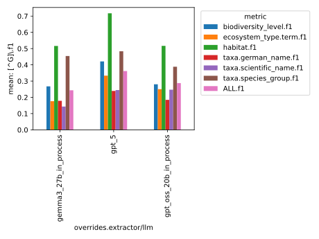
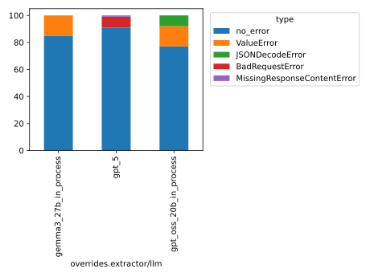

This folder contains the logs of the baseline experiments
conducted with the faktencheck_core_fields_schema and the faktencheck_core_v1 prompt template, across the following LLMs:

- gpt_oss_20b
- gemma3_27b
- gpt_5

See Issue https://github.com/DFKI-NLP/kibad-llm/issues/276  for more documentation.

Evaluation Notebook Parameters:
```python
NAME = "276_baseline_faktencheck_core_v1_no_evi"
METRICS_DIR_PATTERN = "evaluate/**/2026-01-15_11-48-12/"
ERRORS_DIR_PATTERN = "evaluate/**/2026-01-15_11-49-25/"
# set any missing (default) values as column name -> value
FILL_NA = {}
```
IMPORTANT: Since #337, you need the following code to get the `metrics_df` and `errors_df` with this evaluation data correctly:
```python
from kibad_llm.utils.job_return import load

errors_df = (
    pd.DataFrame.from_records(
        load(
            directory=BASE_LOG_DIR / NAME,
            subdir_pattern=ERRORS_DIR_PATTERN,
            strip_id_keys=True,
            flatten=True,
            exclude_keys=EXCLUDE_KEYS,
        )
    )
    .fillna(FILL_NA)
    .fillna(0)
)
# display(errors_df)

metrics_df = pd.DataFrame.from_records(
    load(
        directory=BASE_LOG_DIR / NAME,
        subdir_pattern=METRICS_DIR_PATTERN,
        strip_id_keys=True,
        flatten=True,
        exclude_keys=EXCLUDE_KEYS,
    )
).fillna(FILL_NA)
# display(metrics_df)
```

Inference:

```
./run_in_process.sh -pa "H100-SLT,H100-Trails,H100,A100-80GB" \
-u "-m kibad_llm.predict \
name=276_baseline_faktencheck_core_v1_no_evi \
experiment/predict=faktencheck_core_fields_schema \
pdf_directory=/ds/text/kiba-d/dev-set-100 \
extractor/llm=gpt_oss_20b_in_process,gemma3_27b_in_process,gpt_5 \
seed=42 \
--multirun"
``` 

<details>
<summary>Output</summary>

```
[2026-01-14 15:33:47,173][HYDRA] Saving job_return in /netscratch/hennig/code/kibad-llm/logs/276_baseline_faktencheck_core_v1_no_evi/predict/multiruns/2026-01-14_12-17-33/job_return_value.json
[2026-01-14 15:33:47,178][HYDRA] Saving job_return in /netscratch/hennig/code/kibad-llm/logs/276_baseline_faktencheck_core_v1_no_evi/predict/multiruns/2026-01-14_12-17-33/job_return_value.md
[2026-01-14 15:33:47,198][HYDRA] Contents of /netscratch/hennig/code/kibad-llm/logs/276_baseline_faktencheck_core_v1_no_evi/predict/multiruns/2026-01-14_12-17-33/job_return_value.md:
```

|                                      | branch   | commit_hash                              | is_dirty   | output_file                                                                                                                                            | overrides.experiment/predict   | overrides.extractor.adjust_schema_for_evidence_detection   | overrides.extractor/llm   | overrides.name                          | overrides.pdf_directory     |   overrides.seed |   time_extraction |   time_pdf_conversion |
|:-------------------------------------|:---------|:-----------------------------------------|:-----------|:-------------------------------------------------------------------------------------------------------------------------------------------------------|:-------------------------------|:-----------------------------------------------------------|:--------------------------|:----------------------------------------|:----------------------------|-----------------:|------------------:|----------------------:|
| extractor/llm=gemma3_27b_in_process  | main     | c224f0eafac75c170d28c736c19d718409f42757 | False      | /netscratch/hennig/code/kibad-llm/predictions/276_baseline_faktencheck_core_v1_no_evi/2026-01-14_12-17-33/2026-01-14_13-24-42_934207/predictions.jsonl | faktencheck_core_fields_schema | False                                                      | gemma3_27b_in_process     | 276_baseline_faktencheck_core_v1_no_evi | /ds/text/kiba-d/dev-set-100 |               42 |           1794.17 |            0.0078887  |
| extractor/llm=gpt_5                  | main     | c224f0eafac75c170d28c736c19d718409f42757 | False      | /netscratch/hennig/code/kibad-llm/predictions/276_baseline_faktencheck_core_v1_no_evi/2026-01-14_12-17-33/2026-01-14_13-59-22_006808/predictions.jsonl | faktencheck_core_fields_schema | False                                                      | gpt_5                     | 276_baseline_faktencheck_core_v1_no_evi | /ds/text/kiba-d/dev-set-100 |               42 |           5664.27 |            0.00683928 |
| extractor/llm=gpt_oss_20b_in_process | main     | c224f0eafac75c170d28c736c19d718409f42757 | False      | /netscratch/hennig/code/kibad-llm/predictions/276_baseline_faktencheck_core_v1_no_evi/2026-01-14_12-17-33/2026-01-14_12-17-34_932811/predictions.jsonl | faktencheck_core_fields_schema | False                                                      | gpt_oss_20b_in_process    | 276_baseline_faktencheck_core_v1_no_evi | /ds/text/kiba-d/dev-set-100 |               42 |           3679.74 |            0.0834315  |


</details>

Evaluate F1:

```
uv run -m kibad_llm.evaluate \
name=276_baseline_faktencheck_core_v1_no_evi \
experiment/evaluate=faktencheck_core_f1_micro_flat \ predictions_multirun_logs=[logs/276_baseline_faktencheck_core_v1_no_evi/predict/multiruns/2026-01-14_12-17-33/] \+hydra.callbacks.save_job_return.multirun_markdown_group_by=overrides.extractor/llm \
--multirun
```


<details>
<summary>Output</summary>

```
[2026-01-15 11:48:16,694][HYDRA] Saving job_return in /netscratch/hennig/code/kibad-llm/logs/276_baseline_faktencheck_core_v1_no_evi/evaluate/multiruns/2026-01-15_11-48-12/job_return_value.json                                                                                                                                             
[2026-01-15 11:48:16,700][HYDRA] Saving job_return in /netscratch/hennig/code/kibad-llm/logs/276_baseline_faktencheck_core_v1_no_evi/evaluate/multiruns/2026-01-15_11-48-12/job_return_value.md                                                                                                                                               
[2026-01-15 11:48:16,782][HYDRA] Contents of /netscratch/hennig/code/kibad-llm/logs/276_baseline_faktencheck_core_v1_no_evi/evaluate/multiruns/2026-01-15_11-48-12/job_return_value.md: 
```

| overrides.extractor/llm   |   ALL.f1.mean |   ALL.f1.std |   ALL.precision.mean |   ALL.precision.std |   ALL.recall.mean |   ALL.recall.std |   ALL.support.mean |   ALL.support.std |   AVG.f1.mean |   AVG.f1.std |   AVG.precision.mean |   AVG.precision.std |   AVG.recall.mean |   AVG.recall.std |   AVG.support.mean |   AVG.support.std |   biodiversity_level.f1.mean |   biodiversity_level.f1.std |   biodiversity_level.precision.mean |   biodiversity_level.precision.std |   biodiversity_level.recall.mean |   biodiversity_level.recall.std |   biodiversity_level.support.mean |   biodiversity_level.support.std |   ecosystem_type.term.f1.mean |   ecosystem_type.term.f1.std |   ecosystem_type.term.precision.mean |   ecosystem_type.term.precision.std |   ecosystem_type.term.recall.mean |   ecosystem_type.term.recall.std |   ecosystem_type.term.support.mean |   ecosystem_type.term.support.std |   habitat.f1.mean |   habitat.f1.std |   habitat.precision.mean |   habitat.precision.std |   habitat.recall.mean |   habitat.recall.std |   habitat.support.mean |   habitat.support.std |   prediction.job_return_value.time_extraction.mean |   prediction.job_return_value.time_extraction.std |   prediction.job_return_value.time_pdf_conversion.mean |   prediction.job_return_value.time_pdf_conversion.std |   taxa.german_name.f1.mean |   taxa.german_name.f1.std |   taxa.german_name.precision.mean |   taxa.german_name.precision.std |   taxa.german_name.recall.mean |   taxa.german_name.recall.std |   taxa.german_name.support.mean |   taxa.german_name.support.std |   taxa.scientific_name.f1.mean |   taxa.scientific_name.f1.std |   taxa.scientific_name.precision.mean |   taxa.scientific_name.precision.std |   taxa.scientific_name.recall.mean |   taxa.scientific_name.recall.std |   taxa.scientific_name.support.mean |   taxa.scientific_name.support.std |   taxa.species_group.f1.mean |   taxa.species_group.f1.std |   taxa.species_group.precision.mean |   taxa.species_group.precision.std |   taxa.species_group.recall.mean |   taxa.species_group.recall.std |   taxa.species_group.support.mean |   taxa.species_group.support.std | overrides.experiment/predict       | overrides.extractor.adjust_schema_for_evidence_detection   | overrides.name                              | overrides.pdf_directory         | overrides.seed   | prediction.job_return_value.branch   | prediction.job_return_value.commit_hash      | prediction.job_return_value.is_dirty   | prediction.job_return_value.output_file                                                                                                                    |
|:--------------------------|--------------:|-------------:|---------------------:|--------------------:|------------------:|-----------------:|-------------------:|------------------:|--------------:|-------------:|---------------------:|--------------------:|------------------:|-----------------:|-------------------:|------------------:|-----------------------------:|----------------------------:|------------------------------------:|-----------------------------------:|---------------------------------:|--------------------------------:|----------------------------------:|---------------------------------:|------------------------------:|-----------------------------:|-------------------------------------:|------------------------------------:|----------------------------------:|---------------------------------:|-----------------------------------:|----------------------------------:|------------------:|-----------------:|-------------------------:|------------------------:|----------------------:|---------------------:|-----------------------:|----------------------:|---------------------------------------------------:|--------------------------------------------------:|-------------------------------------------------------:|------------------------------------------------------:|---------------------------:|--------------------------:|----------------------------------:|---------------------------------:|-------------------------------:|------------------------------:|--------------------------------:|-------------------------------:|-------------------------------:|------------------------------:|--------------------------------------:|-------------------------------------:|-----------------------------------:|----------------------------------:|------------------------------------:|-----------------------------------:|-----------------------------:|----------------------------:|------------------------------------:|-----------------------------------:|---------------------------------:|--------------------------------:|----------------------------------:|---------------------------------:|:-----------------------------------|:-----------------------------------------------------------|:--------------------------------------------|:--------------------------------|:-----------------|:-------------------------------------|:---------------------------------------------|:---------------------------------------|:-----------------------------------------------------------------------------------------------------------------------------------------------------------|
| gemma3_27b_in_process     |         0.243 |            0 |                0.191 |                   0 |             0.335 |                0 |                792 |                 0 |         0.289 |            0 |                0.26  |                   0 |             0.368 |                0 |                132 |                 0 |                        0.267 |                           0 |                               0.219 |                                  0 |                            0.343 |                               0 |                                67 |                                0 |                         0.176 |                            0 |                                0.111 |                                   0 |                             0.434 |                                0 |                                 53 |                                 0 |             0.516 |                0 |                    0.518 |                       0 |                 0.514 |                    0 |                    138 |                     0 |                                            1794.17 |                                                 0 |                                                  0.008 |                                                     0 |                      0.178 |                         0 |                             0.146 |                                0 |                          0.229 |                             0 |                             231 |                              0 |                          0.143 |                             0 |                                 0.101 |                                    0 |                              0.244 |                                 0 |                                 197 |                                  0 |                        0.454 |                           0 |                               0.465 |                                  0 |                            0.443 |                               0 |                               106 |                                0 | ['faktencheck_core_fields_schema'] | ['False']                                                  | ['276_baseline_faktencheck_core_v1_no_evi'] | ['/ds/text/kiba-d/dev-set-100'] | ['42']           | ['main']                             | ['c224f0eafac75c170d28c736c19d718409f42757'] | [np.False_]                            | ['/netscratch/hennig/code/kibad-llm/predictions/276_baseline_faktencheck_core_v1_no_evi/2026-01-14_12-17-33/2026-01-14_13-24-42_934207/predictions.jsonl'] |
| gpt_5                     |         0.362 |            0 |                0.286 |                   0 |             0.491 |                0 |                792 |                 0 |         0.406 |            0 |                0.336 |                   0 |             0.564 |                0 |                132 |                 0 |                        0.421 |                           0 |                               0.346 |                                  0 |                            0.537 |                               0 |                                67 |                                0 |                         0.333 |                            0 |                                0.21  |                                   0 |                             0.811 |                                0 |                                 53 |                                 0 |             0.717 |                0 |                    0.684 |                       0 |                 0.754 |                    0 |                    138 |                     0 |                                            5664.27 |                                                 0 |                                                  0.007 |                                                     0 |                      0.239 |                         0 |                             0.194 |                                0 |                          0.312 |                             0 |                             231 |                              0 |                          0.245 |                             0 |                                 0.189 |                                    0 |                              0.345 |                                 0 |                                 197 |                                  0 |                        0.484 |                           0 |                               0.395 |                                  0 |                            0.623 |                               0 |                               106 |                                0 | ['faktencheck_core_fields_schema'] | ['False']                                                  | ['276_baseline_faktencheck_core_v1_no_evi'] | ['/ds/text/kiba-d/dev-set-100'] | ['42']           | ['main']                             | ['c224f0eafac75c170d28c736c19d718409f42757'] | [np.False_]                            | ['/netscratch/hennig/code/kibad-llm/predictions/276_baseline_faktencheck_core_v1_no_evi/2026-01-14_12-17-33/2026-01-14_13-59-22_006808/predictions.jsonl'] |
| gpt_oss_20b_in_process    |         0.288 |            0 |                0.268 |                   0 |             0.311 |                0 |                792 |                 0 |         0.311 |            0 |                0.307 |                   0 |             0.329 |                0 |                132 |                 0 |                        0.28  |                           0 |                               0.244 |                                  0 |                            0.328 |                               0 |                                67 |                                0 |                         0.25  |                            0 |                                0.205 |                                   0 |                             0.321 |                                0 |                                 53 |                                 0 |             0.517 |                0 |                    0.608 |                       0 |                 0.449 |                    0 |                    138 |                     0 |                                            3679.74 |                                                 0 |                                                  0.083 |                                                     0 |                      0.184 |                         0 |                             0.179 |                                0 |                          0.19  |                             0 |                             231 |                              0 |                          0.247 |                             0 |                                 0.205 |                                    0 |                              0.31  |                                 0 |                                 197 |                                  0 |                        0.388 |                           0 |                               0.4   |                                  0 |                            0.377 |                               0 |                               106 |                                0 | ['faktencheck_core_fields_schema'] | ['False']                                                  | ['276_baseline_faktencheck_core_v1_no_evi'] | ['/ds/text/kiba-d/dev-set-100'] | ['42']           | ['main']                             | ['c224f0eafac75c170d28c736c19d718409f42757'] | [np.False_]                            | ['/netscratch/hennig/code/kibad-llm/predictions/276_baseline_faktencheck_core_v1_no_evi/2026-01-14_12-17-33/2026-01-14_12-17-34_932811/predictions.jsonl'] |

</details>



Evaluate Errors:

```
uv run -m kibad_llm.evaluate \
name=276_baseline_faktencheck_core_v1_no_evi \
experiment/evaluate=prediction_errors \
predictions_multirun_logs=[logs/276_baseline_faktencheck_core_v1_no_evi/predict/multiruns/2026-01-14_12-17-33/] \+hydra.callbacks.save_job_return.multirun_markdown_group_by=overrides.extractor/llm \
--multirun
```

<details>
<summary>Output</summary>

```

[2026-01-15 11:49:27,575][HYDRA] Saving job_return in /netscratch/hennig/code/kibad-llm/logs/276_baseline_faktencheck_core_v1_no_evi/evaluate/multiruns/2026-01-15_11-49-25/job_return_value.json
[2026-01-15 11:49:27,688][HYDRA] Saving job_return in /netscratch/hennig/code/kibad-llm/logs/276_baseline_faktencheck_core_v1_no_evi/evaluate/multiruns/2026-01-15_11-49-25/job_return_value.md
[2026-01-15 11:49:27,749][HYDRA] Contents of /netscratch/hennig/code/kibad-llm/logs/276_baseline_faktencheck_core_v1_no_evi/evaluate/multiruns/2026-01-15_11-49-25/job_return_value.md:
```

| overrides.extractor/llm   |   BadRequestError.mean |   BadRequestError.std |   JSONDecodeError.mean |   JSONDecodeError.std |   MissingResponseContentError.mean |   MissingResponseContentError.std |   ValueError.mean |   ValueError.std |   no_error.mean |   no_error.std |   prediction.job_return_value.time_extraction.mean |   prediction.job_return_value.time_extraction.std |   prediction.job_return_value.time_pdf_conversion.mean |   prediction.job_return_value.time_pdf_conversion.std | overrides.experiment/predict       | overrides.extractor.adjust_schema_for_evidence_detection   | overrides.name                              | overrides.pdf_directory         | overrides.seed   | prediction.job_return_value.branch   | prediction.job_return_value.commit_hash      | prediction.job_return_value.is_dirty   | prediction.job_return_value.output_file                                                                                                                    |
|:--------------------------|-----------------------:|----------------------:|-----------------------:|----------------------:|-----------------------------------:|----------------------------------:|------------------:|-----------------:|----------------:|---------------:|---------------------------------------------------:|--------------------------------------------------:|-------------------------------------------------------:|------------------------------------------------------:|:-----------------------------------|:-----------------------------------------------------------|:--------------------------------------------|:--------------------------------|:-----------------|:-------------------------------------|:---------------------------------------------|:---------------------------------------|:-----------------------------------------------------------------------------------------------------------------------------------------------------------|
| gemma3_27b_in_process     |                      0 |                     0 |                      0 |                     0 |                                  0 |                                 0 |                15 |                0 |              85 |              0 |                                            1794.17 |                                                 0 |                                                  0.008 |                                                     0 | ['faktencheck_core_fields_schema'] | ['False']                                                  | ['276_baseline_faktencheck_core_v1_no_evi'] | ['/ds/text/kiba-d/dev-set-100'] | ['42']           | ['main']                             | ['c224f0eafac75c170d28c736c19d718409f42757'] | [np.False_]                            | ['/netscratch/hennig/code/kibad-llm/predictions/276_baseline_faktencheck_core_v1_no_evi/2026-01-14_12-17-33/2026-01-14_13-24-42_934207/predictions.jsonl'] |
| gpt_5                     |                      8 |                     0 |                      0 |                     0 |                                  1 |                                 0 |                 0 |                0 |              91 |              0 |                                            5664.27 |                                                 0 |                                                  0.007 |                                                     0 | ['faktencheck_core_fields_schema'] | ['False']                                                  | ['276_baseline_faktencheck_core_v1_no_evi'] | ['/ds/text/kiba-d/dev-set-100'] | ['42']           | ['main']                             | ['c224f0eafac75c170d28c736c19d718409f42757'] | [np.False_]                            | ['/netscratch/hennig/code/kibad-llm/predictions/276_baseline_faktencheck_core_v1_no_evi/2026-01-14_12-17-33/2026-01-14_13-59-22_006808/predictions.jsonl'] |
| gpt_oss_20b_in_process    |                      0 |                     0 |                      8 |                     0 |                                  0 |                                 0 |                15 |                0 |              77 |              0 |                                            3679.74 |                                                 0 |                                                  0.083 |                                                     0 | ['faktencheck_core_fields_schema'] | ['False']                                                  | ['276_baseline_faktencheck_core_v1_no_evi'] | ['/ds/text/kiba-d/dev-set-100'] | ['42']           | ['main']                             | ['c224f0eafac75c170d28c736c19d718409f42757'] | [np.False_]                            | ['/netscratch/hennig/code/kibad-llm/predictions/276_baseline_faktencheck_core_v1_no_evi/2026-01-14_12-17-33/2026-01-14_12-17-34_932811/predictions.jsonl'] |

</details>




