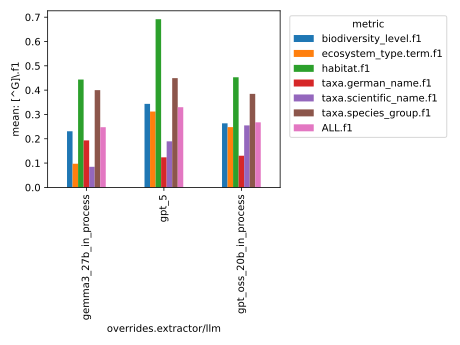
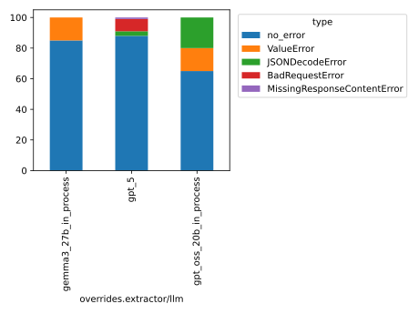

This folder contains the logs of the baseline experiments
conducted with the faktencheck_core_fields_schema_with_evidence and the 
faktencheck_core_v1_with_evidence prompt template, across the following LLMs:

- gpt_oss_20b
- gemma3_27b
- gpt_5

See Issue https://github.com/DFKI-NLP/kibad-llm/issues/260  for more documentation.

Evaluation Notebook Parameters:
```python
NAME = "277_baseline_faktencheck_core_v1_with_evi"
METRICS_DIR_PATTERN = "evaluate/**/2026-01-15_11-58-00/"
ERRORS_DIR_PATTERN = "evaluate/**/2026-01-15_11-59-44/"
# set any missing (default) values as column name -> value
FILL_NA = {}
```
IMPORTANT: Since #337, you need the following code to get the `metrics_df` and `errors_df` with this evaluation data correctly:
```python
from kibad_llm.utils.job_return import load

errors_df = (
    pd.DataFrame.from_records(
        load(
            directory=BASE_LOG_DIR / NAME,
            subdir_pattern=ERRORS_DIR_PATTERN,
            strip_id_keys=True,
            flatten=True,
            exclude_keys=EXCLUDE_KEYS,
        )
    )
    .fillna(FILL_NA)
    .fillna(0)
)
# display(errors_df)

metrics_df = pd.DataFrame.from_records(
    load(
        directory=BASE_LOG_DIR / NAME,
        subdir_pattern=METRICS_DIR_PATTERN,
        strip_id_keys=True,
        flatten=True,
        exclude_keys=EXCLUDE_KEYS,
    )
).fillna(FILL_NA)
# display(metrics_df)
```

Inference:

```
./run_in_process.sh -pa "H100-SLT,H100-Trails,H100,A100-80GB" \
-u "-m kibad_llm.predict \
name=277_baseline_faktencheck_core_v1_with_evi \
experiment/predict=faktencheck_core_fields_schema_with_evidence \
pdf_directory=/ds/text/kiba-d/dev-set-100 \
extractor/llm=gpt_oss_20b_in_process,gemma3_27b_in_process,gpt_5 \
seed=42 \
--multirun"
``` 

<details>
<summary>Output</summary>

```
[2026-01-14 17:06:57,341][HYDRA] Saving job_return in /netscratch/hennig/code/kibad-llm/logs/277_baseline_faktencheck_core_v1_with_evi/predict/multiruns/2026-01-14_12-20-23/job_return_value.json
[2026-01-14 17:06:57,346][HYDRA] Saving job_return in /netscratch/hennig/code/kibad-llm/logs/277_baseline_faktencheck_core_v1_with_evi/predict/multiruns/2026-01-14_12-20-23/job_return_value.md
[2026-01-14 17:06:57,386][HYDRA] Contents of /netscratch/hennig/code/kibad-llm/logs/277_baseline_faktencheck_core_v1_with_evi/predict/multiruns/2026-01-14_12-20-23/job_return_value.md:

```

|                                      | branch   | commit_hash                              | is_dirty   | output_file                                                                                                                                              | overrides.experiment/predict                 | overrides.extractor/llm   | overrides.name                            | overrides.pdf_directory     |   overrides.seed |   time_extraction |   time_pdf_conversion |
|:-------------------------------------|:---------|:-----------------------------------------|:-----------|:---------------------------------------------------------------------------------------------------------------------------------------------------------|:---------------------------------------------|:--------------------------|:------------------------------------------|:----------------------------|-----------------:|------------------:|----------------------:|
| extractor/llm=gemma3_27b_in_process  | main     | c224f0eafac75c170d28c736c19d718409f42757 | False      | /netscratch/hennig/code/kibad-llm/predictions/277_baseline_faktencheck_core_v1_with_evi/2026-01-14_12-20-23/2026-01-14_14-06-30_807154/predictions.jsonl | faktencheck_core_fields_schema_with_evidence | gemma3_27b_in_process     | 277_baseline_faktencheck_core_v1_with_evi | /ds/text/kiba-d/dev-set-100 |               42 |           2151.72 |            0.00756641 |
| extractor/llm=gpt_5                  | main     | c224f0eafac75c170d28c736c19d718409f42757 | False      | /netscratch/hennig/code/kibad-llm/predictions/277_baseline_faktencheck_core_v1_with_evi/2026-01-14_12-20-23/2026-01-14_14-46-24_718856/predictions.jsonl | faktencheck_core_fields_schema_with_evidence | gpt_5                     | 277_baseline_faktencheck_core_v1_with_evi | /ds/text/kiba-d/dev-set-100 |               42 |           8430.83 |            0.00904214 |
| extractor/llm=gpt_oss_20b_in_process | main     | c224f0eafac75c170d28c736c19d718409f42757 | False      | /netscratch/hennig/code/kibad-llm/predictions/277_baseline_faktencheck_core_v1_with_evi/2026-01-14_12-20-23/2026-01-14_12-20-24_387020/predictions.jsonl | faktencheck_core_fields_schema_with_evidence | gpt_oss_20b_in_process    | 277_baseline_faktencheck_core_v1_with_evi | /ds/text/kiba-d/dev-set-100 |               42 |           6163.51 |            0.0203202  |


</details>


Evaluate F1:

```
uv run -m kibad_llm.evaluate \
name=277_baseline_faktencheck_core_v1_with_evi \
experiment/evaluate=faktencheck_core_f1_micro_flat \ 
predictions_multirun_logs=[logs/277_baseline_faktencheck_core_v1_with_evi/predict/multiruns/2026-01-14_12-20-23/] \ 
+hydra.callbacks.save_job_return.multirun_markdown_group_by=overrides.extractor/llm \
--multirun
```

<details>
<summary>Output</summary>

```
[2026-01-15 11:58:04,924][HYDRA] Saving job_return in /netscratch/hennig/code/kibad-llm/logs/277_baseline_faktencheck_core_v1_with_evi/evaluate/multiruns/2026-01-15_11-58-00/job_return_value.json  
[2026-01-15 11:58:04,931][HYDRA] Saving job_return in /netscratch/hennig/code/kibad-llm/logs/277_baseline_faktencheck_core_v1_with_evi/evaluate/multiruns/2026-01-15_11-58-00/job_return_value.md
[2026-01-15 11:58:05,002][HYDRA] Contents of /netscratch/hennig/code/kibad-llm/logs/277_baseline_faktencheck_core_v1_with_evi/evaluate/multiruns/2026-01-15_11-58-00/job_return_value.md:   
```


| overrides.extractor/llm   |   ALL.f1.mean |   ALL.f1.std |   ALL.precision.mean |   ALL.precision.std |   ALL.recall.mean |   ALL.recall.std |   ALL.support.mean |   ALL.support.std |   AVG.f1.mean |   AVG.f1.std |   AVG.precision.mean |   AVG.precision.std |   AVG.recall.mean |   AVG.recall.std |   AVG.support.mean |   AVG.support.std |   biodiversity_level.f1.mean |   biodiversity_level.f1.std |   biodiversity_level.precision.mean |   biodiversity_level.precision.std |   biodiversity_level.recall.mean |   biodiversity_level.recall.std |   biodiversity_level.support.mean |   biodiversity_level.support.std |   ecosystem_type.term.f1.mean |   ecosystem_type.term.f1.std |   ecosystem_type.term.precision.mean |   ecosystem_type.term.precision.std |   ecosystem_type.term.recall.mean |   ecosystem_type.term.recall.std |   ecosystem_type.term.support.mean |   ecosystem_type.term.support.std |   habitat.f1.mean |   habitat.f1.std |   habitat.precision.mean |   habitat.precision.std |   habitat.recall.mean |   habitat.recall.std |   habitat.support.mean |   habitat.support.std |   prediction.job_return_value.time_extraction.mean |   prediction.job_return_value.time_extraction.std |   prediction.job_return_value.time_pdf_conversion.mean |   prediction.job_return_value.time_pdf_conversion.std |   taxa.german_name.f1.mean |   taxa.german_name.f1.std |   taxa.german_name.precision.mean |   taxa.german_name.precision.std |   taxa.german_name.recall.mean |   taxa.german_name.recall.std |   taxa.german_name.support.mean |   taxa.german_name.support.std |   taxa.scientific_name.f1.mean |   taxa.scientific_name.f1.std |   taxa.scientific_name.precision.mean |   taxa.scientific_name.precision.std |   taxa.scientific_name.recall.mean |   taxa.scientific_name.recall.std |   taxa.scientific_name.support.mean |   taxa.scientific_name.support.std |   taxa.species_group.f1.mean |   taxa.species_group.f1.std |   taxa.species_group.precision.mean |   taxa.species_group.precision.std |   taxa.species_group.recall.mean |   taxa.species_group.recall.std |   taxa.species_group.support.mean |   taxa.species_group.support.std | overrides.experiment/predict                     | overrides.name                                | overrides.pdf_directory         | overrides.seed   | prediction.job_return_value.branch   | prediction.job_return_value.commit_hash      | prediction.job_return_value.is_dirty   | prediction.job_return_value.output_file                                                                                                                      |
|:--------------------------|--------------:|-------------:|---------------------:|--------------------:|------------------:|-----------------:|-------------------:|------------------:|--------------:|-------------:|---------------------:|--------------------:|------------------:|-----------------:|-------------------:|------------------:|-----------------------------:|----------------------------:|------------------------------------:|-----------------------------------:|---------------------------------:|--------------------------------:|----------------------------------:|---------------------------------:|------------------------------:|-----------------------------:|-------------------------------------:|------------------------------------:|----------------------------------:|---------------------------------:|-----------------------------------:|----------------------------------:|------------------:|-----------------:|-------------------------:|------------------------:|----------------------:|---------------------:|-----------------------:|----------------------:|---------------------------------------------------:|--------------------------------------------------:|-------------------------------------------------------:|------------------------------------------------------:|---------------------------:|--------------------------:|----------------------------------:|---------------------------------:|-------------------------------:|------------------------------:|--------------------------------:|-------------------------------:|-------------------------------:|------------------------------:|--------------------------------------:|-------------------------------------:|-----------------------------------:|----------------------------------:|------------------------------------:|-----------------------------------:|-----------------------------:|----------------------------:|------------------------------------:|-----------------------------------:|---------------------------------:|--------------------------------:|----------------------------------:|---------------------------------:|:-------------------------------------------------|:----------------------------------------------|:--------------------------------|:-----------------|:-------------------------------------|:---------------------------------------------|:---------------------------------------|:-------------------------------------------------------------------------------------------------------------------------------------------------------------|
| gemma3_27b_in_process     |         0.248 |            0 |                0.284 |                   0 |             0.22  |                0 |                792 |                 0 |         0.242 |            0 |                0.265 |                   0 |             0.244 |                0 |                132 |                 0 |                        0.231 |                           0 |                               0.202 |                                  0 |                            0.269 |                               0 |                                67 |                                0 |                         0.097 |                            0 |                                0.077 |                                   0 |                             0.132 |                                0 |                                 53 |                                 0 |             0.444 |                0 |                    0.461 |                       0 |                 0.428 |                    0 |                    138 |                     0 |                                            2151.72 |                                                 0 |                                                  0.008 |                                                     0 |                      0.193 |                         0 |                             0.344 |                                0 |                          0.134 |                             0 |                             231 |                              0 |                          0.085 |                             0 |                                 0.14  |                                    0 |                              0.061 |                                 0 |                                 197 |                                  0 |                        0.4   |                           0 |                               0.364 |                                  0 |                            0.443 |                               0 |                               106 |                                0 | ['faktencheck_core_fields_schema_with_evidence'] | ['277_baseline_faktencheck_core_v1_with_evi'] | ['/ds/text/kiba-d/dev-set-100'] | ['42']           | ['main']                             | ['c224f0eafac75c170d28c736c19d718409f42757'] | [np.False_]                            | ['/netscratch/hennig/code/kibad-llm/predictions/277_baseline_faktencheck_core_v1_with_evi/2026-01-14_12-20-23/2026-01-14_14-06-30_807154/predictions.jsonl'] |
| gpt_5                     |         0.33  |            0 |                0.304 |                   0 |             0.361 |                0 |                792 |                 0 |         0.352 |            0 |                0.311 |                   0 |             0.443 |                0 |                132 |                 0 |                        0.344 |                           0 |                               0.292 |                                  0 |                            0.418 |                               0 |                                67 |                                0 |                         0.312 |                            0 |                                0.206 |                                   0 |                             0.642 |                                0 |                                 53 |                                 0 |             0.692 |                0 |                    0.656 |                       0 |                 0.732 |                    0 |                    138 |                     0 |                                            8430.83 |                                                 0 |                                                  0.009 |                                                     0 |                      0.124 |                         0 |                             0.163 |                                0 |                          0.1   |                             0 |                             231 |                              0 |                          0.19  |                             0 |                                 0.178 |                                    0 |                              0.203 |                                 0 |                                 197 |                                  0 |                        0.449 |                           0 |                               0.373 |                                  0 |                            0.566 |                               0 |                               106 |                                0 | ['faktencheck_core_fields_schema_with_evidence'] | ['277_baseline_faktencheck_core_v1_with_evi'] | ['/ds/text/kiba-d/dev-set-100'] | ['42']           | ['main']                             | ['c224f0eafac75c170d28c736c19d718409f42757'] | [np.False_]                            | ['/netscratch/hennig/code/kibad-llm/predictions/277_baseline_faktencheck_core_v1_with_evi/2026-01-14_12-20-23/2026-01-14_14-46-24_718856/predictions.jsonl'] |
| gpt_oss_20b_in_process    |         0.268 |            0 |                0.305 |                   0 |             0.239 |                0 |                792 |                 0 |         0.289 |            0 |                0.339 |                   0 |             0.26  |                0 |                132 |                 0 |                        0.264 |                           0 |                               0.274 |                                  0 |                            0.254 |                               0 |                                67 |                                0 |                         0.248 |                            0 |                                0.233 |                                   0 |                             0.264 |                                0 |                                 53 |                                 0 |             0.453 |                0 |                    0.649 |                       0 |                 0.348 |                    0 |                    138 |                     0 |                                            6163.51 |                                                 0 |                                                  0.02  |                                                     0 |                      0.13  |                         0 |                             0.163 |                                0 |                          0.108 |                             0 |                             231 |                              0 |                          0.255 |                             0 |                                 0.256 |                                    0 |                              0.254 |                                 0 |                                 197 |                                  0 |                        0.385 |                           0 |                               0.461 |                                  0 |                            0.33  |                               0 |                               106 |                                0 | ['faktencheck_core_fields_schema_with_evidence'] | ['277_baseline_faktencheck_core_v1_with_evi'] | ['/ds/text/kiba-d/dev-set-100'] | ['42']           | ['main']                             | ['c224f0eafac75c170d28c736c19d718409f42757'] | [np.False_]                            | ['/netscratch/hennig/code/kibad-llm/predictions/277_baseline_faktencheck_core_v1_with_evi/2026-01-14_12-20-23/2026-01-14_12-20-24_387020/predictions.jsonl'] |

</details>



Evaluate errors:

```
uv run -m kibad_llm.evaluate \
name=277_baseline_faktencheck_core_v1_with_evi \
experiment/evaluate=prediction_errors \ 
predictions_multirun_logs=[logs/277_baseline_faktencheck_core_v1_with_evi/predict/multiruns/2026-01-14_12-20-23/] \ 
+hydra.callbacks.save_job_return.multirun_markdown_group_by=overrides.extractor/llm \
--multirun
```

<details>
<summary>Output</summary>

```
[2026-01-15 11:59:48,533][HYDRA] Saving job_return in /netscratch/hennig/code/kibad-llm/logs/277_baseline_faktencheck_core_v1_with_evi/evaluate/multiruns/2026-01-15_11-59-44/job_return_value.json
[2026-01-15 11:59:48,539][HYDRA] Saving job_return in /netscratch/hennig/code/kibad-llm/logs/277_baseline_faktencheck_core_v1_with_evi/evaluate/multiruns/2026-01-15_11-59-44/job_return_value.md
[2026-01-15 11:59:48,814][HYDRA] Contents of /netscratch/hennig/code/kibad-llm/logs/277_baseline_faktencheck_core_v1_with_evi/evaluate/multiruns/2026-01-15_11-59-44/job_return_value.md:

```

| overrides.extractor/llm   |   BadRequestError.mean |   BadRequestError.std |   JSONDecodeError.mean |   JSONDecodeError.std |   MissingResponseContentError.mean |   MissingResponseContentError.std |   ValueError.mean |   ValueError.std |   no_error.mean |   no_error.std |   prediction.job_return_value.time_extraction.mean |   prediction.job_return_value.time_extraction.std |   prediction.job_return_value.time_pdf_conversion.mean |   prediction.job_return_value.time_pdf_conversion.std | overrides.experiment/predict                     | overrides.name                                | overrides.pdf_directory         | overrides.seed   | prediction.job_return_value.branch   | prediction.job_return_value.commit_hash      | prediction.job_return_value.is_dirty   | prediction.job_return_value.output_file                                                                                                                      |
|:--------------------------|-----------------------:|----------------------:|-----------------------:|----------------------:|-----------------------------------:|----------------------------------:|------------------:|-----------------:|----------------:|---------------:|---------------------------------------------------:|--------------------------------------------------:|-------------------------------------------------------:|------------------------------------------------------:|:-------------------------------------------------|:----------------------------------------------|:--------------------------------|:-----------------|:-------------------------------------|:---------------------------------------------|:---------------------------------------|:-------------------------------------------------------------------------------------------------------------------------------------------------------------|
| gemma3_27b_in_process     |                      0 |                     0 |                      0 |                     0 |                                  0 |                                 0 |                15 |                0 |              85 |              0 |                                            2151.72 |                                                 0 |                                                  0.008 |                                                     0 | ['faktencheck_core_fields_schema_with_evidence'] | ['277_baseline_faktencheck_core_v1_with_evi'] | ['/ds/text/kiba-d/dev-set-100'] | ['42']           | ['main']                             | ['c224f0eafac75c170d28c736c19d718409f42757'] | [np.False_]                            | ['/netscratch/hennig/code/kibad-llm/predictions/277_baseline_faktencheck_core_v1_with_evi/2026-01-14_12-20-23/2026-01-14_14-06-30_807154/predictions.jsonl'] |
| gpt_5                     |                      8 |                     0 |                      3 |                     0 |                                  1 |                                 0 |                 0 |                0 |              88 |              0 |                                            8430.83 |                                                 0 |                                                  0.009 |                                                     0 | ['faktencheck_core_fields_schema_with_evidence'] | ['277_baseline_faktencheck_core_v1_with_evi'] | ['/ds/text/kiba-d/dev-set-100'] | ['42']           | ['main']                             | ['c224f0eafac75c170d28c736c19d718409f42757'] | [np.False_]                            | ['/netscratch/hennig/code/kibad-llm/predictions/277_baseline_faktencheck_core_v1_with_evi/2026-01-14_12-20-23/2026-01-14_14-46-24_718856/predictions.jsonl'] |
| gpt_oss_20b_in_process    |                      0 |                     0 |                     20 |                     0 |                                  0 |                                 0 |                15 |                0 |              65 |              0 |                                            6163.51 |                                                 0 |                                                  0.02  |                                                     0 | ['faktencheck_core_fields_schema_with_evidence'] | ['277_baseline_faktencheck_core_v1_with_evi'] | ['/ds/text/kiba-d/dev-set-100'] | ['42']           | ['main']                             | ['c224f0eafac75c170d28c736c19d718409f42757'] | [np.False_]                            | ['/netscratch/hennig/code/kibad-llm/predictions/277_baseline_faktencheck_core_v1_with_evi/2026-01-14_12-20-23/2026-01-14_12-20-24_387020/predictions.jsonl'] |


</details>



Copy to kibad_llm:
```
scp -r gpu-cluster3:/netscratch/hennig/kiba-d/logs/277_baseline_faktencheck_core_v1_with_evi ./logs/ 
scp -r gpu-cluster3:/netscratch/hennig/kiba-d/predictions/277_baseline_faktencheck_core_v1_with_evi ./predictions/ 
```