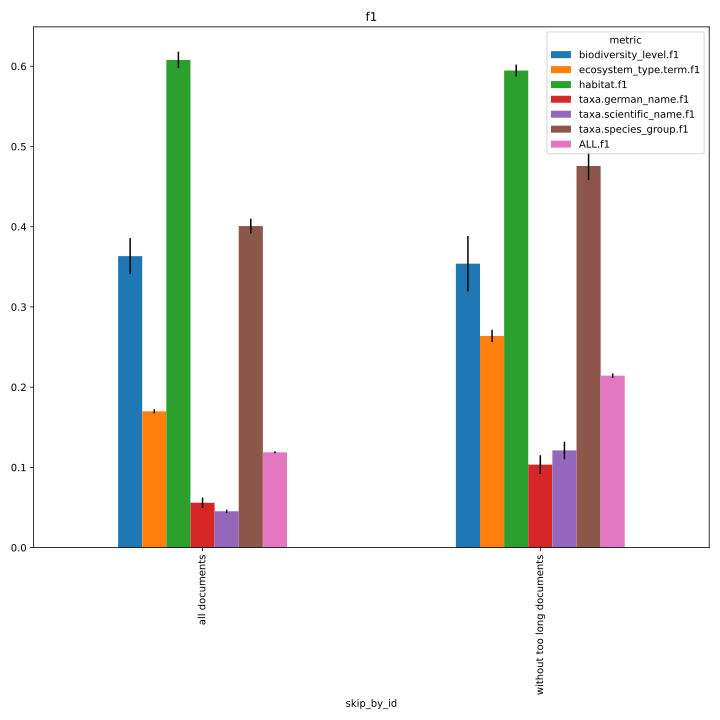
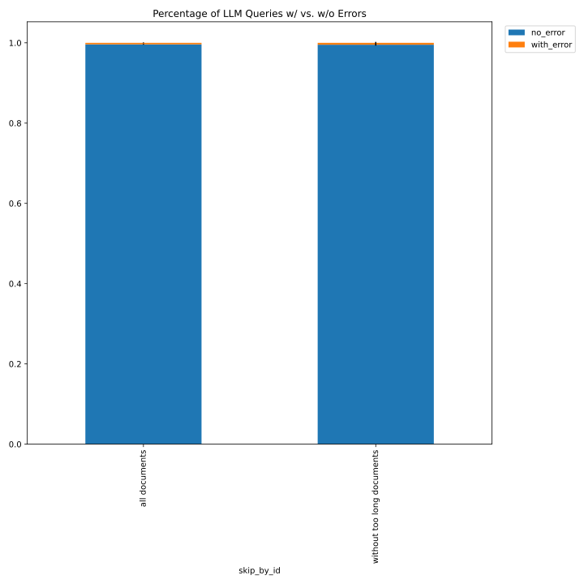
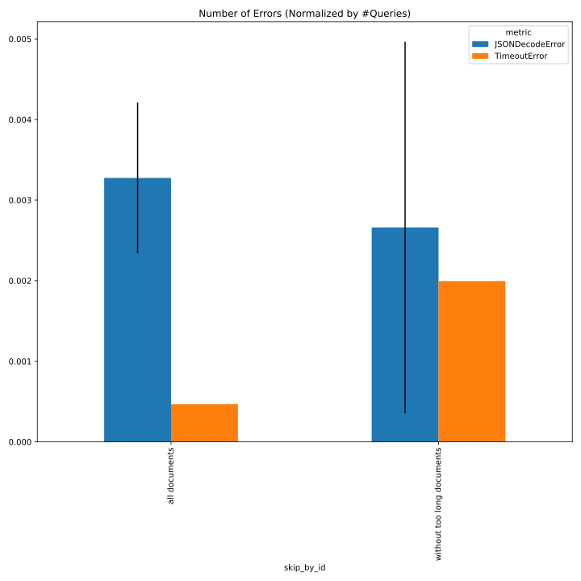

# faktencheck_core_v1_for_chunking

See [#282](https://github.com/DFKI-NLP/kibad-llm/pull/282) for details.

This focuses on the chunking extractor which has two purposes.  
By chunking the input documents,
- documents longer than the models context window can be processed
- the amount of context is reduced, thus hopefully reducing the needle in the haystack problem

## notebook parameters

### just this experiment

```python
NAME = "282_faktencheck_core_v1_for_chunking"

# used to group the data
INDEX_COLUMNS = ["overrides.dataset.predictions.skip_by_id"]

# replace this very long thing with a descriptive caption 
MAP_VALUES = {
    INDEX_COLUMNS[0]: lambda x: "without too long documents" if x == "[2E9XWUUE,2EUNPHDZ,2P53UVJA,2RXMDX8I,3LGPK6BL,3WEEGFGW,46RX4AEN,4YXRYRJC,4Z67G9T5,5SIYLM9W,6D23L7B5,6G2THNDX,7DSY6RMR,84QQ9F5S,885FDL5Z]" else x
}
FILL_NA = {"overrides.dataset.predictions.skip_by_id": "all documents"}


PLOT_KWARGS = {
    # can be either "metric" or one of the INDEX_COLUMNS (or multiple of them)
    "xgroup": "metric",
    # add any more arguments passed to pd.DataFrame.plot
    #"create_subplot_for_each": "overrides.dataset.predictions.skip_by_id",
    # add any more arguments passed to pd.DataFrame.plot
    #"subplot_columns": 2,
}
```






### comparison with baseline
```python
NAME = "282_faktencheck_core_v1_for_chunking"

SUBDIR = [
    "evaluate", 
    "../327_faktencheck_core_with_persona/evaluate",
    "../327_faktencheck_core_with_persona_docs_not_too_long/evaluate",
]
# replace this very long thing with a descriptive caption 
MAP_VALUES = {
    ""overrides.dataset.predictions.skip_by_id"": lambda x: "without too long documents" if x == "[2E9XWUUE,2EUNPHDZ,2P53UVJA,2RXMDX8I,3LGPK6BL,3WEEGFGW,46RX4AEN,4YXRYRJC,4Z67G9T5,5SIYLM9W,6D23L7B5,6G2THNDX,7DSY6RMR,84QQ9F5S,885FDL5Z]" else x
}
FILL_NA = {"overrides.dataset.predictions.skip_by_id": "all documents"}

# used to group the data
INDEX_COLUMNS = ["prediction.overrides.extractor/llm", "prediction.overrides.experiment/predict", "overrides.dataset.predictions.skip_by_id"]
PLOT_KWARGS = {
    # can be either "metric" or one of the INDEX_COLUMNS (or multiple of them)
    "xgroup": ["prediction.overrides.experiment/predict"],
    # add any more arguments passed to pd.DataFrame.plot
    "create_subplot_for_each": ["metric", "overrides.dataset.predictions.skip_by_id"],
    # add any more arguments passed to pd.DataFrame.plot
    "subplot_columns": 2,
    #"shorten_labels": False,
}
FILE_NAME_PREFIX = "baseline_"
```


## inference
 - based on command from [here](https://github.com/DFKI-NLP/kibad-llm/pull/282#issuecomment-3884800358)
 - use `name=282_faktencheck_core_v1_for_chunking`
 - set `experiment/predict=faktencheck_core_fields_schema_with_chunking`
 - with `extractor/llm=gpt_oss_20b_in_process` because this evaluation targets gpt-oss-20b only.
```
./run_in_process.sh -t "2-00:00:00" -pa "H100-SLT,H100-Trails,H100,A100-80GB" -u "-m kibad_llm.predict \
name=282_faktencheck_core_v1_for_chunking \
experiment/predict=faktencheck_core_fields_schema_with_chunking \
pdf_directory=/ds/text/kiba-d/dev-set-100 \
extractor/llm=gpt_oss_20b_in_process \
seed=42,1337,7331 \
--multirun" 
```

[2026-03-07 13:42:22,996][HYDRA] Contents of /home/hmeinhof/programming/kiba/logs/282_faktencheck_core_v1_for_chunking/predict/multiruns/2026-03-06_14-41-29/job_return_value.md:

<details>
<summary>click to see content</summary>

|           | branch                  | commit_hash                              | is_dirty   | output_file                                                                                                       | output_file_absolute                                                                                                                              | overrides.experiment/predict                 | overrides.extractor.verbose   | overrides.extractor/llm   | overrides.name                       | overrides.pdf_directory     |   overrides.seed |   slurm_job_id |   time_end |   time_extraction |   time_pdf_conversion |   time_start |
|:----------|:------------------------|:-----------------------------------------|:-----------|:------------------------------------------------------------------------------------------------------------------|:--------------------------------------------------------------------------------------------------------------------------------------------------|:---------------------------------------------|:------------------------------|:--------------------------|:-------------------------------------|:----------------------------|-----------------:|---------------:|-----------:|------------------:|----------------------:|-------------:|
| seed=1337 | feat/chunking-extractor | 1501df109f57d69925494f939b999602ec48af66 | False      | predictions/282_faktencheck_core_v1_for_chunking/2026-03-06_14-41-29/2026-03-06_22-13-16_885521/predictions.jsonl | /home/hmeinhof/programming/kiba/predictions/282_faktencheck_core_v1_for_chunking/2026-03-06_14-41-29/2026-03-06_22-13-16_885521/predictions.jsonl | faktencheck_core_fields_schema_with_chunking | True                          | gpt_oss_20b_in_process    | 282_faktencheck_core_v1_for_chunking | /ds/text/kiba-d/dev-set-100 |             1337 |        2603632 | 1772859697 |           28040   |            0.00280203 |   1772831596 |
| seed=42   | feat/chunking-extractor | 8db48b24353d046e2db3c20936ef4bd23889cc95 | False      | predictions/282_faktencheck_core_v1_for_chunking/2026-03-06_14-41-29/2026-03-06_14-41-29_775295/predictions.jsonl | /home/hmeinhof/programming/kiba/predictions/282_faktencheck_core_v1_for_chunking/2026-03-06_14-41-29/2026-03-06_14-41-29_775295/predictions.jsonl | faktencheck_core_fields_schema_with_chunking | True                          | gpt_oss_20b_in_process    | 282_faktencheck_core_v1_for_chunking | /ds/text/kiba-d/dev-set-100 |               42 |        2603632 | 1772831596 |           26990.2 |            0.00414103 |   1772804489 |
| seed=7331 | feat/chunking-extractor | 1501df109f57d69925494f939b999602ec48af66 | False      | predictions/282_faktencheck_core_v1_for_chunking/2026-03-06_14-41-29/2026-03-07_06-01-38_094319/predictions.jsonl | /home/hmeinhof/programming/kiba/predictions/282_faktencheck_core_v1_for_chunking/2026-03-06_14-41-29/2026-03-07_06-01-38_094319/predictions.jsonl | faktencheck_core_fields_schema_with_chunking | True                          | gpt_oss_20b_in_process    | 282_faktencheck_core_v1_for_chunking | /ds/text/kiba-d/dev-set-100 |             7331 |        2603632 | 1772887342 |           27582.7 |            0.00483799 |   1772859698 |
</details>

## evaluate
- compare with results from [here (`2026-01-23_16-12-26`)](https://github.com/DFKI-NLP/kibad-llm/tree/main/data/prediction_results/logs/311_better_default_temperature) and [here (gpt 5; `2026-01-20_15-40-40`)](https://github.com/DFKI-NLP/kibad-llm/tree/main/data/prediction_results/logs/261_baseline_faktencheck_core_variance#run-all-with-temperature10-and-return_reasoningtrue)

### f1

**f1 with long documents**
```
uv run -m kibad_llm.evaluate \
name=282_faktencheck_core_v1_for_chunking \
experiment/evaluate=faktencheck_core_f1_micro_flat \
prediction_logs=logs/282_faktencheck_core_v1_for_chunking/predict/multiruns/2026-03-06_15-59-25/
```

<details>
<summary>click to see content</summary>

|                                                                                                           |   ALL.f1 |   ALL.precision |   ALL.recall |   ALL.support |   AVG.f1 |   AVG.precision |   AVG.recall |   AVG.support |   biodiversity_level.f1 |   biodiversity_level.precision |   biodiversity_level.recall |   biodiversity_level.support |   ecosystem_type.term.f1 |   ecosystem_type.term.precision |   ecosystem_type.term.recall |   ecosystem_type.term.support |   habitat.f1 |   habitat.precision |   habitat.recall |   habitat.support | overrides.dataset.predictions.log                                                 | overrides.experiment/evaluate   | overrides.name                       | overrides.prediction_logs                                                        | prediction.job_return_value.branch   | prediction.job_return_value.commit_hash   | prediction.job_return_value.is_dirty   | prediction.job_return_value.output_file                                                                           | prediction.job_return_value.output_file_absolute                                                                                                  |   prediction.job_return_value.slurm_job_id |   prediction.job_return_value.time_end |   prediction.job_return_value.time_extraction |   prediction.job_return_value.time_pdf_conversion |   prediction.job_return_value.time_start | prediction.overrides.experiment/predict      | prediction.overrides.extractor/llm   | prediction.overrides.name            | prediction.overrides.pdf_directory   |   prediction.overrides.seed |   taxa.german_name.f2 |   taxa.german_name.precision |   taxa.german_name.recall |   taxa.german_name.support |   taxa.scientific_name.f1 |   taxa.scientific_name.precision |   taxa.scientific_name.recall |   taxa.scientific_name.support |   taxa.species_group.f1 |   taxa.species_group.precision |   taxa.species_group.recall |   taxa.species_group.support |
|:----------------------------------------------------------------------------------------------------------|---------:|----------------:|-------------:|--------------:|---------:|----------------:|-------------:|--------------:|------------------------:|-------------------------------:|----------------------------:|-----------------------------:|-------------------------:|--------------------------------:|-----------------------------:|------------------------------:|-------------:|--------------------:|-----------------:|------------------:|:----------------------------------------------------------------------------------|:--------------------------------|:-------------------------------------|:---------------------------------------------------------------------------------|:-------------------------------------|:------------------------------------------|:---------------------------------------|:------------------------------------------------------------------------------------------------------------------|:--------------------------------------------------------------------------------------------------------------------------------------------------|-------------------------------------------:|---------------------------------------:|----------------------------------------------:|--------------------------------------------------:|-----------------------------------------:|:---------------------------------------------|:-------------------------------------|:-------------------------------------|:-------------------------------------|----------------------------:|----------------------:|-----------------------------:|--------------------------:|---------------------------:|--------------------------:|---------------------------------:|------------------------------:|-------------------------------:|------------------------:|-------------------------------:|----------------------------:|-----------------------------:|
| dataset.predictions.log=logs/282_faktencheck_core_v1_for_chunking/predict/multiruns/2026-03-06_15-59-25/0 | 0.11744  |       0.0664452 |     0.505051 |           792 | 0.275439 |        0.193754 |     0.575464 |           132 |                0.387352 |                       0.263441 |                    0.731343 |                           67 |                 0.167183 |                        0.1      |                     0.509434 |                            53 |     0.607527 |            0.482906 |         0.818841 |               138 | logs/282_faktencheck_core_v1_for_chunking/predict/multiruns/2026-03-06_15-59-25/0 | faktencheck_core_f1_micro_flat  | 282_faktencheck_core_v1_for_chunking | logs/282_faktencheck_core_v1_for_chunking/predict/multiruns/2026-03-06_15-59-25/ | feat/chunking-extractor              | 1501df109f57d69925494f939b999602ec48af66  | False                                  | predictions/282_faktencheck_core_v1_for_chunking/2026-03-06_15-59-25/2026-03-06_15-59-26_300601/predictions.jsonl | /home/hmeinhof/programming/kiba/predictions/282_faktencheck_core_v1_for_chunking/2026-03-06_15-59-25/2026-03-06_15-59-26_300601/predictions.jsonl |                                    2604133 |                             1772836403 |                                       27123.8 |                                        0.00330189 |                               1772809166 | faktencheck_core_fields_schema_with_chunking | gpt_oss_20b_in_process               | 282_faktencheck_core_v1_for_chunking | /ds/text/kiba-d/dev-set-100          |                          42 |             0.0541645 |                    0.0307068 |                  0.229437 |                        231 |                 0.0430416 |                        0.0228102 |                      0.380711 |                            197 |                0.393365 |                       0.262658 |                    0.783019 |                          106 |
| dataset.predictions.log=logs/282_faktencheck_core_v1_for_chunking/predict/multiruns/2026-03-06_15-59-25/1 | 0.119864 |       0.0679106 |     0.510101 |           792 | 0.272898 |        0.193257 |     0.56849  |           132 |                0.359833 |                       0.25     |                    0.641791 |                           67 |                 0.172308 |                        0.102941 |                     0.528302 |                            53 |     0.597826 |            0.478261 |         0.797101 |               138 | logs/282_faktencheck_core_v1_for_chunking/predict/multiruns/2026-03-06_15-59-25/1 | faktencheck_core_f1_micro_flat  | 282_faktencheck_core_v1_for_chunking | logs/282_faktencheck_core_v1_for_chunking/predict/multiruns/2026-03-06_15-59-25/ | feat/chunking-extractor              | 1501df109f57d69925494f939b999602ec48af66  | False                                  | predictions/282_faktencheck_core_v1_for_chunking/2026-03-06_15-59-25/2026-03-06_23-33-23_835428/predictions.jsonl | /home/hmeinhof/programming/kiba/predictions/282_faktencheck_core_v1_for_chunking/2026-03-06_15-59-25/2026-03-06_23-33-23_835428/predictions.jsonl |                                    2604133 |                             1772863685 |                                       27215   |                                        0.00290008 |                               1772836403 | faktencheck_core_fields_schema_with_chunking | gpt_oss_20b_in_process               | 282_faktencheck_core_v1_for_chunking | /ds/text/kiba-d/dev-set-100          |                        1337 |             0.0632124 |                    0.0359035 |                  0.264069 |                        231 |                 0.0461494 |                        0.0244648 |                      0.406091 |                            197 |                0.398058 |                       0.267974 |                    0.773585 |                          106 |
| dataset.predictions.log=logs/282_faktencheck_core_v1_for_chunking/predict/multiruns/2026-03-06_15-59-25/2 | 0.118964 |       0.067702  |     0.489899 |           792 | 0.273294 |        0.195525 |     0.555293 |           132 |                0.342857 |                       0.235955 |                    0.626866 |                           67 |                 0.170213 |                        0.101449 |                     0.528302 |                            53 |     0.618384 |            0.502262 |         0.804348 |               138 | logs/282_faktencheck_core_v1_for_chunking/predict/multiruns/2026-03-06_15-59-25/2 | faktencheck_core_f1_micro_flat  | 282_faktencheck_core_v1_for_chunking | logs/282_faktencheck_core_v1_for_chunking/predict/multiruns/2026-03-06_15-59-25/ | feat/chunking-extractor              | 1501df109f57d69925494f939b999602ec48af66  | False                                  | predictions/282_faktencheck_core_v1_for_chunking/2026-03-06_15-59-25/2026-03-07_07-08-05_394101/predictions.jsonl | /home/hmeinhof/programming/kiba/predictions/282_faktencheck_core_v1_for_chunking/2026-03-06_15-59-25/2026-03-07_07-08-05_394101/predictions.jsonl |                                    2604133 |                             1772890884 |                                       27141.6 |                                        0.00359324 |                               1772863685 | faktencheck_core_fields_schema_with_chunking | gpt_oss_20b_in_process               | 282_faktencheck_core_v1_for_chunking | /ds/text/kiba-d/dev-set-100          |                        7331 |             0.0504467 |                    0.0287081 |                  0.207792 |                        231 |                 0.046837  |                        0.024911  |                      0.390863 |                            197 |                0.411028 |                       0.279863 |                    0.773585 |                          106 |
</details>

**f1 without long documents**
```
uv run -m kibad_llm.evaluate \
name=282_faktencheck_core_v1_for_chunking \
experiment/evaluate=faktencheck_core_f1_micro_flat \
+dataset.predictions.skip_by_id=[2E9XWUUE,2EUNPHDZ,2P53UVJA,2RXMDX8I,3LGPK6BL,3WEEGFGW,46RX4AEN,4YXRYRJC,4Z67G9T5,5SIYLM9W,6D23L7B5,6G2THNDX,7DSY6RMR,84QQ9F5S,885FDL5Z] \
prediction_logs=logs/282_faktencheck_core_v1_for_chunking/predict/multiruns/2026-03-06_15-59-25/
```

<details>
<summary>click to see content</summary>
|                                                                                                           |   ALL.f1 |   ALL.precision |   ALL.recall |   ALL.support |   AVG.f1 |   AVG.precision |   AVG.recall |   AVG.support |   biodiversity_level.f1 |   biodiversity_level.precision |   biodiversity_level.recall |   biodiversity_level.support |   ecosystem_type.term.f1 |   ecosystem_type.term.precision |   ecosystem_type.term.recall |   ecosystem_type.term.support |   habitat.f1 |   habitat.precision |   habitat.recall |   habitat.support | overrides.dataset.predictions.log                                                 | overrides.dataset.predictions.skip_by_id                                                                                                 | overrides.experiment/evaluate   | overrides.name                       | overrides.prediction_logs                                                        | prediction.job_return_value.branch   | prediction.job_return_value.commit_hash   | prediction.job_return_value.is_dirty   | prediction.job_return_value.output_file                                                                           | prediction.job_return_value.output_file_absolute                                                                                                  |   prediction.job_return_value.slurm_job_id |   prediction.job_return_value.time_end |   prediction.job_return_value.time_extraction |   prediction.job_return_value.time_pdf_conversion |   prediction.job_return_value.time_start | prediction.overrides.experiment/predict      | prediction.overrides.extractor/llm   | prediction.overrides.name            | prediction.overrides.pdf_directory   |   prediction.overrides.seed |   taxa.german_name.f1 |   taxa.german_name.precision |   taxa.german_name.recall |   taxa.german_name.support |   taxa.scientific_name.f1 |   taxa.scientific_name.precision |   taxa.scientific_name.recall |   taxa.scientific_name.support |   taxa.species_group.f1 |   taxa.species_group.precision |   taxa.species_group.recall |   taxa.species_group.support |
|:----------------------------------------------------------------------------------------------------------|---------:|----------------:|-------------:|--------------:|---------:|----------------:|-------------:|--------------:|------------------------:|-------------------------------:|----------------------------:|-----------------------------:|-------------------------:|--------------------------------:|-----------------------------:|------------------------------:|-------------:|--------------------:|-----------------:|------------------:|:----------------------------------------------------------------------------------|:-----------------------------------------------------------------------------------------------------------------------------------------|:--------------------------------|:-------------------------------------|:---------------------------------------------------------------------------------|:-------------------------------------|:------------------------------------------|:---------------------------------------|:------------------------------------------------------------------------------------------------------------------|:--------------------------------------------------------------------------------------------------------------------------------------------------|-------------------------------------------:|---------------------------------------:|----------------------------------------------:|--------------------------------------------------:|-----------------------------------------:|:---------------------------------------------|:-------------------------------------|:-------------------------------------|:-------------------------------------|----------------------------:|----------------------:|-----------------------------:|--------------------------:|---------------------------:|--------------------------:|---------------------------------:|------------------------------:|-------------------------------:|------------------------:|-------------------------------:|----------------------------:|-----------------------------:|
| dataset.predictions.log=logs/282_faktencheck_core_v1_for_chunking/predict/multiruns/2026-03-06_15-59-25/0 | 0.211272 |        0.135969 |     0.473525 |           661 | 0.324337 |        0.237978 |     0.552759 |       110.167 |                0.388571 |                       0.265625 |                    0.723404 |                           47 |                 0.272727 |                        0.188976 |                     0.489796 |                            49 |     0.60076  |            0.496855 |         0.759615 |               104 | logs/282_faktencheck_core_v1_for_chunking/predict/multiruns/2026-03-06_15-59-25/0 | [2E9XWUUE,2EUNPHDZ,2P53UVJA,2RXMDX8I,3LGPK6BL,3WEEGFGW,46RX4AEN,4YXRYRJC,4Z67G9T5,5SIYLM9W,6D23L7B5,6G2THNDX,7DSY6RMR,84QQ9F5S,885FDL5Z] | faktencheck_core_f1_micro_flat  | 282_faktencheck_core_v1_for_chunking | logs/282_faktencheck_core_v1_for_chunking/predict/multiruns/2026-03-06_15-59-25/ | feat/chunking-extractor              | 1501df109f57d69925494f939b999602ec48af66  | False                                  | predictions/282_faktencheck_core_v1_for_chunking/2026-03-06_15-59-25/2026-03-06_15-59-26_300601/predictions.jsonl | /home/hmeinhof/programming/kiba/predictions/282_faktencheck_core_v1_for_chunking/2026-03-06_15-59-25/2026-03-06_15-59-26_300601/predictions.jsonl |                                    2604133 |                             1772836403 |                                       27123.8 |                                        0.00330189 |                               1772809166 | faktencheck_core_fields_schema_with_chunking | gpt_oss_20b_in_process               | 282_faktencheck_core_v1_for_chunking | /ds/text/kiba-d/dev-set-100          |                          42 |             0.108295  |                    0.0702541 |                  0.236181 |                        199 |                  0.109001 |                        0.0637681 |                      0.375    |                            176 |                0.466667 |                       0.342391 |                    0.732558 |                           86 |
| dataset.predictions.log=logs/282_faktencheck_core_v1_for_chunking/predict/multiruns/2026-03-06_15-59-25/1 | 0.215311 |        0.139073 |     0.476551 |           661 | 0.316784 |        0.232417 |     0.539901 |       110.167 |                0.353659 |                       0.247863 |                    0.617021 |                           47 |                 0.259459 |                        0.176471 |                     0.489796 |                            49 |     0.586466 |            0.481481 |         0.75     |               104 | logs/282_faktencheck_core_v1_for_chunking/predict/multiruns/2026-03-06_15-59-25/1 | [2E9XWUUE,2EUNPHDZ,2P53UVJA,2RXMDX8I,3LGPK6BL,3WEEGFGW,46RX4AEN,4YXRYRJC,4Z67G9T5,5SIYLM9W,6D23L7B5,6G2THNDX,7DSY6RMR,84QQ9F5S,885FDL5Z] | faktencheck_core_f1_micro_flat  | 282_faktencheck_core_v1_for_chunking | logs/282_faktencheck_core_v1_for_chunking/predict/multiruns/2026-03-06_15-59-25/ | feat/chunking-extractor              | 1501df109f57d69925494f939b999602ec48af66  | False                                  | predictions/282_faktencheck_core_v1_for_chunking/2026-03-06_15-59-25/2026-03-06_23-33-23_835428/predictions.jsonl | /home/hmeinhof/programming/kiba/predictions/282_faktencheck_core_v1_for_chunking/2026-03-06_15-59-25/2026-03-06_23-33-23_835428/predictions.jsonl |                                    2604133 |                             1772863685 |                                       27215   |                                        0.00290008 |                               1772836403 | faktencheck_core_fields_schema_with_chunking | gpt_oss_20b_in_process               | 282_faktencheck_core_v1_for_chunking | /ds/text/kiba-d/dev-set-100          |                        1337 |             0.112019  |                    0.0729483 |                  0.241206 |                        199 |                  0.124684 |                        0.0731949 |                      0.420455 |                            176 |                0.464419 |                       0.342541 |                    0.72093  |                           86 |
| dataset.predictions.log=logs/282_faktencheck_core_v1_for_chunking/predict/multiruns/2026-03-06_15-59-25/2 | 0.216551 |        0.142651 |     0.449319 |           661 | 0.315322 |        0.235065 |     0.519306 |       110.167 |                0.319527 |                       0.221311 |                    0.574468 |                           47 |                 0.259459 |                        0.176471 |                     0.489796 |                            49 |     0.596899 |            0.5      |         0.740385 |               104 | logs/282_faktencheck_core_v1_for_chunking/predict/multiruns/2026-03-06_15-59-25/2 | [2E9XWUUE,2EUNPHDZ,2P53UVJA,2RXMDX8I,3LGPK6BL,3WEEGFGW,46RX4AEN,4YXRYRJC,4Z67G9T5,5SIYLM9W,6D23L7B5,6G2THNDX,7DSY6RMR,84QQ9F5S,885FDL5Z] | faktencheck_core_f1_micro_flat  | 282_faktencheck_core_v1_for_chunking | logs/282_faktencheck_core_v1_for_chunking/predict/multiruns/2026-03-06_15-59-25/ | feat/chunking-extractor              | 1501df109f57d69925494f939b999602ec48af66  | False                                  | predictions/282_faktencheck_core_v1_for_chunking/2026-03-06_15-59-25/2026-03-07_07-08-05_394101/predictions.jsonl | /home/hmeinhof/programming/kiba/predictions/282_faktencheck_core_v1_for_chunking/2026-03-06_15-59-25/2026-03-07_07-08-05_394101/predictions.jsonl |                                    2604133 |                             1772890884 |                                       27141.6 |                                        0.00359324 |                               1772863685 | faktencheck_core_fields_schema_with_chunking | gpt_oss_20b_in_process               | 282_faktencheck_core_v1_for_chunking | /ds/text/kiba-d/dev-set-100          |                        7331 |             0.0901126 |                    0.06      |                  0.180905 |                        199 |                  0.12987  |                        0.0776053 |                      0.397727 |                            176 |                0.496063 |                       0.375    |                    0.732558 |                           86 |
</details>
### errors

**errors with long documents**
```
uv run -m kibad_llm.evaluate \
name=282_faktencheck_core_v1_for_chunking \
experiment/evaluate=prediction_errors \
prediction_logs=logs/282_faktencheck_core_v1_for_chunking/predict/multiruns/2026-03-06_15-59-25/
```


<details>
<summary>click to see content</summary>

|                                                                                                           |   JSONDecodeError |   TimeoutError |   no_error | overrides.dataset.predictions.log                                                 | overrides.experiment/evaluate   | overrides.name                       | overrides.prediction_logs                                                        | prediction.job_return_value.branch   | prediction.job_return_value.commit_hash   | prediction.job_return_value.is_dirty   | prediction.job_return_value.output_file                                                                           | prediction.job_return_value.output_file_absolute                                                                                                  |   prediction.job_return_value.slurm_job_id |   prediction.job_return_value.time_end |   prediction.job_return_value.time_extraction |   prediction.job_return_value.time_pdf_conversion |   prediction.job_return_value.time_start | prediction.overrides.experiment/predict      | prediction.overrides.extractor/llm   | prediction.overrides.name            | prediction.overrides.pdf_directory   |   prediction.overrides.seed |   with_error |
|:----------------------------------------------------------------------------------------------------------|------------------:|---------------:|-----------:|:----------------------------------------------------------------------------------|:--------------------------------|:-------------------------------------|:---------------------------------------------------------------------------------|:-------------------------------------|:------------------------------------------|:---------------------------------------|:------------------------------------------------------------------------------------------------------------------|:--------------------------------------------------------------------------------------------------------------------------------------------------|-------------------------------------------:|---------------------------------------:|----------------------------------------------:|--------------------------------------------------:|-----------------------------------------:|:---------------------------------------------|:-------------------------------------|:-------------------------------------|:-------------------------------------|----------------------------:|-------------:|
| dataset.predictions.log=logs/282_faktencheck_core_v1_for_chunking/predict/multiruns/2026-03-06_15-59-25/0 |                 7 |              1 |       2129 | logs/282_faktencheck_core_v1_for_chunking/predict/multiruns/2026-03-06_15-59-25/0 | prediction_errors               | 282_faktencheck_core_v1_for_chunking | logs/282_faktencheck_core_v1_for_chunking/predict/multiruns/2026-03-06_15-59-25/ | feat/chunking-extractor              | 1501df109f57d69925494f939b999602ec48af66  | False                                  | predictions/282_faktencheck_core_v1_for_chunking/2026-03-06_15-59-25/2026-03-06_15-59-26_300601/predictions.jsonl | /home/hmeinhof/programming/kiba/predictions/282_faktencheck_core_v1_for_chunking/2026-03-06_15-59-25/2026-03-06_15-59-26_300601/predictions.jsonl |                                    2604133 |                             1772836403 |                                       27123.8 |                                        0.00330189 |                               1772809166 | faktencheck_core_fields_schema_with_chunking | gpt_oss_20b_in_process               | 282_faktencheck_core_v1_for_chunking | /ds/text/kiba-d/dev-set-100          |                          42 |            8 |
| dataset.predictions.log=logs/282_faktencheck_core_v1_for_chunking/predict/multiruns/2026-03-06_15-59-25/1 |                 9 |              1 |       2127 | logs/282_faktencheck_core_v1_for_chunking/predict/multiruns/2026-03-06_15-59-25/1 | prediction_errors               | 282_faktencheck_core_v1_for_chunking | logs/282_faktencheck_core_v1_for_chunking/predict/multiruns/2026-03-06_15-59-25/ | feat/chunking-extractor              | 1501df109f57d69925494f939b999602ec48af66  | False                                  | predictions/282_faktencheck_core_v1_for_chunking/2026-03-06_15-59-25/2026-03-06_23-33-23_835428/predictions.jsonl | /home/hmeinhof/programming/kiba/predictions/282_faktencheck_core_v1_for_chunking/2026-03-06_15-59-25/2026-03-06_23-33-23_835428/predictions.jsonl |                                    2604133 |                             1772863685 |                                       27215   |                                        0.00290008 |                               1772836403 | faktencheck_core_fields_schema_with_chunking | gpt_oss_20b_in_process               | 282_faktencheck_core_v1_for_chunking | /ds/text/kiba-d/dev-set-100          |                        1337 |           10 |
| dataset.predictions.log=logs/282_faktencheck_core_v1_for_chunking/predict/multiruns/2026-03-06_15-59-25/2 |                 5 |              1 |       2131 | logs/282_faktencheck_core_v1_for_chunking/predict/multiruns/2026-03-06_15-59-25/2 | prediction_errors               | 282_faktencheck_core_v1_for_chunking | logs/282_faktencheck_core_v1_for_chunking/predict/multiruns/2026-03-06_15-59-25/ | feat/chunking-extractor              | 1501df109f57d69925494f939b999602ec48af66  | False                                  | predictions/282_faktencheck_core_v1_for_chunking/2026-03-06_15-59-25/2026-03-07_07-08-05_394101/predictions.jsonl | /home/hmeinhof/programming/kiba/predictions/282_faktencheck_core_v1_for_chunking/2026-03-06_15-59-25/2026-03-07_07-08-05_394101/predictions.jsonl |                                    2604133 |                             1772890884 |                                       27141.6 |                                        0.00359324 |                               1772863685 | faktencheck_core_fields_schema_with_chunking | gpt_oss_20b_in_process               | 282_faktencheck_core_v1_for_chunking | /ds/text/kiba-d/dev-set-100          |                        7331 |            6 |
</details>

**errors without long documents**
```
uv run -m kibad_llm.evaluate \
name=282_faktencheck_core_v1_for_chunking \
experiment/evaluate=prediction_errors \
+dataset.predictions.skip_by_id=[2E9XWUUE,2EUNPHDZ,2P53UVJA,2RXMDX8I,3LGPK6BL,3WEEGFGW,46RX4AEN,4YXRYRJC,4Z67G9T5,5SIYLM9W,6D23L7B5,6G2THNDX,7DSY6RMR,84QQ9F5S,885FDL5Z] \
prediction_logs=logs/282_faktencheck_core_v1_for_chunking/predict/multiruns/2026-03-06_15-59-25/
```


<details>
<summary>click to see content</summary>
|                                                                                                           |   JSONDecodeError |   TimeoutError |   no_error | overrides.dataset.predictions.log                                                 | overrides.dataset.predictions.skip_by_id                                                                                                 | overrides.experiment/evaluate   | overrides.name                       | overrides.prediction_logs                                                        | prediction.job_return_value.branch   | prediction.job_return_value.commit_hash   | prediction.job_return_value.is_dirty   | prediction.job_return_value.output_file                                                                           | prediction.job_return_value.output_file_absolute                                                                                                  |   prediction.job_return_value.slurm_job_id |   prediction.job_return_value.time_end |   prediction.job_return_value.time_extraction |   prediction.job_return_value.time_pdf_conversion |   prediction.job_return_value.time_start | prediction.overrides.experiment/predict      | prediction.overrides.extractor/llm   | prediction.overrides.name            | prediction.overrides.pdf_directory   |   prediction.overrides.seed |   with_error |
|:----------------------------------------------------------------------------------------------------------|------------------:|---------------:|-----------:|:----------------------------------------------------------------------------------|:-----------------------------------------------------------------------------------------------------------------------------------------|:--------------------------------|:-------------------------------------|:---------------------------------------------------------------------------------|:-------------------------------------|:------------------------------------------|:---------------------------------------|:------------------------------------------------------------------------------------------------------------------|:--------------------------------------------------------------------------------------------------------------------------------------------------|-------------------------------------------:|---------------------------------------:|----------------------------------------------:|--------------------------------------------------:|-----------------------------------------:|:---------------------------------------------|:-------------------------------------|:-------------------------------------|:-------------------------------------|----------------------------:|-------------:|
| dataset.predictions.log=logs/282_faktencheck_core_v1_for_chunking/predict/multiruns/2026-03-06_15-59-25/0 |                 2 |              1 |        498 | logs/282_faktencheck_core_v1_for_chunking/predict/multiruns/2026-03-06_15-59-25/0 | [2E9XWUUE,2EUNPHDZ,2P53UVJA,2RXMDX8I,3LGPK6BL,3WEEGFGW,46RX4AEN,4YXRYRJC,4Z67G9T5,5SIYLM9W,6D23L7B5,6G2THNDX,7DSY6RMR,84QQ9F5S,885FDL5Z] | prediction_errors               | 282_faktencheck_core_v1_for_chunking | logs/282_faktencheck_core_v1_for_chunking/predict/multiruns/2026-03-06_15-59-25/ | feat/chunking-extractor              | 1501df109f57d69925494f939b999602ec48af66  | False                                  | predictions/282_faktencheck_core_v1_for_chunking/2026-03-06_15-59-25/2026-03-06_15-59-26_300601/predictions.jsonl | /home/hmeinhof/programming/kiba/predictions/282_faktencheck_core_v1_for_chunking/2026-03-06_15-59-25/2026-03-06_15-59-26_300601/predictions.jsonl |                                    2604133 |                             1772836403 |                                       27123.8 |                                        0.00330189 |                               1772809166 | faktencheck_core_fields_schema_with_chunking | gpt_oss_20b_in_process               | 282_faktencheck_core_v1_for_chunking | /ds/text/kiba-d/dev-set-100          |                          42 |            3 |
| dataset.predictions.log=logs/282_faktencheck_core_v1_for_chunking/predict/multiruns/2026-03-06_15-59-25/1 |               nan |              1 |        500 | logs/282_faktencheck_core_v1_for_chunking/predict/multiruns/2026-03-06_15-59-25/1 | [2E9XWUUE,2EUNPHDZ,2P53UVJA,2RXMDX8I,3LGPK6BL,3WEEGFGW,46RX4AEN,4YXRYRJC,4Z67G9T5,5SIYLM9W,6D23L7B5,6G2THNDX,7DSY6RMR,84QQ9F5S,885FDL5Z] | prediction_errors               | 282_faktencheck_core_v1_for_chunking | logs/282_faktencheck_core_v1_for_chunking/predict/multiruns/2026-03-06_15-59-25/ | feat/chunking-extractor              | 1501df109f57d69925494f939b999602ec48af66  | False                                  | predictions/282_faktencheck_core_v1_for_chunking/2026-03-06_15-59-25/2026-03-06_23-33-23_835428/predictions.jsonl | /home/hmeinhof/programming/kiba/predictions/282_faktencheck_core_v1_for_chunking/2026-03-06_15-59-25/2026-03-06_23-33-23_835428/predictions.jsonl |                                    2604133 |                             1772863685 |                                       27215   |                                        0.00290008 |                               1772836403 | faktencheck_core_fields_schema_with_chunking | gpt_oss_20b_in_process               | 282_faktencheck_core_v1_for_chunking | /ds/text/kiba-d/dev-set-100          |                        1337 |            1 |
| dataset.predictions.log=logs/282_faktencheck_core_v1_for_chunking/predict/multiruns/2026-03-06_15-59-25/2 |                 2 |              1 |        498 | logs/282_faktencheck_core_v1_for_chunking/predict/multiruns/2026-03-06_15-59-25/2 | [2E9XWUUE,2EUNPHDZ,2P53UVJA,2RXMDX8I,3LGPK6BL,3WEEGFGW,46RX4AEN,4YXRYRJC,4Z67G9T5,5SIYLM9W,6D23L7B5,6G2THNDX,7DSY6RMR,84QQ9F5S,885FDL5Z] | prediction_errors               | 282_faktencheck_core_v1_for_chunking | logs/282_faktencheck_core_v1_for_chunking/predict/multiruns/2026-03-06_15-59-25/ | feat/chunking-extractor              | 1501df109f57d69925494f939b999602ec48af66  | False                                  | predictions/282_faktencheck_core_v1_for_chunking/2026-03-06_15-59-25/2026-03-07_07-08-05_394101/predictions.jsonl | /home/hmeinhof/programming/kiba/predictions/282_faktencheck_core_v1_for_chunking/2026-03-06_15-59-25/2026-03-07_07-08-05_394101/predictions.jsonl |                                    2604133 |                             1772890884 |                                       27141.6 |                                        0.00359324 |                               1772863685 | faktencheck_core_fields_schema_with_chunking | gpt_oss_20b_in_process               | 282_faktencheck_core_v1_for_chunking | /ds/text/kiba-d/dev-set-100          |                        7331 |            3 |

</details>
