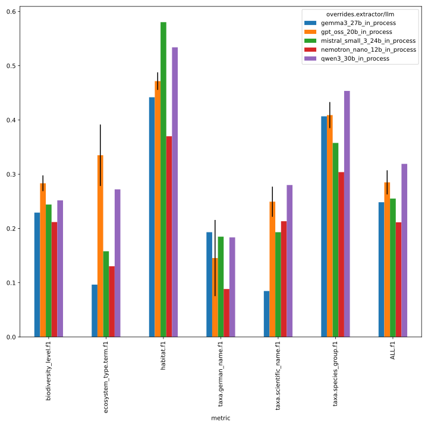
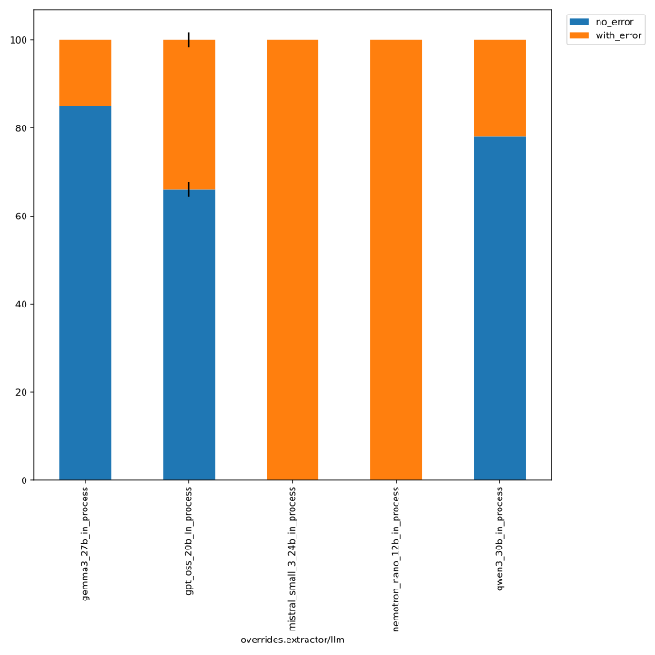
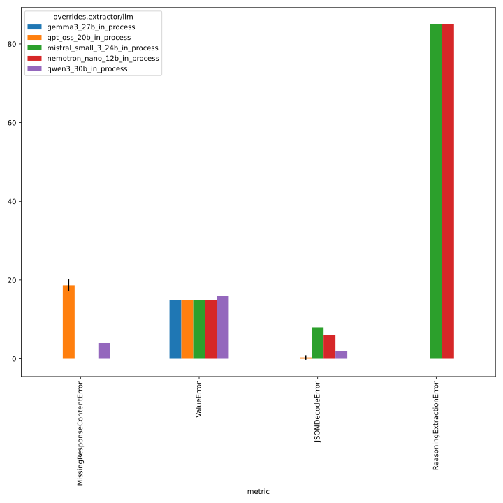

# 308_fix_reasoning_content_splitting

evaluate adjustments made to reasoning content splitting logic, see https://github.com/DFKI-NLP/kibad-llm/pull/308 for details
 - models: gpt_oss_20b, gemma3_27, qwen3_30b, ministral, mistral, and nemotron (all in-process)
 - `temperature=0.0`
 - faktencheck core schema + detect evidence
 - with `return_reasoning=false` for gpt_oss_20b, gemma3_27, qwen3_30b
 - with `return_reasoning=true` for ministral, mistral, and nemotron


## Evaluation Notebook Parameters
```python
# test gpt-oss-20b and gemma3-27b with temperature=0.0
NAME = "308_fix_reasoning_content_splitting"
METRICS_DIR_PATTERN = "evaluate/**/2026-01-22_12-57-50/"
ERRORS_DIR_PATTERN = "evaluate/**/2026-01-22_12-58-32/"
# used to group the data
INDEX_COLUMNS = ["overrides.extractor/llm"]
PLOT_KWARGS = {
    # can be either "metric" or one of the INDEX_COLUMNS (or multiple of them)
    "xgroup": "overrides.extractor/llm",
    # add any more arguments passed to pd.DataFrame.plot
}
```

```python
# test qwen3_30b_in_process
NAME = "308_fix_reasoning_content_splitting"
METRICS_DIR_PATTERN = "evaluate/**/2026-01-22_12-59-32/"
ERRORS_DIR_PATTERN = "evaluate/**/2026-01-22_13-01-04/"
# used to group the data
INDEX_COLUMNS = ["overrides.extractor/llm"]
PLOT_KWARGS = {
    # can be either "metric" or one of the INDEX_COLUMNS (or multiple of them)
    "xgroup": "overrides.extractor/llm",
    # add any more arguments passed to pd.DataFrame.plot
}
```

```python
# test ministral, mistral, and nemotron (in_process)
NAME = "308_fix_reasoning_content_splitting"
METRICS_DIR_PATTERN = "evaluate/**/2026-01-23_13-25-04/"
ERRORS_DIR_PATTERN = "evaluate/**/2026-01-23_13-23-01/"
# used to group the data
INDEX_COLUMNS = ["overrides.extractor/llm"]
PLOT_KWARGS = {
    # can be either "metric" or one of the INDEX_COLUMNS (or multiple of them)
    "xgroup": "overrides.extractor/llm",
    # add any more arguments passed to pd.DataFrame.plot
}
```

```python
# compare all models (in_process)
NAME = "308_fix_reasoning_content_splitting"
METRICS_DIR_PATTERN = [
    "evaluate/**/2026-01-22_12-57-50/",
    "evaluate/**/2026-01-22_12-59-32/",
    "evaluate/**/2026-01-23_13-25-04/",
]
ERRORS_DIR_PATTERN = [
    "evaluate/**/2026-01-22_12-58-32/",
    "evaluate/**/2026-01-22_13-01-04/",
    "evaluate/**/2026-01-23_13-23-01/",
]
# used to group the data
INDEX_COLUMNS = ["overrides.extractor/llm"]
PLOT_KWARGS = {
    # can be either "metric" or one of the INDEX_COLUMNS (or multiple of them)
    "xgroup": "overrides.extractor/llm",
    # add any more arguments passed to pd.DataFrame.plot
}
```




details below

## test gpt-oss-20b and gemma3-27b with temperature=0.0
 - command from [here](https://github.com/DFKI-NLP/kibad-llm/issues/261#issuecomment-3769499703)
 - but with `output_file_name=predictions.jsonl.gz` to enable compression

```
./run_in_process.sh -pa "H100-SLT,H100-Trails,H100,A100-80GB" \
-u "-m kibad_llm.predict \
name=308_fix_reasoning_content_splitting \
experiment/predict=faktencheck_core_fields_schema_with_evidence \
pdf_directory=/ds/text/kiba-d/dev-set-100 \
extractor/llm=gpt_oss_20b_in_process,gemma3_27b_in_process \
output_file_name=predictions.jsonl.gz \
seed=42,1337,7331 \
--multirun"
```

[2026-01-22 11:12:57,276][HYDRA] Contents of /netscratch/binder/projects/kibad-llm/logs/308_fix_reasoning_content_splitting/predict/multiruns/2026-01-22_04-18-16/job_return_value.md:

<details>
<summary>click to see</summary>

|                                                | branch                                     | commit_hash                              | is_dirty   | output_file                                                                                                         | output_file_absolute                                                                                                                                      | overrides.experiment/predict                 | overrides.extractor/llm   | overrides.name                      | overrides.output_file_name   | overrides.pdf_directory     |   overrides.seed |   time_extraction |   time_pdf_conversion |
|:-----------------------------------------------|:-------------------------------------------|:-----------------------------------------|:-----------|:--------------------------------------------------------------------------------------------------------------------|:----------------------------------------------------------------------------------------------------------------------------------------------------------|:---------------------------------------------|:--------------------------|:------------------------------------|:-----------------------------|:----------------------------|-----------------:|------------------:|----------------------:|
| extractor/llm=gemma3_27b_in_process#seed=1337  | llms/fix-empty-content-for-vllm_in_process | 34f21585a8525ae88545fb992e20b3ca4624bf71 | False      | predictions/308_fix_reasoning_content_splitting/2026-01-22_04-18-16/2026-01-22_09-57-27_727791/predictions.jsonl.gz | /netscratch/binder/projects/kibad-llm/predictions/308_fix_reasoning_content_splitting/2026-01-22_04-18-16/2026-01-22_09-57-27_727791/predictions.jsonl.gz | faktencheck_core_fields_schema_with_evidence | gemma3_27b_in_process     | 308_fix_reasoning_content_splitting | predictions.jsonl.gz         | /ds/text/kiba-d/dev-set-100 |             1337 |           2150.98 |            0.00475184 |
| extractor/llm=gemma3_27b_in_process#seed=42    | llms/fix-empty-content-for-vllm_in_process | 34f21585a8525ae88545fb992e20b3ca4624bf71 | False      | predictions/308_fix_reasoning_content_splitting/2026-01-22_04-18-16/2026-01-22_09-19-09_503305/predictions.jsonl.gz | /netscratch/binder/projects/kibad-llm/predictions/308_fix_reasoning_content_splitting/2026-01-22_04-18-16/2026-01-22_09-19-09_503305/predictions.jsonl.gz | faktencheck_core_fields_schema_with_evidence | gemma3_27b_in_process     | 308_fix_reasoning_content_splitting | predictions.jsonl.gz         | /ds/text/kiba-d/dev-set-100 |               42 |           2152.54 |            0.0051449  |
| extractor/llm=gemma3_27b_in_process#seed=7331  | llms/fix-empty-content-for-vllm_in_process | 34f21585a8525ae88545fb992e20b3ca4624bf71 | False      | predictions/308_fix_reasoning_content_splitting/2026-01-22_04-18-16/2026-01-22_10-35-16_304783/predictions.jsonl.gz | /netscratch/binder/projects/kibad-llm/predictions/308_fix_reasoning_content_splitting/2026-01-22_04-18-16/2026-01-22_10-35-16_304783/predictions.jsonl.gz | faktencheck_core_fields_schema_with_evidence | gemma3_27b_in_process     | 308_fix_reasoning_content_splitting | predictions.jsonl.gz         | /ds/text/kiba-d/dev-set-100 |             7331 |           2147.73 |            0.00462773 |
| extractor/llm=gpt_oss_20b_in_process#seed=1337 | llms/fix-empty-content-for-vllm_in_process | 34f21585a8525ae88545fb992e20b3ca4624bf71 | False      | predictions/308_fix_reasoning_content_splitting/2026-01-22_04-18-16/2026-01-22_06-03-50_430848/predictions.jsonl.gz | /netscratch/binder/projects/kibad-llm/predictions/308_fix_reasoning_content_splitting/2026-01-22_04-18-16/2026-01-22_06-03-50_430848/predictions.jsonl.gz | faktencheck_core_fields_schema_with_evidence | gpt_oss_20b_in_process    | 308_fix_reasoning_content_splitting | predictions.jsonl.gz         | /ds/text/kiba-d/dev-set-100 |             1337 |           5891.98 |            0.00334327 |
| extractor/llm=gpt_oss_20b_in_process#seed=42   | llms/fix-empty-content-for-vllm_in_process | 832cbe9116653245b2c8d1e478984e845b5cd456 | False      | predictions/308_fix_reasoning_content_splitting/2026-01-22_04-18-16/2026-01-22_04-18-17_274937/predictions.jsonl.gz | /netscratch/binder/projects/kibad-llm/predictions/308_fix_reasoning_content_splitting/2026-01-22_04-18-16/2026-01-22_04-18-17_274937/predictions.jsonl.gz | faktencheck_core_fields_schema_with_evidence | gpt_oss_20b_in_process    | 308_fix_reasoning_content_splitting | predictions.jsonl.gz         | /ds/text/kiba-d/dev-set-100 |               42 |           6159.93 |            0.0481129  |
| extractor/llm=gpt_oss_20b_in_process#seed=7331 | llms/fix-empty-content-for-vllm_in_process | 34f21585a8525ae88545fb992e20b3ca4624bf71 | False      | predictions/308_fix_reasoning_content_splitting/2026-01-22_04-18-16/2026-01-22_07-43-11_271176/predictions.jsonl.gz | /netscratch/binder/projects/kibad-llm/predictions/308_fix_reasoning_content_splitting/2026-01-22_04-18-16/2026-01-22_07-43-11_271176/predictions.jsonl.gz | faktencheck_core_fields_schema_with_evidence | gpt_oss_20b_in_process    | 308_fix_reasoning_content_splitting | predictions.jsonl.gz         | /ds/text/kiba-d/dev-set-100 |             7331 |           5688.02 |            0.00577808 |

</details>

### evaluate
#### f1
```
uv run -m kibad_llm.evaluate \
name=308_fix_reasoning_content_splitting  \
experiment/evaluate=faktencheck_core_f1_micro_flat \
prediction_logs=logs/308_fix_reasoning_content_splitting/predict/multiruns/2026-01-22_04-18-16 \
+hydra.callbacks.save_job_return.multirun_markdown_group_by=overrides.extractor/llm \
--multirun
```

[2026-01-22 12:57:55,351][HYDRA] Contents of /netscratch/binder/projects/kibad-llm/logs/308_fix_reasoning_content_splitting/evaluate/multiruns/2026-01-22_12-57-50/job_return_value.md:

| overrides.extractor/llm   |   ALL.f1.mean |   ALL.f1.std |   ALL.precision.mean |   ALL.precision.std |   ALL.recall.mean |   ALL.recall.std |   ALL.support.mean |   ALL.support.std |   AVG.f1.mean |   AVG.f1.std |   AVG.precision.mean |   AVG.precision.std |   AVG.recall.mean |   AVG.recall.std |   AVG.support.mean |   AVG.support.std |   biodiversity_level.f1.mean |   biodiversity_level.f1.std |   biodiversity_level.precision.mean |   biodiversity_level.precision.std |   biodiversity_level.recall.mean |   biodiversity_level.recall.std |   biodiversity_level.support.mean |   biodiversity_level.support.std |   ecosystem_type.term.f1.mean |   ecosystem_type.term.f1.std |   ecosystem_type.term.precision.mean |   ecosystem_type.term.precision.std |   ecosystem_type.term.recall.mean |   ecosystem_type.term.recall.std |   ecosystem_type.term.support.mean |   ecosystem_type.term.support.std |   habitat.f1.mean |   habitat.f1.std |   habitat.precision.mean |   habitat.precision.std |   habitat.recall.mean |   habitat.recall.std |   habitat.support.mean |   habitat.support.std |   prediction.job_return_value.time_extraction.mean |   prediction.job_return_value.time_extraction.std |   prediction.job_return_value.time_pdf_conversion.mean |   prediction.job_return_value.time_pdf_conversion.std |   taxa.german_name.f1.mean |   taxa.german_name.f1.std |   taxa.german_name.precision.mean |   taxa.german_name.precision.std |   taxa.german_name.recall.mean |   taxa.german_name.recall.std |   taxa.german_name.support.mean |   taxa.german_name.support.std |   taxa.scientific_name.f1.mean |   taxa.scientific_name.f1.std |   taxa.scientific_name.precision.mean |   taxa.scientific_name.precision.std |   taxa.scientific_name.recall.mean |   taxa.scientific_name.recall.std |   taxa.scientific_name.support.mean |   taxa.scientific_name.support.std |   taxa.species_group.f1.mean |   taxa.species_group.f1.std |   taxa.species_group.precision.mean |   taxa.species_group.precision.std |   taxa.species_group.recall.mean |   taxa.species_group.recall.std |   taxa.species_group.support.mean |   taxa.species_group.support.std | overrides.experiment/predict                                                                                                                     | overrides.name                                                                                                        | overrides.output_file_name                                               | overrides.pdf_directory                                                                       | overrides.seed         | prediction.job_return_value.branch                                                                                                         | prediction.job_return_value.commit_hash                                                                                              | prediction.job_return_value.is_dirty   | prediction.job_return_value.output_file                                                                                                                                                                                                                                                                                                                               | prediction.job_return_value.output_file_absolute                                                                                                                                                                                                                                                                                                                                                                                                                                        |
|:--------------------------|--------------:|-------------:|---------------------:|--------------------:|------------------:|-----------------:|-------------------:|------------------:|--------------:|-------------:|---------------------:|--------------------:|------------------:|-----------------:|-------------------:|------------------:|-----------------------------:|----------------------------:|------------------------------------:|-----------------------------------:|---------------------------------:|--------------------------------:|----------------------------------:|---------------------------------:|------------------------------:|-----------------------------:|-------------------------------------:|------------------------------------:|----------------------------------:|---------------------------------:|-----------------------------------:|----------------------------------:|------------------:|-----------------:|-------------------------:|------------------------:|----------------------:|---------------------:|-----------------------:|----------------------:|---------------------------------------------------:|--------------------------------------------------:|-------------------------------------------------------:|------------------------------------------------------:|---------------------------:|--------------------------:|----------------------------------:|---------------------------------:|-------------------------------:|------------------------------:|--------------------------------:|-------------------------------:|-------------------------------:|------------------------------:|--------------------------------------:|-------------------------------------:|-----------------------------------:|----------------------------------:|------------------------------------:|-----------------------------------:|-----------------------------:|----------------------------:|------------------------------------:|-----------------------------------:|---------------------------------:|--------------------------------:|----------------------------------:|---------------------------------:|:-------------------------------------------------------------------------------------------------------------------------------------------------|:----------------------------------------------------------------------------------------------------------------------|:-------------------------------------------------------------------------|:----------------------------------------------------------------------------------------------|:-----------------------|:-------------------------------------------------------------------------------------------------------------------------------------------|:-------------------------------------------------------------------------------------------------------------------------------------|:---------------------------------------|:----------------------------------------------------------------------------------------------------------------------------------------------------------------------------------------------------------------------------------------------------------------------------------------------------------------------------------------------------------------------|:----------------------------------------------------------------------------------------------------------------------------------------------------------------------------------------------------------------------------------------------------------------------------------------------------------------------------------------------------------------------------------------------------------------------------------------------------------------------------------------|
| gemma3_27b_in_process     |         0.248 |        0     |                0.284 |               0     |             0.221 |            0     |                792 |                 0 |         0.242 |        0     |                0.264 |                0    |             0.246 |            0     |                132 |                 0 |                        0.229 |                       0     |                               0.2   |                              0     |                            0.269 |                           0     |                                67 |                                0 |                         0.097 |                        0     |                                0.076 |                               0     |                             0.132 |                            0     |                                 53 |                                 0 |             0.442 |            0     |                    0.457 |                   0     |                 0.428 |                0     |                    138 |                     0 |                                            2150.41 |                                             2.456 |                                                  0.005 |                                                 0     |                      0.193 |                      0    |                             0.344 |                            0     |                          0.134 |                          0    |                             231 |                              0 |                          0.085 |                         0     |                                 0.14  |                                 0    |                              0.061 |                             0     |                                 197 |                                  0 |                        0.407 |                       0     |                               0.369 |                              0     |                            0.453 |                           0     |                               106 |                                0 | ['faktencheck_core_fields_schema_with_evidence', 'faktencheck_core_fields_schema_with_evidence', 'faktencheck_core_fields_schema_with_evidence'] | ['308_fix_reasoning_content_splitting', '308_fix_reasoning_content_splitting', '308_fix_reasoning_content_splitting'] | ['predictions.jsonl.gz', 'predictions.jsonl.gz', 'predictions.jsonl.gz'] | ['/ds/text/kiba-d/dev-set-100', '/ds/text/kiba-d/dev-set-100', '/ds/text/kiba-d/dev-set-100'] | ['1337', '42', '7331'] | ['llms/fix-empty-content-for-vllm_in_process', 'llms/fix-empty-content-for-vllm_in_process', 'llms/fix-empty-content-for-vllm_in_process'] | ['34f21585a8525ae88545fb992e20b3ca4624bf71', '34f21585a8525ae88545fb992e20b3ca4624bf71', '34f21585a8525ae88545fb992e20b3ca4624bf71'] | [np.False_, np.False_, np.False_]      | ['predictions/308_fix_reasoning_content_splitting/2026-01-22_04-18-16/2026-01-22_09-57-27_727791/predictions.jsonl.gz', 'predictions/308_fix_reasoning_content_splitting/2026-01-22_04-18-16/2026-01-22_09-19-09_503305/predictions.jsonl.gz', 'predictions/308_fix_reasoning_content_splitting/2026-01-22_04-18-16/2026-01-22_10-35-16_304783/predictions.jsonl.gz'] | ['/netscratch/binder/projects/kibad-llm/predictions/308_fix_reasoning_content_splitting/2026-01-22_04-18-16/2026-01-22_09-57-27_727791/predictions.jsonl.gz', '/netscratch/binder/projects/kibad-llm/predictions/308_fix_reasoning_content_splitting/2026-01-22_04-18-16/2026-01-22_09-19-09_503305/predictions.jsonl.gz', '/netscratch/binder/projects/kibad-llm/predictions/308_fix_reasoning_content_splitting/2026-01-22_04-18-16/2026-01-22_10-35-16_304783/predictions.jsonl.gz'] |
| gpt_oss_20b_in_process    |         0.285 |        0.022 |                0.336 |               0.024 |             0.248 |            0.025 |                792 |                 0 |         0.316 |        0.017 |                0.385 |                0.01 |             0.275 |            0.021 |                132 |                 0 |                        0.283 |                       0.015 |                               0.322 |                              0.023 |                            0.254 |                           0.015 |                                67 |                                0 |                         0.335 |                        0.057 |                                0.346 |                               0.033 |                             0.327 |                            0.076 |                                 53 |                                 0 |             0.472 |            0.016 |                    0.705 |                   0.028 |                 0.355 |                0.022 |                    138 |                     0 |                                            5913.31 |                                           236.678 |                                                  0.019 |                                                 0.025 |                      0.146 |                      0.07 |                             0.187 |                            0.087 |                          0.12  |                          0.06 |                             231 |                              0 |                          0.249 |                         0.028 |                                 0.253 |                                 0.04 |                              0.247 |                             0.019 |                                 197 |                                  0 |                        0.409 |                       0.024 |                               0.494 |                              0.039 |                            0.349 |                           0.016 |                               106 |                                0 | ['faktencheck_core_fields_schema_with_evidence', 'faktencheck_core_fields_schema_with_evidence', 'faktencheck_core_fields_schema_with_evidence'] | ['308_fix_reasoning_content_splitting', '308_fix_reasoning_content_splitting', '308_fix_reasoning_content_splitting'] | ['predictions.jsonl.gz', 'predictions.jsonl.gz', 'predictions.jsonl.gz'] | ['/ds/text/kiba-d/dev-set-100', '/ds/text/kiba-d/dev-set-100', '/ds/text/kiba-d/dev-set-100'] | ['1337', '42', '7331'] | ['llms/fix-empty-content-for-vllm_in_process', 'llms/fix-empty-content-for-vllm_in_process', 'llms/fix-empty-content-for-vllm_in_process'] | ['34f21585a8525ae88545fb992e20b3ca4624bf71', '832cbe9116653245b2c8d1e478984e845b5cd456', '34f21585a8525ae88545fb992e20b3ca4624bf71'] | [np.False_, np.False_, np.False_]      | ['predictions/308_fix_reasoning_content_splitting/2026-01-22_04-18-16/2026-01-22_06-03-50_430848/predictions.jsonl.gz', 'predictions/308_fix_reasoning_content_splitting/2026-01-22_04-18-16/2026-01-22_04-18-17_274937/predictions.jsonl.gz', 'predictions/308_fix_reasoning_content_splitting/2026-01-22_04-18-16/2026-01-22_07-43-11_271176/predictions.jsonl.gz'] | ['/netscratch/binder/projects/kibad-llm/predictions/308_fix_reasoning_content_splitting/2026-01-22_04-18-16/2026-01-22_06-03-50_430848/predictions.jsonl.gz', '/netscratch/binder/projects/kibad-llm/predictions/308_fix_reasoning_content_splitting/2026-01-22_04-18-16/2026-01-22_04-18-17_274937/predictions.jsonl.gz', '/netscratch/binder/projects/kibad-llm/predictions/308_fix_reasoning_content_splitting/2026-01-22_04-18-16/2026-01-22_07-43-11_271176/predictions.jsonl.gz'] |


#### errors
```
uv run -m kibad_llm.evaluate \
name=308_fix_reasoning_content_splitting \
experiment/evaluate=prediction_errors \
prediction_logs=logs/308_fix_reasoning_content_splitting/predict/multiruns/2026-01-22_04-18-16 \
+hydra.callbacks.save_job_return.multirun_markdown_group_by=overrides.extractor/llm \
--multirun
```

[2026-01-22 12:58:36,019][HYDRA] Contents of /netscratch/binder/projects/kibad-llm/logs/308_fix_reasoning_content_splitting/evaluate/multiruns/2026-01-22_12-58-32/job_return_value.md:

| overrides.extractor/llm   |   JSONDecodeError.mean |   JSONDecodeError.std |   MissingResponseContentError.mean |   MissingResponseContentError.std |   ValueError.mean |   ValueError.std |   no_error.mean |   no_error.std |   prediction.job_return_value.time_extraction.mean |   prediction.job_return_value.time_extraction.std |   prediction.job_return_value.time_pdf_conversion.mean |   prediction.job_return_value.time_pdf_conversion.std |   with_error.mean |   with_error.std | overrides.experiment/predict                                                                                                                     | overrides.name                                                                                                        | overrides.output_file_name                                               | overrides.pdf_directory                                                                       | overrides.seed         | prediction.job_return_value.branch                                                                                                         | prediction.job_return_value.commit_hash                                                                                              | prediction.job_return_value.is_dirty   | prediction.job_return_value.output_file                                                                                                                                                                                                                                                                                                                               | prediction.job_return_value.output_file_absolute                                                                                                                                                                                                                                                                                                                                                                                                                                        |
|:--------------------------|-----------------------:|----------------------:|-----------------------------------:|----------------------------------:|------------------:|-----------------:|----------------:|---------------:|---------------------------------------------------:|--------------------------------------------------:|-------------------------------------------------------:|------------------------------------------------------:|------------------:|-----------------:|:-------------------------------------------------------------------------------------------------------------------------------------------------|:----------------------------------------------------------------------------------------------------------------------|:-------------------------------------------------------------------------|:----------------------------------------------------------------------------------------------|:-----------------------|:-------------------------------------------------------------------------------------------------------------------------------------------|:-------------------------------------------------------------------------------------------------------------------------------------|:---------------------------------------|:----------------------------------------------------------------------------------------------------------------------------------------------------------------------------------------------------------------------------------------------------------------------------------------------------------------------------------------------------------------------|:----------------------------------------------------------------------------------------------------------------------------------------------------------------------------------------------------------------------------------------------------------------------------------------------------------------------------------------------------------------------------------------------------------------------------------------------------------------------------------------|
| gemma3_27b_in_process     |                      0 |                     0 |                              0     |                             0     |                15 |                0 |              85 |          0     |                                            2150.41 |                                             2.456 |                                                  0.005 |                                                 0     |                15 |            0     | ['faktencheck_core_fields_schema_with_evidence', 'faktencheck_core_fields_schema_with_evidence', 'faktencheck_core_fields_schema_with_evidence'] | ['308_fix_reasoning_content_splitting', '308_fix_reasoning_content_splitting', '308_fix_reasoning_content_splitting'] | ['predictions.jsonl.gz', 'predictions.jsonl.gz', 'predictions.jsonl.gz'] | ['/ds/text/kiba-d/dev-set-100', '/ds/text/kiba-d/dev-set-100', '/ds/text/kiba-d/dev-set-100'] | ['1337', '42', '7331'] | ['llms/fix-empty-content-for-vllm_in_process', 'llms/fix-empty-content-for-vllm_in_process', 'llms/fix-empty-content-for-vllm_in_process'] | ['34f21585a8525ae88545fb992e20b3ca4624bf71', '34f21585a8525ae88545fb992e20b3ca4624bf71', '34f21585a8525ae88545fb992e20b3ca4624bf71'] | [np.False_, np.False_, np.False_]      | ['predictions/308_fix_reasoning_content_splitting/2026-01-22_04-18-16/2026-01-22_09-57-27_727791/predictions.jsonl.gz', 'predictions/308_fix_reasoning_content_splitting/2026-01-22_04-18-16/2026-01-22_09-19-09_503305/predictions.jsonl.gz', 'predictions/308_fix_reasoning_content_splitting/2026-01-22_04-18-16/2026-01-22_10-35-16_304783/predictions.jsonl.gz'] | ['/netscratch/binder/projects/kibad-llm/predictions/308_fix_reasoning_content_splitting/2026-01-22_04-18-16/2026-01-22_09-57-27_727791/predictions.jsonl.gz', '/netscratch/binder/projects/kibad-llm/predictions/308_fix_reasoning_content_splitting/2026-01-22_04-18-16/2026-01-22_09-19-09_503305/predictions.jsonl.gz', '/netscratch/binder/projects/kibad-llm/predictions/308_fix_reasoning_content_splitting/2026-01-22_04-18-16/2026-01-22_10-35-16_304783/predictions.jsonl.gz'] |
| gpt_oss_20b_in_process    |                      1 |                     0 |                             18.667 |                             1.528 |                15 |                0 |              66 |          1.732 |                                            5913.31 |                                           236.678 |                                                  0.019 |                                                 0.025 |                34 |            1.732 | ['faktencheck_core_fields_schema_with_evidence', 'faktencheck_core_fields_schema_with_evidence', 'faktencheck_core_fields_schema_with_evidence'] | ['308_fix_reasoning_content_splitting', '308_fix_reasoning_content_splitting', '308_fix_reasoning_content_splitting'] | ['predictions.jsonl.gz', 'predictions.jsonl.gz', 'predictions.jsonl.gz'] | ['/ds/text/kiba-d/dev-set-100', '/ds/text/kiba-d/dev-set-100', '/ds/text/kiba-d/dev-set-100'] | ['1337', '42', '7331'] | ['llms/fix-empty-content-for-vllm_in_process', 'llms/fix-empty-content-for-vllm_in_process', 'llms/fix-empty-content-for-vllm_in_process'] | ['34f21585a8525ae88545fb992e20b3ca4624bf71', '832cbe9116653245b2c8d1e478984e845b5cd456', '34f21585a8525ae88545fb992e20b3ca4624bf71'] | [np.False_, np.False_, np.False_]      | ['predictions/308_fix_reasoning_content_splitting/2026-01-22_04-18-16/2026-01-22_06-03-50_430848/predictions.jsonl.gz', 'predictions/308_fix_reasoning_content_splitting/2026-01-22_04-18-16/2026-01-22_04-18-17_274937/predictions.jsonl.gz', 'predictions/308_fix_reasoning_content_splitting/2026-01-22_04-18-16/2026-01-22_07-43-11_271176/predictions.jsonl.gz'] | ['/netscratch/binder/projects/kibad-llm/predictions/308_fix_reasoning_content_splitting/2026-01-22_04-18-16/2026-01-22_06-03-50_430848/predictions.jsonl.gz', '/netscratch/binder/projects/kibad-llm/predictions/308_fix_reasoning_content_splitting/2026-01-22_04-18-16/2026-01-22_04-18-17_274937/predictions.jsonl.gz', '/netscratch/binder/projects/kibad-llm/predictions/308_fix_reasoning_content_splitting/2026-01-22_04-18-16/2026-01-22_07-43-11_271176/predictions.jsonl.gz'] |


## test `qwen3_30b_in_process`
```
./run_in_process.sh -pa "H100-SLT,H100-Trails,H100,A100-80GB" \
-u "-m kibad_llm.predict \
name=308_fix_reasoning_content_splitting \
experiment/predict=faktencheck_core_fields_schema_with_evidence \
pdf_directory=/ds/text/kiba-d/dev-set-100 \
extractor/llm=qwen3_30b_in_process \
output_file_name=predictions.jsonl.gz \
seed=42,1337,7331 \
--multirun"
```

[2026-01-22 09:10:44,474][HYDRA] Contents of /netscratch/binder/projects/kibad-llm/logs/308_fix_reasoning_content_splitting/predict/multiruns/2026-01-22_05-03-34/job_return_value.md:

<details>
<summary>click to see</summary>

|           | branch                                     | commit_hash                              | is_dirty   | output_file                                                                                                         | output_file_absolute                                                                                                                                      | overrides.experiment/predict                 | overrides.extractor/llm   | overrides.name                      | overrides.output_file_name   | overrides.pdf_directory     |   overrides.seed |   time_extraction |   time_pdf_conversion |
|:----------|:-------------------------------------------|:-----------------------------------------|:-----------|:--------------------------------------------------------------------------------------------------------------------|:----------------------------------------------------------------------------------------------------------------------------------------------------------|:---------------------------------------------|:--------------------------|:------------------------------------|:-----------------------------|:----------------------------|-----------------:|------------------:|----------------------:|
| seed=1337 | llms/fix-empty-content-for-vllm_in_process | 34f21585a8525ae88545fb992e20b3ca4624bf71 | False      | predictions/308_fix_reasoning_content_splitting/2026-01-22_05-03-34/2026-01-22_06-26-26_180754/predictions.jsonl.gz | /netscratch/binder/projects/kibad-llm/predictions/308_fix_reasoning_content_splitting/2026-01-22_05-03-34/2026-01-22_06-26-26_180754/predictions.jsonl.gz | faktencheck_core_fields_schema_with_evidence | qwen3_30b_in_process      | 308_fix_reasoning_content_splitting | predictions.jsonl.gz         | /ds/text/kiba-d/dev-set-100 |             1337 |           4836.89 |            0.00459886 |
| seed=42   | llms/fix-empty-content-for-vllm_in_process | 34f21585a8525ae88545fb992e20b3ca4624bf71 | False      | predictions/308_fix_reasoning_content_splitting/2026-01-22_05-03-34/2026-01-22_05-03-35_045493/predictions.jsonl.gz | /netscratch/binder/projects/kibad-llm/predictions/308_fix_reasoning_content_splitting/2026-01-22_05-03-34/2026-01-22_05-03-35_045493/predictions.jsonl.gz | faktencheck_core_fields_schema_with_evidence | qwen3_30b_in_process      | 308_fix_reasoning_content_splitting | predictions.jsonl.gz         | /ds/text/kiba-d/dev-set-100 |               42 |           4871.99 |            0.00375794 |
| seed=7331 | llms/fix-empty-content-for-vllm_in_process | 34f21585a8525ae88545fb992e20b3ca4624bf71 | False      | predictions/308_fix_reasoning_content_splitting/2026-01-22_05-03-34/2026-01-22_07-48-25_656227/predictions.jsonl.gz | /netscratch/binder/projects/kibad-llm/predictions/308_fix_reasoning_content_splitting/2026-01-22_05-03-34/2026-01-22_07-48-25_656227/predictions.jsonl.gz | faktencheck_core_fields_schema_with_evidence | qwen3_30b_in_process      | 308_fix_reasoning_content_splitting | predictions.jsonl.gz         | /ds/text/kiba-d/dev-set-100 |             7331 |           4855.56 |            0.00516418 |

</details>

### evaluate
#### f1
```
uv run -m kibad_llm.evaluate \
name=308_fix_reasoning_content_splitting  \
experiment/evaluate=faktencheck_core_f1_micro_flat \
prediction_logs=logs/308_fix_reasoning_content_splitting/predict/multiruns/2026-01-22_05-03-34 \
+hydra.callbacks.save_job_return.multirun_markdown_group_by=overrides.extractor/llm \
--multirun
```

[2026-01-22 12:59:35,110][HYDRA] Contents of /netscratch/binder/projects/kibad-llm/logs/308_fix_reasoning_content_splitting/evaluate/multiruns/2026-01-22_12-59-32/job_return_value.md:

| overrides.extractor/llm   |   ALL.f1.mean |   ALL.f1.std |   ALL.precision.mean |   ALL.precision.std |   ALL.recall.mean |   ALL.recall.std |   ALL.support.mean |   ALL.support.std |   AVG.f1.mean |   AVG.f1.std |   AVG.precision.mean |   AVG.precision.std |   AVG.recall.mean |   AVG.recall.std |   AVG.support.mean |   AVG.support.std |   biodiversity_level.f1.mean |   biodiversity_level.f1.std |   biodiversity_level.precision.mean |   biodiversity_level.precision.std |   biodiversity_level.recall.mean |   biodiversity_level.recall.std |   biodiversity_level.support.mean |   biodiversity_level.support.std |   ecosystem_type.term.f1.mean |   ecosystem_type.term.f1.std |   ecosystem_type.term.precision.mean |   ecosystem_type.term.precision.std |   ecosystem_type.term.recall.mean |   ecosystem_type.term.recall.std |   ecosystem_type.term.support.mean |   ecosystem_type.term.support.std |   habitat.f1.mean |   habitat.f1.std |   habitat.precision.mean |   habitat.precision.std |   habitat.recall.mean |   habitat.recall.std |   habitat.support.mean |   habitat.support.std |   prediction.job_return_value.time_extraction.mean |   prediction.job_return_value.time_extraction.std |   prediction.job_return_value.time_pdf_conversion.mean |   prediction.job_return_value.time_pdf_conversion.std |   taxa.german_name.f1.mean |   taxa.german_name.f1.std |   taxa.german_name.precision.mean |   taxa.german_name.precision.std |   taxa.german_name.recall.mean |   taxa.german_name.recall.std |   taxa.german_name.support.mean |   taxa.german_name.support.std |   taxa.scientific_name.f1.mean |   taxa.scientific_name.f1.std |   taxa.scientific_name.precision.mean |   taxa.scientific_name.precision.std |   taxa.scientific_name.recall.mean |   taxa.scientific_name.recall.std |   taxa.scientific_name.support.mean |   taxa.scientific_name.support.std |   taxa.species_group.f1.mean |   taxa.species_group.f1.std |   taxa.species_group.precision.mean |   taxa.species_group.precision.std |   taxa.species_group.recall.mean |   taxa.species_group.recall.std |   taxa.species_group.support.mean |   taxa.species_group.support.std | overrides.experiment/predict                                                                                                                     | overrides.name                                                                                                        | overrides.output_file_name                                               | overrides.pdf_directory                                                                       | overrides.seed         | prediction.job_return_value.branch                                                                                                         | prediction.job_return_value.commit_hash                                                                                              | prediction.job_return_value.is_dirty   | prediction.job_return_value.output_file                                                                                                                                                                                                                                                                                                                               | prediction.job_return_value.output_file_absolute                                                                                                                                                                                                                                                                                                                                                                                                                                        |
|:--------------------------|--------------:|-------------:|---------------------:|--------------------:|------------------:|-----------------:|-------------------:|------------------:|--------------:|-------------:|---------------------:|--------------------:|------------------:|-----------------:|-------------------:|------------------:|-----------------------------:|----------------------------:|------------------------------------:|-----------------------------------:|---------------------------------:|--------------------------------:|----------------------------------:|---------------------------------:|------------------------------:|-----------------------------:|-------------------------------------:|------------------------------------:|----------------------------------:|---------------------------------:|-----------------------------------:|----------------------------------:|------------------:|-----------------:|-------------------------:|------------------------:|----------------------:|---------------------:|-----------------------:|----------------------:|---------------------------------------------------:|--------------------------------------------------:|-------------------------------------------------------:|------------------------------------------------------:|---------------------------:|--------------------------:|----------------------------------:|---------------------------------:|-------------------------------:|------------------------------:|--------------------------------:|-------------------------------:|-------------------------------:|------------------------------:|--------------------------------------:|-------------------------------------:|-----------------------------------:|----------------------------------:|------------------------------------:|-----------------------------------:|-----------------------------:|----------------------------:|------------------------------------:|-----------------------------------:|---------------------------------:|--------------------------------:|----------------------------------:|---------------------------------:|:-------------------------------------------------------------------------------------------------------------------------------------------------|:----------------------------------------------------------------------------------------------------------------------|:-------------------------------------------------------------------------|:----------------------------------------------------------------------------------------------|:-----------------------|:-------------------------------------------------------------------------------------------------------------------------------------------|:-------------------------------------------------------------------------------------------------------------------------------------|:---------------------------------------|:----------------------------------------------------------------------------------------------------------------------------------------------------------------------------------------------------------------------------------------------------------------------------------------------------------------------------------------------------------------------|:----------------------------------------------------------------------------------------------------------------------------------------------------------------------------------------------------------------------------------------------------------------------------------------------------------------------------------------------------------------------------------------------------------------------------------------------------------------------------------------|
| qwen3_30b_in_process      |         0.319 |            0 |                0.401 |                   0 |             0.265 |                0 |                792 |                 0 |         0.329 |            0 |                0.421 |                   0 |             0.307 |                0 |                132 |                 0 |                        0.252 |                           0 |                                0.25 |                                  0 |                            0.254 |                               0 |                                67 |                                0 |                         0.272 |                            0 |                                0.198 |                                   0 |                             0.434 |                                0 |                                 53 |                                 0 |             0.534 |                0 |                    0.809 |                       0 |                 0.399 |                    0 |                    138 |                     0 |                                            4854.81 |                                            17.561 |                                                  0.005 |                                                 0.001 |                      0.184 |                         0 |                             0.378 |                                0 |                          0.121 |                             0 |                             231 |                              0 |                           0.28 |                             0 |                                 0.391 |                                    0 |                              0.218 |                                 0 |                                 197 |                                  0 |                        0.454 |                           0 |                                 0.5 |                                  0 |                            0.415 |                               0 |                               106 |                                0 | ['faktencheck_core_fields_schema_with_evidence', 'faktencheck_core_fields_schema_with_evidence', 'faktencheck_core_fields_schema_with_evidence'] | ['308_fix_reasoning_content_splitting', '308_fix_reasoning_content_splitting', '308_fix_reasoning_content_splitting'] | ['predictions.jsonl.gz', 'predictions.jsonl.gz', 'predictions.jsonl.gz'] | ['/ds/text/kiba-d/dev-set-100', '/ds/text/kiba-d/dev-set-100', '/ds/text/kiba-d/dev-set-100'] | ['1337', '42', '7331'] | ['llms/fix-empty-content-for-vllm_in_process', 'llms/fix-empty-content-for-vllm_in_process', 'llms/fix-empty-content-for-vllm_in_process'] | ['34f21585a8525ae88545fb992e20b3ca4624bf71', '34f21585a8525ae88545fb992e20b3ca4624bf71', '34f21585a8525ae88545fb992e20b3ca4624bf71'] | [np.False_, np.False_, np.False_]      | ['predictions/308_fix_reasoning_content_splitting/2026-01-22_05-03-34/2026-01-22_06-26-26_180754/predictions.jsonl.gz', 'predictions/308_fix_reasoning_content_splitting/2026-01-22_05-03-34/2026-01-22_05-03-35_045493/predictions.jsonl.gz', 'predictions/308_fix_reasoning_content_splitting/2026-01-22_05-03-34/2026-01-22_07-48-25_656227/predictions.jsonl.gz'] | ['/netscratch/binder/projects/kibad-llm/predictions/308_fix_reasoning_content_splitting/2026-01-22_05-03-34/2026-01-22_06-26-26_180754/predictions.jsonl.gz', '/netscratch/binder/projects/kibad-llm/predictions/308_fix_reasoning_content_splitting/2026-01-22_05-03-34/2026-01-22_05-03-35_045493/predictions.jsonl.gz', '/netscratch/binder/projects/kibad-llm/predictions/308_fix_reasoning_content_splitting/2026-01-22_05-03-34/2026-01-22_07-48-25_656227/predictions.jsonl.gz'] |


#### errors
```
uv run -m kibad_llm.evaluate \
name=308_fix_reasoning_content_splitting \
experiment/evaluate=prediction_errors \
prediction_logs=logs/308_fix_reasoning_content_splitting/predict/multiruns/2026-01-22_05-03-34 \
+hydra.callbacks.save_job_return.multirun_markdown_group_by=overrides.extractor/llm \
--multirun
```

[2026-01-22 13:01:06,728][HYDRA] Contents of /netscratch/binder/projects/kibad-llm/logs/308_fix_reasoning_content_splitting/evaluate/multiruns/2026-01-22_13-01-04/job_return_value.md:

| overrides.extractor/llm   |   JSONDecodeError.mean |   JSONDecodeError.std |   MissingResponseContentError.mean |   MissingResponseContentError.std |   ValueError.mean |   ValueError.std |   no_error.mean |   no_error.std |   prediction.job_return_value.time_extraction.mean |   prediction.job_return_value.time_extraction.std |   prediction.job_return_value.time_pdf_conversion.mean |   prediction.job_return_value.time_pdf_conversion.std |   with_error.mean |   with_error.std | overrides.experiment/predict                                                                                                                     | overrides.name                                                                                                        | overrides.output_file_name                                               | overrides.pdf_directory                                                                       | overrides.seed         | prediction.job_return_value.branch                                                                                                         | prediction.job_return_value.commit_hash                                                                                              | prediction.job_return_value.is_dirty   | prediction.job_return_value.output_file                                                                                                                                                                                                                                                                                                                               | prediction.job_return_value.output_file_absolute                                                                                                                                                                                                                                                                                                                                                                                                                                        |
|:--------------------------|-----------------------:|----------------------:|-----------------------------------:|----------------------------------:|------------------:|-----------------:|----------------:|---------------:|---------------------------------------------------:|--------------------------------------------------:|-------------------------------------------------------:|------------------------------------------------------:|------------------:|-----------------:|:-------------------------------------------------------------------------------------------------------------------------------------------------|:----------------------------------------------------------------------------------------------------------------------|:-------------------------------------------------------------------------|:----------------------------------------------------------------------------------------------|:-----------------------|:-------------------------------------------------------------------------------------------------------------------------------------------|:-------------------------------------------------------------------------------------------------------------------------------------|:---------------------------------------|:----------------------------------------------------------------------------------------------------------------------------------------------------------------------------------------------------------------------------------------------------------------------------------------------------------------------------------------------------------------------|:----------------------------------------------------------------------------------------------------------------------------------------------------------------------------------------------------------------------------------------------------------------------------------------------------------------------------------------------------------------------------------------------------------------------------------------------------------------------------------------|
| qwen3_30b_in_process      |                      2 |                     0 |                                  4 |                                 0 |                16 |                0 |              78 |              0 |                                            4854.81 |                                            17.561 |                                                  0.005 |                                                 0.001 |                22 |                0 | ['faktencheck_core_fields_schema_with_evidence', 'faktencheck_core_fields_schema_with_evidence', 'faktencheck_core_fields_schema_with_evidence'] | ['308_fix_reasoning_content_splitting', '308_fix_reasoning_content_splitting', '308_fix_reasoning_content_splitting'] | ['predictions.jsonl.gz', 'predictions.jsonl.gz', 'predictions.jsonl.gz'] | ['/ds/text/kiba-d/dev-set-100', '/ds/text/kiba-d/dev-set-100', '/ds/text/kiba-d/dev-set-100'] | ['1337', '42', '7331'] | ['llms/fix-empty-content-for-vllm_in_process', 'llms/fix-empty-content-for-vllm_in_process', 'llms/fix-empty-content-for-vllm_in_process'] | ['34f21585a8525ae88545fb992e20b3ca4624bf71', '34f21585a8525ae88545fb992e20b3ca4624bf71', '34f21585a8525ae88545fb992e20b3ca4624bf71'] | [np.False_, np.False_, np.False_]      | ['predictions/308_fix_reasoning_content_splitting/2026-01-22_05-03-34/2026-01-22_06-26-26_180754/predictions.jsonl.gz', 'predictions/308_fix_reasoning_content_splitting/2026-01-22_05-03-34/2026-01-22_05-03-35_045493/predictions.jsonl.gz', 'predictions/308_fix_reasoning_content_splitting/2026-01-22_05-03-34/2026-01-22_07-48-25_656227/predictions.jsonl.gz'] | ['/netscratch/binder/projects/kibad-llm/predictions/308_fix_reasoning_content_splitting/2026-01-22_05-03-34/2026-01-22_06-26-26_180754/predictions.jsonl.gz', '/netscratch/binder/projects/kibad-llm/predictions/308_fix_reasoning_content_splitting/2026-01-22_05-03-34/2026-01-22_05-03-35_045493/predictions.jsonl.gz', '/netscratch/binder/projects/kibad-llm/predictions/308_fix_reasoning_content_splitting/2026-01-22_05-03-34/2026-01-22_07-48-25_656227/predictions.jsonl.gz'] |

## test ministral, mistral, and nemotron (in_process)
 - with `return_reasoning=true`
 - still with `temperature=0.0` (default)! but see #311
```
./run_in_process.sh -pa "H100-SLT,H100-Trails,H100,A100-80GB" \
-u "-m kibad_llm.predict \
name=308_fix_reasoning_content_splitting \
experiment/predict=faktencheck_core_fields_schema_with_evidence \
pdf_directory=/ds/text/kiba-d/dev-set-100 \
extractor.return_reasoning=true \
extractor/llm=ministral_3_14b_in_process,mistral_small_3_24b_in_process,nemotron_nano_12b_in_process \
seed=42,1337,7331 \
--multirun"
```

Ministral failed to start!

prediction logs: `logs/308_fix_reasoning_content_splitting/predict/multiruns/2026-01-22_19-34-23`
predictions: `predictions/308_fix_reasoning_content_splitting/2026-01-22_19-34-23`


### evaluate
#### f1
```
uv run -m kibad_llm.evaluate \
name=308_fix_reasoning_content_splitting  \
experiment/evaluate=faktencheck_core_f1_micro_flat \
prediction_logs=logs/308_fix_reasoning_content_splitting/predict/multiruns/2026-01-22_19-34-23 \
+hydra.callbacks.save_job_return.multirun_markdown_group_by=overrides.extractor/llm \
--multirun
```

[2026-01-23 13:25:07,448][HYDRA] Contents of /home/arbi01/projects/kibad-llm/logs/308_fix_reasoning_content_splitting/evaluate/multiruns/2026-01-23_13-25-04/job_return_value.md:

| overrides.extractor/llm        |   ALL.f1.mean |   ALL.f1.std |   ALL.precision.mean |   ALL.precision.std |   ALL.recall.mean |   ALL.recall.std |   ALL.support.mean |   ALL.support.std |   AVG.f1.mean |   AVG.f1.std |   AVG.precision.mean |   AVG.precision.std |   AVG.recall.mean |   AVG.recall.std |   AVG.support.mean |   AVG.support.std |   biodiversity_level.f1.mean |   biodiversity_level.f1.std |   biodiversity_level.precision.mean |   biodiversity_level.precision.std |   biodiversity_level.recall.mean |   biodiversity_level.recall.std |   biodiversity_level.support.mean |   biodiversity_level.support.std |   ecosystem_type.term.f1.mean |   ecosystem_type.term.f1.std |   ecosystem_type.term.precision.mean |   ecosystem_type.term.precision.std |   ecosystem_type.term.recall.mean |   ecosystem_type.term.recall.std |   ecosystem_type.term.support.mean |   ecosystem_type.term.support.std |   habitat.f1.mean |   habitat.f1.std |   habitat.precision.mean |   habitat.precision.std |   habitat.recall.mean |   habitat.recall.std |   habitat.support.mean |   habitat.support.std |   prediction.job_return_value.time_extraction.mean |   prediction.job_return_value.time_extraction.std |   prediction.job_return_value.time_pdf_conversion.mean |   prediction.job_return_value.time_pdf_conversion.std |   taxa.german_name.f1.mean |   taxa.german_name.f1.std |   taxa.german_name.precision.mean |   taxa.german_name.precision.std |   taxa.german_name.recall.mean |   taxa.german_name.recall.std |   taxa.german_name.support.mean |   taxa.german_name.support.std |   taxa.scientific_name.f1.mean |   taxa.scientific_name.f1.std |   taxa.scientific_name.precision.mean |   taxa.scientific_name.precision.std |   taxa.scientific_name.recall.mean |   taxa.scientific_name.recall.std |   taxa.scientific_name.support.mean |   taxa.scientific_name.support.std |   taxa.species_group.f1.mean |   taxa.species_group.f1.std |   taxa.species_group.precision.mean |   taxa.species_group.precision.std |   taxa.species_group.recall.mean |   taxa.species_group.recall.std |   taxa.species_group.support.mean |   taxa.species_group.support.std | overrides.experiment/predict                                                                                                                     | overrides.extractor.return_reasoning   | overrides.name                                                                                                        | overrides.pdf_directory                                                                       | overrides.seed         | prediction.job_return_value.branch                           | prediction.job_return_value.commit_hash                                                                                              | prediction.job_return_value.is_dirty   | prediction.job_return_value.output_file                                                                                                                                                                                                                                                                                                                               | prediction.job_return_value.output_file_absolute                                                                                                                                                                                                                                                                                                                                                                                                                                        |
|:-------------------------------|--------------:|-------------:|---------------------:|--------------------:|------------------:|-----------------:|-------------------:|------------------:|--------------:|-------------:|---------------------:|--------------------:|------------------:|-----------------:|-------------------:|------------------:|-----------------------------:|----------------------------:|------------------------------------:|-----------------------------------:|---------------------------------:|--------------------------------:|----------------------------------:|---------------------------------:|------------------------------:|-----------------------------:|-------------------------------------:|------------------------------------:|----------------------------------:|---------------------------------:|-----------------------------------:|----------------------------------:|------------------:|-----------------:|-------------------------:|------------------------:|----------------------:|---------------------:|-----------------------:|----------------------:|---------------------------------------------------:|--------------------------------------------------:|-------------------------------------------------------:|------------------------------------------------------:|---------------------------:|--------------------------:|----------------------------------:|---------------------------------:|-------------------------------:|------------------------------:|--------------------------------:|-------------------------------:|-------------------------------:|------------------------------:|--------------------------------------:|-------------------------------------:|-----------------------------------:|----------------------------------:|------------------------------------:|-----------------------------------:|-----------------------------:|----------------------------:|------------------------------------:|-----------------------------------:|---------------------------------:|--------------------------------:|----------------------------------:|---------------------------------:|:-------------------------------------------------------------------------------------------------------------------------------------------------|:---------------------------------------|:----------------------------------------------------------------------------------------------------------------------|:----------------------------------------------------------------------------------------------|:-----------------------|:-------------------------------------------------------------|:-------------------------------------------------------------------------------------------------------------------------------------|:---------------------------------------|:----------------------------------------------------------------------------------------------------------------------------------------------------------------------------------------------------------------------------------------------------------------------------------------------------------------------------------------------------------------------|:----------------------------------------------------------------------------------------------------------------------------------------------------------------------------------------------------------------------------------------------------------------------------------------------------------------------------------------------------------------------------------------------------------------------------------------------------------------------------------------|
| mistral_small_3_24b_in_process |         0.255 |            0 |                0.214 |                   0 |             0.316 |                0 |                792 |                 0 |         0.286 |            0 |                0.282 |                   0 |             0.348 |                0 |                132 |                 0 |                        0.244 |                           0 |                                0.2  |                                  0 |                            0.313 |                               0 |                                67 |                                0 |                         0.158 |                            0 |                                0.097 |                                   0 |                             0.434 |                                0 |                                 53 |                                 0 |              0.58 |                0 |                    0.756 |                       0 |                 0.471 |                    0 |                    138 |                     0 |                                            3874.23 |                                            16.143 |                                                  0.005 |                                                 0.003 |                      0.185 |                         0 |                             0.164 |                                0 |                          0.212 |                             0 |                             231 |                              0 |                          0.193 |                             0 |                                 0.16  |                                    0 |                              0.244 |                                 0 |                                 197 |                                  0 |                        0.358 |                           0 |                               0.314 |                                  0 |                            0.415 |                               0 |                               106 |                                0 | ['faktencheck_core_fields_schema_with_evidence', 'faktencheck_core_fields_schema_with_evidence', 'faktencheck_core_fields_schema_with_evidence'] | ['True', 'True', 'True']               | ['308_fix_reasoning_content_splitting', '308_fix_reasoning_content_splitting', '308_fix_reasoning_content_splitting'] | ['/ds/text/kiba-d/dev-set-100', '/ds/text/kiba-d/dev-set-100', '/ds/text/kiba-d/dev-set-100'] | ['1337', '42', '7331'] | ['main', 'main', 'ci/improve-setup']                         | ['d3e801376aa5a446906096d81e6e76f2449b7099', 'd3e801376aa5a446906096d81e6e76f2449b7099', 'e15447425c2ddcb2f51c67e64768cbe8cb4693f9'] | [np.False_, np.False_, np.False_]      | ['predictions/308_fix_reasoning_content_splitting/2026-01-22_19-34-23/2026-01-22_20-47-15_842988/predictions.jsonl.gz', 'predictions/308_fix_reasoning_content_splitting/2026-01-22_19-34-23/2026-01-22_19-39-29_055405/predictions.jsonl.gz', 'predictions/308_fix_reasoning_content_splitting/2026-01-22_19-34-23/2026-01-22_21-54-21_878983/predictions.jsonl.gz'] | ['/netscratch/binder/projects/kibad-llm/predictions/308_fix_reasoning_content_splitting/2026-01-22_19-34-23/2026-01-22_20-47-15_842988/predictions.jsonl.gz', '/netscratch/binder/projects/kibad-llm/predictions/308_fix_reasoning_content_splitting/2026-01-22_19-34-23/2026-01-22_19-39-29_055405/predictions.jsonl.gz', '/netscratch/binder/projects/kibad-llm/predictions/308_fix_reasoning_content_splitting/2026-01-22_19-34-23/2026-01-22_21-54-21_878983/predictions.jsonl.gz'] |
| nemotron_nano_12b_in_process   |         0.211 |            0 |                0.241 |                   0 |             0.188 |                0 |                792 |                 0 |         0.22  |            0 |                0.246 |                   0 |             0.209 |                0 |                132 |                 0 |                        0.212 |                           0 |                                0.19 |                                  0 |                            0.239 |                               0 |                                67 |                                0 |                         0.13  |                            0 |                                0.106 |                                   0 |                             0.17  |                                0 |                                 53 |                                 0 |              0.37 |                0 |                    0.472 |                       0 |                 0.304 |                    0 |                    138 |                     0 |                                            1103.62 |                                            17.713 |                                                  0.003 |                                                 0.001 |                      0.088 |                         0 |                             0.122 |                                0 |                          0.069 |                             0 |                             231 |                              0 |                          0.213 |                             0 |                                 0.267 |                                    0 |                              0.178 |                                 0 |                                 197 |                                  0 |                        0.304 |                           0 |                               0.316 |                                  0 |                            0.292 |                               0 |                               106 |                                0 | ['faktencheck_core_fields_schema_with_evidence', 'faktencheck_core_fields_schema_with_evidence', 'faktencheck_core_fields_schema_with_evidence'] | ['True', 'True', 'True']               | ['308_fix_reasoning_content_splitting', '308_fix_reasoning_content_splitting', '308_fix_reasoning_content_splitting'] | ['/ds/text/kiba-d/dev-set-100', '/ds/text/kiba-d/dev-set-100', '/ds/text/kiba-d/dev-set-100'] | ['1337', '42', '7331'] | ['ci/improve-setup', 'ci/improve-setup', 'ci/improve-setup'] | ['a66dd1795d719ee4a2184eaeb85fcbb5888ae3aa', 'cf423829fe80d383aee727a42b1048dcff7bb62a', '69c3c415c430bceb50e178504cda5b6e9e262901'] | [np.False_, np.False_, np.False_]      | ['predictions/308_fix_reasoning_content_splitting/2026-01-22_19-34-23/2026-01-22_23-21-50_654406/predictions.jsonl.gz', 'predictions/308_fix_reasoning_content_splitting/2026-01-22_19-34-23/2026-01-22_23-00-44_768000/predictions.jsonl.gz', 'predictions/308_fix_reasoning_content_splitting/2026-01-22_19-34-23/2026-01-22_23-41-38_376485/predictions.jsonl.gz'] | ['/netscratch/binder/projects/kibad-llm/predictions/308_fix_reasoning_content_splitting/2026-01-22_19-34-23/2026-01-22_23-21-50_654406/predictions.jsonl.gz', '/netscratch/binder/projects/kibad-llm/predictions/308_fix_reasoning_content_splitting/2026-01-22_19-34-23/2026-01-22_23-00-44_768000/predictions.jsonl.gz', '/netscratch/binder/projects/kibad-llm/predictions/308_fix_reasoning_content_splitting/2026-01-22_19-34-23/2026-01-22_23-41-38_376485/predictions.jsonl.gz'] |

#### errors
```
uv run -m kibad_llm.evaluate \
name=308_fix_reasoning_content_splitting \
experiment/evaluate=prediction_errors \
prediction_logs=logs/308_fix_reasoning_content_splitting/predict/multiruns/2026-01-22_19-34-23 \
+hydra.callbacks.save_job_return.multirun_markdown_group_by=overrides.extractor/llm \
--multirun
```

[2026-01-23 13:23:03,562][HYDRA] Contents of /home/arbi01/projects/kibad-llm/logs/308_fix_reasoning_content_splitting/evaluate/multiruns/2026-01-23_13-23-01/job_return_value.md:
| overrides.extractor/llm        |   JSONDecodeError.mean |   JSONDecodeError.std |   ReasoningExtractionError.mean |   ReasoningExtractionError.std |   ValueError.mean |   ValueError.std |   prediction.job_return_value.time_extraction.mean |   prediction.job_return_value.time_extraction.std |   prediction.job_return_value.time_pdf_conversion.mean |   prediction.job_return_value.time_pdf_conversion.std |   with_error.mean |   with_error.std | overrides.experiment/predict                                                                                                                     | overrides.extractor.return_reasoning   | overrides.name                                                                                                        | overrides.pdf_directory                                                                       | overrides.seed         | prediction.job_return_value.branch                           | prediction.job_return_value.commit_hash                                                                                              | prediction.job_return_value.is_dirty   | prediction.job_return_value.output_file                                                                                                                                                                                                                                                                                                                               | prediction.job_return_value.output_file_absolute                                                                                                                                                                                                                                                                                                                                                                                                                                        |
|:-------------------------------|-----------------------:|----------------------:|--------------------------------:|-------------------------------:|------------------:|-----------------:|---------------------------------------------------:|--------------------------------------------------:|-------------------------------------------------------:|------------------------------------------------------:|------------------:|-----------------:|:-------------------------------------------------------------------------------------------------------------------------------------------------|:---------------------------------------|:----------------------------------------------------------------------------------------------------------------------|:----------------------------------------------------------------------------------------------|:-----------------------|:-------------------------------------------------------------|:-------------------------------------------------------------------------------------------------------------------------------------|:---------------------------------------|:----------------------------------------------------------------------------------------------------------------------------------------------------------------------------------------------------------------------------------------------------------------------------------------------------------------------------------------------------------------------|:----------------------------------------------------------------------------------------------------------------------------------------------------------------------------------------------------------------------------------------------------------------------------------------------------------------------------------------------------------------------------------------------------------------------------------------------------------------------------------------|
| mistral_small_3_24b_in_process |                      8 |                     0 |                              85 |                              0 |                15 |                0 |                                            3874.23 |                                            16.143 |                                                  0.005 |                                                 0.003 |               100 |                0 | ['faktencheck_core_fields_schema_with_evidence', 'faktencheck_core_fields_schema_with_evidence', 'faktencheck_core_fields_schema_with_evidence'] | ['True', 'True', 'True']               | ['308_fix_reasoning_content_splitting', '308_fix_reasoning_content_splitting', '308_fix_reasoning_content_splitting'] | ['/ds/text/kiba-d/dev-set-100', '/ds/text/kiba-d/dev-set-100', '/ds/text/kiba-d/dev-set-100'] | ['1337', '42', '7331'] | ['main', 'main', 'ci/improve-setup']                         | ['d3e801376aa5a446906096d81e6e76f2449b7099', 'd3e801376aa5a446906096d81e6e76f2449b7099', 'e15447425c2ddcb2f51c67e64768cbe8cb4693f9'] | [np.False_, np.False_, np.False_]      | ['predictions/308_fix_reasoning_content_splitting/2026-01-22_19-34-23/2026-01-22_20-47-15_842988/predictions.jsonl.gz', 'predictions/308_fix_reasoning_content_splitting/2026-01-22_19-34-23/2026-01-22_19-39-29_055405/predictions.jsonl.gz', 'predictions/308_fix_reasoning_content_splitting/2026-01-22_19-34-23/2026-01-22_21-54-21_878983/predictions.jsonl.gz'] | ['/netscratch/binder/projects/kibad-llm/predictions/308_fix_reasoning_content_splitting/2026-01-22_19-34-23/2026-01-22_20-47-15_842988/predictions.jsonl.gz', '/netscratch/binder/projects/kibad-llm/predictions/308_fix_reasoning_content_splitting/2026-01-22_19-34-23/2026-01-22_19-39-29_055405/predictions.jsonl.gz', '/netscratch/binder/projects/kibad-llm/predictions/308_fix_reasoning_content_splitting/2026-01-22_19-34-23/2026-01-22_21-54-21_878983/predictions.jsonl.gz'] |
| nemotron_nano_12b_in_process   |                      6 |                     0 |                              85 |                              0 |                15 |                0 |                                            1103.62 |                                            17.713 |                                                  0.003 |                                                 0.001 |               100 |                0 | ['faktencheck_core_fields_schema_with_evidence', 'faktencheck_core_fields_schema_with_evidence', 'faktencheck_core_fields_schema_with_evidence'] | ['True', 'True', 'True']               | ['308_fix_reasoning_content_splitting', '308_fix_reasoning_content_splitting', '308_fix_reasoning_content_splitting'] | ['/ds/text/kiba-d/dev-set-100', '/ds/text/kiba-d/dev-set-100', '/ds/text/kiba-d/dev-set-100'] | ['1337', '42', '7331'] | ['ci/improve-setup', 'ci/improve-setup', 'ci/improve-setup'] | ['a66dd1795d719ee4a2184eaeb85fcbb5888ae3aa', 'cf423829fe80d383aee727a42b1048dcff7bb62a', '69c3c415c430bceb50e178504cda5b6e9e262901'] | [np.False_, np.False_, np.False_]      | ['predictions/308_fix_reasoning_content_splitting/2026-01-22_19-34-23/2026-01-22_23-21-50_654406/predictions.jsonl.gz', 'predictions/308_fix_reasoning_content_splitting/2026-01-22_19-34-23/2026-01-22_23-00-44_768000/predictions.jsonl.gz', 'predictions/308_fix_reasoning_content_splitting/2026-01-22_19-34-23/2026-01-22_23-41-38_376485/predictions.jsonl.gz'] | ['/netscratch/binder/projects/kibad-llm/predictions/308_fix_reasoning_content_splitting/2026-01-22_19-34-23/2026-01-22_23-21-50_654406/predictions.jsonl.gz', '/netscratch/binder/projects/kibad-llm/predictions/308_fix_reasoning_content_splitting/2026-01-22_19-34-23/2026-01-22_23-00-44_768000/predictions.jsonl.gz', '/netscratch/binder/projects/kibad-llm/predictions/308_fix_reasoning_content_splitting/2026-01-22_19-34-23/2026-01-22_23-41-38_376485/predictions.jsonl.gz'] |
