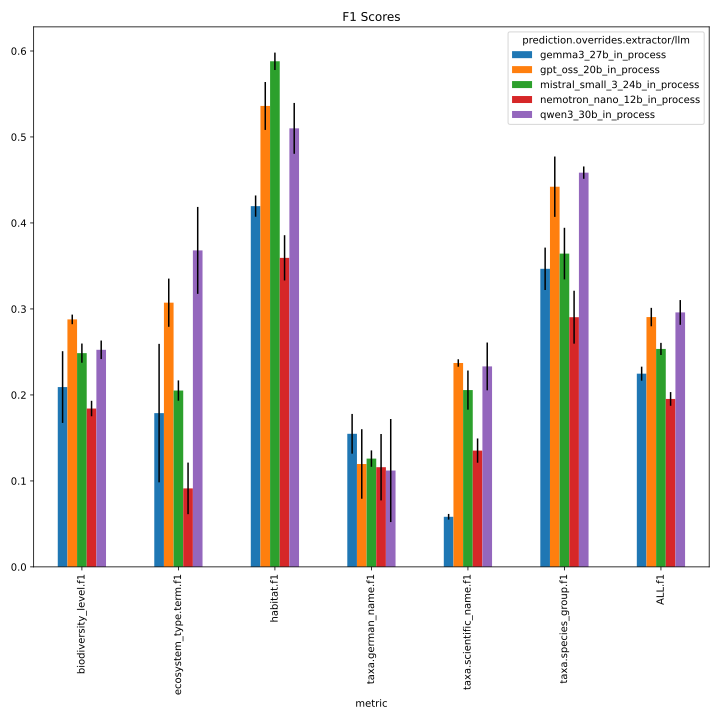
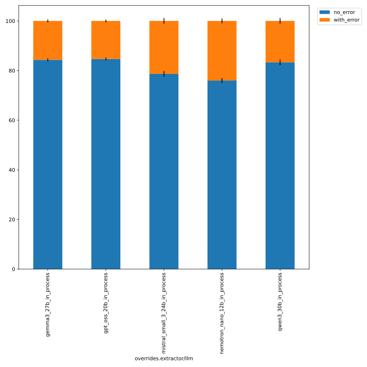
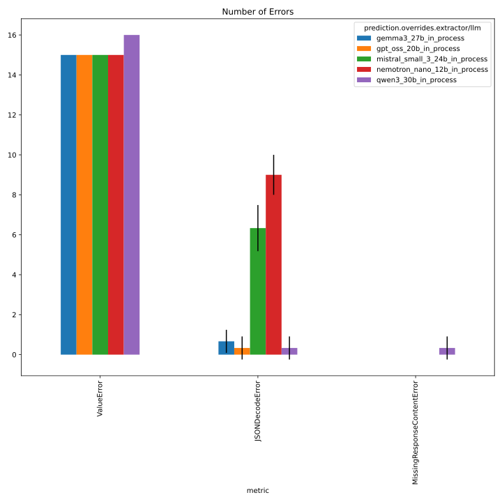

# 311_better_default_temperature

evaluate setting temperature, top_p, top_k and repetition penalty to recommended values per model
see https://github.com/DFKI-NLP/kibad-llm/issues/311 / https://github.com/DFKI-NLP/kibad-llm/pull/322 for details
 - models: gpt_oss_20b, gemma3_27b, qwen3_30b, mistral_small_3_24b, and nemotron_nano_12b_v2 (all in-process)
 - faktencheck core schema + detect evidence
 - with `return_reasoning=true`


## Evaluation Notebook Parameters
```python
NAME = "311_better_default_temperature"
METRICS_DIR_PATTERN = "evaluate/**/2026-01-26_08-58-14/"
ERRORS_DIR_PATTERN = "evaluate/**/2026-01-26_09-05-58/"
# used to group the data
INDEX_COLUMNS = ["overrides.extractor/llm"]
PLOT_KWARGS = {
    # can be either "metric" or one of the INDEX_COLUMNS (or multiple of them)
    "xgroup": "overrides.extractor/llm",
    # add any more arguments passed to pd.DataFrame.plot
}
```





details below

## Inference
```bash
./run_in_process.sh -pa "H100-SLT,H100-Trails,H100,A100-80GB" \
-u "-m kibad_llm.predict \
name=311_better_default_temperature  \
experiment/predict=faktencheck_core_fields_schema_with_evidence \
pdf_directory=/ds/text/kiba-d/dev-set-100 \
extractor.return_reasoning=true \
extractor/llm=gpt_oss_20b_in_process,gemma3_27b_in_process,qwen3_30b_in_process,nemotron_nano_12b_in_process,mistral_small_3_24b_in_process \
seed=42,1337,7331 \
--multirun"
```


<details>
<summary>click to see output</summary>

```bash
[2026-01-24 00:12:27,443][HYDRA] Saving job_return in /netscratch/hennig/code/kibad-llm/logs/311_better_default_temperature/predict/multiruns/2026-01-23_16-12-26/job_return_value.json
[2026-01-24 00:12:27,476][HYDRA] Saving job_return in /netscratch/hennig/code/kibad-llm/logs/311_better_default_temperature/predict/multiruns/2026-01-23_16-12-26/job_return_value.md
[2026-01-24 00:12:27,575][HYDRA] Contents of /netscratch/hennig/code/kibad-llm/logs/311_better_default_temperature/predict/multiruns/2026-01-23_16-12-26/job_return_value.md:
```


|                                                        | branch                     | commit_hash                              | is_dirty   | output_file                                                                                                    | output_file_absolute                                                                                                                             | overrides.experiment/predict                 | overrides.extractor.return_reasoning   | overrides.extractor/llm        | overrides.name                 | overrides.pdf_directory     |   overrides.seed |   time_extraction |   time_pdf_conversion |
|:-------------------------------------------------------|:---------------------------|:-----------------------------------------|:-----------|:---------------------------------------------------------------------------------------------------------------|:-------------------------------------------------------------------------------------------------------------------------------------------------|:---------------------------------------------|:---------------------------------------|:-------------------------------|:-------------------------------|:----------------------------|-----------------:|------------------:|----------------------:|
| extractor/llm=gemma3_27b_in_process#seed=1337          | feature/temperature_config | 7197d3bf97007b8a8e7b212a900e4c0bb574f62a | False      | predictions/311_better_default_temperature/2026-01-23_16-12-26/2026-01-23_17-50-38_952627/predictions.jsonl.gz | /netscratch/hennig/code/kibad-llm/predictions/311_better_default_temperature/2026-01-23_16-12-26/2026-01-23_17-50-38_952627/predictions.jsonl.gz | faktencheck_core_fields_schema_with_evidence | True                                   | gemma3_27b_in_process          | 311_better_default_temperature | /ds/text/kiba-d/dev-set-100 |             1337 |           890.514 |            0.00732378 |
| extractor/llm=gemma3_27b_in_process#seed=42            | feature/temperature_config | 7197d3bf97007b8a8e7b212a900e4c0bb574f62a | False      | predictions/311_better_default_temperature/2026-01-23_16-12-26/2026-01-23_17-29-45_078167/predictions.jsonl.gz | /netscratch/hennig/code/kibad-llm/predictions/311_better_default_temperature/2026-01-23_16-12-26/2026-01-23_17-29-45_078167/predictions.jsonl.gz | faktencheck_core_fields_schema_with_evidence | True                                   | gemma3_27b_in_process          | 311_better_default_temperature | /ds/text/kiba-d/dev-set-100 |               42 |          1129.82  |            0.00607    |
| extractor/llm=gemma3_27b_in_process#seed=7331          | feature/temperature_config | 7197d3bf97007b8a8e7b212a900e4c0bb574f62a | False      | predictions/311_better_default_temperature/2026-01-23_16-12-26/2026-01-23_18-07-08_773377/predictions.jsonl.gz | /netscratch/hennig/code/kibad-llm/predictions/311_better_default_temperature/2026-01-23_16-12-26/2026-01-23_18-07-08_773377/predictions.jsonl.gz | faktencheck_core_fields_schema_with_evidence | True                                   | gemma3_27b_in_process          | 311_better_default_temperature | /ds/text/kiba-d/dev-set-100 |             7331 |          1031.85  |            0.00890211 |
| extractor/llm=gpt_oss_20b_in_process#seed=1337         | feature/temperature_config | 7197d3bf97007b8a8e7b212a900e4c0bb574f62a | False      | predictions/311_better_default_temperature/2026-01-23_16-12-26/2026-01-23_16-38-11_868087/predictions.jsonl.gz | /netscratch/hennig/code/kibad-llm/predictions/311_better_default_temperature/2026-01-23_16-12-26/2026-01-23_16-38-11_868087/predictions.jsonl.gz | faktencheck_core_fields_schema_with_evidence | True                                   | gpt_oss_20b_in_process         | 311_better_default_temperature | /ds/text/kiba-d/dev-set-100 |             1337 |          1427.46  |            0.00615131 |
| extractor/llm=gpt_oss_20b_in_process#seed=42           | feature/temperature_config | 7197d3bf97007b8a8e7b212a900e4c0bb574f62a | False      | predictions/311_better_default_temperature/2026-01-23_16-12-26/2026-01-23_16-12-29_165418/predictions.jsonl.gz | /netscratch/hennig/code/kibad-llm/predictions/311_better_default_temperature/2026-01-23_16-12-26/2026-01-23_16-12-29_165418/predictions.jsonl.gz | faktencheck_core_fields_schema_with_evidence | True                                   | gpt_oss_20b_in_process         | 311_better_default_temperature | /ds/text/kiba-d/dev-set-100 |               42 |          1309.98  |            0.00812886 |
| extractor/llm=gpt_oss_20b_in_process#seed=7331         | feature/temperature_config | 7197d3bf97007b8a8e7b212a900e4c0bb574f62a | False      | predictions/311_better_default_temperature/2026-01-23_16-12-26/2026-01-23_17-03-07_771891/predictions.jsonl.gz | /netscratch/hennig/code/kibad-llm/predictions/311_better_default_temperature/2026-01-23_16-12-26/2026-01-23_17-03-07_771891/predictions.jsonl.gz | faktencheck_core_fields_schema_with_evidence | True                                   | gpt_oss_20b_in_process         | 311_better_default_temperature | /ds/text/kiba-d/dev-set-100 |             7331 |          1529.83  |            0.00640991 |
| extractor/llm=mistral_small_3_24b_in_process#seed=1337 | feature/temperature_config | 7197d3bf97007b8a8e7b212a900e4c0bb574f62a | False      | predictions/311_better_default_temperature/2026-01-23_16-12-26/2026-01-23_22-34-36_701477/predictions.jsonl.gz | /netscratch/hennig/code/kibad-llm/predictions/311_better_default_temperature/2026-01-23_16-12-26/2026-01-23_22-34-36_701477/predictions.jsonl.gz | faktencheck_core_fields_schema_with_evidence | True                                   | mistral_small_3_24b_in_process | 311_better_default_temperature | /ds/text/kiba-d/dev-set-100 |             1337 |          2817.39  |            0.0096781  |
| extractor/llm=mistral_small_3_24b_in_process#seed=42   | feature/temperature_config | 7197d3bf97007b8a8e7b212a900e4c0bb574f62a | False      | predictions/311_better_default_temperature/2026-01-23_16-12-26/2026-01-23_21-45-51_380492/predictions.jsonl.gz | /netscratch/hennig/code/kibad-llm/predictions/311_better_default_temperature/2026-01-23_16-12-26/2026-01-23_21-45-51_380492/predictions.jsonl.gz | faktencheck_core_fields_schema_with_evidence | True                                   | mistral_small_3_24b_in_process | 311_better_default_temperature | /ds/text/kiba-d/dev-set-100 |               42 |          2833.34  |            0.00689981 |
| extractor/llm=mistral_small_3_24b_in_process#seed=7331 | feature/temperature_config | 7197d3bf97007b8a8e7b212a900e4c0bb574f62a | False      | predictions/311_better_default_temperature/2026-01-23_16-12-26/2026-01-23_23-23-06_575041/predictions.jsonl.gz | /netscratch/hennig/code/kibad-llm/predictions/311_better_default_temperature/2026-01-23_16-12-26/2026-01-23_23-23-06_575041/predictions.jsonl.gz | faktencheck_core_fields_schema_with_evidence | True                                   | mistral_small_3_24b_in_process | 311_better_default_temperature | /ds/text/kiba-d/dev-set-100 |             7331 |          2869.74  |            0.00897468 |
| extractor/llm=nemotron_nano_12b_in_process#seed=1337   | feature/temperature_config | 7197d3bf97007b8a8e7b212a900e4c0bb574f62a | False      | predictions/311_better_default_temperature/2026-01-23_16-12-26/2026-01-23_21-03-57_566220/predictions.jsonl.gz | /netscratch/hennig/code/kibad-llm/predictions/311_better_default_temperature/2026-01-23_16-12-26/2026-01-23_21-03-57_566220/predictions.jsonl.gz | faktencheck_core_fields_schema_with_evidence | True                                   | nemotron_nano_12b_in_process   | 311_better_default_temperature | /ds/text/kiba-d/dev-set-100 |             1337 |          1141.7   |            0.00621737 |
| extractor/llm=nemotron_nano_12b_in_process#seed=42     | feature/temperature_config | 7197d3bf97007b8a8e7b212a900e4c0bb574f62a | False      | predictions/311_better_default_temperature/2026-01-23_16-12-26/2026-01-23_20-43-05_643545/predictions.jsonl.gz | /netscratch/hennig/code/kibad-llm/predictions/311_better_default_temperature/2026-01-23_16-12-26/2026-01-23_20-43-05_643545/predictions.jsonl.gz | faktencheck_core_fields_schema_with_evidence | True                                   | nemotron_nano_12b_in_process   | 311_better_default_temperature | /ds/text/kiba-d/dev-set-100 |               42 |          1150.66  |            0.00747427 |
| extractor/llm=nemotron_nano_12b_in_process#seed=7331   | feature/temperature_config | 7197d3bf97007b8a8e7b212a900e4c0bb574f62a | False      | predictions/311_better_default_temperature/2026-01-23_16-12-26/2026-01-23_21-23-58_576065/predictions.jsonl.gz | /netscratch/hennig/code/kibad-llm/predictions/311_better_default_temperature/2026-01-23_16-12-26/2026-01-23_21-23-58_576065/predictions.jsonl.gz | faktencheck_core_fields_schema_with_evidence | True                                   | nemotron_nano_12b_in_process   | 311_better_default_temperature | /ds/text/kiba-d/dev-set-100 |             7331 |          1253.11  |            0.0092232  |
| extractor/llm=qwen3_30b_in_process#seed=1337           | feature/temperature_config | 7197d3bf97007b8a8e7b212a900e4c0bb574f62a | False      | predictions/311_better_default_temperature/2026-01-23_16-12-26/2026-01-23_19-11-52_469585/predictions.jsonl.gz | /netscratch/hennig/code/kibad-llm/predictions/311_better_default_temperature/2026-01-23_16-12-26/2026-01-23_19-11-52_469585/predictions.jsonl.gz | faktencheck_core_fields_schema_with_evidence | True                                   | qwen3_30b_in_process           | 311_better_default_temperature | /ds/text/kiba-d/dev-set-100 |             1337 |          2728.84  |            0.00673046 |
| extractor/llm=qwen3_30b_in_process#seed=42             | feature/temperature_config | 7197d3bf97007b8a8e7b212a900e4c0bb574f62a | False      | predictions/311_better_default_temperature/2026-01-23_16-12-26/2026-01-23_18-26-07_774743/predictions.jsonl.gz | /netscratch/hennig/code/kibad-llm/predictions/311_better_default_temperature/2026-01-23_16-12-26/2026-01-23_18-26-07_774743/predictions.jsonl.gz | faktencheck_core_fields_schema_with_evidence | True                                   | qwen3_30b_in_process           | 311_better_default_temperature | /ds/text/kiba-d/dev-set-100 |               42 |          2600.6   |            0.00677752 |
| extractor/llm=qwen3_30b_in_process#seed=7331           | feature/temperature_config | 7197d3bf97007b8a8e7b212a900e4c0bb574f62a | False      | predictions/311_better_default_temperature/2026-01-23_16-12-26/2026-01-23_19-58-50_450263/predictions.jsonl.gz | /netscratch/hennig/code/kibad-llm/predictions/311_better_default_temperature/2026-01-23_16-12-26/2026-01-23_19-58-50_450263/predictions.jsonl.gz | faktencheck_core_fields_schema_with_evidence | True                                   | qwen3_30b_in_process           | 311_better_default_temperature | /ds/text/kiba-d/dev-set-100 |             7331 |          2568.52  |            0.00757004 |

</details>

### evaluate

#### f1

```bash
uv run -m kibad_llm.evaluate \
name=311_better_default_temperature  \
experiment/evaluate=faktencheck_core_f1_micro_flat \
prediction_logs=logs/311_better_default_temperature/predict/multiruns/2026-01-23_16-12-26 \
+hydra.callbacks.save_job_return.multirun_markdown_group_by=overrides.extractor/llm \
--multirun
```

<details>
<summary>click to see output</summary>

```bash
[2026-01-26 08:58:30,906][HYDRA] Saving job_return in /netscratch/hennig/code/kibad-llm/logs/311_better_default_temperature/evaluate/multiruns/2026-01-26_08-58-14/job_return_value.json                                                      
[2026-01-26 08:58:30,914][HYDRA] Saving job_return in /netscratch/hennig/code/kibad-llm/logs/311_better_default_temperature/evaluate/multiruns/2026-01-26_08-58-14/job_return_value.md                                                        
[2026-01-26 08:58:31,274][HYDRA] Contents of /netscratch/hennig/code/kibad-llm/logs/311_better_default_temperature/evaluate/multiruns/2026-01-26_08-58-14/job_return_value.md: 
```

| overrides.extractor/llm        |   ALL.f1.mean |   ALL.f1.std |   ALL.precision.mean |   ALL.precision.std |   ALL.recall.mean |   ALL.recall.std |   ALL.support.mean |   ALL.support.std |   AVG.f1.mean |   AVG.f1.std |   AVG.precision.mean |   AVG.precision.std |   AVG.recall.mean |   AVG.recall.std |   AVG.support.mean |   AVG.support.std |   biodiversity_level.f1.mean |   biodiversity_level.f1.std |   biodiversity_level.precision.mean |   biodiversity_level.precision.std |   biodiversity_level.recall.mean |   biodiversity_level.recall.std |   biodiversity_level.support.mean |   biodiversity_level.support.std |   ecosystem_type.term.f1.mean |   ecosystem_type.term.f1.std |   ecosystem_type.term.precision.mean |   ecosystem_type.term.precision.std |   ecosystem_type.term.recall.mean |   ecosystem_type.term.recall.std |   ecosystem_type.term.support.mean |   ecosystem_type.term.support.std |   habitat.f1.mean |   habitat.f1.std |   habitat.precision.mean |   habitat.precision.std |   habitat.recall.mean |   habitat.recall.std |   habitat.support.mean |   habitat.support.std |   prediction.job_return_value.time_extraction.mean |   prediction.job_return_value.time_extraction.std |   prediction.job_return_value.time_pdf_conversion.mean |   prediction.job_return_value.time_pdf_conversion.std |   taxa.german_name.f1.mean |   taxa.german_name.f1.std |   taxa.german_name.precision.mean |   taxa.german_name.precision.std |   taxa.german_name.recall.mean |   taxa.german_name.recall.std |   taxa.german_name.support.mean |   taxa.german_name.support.std |   taxa.scientific_name.f1.mean |   taxa.scientific_name.f1.std |   taxa.scientific_name.precision.mean |   taxa.scientific_name.precision.std |   taxa.scientific_name.recall.mean |   taxa.scientific_name.recall.std |   taxa.scientific_name.support.mean |   taxa.scientific_name.support.std |   taxa.species_group.f1.mean |   taxa.species_group.f1.std |   taxa.species_group.precision.mean |   taxa.species_group.precision.std |   taxa.species_group.recall.mean |   taxa.species_group.recall.std |   taxa.species_group.support.mean |   taxa.species_group.support.std | overrides.experiment/predict                                                                                                                     | overrides.extractor.return_reasoning   | overrides.name                                                                                         | overrides.pdf_directory                                                                       | overrides.seed         | prediction.job_return_value.branch                                                         | prediction.job_return_value.commit_hash                                                                                              | prediction.job_return_value.is_dirty   | prediction.job_return_value.output_file                                                                                                                                                                                                                                                                                                                | prediction.job_return_value.output_file_absolute                                                                                                                                                                                                                                                                                                                                                                                                             |
|:-------------------------------|--------------:|-------------:|---------------------:|--------------------:|------------------:|-----------------:|-------------------:|------------------:|--------------:|-------------:|---------------------:|--------------------:|------------------:|-----------------:|-------------------:|------------------:|-----------------------------:|----------------------------:|------------------------------------:|-----------------------------------:|---------------------------------:|--------------------------------:|----------------------------------:|---------------------------------:|------------------------------:|-----------------------------:|-------------------------------------:|------------------------------------:|----------------------------------:|---------------------------------:|-----------------------------------:|----------------------------------:|------------------:|-----------------:|-------------------------:|------------------------:|----------------------:|---------------------:|-----------------------:|----------------------:|---------------------------------------------------:|--------------------------------------------------:|-------------------------------------------------------:|------------------------------------------------------:|---------------------------:|--------------------------:|----------------------------------:|---------------------------------:|-------------------------------:|------------------------------:|--------------------------------:|-------------------------------:|-------------------------------:|------------------------------:|--------------------------------------:|-------------------------------------:|-----------------------------------:|----------------------------------:|------------------------------------:|-----------------------------------:|-----------------------------:|----------------------------:|------------------------------------:|-----------------------------------:|---------------------------------:|--------------------------------:|----------------------------------:|---------------------------------:|:-------------------------------------------------------------------------------------------------------------------------------------------------|:---------------------------------------|:-------------------------------------------------------------------------------------------------------|:----------------------------------------------------------------------------------------------|:-----------------------|:-------------------------------------------------------------------------------------------|:-------------------------------------------------------------------------------------------------------------------------------------|:---------------------------------------|:-------------------------------------------------------------------------------------------------------------------------------------------------------------------------------------------------------------------------------------------------------------------------------------------------------------------------------------------------------|:-------------------------------------------------------------------------------------------------------------------------------------------------------------------------------------------------------------------------------------------------------------------------------------------------------------------------------------------------------------------------------------------------------------------------------------------------------------|
| gemma3_27b_in_process          |         0.225 |        0.008 |                0.309 |               0.012 |             0.177 |            0.011 |                792 |                 0 |         0.228 |        0.013 |                0.284 |               0.015 |             0.204 |            0.016 |                132 |                 0 |                        0.209 |                       0.042 |                               0.197 |                              0.051 |                            0.224 |                           0.03  |                                67 |                                0 |                         0.179 |                        0.08  |                                0.192 |                               0.072 |                             0.17  |                            0.086 |                                 53 |                                 0 |             0.42  |            0.012 |                    0.477 |                   0.023 |                 0.374 |                0.008 |                    138 |                     0 |                                            1017.39 |                                           120.306 |                                                  0.007 |                                                 0.001 |                      0.155 |                     0.023 |                             0.335 |                            0.03  |                          0.101 |                         0.018 |                             231 |                              0 |                          0.058 |                         0.003 |                                 0.117 |                                0.012 |                              0.039 |                             0.003 |                                 197 |                                  0 |                        0.347 |                       0.025 |                               0.387 |                              0.015 |                            0.314 |                           0.033 |                               106 |                                0 | ['faktencheck_core_fields_schema_with_evidence', 'faktencheck_core_fields_schema_with_evidence', 'faktencheck_core_fields_schema_with_evidence'] | ['True', 'True', 'True']               | ['311_better_default_temperature', '311_better_default_temperature', '311_better_default_temperature'] | ['/ds/text/kiba-d/dev-set-100', '/ds/text/kiba-d/dev-set-100', '/ds/text/kiba-d/dev-set-100'] | ['1337', '42', '7331'] | ['feature/temperature_config', 'feature/temperature_config', 'feature/temperature_config'] | ['7197d3bf97007b8a8e7b212a900e4c0bb574f62a', '7197d3bf97007b8a8e7b212a900e4c0bb574f62a', '7197d3bf97007b8a8e7b212a900e4c0bb574f62a'] | [np.False_, np.False_, np.False_]      | ['predictions/311_better_default_temperature/2026-01-23_16-12-26/2026-01-23_17-50-38_952627/predictions.jsonl.gz', 'predictions/311_better_default_temperature/2026-01-23_16-12-26/2026-01-23_17-29-45_078167/predictions.jsonl.gz', 'predictions/311_better_default_temperature/2026-01-23_16-12-26/2026-01-23_18-07-08_773377/predictions.jsonl.gz'] | ['/netscratch/hennig/code/kibad-llm/predictions/311_better_default_temperature/2026-01-23_16-12-26/2026-01-23_17-50-38_952627/predictions.jsonl.gz', '/netscratch/hennig/code/kibad-llm/predictions/311_better_default_temperature/2026-01-23_16-12-26/2026-01-23_17-29-45_078167/predictions.jsonl.gz', '/netscratch/hennig/code/kibad-llm/predictions/311_better_default_temperature/2026-01-23_16-12-26/2026-01-23_18-07-08_773377/predictions.jsonl.gz'] |
| gpt_oss_20b_in_process         |         0.291 |        0.011 |                0.304 |               0.022 |             0.279 |            0.016 |                792 |                 0 |         0.322 |        0.012 |                0.341 |               0.02  |             0.312 |            0.014 |                132 |                 0 |                        0.288 |                       0.006 |                               0.282 |                              0.008 |                            0.294 |                           0.009 |                                67 |                                0 |                         0.307 |                        0.028 |                                0.29  |                               0.023 |                             0.327 |                            0.039 |                                 53 |                                 0 |             0.536 |            0.028 |                    0.644 |                   0.037 |                 0.459 |                0.022 |                    138 |                     0 |                                            1422.42 |                                           110.01  |                                                  0.007 |                                                 0.001 |                      0.12  |                     0.04  |                             0.145 |                            0.041 |                          0.102 |                         0.039 |                             231 |                              0 |                          0.237 |                         0.004 |                                 0.216 |                                0.012 |                              0.266 |                             0.028 |                                 197 |                                  0 |                        0.442 |                       0.035 |                               0.468 |                              0.068 |                            0.421 |                           0.014 |                               106 |                                0 | ['faktencheck_core_fields_schema_with_evidence', 'faktencheck_core_fields_schema_with_evidence', 'faktencheck_core_fields_schema_with_evidence'] | ['True', 'True', 'True']               | ['311_better_default_temperature', '311_better_default_temperature', '311_better_default_temperature'] | ['/ds/text/kiba-d/dev-set-100', '/ds/text/kiba-d/dev-set-100', '/ds/text/kiba-d/dev-set-100'] | ['1337', '42', '7331'] | ['feature/temperature_config', 'feature/temperature_config', 'feature/temperature_config'] | ['7197d3bf97007b8a8e7b212a900e4c0bb574f62a', '7197d3bf97007b8a8e7b212a900e4c0bb574f62a', '7197d3bf97007b8a8e7b212a900e4c0bb574f62a'] | [np.False_, np.False_, np.False_]      | ['predictions/311_better_default_temperature/2026-01-23_16-12-26/2026-01-23_16-38-11_868087/predictions.jsonl.gz', 'predictions/311_better_default_temperature/2026-01-23_16-12-26/2026-01-23_16-12-29_165418/predictions.jsonl.gz', 'predictions/311_better_default_temperature/2026-01-23_16-12-26/2026-01-23_17-03-07_771891/predictions.jsonl.gz'] | ['/netscratch/hennig/code/kibad-llm/predictions/311_better_default_temperature/2026-01-23_16-12-26/2026-01-23_16-38-11_868087/predictions.jsonl.gz', '/netscratch/hennig/code/kibad-llm/predictions/311_better_default_temperature/2026-01-23_16-12-26/2026-01-23_16-12-29_165418/predictions.jsonl.gz', '/netscratch/hennig/code/kibad-llm/predictions/311_better_default_temperature/2026-01-23_16-12-26/2026-01-23_17-03-07_771891/predictions.jsonl.gz'] |
| mistral_small_3_24b_in_process |         0.253 |        0.007 |                0.225 |               0.01  |             0.291 |            0.007 |                792 |                 0 |         0.29  |        0.005 |                0.295 |               0.006 |             0.326 |            0.015 |                132 |                 0 |                        0.249 |                       0.011 |                               0.2   |                              0.009 |                            0.328 |                           0.015 |                                67 |                                0 |                         0.205 |                        0.012 |                                0.142 |                               0.005 |                             0.377 |                            0.082 |                                 53 |                                 0 |             0.588 |            0.01  |                    0.803 |                   0.01  |                 0.464 |                0.013 |                    138 |                     0 |                                            2840.16 |                                            26.83  |                                                  0.009 |                                                 0.001 |                      0.126 |                     0.01  |                             0.116 |                            0.009 |                          0.137 |                         0.011 |                             231 |                              0 |                          0.206 |                         0.023 |                                 0.171 |                                0.023 |                              0.259 |                             0.02  |                                 197 |                                  0 |                        0.364 |                       0.03  |                               0.34  |                              0.034 |                            0.393 |                           0.024 |                               106 |                                0 | ['faktencheck_core_fields_schema_with_evidence', 'faktencheck_core_fields_schema_with_evidence', 'faktencheck_core_fields_schema_with_evidence'] | ['True', 'True', 'True']               | ['311_better_default_temperature', '311_better_default_temperature', '311_better_default_temperature'] | ['/ds/text/kiba-d/dev-set-100', '/ds/text/kiba-d/dev-set-100', '/ds/text/kiba-d/dev-set-100'] | ['1337', '42', '7331'] | ['feature/temperature_config', 'feature/temperature_config', 'feature/temperature_config'] | ['7197d3bf97007b8a8e7b212a900e4c0bb574f62a', '7197d3bf97007b8a8e7b212a900e4c0bb574f62a', '7197d3bf97007b8a8e7b212a900e4c0bb574f62a'] | [np.False_, np.False_, np.False_]      | ['predictions/311_better_default_temperature/2026-01-23_16-12-26/2026-01-23_22-34-36_701477/predictions.jsonl.gz', 'predictions/311_better_default_temperature/2026-01-23_16-12-26/2026-01-23_21-45-51_380492/predictions.jsonl.gz', 'predictions/311_better_default_temperature/2026-01-23_16-12-26/2026-01-23_23-23-06_575041/predictions.jsonl.gz'] | ['/netscratch/hennig/code/kibad-llm/predictions/311_better_default_temperature/2026-01-23_16-12-26/2026-01-23_22-34-36_701477/predictions.jsonl.gz', '/netscratch/hennig/code/kibad-llm/predictions/311_better_default_temperature/2026-01-23_16-12-26/2026-01-23_21-45-51_380492/predictions.jsonl.gz', '/netscratch/hennig/code/kibad-llm/predictions/311_better_default_temperature/2026-01-23_16-12-26/2026-01-23_23-23-06_575041/predictions.jsonl.gz'] |
| nemotron_nano_12b_in_process   |         0.195 |        0.008 |                0.264 |               0.009 |             0.155 |            0.007 |                792 |                 0 |         0.196 |        0.009 |                0.254 |               0.013 |             0.169 |            0.01  |                132 |                 0 |                        0.184 |                       0.009 |                               0.172 |                              0.007 |                            0.199 |                           0.017 |                                67 |                                0 |                         0.091 |                        0.03  |                                0.089 |                               0.029 |                             0.094 |                            0.033 |                                 53 |                                 0 |             0.359 |            0.026 |                    0.449 |                   0.033 |                 0.3   |                0.022 |                    138 |                     0 |                                            1181.83 |                                            61.897 |                                                  0.008 |                                                 0.002 |                      0.116 |                     0.039 |                             0.24  |                            0.087 |                          0.076 |                         0.025 |                             231 |                              0 |                          0.135 |                         0.014 |                                 0.21  |                                0.011 |                              0.1   |                             0.013 |                                 197 |                                  0 |                        0.29  |                       0.031 |                               0.364 |                              0.037 |                            0.242 |                           0.029 |                               106 |                                0 | ['faktencheck_core_fields_schema_with_evidence', 'faktencheck_core_fields_schema_with_evidence', 'faktencheck_core_fields_schema_with_evidence'] | ['True', 'True', 'True']               | ['311_better_default_temperature', '311_better_default_temperature', '311_better_default_temperature'] | ['/ds/text/kiba-d/dev-set-100', '/ds/text/kiba-d/dev-set-100', '/ds/text/kiba-d/dev-set-100'] | ['1337', '42', '7331'] | ['feature/temperature_config', 'feature/temperature_config', 'feature/temperature_config'] | ['7197d3bf97007b8a8e7b212a900e4c0bb574f62a', '7197d3bf97007b8a8e7b212a900e4c0bb574f62a', '7197d3bf97007b8a8e7b212a900e4c0bb574f62a'] | [np.False_, np.False_, np.False_]      | ['predictions/311_better_default_temperature/2026-01-23_16-12-26/2026-01-23_21-03-57_566220/predictions.jsonl.gz', 'predictions/311_better_default_temperature/2026-01-23_16-12-26/2026-01-23_20-43-05_643545/predictions.jsonl.gz', 'predictions/311_better_default_temperature/2026-01-23_16-12-26/2026-01-23_21-23-58_576065/predictions.jsonl.gz'] | ['/netscratch/hennig/code/kibad-llm/predictions/311_better_default_temperature/2026-01-23_16-12-26/2026-01-23_21-03-57_566220/predictions.jsonl.gz', '/netscratch/hennig/code/kibad-llm/predictions/311_better_default_temperature/2026-01-23_16-12-26/2026-01-23_20-43-05_643545/predictions.jsonl.gz', '/netscratch/hennig/code/kibad-llm/predictions/311_better_default_temperature/2026-01-23_16-12-26/2026-01-23_21-23-58_576065/predictions.jsonl.gz'] |
| qwen3_30b_in_process           |         0.296 |        0.014 |                0.364 |               0.019 |             0.251 |            0.026 |                792 |                 0 |         0.322 |        0.011 |                0.376 |               0.015 |             0.305 |            0.015 |                132 |                 0 |                        0.252 |                       0.011 |                               0.252 |                              0.014 |                            0.254 |                           0.015 |                                67 |                                0 |                         0.368 |                        0.051 |                                0.297 |                               0.05  |                             0.484 |                            0.047 |                                 53 |                                 0 |             0.51  |            0.03  |                    0.72  |                   0.06  |                 0.396 |                0.029 |                    138 |                     0 |                                            2632.66 |                                            84.833 |                                                  0.007 |                                                 0     |                      0.112 |                     0.06  |                             0.162 |                            0.066 |                          0.087 |                         0.051 |                             231 |                              0 |                          0.233 |                         0.028 |                                 0.327 |                                0.021 |                              0.184 |                             0.039 |                                 197 |                                  0 |                        0.458 |                       0.007 |                               0.499 |                              0.017 |                            0.425 |                           0     |                               106 |                                0 | ['faktencheck_core_fields_schema_with_evidence', 'faktencheck_core_fields_schema_with_evidence', 'faktencheck_core_fields_schema_with_evidence'] | ['True', 'True', 'True']               | ['311_better_default_temperature', '311_better_default_temperature', '311_better_default_temperature'] | ['/ds/text/kiba-d/dev-set-100', '/ds/text/kiba-d/dev-set-100', '/ds/text/kiba-d/dev-set-100'] | ['1337', '42', '7331'] | ['feature/temperature_config', 'feature/temperature_config', 'feature/temperature_config'] | ['7197d3bf97007b8a8e7b212a900e4c0bb574f62a', '7197d3bf97007b8a8e7b212a900e4c0bb574f62a', '7197d3bf97007b8a8e7b212a900e4c0bb574f62a'] | [np.False_, np.False_, np.False_]      | ['predictions/311_better_default_temperature/2026-01-23_16-12-26/2026-01-23_19-11-52_469585/predictions.jsonl.gz', 'predictions/311_better_default_temperature/2026-01-23_16-12-26/2026-01-23_18-26-07_774743/predictions.jsonl.gz', 'predictions/311_better_default_temperature/2026-01-23_16-12-26/2026-01-23_19-58-50_450263/predictions.jsonl.gz'] | ['/netscratch/hennig/code/kibad-llm/predictions/311_better_default_temperature/2026-01-23_16-12-26/2026-01-23_19-11-52_469585/predictions.jsonl.gz', '/netscratch/hennig/code/kibad-llm/predictions/311_better_default_temperature/2026-01-23_16-12-26/2026-01-23_18-26-07_774743/predictions.jsonl.gz', '/netscratch/hennig/code/kibad-llm/predictions/311_better_default_temperature/2026-01-23_16-12-26/2026-01-23_19-58-50_450263/predictions.jsonl.gz'] |

</details>


#### errors

```bash
uv run -m kibad_llm.evaluate \
name=311_better_default_temperature  \
experiment/evaluate=prediction_errors \
prediction_logs=logs/311_better_default_temperature/predict/multiruns/2026-01-23_16-12-26 \
+hydra.callbacks.save_job_return.multirun_markdown_group_by=overrides.extractor/llm \
--multirun
```

<details>
<summary>click to see output</summary>

```bash
[2026-01-26 09:06:11,917][HYDRA] Saving job_return in /netscratch/hennig/code/kibad-llm/logs/311_better_default_temperature/evaluate/multiruns/2026-01-26_09-05-58/job_return_value.json
[2026-01-26 09:06:11,923][HYDRA] Saving job_return in /netscratch/hennig/code/kibad-llm/logs/311_better_default_temperature/evaluate/multiruns/2026-01-26_09-05-58/job_return_value.md
[2026-01-26 09:06:11,979][HYDRA] Contents of /netscratch/hennig/code/kibad-llm/logs/311_better_default_temperature/evaluate/multiruns/2026-01-26_09-05-58/job_return_value.md: 
```

| overrides.extractor/llm        |   JSONDecodeError.mean |   JSONDecodeError.std |   MissingResponseContentError.mean |   MissingResponseContentError.std |   ValueError.mean |   ValueError.std |   no_error.mean |   no_error.std |   prediction.job_return_value.time_extraction.mean |   prediction.job_return_value.time_extraction.std |   prediction.job_return_value.time_pdf_conversion.mean |   prediction.job_return_value.time_pdf_conversion.std |   with_error.mean |   with_error.std | overrides.experiment/predict                                                                                                                     | overrides.extractor.return_reasoning   | overrides.name                                                                                         | overrides.pdf_directory                                                                       | overrides.seed         | prediction.job_return_value.branch                                                         | prediction.job_return_value.commit_hash                                                                                              | prediction.job_return_value.is_dirty   | prediction.job_return_value.output_file                                                                                                                                                                                                                                                                                                                | prediction.job_return_value.output_file_absolute                                                                                                                                                                                                                                                                                                                                                                                                             |
|:-------------------------------|-----------------------:|----------------------:|-----------------------------------:|----------------------------------:|------------------:|-----------------:|----------------:|---------------:|---------------------------------------------------:|--------------------------------------------------:|-------------------------------------------------------:|------------------------------------------------------:|------------------:|-----------------:|:-------------------------------------------------------------------------------------------------------------------------------------------------|:---------------------------------------|:-------------------------------------------------------------------------------------------------------|:----------------------------------------------------------------------------------------------|:-----------------------|:-------------------------------------------------------------------------------------------|:-------------------------------------------------------------------------------------------------------------------------------------|:---------------------------------------|:-------------------------------------------------------------------------------------------------------------------------------------------------------------------------------------------------------------------------------------------------------------------------------------------------------------------------------------------------------|:-------------------------------------------------------------------------------------------------------------------------------------------------------------------------------------------------------------------------------------------------------------------------------------------------------------------------------------------------------------------------------------------------------------------------------------------------------------|
| gemma3_27b_in_process          |                  1     |                 0     |                                  0 |                                 0 |                15 |                0 |          84.333 |          0.577 |                                            1017.39 |                                           120.306 |                                                  0.007 |                                                 0.001 |            15.667 |            0.577 | ['faktencheck_core_fields_schema_with_evidence', 'faktencheck_core_fields_schema_with_evidence', 'faktencheck_core_fields_schema_with_evidence'] | ['True', 'True', 'True']               | ['311_better_default_temperature', '311_better_default_temperature', '311_better_default_temperature'] | ['/ds/text/kiba-d/dev-set-100', '/ds/text/kiba-d/dev-set-100', '/ds/text/kiba-d/dev-set-100'] | ['1337', '42', '7331'] | ['feature/temperature_config', 'feature/temperature_config', 'feature/temperature_config'] | ['7197d3bf97007b8a8e7b212a900e4c0bb574f62a', '7197d3bf97007b8a8e7b212a900e4c0bb574f62a', '7197d3bf97007b8a8e7b212a900e4c0bb574f62a'] | [np.False_, np.False_, np.False_]      | ['predictions/311_better_default_temperature/2026-01-23_16-12-26/2026-01-23_17-50-38_952627/predictions.jsonl.gz', 'predictions/311_better_default_temperature/2026-01-23_16-12-26/2026-01-23_17-29-45_078167/predictions.jsonl.gz', 'predictions/311_better_default_temperature/2026-01-23_16-12-26/2026-01-23_18-07-08_773377/predictions.jsonl.gz'] | ['/netscratch/hennig/code/kibad-llm/predictions/311_better_default_temperature/2026-01-23_16-12-26/2026-01-23_17-50-38_952627/predictions.jsonl.gz', '/netscratch/hennig/code/kibad-llm/predictions/311_better_default_temperature/2026-01-23_16-12-26/2026-01-23_17-29-45_078167/predictions.jsonl.gz', '/netscratch/hennig/code/kibad-llm/predictions/311_better_default_temperature/2026-01-23_16-12-26/2026-01-23_18-07-08_773377/predictions.jsonl.gz'] |
| gpt_oss_20b_in_process         |                  1     |                 0     |                                  0 |                                 0 |                15 |                0 |          84.667 |          0.577 |                                            1422.42 |                                           110.01  |                                                  0.007 |                                                 0.001 |            15.333 |            0.577 | ['faktencheck_core_fields_schema_with_evidence', 'faktencheck_core_fields_schema_with_evidence', 'faktencheck_core_fields_schema_with_evidence'] | ['True', 'True', 'True']               | ['311_better_default_temperature', '311_better_default_temperature', '311_better_default_temperature'] | ['/ds/text/kiba-d/dev-set-100', '/ds/text/kiba-d/dev-set-100', '/ds/text/kiba-d/dev-set-100'] | ['1337', '42', '7331'] | ['feature/temperature_config', 'feature/temperature_config', 'feature/temperature_config'] | ['7197d3bf97007b8a8e7b212a900e4c0bb574f62a', '7197d3bf97007b8a8e7b212a900e4c0bb574f62a', '7197d3bf97007b8a8e7b212a900e4c0bb574f62a'] | [np.False_, np.False_, np.False_]      | ['predictions/311_better_default_temperature/2026-01-23_16-12-26/2026-01-23_16-38-11_868087/predictions.jsonl.gz', 'predictions/311_better_default_temperature/2026-01-23_16-12-26/2026-01-23_16-12-29_165418/predictions.jsonl.gz', 'predictions/311_better_default_temperature/2026-01-23_16-12-26/2026-01-23_17-03-07_771891/predictions.jsonl.gz'] | ['/netscratch/hennig/code/kibad-llm/predictions/311_better_default_temperature/2026-01-23_16-12-26/2026-01-23_16-38-11_868087/predictions.jsonl.gz', '/netscratch/hennig/code/kibad-llm/predictions/311_better_default_temperature/2026-01-23_16-12-26/2026-01-23_16-12-29_165418/predictions.jsonl.gz', '/netscratch/hennig/code/kibad-llm/predictions/311_better_default_temperature/2026-01-23_16-12-26/2026-01-23_17-03-07_771891/predictions.jsonl.gz'] |
| mistral_small_3_24b_in_process |                  6.333 |                 1.155 |                                  0 |                                 0 |                15 |                0 |          78.667 |          1.155 |                                            2840.16 |                                            26.83  |                                                  0.009 |                                                 0.001 |            21.333 |            1.155 | ['faktencheck_core_fields_schema_with_evidence', 'faktencheck_core_fields_schema_with_evidence', 'faktencheck_core_fields_schema_with_evidence'] | ['True', 'True', 'True']               | ['311_better_default_temperature', '311_better_default_temperature', '311_better_default_temperature'] | ['/ds/text/kiba-d/dev-set-100', '/ds/text/kiba-d/dev-set-100', '/ds/text/kiba-d/dev-set-100'] | ['1337', '42', '7331'] | ['feature/temperature_config', 'feature/temperature_config', 'feature/temperature_config'] | ['7197d3bf97007b8a8e7b212a900e4c0bb574f62a', '7197d3bf97007b8a8e7b212a900e4c0bb574f62a', '7197d3bf97007b8a8e7b212a900e4c0bb574f62a'] | [np.False_, np.False_, np.False_]      | ['predictions/311_better_default_temperature/2026-01-23_16-12-26/2026-01-23_22-34-36_701477/predictions.jsonl.gz', 'predictions/311_better_default_temperature/2026-01-23_16-12-26/2026-01-23_21-45-51_380492/predictions.jsonl.gz', 'predictions/311_better_default_temperature/2026-01-23_16-12-26/2026-01-23_23-23-06_575041/predictions.jsonl.gz'] | ['/netscratch/hennig/code/kibad-llm/predictions/311_better_default_temperature/2026-01-23_16-12-26/2026-01-23_22-34-36_701477/predictions.jsonl.gz', '/netscratch/hennig/code/kibad-llm/predictions/311_better_default_temperature/2026-01-23_16-12-26/2026-01-23_21-45-51_380492/predictions.jsonl.gz', '/netscratch/hennig/code/kibad-llm/predictions/311_better_default_temperature/2026-01-23_16-12-26/2026-01-23_23-23-06_575041/predictions.jsonl.gz'] |
| nemotron_nano_12b_in_process   |                  9     |                 1     |                                  0 |                                 0 |                15 |                0 |          76     |          1     |                                            1181.83 |                                            61.897 |                                                  0.008 |                                                 0.002 |            24     |            1     | ['faktencheck_core_fields_schema_with_evidence', 'faktencheck_core_fields_schema_with_evidence', 'faktencheck_core_fields_schema_with_evidence'] | ['True', 'True', 'True']               | ['311_better_default_temperature', '311_better_default_temperature', '311_better_default_temperature'] | ['/ds/text/kiba-d/dev-set-100', '/ds/text/kiba-d/dev-set-100', '/ds/text/kiba-d/dev-set-100'] | ['1337', '42', '7331'] | ['feature/temperature_config', 'feature/temperature_config', 'feature/temperature_config'] | ['7197d3bf97007b8a8e7b212a900e4c0bb574f62a', '7197d3bf97007b8a8e7b212a900e4c0bb574f62a', '7197d3bf97007b8a8e7b212a900e4c0bb574f62a'] | [np.False_, np.False_, np.False_]      | ['predictions/311_better_default_temperature/2026-01-23_16-12-26/2026-01-23_21-03-57_566220/predictions.jsonl.gz', 'predictions/311_better_default_temperature/2026-01-23_16-12-26/2026-01-23_20-43-05_643545/predictions.jsonl.gz', 'predictions/311_better_default_temperature/2026-01-23_16-12-26/2026-01-23_21-23-58_576065/predictions.jsonl.gz'] | ['/netscratch/hennig/code/kibad-llm/predictions/311_better_default_temperature/2026-01-23_16-12-26/2026-01-23_21-03-57_566220/predictions.jsonl.gz', '/netscratch/hennig/code/kibad-llm/predictions/311_better_default_temperature/2026-01-23_16-12-26/2026-01-23_20-43-05_643545/predictions.jsonl.gz', '/netscratch/hennig/code/kibad-llm/predictions/311_better_default_temperature/2026-01-23_16-12-26/2026-01-23_21-23-58_576065/predictions.jsonl.gz'] |
| qwen3_30b_in_process           |                  1     |                 0     |                                  1 |                                 0 |                16 |                0 |          83.333 |          1.155 |                                            2632.66 |                                            84.833 |                                                  0.007 |                                                 0     |            16.667 |            1.155 | ['faktencheck_core_fields_schema_with_evidence', 'faktencheck_core_fields_schema_with_evidence', 'faktencheck_core_fields_schema_with_evidence'] | ['True', 'True', 'True']               | ['311_better_default_temperature', '311_better_default_temperature', '311_better_default_temperature'] | ['/ds/text/kiba-d/dev-set-100', '/ds/text/kiba-d/dev-set-100', '/ds/text/kiba-d/dev-set-100'] | ['1337', '42', '7331'] | ['feature/temperature_config', 'feature/temperature_config', 'feature/temperature_config'] | ['7197d3bf97007b8a8e7b212a900e4c0bb574f62a', '7197d3bf97007b8a8e7b212a900e4c0bb574f62a', '7197d3bf97007b8a8e7b212a900e4c0bb574f62a'] | [np.False_, np.False_, np.False_]      | ['predictions/311_better_default_temperature/2026-01-23_16-12-26/2026-01-23_19-11-52_469585/predictions.jsonl.gz', 'predictions/311_better_default_temperature/2026-01-23_16-12-26/2026-01-23_18-26-07_774743/predictions.jsonl.gz', 'predictions/311_better_default_temperature/2026-01-23_16-12-26/2026-01-23_19-58-50_450263/predictions.jsonl.gz'] | ['/netscratch/hennig/code/kibad-llm/predictions/311_better_default_temperature/2026-01-23_16-12-26/2026-01-23_19-11-52_469585/predictions.jsonl.gz', '/netscratch/hennig/code/kibad-llm/predictions/311_better_default_temperature/2026-01-23_16-12-26/2026-01-23_18-26-07_774743/predictions.jsonl.gz', '/netscratch/hennig/code/kibad-llm/predictions/311_better_default_temperature/2026-01-23_16-12-26/2026-01-23_19-58-50_450263/predictions.jsonl.gz'] |

</details>