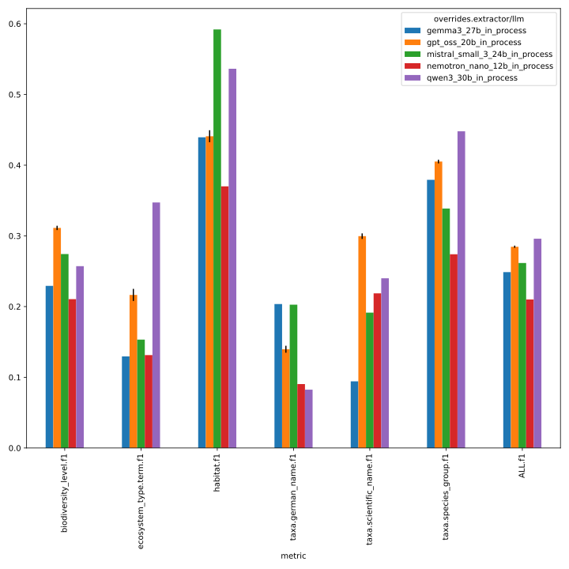
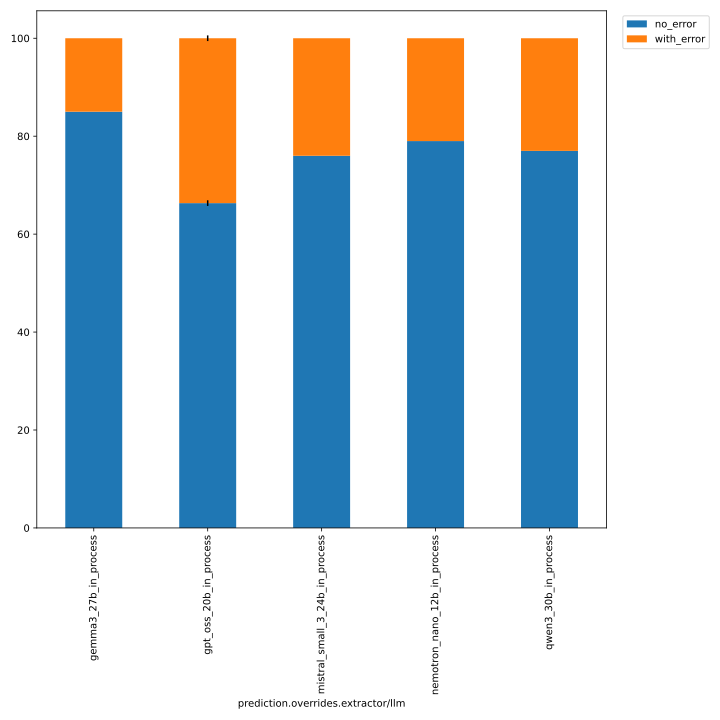
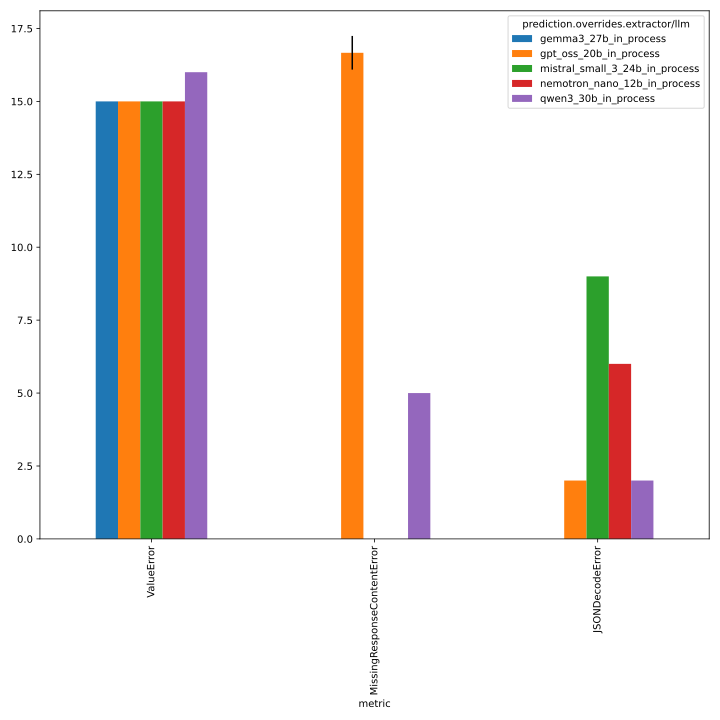

# 311_better_default_temperature

evaluate setting temperature, top_p, top_k and repetition penalty to recommended values per model
see https://github.com/DFKI-NLP/kibad-llm/issues/311 / https://github.com/DFKI-NLP/kibad-llm/pull/322 for details
 - models: gpt_oss_20b, gemma3_27b, qwen3_30b, mistral_small_3_24b, and nemotron_nano_12b_v2 (all in-process)
 - `temperature=0.0`
 - faktencheck core schema + detect evidence
 - with `return_reasoning=true`


## Evaluation Notebook Parameters
```python
NAME = "311_better_default_temperature_baseline"
METRICS_DIR_PATTERN = "evaluate/**/2026-01-26_03-05-47/"
ERRORS_DIR_PATTERN = "evaluate/**/2026-01-26_03-07-48/"
# used to group the data
INDEX_COLUMNS = ["overrides.extractor/llm"]
PLOT_KWARGS = {
    # can be either "metric" or one of the INDEX_COLUMNS (or multiple of them)
    "xgroup": "overrides.extractor/llm",
    # add any more arguments passed to pd.DataFrame.plot
}
```





details below

## Inference

```
./run_in_process.sh -pa "H100-SLT,H100-Trails,H100,A100-80GB" \
-u "-m kibad_llm.predict \
name=311_better_default_temperature_baseline \
experiment/predict=faktencheck_core_fields_schema_with_evidence \
pdf_directory=/ds/text/kiba-d/dev-set-100 \
extractor.return_reasoning=true \
extractor/llm=gpt_oss_20b_in_process,gemma3_27b_in_process,qwen3_30b_in_process,nemotron_nano_12b_in_process,mistral_small_3_24b_in_process \
seed=42,1337,7331 \
--multirun"
```

[2026-01-24 02:19:22,800][HYDRA] Contents of /netscratch/binder/projects/kibad-llm/logs/311_better_default_temperature_baseline/predict/multiruns/2026-01-23_15-36-01/job_return_value.md:

<details>
<summary>click to see content</summary>

|                                                        | branch   | commit_hash                              | is_dirty   | output_file                                                                                                             | output_file_absolute                                                                                                                                          | overrides.experiment/predict                 | overrides.extractor.return_reasoning   | overrides.extractor/llm        | overrides.name                          | overrides.pdf_directory     |   overrides.seed |   time_extraction |   time_pdf_conversion |
|:-------------------------------------------------------|:---------|:-----------------------------------------|:-----------|:------------------------------------------------------------------------------------------------------------------------|:--------------------------------------------------------------------------------------------------------------------------------------------------------------|:---------------------------------------------|:---------------------------------------|:-------------------------------|:----------------------------------------|:----------------------------|-----------------:|------------------:|----------------------:|
| extractor/llm=gemma3_27b_in_process#seed=1337          | main     | 96efc8cbaf31910ffab43b74a2a0b89184634a01 | False      | predictions/311_better_default_temperature_baseline/2026-01-23_15-36-01/2026-01-23_18-39-10_953067/predictions.jsonl.gz | /netscratch/binder/projects/kibad-llm/predictions/311_better_default_temperature_baseline/2026-01-23_15-36-01/2026-01-23_18-39-10_953067/predictions.jsonl.gz | faktencheck_core_fields_schema_with_evidence | True                                   | gemma3_27b_in_process          | 311_better_default_temperature_baseline | /ds/text/kiba-d/dev-set-100 |             1337 |           1171.69 |            0.00279479 |
| extractor/llm=gemma3_27b_in_process#seed=42            | main     | 96efc8cbaf31910ffab43b74a2a0b89184634a01 | False      | predictions/311_better_default_temperature_baseline/2026-01-23_15-36-01/2026-01-23_18-17-37_871565/predictions.jsonl.gz | /netscratch/binder/projects/kibad-llm/predictions/311_better_default_temperature_baseline/2026-01-23_15-36-01/2026-01-23_18-17-37_871565/predictions.jsonl.gz | faktencheck_core_fields_schema_with_evidence | True                                   | gemma3_27b_in_process          | 311_better_default_temperature_baseline | /ds/text/kiba-d/dev-set-100 |               42 |           1177.43 |            0.002606   |
| extractor/llm=gemma3_27b_in_process#seed=7331          | main     | 96efc8cbaf31910ffab43b74a2a0b89184634a01 | False      | predictions/311_better_default_temperature_baseline/2026-01-23_15-36-01/2026-01-23_19-00-04_947040/predictions.jsonl.gz | /netscratch/binder/projects/kibad-llm/predictions/311_better_default_temperature_baseline/2026-01-23_15-36-01/2026-01-23_19-00-04_947040/predictions.jsonl.gz | faktencheck_core_fields_schema_with_evidence | True                                   | gemma3_27b_in_process          | 311_better_default_temperature_baseline | /ds/text/kiba-d/dev-set-100 |             7331 |           1174.12 |            0.00285013 |
| extractor/llm=gpt_oss_20b_in_process#seed=1337         | main     | 96efc8cbaf31910ffab43b74a2a0b89184634a01 | False      | predictions/311_better_default_temperature_baseline/2026-01-23_15-36-01/2026-01-23_16-31-24_198356/predictions.jsonl.gz | /netscratch/binder/projects/kibad-llm/predictions/311_better_default_temperature_baseline/2026-01-23_15-36-01/2026-01-23_16-31-24_198356/predictions.jsonl.gz | faktencheck_core_fields_schema_with_evidence | True                                   | gpt_oss_20b_in_process         | 311_better_default_temperature_baseline | /ds/text/kiba-d/dev-set-100 |             1337 |           3127    |            0.00351188 |
| extractor/llm=gpt_oss_20b_in_process#seed=42           | main     | 96efc8cbaf31910ffab43b74a2a0b89184634a01 | False      | predictions/311_better_default_temperature_baseline/2026-01-23_15-36-01/2026-01-23_15-36-03_747336/predictions.jsonl.gz | /netscratch/binder/projects/kibad-llm/predictions/311_better_default_temperature_baseline/2026-01-23_15-36-01/2026-01-23_15-36-03_747336/predictions.jsonl.gz | faktencheck_core_fields_schema_with_evidence | True                                   | gpt_oss_20b_in_process         | 311_better_default_temperature_baseline | /ds/text/kiba-d/dev-set-100 |               42 |           3147.93 |            0.00348547 |
| extractor/llm=gpt_oss_20b_in_process#seed=7331         | main     | 96efc8cbaf31910ffab43b74a2a0b89184634a01 | False      | predictions/311_better_default_temperature_baseline/2026-01-23_15-36-01/2026-01-23_17-24-26_293566/predictions.jsonl.gz | /netscratch/binder/projects/kibad-llm/predictions/311_better_default_temperature_baseline/2026-01-23_15-36-01/2026-01-23_17-24-26_293566/predictions.jsonl.gz | faktencheck_core_fields_schema_with_evidence | True                                   | gpt_oss_20b_in_process         | 311_better_default_temperature_baseline | /ds/text/kiba-d/dev-set-100 |             7331 |           3136.27 |            0.00282958 |
| extractor/llm=mistral_small_3_24b_in_process#seed=1337 | main     | 96efc8cbaf31910ffab43b74a2a0b89184634a01 | False      | predictions/311_better_default_temperature_baseline/2026-01-23_15-36-01/2026-01-24_00-08-29_427127/predictions.jsonl.gz | /netscratch/binder/projects/kibad-llm/predictions/311_better_default_temperature_baseline/2026-01-23_15-36-01/2026-01-24_00-08-29_427127/predictions.jsonl.gz | faktencheck_core_fields_schema_with_evidence | True                                   | mistral_small_3_24b_in_process | 311_better_default_temperature_baseline | /ds/text/kiba-d/dev-set-100 |             1337 |           3816.76 |            0.00651497 |
| extractor/llm=mistral_small_3_24b_in_process#seed=42   | main     | 96efc8cbaf31910ffab43b74a2a0b89184634a01 | False      | predictions/311_better_default_temperature_baseline/2026-01-23_15-36-01/2026-01-23_23-03-02_317682/predictions.jsonl.gz | /netscratch/binder/projects/kibad-llm/predictions/311_better_default_temperature_baseline/2026-01-23_15-36-01/2026-01-23_23-03-02_317682/predictions.jsonl.gz | faktencheck_core_fields_schema_with_evidence | True                                   | mistral_small_3_24b_in_process | 311_better_default_temperature_baseline | /ds/text/kiba-d/dev-set-100 |               42 |           3813.69 |            0.00368887 |
| extractor/llm=mistral_small_3_24b_in_process#seed=7331 | main     | 96efc8cbaf31910ffab43b74a2a0b89184634a01 | False      | predictions/311_better_default_temperature_baseline/2026-01-23_15-36-01/2026-01-24_01-13-57_888376/predictions.jsonl.gz | /netscratch/binder/projects/kibad-llm/predictions/311_better_default_temperature_baseline/2026-01-23_15-36-01/2026-01-24_01-13-57_888376/predictions.jsonl.gz | faktencheck_core_fields_schema_with_evidence | True                                   | mistral_small_3_24b_in_process | 311_better_default_temperature_baseline | /ds/text/kiba-d/dev-set-100 |             7331 |           3817.52 |            0.0025578  |
| extractor/llm=nemotron_nano_12b_in_process#seed=1337   | main     | 96efc8cbaf31910ffab43b74a2a0b89184634a01 | False      | predictions/311_better_default_temperature_baseline/2026-01-23_15-36-01/2026-01-23_22-27-17_288378/predictions.jsonl.gz | /netscratch/binder/projects/kibad-llm/predictions/311_better_default_temperature_baseline/2026-01-23_15-36-01/2026-01-23_22-27-17_288378/predictions.jsonl.gz | faktencheck_core_fields_schema_with_evidence | True                                   | nemotron_nano_12b_in_process   | 311_better_default_temperature_baseline | /ds/text/kiba-d/dev-set-100 |             1337 |           1030.05 |            0.00301912 |
| extractor/llm=nemotron_nano_12b_in_process#seed=42     | main     | 96efc8cbaf31910ffab43b74a2a0b89184634a01 | False      | predictions/311_better_default_temperature_baseline/2026-01-23_15-36-01/2026-01-23_22-09-16_585406/predictions.jsonl.gz | /netscratch/binder/projects/kibad-llm/predictions/311_better_default_temperature_baseline/2026-01-23_15-36-01/2026-01-23_22-09-16_585406/predictions.jsonl.gz | faktencheck_core_fields_schema_with_evidence | True                                   | nemotron_nano_12b_in_process   | 311_better_default_temperature_baseline | /ds/text/kiba-d/dev-set-100 |               42 |           1030.35 |            0.00283951 |
| extractor/llm=nemotron_nano_12b_in_process#seed=7331   | main     | 96efc8cbaf31910ffab43b74a2a0b89184634a01 | False      | predictions/311_better_default_temperature_baseline/2026-01-23_15-36-01/2026-01-23_22-45-09_183196/predictions.jsonl.gz | /netscratch/binder/projects/kibad-llm/predictions/311_better_default_temperature_baseline/2026-01-23_15-36-01/2026-01-23_22-45-09_183196/predictions.jsonl.gz | faktencheck_core_fields_schema_with_evidence | True                                   | nemotron_nano_12b_in_process   | 311_better_default_temperature_baseline | /ds/text/kiba-d/dev-set-100 |             7331 |           1029.75 |            0.00364807 |
| extractor/llm=qwen3_30b_in_process#seed=1337           | main     | 96efc8cbaf31910ffab43b74a2a0b89184634a01 | False      | predictions/311_better_default_temperature_baseline/2026-01-23_15-36-01/2026-01-23_20-17-13_589198/predictions.jsonl.gz | /netscratch/binder/projects/kibad-llm/predictions/311_better_default_temperature_baseline/2026-01-23_15-36-01/2026-01-23_20-17-13_589198/predictions.jsonl.gz | faktencheck_core_fields_schema_with_evidence | True                                   | qwen3_30b_in_process           | 311_better_default_temperature_baseline | /ds/text/kiba-d/dev-set-100 |             1337 |           3251.25 |            0.00270458 |
| extractor/llm=qwen3_30b_in_process#seed=42             | main     | 96efc8cbaf31910ffab43b74a2a0b89184634a01 | False      | predictions/311_better_default_temperature_baseline/2026-01-23_15-36-01/2026-01-23_19-21-01_133940/predictions.jsonl.gz | /netscratch/binder/projects/kibad-llm/predictions/311_better_default_temperature_baseline/2026-01-23_15-36-01/2026-01-23_19-21-01_133940/predictions.jsonl.gz | faktencheck_core_fields_schema_with_evidence | True                                   | qwen3_30b_in_process           | 311_better_default_temperature_baseline | /ds/text/kiba-d/dev-set-100 |               42 |           3258.61 |            0.00311493 |
| extractor/llm=qwen3_30b_in_process#seed=7331           | main     | 96efc8cbaf31910ffab43b74a2a0b89184634a01 | False      | predictions/311_better_default_temperature_baseline/2026-01-23_15-36-01/2026-01-23_21-12-33_308488/predictions.jsonl.gz | /netscratch/binder/projects/kibad-llm/predictions/311_better_default_temperature_baseline/2026-01-23_15-36-01/2026-01-23_21-12-33_308488/predictions.jsonl.gz | faktencheck_core_fields_schema_with_evidence | True                                   | qwen3_30b_in_process           | 311_better_default_temperature_baseline | /ds/text/kiba-d/dev-set-100 |             7331 |           3337.45 |            0.00319516 |

</details>

## evaluate

### f1

```
uv run -m kibad_llm.evaluate \
name=311_better_default_temperature_baseline  \
experiment/evaluate=faktencheck_core_f1_micro_flat \
prediction_logs=logs/311_better_default_temperature_baseline/predict/multiruns/2026-01-23_15-36-01 \
+hydra.callbacks.save_job_return.multirun_markdown_group_by=overrides.extractor/llm \
--multirun
```

[2026-01-26 03:06:00,720][HYDRA] Saving job_return in /netscratch/binder/projects/kibad-llm/logs/311_better_default_temperature_baseline/evaluate/multiruns/2026-01-26_03-05-47/job_return_value.json
[2026-01-26 03:06:00,753][HYDRA] Saving job_return in /netscratch/binder/projects/kibad-llm/logs/311_better_default_temperature_baseline/evaluate/multiruns/2026-01-26_03-05-47/job_return_value.md
/netscratch/binder/cache/uv-venvs/kibad-llm/lib/python3.12/site-packages/hydra/_internal/callbacks.py:28: UserWarning: Callback SaveJobReturnValueCallback.on_multirun_end raised ValueError: len(index) != len(labels)
  warnings.warn(

**MARKDOWN CREATION FAILED (but json should be fine, so the eval notebook should also work)**
EDIT: the notebook works fine with the eval data

local re-run worked without problems (**time stamps and thus the paths differ!**):

<details>
<summary>click to see results</summary>


[2026-01-26 14:14:14,630][HYDRA] Contents of /home/arbi01/projects/kibad-llm/logs/311_better_default_temperature_baseline/evaluate/multiruns/2026-01-26_14-14-07/job_return_value.md:

| overrides.extractor/llm        |   ALL.f1.mean |   ALL.f1.std |   ALL.precision.mean |   ALL.precision.std |   ALL.recall.mean |   ALL.recall.std |   ALL.support.mean |   ALL.support.std |   AVG.f1.mean |   AVG.f1.std |   AVG.precision.mean |   AVG.precision.std |   AVG.recall.mean |   AVG.recall.std |   AVG.support.mean |   AVG.support.std |   biodiversity_level.f1.mean |   biodiversity_level.f1.std |   biodiversity_level.precision.mean |   biodiversity_level.precision.std |   biodiversity_level.recall.mean |   biodiversity_level.recall.std |   biodiversity_level.support.mean |   biodiversity_level.support.std |   ecosystem_type.term.f1.mean |   ecosystem_type.term.f1.std |   ecosystem_type.term.precision.mean |   ecosystem_type.term.precision.std |   ecosystem_type.term.recall.mean |   ecosystem_type.term.recall.std |   ecosystem_type.term.support.mean |   ecosystem_type.term.support.std |   habitat.f1.mean |   habitat.f1.std |   habitat.precision.mean |   habitat.precision.std |   habitat.recall.mean |   habitat.recall.std |   habitat.support.mean |   habitat.support.std |   prediction.job_return_value.time_extraction.mean |   prediction.job_return_value.time_extraction.std |   prediction.job_return_value.time_pdf_conversion.mean |   prediction.job_return_value.time_pdf_conversion.std |   taxa.german_name.f1.mean |   taxa.german_name.f1.std |   taxa.german_name.precision.mean |   taxa.german_name.precision.std |   taxa.german_name.recall.mean |   taxa.german_name.recall.std |   taxa.german_name.support.mean |   taxa.german_name.support.std |   taxa.scientific_name.f1.mean |   taxa.scientific_name.f1.std |   taxa.scientific_name.precision.mean |   taxa.scientific_name.precision.std |   taxa.scientific_name.recall.mean |   taxa.scientific_name.recall.std |   taxa.scientific_name.support.mean |   taxa.scientific_name.support.std |   taxa.species_group.f1.mean |   taxa.species_group.f1.std |   taxa.species_group.precision.mean |   taxa.species_group.precision.std |   taxa.species_group.recall.mean |   taxa.species_group.recall.std |   taxa.species_group.support.mean |   taxa.species_group.support.std | overrides.experiment/predict                                                                                                                     | overrides.extractor.return_reasoning   | overrides.name                                                                                                                    | overrides.pdf_directory                                                                       | overrides.seed         | prediction.job_return_value.branch   | prediction.job_return_value.commit_hash                                                                                              | prediction.job_return_value.is_dirty   | prediction.job_return_value.output_file                                                                                                                                                                                                                                                                                                                                           | prediction.job_return_value.output_file_absolute                                                                                                                                                                                                                                                                                                                                                                                                                                                    |
|:-------------------------------|--------------:|-------------:|---------------------:|--------------------:|------------------:|-----------------:|-------------------:|------------------:|--------------:|-------------:|---------------------:|--------------------:|------------------:|-----------------:|-------------------:|------------------:|-----------------------------:|----------------------------:|------------------------------------:|-----------------------------------:|---------------------------------:|--------------------------------:|----------------------------------:|---------------------------------:|------------------------------:|-----------------------------:|-------------------------------------:|------------------------------------:|----------------------------------:|---------------------------------:|-----------------------------------:|----------------------------------:|------------------:|-----------------:|-------------------------:|------------------------:|----------------------:|---------------------:|-----------------------:|----------------------:|---------------------------------------------------:|--------------------------------------------------:|-------------------------------------------------------:|------------------------------------------------------:|---------------------------:|--------------------------:|----------------------------------:|---------------------------------:|-------------------------------:|------------------------------:|--------------------------------:|-------------------------------:|-------------------------------:|------------------------------:|--------------------------------------:|-------------------------------------:|-----------------------------------:|----------------------------------:|------------------------------------:|-----------------------------------:|-----------------------------:|----------------------------:|------------------------------------:|-----------------------------------:|---------------------------------:|--------------------------------:|----------------------------------:|---------------------------------:|:-------------------------------------------------------------------------------------------------------------------------------------------------|:---------------------------------------|:----------------------------------------------------------------------------------------------------------------------------------|:----------------------------------------------------------------------------------------------|:-----------------------|:-------------------------------------|:-------------------------------------------------------------------------------------------------------------------------------------|:---------------------------------------|:----------------------------------------------------------------------------------------------------------------------------------------------------------------------------------------------------------------------------------------------------------------------------------------------------------------------------------------------------------------------------------|:----------------------------------------------------------------------------------------------------------------------------------------------------------------------------------------------------------------------------------------------------------------------------------------------------------------------------------------------------------------------------------------------------------------------------------------------------------------------------------------------------|
| gemma3_27b_in_process          |         0.249 |        0     |                0.281 |               0     |             0.223 |            0     |                792 |                 0 |         0.246 |            0 |                0.264 |               0     |             0.249 |            0     |                132 |                 0 |                        0.229 |                       0     |                               0.2   |                              0     |                            0.269 |                               0 |                                67 |                                0 |                         0.129 |                        0     |                                0.105 |                               0     |                             0.17  |                            0     |                                 53 |                                 0 |             0.439 |            0     |                    0.46  |                   0     |                 0.42  |                0     |                    138 |                     0 |                                            1174.41 |                                             2.881 |                                                  0.003 |                                                 0     |                      0.204 |                     0     |                             0.33  |                            0     |                          0.147 |                         0     |                             231 |                              0 |                          0.094 |                         0     |                                 0.14  |                                0     |                              0.071 |                             0     |                                 197 |                                  0 |                        0.379 |                       0     |                               0.349 |                              0     |                            0.415 |                               0 |                               106 |                                0 | ['faktencheck_core_fields_schema_with_evidence', 'faktencheck_core_fields_schema_with_evidence', 'faktencheck_core_fields_schema_with_evidence'] | ['True', 'True', 'True']               | ['311_better_default_temperature_baseline', '311_better_default_temperature_baseline', '311_better_default_temperature_baseline'] | ['/ds/text/kiba-d/dev-set-100', '/ds/text/kiba-d/dev-set-100', '/ds/text/kiba-d/dev-set-100'] | ['1337', '42', '7331'] | ['main', 'main', 'main']             | ['96efc8cbaf31910ffab43b74a2a0b89184634a01', '96efc8cbaf31910ffab43b74a2a0b89184634a01', '96efc8cbaf31910ffab43b74a2a0b89184634a01'] | [np.False_, np.False_, np.False_]      | ['predictions/311_better_default_temperature_baseline/2026-01-23_15-36-01/2026-01-23_18-39-10_953067/predictions.jsonl.gz', 'predictions/311_better_default_temperature_baseline/2026-01-23_15-36-01/2026-01-23_18-17-37_871565/predictions.jsonl.gz', 'predictions/311_better_default_temperature_baseline/2026-01-23_15-36-01/2026-01-23_19-00-04_947040/predictions.jsonl.gz'] | ['/netscratch/binder/projects/kibad-llm/predictions/311_better_default_temperature_baseline/2026-01-23_15-36-01/2026-01-23_18-39-10_953067/predictions.jsonl.gz', '/netscratch/binder/projects/kibad-llm/predictions/311_better_default_temperature_baseline/2026-01-23_15-36-01/2026-01-23_18-17-37_871565/predictions.jsonl.gz', '/netscratch/binder/projects/kibad-llm/predictions/311_better_default_temperature_baseline/2026-01-23_15-36-01/2026-01-23_19-00-04_947040/predictions.jsonl.gz'] |
| gpt_oss_20b_in_process         |         0.285 |        0.002 |                0.317 |               0.005 |             0.258 |            0.001 |                792 |                 0 |         0.302 |            0 |                0.359 |               0.003 |             0.269 |            0.002 |                132 |                 0 |                        0.311 |                       0.003 |                               0.37  |                              0.009 |                            0.269 |                               0 |                                67 |                                0 |                         0.216 |                        0.009 |                                0.219 |                               0.006 |                             0.214 |                            0.011 |                                 53 |                                 0 |             0.441 |            0.008 |                    0.633 |                   0.006 |                 0.338 |                0.008 |                    138 |                     0 |                                            3137.07 |                                            10.489 |                                                  0.003 |                                                 0     |                      0.14  |                     0.005 |                             0.168 |                            0.009 |                          0.12  |                         0.002 |                             231 |                              0 |                          0.3   |                         0.004 |                                 0.279 |                                0.005 |                              0.323 |                             0.003 |                                 197 |                                  0 |                        0.405 |                       0.003 |                               0.483 |                              0.007 |                            0.349 |                               0 |                               106 |                                0 | ['faktencheck_core_fields_schema_with_evidence', 'faktencheck_core_fields_schema_with_evidence', 'faktencheck_core_fields_schema_with_evidence'] | ['True', 'True', 'True']               | ['311_better_default_temperature_baseline', '311_better_default_temperature_baseline', '311_better_default_temperature_baseline'] | ['/ds/text/kiba-d/dev-set-100', '/ds/text/kiba-d/dev-set-100', '/ds/text/kiba-d/dev-set-100'] | ['1337', '42', '7331'] | ['main', 'main', 'main']             | ['96efc8cbaf31910ffab43b74a2a0b89184634a01', '96efc8cbaf31910ffab43b74a2a0b89184634a01', '96efc8cbaf31910ffab43b74a2a0b89184634a01'] | [np.False_, np.False_, np.False_]      | ['predictions/311_better_default_temperature_baseline/2026-01-23_15-36-01/2026-01-23_16-31-24_198356/predictions.jsonl.gz', 'predictions/311_better_default_temperature_baseline/2026-01-23_15-36-01/2026-01-23_15-36-03_747336/predictions.jsonl.gz', 'predictions/311_better_default_temperature_baseline/2026-01-23_15-36-01/2026-01-23_17-24-26_293566/predictions.jsonl.gz'] | ['/netscratch/binder/projects/kibad-llm/predictions/311_better_default_temperature_baseline/2026-01-23_15-36-01/2026-01-23_16-31-24_198356/predictions.jsonl.gz', '/netscratch/binder/projects/kibad-llm/predictions/311_better_default_temperature_baseline/2026-01-23_15-36-01/2026-01-23_15-36-03_747336/predictions.jsonl.gz', '/netscratch/binder/projects/kibad-llm/predictions/311_better_default_temperature_baseline/2026-01-23_15-36-01/2026-01-23_17-24-26_293566/predictions.jsonl.gz'] |
| mistral_small_3_24b_in_process |         0.262 |        0     |                0.222 |               0     |             0.319 |            0     |                792 |                 0 |         0.292 |            0 |                0.288 |               0     |             0.349 |            0     |                132 |                 0 |                        0.274 |                       0     |                               0.222 |                              0     |                            0.358 |                               0 |                                67 |                                0 |                         0.153 |                        0     |                                0.095 |                               0     |                             0.396 |                            0     |                                 53 |                                 0 |             0.592 |            0     |                    0.776 |                   0     |                 0.478 |                0     |                    138 |                     0 |                                            3815.99 |                                             2.029 |                                                  0.004 |                                                 0.002 |                      0.203 |                     0     |                             0.182 |                            0     |                          0.229 |                         0     |                             231 |                              0 |                          0.191 |                         0     |                                 0.16  |                                0     |                              0.239 |                             0     |                                 197 |                                  0 |                        0.339 |                       0     |                               0.296 |                              0     |                            0.396 |                               0 |                               106 |                                0 | ['faktencheck_core_fields_schema_with_evidence', 'faktencheck_core_fields_schema_with_evidence', 'faktencheck_core_fields_schema_with_evidence'] | ['True', 'True', 'True']               | ['311_better_default_temperature_baseline', '311_better_default_temperature_baseline', '311_better_default_temperature_baseline'] | ['/ds/text/kiba-d/dev-set-100', '/ds/text/kiba-d/dev-set-100', '/ds/text/kiba-d/dev-set-100'] | ['1337', '42', '7331'] | ['main', 'main', 'main']             | ['96efc8cbaf31910ffab43b74a2a0b89184634a01', '96efc8cbaf31910ffab43b74a2a0b89184634a01', '96efc8cbaf31910ffab43b74a2a0b89184634a01'] | [np.False_, np.False_, np.False_]      | ['predictions/311_better_default_temperature_baseline/2026-01-23_15-36-01/2026-01-24_00-08-29_427127/predictions.jsonl.gz', 'predictions/311_better_default_temperature_baseline/2026-01-23_15-36-01/2026-01-23_23-03-02_317682/predictions.jsonl.gz', 'predictions/311_better_default_temperature_baseline/2026-01-23_15-36-01/2026-01-24_01-13-57_888376/predictions.jsonl.gz'] | ['/netscratch/binder/projects/kibad-llm/predictions/311_better_default_temperature_baseline/2026-01-23_15-36-01/2026-01-24_00-08-29_427127/predictions.jsonl.gz', '/netscratch/binder/projects/kibad-llm/predictions/311_better_default_temperature_baseline/2026-01-23_15-36-01/2026-01-23_23-03-02_317682/predictions.jsonl.gz', '/netscratch/binder/projects/kibad-llm/predictions/311_better_default_temperature_baseline/2026-01-23_15-36-01/2026-01-24_01-13-57_888376/predictions.jsonl.gz'] |
| nemotron_nano_12b_in_process   |         0.21  |        0     |                0.24  |               0     |             0.187 |            0     |                792 |                 0 |         0.216 |            0 |                0.241 |               0     |             0.207 |            0     |                132 |                 0 |                        0.211 |                       0     |                               0.188 |                              0     |                            0.239 |                               0 |                                67 |                                0 |                         0.131 |                        0     |                                0.107 |                               0     |                             0.17  |                            0     |                                 53 |                                 0 |             0.37  |            0     |                    0.472 |                   0     |                 0.304 |                0     |                    138 |                     0 |                                            1030.05 |                                             0.297 |                                                  0.003 |                                                 0     |                      0.09  |                     0     |                             0.13  |                            0     |                          0.069 |                         0     |                             231 |                              0 |                          0.219 |                         0     |                                 0.285 |                                0     |                              0.178 |                             0     |                                 197 |                                  0 |                        0.274 |                       0     |                               0.265 |                              0     |                            0.283 |                               0 |                               106 |                                0 | ['faktencheck_core_fields_schema_with_evidence', 'faktencheck_core_fields_schema_with_evidence', 'faktencheck_core_fields_schema_with_evidence'] | ['True', 'True', 'True']               | ['311_better_default_temperature_baseline', '311_better_default_temperature_baseline', '311_better_default_temperature_baseline'] | ['/ds/text/kiba-d/dev-set-100', '/ds/text/kiba-d/dev-set-100', '/ds/text/kiba-d/dev-set-100'] | ['1337', '42', '7331'] | ['main', 'main', 'main']             | ['96efc8cbaf31910ffab43b74a2a0b89184634a01', '96efc8cbaf31910ffab43b74a2a0b89184634a01', '96efc8cbaf31910ffab43b74a2a0b89184634a01'] | [np.False_, np.False_, np.False_]      | ['predictions/311_better_default_temperature_baseline/2026-01-23_15-36-01/2026-01-23_22-27-17_288378/predictions.jsonl.gz', 'predictions/311_better_default_temperature_baseline/2026-01-23_15-36-01/2026-01-23_22-09-16_585406/predictions.jsonl.gz', 'predictions/311_better_default_temperature_baseline/2026-01-23_15-36-01/2026-01-23_22-45-09_183196/predictions.jsonl.gz'] | ['/netscratch/binder/projects/kibad-llm/predictions/311_better_default_temperature_baseline/2026-01-23_15-36-01/2026-01-23_22-27-17_288378/predictions.jsonl.gz', '/netscratch/binder/projects/kibad-llm/predictions/311_better_default_temperature_baseline/2026-01-23_15-36-01/2026-01-23_22-09-16_585406/predictions.jsonl.gz', '/netscratch/binder/projects/kibad-llm/predictions/311_better_default_temperature_baseline/2026-01-23_15-36-01/2026-01-23_22-45-09_183196/predictions.jsonl.gz'] |
| qwen3_30b_in_process           |         0.296 |        0     |                0.374 |               0     |             0.245 |            0     |                792 |                 0 |         0.319 |            0 |                0.374 |               0     |             0.302 |            0     |                132 |                 0 |                        0.257 |                       0     |                               0.247 |                              0     |                            0.269 |                               0 |                                67 |                                0 |                         0.347 |                        0     |                                0.275 |                               0     |                             0.472 |                            0     |                                 53 |                                 0 |             0.536 |            0     |                    0.72  |                   0     |                 0.428 |                0     |                    138 |                     0 |                                            3282.43 |                                            47.785 |                                                  0.003 |                                                 0     |                      0.083 |                     0     |                             0.155 |                            0     |                          0.056 |                         0     |                             231 |                              0 |                          0.24  |                         0     |                                 0.35  |                                0     |                              0.183 |                             0     |                                 197 |                                  0 |                        0.448 |                       0     |                               0.5   |                              0     |                            0.406 |                               0 |                               106 |                                0 | ['faktencheck_core_fields_schema_with_evidence', 'faktencheck_core_fields_schema_with_evidence', 'faktencheck_core_fields_schema_with_evidence'] | ['True', 'True', 'True']               | ['311_better_default_temperature_baseline', '311_better_default_temperature_baseline', '311_better_default_temperature_baseline'] | ['/ds/text/kiba-d/dev-set-100', '/ds/text/kiba-d/dev-set-100', '/ds/text/kiba-d/dev-set-100'] | ['1337', '42', '7331'] | ['main', 'main', 'main']             | ['96efc8cbaf31910ffab43b74a2a0b89184634a01', '96efc8cbaf31910ffab43b74a2a0b89184634a01', '96efc8cbaf31910ffab43b74a2a0b89184634a01'] | [np.False_, np.False_, np.False_]      | ['predictions/311_better_default_temperature_baseline/2026-01-23_15-36-01/2026-01-23_20-17-13_589198/predictions.jsonl.gz', 'predictions/311_better_default_temperature_baseline/2026-01-23_15-36-01/2026-01-23_19-21-01_133940/predictions.jsonl.gz', 'predictions/311_better_default_temperature_baseline/2026-01-23_15-36-01/2026-01-23_21-12-33_308488/predictions.jsonl.gz'] | ['/netscratch/binder/projects/kibad-llm/predictions/311_better_default_temperature_baseline/2026-01-23_15-36-01/2026-01-23_20-17-13_589198/predictions.jsonl.gz', '/netscratch/binder/projects/kibad-llm/predictions/311_better_default_temperature_baseline/2026-01-23_15-36-01/2026-01-23_19-21-01_133940/predictions.jsonl.gz', '/netscratch/binder/projects/kibad-llm/predictions/311_better_default_temperature_baseline/2026-01-23_15-36-01/2026-01-23_21-12-33_308488/predictions.jsonl.gz'] |

</details>


### errors
```
uv run -m kibad_llm.evaluate \
name=311_better_default_temperature_baseline \
experiment/evaluate=prediction_errors \
prediction_logs=logs/311_better_default_temperature_baseline/predict/multiruns/2026-01-23_15-36-01 \
+hydra.callbacks.save_job_return.multirun_markdown_group_by=overrides.extractor/llm \
--multirun
```

[2026-01-26 03:07:59,247][HYDRA] Saving job_return in /netscratch/binder/projects/kibad-llm/logs/311_better_default_temperature_baseline/evaluate/multiruns/2026-01-26_03-07-48/job_return_value.json
[2026-01-26 03:07:59,258][HYDRA] Saving job_return in /netscratch/binder/projects/kibad-llm/logs/311_better_default_temperature_baseline/evaluate/multiruns/2026-01-26_03-07-48/job_return_value.md
/netscratch/binder/cache/uv-venvs/kibad-llm/lib/python3.12/site-packages/hydra/_internal/callbacks.py:28: UserWarning: Callback SaveJobReturnValueCallback.on_multirun_end raised ValueError: len(index) != len(labels)
  warnings.warn(

**MARKDOWN CREATION FAILED (but json should be fine, so the eval notebook should also work)**
EDIT: the notebook works fine with the eval data

local re-run worked without problems (**time stamps and thus the paths differ!**):

<details>
<summary>click to see results</summary>

[2026-01-26 14:17:59,881][HYDRA] Contents of /home/arbi01/projects/kibad-llm/logs/311_better_default_temperature_baseline/evaluate/multiruns/2026-01-26_14-17-51/job_return_value.md:
| overrides.extractor/llm        |   JSONDecodeError.mean |   JSONDecodeError.std |   MissingResponseContentError.mean |   MissingResponseContentError.std |   ValueError.mean |   ValueError.std |   no_error.mean |   no_error.std |   prediction.job_return_value.time_extraction.mean |   prediction.job_return_value.time_extraction.std |   prediction.job_return_value.time_pdf_conversion.mean |   prediction.job_return_value.time_pdf_conversion.std |   with_error.mean |   with_error.std | overrides.experiment/predict                                                                                                                     | overrides.extractor.return_reasoning   | overrides.name                                                                                                                    | overrides.pdf_directory                                                                       | overrides.seed         | prediction.job_return_value.branch   | prediction.job_return_value.commit_hash                                                                                              | prediction.job_return_value.is_dirty   | prediction.job_return_value.output_file                                                                                                                                                                                                                                                                                                                                           | prediction.job_return_value.output_file_absolute                                                                                                                                                                                                                                                                                                                                                                                                                                                    |
|:-------------------------------|-----------------------:|----------------------:|-----------------------------------:|----------------------------------:|------------------:|-----------------:|----------------:|---------------:|---------------------------------------------------:|--------------------------------------------------:|-------------------------------------------------------:|------------------------------------------------------:|------------------:|-----------------:|:-------------------------------------------------------------------------------------------------------------------------------------------------|:---------------------------------------|:----------------------------------------------------------------------------------------------------------------------------------|:----------------------------------------------------------------------------------------------|:-----------------------|:-------------------------------------|:-------------------------------------------------------------------------------------------------------------------------------------|:---------------------------------------|:----------------------------------------------------------------------------------------------------------------------------------------------------------------------------------------------------------------------------------------------------------------------------------------------------------------------------------------------------------------------------------|:----------------------------------------------------------------------------------------------------------------------------------------------------------------------------------------------------------------------------------------------------------------------------------------------------------------------------------------------------------------------------------------------------------------------------------------------------------------------------------------------------|
| gemma3_27b_in_process          |                      0 |                     0 |                              0     |                             0     |                15 |                0 |          85     |          0     |                                            1174.41 |                                             2.881 |                                                  0.003 |                                                 0     |            15     |            0     | ['faktencheck_core_fields_schema_with_evidence', 'faktencheck_core_fields_schema_with_evidence', 'faktencheck_core_fields_schema_with_evidence'] | ['True', 'True', 'True']               | ['311_better_default_temperature_baseline', '311_better_default_temperature_baseline', '311_better_default_temperature_baseline'] | ['/ds/text/kiba-d/dev-set-100', '/ds/text/kiba-d/dev-set-100', '/ds/text/kiba-d/dev-set-100'] | ['1337', '42', '7331'] | ['main', 'main', 'main']             | ['96efc8cbaf31910ffab43b74a2a0b89184634a01', '96efc8cbaf31910ffab43b74a2a0b89184634a01', '96efc8cbaf31910ffab43b74a2a0b89184634a01'] | [np.False_, np.False_, np.False_]      | ['predictions/311_better_default_temperature_baseline/2026-01-23_15-36-01/2026-01-23_18-39-10_953067/predictions.jsonl.gz', 'predictions/311_better_default_temperature_baseline/2026-01-23_15-36-01/2026-01-23_18-17-37_871565/predictions.jsonl.gz', 'predictions/311_better_default_temperature_baseline/2026-01-23_15-36-01/2026-01-23_19-00-04_947040/predictions.jsonl.gz'] | ['/netscratch/binder/projects/kibad-llm/predictions/311_better_default_temperature_baseline/2026-01-23_15-36-01/2026-01-23_18-39-10_953067/predictions.jsonl.gz', '/netscratch/binder/projects/kibad-llm/predictions/311_better_default_temperature_baseline/2026-01-23_15-36-01/2026-01-23_18-17-37_871565/predictions.jsonl.gz', '/netscratch/binder/projects/kibad-llm/predictions/311_better_default_temperature_baseline/2026-01-23_15-36-01/2026-01-23_19-00-04_947040/predictions.jsonl.gz'] |
| gpt_oss_20b_in_process         |                      2 |                     0 |                             16.667 |                             0.577 |                15 |                0 |          66.333 |          0.577 |                                            3137.07 |                                            10.489 |                                                  0.003 |                                                 0     |            33.667 |            0.577 | ['faktencheck_core_fields_schema_with_evidence', 'faktencheck_core_fields_schema_with_evidence', 'faktencheck_core_fields_schema_with_evidence'] | ['True', 'True', 'True']               | ['311_better_default_temperature_baseline', '311_better_default_temperature_baseline', '311_better_default_temperature_baseline'] | ['/ds/text/kiba-d/dev-set-100', '/ds/text/kiba-d/dev-set-100', '/ds/text/kiba-d/dev-set-100'] | ['1337', '42', '7331'] | ['main', 'main', 'main']             | ['96efc8cbaf31910ffab43b74a2a0b89184634a01', '96efc8cbaf31910ffab43b74a2a0b89184634a01', '96efc8cbaf31910ffab43b74a2a0b89184634a01'] | [np.False_, np.False_, np.False_]      | ['predictions/311_better_default_temperature_baseline/2026-01-23_15-36-01/2026-01-23_16-31-24_198356/predictions.jsonl.gz', 'predictions/311_better_default_temperature_baseline/2026-01-23_15-36-01/2026-01-23_15-36-03_747336/predictions.jsonl.gz', 'predictions/311_better_default_temperature_baseline/2026-01-23_15-36-01/2026-01-23_17-24-26_293566/predictions.jsonl.gz'] | ['/netscratch/binder/projects/kibad-llm/predictions/311_better_default_temperature_baseline/2026-01-23_15-36-01/2026-01-23_16-31-24_198356/predictions.jsonl.gz', '/netscratch/binder/projects/kibad-llm/predictions/311_better_default_temperature_baseline/2026-01-23_15-36-01/2026-01-23_15-36-03_747336/predictions.jsonl.gz', '/netscratch/binder/projects/kibad-llm/predictions/311_better_default_temperature_baseline/2026-01-23_15-36-01/2026-01-23_17-24-26_293566/predictions.jsonl.gz'] |
| mistral_small_3_24b_in_process |                      9 |                     0 |                              0     |                             0     |                15 |                0 |          76     |          0     |                                            3815.99 |                                             2.029 |                                                  0.004 |                                                 0.002 |            24     |            0     | ['faktencheck_core_fields_schema_with_evidence', 'faktencheck_core_fields_schema_with_evidence', 'faktencheck_core_fields_schema_with_evidence'] | ['True', 'True', 'True']               | ['311_better_default_temperature_baseline', '311_better_default_temperature_baseline', '311_better_default_temperature_baseline'] | ['/ds/text/kiba-d/dev-set-100', '/ds/text/kiba-d/dev-set-100', '/ds/text/kiba-d/dev-set-100'] | ['1337', '42', '7331'] | ['main', 'main', 'main']             | ['96efc8cbaf31910ffab43b74a2a0b89184634a01', '96efc8cbaf31910ffab43b74a2a0b89184634a01', '96efc8cbaf31910ffab43b74a2a0b89184634a01'] | [np.False_, np.False_, np.False_]      | ['predictions/311_better_default_temperature_baseline/2026-01-23_15-36-01/2026-01-24_00-08-29_427127/predictions.jsonl.gz', 'predictions/311_better_default_temperature_baseline/2026-01-23_15-36-01/2026-01-23_23-03-02_317682/predictions.jsonl.gz', 'predictions/311_better_default_temperature_baseline/2026-01-23_15-36-01/2026-01-24_01-13-57_888376/predictions.jsonl.gz'] | ['/netscratch/binder/projects/kibad-llm/predictions/311_better_default_temperature_baseline/2026-01-23_15-36-01/2026-01-24_00-08-29_427127/predictions.jsonl.gz', '/netscratch/binder/projects/kibad-llm/predictions/311_better_default_temperature_baseline/2026-01-23_15-36-01/2026-01-23_23-03-02_317682/predictions.jsonl.gz', '/netscratch/binder/projects/kibad-llm/predictions/311_better_default_temperature_baseline/2026-01-23_15-36-01/2026-01-24_01-13-57_888376/predictions.jsonl.gz'] |
| nemotron_nano_12b_in_process   |                      6 |                     0 |                              0     |                             0     |                15 |                0 |          79     |          0     |                                            1030.05 |                                             0.297 |                                                  0.003 |                                                 0     |            21     |            0     | ['faktencheck_core_fields_schema_with_evidence', 'faktencheck_core_fields_schema_with_evidence', 'faktencheck_core_fields_schema_with_evidence'] | ['True', 'True', 'True']               | ['311_better_default_temperature_baseline', '311_better_default_temperature_baseline', '311_better_default_temperature_baseline'] | ['/ds/text/kiba-d/dev-set-100', '/ds/text/kiba-d/dev-set-100', '/ds/text/kiba-d/dev-set-100'] | ['1337', '42', '7331'] | ['main', 'main', 'main']             | ['96efc8cbaf31910ffab43b74a2a0b89184634a01', '96efc8cbaf31910ffab43b74a2a0b89184634a01', '96efc8cbaf31910ffab43b74a2a0b89184634a01'] | [np.False_, np.False_, np.False_]      | ['predictions/311_better_default_temperature_baseline/2026-01-23_15-36-01/2026-01-23_22-27-17_288378/predictions.jsonl.gz', 'predictions/311_better_default_temperature_baseline/2026-01-23_15-36-01/2026-01-23_22-09-16_585406/predictions.jsonl.gz', 'predictions/311_better_default_temperature_baseline/2026-01-23_15-36-01/2026-01-23_22-45-09_183196/predictions.jsonl.gz'] | ['/netscratch/binder/projects/kibad-llm/predictions/311_better_default_temperature_baseline/2026-01-23_15-36-01/2026-01-23_22-27-17_288378/predictions.jsonl.gz', '/netscratch/binder/projects/kibad-llm/predictions/311_better_default_temperature_baseline/2026-01-23_15-36-01/2026-01-23_22-09-16_585406/predictions.jsonl.gz', '/netscratch/binder/projects/kibad-llm/predictions/311_better_default_temperature_baseline/2026-01-23_15-36-01/2026-01-23_22-45-09_183196/predictions.jsonl.gz'] |
| qwen3_30b_in_process           |                      2 |                     0 |                              5     |                             0     |                16 |                0 |          77     |          0     |                                            3282.43 |                                            47.785 |                                                  0.003 |                                                 0     |            23     |            0     | ['faktencheck_core_fields_schema_with_evidence', 'faktencheck_core_fields_schema_with_evidence', 'faktencheck_core_fields_schema_with_evidence'] | ['True', 'True', 'True']               | ['311_better_default_temperature_baseline', '311_better_default_temperature_baseline', '311_better_default_temperature_baseline'] | ['/ds/text/kiba-d/dev-set-100', '/ds/text/kiba-d/dev-set-100', '/ds/text/kiba-d/dev-set-100'] | ['1337', '42', '7331'] | ['main', 'main', 'main']             | ['96efc8cbaf31910ffab43b74a2a0b89184634a01', '96efc8cbaf31910ffab43b74a2a0b89184634a01', '96efc8cbaf31910ffab43b74a2a0b89184634a01'] | [np.False_, np.False_, np.False_]      | ['predictions/311_better_default_temperature_baseline/2026-01-23_15-36-01/2026-01-23_20-17-13_589198/predictions.jsonl.gz', 'predictions/311_better_default_temperature_baseline/2026-01-23_15-36-01/2026-01-23_19-21-01_133940/predictions.jsonl.gz', 'predictions/311_better_default_temperature_baseline/2026-01-23_15-36-01/2026-01-23_21-12-33_308488/predictions.jsonl.gz'] | ['/netscratch/binder/projects/kibad-llm/predictions/311_better_default_temperature_baseline/2026-01-23_15-36-01/2026-01-23_20-17-13_589198/predictions.jsonl.gz', '/netscratch/binder/projects/kibad-llm/predictions/311_better_default_temperature_baseline/2026-01-23_15-36-01/2026-01-23_19-21-01_133940/predictions.jsonl.gz', '/netscratch/binder/projects/kibad-llm/predictions/311_better_default_temperature_baseline/2026-01-23_15-36-01/2026-01-23_21-12-33_308488/predictions.jsonl.gz'] |

</details>