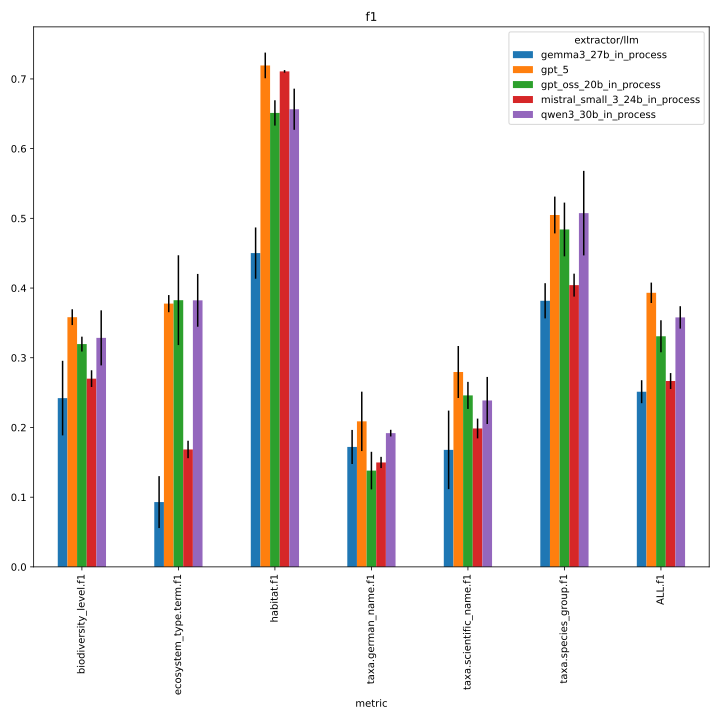
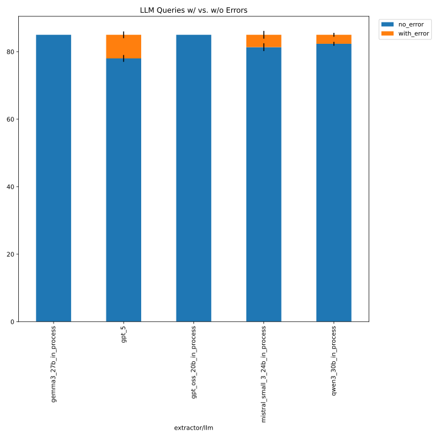
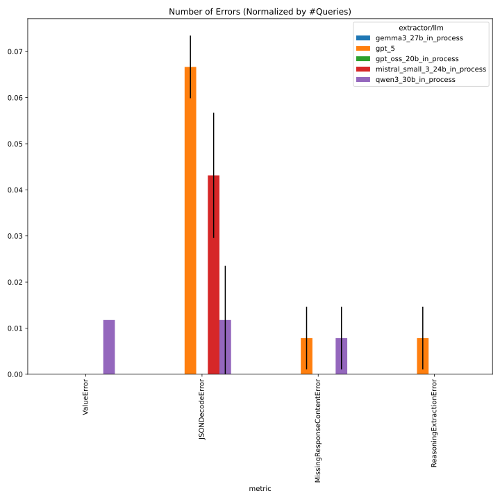
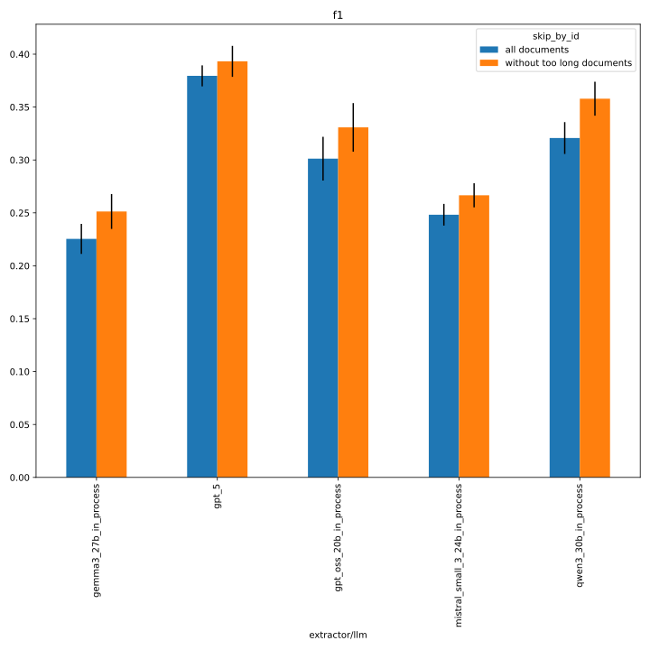
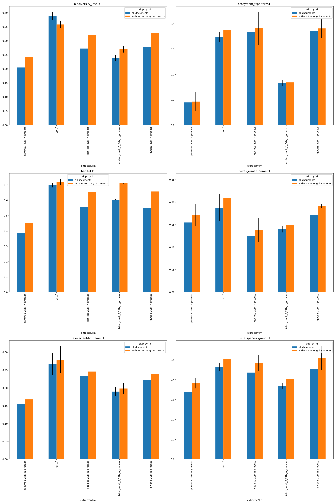
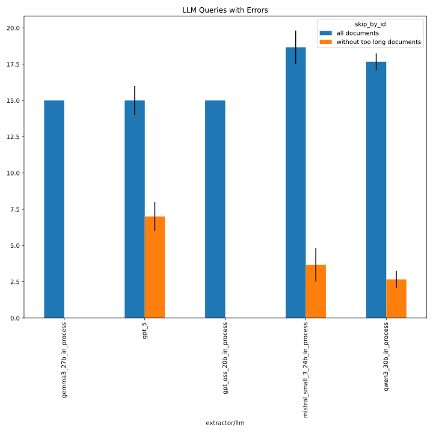
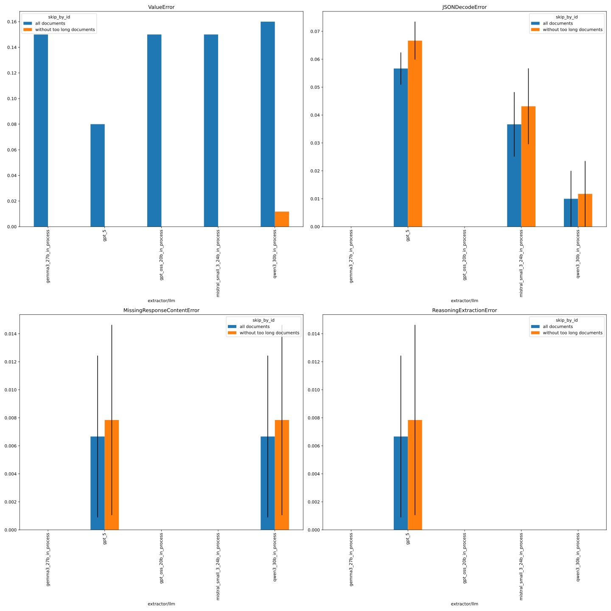

# 327_faktencheck_core_with_persona_docs_not_too_long

same as [327_faktencheck_core_with_persona](../327_faktencheck_core_with_persona), but evaluated only on docs that do not throw "document too long" errors (uses `dataset.predictions.skip_by_id` to specify the docs to skip, see https://github.com/DFKI-NLP/kibad-llm/pull/367 for details)

## notebook parameters

### just this experiment

```python
NAME = "327_faktencheck_core_with_persona_docs_not_too_long"

#METRICS = ["f1", "recall"]
# used to group the data
INDEX_COLUMNS = ["prediction.overrides.extractor/llm"]
PLOT_KWARGS = {
    # can be either "metric" or one of the INDEX_COLUMNS (or multiple of them)
    "xgroup": "prediction.overrides.extractor/llm",
    # add any more arguments passed to pd.DataFrame.plot
}
```






### comparison with baseline
```python
NAME = "327_faktencheck_core_with_persona_docs_not_too_long"
SUBDIR = [
    "evaluate", 
    "../327_faktencheck_core_with_persona/evaluate",
]
MAP_VALUES = {
    "func": lambda x: "without too long documents" if x == "[2E9XWUUE,2EUNPHDZ,2P53UVJA,2RXMDX8I,3LGPK6BL,3WEEGFGW,46RX4AEN,4YXRYRJC,4Z67G9T5,5SIYLM9W,6D23L7B5,6G2THNDX,7DSY6RMR,84QQ9F5S,885FDL5Z]" else x
}
FILL_NA = {"overrides.dataset.predictions.skip_by_id": "all documents"}

#METRICS = ["f1", "recall"]
# used to group the data
INDEX_COLUMNS = ["prediction.overrides.extractor/llm", "overrides.dataset.predictions.skip_by_id"]
PLOT_KWARGS = {
    "create_subplot_for_each": "metric",
    # can be either "metric" or one of the INDEX_COLUMNS (or multiple of them)
    "xgroup": "overrides.dataset.predictions.skip_by_id",
    # add any more arguments passed to pd.DataFrame.plot
    "subplot_columns": 2,
}
FILE_NAME_PREFIX = "baseline_"
```





## inference

this uses the predictions from [327_faktencheck_core_with_persona](../327_faktencheck_core_with_persona)

## metrics
```
uv run -m kibad_llm.evaluate \
name=327_faktencheck_core_with_persona_docs_not_too_long  \
experiment/evaluate=faktencheck_core_f1_micro_flat \
prediction_logs=logs/327_faktencheck_core_with_persona/predict/multiruns/2026-01-27_13-36-47 \
+dataset.predictions.skip_by_id=[2E9XWUUE,2EUNPHDZ,2P53UVJA,2RXMDX8I,3LGPK6BL,3WEEGFGW,46RX4AEN,4YXRYRJC,4Z67G9T5,5SIYLM9W,6D23L7B5,6G2THNDX,7DSY6RMR,84QQ9F5S,885FDL5Z] \
+hydra.callbacks.save_job_return.multirun_markdown_group_by=prediction.overrides.extractor/llm \
--multirun
```

[2026-02-12 17:43:26,183][HYDRA] Contents of /home/arbi01/projects/kibad-llm/logs/327_faktencheck_core_with_persona_docs_not_too_long/evaluate/multiruns/2026-02-12_17-43-23/job_return_value.md:

<details>
<summary>click to see result</summary>

| prediction.overrides.extractor/llm   |   ALL.f1.mean |   ALL.f1.std |   ALL.precision.mean |   ALL.precision.std |   ALL.recall.mean |   ALL.recall.std |   ALL.support.mean |   ALL.support.std |   AVG.f1.mean |   AVG.f1.std |   AVG.precision.mean |   AVG.precision.std |   AVG.recall.mean |   AVG.recall.std |   AVG.support.mean |   AVG.support.std |   biodiversity_level.f1.mean |   biodiversity_level.f1.std |   biodiversity_level.precision.mean |   biodiversity_level.precision.std |   biodiversity_level.recall.mean |   biodiversity_level.recall.std |   biodiversity_level.support.mean |   biodiversity_level.support.std |   ecosystem_type.term.f1.mean |   ecosystem_type.term.f1.std |   ecosystem_type.term.precision.mean |   ecosystem_type.term.precision.std |   ecosystem_type.term.recall.mean |   ecosystem_type.term.recall.std |   ecosystem_type.term.support.mean |   ecosystem_type.term.support.std |   habitat.f1.mean |   habitat.f1.std |   habitat.precision.mean |   habitat.precision.std |   habitat.recall.mean |   habitat.recall.std |   habitat.support.mean |   habitat.support.std |   prediction.job_return_value.time_extraction.mean |   prediction.job_return_value.time_extraction.std |   prediction.job_return_value.time_pdf_conversion.mean |   prediction.job_return_value.time_pdf_conversion.std |   taxa.german_name.f1.mean |   taxa.german_name.f1.std |   taxa.german_name.precision.mean |   taxa.german_name.precision.std |   taxa.german_name.recall.mean |   taxa.german_name.recall.std |   taxa.german_name.support.mean |   taxa.german_name.support.std |   taxa.scientific_name.f1.mean |   taxa.scientific_name.f1.std |   taxa.scientific_name.precision.mean |   taxa.scientific_name.precision.std |   taxa.scientific_name.recall.mean |   taxa.scientific_name.recall.std |   taxa.scientific_name.support.mean |   taxa.scientific_name.support.std |   taxa.species_group.f1.mean |   taxa.species_group.f1.std |   taxa.species_group.precision.mean |   taxa.species_group.precision.std |   taxa.species_group.recall.mean |   taxa.species_group.recall.std |   taxa.species_group.support.mean |   taxa.species_group.support.std | overrides.dataset.predictions.log                                                                                                                                                                                                                         | overrides.dataset.predictions.skip_by_id                                                                                                                                                                                                                                                                                                                                                                                             | overrides.experiment/evaluate                                                                          | overrides.name                                                                                                                                                        | overrides.prediction_logs                                                                                                                                                                                                                        | prediction.job_return_value.branch                                                   | prediction.job_return_value.commit_hash                                                                                              | prediction.job_return_value.is_dirty   | prediction.job_return_value.output_file                                                                                                                                                                                                                                                                                                                | prediction.job_return_value.output_file_absolute                                                                                                                                                                                                                                                                                                                                                                                                                         | prediction.overrides.experiment/predict                                                                                                          | prediction.overrides.extractor.return_reasoning   | prediction.overrides.extractor/prompt_template                                                                                                      | prediction.overrides.name                                                                                       | prediction.overrides.pdf_directory                                                            | prediction.overrides.seed   |
|:-------------------------------------|--------------:|-------------:|---------------------:|--------------------:|------------------:|-----------------:|-------------------:|------------------:|--------------:|-------------:|---------------------:|--------------------:|------------------:|-----------------:|-------------------:|------------------:|-----------------------------:|----------------------------:|------------------------------------:|-----------------------------------:|---------------------------------:|--------------------------------:|----------------------------------:|---------------------------------:|------------------------------:|-----------------------------:|-------------------------------------:|------------------------------------:|----------------------------------:|---------------------------------:|-----------------------------------:|----------------------------------:|------------------:|-----------------:|-------------------------:|------------------------:|----------------------:|---------------------:|-----------------------:|----------------------:|---------------------------------------------------:|--------------------------------------------------:|-------------------------------------------------------:|------------------------------------------------------:|---------------------------:|--------------------------:|----------------------------------:|---------------------------------:|-------------------------------:|------------------------------:|--------------------------------:|-------------------------------:|-------------------------------:|------------------------------:|--------------------------------------:|-------------------------------------:|-----------------------------------:|----------------------------------:|------------------------------------:|-----------------------------------:|-----------------------------:|----------------------------:|------------------------------------:|-----------------------------------:|---------------------------------:|--------------------------------:|----------------------------------:|---------------------------------:|:----------------------------------------------------------------------------------------------------------------------------------------------------------------------------------------------------------------------------------------------------------|:-------------------------------------------------------------------------------------------------------------------------------------------------------------------------------------------------------------------------------------------------------------------------------------------------------------------------------------------------------------------------------------------------------------------------------------|:-------------------------------------------------------------------------------------------------------|:----------------------------------------------------------------------------------------------------------------------------------------------------------------------|:-------------------------------------------------------------------------------------------------------------------------------------------------------------------------------------------------------------------------------------------------|:-------------------------------------------------------------------------------------|:-------------------------------------------------------------------------------------------------------------------------------------|:---------------------------------------|:-------------------------------------------------------------------------------------------------------------------------------------------------------------------------------------------------------------------------------------------------------------------------------------------------------------------------------------------------------|:-------------------------------------------------------------------------------------------------------------------------------------------------------------------------------------------------------------------------------------------------------------------------------------------------------------------------------------------------------------------------------------------------------------------------------------------------------------------------|:-------------------------------------------------------------------------------------------------------------------------------------------------|:--------------------------------------------------|:----------------------------------------------------------------------------------------------------------------------------------------------------|:----------------------------------------------------------------------------------------------------------------|:----------------------------------------------------------------------------------------------|:----------------------------|
| gemma3_27b_in_process                |         0.251 |        0.016 |                0.299 |               0.031 |             0.217 |            0.009 |                661 |                 0 |         0.251 |        0.012 |                0.281 |               0.028 |             0.242 |            0.003 |            110.167 |                 0 |                        0.242 |                       0.053 |                               0.211 |                              0.045 |                            0.284 |                           0.065 |                                47 |                                0 |                         0.093 |                        0.037 |                                0.086 |                               0.038 |                             0.102 |                            0.035 |                                 49 |                                 0 |             0.45  |            0.037 |                    0.456 |                   0.034 |                 0.446 |                0.045 |                    104 |                     0 |                                            909.483 |                                            38.357 |                                                  0.005 |                                                 0.003 |                      0.172 |                     0.024 |                             0.283 |                            0.054 |                          0.124 |                         0.015 |                             199 |                              0 |                          0.168 |                         0.056 |                                 0.251 |                                0.076 |                              0.127 |                             0.046 |                                 176 |                                  0 |                        0.382 |                       0.025 |                               0.399 |                              0.046 |                            0.368 |                           0.034 |                                86 |                                0 | ['logs/327_faktencheck_core_with_persona/predict/multiruns/2026-01-27_13-36-47/3', 'logs/327_faktencheck_core_with_persona/predict/multiruns/2026-01-27_13-36-47/4', 'logs/327_faktencheck_core_with_persona/predict/multiruns/2026-01-27_13-36-47/5']    | ['[2E9XWUUE,2EUNPHDZ,2P53UVJA,2RXMDX8I,3LGPK6BL,3WEEGFGW,46RX4AEN,4YXRYRJC,4Z67G9T5,5SIYLM9W,6D23L7B5,6G2THNDX,7DSY6RMR,84QQ9F5S,885FDL5Z]', '[2E9XWUUE,2EUNPHDZ,2P53UVJA,2RXMDX8I,3LGPK6BL,3WEEGFGW,46RX4AEN,4YXRYRJC,4Z67G9T5,5SIYLM9W,6D23L7B5,6G2THNDX,7DSY6RMR,84QQ9F5S,885FDL5Z]', '[2E9XWUUE,2EUNPHDZ,2P53UVJA,2RXMDX8I,3LGPK6BL,3WEEGFGW,46RX4AEN,4YXRYRJC,4Z67G9T5,5SIYLM9W,6D23L7B5,6G2THNDX,7DSY6RMR,84QQ9F5S,885FDL5Z]'] | ['faktencheck_core_f1_micro_flat', 'faktencheck_core_f1_micro_flat', 'faktencheck_core_f1_micro_flat'] | ['327_faktencheck_core_with_persona_docs_not_too_long', '327_faktencheck_core_with_persona_docs_not_too_long', '327_faktencheck_core_with_persona_docs_not_too_long'] | ['logs/327_faktencheck_core_with_persona/predict/multiruns/2026-01-27_13-36-47', 'logs/327_faktencheck_core_with_persona/predict/multiruns/2026-01-27_13-36-47', 'logs/327_faktencheck_core_with_persona/predict/multiruns/2026-01-27_13-36-47'] | ['faktencheck-with-persona', 'faktencheck-with-persona', 'faktencheck-with-persona'] | ['bf86451a2404f64307c3512a8ad38921a1dd9e58', 'bf86451a2404f64307c3512a8ad38921a1dd9e58', 'bf86451a2404f64307c3512a8ad38921a1dd9e58'] | [np.False_, np.False_, np.False_]      | ['predictions/327_faktencheck_core_with_persona/2026-01-27_13-36-47/2026-01-27_14-51-25_389556/predictions.jsonl', 'predictions/327_faktencheck_core_with_persona/2026-01-27_13-36-47/2026-01-27_15-09-09_288140/predictions.jsonl', 'predictions/327_faktencheck_core_with_persona/2026-01-27_13-36-47/2026-01-27_15-25-09_825282/predictions.jsonl'] | ['/netscratch/binder/projects/kibad-llm/predictions/327_faktencheck_core_with_persona/2026-01-27_13-36-47/2026-01-27_14-51-25_389556/predictions.jsonl', '/netscratch/binder/projects/kibad-llm/predictions/327_faktencheck_core_with_persona/2026-01-27_13-36-47/2026-01-27_15-09-09_288140/predictions.jsonl', '/netscratch/binder/projects/kibad-llm/predictions/327_faktencheck_core_with_persona/2026-01-27_13-36-47/2026-01-27_15-25-09_825282/predictions.jsonl'] | ['faktencheck_core_fields_schema_with_evidence', 'faktencheck_core_fields_schema_with_evidence', 'faktencheck_core_fields_schema_with_evidence'] | ['True', 'True', 'True']                          | ['faktencheck_core_v1_with_evidence_and_persona', 'faktencheck_core_v1_with_evidence_and_persona', 'faktencheck_core_v1_with_evidence_and_persona'] | ['327_faktencheck_core_with_persona', '327_faktencheck_core_with_persona', '327_faktencheck_core_with_persona'] | ['/ds/text/kiba-d/dev-set-100', '/ds/text/kiba-d/dev-set-100', '/ds/text/kiba-d/dev-set-100'] | ['42', '1337', '7331']      |
| gpt_5                                |         0.393 |        0.015 |                0.382 |               0.015 |             0.405 |            0.014 |                661 |                 0 |         0.408 |        0.009 |                0.379 |               0.011 |             0.498 |            0.009 |            110.167 |                 0 |                        0.358 |                       0.011 |                               0.293 |                              0.011 |                            0.461 |                           0.012 |                                47 |                                0 |                         0.378 |                        0.012 |                                0.259 |                               0.013 |                             0.701 |                            0.012 |                                 49 |                                 0 |             0.719 |            0.018 |                    0.664 |                   0.01  |                 0.785 |                0.034 |                    104 |                     0 |                                           8131.86  |                                           917.783 |                                                  0.003 |                                                 0     |                      0.209 |                     0.043 |                             0.335 |                            0.032 |                          0.152 |                         0.039 |                             199 |                              0 |                          0.28  |                         0.037 |                                 0.302 |                                0.061 |                              0.261 |                             0.02  |                                 176 |                                  0 |                        0.505 |                       0.026 |                               0.422 |                              0.024 |                            0.628 |                           0.031 |                                86 |                                0 | ['logs/327_faktencheck_core_with_persona/predict/multiruns/2026-01-27_13-36-47/12', 'logs/327_faktencheck_core_with_persona/predict/multiruns/2026-01-27_13-36-47/13', 'logs/327_faktencheck_core_with_persona/predict/multiruns/2026-01-27_13-36-47/14'] | ['[2E9XWUUE,2EUNPHDZ,2P53UVJA,2RXMDX8I,3LGPK6BL,3WEEGFGW,46RX4AEN,4YXRYRJC,4Z67G9T5,5SIYLM9W,6D23L7B5,6G2THNDX,7DSY6RMR,84QQ9F5S,885FDL5Z]', '[2E9XWUUE,2EUNPHDZ,2P53UVJA,2RXMDX8I,3LGPK6BL,3WEEGFGW,46RX4AEN,4YXRYRJC,4Z67G9T5,5SIYLM9W,6D23L7B5,6G2THNDX,7DSY6RMR,84QQ9F5S,885FDL5Z]', '[2E9XWUUE,2EUNPHDZ,2P53UVJA,2RXMDX8I,3LGPK6BL,3WEEGFGW,46RX4AEN,4YXRYRJC,4Z67G9T5,5SIYLM9W,6D23L7B5,6G2THNDX,7DSY6RMR,84QQ9F5S,885FDL5Z]'] | ['faktencheck_core_f1_micro_flat', 'faktencheck_core_f1_micro_flat', 'faktencheck_core_f1_micro_flat'] | ['327_faktencheck_core_with_persona_docs_not_too_long', '327_faktencheck_core_with_persona_docs_not_too_long', '327_faktencheck_core_with_persona_docs_not_too_long'] | ['logs/327_faktencheck_core_with_persona/predict/multiruns/2026-01-27_13-36-47', 'logs/327_faktencheck_core_with_persona/predict/multiruns/2026-01-27_13-36-47', 'logs/327_faktencheck_core_with_persona/predict/multiruns/2026-01-27_13-36-47'] | ['faktencheck-with-persona', 'faktencheck-with-persona', 'faktencheck-with-persona'] | ['bf86451a2404f64307c3512a8ad38921a1dd9e58', 'bf86451a2404f64307c3512a8ad38921a1dd9e58', 'bf86451a2404f64307c3512a8ad38921a1dd9e58'] | [np.False_, np.False_, np.False_]      | ['predictions/327_faktencheck_core_with_persona/2026-01-27_13-36-47/2026-01-27_19-52-41_948089/predictions.jsonl', 'predictions/327_faktencheck_core_with_persona/2026-01-27_13-36-47/2026-01-27_22-17-52_687695/predictions.jsonl', 'predictions/327_faktencheck_core_with_persona/2026-01-27_13-36-47/2026-01-28_00-41-26_525072/predictions.jsonl'] | ['/netscratch/binder/projects/kibad-llm/predictions/327_faktencheck_core_with_persona/2026-01-27_13-36-47/2026-01-27_19-52-41_948089/predictions.jsonl', '/netscratch/binder/projects/kibad-llm/predictions/327_faktencheck_core_with_persona/2026-01-27_13-36-47/2026-01-27_22-17-52_687695/predictions.jsonl', '/netscratch/binder/projects/kibad-llm/predictions/327_faktencheck_core_with_persona/2026-01-27_13-36-47/2026-01-28_00-41-26_525072/predictions.jsonl'] | ['faktencheck_core_fields_schema_with_evidence', 'faktencheck_core_fields_schema_with_evidence', 'faktencheck_core_fields_schema_with_evidence'] | ['True', 'True', 'True']                          | ['faktencheck_core_v1_with_evidence_and_persona', 'faktencheck_core_v1_with_evidence_and_persona', 'faktencheck_core_v1_with_evidence_and_persona'] | ['327_faktencheck_core_with_persona', '327_faktencheck_core_with_persona', '327_faktencheck_core_with_persona'] | ['/ds/text/kiba-d/dev-set-100', '/ds/text/kiba-d/dev-set-100', '/ds/text/kiba-d/dev-set-100'] | ['42', '1337', '7331']      |
| gpt_oss_20b_in_process               |         0.331 |        0.023 |                0.328 |               0.025 |             0.334 |            0.021 |                661 |                 0 |         0.37  |        0.026 |                0.356 |               0.03  |             0.393 |            0.02  |            110.167 |                 0 |                        0.32  |                       0.011 |                               0.271 |                              0.008 |                            0.39  |                           0.025 |                                47 |                                0 |                         0.383 |                        0.064 |                                0.342 |                               0.068 |                             0.435 |                            0.059 |                                 49 |                                 0 |             0.651 |            0.018 |                    0.669 |                   0.014 |                 0.635 |                0.025 |                    104 |                     0 |                                           1427.06  |                                            78.404 |                                                  0.003 |                                                 0     |                      0.138 |                     0.027 |                             0.172 |                            0.035 |                          0.116 |                         0.022 |                             199 |                              0 |                          0.246 |                         0.019 |                                 0.224 |                                0.016 |                              0.273 |                             0.025 |                                 176 |                                  0 |                        0.484 |                       0.039 |                               0.461 |                              0.048 |                            0.512 |                           0.042 |                                86 |                                0 | ['logs/327_faktencheck_core_with_persona/predict/multiruns/2026-01-27_13-36-47/0', 'logs/327_faktencheck_core_with_persona/predict/multiruns/2026-01-27_13-36-47/1', 'logs/327_faktencheck_core_with_persona/predict/multiruns/2026-01-27_13-36-47/2']    | ['[2E9XWUUE,2EUNPHDZ,2P53UVJA,2RXMDX8I,3LGPK6BL,3WEEGFGW,46RX4AEN,4YXRYRJC,4Z67G9T5,5SIYLM9W,6D23L7B5,6G2THNDX,7DSY6RMR,84QQ9F5S,885FDL5Z]', '[2E9XWUUE,2EUNPHDZ,2P53UVJA,2RXMDX8I,3LGPK6BL,3WEEGFGW,46RX4AEN,4YXRYRJC,4Z67G9T5,5SIYLM9W,6D23L7B5,6G2THNDX,7DSY6RMR,84QQ9F5S,885FDL5Z]', '[2E9XWUUE,2EUNPHDZ,2P53UVJA,2RXMDX8I,3LGPK6BL,3WEEGFGW,46RX4AEN,4YXRYRJC,4Z67G9T5,5SIYLM9W,6D23L7B5,6G2THNDX,7DSY6RMR,84QQ9F5S,885FDL5Z]'] | ['faktencheck_core_f1_micro_flat', 'faktencheck_core_f1_micro_flat', 'faktencheck_core_f1_micro_flat'] | ['327_faktencheck_core_with_persona_docs_not_too_long', '327_faktencheck_core_with_persona_docs_not_too_long', '327_faktencheck_core_with_persona_docs_not_too_long'] | ['logs/327_faktencheck_core_with_persona/predict/multiruns/2026-01-27_13-36-47', 'logs/327_faktencheck_core_with_persona/predict/multiruns/2026-01-27_13-36-47', 'logs/327_faktencheck_core_with_persona/predict/multiruns/2026-01-27_13-36-47'] | ['faktencheck-with-persona', 'faktencheck-with-persona', 'faktencheck-with-persona'] | ['bf86451a2404f64307c3512a8ad38921a1dd9e58', 'bf86451a2404f64307c3512a8ad38921a1dd9e58', 'bf86451a2404f64307c3512a8ad38921a1dd9e58'] | [np.False_, np.False_, np.False_]      | ['predictions/327_faktencheck_core_with_persona/2026-01-27_13-36-47/2026-01-27_13-36-48_883603/predictions.jsonl', 'predictions/327_faktencheck_core_with_persona/2026-01-27_13-36-47/2026-01-27_14-01-27_861892/predictions.jsonl', 'predictions/327_faktencheck_core_with_persona/2026-01-27_13-36-47/2026-01-27_14-27-32_640241/predictions.jsonl'] | ['/netscratch/binder/projects/kibad-llm/predictions/327_faktencheck_core_with_persona/2026-01-27_13-36-47/2026-01-27_13-36-48_883603/predictions.jsonl', '/netscratch/binder/projects/kibad-llm/predictions/327_faktencheck_core_with_persona/2026-01-27_13-36-47/2026-01-27_14-01-27_861892/predictions.jsonl', '/netscratch/binder/projects/kibad-llm/predictions/327_faktencheck_core_with_persona/2026-01-27_13-36-47/2026-01-27_14-27-32_640241/predictions.jsonl'] | ['faktencheck_core_fields_schema_with_evidence', 'faktencheck_core_fields_schema_with_evidence', 'faktencheck_core_fields_schema_with_evidence'] | ['True', 'True', 'True']                          | ['faktencheck_core_v1_with_evidence_and_persona', 'faktencheck_core_v1_with_evidence_and_persona', 'faktencheck_core_v1_with_evidence_and_persona'] | ['327_faktencheck_core_with_persona', '327_faktencheck_core_with_persona', '327_faktencheck_core_with_persona'] | ['/ds/text/kiba-d/dev-set-100', '/ds/text/kiba-d/dev-set-100', '/ds/text/kiba-d/dev-set-100'] | ['42', '1337', '7331']      |
| mistral_small_3_24b_in_process       |         0.267 |        0.011 |                0.213 |               0.012 |             0.357 |            0.009 |                661 |                 0 |         0.317 |        0.01  |                0.285 |               0.009 |             0.413 |            0.012 |            110.167 |                 0 |                        0.27  |                       0.012 |                               0.196 |                              0.01  |                            0.433 |                           0.012 |                                47 |                                0 |                         0.168 |                        0.013 |                                0.103 |                               0.008 |                             0.456 |                            0.031 |                                 49 |                                 0 |             0.711 |            0.002 |                    0.78  |                   0.024 |                 0.654 |                0.017 |                    104 |                     0 |                                           2428.38  |                                           177.263 |                                                  0.003 |                                                 0     |                      0.15  |                     0.008 |                             0.128 |                            0.009 |                          0.181 |                         0.009 |                             199 |                              0 |                          0.199 |                         0.014 |                                 0.159 |                                0.015 |                              0.265 |                             0.009 |                                 176 |                                  0 |                        0.404 |                       0.016 |                               0.343 |                              0.022 |                            0.492 |                           0.007 |                                86 |                                0 | ['logs/327_faktencheck_core_with_persona/predict/multiruns/2026-01-27_13-36-47/10', 'logs/327_faktencheck_core_with_persona/predict/multiruns/2026-01-27_13-36-47/11', 'logs/327_faktencheck_core_with_persona/predict/multiruns/2026-01-27_13-36-47/9']  | ['[2E9XWUUE,2EUNPHDZ,2P53UVJA,2RXMDX8I,3LGPK6BL,3WEEGFGW,46RX4AEN,4YXRYRJC,4Z67G9T5,5SIYLM9W,6D23L7B5,6G2THNDX,7DSY6RMR,84QQ9F5S,885FDL5Z]', '[2E9XWUUE,2EUNPHDZ,2P53UVJA,2RXMDX8I,3LGPK6BL,3WEEGFGW,46RX4AEN,4YXRYRJC,4Z67G9T5,5SIYLM9W,6D23L7B5,6G2THNDX,7DSY6RMR,84QQ9F5S,885FDL5Z]', '[2E9XWUUE,2EUNPHDZ,2P53UVJA,2RXMDX8I,3LGPK6BL,3WEEGFGW,46RX4AEN,4YXRYRJC,4Z67G9T5,5SIYLM9W,6D23L7B5,6G2THNDX,7DSY6RMR,84QQ9F5S,885FDL5Z]'] | ['faktencheck_core_f1_micro_flat', 'faktencheck_core_f1_micro_flat', 'faktencheck_core_f1_micro_flat'] | ['327_faktencheck_core_with_persona_docs_not_too_long', '327_faktencheck_core_with_persona_docs_not_too_long', '327_faktencheck_core_with_persona_docs_not_too_long'] | ['logs/327_faktencheck_core_with_persona/predict/multiruns/2026-01-27_13-36-47', 'logs/327_faktencheck_core_with_persona/predict/multiruns/2026-01-27_13-36-47', 'logs/327_faktencheck_core_with_persona/predict/multiruns/2026-01-27_13-36-47'] | ['faktencheck-with-persona', 'faktencheck-with-persona', 'faktencheck-with-persona'] | ['bf86451a2404f64307c3512a8ad38921a1dd9e58', 'bf86451a2404f64307c3512a8ad38921a1dd9e58', 'bf86451a2404f64307c3512a8ad38921a1dd9e58'] | [np.False_, np.False_, np.False_]      | ['predictions/327_faktencheck_core_with_persona/2026-01-27_13-36-47/2026-01-27_18-27-42_829400/predictions.jsonl', 'predictions/327_faktencheck_core_with_persona/2026-01-27_13-36-47/2026-01-27_19-07-56_601164/predictions.jsonl', 'predictions/327_faktencheck_core_with_persona/2026-01-27_13-36-47/2026-01-27_17-48-13_367547/predictions.jsonl'] | ['/netscratch/binder/projects/kibad-llm/predictions/327_faktencheck_core_with_persona/2026-01-27_13-36-47/2026-01-27_18-27-42_829400/predictions.jsonl', '/netscratch/binder/projects/kibad-llm/predictions/327_faktencheck_core_with_persona/2026-01-27_13-36-47/2026-01-27_19-07-56_601164/predictions.jsonl', '/netscratch/binder/projects/kibad-llm/predictions/327_faktencheck_core_with_persona/2026-01-27_13-36-47/2026-01-27_17-48-13_367547/predictions.jsonl'] | ['faktencheck_core_fields_schema_with_evidence', 'faktencheck_core_fields_schema_with_evidence', 'faktencheck_core_fields_schema_with_evidence'] | ['True', 'True', 'True']                          | ['faktencheck_core_v1_with_evidence_and_persona', 'faktencheck_core_v1_with_evidence_and_persona', 'faktencheck_core_v1_with_evidence_and_persona'] | ['327_faktencheck_core_with_persona', '327_faktencheck_core_with_persona', '327_faktencheck_core_with_persona'] | ['/ds/text/kiba-d/dev-set-100', '/ds/text/kiba-d/dev-set-100', '/ds/text/kiba-d/dev-set-100'] | ['1337', '7331', '42']      |
| qwen3_30b_in_process                 |         0.358 |        0.016 |                0.431 |               0.009 |             0.306 |            0.02  |                661 |                 0 |         0.384 |        0.023 |                0.434 |               0.014 |             0.377 |            0.027 |            110.167 |                 0 |                        0.329 |                       0.04  |                               0.288 |                              0.029 |                            0.383 |                           0.056 |                                47 |                                0 |                         0.382 |                        0.038 |                                0.308 |                               0.03  |                             0.503 |                            0.051 |                                 49 |                                 0 |             0.656 |            0.029 |                    0.798 |                   0.033 |                 0.558 |                0.029 |                    104 |                     0 |                                           2477.49  |                                           111.605 |                                                  0.003 |                                                 0     |                      0.192 |                     0.005 |                             0.332 |                            0.039 |                          0.136 |                         0.009 |                             199 |                              0 |                          0.239 |                         0.034 |                                 0.361 |                                0.003 |                              0.18  |                             0.037 |                                 176 |                                  0 |                        0.507 |                       0.061 |                               0.516 |                              0.08  |                            0.5   |                           0.042 |                                86 |                                0 | ['logs/327_faktencheck_core_with_persona/predict/multiruns/2026-01-27_13-36-47/6', 'logs/327_faktencheck_core_with_persona/predict/multiruns/2026-01-27_13-36-47/7', 'logs/327_faktencheck_core_with_persona/predict/multiruns/2026-01-27_13-36-47/8']    | ['[2E9XWUUE,2EUNPHDZ,2P53UVJA,2RXMDX8I,3LGPK6BL,3WEEGFGW,46RX4AEN,4YXRYRJC,4Z67G9T5,5SIYLM9W,6D23L7B5,6G2THNDX,7DSY6RMR,84QQ9F5S,885FDL5Z]', '[2E9XWUUE,2EUNPHDZ,2P53UVJA,2RXMDX8I,3LGPK6BL,3WEEGFGW,46RX4AEN,4YXRYRJC,4Z67G9T5,5SIYLM9W,6D23L7B5,6G2THNDX,7DSY6RMR,84QQ9F5S,885FDL5Z]', '[2E9XWUUE,2EUNPHDZ,2P53UVJA,2RXMDX8I,3LGPK6BL,3WEEGFGW,46RX4AEN,4YXRYRJC,4Z67G9T5,5SIYLM9W,6D23L7B5,6G2THNDX,7DSY6RMR,84QQ9F5S,885FDL5Z]'] | ['faktencheck_core_f1_micro_flat', 'faktencheck_core_f1_micro_flat', 'faktencheck_core_f1_micro_flat'] | ['327_faktencheck_core_with_persona_docs_not_too_long', '327_faktencheck_core_with_persona_docs_not_too_long', '327_faktencheck_core_with_persona_docs_not_too_long'] | ['logs/327_faktencheck_core_with_persona/predict/multiruns/2026-01-27_13-36-47', 'logs/327_faktencheck_core_with_persona/predict/multiruns/2026-01-27_13-36-47', 'logs/327_faktencheck_core_with_persona/predict/multiruns/2026-01-27_13-36-47'] | ['faktencheck-with-persona', 'faktencheck-with-persona', 'faktencheck-with-persona'] | ['bf86451a2404f64307c3512a8ad38921a1dd9e58', 'bf86451a2404f64307c3512a8ad38921a1dd9e58', 'bf86451a2404f64307c3512a8ad38921a1dd9e58'] | [np.False_, np.False_, np.False_]      | ['predictions/327_faktencheck_core_with_persona/2026-01-27_13-36-47/2026-01-27_15-41-22_963686/predictions.jsonl', 'predictions/327_faktencheck_core_with_persona/2026-01-27_13-36-47/2026-01-27_16-25-26_250488/predictions.jsonl', 'predictions/327_faktencheck_core_with_persona/2026-01-27_13-36-47/2026-01-27_17-05-47_899751/predictions.jsonl'] | ['/netscratch/binder/projects/kibad-llm/predictions/327_faktencheck_core_with_persona/2026-01-27_13-36-47/2026-01-27_15-41-22_963686/predictions.jsonl', '/netscratch/binder/projects/kibad-llm/predictions/327_faktencheck_core_with_persona/2026-01-27_13-36-47/2026-01-27_16-25-26_250488/predictions.jsonl', '/netscratch/binder/projects/kibad-llm/predictions/327_faktencheck_core_with_persona/2026-01-27_13-36-47/2026-01-27_17-05-47_899751/predictions.jsonl'] | ['faktencheck_core_fields_schema_with_evidence', 'faktencheck_core_fields_schema_with_evidence', 'faktencheck_core_fields_schema_with_evidence'] | ['True', 'True', 'True']                          | ['faktencheck_core_v1_with_evidence_and_persona', 'faktencheck_core_v1_with_evidence_and_persona', 'faktencheck_core_v1_with_evidence_and_persona'] | ['327_faktencheck_core_with_persona', '327_faktencheck_core_with_persona', '327_faktencheck_core_with_persona'] | ['/ds/text/kiba-d/dev-set-100', '/ds/text/kiba-d/dev-set-100', '/ds/text/kiba-d/dev-set-100'] | ['42', '1337', '7331']      |

</details>

### error
```
uv run -m kibad_llm.evaluate \
name=327_faktencheck_core_with_persona_docs_not_too_long \
experiment/evaluate=prediction_errors \
prediction_logs=logs/327_faktencheck_core_with_persona/predict/multiruns/2026-01-27_13-36-47 \
+dataset.predictions.skip_by_id=[2E9XWUUE,2EUNPHDZ,2P53UVJA,2RXMDX8I,3LGPK6BL,3WEEGFGW,46RX4AEN,4YXRYRJC,4Z67G9T5,5SIYLM9W,6D23L7B5,6G2THNDX,7DSY6RMR,84QQ9F5S,885FDL5Z] \
+hydra.callbacks.save_job_return.multirun_markdown_group_by=prediction.overrides.extractor/llm \
--multirun
```

[2026-02-12 17:44:34,456][HYDRA] Contents of /home/arbi01/projects/kibad-llm/logs/327_faktencheck_core_with_persona_docs_not_too_long/evaluate/multiruns/2026-02-12_17-44-32/job_return_value.md:

<details>
<summary>click to see result</summary>

| prediction.overrides.extractor/llm   |   JSONDecodeError.mean |   JSONDecodeError.std |   MissingResponseContentError.mean |   MissingResponseContentError.std |   ReasoningExtractionError.mean |   ReasoningExtractionError.std |   ValueError.mean |   ValueError.std |   no_error.mean |   no_error.std |   prediction.job_return_value.time_extraction.mean |   prediction.job_return_value.time_extraction.std |   prediction.job_return_value.time_pdf_conversion.mean |   prediction.job_return_value.time_pdf_conversion.std |   with_error.mean |   with_error.std | overrides.dataset.predictions.log                                                                                                                                                                                                                         | overrides.dataset.predictions.skip_by_id                                                                                                                                                                                                                                                                                                                                                                                             | overrides.experiment/evaluate                                   | overrides.name                                                                                                                                                        | overrides.prediction_logs                                                                                                                                                                                                                        | prediction.job_return_value.branch                                                   | prediction.job_return_value.commit_hash                                                                                              | prediction.job_return_value.is_dirty   | prediction.job_return_value.output_file                                                                                                                                                                                                                                                                                                                | prediction.job_return_value.output_file_absolute                                                                                                                                                                                                                                                                                                                                                                                                                         | prediction.overrides.experiment/predict                                                                                                          | prediction.overrides.extractor.return_reasoning   | prediction.overrides.extractor/prompt_template                                                                                                      | prediction.overrides.name                                                                                       | prediction.overrides.pdf_directory                                                            | prediction.overrides.seed   |
|:-------------------------------------|-----------------------:|----------------------:|-----------------------------------:|----------------------------------:|--------------------------------:|-------------------------------:|------------------:|-----------------:|----------------:|---------------:|---------------------------------------------------:|--------------------------------------------------:|-------------------------------------------------------:|------------------------------------------------------:|------------------:|-----------------:|:----------------------------------------------------------------------------------------------------------------------------------------------------------------------------------------------------------------------------------------------------------|:-------------------------------------------------------------------------------------------------------------------------------------------------------------------------------------------------------------------------------------------------------------------------------------------------------------------------------------------------------------------------------------------------------------------------------------|:----------------------------------------------------------------|:----------------------------------------------------------------------------------------------------------------------------------------------------------------------|:-------------------------------------------------------------------------------------------------------------------------------------------------------------------------------------------------------------------------------------------------|:-------------------------------------------------------------------------------------|:-------------------------------------------------------------------------------------------------------------------------------------|:---------------------------------------|:-------------------------------------------------------------------------------------------------------------------------------------------------------------------------------------------------------------------------------------------------------------------------------------------------------------------------------------------------------|:-------------------------------------------------------------------------------------------------------------------------------------------------------------------------------------------------------------------------------------------------------------------------------------------------------------------------------------------------------------------------------------------------------------------------------------------------------------------------|:-------------------------------------------------------------------------------------------------------------------------------------------------|:--------------------------------------------------|:----------------------------------------------------------------------------------------------------------------------------------------------------|:----------------------------------------------------------------------------------------------------------------|:----------------------------------------------------------------------------------------------|:----------------------------|
| gemma3_27b_in_process                |                  0     |                 0     |                                  0 |                                 0 |                               0 |                              0 |                 0 |                0 |          85     |          0     |                                            909.483 |                                            38.357 |                                                  0.005 |                                                 0.003 |             0     |            0     | ['logs/327_faktencheck_core_with_persona/predict/multiruns/2026-01-27_13-36-47/3', 'logs/327_faktencheck_core_with_persona/predict/multiruns/2026-01-27_13-36-47/4', 'logs/327_faktencheck_core_with_persona/predict/multiruns/2026-01-27_13-36-47/5']    | ['[2E9XWUUE,2EUNPHDZ,2P53UVJA,2RXMDX8I,3LGPK6BL,3WEEGFGW,46RX4AEN,4YXRYRJC,4Z67G9T5,5SIYLM9W,6D23L7B5,6G2THNDX,7DSY6RMR,84QQ9F5S,885FDL5Z]', '[2E9XWUUE,2EUNPHDZ,2P53UVJA,2RXMDX8I,3LGPK6BL,3WEEGFGW,46RX4AEN,4YXRYRJC,4Z67G9T5,5SIYLM9W,6D23L7B5,6G2THNDX,7DSY6RMR,84QQ9F5S,885FDL5Z]', '[2E9XWUUE,2EUNPHDZ,2P53UVJA,2RXMDX8I,3LGPK6BL,3WEEGFGW,46RX4AEN,4YXRYRJC,4Z67G9T5,5SIYLM9W,6D23L7B5,6G2THNDX,7DSY6RMR,84QQ9F5S,885FDL5Z]'] | ['prediction_errors', 'prediction_errors', 'prediction_errors'] | ['327_faktencheck_core_with_persona_docs_not_too_long', '327_faktencheck_core_with_persona_docs_not_too_long', '327_faktencheck_core_with_persona_docs_not_too_long'] | ['logs/327_faktencheck_core_with_persona/predict/multiruns/2026-01-27_13-36-47', 'logs/327_faktencheck_core_with_persona/predict/multiruns/2026-01-27_13-36-47', 'logs/327_faktencheck_core_with_persona/predict/multiruns/2026-01-27_13-36-47'] | ['faktencheck-with-persona', 'faktencheck-with-persona', 'faktencheck-with-persona'] | ['bf86451a2404f64307c3512a8ad38921a1dd9e58', 'bf86451a2404f64307c3512a8ad38921a1dd9e58', 'bf86451a2404f64307c3512a8ad38921a1dd9e58'] | [np.False_, np.False_, np.False_]      | ['predictions/327_faktencheck_core_with_persona/2026-01-27_13-36-47/2026-01-27_14-51-25_389556/predictions.jsonl', 'predictions/327_faktencheck_core_with_persona/2026-01-27_13-36-47/2026-01-27_15-09-09_288140/predictions.jsonl', 'predictions/327_faktencheck_core_with_persona/2026-01-27_13-36-47/2026-01-27_15-25-09_825282/predictions.jsonl'] | ['/netscratch/binder/projects/kibad-llm/predictions/327_faktencheck_core_with_persona/2026-01-27_13-36-47/2026-01-27_14-51-25_389556/predictions.jsonl', '/netscratch/binder/projects/kibad-llm/predictions/327_faktencheck_core_with_persona/2026-01-27_13-36-47/2026-01-27_15-09-09_288140/predictions.jsonl', '/netscratch/binder/projects/kibad-llm/predictions/327_faktencheck_core_with_persona/2026-01-27_13-36-47/2026-01-27_15-25-09_825282/predictions.jsonl'] | ['faktencheck_core_fields_schema_with_evidence', 'faktencheck_core_fields_schema_with_evidence', 'faktencheck_core_fields_schema_with_evidence'] | ['True', 'True', 'True']                          | ['faktencheck_core_v1_with_evidence_and_persona', 'faktencheck_core_v1_with_evidence_and_persona', 'faktencheck_core_v1_with_evidence_and_persona'] | ['327_faktencheck_core_with_persona', '327_faktencheck_core_with_persona', '327_faktencheck_core_with_persona'] | ['/ds/text/kiba-d/dev-set-100', '/ds/text/kiba-d/dev-set-100', '/ds/text/kiba-d/dev-set-100'] | ['42', '1337', '7331']      |
| gpt_5                                |                  5.667 |                 0.577 |                                  1 |                                 0 |                               1 |                              0 |                 0 |                0 |          78     |          1     |                                           8131.86  |                                           917.783 |                                                  0.003 |                                                 0     |             7     |            1     | ['logs/327_faktencheck_core_with_persona/predict/multiruns/2026-01-27_13-36-47/12', 'logs/327_faktencheck_core_with_persona/predict/multiruns/2026-01-27_13-36-47/13', 'logs/327_faktencheck_core_with_persona/predict/multiruns/2026-01-27_13-36-47/14'] | ['[2E9XWUUE,2EUNPHDZ,2P53UVJA,2RXMDX8I,3LGPK6BL,3WEEGFGW,46RX4AEN,4YXRYRJC,4Z67G9T5,5SIYLM9W,6D23L7B5,6G2THNDX,7DSY6RMR,84QQ9F5S,885FDL5Z]', '[2E9XWUUE,2EUNPHDZ,2P53UVJA,2RXMDX8I,3LGPK6BL,3WEEGFGW,46RX4AEN,4YXRYRJC,4Z67G9T5,5SIYLM9W,6D23L7B5,6G2THNDX,7DSY6RMR,84QQ9F5S,885FDL5Z]', '[2E9XWUUE,2EUNPHDZ,2P53UVJA,2RXMDX8I,3LGPK6BL,3WEEGFGW,46RX4AEN,4YXRYRJC,4Z67G9T5,5SIYLM9W,6D23L7B5,6G2THNDX,7DSY6RMR,84QQ9F5S,885FDL5Z]'] | ['prediction_errors', 'prediction_errors', 'prediction_errors'] | ['327_faktencheck_core_with_persona_docs_not_too_long', '327_faktencheck_core_with_persona_docs_not_too_long', '327_faktencheck_core_with_persona_docs_not_too_long'] | ['logs/327_faktencheck_core_with_persona/predict/multiruns/2026-01-27_13-36-47', 'logs/327_faktencheck_core_with_persona/predict/multiruns/2026-01-27_13-36-47', 'logs/327_faktencheck_core_with_persona/predict/multiruns/2026-01-27_13-36-47'] | ['faktencheck-with-persona', 'faktencheck-with-persona', 'faktencheck-with-persona'] | ['bf86451a2404f64307c3512a8ad38921a1dd9e58', 'bf86451a2404f64307c3512a8ad38921a1dd9e58', 'bf86451a2404f64307c3512a8ad38921a1dd9e58'] | [np.False_, np.False_, np.False_]      | ['predictions/327_faktencheck_core_with_persona/2026-01-27_13-36-47/2026-01-27_19-52-41_948089/predictions.jsonl', 'predictions/327_faktencheck_core_with_persona/2026-01-27_13-36-47/2026-01-27_22-17-52_687695/predictions.jsonl', 'predictions/327_faktencheck_core_with_persona/2026-01-27_13-36-47/2026-01-28_00-41-26_525072/predictions.jsonl'] | ['/netscratch/binder/projects/kibad-llm/predictions/327_faktencheck_core_with_persona/2026-01-27_13-36-47/2026-01-27_19-52-41_948089/predictions.jsonl', '/netscratch/binder/projects/kibad-llm/predictions/327_faktencheck_core_with_persona/2026-01-27_13-36-47/2026-01-27_22-17-52_687695/predictions.jsonl', '/netscratch/binder/projects/kibad-llm/predictions/327_faktencheck_core_with_persona/2026-01-27_13-36-47/2026-01-28_00-41-26_525072/predictions.jsonl'] | ['faktencheck_core_fields_schema_with_evidence', 'faktencheck_core_fields_schema_with_evidence', 'faktencheck_core_fields_schema_with_evidence'] | ['True', 'True', 'True']                          | ['faktencheck_core_v1_with_evidence_and_persona', 'faktencheck_core_v1_with_evidence_and_persona', 'faktencheck_core_v1_with_evidence_and_persona'] | ['327_faktencheck_core_with_persona', '327_faktencheck_core_with_persona', '327_faktencheck_core_with_persona'] | ['/ds/text/kiba-d/dev-set-100', '/ds/text/kiba-d/dev-set-100', '/ds/text/kiba-d/dev-set-100'] | ['42', '1337', '7331']      |
| gpt_oss_20b_in_process               |                  0     |                 0     |                                  0 |                                 0 |                               0 |                              0 |                 0 |                0 |          85     |          0     |                                           1427.06  |                                            78.404 |                                                  0.003 |                                                 0     |             0     |            0     | ['logs/327_faktencheck_core_with_persona/predict/multiruns/2026-01-27_13-36-47/0', 'logs/327_faktencheck_core_with_persona/predict/multiruns/2026-01-27_13-36-47/1', 'logs/327_faktencheck_core_with_persona/predict/multiruns/2026-01-27_13-36-47/2']    | ['[2E9XWUUE,2EUNPHDZ,2P53UVJA,2RXMDX8I,3LGPK6BL,3WEEGFGW,46RX4AEN,4YXRYRJC,4Z67G9T5,5SIYLM9W,6D23L7B5,6G2THNDX,7DSY6RMR,84QQ9F5S,885FDL5Z]', '[2E9XWUUE,2EUNPHDZ,2P53UVJA,2RXMDX8I,3LGPK6BL,3WEEGFGW,46RX4AEN,4YXRYRJC,4Z67G9T5,5SIYLM9W,6D23L7B5,6G2THNDX,7DSY6RMR,84QQ9F5S,885FDL5Z]', '[2E9XWUUE,2EUNPHDZ,2P53UVJA,2RXMDX8I,3LGPK6BL,3WEEGFGW,46RX4AEN,4YXRYRJC,4Z67G9T5,5SIYLM9W,6D23L7B5,6G2THNDX,7DSY6RMR,84QQ9F5S,885FDL5Z]'] | ['prediction_errors', 'prediction_errors', 'prediction_errors'] | ['327_faktencheck_core_with_persona_docs_not_too_long', '327_faktencheck_core_with_persona_docs_not_too_long', '327_faktencheck_core_with_persona_docs_not_too_long'] | ['logs/327_faktencheck_core_with_persona/predict/multiruns/2026-01-27_13-36-47', 'logs/327_faktencheck_core_with_persona/predict/multiruns/2026-01-27_13-36-47', 'logs/327_faktencheck_core_with_persona/predict/multiruns/2026-01-27_13-36-47'] | ['faktencheck-with-persona', 'faktencheck-with-persona', 'faktencheck-with-persona'] | ['bf86451a2404f64307c3512a8ad38921a1dd9e58', 'bf86451a2404f64307c3512a8ad38921a1dd9e58', 'bf86451a2404f64307c3512a8ad38921a1dd9e58'] | [np.False_, np.False_, np.False_]      | ['predictions/327_faktencheck_core_with_persona/2026-01-27_13-36-47/2026-01-27_13-36-48_883603/predictions.jsonl', 'predictions/327_faktencheck_core_with_persona/2026-01-27_13-36-47/2026-01-27_14-01-27_861892/predictions.jsonl', 'predictions/327_faktencheck_core_with_persona/2026-01-27_13-36-47/2026-01-27_14-27-32_640241/predictions.jsonl'] | ['/netscratch/binder/projects/kibad-llm/predictions/327_faktencheck_core_with_persona/2026-01-27_13-36-47/2026-01-27_13-36-48_883603/predictions.jsonl', '/netscratch/binder/projects/kibad-llm/predictions/327_faktencheck_core_with_persona/2026-01-27_13-36-47/2026-01-27_14-01-27_861892/predictions.jsonl', '/netscratch/binder/projects/kibad-llm/predictions/327_faktencheck_core_with_persona/2026-01-27_13-36-47/2026-01-27_14-27-32_640241/predictions.jsonl'] | ['faktencheck_core_fields_schema_with_evidence', 'faktencheck_core_fields_schema_with_evidence', 'faktencheck_core_fields_schema_with_evidence'] | ['True', 'True', 'True']                          | ['faktencheck_core_v1_with_evidence_and_persona', 'faktencheck_core_v1_with_evidence_and_persona', 'faktencheck_core_v1_with_evidence_and_persona'] | ['327_faktencheck_core_with_persona', '327_faktencheck_core_with_persona', '327_faktencheck_core_with_persona'] | ['/ds/text/kiba-d/dev-set-100', '/ds/text/kiba-d/dev-set-100', '/ds/text/kiba-d/dev-set-100'] | ['42', '1337', '7331']      |
| mistral_small_3_24b_in_process       |                  3.667 |                 1.155 |                                  0 |                                 0 |                               0 |                              0 |                 0 |                0 |          81.333 |          1.155 |                                           2428.38  |                                           177.263 |                                                  0.003 |                                                 0     |             3.667 |            1.155 | ['logs/327_faktencheck_core_with_persona/predict/multiruns/2026-01-27_13-36-47/10', 'logs/327_faktencheck_core_with_persona/predict/multiruns/2026-01-27_13-36-47/11', 'logs/327_faktencheck_core_with_persona/predict/multiruns/2026-01-27_13-36-47/9']  | ['[2E9XWUUE,2EUNPHDZ,2P53UVJA,2RXMDX8I,3LGPK6BL,3WEEGFGW,46RX4AEN,4YXRYRJC,4Z67G9T5,5SIYLM9W,6D23L7B5,6G2THNDX,7DSY6RMR,84QQ9F5S,885FDL5Z]', '[2E9XWUUE,2EUNPHDZ,2P53UVJA,2RXMDX8I,3LGPK6BL,3WEEGFGW,46RX4AEN,4YXRYRJC,4Z67G9T5,5SIYLM9W,6D23L7B5,6G2THNDX,7DSY6RMR,84QQ9F5S,885FDL5Z]', '[2E9XWUUE,2EUNPHDZ,2P53UVJA,2RXMDX8I,3LGPK6BL,3WEEGFGW,46RX4AEN,4YXRYRJC,4Z67G9T5,5SIYLM9W,6D23L7B5,6G2THNDX,7DSY6RMR,84QQ9F5S,885FDL5Z]'] | ['prediction_errors', 'prediction_errors', 'prediction_errors'] | ['327_faktencheck_core_with_persona_docs_not_too_long', '327_faktencheck_core_with_persona_docs_not_too_long', '327_faktencheck_core_with_persona_docs_not_too_long'] | ['logs/327_faktencheck_core_with_persona/predict/multiruns/2026-01-27_13-36-47', 'logs/327_faktencheck_core_with_persona/predict/multiruns/2026-01-27_13-36-47', 'logs/327_faktencheck_core_with_persona/predict/multiruns/2026-01-27_13-36-47'] | ['faktencheck-with-persona', 'faktencheck-with-persona', 'faktencheck-with-persona'] | ['bf86451a2404f64307c3512a8ad38921a1dd9e58', 'bf86451a2404f64307c3512a8ad38921a1dd9e58', 'bf86451a2404f64307c3512a8ad38921a1dd9e58'] | [np.False_, np.False_, np.False_]      | ['predictions/327_faktencheck_core_with_persona/2026-01-27_13-36-47/2026-01-27_18-27-42_829400/predictions.jsonl', 'predictions/327_faktencheck_core_with_persona/2026-01-27_13-36-47/2026-01-27_19-07-56_601164/predictions.jsonl', 'predictions/327_faktencheck_core_with_persona/2026-01-27_13-36-47/2026-01-27_17-48-13_367547/predictions.jsonl'] | ['/netscratch/binder/projects/kibad-llm/predictions/327_faktencheck_core_with_persona/2026-01-27_13-36-47/2026-01-27_18-27-42_829400/predictions.jsonl', '/netscratch/binder/projects/kibad-llm/predictions/327_faktencheck_core_with_persona/2026-01-27_13-36-47/2026-01-27_19-07-56_601164/predictions.jsonl', '/netscratch/binder/projects/kibad-llm/predictions/327_faktencheck_core_with_persona/2026-01-27_13-36-47/2026-01-27_17-48-13_367547/predictions.jsonl'] | ['faktencheck_core_fields_schema_with_evidence', 'faktencheck_core_fields_schema_with_evidence', 'faktencheck_core_fields_schema_with_evidence'] | ['True', 'True', 'True']                          | ['faktencheck_core_v1_with_evidence_and_persona', 'faktencheck_core_v1_with_evidence_and_persona', 'faktencheck_core_v1_with_evidence_and_persona'] | ['327_faktencheck_core_with_persona', '327_faktencheck_core_with_persona', '327_faktencheck_core_with_persona'] | ['/ds/text/kiba-d/dev-set-100', '/ds/text/kiba-d/dev-set-100', '/ds/text/kiba-d/dev-set-100'] | ['1337', '7331', '42']      |
| qwen3_30b_in_process                 |                  1.5   |                 0.707 |                                  1 |                                 0 |                               0 |                              0 |                 1 |                0 |          82.333 |          0.577 |                                           2477.49  |                                           111.605 |                                                  0.003 |                                                 0     |             2.667 |            0.577 | ['logs/327_faktencheck_core_with_persona/predict/multiruns/2026-01-27_13-36-47/6', 'logs/327_faktencheck_core_with_persona/predict/multiruns/2026-01-27_13-36-47/7', 'logs/327_faktencheck_core_with_persona/predict/multiruns/2026-01-27_13-36-47/8']    | ['[2E9XWUUE,2EUNPHDZ,2P53UVJA,2RXMDX8I,3LGPK6BL,3WEEGFGW,46RX4AEN,4YXRYRJC,4Z67G9T5,5SIYLM9W,6D23L7B5,6G2THNDX,7DSY6RMR,84QQ9F5S,885FDL5Z]', '[2E9XWUUE,2EUNPHDZ,2P53UVJA,2RXMDX8I,3LGPK6BL,3WEEGFGW,46RX4AEN,4YXRYRJC,4Z67G9T5,5SIYLM9W,6D23L7B5,6G2THNDX,7DSY6RMR,84QQ9F5S,885FDL5Z]', '[2E9XWUUE,2EUNPHDZ,2P53UVJA,2RXMDX8I,3LGPK6BL,3WEEGFGW,46RX4AEN,4YXRYRJC,4Z67G9T5,5SIYLM9W,6D23L7B5,6G2THNDX,7DSY6RMR,84QQ9F5S,885FDL5Z]'] | ['prediction_errors', 'prediction_errors', 'prediction_errors'] | ['327_faktencheck_core_with_persona_docs_not_too_long', '327_faktencheck_core_with_persona_docs_not_too_long', '327_faktencheck_core_with_persona_docs_not_too_long'] | ['logs/327_faktencheck_core_with_persona/predict/multiruns/2026-01-27_13-36-47', 'logs/327_faktencheck_core_with_persona/predict/multiruns/2026-01-27_13-36-47', 'logs/327_faktencheck_core_with_persona/predict/multiruns/2026-01-27_13-36-47'] | ['faktencheck-with-persona', 'faktencheck-with-persona', 'faktencheck-with-persona'] | ['bf86451a2404f64307c3512a8ad38921a1dd9e58', 'bf86451a2404f64307c3512a8ad38921a1dd9e58', 'bf86451a2404f64307c3512a8ad38921a1dd9e58'] | [np.False_, np.False_, np.False_]      | ['predictions/327_faktencheck_core_with_persona/2026-01-27_13-36-47/2026-01-27_15-41-22_963686/predictions.jsonl', 'predictions/327_faktencheck_core_with_persona/2026-01-27_13-36-47/2026-01-27_16-25-26_250488/predictions.jsonl', 'predictions/327_faktencheck_core_with_persona/2026-01-27_13-36-47/2026-01-27_17-05-47_899751/predictions.jsonl'] | ['/netscratch/binder/projects/kibad-llm/predictions/327_faktencheck_core_with_persona/2026-01-27_13-36-47/2026-01-27_15-41-22_963686/predictions.jsonl', '/netscratch/binder/projects/kibad-llm/predictions/327_faktencheck_core_with_persona/2026-01-27_13-36-47/2026-01-27_16-25-26_250488/predictions.jsonl', '/netscratch/binder/projects/kibad-llm/predictions/327_faktencheck_core_with_persona/2026-01-27_13-36-47/2026-01-27_17-05-47_899751/predictions.jsonl'] | ['faktencheck_core_fields_schema_with_evidence', 'faktencheck_core_fields_schema_with_evidence', 'faktencheck_core_fields_schema_with_evidence'] | ['True', 'True', 'True']                          | ['faktencheck_core_v1_with_evidence_and_persona', 'faktencheck_core_v1_with_evidence_and_persona', 'faktencheck_core_v1_with_evidence_and_persona'] | ['327_faktencheck_core_with_persona', '327_faktencheck_core_with_persona', '327_faktencheck_core_with_persona'] | ['/ds/text/kiba-d/dev-set-100', '/ds/text/kiba-d/dev-set-100', '/ds/text/kiba-d/dev-set-100'] | ['42', '1337', '7331']      |

</details>