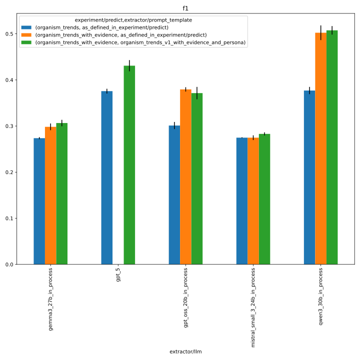
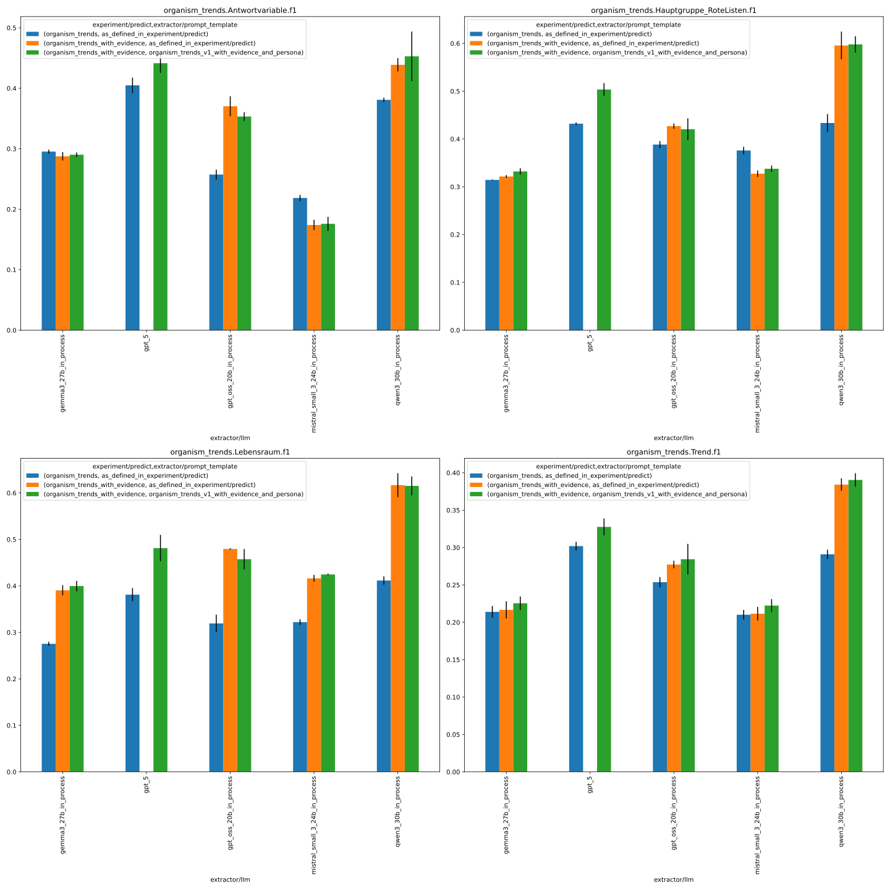
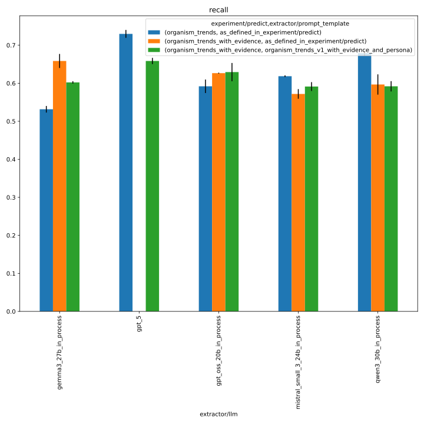
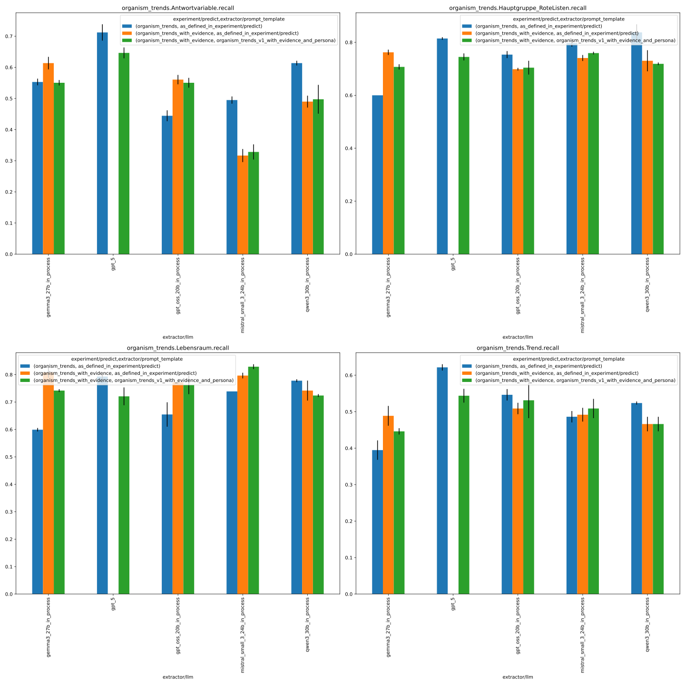

# 333_organism_trends_with_persona

This folder contains the logs of the organism trend experiments with an improved prompt template (v1),
evidence retrieval, and a persona, across the following LLMs:

- gpt_oss_20b
- gemma3_27b
- qwen3_30b
- mistral_small_3_24b
- gpt_5

See https://github.com/DFKI-NLP/kibad-llm/issues/333 and https://github.com/DFKI-NLP/kibad-llm/pull/338 for more documentation.

## Notebook Parameters

### Just this experiment

```python
NAME = "333_organism_trends_with_persona"

# used to group the data
INDEX_COLUMNS = ["prediction.overrides.extractor/llm"]
PLOT_KWARGS = {
    # can be either "metric" or one of the INDEX_COLUMNS (or multiple of them)
    "xgroup": "prediction.overrides.extractor/llm",
    # add any more arguments passed to pd.DataFrame.plot
}
```


### comparison with baseline
```python
NAME = "333_organism_trends_with_persona"

SUBDIR = [
    "evaluate",
    "../255_organism_trend_baseline_no_evi/evaluate",
    "../257_organism_trends_v1_with_evi/evaluate",
]

FILL_NA = {"prediction.overrides.extractor/prompt_template": "as_defined_in_experiment/predict"}

METRICS = ["f1", "recall"]

# used to group the data
INDEX_COLUMNS = ["prediction.overrides.extractor/llm", "prediction.overrides.experiment/predict", "prediction.overrides.extractor/prompt_template" ]
PLOT_KWARGS = {
    # can be either "metric" or one of the INDEX_COLUMNS (or multiple of them)
    "xgroup": ["prediction.overrides.experiment/predict", "prediction.overrides.extractor/prompt_template"],
    "create_subplot_for_each": "metric",
    "set_missing_values_to_zero": True,
    # add any more arguments passed to pd.DataFrame.plot
    "subplot_columns": 2,
}
```

### f1



### recall



### errors


## Inference

Run with new set of models:

- same setup as https://github.com/DFKI-NLP/kibad-llm/issues/257
- use name= 333_organism_trends_with_persona
- but use extractor/prompt_template=organism_trends_v1_with_evidence_and_persona

```bash
./run_in_process.sh -pa "H100-SLT,H100-Trails,H100,A100-80GB" \
-u "-m kibad_llm.predict \
name=333_organism_trends_with_persona \
experiment/predict=organism_trends_with_evidence \
extractor/prompt_template=organism_trends_v1_with_evidence_and_persona \
pdf_directory=/ds/text/kiba-d/dev-set-Wald-WVC \
extractor.return_reasoning=true \
extractor/llm=gpt_oss_20b_in_process,gemma3_27b_in_process,qwen3_30b_in_process,mistral_small_3_24b_in_process,gpt_5 \
seed=42,1337,7331 \
--multirun"
```

Output folder: `/netscratch/hennig/code/tmp/kibad-llm/logs/333_organism_trends_with_persona/predict/multiruns/2026-01-28_22-15-00`

Due to timeouts, the run had to be restarted for mistral and gpt_5:

```
./run_in_process.sh -pa "H100-SLT,H100-Trails,H100,A100-80GB" \
-u "-m kibad_llm.predict \
name=333_organism_trends_with_persona \
experiment/predict=organism_trends_with_evidence \
extractor/prompt_template=organism_trends_v1_with_evidence_and_persona \
pdf_directory=/ds/text/kiba-d/dev-set-Wald-WVC \
extractor.return_reasoning=true \
extractor/llm=mistral_small_3_24b_in_process,gpt_5 \
seed=42,1337,7331 \
--multirun"
```

Output folder: `/netscratch/hennig/code/tmp/kibad-llm/logs/333_organism_trends_with_persona/predict/multiruns/2026-01-29_14-01-06`

Mistral failed again (KV memory, restarted...)

```
./run_in_process.sh -pa "H100-SLT,H100-Trails,H100,A100-80GB" \
-u "-m kibad_llm.predict \
name=333_organism_trends_with_persona \
experiment/predict=organism_trends_with_evidence \
extractor/prompt_template=organism_trends_v1_with_evidence_and_persona \
pdf_directory=/ds/text/kiba-d/dev-set-Wald-WVC \
extractor.return_reasoning=true \
extractor/llm=mistral_small_3_24b_in_process \
seed=42,1337,7331 \
--multirun"
```

Output folder: `/netscratch/hennig/code/tmp/kibad-llm/logs/333_organism_trends_with_persona/predict/multiruns/2026-01-30_11-20-01`

Gemma3 had also failed (didn't notice before), rerun:

```
./run_in_process.sh -pa "H100-SLT,H100-Trails,H100,A100-80GB" \
-u "-m kibad_llm.predict \
name=333_organism_trends_with_persona \
experiment/predict=organism_trends_with_evidence \
extractor/prompt_template=organism_trends_v1_with_evidence_and_persona \
pdf_directory=/ds/text/kiba-d/dev-set-Wald-WVC \
extractor.return_reasoning=true \
extractor/llm=gemma3_27b_in_process \
seed=42,1337,7331 \
--multirun"
```

Output folder: `/netscratch/hennig/code/tmp/kibad-llm/logs/333_organism_trends_with_persona/predict/multiruns/2026-02-03_09-29-58`

## Evaluate F1

```
uv run -m kibad_llm.evaluate \
name=333_organism_trends_with_persona \
experiment/evaluate=organism_trends_f1_micro_flat \
prediction_logs=[logs/333_organism_trends_with_persona/predict/multiruns/2026-01-28_22-15-00,logs/333_organism_trends_with_persona/predict/multiruns/2026-01-29_14-01-06,logs/333_organism_trends_with_persona/predict/multiruns/2026-01-30_11-20-01,logs/333_organism_trends_with_persona/predict/multiruns/2026-02-03_09-29-58] \
+hydra.callbacks.save_job_return.multirun_markdown_group_by=prediction.overrides.extractor/llm \
--multirun
```


<details>
<summary>Log output</summary>

```
[2026-02-04 08:50:46,930][HYDRA] Saving job_return in /netscratch/hennig/code/kibad-llm/logs/333_organism_trends_with_persona/evaluate/multiruns/2026-02-04_08-50-36/job_return_value.json                            
[2026-02-04 08:50:46,938][HYDRA] Saving job_return in /netscratch/hennig/code/kibad-llm/logs/333_organism_trends_with_persona/evaluate/multiruns/2026-02-04_08-50-36/job_return_value.md                              
[2026-02-04 08:50:46,998][HYDRA] Contents of /netscratch/hennig/code/kibad-llm/logs/333_organism_trends_with_persona/evaluate/multiruns/2026-02-04_08-50-36/job_return_value.md:
``` 

| prediction.overrides.extractor/llm   |   ALL.f1.mean |   ALL.f1.std |   ALL.precision.mean |   ALL.precision.std |   ALL.recall.mean |   ALL.recall.std |   ALL.support.mean |   ALL.support.std |   AVG.f1.mean |   AVG.f1.std |   AVG.precision.mean |   AVG.precision.std |   AVG.recall.mean |   AVG.recall.std |   AVG.support.mean |   AVG.support.std |   organism_trends.Antwortvariable.f1.mean |   organism_trends.Antwortvariable.f1.std |   organism_trends.Antwortvariable.precision.mean |   organism_trends.Antwortvariable.precision.std |   organism_trends.Antwortvariable.recall.mean |   organism_trends.Antwortvariable.recall.std |   organism_trends.Antwortvariable.support.mean |   organism_trends.Antwortvariable.support.std |   organism_trends.Hauptgruppe_RoteListen.f1.mean |   organism_trends.Hauptgruppe_RoteListen.f1.std |   organism_trends.Hauptgruppe_RoteListen.precision.mean |   organism_trends.Hauptgruppe_RoteListen.precision.std |   organism_trends.Hauptgruppe_RoteListen.recall.mean |   organism_trends.Hauptgruppe_RoteListen.recall.std |   organism_trends.Hauptgruppe_RoteListen.support.mean |   organism_trends.Hauptgruppe_RoteListen.support.std |   organism_trends.Lebensraum.f1.mean |   organism_trends.Lebensraum.f1.std |   organism_trends.Lebensraum.precision.mean |   organism_trends.Lebensraum.precision.std |   organism_trends.Lebensraum.recall.mean |   organism_trends.Lebensraum.recall.std |   organism_trends.Lebensraum.support.mean |   organism_trends.Lebensraum.support.std |   organism_trends.Trend.f1.mean |   organism_trends.Trend.f1.std |   organism_trends.Trend.precision.mean |   organism_trends.Trend.precision.std |   organism_trends.Trend.recall.mean |   organism_trends.Trend.recall.std |   organism_trends.Trend.support.mean |   organism_trends.Trend.support.std |   prediction.job_return_value.time_extraction.mean |   prediction.job_return_value.time_extraction.std |   prediction.job_return_value.time_pdf_conversion.mean |   prediction.job_return_value.time_pdf_conversion.std | overrides.dataset.predictions.log                                                                                                                                                                                                                   | overrides.experiment/evaluate                                                                       | overrides.name                                                                                               | overrides.prediction_logs                                                                                                                                                                                                                                                                                                                                                                                                                                                                                                                                                                                                                                                                                                                                                                                                                                                                                                                                       | prediction.job_return_value.branch                                                               | prediction.job_return_value.commit_hash                                                                                              | prediction.job_return_value.is_dirty   | prediction.job_return_value.output_file                                                                                                                                                                                                                                                                                                             | prediction.job_return_value.output_file_absolute                                                                                                                                                                                                                                                                                                                                                                                                                      | prediction.overrides.experiment/predict                                                             | prediction.overrides.extractor.return_reasoning   | prediction.overrides.extractor/prompt_template                                                                                                   | prediction.overrides.name                                                                                    | prediction.overrides.pdf_directory                                                                           | prediction.overrides.seed   |
|:-------------------------------------|--------------:|-------------:|---------------------:|--------------------:|------------------:|-----------------:|-------------------:|------------------:|--------------:|-------------:|---------------------:|--------------------:|------------------:|-----------------:|-------------------:|------------------:|------------------------------------------:|-----------------------------------------:|-------------------------------------------------:|------------------------------------------------:|----------------------------------------------:|---------------------------------------------:|-----------------------------------------------:|----------------------------------------------:|-------------------------------------------------:|------------------------------------------------:|--------------------------------------------------------:|-------------------------------------------------------:|-----------------------------------------------------:|----------------------------------------------------:|------------------------------------------------------:|-----------------------------------------------------:|-------------------------------------:|------------------------------------:|--------------------------------------------:|-------------------------------------------:|-----------------------------------------:|----------------------------------------:|------------------------------------------:|-----------------------------------------:|--------------------------------:|-------------------------------:|---------------------------------------:|--------------------------------------:|------------------------------------:|-----------------------------------:|-------------------------------------:|------------------------------------:|---------------------------------------------------:|--------------------------------------------------:|-------------------------------------------------------:|------------------------------------------------------:|:----------------------------------------------------------------------------------------------------------------------------------------------------------------------------------------------------------------------------------------------------|:----------------------------------------------------------------------------------------------------|:-------------------------------------------------------------------------------------------------------------|:----------------------------------------------------------------------------------------------------------------------------------------------------------------------------------------------------------------------------------------------------------------------------------------------------------------------------------------------------------------------------------------------------------------------------------------------------------------------------------------------------------------------------------------------------------------------------------------------------------------------------------------------------------------------------------------------------------------------------------------------------------------------------------------------------------------------------------------------------------------------------------------------------------------------------------------------------------------|:-------------------------------------------------------------------------------------------------|:-------------------------------------------------------------------------------------------------------------------------------------|:---------------------------------------|:----------------------------------------------------------------------------------------------------------------------------------------------------------------------------------------------------------------------------------------------------------------------------------------------------------------------------------------------------|:----------------------------------------------------------------------------------------------------------------------------------------------------------------------------------------------------------------------------------------------------------------------------------------------------------------------------------------------------------------------------------------------------------------------------------------------------------------------|:----------------------------------------------------------------------------------------------------|:--------------------------------------------------|:-------------------------------------------------------------------------------------------------------------------------------------------------|:-------------------------------------------------------------------------------------------------------------|:-------------------------------------------------------------------------------------------------------------|:----------------------------|
| gemma3_27b_in_process                |         0.307 |        0.007 |                0.206 |               0.007 |             0.602 |            0.003 |                491 |                 0 |         0.312 |        0.007 |                0.21  |               0.007 |             0.611 |            0.003 |             122.75 |                 0 |                                     0.29  |                                    0.004 |                                            0.197 |                                           0.004 |                                         0.551 |                                        0.009 |                                            132 |                                             0 |                                            0.332 |                                           0.007 |                                                   0.217 |                                                  0.007 |                                                0.707 |                                               0.01  |                                                   115 |                                                    0 |                                0.4   |                               0.011 |                                       0.274 |                                      0.011 |                                    0.742 |                                   0.005 |                                       111 |                                        0 |                           0.225 |                          0.009 |                                  0.151 |                                 0.007 |                               0.446 |                              0.009 |                                  133 |                                   0 |                                            8786.08 |                                           276.811 |                                                  0.04  |                                                 0.049 | ['logs/333_organism_trends_with_persona/predict/multiruns/2026-02-03_09-29-58/0', 'logs/333_organism_trends_with_persona/predict/multiruns/2026-02-03_09-29-58/1', 'logs/333_organism_trends_with_persona/predict/multiruns/2026-02-03_09-29-58/2'] | ['organism_trends_f1_micro_flat', 'organism_trends_f1_micro_flat', 'organism_trends_f1_micro_flat'] | ['333_organism_trends_with_persona', '333_organism_trends_with_persona', '333_organism_trends_with_persona'] | ['[logs/333_organism_trends_with_persona/predict/multiruns/2026-01-28_22-15-00,logs/333_organism_trends_with_persona/predict/multiruns/2026-01-29_14-01-06,logs/333_organism_trends_with_persona/predict/multiruns/2026-01-30_11-20-01,logs/333_organism_trends_with_persona/predict/multiruns/2026-02-03_09-29-58]', '[logs/333_organism_trends_with_persona/predict/multiruns/2026-01-28_22-15-00,logs/333_organism_trends_with_persona/predict/multiruns/2026-01-29_14-01-06,logs/333_organism_trends_with_persona/predict/multiruns/2026-01-30_11-20-01,logs/333_organism_trends_with_persona/predict/multiruns/2026-02-03_09-29-58]', '[logs/333_organism_trends_with_persona/predict/multiruns/2026-01-28_22-15-00,logs/333_organism_trends_with_persona/predict/multiruns/2026-01-29_14-01-06,logs/333_organism_trends_with_persona/predict/multiruns/2026-01-30_11-20-01,logs/333_organism_trends_with_persona/predict/multiruns/2026-02-03_09-29-58]'] | ['organism-trends-with-persona', 'organism-trends-with-persona', 'organism-trends-with-persona'] | ['5a4e9f6557883763fb8b307c339c5a898d2b8c5b', '5a4e9f6557883763fb8b307c339c5a898d2b8c5b', '5a4e9f6557883763fb8b307c339c5a898d2b8c5b'] | [np.False_, np.False_, np.False_]      | ['predictions/333_organism_trends_with_persona/2026-02-03_09-29-58/2026-02-03_09-29-59_406367/predictions.jsonl', 'predictions/333_organism_trends_with_persona/2026-02-03_09-29-58/2026-02-03_12-04-52_948300/predictions.jsonl', 'predictions/333_organism_trends_with_persona/2026-02-03_09-29-58/2026-02-03_14-33-11_084305/predictions.jsonl'] | ['/netscratch/hennig/code/tmp/kibad-llm/predictions/333_organism_trends_with_persona/2026-02-03_09-29-58/2026-02-03_09-29-59_406367/predictions.jsonl', '/netscratch/hennig/code/tmp/kibad-llm/predictions/333_organism_trends_with_persona/2026-02-03_09-29-58/2026-02-03_12-04-52_948300/predictions.jsonl', '/netscratch/hennig/code/tmp/kibad-llm/predictions/333_organism_trends_with_persona/2026-02-03_09-29-58/2026-02-03_14-33-11_084305/predictions.jsonl'] | ['organism_trends_with_evidence', 'organism_trends_with_evidence', 'organism_trends_with_evidence'] | ['True', 'True', 'True']                          | ['organism_trends_v1_with_evidence_and_persona', 'organism_trends_v1_with_evidence_and_persona', 'organism_trends_v1_with_evidence_and_persona'] | ['333_organism_trends_with_persona', '333_organism_trends_with_persona', '333_organism_trends_with_persona'] | ['/ds/text/kiba-d/dev-set-Wald-WVC', '/ds/text/kiba-d/dev-set-Wald-WVC', '/ds/text/kiba-d/dev-set-Wald-WVC'] | ['42', '1337', '7331']      |
| gpt_5                                |         0.431 |        0.012 |                0.32  |               0.012 |             0.659 |            0.008 |                491 |                 0 |         0.438 |        0.013 |                0.328 |               0.012 |             0.664 |            0.009 |             122.75 |                 0 |                                     0.441 |                                    0.016 |                                            0.335 |                                           0.014 |                                         0.646 |                                        0.017 |                                            132 |                                             0 |                                            0.504 |                                           0.013 |                                                   0.38  |                                                  0.012 |                                                0.745 |                                               0.013 |                                                   115 |                                                    0 |                                0.481 |                               0.029 |                                       0.361 |                                      0.024 |                                    0.721 |                                   0.032 |                                       111 |                                        0 |                           0.328 |                          0.011 |                                  0.234 |                                 0.009 |                               0.544 |                              0.019 |                                  133 |                                   0 |                                           24124.3  |                                          2479.77  |                                                  0.007 |                                                 0.002 | ['logs/333_organism_trends_with_persona/predict/multiruns/2026-01-29_14-01-06/3', 'logs/333_organism_trends_with_persona/predict/multiruns/2026-01-29_14-01-06/4', 'logs/333_organism_trends_with_persona/predict/multiruns/2026-01-29_14-01-06/5'] | ['organism_trends_f1_micro_flat', 'organism_trends_f1_micro_flat', 'organism_trends_f1_micro_flat'] | ['333_organism_trends_with_persona', '333_organism_trends_with_persona', '333_organism_trends_with_persona'] | ['[logs/333_organism_trends_with_persona/predict/multiruns/2026-01-28_22-15-00,logs/333_organism_trends_with_persona/predict/multiruns/2026-01-29_14-01-06,logs/333_organism_trends_with_persona/predict/multiruns/2026-01-30_11-20-01,logs/333_organism_trends_with_persona/predict/multiruns/2026-02-03_09-29-58]', '[logs/333_organism_trends_with_persona/predict/multiruns/2026-01-28_22-15-00,logs/333_organism_trends_with_persona/predict/multiruns/2026-01-29_14-01-06,logs/333_organism_trends_with_persona/predict/multiruns/2026-01-30_11-20-01,logs/333_organism_trends_with_persona/predict/multiruns/2026-02-03_09-29-58]', '[logs/333_organism_trends_with_persona/predict/multiruns/2026-01-28_22-15-00,logs/333_organism_trends_with_persona/predict/multiruns/2026-01-29_14-01-06,logs/333_organism_trends_with_persona/predict/multiruns/2026-01-30_11-20-01,logs/333_organism_trends_with_persona/predict/multiruns/2026-02-03_09-29-58]'] | ['organism-trends-with-persona', 'organism-trends-with-persona', 'organism-trends-with-persona'] | ['5a4e9f6557883763fb8b307c339c5a898d2b8c5b', '5a4e9f6557883763fb8b307c339c5a898d2b8c5b', '5a4e9f6557883763fb8b307c339c5a898d2b8c5b'] | [np.False_, np.False_, np.False_]      | ['predictions/333_organism_trends_with_persona/2026-01-29_14-01-06/2026-01-29_14-04-26_437078/predictions.jsonl', 'predictions/333_organism_trends_with_persona/2026-01-29_14-01-06/2026-01-29_21-21-16_618964/predictions.jsonl', 'predictions/333_organism_trends_with_persona/2026-01-29_14-01-06/2026-01-30_04-14-19_275497/predictions.jsonl'] | ['/netscratch/hennig/code/tmp/kibad-llm/predictions/333_organism_trends_with_persona/2026-01-29_14-01-06/2026-01-29_14-04-26_437078/predictions.jsonl', '/netscratch/hennig/code/tmp/kibad-llm/predictions/333_organism_trends_with_persona/2026-01-29_14-01-06/2026-01-29_21-21-16_618964/predictions.jsonl', '/netscratch/hennig/code/tmp/kibad-llm/predictions/333_organism_trends_with_persona/2026-01-29_14-01-06/2026-01-30_04-14-19_275497/predictions.jsonl'] | ['organism_trends_with_evidence', 'organism_trends_with_evidence', 'organism_trends_with_evidence'] | ['True', 'True', 'True']                          | ['organism_trends_v1_with_evidence_and_persona', 'organism_trends_v1_with_evidence_and_persona', 'organism_trends_v1_with_evidence_and_persona'] | ['333_organism_trends_with_persona', '333_organism_trends_with_persona', '333_organism_trends_with_persona'] | ['/ds/text/kiba-d/dev-set-Wald-WVC', '/ds/text/kiba-d/dev-set-Wald-WVC', '/ds/text/kiba-d/dev-set-Wald-WVC'] | ['42', '1337', '7331']      |
| gpt_oss_20b_in_process               |         0.371 |        0.013 |                0.264 |               0.011 |             0.629 |            0.024 |                491 |                 0 |         0.379 |        0.013 |                0.27  |               0.01  |             0.637 |            0.024 |             122.75 |                 0 |                                     0.353 |                                    0.007 |                                            0.26  |                                           0.004 |                                         0.551 |                                        0.016 |                                            132 |                                             0 |                                            0.42  |                                           0.023 |                                                   0.3   |                                                  0.019 |                                                0.704 |                                               0.026 |                                                   115 |                                                    0 |                                0.457 |                               0.022 |                                       0.327 |                                      0.017 |                                    0.763 |                                   0.034 |                                       111 |                                        0 |                           0.284 |                          0.021 |                                  0.194 |                                 0.014 |                               0.531 |                              0.049 |                                  133 |                                   0 |                                            3969.64 |                                           138.42  |                                                  0.015 |                                                 0.017 | ['logs/333_organism_trends_with_persona/predict/multiruns/2026-01-28_22-15-00/0', 'logs/333_organism_trends_with_persona/predict/multiruns/2026-01-28_22-15-00/1', 'logs/333_organism_trends_with_persona/predict/multiruns/2026-01-28_22-15-00/2'] | ['organism_trends_f1_micro_flat', 'organism_trends_f1_micro_flat', 'organism_trends_f1_micro_flat'] | ['333_organism_trends_with_persona', '333_organism_trends_with_persona', '333_organism_trends_with_persona'] | ['[logs/333_organism_trends_with_persona/predict/multiruns/2026-01-28_22-15-00,logs/333_organism_trends_with_persona/predict/multiruns/2026-01-29_14-01-06,logs/333_organism_trends_with_persona/predict/multiruns/2026-01-30_11-20-01,logs/333_organism_trends_with_persona/predict/multiruns/2026-02-03_09-29-58]', '[logs/333_organism_trends_with_persona/predict/multiruns/2026-01-28_22-15-00,logs/333_organism_trends_with_persona/predict/multiruns/2026-01-29_14-01-06,logs/333_organism_trends_with_persona/predict/multiruns/2026-01-30_11-20-01,logs/333_organism_trends_with_persona/predict/multiruns/2026-02-03_09-29-58]', '[logs/333_organism_trends_with_persona/predict/multiruns/2026-01-28_22-15-00,logs/333_organism_trends_with_persona/predict/multiruns/2026-01-29_14-01-06,logs/333_organism_trends_with_persona/predict/multiruns/2026-01-30_11-20-01,logs/333_organism_trends_with_persona/predict/multiruns/2026-02-03_09-29-58]'] | ['organism-trends-with-persona', 'organism-trends-with-persona', 'organism-trends-with-persona'] | ['5a4e9f6557883763fb8b307c339c5a898d2b8c5b', '5a4e9f6557883763fb8b307c339c5a898d2b8c5b', '5a4e9f6557883763fb8b307c339c5a898d2b8c5b'] | [np.False_, np.False_, np.False_]      | ['predictions/333_organism_trends_with_persona/2026-01-28_22-15-00/2026-01-28_22-15-02_777488/predictions.jsonl', 'predictions/333_organism_trends_with_persona/2026-01-28_22-15-00/2026-01-28_23-27-56_816052/predictions.jsonl', 'predictions/333_organism_trends_with_persona/2026-01-28_22-15-00/2026-01-29_00-34-18_764450/predictions.jsonl'] | ['/netscratch/hennig/code/tmp/kibad-llm/predictions/333_organism_trends_with_persona/2026-01-28_22-15-00/2026-01-28_22-15-02_777488/predictions.jsonl', '/netscratch/hennig/code/tmp/kibad-llm/predictions/333_organism_trends_with_persona/2026-01-28_22-15-00/2026-01-28_23-27-56_816052/predictions.jsonl', '/netscratch/hennig/code/tmp/kibad-llm/predictions/333_organism_trends_with_persona/2026-01-28_22-15-00/2026-01-29_00-34-18_764450/predictions.jsonl'] | ['organism_trends_with_evidence', 'organism_trends_with_evidence', 'organism_trends_with_evidence'] | ['True', 'True', 'True']                          | ['organism_trends_v1_with_evidence_and_persona', 'organism_trends_v1_with_evidence_and_persona', 'organism_trends_v1_with_evidence_and_persona'] | ['333_organism_trends_with_persona', '333_organism_trends_with_persona', '333_organism_trends_with_persona'] | ['/ds/text/kiba-d/dev-set-Wald-WVC', '/ds/text/kiba-d/dev-set-Wald-WVC', '/ds/text/kiba-d/dev-set-Wald-WVC'] | ['42', '1337', '7331']      |
| mistral_small_3_24b_in_process       |         0.283 |        0.003 |                0.186 |               0.002 |             0.591 |            0.012 |                491 |                 0 |         0.29  |        0.003 |                0.191 |               0.002 |             0.606 |            0.011 |             122.75 |                 0 |                                     0.176 |                                    0.012 |                                            0.12  |                                           0.008 |                                         0.328 |                                        0.024 |                                            132 |                                             0 |                                            0.338 |                                           0.007 |                                                   0.217 |                                                  0.005 |                                                0.759 |                                               0.005 |                                                   115 |                                                    0 |                                0.425 |                               0.002 |                                       0.285 |                                      0.001 |                                    0.829 |                                   0.009 |                                       111 |                                        0 |                           0.222 |                          0.009 |                                  0.142 |                                 0.005 |                               0.509 |                              0.026 |                                  133 |                                   0 |                                            9412.31 |                                           792.634 |                                                  0.007 |                                                 0.001 | ['logs/333_organism_trends_with_persona/predict/multiruns/2026-01-30_11-20-01/0', 'logs/333_organism_trends_with_persona/predict/multiruns/2026-01-30_11-20-01/1', 'logs/333_organism_trends_with_persona/predict/multiruns/2026-01-30_11-20-01/2'] | ['organism_trends_f1_micro_flat', 'organism_trends_f1_micro_flat', 'organism_trends_f1_micro_flat'] | ['333_organism_trends_with_persona', '333_organism_trends_with_persona', '333_organism_trends_with_persona'] | ['[logs/333_organism_trends_with_persona/predict/multiruns/2026-01-28_22-15-00,logs/333_organism_trends_with_persona/predict/multiruns/2026-01-29_14-01-06,logs/333_organism_trends_with_persona/predict/multiruns/2026-01-30_11-20-01,logs/333_organism_trends_with_persona/predict/multiruns/2026-02-03_09-29-58]', '[logs/333_organism_trends_with_persona/predict/multiruns/2026-01-28_22-15-00,logs/333_organism_trends_with_persona/predict/multiruns/2026-01-29_14-01-06,logs/333_organism_trends_with_persona/predict/multiruns/2026-01-30_11-20-01,logs/333_organism_trends_with_persona/predict/multiruns/2026-02-03_09-29-58]', '[logs/333_organism_trends_with_persona/predict/multiruns/2026-01-28_22-15-00,logs/333_organism_trends_with_persona/predict/multiruns/2026-01-29_14-01-06,logs/333_organism_trends_with_persona/predict/multiruns/2026-01-30_11-20-01,logs/333_organism_trends_with_persona/predict/multiruns/2026-02-03_09-29-58]'] | ['organism-trends-with-persona', 'organism-trends-with-persona', 'organism-trends-with-persona'] | ['5a4e9f6557883763fb8b307c339c5a898d2b8c5b', '5a4e9f6557883763fb8b307c339c5a898d2b8c5b', '5a4e9f6557883763fb8b307c339c5a898d2b8c5b'] | [np.False_, np.False_, np.False_]      | ['predictions/333_organism_trends_with_persona/2026-01-30_11-20-01/2026-01-30_11-20-02_562986/predictions.jsonl', 'predictions/333_organism_trends_with_persona/2026-01-30_11-20-01/2026-01-30_13-47-41_820129/predictions.jsonl', 'predictions/333_organism_trends_with_persona/2026-01-30_11-20-01/2026-01-30_16-40-15_624544/predictions.jsonl'] | ['/netscratch/hennig/code/tmp/kibad-llm/predictions/333_organism_trends_with_persona/2026-01-30_11-20-01/2026-01-30_11-20-02_562986/predictions.jsonl', '/netscratch/hennig/code/tmp/kibad-llm/predictions/333_organism_trends_with_persona/2026-01-30_11-20-01/2026-01-30_13-47-41_820129/predictions.jsonl', '/netscratch/hennig/code/tmp/kibad-llm/predictions/333_organism_trends_with_persona/2026-01-30_11-20-01/2026-01-30_16-40-15_624544/predictions.jsonl'] | ['organism_trends_with_evidence', 'organism_trends_with_evidence', 'organism_trends_with_evidence'] | ['True', 'True', 'True']                          | ['organism_trends_v1_with_evidence_and_persona', 'organism_trends_v1_with_evidence_and_persona', 'organism_trends_v1_with_evidence_and_persona'] | ['333_organism_trends_with_persona', '333_organism_trends_with_persona', '333_organism_trends_with_persona'] | ['/ds/text/kiba-d/dev-set-Wald-WVC', '/ds/text/kiba-d/dev-set-Wald-WVC', '/ds/text/kiba-d/dev-set-Wald-WVC'] | ['42', '1337', '7331']      |
| qwen3_30b_in_process                 |         0.508 |        0.009 |                0.444 |               0.016 |             0.592 |            0.014 |                491 |                 0 |         0.514 |        0.009 |                0.45  |               0.016 |             0.602 |            0.013 |             122.75 |                 0 |                                     0.453 |                                    0.041 |                                            0.416 |                                           0.037 |                                         0.497 |                                        0.046 |                                            132 |                                             0 |                                            0.598 |                                           0.017 |                                                   0.512 |                                                  0.026 |                                                0.719 |                                               0.005 |                                                   115 |                                                    0 |                                0.615 |                               0.02  |                                       0.535 |                                      0.028 |                                    0.724 |                                   0.005 |                                       111 |                                        0 |                           0.39  |                          0.009 |                                  0.337 |                                 0.016 |                               0.466 |                              0.02  |                                  133 |                                   0 |                                            7519.28 |                                           466.036 |                                                  0.006 |                                                 0.002 | ['logs/333_organism_trends_with_persona/predict/multiruns/2026-01-28_22-15-00/6', 'logs/333_organism_trends_with_persona/predict/multiruns/2026-01-28_22-15-00/7', 'logs/333_organism_trends_with_persona/predict/multiruns/2026-01-28_22-15-00/8'] | ['organism_trends_f1_micro_flat', 'organism_trends_f1_micro_flat', 'organism_trends_f1_micro_flat'] | ['333_organism_trends_with_persona', '333_organism_trends_with_persona', '333_organism_trends_with_persona'] | ['[logs/333_organism_trends_with_persona/predict/multiruns/2026-01-28_22-15-00,logs/333_organism_trends_with_persona/predict/multiruns/2026-01-29_14-01-06,logs/333_organism_trends_with_persona/predict/multiruns/2026-01-30_11-20-01,logs/333_organism_trends_with_persona/predict/multiruns/2026-02-03_09-29-58]', '[logs/333_organism_trends_with_persona/predict/multiruns/2026-01-28_22-15-00,logs/333_organism_trends_with_persona/predict/multiruns/2026-01-29_14-01-06,logs/333_organism_trends_with_persona/predict/multiruns/2026-01-30_11-20-01,logs/333_organism_trends_with_persona/predict/multiruns/2026-02-03_09-29-58]', '[logs/333_organism_trends_with_persona/predict/multiruns/2026-01-28_22-15-00,logs/333_organism_trends_with_persona/predict/multiruns/2026-01-29_14-01-06,logs/333_organism_trends_with_persona/predict/multiruns/2026-01-30_11-20-01,logs/333_organism_trends_with_persona/predict/multiruns/2026-02-03_09-29-58]'] | ['organism-trends-with-persona', 'organism-trends-with-persona', 'organism-trends-with-persona'] | ['5a4e9f6557883763fb8b307c339c5a898d2b8c5b', '5a4e9f6557883763fb8b307c339c5a898d2b8c5b', '5a4e9f6557883763fb8b307c339c5a898d2b8c5b'] | [np.False_, np.False_, np.False_]      | ['predictions/333_organism_trends_with_persona/2026-01-28_22-15-00/2026-01-29_01-44-03_269741/predictions.jsonl', 'predictions/333_organism_trends_with_persona/2026-01-28_22-15-00/2026-01-29_03-44-54_198858/predictions.jsonl', 'predictions/333_organism_trends_with_persona/2026-01-28_22-15-00/2026-01-29_05-51-22_659242/predictions.jsonl'] | ['/netscratch/hennig/code/tmp/kibad-llm/predictions/333_organism_trends_with_persona/2026-01-28_22-15-00/2026-01-29_01-44-03_269741/predictions.jsonl', '/netscratch/hennig/code/tmp/kibad-llm/predictions/333_organism_trends_with_persona/2026-01-28_22-15-00/2026-01-29_03-44-54_198858/predictions.jsonl', '/netscratch/hennig/code/tmp/kibad-llm/predictions/333_organism_trends_with_persona/2026-01-28_22-15-00/2026-01-29_05-51-22_659242/predictions.jsonl'] | ['organism_trends_with_evidence', 'organism_trends_with_evidence', 'organism_trends_with_evidence'] | ['True', 'True', 'True']                          | ['organism_trends_v1_with_evidence_and_persona', 'organism_trends_v1_with_evidence_and_persona', 'organism_trends_v1_with_evidence_and_persona'] | ['333_organism_trends_with_persona', '333_organism_trends_with_persona', '333_organism_trends_with_persona'] | ['/ds/text/kiba-d/dev-set-Wald-WVC', '/ds/text/kiba-d/dev-set-Wald-WVC', '/ds/text/kiba-d/dev-set-Wald-WVC'] | ['42', '1337', '7331']      |

</details>

## Evaluate errors

```
uv run -m kibad_llm.evaluate \
name=333_organism_trends_with_persona \
experiment/evaluate=prediction_errors \
prediction_logs=[logs/333_organism_trends_with_persona/predict/multiruns/2026-01-28_22-15-00,logs/333_organism_trends_with_persona/predict/multiruns/2026-01-29_14-01-06,logs/333_organism_trends_with_persona/predict/multiruns/2026-01-30_11-20-01,logs/333_organism_trends_with_persona/predict/multiruns/2026-02-03_09-29-58] \
+hydra.callbacks.save_job_return.multirun_markdown_group_by=prediction.overrides.extractor/llm \
--multirun
```

<details>
<summary>Log output</summary>

```
[2026-02-04 08:52:02,357][HYDRA] Saving job_return in /netscratch/hennig/code/kibad-llm/logs/333_organism_trends_with_persona/evaluate/multiruns/2026-02-04_08-51-54/job_return_value.json                            
[2026-02-04 08:52:02,363][HYDRA] Saving job_return in /netscratch/hennig/code/kibad-llm/logs/333_organism_trends_with_persona/evaluate/multiruns/2026-02-04_08-51-54/job_return_value.md                              
[2026-02-04 08:52:02,409][HYDRA] Contents of /netscratch/hennig/code/kibad-llm/logs/333_organism_trends_with_persona/evaluate/multiruns/2026-02-04_08-51-54/job_return_value.md:
``` 

| prediction.overrides.extractor/llm   |   JSONDecodeError.mean |   JSONDecodeError.std |   MissingResponseContentError.mean |   MissingResponseContentError.std |   ReasoningExtractionError.mean |   ReasoningExtractionError.std |   ValueError.mean |   ValueError.std |   no_error.mean |   no_error.std |   prediction.job_return_value.time_extraction.mean |   prediction.job_return_value.time_extraction.std |   prediction.job_return_value.time_pdf_conversion.mean |   prediction.job_return_value.time_pdf_conversion.std |   with_error.mean |   with_error.std | overrides.dataset.predictions.log                                                                                                                                                                                                                   | overrides.experiment/evaluate                                   | overrides.name                                                                                               | overrides.prediction_logs                                                                                                                                                                                                                                                                                                                                                                                                                                                                                                                                                                                                                                                                                                                                                                                                                                                                                                                                       | prediction.job_return_value.branch                                                               | prediction.job_return_value.commit_hash                                                                                              | prediction.job_return_value.is_dirty   | prediction.job_return_value.output_file                                                                                                                                                                                                                                                                                                             | prediction.job_return_value.output_file_absolute                                                                                                                                                                                                                                                                                                                                                                                                                      | prediction.overrides.experiment/predict                                                             | prediction.overrides.extractor.return_reasoning   | prediction.overrides.extractor/prompt_template                                                                                                   | prediction.overrides.name                                                                                    | prediction.overrides.pdf_directory                                                                           | prediction.overrides.seed   |
|:-------------------------------------|-----------------------:|----------------------:|-----------------------------------:|----------------------------------:|--------------------------------:|-------------------------------:|------------------:|-----------------:|----------------:|---------------:|---------------------------------------------------:|--------------------------------------------------:|-------------------------------------------------------:|------------------------------------------------------:|------------------:|-----------------:|:----------------------------------------------------------------------------------------------------------------------------------------------------------------------------------------------------------------------------------------------------|:----------------------------------------------------------------|:-------------------------------------------------------------------------------------------------------------|:----------------------------------------------------------------------------------------------------------------------------------------------------------------------------------------------------------------------------------------------------------------------------------------------------------------------------------------------------------------------------------------------------------------------------------------------------------------------------------------------------------------------------------------------------------------------------------------------------------------------------------------------------------------------------------------------------------------------------------------------------------------------------------------------------------------------------------------------------------------------------------------------------------------------------------------------------------------|:-------------------------------------------------------------------------------------------------|:-------------------------------------------------------------------------------------------------------------------------------------|:---------------------------------------|:----------------------------------------------------------------------------------------------------------------------------------------------------------------------------------------------------------------------------------------------------------------------------------------------------------------------------------------------------|:----------------------------------------------------------------------------------------------------------------------------------------------------------------------------------------------------------------------------------------------------------------------------------------------------------------------------------------------------------------------------------------------------------------------------------------------------------------------|:----------------------------------------------------------------------------------------------------|:--------------------------------------------------|:-------------------------------------------------------------------------------------------------------------------------------------------------|:-------------------------------------------------------------------------------------------------------------|:-------------------------------------------------------------------------------------------------------------|:----------------------------|
| gemma3_27b_in_process                |                  2     |                 0     |                              0     |                             0     |                           0     |                          0     |                16 |                0 |         391     |          0     |                                            8786.08 |                                           276.811 |                                                  0.04  |                                                 0.049 |            18     |            0     | ['logs/333_organism_trends_with_persona/predict/multiruns/2026-02-03_09-29-58/0', 'logs/333_organism_trends_with_persona/predict/multiruns/2026-02-03_09-29-58/1', 'logs/333_organism_trends_with_persona/predict/multiruns/2026-02-03_09-29-58/2'] | ['prediction_errors', 'prediction_errors', 'prediction_errors'] | ['333_organism_trends_with_persona', '333_organism_trends_with_persona', '333_organism_trends_with_persona'] | ['[logs/333_organism_trends_with_persona/predict/multiruns/2026-01-28_22-15-00,logs/333_organism_trends_with_persona/predict/multiruns/2026-01-29_14-01-06,logs/333_organism_trends_with_persona/predict/multiruns/2026-01-30_11-20-01,logs/333_organism_trends_with_persona/predict/multiruns/2026-02-03_09-29-58]', '[logs/333_organism_trends_with_persona/predict/multiruns/2026-01-28_22-15-00,logs/333_organism_trends_with_persona/predict/multiruns/2026-01-29_14-01-06,logs/333_organism_trends_with_persona/predict/multiruns/2026-01-30_11-20-01,logs/333_organism_trends_with_persona/predict/multiruns/2026-02-03_09-29-58]', '[logs/333_organism_trends_with_persona/predict/multiruns/2026-01-28_22-15-00,logs/333_organism_trends_with_persona/predict/multiruns/2026-01-29_14-01-06,logs/333_organism_trends_with_persona/predict/multiruns/2026-01-30_11-20-01,logs/333_organism_trends_with_persona/predict/multiruns/2026-02-03_09-29-58]'] | ['organism-trends-with-persona', 'organism-trends-with-persona', 'organism-trends-with-persona'] | ['5a4e9f6557883763fb8b307c339c5a898d2b8c5b', '5a4e9f6557883763fb8b307c339c5a898d2b8c5b', '5a4e9f6557883763fb8b307c339c5a898d2b8c5b'] | [np.False_, np.False_, np.False_]      | ['predictions/333_organism_trends_with_persona/2026-02-03_09-29-58/2026-02-03_09-29-59_406367/predictions.jsonl', 'predictions/333_organism_trends_with_persona/2026-02-03_09-29-58/2026-02-03_12-04-52_948300/predictions.jsonl', 'predictions/333_organism_trends_with_persona/2026-02-03_09-29-58/2026-02-03_14-33-11_084305/predictions.jsonl'] | ['/netscratch/hennig/code/tmp/kibad-llm/predictions/333_organism_trends_with_persona/2026-02-03_09-29-58/2026-02-03_09-29-59_406367/predictions.jsonl', '/netscratch/hennig/code/tmp/kibad-llm/predictions/333_organism_trends_with_persona/2026-02-03_09-29-58/2026-02-03_12-04-52_948300/predictions.jsonl', '/netscratch/hennig/code/tmp/kibad-llm/predictions/333_organism_trends_with_persona/2026-02-03_09-29-58/2026-02-03_14-33-11_084305/predictions.jsonl'] | ['organism_trends_with_evidence', 'organism_trends_with_evidence', 'organism_trends_with_evidence'] | ['True', 'True', 'True']                          | ['organism_trends_v1_with_evidence_and_persona', 'organism_trends_v1_with_evidence_and_persona', 'organism_trends_v1_with_evidence_and_persona'] | ['333_organism_trends_with_persona', '333_organism_trends_with_persona', '333_organism_trends_with_persona'] | ['/ds/text/kiba-d/dev-set-Wald-WVC', '/ds/text/kiba-d/dev-set-Wald-WVC', '/ds/text/kiba-d/dev-set-Wald-WVC'] | ['42', '1337', '7331']      |
| gpt_5                                |                  4     |                 1.732 |                              3.333 |                             1.528 |                          16.333 |                          1.155 |                 8 |                0 |         377.333 |          2.309 |                                           24124.3  |                                          2479.77  |                                                  0.007 |                                                 0.002 |            31.667 |            2.309 | ['logs/333_organism_trends_with_persona/predict/multiruns/2026-01-29_14-01-06/3', 'logs/333_organism_trends_with_persona/predict/multiruns/2026-01-29_14-01-06/4', 'logs/333_organism_trends_with_persona/predict/multiruns/2026-01-29_14-01-06/5'] | ['prediction_errors', 'prediction_errors', 'prediction_errors'] | ['333_organism_trends_with_persona', '333_organism_trends_with_persona', '333_organism_trends_with_persona'] | ['[logs/333_organism_trends_with_persona/predict/multiruns/2026-01-28_22-15-00,logs/333_organism_trends_with_persona/predict/multiruns/2026-01-29_14-01-06,logs/333_organism_trends_with_persona/predict/multiruns/2026-01-30_11-20-01,logs/333_organism_trends_with_persona/predict/multiruns/2026-02-03_09-29-58]', '[logs/333_organism_trends_with_persona/predict/multiruns/2026-01-28_22-15-00,logs/333_organism_trends_with_persona/predict/multiruns/2026-01-29_14-01-06,logs/333_organism_trends_with_persona/predict/multiruns/2026-01-30_11-20-01,logs/333_organism_trends_with_persona/predict/multiruns/2026-02-03_09-29-58]', '[logs/333_organism_trends_with_persona/predict/multiruns/2026-01-28_22-15-00,logs/333_organism_trends_with_persona/predict/multiruns/2026-01-29_14-01-06,logs/333_organism_trends_with_persona/predict/multiruns/2026-01-30_11-20-01,logs/333_organism_trends_with_persona/predict/multiruns/2026-02-03_09-29-58]'] | ['organism-trends-with-persona', 'organism-trends-with-persona', 'organism-trends-with-persona'] | ['5a4e9f6557883763fb8b307c339c5a898d2b8c5b', '5a4e9f6557883763fb8b307c339c5a898d2b8c5b', '5a4e9f6557883763fb8b307c339c5a898d2b8c5b'] | [np.False_, np.False_, np.False_]      | ['predictions/333_organism_trends_with_persona/2026-01-29_14-01-06/2026-01-29_14-04-26_437078/predictions.jsonl', 'predictions/333_organism_trends_with_persona/2026-01-29_14-01-06/2026-01-29_21-21-16_618964/predictions.jsonl', 'predictions/333_organism_trends_with_persona/2026-01-29_14-01-06/2026-01-30_04-14-19_275497/predictions.jsonl'] | ['/netscratch/hennig/code/tmp/kibad-llm/predictions/333_organism_trends_with_persona/2026-01-29_14-01-06/2026-01-29_14-04-26_437078/predictions.jsonl', '/netscratch/hennig/code/tmp/kibad-llm/predictions/333_organism_trends_with_persona/2026-01-29_14-01-06/2026-01-29_21-21-16_618964/predictions.jsonl', '/netscratch/hennig/code/tmp/kibad-llm/predictions/333_organism_trends_with_persona/2026-01-29_14-01-06/2026-01-30_04-14-19_275497/predictions.jsonl'] | ['organism_trends_with_evidence', 'organism_trends_with_evidence', 'organism_trends_with_evidence'] | ['True', 'True', 'True']                          | ['organism_trends_v1_with_evidence_and_persona', 'organism_trends_v1_with_evidence_and_persona', 'organism_trends_v1_with_evidence_and_persona'] | ['333_organism_trends_with_persona', '333_organism_trends_with_persona', '333_organism_trends_with_persona'] | ['/ds/text/kiba-d/dev-set-Wald-WVC', '/ds/text/kiba-d/dev-set-Wald-WVC', '/ds/text/kiba-d/dev-set-Wald-WVC'] | ['42', '1337', '7331']      |
| gpt_oss_20b_in_process               |                  0     |                 0     |                              0     |                             0     |                           0     |                          0     |                16 |                0 |         393     |          0     |                                            3969.64 |                                           138.42  |                                                  0.015 |                                                 0.017 |            16     |            0     | ['logs/333_organism_trends_with_persona/predict/multiruns/2026-01-28_22-15-00/0', 'logs/333_organism_trends_with_persona/predict/multiruns/2026-01-28_22-15-00/1', 'logs/333_organism_trends_with_persona/predict/multiruns/2026-01-28_22-15-00/2'] | ['prediction_errors', 'prediction_errors', 'prediction_errors'] | ['333_organism_trends_with_persona', '333_organism_trends_with_persona', '333_organism_trends_with_persona'] | ['[logs/333_organism_trends_with_persona/predict/multiruns/2026-01-28_22-15-00,logs/333_organism_trends_with_persona/predict/multiruns/2026-01-29_14-01-06,logs/333_organism_trends_with_persona/predict/multiruns/2026-01-30_11-20-01,logs/333_organism_trends_with_persona/predict/multiruns/2026-02-03_09-29-58]', '[logs/333_organism_trends_with_persona/predict/multiruns/2026-01-28_22-15-00,logs/333_organism_trends_with_persona/predict/multiruns/2026-01-29_14-01-06,logs/333_organism_trends_with_persona/predict/multiruns/2026-01-30_11-20-01,logs/333_organism_trends_with_persona/predict/multiruns/2026-02-03_09-29-58]', '[logs/333_organism_trends_with_persona/predict/multiruns/2026-01-28_22-15-00,logs/333_organism_trends_with_persona/predict/multiruns/2026-01-29_14-01-06,logs/333_organism_trends_with_persona/predict/multiruns/2026-01-30_11-20-01,logs/333_organism_trends_with_persona/predict/multiruns/2026-02-03_09-29-58]'] | ['organism-trends-with-persona', 'organism-trends-with-persona', 'organism-trends-with-persona'] | ['5a4e9f6557883763fb8b307c339c5a898d2b8c5b', '5a4e9f6557883763fb8b307c339c5a898d2b8c5b', '5a4e9f6557883763fb8b307c339c5a898d2b8c5b'] | [np.False_, np.False_, np.False_]      | ['predictions/333_organism_trends_with_persona/2026-01-28_22-15-00/2026-01-28_22-15-02_777488/predictions.jsonl', 'predictions/333_organism_trends_with_persona/2026-01-28_22-15-00/2026-01-28_23-27-56_816052/predictions.jsonl', 'predictions/333_organism_trends_with_persona/2026-01-28_22-15-00/2026-01-29_00-34-18_764450/predictions.jsonl'] | ['/netscratch/hennig/code/tmp/kibad-llm/predictions/333_organism_trends_with_persona/2026-01-28_22-15-00/2026-01-28_22-15-02_777488/predictions.jsonl', '/netscratch/hennig/code/tmp/kibad-llm/predictions/333_organism_trends_with_persona/2026-01-28_22-15-00/2026-01-28_23-27-56_816052/predictions.jsonl', '/netscratch/hennig/code/tmp/kibad-llm/predictions/333_organism_trends_with_persona/2026-01-28_22-15-00/2026-01-29_00-34-18_764450/predictions.jsonl'] | ['organism_trends_with_evidence', 'organism_trends_with_evidence', 'organism_trends_with_evidence'] | ['True', 'True', 'True']                          | ['organism_trends_v1_with_evidence_and_persona', 'organism_trends_v1_with_evidence_and_persona', 'organism_trends_v1_with_evidence_and_persona'] | ['333_organism_trends_with_persona', '333_organism_trends_with_persona', '333_organism_trends_with_persona'] | ['/ds/text/kiba-d/dev-set-Wald-WVC', '/ds/text/kiba-d/dev-set-Wald-WVC', '/ds/text/kiba-d/dev-set-Wald-WVC'] | ['42', '1337', '7331']      |
| mistral_small_3_24b_in_process       |                 21.667 |                 4.041 |                              0     |                             0     |                           0     |                          0     |                16 |                0 |         371.333 |          4.041 |                                            9412.31 |                                           792.634 |                                                  0.007 |                                                 0.001 |            37.667 |            4.041 | ['logs/333_organism_trends_with_persona/predict/multiruns/2026-01-30_11-20-01/0', 'logs/333_organism_trends_with_persona/predict/multiruns/2026-01-30_11-20-01/1', 'logs/333_organism_trends_with_persona/predict/multiruns/2026-01-30_11-20-01/2'] | ['prediction_errors', 'prediction_errors', 'prediction_errors'] | ['333_organism_trends_with_persona', '333_organism_trends_with_persona', '333_organism_trends_with_persona'] | ['[logs/333_organism_trends_with_persona/predict/multiruns/2026-01-28_22-15-00,logs/333_organism_trends_with_persona/predict/multiruns/2026-01-29_14-01-06,logs/333_organism_trends_with_persona/predict/multiruns/2026-01-30_11-20-01,logs/333_organism_trends_with_persona/predict/multiruns/2026-02-03_09-29-58]', '[logs/333_organism_trends_with_persona/predict/multiruns/2026-01-28_22-15-00,logs/333_organism_trends_with_persona/predict/multiruns/2026-01-29_14-01-06,logs/333_organism_trends_with_persona/predict/multiruns/2026-01-30_11-20-01,logs/333_organism_trends_with_persona/predict/multiruns/2026-02-03_09-29-58]', '[logs/333_organism_trends_with_persona/predict/multiruns/2026-01-28_22-15-00,logs/333_organism_trends_with_persona/predict/multiruns/2026-01-29_14-01-06,logs/333_organism_trends_with_persona/predict/multiruns/2026-01-30_11-20-01,logs/333_organism_trends_with_persona/predict/multiruns/2026-02-03_09-29-58]'] | ['organism-trends-with-persona', 'organism-trends-with-persona', 'organism-trends-with-persona'] | ['5a4e9f6557883763fb8b307c339c5a898d2b8c5b', '5a4e9f6557883763fb8b307c339c5a898d2b8c5b', '5a4e9f6557883763fb8b307c339c5a898d2b8c5b'] | [np.False_, np.False_, np.False_]      | ['predictions/333_organism_trends_with_persona/2026-01-30_11-20-01/2026-01-30_11-20-02_562986/predictions.jsonl', 'predictions/333_organism_trends_with_persona/2026-01-30_11-20-01/2026-01-30_13-47-41_820129/predictions.jsonl', 'predictions/333_organism_trends_with_persona/2026-01-30_11-20-01/2026-01-30_16-40-15_624544/predictions.jsonl'] | ['/netscratch/hennig/code/tmp/kibad-llm/predictions/333_organism_trends_with_persona/2026-01-30_11-20-01/2026-01-30_11-20-02_562986/predictions.jsonl', '/netscratch/hennig/code/tmp/kibad-llm/predictions/333_organism_trends_with_persona/2026-01-30_11-20-01/2026-01-30_13-47-41_820129/predictions.jsonl', '/netscratch/hennig/code/tmp/kibad-llm/predictions/333_organism_trends_with_persona/2026-01-30_11-20-01/2026-01-30_16-40-15_624544/predictions.jsonl'] | ['organism_trends_with_evidence', 'organism_trends_with_evidence', 'organism_trends_with_evidence'] | ['True', 'True', 'True']                          | ['organism_trends_v1_with_evidence_and_persona', 'organism_trends_v1_with_evidence_and_persona', 'organism_trends_v1_with_evidence_and_persona'] | ['333_organism_trends_with_persona', '333_organism_trends_with_persona', '333_organism_trends_with_persona'] | ['/ds/text/kiba-d/dev-set-Wald-WVC', '/ds/text/kiba-d/dev-set-Wald-WVC', '/ds/text/kiba-d/dev-set-Wald-WVC'] | ['42', '1337', '7331']      |
| qwen3_30b_in_process                 |                  1.333 |                 0.577 |                              1.667 |                             0.577 |                           0     |                          0     |                17 |                0 |         389     |          1     |                                            7519.28 |                                           466.036 |                                                  0.006 |                                                 0.002 |            20     |            1     | ['logs/333_organism_trends_with_persona/predict/multiruns/2026-01-28_22-15-00/6', 'logs/333_organism_trends_with_persona/predict/multiruns/2026-01-28_22-15-00/7', 'logs/333_organism_trends_with_persona/predict/multiruns/2026-01-28_22-15-00/8'] | ['prediction_errors', 'prediction_errors', 'prediction_errors'] | ['333_organism_trends_with_persona', '333_organism_trends_with_persona', '333_organism_trends_with_persona'] | ['[logs/333_organism_trends_with_persona/predict/multiruns/2026-01-28_22-15-00,logs/333_organism_trends_with_persona/predict/multiruns/2026-01-29_14-01-06,logs/333_organism_trends_with_persona/predict/multiruns/2026-01-30_11-20-01,logs/333_organism_trends_with_persona/predict/multiruns/2026-02-03_09-29-58]', '[logs/333_organism_trends_with_persona/predict/multiruns/2026-01-28_22-15-00,logs/333_organism_trends_with_persona/predict/multiruns/2026-01-29_14-01-06,logs/333_organism_trends_with_persona/predict/multiruns/2026-01-30_11-20-01,logs/333_organism_trends_with_persona/predict/multiruns/2026-02-03_09-29-58]', '[logs/333_organism_trends_with_persona/predict/multiruns/2026-01-28_22-15-00,logs/333_organism_trends_with_persona/predict/multiruns/2026-01-29_14-01-06,logs/333_organism_trends_with_persona/predict/multiruns/2026-01-30_11-20-01,logs/333_organism_trends_with_persona/predict/multiruns/2026-02-03_09-29-58]'] | ['organism-trends-with-persona', 'organism-trends-with-persona', 'organism-trends-with-persona'] | ['5a4e9f6557883763fb8b307c339c5a898d2b8c5b', '5a4e9f6557883763fb8b307c339c5a898d2b8c5b', '5a4e9f6557883763fb8b307c339c5a898d2b8c5b'] | [np.False_, np.False_, np.False_]      | ['predictions/333_organism_trends_with_persona/2026-01-28_22-15-00/2026-01-29_01-44-03_269741/predictions.jsonl', 'predictions/333_organism_trends_with_persona/2026-01-28_22-15-00/2026-01-29_03-44-54_198858/predictions.jsonl', 'predictions/333_organism_trends_with_persona/2026-01-28_22-15-00/2026-01-29_05-51-22_659242/predictions.jsonl'] | ['/netscratch/hennig/code/tmp/kibad-llm/predictions/333_organism_trends_with_persona/2026-01-28_22-15-00/2026-01-29_01-44-03_269741/predictions.jsonl', '/netscratch/hennig/code/tmp/kibad-llm/predictions/333_organism_trends_with_persona/2026-01-28_22-15-00/2026-01-29_03-44-54_198858/predictions.jsonl', '/netscratch/hennig/code/tmp/kibad-llm/predictions/333_organism_trends_with_persona/2026-01-28_22-15-00/2026-01-29_05-51-22_659242/predictions.jsonl'] | ['organism_trends_with_evidence', 'organism_trends_with_evidence', 'organism_trends_with_evidence'] | ['True', 'True', 'True']                          | ['organism_trends_v1_with_evidence_and_persona', 'organism_trends_v1_with_evidence_and_persona', 'organism_trends_v1_with_evidence_and_persona'] | ['333_organism_trends_with_persona', '333_organism_trends_with_persona', '333_organism_trends_with_persona'] | ['/ds/text/kiba-d/dev-set-Wald-WVC', '/ds/text/kiba-d/dev-set-Wald-WVC', '/ds/text/kiba-d/dev-set-Wald-WVC'] | ['42', '1337', '7331']      |

</details>
