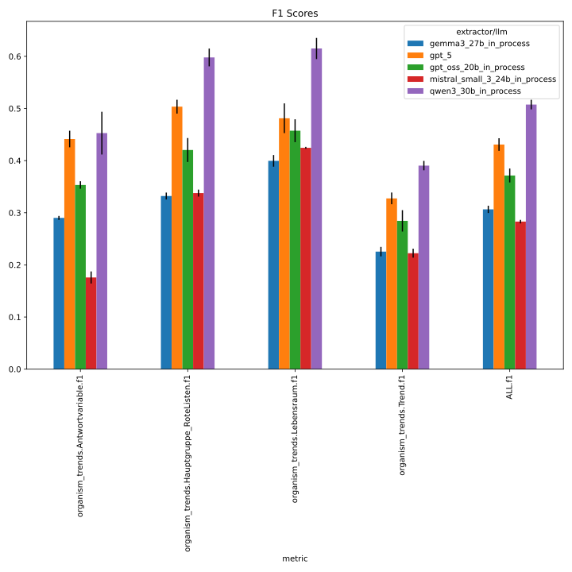
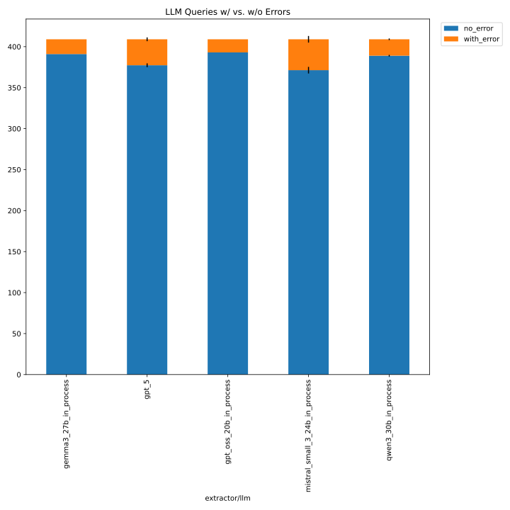
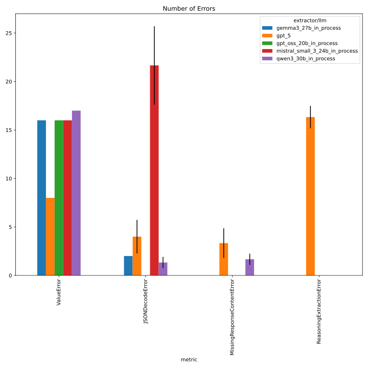
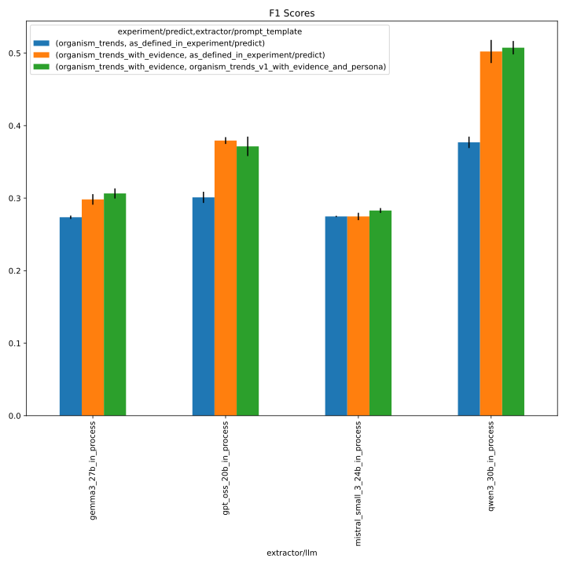
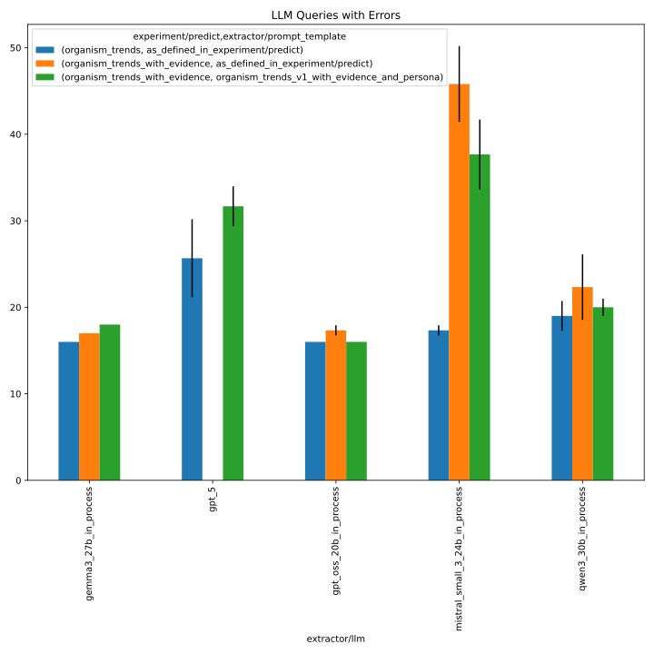
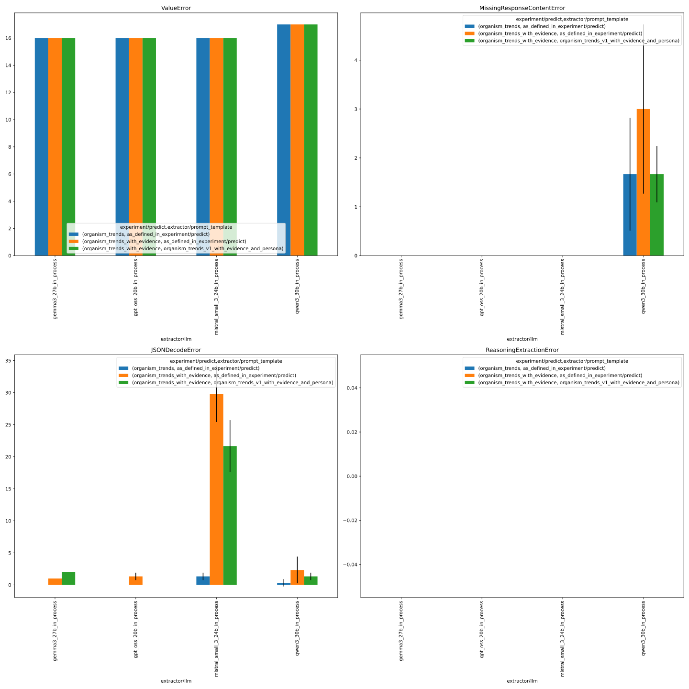

# 333_organism_trends_with_persona

This folder contains the logs of the organism trend experiments with an improved prompt template (v1),
evidence retrieval, and a persona, across the following LLMs:

- gpt_oss_20b
- gemma3_27b
- qwen3_30b
- mistral_small_3_24b
- gpt_5

See https://github.com/DFKI-NLP/kibad-llm/issues/333 and https://github.com/DFKI-NLP/kibad-llm/pull/338 for more documentation.

## Notebook Parameters

### Just this experiment

```python
NAME = "333_organism_trends_with_persona"

# used to group the data
INDEX_COLUMNS = ["prediction.overrides.extractor/llm"]
PLOT_KWARGS = {
    # can be either "metric" or one of the INDEX_COLUMNS (or multiple of them)
    "xgroup": "prediction.overrides.extractor/llm",
    # add any more arguments passed to pd.DataFrame.plot
}
```





### comparison with baseline
```python
NAME = "333_organism_trends_with_persona"
METRICS_DIR_PATTERN = [
    "evaluate/**/2026-02-02_XXX/",
    "../255_organism_trend_baseline_no_evi/evaluate/**/XXX/",
]
ERRORS_DIR_PATTERN = [
    "evaluate/**/2026-02-02_XXX/",
    "../255_organism_trend_baseline_no_evi/evaluate/**/XXX/",
]

# used to group the data
INDEX_COLUMNS = ["overrides.extractor/prompt_template", "overrides.extractor/llm"]
PLOT_KWARGS = {
    # can be either "metric" or one of the INDEX_COLUMNS (or multiple of them)
    "xgroup": "overrides.extractor/prompt_template",
    # add any more arguments passed to pd.DataFrame.plot
    "create_subplot_for_each": "metric",
    "subplot_columns": 2,
}
FILL_NA = {
    "overrides.extractor/prompt_template": "default",
    "overrides.+extractor.llm.temperature": 1.0,
}
```
IMPORTANT: Since #337, you need the following code to get the `metrics_df` and `errors_df` with this evaluation data correctly:
```python
from kibad_llm.utils.job_return import load

errors_df = (
    pd.DataFrame.from_records(
        load(
            directory=BASE_LOG_DIR / NAME,
            subdir_pattern=ERRORS_DIR_PATTERN,
            strip_id_keys=True,
            flatten=True,
            exclude_keys=EXCLUDE_KEYS,
        )
    )
    .fillna(FILL_NA)
    .fillna(0)
)
# display(errors_df)

metrics_df = pd.DataFrame.from_records(
    load(
        directory=BASE_LOG_DIR / NAME,
        subdir_pattern=METRICS_DIR_PATTERN,
        strip_id_keys=True,
        flatten=True,
        exclude_keys=EXCLUDE_KEYS,
    )
).fillna(FILL_NA)
# display(metrics_df)
```

**IMPORTANT: This requires some filtering of the data, since the other experiments contain multiple data points for llms other than gpt5.** Do this:
```python
mask = (metrics_df["overrides.extractor/llm"] == "gpt_5") | (
    metrics_df["prediction.job_return_value.branch"] != "main"
)
metrics_df = metrics_df[mask]
```
and similarly for errors_df:
```python
mask = (errors_df["overrides.extractor/llm"] == "gpt_5") | (
    errors_df["prediction.job_return_value.branch"] != "main"
)
errors_df = errors_df[mask]
```
before plotting.








## Inference
