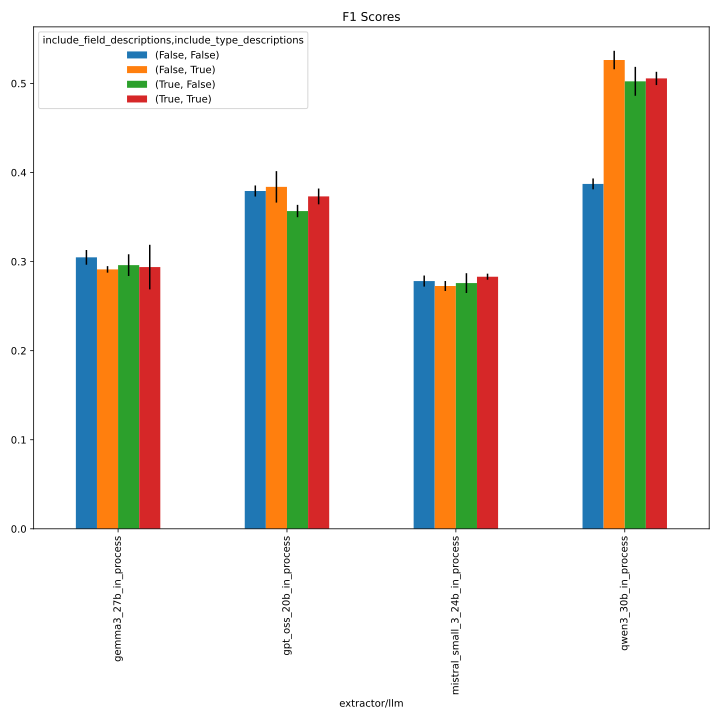
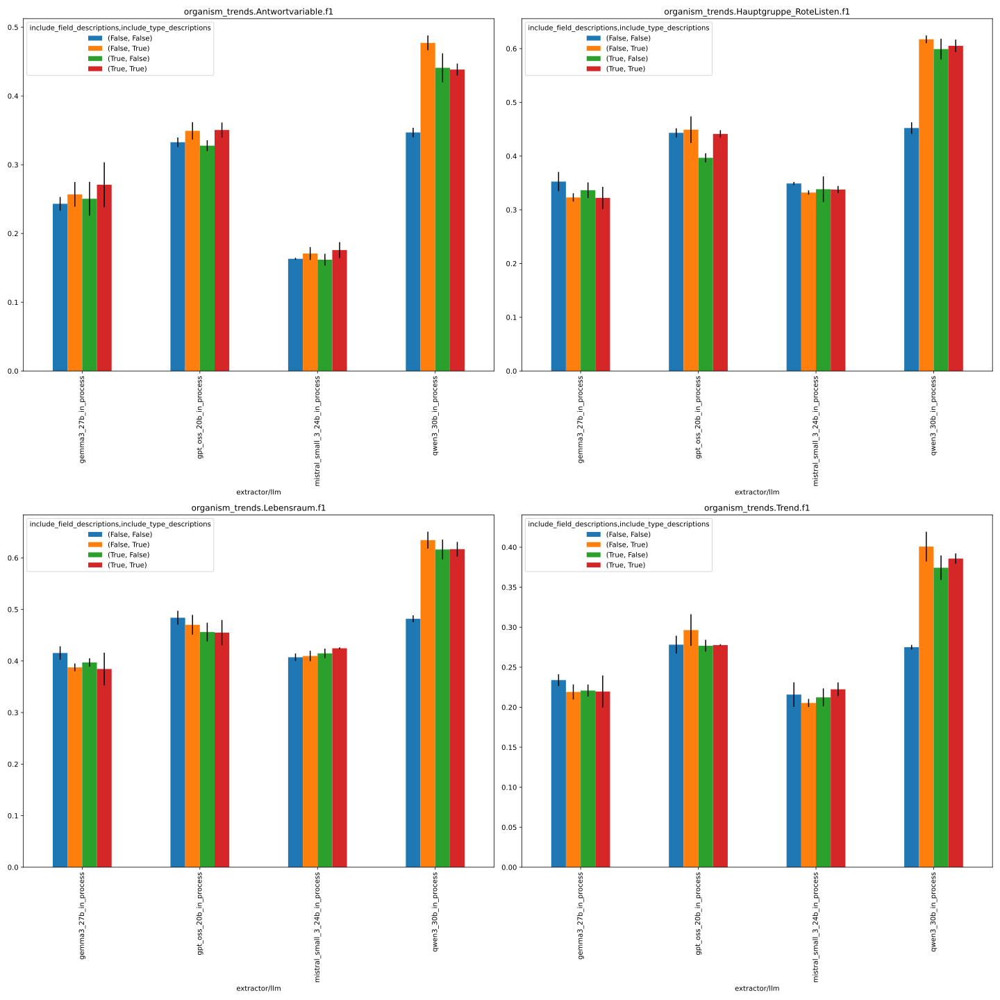
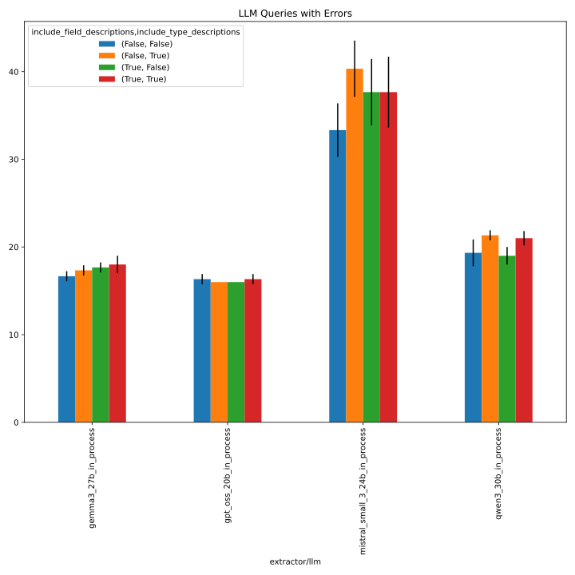
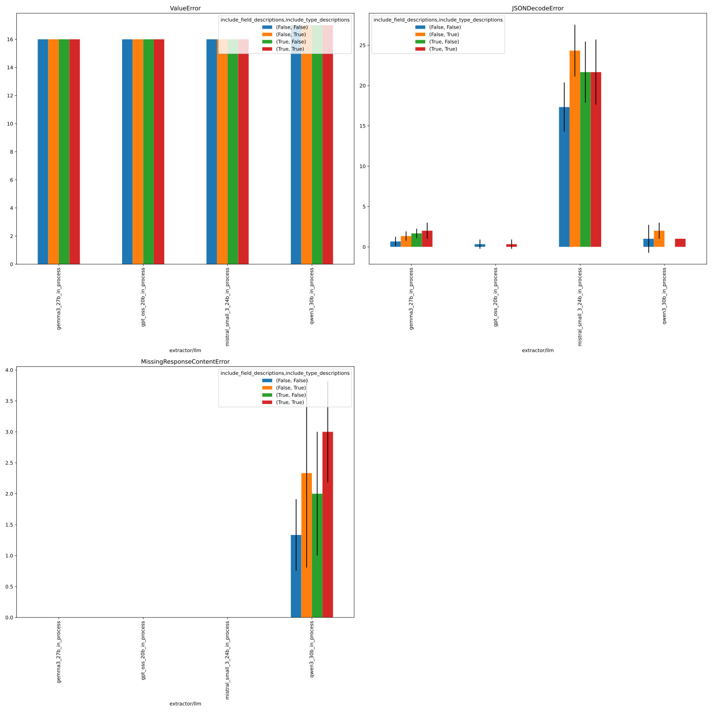

# 334_dont_include_field_and_type_descriptions

This folder contains the logs of the organism trend experiments with and without field and type
descriptions, using an improved prompt template (v1), evidence retrieval, and a persona, across the following LLMs:

- gpt_oss_20b
- gemma3_27b
- qwen3_30b
- mistral_small_3_24b

See https://github.com/DFKI-NLP/kibad-llm/issues/334 for the experiments 
and https://github.com/DFKI-NLP/kibad-llm/pull/338 for description of the varied parameters.

## Notebook parameters

```python
NAME = "334_dont_include_field_and_type_descriptions"
# used to group the data
INDEX_COLUMNS = ["prediction.overrides.extractor/llm","prediction.overrides.extractor.schema_description_kwargs.include_field_descriptions","prediction.overrides.extractor.schema_description_kwargs.include_type_descriptions"]
PLOT_KWARGS = {
    # can be either "metric" or one of the INDEX_COLUMNS (or multiple of them)
    "xgroup": ["prediction.overrides.extractor.schema_description_kwargs.include_field_descriptions","prediction.overrides.extractor.schema_description_kwargs.include_type_descriptions"],
    # add any more arguments passed to pd.DataFrame.plot
    "create_subplot_for_each": "metric",
    "subplot_columns": 2,
}
```

## Metrics



## Errors




Details below.

## Inference

Run with new set of models:

- same setup as https://github.com/DFKI-NLP/kibad-llm/issues/333
- use name= 334_dont_include_field_and_type_descriptions
- but use `+extractor.schema_description_kwargs.include_field_descriptions=false,true` and `+extractor.schema_description_kwargs.include_type_descriptions=false,true` 
- no `gpt_5` to save costs
- `-t 3-00:00:00` since the runs take quite some time (> 24 hours)

```bash
./run_in_process.sh -t 3-00:00:00 -pa "H100-SLT,H100-Trails,H100,A100-80GB" \
-u "-m kibad_llm.predict \
name=334_dont_include_field_and_type_descriptions \
experiment/predict=organism_trends_with_evidence \
extractor/prompt_template=organism_trends_v1_with_evidence_and_persona \
pdf_directory=/ds/text/kiba-d/dev-set-Wald-WVC \
+extractor.schema_description_kwargs.include_field_descriptions=false,true \
+extractor.schema_description_kwargs.include_type_descriptions=false,true \
extractor.return_reasoning=true \
extractor/llm=gpt_oss_20b_in_process,gemma3_27b_in_process,qwen3_30b_in_process,mistral_small_3_24b_in_process \
seed=42,1337,7331 \
--multirun"
```

Output folder: `logs/334_dont_
include_field_and_type_descriptions/predict/multiruns/2026-01-29_13-34-33`


Due to timeout in the last config (true, true) and with qwen3, had to restart:

```bash
./run_in_process.sh -t 3-00:00:00 -pa "H100-SLT,H100-Trails,H100,A100-80GB" -u "-m kibad_llm.predict \
name=334_dont_include_field_and_type_descriptions \
experiment/predict=organism_trends_with_evidence \
extractor/prompt_template=organism_trends_v1_with_evidence_and_persona \
pdf_directory=/ds/text/kiba-d/dev-set-Wald-WVC \
+extractor.schema_description_kwargs.include_field_descriptions=true \
+extractor.schema_description_kwargs.include_type_descriptions=true \
extractor.return_reasoning=true \
extractor/llm=qwen3_30b_in_process,mistral_small_3_24b_in_process \
seed=42,1337,7331 \
--multirun"
```

Output folder: `logs/334_dont_
include_field_and_type_descriptions/predict/multiruns/2026-02-02_16-51-12`


</details>

## Evaluate F1

```
uv run -m kibad_llm.evaluate \
name=334_dont_include_field_and_type_descriptions \
experiment/evaluate=organism_trends_f1_micro_flat \
prediction_logs=[logs/334_dont_include_field_and_type_descriptions/predict/multiruns/2026-01-29_13-34-33,logs/334_dont_include_field_and_type_descriptions/predict/multiruns/2026-02-02_16-51-12] \
+hydra.callbacks.save_job_return.multirun_markdown_group_by=[prediction.overrides.extractor/llm,prediction.overrides.extractor.schema_description_kwargs.include_field_descriptions,prediction.overrides.extractor.schema_description_kwargs.include_type_descriptions] \
--multirun
```

<details>
<summary>Log output</summary>

```
[2026-02-03 09:27:25,547][HYDRA] Saving job_return in /netscratch/hennig/code/kibad-llm/logs/334_dont_include_field_and_type_descriptions/evaluate/multiruns/2026-02-03_09-26-49/job_return_value.json                              
[2026-02-03 09:27:25,563][HYDRA] Saving job_return in /netscratch/hennig/code/kibad-llm/logs/334_dont_include_field_and_type_descriptions/evaluate/multiruns/2026-02-03_09-26-49/job_return_value.md                                  
[2026-02-03 09:27:25,685][HYDRA] Contents of /netscratch/hennig/code/kibad-llm/logs/334_dont_include_field_and_type_descriptions/evaluate/multiruns/2026-02-03_09-26-49/job_return_value.md:
``` 

| prediction.overrides.extractor/llm   | prediction.overrides.extractor.schema_description_kwargs.include_field_descriptions   | prediction.overrides.extractor.schema_description_kwargs.include_type_descriptions   |   ALL.f1.mean |   ALL.f1.std |   ALL.precision.mean |   ALL.precision.std |   ALL.recall.mean |   ALL.recall.std |   ALL.support.mean |   ALL.support.std |   AVG.f1.mean |   AVG.f1.std |   AVG.precision.mean |   AVG.precision.std |   AVG.recall.mean |   AVG.recall.std |   AVG.support.mean |   AVG.support.std |   organism_trends.Antwortvariable.f1.mean |   organism_trends.Antwortvariable.f1.std |   organism_trends.Antwortvariable.precision.mean |   organism_trends.Antwortvariable.precision.std |   organism_trends.Antwortvariable.recall.mean |   organism_trends.Antwortvariable.recall.std |   organism_trends.Antwortvariable.support.mean |   organism_trends.Antwortvariable.support.std |   organism_trends.Hauptgruppe_RoteListen.f1.mean |   organism_trends.Hauptgruppe_RoteListen.f1.std |   organism_trends.Hauptgruppe_RoteListen.precision.mean |   organism_trends.Hauptgruppe_RoteListen.precision.std |   organism_trends.Hauptgruppe_RoteListen.recall.mean |   organism_trends.Hauptgruppe_RoteListen.recall.std |   organism_trends.Hauptgruppe_RoteListen.support.mean |   organism_trends.Hauptgruppe_RoteListen.support.std |   organism_trends.Lebensraum.f1.mean |   organism_trends.Lebensraum.f1.std |   organism_trends.Lebensraum.precision.mean |   organism_trends.Lebensraum.precision.std |   organism_trends.Lebensraum.recall.mean |   organism_trends.Lebensraum.recall.std |   organism_trends.Lebensraum.support.mean |   organism_trends.Lebensraum.support.std |   organism_trends.Trend.f1.mean |   organism_trends.Trend.f1.std |   organism_trends.Trend.precision.mean |   organism_trends.Trend.precision.std |   organism_trends.Trend.recall.mean |   organism_trends.Trend.recall.std |   organism_trends.Trend.support.mean |   organism_trends.Trend.support.std |   prediction.job_return_value.time_extraction.mean |   prediction.job_return_value.time_extraction.std |   prediction.job_return_value.time_pdf_conversion.mean |   prediction.job_return_value.time_pdf_conversion.std | overrides.dataset.predictions.log                                                                                                                                                                                                                                                                                                                                                     | overrides.experiment/evaluate                                                                                                        | overrides.name                                                                                                                                                                                   | overrides.prediction_logs                                                                                                                                                                                                                                                                                                                                                                                                                                                                                                                                                                                                                                                                                                                            | prediction.job_return_value.branch                                                                                               | prediction.job_return_value.commit_hash                                                                                                                                          | prediction.job_return_value.is_dirty         | prediction.job_return_value.output_file                                                                                                                                                                                                                                                                                                                                                                                                                                                                              | prediction.job_return_value.output_file_absolute                                                                                                                                                                                                                                                                                                                                                                                                                                                                                                                                                                                                                             | prediction.overrides.experiment/predict                                                                                              | prediction.overrides.extractor.return_reasoning   | prediction.overrides.extractor/prompt_template                                                                                                                                                   | prediction.overrides.name                                                                                                                                                                        | prediction.overrides.pdf_directory                                                                                                               | prediction.overrides.seed    |
|:-------------------------------------|:--------------------------------------------------------------------------------------|:-------------------------------------------------------------------------------------|--------------:|-------------:|---------------------:|--------------------:|------------------:|-----------------:|-------------------:|------------------:|--------------:|-------------:|---------------------:|--------------------:|------------------:|-----------------:|-------------------:|------------------:|------------------------------------------:|-----------------------------------------:|-------------------------------------------------:|------------------------------------------------:|----------------------------------------------:|---------------------------------------------:|-----------------------------------------------:|----------------------------------------------:|-------------------------------------------------:|------------------------------------------------:|--------------------------------------------------------:|-------------------------------------------------------:|-----------------------------------------------------:|----------------------------------------------------:|------------------------------------------------------:|-----------------------------------------------------:|-------------------------------------:|------------------------------------:|--------------------------------------------:|-------------------------------------------:|-----------------------------------------:|----------------------------------------:|------------------------------------------:|-----------------------------------------:|--------------------------------:|-------------------------------:|---------------------------------------:|--------------------------------------:|------------------------------------:|-----------------------------------:|-------------------------------------:|------------------------------------:|---------------------------------------------------:|--------------------------------------------------:|-------------------------------------------------------:|------------------------------------------------------:|:--------------------------------------------------------------------------------------------------------------------------------------------------------------------------------------------------------------------------------------------------------------------------------------------------------------------------------------------------------------------------------------|:-------------------------------------------------------------------------------------------------------------------------------------|:-------------------------------------------------------------------------------------------------------------------------------------------------------------------------------------------------|:-----------------------------------------------------------------------------------------------------------------------------------------------------------------------------------------------------------------------------------------------------------------------------------------------------------------------------------------------------------------------------------------------------------------------------------------------------------------------------------------------------------------------------------------------------------------------------------------------------------------------------------------------------------------------------------------------------------------------------------------------------|:---------------------------------------------------------------------------------------------------------------------------------|:---------------------------------------------------------------------------------------------------------------------------------------------------------------------------------|:---------------------------------------------|:---------------------------------------------------------------------------------------------------------------------------------------------------------------------------------------------------------------------------------------------------------------------------------------------------------------------------------------------------------------------------------------------------------------------------------------------------------------------------------------------------------------------|:-----------------------------------------------------------------------------------------------------------------------------------------------------------------------------------------------------------------------------------------------------------------------------------------------------------------------------------------------------------------------------------------------------------------------------------------------------------------------------------------------------------------------------------------------------------------------------------------------------------------------------------------------------------------------------|:-------------------------------------------------------------------------------------------------------------------------------------|:--------------------------------------------------|:-------------------------------------------------------------------------------------------------------------------------------------------------------------------------------------------------|:-------------------------------------------------------------------------------------------------------------------------------------------------------------------------------------------------|:-------------------------------------------------------------------------------------------------------------------------------------------------|:-----------------------------|
| gemma3_27b_in_process                | False                                                                                 | False                                                                                |         0.305 |        0.008 |                0.205 |               0.007 |             0.596 |            0.009 |                491 |                 0 |         0.311 |        0.008 |                0.209 |               0.007 |             0.608 |            0.009 |             122.75 |                 0 |                                     0.243 |                                    0.01  |                                            0.163 |                                           0.005 |                                         0.482 |                                        0.034 |                                            132 |                                             0 |                                            0.353 |                                           0.018 |                                                   0.234 |                                                  0.014 |                                                0.719 |                                               0.02  |                                                   115 |                                                    0 |                                0.416 |                               0.013 |                                       0.284 |                                      0.01  |                                    0.778 |                                   0.021 |                                       111 |                                        0 |                           0.234 |                          0.007 |                                  0.158 |                                 0.007 |                               0.451 |                              0     |                                  133 |                                   0 |                                            3979.19 |                                           233.44  |                                                  0.005 |                                                 0     | ['logs/334_dont_include_field_and_type_descriptions/predict/multiruns/2026-01-29_13-34-33/3', 'logs/334_dont_include_field_and_type_descriptions/predict/multiruns/2026-01-29_13-34-33/4', 'logs/334_dont_include_field_and_type_descriptions/predict/multiruns/2026-01-29_13-34-33/5']                                                                                               | ['organism_trends_f1_micro_flat', 'organism_trends_f1_micro_flat', 'organism_trends_f1_micro_flat']                                  | ['334_dont_include_field_and_type_descriptions', '334_dont_include_field_and_type_descriptions', '334_dont_include_field_and_type_descriptions']                                                 | ['[logs/334_dont_include_field_and_type_descriptions/predict/multiruns/2026-01-29_13-34-33,logs/334_dont_include_field_and_type_descriptions/predict/multiruns/2026-02-02_16-51-12]', '[logs/334_dont_include_field_and_type_descriptions/predict/multiruns/2026-01-29_13-34-33,logs/334_dont_include_field_and_type_descriptions/predict/multiruns/2026-02-02_16-51-12]', '[logs/334_dont_include_field_and_type_descriptions/predict/multiruns/2026-01-29_13-34-33,logs/334_dont_include_field_and_type_descriptions/predict/multiruns/2026-02-02_16-51-12]']                                                                                                                                                                                      | ['organism-trends-with-persona', 'organism-trends-with-persona', 'organism-trends-with-persona']                                 | ['5a4e9f6557883763fb8b307c339c5a898d2b8c5b', '5a4e9f6557883763fb8b307c339c5a898d2b8c5b', '5a4e9f6557883763fb8b307c339c5a898d2b8c5b']                                             | [np.False_, np.False_, np.False_]            | ['predictions/334_dont_include_field_and_type_descriptions/2026-01-29_13-34-33/2026-01-29_16-37-13_107615/predictions.jsonl', 'predictions/334_dont_include_field_and_type_descriptions/2026-01-29_13-34-33/2026-01-29_17-46-23_234137/predictions.jsonl', 'predictions/334_dont_include_field_and_type_descriptions/2026-01-29_13-34-33/2026-01-29_18-57-40_739389/predictions.jsonl']                                                                                                                              | ['/netscratch/hennig/code/tmp/kibad-llm/predictions/334_dont_include_field_and_type_descriptions/2026-01-29_13-34-33/2026-01-29_16-37-13_107615/predictions.jsonl', '/netscratch/hennig/code/tmp/kibad-llm/predictions/334_dont_include_field_and_type_descriptions/2026-01-29_13-34-33/2026-01-29_17-46-23_234137/predictions.jsonl', '/netscratch/hennig/code/tmp/kibad-llm/predictions/334_dont_include_field_and_type_descriptions/2026-01-29_13-34-33/2026-01-29_18-57-40_739389/predictions.jsonl']                                                                                                                                                                    | ['organism_trends_with_evidence', 'organism_trends_with_evidence', 'organism_trends_with_evidence']                                  | ['True', 'True', 'True']                          | ['organism_trends_v1_with_evidence_and_persona', 'organism_trends_v1_with_evidence_and_persona', 'organism_trends_v1_with_evidence_and_persona']                                                 | ['334_dont_include_field_and_type_descriptions', '334_dont_include_field_and_type_descriptions', '334_dont_include_field_and_type_descriptions']                                                 | ['/ds/text/kiba-d/dev-set-Wald-WVC', '/ds/text/kiba-d/dev-set-Wald-WVC', '/ds/text/kiba-d/dev-set-Wald-WVC']                                     | ['42', '1337', '7331']       |
| gemma3_27b_in_process                | False                                                                                 | True                                                                                 |         0.291 |        0.004 |                0.195 |               0.002 |             0.578 |            0.032 |                491 |                 0 |         0.297 |        0.004 |                0.199 |               0.001 |             0.588 |            0.03  |             122.75 |                 0 |                                     0.257 |                                    0.018 |                                            0.173 |                                           0.009 |                                         0.5   |                                        0.059 |                                            132 |                                             0 |                                            0.323 |                                           0.008 |                                                   0.211 |                                                  0.007 |                                                0.684 |                                               0.018 |                                                   115 |                                                    0 |                                0.388 |                               0.008 |                                       0.264 |                                      0.006 |                                    0.73  |                                   0.024 |                                       111 |                                        0 |                           0.219 |                          0.009 |                                  0.146 |                                 0.005 |                               0.439 |                              0.038 |                                  133 |                                   0 |                                            4492.3  |                                           128.138 |                                                  0.009 |                                                 0.004 | ['logs/334_dont_include_field_and_type_descriptions/predict/multiruns/2026-01-29_13-34-33/15', 'logs/334_dont_include_field_and_type_descriptions/predict/multiruns/2026-01-29_13-34-33/16', 'logs/334_dont_include_field_and_type_descriptions/predict/multiruns/2026-01-29_13-34-33/17']                                                                                            | ['organism_trends_f1_micro_flat', 'organism_trends_f1_micro_flat', 'organism_trends_f1_micro_flat']                                  | ['334_dont_include_field_and_type_descriptions', '334_dont_include_field_and_type_descriptions', '334_dont_include_field_and_type_descriptions']                                                 | ['[logs/334_dont_include_field_and_type_descriptions/predict/multiruns/2026-01-29_13-34-33,logs/334_dont_include_field_and_type_descriptions/predict/multiruns/2026-02-02_16-51-12]', '[logs/334_dont_include_field_and_type_descriptions/predict/multiruns/2026-01-29_13-34-33,logs/334_dont_include_field_and_type_descriptions/predict/multiruns/2026-02-02_16-51-12]', '[logs/334_dont_include_field_and_type_descriptions/predict/multiruns/2026-01-29_13-34-33,logs/334_dont_include_field_and_type_descriptions/predict/multiruns/2026-02-02_16-51-12]']                                                                                                                                                                                      | ['organism-trends-with-persona', 'organism-trends-with-persona', 'organism-trends-with-persona']                                 | ['5a4e9f6557883763fb8b307c339c5a898d2b8c5b', '5a4e9f6557883763fb8b307c339c5a898d2b8c5b', '5a4e9f6557883763fb8b307c339c5a898d2b8c5b']                                             | [np.False_, np.False_, np.False_]            | ['predictions/334_dont_include_field_and_type_descriptions/2026-01-29_13-34-33/2026-01-30_12-02-08_608250/predictions.jsonl', 'predictions/334_dont_include_field_and_type_descriptions/2026-01-29_13-34-33/2026-01-30_13-19-57_551391/predictions.jsonl', 'predictions/334_dont_include_field_and_type_descriptions/2026-01-29_13-34-33/2026-01-30_14-33-56_223205/predictions.jsonl']                                                                                                                              | ['/netscratch/hennig/code/tmp/kibad-llm/predictions/334_dont_include_field_and_type_descriptions/2026-01-29_13-34-33/2026-01-30_12-02-08_608250/predictions.jsonl', '/netscratch/hennig/code/tmp/kibad-llm/predictions/334_dont_include_field_and_type_descriptions/2026-01-29_13-34-33/2026-01-30_13-19-57_551391/predictions.jsonl', '/netscratch/hennig/code/tmp/kibad-llm/predictions/334_dont_include_field_and_type_descriptions/2026-01-29_13-34-33/2026-01-30_14-33-56_223205/predictions.jsonl']                                                                                                                                                                    | ['organism_trends_with_evidence', 'organism_trends_with_evidence', 'organism_trends_with_evidence']                                  | ['True', 'True', 'True']                          | ['organism_trends_v1_with_evidence_and_persona', 'organism_trends_v1_with_evidence_and_persona', 'organism_trends_v1_with_evidence_and_persona']                                                 | ['334_dont_include_field_and_type_descriptions', '334_dont_include_field_and_type_descriptions', '334_dont_include_field_and_type_descriptions']                                                 | ['/ds/text/kiba-d/dev-set-Wald-WVC', '/ds/text/kiba-d/dev-set-Wald-WVC', '/ds/text/kiba-d/dev-set-Wald-WVC']                                     | ['42', '1337', '7331']       |
| gemma3_27b_in_process                | True                                                                                  | False                                                                                |         0.296 |        0.012 |                0.2   |               0.009 |             0.568 |            0.02  |                491 |                 0 |         0.301 |        0.012 |                0.204 |               0.008 |             0.579 |            0.019 |             122.75 |                 0 |                                     0.25  |                                    0.025 |                                            0.171 |                                           0.017 |                                         0.465 |                                        0.042 |                                            132 |                                             0 |                                            0.336 |                                           0.014 |                                                   0.222 |                                                  0.01  |                                                0.696 |                                               0.026 |                                                   115 |                                                    0 |                                0.397 |                               0.008 |                                       0.272 |                                      0.007 |                                    0.733 |                                   0.01  |                                       111 |                                        0 |                           0.221 |                          0.007 |                                  0.149 |                                 0.006 |                               0.424 |                              0.009 |                                  133 |                                   0 |                                            4318.56 |                                           193.644 |                                                  0.005 |                                                 0     | ['logs/334_dont_include_field_and_type_descriptions/predict/multiruns/2026-01-29_13-34-33/27', 'logs/334_dont_include_field_and_type_descriptions/predict/multiruns/2026-01-29_13-34-33/28', 'logs/334_dont_include_field_and_type_descriptions/predict/multiruns/2026-01-29_13-34-33/29']                                                                                            | ['organism_trends_f1_micro_flat', 'organism_trends_f1_micro_flat', 'organism_trends_f1_micro_flat']                                  | ['334_dont_include_field_and_type_descriptions', '334_dont_include_field_and_type_descriptions', '334_dont_include_field_and_type_descriptions']                                                 | ['[logs/334_dont_include_field_and_type_descriptions/predict/multiruns/2026-01-29_13-34-33,logs/334_dont_include_field_and_type_descriptions/predict/multiruns/2026-02-02_16-51-12]', '[logs/334_dont_include_field_and_type_descriptions/predict/multiruns/2026-01-29_13-34-33,logs/334_dont_include_field_and_type_descriptions/predict/multiruns/2026-02-02_16-51-12]', '[logs/334_dont_include_field_and_type_descriptions/predict/multiruns/2026-01-29_13-34-33,logs/334_dont_include_field_and_type_descriptions/predict/multiruns/2026-02-02_16-51-12]']                                                                                                                                                                                      | ['organism-trends-with-persona', 'organism-trends-with-persona', 'organism-trends-with-persona']                                 | ['5a4e9f6557883763fb8b307c339c5a898d2b8c5b', '5a4e9f6557883763fb8b307c339c5a898d2b8c5b', '5a4e9f6557883763fb8b307c339c5a898d2b8c5b']                                             | [np.False_, np.False_, np.False_]            | ['predictions/334_dont_include_field_and_type_descriptions/2026-01-29_13-34-33/2026-01-31_09-57-57_713374/predictions.jsonl', 'predictions/334_dont_include_field_and_type_descriptions/2026-01-29_13-34-33/2026-01-31_11-13-04_654119/predictions.jsonl', 'predictions/334_dont_include_field_and_type_descriptions/2026-01-29_13-34-33/2026-01-31_12-23-07_257263/predictions.jsonl']                                                                                                                              | ['/netscratch/hennig/code/tmp/kibad-llm/predictions/334_dont_include_field_and_type_descriptions/2026-01-29_13-34-33/2026-01-31_09-57-57_713374/predictions.jsonl', '/netscratch/hennig/code/tmp/kibad-llm/predictions/334_dont_include_field_and_type_descriptions/2026-01-29_13-34-33/2026-01-31_11-13-04_654119/predictions.jsonl', '/netscratch/hennig/code/tmp/kibad-llm/predictions/334_dont_include_field_and_type_descriptions/2026-01-29_13-34-33/2026-01-31_12-23-07_257263/predictions.jsonl']                                                                                                                                                                    | ['organism_trends_with_evidence', 'organism_trends_with_evidence', 'organism_trends_with_evidence']                                  | ['True', 'True', 'True']                          | ['organism_trends_v1_with_evidence_and_persona', 'organism_trends_v1_with_evidence_and_persona', 'organism_trends_v1_with_evidence_and_persona']                                                 | ['334_dont_include_field_and_type_descriptions', '334_dont_include_field_and_type_descriptions', '334_dont_include_field_and_type_descriptions']                                                 | ['/ds/text/kiba-d/dev-set-Wald-WVC', '/ds/text/kiba-d/dev-set-Wald-WVC', '/ds/text/kiba-d/dev-set-Wald-WVC']                                     | ['42', '1337', '7331']       |
| gemma3_27b_in_process                | True                                                                                  | True                                                                                 |         0.294 |        0.025 |                0.196 |               0.016 |             0.586 |            0.059 |                491 |                 0 |         0.299 |        0.025 |                0.2   |               0.016 |             0.595 |            0.059 |             122.75 |                 0 |                                     0.271 |                                    0.033 |                                            0.184 |                                           0.021 |                                         0.515 |                                        0.072 |                                            132 |                                             0 |                                            0.322 |                                           0.021 |                                                   0.21  |                                                  0.013 |                                                0.693 |                                               0.058 |                                                   115 |                                                    0 |                                0.384 |                               0.032 |                                       0.262 |                                      0.021 |                                    0.724 |                                   0.068 |                                       111 |                                        0 |                           0.22  |                          0.02  |                                  0.145 |                                 0.013 |                               0.449 |                              0.043 |                                  133 |                                   0 |                                            4736.47 |                                           165.593 |                                                  0.006 |                                                 0.002 | ['logs/334_dont_include_field_and_type_descriptions/predict/multiruns/2026-01-29_13-34-33/39', 'logs/334_dont_include_field_and_type_descriptions/predict/multiruns/2026-01-29_13-34-33/40', 'logs/334_dont_include_field_and_type_descriptions/predict/multiruns/2026-01-29_13-34-33/41']                                                                                            | ['organism_trends_f1_micro_flat', 'organism_trends_f1_micro_flat', 'organism_trends_f1_micro_flat']                                  | ['334_dont_include_field_and_type_descriptions', '334_dont_include_field_and_type_descriptions', '334_dont_include_field_and_type_descriptions']                                                 | ['[logs/334_dont_include_field_and_type_descriptions/predict/multiruns/2026-01-29_13-34-33,logs/334_dont_include_field_and_type_descriptions/predict/multiruns/2026-02-02_16-51-12]', '[logs/334_dont_include_field_and_type_descriptions/predict/multiruns/2026-01-29_13-34-33,logs/334_dont_include_field_and_type_descriptions/predict/multiruns/2026-02-02_16-51-12]', '[logs/334_dont_include_field_and_type_descriptions/predict/multiruns/2026-01-29_13-34-33,logs/334_dont_include_field_and_type_descriptions/predict/multiruns/2026-02-02_16-51-12]']                                                                                                                                                                                      | ['organism-trends-with-persona', 'organism-trends-with-persona', 'organism-trends-with-persona']                                 | ['5a4e9f6557883763fb8b307c339c5a898d2b8c5b', '5a4e9f6557883763fb8b307c339c5a898d2b8c5b', '5a4e9f6557883763fb8b307c339c5a898d2b8c5b']                                             | [np.False_, np.False_, np.False_]            | ['predictions/334_dont_include_field_and_type_descriptions/2026-01-29_13-34-33/2026-02-01_06-47-30_321516/predictions.jsonl', 'predictions/334_dont_include_field_and_type_descriptions/2026-01-29_13-34-33/2026-02-01_08-11-11_766045/predictions.jsonl', 'predictions/334_dont_include_field_and_type_descriptions/2026-01-29_13-34-33/2026-02-01_09-30-30_178443/predictions.jsonl']                                                                                                                              | ['/netscratch/hennig/code/tmp/kibad-llm/predictions/334_dont_include_field_and_type_descriptions/2026-01-29_13-34-33/2026-02-01_06-47-30_321516/predictions.jsonl', '/netscratch/hennig/code/tmp/kibad-llm/predictions/334_dont_include_field_and_type_descriptions/2026-01-29_13-34-33/2026-02-01_08-11-11_766045/predictions.jsonl', '/netscratch/hennig/code/tmp/kibad-llm/predictions/334_dont_include_field_and_type_descriptions/2026-01-29_13-34-33/2026-02-01_09-30-30_178443/predictions.jsonl']                                                                                                                                                                    | ['organism_trends_with_evidence', 'organism_trends_with_evidence', 'organism_trends_with_evidence']                                  | ['True', 'True', 'True']                          | ['organism_trends_v1_with_evidence_and_persona', 'organism_trends_v1_with_evidence_and_persona', 'organism_trends_v1_with_evidence_and_persona']                                                 | ['334_dont_include_field_and_type_descriptions', '334_dont_include_field_and_type_descriptions', '334_dont_include_field_and_type_descriptions']                                                 | ['/ds/text/kiba-d/dev-set-Wald-WVC', '/ds/text/kiba-d/dev-set-Wald-WVC', '/ds/text/kiba-d/dev-set-Wald-WVC']                                     | ['42', '1337', '7331']       |
| gpt_oss_20b_in_process               | False                                                                                 | False                                                                                |         0.379 |        0.006 |                0.272 |               0.006 |             0.626 |            0.005 |                491 |                 0 |         0.384 |        0.006 |                0.276 |               0.006 |             0.638 |            0.005 |             122.75 |                 0 |                                     0.333 |                                    0.007 |                                            0.247 |                                           0.004 |                                         0.51  |                                        0.019 |                                            132 |                                             0 |                                            0.443 |                                           0.008 |                                                   0.311 |                                                  0.008 |                                                0.768 |                                               0.005 |                                                   115 |                                                    0 |                                0.484 |                               0.013 |                                       0.346 |                                      0.011 |                                    0.805 |                                   0.014 |                                       111 |                                        0 |                           0.278 |                          0.011 |                                  0.198 |                                 0.009 |                               0.469 |                              0.011 |                                  133 |                                   0 |                                            3561.8  |                                            73.363 |                                                  0.006 |                                                 0.001 | ['logs/334_dont_include_field_and_type_descriptions/predict/multiruns/2026-01-29_13-34-33/0', 'logs/334_dont_include_field_and_type_descriptions/predict/multiruns/2026-01-29_13-34-33/1', 'logs/334_dont_include_field_and_type_descriptions/predict/multiruns/2026-01-29_13-34-33/2']                                                                                               | ['organism_trends_f1_micro_flat', 'organism_trends_f1_micro_flat', 'organism_trends_f1_micro_flat']                                  | ['334_dont_include_field_and_type_descriptions', '334_dont_include_field_and_type_descriptions', '334_dont_include_field_and_type_descriptions']                                                 | ['[logs/334_dont_include_field_and_type_descriptions/predict/multiruns/2026-01-29_13-34-33,logs/334_dont_include_field_and_type_descriptions/predict/multiruns/2026-02-02_16-51-12]', '[logs/334_dont_include_field_and_type_descriptions/predict/multiruns/2026-01-29_13-34-33,logs/334_dont_include_field_and_type_descriptions/predict/multiruns/2026-02-02_16-51-12]', '[logs/334_dont_include_field_and_type_descriptions/predict/multiruns/2026-01-29_13-34-33,logs/334_dont_include_field_and_type_descriptions/predict/multiruns/2026-02-02_16-51-12]']                                                                                                                                                                                      | ['organism-trends-with-persona', 'organism-trends-with-persona', 'organism-trends-with-persona']                                 | ['5a4e9f6557883763fb8b307c339c5a898d2b8c5b', '5a4e9f6557883763fb8b307c339c5a898d2b8c5b', '5a4e9f6557883763fb8b307c339c5a898d2b8c5b']                                             | [np.False_, np.False_, np.False_]            | ['predictions/334_dont_include_field_and_type_descriptions/2026-01-29_13-34-33/2026-01-29_13-34-39_793972/predictions.jsonl', 'predictions/334_dont_include_field_and_type_descriptions/2026-01-29_13-34-33/2026-01-29_14-36-30_406141/predictions.jsonl', 'predictions/334_dont_include_field_and_type_descriptions/2026-01-29_13-34-33/2026-01-29_15-35-38_307292/predictions.jsonl']                                                                                                                              | ['/netscratch/hennig/code/tmp/kibad-llm/predictions/334_dont_include_field_and_type_descriptions/2026-01-29_13-34-33/2026-01-29_13-34-39_793972/predictions.jsonl', '/netscratch/hennig/code/tmp/kibad-llm/predictions/334_dont_include_field_and_type_descriptions/2026-01-29_13-34-33/2026-01-29_14-36-30_406141/predictions.jsonl', '/netscratch/hennig/code/tmp/kibad-llm/predictions/334_dont_include_field_and_type_descriptions/2026-01-29_13-34-33/2026-01-29_15-35-38_307292/predictions.jsonl']                                                                                                                                                                    | ['organism_trends_with_evidence', 'organism_trends_with_evidence', 'organism_trends_with_evidence']                                  | ['True', 'True', 'True']                          | ['organism_trends_v1_with_evidence_and_persona', 'organism_trends_v1_with_evidence_and_persona', 'organism_trends_v1_with_evidence_and_persona']                                                 | ['334_dont_include_field_and_type_descriptions', '334_dont_include_field_and_type_descriptions', '334_dont_include_field_and_type_descriptions']                                                 | ['/ds/text/kiba-d/dev-set-Wald-WVC', '/ds/text/kiba-d/dev-set-Wald-WVC', '/ds/text/kiba-d/dev-set-Wald-WVC']                                     | ['42', '1337', '7331']       |
| gpt_oss_20b_in_process               | False                                                                                 | True                                                                                 |         0.384 |        0.018 |                0.276 |               0.012 |             0.629 |            0.033 |                491 |                 0 |         0.391 |        0.018 |                0.283 |               0.013 |             0.637 |            0.033 |             122.75 |                 0 |                                     0.349 |                                    0.013 |                                            0.261 |                                           0.01  |                                         0.528 |                                        0.016 |                                            132 |                                             0 |                                            0.449 |                                           0.025 |                                                   0.324 |                                                  0.017 |                                                0.73  |                                               0.046 |                                                   115 |                                                    0 |                                0.47  |                               0.019 |                                       0.34  |                                      0.014 |                                    0.76  |                                   0.034 |                                       111 |                                        0 |                           0.296 |                          0.02  |                                  0.206 |                                 0.012 |                               0.531 |                              0.049 |                                  133 |                                   0 |                                            3762.25 |                                            77.191 |                                                  0.005 |                                                 0     | ['logs/334_dont_include_field_and_type_descriptions/predict/multiruns/2026-01-29_13-34-33/12', 'logs/334_dont_include_field_and_type_descriptions/predict/multiruns/2026-01-29_13-34-33/13', 'logs/334_dont_include_field_and_type_descriptions/predict/multiruns/2026-01-29_13-34-33/14']                                                                                            | ['organism_trends_f1_micro_flat', 'organism_trends_f1_micro_flat', 'organism_trends_f1_micro_flat']                                  | ['334_dont_include_field_and_type_descriptions', '334_dont_include_field_and_type_descriptions', '334_dont_include_field_and_type_descriptions']                                                 | ['[logs/334_dont_include_field_and_type_descriptions/predict/multiruns/2026-01-29_13-34-33,logs/334_dont_include_field_and_type_descriptions/predict/multiruns/2026-02-02_16-51-12]', '[logs/334_dont_include_field_and_type_descriptions/predict/multiruns/2026-01-29_13-34-33,logs/334_dont_include_field_and_type_descriptions/predict/multiruns/2026-02-02_16-51-12]', '[logs/334_dont_include_field_and_type_descriptions/predict/multiruns/2026-01-29_13-34-33,logs/334_dont_include_field_and_type_descriptions/predict/multiruns/2026-02-02_16-51-12]']                                                                                                                                                                                      | ['organism-trends-with-persona', 'organism-trends-with-persona', 'organism-trends-with-persona']                                 | ['5a4e9f6557883763fb8b307c339c5a898d2b8c5b', '5a4e9f6557883763fb8b307c339c5a898d2b8c5b', '5a4e9f6557883763fb8b307c339c5a898d2b8c5b']                                             | [np.False_, np.False_, np.False_]            | ['predictions/334_dont_include_field_and_type_descriptions/2026-01-29_13-34-33/2026-01-30_08-50-58_404322/predictions.jsonl', 'predictions/334_dont_include_field_and_type_descriptions/2026-01-29_13-34-33/2026-01-30_09-55-15_996033/predictions.jsonl', 'predictions/334_dont_include_field_and_type_descriptions/2026-01-29_13-34-33/2026-01-30_10-59-54_997777/predictions.jsonl']                                                                                                                              | ['/netscratch/hennig/code/tmp/kibad-llm/predictions/334_dont_include_field_and_type_descriptions/2026-01-29_13-34-33/2026-01-30_08-50-58_404322/predictions.jsonl', '/netscratch/hennig/code/tmp/kibad-llm/predictions/334_dont_include_field_and_type_descriptions/2026-01-29_13-34-33/2026-01-30_09-55-15_996033/predictions.jsonl', '/netscratch/hennig/code/tmp/kibad-llm/predictions/334_dont_include_field_and_type_descriptions/2026-01-29_13-34-33/2026-01-30_10-59-54_997777/predictions.jsonl']                                                                                                                                                                    | ['organism_trends_with_evidence', 'organism_trends_with_evidence', 'organism_trends_with_evidence']                                  | ['True', 'True', 'True']                          | ['organism_trends_v1_with_evidence_and_persona', 'organism_trends_v1_with_evidence_and_persona', 'organism_trends_v1_with_evidence_and_persona']                                                 | ['334_dont_include_field_and_type_descriptions', '334_dont_include_field_and_type_descriptions', '334_dont_include_field_and_type_descriptions']                                                 | ['/ds/text/kiba-d/dev-set-Wald-WVC', '/ds/text/kiba-d/dev-set-Wald-WVC', '/ds/text/kiba-d/dev-set-Wald-WVC']                                     | ['42', '1337', '7331']       |
| gpt_oss_20b_in_process               | True                                                                                  | False                                                                                |         0.357 |        0.007 |                0.248 |               0.005 |             0.637 |            0.009 |                491 |                 0 |         0.364 |        0.008 |                0.254 |               0.006 |             0.646 |            0.01  |             122.75 |                 0 |                                     0.328 |                                    0.008 |                                            0.236 |                                           0.006 |                                         0.538 |                                        0.013 |                                            132 |                                             0 |                                            0.397 |                                           0.008 |                                                   0.276 |                                                  0.006 |                                                0.704 |                                               0.017 |                                                   115 |                                                    0 |                                0.456 |                               0.018 |                                       0.32  |                                      0.015 |                                    0.793 |                                   0.018 |                                       111 |                                        0 |                           0.277 |                          0.007 |                                  0.185 |                                 0.005 |                               0.549 |                              0.015 |                                  133 |                                   0 |                                            4257.05 |                                            33.851 |                                                  0.007 |                                                 0.002 | ['logs/334_dont_include_field_and_type_descriptions/predict/multiruns/2026-01-29_13-34-33/24', 'logs/334_dont_include_field_and_type_descriptions/predict/multiruns/2026-01-29_13-34-33/25', 'logs/334_dont_include_field_and_type_descriptions/predict/multiruns/2026-01-29_13-34-33/26']                                                                                            | ['organism_trends_f1_micro_flat', 'organism_trends_f1_micro_flat', 'organism_trends_f1_micro_flat']                                  | ['334_dont_include_field_and_type_descriptions', '334_dont_include_field_and_type_descriptions', '334_dont_include_field_and_type_descriptions']                                                 | ['[logs/334_dont_include_field_and_type_descriptions/predict/multiruns/2026-01-29_13-34-33,logs/334_dont_include_field_and_type_descriptions/predict/multiruns/2026-02-02_16-51-12]', '[logs/334_dont_include_field_and_type_descriptions/predict/multiruns/2026-01-29_13-34-33,logs/334_dont_include_field_and_type_descriptions/predict/multiruns/2026-02-02_16-51-12]', '[logs/334_dont_include_field_and_type_descriptions/predict/multiruns/2026-01-29_13-34-33,logs/334_dont_include_field_and_type_descriptions/predict/multiruns/2026-02-02_16-51-12]']                                                                                                                                                                                      | ['organism-trends-with-persona', 'organism-trends-with-persona', 'organism-trends-with-persona']                                 | ['5a4e9f6557883763fb8b307c339c5a898d2b8c5b', '5a4e9f6557883763fb8b307c339c5a898d2b8c5b', '5a4e9f6557883763fb8b307c339c5a898d2b8c5b']                                             | [np.False_, np.False_, np.False_]            | ['predictions/334_dont_include_field_and_type_descriptions/2026-01-29_13-34-33/2026-01-31_06-21-50_357703/predictions.jsonl', 'predictions/334_dont_include_field_and_type_descriptions/2026-01-29_13-34-33/2026-01-31_07-34-46_700594/predictions.jsonl', 'predictions/334_dont_include_field_and_type_descriptions/2026-01-29_13-34-33/2026-01-31_08-46-12_614750/predictions.jsonl']                                                                                                                              | ['/netscratch/hennig/code/tmp/kibad-llm/predictions/334_dont_include_field_and_type_descriptions/2026-01-29_13-34-33/2026-01-31_06-21-50_357703/predictions.jsonl', '/netscratch/hennig/code/tmp/kibad-llm/predictions/334_dont_include_field_and_type_descriptions/2026-01-29_13-34-33/2026-01-31_07-34-46_700594/predictions.jsonl', '/netscratch/hennig/code/tmp/kibad-llm/predictions/334_dont_include_field_and_type_descriptions/2026-01-29_13-34-33/2026-01-31_08-46-12_614750/predictions.jsonl']                                                                                                                                                                    | ['organism_trends_with_evidence', 'organism_trends_with_evidence', 'organism_trends_with_evidence']                                  | ['True', 'True', 'True']                          | ['organism_trends_v1_with_evidence_and_persona', 'organism_trends_v1_with_evidence_and_persona', 'organism_trends_v1_with_evidence_and_persona']                                                 | ['334_dont_include_field_and_type_descriptions', '334_dont_include_field_and_type_descriptions', '334_dont_include_field_and_type_descriptions']                                                 | ['/ds/text/kiba-d/dev-set-Wald-WVC', '/ds/text/kiba-d/dev-set-Wald-WVC', '/ds/text/kiba-d/dev-set-Wald-WVC']                                     | ['42', '1337', '7331']       |
| gpt_oss_20b_in_process               | True                                                                                  | True                                                                                 |         0.373 |        0.009 |                0.264 |               0.01  |             0.637 |            0.006 |                491 |                 0 |         0.381 |        0.01  |                0.271 |               0.01  |             0.646 |            0.006 |             122.75 |                 0 |                                     0.35  |                                    0.011 |                                            0.256 |                                           0.01  |                                         0.556 |                                        0.009 |                                            132 |                                             0 |                                            0.441 |                                           0.007 |                                                   0.314 |                                                  0.009 |                                                0.742 |                                               0.01  |                                                   115 |                                                    0 |                                0.455 |                               0.025 |                                       0.324 |                                      0.021 |                                    0.766 |                                   0.024 |                                       111 |                                        0 |                           0.278 |                          0.001 |                                  0.19  |                                 0.003 |                               0.519 |                              0.02  |                                  133 |                                   0 |                                            4270.15 |                                           116.273 |                                                  0.005 |                                                 0     | ['logs/334_dont_include_field_and_type_descriptions/predict/multiruns/2026-01-29_13-34-33/36', 'logs/334_dont_include_field_and_type_descriptions/predict/multiruns/2026-01-29_13-34-33/37', 'logs/334_dont_include_field_and_type_descriptions/predict/multiruns/2026-01-29_13-34-33/38']                                                                                            | ['organism_trends_f1_micro_flat', 'organism_trends_f1_micro_flat', 'organism_trends_f1_micro_flat']                                  | ['334_dont_include_field_and_type_descriptions', '334_dont_include_field_and_type_descriptions', '334_dont_include_field_and_type_descriptions']                                                 | ['[logs/334_dont_include_field_and_type_descriptions/predict/multiruns/2026-01-29_13-34-33,logs/334_dont_include_field_and_type_descriptions/predict/multiruns/2026-02-02_16-51-12]', '[logs/334_dont_include_field_and_type_descriptions/predict/multiruns/2026-01-29_13-34-33,logs/334_dont_include_field_and_type_descriptions/predict/multiruns/2026-02-02_16-51-12]', '[logs/334_dont_include_field_and_type_descriptions/predict/multiruns/2026-01-29_13-34-33,logs/334_dont_include_field_and_type_descriptions/predict/multiruns/2026-02-02_16-51-12]']                                                                                                                                                                                      | ['organism-trends-with-persona', 'organism-trends-with-persona', 'organism-trends-with-persona']                                 | ['5a4e9f6557883763fb8b307c339c5a898d2b8c5b', '5a4e9f6557883763fb8b307c339c5a898d2b8c5b', '5a4e9f6557883763fb8b307c339c5a898d2b8c5b']                                             | [np.False_, np.False_, np.False_]            | ['predictions/334_dont_include_field_and_type_descriptions/2026-01-29_13-34-33/2026-02-01_03-10-33_466040/predictions.jsonl', 'predictions/334_dont_include_field_and_type_descriptions/2026-01-29_13-34-33/2026-02-01_04-21-50_145685/predictions.jsonl', 'predictions/334_dont_include_field_and_type_descriptions/2026-01-29_13-34-33/2026-02-01_05-36-19_842516/predictions.jsonl']                                                                                                                              | ['/netscratch/hennig/code/tmp/kibad-llm/predictions/334_dont_include_field_and_type_descriptions/2026-01-29_13-34-33/2026-02-01_03-10-33_466040/predictions.jsonl', '/netscratch/hennig/code/tmp/kibad-llm/predictions/334_dont_include_field_and_type_descriptions/2026-01-29_13-34-33/2026-02-01_04-21-50_145685/predictions.jsonl', '/netscratch/hennig/code/tmp/kibad-llm/predictions/334_dont_include_field_and_type_descriptions/2026-01-29_13-34-33/2026-02-01_05-36-19_842516/predictions.jsonl']                                                                                                                                                                    | ['organism_trends_with_evidence', 'organism_trends_with_evidence', 'organism_trends_with_evidence']                                  | ['True', 'True', 'True']                          | ['organism_trends_v1_with_evidence_and_persona', 'organism_trends_v1_with_evidence_and_persona', 'organism_trends_v1_with_evidence_and_persona']                                                 | ['334_dont_include_field_and_type_descriptions', '334_dont_include_field_and_type_descriptions', '334_dont_include_field_and_type_descriptions']                                                 | ['/ds/text/kiba-d/dev-set-Wald-WVC', '/ds/text/kiba-d/dev-set-Wald-WVC', '/ds/text/kiba-d/dev-set-Wald-WVC']                                     | ['42', '1337', '7331']       |
| mistral_small_3_24b_in_process       | False                                                                                 | False                                                                                |         0.278 |        0.006 |                0.183 |               0.004 |             0.583 |            0.017 |                491 |                 0 |         0.284 |        0.006 |                0.186 |               0.004 |             0.6   |            0.017 |             122.75 |                 0 |                                     0.163 |                                    0.001 |                                            0.109 |                                           0.001 |                                         0.321 |                                        0.004 |                                            132 |                                             0 |                                            0.349 |                                           0.003 |                                                   0.226 |                                                  0.001 |                                                0.762 |                                               0.013 |                                                   115 |                                                    0 |                                0.407 |                               0.007 |                                       0.268 |                                      0.005 |                                    0.85  |                                   0.019 |                                       111 |                                        0 |                           0.216 |                          0.015 |                                  0.14  |                                 0.009 |                               0.466 |                              0.04  |                                  133 |                                   0 |                                            7018.23 |                                           508.585 |                                                  0.006 |                                                 0.001 | ['logs/334_dont_include_field_and_type_descriptions/predict/multiruns/2026-01-29_13-34-33/10', 'logs/334_dont_include_field_and_type_descriptions/predict/multiruns/2026-01-29_13-34-33/11', 'logs/334_dont_include_field_and_type_descriptions/predict/multiruns/2026-01-29_13-34-33/9']                                                                                             | ['organism_trends_f1_micro_flat', 'organism_trends_f1_micro_flat', 'organism_trends_f1_micro_flat']                                  | ['334_dont_include_field_and_type_descriptions', '334_dont_include_field_and_type_descriptions', '334_dont_include_field_and_type_descriptions']                                                 | ['[logs/334_dont_include_field_and_type_descriptions/predict/multiruns/2026-01-29_13-34-33,logs/334_dont_include_field_and_type_descriptions/predict/multiruns/2026-02-02_16-51-12]', '[logs/334_dont_include_field_and_type_descriptions/predict/multiruns/2026-01-29_13-34-33,logs/334_dont_include_field_and_type_descriptions/predict/multiruns/2026-02-02_16-51-12]', '[logs/334_dont_include_field_and_type_descriptions/predict/multiruns/2026-01-29_13-34-33,logs/334_dont_include_field_and_type_descriptions/predict/multiruns/2026-02-02_16-51-12]']                                                                                                                                                                                      | ['organism-trends-with-persona', 'organism-trends-with-persona', 'organism-trends-with-persona']                                 | ['5a4e9f6557883763fb8b307c339c5a898d2b8c5b', '5a4e9f6557883763fb8b307c339c5a898d2b8c5b', '5a4e9f6557883763fb8b307c339c5a898d2b8c5b']                                             | [np.False_, np.False_, np.False_]            | ['predictions/334_dont_include_field_and_type_descriptions/2026-01-29_13-34-33/2026-01-30_05-00-10_961014/predictions.jsonl', 'predictions/334_dont_include_field_and_type_descriptions/2026-01-29_13-34-33/2026-01-30_07-02-49_696875/predictions.jsonl', 'predictions/334_dont_include_field_and_type_descriptions/2026-01-29_13-34-33/2026-01-30_02-56-45_220102/predictions.jsonl']                                                                                                                              | ['/netscratch/hennig/code/tmp/kibad-llm/predictions/334_dont_include_field_and_type_descriptions/2026-01-29_13-34-33/2026-01-30_05-00-10_961014/predictions.jsonl', '/netscratch/hennig/code/tmp/kibad-llm/predictions/334_dont_include_field_and_type_descriptions/2026-01-29_13-34-33/2026-01-30_07-02-49_696875/predictions.jsonl', '/netscratch/hennig/code/tmp/kibad-llm/predictions/334_dont_include_field_and_type_descriptions/2026-01-29_13-34-33/2026-01-30_02-56-45_220102/predictions.jsonl']                                                                                                                                                                    | ['organism_trends_with_evidence', 'organism_trends_with_evidence', 'organism_trends_with_evidence']                                  | ['True', 'True', 'True']                          | ['organism_trends_v1_with_evidence_and_persona', 'organism_trends_v1_with_evidence_and_persona', 'organism_trends_v1_with_evidence_and_persona']                                                 | ['334_dont_include_field_and_type_descriptions', '334_dont_include_field_and_type_descriptions', '334_dont_include_field_and_type_descriptions']                                                 | ['/ds/text/kiba-d/dev-set-Wald-WVC', '/ds/text/kiba-d/dev-set-Wald-WVC', '/ds/text/kiba-d/dev-set-Wald-WVC']                                     | ['1337', '7331', '42']       |
| mistral_small_3_24b_in_process       | False                                                                                 | True                                                                                 |         0.273 |        0.006 |                0.178 |               0.004 |             0.578 |            0.011 |                491 |                 0 |         0.279 |        0.006 |                0.183 |               0.004 |             0.594 |            0.011 |             122.75 |                 0 |                                     0.171 |                                    0.009 |                                            0.116 |                                           0.006 |                                         0.323 |                                        0.019 |                                            132 |                                             0 |                                            0.332 |                                           0.004 |                                                   0.213 |                                                  0.003 |                                                0.751 |                                               0.005 |                                                   115 |                                                    0 |                                0.41  |                               0.01  |                                       0.272 |                                      0.008 |                                    0.826 |                                   0.01  |                                       111 |                                        0 |                           0.205 |                          0.005 |                                  0.131 |                                 0.004 |                               0.476 |                              0.011 |                                  133 |                                   0 |                                            9635.63 |                                           414.073 |                                                  0.005 |                                                 0     | ['logs/334_dont_include_field_and_type_descriptions/predict/multiruns/2026-01-29_13-34-33/21', 'logs/334_dont_include_field_and_type_descriptions/predict/multiruns/2026-01-29_13-34-33/22', 'logs/334_dont_include_field_and_type_descriptions/predict/multiruns/2026-01-29_13-34-33/23']                                                                                            | ['organism_trends_f1_micro_flat', 'organism_trends_f1_micro_flat', 'organism_trends_f1_micro_flat']                                  | ['334_dont_include_field_and_type_descriptions', '334_dont_include_field_and_type_descriptions', '334_dont_include_field_and_type_descriptions']                                                 | ['[logs/334_dont_include_field_and_type_descriptions/predict/multiruns/2026-01-29_13-34-33,logs/334_dont_include_field_and_type_descriptions/predict/multiruns/2026-02-02_16-51-12]', '[logs/334_dont_include_field_and_type_descriptions/predict/multiruns/2026-01-29_13-34-33,logs/334_dont_include_field_and_type_descriptions/predict/multiruns/2026-02-02_16-51-12]', '[logs/334_dont_include_field_and_type_descriptions/predict/multiruns/2026-01-29_13-34-33,logs/334_dont_include_field_and_type_descriptions/predict/multiruns/2026-02-02_16-51-12]']                                                                                                                                                                                      | ['organism-trends-with-persona', 'organism-trends-with-persona', 'organism-trends-with-persona']                                 | ['5a4e9f6557883763fb8b307c339c5a898d2b8c5b', '5a4e9f6557883763fb8b307c339c5a898d2b8c5b', '5a4e9f6557883763fb8b307c339c5a898d2b8c5b']                                             | [np.False_, np.False_, np.False_]            | ['predictions/334_dont_include_field_and_type_descriptions/2026-01-29_13-34-33/2026-01-30_22-16-20_885849/predictions.jsonl', 'predictions/334_dont_include_field_and_type_descriptions/2026-01-29_13-34-33/2026-01-31_01-02-12_348342/predictions.jsonl', 'predictions/334_dont_include_field_and_type_descriptions/2026-01-29_13-34-33/2026-01-31_03-35-52_763002/predictions.jsonl']                                                                                                                              | ['/netscratch/hennig/code/tmp/kibad-llm/predictions/334_dont_include_field_and_type_descriptions/2026-01-29_13-34-33/2026-01-30_22-16-20_885849/predictions.jsonl', '/netscratch/hennig/code/tmp/kibad-llm/predictions/334_dont_include_field_and_type_descriptions/2026-01-29_13-34-33/2026-01-31_01-02-12_348342/predictions.jsonl', '/netscratch/hennig/code/tmp/kibad-llm/predictions/334_dont_include_field_and_type_descriptions/2026-01-29_13-34-33/2026-01-31_03-35-52_763002/predictions.jsonl']                                                                                                                                                                    | ['organism_trends_with_evidence', 'organism_trends_with_evidence', 'organism_trends_with_evidence']                                  | ['True', 'True', 'True']                          | ['organism_trends_v1_with_evidence_and_persona', 'organism_trends_v1_with_evidence_and_persona', 'organism_trends_v1_with_evidence_and_persona']                                                 | ['334_dont_include_field_and_type_descriptions', '334_dont_include_field_and_type_descriptions', '334_dont_include_field_and_type_descriptions']                                                 | ['/ds/text/kiba-d/dev-set-Wald-WVC', '/ds/text/kiba-d/dev-set-Wald-WVC', '/ds/text/kiba-d/dev-set-Wald-WVC']                                     | ['42', '1337', '7331']       |
| mistral_small_3_24b_in_process       | True                                                                                  | False                                                                                |         0.276 |        0.011 |                0.182 |               0.007 |             0.572 |            0.024 |                491 |                 0 |         0.282 |        0.012 |                0.186 |               0.008 |             0.588 |            0.024 |             122.75 |                 0 |                                     0.162 |                                    0.009 |                                            0.111 |                                           0.006 |                                         0.301 |                                        0.016 |                                            132 |                                             0 |                                            0.338 |                                           0.024 |                                                   0.218 |                                                  0.017 |                                                0.754 |                                               0.035 |                                                   115 |                                                    0 |                                0.415 |                               0.009 |                                       0.277 |                                      0.006 |                                    0.826 |                                   0.023 |                                       111 |                                        0 |                           0.212 |                          0.011 |                                  0.137 |                                 0.007 |                               0.471 |                              0.031 |                                  133 |                                   0 |                                            8738.89 |                                           772.389 |                                                  0.006 |                                                 0     | ['logs/334_dont_include_field_and_type_descriptions/predict/multiruns/2026-01-29_13-34-33/33', 'logs/334_dont_include_field_and_type_descriptions/predict/multiruns/2026-01-29_13-34-33/34', 'logs/334_dont_include_field_and_type_descriptions/predict/multiruns/2026-01-29_13-34-33/35']                                                                                            | ['organism_trends_f1_micro_flat', 'organism_trends_f1_micro_flat', 'organism_trends_f1_micro_flat']                                  | ['334_dont_include_field_and_type_descriptions', '334_dont_include_field_and_type_descriptions', '334_dont_include_field_and_type_descriptions']                                                 | ['[logs/334_dont_include_field_and_type_descriptions/predict/multiruns/2026-01-29_13-34-33,logs/334_dont_include_field_and_type_descriptions/predict/multiruns/2026-02-02_16-51-12]', '[logs/334_dont_include_field_and_type_descriptions/predict/multiruns/2026-01-29_13-34-33,logs/334_dont_include_field_and_type_descriptions/predict/multiruns/2026-02-02_16-51-12]', '[logs/334_dont_include_field_and_type_descriptions/predict/multiruns/2026-01-29_13-34-33,logs/334_dont_include_field_and_type_descriptions/predict/multiruns/2026-02-02_16-51-12]']                                                                                                                                                                                      | ['organism-trends-with-persona', 'organism-trends-with-persona', 'organism-trends-with-persona']                                 | ['5a4e9f6557883763fb8b307c339c5a898d2b8c5b', '5a4e9f6557883763fb8b307c339c5a898d2b8c5b', '5a4e9f6557883763fb8b307c339c5a898d2b8c5b']                                             | [np.False_, np.False_, np.False_]            | ['predictions/334_dont_include_field_and_type_descriptions/2026-01-29_13-34-33/2026-01-31_19-50-08_049379/predictions.jsonl', 'predictions/334_dont_include_field_and_type_descriptions/2026-01-29_13-34-33/2026-01-31_22-13-32_181755/predictions.jsonl', 'predictions/334_dont_include_field_and_type_descriptions/2026-01-29_13-34-33/2026-02-01_00-29-26_914739/predictions.jsonl']                                                                                                                              | ['/netscratch/hennig/code/tmp/kibad-llm/predictions/334_dont_include_field_and_type_descriptions/2026-01-29_13-34-33/2026-01-31_19-50-08_049379/predictions.jsonl', '/netscratch/hennig/code/tmp/kibad-llm/predictions/334_dont_include_field_and_type_descriptions/2026-01-29_13-34-33/2026-01-31_22-13-32_181755/predictions.jsonl', '/netscratch/hennig/code/tmp/kibad-llm/predictions/334_dont_include_field_and_type_descriptions/2026-01-29_13-34-33/2026-02-01_00-29-26_914739/predictions.jsonl']                                                                                                                                                                    | ['organism_trends_with_evidence', 'organism_trends_with_evidence', 'organism_trends_with_evidence']                                  | ['True', 'True', 'True']                          | ['organism_trends_v1_with_evidence_and_persona', 'organism_trends_v1_with_evidence_and_persona', 'organism_trends_v1_with_evidence_and_persona']                                                 | ['334_dont_include_field_and_type_descriptions', '334_dont_include_field_and_type_descriptions', '334_dont_include_field_and_type_descriptions']                                                 | ['/ds/text/kiba-d/dev-set-Wald-WVC', '/ds/text/kiba-d/dev-set-Wald-WVC', '/ds/text/kiba-d/dev-set-Wald-WVC']                                     | ['42', '1337', '7331']       |
| mistral_small_3_24b_in_process       | True                                                                                  | True                                                                                 |         0.283 |        0.003 |                0.186 |               0.002 |             0.591 |            0.012 |                491 |                 0 |         0.29  |        0.003 |                0.191 |               0.002 |             0.606 |            0.011 |             122.75 |                 0 |                                     0.176 |                                    0.012 |                                            0.12  |                                           0.008 |                                         0.328 |                                        0.024 |                                            132 |                                             0 |                                            0.338 |                                           0.007 |                                                   0.217 |                                                  0.005 |                                                0.759 |                                               0.005 |                                                   115 |                                                    0 |                                0.425 |                               0.002 |                                       0.285 |                                      0.001 |                                    0.829 |                                   0.009 |                                       111 |                                        0 |                           0.222 |                          0.009 |                                  0.142 |                                 0.005 |                               0.509 |                              0.026 |                                  133 |                                   0 |                                            9477.11 |                                           799.025 |                                                  0.005 |                                                 0     | ['logs/334_dont_include_field_and_type_descriptions/predict/multiruns/2026-02-02_16-51-12/3', 'logs/334_dont_include_field_and_type_descriptions/predict/multiruns/2026-02-02_16-51-12/4', 'logs/334_dont_include_field_and_type_descriptions/predict/multiruns/2026-02-02_16-51-12/5']                                                                                               | ['organism_trends_f1_micro_flat', 'organism_trends_f1_micro_flat', 'organism_trends_f1_micro_flat']                                  | ['334_dont_include_field_and_type_descriptions', '334_dont_include_field_and_type_descriptions', '334_dont_include_field_and_type_descriptions']                                                 | ['[logs/334_dont_include_field_and_type_descriptions/predict/multiruns/2026-01-29_13-34-33,logs/334_dont_include_field_and_type_descriptions/predict/multiruns/2026-02-02_16-51-12]', '[logs/334_dont_include_field_and_type_descriptions/predict/multiruns/2026-01-29_13-34-33,logs/334_dont_include_field_and_type_descriptions/predict/multiruns/2026-02-02_16-51-12]', '[logs/334_dont_include_field_and_type_descriptions/predict/multiruns/2026-01-29_13-34-33,logs/334_dont_include_field_and_type_descriptions/predict/multiruns/2026-02-02_16-51-12]']                                                                                                                                                                                      | ['organism-trends-with-persona', 'organism-trends-with-persona', 'organism-trends-with-persona']                                 | ['5a4e9f6557883763fb8b307c339c5a898d2b8c5b', '5a4e9f6557883763fb8b307c339c5a898d2b8c5b', '5a4e9f6557883763fb8b307c339c5a898d2b8c5b']                                             | [np.False_, np.False_, np.False_]            | ['predictions/334_dont_include_field_and_type_descriptions/2026-02-02_16-51-12/2026-02-02_23-05-58_887476/predictions.jsonl', 'predictions/334_dont_include_field_and_type_descriptions/2026-02-02_16-51-12/2026-02-03_01-34-23_344511/predictions.jsonl', 'predictions/334_dont_include_field_and_type_descriptions/2026-02-02_16-51-12/2026-02-03_04-28-16_987668/predictions.jsonl']                                                                                                                              | ['/netscratch/hennig/code/tmp/kibad-llm/predictions/334_dont_include_field_and_type_descriptions/2026-02-02_16-51-12/2026-02-02_23-05-58_887476/predictions.jsonl', '/netscratch/hennig/code/tmp/kibad-llm/predictions/334_dont_include_field_and_type_descriptions/2026-02-02_16-51-12/2026-02-03_01-34-23_344511/predictions.jsonl', '/netscratch/hennig/code/tmp/kibad-llm/predictions/334_dont_include_field_and_type_descriptions/2026-02-02_16-51-12/2026-02-03_04-28-16_987668/predictions.jsonl']                                                                                                                                                                    | ['organism_trends_with_evidence', 'organism_trends_with_evidence', 'organism_trends_with_evidence']                                  | ['True', 'True', 'True']                          | ['organism_trends_v1_with_evidence_and_persona', 'organism_trends_v1_with_evidence_and_persona', 'organism_trends_v1_with_evidence_and_persona']                                                 | ['334_dont_include_field_and_type_descriptions', '334_dont_include_field_and_type_descriptions', '334_dont_include_field_and_type_descriptions']                                                 | ['/ds/text/kiba-d/dev-set-Wald-WVC', '/ds/text/kiba-d/dev-set-Wald-WVC', '/ds/text/kiba-d/dev-set-Wald-WVC']                                     | ['42', '1337', '7331']       |
| qwen3_30b_in_process                 | False                                                                                 | False                                                                                |         0.387 |        0.006 |                0.272 |               0.004 |             0.672 |            0.011 |                491 |                 0 |         0.389 |        0.006 |                0.272 |               0.004 |             0.686 |            0.012 |             122.75 |                 0 |                                     0.347 |                                    0.007 |                                            0.249 |                                           0.005 |                                         0.571 |                                        0.012 |                                            132 |                                             0 |                                            0.452 |                                           0.011 |                                                   0.311 |                                                  0.007 |                                                0.829 |                                               0.022 |                                                   115 |                                                    0 |                                0.482 |                               0.007 |                                       0.33  |                                      0.005 |                                    0.895 |                                   0.014 |                                       111 |                                        0 |                           0.275 |                          0.003 |                                  0.198 |                                 0.003 |                               0.451 |                              0     |                                  133 |                                   0 |                                            8228.47 |                                           288.4   |                                                  0.006 |                                                 0.002 | ['logs/334_dont_include_field_and_type_descriptions/predict/multiruns/2026-01-29_13-34-33/6', 'logs/334_dont_include_field_and_type_descriptions/predict/multiruns/2026-01-29_13-34-33/7', 'logs/334_dont_include_field_and_type_descriptions/predict/multiruns/2026-01-29_13-34-33/8']                                                                                               | ['organism_trends_f1_micro_flat', 'organism_trends_f1_micro_flat', 'organism_trends_f1_micro_flat']                                  | ['334_dont_include_field_and_type_descriptions', '334_dont_include_field_and_type_descriptions', '334_dont_include_field_and_type_descriptions']                                                 | ['[logs/334_dont_include_field_and_type_descriptions/predict/multiruns/2026-01-29_13-34-33,logs/334_dont_include_field_and_type_descriptions/predict/multiruns/2026-02-02_16-51-12]', '[logs/334_dont_include_field_and_type_descriptions/predict/multiruns/2026-01-29_13-34-33,logs/334_dont_include_field_and_type_descriptions/predict/multiruns/2026-02-02_16-51-12]', '[logs/334_dont_include_field_and_type_descriptions/predict/multiruns/2026-01-29_13-34-33,logs/334_dont_include_field_and_type_descriptions/predict/multiruns/2026-02-02_16-51-12]']                                                                                                                                                                                      | ['organism-trends-with-persona', 'organism-trends-with-persona', 'organism-trends-with-persona']                                 | ['5a4e9f6557883763fb8b307c339c5a898d2b8c5b', '5a4e9f6557883763fb8b307c339c5a898d2b8c5b', '5a4e9f6557883763fb8b307c339c5a898d2b8c5b']                                             | [np.False_, np.False_, np.False_]            | ['predictions/334_dont_include_field_and_type_descriptions/2026-01-29_13-34-33/2026-01-29_20-01-23_746110/predictions.jsonl', 'predictions/334_dont_include_field_and_type_descriptions/2026-01-29_13-34-33/2026-01-29_22-25-18_520858/predictions.jsonl', 'predictions/334_dont_include_field_and_type_descriptions/2026-01-29_13-34-33/2026-01-30_00-41-32_667755/predictions.jsonl']                                                                                                                              | ['/netscratch/hennig/code/tmp/kibad-llm/predictions/334_dont_include_field_and_type_descriptions/2026-01-29_13-34-33/2026-01-29_20-01-23_746110/predictions.jsonl', '/netscratch/hennig/code/tmp/kibad-llm/predictions/334_dont_include_field_and_type_descriptions/2026-01-29_13-34-33/2026-01-29_22-25-18_520858/predictions.jsonl', '/netscratch/hennig/code/tmp/kibad-llm/predictions/334_dont_include_field_and_type_descriptions/2026-01-29_13-34-33/2026-01-30_00-41-32_667755/predictions.jsonl']                                                                                                                                                                    | ['organism_trends_with_evidence', 'organism_trends_with_evidence', 'organism_trends_with_evidence']                                  | ['True', 'True', 'True']                          | ['organism_trends_v1_with_evidence_and_persona', 'organism_trends_v1_with_evidence_and_persona', 'organism_trends_v1_with_evidence_and_persona']                                                 | ['334_dont_include_field_and_type_descriptions', '334_dont_include_field_and_type_descriptions', '334_dont_include_field_and_type_descriptions']                                                 | ['/ds/text/kiba-d/dev-set-Wald-WVC', '/ds/text/kiba-d/dev-set-Wald-WVC', '/ds/text/kiba-d/dev-set-Wald-WVC']                                     | ['42', '1337', '7331']       |
| qwen3_30b_in_process                 | False                                                                                 | True                                                                                 |         0.526 |        0.01  |                0.455 |               0.018 |             0.624 |            0.004 |                491 |                 0 |         0.532 |        0.01  |                0.46  |               0.018 |             0.634 |            0.005 |             122.75 |                 0 |                                     0.477 |                                    0.011 |                                            0.429 |                                           0.018 |                                         0.538 |                                        0.013 |                                            132 |                                             0 |                                            0.617 |                                           0.007 |                                                   0.52  |                                                  0.013 |                                                0.759 |                                               0.01  |                                                   115 |                                                    0 |                                0.634 |                               0.016 |                                       0.545 |                                      0.024 |                                    0.76  |                                   0.014 |                                       111 |                                        0 |                           0.401 |                          0.019 |                                  0.345 |                                 0.023 |                               0.479 |                              0.009 |                                  133 |                                   0 |                                            7622.14 |                                            34.99  |                                                  0.005 |                                                 0     | ['logs/334_dont_include_field_and_type_descriptions/predict/multiruns/2026-01-29_13-34-33/18', 'logs/334_dont_include_field_and_type_descriptions/predict/multiruns/2026-01-29_13-34-33/19', 'logs/334_dont_include_field_and_type_descriptions/predict/multiruns/2026-01-29_13-34-33/20']                                                                                            | ['organism_trends_f1_micro_flat', 'organism_trends_f1_micro_flat', 'organism_trends_f1_micro_flat']                                  | ['334_dont_include_field_and_type_descriptions', '334_dont_include_field_and_type_descriptions', '334_dont_include_field_and_type_descriptions']                                                 | ['[logs/334_dont_include_field_and_type_descriptions/predict/multiruns/2026-01-29_13-34-33,logs/334_dont_include_field_and_type_descriptions/predict/multiruns/2026-02-02_16-51-12]', '[logs/334_dont_include_field_and_type_descriptions/predict/multiruns/2026-01-29_13-34-33,logs/334_dont_include_field_and_type_descriptions/predict/multiruns/2026-02-02_16-51-12]', '[logs/334_dont_include_field_and_type_descriptions/predict/multiruns/2026-01-29_13-34-33,logs/334_dont_include_field_and_type_descriptions/predict/multiruns/2026-02-02_16-51-12]']                                                                                                                                                                                      | ['organism-trends-with-persona', 'organism-trends-with-persona', 'organism-trends-with-persona']                                 | ['5a4e9f6557883763fb8b307c339c5a898d2b8c5b', '5a4e9f6557883763fb8b307c339c5a898d2b8c5b', '5a4e9f6557883763fb8b307c339c5a898d2b8c5b']                                             | [np.False_, np.False_, np.False_]            | ['predictions/334_dont_include_field_and_type_descriptions/2026-01-29_13-34-33/2026-01-30_15-51-29_840926/predictions.jsonl', 'predictions/334_dont_include_field_and_type_descriptions/2026-01-29_13-34-33/2026-01-30_18-00-10_963377/predictions.jsonl', 'predictions/334_dont_include_field_and_type_descriptions/2026-01-29_13-34-33/2026-01-30_20-08-42_281642/predictions.jsonl']                                                                                                                              | ['/netscratch/hennig/code/tmp/kibad-llm/predictions/334_dont_include_field_and_type_descriptions/2026-01-29_13-34-33/2026-01-30_15-51-29_840926/predictions.jsonl', '/netscratch/hennig/code/tmp/kibad-llm/predictions/334_dont_include_field_and_type_descriptions/2026-01-29_13-34-33/2026-01-30_18-00-10_963377/predictions.jsonl', '/netscratch/hennig/code/tmp/kibad-llm/predictions/334_dont_include_field_and_type_descriptions/2026-01-29_13-34-33/2026-01-30_20-08-42_281642/predictions.jsonl']                                                                                                                                                                    | ['organism_trends_with_evidence', 'organism_trends_with_evidence', 'organism_trends_with_evidence']                                  | ['True', 'True', 'True']                          | ['organism_trends_v1_with_evidence_and_persona', 'organism_trends_v1_with_evidence_and_persona', 'organism_trends_v1_with_evidence_and_persona']                                                 | ['334_dont_include_field_and_type_descriptions', '334_dont_include_field_and_type_descriptions', '334_dont_include_field_and_type_descriptions']                                                 | ['/ds/text/kiba-d/dev-set-Wald-WVC', '/ds/text/kiba-d/dev-set-Wald-WVC', '/ds/text/kiba-d/dev-set-Wald-WVC']                                     | ['42', '1337', '7331']       |
| qwen3_30b_in_process                 | True                                                                                  | False                                                                                |         0.502 |        0.016 |                0.448 |               0.016 |             0.572 |            0.015 |                491 |                 0 |         0.508 |        0.016 |                0.451 |               0.017 |             0.582 |            0.016 |             122.75 |                 0 |                                     0.441 |                                    0.021 |                                            0.412 |                                           0.024 |                                         0.475 |                                        0.017 |                                            132 |                                             0 |                                            0.599 |                                           0.019 |                                                   0.518 |                                                  0.02  |                                                0.71  |                                               0.02  |                                                   115 |                                                    0 |                                0.616 |                               0.019 |                                       0.538 |                                      0.019 |                                    0.721 |                                   0.018 |                                       111 |                                        0 |                           0.374 |                          0.015 |                                  0.335 |                                 0.014 |                               0.424 |                              0.017 |                                  133 |                                   0 |                                            7354.62 |                                           162.419 |                                                  0.007 |                                                 0.003 | ['logs/334_dont_include_field_and_type_descriptions/predict/multiruns/2026-01-29_13-34-33/30', 'logs/334_dont_include_field_and_type_descriptions/predict/multiruns/2026-01-29_13-34-33/31', 'logs/334_dont_include_field_and_type_descriptions/predict/multiruns/2026-01-29_13-34-33/32']                                                                                            | ['organism_trends_f1_micro_flat', 'organism_trends_f1_micro_flat', 'organism_trends_f1_micro_flat']                                  | ['334_dont_include_field_and_type_descriptions', '334_dont_include_field_and_type_descriptions', '334_dont_include_field_and_type_descriptions']                                                 | ['[logs/334_dont_include_field_and_type_descriptions/predict/multiruns/2026-01-29_13-34-33,logs/334_dont_include_field_and_type_descriptions/predict/multiruns/2026-02-02_16-51-12]', '[logs/334_dont_include_field_and_type_descriptions/predict/multiruns/2026-01-29_13-34-33,logs/334_dont_include_field_and_type_descriptions/predict/multiruns/2026-02-02_16-51-12]', '[logs/334_dont_include_field_and_type_descriptions/predict/multiruns/2026-01-29_13-34-33,logs/334_dont_include_field_and_type_descriptions/predict/multiruns/2026-02-02_16-51-12]']                                                                                                                                                                                      | ['organism-trends-with-persona', 'organism-trends-with-persona', 'organism-trends-with-persona']                                 | ['5a4e9f6557883763fb8b307c339c5a898d2b8c5b', '5a4e9f6557883763fb8b307c339c5a898d2b8c5b', '5a4e9f6557883763fb8b307c339c5a898d2b8c5b']                                             | [np.False_, np.False_, np.False_]            | ['predictions/334_dont_include_field_and_type_descriptions/2026-01-29_13-34-33/2026-01-31_13-38-40_286467/predictions.jsonl', 'predictions/334_dont_include_field_and_type_descriptions/2026-01-29_13-34-33/2026-01-31_15-45-26_119491/predictions.jsonl', 'predictions/334_dont_include_field_and_type_descriptions/2026-01-29_13-34-33/2026-01-31_17-48-55_632242/predictions.jsonl']                                                                                                                              | ['/netscratch/hennig/code/tmp/kibad-llm/predictions/334_dont_include_field_and_type_descriptions/2026-01-29_13-34-33/2026-01-31_13-38-40_286467/predictions.jsonl', '/netscratch/hennig/code/tmp/kibad-llm/predictions/334_dont_include_field_and_type_descriptions/2026-01-29_13-34-33/2026-01-31_15-45-26_119491/predictions.jsonl', '/netscratch/hennig/code/tmp/kibad-llm/predictions/334_dont_include_field_and_type_descriptions/2026-01-29_13-34-33/2026-01-31_17-48-55_632242/predictions.jsonl']                                                                                                                                                                    | ['organism_trends_with_evidence', 'organism_trends_with_evidence', 'organism_trends_with_evidence']                                  | ['True', 'True', 'True']                          | ['organism_trends_v1_with_evidence_and_persona', 'organism_trends_v1_with_evidence_and_persona', 'organism_trends_v1_with_evidence_and_persona']                                                 | ['334_dont_include_field_and_type_descriptions', '334_dont_include_field_and_type_descriptions', '334_dont_include_field_and_type_descriptions']                                                 | ['/ds/text/kiba-d/dev-set-Wald-WVC', '/ds/text/kiba-d/dev-set-Wald-WVC', '/ds/text/kiba-d/dev-set-Wald-WVC']                                     | ['42', '1337', '7331']       |
| qwen3_30b_in_process                 | True                                                                                  | True                                                                                 |         0.506 |        0.007 |                0.453 |               0.011 |             0.572 |            0.003 |                491 |                 0 |         0.512 |        0.008 |                0.457 |               0.011 |             0.582 |            0.003 |             122.75 |                 0 |                                     0.438 |                                    0.009 |                                            0.41  |                                           0.009 |                                         0.472 |                                        0.01  |                                            132 |                                             0 |                                            0.605 |                                           0.012 |                                                   0.53  |                                                  0.014 |                                                0.704 |                                               0.007 |                                                   115 |                                                    0 |                                0.617 |                               0.014 |                                       0.543 |                                      0.017 |                                    0.714 |                                   0.009 |                                       111 |                                        0 |                           0.386 |                          0.006 |                                  0.345 |                                 0.008 |                               0.438 |                              0.009 |                                  133 |                                   0 |                                            7297.99 |                                           284.963 |                                                  0.018 |                                                 0.015 | ['logs/334_dont_include_field_and_type_descriptions/predict/multiruns/2026-01-29_13-34-33/42', 'logs/334_dont_include_field_and_type_descriptions/predict/multiruns/2026-02-02_16-51-12/0', 'logs/334_dont_include_field_and_type_descriptions/predict/multiruns/2026-02-02_16-51-12/1', 'logs/334_dont_include_field_and_type_descriptions/predict/multiruns/2026-02-02_16-51-12/2'] | ['organism_trends_f1_micro_flat', 'organism_trends_f1_micro_flat', 'organism_trends_f1_micro_flat', 'organism_trends_f1_micro_flat'] | ['334_dont_include_field_and_type_descriptions', '334_dont_include_field_and_type_descriptions', '334_dont_include_field_and_type_descriptions', '334_dont_include_field_and_type_descriptions'] | ['[logs/334_dont_include_field_and_type_descriptions/predict/multiruns/2026-01-29_13-34-33,logs/334_dont_include_field_and_type_descriptions/predict/multiruns/2026-02-02_16-51-12]', '[logs/334_dont_include_field_and_type_descriptions/predict/multiruns/2026-01-29_13-34-33,logs/334_dont_include_field_and_type_descriptions/predict/multiruns/2026-02-02_16-51-12]', '[logs/334_dont_include_field_and_type_descriptions/predict/multiruns/2026-01-29_13-34-33,logs/334_dont_include_field_and_type_descriptions/predict/multiruns/2026-02-02_16-51-12]', '[logs/334_dont_include_field_and_type_descriptions/predict/multiruns/2026-01-29_13-34-33,logs/334_dont_include_field_and_type_descriptions/predict/multiruns/2026-02-02_16-51-12]'] | ['organism-trends-with-persona', 'organism-trends-with-persona', 'organism-trends-with-persona', 'organism-trends-with-persona'] | ['5a4e9f6557883763fb8b307c339c5a898d2b8c5b', '5a4e9f6557883763fb8b307c339c5a898d2b8c5b', '5a4e9f6557883763fb8b307c339c5a898d2b8c5b', '5a4e9f6557883763fb8b307c339c5a898d2b8c5b'] | [np.False_, np.False_, np.False_, np.False_] | ['predictions/334_dont_include_field_and_type_descriptions/2026-01-29_13-34-33/2026-02-01_10-49-10_490266/predictions.jsonl', 'predictions/334_dont_include_field_and_type_descriptions/2026-02-02_16-51-12/2026-02-02_16-51-16_690049/predictions.jsonl', 'predictions/334_dont_include_field_and_type_descriptions/2026-02-02_16-51-12/2026-02-02_18-56-25_406547/predictions.jsonl', 'predictions/334_dont_include_field_and_type_descriptions/2026-02-02_16-51-12/2026-02-02_20-56-35_022119/predictions.jsonl'] | ['/netscratch/hennig/code/tmp/kibad-llm/predictions/334_dont_include_field_and_type_descriptions/2026-01-29_13-34-33/2026-02-01_10-49-10_490266/predictions.jsonl', '/netscratch/hennig/code/tmp/kibad-llm/predictions/334_dont_include_field_and_type_descriptions/2026-02-02_16-51-12/2026-02-02_16-51-16_690049/predictions.jsonl', '/netscratch/hennig/code/tmp/kibad-llm/predictions/334_dont_include_field_and_type_descriptions/2026-02-02_16-51-12/2026-02-02_18-56-25_406547/predictions.jsonl', '/netscratch/hennig/code/tmp/kibad-llm/predictions/334_dont_include_field_and_type_descriptions/2026-02-02_16-51-12/2026-02-02_20-56-35_022119/predictions.jsonl'] | ['organism_trends_with_evidence', 'organism_trends_with_evidence', 'organism_trends_with_evidence', 'organism_trends_with_evidence'] | ['True', 'True', 'True', 'True']                  | ['organism_trends_v1_with_evidence_and_persona', 'organism_trends_v1_with_evidence_and_persona', 'organism_trends_v1_with_evidence_and_persona', 'organism_trends_v1_with_evidence_and_persona'] | ['334_dont_include_field_and_type_descriptions', '334_dont_include_field_and_type_descriptions', '334_dont_include_field_and_type_descriptions', '334_dont_include_field_and_type_descriptions'] | ['/ds/text/kiba-d/dev-set-Wald-WVC', '/ds/text/kiba-d/dev-set-Wald-WVC', '/ds/text/kiba-d/dev-set-Wald-WVC', '/ds/text/kiba-d/dev-set-Wald-WVC'] | ['42', '42', '1337', '7331'] |


</details>

## Evaluate errors

```
uv run -m kibad_llm.evaluate \
name=334_dont_include_field_and_type_descriptions \
experiment/evaluate=prediction_errors \
prediction_logs=[logs/334_dont_include_field_and_type_descriptions/predict/multiruns/2026-01-29_13-34-33,logs/334_dont_include_field_and_type_descriptions/predict/multiruns/2026-02-02_16-51-12] \
+hydra.callbacks.save_job_return.multirun_markdown_group_by=[prediction.overrides.extractor/llm,prediction.overrides.extractor.schema_description_kwargs.include_field_descriptions,prediction.overrides.extractor.schema_description_kwargs.include_type_descriptions] \
--multirun
```

<details>
<summary>Log output</summary>

```
[2026-02-03 09:29:34,231][HYDRA] Saving job_return in /netscratch/hennig/code/kibad-llm/logs/334_dont_include_field_and_type_descriptions/evaluate/multiruns/2026-02-03_09-29-08/job_return_value.json                                
[2026-02-03 09:29:34,241][HYDRA] Saving job_return in /netscratch/hennig/code/kibad-llm/logs/334_dont_include_field_and_type_descriptions/evaluate/multiruns/2026-02-03_09-29-08/job_return_value.md                                  
[2026-02-03 09:29:34,303][HYDRA] Contents of /netscratch/hennig/code/kibad-llm/logs/334_dont_include_field_and_type_descriptions/evaluate/multiruns/2026-02-03_09-29-08/job_return_value.md:
``` 

| prediction.overrides.extractor/llm   | prediction.overrides.extractor.schema_description_kwargs.include_field_descriptions   | prediction.overrides.extractor.schema_description_kwargs.include_type_descriptions   |   JSONDecodeError.mean |   JSONDecodeError.std |   MissingResponseContentError.mean |   MissingResponseContentError.std |   ValueError.mean |   ValueError.std |   no_error.mean |   no_error.std |   prediction.job_return_value.time_extraction.mean |   prediction.job_return_value.time_extraction.std |   prediction.job_return_value.time_pdf_conversion.mean |   prediction.job_return_value.time_pdf_conversion.std |   with_error.mean |   with_error.std | overrides.dataset.predictions.log                                                                                                                                                                                                                                                                                                                                                     | overrides.experiment/evaluate                                                        | overrides.name                                                                                                                                                                                   | overrides.prediction_logs                                                                                                                                                                                                                                                                                                                                                                                                                                                                                                                                                                                                                                                                                                                            | prediction.job_return_value.branch                                                                                               | prediction.job_return_value.commit_hash                                                                                                                                          | prediction.job_return_value.is_dirty         | prediction.job_return_value.output_file                                                                                                                                                                                                                                                                                                                                                                                                                                                                              | prediction.job_return_value.output_file_absolute                                                                                                                                                                                                                                                                                                                                                                                                                                                                                                                                                                                                                             | prediction.overrides.experiment/predict                                                                                              | prediction.overrides.extractor.return_reasoning   | prediction.overrides.extractor/prompt_template                                                                                                                                                   | prediction.overrides.name                                                                                                                                                                        | prediction.overrides.pdf_directory                                                                                                               | prediction.overrides.seed    |
|:-------------------------------------|:--------------------------------------------------------------------------------------|:-------------------------------------------------------------------------------------|-----------------------:|----------------------:|-----------------------------------:|----------------------------------:|------------------:|-----------------:|----------------:|---------------:|---------------------------------------------------:|--------------------------------------------------:|-------------------------------------------------------:|------------------------------------------------------:|------------------:|-----------------:|:--------------------------------------------------------------------------------------------------------------------------------------------------------------------------------------------------------------------------------------------------------------------------------------------------------------------------------------------------------------------------------------|:-------------------------------------------------------------------------------------|:-------------------------------------------------------------------------------------------------------------------------------------------------------------------------------------------------|:-----------------------------------------------------------------------------------------------------------------------------------------------------------------------------------------------------------------------------------------------------------------------------------------------------------------------------------------------------------------------------------------------------------------------------------------------------------------------------------------------------------------------------------------------------------------------------------------------------------------------------------------------------------------------------------------------------------------------------------------------------|:---------------------------------------------------------------------------------------------------------------------------------|:---------------------------------------------------------------------------------------------------------------------------------------------------------------------------------|:---------------------------------------------|:---------------------------------------------------------------------------------------------------------------------------------------------------------------------------------------------------------------------------------------------------------------------------------------------------------------------------------------------------------------------------------------------------------------------------------------------------------------------------------------------------------------------|:-----------------------------------------------------------------------------------------------------------------------------------------------------------------------------------------------------------------------------------------------------------------------------------------------------------------------------------------------------------------------------------------------------------------------------------------------------------------------------------------------------------------------------------------------------------------------------------------------------------------------------------------------------------------------------|:-------------------------------------------------------------------------------------------------------------------------------------|:--------------------------------------------------|:-------------------------------------------------------------------------------------------------------------------------------------------------------------------------------------------------|:-------------------------------------------------------------------------------------------------------------------------------------------------------------------------------------------------|:-------------------------------------------------------------------------------------------------------------------------------------------------|:-----------------------------|
| gemma3_27b_in_process                | False                                                                                 | False                                                                                |                  1     |                 0     |                              0     |                             0     |                16 |                0 |         392.333 |          0.577 |                                            3979.19 |                                           233.44  |                                                  0.005 |                                                 0     |            16.667 |            0.577 | ['logs/334_dont_include_field_and_type_descriptions/predict/multiruns/2026-01-29_13-34-33/3', 'logs/334_dont_include_field_and_type_descriptions/predict/multiruns/2026-01-29_13-34-33/4', 'logs/334_dont_include_field_and_type_descriptions/predict/multiruns/2026-01-29_13-34-33/5']                                                                                               | ['prediction_errors', 'prediction_errors', 'prediction_errors']                      | ['334_dont_include_field_and_type_descriptions', '334_dont_include_field_and_type_descriptions', '334_dont_include_field_and_type_descriptions']                                                 | ['[logs/334_dont_include_field_and_type_descriptions/predict/multiruns/2026-01-29_13-34-33,logs/334_dont_include_field_and_type_descriptions/predict/multiruns/2026-02-02_16-51-12]', '[logs/334_dont_include_field_and_type_descriptions/predict/multiruns/2026-01-29_13-34-33,logs/334_dont_include_field_and_type_descriptions/predict/multiruns/2026-02-02_16-51-12]', '[logs/334_dont_include_field_and_type_descriptions/predict/multiruns/2026-01-29_13-34-33,logs/334_dont_include_field_and_type_descriptions/predict/multiruns/2026-02-02_16-51-12]']                                                                                                                                                                                      | ['organism-trends-with-persona', 'organism-trends-with-persona', 'organism-trends-with-persona']                                 | ['5a4e9f6557883763fb8b307c339c5a898d2b8c5b', '5a4e9f6557883763fb8b307c339c5a898d2b8c5b', '5a4e9f6557883763fb8b307c339c5a898d2b8c5b']                                             | [np.False_, np.False_, np.False_]            | ['predictions/334_dont_include_field_and_type_descriptions/2026-01-29_13-34-33/2026-01-29_16-37-13_107615/predictions.jsonl', 'predictions/334_dont_include_field_and_type_descriptions/2026-01-29_13-34-33/2026-01-29_17-46-23_234137/predictions.jsonl', 'predictions/334_dont_include_field_and_type_descriptions/2026-01-29_13-34-33/2026-01-29_18-57-40_739389/predictions.jsonl']                                                                                                                              | ['/netscratch/hennig/code/tmp/kibad-llm/predictions/334_dont_include_field_and_type_descriptions/2026-01-29_13-34-33/2026-01-29_16-37-13_107615/predictions.jsonl', '/netscratch/hennig/code/tmp/kibad-llm/predictions/334_dont_include_field_and_type_descriptions/2026-01-29_13-34-33/2026-01-29_17-46-23_234137/predictions.jsonl', '/netscratch/hennig/code/tmp/kibad-llm/predictions/334_dont_include_field_and_type_descriptions/2026-01-29_13-34-33/2026-01-29_18-57-40_739389/predictions.jsonl']                                                                                                                                                                    | ['organism_trends_with_evidence', 'organism_trends_with_evidence', 'organism_trends_with_evidence']                                  | ['True', 'True', 'True']                          | ['organism_trends_v1_with_evidence_and_persona', 'organism_trends_v1_with_evidence_and_persona', 'organism_trends_v1_with_evidence_and_persona']                                                 | ['334_dont_include_field_and_type_descriptions', '334_dont_include_field_and_type_descriptions', '334_dont_include_field_and_type_descriptions']                                                 | ['/ds/text/kiba-d/dev-set-Wald-WVC', '/ds/text/kiba-d/dev-set-Wald-WVC', '/ds/text/kiba-d/dev-set-Wald-WVC']                                     | ['42', '1337', '7331']       |
| gemma3_27b_in_process                | False                                                                                 | True                                                                                 |                  1.333 |                 0.577 |                              0     |                             0     |                16 |                0 |         391.667 |          0.577 |                                            4492.3  |                                           128.138 |                                                  0.009 |                                                 0.004 |            17.333 |            0.577 | ['logs/334_dont_include_field_and_type_descriptions/predict/multiruns/2026-01-29_13-34-33/15', 'logs/334_dont_include_field_and_type_descriptions/predict/multiruns/2026-01-29_13-34-33/16', 'logs/334_dont_include_field_and_type_descriptions/predict/multiruns/2026-01-29_13-34-33/17']                                                                                            | ['prediction_errors', 'prediction_errors', 'prediction_errors']                      | ['334_dont_include_field_and_type_descriptions', '334_dont_include_field_and_type_descriptions', '334_dont_include_field_and_type_descriptions']                                                 | ['[logs/334_dont_include_field_and_type_descriptions/predict/multiruns/2026-01-29_13-34-33,logs/334_dont_include_field_and_type_descriptions/predict/multiruns/2026-02-02_16-51-12]', '[logs/334_dont_include_field_and_type_descriptions/predict/multiruns/2026-01-29_13-34-33,logs/334_dont_include_field_and_type_descriptions/predict/multiruns/2026-02-02_16-51-12]', '[logs/334_dont_include_field_and_type_descriptions/predict/multiruns/2026-01-29_13-34-33,logs/334_dont_include_field_and_type_descriptions/predict/multiruns/2026-02-02_16-51-12]']                                                                                                                                                                                      | ['organism-trends-with-persona', 'organism-trends-with-persona', 'organism-trends-with-persona']                                 | ['5a4e9f6557883763fb8b307c339c5a898d2b8c5b', '5a4e9f6557883763fb8b307c339c5a898d2b8c5b', '5a4e9f6557883763fb8b307c339c5a898d2b8c5b']                                             | [np.False_, np.False_, np.False_]            | ['predictions/334_dont_include_field_and_type_descriptions/2026-01-29_13-34-33/2026-01-30_12-02-08_608250/predictions.jsonl', 'predictions/334_dont_include_field_and_type_descriptions/2026-01-29_13-34-33/2026-01-30_13-19-57_551391/predictions.jsonl', 'predictions/334_dont_include_field_and_type_descriptions/2026-01-29_13-34-33/2026-01-30_14-33-56_223205/predictions.jsonl']                                                                                                                              | ['/netscratch/hennig/code/tmp/kibad-llm/predictions/334_dont_include_field_and_type_descriptions/2026-01-29_13-34-33/2026-01-30_12-02-08_608250/predictions.jsonl', '/netscratch/hennig/code/tmp/kibad-llm/predictions/334_dont_include_field_and_type_descriptions/2026-01-29_13-34-33/2026-01-30_13-19-57_551391/predictions.jsonl', '/netscratch/hennig/code/tmp/kibad-llm/predictions/334_dont_include_field_and_type_descriptions/2026-01-29_13-34-33/2026-01-30_14-33-56_223205/predictions.jsonl']                                                                                                                                                                    | ['organism_trends_with_evidence', 'organism_trends_with_evidence', 'organism_trends_with_evidence']                                  | ['True', 'True', 'True']                          | ['organism_trends_v1_with_evidence_and_persona', 'organism_trends_v1_with_evidence_and_persona', 'organism_trends_v1_with_evidence_and_persona']                                                 | ['334_dont_include_field_and_type_descriptions', '334_dont_include_field_and_type_descriptions', '334_dont_include_field_and_type_descriptions']                                                 | ['/ds/text/kiba-d/dev-set-Wald-WVC', '/ds/text/kiba-d/dev-set-Wald-WVC', '/ds/text/kiba-d/dev-set-Wald-WVC']                                     | ['42', '1337', '7331']       |
| gemma3_27b_in_process                | True                                                                                  | False                                                                                |                  1.667 |                 0.577 |                              0     |                             0     |                16 |                0 |         391.333 |          0.577 |                                            4318.56 |                                           193.644 |                                                  0.005 |                                                 0     |            17.667 |            0.577 | ['logs/334_dont_include_field_and_type_descriptions/predict/multiruns/2026-01-29_13-34-33/27', 'logs/334_dont_include_field_and_type_descriptions/predict/multiruns/2026-01-29_13-34-33/28', 'logs/334_dont_include_field_and_type_descriptions/predict/multiruns/2026-01-29_13-34-33/29']                                                                                            | ['prediction_errors', 'prediction_errors', 'prediction_errors']                      | ['334_dont_include_field_and_type_descriptions', '334_dont_include_field_and_type_descriptions', '334_dont_include_field_and_type_descriptions']                                                 | ['[logs/334_dont_include_field_and_type_descriptions/predict/multiruns/2026-01-29_13-34-33,logs/334_dont_include_field_and_type_descriptions/predict/multiruns/2026-02-02_16-51-12]', '[logs/334_dont_include_field_and_type_descriptions/predict/multiruns/2026-01-29_13-34-33,logs/334_dont_include_field_and_type_descriptions/predict/multiruns/2026-02-02_16-51-12]', '[logs/334_dont_include_field_and_type_descriptions/predict/multiruns/2026-01-29_13-34-33,logs/334_dont_include_field_and_type_descriptions/predict/multiruns/2026-02-02_16-51-12]']                                                                                                                                                                                      | ['organism-trends-with-persona', 'organism-trends-with-persona', 'organism-trends-with-persona']                                 | ['5a4e9f6557883763fb8b307c339c5a898d2b8c5b', '5a4e9f6557883763fb8b307c339c5a898d2b8c5b', '5a4e9f6557883763fb8b307c339c5a898d2b8c5b']                                             | [np.False_, np.False_, np.False_]            | ['predictions/334_dont_include_field_and_type_descriptions/2026-01-29_13-34-33/2026-01-31_09-57-57_713374/predictions.jsonl', 'predictions/334_dont_include_field_and_type_descriptions/2026-01-29_13-34-33/2026-01-31_11-13-04_654119/predictions.jsonl', 'predictions/334_dont_include_field_and_type_descriptions/2026-01-29_13-34-33/2026-01-31_12-23-07_257263/predictions.jsonl']                                                                                                                              | ['/netscratch/hennig/code/tmp/kibad-llm/predictions/334_dont_include_field_and_type_descriptions/2026-01-29_13-34-33/2026-01-31_09-57-57_713374/predictions.jsonl', '/netscratch/hennig/code/tmp/kibad-llm/predictions/334_dont_include_field_and_type_descriptions/2026-01-29_13-34-33/2026-01-31_11-13-04_654119/predictions.jsonl', '/netscratch/hennig/code/tmp/kibad-llm/predictions/334_dont_include_field_and_type_descriptions/2026-01-29_13-34-33/2026-01-31_12-23-07_257263/predictions.jsonl']                                                                                                                                                                    | ['organism_trends_with_evidence', 'organism_trends_with_evidence', 'organism_trends_with_evidence']                                  | ['True', 'True', 'True']                          | ['organism_trends_v1_with_evidence_and_persona', 'organism_trends_v1_with_evidence_and_persona', 'organism_trends_v1_with_evidence_and_persona']                                                 | ['334_dont_include_field_and_type_descriptions', '334_dont_include_field_and_type_descriptions', '334_dont_include_field_and_type_descriptions']                                                 | ['/ds/text/kiba-d/dev-set-Wald-WVC', '/ds/text/kiba-d/dev-set-Wald-WVC', '/ds/text/kiba-d/dev-set-Wald-WVC']                                     | ['42', '1337', '7331']       |
| gemma3_27b_in_process                | True                                                                                  | True                                                                                 |                  2     |                 1     |                              0     |                             0     |                16 |                0 |         391     |          1     |                                            4736.47 |                                           165.593 |                                                  0.006 |                                                 0.002 |            18     |            1     | ['logs/334_dont_include_field_and_type_descriptions/predict/multiruns/2026-01-29_13-34-33/39', 'logs/334_dont_include_field_and_type_descriptions/predict/multiruns/2026-01-29_13-34-33/40', 'logs/334_dont_include_field_and_type_descriptions/predict/multiruns/2026-01-29_13-34-33/41']                                                                                            | ['prediction_errors', 'prediction_errors', 'prediction_errors']                      | ['334_dont_include_field_and_type_descriptions', '334_dont_include_field_and_type_descriptions', '334_dont_include_field_and_type_descriptions']                                                 | ['[logs/334_dont_include_field_and_type_descriptions/predict/multiruns/2026-01-29_13-34-33,logs/334_dont_include_field_and_type_descriptions/predict/multiruns/2026-02-02_16-51-12]', '[logs/334_dont_include_field_and_type_descriptions/predict/multiruns/2026-01-29_13-34-33,logs/334_dont_include_field_and_type_descriptions/predict/multiruns/2026-02-02_16-51-12]', '[logs/334_dont_include_field_and_type_descriptions/predict/multiruns/2026-01-29_13-34-33,logs/334_dont_include_field_and_type_descriptions/predict/multiruns/2026-02-02_16-51-12]']                                                                                                                                                                                      | ['organism-trends-with-persona', 'organism-trends-with-persona', 'organism-trends-with-persona']                                 | ['5a4e9f6557883763fb8b307c339c5a898d2b8c5b', '5a4e9f6557883763fb8b307c339c5a898d2b8c5b', '5a4e9f6557883763fb8b307c339c5a898d2b8c5b']                                             | [np.False_, np.False_, np.False_]            | ['predictions/334_dont_include_field_and_type_descriptions/2026-01-29_13-34-33/2026-02-01_06-47-30_321516/predictions.jsonl', 'predictions/334_dont_include_field_and_type_descriptions/2026-01-29_13-34-33/2026-02-01_08-11-11_766045/predictions.jsonl', 'predictions/334_dont_include_field_and_type_descriptions/2026-01-29_13-34-33/2026-02-01_09-30-30_178443/predictions.jsonl']                                                                                                                              | ['/netscratch/hennig/code/tmp/kibad-llm/predictions/334_dont_include_field_and_type_descriptions/2026-01-29_13-34-33/2026-02-01_06-47-30_321516/predictions.jsonl', '/netscratch/hennig/code/tmp/kibad-llm/predictions/334_dont_include_field_and_type_descriptions/2026-01-29_13-34-33/2026-02-01_08-11-11_766045/predictions.jsonl', '/netscratch/hennig/code/tmp/kibad-llm/predictions/334_dont_include_field_and_type_descriptions/2026-01-29_13-34-33/2026-02-01_09-30-30_178443/predictions.jsonl']                                                                                                                                                                    | ['organism_trends_with_evidence', 'organism_trends_with_evidence', 'organism_trends_with_evidence']                                  | ['True', 'True', 'True']                          | ['organism_trends_v1_with_evidence_and_persona', 'organism_trends_v1_with_evidence_and_persona', 'organism_trends_v1_with_evidence_and_persona']                                                 | ['334_dont_include_field_and_type_descriptions', '334_dont_include_field_and_type_descriptions', '334_dont_include_field_and_type_descriptions']                                                 | ['/ds/text/kiba-d/dev-set-Wald-WVC', '/ds/text/kiba-d/dev-set-Wald-WVC', '/ds/text/kiba-d/dev-set-Wald-WVC']                                     | ['42', '1337', '7331']       |
| gpt_oss_20b_in_process               | False                                                                                 | False                                                                                |                  1     |                 0     |                              0     |                             0     |                16 |                0 |         392.667 |          0.577 |                                            3561.8  |                                            73.363 |                                                  0.006 |                                                 0.001 |            16.333 |            0.577 | ['logs/334_dont_include_field_and_type_descriptions/predict/multiruns/2026-01-29_13-34-33/0', 'logs/334_dont_include_field_and_type_descriptions/predict/multiruns/2026-01-29_13-34-33/1', 'logs/334_dont_include_field_and_type_descriptions/predict/multiruns/2026-01-29_13-34-33/2']                                                                                               | ['prediction_errors', 'prediction_errors', 'prediction_errors']                      | ['334_dont_include_field_and_type_descriptions', '334_dont_include_field_and_type_descriptions', '334_dont_include_field_and_type_descriptions']                                                 | ['[logs/334_dont_include_field_and_type_descriptions/predict/multiruns/2026-01-29_13-34-33,logs/334_dont_include_field_and_type_descriptions/predict/multiruns/2026-02-02_16-51-12]', '[logs/334_dont_include_field_and_type_descriptions/predict/multiruns/2026-01-29_13-34-33,logs/334_dont_include_field_and_type_descriptions/predict/multiruns/2026-02-02_16-51-12]', '[logs/334_dont_include_field_and_type_descriptions/predict/multiruns/2026-01-29_13-34-33,logs/334_dont_include_field_and_type_descriptions/predict/multiruns/2026-02-02_16-51-12]']                                                                                                                                                                                      | ['organism-trends-with-persona', 'organism-trends-with-persona', 'organism-trends-with-persona']                                 | ['5a4e9f6557883763fb8b307c339c5a898d2b8c5b', '5a4e9f6557883763fb8b307c339c5a898d2b8c5b', '5a4e9f6557883763fb8b307c339c5a898d2b8c5b']                                             | [np.False_, np.False_, np.False_]            | ['predictions/334_dont_include_field_and_type_descriptions/2026-01-29_13-34-33/2026-01-29_13-34-39_793972/predictions.jsonl', 'predictions/334_dont_include_field_and_type_descriptions/2026-01-29_13-34-33/2026-01-29_14-36-30_406141/predictions.jsonl', 'predictions/334_dont_include_field_and_type_descriptions/2026-01-29_13-34-33/2026-01-29_15-35-38_307292/predictions.jsonl']                                                                                                                              | ['/netscratch/hennig/code/tmp/kibad-llm/predictions/334_dont_include_field_and_type_descriptions/2026-01-29_13-34-33/2026-01-29_13-34-39_793972/predictions.jsonl', '/netscratch/hennig/code/tmp/kibad-llm/predictions/334_dont_include_field_and_type_descriptions/2026-01-29_13-34-33/2026-01-29_14-36-30_406141/predictions.jsonl', '/netscratch/hennig/code/tmp/kibad-llm/predictions/334_dont_include_field_and_type_descriptions/2026-01-29_13-34-33/2026-01-29_15-35-38_307292/predictions.jsonl']                                                                                                                                                                    | ['organism_trends_with_evidence', 'organism_trends_with_evidence', 'organism_trends_with_evidence']                                  | ['True', 'True', 'True']                          | ['organism_trends_v1_with_evidence_and_persona', 'organism_trends_v1_with_evidence_and_persona', 'organism_trends_v1_with_evidence_and_persona']                                                 | ['334_dont_include_field_and_type_descriptions', '334_dont_include_field_and_type_descriptions', '334_dont_include_field_and_type_descriptions']                                                 | ['/ds/text/kiba-d/dev-set-Wald-WVC', '/ds/text/kiba-d/dev-set-Wald-WVC', '/ds/text/kiba-d/dev-set-Wald-WVC']                                     | ['42', '1337', '7331']       |
| gpt_oss_20b_in_process               | False                                                                                 | True                                                                                 |                  0     |                 0     |                              0     |                             0     |                16 |                0 |         393     |          0     |                                            3762.25 |                                            77.191 |                                                  0.005 |                                                 0     |            16     |            0     | ['logs/334_dont_include_field_and_type_descriptions/predict/multiruns/2026-01-29_13-34-33/12', 'logs/334_dont_include_field_and_type_descriptions/predict/multiruns/2026-01-29_13-34-33/13', 'logs/334_dont_include_field_and_type_descriptions/predict/multiruns/2026-01-29_13-34-33/14']                                                                                            | ['prediction_errors', 'prediction_errors', 'prediction_errors']                      | ['334_dont_include_field_and_type_descriptions', '334_dont_include_field_and_type_descriptions', '334_dont_include_field_and_type_descriptions']                                                 | ['[logs/334_dont_include_field_and_type_descriptions/predict/multiruns/2026-01-29_13-34-33,logs/334_dont_include_field_and_type_descriptions/predict/multiruns/2026-02-02_16-51-12]', '[logs/334_dont_include_field_and_type_descriptions/predict/multiruns/2026-01-29_13-34-33,logs/334_dont_include_field_and_type_descriptions/predict/multiruns/2026-02-02_16-51-12]', '[logs/334_dont_include_field_and_type_descriptions/predict/multiruns/2026-01-29_13-34-33,logs/334_dont_include_field_and_type_descriptions/predict/multiruns/2026-02-02_16-51-12]']                                                                                                                                                                                      | ['organism-trends-with-persona', 'organism-trends-with-persona', 'organism-trends-with-persona']                                 | ['5a4e9f6557883763fb8b307c339c5a898d2b8c5b', '5a4e9f6557883763fb8b307c339c5a898d2b8c5b', '5a4e9f6557883763fb8b307c339c5a898d2b8c5b']                                             | [np.False_, np.False_, np.False_]            | ['predictions/334_dont_include_field_and_type_descriptions/2026-01-29_13-34-33/2026-01-30_08-50-58_404322/predictions.jsonl', 'predictions/334_dont_include_field_and_type_descriptions/2026-01-29_13-34-33/2026-01-30_09-55-15_996033/predictions.jsonl', 'predictions/334_dont_include_field_and_type_descriptions/2026-01-29_13-34-33/2026-01-30_10-59-54_997777/predictions.jsonl']                                                                                                                              | ['/netscratch/hennig/code/tmp/kibad-llm/predictions/334_dont_include_field_and_type_descriptions/2026-01-29_13-34-33/2026-01-30_08-50-58_404322/predictions.jsonl', '/netscratch/hennig/code/tmp/kibad-llm/predictions/334_dont_include_field_and_type_descriptions/2026-01-29_13-34-33/2026-01-30_09-55-15_996033/predictions.jsonl', '/netscratch/hennig/code/tmp/kibad-llm/predictions/334_dont_include_field_and_type_descriptions/2026-01-29_13-34-33/2026-01-30_10-59-54_997777/predictions.jsonl']                                                                                                                                                                    | ['organism_trends_with_evidence', 'organism_trends_with_evidence', 'organism_trends_with_evidence']                                  | ['True', 'True', 'True']                          | ['organism_trends_v1_with_evidence_and_persona', 'organism_trends_v1_with_evidence_and_persona', 'organism_trends_v1_with_evidence_and_persona']                                                 | ['334_dont_include_field_and_type_descriptions', '334_dont_include_field_and_type_descriptions', '334_dont_include_field_and_type_descriptions']                                                 | ['/ds/text/kiba-d/dev-set-Wald-WVC', '/ds/text/kiba-d/dev-set-Wald-WVC', '/ds/text/kiba-d/dev-set-Wald-WVC']                                     | ['42', '1337', '7331']       |
| gpt_oss_20b_in_process               | True                                                                                  | False                                                                                |                  0     |                 0     |                              0     |                             0     |                16 |                0 |         393     |          0     |                                            4257.05 |                                            33.851 |                                                  0.007 |                                                 0.002 |            16     |            0     | ['logs/334_dont_include_field_and_type_descriptions/predict/multiruns/2026-01-29_13-34-33/24', 'logs/334_dont_include_field_and_type_descriptions/predict/multiruns/2026-01-29_13-34-33/25', 'logs/334_dont_include_field_and_type_descriptions/predict/multiruns/2026-01-29_13-34-33/26']                                                                                            | ['prediction_errors', 'prediction_errors', 'prediction_errors']                      | ['334_dont_include_field_and_type_descriptions', '334_dont_include_field_and_type_descriptions', '334_dont_include_field_and_type_descriptions']                                                 | ['[logs/334_dont_include_field_and_type_descriptions/predict/multiruns/2026-01-29_13-34-33,logs/334_dont_include_field_and_type_descriptions/predict/multiruns/2026-02-02_16-51-12]', '[logs/334_dont_include_field_and_type_descriptions/predict/multiruns/2026-01-29_13-34-33,logs/334_dont_include_field_and_type_descriptions/predict/multiruns/2026-02-02_16-51-12]', '[logs/334_dont_include_field_and_type_descriptions/predict/multiruns/2026-01-29_13-34-33,logs/334_dont_include_field_and_type_descriptions/predict/multiruns/2026-02-02_16-51-12]']                                                                                                                                                                                      | ['organism-trends-with-persona', 'organism-trends-with-persona', 'organism-trends-with-persona']                                 | ['5a4e9f6557883763fb8b307c339c5a898d2b8c5b', '5a4e9f6557883763fb8b307c339c5a898d2b8c5b', '5a4e9f6557883763fb8b307c339c5a898d2b8c5b']                                             | [np.False_, np.False_, np.False_]            | ['predictions/334_dont_include_field_and_type_descriptions/2026-01-29_13-34-33/2026-01-31_06-21-50_357703/predictions.jsonl', 'predictions/334_dont_include_field_and_type_descriptions/2026-01-29_13-34-33/2026-01-31_07-34-46_700594/predictions.jsonl', 'predictions/334_dont_include_field_and_type_descriptions/2026-01-29_13-34-33/2026-01-31_08-46-12_614750/predictions.jsonl']                                                                                                                              | ['/netscratch/hennig/code/tmp/kibad-llm/predictions/334_dont_include_field_and_type_descriptions/2026-01-29_13-34-33/2026-01-31_06-21-50_357703/predictions.jsonl', '/netscratch/hennig/code/tmp/kibad-llm/predictions/334_dont_include_field_and_type_descriptions/2026-01-29_13-34-33/2026-01-31_07-34-46_700594/predictions.jsonl', '/netscratch/hennig/code/tmp/kibad-llm/predictions/334_dont_include_field_and_type_descriptions/2026-01-29_13-34-33/2026-01-31_08-46-12_614750/predictions.jsonl']                                                                                                                                                                    | ['organism_trends_with_evidence', 'organism_trends_with_evidence', 'organism_trends_with_evidence']                                  | ['True', 'True', 'True']                          | ['organism_trends_v1_with_evidence_and_persona', 'organism_trends_v1_with_evidence_and_persona', 'organism_trends_v1_with_evidence_and_persona']                                                 | ['334_dont_include_field_and_type_descriptions', '334_dont_include_field_and_type_descriptions', '334_dont_include_field_and_type_descriptions']                                                 | ['/ds/text/kiba-d/dev-set-Wald-WVC', '/ds/text/kiba-d/dev-set-Wald-WVC', '/ds/text/kiba-d/dev-set-Wald-WVC']                                     | ['42', '1337', '7331']       |
| gpt_oss_20b_in_process               | True                                                                                  | True                                                                                 |                  1     |                 0     |                              0     |                             0     |                16 |                0 |         392.667 |          0.577 |                                            4270.15 |                                           116.273 |                                                  0.005 |                                                 0     |            16.333 |            0.577 | ['logs/334_dont_include_field_and_type_descriptions/predict/multiruns/2026-01-29_13-34-33/36', 'logs/334_dont_include_field_and_type_descriptions/predict/multiruns/2026-01-29_13-34-33/37', 'logs/334_dont_include_field_and_type_descriptions/predict/multiruns/2026-01-29_13-34-33/38']                                                                                            | ['prediction_errors', 'prediction_errors', 'prediction_errors']                      | ['334_dont_include_field_and_type_descriptions', '334_dont_include_field_and_type_descriptions', '334_dont_include_field_and_type_descriptions']                                                 | ['[logs/334_dont_include_field_and_type_descriptions/predict/multiruns/2026-01-29_13-34-33,logs/334_dont_include_field_and_type_descriptions/predict/multiruns/2026-02-02_16-51-12]', '[logs/334_dont_include_field_and_type_descriptions/predict/multiruns/2026-01-29_13-34-33,logs/334_dont_include_field_and_type_descriptions/predict/multiruns/2026-02-02_16-51-12]', '[logs/334_dont_include_field_and_type_descriptions/predict/multiruns/2026-01-29_13-34-33,logs/334_dont_include_field_and_type_descriptions/predict/multiruns/2026-02-02_16-51-12]']                                                                                                                                                                                      | ['organism-trends-with-persona', 'organism-trends-with-persona', 'organism-trends-with-persona']                                 | ['5a4e9f6557883763fb8b307c339c5a898d2b8c5b', '5a4e9f6557883763fb8b307c339c5a898d2b8c5b', '5a4e9f6557883763fb8b307c339c5a898d2b8c5b']                                             | [np.False_, np.False_, np.False_]            | ['predictions/334_dont_include_field_and_type_descriptions/2026-01-29_13-34-33/2026-02-01_03-10-33_466040/predictions.jsonl', 'predictions/334_dont_include_field_and_type_descriptions/2026-01-29_13-34-33/2026-02-01_04-21-50_145685/predictions.jsonl', 'predictions/334_dont_include_field_and_type_descriptions/2026-01-29_13-34-33/2026-02-01_05-36-19_842516/predictions.jsonl']                                                                                                                              | ['/netscratch/hennig/code/tmp/kibad-llm/predictions/334_dont_include_field_and_type_descriptions/2026-01-29_13-34-33/2026-02-01_03-10-33_466040/predictions.jsonl', '/netscratch/hennig/code/tmp/kibad-llm/predictions/334_dont_include_field_and_type_descriptions/2026-01-29_13-34-33/2026-02-01_04-21-50_145685/predictions.jsonl', '/netscratch/hennig/code/tmp/kibad-llm/predictions/334_dont_include_field_and_type_descriptions/2026-01-29_13-34-33/2026-02-01_05-36-19_842516/predictions.jsonl']                                                                                                                                                                    | ['organism_trends_with_evidence', 'organism_trends_with_evidence', 'organism_trends_with_evidence']                                  | ['True', 'True', 'True']                          | ['organism_trends_v1_with_evidence_and_persona', 'organism_trends_v1_with_evidence_and_persona', 'organism_trends_v1_with_evidence_and_persona']                                                 | ['334_dont_include_field_and_type_descriptions', '334_dont_include_field_and_type_descriptions', '334_dont_include_field_and_type_descriptions']                                                 | ['/ds/text/kiba-d/dev-set-Wald-WVC', '/ds/text/kiba-d/dev-set-Wald-WVC', '/ds/text/kiba-d/dev-set-Wald-WVC']                                     | ['42', '1337', '7331']       |
| mistral_small_3_24b_in_process       | False                                                                                 | False                                                                                |                 17.333 |                 3.055 |                              0     |                             0     |                16 |                0 |         375.667 |          3.055 |                                            7018.23 |                                           508.585 |                                                  0.006 |                                                 0.001 |            33.333 |            3.055 | ['logs/334_dont_include_field_and_type_descriptions/predict/multiruns/2026-01-29_13-34-33/10', 'logs/334_dont_include_field_and_type_descriptions/predict/multiruns/2026-01-29_13-34-33/11', 'logs/334_dont_include_field_and_type_descriptions/predict/multiruns/2026-01-29_13-34-33/9']                                                                                             | ['prediction_errors', 'prediction_errors', 'prediction_errors']                      | ['334_dont_include_field_and_type_descriptions', '334_dont_include_field_and_type_descriptions', '334_dont_include_field_and_type_descriptions']                                                 | ['[logs/334_dont_include_field_and_type_descriptions/predict/multiruns/2026-01-29_13-34-33,logs/334_dont_include_field_and_type_descriptions/predict/multiruns/2026-02-02_16-51-12]', '[logs/334_dont_include_field_and_type_descriptions/predict/multiruns/2026-01-29_13-34-33,logs/334_dont_include_field_and_type_descriptions/predict/multiruns/2026-02-02_16-51-12]', '[logs/334_dont_include_field_and_type_descriptions/predict/multiruns/2026-01-29_13-34-33,logs/334_dont_include_field_and_type_descriptions/predict/multiruns/2026-02-02_16-51-12]']                                                                                                                                                                                      | ['organism-trends-with-persona', 'organism-trends-with-persona', 'organism-trends-with-persona']                                 | ['5a4e9f6557883763fb8b307c339c5a898d2b8c5b', '5a4e9f6557883763fb8b307c339c5a898d2b8c5b', '5a4e9f6557883763fb8b307c339c5a898d2b8c5b']                                             | [np.False_, np.False_, np.False_]            | ['predictions/334_dont_include_field_and_type_descriptions/2026-01-29_13-34-33/2026-01-30_05-00-10_961014/predictions.jsonl', 'predictions/334_dont_include_field_and_type_descriptions/2026-01-29_13-34-33/2026-01-30_07-02-49_696875/predictions.jsonl', 'predictions/334_dont_include_field_and_type_descriptions/2026-01-29_13-34-33/2026-01-30_02-56-45_220102/predictions.jsonl']                                                                                                                              | ['/netscratch/hennig/code/tmp/kibad-llm/predictions/334_dont_include_field_and_type_descriptions/2026-01-29_13-34-33/2026-01-30_05-00-10_961014/predictions.jsonl', '/netscratch/hennig/code/tmp/kibad-llm/predictions/334_dont_include_field_and_type_descriptions/2026-01-29_13-34-33/2026-01-30_07-02-49_696875/predictions.jsonl', '/netscratch/hennig/code/tmp/kibad-llm/predictions/334_dont_include_field_and_type_descriptions/2026-01-29_13-34-33/2026-01-30_02-56-45_220102/predictions.jsonl']                                                                                                                                                                    | ['organism_trends_with_evidence', 'organism_trends_with_evidence', 'organism_trends_with_evidence']                                  | ['True', 'True', 'True']                          | ['organism_trends_v1_with_evidence_and_persona', 'organism_trends_v1_with_evidence_and_persona', 'organism_trends_v1_with_evidence_and_persona']                                                 | ['334_dont_include_field_and_type_descriptions', '334_dont_include_field_and_type_descriptions', '334_dont_include_field_and_type_descriptions']                                                 | ['/ds/text/kiba-d/dev-set-Wald-WVC', '/ds/text/kiba-d/dev-set-Wald-WVC', '/ds/text/kiba-d/dev-set-Wald-WVC']                                     | ['1337', '7331', '42']       |
| mistral_small_3_24b_in_process       | False                                                                                 | True                                                                                 |                 24.333 |                 3.215 |                              0     |                             0     |                16 |                0 |         368.667 |          3.215 |                                            9635.63 |                                           414.073 |                                                  0.005 |                                                 0     |            40.333 |            3.215 | ['logs/334_dont_include_field_and_type_descriptions/predict/multiruns/2026-01-29_13-34-33/21', 'logs/334_dont_include_field_and_type_descriptions/predict/multiruns/2026-01-29_13-34-33/22', 'logs/334_dont_include_field_and_type_descriptions/predict/multiruns/2026-01-29_13-34-33/23']                                                                                            | ['prediction_errors', 'prediction_errors', 'prediction_errors']                      | ['334_dont_include_field_and_type_descriptions', '334_dont_include_field_and_type_descriptions', '334_dont_include_field_and_type_descriptions']                                                 | ['[logs/334_dont_include_field_and_type_descriptions/predict/multiruns/2026-01-29_13-34-33,logs/334_dont_include_field_and_type_descriptions/predict/multiruns/2026-02-02_16-51-12]', '[logs/334_dont_include_field_and_type_descriptions/predict/multiruns/2026-01-29_13-34-33,logs/334_dont_include_field_and_type_descriptions/predict/multiruns/2026-02-02_16-51-12]', '[logs/334_dont_include_field_and_type_descriptions/predict/multiruns/2026-01-29_13-34-33,logs/334_dont_include_field_and_type_descriptions/predict/multiruns/2026-02-02_16-51-12]']                                                                                                                                                                                      | ['organism-trends-with-persona', 'organism-trends-with-persona', 'organism-trends-with-persona']                                 | ['5a4e9f6557883763fb8b307c339c5a898d2b8c5b', '5a4e9f6557883763fb8b307c339c5a898d2b8c5b', '5a4e9f6557883763fb8b307c339c5a898d2b8c5b']                                             | [np.False_, np.False_, np.False_]            | ['predictions/334_dont_include_field_and_type_descriptions/2026-01-29_13-34-33/2026-01-30_22-16-20_885849/predictions.jsonl', 'predictions/334_dont_include_field_and_type_descriptions/2026-01-29_13-34-33/2026-01-31_01-02-12_348342/predictions.jsonl', 'predictions/334_dont_include_field_and_type_descriptions/2026-01-29_13-34-33/2026-01-31_03-35-52_763002/predictions.jsonl']                                                                                                                              | ['/netscratch/hennig/code/tmp/kibad-llm/predictions/334_dont_include_field_and_type_descriptions/2026-01-29_13-34-33/2026-01-30_22-16-20_885849/predictions.jsonl', '/netscratch/hennig/code/tmp/kibad-llm/predictions/334_dont_include_field_and_type_descriptions/2026-01-29_13-34-33/2026-01-31_01-02-12_348342/predictions.jsonl', '/netscratch/hennig/code/tmp/kibad-llm/predictions/334_dont_include_field_and_type_descriptions/2026-01-29_13-34-33/2026-01-31_03-35-52_763002/predictions.jsonl']                                                                                                                                                                    | ['organism_trends_with_evidence', 'organism_trends_with_evidence', 'organism_trends_with_evidence']                                  | ['True', 'True', 'True']                          | ['organism_trends_v1_with_evidence_and_persona', 'organism_trends_v1_with_evidence_and_persona', 'organism_trends_v1_with_evidence_and_persona']                                                 | ['334_dont_include_field_and_type_descriptions', '334_dont_include_field_and_type_descriptions', '334_dont_include_field_and_type_descriptions']                                                 | ['/ds/text/kiba-d/dev-set-Wald-WVC', '/ds/text/kiba-d/dev-set-Wald-WVC', '/ds/text/kiba-d/dev-set-Wald-WVC']                                     | ['42', '1337', '7331']       |
| mistral_small_3_24b_in_process       | True                                                                                  | False                                                                                |                 21.667 |                 3.786 |                              0     |                             0     |                16 |                0 |         371.333 |          3.786 |                                            8738.89 |                                           772.389 |                                                  0.006 |                                                 0     |            37.667 |            3.786 | ['logs/334_dont_include_field_and_type_descriptions/predict/multiruns/2026-01-29_13-34-33/33', 'logs/334_dont_include_field_and_type_descriptions/predict/multiruns/2026-01-29_13-34-33/34', 'logs/334_dont_include_field_and_type_descriptions/predict/multiruns/2026-01-29_13-34-33/35']                                                                                            | ['prediction_errors', 'prediction_errors', 'prediction_errors']                      | ['334_dont_include_field_and_type_descriptions', '334_dont_include_field_and_type_descriptions', '334_dont_include_field_and_type_descriptions']                                                 | ['[logs/334_dont_include_field_and_type_descriptions/predict/multiruns/2026-01-29_13-34-33,logs/334_dont_include_field_and_type_descriptions/predict/multiruns/2026-02-02_16-51-12]', '[logs/334_dont_include_field_and_type_descriptions/predict/multiruns/2026-01-29_13-34-33,logs/334_dont_include_field_and_type_descriptions/predict/multiruns/2026-02-02_16-51-12]', '[logs/334_dont_include_field_and_type_descriptions/predict/multiruns/2026-01-29_13-34-33,logs/334_dont_include_field_and_type_descriptions/predict/multiruns/2026-02-02_16-51-12]']                                                                                                                                                                                      | ['organism-trends-with-persona', 'organism-trends-with-persona', 'organism-trends-with-persona']                                 | ['5a4e9f6557883763fb8b307c339c5a898d2b8c5b', '5a4e9f6557883763fb8b307c339c5a898d2b8c5b', '5a4e9f6557883763fb8b307c339c5a898d2b8c5b']                                             | [np.False_, np.False_, np.False_]            | ['predictions/334_dont_include_field_and_type_descriptions/2026-01-29_13-34-33/2026-01-31_19-50-08_049379/predictions.jsonl', 'predictions/334_dont_include_field_and_type_descriptions/2026-01-29_13-34-33/2026-01-31_22-13-32_181755/predictions.jsonl', 'predictions/334_dont_include_field_and_type_descriptions/2026-01-29_13-34-33/2026-02-01_00-29-26_914739/predictions.jsonl']                                                                                                                              | ['/netscratch/hennig/code/tmp/kibad-llm/predictions/334_dont_include_field_and_type_descriptions/2026-01-29_13-34-33/2026-01-31_19-50-08_049379/predictions.jsonl', '/netscratch/hennig/code/tmp/kibad-llm/predictions/334_dont_include_field_and_type_descriptions/2026-01-29_13-34-33/2026-01-31_22-13-32_181755/predictions.jsonl', '/netscratch/hennig/code/tmp/kibad-llm/predictions/334_dont_include_field_and_type_descriptions/2026-01-29_13-34-33/2026-02-01_00-29-26_914739/predictions.jsonl']                                                                                                                                                                    | ['organism_trends_with_evidence', 'organism_trends_with_evidence', 'organism_trends_with_evidence']                                  | ['True', 'True', 'True']                          | ['organism_trends_v1_with_evidence_and_persona', 'organism_trends_v1_with_evidence_and_persona', 'organism_trends_v1_with_evidence_and_persona']                                                 | ['334_dont_include_field_and_type_descriptions', '334_dont_include_field_and_type_descriptions', '334_dont_include_field_and_type_descriptions']                                                 | ['/ds/text/kiba-d/dev-set-Wald-WVC', '/ds/text/kiba-d/dev-set-Wald-WVC', '/ds/text/kiba-d/dev-set-Wald-WVC']                                     | ['42', '1337', '7331']       |
| mistral_small_3_24b_in_process       | True                                                                                  | True                                                                                 |                 21.667 |                 4.041 |                              0     |                             0     |                16 |                0 |         371.333 |          4.041 |                                            9477.11 |                                           799.025 |                                                  0.005 |                                                 0     |            37.667 |            4.041 | ['logs/334_dont_include_field_and_type_descriptions/predict/multiruns/2026-02-02_16-51-12/3', 'logs/334_dont_include_field_and_type_descriptions/predict/multiruns/2026-02-02_16-51-12/4', 'logs/334_dont_include_field_and_type_descriptions/predict/multiruns/2026-02-02_16-51-12/5']                                                                                               | ['prediction_errors', 'prediction_errors', 'prediction_errors']                      | ['334_dont_include_field_and_type_descriptions', '334_dont_include_field_and_type_descriptions', '334_dont_include_field_and_type_descriptions']                                                 | ['[logs/334_dont_include_field_and_type_descriptions/predict/multiruns/2026-01-29_13-34-33,logs/334_dont_include_field_and_type_descriptions/predict/multiruns/2026-02-02_16-51-12]', '[logs/334_dont_include_field_and_type_descriptions/predict/multiruns/2026-01-29_13-34-33,logs/334_dont_include_field_and_type_descriptions/predict/multiruns/2026-02-02_16-51-12]', '[logs/334_dont_include_field_and_type_descriptions/predict/multiruns/2026-01-29_13-34-33,logs/334_dont_include_field_and_type_descriptions/predict/multiruns/2026-02-02_16-51-12]']                                                                                                                                                                                      | ['organism-trends-with-persona', 'organism-trends-with-persona', 'organism-trends-with-persona']                                 | ['5a4e9f6557883763fb8b307c339c5a898d2b8c5b', '5a4e9f6557883763fb8b307c339c5a898d2b8c5b', '5a4e9f6557883763fb8b307c339c5a898d2b8c5b']                                             | [np.False_, np.False_, np.False_]            | ['predictions/334_dont_include_field_and_type_descriptions/2026-02-02_16-51-12/2026-02-02_23-05-58_887476/predictions.jsonl', 'predictions/334_dont_include_field_and_type_descriptions/2026-02-02_16-51-12/2026-02-03_01-34-23_344511/predictions.jsonl', 'predictions/334_dont_include_field_and_type_descriptions/2026-02-02_16-51-12/2026-02-03_04-28-16_987668/predictions.jsonl']                                                                                                                              | ['/netscratch/hennig/code/tmp/kibad-llm/predictions/334_dont_include_field_and_type_descriptions/2026-02-02_16-51-12/2026-02-02_23-05-58_887476/predictions.jsonl', '/netscratch/hennig/code/tmp/kibad-llm/predictions/334_dont_include_field_and_type_descriptions/2026-02-02_16-51-12/2026-02-03_01-34-23_344511/predictions.jsonl', '/netscratch/hennig/code/tmp/kibad-llm/predictions/334_dont_include_field_and_type_descriptions/2026-02-02_16-51-12/2026-02-03_04-28-16_987668/predictions.jsonl']                                                                                                                                                                    | ['organism_trends_with_evidence', 'organism_trends_with_evidence', 'organism_trends_with_evidence']                                  | ['True', 'True', 'True']                          | ['organism_trends_v1_with_evidence_and_persona', 'organism_trends_v1_with_evidence_and_persona', 'organism_trends_v1_with_evidence_and_persona']                                                 | ['334_dont_include_field_and_type_descriptions', '334_dont_include_field_and_type_descriptions', '334_dont_include_field_and_type_descriptions']                                                 | ['/ds/text/kiba-d/dev-set-Wald-WVC', '/ds/text/kiba-d/dev-set-Wald-WVC', '/ds/text/kiba-d/dev-set-Wald-WVC']                                     | ['42', '1337', '7331']       |
| qwen3_30b_in_process                 | False                                                                                 | False                                                                                |                  3     |                 0     |                              1.333 |                             0.577 |                17 |                0 |         389.667 |          1.528 |                                            8228.47 |                                           288.4   |                                                  0.006 |                                                 0.002 |            19.333 |            1.528 | ['logs/334_dont_include_field_and_type_descriptions/predict/multiruns/2026-01-29_13-34-33/6', 'logs/334_dont_include_field_and_type_descriptions/predict/multiruns/2026-01-29_13-34-33/7', 'logs/334_dont_include_field_and_type_descriptions/predict/multiruns/2026-01-29_13-34-33/8']                                                                                               | ['prediction_errors', 'prediction_errors', 'prediction_errors']                      | ['334_dont_include_field_and_type_descriptions', '334_dont_include_field_and_type_descriptions', '334_dont_include_field_and_type_descriptions']                                                 | ['[logs/334_dont_include_field_and_type_descriptions/predict/multiruns/2026-01-29_13-34-33,logs/334_dont_include_field_and_type_descriptions/predict/multiruns/2026-02-02_16-51-12]', '[logs/334_dont_include_field_and_type_descriptions/predict/multiruns/2026-01-29_13-34-33,logs/334_dont_include_field_and_type_descriptions/predict/multiruns/2026-02-02_16-51-12]', '[logs/334_dont_include_field_and_type_descriptions/predict/multiruns/2026-01-29_13-34-33,logs/334_dont_include_field_and_type_descriptions/predict/multiruns/2026-02-02_16-51-12]']                                                                                                                                                                                      | ['organism-trends-with-persona', 'organism-trends-with-persona', 'organism-trends-with-persona']                                 | ['5a4e9f6557883763fb8b307c339c5a898d2b8c5b', '5a4e9f6557883763fb8b307c339c5a898d2b8c5b', '5a4e9f6557883763fb8b307c339c5a898d2b8c5b']                                             | [np.False_, np.False_, np.False_]            | ['predictions/334_dont_include_field_and_type_descriptions/2026-01-29_13-34-33/2026-01-29_20-01-23_746110/predictions.jsonl', 'predictions/334_dont_include_field_and_type_descriptions/2026-01-29_13-34-33/2026-01-29_22-25-18_520858/predictions.jsonl', 'predictions/334_dont_include_field_and_type_descriptions/2026-01-29_13-34-33/2026-01-30_00-41-32_667755/predictions.jsonl']                                                                                                                              | ['/netscratch/hennig/code/tmp/kibad-llm/predictions/334_dont_include_field_and_type_descriptions/2026-01-29_13-34-33/2026-01-29_20-01-23_746110/predictions.jsonl', '/netscratch/hennig/code/tmp/kibad-llm/predictions/334_dont_include_field_and_type_descriptions/2026-01-29_13-34-33/2026-01-29_22-25-18_520858/predictions.jsonl', '/netscratch/hennig/code/tmp/kibad-llm/predictions/334_dont_include_field_and_type_descriptions/2026-01-29_13-34-33/2026-01-30_00-41-32_667755/predictions.jsonl']                                                                                                                                                                    | ['organism_trends_with_evidence', 'organism_trends_with_evidence', 'organism_trends_with_evidence']                                  | ['True', 'True', 'True']                          | ['organism_trends_v1_with_evidence_and_persona', 'organism_trends_v1_with_evidence_and_persona', 'organism_trends_v1_with_evidence_and_persona']                                                 | ['334_dont_include_field_and_type_descriptions', '334_dont_include_field_and_type_descriptions', '334_dont_include_field_and_type_descriptions']                                                 | ['/ds/text/kiba-d/dev-set-Wald-WVC', '/ds/text/kiba-d/dev-set-Wald-WVC', '/ds/text/kiba-d/dev-set-Wald-WVC']                                     | ['42', '1337', '7331']       |
| qwen3_30b_in_process                 | False                                                                                 | True                                                                                 |                  2     |                 1     |                              2.333 |                             1.528 |                17 |                0 |         387.667 |          0.577 |                                            7622.14 |                                            34.99  |                                                  0.005 |                                                 0     |            21.333 |            0.577 | ['logs/334_dont_include_field_and_type_descriptions/predict/multiruns/2026-01-29_13-34-33/18', 'logs/334_dont_include_field_and_type_descriptions/predict/multiruns/2026-01-29_13-34-33/19', 'logs/334_dont_include_field_and_type_descriptions/predict/multiruns/2026-01-29_13-34-33/20']                                                                                            | ['prediction_errors', 'prediction_errors', 'prediction_errors']                      | ['334_dont_include_field_and_type_descriptions', '334_dont_include_field_and_type_descriptions', '334_dont_include_field_and_type_descriptions']                                                 | ['[logs/334_dont_include_field_and_type_descriptions/predict/multiruns/2026-01-29_13-34-33,logs/334_dont_include_field_and_type_descriptions/predict/multiruns/2026-02-02_16-51-12]', '[logs/334_dont_include_field_and_type_descriptions/predict/multiruns/2026-01-29_13-34-33,logs/334_dont_include_field_and_type_descriptions/predict/multiruns/2026-02-02_16-51-12]', '[logs/334_dont_include_field_and_type_descriptions/predict/multiruns/2026-01-29_13-34-33,logs/334_dont_include_field_and_type_descriptions/predict/multiruns/2026-02-02_16-51-12]']                                                                                                                                                                                      | ['organism-trends-with-persona', 'organism-trends-with-persona', 'organism-trends-with-persona']                                 | ['5a4e9f6557883763fb8b307c339c5a898d2b8c5b', '5a4e9f6557883763fb8b307c339c5a898d2b8c5b', '5a4e9f6557883763fb8b307c339c5a898d2b8c5b']                                             | [np.False_, np.False_, np.False_]            | ['predictions/334_dont_include_field_and_type_descriptions/2026-01-29_13-34-33/2026-01-30_15-51-29_840926/predictions.jsonl', 'predictions/334_dont_include_field_and_type_descriptions/2026-01-29_13-34-33/2026-01-30_18-00-10_963377/predictions.jsonl', 'predictions/334_dont_include_field_and_type_descriptions/2026-01-29_13-34-33/2026-01-30_20-08-42_281642/predictions.jsonl']                                                                                                                              | ['/netscratch/hennig/code/tmp/kibad-llm/predictions/334_dont_include_field_and_type_descriptions/2026-01-29_13-34-33/2026-01-30_15-51-29_840926/predictions.jsonl', '/netscratch/hennig/code/tmp/kibad-llm/predictions/334_dont_include_field_and_type_descriptions/2026-01-29_13-34-33/2026-01-30_18-00-10_963377/predictions.jsonl', '/netscratch/hennig/code/tmp/kibad-llm/predictions/334_dont_include_field_and_type_descriptions/2026-01-29_13-34-33/2026-01-30_20-08-42_281642/predictions.jsonl']                                                                                                                                                                    | ['organism_trends_with_evidence', 'organism_trends_with_evidence', 'organism_trends_with_evidence']                                  | ['True', 'True', 'True']                          | ['organism_trends_v1_with_evidence_and_persona', 'organism_trends_v1_with_evidence_and_persona', 'organism_trends_v1_with_evidence_and_persona']                                                 | ['334_dont_include_field_and_type_descriptions', '334_dont_include_field_and_type_descriptions', '334_dont_include_field_and_type_descriptions']                                                 | ['/ds/text/kiba-d/dev-set-Wald-WVC', '/ds/text/kiba-d/dev-set-Wald-WVC', '/ds/text/kiba-d/dev-set-Wald-WVC']                                     | ['42', '1337', '7331']       |
| qwen3_30b_in_process                 | True                                                                                  | False                                                                                |                  0     |                 0     |                              2     |                             1     |                17 |                0 |         390     |          1     |                                            7354.62 |                                           162.419 |                                                  0.007 |                                                 0.003 |            19     |            1     | ['logs/334_dont_include_field_and_type_descriptions/predict/multiruns/2026-01-29_13-34-33/30', 'logs/334_dont_include_field_and_type_descriptions/predict/multiruns/2026-01-29_13-34-33/31', 'logs/334_dont_include_field_and_type_descriptions/predict/multiruns/2026-01-29_13-34-33/32']                                                                                            | ['prediction_errors', 'prediction_errors', 'prediction_errors']                      | ['334_dont_include_field_and_type_descriptions', '334_dont_include_field_and_type_descriptions', '334_dont_include_field_and_type_descriptions']                                                 | ['[logs/334_dont_include_field_and_type_descriptions/predict/multiruns/2026-01-29_13-34-33,logs/334_dont_include_field_and_type_descriptions/predict/multiruns/2026-02-02_16-51-12]', '[logs/334_dont_include_field_and_type_descriptions/predict/multiruns/2026-01-29_13-34-33,logs/334_dont_include_field_and_type_descriptions/predict/multiruns/2026-02-02_16-51-12]', '[logs/334_dont_include_field_and_type_descriptions/predict/multiruns/2026-01-29_13-34-33,logs/334_dont_include_field_and_type_descriptions/predict/multiruns/2026-02-02_16-51-12]']                                                                                                                                                                                      | ['organism-trends-with-persona', 'organism-trends-with-persona', 'organism-trends-with-persona']                                 | ['5a4e9f6557883763fb8b307c339c5a898d2b8c5b', '5a4e9f6557883763fb8b307c339c5a898d2b8c5b', '5a4e9f6557883763fb8b307c339c5a898d2b8c5b']                                             | [np.False_, np.False_, np.False_]            | ['predictions/334_dont_include_field_and_type_descriptions/2026-01-29_13-34-33/2026-01-31_13-38-40_286467/predictions.jsonl', 'predictions/334_dont_include_field_and_type_descriptions/2026-01-29_13-34-33/2026-01-31_15-45-26_119491/predictions.jsonl', 'predictions/334_dont_include_field_and_type_descriptions/2026-01-29_13-34-33/2026-01-31_17-48-55_632242/predictions.jsonl']                                                                                                                              | ['/netscratch/hennig/code/tmp/kibad-llm/predictions/334_dont_include_field_and_type_descriptions/2026-01-29_13-34-33/2026-01-31_13-38-40_286467/predictions.jsonl', '/netscratch/hennig/code/tmp/kibad-llm/predictions/334_dont_include_field_and_type_descriptions/2026-01-29_13-34-33/2026-01-31_15-45-26_119491/predictions.jsonl', '/netscratch/hennig/code/tmp/kibad-llm/predictions/334_dont_include_field_and_type_descriptions/2026-01-29_13-34-33/2026-01-31_17-48-55_632242/predictions.jsonl']                                                                                                                                                                    | ['organism_trends_with_evidence', 'organism_trends_with_evidence', 'organism_trends_with_evidence']                                  | ['True', 'True', 'True']                          | ['organism_trends_v1_with_evidence_and_persona', 'organism_trends_v1_with_evidence_and_persona', 'organism_trends_v1_with_evidence_and_persona']                                                 | ['334_dont_include_field_and_type_descriptions', '334_dont_include_field_and_type_descriptions', '334_dont_include_field_and_type_descriptions']                                                 | ['/ds/text/kiba-d/dev-set-Wald-WVC', '/ds/text/kiba-d/dev-set-Wald-WVC', '/ds/text/kiba-d/dev-set-Wald-WVC']                                     | ['42', '1337', '7331']       |
| qwen3_30b_in_process                 | True                                                                                  | True                                                                                 |                  1     |                 0     |                              3     |                             0.816 |                17 |                0 |         388     |          0.816 |                                            7297.99 |                                           284.963 |                                                  0.018 |                                                 0.015 |            21     |            0.816 | ['logs/334_dont_include_field_and_type_descriptions/predict/multiruns/2026-01-29_13-34-33/42', 'logs/334_dont_include_field_and_type_descriptions/predict/multiruns/2026-02-02_16-51-12/0', 'logs/334_dont_include_field_and_type_descriptions/predict/multiruns/2026-02-02_16-51-12/1', 'logs/334_dont_include_field_and_type_descriptions/predict/multiruns/2026-02-02_16-51-12/2'] | ['prediction_errors', 'prediction_errors', 'prediction_errors', 'prediction_errors'] | ['334_dont_include_field_and_type_descriptions', '334_dont_include_field_and_type_descriptions', '334_dont_include_field_and_type_descriptions', '334_dont_include_field_and_type_descriptions'] | ['[logs/334_dont_include_field_and_type_descriptions/predict/multiruns/2026-01-29_13-34-33,logs/334_dont_include_field_and_type_descriptions/predict/multiruns/2026-02-02_16-51-12]', '[logs/334_dont_include_field_and_type_descriptions/predict/multiruns/2026-01-29_13-34-33,logs/334_dont_include_field_and_type_descriptions/predict/multiruns/2026-02-02_16-51-12]', '[logs/334_dont_include_field_and_type_descriptions/predict/multiruns/2026-01-29_13-34-33,logs/334_dont_include_field_and_type_descriptions/predict/multiruns/2026-02-02_16-51-12]', '[logs/334_dont_include_field_and_type_descriptions/predict/multiruns/2026-01-29_13-34-33,logs/334_dont_include_field_and_type_descriptions/predict/multiruns/2026-02-02_16-51-12]'] | ['organism-trends-with-persona', 'organism-trends-with-persona', 'organism-trends-with-persona', 'organism-trends-with-persona'] | ['5a4e9f6557883763fb8b307c339c5a898d2b8c5b', '5a4e9f6557883763fb8b307c339c5a898d2b8c5b', '5a4e9f6557883763fb8b307c339c5a898d2b8c5b', '5a4e9f6557883763fb8b307c339c5a898d2b8c5b'] | [np.False_, np.False_, np.False_, np.False_] | ['predictions/334_dont_include_field_and_type_descriptions/2026-01-29_13-34-33/2026-02-01_10-49-10_490266/predictions.jsonl', 'predictions/334_dont_include_field_and_type_descriptions/2026-02-02_16-51-12/2026-02-02_16-51-16_690049/predictions.jsonl', 'predictions/334_dont_include_field_and_type_descriptions/2026-02-02_16-51-12/2026-02-02_18-56-25_406547/predictions.jsonl', 'predictions/334_dont_include_field_and_type_descriptions/2026-02-02_16-51-12/2026-02-02_20-56-35_022119/predictions.jsonl'] | ['/netscratch/hennig/code/tmp/kibad-llm/predictions/334_dont_include_field_and_type_descriptions/2026-01-29_13-34-33/2026-02-01_10-49-10_490266/predictions.jsonl', '/netscratch/hennig/code/tmp/kibad-llm/predictions/334_dont_include_field_and_type_descriptions/2026-02-02_16-51-12/2026-02-02_16-51-16_690049/predictions.jsonl', '/netscratch/hennig/code/tmp/kibad-llm/predictions/334_dont_include_field_and_type_descriptions/2026-02-02_16-51-12/2026-02-02_18-56-25_406547/predictions.jsonl', '/netscratch/hennig/code/tmp/kibad-llm/predictions/334_dont_include_field_and_type_descriptions/2026-02-02_16-51-12/2026-02-02_20-56-35_022119/predictions.jsonl'] | ['organism_trends_with_evidence', 'organism_trends_with_evidence', 'organism_trends_with_evidence', 'organism_trends_with_evidence'] | ['True', 'True', 'True', 'True']                  | ['organism_trends_v1_with_evidence_and_persona', 'organism_trends_v1_with_evidence_and_persona', 'organism_trends_v1_with_evidence_and_persona', 'organism_trends_v1_with_evidence_and_persona'] | ['334_dont_include_field_and_type_descriptions', '334_dont_include_field_and_type_descriptions', '334_dont_include_field_and_type_descriptions', '334_dont_include_field_and_type_descriptions'] | ['/ds/text/kiba-d/dev-set-Wald-WVC', '/ds/text/kiba-d/dev-set-Wald-WVC', '/ds/text/kiba-d/dev-set-Wald-WVC', '/ds/text/kiba-d/dev-set-Wald-WVC'] | ['42', '42', '1337', '7331'] |


</details>