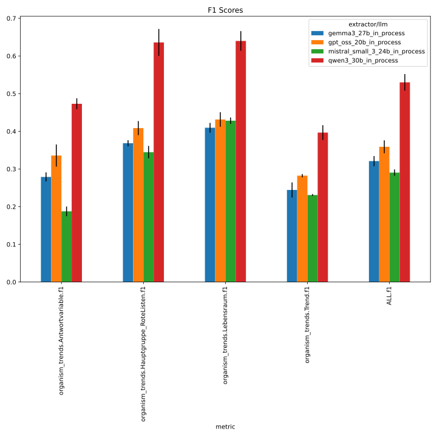
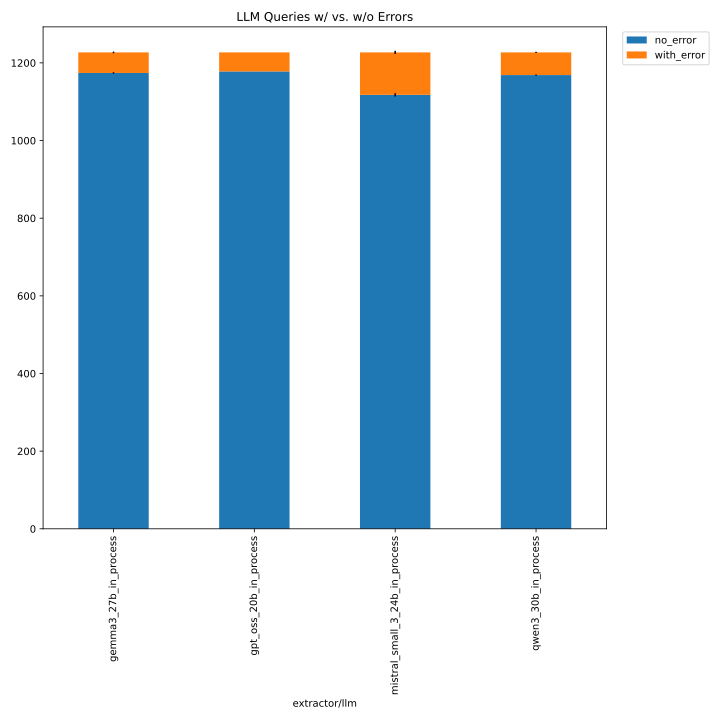
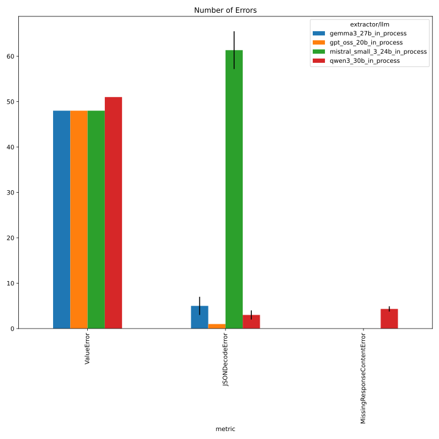
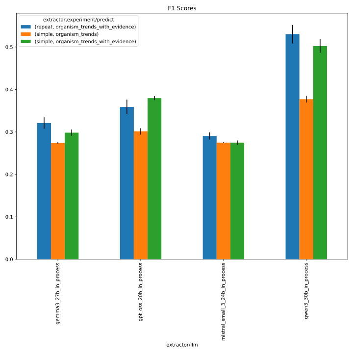
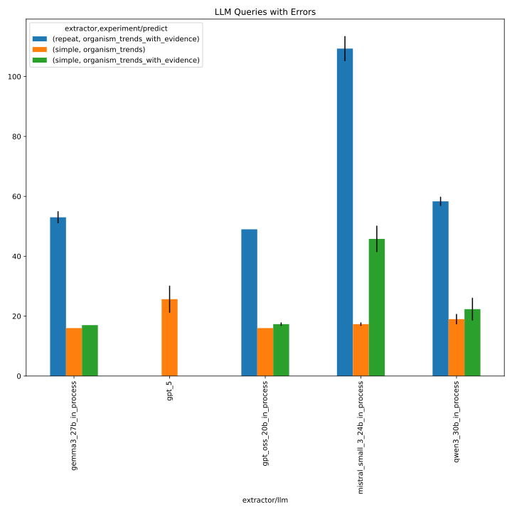
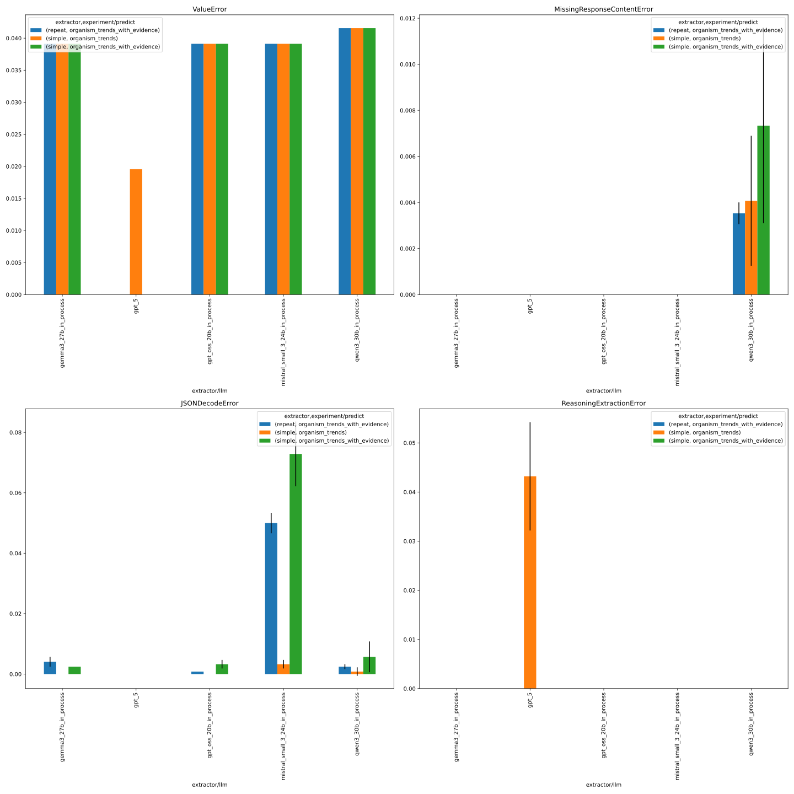

# 335_organism_trends_ensemble

This folder contains the logs of the organism trend experiments with majority voting ensemble, using an 
improved prompt template (v1), evidence retrieval, and a persona, across the following LLMs:

- gpt_oss_20b
- gemma3_27b
- qwen3_30b
- mistral_small_3_24b

See https://github.com/DFKI-NLP/kibad-llm/issues/335 and https://github.com/DFKI-NLP/kibad-llm/pull/338 for more documentation.

## Notebook Parameters

### Just this experiment

```python
NAME = "335_organism_trends_ensemble"

# used to group the data
INDEX_COLUMNS = ["prediction.overrides.extractor/llm"]
PLOT_KWARGS = {
    # can be either "metric" or one of the INDEX_COLUMNS (or multiple of them)
    "xgroup": "prediction.overrides.extractor/llm",
    # add any more arguments passed to pd.DataFrame.plot
}
```





### comparison with baseline
```python
NAME = "335_organism_trends_ensemble"

SUBDIR = [
    "../255_organism_trend_baseline_no_evi/evaluate",
    "../257_organism_trends_v1_with_evi/evaluate",
    "evaluate",
]

FILL_NA = {"prediction.overrides.extractor": "simple"}

# used to group the data
INDEX_COLUMNS = ["prediction.overrides.extractor/llm", "prediction.overrides.extractor", "prediction.overrides.experiment/predict" ]
PLOT_KWARGS = {
    # can be either "metric" or one of the INDEX_COLUMNS (or multiple of them)
    "xgroup": ["prediction.overrides.extractor",  "prediction.overrides.experiment/predict"],
    "create_subplot_for_each": "metric",
    # add any more arguments passed to pd.DataFrame.plot
    "subplot_columns": 2,
}
```

**IMPORTANT: Normalize errors of the 'repeat' extracxtor.** Do this:
```python
error_cols = [col for col in errors_df.columns if "error" in col]
errors_df.loc[errors_df["prediction.overrides.extractor"] == "repeat",error_cols] = errors_df.loc[errors_df["prediction.overrides.extractor"] == "repeat",error_cols] / 300.0
errors_df.loc[errors_df["prediction.overrides.extractor"] != "repeat",error_cols] = errors_df.loc[errors_df["prediction.overrides.extractor"] != "repeat",error_cols] / 100.0
```
before plotting.








## Inference

Run with new set of models:

- same setup as https://github.com/DFKI-NLP/kibad-llm/issues/333
- use name= 335_organism_trends_ensemble
- but use `extractor/prompt_template=organism_trends_v1_with_evidence_and_persona` 
- and `extractor=repeat` 
- no `gpt_5` to save costs

```bash
./run_in_process.sh -pa "H100-SLT,H100-Trails,H100,A100-80GB" \
-u "-m kibad_llm.predict \
name=335_organism_trends_ensemble \
experiment/predict=organism_trends_with_evidence \
extractor=repeat \
extractor/prompt_template=organism_trends_v1_with_evidence_and_persona \
pdf_directory=/ds/text/kiba-d/dev-set-Wald-WVC \
extractor.return_reasoning=true \
extractor/llm=gpt_oss_20b_in_process,gemma3_27b_in_process,qwen3_30b_in_process,mistral_small_3_24b_in_process \
seed=42,1337,7331 \
--multirun"
```

Output folder: `/netscratch/hennig/code/tmp/kibad-llm/logs/335_organism_trends_ensemble/predict/multiruns/2026
-01-29_10-23-02`

Restarted due to timeout after 1 day:

```bash
./run_in_process.sh -pa "H100-SLT,H100-Trails,H100,A100-80GB" \
-t 3-00:00:00 \ 
-u "-m kibad_llm.predict \
name=335_organism_trends_ensemble \
experiment/predict=organism_trends_with_evidence \
extractor=repeat \
extractor/prompt_template=organism_trends_v1_with_evidence_and_persona \
pdf_directory=/ds/text/kiba-d/dev-set-Wald-WVC \
extractor.return_reasoning=true \
extractor/llm=qwen3_30b_in_process,mistral_small_3_24b_in_process \
seed=42,1337,7331 \
--multirun"
```

Output folder: `/netscratch/hennig/code/tmp/kibad-llm/logs/335_organism_trends_ensemble/predict/multiruns/2026
-01-30_10-32-08`

## Evaluate F1:

```
uv run -m kibad_llm.evaluate \
name=335_organism_trends_ensemble \
experiment/evaluate=organism_trends_f1_micro_flat \
prediction_logs=[logs/335_organism_trends_ensemble/predict/multiruns/2026-01-29_10-23-02,logs/335_organism_trends_ensemble/predict/multiruns/2026-01-30_10-32-08] \
+hydra.callbacks.save_job_return.multirun_markdown_group_by=prediction.overrides.extractor/llm \
--multirun
```

<details>
<summary>Log output</summary>

```
[2026-02-02 11:27:54,062][HYDRA] Saving job_return in /netscratch/hennig/code/kibad-llm/logs/335_organism_trends_ensemble/evaluate/multiruns/2026-02-02_11-27-46/job_return_value.json
[2026-02-02 11:27:54,068][HYDRA] Saving job_return in /netscratch/hennig/code/kibad-llm/logs/335_organism_trends_ensemble/evaluate/multiruns/2026-02-02_11-27-46/job_return_value.md
[2026-02-02 11:27:54,121][HYDRA] Contents of /netscratch/hennig/code/kibad-llm/logs/335_organism_trends_ensemble/evaluate/multiruns/2026-02-02_11-27-46/job_return_value.md: 
``` 

| prediction.overrides.extractor/llm   |   ALL.f1.mean |   ALL.f1.std |   ALL.precision.mean |   ALL.precision.std |   ALL.recall.mean |   ALL.recall.std |   ALL.support.mean |   ALL.support.std |   AVG.f1.mean |   AVG.f1.std |   AVG.precision.mean |   AVG.precision.std |   AVG.recall.mean |   AVG.recall.std |   AVG.support.mean |   AVG.support.std |   organism_trends.Antwortvariable.f1.mean |   organism_trends.Antwortvariable.f1.std |   organism_trends.Antwortvariable.precision.mean |   organism_trends.Antwortvariable.precision.std |   organism_trends.Antwortvariable.recall.mean |   organism_trends.Antwortvariable.recall.std |   organism_trends.Antwortvariable.support.mean |   organism_trends.Antwortvariable.support.std |   organism_trends.Hauptgruppe_RoteListen.f1.mean |   organism_trends.Hauptgruppe_RoteListen.f1.std |   organism_trends.Hauptgruppe_RoteListen.precision.mean |   organism_trends.Hauptgruppe_RoteListen.precision.std |   organism_trends.Hauptgruppe_RoteListen.recall.mean |   organism_trends.Hauptgruppe_RoteListen.recall.std |   organism_trends.Hauptgruppe_RoteListen.support.mean |   organism_trends.Hauptgruppe_RoteListen.support.std |   organism_trends.Lebensraum.f1.mean |   organism_trends.Lebensraum.f1.std |   organism_trends.Lebensraum.precision.mean |   organism_trends.Lebensraum.precision.std |   organism_trends.Lebensraum.recall.mean |   organism_trends.Lebensraum.recall.std |   organism_trends.Lebensraum.support.mean |   organism_trends.Lebensraum.support.std |   organism_trends.Trend.f1.mean |   organism_trends.Trend.f1.std |   organism_trends.Trend.precision.mean |   organism_trends.Trend.precision.std |   organism_trends.Trend.recall.mean |   organism_trends.Trend.recall.std |   organism_trends.Trend.support.mean |   organism_trends.Trend.support.std |   prediction.job_return_value.time_extraction.mean |   prediction.job_return_value.time_extraction.std |   prediction.job_return_value.time_pdf_conversion.mean |   prediction.job_return_value.time_pdf_conversion.std | overrides.dataset.predictions.log                                                                                                                                                                                                       | overrides.experiment/evaluate                                                                       | overrides.name                                                                                   | overrides.prediction_logs                                                                                                                                                                                                                                                                                                                                                                                                                                       | prediction.job_return_value.branch                                                               | prediction.job_return_value.commit_hash                                                                                              | prediction.job_return_value.is_dirty   | prediction.job_return_value.output_file                                                                                                                                                                                                                                                                                                 | prediction.job_return_value.output_file_absolute                                                                                                                                                                                                                                                                                                                                                                                                          | prediction.overrides.experiment/predict                                                             | prediction.overrides.extractor   | prediction.overrides.extractor.return_reasoning   | prediction.overrides.extractor/prompt_template                                                                                                   | prediction.overrides.name                                                                        | prediction.overrides.pdf_directory                                                                           | prediction.overrides.seed   |
|:-------------------------------------|--------------:|-------------:|---------------------:|--------------------:|------------------:|-----------------:|-------------------:|------------------:|--------------:|-------------:|---------------------:|--------------------:|------------------:|-----------------:|-------------------:|------------------:|------------------------------------------:|-----------------------------------------:|-------------------------------------------------:|------------------------------------------------:|----------------------------------------------:|---------------------------------------------:|-----------------------------------------------:|----------------------------------------------:|-------------------------------------------------:|------------------------------------------------:|--------------------------------------------------------:|-------------------------------------------------------:|-----------------------------------------------------:|----------------------------------------------------:|------------------------------------------------------:|-----------------------------------------------------:|-------------------------------------:|------------------------------------:|--------------------------------------------:|-------------------------------------------:|-----------------------------------------:|----------------------------------------:|------------------------------------------:|-----------------------------------------:|--------------------------------:|-------------------------------:|---------------------------------------:|--------------------------------------:|------------------------------------:|-----------------------------------:|-------------------------------------:|------------------------------------:|---------------------------------------------------:|--------------------------------------------------:|-------------------------------------------------------:|------------------------------------------------------:|:----------------------------------------------------------------------------------------------------------------------------------------------------------------------------------------------------------------------------------------|:----------------------------------------------------------------------------------------------------|:-------------------------------------------------------------------------------------------------|:----------------------------------------------------------------------------------------------------------------------------------------------------------------------------------------------------------------------------------------------------------------------------------------------------------------------------------------------------------------------------------------------------------------------------------------------------------------|:-------------------------------------------------------------------------------------------------|:-------------------------------------------------------------------------------------------------------------------------------------|:---------------------------------------|:----------------------------------------------------------------------------------------------------------------------------------------------------------------------------------------------------------------------------------------------------------------------------------------------------------------------------------------|:----------------------------------------------------------------------------------------------------------------------------------------------------------------------------------------------------------------------------------------------------------------------------------------------------------------------------------------------------------------------------------------------------------------------------------------------------------|:----------------------------------------------------------------------------------------------------|:---------------------------------|:--------------------------------------------------|:-------------------------------------------------------------------------------------------------------------------------------------------------|:-------------------------------------------------------------------------------------------------|:-------------------------------------------------------------------------------------------------------------|:----------------------------|
| gemma3_27b_in_process                |         0.321 |        0.013 |                0.23  |               0.012 |             0.532 |            0.024 |                491 |                 0 |         0.325 |        0.013 |                0.233 |               0.011 |             0.542 |            0.024 |             122.75 |                 0 |                                     0.279 |                                    0.012 |                                            0.203 |                                           0.01  |                                         0.444 |                                        0.027 |                                            132 |                                             0 |                                            0.368 |                                           0.008 |                                                   0.26  |                                                  0.008 |                                                0.632 |                                               0.027 |                                                   115 |                                                    0 |                                0.409 |                               0.013 |                                       0.292 |                                      0.012 |                                    0.685 |                                   0.024 |                                       111 |                                        0 |                           0.244 |                          0.02  |                                  0.175 |                                 0.016 |                               0.406 |                              0.027 |                                  133 |                                   0 |                                            11727.1 |                                           347.805 |                                                  0.006 |                                                 0.001 | ['logs/335_organism_trends_ensemble/predict/multiruns/2026-01-29_10-23-02/3', 'logs/335_organism_trends_ensemble/predict/multiruns/2026-01-29_10-23-02/4', 'logs/335_organism_trends_ensemble/predict/multiruns/2026-01-29_10-23-02/5'] | ['organism_trends_f1_micro_flat', 'organism_trends_f1_micro_flat', 'organism_trends_f1_micro_flat'] | ['335_organism_trends_ensemble', '335_organism_trends_ensemble', '335_organism_trends_ensemble'] | ['[logs/335_organism_trends_ensemble/predict/multiruns/2026-01-29_10-23-02,logs/335_organism_trends_ensemble/predict/multiruns/2026-01-30_10-32-08]', '[logs/335_organism_trends_ensemble/predict/multiruns/2026-01-29_10-23-02,logs/335_organism_trends_ensemble/predict/multiruns/2026-01-30_10-32-08]', '[logs/335_organism_trends_ensemble/predict/multiruns/2026-01-29_10-23-02,logs/335_organism_trends_ensemble/predict/multiruns/2026-01-30_10-32-08]'] | ['organism-trends-with-persona', 'organism-trends-with-persona', 'organism-trends-with-persona'] | ['5a4e9f6557883763fb8b307c339c5a898d2b8c5b', '5a4e9f6557883763fb8b307c339c5a898d2b8c5b', '5a4e9f6557883763fb8b307c339c5a898d2b8c5b'] | [np.False_, np.False_, np.False_]      | ['predictions/335_organism_trends_ensemble/2026-01-29_10-23-02/2026-01-29_20-51-18_697547/predictions.jsonl', 'predictions/335_organism_trends_ensemble/2026-01-29_10-23-02/2026-01-30_00-11-01_698418/predictions.jsonl', 'predictions/335_organism_trends_ensemble/2026-01-29_10-23-02/2026-01-30_03-21-30_638878/predictions.jsonl'] | ['/netscratch/hennig/code/tmp/kibad-llm/predictions/335_organism_trends_ensemble/2026-01-29_10-23-02/2026-01-29_20-51-18_697547/predictions.jsonl', '/netscratch/hennig/code/tmp/kibad-llm/predictions/335_organism_trends_ensemble/2026-01-29_10-23-02/2026-01-30_00-11-01_698418/predictions.jsonl', '/netscratch/hennig/code/tmp/kibad-llm/predictions/335_organism_trends_ensemble/2026-01-29_10-23-02/2026-01-30_03-21-30_638878/predictions.jsonl'] | ['organism_trends_with_evidence', 'organism_trends_with_evidence', 'organism_trends_with_evidence'] | ['repeat', 'repeat', 'repeat']   | ['True', 'True', 'True']                          | ['organism_trends_v1_with_evidence_and_persona', 'organism_trends_v1_with_evidence_and_persona', 'organism_trends_v1_with_evidence_and_persona'] | ['335_organism_trends_ensemble', '335_organism_trends_ensemble', '335_organism_trends_ensemble'] | ['/ds/text/kiba-d/dev-set-Wald-WVC', '/ds/text/kiba-d/dev-set-Wald-WVC', '/ds/text/kiba-d/dev-set-Wald-WVC'] | ['42', '1337', '7331']      |
| gpt_oss_20b_in_process               |         0.359 |        0.017 |                0.269 |               0.015 |             0.54  |            0.018 |                491 |                 0 |         0.364 |        0.017 |                0.274 |               0.015 |             0.547 |            0.018 |             122.75 |                 0 |                                     0.336 |                                    0.029 |                                            0.258 |                                           0.025 |                                         0.482 |                                        0.037 |                                            132 |                                             0 |                                            0.409 |                                           0.019 |                                                   0.305 |                                                  0.015 |                                                0.617 |                                               0.023 |                                                   115 |                                                    0 |                                0.431 |                               0.019 |                                       0.325 |                                      0.017 |                                    0.64  |                                   0.018 |                                       111 |                                        0 |                           0.282 |                          0.004 |                                  0.206 |                                 0.004 |                               0.449 |                              0.019 |                                  133 |                                   0 |                                            12497   |                                           293.867 |                                                  0.006 |                                                 0.001 | ['logs/335_organism_trends_ensemble/predict/multiruns/2026-01-29_10-23-02/0', 'logs/335_organism_trends_ensemble/predict/multiruns/2026-01-29_10-23-02/1', 'logs/335_organism_trends_ensemble/predict/multiruns/2026-01-29_10-23-02/2'] | ['organism_trends_f1_micro_flat', 'organism_trends_f1_micro_flat', 'organism_trends_f1_micro_flat'] | ['335_organism_trends_ensemble', '335_organism_trends_ensemble', '335_organism_trends_ensemble'] | ['[logs/335_organism_trends_ensemble/predict/multiruns/2026-01-29_10-23-02,logs/335_organism_trends_ensemble/predict/multiruns/2026-01-30_10-32-08]', '[logs/335_organism_trends_ensemble/predict/multiruns/2026-01-29_10-23-02,logs/335_organism_trends_ensemble/predict/multiruns/2026-01-30_10-32-08]', '[logs/335_organism_trends_ensemble/predict/multiruns/2026-01-29_10-23-02,logs/335_organism_trends_ensemble/predict/multiruns/2026-01-30_10-32-08]'] | ['organism-trends-with-persona', 'organism-trends-with-persona', 'organism-trends-with-persona'] | ['5a4e9f6557883763fb8b307c339c5a898d2b8c5b', '5a4e9f6557883763fb8b307c339c5a898d2b8c5b', '5a4e9f6557883763fb8b307c339c5a898d2b8c5b'] | [np.False_, np.False_, np.False_]      | ['predictions/335_organism_trends_ensemble/2026-01-29_10-23-02/2026-01-29_10-23-04_059598/predictions.jsonl', 'predictions/335_organism_trends_ensemble/2026-01-29_10-23-02/2026-01-29_13-47-18_242059/predictions.jsonl', 'predictions/335_organism_trends_ensemble/2026-01-29_10-23-02/2026-01-29_17-19-44_360232/predictions.jsonl'] | ['/netscratch/hennig/code/tmp/kibad-llm/predictions/335_organism_trends_ensemble/2026-01-29_10-23-02/2026-01-29_10-23-04_059598/predictions.jsonl', '/netscratch/hennig/code/tmp/kibad-llm/predictions/335_organism_trends_ensemble/2026-01-29_10-23-02/2026-01-29_13-47-18_242059/predictions.jsonl', '/netscratch/hennig/code/tmp/kibad-llm/predictions/335_organism_trends_ensemble/2026-01-29_10-23-02/2026-01-29_17-19-44_360232/predictions.jsonl'] | ['organism_trends_with_evidence', 'organism_trends_with_evidence', 'organism_trends_with_evidence'] | ['repeat', 'repeat', 'repeat']   | ['True', 'True', 'True']                          | ['organism_trends_v1_with_evidence_and_persona', 'organism_trends_v1_with_evidence_and_persona', 'organism_trends_v1_with_evidence_and_persona'] | ['335_organism_trends_ensemble', '335_organism_trends_ensemble', '335_organism_trends_ensemble'] | ['/ds/text/kiba-d/dev-set-Wald-WVC', '/ds/text/kiba-d/dev-set-Wald-WVC', '/ds/text/kiba-d/dev-set-Wald-WVC'] | ['42', '1337', '7331']      |
| mistral_small_3_24b_in_process       |         0.29  |        0.008 |                0.19  |               0.005 |             0.612 |            0.022 |                491 |                 0 |         0.298 |        0.009 |                0.196 |               0.006 |             0.627 |            0.023 |             122.75 |                 0 |                                     0.188 |                                    0.013 |                                            0.127 |                                           0.008 |                                         0.356 |                                        0.027 |                                            132 |                                             0 |                                            0.345 |                                           0.017 |                                                   0.222 |                                                  0.011 |                                                0.768 |                                               0.035 |                                                   115 |                                                    0 |                                0.428 |                               0.008 |                                       0.287 |                                      0.005 |                                    0.847 |                                   0.024 |                                       111 |                                        0 |                           0.231 |                          0.003 |                                  0.147 |                                 0.002 |                               0.536 |                              0.009 |                                  133 |                                   0 |                                            26590.2 |                                           128.433 |                                                  0.005 |                                                 0     | ['logs/335_organism_trends_ensemble/predict/multiruns/2026-01-30_10-32-08/3', 'logs/335_organism_trends_ensemble/predict/multiruns/2026-01-30_10-32-08/4', 'logs/335_organism_trends_ensemble/predict/multiruns/2026-01-30_10-32-08/5'] | ['organism_trends_f1_micro_flat', 'organism_trends_f1_micro_flat', 'organism_trends_f1_micro_flat'] | ['335_organism_trends_ensemble', '335_organism_trends_ensemble', '335_organism_trends_ensemble'] | ['[logs/335_organism_trends_ensemble/predict/multiruns/2026-01-29_10-23-02,logs/335_organism_trends_ensemble/predict/multiruns/2026-01-30_10-32-08]', '[logs/335_organism_trends_ensemble/predict/multiruns/2026-01-29_10-23-02,logs/335_organism_trends_ensemble/predict/multiruns/2026-01-30_10-32-08]', '[logs/335_organism_trends_ensemble/predict/multiruns/2026-01-29_10-23-02,logs/335_organism_trends_ensemble/predict/multiruns/2026-01-30_10-32-08]'] | ['organism-trends-with-persona', 'organism-trends-with-persona', 'organism-trends-with-persona'] | ['5a4e9f6557883763fb8b307c339c5a898d2b8c5b', '5a4e9f6557883763fb8b307c339c5a898d2b8c5b', '5a4e9f6557883763fb8b307c339c5a898d2b8c5b'] | [np.False_, np.False_, np.False_]      | ['predictions/335_organism_trends_ensemble/2026-01-30_10-32-08/2026-01-31_03-48-15_244345/predictions.jsonl', 'predictions/335_organism_trends_ensemble/2026-01-30_10-32-08/2026-01-31_11-13-01_741587/predictions.jsonl', 'predictions/335_organism_trends_ensemble/2026-01-30_10-32-08/2026-01-31_18-34-51_595193/predictions.jsonl'] | ['/netscratch/hennig/code/tmp/kibad-llm/predictions/335_organism_trends_ensemble/2026-01-30_10-32-08/2026-01-31_03-48-15_244345/predictions.jsonl', '/netscratch/hennig/code/tmp/kibad-llm/predictions/335_organism_trends_ensemble/2026-01-30_10-32-08/2026-01-31_11-13-01_741587/predictions.jsonl', '/netscratch/hennig/code/tmp/kibad-llm/predictions/335_organism_trends_ensemble/2026-01-30_10-32-08/2026-01-31_18-34-51_595193/predictions.jsonl'] | ['organism_trends_with_evidence', 'organism_trends_with_evidence', 'organism_trends_with_evidence'] | ['repeat', 'repeat', 'repeat']   | ['True', 'True', 'True']                          | ['organism_trends_v1_with_evidence_and_persona', 'organism_trends_v1_with_evidence_and_persona', 'organism_trends_v1_with_evidence_and_persona'] | ['335_organism_trends_ensemble', '335_organism_trends_ensemble', '335_organism_trends_ensemble'] | ['/ds/text/kiba-d/dev-set-Wald-WVC', '/ds/text/kiba-d/dev-set-Wald-WVC', '/ds/text/kiba-d/dev-set-Wald-WVC'] | ['42', '1337', '7331']      |
| qwen3_30b_in_process                 |         0.53  |        0.022 |                0.524 |               0.025 |             0.536 |            0.019 |                491 |                 0 |         0.536 |        0.023 |                0.529 |               0.026 |             0.545 |            0.02  |             122.75 |                 0 |                                     0.473 |                                    0.015 |                                            0.493 |                                           0.016 |                                         0.455 |                                        0.015 |                                            132 |                                             0 |                                            0.636 |                                           0.036 |                                                   0.615 |                                                  0.036 |                                                0.658 |                                               0.035 |                                                   115 |                                                    0 |                                0.64  |                               0.026 |                                       0.618 |                                      0.033 |                                    0.664 |                                   0.019 |                                       111 |                                        0 |                           0.397 |                          0.02  |                                  0.39  |                                 0.022 |                               0.404 |                              0.019 |                                  133 |                                   0 |                                            20648.9 |                                          1054.01  |                                                  0.006 |                                                 0.001 | ['logs/335_organism_trends_ensemble/predict/multiruns/2026-01-30_10-32-08/0', 'logs/335_organism_trends_ensemble/predict/multiruns/2026-01-30_10-32-08/1', 'logs/335_organism_trends_ensemble/predict/multiruns/2026-01-30_10-32-08/2'] | ['organism_trends_f1_micro_flat', 'organism_trends_f1_micro_flat', 'organism_trends_f1_micro_flat'] | ['335_organism_trends_ensemble', '335_organism_trends_ensemble', '335_organism_trends_ensemble'] | ['[logs/335_organism_trends_ensemble/predict/multiruns/2026-01-29_10-23-02,logs/335_organism_trends_ensemble/predict/multiruns/2026-01-30_10-32-08]', '[logs/335_organism_trends_ensemble/predict/multiruns/2026-01-29_10-23-02,logs/335_organism_trends_ensemble/predict/multiruns/2026-01-30_10-32-08]', '[logs/335_organism_trends_ensemble/predict/multiruns/2026-01-29_10-23-02,logs/335_organism_trends_ensemble/predict/multiruns/2026-01-30_10-32-08]'] | ['organism-trends-with-persona', 'organism-trends-with-persona', 'organism-trends-with-persona'] | ['5a4e9f6557883763fb8b307c339c5a898d2b8c5b', '5a4e9f6557883763fb8b307c339c5a898d2b8c5b', '5a4e9f6557883763fb8b307c339c5a898d2b8c5b'] | [np.False_, np.False_, np.False_]      | ['predictions/335_organism_trends_ensemble/2026-01-30_10-32-08/2026-01-30_10-32-09_620103/predictions.jsonl', 'predictions/335_organism_trends_ensemble/2026-01-30_10-32-08/2026-01-30_16-36-17_436912/predictions.jsonl', 'predictions/335_organism_trends_ensemble/2026-01-30_10-32-08/2026-01-30_22-19-33_141315/predictions.jsonl'] | ['/netscratch/hennig/code/tmp/kibad-llm/predictions/335_organism_trends_ensemble/2026-01-30_10-32-08/2026-01-30_10-32-09_620103/predictions.jsonl', '/netscratch/hennig/code/tmp/kibad-llm/predictions/335_organism_trends_ensemble/2026-01-30_10-32-08/2026-01-30_16-36-17_436912/predictions.jsonl', '/netscratch/hennig/code/tmp/kibad-llm/predictions/335_organism_trends_ensemble/2026-01-30_10-32-08/2026-01-30_22-19-33_141315/predictions.jsonl'] | ['organism_trends_with_evidence', 'organism_trends_with_evidence', 'organism_trends_with_evidence'] | ['repeat', 'repeat', 'repeat']   | ['True', 'True', 'True']                          | ['organism_trends_v1_with_evidence_and_persona', 'organism_trends_v1_with_evidence_and_persona', 'organism_trends_v1_with_evidence_and_persona'] | ['335_organism_trends_ensemble', '335_organism_trends_ensemble', '335_organism_trends_ensemble'] | ['/ds/text/kiba-d/dev-set-Wald-WVC', '/ds/text/kiba-d/dev-set-Wald-WVC', '/ds/text/kiba-d/dev-set-Wald-WVC'] | ['42', '1337', '7331']      |


</details>

## Evaluate errors

```
uv run -m kibad_llm.evaluate \
name=335_organism_trends_ensemble \
experiment/evaluate=prediction_errors \
prediction_logs=[logs/335_organism_trends_ensemble/predict/multiruns/2026-01-29_10-23-02,logs/335_organism_trends_ensemble/predict/multiruns/2026-01-30_10-32-08] \
+hydra.callbacks.save_job_return.multirun_markdown_group_by=prediction.overrides.extractor/llm \
--multirun
```

<details>
<summary>Log output</summary>

```
[2026-02-02 11:29:11,547][HYDRA] Saving job_return in /netscratch/hennig/code/kibad-llm/logs/335_organism_trends_ensemble/evaluate/multiruns/2026-02-02_11-29-05/job_return_value.json
[2026-02-02 11:29:11,553][HYDRA] Saving job_return in /netscratch/hennig/code/kibad-llm/logs/335_organism_trends_ensemble/evaluate/multiruns/2026-02-02_11-29-05/job_return_value.md
[2026-02-02 11:29:11,599][HYDRA] Contents of /netscratch/hennig/code/kibad-llm/logs/335_organism_trends_ensemble/evaluate/multiruns/2026-02-02_11-29-05/job_return_value.md: 
``` 

| prediction.overrides.extractor/llm   |   JSONDecodeError.mean |   JSONDecodeError.std |   MissingResponseContentError.mean |   MissingResponseContentError.std |   ValueError.mean |   ValueError.std |   no_error.mean |   no_error.std |   prediction.job_return_value.time_extraction.mean |   prediction.job_return_value.time_extraction.std |   prediction.job_return_value.time_pdf_conversion.mean |   prediction.job_return_value.time_pdf_conversion.std |   with_error.mean |   with_error.std | overrides.dataset.predictions.log                                                                                                                                                                                                       | overrides.experiment/evaluate                                   | overrides.name                                                                                   | overrides.prediction_logs                                                                                                                                                                                                                                                                                                                                                                                                                                       | prediction.job_return_value.branch                                                               | prediction.job_return_value.commit_hash                                                                                              | prediction.job_return_value.is_dirty   | prediction.job_return_value.output_file                                                                                                                                                                                                                                                                                                 | prediction.job_return_value.output_file_absolute                                                                                                                                                                                                                                                                                                                                                                                                          | prediction.overrides.experiment/predict                                                             | prediction.overrides.extractor   | prediction.overrides.extractor.return_reasoning   | prediction.overrides.extractor/prompt_template                                                                                                   | prediction.overrides.name                                                                        | prediction.overrides.pdf_directory                                                                           | prediction.overrides.seed   |
|:-------------------------------------|-----------------------:|----------------------:|-----------------------------------:|----------------------------------:|------------------:|-----------------:|----------------:|---------------:|---------------------------------------------------:|--------------------------------------------------:|-------------------------------------------------------:|------------------------------------------------------:|------------------:|-----------------:|:----------------------------------------------------------------------------------------------------------------------------------------------------------------------------------------------------------------------------------------|:----------------------------------------------------------------|:-------------------------------------------------------------------------------------------------|:----------------------------------------------------------------------------------------------------------------------------------------------------------------------------------------------------------------------------------------------------------------------------------------------------------------------------------------------------------------------------------------------------------------------------------------------------------------|:-------------------------------------------------------------------------------------------------|:-------------------------------------------------------------------------------------------------------------------------------------|:---------------------------------------|:----------------------------------------------------------------------------------------------------------------------------------------------------------------------------------------------------------------------------------------------------------------------------------------------------------------------------------------|:----------------------------------------------------------------------------------------------------------------------------------------------------------------------------------------------------------------------------------------------------------------------------------------------------------------------------------------------------------------------------------------------------------------------------------------------------------|:----------------------------------------------------------------------------------------------------|:---------------------------------|:--------------------------------------------------|:-------------------------------------------------------------------------------------------------------------------------------------------------|:-------------------------------------------------------------------------------------------------|:-------------------------------------------------------------------------------------------------------------|:----------------------------|
| gemma3_27b_in_process                |                  5     |                 2     |                              0     |                             0     |                48 |                0 |         1174    |          2     |                                            11727.1 |                                           347.805 |                                                  0.006 |                                                 0.001 |            53     |            2     | ['logs/335_organism_trends_ensemble/predict/multiruns/2026-01-29_10-23-02/3', 'logs/335_organism_trends_ensemble/predict/multiruns/2026-01-29_10-23-02/4', 'logs/335_organism_trends_ensemble/predict/multiruns/2026-01-29_10-23-02/5'] | ['prediction_errors', 'prediction_errors', 'prediction_errors'] | ['335_organism_trends_ensemble', '335_organism_trends_ensemble', '335_organism_trends_ensemble'] | ['[logs/335_organism_trends_ensemble/predict/multiruns/2026-01-29_10-23-02,logs/335_organism_trends_ensemble/predict/multiruns/2026-01-30_10-32-08]', '[logs/335_organism_trends_ensemble/predict/multiruns/2026-01-29_10-23-02,logs/335_organism_trends_ensemble/predict/multiruns/2026-01-30_10-32-08]', '[logs/335_organism_trends_ensemble/predict/multiruns/2026-01-29_10-23-02,logs/335_organism_trends_ensemble/predict/multiruns/2026-01-30_10-32-08]'] | ['organism-trends-with-persona', 'organism-trends-with-persona', 'organism-trends-with-persona'] | ['5a4e9f6557883763fb8b307c339c5a898d2b8c5b', '5a4e9f6557883763fb8b307c339c5a898d2b8c5b', '5a4e9f6557883763fb8b307c339c5a898d2b8c5b'] | [np.False_, np.False_, np.False_]      | ['predictions/335_organism_trends_ensemble/2026-01-29_10-23-02/2026-01-29_20-51-18_697547/predictions.jsonl', 'predictions/335_organism_trends_ensemble/2026-01-29_10-23-02/2026-01-30_00-11-01_698418/predictions.jsonl', 'predictions/335_organism_trends_ensemble/2026-01-29_10-23-02/2026-01-30_03-21-30_638878/predictions.jsonl'] | ['/netscratch/hennig/code/tmp/kibad-llm/predictions/335_organism_trends_ensemble/2026-01-29_10-23-02/2026-01-29_20-51-18_697547/predictions.jsonl', '/netscratch/hennig/code/tmp/kibad-llm/predictions/335_organism_trends_ensemble/2026-01-29_10-23-02/2026-01-30_00-11-01_698418/predictions.jsonl', '/netscratch/hennig/code/tmp/kibad-llm/predictions/335_organism_trends_ensemble/2026-01-29_10-23-02/2026-01-30_03-21-30_638878/predictions.jsonl'] | ['organism_trends_with_evidence', 'organism_trends_with_evidence', 'organism_trends_with_evidence'] | ['repeat', 'repeat', 'repeat']   | ['True', 'True', 'True']                          | ['organism_trends_v1_with_evidence_and_persona', 'organism_trends_v1_with_evidence_and_persona', 'organism_trends_v1_with_evidence_and_persona'] | ['335_organism_trends_ensemble', '335_organism_trends_ensemble', '335_organism_trends_ensemble'] | ['/ds/text/kiba-d/dev-set-Wald-WVC', '/ds/text/kiba-d/dev-set-Wald-WVC', '/ds/text/kiba-d/dev-set-Wald-WVC'] | ['42', '1337', '7331']      |
| gpt_oss_20b_in_process               |                  1     |                 0     |                              0     |                             0     |                48 |                0 |         1178    |          0     |                                            12497   |                                           293.867 |                                                  0.006 |                                                 0.001 |            49     |            0     | ['logs/335_organism_trends_ensemble/predict/multiruns/2026-01-29_10-23-02/0', 'logs/335_organism_trends_ensemble/predict/multiruns/2026-01-29_10-23-02/1', 'logs/335_organism_trends_ensemble/predict/multiruns/2026-01-29_10-23-02/2'] | ['prediction_errors', 'prediction_errors', 'prediction_errors'] | ['335_organism_trends_ensemble', '335_organism_trends_ensemble', '335_organism_trends_ensemble'] | ['[logs/335_organism_trends_ensemble/predict/multiruns/2026-01-29_10-23-02,logs/335_organism_trends_ensemble/predict/multiruns/2026-01-30_10-32-08]', '[logs/335_organism_trends_ensemble/predict/multiruns/2026-01-29_10-23-02,logs/335_organism_trends_ensemble/predict/multiruns/2026-01-30_10-32-08]', '[logs/335_organism_trends_ensemble/predict/multiruns/2026-01-29_10-23-02,logs/335_organism_trends_ensemble/predict/multiruns/2026-01-30_10-32-08]'] | ['organism-trends-with-persona', 'organism-trends-with-persona', 'organism-trends-with-persona'] | ['5a4e9f6557883763fb8b307c339c5a898d2b8c5b', '5a4e9f6557883763fb8b307c339c5a898d2b8c5b', '5a4e9f6557883763fb8b307c339c5a898d2b8c5b'] | [np.False_, np.False_, np.False_]      | ['predictions/335_organism_trends_ensemble/2026-01-29_10-23-02/2026-01-29_10-23-04_059598/predictions.jsonl', 'predictions/335_organism_trends_ensemble/2026-01-29_10-23-02/2026-01-29_13-47-18_242059/predictions.jsonl', 'predictions/335_organism_trends_ensemble/2026-01-29_10-23-02/2026-01-29_17-19-44_360232/predictions.jsonl'] | ['/netscratch/hennig/code/tmp/kibad-llm/predictions/335_organism_trends_ensemble/2026-01-29_10-23-02/2026-01-29_10-23-04_059598/predictions.jsonl', '/netscratch/hennig/code/tmp/kibad-llm/predictions/335_organism_trends_ensemble/2026-01-29_10-23-02/2026-01-29_13-47-18_242059/predictions.jsonl', '/netscratch/hennig/code/tmp/kibad-llm/predictions/335_organism_trends_ensemble/2026-01-29_10-23-02/2026-01-29_17-19-44_360232/predictions.jsonl'] | ['organism_trends_with_evidence', 'organism_trends_with_evidence', 'organism_trends_with_evidence'] | ['repeat', 'repeat', 'repeat']   | ['True', 'True', 'True']                          | ['organism_trends_v1_with_evidence_and_persona', 'organism_trends_v1_with_evidence_and_persona', 'organism_trends_v1_with_evidence_and_persona'] | ['335_organism_trends_ensemble', '335_organism_trends_ensemble', '335_organism_trends_ensemble'] | ['/ds/text/kiba-d/dev-set-Wald-WVC', '/ds/text/kiba-d/dev-set-Wald-WVC', '/ds/text/kiba-d/dev-set-Wald-WVC'] | ['42', '1337', '7331']      |
| mistral_small_3_24b_in_process       |                 61.333 |                 4.163 |                              0     |                             0     |                48 |                0 |         1117.67 |          4.163 |                                            26590.2 |                                           128.433 |                                                  0.005 |                                                 0     |           109.333 |            4.163 | ['logs/335_organism_trends_ensemble/predict/multiruns/2026-01-30_10-32-08/3', 'logs/335_organism_trends_ensemble/predict/multiruns/2026-01-30_10-32-08/4', 'logs/335_organism_trends_ensemble/predict/multiruns/2026-01-30_10-32-08/5'] | ['prediction_errors', 'prediction_errors', 'prediction_errors'] | ['335_organism_trends_ensemble', '335_organism_trends_ensemble', '335_organism_trends_ensemble'] | ['[logs/335_organism_trends_ensemble/predict/multiruns/2026-01-29_10-23-02,logs/335_organism_trends_ensemble/predict/multiruns/2026-01-30_10-32-08]', '[logs/335_organism_trends_ensemble/predict/multiruns/2026-01-29_10-23-02,logs/335_organism_trends_ensemble/predict/multiruns/2026-01-30_10-32-08]', '[logs/335_organism_trends_ensemble/predict/multiruns/2026-01-29_10-23-02,logs/335_organism_trends_ensemble/predict/multiruns/2026-01-30_10-32-08]'] | ['organism-trends-with-persona', 'organism-trends-with-persona', 'organism-trends-with-persona'] | ['5a4e9f6557883763fb8b307c339c5a898d2b8c5b', '5a4e9f6557883763fb8b307c339c5a898d2b8c5b', '5a4e9f6557883763fb8b307c339c5a898d2b8c5b'] | [np.False_, np.False_, np.False_]      | ['predictions/335_organism_trends_ensemble/2026-01-30_10-32-08/2026-01-31_03-48-15_244345/predictions.jsonl', 'predictions/335_organism_trends_ensemble/2026-01-30_10-32-08/2026-01-31_11-13-01_741587/predictions.jsonl', 'predictions/335_organism_trends_ensemble/2026-01-30_10-32-08/2026-01-31_18-34-51_595193/predictions.jsonl'] | ['/netscratch/hennig/code/tmp/kibad-llm/predictions/335_organism_trends_ensemble/2026-01-30_10-32-08/2026-01-31_03-48-15_244345/predictions.jsonl', '/netscratch/hennig/code/tmp/kibad-llm/predictions/335_organism_trends_ensemble/2026-01-30_10-32-08/2026-01-31_11-13-01_741587/predictions.jsonl', '/netscratch/hennig/code/tmp/kibad-llm/predictions/335_organism_trends_ensemble/2026-01-30_10-32-08/2026-01-31_18-34-51_595193/predictions.jsonl'] | ['organism_trends_with_evidence', 'organism_trends_with_evidence', 'organism_trends_with_evidence'] | ['repeat', 'repeat', 'repeat']   | ['True', 'True', 'True']                          | ['organism_trends_v1_with_evidence_and_persona', 'organism_trends_v1_with_evidence_and_persona', 'organism_trends_v1_with_evidence_and_persona'] | ['335_organism_trends_ensemble', '335_organism_trends_ensemble', '335_organism_trends_ensemble'] | ['/ds/text/kiba-d/dev-set-Wald-WVC', '/ds/text/kiba-d/dev-set-Wald-WVC', '/ds/text/kiba-d/dev-set-Wald-WVC'] | ['42', '1337', '7331']      |
| qwen3_30b_in_process                 |                  3     |                 1     |                              4.333 |                             0.577 |                51 |                0 |         1168.67 |          1.528 |                                            20648.9 |                                          1054.01  |                                                  0.006 |                                                 0.001 |            58.333 |            1.528 | ['logs/335_organism_trends_ensemble/predict/multiruns/2026-01-30_10-32-08/0', 'logs/335_organism_trends_ensemble/predict/multiruns/2026-01-30_10-32-08/1', 'logs/335_organism_trends_ensemble/predict/multiruns/2026-01-30_10-32-08/2'] | ['prediction_errors', 'prediction_errors', 'prediction_errors'] | ['335_organism_trends_ensemble', '335_organism_trends_ensemble', '335_organism_trends_ensemble'] | ['[logs/335_organism_trends_ensemble/predict/multiruns/2026-01-29_10-23-02,logs/335_organism_trends_ensemble/predict/multiruns/2026-01-30_10-32-08]', '[logs/335_organism_trends_ensemble/predict/multiruns/2026-01-29_10-23-02,logs/335_organism_trends_ensemble/predict/multiruns/2026-01-30_10-32-08]', '[logs/335_organism_trends_ensemble/predict/multiruns/2026-01-29_10-23-02,logs/335_organism_trends_ensemble/predict/multiruns/2026-01-30_10-32-08]'] | ['organism-trends-with-persona', 'organism-trends-with-persona', 'organism-trends-with-persona'] | ['5a4e9f6557883763fb8b307c339c5a898d2b8c5b', '5a4e9f6557883763fb8b307c339c5a898d2b8c5b', '5a4e9f6557883763fb8b307c339c5a898d2b8c5b'] | [np.False_, np.False_, np.False_]      | ['predictions/335_organism_trends_ensemble/2026-01-30_10-32-08/2026-01-30_10-32-09_620103/predictions.jsonl', 'predictions/335_organism_trends_ensemble/2026-01-30_10-32-08/2026-01-30_16-36-17_436912/predictions.jsonl', 'predictions/335_organism_trends_ensemble/2026-01-30_10-32-08/2026-01-30_22-19-33_141315/predictions.jsonl'] | ['/netscratch/hennig/code/tmp/kibad-llm/predictions/335_organism_trends_ensemble/2026-01-30_10-32-08/2026-01-30_10-32-09_620103/predictions.jsonl', '/netscratch/hennig/code/tmp/kibad-llm/predictions/335_organism_trends_ensemble/2026-01-30_10-32-08/2026-01-30_16-36-17_436912/predictions.jsonl', '/netscratch/hennig/code/tmp/kibad-llm/predictions/335_organism_trends_ensemble/2026-01-30_10-32-08/2026-01-30_22-19-33_141315/predictions.jsonl'] | ['organism_trends_with_evidence', 'organism_trends_with_evidence', 'organism_trends_with_evidence'] | ['repeat', 'repeat', 'repeat']   | ['True', 'True', 'True']                          | ['organism_trends_v1_with_evidence_and_persona', 'organism_trends_v1_with_evidence_and_persona', 'organism_trends_v1_with_evidence_and_persona'] | ['335_organism_trends_ensemble', '335_organism_trends_ensemble', '335_organism_trends_ensemble'] | ['/ds/text/kiba-d/dev-set-Wald-WVC', '/ds/text/kiba-d/dev-set-Wald-WVC', '/ds/text/kiba-d/dev-set-Wald-WVC'] | ['42', '1337', '7331']      |


</details>