# 348_faktencheck_core_repeat
Just `gpt-oss-20b` with `repeat` extractor (`n=3` vs. `5`). See https://github.com/DFKI-NLP/kibad-llm/pull/348 for details.

## notebook parameters

### just this experiment

```python
NAME = "348_faktencheck_core_repeat"

FILL_NA = {"prediction.overrides.extractor.n": 3}

METRICS = ["f1", "recall", "precision"]
# used to group the data
INDEX_COLUMNS = ["prediction.overrides.extractor/llm", "prediction.overrides.extractor.n"]
PLOT_KWARGS = {
    # can be either "metric" or one of the INDEX_COLUMNS (or multiple of them)
    "xgroup": ["prediction.overrides.extractor/llm", "prediction.overrides.extractor.n"],
    # add any more arguments passed to pd.DataFrame.plot
}
```

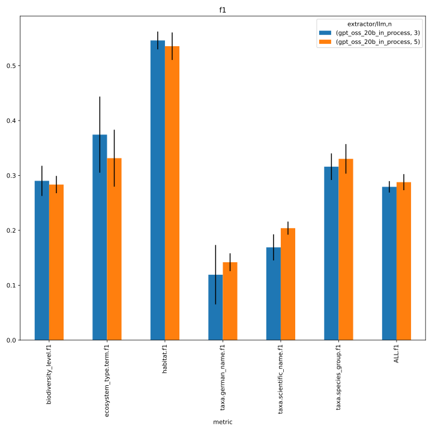
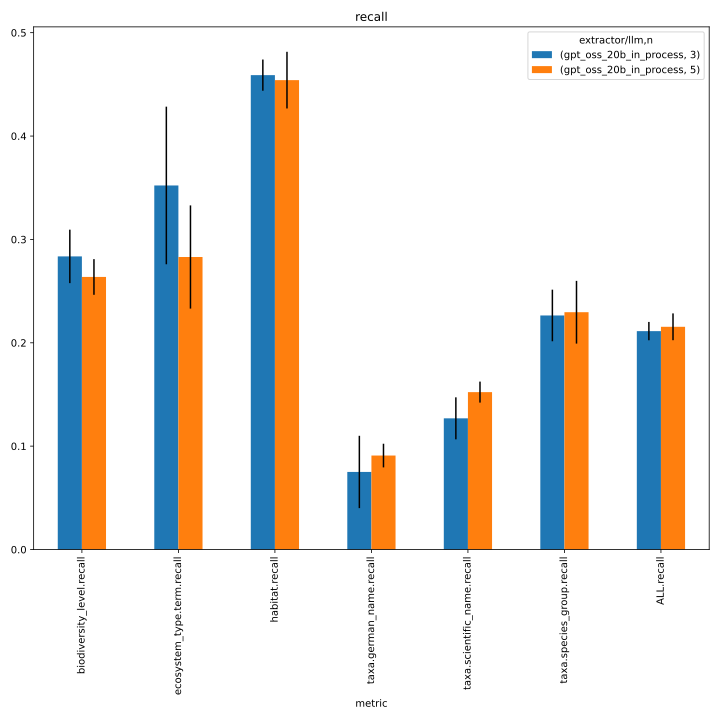
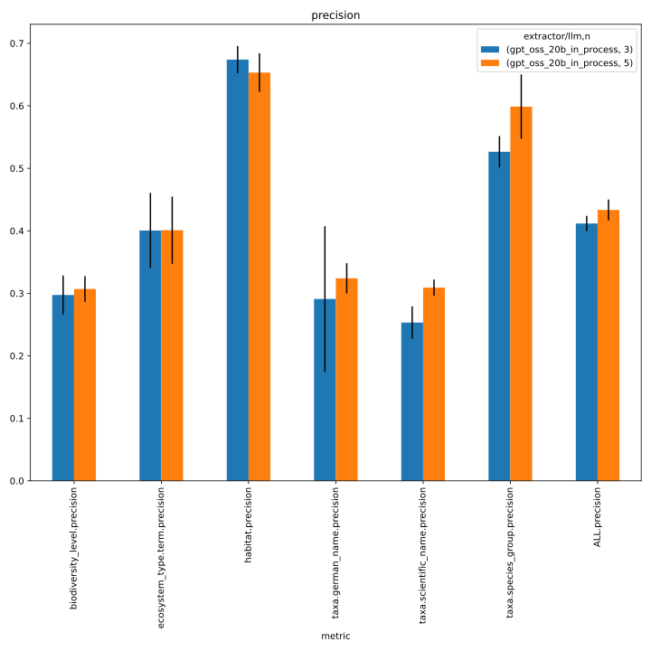
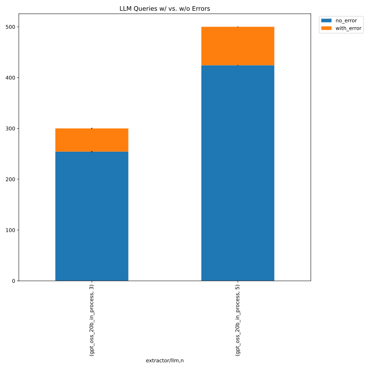
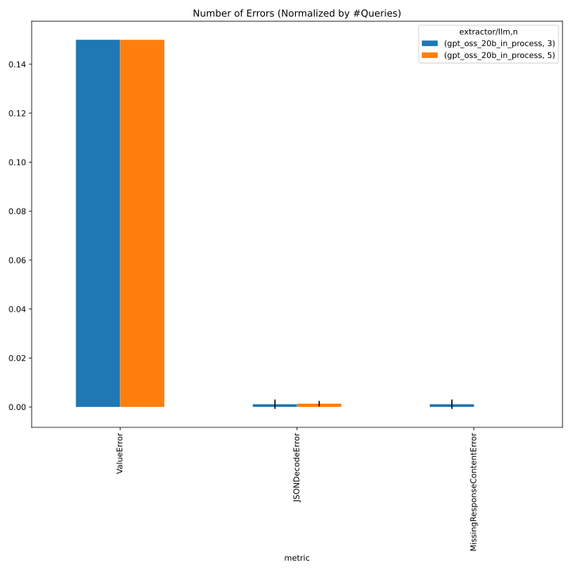

### comparison with baseline
baseline: [327_faktencheck_core_with_persona](../327_faktencheck_core_with_persona/)

```python
NAME = "348_faktencheck_core_repeat"

SUBDIR = ["evaluate", "../327_faktencheck_core_with_persona/evaluate"]

FILE_NAME_PREFIX = "baseline_"

FILL_NA = {"prediction.overrides.extractor.n": 3, "prediction.overrides.extractor": "simple"}

METRICS = ["f1", "recall", "precision"]
# used to group the data
INDEX_COLUMNS = ["prediction.overrides.extractor/llm", "prediction.overrides.extractor.n", "prediction.overrides.extractor"]
PLOT_KWARGS = {
    # can be either "metric" or one of the INDEX_COLUMNS (or multiple of them)
    "xgroup": ["prediction.overrides.extractor.n", "prediction.overrides.extractor"],
    # add any more arguments passed to pd.DataFrame.plot
    "create_subplot_for_each": "metric",
    #"set_missing_values_to_zero": True,
    "subplot_columns": 2,
}
```
#### f1

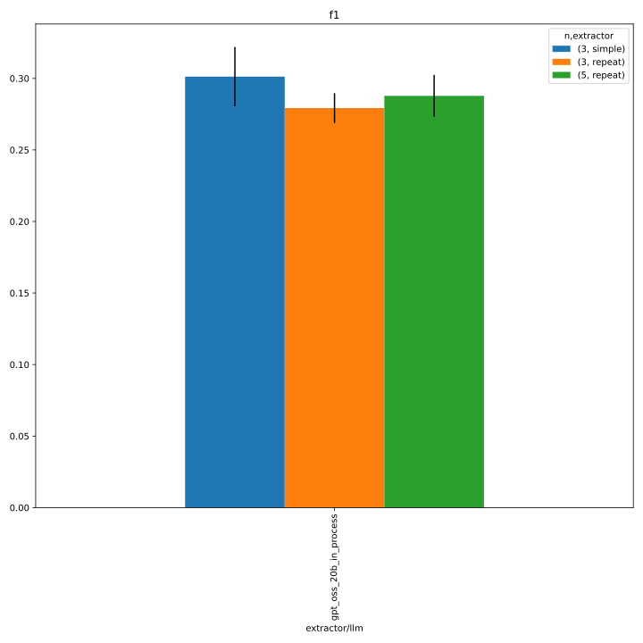
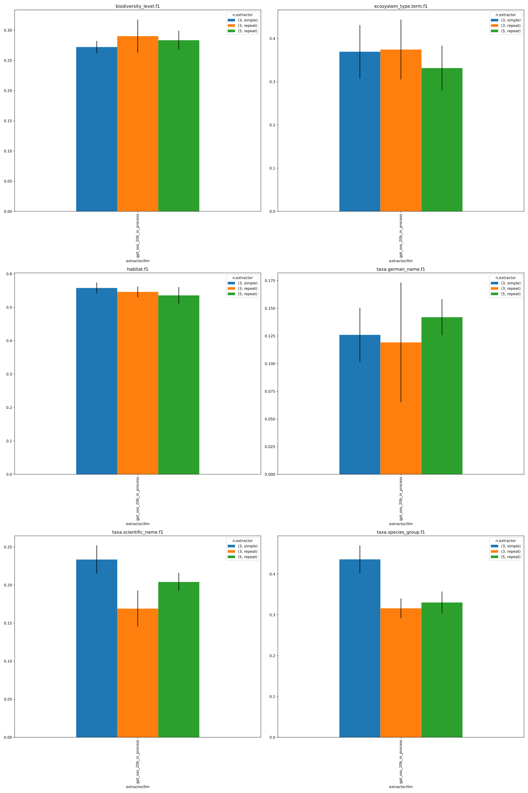

#### recall

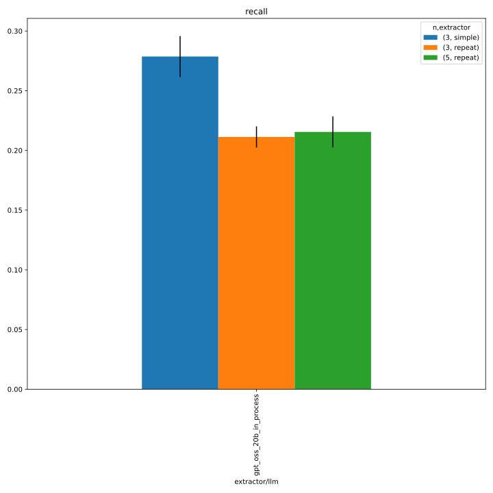
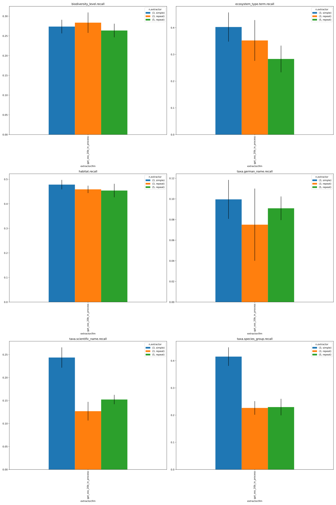

#### precision

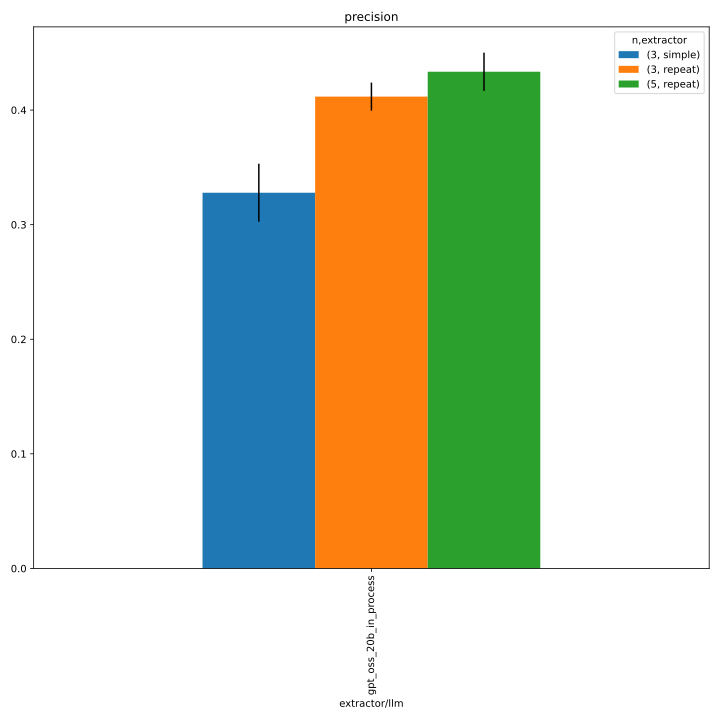
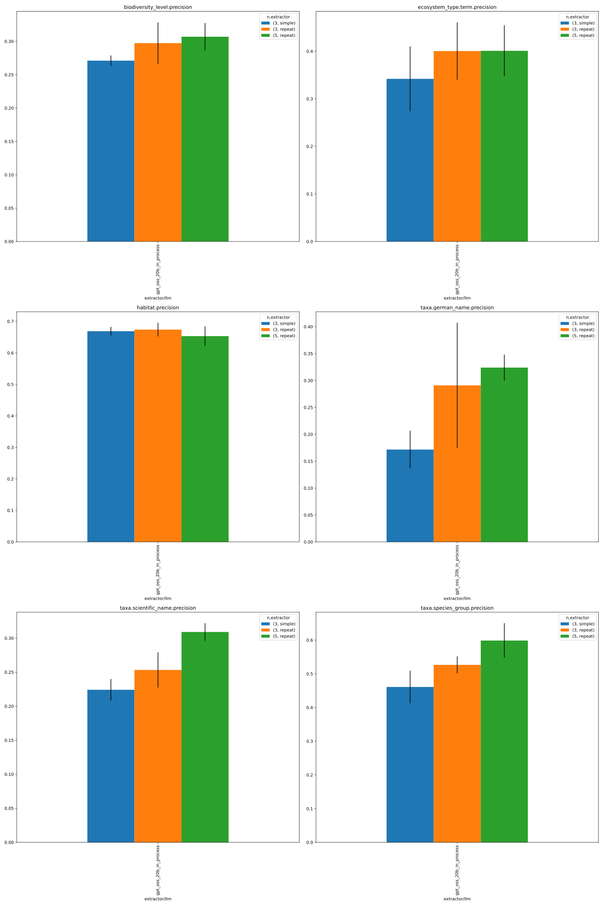

#### errors

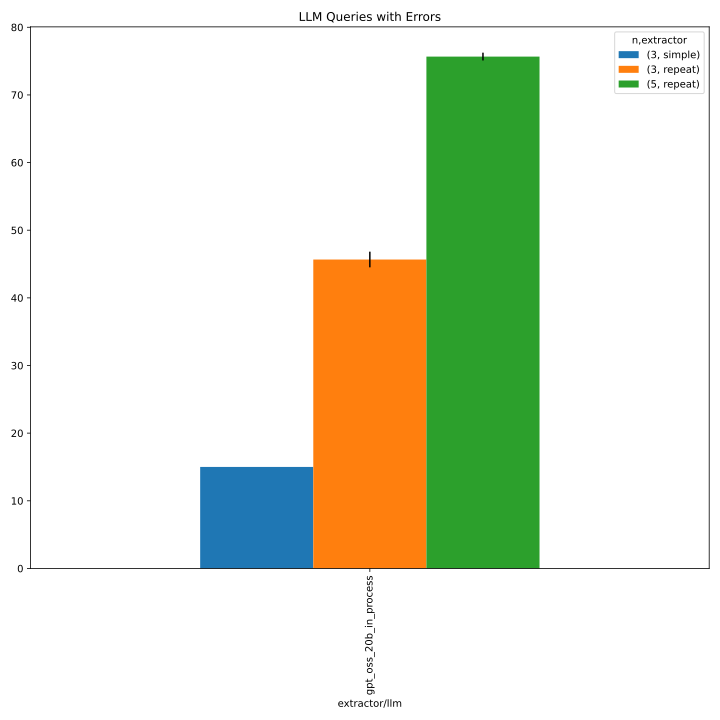
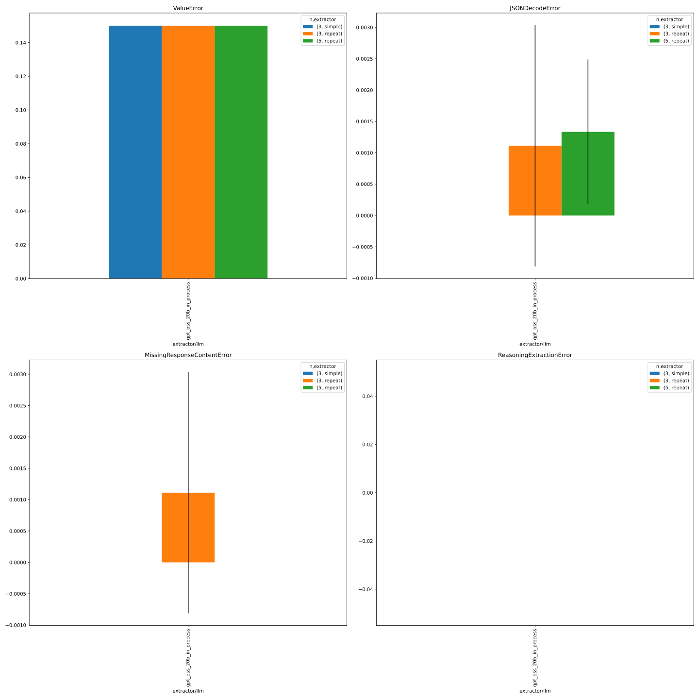


### comparison with previous repeat experiment
previous repeat experiment: [88_repeat_faktencheck_core](../88_repeat_faktencheck_core/)

```python
NAME = "348_faktencheck_core_repeat"

SUBDIR = [
    # take only n=3 runs from current experiment
    "evaluate/multiruns/2026-02-06_15-15-35",
    "evaluate/multiruns/2026-02-06_15-16-29", 
    "../88_repeat_faktencheck_core/evaluate",
]

FILE_NAME_PREFIX = "previous_comparison_"

METRICS = ["f1", "recall", "precision"]
# used to group the data
INDEX_COLUMNS = ["prediction.overrides.extractor/llm", "prediction.overrides.name"]
PLOT_KWARGS = {
    # can be either "metric" or one of the INDEX_COLUMNS (or multiple of them)
    "xgroup": ["prediction.overrides.name"],
    # add any more arguments passed to pd.DataFrame.plot
    #"create_subplot_for_each": "metric",
    #"set_missing_values_to_zero": True,
    #"subplot_columns": 2,
}
```

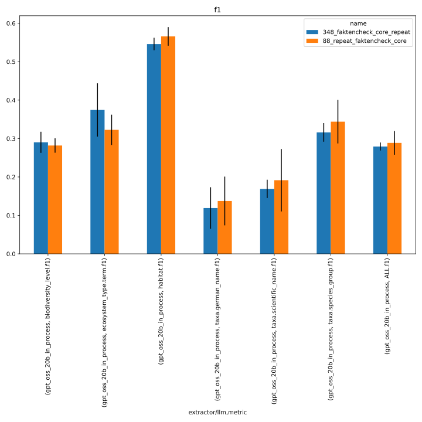
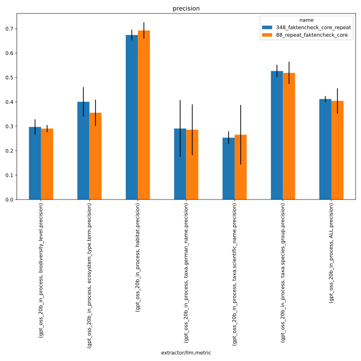
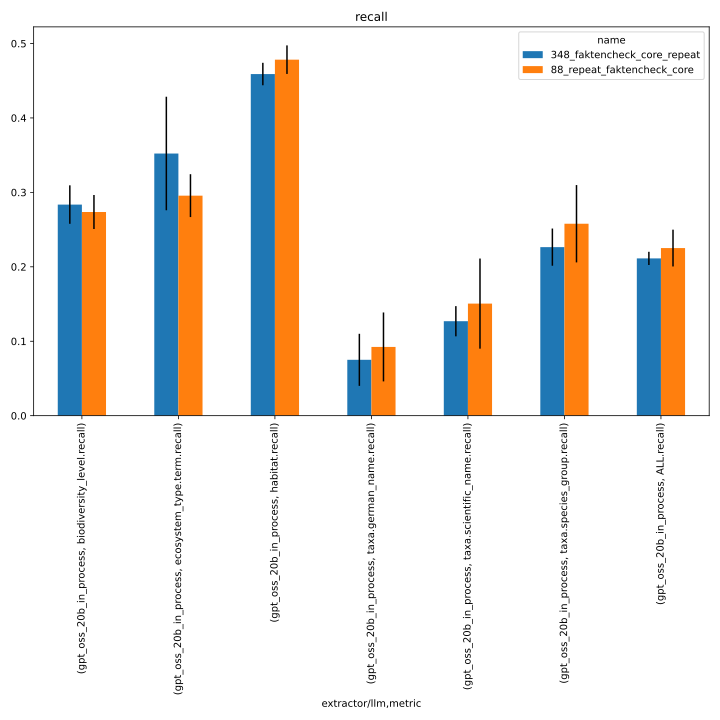
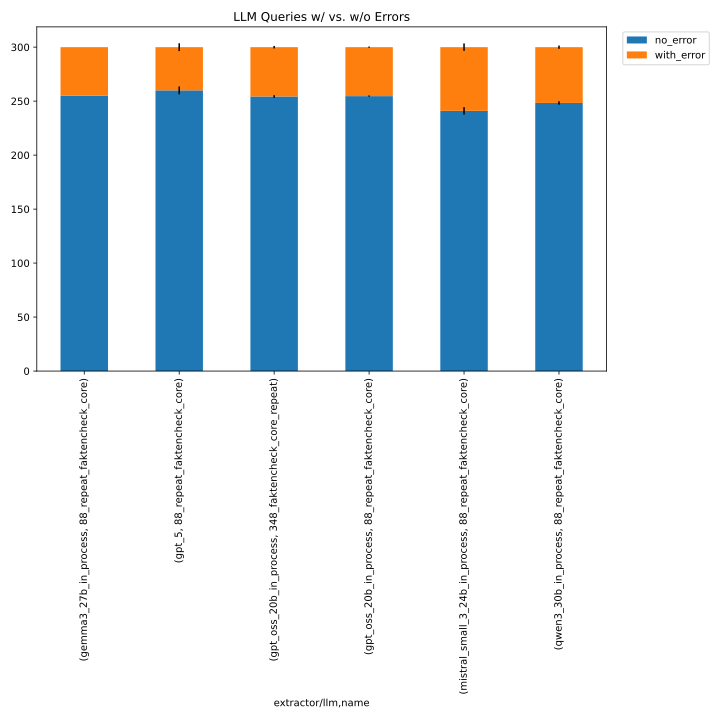
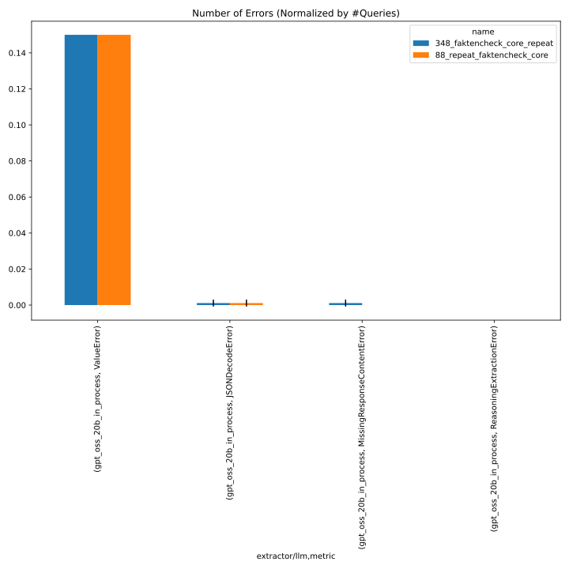

## runs with `n=3` (implicit/default)

### inference
@`screen -r kibad-llm`
```
./run_in_process.sh \
-pa "H100-SLT,H100-Trails,H100,A100-80GB" \
-u "-m kibad_llm.predict \
name=348_faktencheck_core_repeat \
experiment/predict=faktencheck_core_fields_schema_with_evidence \
extractor=repeat \
pdf_directory=/ds/text/kiba-d/dev-set-100 \
extractor/llm=gpt_oss_20b_in_process \
seed=42,1337,7331 \
--multirun"
```
> JOB_NAME kiba-d_ed89d810-a51e-48a6-804c-2e48df6b5862
=============================================
srun: jobinfo: version v1.0.0
srun: job 2515348 queued and waiting for resources

[2026-02-06 01:08:35,241][HYDRA] Contents of /netscratch/binder/projects/kibad-llm/logs/348_faktencheck_core_repeat/predict/multiruns/2026-02-05_21-59-57/job_return_value.md:
<details>
<summary>click to see result</summary>

|           | branch                                | commit_hash                              | is_dirty   | output_file                                                                                              | output_file_absolute                                                                                                                           | overrides.experiment/predict                 | overrides.extractor   | overrides.extractor/llm   | overrides.name              | overrides.pdf_directory     |   overrides.seed |   time_extraction |   time_pdf_conversion |
|:----------|:--------------------------------------|:-----------------------------------------|:-----------|:---------------------------------------------------------------------------------------------------------|:-----------------------------------------------------------------------------------------------------------------------------------------------|:---------------------------------------------|:----------------------|:--------------------------|:----------------------------|:----------------------------|-----------------:|------------------:|----------------------:|
| seed=1337 | extractor/outsource-aggregation_utils | 76d5c9c76f66545cae943feae416fcb8558b1f3d | False      | predictions/348_faktencheck_core_repeat/2026-02-05_21-59-57/2026-02-05_23-03-39_305226/predictions.jsonl | /netscratch/binder/projects/kibad-llm/predictions/348_faktencheck_core_repeat/2026-02-05_21-59-57/2026-02-05_23-03-39_305226/predictions.jsonl | faktencheck_core_fields_schema_with_evidence | repeat                | gpt_oss_20b_in_process    | 348_faktencheck_core_repeat | /ds/text/kiba-d/dev-set-100 |             1337 |           3484.48 |            0.00319692 |
| seed=42   | extractor/outsource-aggregation_utils | 76d5c9c76f66545cae943feae416fcb8558b1f3d | False      | predictions/348_faktencheck_core_repeat/2026-02-05_21-59-57/2026-02-05_21-59-58_011563/predictions.jsonl | /netscratch/binder/projects/kibad-llm/predictions/348_faktencheck_core_repeat/2026-02-05_21-59-57/2026-02-05_21-59-58_011563/predictions.jsonl | faktencheck_core_fields_schema_with_evidence | repeat                | gpt_oss_20b_in_process    | 348_faktencheck_core_repeat | /ds/text/kiba-d/dev-set-100 |               42 |           3633.66 |            0.057021   |
| seed=7331 | extractor/outsource-aggregation_utils | 76d5c9c76f66545cae943feae416fcb8558b1f3d | False      | predictions/348_faktencheck_core_repeat/2026-02-05_21-59-57/2026-02-06_00-02-44_879120/predictions.jsonl | /netscratch/binder/projects/kibad-llm/predictions/348_faktencheck_core_repeat/2026-02-05_21-59-57/2026-02-06_00-02-44_879120/predictions.jsonl | faktencheck_core_fields_schema_with_evidence | repeat                | gpt_oss_20b_in_process    | 348_faktencheck_core_repeat | /ds/text/kiba-d/dev-set-100 |             7331 |           3891.1  |            0.00260623 |

</details>

### metrics

```
uv run -m kibad_llm.evaluate \
name=348_faktencheck_core_repeat  \
experiment/evaluate=faktencheck_core_f1_micro_flat \
prediction_logs=logs/348_faktencheck_core_repeat/predict/multiruns/2026-02-05_21-59-57 \
+hydra.callbacks.save_job_return.multirun_markdown_group_by=prediction.overrides.extractor/llm \
--multirun
```

[2026-02-06 15:15:36,962][HYDRA] Contents of /netscratch/binder/projects/kibad-llm/logs/348_faktencheck_core_repeat/evaluate/multiruns/2026-02-06_15-15-35/job_return_value.md:
<details>
<summary>click to see result</summary>

| prediction.overrides.extractor/llm   |   ALL.f1.mean |   ALL.f1.std |   ALL.precision.mean |   ALL.precision.std |   ALL.recall.mean |   ALL.recall.std |   ALL.support.mean |   ALL.support.std |   AVG.f1.mean |   AVG.f1.std |   AVG.precision.mean |   AVG.precision.std |   AVG.recall.mean |   AVG.recall.std |   AVG.support.mean |   AVG.support.std |   biodiversity_level.f1.mean |   biodiversity_level.f1.std |   biodiversity_level.precision.mean |   biodiversity_level.precision.std |   biodiversity_level.recall.mean |   biodiversity_level.recall.std |   biodiversity_level.support.mean |   biodiversity_level.support.std |   ecosystem_type.term.f1.mean |   ecosystem_type.term.f1.std |   ecosystem_type.term.precision.mean |   ecosystem_type.term.precision.std |   ecosystem_type.term.recall.mean |   ecosystem_type.term.recall.std |   ecosystem_type.term.support.mean |   ecosystem_type.term.support.std |   habitat.f1.mean |   habitat.f1.std |   habitat.precision.mean |   habitat.precision.std |   habitat.recall.mean |   habitat.recall.std |   habitat.support.mean |   habitat.support.std |   prediction.job_return_value.time_extraction.mean |   prediction.job_return_value.time_extraction.std |   prediction.job_return_value.time_pdf_conversion.mean |   prediction.job_return_value.time_pdf_conversion.std |   taxa.german_name.f1.mean |   taxa.german_name.f1.std |   taxa.german_name.precision.mean |   taxa.german_name.precision.std |   taxa.german_name.recall.mean |   taxa.german_name.recall.std |   taxa.german_name.support.mean |   taxa.german_name.support.std |   taxa.scientific_name.f1.mean |   taxa.scientific_name.f1.std |   taxa.scientific_name.precision.mean |   taxa.scientific_name.precision.std |   taxa.scientific_name.recall.mean |   taxa.scientific_name.recall.std |   taxa.scientific_name.support.mean |   taxa.scientific_name.support.std |   taxa.species_group.f1.mean |   taxa.species_group.f1.std |   taxa.species_group.precision.mean |   taxa.species_group.precision.std |   taxa.species_group.recall.mean |   taxa.species_group.recall.std |   taxa.species_group.support.mean |   taxa.species_group.support.std | overrides.dataset.predictions.log                                                                                                                                                                                                    | overrides.experiment/evaluate                                                                          | overrides.name                                                                                | overrides.prediction_logs                                                                                                                                                                                                      | prediction.job_return_value.branch                                                                                          | prediction.job_return_value.commit_hash                                                                                              | prediction.job_return_value.is_dirty   | prediction.job_return_value.output_file                                                                                                                                                                                                                                                                                              | prediction.job_return_value.output_file_absolute                                                                                                                                                                                                                                                                                                                                                                                                       | prediction.overrides.experiment/predict                                                                                                          | prediction.overrides.extractor   | prediction.overrides.name                                                                     | prediction.overrides.pdf_directory                                                            | prediction.overrides.seed   |
|:-------------------------------------|--------------:|-------------:|---------------------:|--------------------:|------------------:|-----------------:|-------------------:|------------------:|--------------:|-------------:|---------------------:|--------------------:|------------------:|-----------------:|-------------------:|------------------:|-----------------------------:|----------------------------:|------------------------------------:|-----------------------------------:|---------------------------------:|--------------------------------:|----------------------------------:|---------------------------------:|------------------------------:|-----------------------------:|-------------------------------------:|------------------------------------:|----------------------------------:|---------------------------------:|-----------------------------------:|----------------------------------:|------------------:|-----------------:|-------------------------:|------------------------:|----------------------:|---------------------:|-----------------------:|----------------------:|---------------------------------------------------:|--------------------------------------------------:|-------------------------------------------------------:|------------------------------------------------------:|---------------------------:|--------------------------:|----------------------------------:|---------------------------------:|-------------------------------:|------------------------------:|--------------------------------:|-------------------------------:|-------------------------------:|------------------------------:|--------------------------------------:|-------------------------------------:|-----------------------------------:|----------------------------------:|------------------------------------:|-----------------------------------:|-----------------------------:|----------------------------:|------------------------------------:|-----------------------------------:|---------------------------------:|--------------------------------:|----------------------------------:|---------------------------------:|:-------------------------------------------------------------------------------------------------------------------------------------------------------------------------------------------------------------------------------------|:-------------------------------------------------------------------------------------------------------|:----------------------------------------------------------------------------------------------|:-------------------------------------------------------------------------------------------------------------------------------------------------------------------------------------------------------------------------------|:----------------------------------------------------------------------------------------------------------------------------|:-------------------------------------------------------------------------------------------------------------------------------------|:---------------------------------------|:-------------------------------------------------------------------------------------------------------------------------------------------------------------------------------------------------------------------------------------------------------------------------------------------------------------------------------------|:-------------------------------------------------------------------------------------------------------------------------------------------------------------------------------------------------------------------------------------------------------------------------------------------------------------------------------------------------------------------------------------------------------------------------------------------------------|:-------------------------------------------------------------------------------------------------------------------------------------------------|:---------------------------------|:----------------------------------------------------------------------------------------------|:----------------------------------------------------------------------------------------------|:----------------------------|
| gpt_oss_20b_in_process               |         0.279 |         0.01 |                0.412 |               0.012 |             0.211 |            0.009 |                792 |                 0 |         0.302 |        0.005 |                0.407 |               0.012 |             0.254 |            0.001 |                132 |                 0 |                         0.29 |                       0.027 |                               0.297 |                              0.031 |                            0.284 |                           0.026 |                                67 |                                0 |                         0.374 |                        0.069 |                                0.401 |                                0.06 |                             0.352 |                            0.076 |                                 53 |                                 0 |             0.546 |            0.016 |                    0.674 |                   0.022 |                 0.459 |                0.015 |                    138 |                     0 |                                            3669.75 |                                           205.698 |                                                  0.021 |                                                 0.031 |                      0.119 |                     0.054 |                             0.291 |                            0.116 |                          0.075 |                         0.035 |                             231 |                              0 |                          0.169 |                         0.024 |                                 0.253 |                                0.026 |                              0.127 |                              0.02 |                                 197 |                                  0 |                        0.316 |                       0.024 |                               0.526 |                              0.025 |                            0.226 |                           0.025 |                               106 |                                0 | ['logs/348_faktencheck_core_repeat/predict/multiruns/2026-02-05_21-59-57/0', 'logs/348_faktencheck_core_repeat/predict/multiruns/2026-02-05_21-59-57/1', 'logs/348_faktencheck_core_repeat/predict/multiruns/2026-02-05_21-59-57/2'] | ['faktencheck_core_f1_micro_flat', 'faktencheck_core_f1_micro_flat', 'faktencheck_core_f1_micro_flat'] | ['348_faktencheck_core_repeat', '348_faktencheck_core_repeat', '348_faktencheck_core_repeat'] | ['logs/348_faktencheck_core_repeat/predict/multiruns/2026-02-05_21-59-57', 'logs/348_faktencheck_core_repeat/predict/multiruns/2026-02-05_21-59-57', 'logs/348_faktencheck_core_repeat/predict/multiruns/2026-02-05_21-59-57'] | ['extractor/outsource-aggregation_utils', 'extractor/outsource-aggregation_utils', 'extractor/outsource-aggregation_utils'] | ['76d5c9c76f66545cae943feae416fcb8558b1f3d', '76d5c9c76f66545cae943feae416fcb8558b1f3d', '76d5c9c76f66545cae943feae416fcb8558b1f3d'] | [np.False_, np.False_, np.False_]      | ['predictions/348_faktencheck_core_repeat/2026-02-05_21-59-57/2026-02-05_21-59-58_011563/predictions.jsonl', 'predictions/348_faktencheck_core_repeat/2026-02-05_21-59-57/2026-02-05_23-03-39_305226/predictions.jsonl', 'predictions/348_faktencheck_core_repeat/2026-02-05_21-59-57/2026-02-06_00-02-44_879120/predictions.jsonl'] | ['/netscratch/binder/projects/kibad-llm/predictions/348_faktencheck_core_repeat/2026-02-05_21-59-57/2026-02-05_21-59-58_011563/predictions.jsonl', '/netscratch/binder/projects/kibad-llm/predictions/348_faktencheck_core_repeat/2026-02-05_21-59-57/2026-02-05_23-03-39_305226/predictions.jsonl', '/netscratch/binder/projects/kibad-llm/predictions/348_faktencheck_core_repeat/2026-02-05_21-59-57/2026-02-06_00-02-44_879120/predictions.jsonl'] | ['faktencheck_core_fields_schema_with_evidence', 'faktencheck_core_fields_schema_with_evidence', 'faktencheck_core_fields_schema_with_evidence'] | ['repeat', 'repeat', 'repeat']   | ['348_faktencheck_core_repeat', '348_faktencheck_core_repeat', '348_faktencheck_core_repeat'] | ['/ds/text/kiba-d/dev-set-100', '/ds/text/kiba-d/dev-set-100', '/ds/text/kiba-d/dev-set-100'] | ['42', '1337', '7331']      |

</details>

### errors

```
uv run -m kibad_llm.evaluate \
name=348_faktencheck_core_repeat \
experiment/evaluate=prediction_errors \
prediction_logs=logs/348_faktencheck_core_repeat/predict/multiruns/2026-02-05_21-59-57 \
+hydra.callbacks.save_job_return.multirun_markdown_group_by=prediction.overrides.extractor/llm \
--multirun
```

[2026-02-06 15:16:31,114][HYDRA] Contents of /netscratch/binder/projects/kibad-llm/logs/348_faktencheck_core_repeat/evaluate/multiruns/2026-02-06_15-16-29/job_return_value.md:
<details>
<summary>click to see result</summary>

| prediction.overrides.extractor/llm   |   JSONDecodeError.mean |   JSONDecodeError.std |   MissingResponseContentError.mean |   MissingResponseContentError.std |   ValueError.mean |   ValueError.std |   no_error.mean |   no_error.std |   prediction.job_return_value.time_extraction.mean |   prediction.job_return_value.time_extraction.std |   prediction.job_return_value.time_pdf_conversion.mean |   prediction.job_return_value.time_pdf_conversion.std |   with_error.mean |   with_error.std | overrides.dataset.predictions.log                                                                                                                                                                                                    | overrides.experiment/evaluate                                   | overrides.name                                                                                | overrides.prediction_logs                                                                                                                                                                                                      | prediction.job_return_value.branch                                                                                          | prediction.job_return_value.commit_hash                                                                                              | prediction.job_return_value.is_dirty   | prediction.job_return_value.output_file                                                                                                                                                                                                                                                                                              | prediction.job_return_value.output_file_absolute                                                                                                                                                                                                                                                                                                                                                                                                       | prediction.overrides.experiment/predict                                                                                                          | prediction.overrides.extractor   | prediction.overrides.name                                                                     | prediction.overrides.pdf_directory                                                            | prediction.overrides.seed   |
|:-------------------------------------|-----------------------:|----------------------:|-----------------------------------:|----------------------------------:|------------------:|-----------------:|----------------:|---------------:|---------------------------------------------------:|--------------------------------------------------:|-------------------------------------------------------:|------------------------------------------------------:|------------------:|-----------------:|:-------------------------------------------------------------------------------------------------------------------------------------------------------------------------------------------------------------------------------------|:----------------------------------------------------------------|:----------------------------------------------------------------------------------------------|:-------------------------------------------------------------------------------------------------------------------------------------------------------------------------------------------------------------------------------|:----------------------------------------------------------------------------------------------------------------------------|:-------------------------------------------------------------------------------------------------------------------------------------|:---------------------------------------|:-------------------------------------------------------------------------------------------------------------------------------------------------------------------------------------------------------------------------------------------------------------------------------------------------------------------------------------|:-------------------------------------------------------------------------------------------------------------------------------------------------------------------------------------------------------------------------------------------------------------------------------------------------------------------------------------------------------------------------------------------------------------------------------------------------------|:-------------------------------------------------------------------------------------------------------------------------------------------------|:---------------------------------|:----------------------------------------------------------------------------------------------|:----------------------------------------------------------------------------------------------|:----------------------------|
| gpt_oss_20b_in_process               |                      1 |                     0 |                                  1 |                                 0 |                45 |                0 |         254.333 |          1.155 |                                            3669.75 |                                           205.698 |                                                  0.021 |                                                 0.031 |            45.667 |            1.155 | ['logs/348_faktencheck_core_repeat/predict/multiruns/2026-02-05_21-59-57/0', 'logs/348_faktencheck_core_repeat/predict/multiruns/2026-02-05_21-59-57/1', 'logs/348_faktencheck_core_repeat/predict/multiruns/2026-02-05_21-59-57/2'] | ['prediction_errors', 'prediction_errors', 'prediction_errors'] | ['348_faktencheck_core_repeat', '348_faktencheck_core_repeat', '348_faktencheck_core_repeat'] | ['logs/348_faktencheck_core_repeat/predict/multiruns/2026-02-05_21-59-57', 'logs/348_faktencheck_core_repeat/predict/multiruns/2026-02-05_21-59-57', 'logs/348_faktencheck_core_repeat/predict/multiruns/2026-02-05_21-59-57'] | ['extractor/outsource-aggregation_utils', 'extractor/outsource-aggregation_utils', 'extractor/outsource-aggregation_utils'] | ['76d5c9c76f66545cae943feae416fcb8558b1f3d', '76d5c9c76f66545cae943feae416fcb8558b1f3d', '76d5c9c76f66545cae943feae416fcb8558b1f3d'] | [np.False_, np.False_, np.False_]      | ['predictions/348_faktencheck_core_repeat/2026-02-05_21-59-57/2026-02-05_21-59-58_011563/predictions.jsonl', 'predictions/348_faktencheck_core_repeat/2026-02-05_21-59-57/2026-02-05_23-03-39_305226/predictions.jsonl', 'predictions/348_faktencheck_core_repeat/2026-02-05_21-59-57/2026-02-06_00-02-44_879120/predictions.jsonl'] | ['/netscratch/binder/projects/kibad-llm/predictions/348_faktencheck_core_repeat/2026-02-05_21-59-57/2026-02-05_21-59-58_011563/predictions.jsonl', '/netscratch/binder/projects/kibad-llm/predictions/348_faktencheck_core_repeat/2026-02-05_21-59-57/2026-02-05_23-03-39_305226/predictions.jsonl', '/netscratch/binder/projects/kibad-llm/predictions/348_faktencheck_core_repeat/2026-02-05_21-59-57/2026-02-06_00-02-44_879120/predictions.jsonl'] | ['faktencheck_core_fields_schema_with_evidence', 'faktencheck_core_fields_schema_with_evidence', 'faktencheck_core_fields_schema_with_evidence'] | ['repeat', 'repeat', 'repeat']   | ['348_faktencheck_core_repeat', '348_faktencheck_core_repeat', '348_faktencheck_core_repeat'] | ['/ds/text/kiba-d/dev-set-100', '/ds/text/kiba-d/dev-set-100', '/ds/text/kiba-d/dev-set-100'] | ['42', '1337', '7331']      |

</details>

## runs with `n=5`

### inference
@ `screen -r kibad-llm`
```
./run_in_process.sh \
-pa "H100-SLT,H100-Trails,H100,A100-80GB" \
-u "-m kibad_llm.predict \
name=348_faktencheck_core_repeat \
experiment/predict=faktencheck_core_fields_schema_with_evidence \
extractor=repeat \
extractor.n=5 \
pdf_directory=/ds/text/kiba-d/dev-set-100 \
extractor/llm=gpt_oss_20b_in_process \
seed=42,1337,7331 \
--multirun"
```

> JOB_NAME kiba-d_1842db12-cd8a-4223-9539-378439150369
=============================================
srun: jobinfo: version v1.0.0
srun: job 2515644 queued and waiting for resources
srun: job 2515644 has been allocated resources
Job 2515644: Running on node(s) serv-3340
Job 2515644: Started at 2026-02-06 02:15:23+0100

Monitor this job here: http://monitoring.pegasus.kl.dfki.de/d/slurm-job-details/job-details?var-jobid=2515644&from=1770340523000

[2026-02-06 07:23:37,436][HYDRA] Contents of /netscratch/binder/projects/kibad-llm/logs/348_faktencheck_core_repeat/predict/multiruns/2026-02-06_02-15-40/job_return_value.md:

|           | branch                                | commit_hash                              | is_dirty   | output_file                                                                                              | output_file_absolute                                                                                                                           | overrides.experiment/predict                 | overrides.extractor   |   overrides.extractor.n | overrides.extractor/llm   | overrides.name              | overrides.pdf_directory     |   overrides.seed |   time_extraction |   time_pdf_conversion |
|:----------|:--------------------------------------|:-----------------------------------------|:-----------|:---------------------------------------------------------------------------------------------------------|:-----------------------------------------------------------------------------------------------------------------------------------------------|:---------------------------------------------|:----------------------|------------------------:|:--------------------------|:----------------------------|:----------------------------|-----------------:|------------------:|----------------------:|
| seed=1337 | extractor/outsource-aggregation_utils | 76d5c9c76f66545cae943feae416fcb8558b1f3d | False      | predictions/348_faktencheck_core_repeat/2026-02-06_02-15-40/2026-02-06_03-58-57_153792/predictions.jsonl | /netscratch/binder/projects/kibad-llm/predictions/348_faktencheck_core_repeat/2026-02-06_02-15-40/2026-02-06_03-58-57_153792/predictions.jsonl | faktencheck_core_fields_schema_with_evidence | repeat                |                       5 | gpt_oss_20b_in_process    | 348_faktencheck_core_repeat | /ds/text/kiba-d/dev-set-100 |             1337 |           6031.9  |            0.00473209 |
| seed=42   | extractor/outsource-aggregation_utils | 76d5c9c76f66545cae943feae416fcb8558b1f3d | False      | predictions/348_faktencheck_core_repeat/2026-02-06_02-15-40/2026-02-06_02-15-40_952160/predictions.jsonl | /netscratch/binder/projects/kibad-llm/predictions/348_faktencheck_core_repeat/2026-02-06_02-15-40/2026-02-06_02-15-40_952160/predictions.jsonl | faktencheck_core_fields_schema_with_evidence | repeat                |                       5 | gpt_oss_20b_in_process    | 348_faktencheck_core_repeat | /ds/text/kiba-d/dev-set-100 |               42 |           6086.94 |            0.00315617 |
| seed=7331 | extractor/outsource-aggregation_utils | 76d5c9c76f66545cae943feae416fcb8558b1f3d | False      | predictions/348_faktencheck_core_repeat/2026-02-06_02-15-40/2026-02-06_05-40-36_710728/predictions.jsonl | /netscratch/binder/projects/kibad-llm/predictions/348_faktencheck_core_repeat/2026-02-06_02-15-40/2026-02-06_05-40-36_710728/predictions.jsonl | faktencheck_core_fields_schema_with_evidence | repeat                |                       5 | gpt_oss_20b_in_process    | 348_faktencheck_core_repeat | /ds/text/kiba-d/dev-set-100 |             7331 |           6118.88 |            0.00593842 |

### metrics
```
uv run -m kibad_llm.evaluate \
name=348_faktencheck_core_repeat  \
experiment/evaluate=faktencheck_core_f1_micro_flat \
prediction_logs=logs/348_faktencheck_core_repeat/predict/multiruns/2026-02-06_02-15-40 \
+hydra.callbacks.save_job_return.multirun_markdown_group_by=prediction.overrides.extractor/llm \
--multirun
```

[2026-02-06 15:19:18,447][HYDRA] Contents of /netscratch/binder/projects/kibad-llm/logs/348_faktencheck_core_repeat/evaluate/multiruns/2026-02-06_15-19-16/job_return_value.md:
<details>
<summary>click to see results</summary>

| prediction.overrides.extractor/llm   |   ALL.f1.mean |   ALL.f1.std |   ALL.precision.mean |   ALL.precision.std |   ALL.recall.mean |   ALL.recall.std |   ALL.support.mean |   ALL.support.std |   AVG.f1.mean |   AVG.f1.std |   AVG.precision.mean |   AVG.precision.std |   AVG.recall.mean |   AVG.recall.std |   AVG.support.mean |   AVG.support.std |   biodiversity_level.f1.mean |   biodiversity_level.f1.std |   biodiversity_level.precision.mean |   biodiversity_level.precision.std |   biodiversity_level.recall.mean |   biodiversity_level.recall.std |   biodiversity_level.support.mean |   biodiversity_level.support.std |   ecosystem_type.term.f1.mean |   ecosystem_type.term.f1.std |   ecosystem_type.term.precision.mean |   ecosystem_type.term.precision.std |   ecosystem_type.term.recall.mean |   ecosystem_type.term.recall.std |   ecosystem_type.term.support.mean |   ecosystem_type.term.support.std |   habitat.f1.mean |   habitat.f1.std |   habitat.precision.mean |   habitat.precision.std |   habitat.recall.mean |   habitat.recall.std |   habitat.support.mean |   habitat.support.std |   prediction.job_return_value.time_extraction.mean |   prediction.job_return_value.time_extraction.std |   prediction.job_return_value.time_pdf_conversion.mean |   prediction.job_return_value.time_pdf_conversion.std |   taxa.german_name.f1.mean |   taxa.german_name.f1.std |   taxa.german_name.precision.mean |   taxa.german_name.precision.std |   taxa.german_name.recall.mean |   taxa.german_name.recall.std |   taxa.german_name.support.mean |   taxa.german_name.support.std |   taxa.scientific_name.f1.mean |   taxa.scientific_name.f1.std |   taxa.scientific_name.precision.mean |   taxa.scientific_name.precision.std |   taxa.scientific_name.recall.mean |   taxa.scientific_name.recall.std |   taxa.scientific_name.support.mean |   taxa.scientific_name.support.std |   taxa.species_group.f1.mean |   taxa.species_group.f1.std |   taxa.species_group.precision.mean |   taxa.species_group.precision.std |   taxa.species_group.recall.mean |   taxa.species_group.recall.std |   taxa.species_group.support.mean |   taxa.species_group.support.std | overrides.dataset.predictions.log                                                                                                                                                                                                    | overrides.experiment/evaluate                                                                          | overrides.name                                                                                | overrides.prediction_logs                                                                                                                                                                                                      | prediction.job_return_value.branch                                                                                          | prediction.job_return_value.commit_hash                                                                                              | prediction.job_return_value.is_dirty   | prediction.job_return_value.output_file                                                                                                                                                                                                                                                                                              | prediction.job_return_value.output_file_absolute                                                                                                                                                                                                                                                                                                                                                                                                       | prediction.overrides.experiment/predict                                                                                                          | prediction.overrides.extractor   | prediction.overrides.extractor.n   | prediction.overrides.name                                                                     | prediction.overrides.pdf_directory                                                            | prediction.overrides.seed   |
|:-------------------------------------|--------------:|-------------:|---------------------:|--------------------:|------------------:|-----------------:|-------------------:|------------------:|--------------:|-------------:|---------------------:|--------------------:|------------------:|-----------------:|-------------------:|------------------:|-----------------------------:|----------------------------:|------------------------------------:|-----------------------------------:|---------------------------------:|--------------------------------:|----------------------------------:|---------------------------------:|------------------------------:|-----------------------------:|-------------------------------------:|------------------------------------:|----------------------------------:|---------------------------------:|-----------------------------------:|----------------------------------:|------------------:|-----------------:|-------------------------:|------------------------:|----------------------:|---------------------:|-----------------------:|----------------------:|---------------------------------------------------:|--------------------------------------------------:|-------------------------------------------------------:|------------------------------------------------------:|---------------------------:|--------------------------:|----------------------------------:|---------------------------------:|-------------------------------:|------------------------------:|--------------------------------:|-------------------------------:|-------------------------------:|------------------------------:|--------------------------------------:|-------------------------------------:|-----------------------------------:|----------------------------------:|------------------------------------:|-----------------------------------:|-----------------------------:|----------------------------:|------------------------------------:|-----------------------------------:|---------------------------------:|--------------------------------:|----------------------------------:|---------------------------------:|:-------------------------------------------------------------------------------------------------------------------------------------------------------------------------------------------------------------------------------------|:-------------------------------------------------------------------------------------------------------|:----------------------------------------------------------------------------------------------|:-------------------------------------------------------------------------------------------------------------------------------------------------------------------------------------------------------------------------------|:----------------------------------------------------------------------------------------------------------------------------|:-------------------------------------------------------------------------------------------------------------------------------------|:---------------------------------------|:-------------------------------------------------------------------------------------------------------------------------------------------------------------------------------------------------------------------------------------------------------------------------------------------------------------------------------------|:-------------------------------------------------------------------------------------------------------------------------------------------------------------------------------------------------------------------------------------------------------------------------------------------------------------------------------------------------------------------------------------------------------------------------------------------------------|:-------------------------------------------------------------------------------------------------------------------------------------------------|:---------------------------------|:-----------------------------------|:----------------------------------------------------------------------------------------------|:----------------------------------------------------------------------------------------------|:----------------------------|
| gpt_oss_20b_in_process               |         0.288 |        0.015 |                0.433 |               0.017 |             0.215 |            0.013 |                792 |                 0 |         0.304 |        0.019 |                0.432 |               0.016 |             0.246 |            0.021 |                132 |                 0 |                        0.283 |                       0.016 |                               0.307 |                              0.021 |                            0.264 |                           0.017 |                                67 |                                0 |                         0.332 |                        0.052 |                                0.401 |                               0.054 |                             0.283 |                             0.05 |                                 53 |                                 0 |             0.535 |            0.025 |                    0.653 |                   0.031 |                 0.454 |                0.027 |                    138 |                     0 |                                            6079.24 |                                            43.996 |                                                  0.005 |                                                 0.001 |                      0.142 |                     0.016 |                             0.324 |                            0.024 |                          0.091 |                         0.011 |                             231 |                              0 |                          0.204 |                         0.012 |                                 0.309 |                                0.013 |                              0.152 |                              0.01 |                                 197 |                                  0 |                         0.33 |                       0.027 |                               0.599 |                              0.051 |                             0.23 |                            0.03 |                               106 |                                0 | ['logs/348_faktencheck_core_repeat/predict/multiruns/2026-02-06_02-15-40/0', 'logs/348_faktencheck_core_repeat/predict/multiruns/2026-02-06_02-15-40/1', 'logs/348_faktencheck_core_repeat/predict/multiruns/2026-02-06_02-15-40/2'] | ['faktencheck_core_f1_micro_flat', 'faktencheck_core_f1_micro_flat', 'faktencheck_core_f1_micro_flat'] | ['348_faktencheck_core_repeat', '348_faktencheck_core_repeat', '348_faktencheck_core_repeat'] | ['logs/348_faktencheck_core_repeat/predict/multiruns/2026-02-06_02-15-40', 'logs/348_faktencheck_core_repeat/predict/multiruns/2026-02-06_02-15-40', 'logs/348_faktencheck_core_repeat/predict/multiruns/2026-02-06_02-15-40'] | ['extractor/outsource-aggregation_utils', 'extractor/outsource-aggregation_utils', 'extractor/outsource-aggregation_utils'] | ['76d5c9c76f66545cae943feae416fcb8558b1f3d', '76d5c9c76f66545cae943feae416fcb8558b1f3d', '76d5c9c76f66545cae943feae416fcb8558b1f3d'] | [np.False_, np.False_, np.False_]      | ['predictions/348_faktencheck_core_repeat/2026-02-06_02-15-40/2026-02-06_02-15-40_952160/predictions.jsonl', 'predictions/348_faktencheck_core_repeat/2026-02-06_02-15-40/2026-02-06_03-58-57_153792/predictions.jsonl', 'predictions/348_faktencheck_core_repeat/2026-02-06_02-15-40/2026-02-06_05-40-36_710728/predictions.jsonl'] | ['/netscratch/binder/projects/kibad-llm/predictions/348_faktencheck_core_repeat/2026-02-06_02-15-40/2026-02-06_02-15-40_952160/predictions.jsonl', '/netscratch/binder/projects/kibad-llm/predictions/348_faktencheck_core_repeat/2026-02-06_02-15-40/2026-02-06_03-58-57_153792/predictions.jsonl', '/netscratch/binder/projects/kibad-llm/predictions/348_faktencheck_core_repeat/2026-02-06_02-15-40/2026-02-06_05-40-36_710728/predictions.jsonl'] | ['faktencheck_core_fields_schema_with_evidence', 'faktencheck_core_fields_schema_with_evidence', 'faktencheck_core_fields_schema_with_evidence'] | ['repeat', 'repeat', 'repeat']   | ['5', '5', '5']                    | ['348_faktencheck_core_repeat', '348_faktencheck_core_repeat', '348_faktencheck_core_repeat'] | ['/ds/text/kiba-d/dev-set-100', '/ds/text/kiba-d/dev-set-100', '/ds/text/kiba-d/dev-set-100'] | ['42', '1337', '7331']      |

</details>

### errors
```
uv run -m kibad_llm.evaluate \
name=348_faktencheck_core_repeat \
experiment/evaluate=prediction_errors \
prediction_logs=logs/348_faktencheck_core_repeat/predict/multiruns/2026-02-06_02-15-40 \
+hydra.callbacks.save_job_return.multirun_markdown_group_by=prediction.overrides.extractor/llm \
--multirun
```

[2026-02-06 15:20:13,277][HYDRA] Contents of /netscratch/binder/projects/kibad-llm/logs/348_faktencheck_core_repeat/evaluate/multiruns/2026-02-06_15-20-11/job_return_value.md:
<details>
<summary>click to see results</summary>

| prediction.overrides.extractor/llm   |   JSONDecodeError.mean |   JSONDecodeError.std |   ValueError.mean |   ValueError.std |   no_error.mean |   no_error.std |   prediction.job_return_value.time_extraction.mean |   prediction.job_return_value.time_extraction.std |   prediction.job_return_value.time_pdf_conversion.mean |   prediction.job_return_value.time_pdf_conversion.std |   with_error.mean |   with_error.std | overrides.dataset.predictions.log                                                                                                                                                                                                    | overrides.experiment/evaluate                                   | overrides.name                                                                                | overrides.prediction_logs                                                                                                                                                                                                      | prediction.job_return_value.branch                                                                                          | prediction.job_return_value.commit_hash                                                                                              | prediction.job_return_value.is_dirty   | prediction.job_return_value.output_file                                                                                                                                                                                                                                                                                              | prediction.job_return_value.output_file_absolute                                                                                                                                                                                                                                                                                                                                                                                                       | prediction.overrides.experiment/predict                                                                                                          | prediction.overrides.extractor   | prediction.overrides.extractor.n   | prediction.overrides.name                                                                     | prediction.overrides.pdf_directory                                                            | prediction.overrides.seed   |
|:-------------------------------------|-----------------------:|----------------------:|------------------:|-----------------:|----------------:|---------------:|---------------------------------------------------:|--------------------------------------------------:|-------------------------------------------------------:|------------------------------------------------------:|------------------:|-----------------:|:-------------------------------------------------------------------------------------------------------------------------------------------------------------------------------------------------------------------------------------|:----------------------------------------------------------------|:----------------------------------------------------------------------------------------------|:-------------------------------------------------------------------------------------------------------------------------------------------------------------------------------------------------------------------------------|:----------------------------------------------------------------------------------------------------------------------------|:-------------------------------------------------------------------------------------------------------------------------------------|:---------------------------------------|:-------------------------------------------------------------------------------------------------------------------------------------------------------------------------------------------------------------------------------------------------------------------------------------------------------------------------------------|:-------------------------------------------------------------------------------------------------------------------------------------------------------------------------------------------------------------------------------------------------------------------------------------------------------------------------------------------------------------------------------------------------------------------------------------------------------|:-------------------------------------------------------------------------------------------------------------------------------------------------|:---------------------------------|:-----------------------------------|:----------------------------------------------------------------------------------------------|:----------------------------------------------------------------------------------------------|:----------------------------|
| gpt_oss_20b_in_process               |                      1 |                     0 |                75 |                0 |         424.333 |          0.577 |                                            6079.24 |                                            43.996 |                                                  0.005 |                                                 0.001 |            75.667 |            0.577 | ['logs/348_faktencheck_core_repeat/predict/multiruns/2026-02-06_02-15-40/0', 'logs/348_faktencheck_core_repeat/predict/multiruns/2026-02-06_02-15-40/1', 'logs/348_faktencheck_core_repeat/predict/multiruns/2026-02-06_02-15-40/2'] | ['prediction_errors', 'prediction_errors', 'prediction_errors'] | ['348_faktencheck_core_repeat', '348_faktencheck_core_repeat', '348_faktencheck_core_repeat'] | ['logs/348_faktencheck_core_repeat/predict/multiruns/2026-02-06_02-15-40', 'logs/348_faktencheck_core_repeat/predict/multiruns/2026-02-06_02-15-40', 'logs/348_faktencheck_core_repeat/predict/multiruns/2026-02-06_02-15-40'] | ['extractor/outsource-aggregation_utils', 'extractor/outsource-aggregation_utils', 'extractor/outsource-aggregation_utils'] | ['76d5c9c76f66545cae943feae416fcb8558b1f3d', '76d5c9c76f66545cae943feae416fcb8558b1f3d', '76d5c9c76f66545cae943feae416fcb8558b1f3d'] | [np.False_, np.False_, np.False_]      | ['predictions/348_faktencheck_core_repeat/2026-02-06_02-15-40/2026-02-06_02-15-40_952160/predictions.jsonl', 'predictions/348_faktencheck_core_repeat/2026-02-06_02-15-40/2026-02-06_03-58-57_153792/predictions.jsonl', 'predictions/348_faktencheck_core_repeat/2026-02-06_02-15-40/2026-02-06_05-40-36_710728/predictions.jsonl'] | ['/netscratch/binder/projects/kibad-llm/predictions/348_faktencheck_core_repeat/2026-02-06_02-15-40/2026-02-06_02-15-40_952160/predictions.jsonl', '/netscratch/binder/projects/kibad-llm/predictions/348_faktencheck_core_repeat/2026-02-06_02-15-40/2026-02-06_03-58-57_153792/predictions.jsonl', '/netscratch/binder/projects/kibad-llm/predictions/348_faktencheck_core_repeat/2026-02-06_02-15-40/2026-02-06_05-40-36_710728/predictions.jsonl'] | ['faktencheck_core_fields_schema_with_evidence', 'faktencheck_core_fields_schema_with_evidence', 'faktencheck_core_fields_schema_with_evidence'] | ['repeat', 'repeat', 'repeat']   | ['5', '5', '5']                    | ['348_faktencheck_core_repeat', '348_faktencheck_core_repeat', '348_faktencheck_core_repeat'] | ['/ds/text/kiba-d/dev-set-100', '/ds/text/kiba-d/dev-set-100', '/ds/text/kiba-d/dev-set-100'] | ['42', '1337', '7331']      |

</details>
