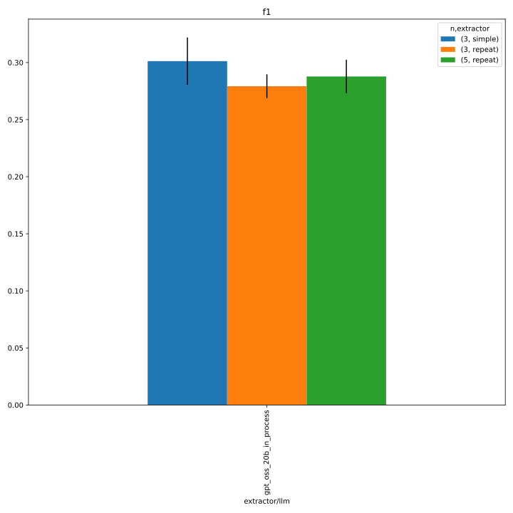
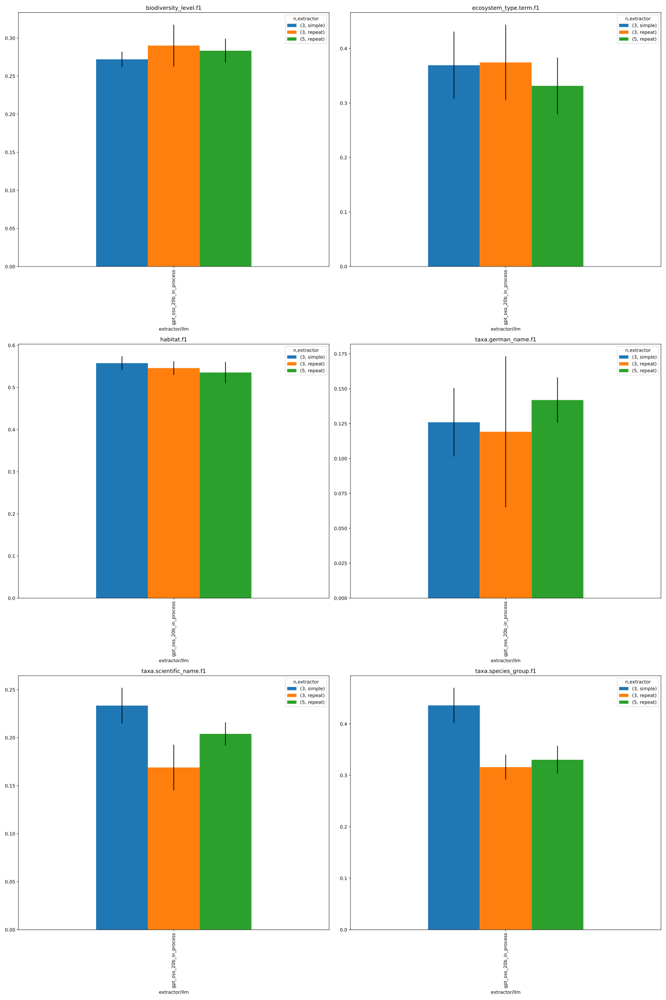
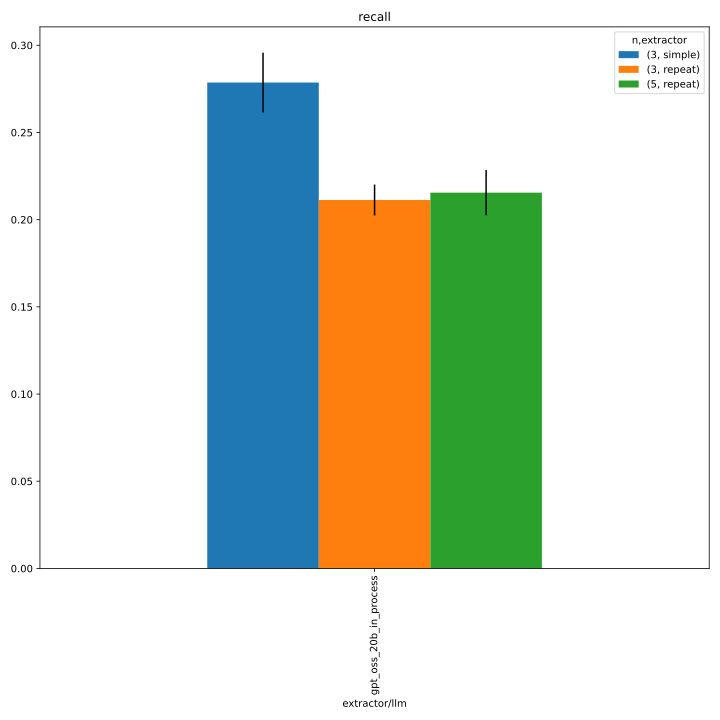
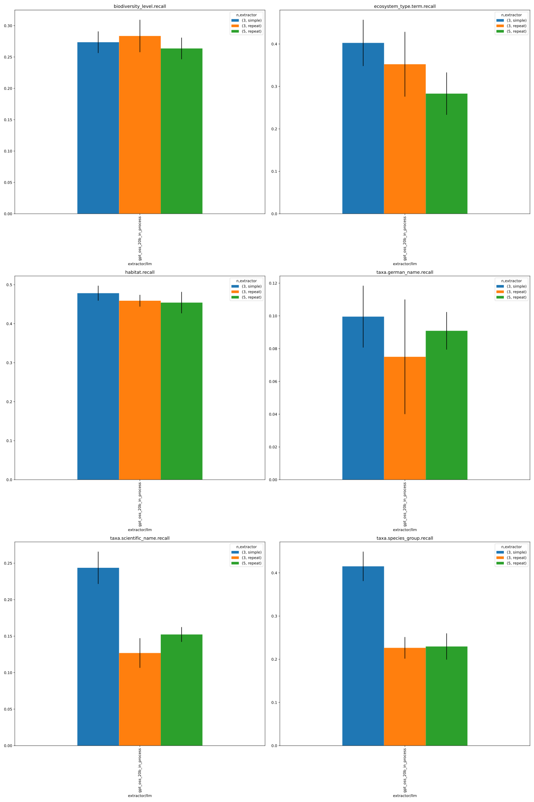
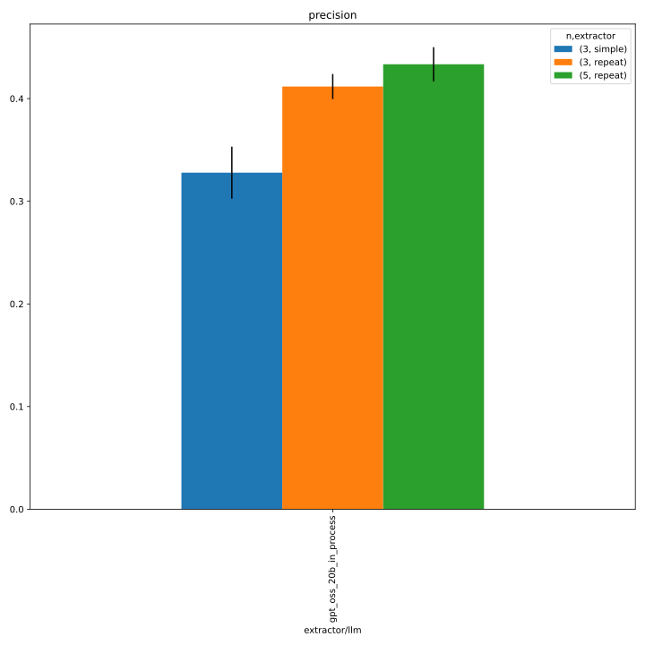
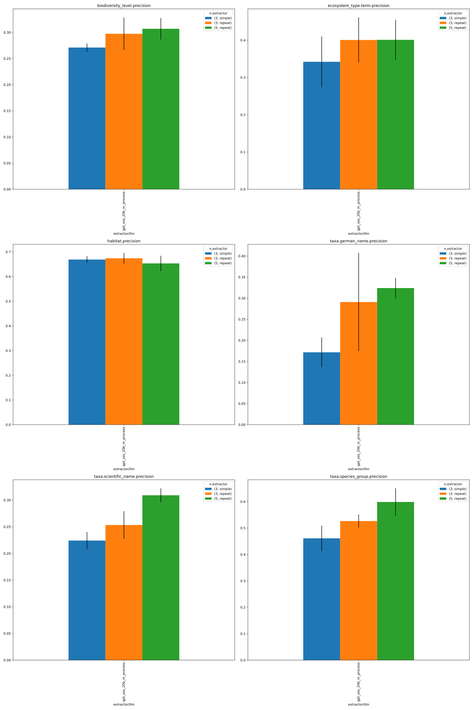
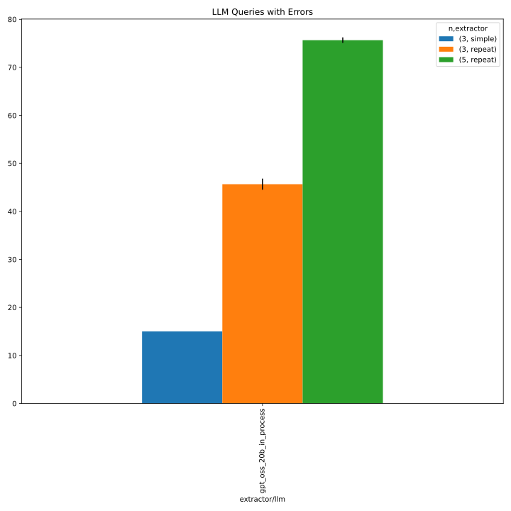
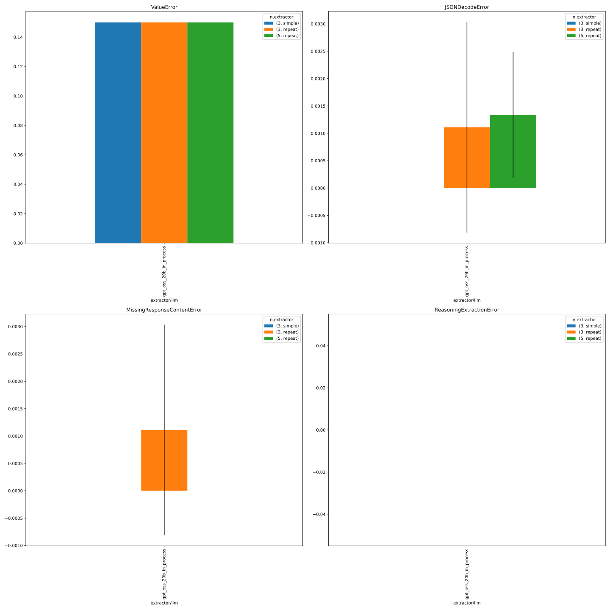

# 348_faktencheck_core_repeat

See #348 for details.

## notebook parameters

### just this experiment

```python
NAME = "348_faktencheck_core_repeat"

FILL_NA = {"prediction.overrides.extractor.n": 3}

METRICS = ["f1", "recall", "precision"]
# used to group the data
INDEX_COLUMNS = ["prediction.overrides.extractor/llm", "prediction.overrides.extractor.n"]
PLOT_KWARGS = {
    # can be either "metric" or one of the INDEX_COLUMNS (or multiple of them)
    "xgroup": ["prediction.overrides.extractor/llm", "prediction.overrides.extractor.n"],
    # add any more arguments passed to pd.DataFrame.plot
}
```


### comparison with baseline
baseline: [327_faktencheck_core_with_persona](../327_faktencheck_core_with_persona/)

```python
NAME = "348_faktencheck_core_repeat"

SUBDIR = ["evaluate", "../327_faktencheck_core_with_persona/evaluate"]

FILL_NA = {"prediction.overrides.extractor.n": 3, "prediction.overrides.extractor": "simple"}

METRICS = ["f1", "recall", "precision"]
# used to group the data
INDEX_COLUMNS = ["prediction.overrides.extractor/llm", "prediction.overrides.extractor.n", "prediction.overrides.extractor"]
PLOT_KWARGS = {
    # can be either "metric" or one of the INDEX_COLUMNS (or multiple of them)
    "xgroup": ["prediction.overrides.extractor.n", "prediction.overrides.extractor"],
    # add any more arguments passed to pd.DataFrame.plot
    "create_subplot_for_each": "metric",
    #"set_missing_values_to_zero": True,
    "subplot_columns": 2,
}
```
#### f1




#### recall




#### precision




#### errors


