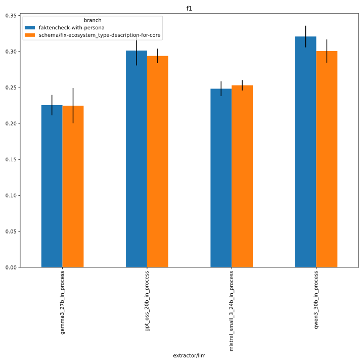
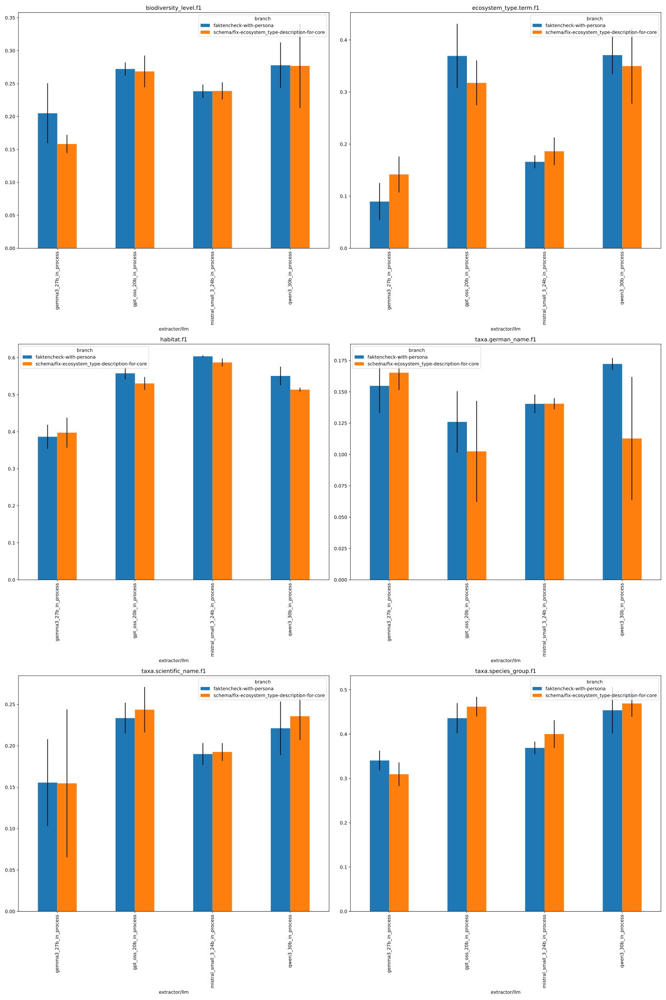
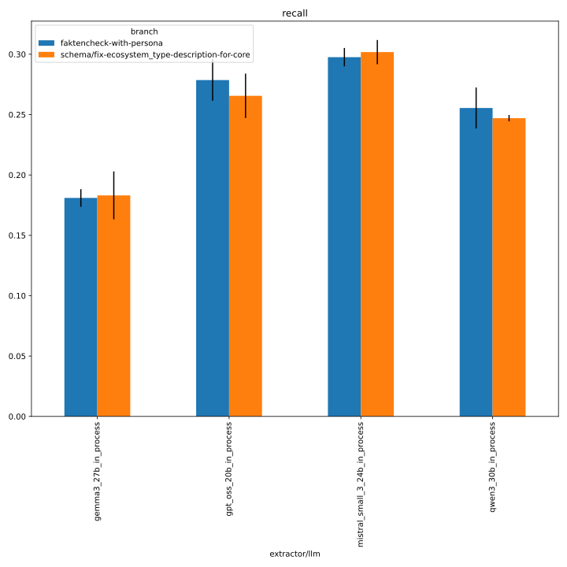
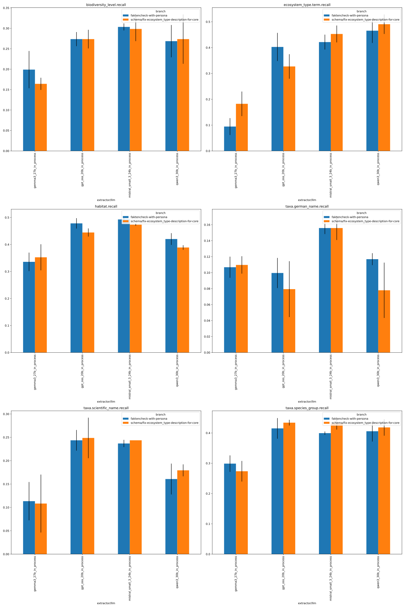
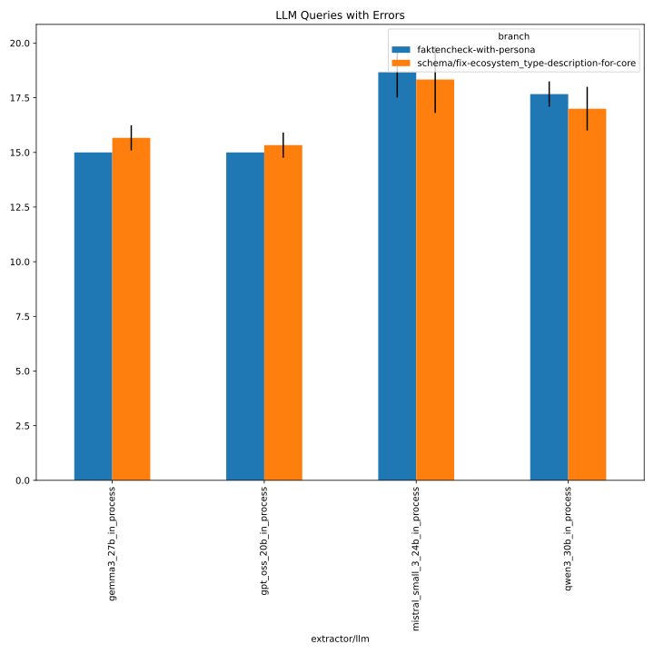
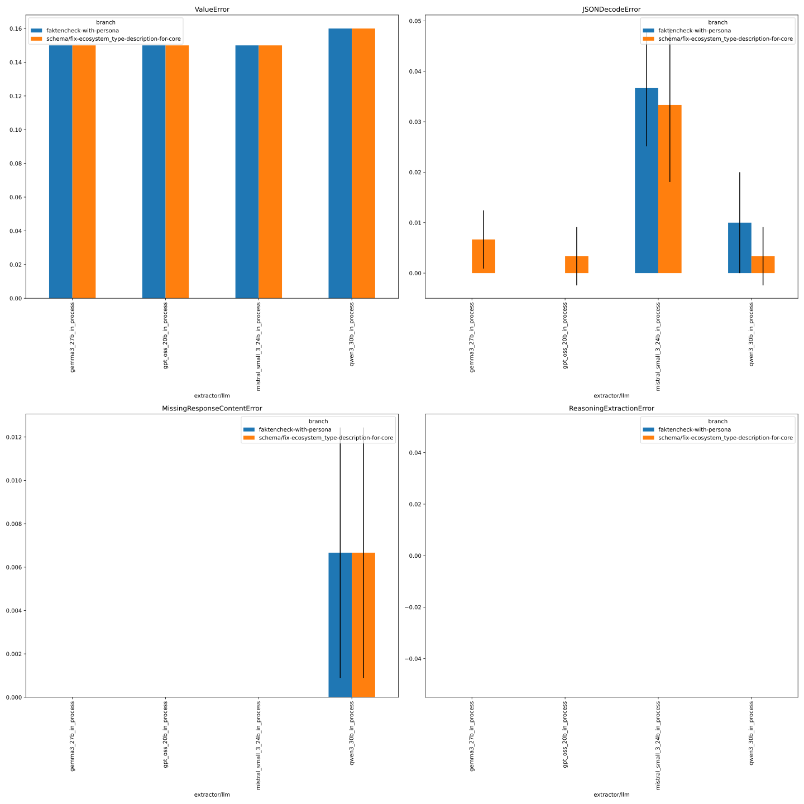

# 371_faktencheck_core_fix_ecosystem_type

See [#371](https://github.com/DFKI-NLP/kibad-llm/pull/371) for details.

## notebook parameters

### comparing description and cardinality change with baseline
- baseline: [327_faktencheck_core_with_persona](../327_faktencheck_core_with_persona)

```python
NAME = "371_faktencheck_core_fix_ecosystem_type"

FILE_NAME_PREFIX = "description_and_cardinality_change_baseline_"

SUBDIR =[
    # metrics
    "evaluate/multiruns/2026-02-17_09-59-34",
    # errors
    "evaluate/multiruns/2026-02-17_10-00-13",
    # baseline metrics and errors
    "../327_faktencheck_core_with_persona/evaluate",
]

METRICS = ["f1", "recall"]
# used to group the data
INDEX_COLUMNS = ["prediction.overrides.extractor/llm", "prediction.job_return_value.branch"]
PLOT_KWARGS = {
    # can be either "metric" or one of the INDEX_COLUMNS (or multiple of them)
    "xgroup": "prediction.job_return_value.branch",
    "create_subplot_for_each": "metric",
    "subplot_columns": 2,
    # add any more arguments passed to pd.DataFrame.plot
}
```

### f1



### recall



### errors



## evaluate description content and cardinality change
- commit: [1bbffda](https://github.com/DFKI-NLP/kibad-llm/pull/371/commits/1bbffda9bb6b96bbecdfdeda933d1107bd0a4998)
- baseline: [327_faktencheck_core_with_persona](https://github.com/DFKI-NLP/kibad-llm/tree/main/data/prediction_results/logs/327_faktencheck_core_with_persona)

### inference
```
./run_in_process.sh \
-pa "H100-SLT,H100-Trails,H100,A100-80GB" \
-t "2-00:00:00" \
-u "-m kibad_llm.predict \
name=371_faktencheck_core_fix_ecosystem_type \
experiment/predict=faktencheck_core_fields_schema_with_evidence \
pdf_directory=/ds/text/kiba-d/dev-set-100 \
extractor/llm=gpt_oss_20b_in_process,gemma3_27b_in_process,qwen3_30b_in_process,mistral_small_3_24b_in_process \
seed=42,1337,7331 \
--multirun"
```
console output:
```
=============================================
>>> USING PARTITION H100-SLT,H100-Trails,H100,A100-80GB
>>> MAX TIME 2-00:00:00
>>> SUBMITTED Mon Feb 16 03:41:12 PM CET 2026
>>> UV_ARGS --cache-dir /netscratch/binder/cache/uv -m kibad_llm.predict name=371_faktencheck_core_fix_ecosystem_type experiment/predict=faktencheck_core_fields_schema_with_evidence pdf_directory=/ds/text/kiba-d/dev-set-100 extractor/llm=gpt_oss_20b_in_process,gemma3_27b_in_process,qwen3_30b_in_process,mistral_small_3_24b_in_process seed=42,1337,7331 --multirun
>>> JOB_NAME kiba-d_c8288db5-67e0-4180-bafe-349d4213b8ad
=============================================
srun: jobinfo: version v1.0.0
srun: job 2539943 queued and waiting for resources
```
timestamp: `2026-02-16_15-47-19`

[2026-02-16 22:10:40,053][HYDRA] Contents of /netscratch/binder/projects/kibad-llm/logs/371_faktencheck_core_fix_ecosystem_type/predict/multiruns/2026-02-16_15-47-19/job_return_value.md:

<details>
<summary>click to see</summary>

|                                                        | branch                                         | commit_hash                              | is_dirty   | output_file                                                                                                          | output_file_absolute                                                                                                                                       | overrides.experiment/predict                 | overrides.extractor/llm        | overrides.name                          | overrides.pdf_directory     |   overrides.seed |   slurm_job_id |   time_end |   time_extraction |   time_pdf_conversion |   time_start |
|:-------------------------------------------------------|:-----------------------------------------------|:-----------------------------------------|:-----------|:---------------------------------------------------------------------------------------------------------------------|:-----------------------------------------------------------------------------------------------------------------------------------------------------------|:---------------------------------------------|:-------------------------------|:----------------------------------------|:----------------------------|-----------------:|---------------:|-----------:|------------------:|----------------------:|-------------:|
| extractor/llm=gemma3_27b_in_process#seed=1337          | schema/fix-ecosystem_type-description-for-core | 1bbffda9bb6b96bbecdfdeda933d1107bd0a4998 | False      | predictions/371_faktencheck_core_fix_ecosystem_type/2026-02-16_15-47-19/2026-02-16_17-21-55_998609/predictions.jsonl | /netscratch/binder/projects/kibad-llm/predictions/371_faktencheck_core_fix_ecosystem_type/2026-02-16_15-47-19/2026-02-16_17-21-55_998609/predictions.jsonl | faktencheck_core_fields_schema_with_evidence | gemma3_27b_in_process          | 371_faktencheck_core_fix_ecosystem_type | /ds/text/kiba-d/dev-set-100 |             1337 |        2539943 | 1771259969 |           967.234 |            0.00264771 |   1771258915 |
| extractor/llm=gemma3_27b_in_process#seed=42            | schema/fix-ecosystem_type-description-for-core | 1bbffda9bb6b96bbecdfdeda933d1107bd0a4998 | False      | predictions/371_faktencheck_core_fix_ecosystem_type/2026-02-16_15-47-19/2026-02-16_17-00-54_783847/predictions.jsonl | /netscratch/binder/projects/kibad-llm/predictions/371_faktencheck_core_fix_ecosystem_type/2026-02-16_15-47-19/2026-02-16_17-00-54_783847/predictions.jsonl | faktencheck_core_fields_schema_with_evidence | gemma3_27b_in_process          | 371_faktencheck_core_fix_ecosystem_type | /ds/text/kiba-d/dev-set-100 |               42 |        2539943 | 1771258915 |          1125.2   |            0.00285872 |   1771257654 |
| extractor/llm=gemma3_27b_in_process#seed=7331          | schema/fix-ecosystem_type-description-for-core | 1bbffda9bb6b96bbecdfdeda933d1107bd0a4998 | False      | predictions/371_faktencheck_core_fix_ecosystem_type/2026-02-16_15-47-19/2026-02-16_17-39-29_775051/predictions.jsonl | /netscratch/binder/projects/kibad-llm/predictions/371_faktencheck_core_fix_ecosystem_type/2026-02-16_15-47-19/2026-02-16_17-39-29_775051/predictions.jsonl | faktencheck_core_fields_schema_with_evidence | gemma3_27b_in_process          | 371_faktencheck_core_fix_ecosystem_type | /ds/text/kiba-d/dev-set-100 |             7331 |        2539943 | 1771261136 |          1090.14  |            0.00250115 |   1771259969 |
| extractor/llm=gpt_oss_20b_in_process#seed=1337         | schema/fix-ecosystem_type-description-for-core | 1bbffda9bb6b96bbecdfdeda933d1107bd0a4998 | False      | predictions/371_faktencheck_core_fix_ecosystem_type/2026-02-16_15-47-19/2026-02-16_16-13-56_600942/predictions.jsonl | /netscratch/binder/projects/kibad-llm/predictions/371_faktencheck_core_fix_ecosystem_type/2026-02-16_15-47-19/2026-02-16_16-13-56_600942/predictions.jsonl | faktencheck_core_fields_schema_with_evidence | gpt_oss_20b_in_process         | 371_faktencheck_core_fix_ecosystem_type | /ds/text/kiba-d/dev-set-100 |             1337 |        2539943 | 1771256376 |          1492.14  |            0.00258528 |   1771254836 |
| extractor/llm=gpt_oss_20b_in_process#seed=42           | schema/fix-ecosystem_type-description-for-core | 1bbffda9bb6b96bbecdfdeda933d1107bd0a4998 | False      | predictions/371_faktencheck_core_fix_ecosystem_type/2026-02-16_15-47-19/2026-02-16_15-47-21_337407/predictions.jsonl | /netscratch/binder/projects/kibad-llm/predictions/371_faktencheck_core_fix_ecosystem_type/2026-02-16_15-47-19/2026-02-16_15-47-21_337407/predictions.jsonl | faktencheck_core_fields_schema_with_evidence | gpt_oss_20b_in_process         | 371_faktencheck_core_fix_ecosystem_type | /ds/text/kiba-d/dev-set-100 |               42 |        2539943 | 1771254836 |          1290.98  |            0.108222   |   1771253241 |
| extractor/llm=gpt_oss_20b_in_process#seed=7331         | schema/fix-ecosystem_type-description-for-core | 1bbffda9bb6b96bbecdfdeda933d1107bd0a4998 | False      | predictions/371_faktencheck_core_fix_ecosystem_type/2026-02-16_15-47-19/2026-02-16_16-39-36_360133/predictions.jsonl | /netscratch/binder/projects/kibad-llm/predictions/371_faktencheck_core_fix_ecosystem_type/2026-02-16_15-47-19/2026-02-16_16-39-36_360133/predictions.jsonl | faktencheck_core_fields_schema_with_evidence | gpt_oss_20b_in_process         | 371_faktencheck_core_fix_ecosystem_type | /ds/text/kiba-d/dev-set-100 |             7331 |        2539943 | 1771257654 |          1229.99  |            0.00269447 |   1771256376 |
| extractor/llm=mistral_small_3_24b_in_process#seed=1337 | schema/fix-ecosystem_type-description-for-core | 1bbffda9bb6b96bbecdfdeda933d1107bd0a4998 | False      | predictions/371_faktencheck_core_fix_ecosystem_type/2026-02-16_15-47-19/2026-02-16_20-47-01_088420/predictions.jsonl | /netscratch/binder/projects/kibad-llm/predictions/371_faktencheck_core_fix_ecosystem_type/2026-02-16_15-47-19/2026-02-16_20-47-01_088420/predictions.jsonl | faktencheck_core_fields_schema_with_evidence | mistral_small_3_24b_in_process | 371_faktencheck_core_fix_ecosystem_type | /ds/text/kiba-d/dev-set-100 |             1337 |        2539943 | 1771273798 |          2525.65  |            0.00271593 |   1771271221 |
| extractor/llm=mistral_small_3_24b_in_process#seed=42   | schema/fix-ecosystem_type-description-for-core | 1bbffda9bb6b96bbecdfdeda933d1107bd0a4998 | False      | predictions/371_faktencheck_core_fix_ecosystem_type/2026-02-16_15-47-19/2026-02-16_20-03-00_882743/predictions.jsonl | /netscratch/binder/projects/kibad-llm/predictions/371_faktencheck_core_fix_ecosystem_type/2026-02-16_15-47-19/2026-02-16_20-03-00_882743/predictions.jsonl | faktencheck_core_fields_schema_with_evidence | mistral_small_3_24b_in_process | 371_faktencheck_core_fix_ecosystem_type | /ds/text/kiba-d/dev-set-100 |               42 |        2539943 | 1771271220 |          2496.92  |            0.0025252  |   1771268580 |
| extractor/llm=mistral_small_3_24b_in_process#seed=7331 | schema/fix-ecosystem_type-description-for-core | 1bbffda9bb6b96bbecdfdeda933d1107bd0a4998 | False      | predictions/371_faktencheck_core_fix_ecosystem_type/2026-02-16_15-47-19/2026-02-16_21-29-59_084570/predictions.jsonl | /netscratch/binder/projects/kibad-llm/predictions/371_faktencheck_core_fix_ecosystem_type/2026-02-16_15-47-19/2026-02-16_21-29-59_084570/predictions.jsonl | faktencheck_core_fields_schema_with_evidence | mistral_small_3_24b_in_process | 371_faktencheck_core_fix_ecosystem_type | /ds/text/kiba-d/dev-set-100 |             7331 |        2539943 | 1771276239 |          2379.17  |            0.00252529 |   1771273799 |
| extractor/llm=qwen3_30b_in_process#seed=1337           | schema/fix-ecosystem_type-description-for-core | 1bbffda9bb6b96bbecdfdeda933d1107bd0a4998 | False      | predictions/371_faktencheck_core_fix_ecosystem_type/2026-02-16_15-47-19/2026-02-16_18-40-18_529835/predictions.jsonl | /netscratch/binder/projects/kibad-llm/predictions/371_faktencheck_core_fix_ecosystem_type/2026-02-16_15-47-19/2026-02-16_18-40-18_529835/predictions.jsonl | faktencheck_core_fields_schema_with_evidence | qwen3_30b_in_process           | 371_faktencheck_core_fix_ecosystem_type | /ds/text/kiba-d/dev-set-100 |             1337 |        2539943 | 1771266103 |          2425.99  |            0.00261241 |   1771263618 |
| extractor/llm=qwen3_30b_in_process#seed=42             | schema/fix-ecosystem_type-description-for-core | 1bbffda9bb6b96bbecdfdeda933d1107bd0a4998 | False      | predictions/371_faktencheck_core_fix_ecosystem_type/2026-02-16_15-47-19/2026-02-16_17-58-57_207848/predictions.jsonl | /netscratch/binder/projects/kibad-llm/predictions/371_faktencheck_core_fix_ecosystem_type/2026-02-16_15-47-19/2026-02-16_17-58-57_207848/predictions.jsonl | faktencheck_core_fields_schema_with_evidence | qwen3_30b_in_process           | 371_faktencheck_core_fix_ecosystem_type | /ds/text/kiba-d/dev-set-100 |               42 |        2539943 | 1771263618 |          2377.05  |            0.00252003 |   1771261137 |
| extractor/llm=qwen3_30b_in_process#seed=7331           | schema/fix-ecosystem_type-description-for-core | 1bbffda9bb6b96bbecdfdeda933d1107bd0a4998 | False      | predictions/371_faktencheck_core_fix_ecosystem_type/2026-02-16_15-47-19/2026-02-16_19-21-43_662089/predictions.jsonl | /netscratch/binder/projects/kibad-llm/predictions/371_faktencheck_core_fix_ecosystem_type/2026-02-16_15-47-19/2026-02-16_19-21-43_662089/predictions.jsonl | faktencheck_core_fields_schema_with_evidence | qwen3_30b_in_process           | 371_faktencheck_core_fix_ecosystem_type | /ds/text/kiba-d/dev-set-100 |             7331 |        2539943 | 1771268580 |          2422.66  |            0.00263962 |   1771266103 |

</details>

### metrics
```
uv run -m kibad_llm.evaluate \
name=371_faktencheck_core_fix_ecosystem_type  \
experiment/evaluate=faktencheck_core_f1_micro_flat \
prediction_logs=logs/371_faktencheck_core_fix_ecosystem_type/predict/multiruns/2026-02-16_15-47-19 \
+hydra.callbacks.save_job_return.multirun_markdown_group_by=prediction.overrides.extractor/llm \
--multirun
```

[2026-02-17 09:59:41,998][HYDRA] Contents of /netscratch/binder/projects/kibad-llm/logs/371_faktencheck_core_fix_ecosystem_type/evaluate/multiruns/2026-02-17_09-59-34/job_return_value.md:

<details>
<summary>click to see</summary>

| prediction.overrides.extractor/llm   |   ALL.f1.mean |   ALL.f1.std |   ALL.precision.mean |   ALL.precision.std |   ALL.recall.mean |   ALL.recall.std |   ALL.support.mean |   ALL.support.std |   AVG.f1.mean |   AVG.f1.std |   AVG.precision.mean |   AVG.precision.std |   AVG.recall.mean |   AVG.recall.std |   AVG.support.mean |   AVG.support.std |   biodiversity_level.f1.mean |   biodiversity_level.f1.std |   biodiversity_level.precision.mean |   biodiversity_level.precision.std |   biodiversity_level.recall.mean |   biodiversity_level.recall.std |   biodiversity_level.support.mean |   biodiversity_level.support.std |   ecosystem_type.term.f1.mean |   ecosystem_type.term.f1.std |   ecosystem_type.term.precision.mean |   ecosystem_type.term.precision.std |   ecosystem_type.term.recall.mean |   ecosystem_type.term.recall.std |   ecosystem_type.term.support.mean |   ecosystem_type.term.support.std |   habitat.f1.mean |   habitat.f1.std |   habitat.precision.mean |   habitat.precision.std |   habitat.recall.mean |   habitat.recall.std |   habitat.support.mean |   habitat.support.std |   prediction.job_return_value.time_end.mean |   prediction.job_return_value.time_end.std |   prediction.job_return_value.time_extraction.mean |   prediction.job_return_value.time_extraction.std |   prediction.job_return_value.time_pdf_conversion.mean |   prediction.job_return_value.time_pdf_conversion.std |   prediction.job_return_value.time_start.mean |   prediction.job_return_value.time_start.std |   taxa.german_name.f1.mean |   taxa.german_name.f1.std |   taxa.german_name.precision.mean |   taxa.german_name.precision.std |   taxa.german_name.recall.mean |   taxa.german_name.recall.std |   taxa.german_name.support.mean |   taxa.german_name.support.std |   taxa.scientific_name.f1.mean |   taxa.scientific_name.f1.std |   taxa.scientific_name.precision.mean |   taxa.scientific_name.precision.std |   taxa.scientific_name.recall.mean |   taxa.scientific_name.recall.std |   taxa.scientific_name.support.mean |   taxa.scientific_name.support.std |   taxa.species_group.f1.mean |   taxa.species_group.f1.std |   taxa.species_group.precision.mean |   taxa.species_group.precision.std |   taxa.species_group.recall.mean |   taxa.species_group.recall.std |   taxa.species_group.support.mean |   taxa.species_group.support.std | overrides.dataset.predictions.log                                                                                                                                                                                                                                          | overrides.experiment/evaluate                                                                          | overrides.name                                                                                                                    | overrides.prediction_logs                                                                                                                                                                                                                                          | prediction.job_return_value.branch                                                                                                                     | prediction.job_return_value.commit_hash                                                                                              | prediction.job_return_value.is_dirty   | prediction.job_return_value.output_file                                                                                                                                                                                                                                                                                                                                  | prediction.job_return_value.output_file_absolute                                                                                                                                                                                                                                                                                                                                                                                                                                           | prediction.job_return_value.slurm_job_id   | prediction.overrides.experiment/predict                                                                                                          | prediction.overrides.name                                                                                                         | prediction.overrides.pdf_directory                                                            | prediction.overrides.seed   |
|:-------------------------------------|--------------:|-------------:|---------------------:|--------------------:|------------------:|-----------------:|-------------------:|------------------:|--------------:|-------------:|---------------------:|--------------------:|------------------:|-----------------:|-------------------:|------------------:|-----------------------------:|----------------------------:|------------------------------------:|-----------------------------------:|---------------------------------:|--------------------------------:|----------------------------------:|---------------------------------:|------------------------------:|-----------------------------:|-------------------------------------:|------------------------------------:|----------------------------------:|---------------------------------:|-----------------------------------:|----------------------------------:|------------------:|-----------------:|-------------------------:|------------------------:|----------------------:|---------------------:|-----------------------:|----------------------:|--------------------------------------------:|-------------------------------------------:|---------------------------------------------------:|--------------------------------------------------:|-------------------------------------------------------:|------------------------------------------------------:|----------------------------------------------:|---------------------------------------------:|---------------------------:|--------------------------:|----------------------------------:|---------------------------------:|-------------------------------:|------------------------------:|--------------------------------:|-------------------------------:|-------------------------------:|------------------------------:|--------------------------------------:|-------------------------------------:|-----------------------------------:|----------------------------------:|------------------------------------:|-----------------------------------:|-----------------------------:|----------------------------:|------------------------------------:|-----------------------------------:|---------------------------------:|--------------------------------:|----------------------------------:|---------------------------------:|:---------------------------------------------------------------------------------------------------------------------------------------------------------------------------------------------------------------------------------------------------------------------------|:-------------------------------------------------------------------------------------------------------|:----------------------------------------------------------------------------------------------------------------------------------|:-------------------------------------------------------------------------------------------------------------------------------------------------------------------------------------------------------------------------------------------------------------------|:-------------------------------------------------------------------------------------------------------------------------------------------------------|:-------------------------------------------------------------------------------------------------------------------------------------|:---------------------------------------|:-------------------------------------------------------------------------------------------------------------------------------------------------------------------------------------------------------------------------------------------------------------------------------------------------------------------------------------------------------------------------|:-------------------------------------------------------------------------------------------------------------------------------------------------------------------------------------------------------------------------------------------------------------------------------------------------------------------------------------------------------------------------------------------------------------------------------------------------------------------------------------------|:-------------------------------------------|:-------------------------------------------------------------------------------------------------------------------------------------------------|:----------------------------------------------------------------------------------------------------------------------------------|:----------------------------------------------------------------------------------------------|:----------------------------|
| gemma3_27b_in_process                |         0.225 |        0.025 |                0.291 |               0.033 |             0.183 |            0.02  |                792 |                 0 |         0.221 |        0.022 |                0.282 |               0.034 |             0.198 |            0.019 |                132 |                 0 |                        0.158 |                       0.014 |                               0.153 |                              0.013 |                            0.164 |                           0.015 |                                67 |                                0 |                         0.142 |                        0.035 |                                0.116 |                               0.027 |                             0.182 |                            0.047 |                                 53 |                                 0 |             0.397 |            0.041 |                    0.456 |                   0.025 |                 0.353 |                0.048 |                    138 |                     0 |                                 1.77126e+09 |                                    1110.98 |                                            1060.86 |                                            82.956 |                                                  0.003 |                                                 0     |                                   1.77126e+09 |                                      1159.04 |                      0.165 |                     0.014 |                             0.337 |                            0.026 |                          0.11  |                         0.011 |                             231 |                              0 |                          0.155 |                         0.089 |                                 0.272 |                                0.161 |                              0.108 |                             0.062 |                                 197 |                                  0 |                        0.31  |                       0.027 |                               0.357 |                              0.014 |                            0.274 |                           0.034 |                               106 |                                0 | ['logs/371_faktencheck_core_fix_ecosystem_type/predict/multiruns/2026-02-16_15-47-19/3', 'logs/371_faktencheck_core_fix_ecosystem_type/predict/multiruns/2026-02-16_15-47-19/4', 'logs/371_faktencheck_core_fix_ecosystem_type/predict/multiruns/2026-02-16_15-47-19/5']   | ['faktencheck_core_f1_micro_flat', 'faktencheck_core_f1_micro_flat', 'faktencheck_core_f1_micro_flat'] | ['371_faktencheck_core_fix_ecosystem_type', '371_faktencheck_core_fix_ecosystem_type', '371_faktencheck_core_fix_ecosystem_type'] | ['logs/371_faktencheck_core_fix_ecosystem_type/predict/multiruns/2026-02-16_15-47-19', 'logs/371_faktencheck_core_fix_ecosystem_type/predict/multiruns/2026-02-16_15-47-19', 'logs/371_faktencheck_core_fix_ecosystem_type/predict/multiruns/2026-02-16_15-47-19'] | ['schema/fix-ecosystem_type-description-for-core', 'schema/fix-ecosystem_type-description-for-core', 'schema/fix-ecosystem_type-description-for-core'] | ['1bbffda9bb6b96bbecdfdeda933d1107bd0a4998', '1bbffda9bb6b96bbecdfdeda933d1107bd0a4998', '1bbffda9bb6b96bbecdfdeda933d1107bd0a4998'] | [np.False_, np.False_, np.False_]      | ['predictions/371_faktencheck_core_fix_ecosystem_type/2026-02-16_15-47-19/2026-02-16_17-00-54_783847/predictions.jsonl', 'predictions/371_faktencheck_core_fix_ecosystem_type/2026-02-16_15-47-19/2026-02-16_17-21-55_998609/predictions.jsonl', 'predictions/371_faktencheck_core_fix_ecosystem_type/2026-02-16_15-47-19/2026-02-16_17-39-29_775051/predictions.jsonl'] | ['/netscratch/binder/projects/kibad-llm/predictions/371_faktencheck_core_fix_ecosystem_type/2026-02-16_15-47-19/2026-02-16_17-00-54_783847/predictions.jsonl', '/netscratch/binder/projects/kibad-llm/predictions/371_faktencheck_core_fix_ecosystem_type/2026-02-16_15-47-19/2026-02-16_17-21-55_998609/predictions.jsonl', '/netscratch/binder/projects/kibad-llm/predictions/371_faktencheck_core_fix_ecosystem_type/2026-02-16_15-47-19/2026-02-16_17-39-29_775051/predictions.jsonl'] | ['2539943', '2539943', '2539943']          | ['faktencheck_core_fields_schema_with_evidence', 'faktencheck_core_fields_schema_with_evidence', 'faktencheck_core_fields_schema_with_evidence'] | ['371_faktencheck_core_fix_ecosystem_type', '371_faktencheck_core_fix_ecosystem_type', '371_faktencheck_core_fix_ecosystem_type'] | ['/ds/text/kiba-d/dev-set-100', '/ds/text/kiba-d/dev-set-100', '/ds/text/kiba-d/dev-set-100'] | ['42', '1337', '7331']      |
| gpt_oss_20b_in_process               |         0.294 |        0.01  |                0.33  |               0.011 |             0.266 |            0.018 |                792 |                 0 |         0.321 |        0.008 |                0.352 |               0.017 |             0.301 |            0.007 |                132 |                 0 |                        0.268 |                       0.024 |                               0.264 |                              0.027 |                            0.274 |                           0.023 |                                67 |                                0 |                         0.318 |                        0.043 |                                0.311 |                               0.054 |                             0.327 |                            0.047 |                                 53 |                                 0 |             0.53  |            0.017 |                    0.658 |                   0.036 |                 0.444 |                0.015 |                    138 |                     0 |                                 1.77126e+09 |                                    1411.03 |                                            1337.7  |                                           137.176 |                                                  0.038 |                                                 0.061 |                                   1.77125e+09 |                                      1567.58 |                      0.102 |                     0.04  |                             0.146 |                            0.046 |                          0.079 |                         0.035 |                             231 |                              0 |                          0.244 |                         0.027 |                                 0.24  |                                0.019 |                              0.249 |                             0.043 |                                 197 |                                  0 |                        0.462 |                       0.022 |                               0.494 |                              0.039 |                            0.434 |                           0.009 |                               106 |                                0 | ['logs/371_faktencheck_core_fix_ecosystem_type/predict/multiruns/2026-02-16_15-47-19/0', 'logs/371_faktencheck_core_fix_ecosystem_type/predict/multiruns/2026-02-16_15-47-19/1', 'logs/371_faktencheck_core_fix_ecosystem_type/predict/multiruns/2026-02-16_15-47-19/2']   | ['faktencheck_core_f1_micro_flat', 'faktencheck_core_f1_micro_flat', 'faktencheck_core_f1_micro_flat'] | ['371_faktencheck_core_fix_ecosystem_type', '371_faktencheck_core_fix_ecosystem_type', '371_faktencheck_core_fix_ecosystem_type'] | ['logs/371_faktencheck_core_fix_ecosystem_type/predict/multiruns/2026-02-16_15-47-19', 'logs/371_faktencheck_core_fix_ecosystem_type/predict/multiruns/2026-02-16_15-47-19', 'logs/371_faktencheck_core_fix_ecosystem_type/predict/multiruns/2026-02-16_15-47-19'] | ['schema/fix-ecosystem_type-description-for-core', 'schema/fix-ecosystem_type-description-for-core', 'schema/fix-ecosystem_type-description-for-core'] | ['1bbffda9bb6b96bbecdfdeda933d1107bd0a4998', '1bbffda9bb6b96bbecdfdeda933d1107bd0a4998', '1bbffda9bb6b96bbecdfdeda933d1107bd0a4998'] | [np.False_, np.False_, np.False_]      | ['predictions/371_faktencheck_core_fix_ecosystem_type/2026-02-16_15-47-19/2026-02-16_15-47-21_337407/predictions.jsonl', 'predictions/371_faktencheck_core_fix_ecosystem_type/2026-02-16_15-47-19/2026-02-16_16-13-56_600942/predictions.jsonl', 'predictions/371_faktencheck_core_fix_ecosystem_type/2026-02-16_15-47-19/2026-02-16_16-39-36_360133/predictions.jsonl'] | ['/netscratch/binder/projects/kibad-llm/predictions/371_faktencheck_core_fix_ecosystem_type/2026-02-16_15-47-19/2026-02-16_15-47-21_337407/predictions.jsonl', '/netscratch/binder/projects/kibad-llm/predictions/371_faktencheck_core_fix_ecosystem_type/2026-02-16_15-47-19/2026-02-16_16-13-56_600942/predictions.jsonl', '/netscratch/binder/projects/kibad-llm/predictions/371_faktencheck_core_fix_ecosystem_type/2026-02-16_15-47-19/2026-02-16_16-39-36_360133/predictions.jsonl'] | ['2539943', '2539943', '2539943']          | ['faktencheck_core_fields_schema_with_evidence', 'faktencheck_core_fields_schema_with_evidence', 'faktencheck_core_fields_schema_with_evidence'] | ['371_faktencheck_core_fix_ecosystem_type', '371_faktencheck_core_fix_ecosystem_type', '371_faktencheck_core_fix_ecosystem_type'] | ['/ds/text/kiba-d/dev-set-100', '/ds/text/kiba-d/dev-set-100', '/ds/text/kiba-d/dev-set-100'] | ['42', '1337', '7331']      |
| mistral_small_3_24b_in_process       |         0.253 |        0.007 |                0.218 |               0.014 |             0.302 |            0.01  |                792 |                 0 |         0.291 |        0.01  |                0.292 |               0.015 |             0.343 |            0.014 |                132 |                 0 |                        0.239 |                       0.013 |                               0.199 |                              0.01  |                            0.299 |                           0.03  |                                67 |                                0 |                         0.186 |                        0.027 |                                0.118 |                               0.021 |                             0.453 |                            0.033 |                                 53 |                                 0 |             0.587 |            0.011 |                    0.773 |                   0.037 |                 0.473 |                0.004 |                    138 |                     0 |                                 1.77127e+09 |                                    2509.81 |                                            2467.25 |                                            77.617 |                                                  0.003 |                                                 0     |                                   1.77127e+09 |                                      2609.56 |                      0.141 |                     0.004 |                             0.129 |                            0.004 |                          0.156 |                         0.015 |                             231 |                              0 |                          0.193 |                         0.011 |                                 0.159 |                                0.015 |                              0.244 |                             0     |                                 197 |                                  0 |                        0.4   |                       0.031 |                               0.374 |                              0.04  |                            0.431 |                           0.02  |                               106 |                                0 | ['logs/371_faktencheck_core_fix_ecosystem_type/predict/multiruns/2026-02-16_15-47-19/10', 'logs/371_faktencheck_core_fix_ecosystem_type/predict/multiruns/2026-02-16_15-47-19/11', 'logs/371_faktencheck_core_fix_ecosystem_type/predict/multiruns/2026-02-16_15-47-19/9'] | ['faktencheck_core_f1_micro_flat', 'faktencheck_core_f1_micro_flat', 'faktencheck_core_f1_micro_flat'] | ['371_faktencheck_core_fix_ecosystem_type', '371_faktencheck_core_fix_ecosystem_type', '371_faktencheck_core_fix_ecosystem_type'] | ['logs/371_faktencheck_core_fix_ecosystem_type/predict/multiruns/2026-02-16_15-47-19', 'logs/371_faktencheck_core_fix_ecosystem_type/predict/multiruns/2026-02-16_15-47-19', 'logs/371_faktencheck_core_fix_ecosystem_type/predict/multiruns/2026-02-16_15-47-19'] | ['schema/fix-ecosystem_type-description-for-core', 'schema/fix-ecosystem_type-description-for-core', 'schema/fix-ecosystem_type-description-for-core'] | ['1bbffda9bb6b96bbecdfdeda933d1107bd0a4998', '1bbffda9bb6b96bbecdfdeda933d1107bd0a4998', '1bbffda9bb6b96bbecdfdeda933d1107bd0a4998'] | [np.False_, np.False_, np.False_]      | ['predictions/371_faktencheck_core_fix_ecosystem_type/2026-02-16_15-47-19/2026-02-16_20-47-01_088420/predictions.jsonl', 'predictions/371_faktencheck_core_fix_ecosystem_type/2026-02-16_15-47-19/2026-02-16_21-29-59_084570/predictions.jsonl', 'predictions/371_faktencheck_core_fix_ecosystem_type/2026-02-16_15-47-19/2026-02-16_20-03-00_882743/predictions.jsonl'] | ['/netscratch/binder/projects/kibad-llm/predictions/371_faktencheck_core_fix_ecosystem_type/2026-02-16_15-47-19/2026-02-16_20-47-01_088420/predictions.jsonl', '/netscratch/binder/projects/kibad-llm/predictions/371_faktencheck_core_fix_ecosystem_type/2026-02-16_15-47-19/2026-02-16_21-29-59_084570/predictions.jsonl', '/netscratch/binder/projects/kibad-llm/predictions/371_faktencheck_core_fix_ecosystem_type/2026-02-16_15-47-19/2026-02-16_20-03-00_882743/predictions.jsonl'] | ['2539943', '2539943', '2539943']          | ['faktencheck_core_fields_schema_with_evidence', 'faktencheck_core_fields_schema_with_evidence', 'faktencheck_core_fields_schema_with_evidence'] | ['371_faktencheck_core_fix_ecosystem_type', '371_faktencheck_core_fix_ecosystem_type', '371_faktencheck_core_fix_ecosystem_type'] | ['/ds/text/kiba-d/dev-set-100', '/ds/text/kiba-d/dev-set-100', '/ds/text/kiba-d/dev-set-100'] | ['1337', '7331', '42']      |
| qwen3_30b_in_process                 |         0.3   |        0.016 |                0.385 |               0.047 |             0.247 |            0.003 |                792 |                 0 |         0.326 |        0.01  |                0.401 |               0.034 |             0.305 |            0.007 |                132 |                 0 |                        0.277 |                       0.064 |                               0.28  |                              0.068 |                            0.274 |                           0.06  |                                67 |                                0 |                         0.35  |                        0.072 |                                0.276 |                               0.08  |                             0.491 |                            0.038 |                                 53 |                                 0 |             0.514 |            0.005 |                    0.759 |                   0.05  |                 0.389 |                0.008 |                    138 |                     0 |                                 1.77127e+09 |                                    2481    |                                            2408.57 |                                            27.348 |                                                  0.003 |                                                 0     |                                   1.77126e+09 |                                      2483    |                      0.113 |                     0.049 |                             0.212 |                            0.101 |                          0.078 |                         0.035 |                             231 |                              0 |                          0.236 |                         0.029 |                                 0.347 |                                0.077 |                              0.179 |                             0.013 |                                 197 |                                  0 |                        0.469 |                       0.03  |                               0.535 |                              0.038 |                            0.418 |                           0.027 |                               106 |                                0 | ['logs/371_faktencheck_core_fix_ecosystem_type/predict/multiruns/2026-02-16_15-47-19/6', 'logs/371_faktencheck_core_fix_ecosystem_type/predict/multiruns/2026-02-16_15-47-19/7', 'logs/371_faktencheck_core_fix_ecosystem_type/predict/multiruns/2026-02-16_15-47-19/8']   | ['faktencheck_core_f1_micro_flat', 'faktencheck_core_f1_micro_flat', 'faktencheck_core_f1_micro_flat'] | ['371_faktencheck_core_fix_ecosystem_type', '371_faktencheck_core_fix_ecosystem_type', '371_faktencheck_core_fix_ecosystem_type'] | ['logs/371_faktencheck_core_fix_ecosystem_type/predict/multiruns/2026-02-16_15-47-19', 'logs/371_faktencheck_core_fix_ecosystem_type/predict/multiruns/2026-02-16_15-47-19', 'logs/371_faktencheck_core_fix_ecosystem_type/predict/multiruns/2026-02-16_15-47-19'] | ['schema/fix-ecosystem_type-description-for-core', 'schema/fix-ecosystem_type-description-for-core', 'schema/fix-ecosystem_type-description-for-core'] | ['1bbffda9bb6b96bbecdfdeda933d1107bd0a4998', '1bbffda9bb6b96bbecdfdeda933d1107bd0a4998', '1bbffda9bb6b96bbecdfdeda933d1107bd0a4998'] | [np.False_, np.False_, np.False_]      | ['predictions/371_faktencheck_core_fix_ecosystem_type/2026-02-16_15-47-19/2026-02-16_17-58-57_207848/predictions.jsonl', 'predictions/371_faktencheck_core_fix_ecosystem_type/2026-02-16_15-47-19/2026-02-16_18-40-18_529835/predictions.jsonl', 'predictions/371_faktencheck_core_fix_ecosystem_type/2026-02-16_15-47-19/2026-02-16_19-21-43_662089/predictions.jsonl'] | ['/netscratch/binder/projects/kibad-llm/predictions/371_faktencheck_core_fix_ecosystem_type/2026-02-16_15-47-19/2026-02-16_17-58-57_207848/predictions.jsonl', '/netscratch/binder/projects/kibad-llm/predictions/371_faktencheck_core_fix_ecosystem_type/2026-02-16_15-47-19/2026-02-16_18-40-18_529835/predictions.jsonl', '/netscratch/binder/projects/kibad-llm/predictions/371_faktencheck_core_fix_ecosystem_type/2026-02-16_15-47-19/2026-02-16_19-21-43_662089/predictions.jsonl'] | ['2539943', '2539943', '2539943']          | ['faktencheck_core_fields_schema_with_evidence', 'faktencheck_core_fields_schema_with_evidence', 'faktencheck_core_fields_schema_with_evidence'] | ['371_faktencheck_core_fix_ecosystem_type', '371_faktencheck_core_fix_ecosystem_type', '371_faktencheck_core_fix_ecosystem_type'] | ['/ds/text/kiba-d/dev-set-100', '/ds/text/kiba-d/dev-set-100', '/ds/text/kiba-d/dev-set-100'] | ['42', '1337', '7331']      |

</details>

### errors
```
uv run -m kibad_llm.evaluate \
name=371_faktencheck_core_fix_ecosystem_type  \
experiment/evaluate=prediction_errors \
prediction_logs=logs/371_faktencheck_core_fix_ecosystem_type/predict/multiruns/2026-02-16_15-47-19 \
+hydra.callbacks.save_job_return.multirun_markdown_group_by=prediction.overrides.extractor/llm \
--multirun
```

[2026-02-17 10:00:17,933][HYDRA] Contents of /netscratch/binder/projects/kibad-llm/logs/371_faktencheck_core_fix_ecosystem_type/evaluate/multiruns/2026-02-17_10-00-13/job_return_value.md:

<details>
<summary>click to see</summary>

| prediction.overrides.extractor/llm   |   JSONDecodeError.mean |   JSONDecodeError.std |   MissingResponseContentError.mean |   MissingResponseContentError.std |   ValueError.mean |   ValueError.std |   no_error.mean |   no_error.std |   prediction.job_return_value.time_end.mean |   prediction.job_return_value.time_end.std |   prediction.job_return_value.time_extraction.mean |   prediction.job_return_value.time_extraction.std |   prediction.job_return_value.time_pdf_conversion.mean |   prediction.job_return_value.time_pdf_conversion.std |   prediction.job_return_value.time_start.mean |   prediction.job_return_value.time_start.std |   with_error.mean |   with_error.std | overrides.dataset.predictions.log                                                                                                                                                                                                                                          | overrides.experiment/evaluate                                   | overrides.name                                                                                                                    | overrides.prediction_logs                                                                                                                                                                                                                                          | prediction.job_return_value.branch                                                                                                                     | prediction.job_return_value.commit_hash                                                                                              | prediction.job_return_value.is_dirty   | prediction.job_return_value.output_file                                                                                                                                                                                                                                                                                                                                  | prediction.job_return_value.output_file_absolute                                                                                                                                                                                                                                                                                                                                                                                                                                           | prediction.job_return_value.slurm_job_id   | prediction.overrides.experiment/predict                                                                                                          | prediction.overrides.name                                                                                                         | prediction.overrides.pdf_directory                                                            | prediction.overrides.seed   |
|:-------------------------------------|-----------------------:|----------------------:|-----------------------------------:|----------------------------------:|------------------:|-----------------:|----------------:|---------------:|--------------------------------------------:|-------------------------------------------:|---------------------------------------------------:|--------------------------------------------------:|-------------------------------------------------------:|------------------------------------------------------:|----------------------------------------------:|---------------------------------------------:|------------------:|-----------------:|:---------------------------------------------------------------------------------------------------------------------------------------------------------------------------------------------------------------------------------------------------------------------------|:----------------------------------------------------------------|:----------------------------------------------------------------------------------------------------------------------------------|:-------------------------------------------------------------------------------------------------------------------------------------------------------------------------------------------------------------------------------------------------------------------|:-------------------------------------------------------------------------------------------------------------------------------------------------------|:-------------------------------------------------------------------------------------------------------------------------------------|:---------------------------------------|:-------------------------------------------------------------------------------------------------------------------------------------------------------------------------------------------------------------------------------------------------------------------------------------------------------------------------------------------------------------------------|:-------------------------------------------------------------------------------------------------------------------------------------------------------------------------------------------------------------------------------------------------------------------------------------------------------------------------------------------------------------------------------------------------------------------------------------------------------------------------------------------|:-------------------------------------------|:-------------------------------------------------------------------------------------------------------------------------------------------------|:----------------------------------------------------------------------------------------------------------------------------------|:----------------------------------------------------------------------------------------------|:----------------------------|
| gemma3_27b_in_process                |                  1     |                 0     |                                  0 |                                 0 |                15 |                0 |          84.333 |          0.577 |                                 1.77126e+09 |                                    1110.98 |                                            1060.86 |                                            82.956 |                                                  0.003 |                                                 0     |                                   1.77126e+09 |                                      1159.04 |            15.667 |            0.577 | ['logs/371_faktencheck_core_fix_ecosystem_type/predict/multiruns/2026-02-16_15-47-19/3', 'logs/371_faktencheck_core_fix_ecosystem_type/predict/multiruns/2026-02-16_15-47-19/4', 'logs/371_faktencheck_core_fix_ecosystem_type/predict/multiruns/2026-02-16_15-47-19/5']   | ['prediction_errors', 'prediction_errors', 'prediction_errors'] | ['371_faktencheck_core_fix_ecosystem_type', '371_faktencheck_core_fix_ecosystem_type', '371_faktencheck_core_fix_ecosystem_type'] | ['logs/371_faktencheck_core_fix_ecosystem_type/predict/multiruns/2026-02-16_15-47-19', 'logs/371_faktencheck_core_fix_ecosystem_type/predict/multiruns/2026-02-16_15-47-19', 'logs/371_faktencheck_core_fix_ecosystem_type/predict/multiruns/2026-02-16_15-47-19'] | ['schema/fix-ecosystem_type-description-for-core', 'schema/fix-ecosystem_type-description-for-core', 'schema/fix-ecosystem_type-description-for-core'] | ['1bbffda9bb6b96bbecdfdeda933d1107bd0a4998', '1bbffda9bb6b96bbecdfdeda933d1107bd0a4998', '1bbffda9bb6b96bbecdfdeda933d1107bd0a4998'] | [np.False_, np.False_, np.False_]      | ['predictions/371_faktencheck_core_fix_ecosystem_type/2026-02-16_15-47-19/2026-02-16_17-00-54_783847/predictions.jsonl', 'predictions/371_faktencheck_core_fix_ecosystem_type/2026-02-16_15-47-19/2026-02-16_17-21-55_998609/predictions.jsonl', 'predictions/371_faktencheck_core_fix_ecosystem_type/2026-02-16_15-47-19/2026-02-16_17-39-29_775051/predictions.jsonl'] | ['/netscratch/binder/projects/kibad-llm/predictions/371_faktencheck_core_fix_ecosystem_type/2026-02-16_15-47-19/2026-02-16_17-00-54_783847/predictions.jsonl', '/netscratch/binder/projects/kibad-llm/predictions/371_faktencheck_core_fix_ecosystem_type/2026-02-16_15-47-19/2026-02-16_17-21-55_998609/predictions.jsonl', '/netscratch/binder/projects/kibad-llm/predictions/371_faktencheck_core_fix_ecosystem_type/2026-02-16_15-47-19/2026-02-16_17-39-29_775051/predictions.jsonl'] | ['2539943', '2539943', '2539943']          | ['faktencheck_core_fields_schema_with_evidence', 'faktencheck_core_fields_schema_with_evidence', 'faktencheck_core_fields_schema_with_evidence'] | ['371_faktencheck_core_fix_ecosystem_type', '371_faktencheck_core_fix_ecosystem_type', '371_faktencheck_core_fix_ecosystem_type'] | ['/ds/text/kiba-d/dev-set-100', '/ds/text/kiba-d/dev-set-100', '/ds/text/kiba-d/dev-set-100'] | ['42', '1337', '7331']      |
| gpt_oss_20b_in_process               |                  1     |                 0     |                                  0 |                                 0 |                15 |                0 |          84.667 |          0.577 |                                 1.77126e+09 |                                    1411.03 |                                            1337.7  |                                           137.176 |                                                  0.038 |                                                 0.061 |                                   1.77125e+09 |                                      1567.58 |            15.333 |            0.577 | ['logs/371_faktencheck_core_fix_ecosystem_type/predict/multiruns/2026-02-16_15-47-19/0', 'logs/371_faktencheck_core_fix_ecosystem_type/predict/multiruns/2026-02-16_15-47-19/1', 'logs/371_faktencheck_core_fix_ecosystem_type/predict/multiruns/2026-02-16_15-47-19/2']   | ['prediction_errors', 'prediction_errors', 'prediction_errors'] | ['371_faktencheck_core_fix_ecosystem_type', '371_faktencheck_core_fix_ecosystem_type', '371_faktencheck_core_fix_ecosystem_type'] | ['logs/371_faktencheck_core_fix_ecosystem_type/predict/multiruns/2026-02-16_15-47-19', 'logs/371_faktencheck_core_fix_ecosystem_type/predict/multiruns/2026-02-16_15-47-19', 'logs/371_faktencheck_core_fix_ecosystem_type/predict/multiruns/2026-02-16_15-47-19'] | ['schema/fix-ecosystem_type-description-for-core', 'schema/fix-ecosystem_type-description-for-core', 'schema/fix-ecosystem_type-description-for-core'] | ['1bbffda9bb6b96bbecdfdeda933d1107bd0a4998', '1bbffda9bb6b96bbecdfdeda933d1107bd0a4998', '1bbffda9bb6b96bbecdfdeda933d1107bd0a4998'] | [np.False_, np.False_, np.False_]      | ['predictions/371_faktencheck_core_fix_ecosystem_type/2026-02-16_15-47-19/2026-02-16_15-47-21_337407/predictions.jsonl', 'predictions/371_faktencheck_core_fix_ecosystem_type/2026-02-16_15-47-19/2026-02-16_16-13-56_600942/predictions.jsonl', 'predictions/371_faktencheck_core_fix_ecosystem_type/2026-02-16_15-47-19/2026-02-16_16-39-36_360133/predictions.jsonl'] | ['/netscratch/binder/projects/kibad-llm/predictions/371_faktencheck_core_fix_ecosystem_type/2026-02-16_15-47-19/2026-02-16_15-47-21_337407/predictions.jsonl', '/netscratch/binder/projects/kibad-llm/predictions/371_faktencheck_core_fix_ecosystem_type/2026-02-16_15-47-19/2026-02-16_16-13-56_600942/predictions.jsonl', '/netscratch/binder/projects/kibad-llm/predictions/371_faktencheck_core_fix_ecosystem_type/2026-02-16_15-47-19/2026-02-16_16-39-36_360133/predictions.jsonl'] | ['2539943', '2539943', '2539943']          | ['faktencheck_core_fields_schema_with_evidence', 'faktencheck_core_fields_schema_with_evidence', 'faktencheck_core_fields_schema_with_evidence'] | ['371_faktencheck_core_fix_ecosystem_type', '371_faktencheck_core_fix_ecosystem_type', '371_faktencheck_core_fix_ecosystem_type'] | ['/ds/text/kiba-d/dev-set-100', '/ds/text/kiba-d/dev-set-100', '/ds/text/kiba-d/dev-set-100'] | ['42', '1337', '7331']      |
| mistral_small_3_24b_in_process       |                  3.333 |                 1.528 |                                  0 |                                 0 |                15 |                0 |          81.667 |          1.528 |                                 1.77127e+09 |                                    2509.81 |                                            2467.25 |                                            77.617 |                                                  0.003 |                                                 0     |                                   1.77127e+09 |                                      2609.56 |            18.333 |            1.528 | ['logs/371_faktencheck_core_fix_ecosystem_type/predict/multiruns/2026-02-16_15-47-19/10', 'logs/371_faktencheck_core_fix_ecosystem_type/predict/multiruns/2026-02-16_15-47-19/11', 'logs/371_faktencheck_core_fix_ecosystem_type/predict/multiruns/2026-02-16_15-47-19/9'] | ['prediction_errors', 'prediction_errors', 'prediction_errors'] | ['371_faktencheck_core_fix_ecosystem_type', '371_faktencheck_core_fix_ecosystem_type', '371_faktencheck_core_fix_ecosystem_type'] | ['logs/371_faktencheck_core_fix_ecosystem_type/predict/multiruns/2026-02-16_15-47-19', 'logs/371_faktencheck_core_fix_ecosystem_type/predict/multiruns/2026-02-16_15-47-19', 'logs/371_faktencheck_core_fix_ecosystem_type/predict/multiruns/2026-02-16_15-47-19'] | ['schema/fix-ecosystem_type-description-for-core', 'schema/fix-ecosystem_type-description-for-core', 'schema/fix-ecosystem_type-description-for-core'] | ['1bbffda9bb6b96bbecdfdeda933d1107bd0a4998', '1bbffda9bb6b96bbecdfdeda933d1107bd0a4998', '1bbffda9bb6b96bbecdfdeda933d1107bd0a4998'] | [np.False_, np.False_, np.False_]      | ['predictions/371_faktencheck_core_fix_ecosystem_type/2026-02-16_15-47-19/2026-02-16_20-47-01_088420/predictions.jsonl', 'predictions/371_faktencheck_core_fix_ecosystem_type/2026-02-16_15-47-19/2026-02-16_21-29-59_084570/predictions.jsonl', 'predictions/371_faktencheck_core_fix_ecosystem_type/2026-02-16_15-47-19/2026-02-16_20-03-00_882743/predictions.jsonl'] | ['/netscratch/binder/projects/kibad-llm/predictions/371_faktencheck_core_fix_ecosystem_type/2026-02-16_15-47-19/2026-02-16_20-47-01_088420/predictions.jsonl', '/netscratch/binder/projects/kibad-llm/predictions/371_faktencheck_core_fix_ecosystem_type/2026-02-16_15-47-19/2026-02-16_21-29-59_084570/predictions.jsonl', '/netscratch/binder/projects/kibad-llm/predictions/371_faktencheck_core_fix_ecosystem_type/2026-02-16_15-47-19/2026-02-16_20-03-00_882743/predictions.jsonl'] | ['2539943', '2539943', '2539943']          | ['faktencheck_core_fields_schema_with_evidence', 'faktencheck_core_fields_schema_with_evidence', 'faktencheck_core_fields_schema_with_evidence'] | ['371_faktencheck_core_fix_ecosystem_type', '371_faktencheck_core_fix_ecosystem_type', '371_faktencheck_core_fix_ecosystem_type'] | ['/ds/text/kiba-d/dev-set-100', '/ds/text/kiba-d/dev-set-100', '/ds/text/kiba-d/dev-set-100'] | ['1337', '7331', '42']      |
| qwen3_30b_in_process                 |                  1     |                 0     |                                  1 |                                 0 |                16 |                0 |          83     |          1     |                                 1.77127e+09 |                                    2481    |                                            2408.57 |                                            27.348 |                                                  0.003 |                                                 0     |                                   1.77126e+09 |                                      2483    |            17     |            1     | ['logs/371_faktencheck_core_fix_ecosystem_type/predict/multiruns/2026-02-16_15-47-19/6', 'logs/371_faktencheck_core_fix_ecosystem_type/predict/multiruns/2026-02-16_15-47-19/7', 'logs/371_faktencheck_core_fix_ecosystem_type/predict/multiruns/2026-02-16_15-47-19/8']   | ['prediction_errors', 'prediction_errors', 'prediction_errors'] | ['371_faktencheck_core_fix_ecosystem_type', '371_faktencheck_core_fix_ecosystem_type', '371_faktencheck_core_fix_ecosystem_type'] | ['logs/371_faktencheck_core_fix_ecosystem_type/predict/multiruns/2026-02-16_15-47-19', 'logs/371_faktencheck_core_fix_ecosystem_type/predict/multiruns/2026-02-16_15-47-19', 'logs/371_faktencheck_core_fix_ecosystem_type/predict/multiruns/2026-02-16_15-47-19'] | ['schema/fix-ecosystem_type-description-for-core', 'schema/fix-ecosystem_type-description-for-core', 'schema/fix-ecosystem_type-description-for-core'] | ['1bbffda9bb6b96bbecdfdeda933d1107bd0a4998', '1bbffda9bb6b96bbecdfdeda933d1107bd0a4998', '1bbffda9bb6b96bbecdfdeda933d1107bd0a4998'] | [np.False_, np.False_, np.False_]      | ['predictions/371_faktencheck_core_fix_ecosystem_type/2026-02-16_15-47-19/2026-02-16_17-58-57_207848/predictions.jsonl', 'predictions/371_faktencheck_core_fix_ecosystem_type/2026-02-16_15-47-19/2026-02-16_18-40-18_529835/predictions.jsonl', 'predictions/371_faktencheck_core_fix_ecosystem_type/2026-02-16_15-47-19/2026-02-16_19-21-43_662089/predictions.jsonl'] | ['/netscratch/binder/projects/kibad-llm/predictions/371_faktencheck_core_fix_ecosystem_type/2026-02-16_15-47-19/2026-02-16_17-58-57_207848/predictions.jsonl', '/netscratch/binder/projects/kibad-llm/predictions/371_faktencheck_core_fix_ecosystem_type/2026-02-16_15-47-19/2026-02-16_18-40-18_529835/predictions.jsonl', '/netscratch/binder/projects/kibad-llm/predictions/371_faktencheck_core_fix_ecosystem_type/2026-02-16_15-47-19/2026-02-16_19-21-43_662089/predictions.jsonl'] | ['2539943', '2539943', '2539943']          | ['faktencheck_core_fields_schema_with_evidence', 'faktencheck_core_fields_schema_with_evidence', 'faktencheck_core_fields_schema_with_evidence'] | ['371_faktencheck_core_fix_ecosystem_type', '371_faktencheck_core_fix_ecosystem_type', '371_faktencheck_core_fix_ecosystem_type'] | ['/ds/text/kiba-d/dev-set-100', '/ds/text/kiba-d/dev-set-100', '/ds/text/kiba-d/dev-set-100'] | ['42', '1337', '7331']      |

</details>