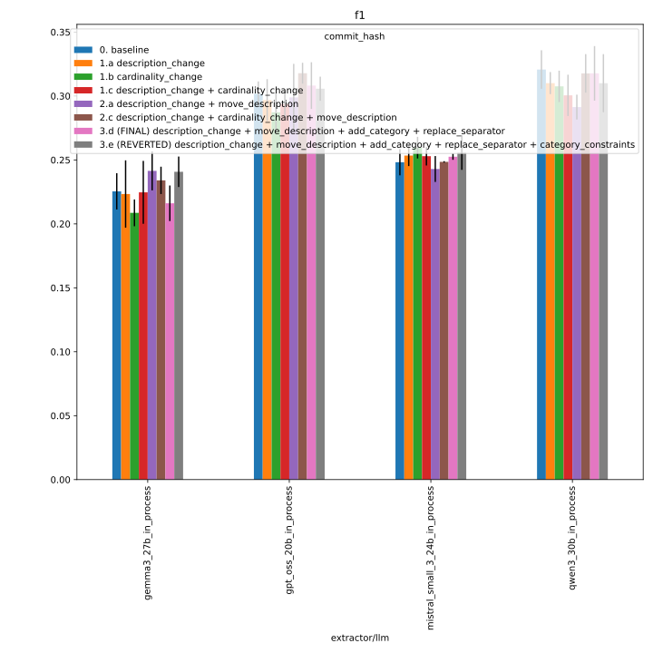
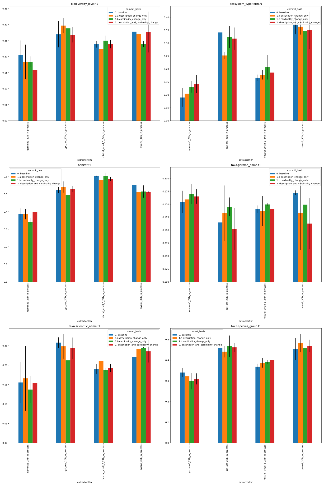
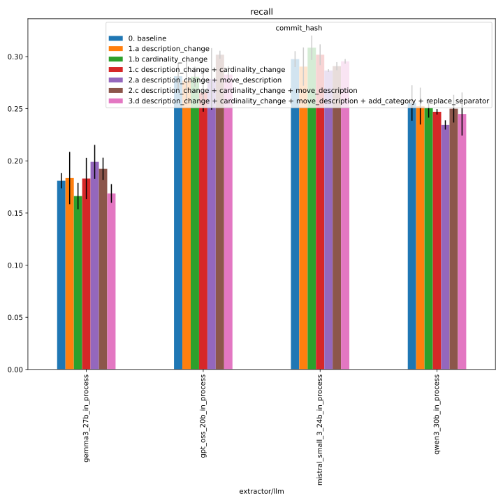
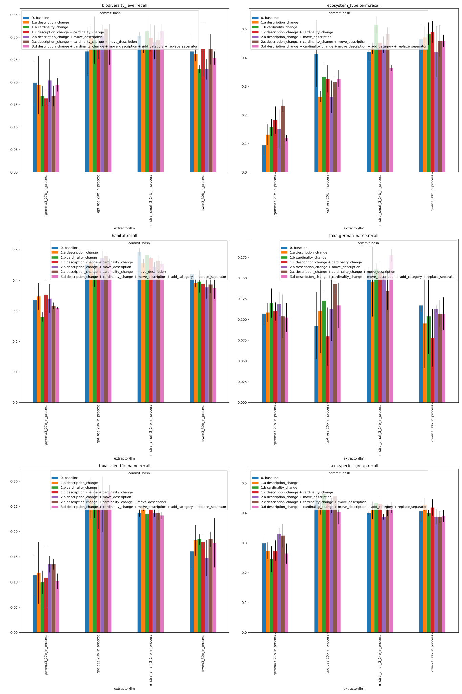
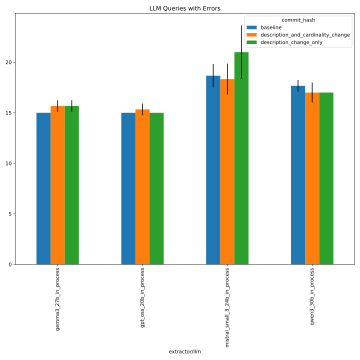
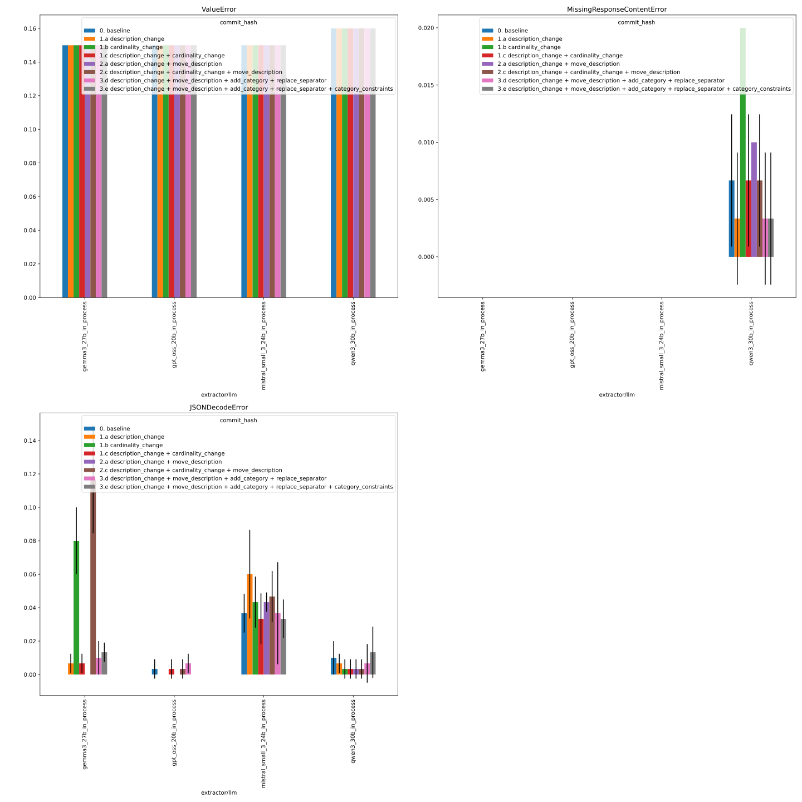

# 371_faktencheck_core_fix_ecosystem_type

See [#371](https://github.com/DFKI-NLP/kibad-llm/pull/371) for details.

Important: This is **without the actual predictions** since they are too many and would bloat the repository even more.

## notebook parameters

### comparing description and cardinality change with baseline
- baseline: [327_faktencheck_core_with_persona](../327_faktencheck_core_with_persona)

```python
NAME = "371_faktencheck_core_fix_ecosystem_type"

SUBDIR =[
    "evaluate",
    # baseline metrics and errors
    #"../327_faktencheck_core_with_persona/evaluate",
]
# mapping from commit hash to descriptive name (used for better plot labels)
commit_hash_mapping = {
    "bf86451a2404f64307c3512a8ad38921a1dd9e58": "0. baseline_327",
    "71c0148a2ff631464b3d2f2cb21539e141161c4f": "0. baseline",
    "1bbffda9bb6b96bbecdfdeda933d1107bd0a4998": "1.c description_change + cardinality_change",
    "9e95554b4c40bec1d64cfb9ae9f7951f3492c46f": "1.a description_change",
    "8e716f9efcbd73a0ce941a1b9ef2d1fee999486e": "1.b cardinality_change",
    "938fddc3bbce0d6e754d32851aa97e7cf0703ceb": "2.c description_change + cardinality_change + move_description",
    "45ef75d750feeb749a4c0a94232d248a83ea5640": "2.a description_change + move_description",
    "9210d4874148527f36c0b875d1715c3fb14570c7": "3.d description_change + move_description + add_category + replace_separator",
    "cc6c56a0c1fa49a67bf1c5daf7837df557271cb3": "3.e description_change + move_description + add_category + replace_separator + category_constraints",
}
MAP_VALUES = {"prediction.job_return_value.commit_hash": lambda x: commit_hash_mapping.get(x, x)}
    

METRICS = ["f1", "recall"]
# used to group the data
INDEX_COLUMNS = ["prediction.overrides.extractor/llm", "prediction.job_return_value.commit_hash"]
PLOT_KWARGS = {
    # can be either "metric" or one of the INDEX_COLUMNS (or multiple of them)
    "xgroup": "prediction.job_return_value.commit_hash",
    "create_subplot_for_each": "metric",
    "subplot_columns": 2,
    # add any more arguments passed to pd.DataFrame.plot
}
```

### f1


<details>
<summary>click to see plots for individual fields</summary>



</details>

### recall


<details>
<summary>click to see plots for individual fields</summary>



</details>

### errors


<details>
<summary>click to see plots for individual fields</summary>



</details>

## evaluate description content and cardinality change
- commit: [1bbffda](https://github.com/DFKI-NLP/kibad-llm/pull/371/commits/1bbffda9bb6b96bbecdfdeda933d1107bd0a4998)
- baseline: [327_faktencheck_core_with_persona](https://github.com/DFKI-NLP/kibad-llm/tree/main/data/prediction_results/logs/327_faktencheck_core_with_persona)

### inference
```
./run_in_process.sh \
-pa "H100-SLT,H100-Trails,H100,A100-80GB" \
-t "2-00:00:00" \
-u "-m kibad_llm.predict \
name=371_faktencheck_core_fix_ecosystem_type \
experiment/predict=faktencheck_core_fields_schema_with_evidence \
pdf_directory=/ds/text/kiba-d/dev-set-100 \
extractor/llm=gpt_oss_20b_in_process,gemma3_27b_in_process,qwen3_30b_in_process,mistral_small_3_24b_in_process \
seed=42,1337,7331 \
--multirun"
```
console output:
```
=============================================
>>> USING PARTITION H100-SLT,H100-Trails,H100,A100-80GB
>>> MAX TIME 2-00:00:00
>>> SUBMITTED Mon Feb 16 03:41:12 PM CET 2026
>>> UV_ARGS --cache-dir /netscratch/binder/cache/uv -m kibad_llm.predict name=371_faktencheck_core_fix_ecosystem_type experiment/predict=faktencheck_core_fields_schema_with_evidence pdf_directory=/ds/text/kiba-d/dev-set-100 extractor/llm=gpt_oss_20b_in_process,gemma3_27b_in_process,qwen3_30b_in_process,mistral_small_3_24b_in_process seed=42,1337,7331 --multirun
>>> JOB_NAME kiba-d_c8288db5-67e0-4180-bafe-349d4213b8ad
=============================================
srun: jobinfo: version v1.0.0
srun: job 2539943 queued and waiting for resources
```
timestamp: `2026-02-16_15-47-19`

[2026-02-16 22:10:40,053][HYDRA] Contents of /netscratch/binder/projects/kibad-llm/logs/371_faktencheck_core_fix_ecosystem_type/predict/multiruns/2026-02-16_15-47-19/job_return_value.md:

<details>
<summary>click to see</summary>

|                                                        | branch                                         | commit_hash                              | is_dirty   | output_file                                                                                                          | output_file_absolute                                                                                                                                       | overrides.experiment/predict                 | overrides.extractor/llm        | overrides.name                          | overrides.pdf_directory     |   overrides.seed |   slurm_job_id |   time_end |   time_extraction |   time_pdf_conversion |   time_start |
|:-------------------------------------------------------|:-----------------------------------------------|:-----------------------------------------|:-----------|:---------------------------------------------------------------------------------------------------------------------|:-----------------------------------------------------------------------------------------------------------------------------------------------------------|:---------------------------------------------|:-------------------------------|:----------------------------------------|:----------------------------|-----------------:|---------------:|-----------:|------------------:|----------------------:|-------------:|
| extractor/llm=gemma3_27b_in_process#seed=1337          | schema/fix-ecosystem_type-description-for-core | 1bbffda9bb6b96bbecdfdeda933d1107bd0a4998 | False      | predictions/371_faktencheck_core_fix_ecosystem_type/2026-02-16_15-47-19/2026-02-16_17-21-55_998609/predictions.jsonl | /netscratch/binder/projects/kibad-llm/predictions/371_faktencheck_core_fix_ecosystem_type/2026-02-16_15-47-19/2026-02-16_17-21-55_998609/predictions.jsonl | faktencheck_core_fields_schema_with_evidence | gemma3_27b_in_process          | 371_faktencheck_core_fix_ecosystem_type | /ds/text/kiba-d/dev-set-100 |             1337 |        2539943 | 1771259969 |           967.234 |            0.00264771 |   1771258915 |
| extractor/llm=gemma3_27b_in_process#seed=42            | schema/fix-ecosystem_type-description-for-core | 1bbffda9bb6b96bbecdfdeda933d1107bd0a4998 | False      | predictions/371_faktencheck_core_fix_ecosystem_type/2026-02-16_15-47-19/2026-02-16_17-00-54_783847/predictions.jsonl | /netscratch/binder/projects/kibad-llm/predictions/371_faktencheck_core_fix_ecosystem_type/2026-02-16_15-47-19/2026-02-16_17-00-54_783847/predictions.jsonl | faktencheck_core_fields_schema_with_evidence | gemma3_27b_in_process          | 371_faktencheck_core_fix_ecosystem_type | /ds/text/kiba-d/dev-set-100 |               42 |        2539943 | 1771258915 |          1125.2   |            0.00285872 |   1771257654 |
| extractor/llm=gemma3_27b_in_process#seed=7331          | schema/fix-ecosystem_type-description-for-core | 1bbffda9bb6b96bbecdfdeda933d1107bd0a4998 | False      | predictions/371_faktencheck_core_fix_ecosystem_type/2026-02-16_15-47-19/2026-02-16_17-39-29_775051/predictions.jsonl | /netscratch/binder/projects/kibad-llm/predictions/371_faktencheck_core_fix_ecosystem_type/2026-02-16_15-47-19/2026-02-16_17-39-29_775051/predictions.jsonl | faktencheck_core_fields_schema_with_evidence | gemma3_27b_in_process          | 371_faktencheck_core_fix_ecosystem_type | /ds/text/kiba-d/dev-set-100 |             7331 |        2539943 | 1771261136 |          1090.14  |            0.00250115 |   1771259969 |
| extractor/llm=gpt_oss_20b_in_process#seed=1337         | schema/fix-ecosystem_type-description-for-core | 1bbffda9bb6b96bbecdfdeda933d1107bd0a4998 | False      | predictions/371_faktencheck_core_fix_ecosystem_type/2026-02-16_15-47-19/2026-02-16_16-13-56_600942/predictions.jsonl | /netscratch/binder/projects/kibad-llm/predictions/371_faktencheck_core_fix_ecosystem_type/2026-02-16_15-47-19/2026-02-16_16-13-56_600942/predictions.jsonl | faktencheck_core_fields_schema_with_evidence | gpt_oss_20b_in_process         | 371_faktencheck_core_fix_ecosystem_type | /ds/text/kiba-d/dev-set-100 |             1337 |        2539943 | 1771256376 |          1492.14  |            0.00258528 |   1771254836 |
| extractor/llm=gpt_oss_20b_in_process#seed=42           | schema/fix-ecosystem_type-description-for-core | 1bbffda9bb6b96bbecdfdeda933d1107bd0a4998 | False      | predictions/371_faktencheck_core_fix_ecosystem_type/2026-02-16_15-47-19/2026-02-16_15-47-21_337407/predictions.jsonl | /netscratch/binder/projects/kibad-llm/predictions/371_faktencheck_core_fix_ecosystem_type/2026-02-16_15-47-19/2026-02-16_15-47-21_337407/predictions.jsonl | faktencheck_core_fields_schema_with_evidence | gpt_oss_20b_in_process         | 371_faktencheck_core_fix_ecosystem_type | /ds/text/kiba-d/dev-set-100 |               42 |        2539943 | 1771254836 |          1290.98  |            0.108222   |   1771253241 |
| extractor/llm=gpt_oss_20b_in_process#seed=7331         | schema/fix-ecosystem_type-description-for-core | 1bbffda9bb6b96bbecdfdeda933d1107bd0a4998 | False      | predictions/371_faktencheck_core_fix_ecosystem_type/2026-02-16_15-47-19/2026-02-16_16-39-36_360133/predictions.jsonl | /netscratch/binder/projects/kibad-llm/predictions/371_faktencheck_core_fix_ecosystem_type/2026-02-16_15-47-19/2026-02-16_16-39-36_360133/predictions.jsonl | faktencheck_core_fields_schema_with_evidence | gpt_oss_20b_in_process         | 371_faktencheck_core_fix_ecosystem_type | /ds/text/kiba-d/dev-set-100 |             7331 |        2539943 | 1771257654 |          1229.99  |            0.00269447 |   1771256376 |
| extractor/llm=mistral_small_3_24b_in_process#seed=1337 | schema/fix-ecosystem_type-description-for-core | 1bbffda9bb6b96bbecdfdeda933d1107bd0a4998 | False      | predictions/371_faktencheck_core_fix_ecosystem_type/2026-02-16_15-47-19/2026-02-16_20-47-01_088420/predictions.jsonl | /netscratch/binder/projects/kibad-llm/predictions/371_faktencheck_core_fix_ecosystem_type/2026-02-16_15-47-19/2026-02-16_20-47-01_088420/predictions.jsonl | faktencheck_core_fields_schema_with_evidence | mistral_small_3_24b_in_process | 371_faktencheck_core_fix_ecosystem_type | /ds/text/kiba-d/dev-set-100 |             1337 |        2539943 | 1771273798 |          2525.65  |            0.00271593 |   1771271221 |
| extractor/llm=mistral_small_3_24b_in_process#seed=42   | schema/fix-ecosystem_type-description-for-core | 1bbffda9bb6b96bbecdfdeda933d1107bd0a4998 | False      | predictions/371_faktencheck_core_fix_ecosystem_type/2026-02-16_15-47-19/2026-02-16_20-03-00_882743/predictions.jsonl | /netscratch/binder/projects/kibad-llm/predictions/371_faktencheck_core_fix_ecosystem_type/2026-02-16_15-47-19/2026-02-16_20-03-00_882743/predictions.jsonl | faktencheck_core_fields_schema_with_evidence | mistral_small_3_24b_in_process | 371_faktencheck_core_fix_ecosystem_type | /ds/text/kiba-d/dev-set-100 |               42 |        2539943 | 1771271220 |          2496.92  |            0.0025252  |   1771268580 |
| extractor/llm=mistral_small_3_24b_in_process#seed=7331 | schema/fix-ecosystem_type-description-for-core | 1bbffda9bb6b96bbecdfdeda933d1107bd0a4998 | False      | predictions/371_faktencheck_core_fix_ecosystem_type/2026-02-16_15-47-19/2026-02-16_21-29-59_084570/predictions.jsonl | /netscratch/binder/projects/kibad-llm/predictions/371_faktencheck_core_fix_ecosystem_type/2026-02-16_15-47-19/2026-02-16_21-29-59_084570/predictions.jsonl | faktencheck_core_fields_schema_with_evidence | mistral_small_3_24b_in_process | 371_faktencheck_core_fix_ecosystem_type | /ds/text/kiba-d/dev-set-100 |             7331 |        2539943 | 1771276239 |          2379.17  |            0.00252529 |   1771273799 |
| extractor/llm=qwen3_30b_in_process#seed=1337           | schema/fix-ecosystem_type-description-for-core | 1bbffda9bb6b96bbecdfdeda933d1107bd0a4998 | False      | predictions/371_faktencheck_core_fix_ecosystem_type/2026-02-16_15-47-19/2026-02-16_18-40-18_529835/predictions.jsonl | /netscratch/binder/projects/kibad-llm/predictions/371_faktencheck_core_fix_ecosystem_type/2026-02-16_15-47-19/2026-02-16_18-40-18_529835/predictions.jsonl | faktencheck_core_fields_schema_with_evidence | qwen3_30b_in_process           | 371_faktencheck_core_fix_ecosystem_type | /ds/text/kiba-d/dev-set-100 |             1337 |        2539943 | 1771266103 |          2425.99  |            0.00261241 |   1771263618 |
| extractor/llm=qwen3_30b_in_process#seed=42             | schema/fix-ecosystem_type-description-for-core | 1bbffda9bb6b96bbecdfdeda933d1107bd0a4998 | False      | predictions/371_faktencheck_core_fix_ecosystem_type/2026-02-16_15-47-19/2026-02-16_17-58-57_207848/predictions.jsonl | /netscratch/binder/projects/kibad-llm/predictions/371_faktencheck_core_fix_ecosystem_type/2026-02-16_15-47-19/2026-02-16_17-58-57_207848/predictions.jsonl | faktencheck_core_fields_schema_with_evidence | qwen3_30b_in_process           | 371_faktencheck_core_fix_ecosystem_type | /ds/text/kiba-d/dev-set-100 |               42 |        2539943 | 1771263618 |          2377.05  |            0.00252003 |   1771261137 |
| extractor/llm=qwen3_30b_in_process#seed=7331           | schema/fix-ecosystem_type-description-for-core | 1bbffda9bb6b96bbecdfdeda933d1107bd0a4998 | False      | predictions/371_faktencheck_core_fix_ecosystem_type/2026-02-16_15-47-19/2026-02-16_19-21-43_662089/predictions.jsonl | /netscratch/binder/projects/kibad-llm/predictions/371_faktencheck_core_fix_ecosystem_type/2026-02-16_15-47-19/2026-02-16_19-21-43_662089/predictions.jsonl | faktencheck_core_fields_schema_with_evidence | qwen3_30b_in_process           | 371_faktencheck_core_fix_ecosystem_type | /ds/text/kiba-d/dev-set-100 |             7331 |        2539943 | 1771268580 |          2422.66  |            0.00263962 |   1771266103 |

</details>

### metrics
```
uv run -m kibad_llm.evaluate \
name=371_faktencheck_core_fix_ecosystem_type  \
experiment/evaluate=faktencheck_core_f1_micro_flat \
prediction_logs=logs/371_faktencheck_core_fix_ecosystem_type/predict/multiruns/2026-02-16_15-47-19 \
+hydra.callbacks.save_job_return.multirun_markdown_group_by=prediction.overrides.extractor/llm \
--multirun
```

[2026-02-17 09:59:41,998][HYDRA] Contents of /netscratch/binder/projects/kibad-llm/logs/371_faktencheck_core_fix_ecosystem_type/evaluate/multiruns/2026-02-17_09-59-34/job_return_value.md:

<details>
<summary>click to see</summary>

| prediction.overrides.extractor/llm   |   ALL.f1.mean |   ALL.f1.std |   ALL.precision.mean |   ALL.precision.std |   ALL.recall.mean |   ALL.recall.std |   ALL.support.mean |   ALL.support.std |   AVG.f1.mean |   AVG.f1.std |   AVG.precision.mean |   AVG.precision.std |   AVG.recall.mean |   AVG.recall.std |   AVG.support.mean |   AVG.support.std |   biodiversity_level.f1.mean |   biodiversity_level.f1.std |   biodiversity_level.precision.mean |   biodiversity_level.precision.std |   biodiversity_level.recall.mean |   biodiversity_level.recall.std |   biodiversity_level.support.mean |   biodiversity_level.support.std |   ecosystem_type.term.f1.mean |   ecosystem_type.term.f1.std |   ecosystem_type.term.precision.mean |   ecosystem_type.term.precision.std |   ecosystem_type.term.recall.mean |   ecosystem_type.term.recall.std |   ecosystem_type.term.support.mean |   ecosystem_type.term.support.std |   habitat.f1.mean |   habitat.f1.std |   habitat.precision.mean |   habitat.precision.std |   habitat.recall.mean |   habitat.recall.std |   habitat.support.mean |   habitat.support.std |   prediction.job_return_value.time_end.mean |   prediction.job_return_value.time_end.std |   prediction.job_return_value.time_extraction.mean |   prediction.job_return_value.time_extraction.std |   prediction.job_return_value.time_pdf_conversion.mean |   prediction.job_return_value.time_pdf_conversion.std |   prediction.job_return_value.time_start.mean |   prediction.job_return_value.time_start.std |   taxa.german_name.f1.mean |   taxa.german_name.f1.std |   taxa.german_name.precision.mean |   taxa.german_name.precision.std |   taxa.german_name.recall.mean |   taxa.german_name.recall.std |   taxa.german_name.support.mean |   taxa.german_name.support.std |   taxa.scientific_name.f1.mean |   taxa.scientific_name.f1.std |   taxa.scientific_name.precision.mean |   taxa.scientific_name.precision.std |   taxa.scientific_name.recall.mean |   taxa.scientific_name.recall.std |   taxa.scientific_name.support.mean |   taxa.scientific_name.support.std |   taxa.species_group.f1.mean |   taxa.species_group.f1.std |   taxa.species_group.precision.mean |   taxa.species_group.precision.std |   taxa.species_group.recall.mean |   taxa.species_group.recall.std |   taxa.species_group.support.mean |   taxa.species_group.support.std | overrides.dataset.predictions.log                                                                                                                                                                                                                                          | overrides.experiment/evaluate                                                                          | overrides.name                                                                                                                    | overrides.prediction_logs                                                                                                                                                                                                                                          | prediction.job_return_value.branch                                                                                                                     | prediction.job_return_value.commit_hash                                                                                              | prediction.job_return_value.is_dirty   | prediction.job_return_value.output_file                                                                                                                                                                                                                                                                                                                                  | prediction.job_return_value.output_file_absolute                                                                                                                                                                                                                                                                                                                                                                                                                                           | prediction.job_return_value.slurm_job_id   | prediction.overrides.experiment/predict                                                                                                          | prediction.overrides.name                                                                                                         | prediction.overrides.pdf_directory                                                            | prediction.overrides.seed   |
|:-------------------------------------|--------------:|-------------:|---------------------:|--------------------:|------------------:|-----------------:|-------------------:|------------------:|--------------:|-------------:|---------------------:|--------------------:|------------------:|-----------------:|-------------------:|------------------:|-----------------------------:|----------------------------:|------------------------------------:|-----------------------------------:|---------------------------------:|--------------------------------:|----------------------------------:|---------------------------------:|------------------------------:|-----------------------------:|-------------------------------------:|------------------------------------:|----------------------------------:|---------------------------------:|-----------------------------------:|----------------------------------:|------------------:|-----------------:|-------------------------:|------------------------:|----------------------:|---------------------:|-----------------------:|----------------------:|--------------------------------------------:|-------------------------------------------:|---------------------------------------------------:|--------------------------------------------------:|-------------------------------------------------------:|------------------------------------------------------:|----------------------------------------------:|---------------------------------------------:|---------------------------:|--------------------------:|----------------------------------:|---------------------------------:|-------------------------------:|------------------------------:|--------------------------------:|-------------------------------:|-------------------------------:|------------------------------:|--------------------------------------:|-------------------------------------:|-----------------------------------:|----------------------------------:|------------------------------------:|-----------------------------------:|-----------------------------:|----------------------------:|------------------------------------:|-----------------------------------:|---------------------------------:|--------------------------------:|----------------------------------:|---------------------------------:|:---------------------------------------------------------------------------------------------------------------------------------------------------------------------------------------------------------------------------------------------------------------------------|:-------------------------------------------------------------------------------------------------------|:----------------------------------------------------------------------------------------------------------------------------------|:-------------------------------------------------------------------------------------------------------------------------------------------------------------------------------------------------------------------------------------------------------------------|:-------------------------------------------------------------------------------------------------------------------------------------------------------|:-------------------------------------------------------------------------------------------------------------------------------------|:---------------------------------------|:-------------------------------------------------------------------------------------------------------------------------------------------------------------------------------------------------------------------------------------------------------------------------------------------------------------------------------------------------------------------------|:-------------------------------------------------------------------------------------------------------------------------------------------------------------------------------------------------------------------------------------------------------------------------------------------------------------------------------------------------------------------------------------------------------------------------------------------------------------------------------------------|:-------------------------------------------|:-------------------------------------------------------------------------------------------------------------------------------------------------|:----------------------------------------------------------------------------------------------------------------------------------|:----------------------------------------------------------------------------------------------|:----------------------------|
| gemma3_27b_in_process                |         0.225 |        0.025 |                0.291 |               0.033 |             0.183 |            0.02  |                792 |                 0 |         0.221 |        0.022 |                0.282 |               0.034 |             0.198 |            0.019 |                132 |                 0 |                        0.158 |                       0.014 |                               0.153 |                              0.013 |                            0.164 |                           0.015 |                                67 |                                0 |                         0.142 |                        0.035 |                                0.116 |                               0.027 |                             0.182 |                            0.047 |                                 53 |                                 0 |             0.397 |            0.041 |                    0.456 |                   0.025 |                 0.353 |                0.048 |                    138 |                     0 |                                 1.77126e+09 |                                    1110.98 |                                            1060.86 |                                            82.956 |                                                  0.003 |                                                 0     |                                   1.77126e+09 |                                      1159.04 |                      0.165 |                     0.014 |                             0.337 |                            0.026 |                          0.11  |                         0.011 |                             231 |                              0 |                          0.155 |                         0.089 |                                 0.272 |                                0.161 |                              0.108 |                             0.062 |                                 197 |                                  0 |                        0.31  |                       0.027 |                               0.357 |                              0.014 |                            0.274 |                           0.034 |                               106 |                                0 | ['logs/371_faktencheck_core_fix_ecosystem_type/predict/multiruns/2026-02-16_15-47-19/3', 'logs/371_faktencheck_core_fix_ecosystem_type/predict/multiruns/2026-02-16_15-47-19/4', 'logs/371_faktencheck_core_fix_ecosystem_type/predict/multiruns/2026-02-16_15-47-19/5']   | ['faktencheck_core_f1_micro_flat', 'faktencheck_core_f1_micro_flat', 'faktencheck_core_f1_micro_flat'] | ['371_faktencheck_core_fix_ecosystem_type', '371_faktencheck_core_fix_ecosystem_type', '371_faktencheck_core_fix_ecosystem_type'] | ['logs/371_faktencheck_core_fix_ecosystem_type/predict/multiruns/2026-02-16_15-47-19', 'logs/371_faktencheck_core_fix_ecosystem_type/predict/multiruns/2026-02-16_15-47-19', 'logs/371_faktencheck_core_fix_ecosystem_type/predict/multiruns/2026-02-16_15-47-19'] | ['schema/fix-ecosystem_type-description-for-core', 'schema/fix-ecosystem_type-description-for-core', 'schema/fix-ecosystem_type-description-for-core'] | ['1bbffda9bb6b96bbecdfdeda933d1107bd0a4998', '1bbffda9bb6b96bbecdfdeda933d1107bd0a4998', '1bbffda9bb6b96bbecdfdeda933d1107bd0a4998'] | [np.False_, np.False_, np.False_]      | ['predictions/371_faktencheck_core_fix_ecosystem_type/2026-02-16_15-47-19/2026-02-16_17-00-54_783847/predictions.jsonl', 'predictions/371_faktencheck_core_fix_ecosystem_type/2026-02-16_15-47-19/2026-02-16_17-21-55_998609/predictions.jsonl', 'predictions/371_faktencheck_core_fix_ecosystem_type/2026-02-16_15-47-19/2026-02-16_17-39-29_775051/predictions.jsonl'] | ['/netscratch/binder/projects/kibad-llm/predictions/371_faktencheck_core_fix_ecosystem_type/2026-02-16_15-47-19/2026-02-16_17-00-54_783847/predictions.jsonl', '/netscratch/binder/projects/kibad-llm/predictions/371_faktencheck_core_fix_ecosystem_type/2026-02-16_15-47-19/2026-02-16_17-21-55_998609/predictions.jsonl', '/netscratch/binder/projects/kibad-llm/predictions/371_faktencheck_core_fix_ecosystem_type/2026-02-16_15-47-19/2026-02-16_17-39-29_775051/predictions.jsonl'] | ['2539943', '2539943', '2539943']          | ['faktencheck_core_fields_schema_with_evidence', 'faktencheck_core_fields_schema_with_evidence', 'faktencheck_core_fields_schema_with_evidence'] | ['371_faktencheck_core_fix_ecosystem_type', '371_faktencheck_core_fix_ecosystem_type', '371_faktencheck_core_fix_ecosystem_type'] | ['/ds/text/kiba-d/dev-set-100', '/ds/text/kiba-d/dev-set-100', '/ds/text/kiba-d/dev-set-100'] | ['42', '1337', '7331']      |
| gpt_oss_20b_in_process               |         0.294 |        0.01  |                0.33  |               0.011 |             0.266 |            0.018 |                792 |                 0 |         0.321 |        0.008 |                0.352 |               0.017 |             0.301 |            0.007 |                132 |                 0 |                        0.268 |                       0.024 |                               0.264 |                              0.027 |                            0.274 |                           0.023 |                                67 |                                0 |                         0.318 |                        0.043 |                                0.311 |                               0.054 |                             0.327 |                            0.047 |                                 53 |                                 0 |             0.53  |            0.017 |                    0.658 |                   0.036 |                 0.444 |                0.015 |                    138 |                     0 |                                 1.77126e+09 |                                    1411.03 |                                            1337.7  |                                           137.176 |                                                  0.038 |                                                 0.061 |                                   1.77125e+09 |                                      1567.58 |                      0.102 |                     0.04  |                             0.146 |                            0.046 |                          0.079 |                         0.035 |                             231 |                              0 |                          0.244 |                         0.027 |                                 0.24  |                                0.019 |                              0.249 |                             0.043 |                                 197 |                                  0 |                        0.462 |                       0.022 |                               0.494 |                              0.039 |                            0.434 |                           0.009 |                               106 |                                0 | ['logs/371_faktencheck_core_fix_ecosystem_type/predict/multiruns/2026-02-16_15-47-19/0', 'logs/371_faktencheck_core_fix_ecosystem_type/predict/multiruns/2026-02-16_15-47-19/1', 'logs/371_faktencheck_core_fix_ecosystem_type/predict/multiruns/2026-02-16_15-47-19/2']   | ['faktencheck_core_f1_micro_flat', 'faktencheck_core_f1_micro_flat', 'faktencheck_core_f1_micro_flat'] | ['371_faktencheck_core_fix_ecosystem_type', '371_faktencheck_core_fix_ecosystem_type', '371_faktencheck_core_fix_ecosystem_type'] | ['logs/371_faktencheck_core_fix_ecosystem_type/predict/multiruns/2026-02-16_15-47-19', 'logs/371_faktencheck_core_fix_ecosystem_type/predict/multiruns/2026-02-16_15-47-19', 'logs/371_faktencheck_core_fix_ecosystem_type/predict/multiruns/2026-02-16_15-47-19'] | ['schema/fix-ecosystem_type-description-for-core', 'schema/fix-ecosystem_type-description-for-core', 'schema/fix-ecosystem_type-description-for-core'] | ['1bbffda9bb6b96bbecdfdeda933d1107bd0a4998', '1bbffda9bb6b96bbecdfdeda933d1107bd0a4998', '1bbffda9bb6b96bbecdfdeda933d1107bd0a4998'] | [np.False_, np.False_, np.False_]      | ['predictions/371_faktencheck_core_fix_ecosystem_type/2026-02-16_15-47-19/2026-02-16_15-47-21_337407/predictions.jsonl', 'predictions/371_faktencheck_core_fix_ecosystem_type/2026-02-16_15-47-19/2026-02-16_16-13-56_600942/predictions.jsonl', 'predictions/371_faktencheck_core_fix_ecosystem_type/2026-02-16_15-47-19/2026-02-16_16-39-36_360133/predictions.jsonl'] | ['/netscratch/binder/projects/kibad-llm/predictions/371_faktencheck_core_fix_ecosystem_type/2026-02-16_15-47-19/2026-02-16_15-47-21_337407/predictions.jsonl', '/netscratch/binder/projects/kibad-llm/predictions/371_faktencheck_core_fix_ecosystem_type/2026-02-16_15-47-19/2026-02-16_16-13-56_600942/predictions.jsonl', '/netscratch/binder/projects/kibad-llm/predictions/371_faktencheck_core_fix_ecosystem_type/2026-02-16_15-47-19/2026-02-16_16-39-36_360133/predictions.jsonl'] | ['2539943', '2539943', '2539943']          | ['faktencheck_core_fields_schema_with_evidence', 'faktencheck_core_fields_schema_with_evidence', 'faktencheck_core_fields_schema_with_evidence'] | ['371_faktencheck_core_fix_ecosystem_type', '371_faktencheck_core_fix_ecosystem_type', '371_faktencheck_core_fix_ecosystem_type'] | ['/ds/text/kiba-d/dev-set-100', '/ds/text/kiba-d/dev-set-100', '/ds/text/kiba-d/dev-set-100'] | ['42', '1337', '7331']      |
| mistral_small_3_24b_in_process       |         0.253 |        0.007 |                0.218 |               0.014 |             0.302 |            0.01  |                792 |                 0 |         0.291 |        0.01  |                0.292 |               0.015 |             0.343 |            0.014 |                132 |                 0 |                        0.239 |                       0.013 |                               0.199 |                              0.01  |                            0.299 |                           0.03  |                                67 |                                0 |                         0.186 |                        0.027 |                                0.118 |                               0.021 |                             0.453 |                            0.033 |                                 53 |                                 0 |             0.587 |            0.011 |                    0.773 |                   0.037 |                 0.473 |                0.004 |                    138 |                     0 |                                 1.77127e+09 |                                    2509.81 |                                            2467.25 |                                            77.617 |                                                  0.003 |                                                 0     |                                   1.77127e+09 |                                      2609.56 |                      0.141 |                     0.004 |                             0.129 |                            0.004 |                          0.156 |                         0.015 |                             231 |                              0 |                          0.193 |                         0.011 |                                 0.159 |                                0.015 |                              0.244 |                             0     |                                 197 |                                  0 |                        0.4   |                       0.031 |                               0.374 |                              0.04  |                            0.431 |                           0.02  |                               106 |                                0 | ['logs/371_faktencheck_core_fix_ecosystem_type/predict/multiruns/2026-02-16_15-47-19/10', 'logs/371_faktencheck_core_fix_ecosystem_type/predict/multiruns/2026-02-16_15-47-19/11', 'logs/371_faktencheck_core_fix_ecosystem_type/predict/multiruns/2026-02-16_15-47-19/9'] | ['faktencheck_core_f1_micro_flat', 'faktencheck_core_f1_micro_flat', 'faktencheck_core_f1_micro_flat'] | ['371_faktencheck_core_fix_ecosystem_type', '371_faktencheck_core_fix_ecosystem_type', '371_faktencheck_core_fix_ecosystem_type'] | ['logs/371_faktencheck_core_fix_ecosystem_type/predict/multiruns/2026-02-16_15-47-19', 'logs/371_faktencheck_core_fix_ecosystem_type/predict/multiruns/2026-02-16_15-47-19', 'logs/371_faktencheck_core_fix_ecosystem_type/predict/multiruns/2026-02-16_15-47-19'] | ['schema/fix-ecosystem_type-description-for-core', 'schema/fix-ecosystem_type-description-for-core', 'schema/fix-ecosystem_type-description-for-core'] | ['1bbffda9bb6b96bbecdfdeda933d1107bd0a4998', '1bbffda9bb6b96bbecdfdeda933d1107bd0a4998', '1bbffda9bb6b96bbecdfdeda933d1107bd0a4998'] | [np.False_, np.False_, np.False_]      | ['predictions/371_faktencheck_core_fix_ecosystem_type/2026-02-16_15-47-19/2026-02-16_20-47-01_088420/predictions.jsonl', 'predictions/371_faktencheck_core_fix_ecosystem_type/2026-02-16_15-47-19/2026-02-16_21-29-59_084570/predictions.jsonl', 'predictions/371_faktencheck_core_fix_ecosystem_type/2026-02-16_15-47-19/2026-02-16_20-03-00_882743/predictions.jsonl'] | ['/netscratch/binder/projects/kibad-llm/predictions/371_faktencheck_core_fix_ecosystem_type/2026-02-16_15-47-19/2026-02-16_20-47-01_088420/predictions.jsonl', '/netscratch/binder/projects/kibad-llm/predictions/371_faktencheck_core_fix_ecosystem_type/2026-02-16_15-47-19/2026-02-16_21-29-59_084570/predictions.jsonl', '/netscratch/binder/projects/kibad-llm/predictions/371_faktencheck_core_fix_ecosystem_type/2026-02-16_15-47-19/2026-02-16_20-03-00_882743/predictions.jsonl'] | ['2539943', '2539943', '2539943']          | ['faktencheck_core_fields_schema_with_evidence', 'faktencheck_core_fields_schema_with_evidence', 'faktencheck_core_fields_schema_with_evidence'] | ['371_faktencheck_core_fix_ecosystem_type', '371_faktencheck_core_fix_ecosystem_type', '371_faktencheck_core_fix_ecosystem_type'] | ['/ds/text/kiba-d/dev-set-100', '/ds/text/kiba-d/dev-set-100', '/ds/text/kiba-d/dev-set-100'] | ['1337', '7331', '42']      |
| qwen3_30b_in_process                 |         0.3   |        0.016 |                0.385 |               0.047 |             0.247 |            0.003 |                792 |                 0 |         0.326 |        0.01  |                0.401 |               0.034 |             0.305 |            0.007 |                132 |                 0 |                        0.277 |                       0.064 |                               0.28  |                              0.068 |                            0.274 |                           0.06  |                                67 |                                0 |                         0.35  |                        0.072 |                                0.276 |                               0.08  |                             0.491 |                            0.038 |                                 53 |                                 0 |             0.514 |            0.005 |                    0.759 |                   0.05  |                 0.389 |                0.008 |                    138 |                     0 |                                 1.77127e+09 |                                    2481    |                                            2408.57 |                                            27.348 |                                                  0.003 |                                                 0     |                                   1.77126e+09 |                                      2483    |                      0.113 |                     0.049 |                             0.212 |                            0.101 |                          0.078 |                         0.035 |                             231 |                              0 |                          0.236 |                         0.029 |                                 0.347 |                                0.077 |                              0.179 |                             0.013 |                                 197 |                                  0 |                        0.469 |                       0.03  |                               0.535 |                              0.038 |                            0.418 |                           0.027 |                               106 |                                0 | ['logs/371_faktencheck_core_fix_ecosystem_type/predict/multiruns/2026-02-16_15-47-19/6', 'logs/371_faktencheck_core_fix_ecosystem_type/predict/multiruns/2026-02-16_15-47-19/7', 'logs/371_faktencheck_core_fix_ecosystem_type/predict/multiruns/2026-02-16_15-47-19/8']   | ['faktencheck_core_f1_micro_flat', 'faktencheck_core_f1_micro_flat', 'faktencheck_core_f1_micro_flat'] | ['371_faktencheck_core_fix_ecosystem_type', '371_faktencheck_core_fix_ecosystem_type', '371_faktencheck_core_fix_ecosystem_type'] | ['logs/371_faktencheck_core_fix_ecosystem_type/predict/multiruns/2026-02-16_15-47-19', 'logs/371_faktencheck_core_fix_ecosystem_type/predict/multiruns/2026-02-16_15-47-19', 'logs/371_faktencheck_core_fix_ecosystem_type/predict/multiruns/2026-02-16_15-47-19'] | ['schema/fix-ecosystem_type-description-for-core', 'schema/fix-ecosystem_type-description-for-core', 'schema/fix-ecosystem_type-description-for-core'] | ['1bbffda9bb6b96bbecdfdeda933d1107bd0a4998', '1bbffda9bb6b96bbecdfdeda933d1107bd0a4998', '1bbffda9bb6b96bbecdfdeda933d1107bd0a4998'] | [np.False_, np.False_, np.False_]      | ['predictions/371_faktencheck_core_fix_ecosystem_type/2026-02-16_15-47-19/2026-02-16_17-58-57_207848/predictions.jsonl', 'predictions/371_faktencheck_core_fix_ecosystem_type/2026-02-16_15-47-19/2026-02-16_18-40-18_529835/predictions.jsonl', 'predictions/371_faktencheck_core_fix_ecosystem_type/2026-02-16_15-47-19/2026-02-16_19-21-43_662089/predictions.jsonl'] | ['/netscratch/binder/projects/kibad-llm/predictions/371_faktencheck_core_fix_ecosystem_type/2026-02-16_15-47-19/2026-02-16_17-58-57_207848/predictions.jsonl', '/netscratch/binder/projects/kibad-llm/predictions/371_faktencheck_core_fix_ecosystem_type/2026-02-16_15-47-19/2026-02-16_18-40-18_529835/predictions.jsonl', '/netscratch/binder/projects/kibad-llm/predictions/371_faktencheck_core_fix_ecosystem_type/2026-02-16_15-47-19/2026-02-16_19-21-43_662089/predictions.jsonl'] | ['2539943', '2539943', '2539943']          | ['faktencheck_core_fields_schema_with_evidence', 'faktencheck_core_fields_schema_with_evidence', 'faktencheck_core_fields_schema_with_evidence'] | ['371_faktencheck_core_fix_ecosystem_type', '371_faktencheck_core_fix_ecosystem_type', '371_faktencheck_core_fix_ecosystem_type'] | ['/ds/text/kiba-d/dev-set-100', '/ds/text/kiba-d/dev-set-100', '/ds/text/kiba-d/dev-set-100'] | ['42', '1337', '7331']      |

</details>

### errors
```
uv run -m kibad_llm.evaluate \
name=371_faktencheck_core_fix_ecosystem_type  \
experiment/evaluate=prediction_errors \
prediction_logs=logs/371_faktencheck_core_fix_ecosystem_type/predict/multiruns/2026-02-16_15-47-19 \
+hydra.callbacks.save_job_return.multirun_markdown_group_by=prediction.overrides.extractor/llm \
--multirun
```

[2026-02-17 10:00:17,933][HYDRA] Contents of /netscratch/binder/projects/kibad-llm/logs/371_faktencheck_core_fix_ecosystem_type/evaluate/multiruns/2026-02-17_10-00-13/job_return_value.md:

<details>
<summary>click to see</summary>

| prediction.overrides.extractor/llm   |   JSONDecodeError.mean |   JSONDecodeError.std |   MissingResponseContentError.mean |   MissingResponseContentError.std |   ValueError.mean |   ValueError.std |   no_error.mean |   no_error.std |   prediction.job_return_value.time_end.mean |   prediction.job_return_value.time_end.std |   prediction.job_return_value.time_extraction.mean |   prediction.job_return_value.time_extraction.std |   prediction.job_return_value.time_pdf_conversion.mean |   prediction.job_return_value.time_pdf_conversion.std |   prediction.job_return_value.time_start.mean |   prediction.job_return_value.time_start.std |   with_error.mean |   with_error.std | overrides.dataset.predictions.log                                                                                                                                                                                                                                          | overrides.experiment/evaluate                                   | overrides.name                                                                                                                    | overrides.prediction_logs                                                                                                                                                                                                                                          | prediction.job_return_value.branch                                                                                                                     | prediction.job_return_value.commit_hash                                                                                              | prediction.job_return_value.is_dirty   | prediction.job_return_value.output_file                                                                                                                                                                                                                                                                                                                                  | prediction.job_return_value.output_file_absolute                                                                                                                                                                                                                                                                                                                                                                                                                                           | prediction.job_return_value.slurm_job_id   | prediction.overrides.experiment/predict                                                                                                          | prediction.overrides.name                                                                                                         | prediction.overrides.pdf_directory                                                            | prediction.overrides.seed   |
|:-------------------------------------|-----------------------:|----------------------:|-----------------------------------:|----------------------------------:|------------------:|-----------------:|----------------:|---------------:|--------------------------------------------:|-------------------------------------------:|---------------------------------------------------:|--------------------------------------------------:|-------------------------------------------------------:|------------------------------------------------------:|----------------------------------------------:|---------------------------------------------:|------------------:|-----------------:|:---------------------------------------------------------------------------------------------------------------------------------------------------------------------------------------------------------------------------------------------------------------------------|:----------------------------------------------------------------|:----------------------------------------------------------------------------------------------------------------------------------|:-------------------------------------------------------------------------------------------------------------------------------------------------------------------------------------------------------------------------------------------------------------------|:-------------------------------------------------------------------------------------------------------------------------------------------------------|:-------------------------------------------------------------------------------------------------------------------------------------|:---------------------------------------|:-------------------------------------------------------------------------------------------------------------------------------------------------------------------------------------------------------------------------------------------------------------------------------------------------------------------------------------------------------------------------|:-------------------------------------------------------------------------------------------------------------------------------------------------------------------------------------------------------------------------------------------------------------------------------------------------------------------------------------------------------------------------------------------------------------------------------------------------------------------------------------------|:-------------------------------------------|:-------------------------------------------------------------------------------------------------------------------------------------------------|:----------------------------------------------------------------------------------------------------------------------------------|:----------------------------------------------------------------------------------------------|:----------------------------|
| gemma3_27b_in_process                |                  1     |                 0     |                                  0 |                                 0 |                15 |                0 |          84.333 |          0.577 |                                 1.77126e+09 |                                    1110.98 |                                            1060.86 |                                            82.956 |                                                  0.003 |                                                 0     |                                   1.77126e+09 |                                      1159.04 |            15.667 |            0.577 | ['logs/371_faktencheck_core_fix_ecosystem_type/predict/multiruns/2026-02-16_15-47-19/3', 'logs/371_faktencheck_core_fix_ecosystem_type/predict/multiruns/2026-02-16_15-47-19/4', 'logs/371_faktencheck_core_fix_ecosystem_type/predict/multiruns/2026-02-16_15-47-19/5']   | ['prediction_errors', 'prediction_errors', 'prediction_errors'] | ['371_faktencheck_core_fix_ecosystem_type', '371_faktencheck_core_fix_ecosystem_type', '371_faktencheck_core_fix_ecosystem_type'] | ['logs/371_faktencheck_core_fix_ecosystem_type/predict/multiruns/2026-02-16_15-47-19', 'logs/371_faktencheck_core_fix_ecosystem_type/predict/multiruns/2026-02-16_15-47-19', 'logs/371_faktencheck_core_fix_ecosystem_type/predict/multiruns/2026-02-16_15-47-19'] | ['schema/fix-ecosystem_type-description-for-core', 'schema/fix-ecosystem_type-description-for-core', 'schema/fix-ecosystem_type-description-for-core'] | ['1bbffda9bb6b96bbecdfdeda933d1107bd0a4998', '1bbffda9bb6b96bbecdfdeda933d1107bd0a4998', '1bbffda9bb6b96bbecdfdeda933d1107bd0a4998'] | [np.False_, np.False_, np.False_]      | ['predictions/371_faktencheck_core_fix_ecosystem_type/2026-02-16_15-47-19/2026-02-16_17-00-54_783847/predictions.jsonl', 'predictions/371_faktencheck_core_fix_ecosystem_type/2026-02-16_15-47-19/2026-02-16_17-21-55_998609/predictions.jsonl', 'predictions/371_faktencheck_core_fix_ecosystem_type/2026-02-16_15-47-19/2026-02-16_17-39-29_775051/predictions.jsonl'] | ['/netscratch/binder/projects/kibad-llm/predictions/371_faktencheck_core_fix_ecosystem_type/2026-02-16_15-47-19/2026-02-16_17-00-54_783847/predictions.jsonl', '/netscratch/binder/projects/kibad-llm/predictions/371_faktencheck_core_fix_ecosystem_type/2026-02-16_15-47-19/2026-02-16_17-21-55_998609/predictions.jsonl', '/netscratch/binder/projects/kibad-llm/predictions/371_faktencheck_core_fix_ecosystem_type/2026-02-16_15-47-19/2026-02-16_17-39-29_775051/predictions.jsonl'] | ['2539943', '2539943', '2539943']          | ['faktencheck_core_fields_schema_with_evidence', 'faktencheck_core_fields_schema_with_evidence', 'faktencheck_core_fields_schema_with_evidence'] | ['371_faktencheck_core_fix_ecosystem_type', '371_faktencheck_core_fix_ecosystem_type', '371_faktencheck_core_fix_ecosystem_type'] | ['/ds/text/kiba-d/dev-set-100', '/ds/text/kiba-d/dev-set-100', '/ds/text/kiba-d/dev-set-100'] | ['42', '1337', '7331']      |
| gpt_oss_20b_in_process               |                  1     |                 0     |                                  0 |                                 0 |                15 |                0 |          84.667 |          0.577 |                                 1.77126e+09 |                                    1411.03 |                                            1337.7  |                                           137.176 |                                                  0.038 |                                                 0.061 |                                   1.77125e+09 |                                      1567.58 |            15.333 |            0.577 | ['logs/371_faktencheck_core_fix_ecosystem_type/predict/multiruns/2026-02-16_15-47-19/0', 'logs/371_faktencheck_core_fix_ecosystem_type/predict/multiruns/2026-02-16_15-47-19/1', 'logs/371_faktencheck_core_fix_ecosystem_type/predict/multiruns/2026-02-16_15-47-19/2']   | ['prediction_errors', 'prediction_errors', 'prediction_errors'] | ['371_faktencheck_core_fix_ecosystem_type', '371_faktencheck_core_fix_ecosystem_type', '371_faktencheck_core_fix_ecosystem_type'] | ['logs/371_faktencheck_core_fix_ecosystem_type/predict/multiruns/2026-02-16_15-47-19', 'logs/371_faktencheck_core_fix_ecosystem_type/predict/multiruns/2026-02-16_15-47-19', 'logs/371_faktencheck_core_fix_ecosystem_type/predict/multiruns/2026-02-16_15-47-19'] | ['schema/fix-ecosystem_type-description-for-core', 'schema/fix-ecosystem_type-description-for-core', 'schema/fix-ecosystem_type-description-for-core'] | ['1bbffda9bb6b96bbecdfdeda933d1107bd0a4998', '1bbffda9bb6b96bbecdfdeda933d1107bd0a4998', '1bbffda9bb6b96bbecdfdeda933d1107bd0a4998'] | [np.False_, np.False_, np.False_]      | ['predictions/371_faktencheck_core_fix_ecosystem_type/2026-02-16_15-47-19/2026-02-16_15-47-21_337407/predictions.jsonl', 'predictions/371_faktencheck_core_fix_ecosystem_type/2026-02-16_15-47-19/2026-02-16_16-13-56_600942/predictions.jsonl', 'predictions/371_faktencheck_core_fix_ecosystem_type/2026-02-16_15-47-19/2026-02-16_16-39-36_360133/predictions.jsonl'] | ['/netscratch/binder/projects/kibad-llm/predictions/371_faktencheck_core_fix_ecosystem_type/2026-02-16_15-47-19/2026-02-16_15-47-21_337407/predictions.jsonl', '/netscratch/binder/projects/kibad-llm/predictions/371_faktencheck_core_fix_ecosystem_type/2026-02-16_15-47-19/2026-02-16_16-13-56_600942/predictions.jsonl', '/netscratch/binder/projects/kibad-llm/predictions/371_faktencheck_core_fix_ecosystem_type/2026-02-16_15-47-19/2026-02-16_16-39-36_360133/predictions.jsonl'] | ['2539943', '2539943', '2539943']          | ['faktencheck_core_fields_schema_with_evidence', 'faktencheck_core_fields_schema_with_evidence', 'faktencheck_core_fields_schema_with_evidence'] | ['371_faktencheck_core_fix_ecosystem_type', '371_faktencheck_core_fix_ecosystem_type', '371_faktencheck_core_fix_ecosystem_type'] | ['/ds/text/kiba-d/dev-set-100', '/ds/text/kiba-d/dev-set-100', '/ds/text/kiba-d/dev-set-100'] | ['42', '1337', '7331']      |
| mistral_small_3_24b_in_process       |                  3.333 |                 1.528 |                                  0 |                                 0 |                15 |                0 |          81.667 |          1.528 |                                 1.77127e+09 |                                    2509.81 |                                            2467.25 |                                            77.617 |                                                  0.003 |                                                 0     |                                   1.77127e+09 |                                      2609.56 |            18.333 |            1.528 | ['logs/371_faktencheck_core_fix_ecosystem_type/predict/multiruns/2026-02-16_15-47-19/10', 'logs/371_faktencheck_core_fix_ecosystem_type/predict/multiruns/2026-02-16_15-47-19/11', 'logs/371_faktencheck_core_fix_ecosystem_type/predict/multiruns/2026-02-16_15-47-19/9'] | ['prediction_errors', 'prediction_errors', 'prediction_errors'] | ['371_faktencheck_core_fix_ecosystem_type', '371_faktencheck_core_fix_ecosystem_type', '371_faktencheck_core_fix_ecosystem_type'] | ['logs/371_faktencheck_core_fix_ecosystem_type/predict/multiruns/2026-02-16_15-47-19', 'logs/371_faktencheck_core_fix_ecosystem_type/predict/multiruns/2026-02-16_15-47-19', 'logs/371_faktencheck_core_fix_ecosystem_type/predict/multiruns/2026-02-16_15-47-19'] | ['schema/fix-ecosystem_type-description-for-core', 'schema/fix-ecosystem_type-description-for-core', 'schema/fix-ecosystem_type-description-for-core'] | ['1bbffda9bb6b96bbecdfdeda933d1107bd0a4998', '1bbffda9bb6b96bbecdfdeda933d1107bd0a4998', '1bbffda9bb6b96bbecdfdeda933d1107bd0a4998'] | [np.False_, np.False_, np.False_]      | ['predictions/371_faktencheck_core_fix_ecosystem_type/2026-02-16_15-47-19/2026-02-16_20-47-01_088420/predictions.jsonl', 'predictions/371_faktencheck_core_fix_ecosystem_type/2026-02-16_15-47-19/2026-02-16_21-29-59_084570/predictions.jsonl', 'predictions/371_faktencheck_core_fix_ecosystem_type/2026-02-16_15-47-19/2026-02-16_20-03-00_882743/predictions.jsonl'] | ['/netscratch/binder/projects/kibad-llm/predictions/371_faktencheck_core_fix_ecosystem_type/2026-02-16_15-47-19/2026-02-16_20-47-01_088420/predictions.jsonl', '/netscratch/binder/projects/kibad-llm/predictions/371_faktencheck_core_fix_ecosystem_type/2026-02-16_15-47-19/2026-02-16_21-29-59_084570/predictions.jsonl', '/netscratch/binder/projects/kibad-llm/predictions/371_faktencheck_core_fix_ecosystem_type/2026-02-16_15-47-19/2026-02-16_20-03-00_882743/predictions.jsonl'] | ['2539943', '2539943', '2539943']          | ['faktencheck_core_fields_schema_with_evidence', 'faktencheck_core_fields_schema_with_evidence', 'faktencheck_core_fields_schema_with_evidence'] | ['371_faktencheck_core_fix_ecosystem_type', '371_faktencheck_core_fix_ecosystem_type', '371_faktencheck_core_fix_ecosystem_type'] | ['/ds/text/kiba-d/dev-set-100', '/ds/text/kiba-d/dev-set-100', '/ds/text/kiba-d/dev-set-100'] | ['1337', '7331', '42']      |
| qwen3_30b_in_process                 |                  1     |                 0     |                                  1 |                                 0 |                16 |                0 |          83     |          1     |                                 1.77127e+09 |                                    2481    |                                            2408.57 |                                            27.348 |                                                  0.003 |                                                 0     |                                   1.77126e+09 |                                      2483    |            17     |            1     | ['logs/371_faktencheck_core_fix_ecosystem_type/predict/multiruns/2026-02-16_15-47-19/6', 'logs/371_faktencheck_core_fix_ecosystem_type/predict/multiruns/2026-02-16_15-47-19/7', 'logs/371_faktencheck_core_fix_ecosystem_type/predict/multiruns/2026-02-16_15-47-19/8']   | ['prediction_errors', 'prediction_errors', 'prediction_errors'] | ['371_faktencheck_core_fix_ecosystem_type', '371_faktencheck_core_fix_ecosystem_type', '371_faktencheck_core_fix_ecosystem_type'] | ['logs/371_faktencheck_core_fix_ecosystem_type/predict/multiruns/2026-02-16_15-47-19', 'logs/371_faktencheck_core_fix_ecosystem_type/predict/multiruns/2026-02-16_15-47-19', 'logs/371_faktencheck_core_fix_ecosystem_type/predict/multiruns/2026-02-16_15-47-19'] | ['schema/fix-ecosystem_type-description-for-core', 'schema/fix-ecosystem_type-description-for-core', 'schema/fix-ecosystem_type-description-for-core'] | ['1bbffda9bb6b96bbecdfdeda933d1107bd0a4998', '1bbffda9bb6b96bbecdfdeda933d1107bd0a4998', '1bbffda9bb6b96bbecdfdeda933d1107bd0a4998'] | [np.False_, np.False_, np.False_]      | ['predictions/371_faktencheck_core_fix_ecosystem_type/2026-02-16_15-47-19/2026-02-16_17-58-57_207848/predictions.jsonl', 'predictions/371_faktencheck_core_fix_ecosystem_type/2026-02-16_15-47-19/2026-02-16_18-40-18_529835/predictions.jsonl', 'predictions/371_faktencheck_core_fix_ecosystem_type/2026-02-16_15-47-19/2026-02-16_19-21-43_662089/predictions.jsonl'] | ['/netscratch/binder/projects/kibad-llm/predictions/371_faktencheck_core_fix_ecosystem_type/2026-02-16_15-47-19/2026-02-16_17-58-57_207848/predictions.jsonl', '/netscratch/binder/projects/kibad-llm/predictions/371_faktencheck_core_fix_ecosystem_type/2026-02-16_15-47-19/2026-02-16_18-40-18_529835/predictions.jsonl', '/netscratch/binder/projects/kibad-llm/predictions/371_faktencheck_core_fix_ecosystem_type/2026-02-16_15-47-19/2026-02-16_19-21-43_662089/predictions.jsonl'] | ['2539943', '2539943', '2539943']          | ['faktencheck_core_fields_schema_with_evidence', 'faktencheck_core_fields_schema_with_evidence', 'faktencheck_core_fields_schema_with_evidence'] | ['371_faktencheck_core_fix_ecosystem_type', '371_faktencheck_core_fix_ecosystem_type', '371_faktencheck_core_fix_ecosystem_type'] | ['/ds/text/kiba-d/dev-set-100', '/ds/text/kiba-d/dev-set-100', '/ds/text/kiba-d/dev-set-100'] | ['42', '1337', '7331']      |

</details>


## evaluate description content change only
- commit: [9e95554](https://github.com/DFKI-NLP/kibad-llm/pull/371/commits/9e95554b4c40bec1d64cfb9ae9f7951f3492c46f)

### inference
```
./run_in_process.sh \
-pa "H100-SLT,H100-Trails,H100,A100-80GB" \
-t "2-00:00:00" \
-u "-m kibad_llm.predict \
name=371_faktencheck_core_fix_ecosystem_type \
experiment/predict=faktencheck_core_fields_schema_with_evidence \
pdf_directory=/ds/text/kiba-d/dev-set-100 \
extractor/llm=gpt_oss_20b_in_process,gemma3_27b_in_process,qwen3_30b_in_process,mistral_small_3_24b_in_process \
seed=42,1337,7331 \
--multirun"
```

```
=============================================
>>> USING PARTITION H100-SLT,H100-Trails,H100,A100-80GB
>>> MAX TIME 2-00:00:00
>>> SUBMITTED Tue Feb 17 11:45:38 AM CET 2026
>>> UV_ARGS --cache-dir /netscratch/binder/cache/uv -m kibad_llm.predict name=371_faktencheck_core_fix_ecosystem_type experiment/predict=faktencheck_core_fields_schema_with_evidence pdf_directory=/ds/text/kiba-d/dev-set-100 extractor/llm=gpt_oss_20b_in_process,gemma3_27b_in_process,qwen3_30b_in_process,mistral_small_3_24b_in_process seed=42,1337,7331 --multirun
>>> JOB_NAME kiba-d_154556ba-3dd6-4ff4-8512-e4e3c154579c
=============================================
srun: jobinfo: version v1.0.0
srun: job 2543345 queued and waiting for resources
```
timestamp: `2026-02-17_12-12-03`

[2026-02-17 18:47:54,071][HYDRA] Contents of /netscratch/binder/projects/kibad-llm/logs/371_faktencheck_core_fix_ecosystem_type/predict/multiruns/2026-02-17_12-12-03/job_return_value.md:

<details>
<summary>click to see</summary> 

|                                                        | branch                                         | commit_hash                              | is_dirty   | output_file                                                                                                          | output_file_absolute                                                                                                                                       | overrides.experiment/predict                 | overrides.extractor/llm        | overrides.name                          | overrides.pdf_directory     |   overrides.seed |   slurm_job_id |   time_end |   time_extraction |   time_pdf_conversion |   time_start |
|:-------------------------------------------------------|:-----------------------------------------------|:-----------------------------------------|:-----------|:---------------------------------------------------------------------------------------------------------------------|:-----------------------------------------------------------------------------------------------------------------------------------------------------------|:---------------------------------------------|:-------------------------------|:----------------------------------------|:----------------------------|-----------------:|---------------:|-----------:|------------------:|----------------------:|-------------:|
| extractor/llm=gemma3_27b_in_process#seed=1337          | schema/fix-ecosystem_type-description-for-core | 9e95554b4c40bec1d64cfb9ae9f7951f3492c46f | False      | predictions/371_faktencheck_core_fix_ecosystem_type/2026-02-17_12-12-03/2026-02-17_13-45-39_042383/predictions.jsonl | /netscratch/binder/projects/kibad-llm/predictions/371_faktencheck_core_fix_ecosystem_type/2026-02-17_12-12-03/2026-02-17_13-45-39_042383/predictions.jsonl | faktencheck_core_fields_schema_with_evidence | gemma3_27b_in_process          | 371_faktencheck_core_fix_ecosystem_type | /ds/text/kiba-d/dev-set-100 |             1337 |        2543345 | 1771333323 |           906.084 |            0.00262148 |   1771332339 |
| extractor/llm=gemma3_27b_in_process#seed=42            | schema/fix-ecosystem_type-description-for-core | 9e95554b4c40bec1d64cfb9ae9f7951f3492c46f | False      | predictions/371_faktencheck_core_fix_ecosystem_type/2026-02-17_12-12-03/2026-02-17_13-26-07_921945/predictions.jsonl | /netscratch/binder/projects/kibad-llm/predictions/371_faktencheck_core_fix_ecosystem_type/2026-02-17_12-12-03/2026-02-17_13-26-07_921945/predictions.jsonl | faktencheck_core_fields_schema_with_evidence | gemma3_27b_in_process          | 371_faktencheck_core_fix_ecosystem_type | /ds/text/kiba-d/dev-set-100 |               42 |        2543345 | 1771332338 |          1085.66  |            0.00466198 |   1771331167 |
| extractor/llm=gemma3_27b_in_process#seed=7331          | schema/fix-ecosystem_type-description-for-core | 9e95554b4c40bec1d64cfb9ae9f7951f3492c46f | False      | predictions/371_faktencheck_core_fix_ecosystem_type/2026-02-17_12-12-03/2026-02-17_14-02-03_861586/predictions.jsonl | /netscratch/binder/projects/kibad-llm/predictions/371_faktencheck_core_fix_ecosystem_type/2026-02-17_12-12-03/2026-02-17_14-02-03_861586/predictions.jsonl | faktencheck_core_fields_schema_with_evidence | gemma3_27b_in_process          | 371_faktencheck_core_fix_ecosystem_type | /ds/text/kiba-d/dev-set-100 |             7331 |        2543345 | 1771334560 |          1156.76  |            0.0026178  |   1771333323 |
| extractor/llm=gpt_oss_20b_in_process#seed=1337         | schema/fix-ecosystem_type-description-for-core | 9e95554b4c40bec1d64cfb9ae9f7951f3492c46f | False      | predictions/371_faktencheck_core_fix_ecosystem_type/2026-02-17_12-12-03/2026-02-17_12-36-39_692221/predictions.jsonl | /netscratch/binder/projects/kibad-llm/predictions/371_faktencheck_core_fix_ecosystem_type/2026-02-17_12-12-03/2026-02-17_12-36-39_692221/predictions.jsonl | faktencheck_core_fields_schema_with_evidence | gpt_oss_20b_in_process         | 371_faktencheck_core_fix_ecosystem_type | /ds/text/kiba-d/dev-set-100 |             1337 |        2543345 | 1771329600 |          1346.39  |            0.00297897 |   1771328199 |
| extractor/llm=gpt_oss_20b_in_process#seed=42           | schema/fix-ecosystem_type-description-for-core | 9e95554b4c40bec1d64cfb9ae9f7951f3492c46f | False      | predictions/371_faktencheck_core_fix_ecosystem_type/2026-02-17_12-12-03/2026-02-17_12-12-04_611744/predictions.jsonl | /netscratch/binder/projects/kibad-llm/predictions/371_faktencheck_core_fix_ecosystem_type/2026-02-17_12-12-03/2026-02-17_12-12-04_611744/predictions.jsonl | faktencheck_core_fields_schema_with_evidence | gpt_oss_20b_in_process         | 371_faktencheck_core_fix_ecosystem_type | /ds/text/kiba-d/dev-set-100 |               42 |        2543345 | 1771328199 |          1378.91  |            0.00456089 |   1771326724 |
| extractor/llm=gpt_oss_20b_in_process#seed=7331         | schema/fix-ecosystem_type-description-for-core | 9e95554b4c40bec1d64cfb9ae9f7951f3492c46f | False      | predictions/371_faktencheck_core_fix_ecosystem_type/2026-02-17_12-12-03/2026-02-17_13-00-00_910348/predictions.jsonl | /netscratch/binder/projects/kibad-llm/predictions/371_faktencheck_core_fix_ecosystem_type/2026-02-17_12-12-03/2026-02-17_13-00-00_910348/predictions.jsonl | faktencheck_core_fields_schema_with_evidence | gpt_oss_20b_in_process         | 371_faktencheck_core_fix_ecosystem_type | /ds/text/kiba-d/dev-set-100 |             7331 |        2543345 | 1771331167 |          1520.13  |            0.00264861 |   1771329600 |
| extractor/llm=mistral_small_3_24b_in_process#seed=1337 | schema/fix-ecosystem_type-description-for-core | 9e95554b4c40bec1d64cfb9ae9f7951f3492c46f | False      | predictions/371_faktencheck_core_fix_ecosystem_type/2026-02-17_12-12-03/2026-02-17_17-14-01_931723/predictions.jsonl | /netscratch/binder/projects/kibad-llm/predictions/371_faktencheck_core_fix_ecosystem_type/2026-02-17_12-12-03/2026-02-17_17-14-01_931723/predictions.jsonl | faktencheck_core_fields_schema_with_evidence | mistral_small_3_24b_in_process | 371_faktencheck_core_fix_ecosystem_type | /ds/text/kiba-d/dev-set-100 |             1337 |        2543345 | 1771347427 |          2522.42  |            0.00274581 |   1771344841 |
| extractor/llm=mistral_small_3_24b_in_process#seed=42   | schema/fix-ecosystem_type-description-for-core | 9e95554b4c40bec1d64cfb9ae9f7951f3492c46f | False      | predictions/371_faktencheck_core_fix_ecosystem_type/2026-02-17_12-12-03/2026-02-17_16-25-03_906220/predictions.jsonl | /netscratch/binder/projects/kibad-llm/predictions/371_faktencheck_core_fix_ecosystem_type/2026-02-17_12-12-03/2026-02-17_16-25-03_906220/predictions.jsonl | faktencheck_core_fields_schema_with_evidence | mistral_small_3_24b_in_process | 371_faktencheck_core_fix_ecosystem_type | /ds/text/kiba-d/dev-set-100 |               42 |        2543345 | 1771344841 |          2842.82  |            0.0028098  |   1771341903 |
| extractor/llm=mistral_small_3_24b_in_process#seed=7331 | schema/fix-ecosystem_type-description-for-core | 9e95554b4c40bec1d64cfb9ae9f7951f3492c46f | False      | predictions/371_faktencheck_core_fix_ecosystem_type/2026-02-17_12-12-03/2026-02-17_17-57-07_991699/predictions.jsonl | /netscratch/binder/projects/kibad-llm/predictions/371_faktencheck_core_fix_ecosystem_type/2026-02-17_12-12-03/2026-02-17_17-57-07_991699/predictions.jsonl | faktencheck_core_fields_schema_with_evidence | mistral_small_3_24b_in_process | 371_faktencheck_core_fix_ecosystem_type | /ds/text/kiba-d/dev-set-100 |             7331 |        2543345 | 1771350473 |          2978.41  |            0.00320884 |   1771347427 |
| extractor/llm=qwen3_30b_in_process#seed=1337           | schema/fix-ecosystem_type-description-for-core | 9e95554b4c40bec1d64cfb9ae9f7951f3492c46f | False      | predictions/371_faktencheck_core_fix_ecosystem_type/2026-02-17_12-12-03/2026-02-17_15-03-26_947863/predictions.jsonl | /netscratch/binder/projects/kibad-llm/predictions/371_faktencheck_core_fix_ecosystem_type/2026-02-17_12-12-03/2026-02-17_15-03-26_947863/predictions.jsonl | faktencheck_core_fields_schema_with_evidence | qwen3_30b_in_process           | 371_faktencheck_core_fix_ecosystem_type | /ds/text/kiba-d/dev-set-100 |             1337 |        2543345 | 1771339506 |          2442.91  |            0.00257432 |   1771337006 |
| extractor/llm=qwen3_30b_in_process#seed=42             | schema/fix-ecosystem_type-description-for-core | 9e95554b4c40bec1d64cfb9ae9f7951f3492c46f | False      | predictions/371_faktencheck_core_fix_ecosystem_type/2026-02-17_12-12-03/2026-02-17_14-22-41_199298/predictions.jsonl | /netscratch/binder/projects/kibad-llm/predictions/371_faktencheck_core_fix_ecosystem_type/2026-02-17_12-12-03/2026-02-17_14-22-41_199298/predictions.jsonl | faktencheck_core_fields_schema_with_evidence | qwen3_30b_in_process           | 371_faktencheck_core_fix_ecosystem_type | /ds/text/kiba-d/dev-set-100 |               42 |        2543345 | 1771337006 |          2354.54  |            0.00278205 |   1771334561 |
| extractor/llm=qwen3_30b_in_process#seed=7331           | schema/fix-ecosystem_type-description-for-core | 9e95554b4c40bec1d64cfb9ae9f7951f3492c46f | False      | predictions/371_faktencheck_core_fix_ecosystem_type/2026-02-17_12-12-03/2026-02-17_15-45-06_477038/predictions.jsonl | /netscratch/binder/projects/kibad-llm/predictions/371_faktencheck_core_fix_ecosystem_type/2026-02-17_12-12-03/2026-02-17_15-45-06_477038/predictions.jsonl | faktencheck_core_fields_schema_with_evidence | qwen3_30b_in_process           | 371_faktencheck_core_fix_ecosystem_type | /ds/text/kiba-d/dev-set-100 |             7331 |        2543345 | 1771341903 |          2336.17  |            0.00261613 |   1771339506 |

</details>

### metrics
```
uv run -m kibad_llm.evaluate \
name=371_faktencheck_core_fix_ecosystem_type  \
experiment/evaluate=faktencheck_core_f1_micro_flat \
prediction_logs=logs/371_faktencheck_core_fix_ecosystem_type/predict/multiruns/2026-02-17_12-12-03 \
+hydra.callbacks.save_job_return.multirun_markdown_group_by=prediction.overrides.extractor/llm \
--multirun
```

[2026-02-18 11:35:01,569][HYDRA] Contents of /netscratch/binder/projects/kibad-llm/logs/371_faktencheck_core_fix_ecosystem_type/evaluate/multiruns/2026-02-18_11-34-54/job_return_value.md:
<details>
<summary>click to see</summary>

| prediction.overrides.extractor/llm   |   ALL.f1.mean |   ALL.f1.std |   ALL.precision.mean |   ALL.precision.std |   ALL.recall.mean |   ALL.recall.std |   ALL.support.mean |   ALL.support.std |   AVG.f1.mean |   AVG.f1.std |   AVG.precision.mean |   AVG.precision.std |   AVG.recall.mean |   AVG.recall.std |   AVG.support.mean |   AVG.support.std |   biodiversity_level.f1.mean |   biodiversity_level.f1.std |   biodiversity_level.precision.mean |   biodiversity_level.precision.std |   biodiversity_level.recall.mean |   biodiversity_level.recall.std |   biodiversity_level.support.mean |   biodiversity_level.support.std |   ecosystem_type.term.f1.mean |   ecosystem_type.term.f1.std |   ecosystem_type.term.precision.mean |   ecosystem_type.term.precision.std |   ecosystem_type.term.recall.mean |   ecosystem_type.term.recall.std |   ecosystem_type.term.support.mean |   ecosystem_type.term.support.std |   habitat.f1.mean |   habitat.f1.std |   habitat.precision.mean |   habitat.precision.std |   habitat.recall.mean |   habitat.recall.std |   habitat.support.mean |   habitat.support.std |   prediction.job_return_value.time_end.mean |   prediction.job_return_value.time_end.std |   prediction.job_return_value.time_extraction.mean |   prediction.job_return_value.time_extraction.std |   prediction.job_return_value.time_pdf_conversion.mean |   prediction.job_return_value.time_pdf_conversion.std |   prediction.job_return_value.time_start.mean |   prediction.job_return_value.time_start.std |   taxa.german_name.f1.mean |   taxa.german_name.f1.std |   taxa.german_name.precision.mean |   taxa.german_name.precision.std |   taxa.german_name.recall.mean |   taxa.german_name.recall.std |   taxa.german_name.support.mean |   taxa.german_name.support.std |   taxa.scientific_name.f1.mean |   taxa.scientific_name.f1.std |   taxa.scientific_name.precision.mean |   taxa.scientific_name.precision.std |   taxa.scientific_name.recall.mean |   taxa.scientific_name.recall.std |   taxa.scientific_name.support.mean |   taxa.scientific_name.support.std |   taxa.species_group.f1.mean |   taxa.species_group.f1.std |   taxa.species_group.precision.mean |   taxa.species_group.precision.std |   taxa.species_group.recall.mean |   taxa.species_group.recall.std |   taxa.species_group.support.mean |   taxa.species_group.support.std | overrides.dataset.predictions.log                                                                                                                                                                                                                                          | overrides.experiment/evaluate                                                                          | overrides.name                                                                                                                    | overrides.prediction_logs                                                                                                                                                                                                                                          | prediction.job_return_value.branch                                                                                                                     | prediction.job_return_value.commit_hash                                                                                              | prediction.job_return_value.is_dirty   | prediction.job_return_value.output_file                                                                                                                                                                                                                                                                                                                                  | prediction.job_return_value.output_file_absolute                                                                                                                                                                                                                                                                                                                                                                                                                                           | prediction.job_return_value.slurm_job_id   | prediction.overrides.experiment/predict                                                                                                          | prediction.overrides.name                                                                                                         | prediction.overrides.pdf_directory                                                            | prediction.overrides.seed   |
|:-------------------------------------|--------------:|-------------:|---------------------:|--------------------:|------------------:|-----------------:|-------------------:|------------------:|--------------:|-------------:|---------------------:|--------------------:|------------------:|-----------------:|-------------------:|------------------:|-----------------------------:|----------------------------:|------------------------------------:|-----------------------------------:|---------------------------------:|--------------------------------:|----------------------------------:|---------------------------------:|------------------------------:|-----------------------------:|-------------------------------------:|------------------------------------:|----------------------------------:|---------------------------------:|-----------------------------------:|----------------------------------:|------------------:|-----------------:|-------------------------:|------------------------:|----------------------:|---------------------:|-----------------------:|----------------------:|--------------------------------------------:|-------------------------------------------:|---------------------------------------------------:|--------------------------------------------------:|-------------------------------------------------------:|------------------------------------------------------:|----------------------------------------------:|---------------------------------------------:|---------------------------:|--------------------------:|----------------------------------:|---------------------------------:|-------------------------------:|------------------------------:|--------------------------------:|-------------------------------:|-------------------------------:|------------------------------:|--------------------------------------:|-------------------------------------:|-----------------------------------:|----------------------------------:|------------------------------------:|-----------------------------------:|-----------------------------:|----------------------------:|------------------------------------:|-----------------------------------:|---------------------------------:|--------------------------------:|----------------------------------:|---------------------------------:|:---------------------------------------------------------------------------------------------------------------------------------------------------------------------------------------------------------------------------------------------------------------------------|:-------------------------------------------------------------------------------------------------------|:----------------------------------------------------------------------------------------------------------------------------------|:-------------------------------------------------------------------------------------------------------------------------------------------------------------------------------------------------------------------------------------------------------------------|:-------------------------------------------------------------------------------------------------------------------------------------------------------|:-------------------------------------------------------------------------------------------------------------------------------------|:---------------------------------------|:-------------------------------------------------------------------------------------------------------------------------------------------------------------------------------------------------------------------------------------------------------------------------------------------------------------------------------------------------------------------------|:-------------------------------------------------------------------------------------------------------------------------------------------------------------------------------------------------------------------------------------------------------------------------------------------------------------------------------------------------------------------------------------------------------------------------------------------------------------------------------------------|:-------------------------------------------|:-------------------------------------------------------------------------------------------------------------------------------------------------|:----------------------------------------------------------------------------------------------------------------------------------|:----------------------------------------------------------------------------------------------|:----------------------------|
| gemma3_27b_in_process                |         0.223 |        0.026 |                0.286 |               0.027 |             0.184 |            0.025 |                792 |                 0 |         0.22  |        0.025 |                0.279 |               0.026 |             0.196 |            0.03  |                132 |                 0 |                        0.183 |                       0.054 |                               0.174 |                              0.045 |                            0.194 |                           0.065 |                                67 |                                0 |                         0.104 |                        0.036 |                                0.087 |                               0.033 |                             0.132 |                            0.038 |                                 53 |                                 0 |             0.386 |            0.029 |                    0.435 |                   0.004 |                 0.348 |                0.044 |                    138 |                     0 |                                 1.77133e+09 |                                    1113.38 |                                            1049.5  |                                           129.19  |                                                  0.003 |                                                 0.001 |                                   1.77133e+09 |                                      1079.37 |                      0.159 |                     0.015 |                             0.303 |                            0.023 |                          0.108 |                         0.011 |                             231 |                              0 |                          0.166 |                         0.083 |                                 0.281 |                                0.137 |                              0.118 |                             0.061 |                                 197 |                                  0 |                        0.322 |                       0.012 |                               0.395 |                              0.033 |                            0.274 |                           0.028 |                               106 |                                0 | ['logs/371_faktencheck_core_fix_ecosystem_type/predict/multiruns/2026-02-17_12-12-03/3', 'logs/371_faktencheck_core_fix_ecosystem_type/predict/multiruns/2026-02-17_12-12-03/4', 'logs/371_faktencheck_core_fix_ecosystem_type/predict/multiruns/2026-02-17_12-12-03/5']   | ['faktencheck_core_f1_micro_flat', 'faktencheck_core_f1_micro_flat', 'faktencheck_core_f1_micro_flat'] | ['371_faktencheck_core_fix_ecosystem_type', '371_faktencheck_core_fix_ecosystem_type', '371_faktencheck_core_fix_ecosystem_type'] | ['logs/371_faktencheck_core_fix_ecosystem_type/predict/multiruns/2026-02-17_12-12-03', 'logs/371_faktencheck_core_fix_ecosystem_type/predict/multiruns/2026-02-17_12-12-03', 'logs/371_faktencheck_core_fix_ecosystem_type/predict/multiruns/2026-02-17_12-12-03'] | ['schema/fix-ecosystem_type-description-for-core', 'schema/fix-ecosystem_type-description-for-core', 'schema/fix-ecosystem_type-description-for-core'] | ['9e95554b4c40bec1d64cfb9ae9f7951f3492c46f', '9e95554b4c40bec1d64cfb9ae9f7951f3492c46f', '9e95554b4c40bec1d64cfb9ae9f7951f3492c46f'] | [np.False_, np.False_, np.False_]      | ['predictions/371_faktencheck_core_fix_ecosystem_type/2026-02-17_12-12-03/2026-02-17_13-26-07_921945/predictions.jsonl', 'predictions/371_faktencheck_core_fix_ecosystem_type/2026-02-17_12-12-03/2026-02-17_13-45-39_042383/predictions.jsonl', 'predictions/371_faktencheck_core_fix_ecosystem_type/2026-02-17_12-12-03/2026-02-17_14-02-03_861586/predictions.jsonl'] | ['/netscratch/binder/projects/kibad-llm/predictions/371_faktencheck_core_fix_ecosystem_type/2026-02-17_12-12-03/2026-02-17_13-26-07_921945/predictions.jsonl', '/netscratch/binder/projects/kibad-llm/predictions/371_faktencheck_core_fix_ecosystem_type/2026-02-17_12-12-03/2026-02-17_13-45-39_042383/predictions.jsonl', '/netscratch/binder/projects/kibad-llm/predictions/371_faktencheck_core_fix_ecosystem_type/2026-02-17_12-12-03/2026-02-17_14-02-03_861586/predictions.jsonl'] | ['2543345', '2543345', '2543345']          | ['faktencheck_core_fields_schema_with_evidence', 'faktencheck_core_fields_schema_with_evidence', 'faktencheck_core_fields_schema_with_evidence'] | ['371_faktencheck_core_fix_ecosystem_type', '371_faktencheck_core_fix_ecosystem_type', '371_faktencheck_core_fix_ecosystem_type'] | ['/ds/text/kiba-d/dev-set-100', '/ds/text/kiba-d/dev-set-100', '/ds/text/kiba-d/dev-set-100'] | ['42', '1337', '7331']      |
| gpt_oss_20b_in_process               |         0.297 |        0.016 |                0.32  |               0.013 |             0.277 |            0.021 |                792 |                 0 |         0.319 |        0.011 |                0.345 |               0.013 |             0.303 |            0.013 |                132 |                 0 |                        0.297 |                       0.024 |                               0.296 |                              0.024 |                            0.299 |                           0.026 |                                67 |                                0 |                         0.252 |                        0.013 |                                0.242 |                               0.019 |                             0.264 |                            0.019 |                                 53 |                                 0 |             0.541 |            0.032 |                    0.659 |                   0.023 |                 0.459 |                0.036 |                    138 |                     0 |                                 1.77133e+09 |                                    1484.77 |                                            1415.15 |                                            92.363 |                                                  0.003 |                                                 0.001 |                                   1.77133e+09 |                                      1438.16 |                      0.133 |                     0.054 |                             0.17  |                            0.056 |                          0.11  |                         0.051 |                             231 |                              0 |                          0.249 |                         0.032 |                                 0.234 |                                0.025 |                              0.266 |                             0.041 |                                 197 |                                  0 |                        0.441 |                       0.028 |                               0.467 |                              0.034 |                            0.418 |                           0.024 |                               106 |                                0 | ['logs/371_faktencheck_core_fix_ecosystem_type/predict/multiruns/2026-02-17_12-12-03/0', 'logs/371_faktencheck_core_fix_ecosystem_type/predict/multiruns/2026-02-17_12-12-03/1', 'logs/371_faktencheck_core_fix_ecosystem_type/predict/multiruns/2026-02-17_12-12-03/2']   | ['faktencheck_core_f1_micro_flat', 'faktencheck_core_f1_micro_flat', 'faktencheck_core_f1_micro_flat'] | ['371_faktencheck_core_fix_ecosystem_type', '371_faktencheck_core_fix_ecosystem_type', '371_faktencheck_core_fix_ecosystem_type'] | ['logs/371_faktencheck_core_fix_ecosystem_type/predict/multiruns/2026-02-17_12-12-03', 'logs/371_faktencheck_core_fix_ecosystem_type/predict/multiruns/2026-02-17_12-12-03', 'logs/371_faktencheck_core_fix_ecosystem_type/predict/multiruns/2026-02-17_12-12-03'] | ['schema/fix-ecosystem_type-description-for-core', 'schema/fix-ecosystem_type-description-for-core', 'schema/fix-ecosystem_type-description-for-core'] | ['9e95554b4c40bec1d64cfb9ae9f7951f3492c46f', '9e95554b4c40bec1d64cfb9ae9f7951f3492c46f', '9e95554b4c40bec1d64cfb9ae9f7951f3492c46f'] | [np.False_, np.False_, np.False_]      | ['predictions/371_faktencheck_core_fix_ecosystem_type/2026-02-17_12-12-03/2026-02-17_12-12-04_611744/predictions.jsonl', 'predictions/371_faktencheck_core_fix_ecosystem_type/2026-02-17_12-12-03/2026-02-17_12-36-39_692221/predictions.jsonl', 'predictions/371_faktencheck_core_fix_ecosystem_type/2026-02-17_12-12-03/2026-02-17_13-00-00_910348/predictions.jsonl'] | ['/netscratch/binder/projects/kibad-llm/predictions/371_faktencheck_core_fix_ecosystem_type/2026-02-17_12-12-03/2026-02-17_12-12-04_611744/predictions.jsonl', '/netscratch/binder/projects/kibad-llm/predictions/371_faktencheck_core_fix_ecosystem_type/2026-02-17_12-12-03/2026-02-17_12-36-39_692221/predictions.jsonl', '/netscratch/binder/projects/kibad-llm/predictions/371_faktencheck_core_fix_ecosystem_type/2026-02-17_12-12-03/2026-02-17_13-00-00_910348/predictions.jsonl'] | ['2543345', '2543345', '2543345']          | ['faktencheck_core_fields_schema_with_evidence', 'faktencheck_core_fields_schema_with_evidence', 'faktencheck_core_fields_schema_with_evidence'] | ['371_faktencheck_core_fix_ecosystem_type', '371_faktencheck_core_fix_ecosystem_type', '371_faktencheck_core_fix_ecosystem_type'] | ['/ds/text/kiba-d/dev-set-100', '/ds/text/kiba-d/dev-set-100', '/ds/text/kiba-d/dev-set-100'] | ['42', '1337', '7331']      |
| mistral_small_3_24b_in_process       |         0.253 |        0.008 |                0.225 |               0.01  |             0.29  |            0.018 |                792 |                 0 |         0.286 |        0.011 |                0.297 |               0.008 |             0.328 |            0.016 |                132 |                 0 |                        0.224 |                       0.015 |                               0.19  |                              0.017 |                            0.274 |                           0.009 |                                67 |                                0 |                         0.177 |                        0.018 |                                0.112 |                               0.013 |                             0.434 |                            0.019 |                                 53 |                                 0 |             0.58  |            0.011 |                    0.794 |                   0.012 |                 0.457 |                0.014 |                    138 |                     0 |                                 1.77135e+09 |                                    2819.13 |                                            2781.22 |                                           234.153 |                                                  0.003 |                                                 0     |                                   1.77134e+09 |                                      2763.87 |                      0.137 |                     0.029 |                             0.131 |                            0.021 |                          0.146 |                         0.042 |                             231 |                              0 |                          0.211 |                         0.024 |                                 0.186 |                                0.033 |                              0.247 |                             0.006 |                                 197 |                                  0 |                        0.387 |                       0.022 |                               0.367 |                              0.018 |                            0.409 |                           0.03  |                               106 |                                0 | ['logs/371_faktencheck_core_fix_ecosystem_type/predict/multiruns/2026-02-17_12-12-03/10', 'logs/371_faktencheck_core_fix_ecosystem_type/predict/multiruns/2026-02-17_12-12-03/11', 'logs/371_faktencheck_core_fix_ecosystem_type/predict/multiruns/2026-02-17_12-12-03/9'] | ['faktencheck_core_f1_micro_flat', 'faktencheck_core_f1_micro_flat', 'faktencheck_core_f1_micro_flat'] | ['371_faktencheck_core_fix_ecosystem_type', '371_faktencheck_core_fix_ecosystem_type', '371_faktencheck_core_fix_ecosystem_type'] | ['logs/371_faktencheck_core_fix_ecosystem_type/predict/multiruns/2026-02-17_12-12-03', 'logs/371_faktencheck_core_fix_ecosystem_type/predict/multiruns/2026-02-17_12-12-03', 'logs/371_faktencheck_core_fix_ecosystem_type/predict/multiruns/2026-02-17_12-12-03'] | ['schema/fix-ecosystem_type-description-for-core', 'schema/fix-ecosystem_type-description-for-core', 'schema/fix-ecosystem_type-description-for-core'] | ['9e95554b4c40bec1d64cfb9ae9f7951f3492c46f', '9e95554b4c40bec1d64cfb9ae9f7951f3492c46f', '9e95554b4c40bec1d64cfb9ae9f7951f3492c46f'] | [np.False_, np.False_, np.False_]      | ['predictions/371_faktencheck_core_fix_ecosystem_type/2026-02-17_12-12-03/2026-02-17_17-14-01_931723/predictions.jsonl', 'predictions/371_faktencheck_core_fix_ecosystem_type/2026-02-17_12-12-03/2026-02-17_17-57-07_991699/predictions.jsonl', 'predictions/371_faktencheck_core_fix_ecosystem_type/2026-02-17_12-12-03/2026-02-17_16-25-03_906220/predictions.jsonl'] | ['/netscratch/binder/projects/kibad-llm/predictions/371_faktencheck_core_fix_ecosystem_type/2026-02-17_12-12-03/2026-02-17_17-14-01_931723/predictions.jsonl', '/netscratch/binder/projects/kibad-llm/predictions/371_faktencheck_core_fix_ecosystem_type/2026-02-17_12-12-03/2026-02-17_17-57-07_991699/predictions.jsonl', '/netscratch/binder/projects/kibad-llm/predictions/371_faktencheck_core_fix_ecosystem_type/2026-02-17_12-12-03/2026-02-17_16-25-03_906220/predictions.jsonl'] | ['2543345', '2543345', '2543345']          | ['faktencheck_core_fields_schema_with_evidence', 'faktencheck_core_fields_schema_with_evidence', 'faktencheck_core_fields_schema_with_evidence'] | ['371_faktencheck_core_fix_ecosystem_type', '371_faktencheck_core_fix_ecosystem_type', '371_faktencheck_core_fix_ecosystem_type'] | ['/ds/text/kiba-d/dev-set-100', '/ds/text/kiba-d/dev-set-100', '/ds/text/kiba-d/dev-set-100'] | ['1337', '7331', '42']      |
| qwen3_30b_in_process                 |         0.31  |        0.009 |                0.404 |               0.017 |             0.253 |            0.018 |                792 |                 0 |         0.334 |        0.003 |                0.411 |               0.009 |             0.305 |            0.009 |                132 |                 0 |                        0.27  |                       0.008 |                               0.278 |                              0.005 |                            0.264 |                           0.017 |                                67 |                                0 |                         0.364 |                        0.03  |                                0.296 |                               0.029 |                             0.472 |                            0.038 |                                 53 |                                 0 |             0.513 |            0.014 |                    0.747 |                   0.021 |                 0.391 |                0.014 |                    138 |                     0 |                                 1.77134e+09 |                                    2448.68 |                                            2377.87 |                                            57.065 |                                                  0.003 |                                                 0     |                                   1.77134e+09 |                                      2472.55 |                      0.133 |                     0.072 |                             0.226 |                            0.103 |                          0.095 |                         0.054 |                             231 |                              0 |                          0.241 |                         0.034 |                                 0.362 |                                0.074 |                              0.183 |                             0.03  |                                 197 |                                  0 |                        0.483 |                       0.045 |                               0.556 |                              0.083 |                            0.428 |                           0.022 |                               106 |                                0 | ['logs/371_faktencheck_core_fix_ecosystem_type/predict/multiruns/2026-02-17_12-12-03/6', 'logs/371_faktencheck_core_fix_ecosystem_type/predict/multiruns/2026-02-17_12-12-03/7', 'logs/371_faktencheck_core_fix_ecosystem_type/predict/multiruns/2026-02-17_12-12-03/8']   | ['faktencheck_core_f1_micro_flat', 'faktencheck_core_f1_micro_flat', 'faktencheck_core_f1_micro_flat'] | ['371_faktencheck_core_fix_ecosystem_type', '371_faktencheck_core_fix_ecosystem_type', '371_faktencheck_core_fix_ecosystem_type'] | ['logs/371_faktencheck_core_fix_ecosystem_type/predict/multiruns/2026-02-17_12-12-03', 'logs/371_faktencheck_core_fix_ecosystem_type/predict/multiruns/2026-02-17_12-12-03', 'logs/371_faktencheck_core_fix_ecosystem_type/predict/multiruns/2026-02-17_12-12-03'] | ['schema/fix-ecosystem_type-description-for-core', 'schema/fix-ecosystem_type-description-for-core', 'schema/fix-ecosystem_type-description-for-core'] | ['9e95554b4c40bec1d64cfb9ae9f7951f3492c46f', '9e95554b4c40bec1d64cfb9ae9f7951f3492c46f', '9e95554b4c40bec1d64cfb9ae9f7951f3492c46f'] | [np.False_, np.False_, np.False_]      | ['predictions/371_faktencheck_core_fix_ecosystem_type/2026-02-17_12-12-03/2026-02-17_14-22-41_199298/predictions.jsonl', 'predictions/371_faktencheck_core_fix_ecosystem_type/2026-02-17_12-12-03/2026-02-17_15-03-26_947863/predictions.jsonl', 'predictions/371_faktencheck_core_fix_ecosystem_type/2026-02-17_12-12-03/2026-02-17_15-45-06_477038/predictions.jsonl'] | ['/netscratch/binder/projects/kibad-llm/predictions/371_faktencheck_core_fix_ecosystem_type/2026-02-17_12-12-03/2026-02-17_14-22-41_199298/predictions.jsonl', '/netscratch/binder/projects/kibad-llm/predictions/371_faktencheck_core_fix_ecosystem_type/2026-02-17_12-12-03/2026-02-17_15-03-26_947863/predictions.jsonl', '/netscratch/binder/projects/kibad-llm/predictions/371_faktencheck_core_fix_ecosystem_type/2026-02-17_12-12-03/2026-02-17_15-45-06_477038/predictions.jsonl'] | ['2543345', '2543345', '2543345']          | ['faktencheck_core_fields_schema_with_evidence', 'faktencheck_core_fields_schema_with_evidence', 'faktencheck_core_fields_schema_with_evidence'] | ['371_faktencheck_core_fix_ecosystem_type', '371_faktencheck_core_fix_ecosystem_type', '371_faktencheck_core_fix_ecosystem_type'] | ['/ds/text/kiba-d/dev-set-100', '/ds/text/kiba-d/dev-set-100', '/ds/text/kiba-d/dev-set-100'] | ['42', '1337', '7331']      |

</details>

### errors
```
uv run -m kibad_llm.evaluate \
name=371_faktencheck_core_fix_ecosystem_type  \
experiment/evaluate=prediction_errors \
prediction_logs=logs/371_faktencheck_core_fix_ecosystem_type/predict/multiruns/2026-02-17_12-12-03 \
+hydra.callbacks.save_job_return.multirun_markdown_group_by=prediction.overrides.extractor/llm \
--multirun
```

[2026-02-18 11:36:12,709][HYDRA] Contents of /netscratch/binder/projects/kibad-llm/logs/371_faktencheck_core_fix_ecosystem_type/evaluate/multiruns/2026-02-18_11-36-08/job_return_value.md:
<details>
<summary>click to see</summary>

| prediction.overrides.extractor/llm   |   JSONDecodeError.mean |   JSONDecodeError.std |   MissingResponseContentError.mean |   MissingResponseContentError.std |   ValueError.mean |   ValueError.std |   no_error.mean |   no_error.std |   prediction.job_return_value.time_end.mean |   prediction.job_return_value.time_end.std |   prediction.job_return_value.time_extraction.mean |   prediction.job_return_value.time_extraction.std |   prediction.job_return_value.time_pdf_conversion.mean |   prediction.job_return_value.time_pdf_conversion.std |   prediction.job_return_value.time_start.mean |   prediction.job_return_value.time_start.std |   with_error.mean |   with_error.std | overrides.dataset.predictions.log                                                                                                                                                                                                                                          | overrides.experiment/evaluate                                   | overrides.name                                                                                                                    | overrides.prediction_logs                                                                                                                                                                                                                                          | prediction.job_return_value.branch                                                                                                                     | prediction.job_return_value.commit_hash                                                                                              | prediction.job_return_value.is_dirty   | prediction.job_return_value.output_file                                                                                                                                                                                                                                                                                                                                  | prediction.job_return_value.output_file_absolute                                                                                                                                                                                                                                                                                                                                                                                                                                           | prediction.job_return_value.slurm_job_id   | prediction.overrides.experiment/predict                                                                                                          | prediction.overrides.name                                                                                                         | prediction.overrides.pdf_directory                                                            | prediction.overrides.seed   |
|:-------------------------------------|-----------------------:|----------------------:|-----------------------------------:|----------------------------------:|------------------:|-----------------:|----------------:|---------------:|--------------------------------------------:|-------------------------------------------:|---------------------------------------------------:|--------------------------------------------------:|-------------------------------------------------------:|------------------------------------------------------:|----------------------------------------------:|---------------------------------------------:|------------------:|-----------------:|:---------------------------------------------------------------------------------------------------------------------------------------------------------------------------------------------------------------------------------------------------------------------------|:----------------------------------------------------------------|:----------------------------------------------------------------------------------------------------------------------------------|:-------------------------------------------------------------------------------------------------------------------------------------------------------------------------------------------------------------------------------------------------------------------|:-------------------------------------------------------------------------------------------------------------------------------------------------------|:-------------------------------------------------------------------------------------------------------------------------------------|:---------------------------------------|:-------------------------------------------------------------------------------------------------------------------------------------------------------------------------------------------------------------------------------------------------------------------------------------------------------------------------------------------------------------------------|:-------------------------------------------------------------------------------------------------------------------------------------------------------------------------------------------------------------------------------------------------------------------------------------------------------------------------------------------------------------------------------------------------------------------------------------------------------------------------------------------|:-------------------------------------------|:-------------------------------------------------------------------------------------------------------------------------------------------------|:----------------------------------------------------------------------------------------------------------------------------------|:----------------------------------------------------------------------------------------------|:----------------------------|
| gemma3_27b_in_process                |                      1 |                 0     |                                  0 |                                 0 |                15 |                0 |          84.333 |          0.577 |                                 1.77133e+09 |                                    1113.38 |                                            1049.5  |                                           129.19  |                                                  0.003 |                                                 0.001 |                                   1.77133e+09 |                                      1079.37 |            15.667 |            0.577 | ['logs/371_faktencheck_core_fix_ecosystem_type/predict/multiruns/2026-02-17_12-12-03/3', 'logs/371_faktencheck_core_fix_ecosystem_type/predict/multiruns/2026-02-17_12-12-03/4', 'logs/371_faktencheck_core_fix_ecosystem_type/predict/multiruns/2026-02-17_12-12-03/5']   | ['prediction_errors', 'prediction_errors', 'prediction_errors'] | ['371_faktencheck_core_fix_ecosystem_type', '371_faktencheck_core_fix_ecosystem_type', '371_faktencheck_core_fix_ecosystem_type'] | ['logs/371_faktencheck_core_fix_ecosystem_type/predict/multiruns/2026-02-17_12-12-03', 'logs/371_faktencheck_core_fix_ecosystem_type/predict/multiruns/2026-02-17_12-12-03', 'logs/371_faktencheck_core_fix_ecosystem_type/predict/multiruns/2026-02-17_12-12-03'] | ['schema/fix-ecosystem_type-description-for-core', 'schema/fix-ecosystem_type-description-for-core', 'schema/fix-ecosystem_type-description-for-core'] | ['9e95554b4c40bec1d64cfb9ae9f7951f3492c46f', '9e95554b4c40bec1d64cfb9ae9f7951f3492c46f', '9e95554b4c40bec1d64cfb9ae9f7951f3492c46f'] | [np.False_, np.False_, np.False_]      | ['predictions/371_faktencheck_core_fix_ecosystem_type/2026-02-17_12-12-03/2026-02-17_13-26-07_921945/predictions.jsonl', 'predictions/371_faktencheck_core_fix_ecosystem_type/2026-02-17_12-12-03/2026-02-17_13-45-39_042383/predictions.jsonl', 'predictions/371_faktencheck_core_fix_ecosystem_type/2026-02-17_12-12-03/2026-02-17_14-02-03_861586/predictions.jsonl'] | ['/netscratch/binder/projects/kibad-llm/predictions/371_faktencheck_core_fix_ecosystem_type/2026-02-17_12-12-03/2026-02-17_13-26-07_921945/predictions.jsonl', '/netscratch/binder/projects/kibad-llm/predictions/371_faktencheck_core_fix_ecosystem_type/2026-02-17_12-12-03/2026-02-17_13-45-39_042383/predictions.jsonl', '/netscratch/binder/projects/kibad-llm/predictions/371_faktencheck_core_fix_ecosystem_type/2026-02-17_12-12-03/2026-02-17_14-02-03_861586/predictions.jsonl'] | ['2543345', '2543345', '2543345']          | ['faktencheck_core_fields_schema_with_evidence', 'faktencheck_core_fields_schema_with_evidence', 'faktencheck_core_fields_schema_with_evidence'] | ['371_faktencheck_core_fix_ecosystem_type', '371_faktencheck_core_fix_ecosystem_type', '371_faktencheck_core_fix_ecosystem_type'] | ['/ds/text/kiba-d/dev-set-100', '/ds/text/kiba-d/dev-set-100', '/ds/text/kiba-d/dev-set-100'] | ['42', '1337', '7331']      |
| gpt_oss_20b_in_process               |                      0 |                 0     |                                  0 |                                 0 |                15 |                0 |          85     |          0     |                                 1.77133e+09 |                                    1484.77 |                                            1415.15 |                                            92.363 |                                                  0.003 |                                                 0.001 |                                   1.77133e+09 |                                      1438.16 |            15     |            0     | ['logs/371_faktencheck_core_fix_ecosystem_type/predict/multiruns/2026-02-17_12-12-03/0', 'logs/371_faktencheck_core_fix_ecosystem_type/predict/multiruns/2026-02-17_12-12-03/1', 'logs/371_faktencheck_core_fix_ecosystem_type/predict/multiruns/2026-02-17_12-12-03/2']   | ['prediction_errors', 'prediction_errors', 'prediction_errors'] | ['371_faktencheck_core_fix_ecosystem_type', '371_faktencheck_core_fix_ecosystem_type', '371_faktencheck_core_fix_ecosystem_type'] | ['logs/371_faktencheck_core_fix_ecosystem_type/predict/multiruns/2026-02-17_12-12-03', 'logs/371_faktencheck_core_fix_ecosystem_type/predict/multiruns/2026-02-17_12-12-03', 'logs/371_faktencheck_core_fix_ecosystem_type/predict/multiruns/2026-02-17_12-12-03'] | ['schema/fix-ecosystem_type-description-for-core', 'schema/fix-ecosystem_type-description-for-core', 'schema/fix-ecosystem_type-description-for-core'] | ['9e95554b4c40bec1d64cfb9ae9f7951f3492c46f', '9e95554b4c40bec1d64cfb9ae9f7951f3492c46f', '9e95554b4c40bec1d64cfb9ae9f7951f3492c46f'] | [np.False_, np.False_, np.False_]      | ['predictions/371_faktencheck_core_fix_ecosystem_type/2026-02-17_12-12-03/2026-02-17_12-12-04_611744/predictions.jsonl', 'predictions/371_faktencheck_core_fix_ecosystem_type/2026-02-17_12-12-03/2026-02-17_12-36-39_692221/predictions.jsonl', 'predictions/371_faktencheck_core_fix_ecosystem_type/2026-02-17_12-12-03/2026-02-17_13-00-00_910348/predictions.jsonl'] | ['/netscratch/binder/projects/kibad-llm/predictions/371_faktencheck_core_fix_ecosystem_type/2026-02-17_12-12-03/2026-02-17_12-12-04_611744/predictions.jsonl', '/netscratch/binder/projects/kibad-llm/predictions/371_faktencheck_core_fix_ecosystem_type/2026-02-17_12-12-03/2026-02-17_12-36-39_692221/predictions.jsonl', '/netscratch/binder/projects/kibad-llm/predictions/371_faktencheck_core_fix_ecosystem_type/2026-02-17_12-12-03/2026-02-17_13-00-00_910348/predictions.jsonl'] | ['2543345', '2543345', '2543345']          | ['faktencheck_core_fields_schema_with_evidence', 'faktencheck_core_fields_schema_with_evidence', 'faktencheck_core_fields_schema_with_evidence'] | ['371_faktencheck_core_fix_ecosystem_type', '371_faktencheck_core_fix_ecosystem_type', '371_faktencheck_core_fix_ecosystem_type'] | ['/ds/text/kiba-d/dev-set-100', '/ds/text/kiba-d/dev-set-100', '/ds/text/kiba-d/dev-set-100'] | ['42', '1337', '7331']      |
| mistral_small_3_24b_in_process       |                      6 |                 2.646 |                                  0 |                                 0 |                15 |                0 |          79     |          2.646 |                                 1.77135e+09 |                                    2819.13 |                                            2781.22 |                                           234.153 |                                                  0.003 |                                                 0     |                                   1.77134e+09 |                                      2763.87 |            21     |            2.646 | ['logs/371_faktencheck_core_fix_ecosystem_type/predict/multiruns/2026-02-17_12-12-03/10', 'logs/371_faktencheck_core_fix_ecosystem_type/predict/multiruns/2026-02-17_12-12-03/11', 'logs/371_faktencheck_core_fix_ecosystem_type/predict/multiruns/2026-02-17_12-12-03/9'] | ['prediction_errors', 'prediction_errors', 'prediction_errors'] | ['371_faktencheck_core_fix_ecosystem_type', '371_faktencheck_core_fix_ecosystem_type', '371_faktencheck_core_fix_ecosystem_type'] | ['logs/371_faktencheck_core_fix_ecosystem_type/predict/multiruns/2026-02-17_12-12-03', 'logs/371_faktencheck_core_fix_ecosystem_type/predict/multiruns/2026-02-17_12-12-03', 'logs/371_faktencheck_core_fix_ecosystem_type/predict/multiruns/2026-02-17_12-12-03'] | ['schema/fix-ecosystem_type-description-for-core', 'schema/fix-ecosystem_type-description-for-core', 'schema/fix-ecosystem_type-description-for-core'] | ['9e95554b4c40bec1d64cfb9ae9f7951f3492c46f', '9e95554b4c40bec1d64cfb9ae9f7951f3492c46f', '9e95554b4c40bec1d64cfb9ae9f7951f3492c46f'] | [np.False_, np.False_, np.False_]      | ['predictions/371_faktencheck_core_fix_ecosystem_type/2026-02-17_12-12-03/2026-02-17_17-14-01_931723/predictions.jsonl', 'predictions/371_faktencheck_core_fix_ecosystem_type/2026-02-17_12-12-03/2026-02-17_17-57-07_991699/predictions.jsonl', 'predictions/371_faktencheck_core_fix_ecosystem_type/2026-02-17_12-12-03/2026-02-17_16-25-03_906220/predictions.jsonl'] | ['/netscratch/binder/projects/kibad-llm/predictions/371_faktencheck_core_fix_ecosystem_type/2026-02-17_12-12-03/2026-02-17_17-14-01_931723/predictions.jsonl', '/netscratch/binder/projects/kibad-llm/predictions/371_faktencheck_core_fix_ecosystem_type/2026-02-17_12-12-03/2026-02-17_17-57-07_991699/predictions.jsonl', '/netscratch/binder/projects/kibad-llm/predictions/371_faktencheck_core_fix_ecosystem_type/2026-02-17_12-12-03/2026-02-17_16-25-03_906220/predictions.jsonl'] | ['2543345', '2543345', '2543345']          | ['faktencheck_core_fields_schema_with_evidence', 'faktencheck_core_fields_schema_with_evidence', 'faktencheck_core_fields_schema_with_evidence'] | ['371_faktencheck_core_fix_ecosystem_type', '371_faktencheck_core_fix_ecosystem_type', '371_faktencheck_core_fix_ecosystem_type'] | ['/ds/text/kiba-d/dev-set-100', '/ds/text/kiba-d/dev-set-100', '/ds/text/kiba-d/dev-set-100'] | ['1337', '7331', '42']      |
| qwen3_30b_in_process                 |                      1 |                 0     |                                  1 |                                 0 |                16 |                0 |          83     |          0     |                                 1.77134e+09 |                                    2448.68 |                                            2377.87 |                                            57.065 |                                                  0.003 |                                                 0     |                                   1.77134e+09 |                                      2472.55 |            17     |            0     | ['logs/371_faktencheck_core_fix_ecosystem_type/predict/multiruns/2026-02-17_12-12-03/6', 'logs/371_faktencheck_core_fix_ecosystem_type/predict/multiruns/2026-02-17_12-12-03/7', 'logs/371_faktencheck_core_fix_ecosystem_type/predict/multiruns/2026-02-17_12-12-03/8']   | ['prediction_errors', 'prediction_errors', 'prediction_errors'] | ['371_faktencheck_core_fix_ecosystem_type', '371_faktencheck_core_fix_ecosystem_type', '371_faktencheck_core_fix_ecosystem_type'] | ['logs/371_faktencheck_core_fix_ecosystem_type/predict/multiruns/2026-02-17_12-12-03', 'logs/371_faktencheck_core_fix_ecosystem_type/predict/multiruns/2026-02-17_12-12-03', 'logs/371_faktencheck_core_fix_ecosystem_type/predict/multiruns/2026-02-17_12-12-03'] | ['schema/fix-ecosystem_type-description-for-core', 'schema/fix-ecosystem_type-description-for-core', 'schema/fix-ecosystem_type-description-for-core'] | ['9e95554b4c40bec1d64cfb9ae9f7951f3492c46f', '9e95554b4c40bec1d64cfb9ae9f7951f3492c46f', '9e95554b4c40bec1d64cfb9ae9f7951f3492c46f'] | [np.False_, np.False_, np.False_]      | ['predictions/371_faktencheck_core_fix_ecosystem_type/2026-02-17_12-12-03/2026-02-17_14-22-41_199298/predictions.jsonl', 'predictions/371_faktencheck_core_fix_ecosystem_type/2026-02-17_12-12-03/2026-02-17_15-03-26_947863/predictions.jsonl', 'predictions/371_faktencheck_core_fix_ecosystem_type/2026-02-17_12-12-03/2026-02-17_15-45-06_477038/predictions.jsonl'] | ['/netscratch/binder/projects/kibad-llm/predictions/371_faktencheck_core_fix_ecosystem_type/2026-02-17_12-12-03/2026-02-17_14-22-41_199298/predictions.jsonl', '/netscratch/binder/projects/kibad-llm/predictions/371_faktencheck_core_fix_ecosystem_type/2026-02-17_12-12-03/2026-02-17_15-03-26_947863/predictions.jsonl', '/netscratch/binder/projects/kibad-llm/predictions/371_faktencheck_core_fix_ecosystem_type/2026-02-17_12-12-03/2026-02-17_15-45-06_477038/predictions.jsonl'] | ['2543345', '2543345', '2543345']          | ['faktencheck_core_fields_schema_with_evidence', 'faktencheck_core_fields_schema_with_evidence', 'faktencheck_core_fields_schema_with_evidence'] | ['371_faktencheck_core_fix_ecosystem_type', '371_faktencheck_core_fix_ecosystem_type', '371_faktencheck_core_fix_ecosystem_type'] | ['/ds/text/kiba-d/dev-set-100', '/ds/text/kiba-d/dev-set-100', '/ds/text/kiba-d/dev-set-100'] | ['42', '1337', '7331']      |

</details>

## sanity check: re-create baseline
- commit (`main` branch): [71c0148](https://github.com/DFKI-NLP/kibad-llm/commit/71c0148a2ff631464b3d2f2cb21539e141161c4f)

### inference
```
./run_in_process.sh \
-pa "H100-SLT,H100-Trails,H100,A100-80GB" \
-t "2-00:00:00" \
-u "-m kibad_llm.predict \
name=371_faktencheck_core_fix_ecosystem_type \
experiment/predict=faktencheck_core_fields_schema_with_evidence \
pdf_directory=/ds/text/kiba-d/dev-set-100 \
extractor/llm=gpt_oss_20b_in_process,gemma3_27b_in_process,qwen3_30b_in_process,mistral_small_3_24b_in_process \
seed=42,1337,7331 \
--multirun"
```

```
=============================================
>>> USING PARTITION H100-SLT,H100-Trails,H100,A100-80GB
>>> MAX TIME 2-00:00:00
>>> SUBMITTED Wed Feb 18 12:31:31 PM CET 2026
>>> UV_ARGS --cache-dir /netscratch/binder/cache/uv -m kibad_llm.predict name=371_faktencheck_core_fix_ecosystem_type experiment/predict=faktencheck_core_fields_schema_with_evidence pdf_directory=/ds/text/kiba-d/dev-set-100 extractor/llm=gpt_oss_20b_in_process,gemma3_27b_in_process,qwen3_30b_in_process,mistral_small_3_24b_in_process seed=42,1337,7331 --multirun
>>> JOB_NAME kiba-d_7bee39f8-ec8e-4756-b02b-d003cb1f8f02
=============================================
srun: jobinfo: version v1.0.0
srun: job 2550315 queued and waiting for resources
```
Monitor this job here: http://monitoring.pegasus.kl.dfki.de/d/slurm-job-details/job-details?var-jobid=2550315&from=1771414323000

timestamp: `2026-02-18_12-32-32`

[2026-02-18 18:53:30,759][HYDRA] Contents of /netscratch/binder/projects/kibad-llm/logs/371_faktencheck_core_fix_ecosystem_type/predict/multiruns/2026-02-18_12-32-32/job_return_value.md:

<details>
<summary>click to see</summary> 

|                                                        | branch   | commit_hash                              | is_dirty   | output_file                                                                                                          | output_file_absolute                                                                                                                                       | overrides.experiment/predict                 | overrides.extractor/llm        | overrides.name                          | overrides.pdf_directory     |   overrides.seed |   slurm_job_id |   time_end |   time_extraction |   time_pdf_conversion |   time_start |
|:-------------------------------------------------------|:---------|:-----------------------------------------|:-----------|:---------------------------------------------------------------------------------------------------------------------|:-----------------------------------------------------------------------------------------------------------------------------------------------------------|:---------------------------------------------|:-------------------------------|:----------------------------------------|:----------------------------|-----------------:|---------------:|-----------:|------------------:|----------------------:|-------------:|
| extractor/llm=gemma3_27b_in_process#seed=1337          | main     | 71c0148a2ff631464b3d2f2cb21539e141161c4f | False      | predictions/371_faktencheck_core_fix_ecosystem_type/2026-02-18_12-32-32/2026-02-18_14-06-04_913656/predictions.jsonl | /netscratch/binder/projects/kibad-llm/predictions/371_faktencheck_core_fix_ecosystem_type/2026-02-18_12-32-32/2026-02-18_14-06-04_913656/predictions.jsonl | faktencheck_core_fields_schema_with_evidence | gemma3_27b_in_process          | 371_faktencheck_core_fix_ecosystem_type | /ds/text/kiba-d/dev-set-100 |             1337 |        2550315 | 1771420928 |           879.755 |            0.00258972 |   1771419964 |
| extractor/llm=gemma3_27b_in_process#seed=42            | main     | 71c0148a2ff631464b3d2f2cb21539e141161c4f | False      | predictions/371_faktencheck_core_fix_ecosystem_type/2026-02-18_12-32-32/2026-02-18_13-48-02_333018/predictions.jsonl | /netscratch/binder/projects/kibad-llm/predictions/371_faktencheck_core_fix_ecosystem_type/2026-02-18_12-32-32/2026-02-18_13-48-02_333018/predictions.jsonl | faktencheck_core_fields_schema_with_evidence | gemma3_27b_in_process          | 371_faktencheck_core_fix_ecosystem_type | /ds/text/kiba-d/dev-set-100 |               42 |        2550315 | 1771419964 |           958.6   |            0.0024482  |   1771418882 |
| extractor/llm=gemma3_27b_in_process#seed=7331          | main     | 71c0148a2ff631464b3d2f2cb21539e141161c4f | False      | predictions/371_faktencheck_core_fix_ecosystem_type/2026-02-18_12-32-32/2026-02-18_14-22-08_776619/predictions.jsonl | /netscratch/binder/projects/kibad-llm/predictions/371_faktencheck_core_fix_ecosystem_type/2026-02-18_12-32-32/2026-02-18_14-22-08_776619/predictions.jsonl | faktencheck_core_fields_schema_with_evidence | gemma3_27b_in_process          | 371_faktencheck_core_fix_ecosystem_type | /ds/text/kiba-d/dev-set-100 |             7331 |        2550315 | 1771421918 |           896.135 |            0.00256546 |   1771420928 |
| extractor/llm=gpt_oss_20b_in_process#seed=1337         | main     | 71c0148a2ff631464b3d2f2cb21539e141161c4f | False      | predictions/371_faktencheck_core_fix_ecosystem_type/2026-02-18_12-32-32/2026-02-18_12-58-55_954633/predictions.jsonl | /netscratch/binder/projects/kibad-llm/predictions/371_faktencheck_core_fix_ecosystem_type/2026-02-18_12-32-32/2026-02-18_12-58-55_954633/predictions.jsonl | faktencheck_core_fields_schema_with_evidence | gpt_oss_20b_in_process         | 371_faktencheck_core_fix_ecosystem_type | /ds/text/kiba-d/dev-set-100 |             1337 |        2550315 | 1771417340 |          1329.41  |            0.0027876  |   1771415935 |
| extractor/llm=gpt_oss_20b_in_process#seed=42           | main     | 71c0148a2ff631464b3d2f2cb21539e141161c4f | False      | predictions/371_faktencheck_core_fix_ecosystem_type/2026-02-18_12-32-32/2026-02-18_12-32-34_304112/predictions.jsonl | /netscratch/binder/projects/kibad-llm/predictions/371_faktencheck_core_fix_ecosystem_type/2026-02-18_12-32-32/2026-02-18_12-32-34_304112/predictions.jsonl | faktencheck_core_fields_schema_with_evidence | gpt_oss_20b_in_process         | 371_faktencheck_core_fix_ecosystem_type | /ds/text/kiba-d/dev-set-100 |               42 |        2550315 | 1771415935 |          1379.2   |            0.00393248 |   1771414354 |
| extractor/llm=gpt_oss_20b_in_process#seed=7331         | main     | 71c0148a2ff631464b3d2f2cb21539e141161c4f | False      | predictions/371_faktencheck_core_fix_ecosystem_type/2026-02-18_12-32-32/2026-02-18_13-22-21_108135/predictions.jsonl | /netscratch/binder/projects/kibad-llm/predictions/371_faktencheck_core_fix_ecosystem_type/2026-02-18_12-32-32/2026-02-18_13-22-21_108135/predictions.jsonl | faktencheck_core_fields_schema_with_evidence | gpt_oss_20b_in_process         | 371_faktencheck_core_fix_ecosystem_type | /ds/text/kiba-d/dev-set-100 |             7331 |        2550315 | 1771418882 |          1469.38  |            0.00280598 |   1771417341 |
| extractor/llm=mistral_small_3_24b_in_process#seed=1337 | main     | 71c0148a2ff631464b3d2f2cb21539e141161c4f | False      | predictions/371_faktencheck_core_fix_ecosystem_type/2026-02-18_12-32-32/2026-02-18_17-26-36_838968/predictions.jsonl | /netscratch/binder/projects/kibad-llm/predictions/371_faktencheck_core_fix_ecosystem_type/2026-02-18_12-32-32/2026-02-18_17-26-36_838968/predictions.jsonl | faktencheck_core_fields_schema_with_evidence | mistral_small_3_24b_in_process | 371_faktencheck_core_fix_ecosystem_type | /ds/text/kiba-d/dev-set-100 |             1337 |        2550315 | 1771434477 |          2359.83  |            0.00255348 |   1771431996 |
| extractor/llm=mistral_small_3_24b_in_process#seed=42   | main     | 71c0148a2ff631464b3d2f2cb21539e141161c4f | False      | predictions/371_faktencheck_core_fix_ecosystem_type/2026-02-18_12-32-32/2026-02-18_16-46-40_631724/predictions.jsonl | /netscratch/binder/projects/kibad-llm/predictions/371_faktencheck_core_fix_ecosystem_type/2026-02-18_12-32-32/2026-02-18_16-46-40_631724/predictions.jsonl | faktencheck_core_fields_schema_with_evidence | mistral_small_3_24b_in_process | 371_faktencheck_core_fix_ecosystem_type | /ds/text/kiba-d/dev-set-100 |               42 |        2550315 | 1771431996 |          2296.83  |            0.00266482 |   1771429600 |
| extractor/llm=mistral_small_3_24b_in_process#seed=7331 | main     | 71c0148a2ff631464b3d2f2cb21539e141161c4f | False      | predictions/371_faktencheck_core_fix_ecosystem_type/2026-02-18_12-32-32/2026-02-18_18-07-57_787502/predictions.jsonl | /netscratch/binder/projects/kibad-llm/predictions/371_faktencheck_core_fix_ecosystem_type/2026-02-18_12-32-32/2026-02-18_18-07-57_787502/predictions.jsonl | faktencheck_core_fields_schema_with_evidence | mistral_small_3_24b_in_process | 371_faktencheck_core_fix_ecosystem_type | /ds/text/kiba-d/dev-set-100 |             7331 |        2550315 | 1771437210 |          2632.3   |            0.00250566 |   1771434477 |
| extractor/llm=qwen3_30b_in_process#seed=1337           | main     | 71c0148a2ff631464b3d2f2cb21539e141161c4f | False      | predictions/371_faktencheck_core_fix_ecosystem_type/2026-02-18_12-32-32/2026-02-18_15-23-12_519623/predictions.jsonl | /netscratch/binder/projects/kibad-llm/predictions/371_faktencheck_core_fix_ecosystem_type/2026-02-18_12-32-32/2026-02-18_15-23-12_519623/predictions.jsonl | faktencheck_core_fields_schema_with_evidence | qwen3_30b_in_process           | 371_faktencheck_core_fix_ecosystem_type | /ds/text/kiba-d/dev-set-100 |             1337 |        2550315 | 1771427021 |          2357.02  |            0.00271117 |   1771424592 |
| extractor/llm=qwen3_30b_in_process#seed=42             | main     | 71c0148a2ff631464b3d2f2cb21539e141161c4f | False      | predictions/371_faktencheck_core_fix_ecosystem_type/2026-02-18_12-32-32/2026-02-18_14-38-38_583956/predictions.jsonl | /netscratch/binder/projects/kibad-llm/predictions/371_faktencheck_core_fix_ecosystem_type/2026-02-18_12-32-32/2026-02-18_14-38-38_583956/predictions.jsonl | faktencheck_core_fields_schema_with_evidence | qwen3_30b_in_process           | 371_faktencheck_core_fix_ecosystem_type | /ds/text/kiba-d/dev-set-100 |               42 |        2550315 | 1771424592 |          2580.48  |            0.00249665 |   1771421918 |
| extractor/llm=qwen3_30b_in_process#seed=7331           | main     | 71c0148a2ff631464b3d2f2cb21539e141161c4f | False      | predictions/371_faktencheck_core_fix_ecosystem_type/2026-02-18_12-32-32/2026-02-18_16-03-41_442308/predictions.jsonl | /netscratch/binder/projects/kibad-llm/predictions/371_faktencheck_core_fix_ecosystem_type/2026-02-18_12-32-32/2026-02-18_16-03-41_442308/predictions.jsonl | faktencheck_core_fields_schema_with_evidence | qwen3_30b_in_process           | 371_faktencheck_core_fix_ecosystem_type | /ds/text/kiba-d/dev-set-100 |             7331 |        2550315 | 1771429600 |          2505.98  |            0.0025681  |   1771427021 |

</details>

### metrics
```
uv run -m kibad_llm.evaluate \
name=371_faktencheck_core_fix_ecosystem_type  \
experiment/evaluate=faktencheck_core_f1_micro_flat \
prediction_logs=logs/371_faktencheck_core_fix_ecosystem_type/predict/multiruns/2026-02-18_12-32-32 \
+hydra.callbacks.save_job_return.multirun_markdown_group_by=prediction.overrides.extractor/llm \
--multirun
```

[2026-02-19 10:46:02,130][HYDRA] Contents of /netscratch/binder/projects/kibad-llm/logs/371_faktencheck_core_fix_ecosystem_type/evaluate/multiruns/2026-02-19_10-45-48/job_return_value.md:

<details>
<summary>click to see</summary>

| prediction.overrides.extractor/llm   |   ALL.f1.mean |   ALL.f1.std |   ALL.precision.mean |   ALL.precision.std |   ALL.recall.mean |   ALL.recall.std |   ALL.support.mean |   ALL.support.std |   AVG.f1.mean |   AVG.f1.std |   AVG.precision.mean |   AVG.precision.std |   AVG.recall.mean |   AVG.recall.std |   AVG.support.mean |   AVG.support.std |   biodiversity_level.f1.mean |   biodiversity_level.f1.std |   biodiversity_level.precision.mean |   biodiversity_level.precision.std |   biodiversity_level.recall.mean |   biodiversity_level.recall.std |   biodiversity_level.support.mean |   biodiversity_level.support.std |   ecosystem_type.term.f1.mean |   ecosystem_type.term.f1.std |   ecosystem_type.term.precision.mean |   ecosystem_type.term.precision.std |   ecosystem_type.term.recall.mean |   ecosystem_type.term.recall.std |   ecosystem_type.term.support.mean |   ecosystem_type.term.support.std |   habitat.f1.mean |   habitat.f1.std |   habitat.precision.mean |   habitat.precision.std |   habitat.recall.mean |   habitat.recall.std |   habitat.support.mean |   habitat.support.std |   prediction.job_return_value.time_end.mean |   prediction.job_return_value.time_end.std |   prediction.job_return_value.time_extraction.mean |   prediction.job_return_value.time_extraction.std |   prediction.job_return_value.time_pdf_conversion.mean |   prediction.job_return_value.time_pdf_conversion.std |   prediction.job_return_value.time_start.mean |   prediction.job_return_value.time_start.std |   taxa.german_name.f1.mean |   taxa.german_name.f1.std |   taxa.german_name.precision.mean |   taxa.german_name.precision.std |   taxa.german_name.recall.mean |   taxa.german_name.recall.std |   taxa.german_name.support.mean |   taxa.german_name.support.std |   taxa.scientific_name.f1.mean |   taxa.scientific_name.f1.std |   taxa.scientific_name.precision.mean |   taxa.scientific_name.precision.std |   taxa.scientific_name.recall.mean |   taxa.scientific_name.recall.std |   taxa.scientific_name.support.mean |   taxa.scientific_name.support.std |   taxa.species_group.f1.mean |   taxa.species_group.f1.std |   taxa.species_group.precision.mean |   taxa.species_group.precision.std |   taxa.species_group.recall.mean |   taxa.species_group.recall.std |   taxa.species_group.support.mean |   taxa.species_group.support.std | overrides.dataset.predictions.log                                                                                                                                                                                                                                          | overrides.experiment/evaluate                                                                          | overrides.name                                                                                                                    | overrides.prediction_logs                                                                                                                                                                                                                                          | prediction.job_return_value.branch   | prediction.job_return_value.commit_hash                                                                                              | prediction.job_return_value.is_dirty   | prediction.job_return_value.output_file                                                                                                                                                                                                                                                                                                                                  | prediction.job_return_value.output_file_absolute                                                                                                                                                                                                                                                                                                                                                                                                                                           | prediction.job_return_value.slurm_job_id   | prediction.overrides.experiment/predict                                                                                                          | prediction.overrides.name                                                                                                         | prediction.overrides.pdf_directory                                                            | prediction.overrides.seed   |
|:-------------------------------------|--------------:|-------------:|---------------------:|--------------------:|------------------:|-----------------:|-------------------:|------------------:|--------------:|-------------:|---------------------:|--------------------:|------------------:|-----------------:|-------------------:|------------------:|-----------------------------:|----------------------------:|------------------------------------:|-----------------------------------:|---------------------------------:|--------------------------------:|----------------------------------:|---------------------------------:|------------------------------:|-----------------------------:|-------------------------------------:|------------------------------------:|----------------------------------:|---------------------------------:|-----------------------------------:|----------------------------------:|------------------:|-----------------:|-------------------------:|------------------------:|----------------------:|---------------------:|-----------------------:|----------------------:|--------------------------------------------:|-------------------------------------------:|---------------------------------------------------:|--------------------------------------------------:|-------------------------------------------------------:|------------------------------------------------------:|----------------------------------------------:|---------------------------------------------:|---------------------------:|--------------------------:|----------------------------------:|---------------------------------:|-------------------------------:|------------------------------:|--------------------------------:|-------------------------------:|-------------------------------:|------------------------------:|--------------------------------------:|-------------------------------------:|-----------------------------------:|----------------------------------:|------------------------------------:|-----------------------------------:|-----------------------------:|----------------------------:|------------------------------------:|-----------------------------------:|---------------------------------:|--------------------------------:|----------------------------------:|---------------------------------:|:---------------------------------------------------------------------------------------------------------------------------------------------------------------------------------------------------------------------------------------------------------------------------|:-------------------------------------------------------------------------------------------------------|:----------------------------------------------------------------------------------------------------------------------------------|:-------------------------------------------------------------------------------------------------------------------------------------------------------------------------------------------------------------------------------------------------------------------|:-------------------------------------|:-------------------------------------------------------------------------------------------------------------------------------------|:---------------------------------------|:-------------------------------------------------------------------------------------------------------------------------------------------------------------------------------------------------------------------------------------------------------------------------------------------------------------------------------------------------------------------------|:-------------------------------------------------------------------------------------------------------------------------------------------------------------------------------------------------------------------------------------------------------------------------------------------------------------------------------------------------------------------------------------------------------------------------------------------------------------------------------------------|:-------------------------------------------|:-------------------------------------------------------------------------------------------------------------------------------------------------|:----------------------------------------------------------------------------------------------------------------------------------|:----------------------------------------------------------------------------------------------|:----------------------------|
| gemma3_27b_in_process                |         0.225 |        0.014 |                0.299 |               0.031 |             0.181 |            0.007 |                792 |                 0 |         0.222 |        0.011 |                0.281 |               0.028 |             0.191 |            0.004 |                132 |                 0 |                        0.205 |                       0.046 |                               0.211 |                              0.045 |                            0.199 |                           0.046 |                                67 |                                0 |                         0.09  |                        0.036 |                                0.086 |                               0.038 |                             0.094 |                            0.033 |                                 53 |                                 0 |             0.386 |            0.032 |                    0.456 |                   0.034 |                 0.336 |                0.034 |                    138 |                     0 |                                 1.77142e+09 |                                    977.029 |                                            911.497 |                                            41.607 |                                                  0.003 |                                                 0     |                                   1.77142e+09 |                                      1023.57 |                      0.155 |                     0.022 |                             0.283 |                            0.054 |                          0.107 |                         0.013 |                             231 |                              0 |                          0.156 |                         0.052 |                                 0.251 |                                0.076 |                              0.113 |                             0.041 |                                 197 |                                  0 |                        0.341 |                       0.022 |                               0.399 |                              0.046 |                            0.299 |                           0.027 |                               106 |                                0 | ['logs/371_faktencheck_core_fix_ecosystem_type/predict/multiruns/2026-02-18_12-32-32/3', 'logs/371_faktencheck_core_fix_ecosystem_type/predict/multiruns/2026-02-18_12-32-32/4', 'logs/371_faktencheck_core_fix_ecosystem_type/predict/multiruns/2026-02-18_12-32-32/5']   | ['faktencheck_core_f1_micro_flat', 'faktencheck_core_f1_micro_flat', 'faktencheck_core_f1_micro_flat'] | ['371_faktencheck_core_fix_ecosystem_type', '371_faktencheck_core_fix_ecosystem_type', '371_faktencheck_core_fix_ecosystem_type'] | ['logs/371_faktencheck_core_fix_ecosystem_type/predict/multiruns/2026-02-18_12-32-32', 'logs/371_faktencheck_core_fix_ecosystem_type/predict/multiruns/2026-02-18_12-32-32', 'logs/371_faktencheck_core_fix_ecosystem_type/predict/multiruns/2026-02-18_12-32-32'] | ['main', 'main', 'main']             | ['71c0148a2ff631464b3d2f2cb21539e141161c4f', '71c0148a2ff631464b3d2f2cb21539e141161c4f', '71c0148a2ff631464b3d2f2cb21539e141161c4f'] | [np.False_, np.False_, np.False_]      | ['predictions/371_faktencheck_core_fix_ecosystem_type/2026-02-18_12-32-32/2026-02-18_13-48-02_333018/predictions.jsonl', 'predictions/371_faktencheck_core_fix_ecosystem_type/2026-02-18_12-32-32/2026-02-18_14-06-04_913656/predictions.jsonl', 'predictions/371_faktencheck_core_fix_ecosystem_type/2026-02-18_12-32-32/2026-02-18_14-22-08_776619/predictions.jsonl'] | ['/netscratch/binder/projects/kibad-llm/predictions/371_faktencheck_core_fix_ecosystem_type/2026-02-18_12-32-32/2026-02-18_13-48-02_333018/predictions.jsonl', '/netscratch/binder/projects/kibad-llm/predictions/371_faktencheck_core_fix_ecosystem_type/2026-02-18_12-32-32/2026-02-18_14-06-04_913656/predictions.jsonl', '/netscratch/binder/projects/kibad-llm/predictions/371_faktencheck_core_fix_ecosystem_type/2026-02-18_12-32-32/2026-02-18_14-22-08_776619/predictions.jsonl'] | ['2550315', '2550315', '2550315']          | ['faktencheck_core_fields_schema_with_evidence', 'faktencheck_core_fields_schema_with_evidence', 'faktencheck_core_fields_schema_with_evidence'] | ['371_faktencheck_core_fix_ecosystem_type', '371_faktencheck_core_fix_ecosystem_type', '371_faktencheck_core_fix_ecosystem_type'] | ['/ds/text/kiba-d/dev-set-100', '/ds/text/kiba-d/dev-set-100', '/ds/text/kiba-d/dev-set-100'] | ['42', '1337', '7331']      |
| gpt_oss_20b_in_process               |         0.302 |        0.01  |                0.326 |               0.01  |             0.281 |            0.013 |                792 |                 0 |         0.328 |        0.009 |                0.345 |               0.002 |             0.323 |            0.019 |                132 |                 0 |                        0.27  |                       0.041 |                               0.273 |                              0.033 |                            0.269 |                           0.054 |                                67 |                                0 |                         0.341 |                        0.078 |                                0.291 |                               0.056 |                             0.415 |                            0.118 |                                 53 |                                 0 |             0.524 |            0.017 |                    0.623 |                   0.022 |                 0.452 |                0.015 |                    138 |                     0 |                                 1.77142e+09 |                                   1474.03  |                                           1392.66  |                                            70.948 |                                                  0.003 |                                                 0.001 |                                   1.77142e+09 |                                      1494.35 |                      0.115 |                     0.047 |                             0.153 |                            0.056 |                          0.092 |                         0.04  |                             231 |                              0 |                          0.258 |                         0.013 |                                 0.253 |                                0.019 |                              0.264 |                             0.009 |                                 197 |                                  0 |                        0.459 |                       0.016 |                               0.477 |                              0.018 |                            0.443 |                           0.019 |                               106 |                                0 | ['logs/371_faktencheck_core_fix_ecosystem_type/predict/multiruns/2026-02-18_12-32-32/0', 'logs/371_faktencheck_core_fix_ecosystem_type/predict/multiruns/2026-02-18_12-32-32/1', 'logs/371_faktencheck_core_fix_ecosystem_type/predict/multiruns/2026-02-18_12-32-32/2']   | ['faktencheck_core_f1_micro_flat', 'faktencheck_core_f1_micro_flat', 'faktencheck_core_f1_micro_flat'] | ['371_faktencheck_core_fix_ecosystem_type', '371_faktencheck_core_fix_ecosystem_type', '371_faktencheck_core_fix_ecosystem_type'] | ['logs/371_faktencheck_core_fix_ecosystem_type/predict/multiruns/2026-02-18_12-32-32', 'logs/371_faktencheck_core_fix_ecosystem_type/predict/multiruns/2026-02-18_12-32-32', 'logs/371_faktencheck_core_fix_ecosystem_type/predict/multiruns/2026-02-18_12-32-32'] | ['main', 'main', 'main']             | ['71c0148a2ff631464b3d2f2cb21539e141161c4f', '71c0148a2ff631464b3d2f2cb21539e141161c4f', '71c0148a2ff631464b3d2f2cb21539e141161c4f'] | [np.False_, np.False_, np.False_]      | ['predictions/371_faktencheck_core_fix_ecosystem_type/2026-02-18_12-32-32/2026-02-18_12-32-34_304112/predictions.jsonl', 'predictions/371_faktencheck_core_fix_ecosystem_type/2026-02-18_12-32-32/2026-02-18_12-58-55_954633/predictions.jsonl', 'predictions/371_faktencheck_core_fix_ecosystem_type/2026-02-18_12-32-32/2026-02-18_13-22-21_108135/predictions.jsonl'] | ['/netscratch/binder/projects/kibad-llm/predictions/371_faktencheck_core_fix_ecosystem_type/2026-02-18_12-32-32/2026-02-18_12-32-34_304112/predictions.jsonl', '/netscratch/binder/projects/kibad-llm/predictions/371_faktencheck_core_fix_ecosystem_type/2026-02-18_12-32-32/2026-02-18_12-58-55_954633/predictions.jsonl', '/netscratch/binder/projects/kibad-llm/predictions/371_faktencheck_core_fix_ecosystem_type/2026-02-18_12-32-32/2026-02-18_13-22-21_108135/predictions.jsonl'] | ['2550315', '2550315', '2550315']          | ['faktencheck_core_fields_schema_with_evidence', 'faktencheck_core_fields_schema_with_evidence', 'faktencheck_core_fields_schema_with_evidence'] | ['371_faktencheck_core_fix_ecosystem_type', '371_faktencheck_core_fix_ecosystem_type', '371_faktencheck_core_fix_ecosystem_type'] | ['/ds/text/kiba-d/dev-set-100', '/ds/text/kiba-d/dev-set-100', '/ds/text/kiba-d/dev-set-100'] | ['42', '1337', '7331']      |
| mistral_small_3_24b_in_process       |         0.248 |        0.01  |                0.213 |               0.012 |             0.298 |            0.008 |                792 |                 0 |         0.285 |        0.009 |                0.285 |               0.009 |             0.335 |            0.01  |                132 |                 0 |                        0.238 |                       0.01  |                               0.196 |                              0.01  |                            0.303 |                           0.009 |                                67 |                                0 |                         0.166 |                        0.012 |                                0.103 |                               0.008 |                             0.421 |                            0.029 |                                 53 |                                 0 |             0.604 |            0.003 |                    0.78  |                   0.024 |                 0.493 |                0.013 |                    138 |                     0 |                                 1.77143e+09 |                                   2608.01  |                                           2429.65  |                                           178.299 |                                                  0.003 |                                                 0     |                                   1.77143e+09 |                                      2438.62 |                      0.14  |                     0.007 |                             0.128 |                            0.009 |                          0.156 |                         0.007 |                             231 |                              0 |                          0.19  |                         0.013 |                                 0.159 |                                0.015 |                              0.237 |                             0.008 |                                 197 |                                  0 |                        0.369 |                       0.014 |                               0.343 |                              0.022 |                            0.399 |                           0.005 |                               106 |                                0 | ['logs/371_faktencheck_core_fix_ecosystem_type/predict/multiruns/2026-02-18_12-32-32/10', 'logs/371_faktencheck_core_fix_ecosystem_type/predict/multiruns/2026-02-18_12-32-32/11', 'logs/371_faktencheck_core_fix_ecosystem_type/predict/multiruns/2026-02-18_12-32-32/9'] | ['faktencheck_core_f1_micro_flat', 'faktencheck_core_f1_micro_flat', 'faktencheck_core_f1_micro_flat'] | ['371_faktencheck_core_fix_ecosystem_type', '371_faktencheck_core_fix_ecosystem_type', '371_faktencheck_core_fix_ecosystem_type'] | ['logs/371_faktencheck_core_fix_ecosystem_type/predict/multiruns/2026-02-18_12-32-32', 'logs/371_faktencheck_core_fix_ecosystem_type/predict/multiruns/2026-02-18_12-32-32', 'logs/371_faktencheck_core_fix_ecosystem_type/predict/multiruns/2026-02-18_12-32-32'] | ['main', 'main', 'main']             | ['71c0148a2ff631464b3d2f2cb21539e141161c4f', '71c0148a2ff631464b3d2f2cb21539e141161c4f', '71c0148a2ff631464b3d2f2cb21539e141161c4f'] | [np.False_, np.False_, np.False_]      | ['predictions/371_faktencheck_core_fix_ecosystem_type/2026-02-18_12-32-32/2026-02-18_17-26-36_838968/predictions.jsonl', 'predictions/371_faktencheck_core_fix_ecosystem_type/2026-02-18_12-32-32/2026-02-18_18-07-57_787502/predictions.jsonl', 'predictions/371_faktencheck_core_fix_ecosystem_type/2026-02-18_12-32-32/2026-02-18_16-46-40_631724/predictions.jsonl'] | ['/netscratch/binder/projects/kibad-llm/predictions/371_faktencheck_core_fix_ecosystem_type/2026-02-18_12-32-32/2026-02-18_17-26-36_838968/predictions.jsonl', '/netscratch/binder/projects/kibad-llm/predictions/371_faktencheck_core_fix_ecosystem_type/2026-02-18_12-32-32/2026-02-18_18-07-57_787502/predictions.jsonl', '/netscratch/binder/projects/kibad-llm/predictions/371_faktencheck_core_fix_ecosystem_type/2026-02-18_12-32-32/2026-02-18_16-46-40_631724/predictions.jsonl'] | ['2550315', '2550315', '2550315']          | ['faktencheck_core_fields_schema_with_evidence', 'faktencheck_core_fields_schema_with_evidence', 'faktencheck_core_fields_schema_with_evidence'] | ['371_faktencheck_core_fix_ecosystem_type', '371_faktencheck_core_fix_ecosystem_type', '371_faktencheck_core_fix_ecosystem_type'] | ['/ds/text/kiba-d/dev-set-100', '/ds/text/kiba-d/dev-set-100', '/ds/text/kiba-d/dev-set-100'] | ['1337', '7331', '42']      |
| qwen3_30b_in_process                 |         0.321 |        0.015 |                0.431 |               0.009 |             0.255 |            0.017 |                792 |                 0 |         0.341 |        0.022 |                0.434 |               0.014 |             0.306 |            0.022 |                132 |                 0 |                        0.278 |                       0.035 |                               0.288 |                              0.029 |                            0.269 |                           0.039 |                                67 |                                0 |                         0.371 |                        0.037 |                                0.308 |                               0.03  |                             0.465 |                            0.047 |                                 53 |                                 0 |             0.551 |            0.025 |                    0.798 |                   0.033 |                 0.42  |                0.022 |                    138 |                     0 |                                 1.77143e+09 |                                   2504.37  |                                           2481.16  |                                           113.78  |                                                  0.003 |                                                 0     |                                   1.77142e+09 |                                      2552.48 |                      0.172 |                     0.005 |                             0.332 |                            0.039 |                          0.117 |                         0.007 |                             231 |                              0 |                          0.221 |                         0.032 |                                 0.361 |                                0.003 |                              0.161 |                             0.033 |                                 197 |                                  0 |                        0.454 |                       0.053 |                               0.516 |                              0.08  |                            0.406 |                           0.034 |                               106 |                                0 | ['logs/371_faktencheck_core_fix_ecosystem_type/predict/multiruns/2026-02-18_12-32-32/6', 'logs/371_faktencheck_core_fix_ecosystem_type/predict/multiruns/2026-02-18_12-32-32/7', 'logs/371_faktencheck_core_fix_ecosystem_type/predict/multiruns/2026-02-18_12-32-32/8']   | ['faktencheck_core_f1_micro_flat', 'faktencheck_core_f1_micro_flat', 'faktencheck_core_f1_micro_flat'] | ['371_faktencheck_core_fix_ecosystem_type', '371_faktencheck_core_fix_ecosystem_type', '371_faktencheck_core_fix_ecosystem_type'] | ['logs/371_faktencheck_core_fix_ecosystem_type/predict/multiruns/2026-02-18_12-32-32', 'logs/371_faktencheck_core_fix_ecosystem_type/predict/multiruns/2026-02-18_12-32-32', 'logs/371_faktencheck_core_fix_ecosystem_type/predict/multiruns/2026-02-18_12-32-32'] | ['main', 'main', 'main']             | ['71c0148a2ff631464b3d2f2cb21539e141161c4f', '71c0148a2ff631464b3d2f2cb21539e141161c4f', '71c0148a2ff631464b3d2f2cb21539e141161c4f'] | [np.False_, np.False_, np.False_]      | ['predictions/371_faktencheck_core_fix_ecosystem_type/2026-02-18_12-32-32/2026-02-18_14-38-38_583956/predictions.jsonl', 'predictions/371_faktencheck_core_fix_ecosystem_type/2026-02-18_12-32-32/2026-02-18_15-23-12_519623/predictions.jsonl', 'predictions/371_faktencheck_core_fix_ecosystem_type/2026-02-18_12-32-32/2026-02-18_16-03-41_442308/predictions.jsonl'] | ['/netscratch/binder/projects/kibad-llm/predictions/371_faktencheck_core_fix_ecosystem_type/2026-02-18_12-32-32/2026-02-18_14-38-38_583956/predictions.jsonl', '/netscratch/binder/projects/kibad-llm/predictions/371_faktencheck_core_fix_ecosystem_type/2026-02-18_12-32-32/2026-02-18_15-23-12_519623/predictions.jsonl', '/netscratch/binder/projects/kibad-llm/predictions/371_faktencheck_core_fix_ecosystem_type/2026-02-18_12-32-32/2026-02-18_16-03-41_442308/predictions.jsonl'] | ['2550315', '2550315', '2550315']          | ['faktencheck_core_fields_schema_with_evidence', 'faktencheck_core_fields_schema_with_evidence', 'faktencheck_core_fields_schema_with_evidence'] | ['371_faktencheck_core_fix_ecosystem_type', '371_faktencheck_core_fix_ecosystem_type', '371_faktencheck_core_fix_ecosystem_type'] | ['/ds/text/kiba-d/dev-set-100', '/ds/text/kiba-d/dev-set-100', '/ds/text/kiba-d/dev-set-100'] | ['42', '1337', '7331']      |

</details>

### errors
```
uv run -m kibad_llm.evaluate \
name=371_faktencheck_core_fix_ecosystem_type  \
experiment/evaluate=prediction_errors \
prediction_logs=logs/371_faktencheck_core_fix_ecosystem_type/predict/multiruns/2026-02-18_12-32-32 \
+hydra.callbacks.save_job_return.multirun_markdown_group_by=prediction.overrides.extractor/llm \
--multirun
```

[2026-02-19 10:47:02,061][HYDRA] Contents of /netscratch/binder/projects/kibad-llm/logs/371_faktencheck_core_fix_ecosystem_type/evaluate/multiruns/2026-02-19_10-46-51/job_return_value.md:

<details>
<summary>click to see</summary>

| prediction.overrides.extractor/llm   |   JSONDecodeError.mean |   JSONDecodeError.std |   MissingResponseContentError.mean |   MissingResponseContentError.std |   ValueError.mean |   ValueError.std |   no_error.mean |   no_error.std |   prediction.job_return_value.time_end.mean |   prediction.job_return_value.time_end.std |   prediction.job_return_value.time_extraction.mean |   prediction.job_return_value.time_extraction.std |   prediction.job_return_value.time_pdf_conversion.mean |   prediction.job_return_value.time_pdf_conversion.std |   prediction.job_return_value.time_start.mean |   prediction.job_return_value.time_start.std |   with_error.mean |   with_error.std | overrides.dataset.predictions.log                                                                                                                                                                                                                                          | overrides.experiment/evaluate                                   | overrides.name                                                                                                                    | overrides.prediction_logs                                                                                                                                                                                                                                          | prediction.job_return_value.branch   | prediction.job_return_value.commit_hash                                                                                              | prediction.job_return_value.is_dirty   | prediction.job_return_value.output_file                                                                                                                                                                                                                                                                                                                                  | prediction.job_return_value.output_file_absolute                                                                                                                                                                                                                                                                                                                                                                                                                                           | prediction.job_return_value.slurm_job_id   | prediction.overrides.experiment/predict                                                                                                          | prediction.overrides.name                                                                                                         | prediction.overrides.pdf_directory                                                            | prediction.overrides.seed   |
|:-------------------------------------|-----------------------:|----------------------:|-----------------------------------:|----------------------------------:|------------------:|-----------------:|----------------:|---------------:|--------------------------------------------:|-------------------------------------------:|---------------------------------------------------:|--------------------------------------------------:|-------------------------------------------------------:|------------------------------------------------------:|----------------------------------------------:|---------------------------------------------:|------------------:|-----------------:|:---------------------------------------------------------------------------------------------------------------------------------------------------------------------------------------------------------------------------------------------------------------------------|:----------------------------------------------------------------|:----------------------------------------------------------------------------------------------------------------------------------|:-------------------------------------------------------------------------------------------------------------------------------------------------------------------------------------------------------------------------------------------------------------------|:-------------------------------------|:-------------------------------------------------------------------------------------------------------------------------------------|:---------------------------------------|:-------------------------------------------------------------------------------------------------------------------------------------------------------------------------------------------------------------------------------------------------------------------------------------------------------------------------------------------------------------------------|:-------------------------------------------------------------------------------------------------------------------------------------------------------------------------------------------------------------------------------------------------------------------------------------------------------------------------------------------------------------------------------------------------------------------------------------------------------------------------------------------|:-------------------------------------------|:-------------------------------------------------------------------------------------------------------------------------------------------------|:----------------------------------------------------------------------------------------------------------------------------------|:----------------------------------------------------------------------------------------------|:----------------------------|
| gemma3_27b_in_process                |                  0     |                 0     |                                  0 |                                 0 |                15 |                0 |          85     |          0     |                                 1.77142e+09 |                                    977.029 |                                            911.497 |                                            41.607 |                                                  0.003 |                                                 0     |                                   1.77142e+09 |                                      1023.57 |            15     |            0     | ['logs/371_faktencheck_core_fix_ecosystem_type/predict/multiruns/2026-02-18_12-32-32/3', 'logs/371_faktencheck_core_fix_ecosystem_type/predict/multiruns/2026-02-18_12-32-32/4', 'logs/371_faktencheck_core_fix_ecosystem_type/predict/multiruns/2026-02-18_12-32-32/5']   | ['prediction_errors', 'prediction_errors', 'prediction_errors'] | ['371_faktencheck_core_fix_ecosystem_type', '371_faktencheck_core_fix_ecosystem_type', '371_faktencheck_core_fix_ecosystem_type'] | ['logs/371_faktencheck_core_fix_ecosystem_type/predict/multiruns/2026-02-18_12-32-32', 'logs/371_faktencheck_core_fix_ecosystem_type/predict/multiruns/2026-02-18_12-32-32', 'logs/371_faktencheck_core_fix_ecosystem_type/predict/multiruns/2026-02-18_12-32-32'] | ['main', 'main', 'main']             | ['71c0148a2ff631464b3d2f2cb21539e141161c4f', '71c0148a2ff631464b3d2f2cb21539e141161c4f', '71c0148a2ff631464b3d2f2cb21539e141161c4f'] | [np.False_, np.False_, np.False_]      | ['predictions/371_faktencheck_core_fix_ecosystem_type/2026-02-18_12-32-32/2026-02-18_13-48-02_333018/predictions.jsonl', 'predictions/371_faktencheck_core_fix_ecosystem_type/2026-02-18_12-32-32/2026-02-18_14-06-04_913656/predictions.jsonl', 'predictions/371_faktencheck_core_fix_ecosystem_type/2026-02-18_12-32-32/2026-02-18_14-22-08_776619/predictions.jsonl'] | ['/netscratch/binder/projects/kibad-llm/predictions/371_faktencheck_core_fix_ecosystem_type/2026-02-18_12-32-32/2026-02-18_13-48-02_333018/predictions.jsonl', '/netscratch/binder/projects/kibad-llm/predictions/371_faktencheck_core_fix_ecosystem_type/2026-02-18_12-32-32/2026-02-18_14-06-04_913656/predictions.jsonl', '/netscratch/binder/projects/kibad-llm/predictions/371_faktencheck_core_fix_ecosystem_type/2026-02-18_12-32-32/2026-02-18_14-22-08_776619/predictions.jsonl'] | ['2550315', '2550315', '2550315']          | ['faktencheck_core_fields_schema_with_evidence', 'faktencheck_core_fields_schema_with_evidence', 'faktencheck_core_fields_schema_with_evidence'] | ['371_faktencheck_core_fix_ecosystem_type', '371_faktencheck_core_fix_ecosystem_type', '371_faktencheck_core_fix_ecosystem_type'] | ['/ds/text/kiba-d/dev-set-100', '/ds/text/kiba-d/dev-set-100', '/ds/text/kiba-d/dev-set-100'] | ['42', '1337', '7331']      |
| gpt_oss_20b_in_process               |                  1     |                 0     |                                  0 |                                 0 |                15 |                0 |          84.667 |          0.577 |                                 1.77142e+09 |                                   1474.03  |                                           1392.66  |                                            70.948 |                                                  0.003 |                                                 0.001 |                                   1.77142e+09 |                                      1494.35 |            15.333 |            0.577 | ['logs/371_faktencheck_core_fix_ecosystem_type/predict/multiruns/2026-02-18_12-32-32/0', 'logs/371_faktencheck_core_fix_ecosystem_type/predict/multiruns/2026-02-18_12-32-32/1', 'logs/371_faktencheck_core_fix_ecosystem_type/predict/multiruns/2026-02-18_12-32-32/2']   | ['prediction_errors', 'prediction_errors', 'prediction_errors'] | ['371_faktencheck_core_fix_ecosystem_type', '371_faktencheck_core_fix_ecosystem_type', '371_faktencheck_core_fix_ecosystem_type'] | ['logs/371_faktencheck_core_fix_ecosystem_type/predict/multiruns/2026-02-18_12-32-32', 'logs/371_faktencheck_core_fix_ecosystem_type/predict/multiruns/2026-02-18_12-32-32', 'logs/371_faktencheck_core_fix_ecosystem_type/predict/multiruns/2026-02-18_12-32-32'] | ['main', 'main', 'main']             | ['71c0148a2ff631464b3d2f2cb21539e141161c4f', '71c0148a2ff631464b3d2f2cb21539e141161c4f', '71c0148a2ff631464b3d2f2cb21539e141161c4f'] | [np.False_, np.False_, np.False_]      | ['predictions/371_faktencheck_core_fix_ecosystem_type/2026-02-18_12-32-32/2026-02-18_12-32-34_304112/predictions.jsonl', 'predictions/371_faktencheck_core_fix_ecosystem_type/2026-02-18_12-32-32/2026-02-18_12-58-55_954633/predictions.jsonl', 'predictions/371_faktencheck_core_fix_ecosystem_type/2026-02-18_12-32-32/2026-02-18_13-22-21_108135/predictions.jsonl'] | ['/netscratch/binder/projects/kibad-llm/predictions/371_faktencheck_core_fix_ecosystem_type/2026-02-18_12-32-32/2026-02-18_12-32-34_304112/predictions.jsonl', '/netscratch/binder/projects/kibad-llm/predictions/371_faktencheck_core_fix_ecosystem_type/2026-02-18_12-32-32/2026-02-18_12-58-55_954633/predictions.jsonl', '/netscratch/binder/projects/kibad-llm/predictions/371_faktencheck_core_fix_ecosystem_type/2026-02-18_12-32-32/2026-02-18_13-22-21_108135/predictions.jsonl'] | ['2550315', '2550315', '2550315']          | ['faktencheck_core_fields_schema_with_evidence', 'faktencheck_core_fields_schema_with_evidence', 'faktencheck_core_fields_schema_with_evidence'] | ['371_faktencheck_core_fix_ecosystem_type', '371_faktencheck_core_fix_ecosystem_type', '371_faktencheck_core_fix_ecosystem_type'] | ['/ds/text/kiba-d/dev-set-100', '/ds/text/kiba-d/dev-set-100', '/ds/text/kiba-d/dev-set-100'] | ['42', '1337', '7331']      |
| mistral_small_3_24b_in_process       |                  3.667 |                 1.155 |                                  0 |                                 0 |                15 |                0 |          81.333 |          1.155 |                                 1.77143e+09 |                                   2608.01  |                                           2429.65  |                                           178.299 |                                                  0.003 |                                                 0     |                                   1.77143e+09 |                                      2438.62 |            18.667 |            1.155 | ['logs/371_faktencheck_core_fix_ecosystem_type/predict/multiruns/2026-02-18_12-32-32/10', 'logs/371_faktencheck_core_fix_ecosystem_type/predict/multiruns/2026-02-18_12-32-32/11', 'logs/371_faktencheck_core_fix_ecosystem_type/predict/multiruns/2026-02-18_12-32-32/9'] | ['prediction_errors', 'prediction_errors', 'prediction_errors'] | ['371_faktencheck_core_fix_ecosystem_type', '371_faktencheck_core_fix_ecosystem_type', '371_faktencheck_core_fix_ecosystem_type'] | ['logs/371_faktencheck_core_fix_ecosystem_type/predict/multiruns/2026-02-18_12-32-32', 'logs/371_faktencheck_core_fix_ecosystem_type/predict/multiruns/2026-02-18_12-32-32', 'logs/371_faktencheck_core_fix_ecosystem_type/predict/multiruns/2026-02-18_12-32-32'] | ['main', 'main', 'main']             | ['71c0148a2ff631464b3d2f2cb21539e141161c4f', '71c0148a2ff631464b3d2f2cb21539e141161c4f', '71c0148a2ff631464b3d2f2cb21539e141161c4f'] | [np.False_, np.False_, np.False_]      | ['predictions/371_faktencheck_core_fix_ecosystem_type/2026-02-18_12-32-32/2026-02-18_17-26-36_838968/predictions.jsonl', 'predictions/371_faktencheck_core_fix_ecosystem_type/2026-02-18_12-32-32/2026-02-18_18-07-57_787502/predictions.jsonl', 'predictions/371_faktencheck_core_fix_ecosystem_type/2026-02-18_12-32-32/2026-02-18_16-46-40_631724/predictions.jsonl'] | ['/netscratch/binder/projects/kibad-llm/predictions/371_faktencheck_core_fix_ecosystem_type/2026-02-18_12-32-32/2026-02-18_17-26-36_838968/predictions.jsonl', '/netscratch/binder/projects/kibad-llm/predictions/371_faktencheck_core_fix_ecosystem_type/2026-02-18_12-32-32/2026-02-18_18-07-57_787502/predictions.jsonl', '/netscratch/binder/projects/kibad-llm/predictions/371_faktencheck_core_fix_ecosystem_type/2026-02-18_12-32-32/2026-02-18_16-46-40_631724/predictions.jsonl'] | ['2550315', '2550315', '2550315']          | ['faktencheck_core_fields_schema_with_evidence', 'faktencheck_core_fields_schema_with_evidence', 'faktencheck_core_fields_schema_with_evidence'] | ['371_faktencheck_core_fix_ecosystem_type', '371_faktencheck_core_fix_ecosystem_type', '371_faktencheck_core_fix_ecosystem_type'] | ['/ds/text/kiba-d/dev-set-100', '/ds/text/kiba-d/dev-set-100', '/ds/text/kiba-d/dev-set-100'] | ['1337', '7331', '42']      |
| qwen3_30b_in_process                 |                  1.5   |                 0.707 |                                  1 |                                 0 |                16 |                0 |          82.333 |          0.577 |                                 1.77143e+09 |                                   2504.37  |                                           2481.16  |                                           113.78  |                                                  0.003 |                                                 0     |                                   1.77142e+09 |                                      2552.48 |            17.667 |            0.577 | ['logs/371_faktencheck_core_fix_ecosystem_type/predict/multiruns/2026-02-18_12-32-32/6', 'logs/371_faktencheck_core_fix_ecosystem_type/predict/multiruns/2026-02-18_12-32-32/7', 'logs/371_faktencheck_core_fix_ecosystem_type/predict/multiruns/2026-02-18_12-32-32/8']   | ['prediction_errors', 'prediction_errors', 'prediction_errors'] | ['371_faktencheck_core_fix_ecosystem_type', '371_faktencheck_core_fix_ecosystem_type', '371_faktencheck_core_fix_ecosystem_type'] | ['logs/371_faktencheck_core_fix_ecosystem_type/predict/multiruns/2026-02-18_12-32-32', 'logs/371_faktencheck_core_fix_ecosystem_type/predict/multiruns/2026-02-18_12-32-32', 'logs/371_faktencheck_core_fix_ecosystem_type/predict/multiruns/2026-02-18_12-32-32'] | ['main', 'main', 'main']             | ['71c0148a2ff631464b3d2f2cb21539e141161c4f', '71c0148a2ff631464b3d2f2cb21539e141161c4f', '71c0148a2ff631464b3d2f2cb21539e141161c4f'] | [np.False_, np.False_, np.False_]      | ['predictions/371_faktencheck_core_fix_ecosystem_type/2026-02-18_12-32-32/2026-02-18_14-38-38_583956/predictions.jsonl', 'predictions/371_faktencheck_core_fix_ecosystem_type/2026-02-18_12-32-32/2026-02-18_15-23-12_519623/predictions.jsonl', 'predictions/371_faktencheck_core_fix_ecosystem_type/2026-02-18_12-32-32/2026-02-18_16-03-41_442308/predictions.jsonl'] | ['/netscratch/binder/projects/kibad-llm/predictions/371_faktencheck_core_fix_ecosystem_type/2026-02-18_12-32-32/2026-02-18_14-38-38_583956/predictions.jsonl', '/netscratch/binder/projects/kibad-llm/predictions/371_faktencheck_core_fix_ecosystem_type/2026-02-18_12-32-32/2026-02-18_15-23-12_519623/predictions.jsonl', '/netscratch/binder/projects/kibad-llm/predictions/371_faktencheck_core_fix_ecosystem_type/2026-02-18_12-32-32/2026-02-18_16-03-41_442308/predictions.jsonl'] | ['2550315', '2550315', '2550315']          | ['faktencheck_core_fields_schema_with_evidence', 'faktencheck_core_fields_schema_with_evidence', 'faktencheck_core_fields_schema_with_evidence'] | ['371_faktencheck_core_fix_ecosystem_type', '371_faktencheck_core_fix_ecosystem_type', '371_faktencheck_core_fix_ecosystem_type'] | ['/ds/text/kiba-d/dev-set-100', '/ds/text/kiba-d/dev-set-100', '/ds/text/kiba-d/dev-set-100'] | ['42', '1337', '7331']      |

</details>

## evaluate cardinality change only
- commit (this branch): [8e716f9](https://github.com/DFKI-NLP/kibad-llm/pull/371/commits/8e716f9efcbd73a0ce941a1b9ef2d1fee999486e) 

### inference
```
./run_in_process.sh \
-pa "H100-SLT,H100-Trails,H100,A100-80GB" \
-t "2-00:00:00" \
-u "-m kibad_llm.predict \
name=371_faktencheck_core_fix_ecosystem_type \
experiment/predict=faktencheck_core_fields_schema_with_evidence \
pdf_directory=/ds/text/kiba-d/dev-set-100 \
extractor/llm=gpt_oss_20b_in_process,gemma3_27b_in_process,qwen3_30b_in_process,mistral_small_3_24b_in_process \
seed=42,1337,7331 \
--multirun"
```

```
=============================================
>>> USING PARTITION H100-SLT,H100-Trails,H100,A100-80GB
>>> MAX TIME 2-00:00:00
>>> SUBMITTED Thu Feb 19 01:36:40 PM CET 2026
>>> UV_ARGS --cache-dir /netscratch/binder/cache/uv -m kibad_llm.predict name=371_faktencheck_core_fix_ecosystem_type experiment/predict=faktencheck_core_fields_schema_with_evidence pdf_directory=/ds/text/kiba-d/dev-set-100 extractor/llm=gpt_oss_20b_in_process,gemma3_27b_in_process,qwen3_30b_in_process,mistral_small_3_24b_in_process seed=42,1337,7331 --multirun
>>> JOB_NAME kiba-d_b70de0bf-f2f1-42d7-a5f1-87b983d2cba8
=============================================
srun: jobinfo: version v1.0.0
srun: job 2553763 queued and waiting for resources
```
timestamp: `2026-02-19_19-33-37`

[2026-02-20 09:14:17,288][HYDRA] Contents of /netscratch/binder/projects/kibad-llm/logs/371_faktencheck_core_fix_ecosystem_type/predict/multiruns/2026-02-19_19-33-37/job_return_value.md:

<details>
<summary>click to see</summary>

|                                                        | branch                                         | commit_hash                              | is_dirty   | output_file                                                                                                          | output_file_absolute                                                                                                                                       | overrides.experiment/predict                 | overrides.extractor/llm        | overrides.name                          | overrides.pdf_directory     |   overrides.seed |   slurm_job_id |   time_end |   time_extraction |   time_pdf_conversion |   time_start |
|:-------------------------------------------------------|:-----------------------------------------------|:-----------------------------------------|:-----------|:---------------------------------------------------------------------------------------------------------------------|:-----------------------------------------------------------------------------------------------------------------------------------------------------------|:---------------------------------------------|:-------------------------------|:----------------------------------------|:----------------------------|-----------------:|---------------:|-----------:|------------------:|----------------------:|-------------:|
| extractor/llm=gemma3_27b_in_process#seed=1337          | schema/fix-ecosystem_type-description-for-core | 8e716f9efcbd73a0ce941a1b9ef2d1fee999486e | False      | predictions/371_faktencheck_core_fix_ecosystem_type/2026-02-19_19-33-37/2026-02-19_23-14-26_113920/predictions.jsonl | /netscratch/binder/projects/kibad-llm/predictions/371_faktencheck_core_fix_ecosystem_type/2026-02-19_19-33-37/2026-02-19_23-14-26_113920/predictions.jsonl | faktencheck_core_fields_schema_with_evidence | gemma3_27b_in_process          | 371_faktencheck_core_fix_ecosystem_type | /ds/text/kiba-d/dev-set-100 |             1337 |        2553763 | 1771543075 |           3677.46 |            0.00331394 |   1771539266 |
| extractor/llm=gemma3_27b_in_process#seed=42            | schema/fix-ecosystem_type-description-for-core | 8e716f9efcbd73a0ce941a1b9ef2d1fee999486e | False      | predictions/371_faktencheck_core_fix_ecosystem_type/2026-02-19_19-33-37/2026-02-19_21-55-18_069315/predictions.jsonl | /netscratch/binder/projects/kibad-llm/predictions/371_faktencheck_core_fix_ecosystem_type/2026-02-19_19-33-37/2026-02-19_21-55-18_069315/predictions.jsonl | faktencheck_core_fields_schema_with_evidence | gemma3_27b_in_process          | 371_faktencheck_core_fix_ecosystem_type | /ds/text/kiba-d/dev-set-100 |               42 |        2553763 | 1771539265 |           4490.17 |            0.00327449 |   1771534518 |
| extractor/llm=gemma3_27b_in_process#seed=7331          | schema/fix-ecosystem_type-description-for-core | 8e716f9efcbd73a0ce941a1b9ef2d1fee999486e | False      | predictions/371_faktencheck_core_fix_ecosystem_type/2026-02-19_19-33-37/2026-02-20_00-17-56_306444/predictions.jsonl | /netscratch/binder/projects/kibad-llm/predictions/371_faktencheck_core_fix_ecosystem_type/2026-02-19_19-33-37/2026-02-20_00-17-56_306444/predictions.jsonl | faktencheck_core_fields_schema_with_evidence | gemma3_27b_in_process          | 371_faktencheck_core_fix_ecosystem_type | /ds/text/kiba-d/dev-set-100 |             7331 |        2553763 | 1771548389 |           5158.84 |            0.00396051 |   1771543076 |
| extractor/llm=gpt_oss_20b_in_process#seed=1337         | schema/fix-ecosystem_type-description-for-core | 8e716f9efcbd73a0ce941a1b9ef2d1fee999486e | False      | predictions/371_faktencheck_core_fix_ecosystem_type/2026-02-19_19-33-37/2026-02-19_20-25-06_013288/predictions.jsonl | /netscratch/binder/projects/kibad-llm/predictions/371_faktencheck_core_fix_ecosystem_type/2026-02-19_19-33-37/2026-02-19_20-25-06_013288/predictions.jsonl | faktencheck_core_fields_schema_with_evidence | gpt_oss_20b_in_process         | 371_faktencheck_core_fix_ecosystem_type | /ds/text/kiba-d/dev-set-100 |             1337 |        2553763 | 1771531700 |           2528.03 |            0.00291971 |   1771529106 |
| extractor/llm=gpt_oss_20b_in_process#seed=42           | schema/fix-ecosystem_type-description-for-core | 8e716f9efcbd73a0ce941a1b9ef2d1fee999486e | False      | predictions/371_faktencheck_core_fix_ecosystem_type/2026-02-19_19-33-37/2026-02-19_19-33-39_344479/predictions.jsonl | /netscratch/binder/projects/kibad-llm/predictions/371_faktencheck_core_fix_ecosystem_type/2026-02-19_19-33-37/2026-02-19_19-33-39_344479/predictions.jsonl | faktencheck_core_fields_schema_with_evidence | gpt_oss_20b_in_process         | 371_faktencheck_core_fix_ecosystem_type | /ds/text/kiba-d/dev-set-100 |               42 |        2553763 | 1771529105 |           2902.38 |            0.0761228  |   1771526019 |
| extractor/llm=gpt_oss_20b_in_process#seed=7331         | schema/fix-ecosystem_type-description-for-core | 8e716f9efcbd73a0ce941a1b9ef2d1fee999486e | False      | predictions/371_faktencheck_core_fix_ecosystem_type/2026-02-19_19-33-37/2026-02-19_21-08-21_078308/predictions.jsonl | /netscratch/binder/projects/kibad-llm/predictions/371_faktencheck_core_fix_ecosystem_type/2026-02-19_19-33-37/2026-02-19_21-08-21_078308/predictions.jsonl | faktencheck_core_fields_schema_with_evidence | gpt_oss_20b_in_process         | 371_faktencheck_core_fix_ecosystem_type | /ds/text/kiba-d/dev-set-100 |             7331 |        2553763 | 1771534517 |           2748.17 |            0.00321289 |   1771531701 |
| extractor/llm=mistral_small_3_24b_in_process#seed=1337 | schema/fix-ecosystem_type-description-for-core | 8e716f9efcbd73a0ce941a1b9ef2d1fee999486e | False      | predictions/371_faktencheck_core_fix_ecosystem_type/2026-02-19_19-33-37/2026-02-20_06-34-26_730390/predictions.jsonl | /netscratch/binder/projects/kibad-llm/predictions/371_faktencheck_core_fix_ecosystem_type/2026-02-19_19-33-37/2026-02-20_06-34-26_730390/predictions.jsonl | faktencheck_core_fields_schema_with_evidence | mistral_small_3_24b_in_process | 371_faktencheck_core_fix_ecosystem_type | /ds/text/kiba-d/dev-set-100 |             1337 |        2553763 | 1771570257 |           4453.87 |            0.00307085 |   1771565666 |
| extractor/llm=mistral_small_3_24b_in_process#seed=42   | schema/fix-ecosystem_type-description-for-core | 8e716f9efcbd73a0ce941a1b9ef2d1fee999486e | False      | predictions/371_faktencheck_core_fix_ecosystem_type/2026-02-19_19-33-37/2026-02-20_05-04-51_018746/predictions.jsonl | /netscratch/binder/projects/kibad-llm/predictions/371_faktencheck_core_fix_ecosystem_type/2026-02-19_19-33-37/2026-02-20_05-04-51_018746/predictions.jsonl | faktencheck_core_fields_schema_with_evidence | mistral_small_3_24b_in_process | 371_faktencheck_core_fix_ecosystem_type | /ds/text/kiba-d/dev-set-100 |               42 |        2553763 | 1771565666 |           5107.38 |            0.00281782 |   1771560291 |
| extractor/llm=mistral_small_3_24b_in_process#seed=7331 | schema/fix-ecosystem_type-description-for-core | 8e716f9efcbd73a0ce941a1b9ef2d1fee999486e | False      | predictions/371_faktencheck_core_fix_ecosystem_type/2026-02-19_19-33-37/2026-02-20_07-50-57_555011/predictions.jsonl | /netscratch/binder/projects/kibad-llm/predictions/371_faktencheck_core_fix_ecosystem_type/2026-02-19_19-33-37/2026-02-20_07-50-57_555011/predictions.jsonl | faktencheck_core_fields_schema_with_evidence | mistral_small_3_24b_in_process | 371_faktencheck_core_fix_ecosystem_type | /ds/text/kiba-d/dev-set-100 |             7331 |        2553763 | 1771575256 |           4846.21 |            0.0030093  |   1771570257 |
| extractor/llm=qwen3_30b_in_process#seed=1337           | schema/fix-ecosystem_type-description-for-core | 8e716f9efcbd73a0ce941a1b9ef2d1fee999486e | False      | predictions/371_faktencheck_core_fix_ecosystem_type/2026-02-19_19-33-37/2026-02-20_02-49-51_239717/predictions.jsonl | /netscratch/binder/projects/kibad-llm/predictions/371_faktencheck_core_fix_ecosystem_type/2026-02-19_19-33-37/2026-02-20_02-49-51_239717/predictions.jsonl | faktencheck_core_fields_schema_with_evidence | qwen3_30b_in_process           | 371_faktencheck_core_fix_ecosystem_type | /ds/text/kiba-d/dev-set-100 |             1337 |        2553763 | 1771556239 |           3892.23 |            0.00404542 |   1771552191 |
| extractor/llm=qwen3_30b_in_process#seed=42             | schema/fix-ecosystem_type-description-for-core | 8e716f9efcbd73a0ce941a1b9ef2d1fee999486e | False      | predictions/371_faktencheck_core_fix_ecosystem_type/2026-02-19_19-33-37/2026-02-20_01-46-29_713586/predictions.jsonl | /netscratch/binder/projects/kibad-llm/predictions/371_faktencheck_core_fix_ecosystem_type/2026-02-19_19-33-37/2026-02-20_01-46-29_713586/predictions.jsonl | faktencheck_core_fields_schema_with_evidence | qwen3_30b_in_process           | 371_faktencheck_core_fix_ecosystem_type | /ds/text/kiba-d/dev-set-100 |               42 |        2553763 | 1771552190 |           3559.21 |            0.00357655 |   1771548389 |
| extractor/llm=qwen3_30b_in_process#seed=7331           | schema/fix-ecosystem_type-description-for-core | 8e716f9efcbd73a0ce941a1b9ef2d1fee999486e | False      | predictions/371_faktencheck_core_fix_ecosystem_type/2026-02-19_19-33-37/2026-02-20_03-57-19_829594/predictions.jsonl | /netscratch/binder/projects/kibad-llm/predictions/371_faktencheck_core_fix_ecosystem_type/2026-02-19_19-33-37/2026-02-20_03-57-19_829594/predictions.jsonl | faktencheck_core_fields_schema_with_evidence | qwen3_30b_in_process           | 371_faktencheck_core_fix_ecosystem_type | /ds/text/kiba-d/dev-set-100 |             7331 |        2553763 | 1771560290 |           3899.91 |            0.00407159 |   1771556239 |

</details>

### metrics
```
uv run -m kibad_llm.evaluate \
name=371_faktencheck_core_fix_ecosystem_type  \
experiment/evaluate=faktencheck_core_f1_micro_flat \
prediction_logs=logs/371_faktencheck_core_fix_ecosystem_type/predict/multiruns/2026-02-19_19-33-37 \
+hydra.callbacks.save_job_return.multirun_markdown_group_by=prediction.overrides.extractor/llm \
--multirun
```

[2026-02-20 15:03:22,299][HYDRA] Contents of /netscratch/binder/projects/kibad-llm/logs/371_faktencheck_core_fix_ecosystem_type/evaluate/multiruns/2026-02-20_15-03-08/job_return_value.md:

<details>
<summary>click to see</summary>

| prediction.overrides.extractor/llm   |   ALL.f1.mean |   ALL.f1.std |   ALL.precision.mean |   ALL.precision.std |   ALL.recall.mean |   ALL.recall.std |   ALL.support.mean |   ALL.support.std |   AVG.f1.mean |   AVG.f1.std |   AVG.precision.mean |   AVG.precision.std |   AVG.recall.mean |   AVG.recall.std |   AVG.support.mean |   AVG.support.std |   biodiversity_level.f1.mean |   biodiversity_level.f1.std |   biodiversity_level.precision.mean |   biodiversity_level.precision.std |   biodiversity_level.recall.mean |   biodiversity_level.recall.std |   biodiversity_level.support.mean |   biodiversity_level.support.std |   ecosystem_type.term.f1.mean |   ecosystem_type.term.f1.std |   ecosystem_type.term.precision.mean |   ecosystem_type.term.precision.std |   ecosystem_type.term.recall.mean |   ecosystem_type.term.recall.std |   ecosystem_type.term.support.mean |   ecosystem_type.term.support.std |   habitat.f1.mean |   habitat.f1.std |   habitat.precision.mean |   habitat.precision.std |   habitat.recall.mean |   habitat.recall.std |   habitat.support.mean |   habitat.support.std |   prediction.job_return_value.time_end.mean |   prediction.job_return_value.time_end.std |   prediction.job_return_value.time_extraction.mean |   prediction.job_return_value.time_extraction.std |   prediction.job_return_value.time_pdf_conversion.mean |   prediction.job_return_value.time_pdf_conversion.std |   prediction.job_return_value.time_start.mean |   prediction.job_return_value.time_start.std |   taxa.german_name.f1.mean |   taxa.german_name.f1.std |   taxa.german_name.precision.mean |   taxa.german_name.precision.std |   taxa.german_name.recall.mean |   taxa.german_name.recall.std |   taxa.german_name.support.mean |   taxa.german_name.support.std |   taxa.scientific_name.f1.mean |   taxa.scientific_name.f1.std |   taxa.scientific_name.precision.mean |   taxa.scientific_name.precision.std |   taxa.scientific_name.recall.mean |   taxa.scientific_name.recall.std |   taxa.scientific_name.support.mean |   taxa.scientific_name.support.std |   taxa.species_group.f1.mean |   taxa.species_group.f1.std |   taxa.species_group.precision.mean |   taxa.species_group.precision.std |   taxa.species_group.recall.mean |   taxa.species_group.recall.std |   taxa.species_group.support.mean |   taxa.species_group.support.std | overrides.dataset.predictions.log                                                                                                                                                                                                                                          | overrides.experiment/evaluate                                                                          | overrides.name                                                                                                                    | overrides.prediction_logs                                                                                                                                                                                                                                          | prediction.job_return_value.branch                                                                                                                     | prediction.job_return_value.commit_hash                                                                                              | prediction.job_return_value.is_dirty   | prediction.job_return_value.output_file                                                                                                                                                                                                                                                                                                                                  | prediction.job_return_value.output_file_absolute                                                                                                                                                                                                                                                                                                                                                                                                                                           | prediction.job_return_value.slurm_job_id   | prediction.overrides.experiment/predict                                                                                                          | prediction.overrides.name                                                                                                         | prediction.overrides.pdf_directory                                                            | prediction.overrides.seed   |
|:-------------------------------------|--------------:|-------------:|---------------------:|--------------------:|------------------:|-----------------:|-------------------:|------------------:|--------------:|-------------:|---------------------:|--------------------:|------------------:|-----------------:|-------------------:|------------------:|-----------------------------:|----------------------------:|------------------------------------:|-----------------------------------:|---------------------------------:|--------------------------------:|----------------------------------:|---------------------------------:|------------------------------:|-----------------------------:|-------------------------------------:|------------------------------------:|----------------------------------:|---------------------------------:|-----------------------------------:|----------------------------------:|------------------:|-----------------:|-------------------------:|------------------------:|----------------------:|---------------------:|-----------------------:|----------------------:|--------------------------------------------:|-------------------------------------------:|---------------------------------------------------:|--------------------------------------------------:|-------------------------------------------------------:|------------------------------------------------------:|----------------------------------------------:|---------------------------------------------:|---------------------------:|--------------------------:|----------------------------------:|---------------------------------:|-------------------------------:|------------------------------:|--------------------------------:|-------------------------------:|-------------------------------:|------------------------------:|--------------------------------------:|-------------------------------------:|-----------------------------------:|----------------------------------:|------------------------------------:|-----------------------------------:|-----------------------------:|----------------------------:|------------------------------------:|-----------------------------------:|---------------------------------:|--------------------------------:|----------------------------------:|---------------------------------:|:---------------------------------------------------------------------------------------------------------------------------------------------------------------------------------------------------------------------------------------------------------------------------|:-------------------------------------------------------------------------------------------------------|:----------------------------------------------------------------------------------------------------------------------------------|:-------------------------------------------------------------------------------------------------------------------------------------------------------------------------------------------------------------------------------------------------------------------|:-------------------------------------------------------------------------------------------------------------------------------------------------------|:-------------------------------------------------------------------------------------------------------------------------------------|:---------------------------------------|:-------------------------------------------------------------------------------------------------------------------------------------------------------------------------------------------------------------------------------------------------------------------------------------------------------------------------------------------------------------------------|:-------------------------------------------------------------------------------------------------------------------------------------------------------------------------------------------------------------------------------------------------------------------------------------------------------------------------------------------------------------------------------------------------------------------------------------------------------------------------------------------|:-------------------------------------------|:-------------------------------------------------------------------------------------------------------------------------------------------------|:----------------------------------------------------------------------------------------------------------------------------------|:----------------------------------------------------------------------------------------------|:----------------------------|
| gemma3_27b_in_process                |         0.209 |        0.01  |                0.281 |               0.01  |             0.166 |            0.013 |                792 |                 0 |         0.211 |        0.013 |                0.276 |               0.008 |             0.179 |            0.016 |                132 |                 0 |                        0.184 |                       0.017 |                               0.202 |                              0.012 |                            0.169 |                           0.023 |                                67 |                                0 |                         0.131 |                        0.022 |                                0.112 |                               0.018 |                             0.157 |                            0.029 |                                 53 |                                 0 |             0.343 |            0.02  |                    0.443 |                   0.029 |                 0.28  |                0.015 |                    138 |                     0 |                                 1.77154e+09 |                                    4582.61 |                                            4442.16 |                                           741.86  |                                                  0.004 |                                                 0     |                                   1.77154e+09 |                                      4287.56 |                      0.17  |                     0.019 |                             0.295 |                            0.018 |                          0.12  |                         0.017 |                             231 |                              0 |                          0.137 |                         0.035 |                                 0.221 |                                0.071 |                              0.1   |                             0.023 |                                 197 |                                  0 |                        0.299 |                       0.04  |                               0.384 |                              0.025 |                            0.245 |                           0.043 |                               106 |                                0 | ['logs/371_faktencheck_core_fix_ecosystem_type/predict/multiruns/2026-02-19_19-33-37/3', 'logs/371_faktencheck_core_fix_ecosystem_type/predict/multiruns/2026-02-19_19-33-37/4', 'logs/371_faktencheck_core_fix_ecosystem_type/predict/multiruns/2026-02-19_19-33-37/5']   | ['faktencheck_core_f1_micro_flat', 'faktencheck_core_f1_micro_flat', 'faktencheck_core_f1_micro_flat'] | ['371_faktencheck_core_fix_ecosystem_type', '371_faktencheck_core_fix_ecosystem_type', '371_faktencheck_core_fix_ecosystem_type'] | ['logs/371_faktencheck_core_fix_ecosystem_type/predict/multiruns/2026-02-19_19-33-37', 'logs/371_faktencheck_core_fix_ecosystem_type/predict/multiruns/2026-02-19_19-33-37', 'logs/371_faktencheck_core_fix_ecosystem_type/predict/multiruns/2026-02-19_19-33-37'] | ['schema/fix-ecosystem_type-description-for-core', 'schema/fix-ecosystem_type-description-for-core', 'schema/fix-ecosystem_type-description-for-core'] | ['8e716f9efcbd73a0ce941a1b9ef2d1fee999486e', '8e716f9efcbd73a0ce941a1b9ef2d1fee999486e', '8e716f9efcbd73a0ce941a1b9ef2d1fee999486e'] | [np.False_, np.False_, np.False_]      | ['predictions/371_faktencheck_core_fix_ecosystem_type/2026-02-19_19-33-37/2026-02-19_21-55-18_069315/predictions.jsonl', 'predictions/371_faktencheck_core_fix_ecosystem_type/2026-02-19_19-33-37/2026-02-19_23-14-26_113920/predictions.jsonl', 'predictions/371_faktencheck_core_fix_ecosystem_type/2026-02-19_19-33-37/2026-02-20_00-17-56_306444/predictions.jsonl'] | ['/netscratch/binder/projects/kibad-llm/predictions/371_faktencheck_core_fix_ecosystem_type/2026-02-19_19-33-37/2026-02-19_21-55-18_069315/predictions.jsonl', '/netscratch/binder/projects/kibad-llm/predictions/371_faktencheck_core_fix_ecosystem_type/2026-02-19_19-33-37/2026-02-19_23-14-26_113920/predictions.jsonl', '/netscratch/binder/projects/kibad-llm/predictions/371_faktencheck_core_fix_ecosystem_type/2026-02-19_19-33-37/2026-02-20_00-17-56_306444/predictions.jsonl'] | ['2553763', '2553763', '2553763']          | ['faktencheck_core_fields_schema_with_evidence', 'faktencheck_core_fields_schema_with_evidence', 'faktencheck_core_fields_schema_with_evidence'] | ['371_faktencheck_core_fix_ecosystem_type', '371_faktencheck_core_fix_ecosystem_type', '371_faktencheck_core_fix_ecosystem_type'] | ['/ds/text/kiba-d/dev-set-100', '/ds/text/kiba-d/dev-set-100', '/ds/text/kiba-d/dev-set-100'] | ['42', '1337', '7331']      |
| gpt_oss_20b_in_process               |         0.287 |        0.015 |                0.294 |               0.022 |             0.281 |            0.01  |                792 |                 0 |         0.322 |        0.02  |                0.342 |               0.024 |             0.314 |            0.016 |                132 |                 0 |                        0.288 |                       0.044 |                               0.284 |                              0.036 |                            0.294 |                           0.052 |                                67 |                                0 |                         0.324 |                        0.043 |                                0.317 |                               0.049 |                             0.333 |                            0.044 |                                 53 |                                 0 |             0.496 |            0.029 |                    0.616 |                   0.007 |                 0.415 |                0.037 |                    138 |                     0 |                                 1.77153e+09 |                                    2706.76 |                                            2726.19 |                                           188.139 |                                                  0.027 |                                                 0.042 |                                   1.77153e+09 |                                      2844.55 |                      0.145 |                     0.018 |                             0.179 |                            0.033 |                          0.123 |                         0.01  |                             231 |                              0 |                          0.213 |                         0.018 |                                 0.182 |                                0.013 |                              0.255 |                             0.029 |                                 197 |                                  0 |                        0.468 |                       0.052 |                               0.473 |                              0.046 |                            0.462 |                           0.059 |                               106 |                                0 | ['logs/371_faktencheck_core_fix_ecosystem_type/predict/multiruns/2026-02-19_19-33-37/0', 'logs/371_faktencheck_core_fix_ecosystem_type/predict/multiruns/2026-02-19_19-33-37/1', 'logs/371_faktencheck_core_fix_ecosystem_type/predict/multiruns/2026-02-19_19-33-37/2']   | ['faktencheck_core_f1_micro_flat', 'faktencheck_core_f1_micro_flat', 'faktencheck_core_f1_micro_flat'] | ['371_faktencheck_core_fix_ecosystem_type', '371_faktencheck_core_fix_ecosystem_type', '371_faktencheck_core_fix_ecosystem_type'] | ['logs/371_faktencheck_core_fix_ecosystem_type/predict/multiruns/2026-02-19_19-33-37', 'logs/371_faktencheck_core_fix_ecosystem_type/predict/multiruns/2026-02-19_19-33-37', 'logs/371_faktencheck_core_fix_ecosystem_type/predict/multiruns/2026-02-19_19-33-37'] | ['schema/fix-ecosystem_type-description-for-core', 'schema/fix-ecosystem_type-description-for-core', 'schema/fix-ecosystem_type-description-for-core'] | ['8e716f9efcbd73a0ce941a1b9ef2d1fee999486e', '8e716f9efcbd73a0ce941a1b9ef2d1fee999486e', '8e716f9efcbd73a0ce941a1b9ef2d1fee999486e'] | [np.False_, np.False_, np.False_]      | ['predictions/371_faktencheck_core_fix_ecosystem_type/2026-02-19_19-33-37/2026-02-19_19-33-39_344479/predictions.jsonl', 'predictions/371_faktencheck_core_fix_ecosystem_type/2026-02-19_19-33-37/2026-02-19_20-25-06_013288/predictions.jsonl', 'predictions/371_faktencheck_core_fix_ecosystem_type/2026-02-19_19-33-37/2026-02-19_21-08-21_078308/predictions.jsonl'] | ['/netscratch/binder/projects/kibad-llm/predictions/371_faktencheck_core_fix_ecosystem_type/2026-02-19_19-33-37/2026-02-19_19-33-39_344479/predictions.jsonl', '/netscratch/binder/projects/kibad-llm/predictions/371_faktencheck_core_fix_ecosystem_type/2026-02-19_19-33-37/2026-02-19_20-25-06_013288/predictions.jsonl', '/netscratch/binder/projects/kibad-llm/predictions/371_faktencheck_core_fix_ecosystem_type/2026-02-19_19-33-37/2026-02-19_21-08-21_078308/predictions.jsonl'] | ['2553763', '2553763', '2553763']          | ['faktencheck_core_fields_schema_with_evidence', 'faktencheck_core_fields_schema_with_evidence', 'faktencheck_core_fields_schema_with_evidence'] | ['371_faktencheck_core_fix_ecosystem_type', '371_faktencheck_core_fix_ecosystem_type', '371_faktencheck_core_fix_ecosystem_type'] | ['/ds/text/kiba-d/dev-set-100', '/ds/text/kiba-d/dev-set-100', '/ds/text/kiba-d/dev-set-100'] | ['42', '1337', '7331']      |
| mistral_small_3_24b_in_process       |         0.26  |        0.008 |                0.224 |               0.012 |             0.309 |            0.012 |                792 |                 0 |         0.298 |        0.008 |                0.299 |               0.007 |             0.357 |            0.011 |                132 |                 0 |                        0.25  |                       0.016 |                               0.208 |                              0.01  |                            0.313 |                           0.03  |                                67 |                                0 |                         0.207 |                        0.048 |                                0.13  |                               0.036 |                             0.516 |                            0.029 |                                 53 |                                 0 |             0.602 |            0.02  |                    0.8   |                   0.019 |                 0.483 |                0.027 |                    138 |                     0 |                                 1.77157e+09 |                                    4796.45 |                                            4802.49 |                                           328.942 |                                                  0.003 |                                                 0     |                                   1.77157e+09 |                                      4988.14 |                      0.15  |                     0.002 |                             0.141 |                            0.004 |                          0.16  |                         0.007 |                             231 |                              0 |                          0.187 |                         0.005 |                                 0.156 |                                0.003 |                              0.235 |                             0.013 |                                 197 |                                  0 |                        0.393 |                       0.009 |                               0.359 |                              0.015 |                            0.434 |                           0     |                               106 |                                0 | ['logs/371_faktencheck_core_fix_ecosystem_type/predict/multiruns/2026-02-19_19-33-37/10', 'logs/371_faktencheck_core_fix_ecosystem_type/predict/multiruns/2026-02-19_19-33-37/11', 'logs/371_faktencheck_core_fix_ecosystem_type/predict/multiruns/2026-02-19_19-33-37/9'] | ['faktencheck_core_f1_micro_flat', 'faktencheck_core_f1_micro_flat', 'faktencheck_core_f1_micro_flat'] | ['371_faktencheck_core_fix_ecosystem_type', '371_faktencheck_core_fix_ecosystem_type', '371_faktencheck_core_fix_ecosystem_type'] | ['logs/371_faktencheck_core_fix_ecosystem_type/predict/multiruns/2026-02-19_19-33-37', 'logs/371_faktencheck_core_fix_ecosystem_type/predict/multiruns/2026-02-19_19-33-37', 'logs/371_faktencheck_core_fix_ecosystem_type/predict/multiruns/2026-02-19_19-33-37'] | ['schema/fix-ecosystem_type-description-for-core', 'schema/fix-ecosystem_type-description-for-core', 'schema/fix-ecosystem_type-description-for-core'] | ['8e716f9efcbd73a0ce941a1b9ef2d1fee999486e', '8e716f9efcbd73a0ce941a1b9ef2d1fee999486e', '8e716f9efcbd73a0ce941a1b9ef2d1fee999486e'] | [np.False_, np.False_, np.False_]      | ['predictions/371_faktencheck_core_fix_ecosystem_type/2026-02-19_19-33-37/2026-02-20_06-34-26_730390/predictions.jsonl', 'predictions/371_faktencheck_core_fix_ecosystem_type/2026-02-19_19-33-37/2026-02-20_07-50-57_555011/predictions.jsonl', 'predictions/371_faktencheck_core_fix_ecosystem_type/2026-02-19_19-33-37/2026-02-20_05-04-51_018746/predictions.jsonl'] | ['/netscratch/binder/projects/kibad-llm/predictions/371_faktencheck_core_fix_ecosystem_type/2026-02-19_19-33-37/2026-02-20_06-34-26_730390/predictions.jsonl', '/netscratch/binder/projects/kibad-llm/predictions/371_faktencheck_core_fix_ecosystem_type/2026-02-19_19-33-37/2026-02-20_07-50-57_555011/predictions.jsonl', '/netscratch/binder/projects/kibad-llm/predictions/371_faktencheck_core_fix_ecosystem_type/2026-02-19_19-33-37/2026-02-20_05-04-51_018746/predictions.jsonl'] | ['2553763', '2553763', '2553763']          | ['faktencheck_core_fields_schema_with_evidence', 'faktencheck_core_fields_schema_with_evidence', 'faktencheck_core_fields_schema_with_evidence'] | ['371_faktencheck_core_fix_ecosystem_type', '371_faktencheck_core_fix_ecosystem_type', '371_faktencheck_core_fix_ecosystem_type'] | ['/ds/text/kiba-d/dev-set-100', '/ds/text/kiba-d/dev-set-100', '/ds/text/kiba-d/dev-set-100'] | ['1337', '7331', '42']      |
| qwen3_30b_in_process                 |         0.308 |        0.012 |                0.398 |               0.019 |             0.25  |            0.009 |                792 |                 0 |         0.326 |        0.014 |                0.407 |               0.018 |             0.299 |            0.006 |                132 |                 0 |                        0.24  |                       0.01  |                               0.252 |                              0.012 |                            0.229 |                           0.009 |                                67 |                                0 |                         0.347 |                        0.043 |                                0.275 |                               0.06  |                             0.484 |                            0.039 |                                 53 |                                 0 |             0.515 |            0.035 |                    0.739 |                   0.034 |                 0.396 |                0.036 |                    138 |                     0 |                                 1.77156e+09 |                                    4050    |                                            3783.78 |                                           194.523 |                                                  0.004 |                                                 0     |                                   1.77155e+09 |                                      3925.64 |                      0.149 |                     0.062 |                             0.268 |                            0.089 |                          0.104 |                         0.046 |                             231 |                              0 |                          0.245 |                         0.001 |                                 0.371 |                                0.052 |                              0.184 |                             0.011 |                                 197 |                                  0 |                        0.458 |                       0.012 |                               0.536 |                              0.015 |                            0.399 |                           0.011 |                               106 |                                0 | ['logs/371_faktencheck_core_fix_ecosystem_type/predict/multiruns/2026-02-19_19-33-37/6', 'logs/371_faktencheck_core_fix_ecosystem_type/predict/multiruns/2026-02-19_19-33-37/7', 'logs/371_faktencheck_core_fix_ecosystem_type/predict/multiruns/2026-02-19_19-33-37/8']   | ['faktencheck_core_f1_micro_flat', 'faktencheck_core_f1_micro_flat', 'faktencheck_core_f1_micro_flat'] | ['371_faktencheck_core_fix_ecosystem_type', '371_faktencheck_core_fix_ecosystem_type', '371_faktencheck_core_fix_ecosystem_type'] | ['logs/371_faktencheck_core_fix_ecosystem_type/predict/multiruns/2026-02-19_19-33-37', 'logs/371_faktencheck_core_fix_ecosystem_type/predict/multiruns/2026-02-19_19-33-37', 'logs/371_faktencheck_core_fix_ecosystem_type/predict/multiruns/2026-02-19_19-33-37'] | ['schema/fix-ecosystem_type-description-for-core', 'schema/fix-ecosystem_type-description-for-core', 'schema/fix-ecosystem_type-description-for-core'] | ['8e716f9efcbd73a0ce941a1b9ef2d1fee999486e', '8e716f9efcbd73a0ce941a1b9ef2d1fee999486e', '8e716f9efcbd73a0ce941a1b9ef2d1fee999486e'] | [np.False_, np.False_, np.False_]      | ['predictions/371_faktencheck_core_fix_ecosystem_type/2026-02-19_19-33-37/2026-02-20_01-46-29_713586/predictions.jsonl', 'predictions/371_faktencheck_core_fix_ecosystem_type/2026-02-19_19-33-37/2026-02-20_02-49-51_239717/predictions.jsonl', 'predictions/371_faktencheck_core_fix_ecosystem_type/2026-02-19_19-33-37/2026-02-20_03-57-19_829594/predictions.jsonl'] | ['/netscratch/binder/projects/kibad-llm/predictions/371_faktencheck_core_fix_ecosystem_type/2026-02-19_19-33-37/2026-02-20_01-46-29_713586/predictions.jsonl', '/netscratch/binder/projects/kibad-llm/predictions/371_faktencheck_core_fix_ecosystem_type/2026-02-19_19-33-37/2026-02-20_02-49-51_239717/predictions.jsonl', '/netscratch/binder/projects/kibad-llm/predictions/371_faktencheck_core_fix_ecosystem_type/2026-02-19_19-33-37/2026-02-20_03-57-19_829594/predictions.jsonl'] | ['2553763', '2553763', '2553763']          | ['faktencheck_core_fields_schema_with_evidence', 'faktencheck_core_fields_schema_with_evidence', 'faktencheck_core_fields_schema_with_evidence'] | ['371_faktencheck_core_fix_ecosystem_type', '371_faktencheck_core_fix_ecosystem_type', '371_faktencheck_core_fix_ecosystem_type'] | ['/ds/text/kiba-d/dev-set-100', '/ds/text/kiba-d/dev-set-100', '/ds/text/kiba-d/dev-set-100'] | ['42', '1337', '7331']      |

</details>

### errors
```
uv run -m kibad_llm.evaluate \
name=371_faktencheck_core_fix_ecosystem_type  \
experiment/evaluate=prediction_errors \
prediction_logs=logs/371_faktencheck_core_fix_ecosystem_type/predict/multiruns/2026-02-19_19-33-37 \
+hydra.callbacks.save_job_return.multirun_markdown_group_by=prediction.overrides.extractor/llm \
--multirun
```

[2026-02-20 15:05:05,181][HYDRA] Contents of /netscratch/binder/projects/kibad-llm/logs/371_faktencheck_core_fix_ecosystem_type/evaluate/multiruns/2026-02-20_15-04-48/job_return_value.md:
<details>
<summary>click to see</summary>

| prediction.overrides.extractor/llm   |   JSONDecodeError.mean |   JSONDecodeError.std |   MissingResponseContentError.mean |   MissingResponseContentError.std |   ValueError.mean |   ValueError.std |   no_error.mean |   no_error.std |   prediction.job_return_value.time_end.mean |   prediction.job_return_value.time_end.std |   prediction.job_return_value.time_extraction.mean |   prediction.job_return_value.time_extraction.std |   prediction.job_return_value.time_pdf_conversion.mean |   prediction.job_return_value.time_pdf_conversion.std |   prediction.job_return_value.time_start.mean |   prediction.job_return_value.time_start.std |   with_error.mean |   with_error.std | overrides.dataset.predictions.log                                                                                                                                                                                                                                          | overrides.experiment/evaluate                                   | overrides.name                                                                                                                    | overrides.prediction_logs                                                                                                                                                                                                                                          | prediction.job_return_value.branch                                                                                                                     | prediction.job_return_value.commit_hash                                                                                              | prediction.job_return_value.is_dirty   | prediction.job_return_value.output_file                                                                                                                                                                                                                                                                                                                                  | prediction.job_return_value.output_file_absolute                                                                                                                                                                                                                                                                                                                                                                                                                                           | prediction.job_return_value.slurm_job_id   | prediction.overrides.experiment/predict                                                                                                          | prediction.overrides.name                                                                                                         | prediction.overrides.pdf_directory                                                            | prediction.overrides.seed   |
|:-------------------------------------|-----------------------:|----------------------:|-----------------------------------:|----------------------------------:|------------------:|-----------------:|----------------:|---------------:|--------------------------------------------:|-------------------------------------------:|---------------------------------------------------:|--------------------------------------------------:|-------------------------------------------------------:|------------------------------------------------------:|----------------------------------------------:|---------------------------------------------:|------------------:|-----------------:|:---------------------------------------------------------------------------------------------------------------------------------------------------------------------------------------------------------------------------------------------------------------------------|:----------------------------------------------------------------|:----------------------------------------------------------------------------------------------------------------------------------|:-------------------------------------------------------------------------------------------------------------------------------------------------------------------------------------------------------------------------------------------------------------------|:-------------------------------------------------------------------------------------------------------------------------------------------------------|:-------------------------------------------------------------------------------------------------------------------------------------|:---------------------------------------|:-------------------------------------------------------------------------------------------------------------------------------------------------------------------------------------------------------------------------------------------------------------------------------------------------------------------------------------------------------------------------|:-------------------------------------------------------------------------------------------------------------------------------------------------------------------------------------------------------------------------------------------------------------------------------------------------------------------------------------------------------------------------------------------------------------------------------------------------------------------------------------------|:-------------------------------------------|:-------------------------------------------------------------------------------------------------------------------------------------------------|:----------------------------------------------------------------------------------------------------------------------------------|:----------------------------------------------------------------------------------------------|:----------------------------|
| gemma3_27b_in_process                |                  8     |                 2     |                                  0 |                                 0 |                15 |                0 |          77     |          2     |                                 1.77154e+09 |                                    4582.61 |                                            4442.16 |                                           741.86  |                                                  0.004 |                                                 0     |                                   1.77154e+09 |                                      4287.56 |            23     |            2     | ['logs/371_faktencheck_core_fix_ecosystem_type/predict/multiruns/2026-02-19_19-33-37/3', 'logs/371_faktencheck_core_fix_ecosystem_type/predict/multiruns/2026-02-19_19-33-37/4', 'logs/371_faktencheck_core_fix_ecosystem_type/predict/multiruns/2026-02-19_19-33-37/5']   | ['prediction_errors', 'prediction_errors', 'prediction_errors'] | ['371_faktencheck_core_fix_ecosystem_type', '371_faktencheck_core_fix_ecosystem_type', '371_faktencheck_core_fix_ecosystem_type'] | ['logs/371_faktencheck_core_fix_ecosystem_type/predict/multiruns/2026-02-19_19-33-37', 'logs/371_faktencheck_core_fix_ecosystem_type/predict/multiruns/2026-02-19_19-33-37', 'logs/371_faktencheck_core_fix_ecosystem_type/predict/multiruns/2026-02-19_19-33-37'] | ['schema/fix-ecosystem_type-description-for-core', 'schema/fix-ecosystem_type-description-for-core', 'schema/fix-ecosystem_type-description-for-core'] | ['8e716f9efcbd73a0ce941a1b9ef2d1fee999486e', '8e716f9efcbd73a0ce941a1b9ef2d1fee999486e', '8e716f9efcbd73a0ce941a1b9ef2d1fee999486e'] | [np.False_, np.False_, np.False_]      | ['predictions/371_faktencheck_core_fix_ecosystem_type/2026-02-19_19-33-37/2026-02-19_21-55-18_069315/predictions.jsonl', 'predictions/371_faktencheck_core_fix_ecosystem_type/2026-02-19_19-33-37/2026-02-19_23-14-26_113920/predictions.jsonl', 'predictions/371_faktencheck_core_fix_ecosystem_type/2026-02-19_19-33-37/2026-02-20_00-17-56_306444/predictions.jsonl'] | ['/netscratch/binder/projects/kibad-llm/predictions/371_faktencheck_core_fix_ecosystem_type/2026-02-19_19-33-37/2026-02-19_21-55-18_069315/predictions.jsonl', '/netscratch/binder/projects/kibad-llm/predictions/371_faktencheck_core_fix_ecosystem_type/2026-02-19_19-33-37/2026-02-19_23-14-26_113920/predictions.jsonl', '/netscratch/binder/projects/kibad-llm/predictions/371_faktencheck_core_fix_ecosystem_type/2026-02-19_19-33-37/2026-02-20_00-17-56_306444/predictions.jsonl'] | ['2553763', '2553763', '2553763']          | ['faktencheck_core_fields_schema_with_evidence', 'faktencheck_core_fields_schema_with_evidence', 'faktencheck_core_fields_schema_with_evidence'] | ['371_faktencheck_core_fix_ecosystem_type', '371_faktencheck_core_fix_ecosystem_type', '371_faktencheck_core_fix_ecosystem_type'] | ['/ds/text/kiba-d/dev-set-100', '/ds/text/kiba-d/dev-set-100', '/ds/text/kiba-d/dev-set-100'] | ['42', '1337', '7331']      |
| gpt_oss_20b_in_process               |                  0     |                 0     |                                  0 |                                 0 |                15 |                0 |          85     |          0     |                                 1.77153e+09 |                                    2706.76 |                                            2726.19 |                                           188.139 |                                                  0.027 |                                                 0.042 |                                   1.77153e+09 |                                      2844.55 |            15     |            0     | ['logs/371_faktencheck_core_fix_ecosystem_type/predict/multiruns/2026-02-19_19-33-37/0', 'logs/371_faktencheck_core_fix_ecosystem_type/predict/multiruns/2026-02-19_19-33-37/1', 'logs/371_faktencheck_core_fix_ecosystem_type/predict/multiruns/2026-02-19_19-33-37/2']   | ['prediction_errors', 'prediction_errors', 'prediction_errors'] | ['371_faktencheck_core_fix_ecosystem_type', '371_faktencheck_core_fix_ecosystem_type', '371_faktencheck_core_fix_ecosystem_type'] | ['logs/371_faktencheck_core_fix_ecosystem_type/predict/multiruns/2026-02-19_19-33-37', 'logs/371_faktencheck_core_fix_ecosystem_type/predict/multiruns/2026-02-19_19-33-37', 'logs/371_faktencheck_core_fix_ecosystem_type/predict/multiruns/2026-02-19_19-33-37'] | ['schema/fix-ecosystem_type-description-for-core', 'schema/fix-ecosystem_type-description-for-core', 'schema/fix-ecosystem_type-description-for-core'] | ['8e716f9efcbd73a0ce941a1b9ef2d1fee999486e', '8e716f9efcbd73a0ce941a1b9ef2d1fee999486e', '8e716f9efcbd73a0ce941a1b9ef2d1fee999486e'] | [np.False_, np.False_, np.False_]      | ['predictions/371_faktencheck_core_fix_ecosystem_type/2026-02-19_19-33-37/2026-02-19_19-33-39_344479/predictions.jsonl', 'predictions/371_faktencheck_core_fix_ecosystem_type/2026-02-19_19-33-37/2026-02-19_20-25-06_013288/predictions.jsonl', 'predictions/371_faktencheck_core_fix_ecosystem_type/2026-02-19_19-33-37/2026-02-19_21-08-21_078308/predictions.jsonl'] | ['/netscratch/binder/projects/kibad-llm/predictions/371_faktencheck_core_fix_ecosystem_type/2026-02-19_19-33-37/2026-02-19_19-33-39_344479/predictions.jsonl', '/netscratch/binder/projects/kibad-llm/predictions/371_faktencheck_core_fix_ecosystem_type/2026-02-19_19-33-37/2026-02-19_20-25-06_013288/predictions.jsonl', '/netscratch/binder/projects/kibad-llm/predictions/371_faktencheck_core_fix_ecosystem_type/2026-02-19_19-33-37/2026-02-19_21-08-21_078308/predictions.jsonl'] | ['2553763', '2553763', '2553763']          | ['faktencheck_core_fields_schema_with_evidence', 'faktencheck_core_fields_schema_with_evidence', 'faktencheck_core_fields_schema_with_evidence'] | ['371_faktencheck_core_fix_ecosystem_type', '371_faktencheck_core_fix_ecosystem_type', '371_faktencheck_core_fix_ecosystem_type'] | ['/ds/text/kiba-d/dev-set-100', '/ds/text/kiba-d/dev-set-100', '/ds/text/kiba-d/dev-set-100'] | ['42', '1337', '7331']      |
| mistral_small_3_24b_in_process       |                  4.333 |                 1.528 |                                  0 |                                 0 |                15 |                0 |          80.667 |          1.528 |                                 1.77157e+09 |                                    4796.45 |                                            4802.49 |                                           328.942 |                                                  0.003 |                                                 0     |                                   1.77157e+09 |                                      4988.14 |            19.333 |            1.528 | ['logs/371_faktencheck_core_fix_ecosystem_type/predict/multiruns/2026-02-19_19-33-37/10', 'logs/371_faktencheck_core_fix_ecosystem_type/predict/multiruns/2026-02-19_19-33-37/11', 'logs/371_faktencheck_core_fix_ecosystem_type/predict/multiruns/2026-02-19_19-33-37/9'] | ['prediction_errors', 'prediction_errors', 'prediction_errors'] | ['371_faktencheck_core_fix_ecosystem_type', '371_faktencheck_core_fix_ecosystem_type', '371_faktencheck_core_fix_ecosystem_type'] | ['logs/371_faktencheck_core_fix_ecosystem_type/predict/multiruns/2026-02-19_19-33-37', 'logs/371_faktencheck_core_fix_ecosystem_type/predict/multiruns/2026-02-19_19-33-37', 'logs/371_faktencheck_core_fix_ecosystem_type/predict/multiruns/2026-02-19_19-33-37'] | ['schema/fix-ecosystem_type-description-for-core', 'schema/fix-ecosystem_type-description-for-core', 'schema/fix-ecosystem_type-description-for-core'] | ['8e716f9efcbd73a0ce941a1b9ef2d1fee999486e', '8e716f9efcbd73a0ce941a1b9ef2d1fee999486e', '8e716f9efcbd73a0ce941a1b9ef2d1fee999486e'] | [np.False_, np.False_, np.False_]      | ['predictions/371_faktencheck_core_fix_ecosystem_type/2026-02-19_19-33-37/2026-02-20_06-34-26_730390/predictions.jsonl', 'predictions/371_faktencheck_core_fix_ecosystem_type/2026-02-19_19-33-37/2026-02-20_07-50-57_555011/predictions.jsonl', 'predictions/371_faktencheck_core_fix_ecosystem_type/2026-02-19_19-33-37/2026-02-20_05-04-51_018746/predictions.jsonl'] | ['/netscratch/binder/projects/kibad-llm/predictions/371_faktencheck_core_fix_ecosystem_type/2026-02-19_19-33-37/2026-02-20_06-34-26_730390/predictions.jsonl', '/netscratch/binder/projects/kibad-llm/predictions/371_faktencheck_core_fix_ecosystem_type/2026-02-19_19-33-37/2026-02-20_07-50-57_555011/predictions.jsonl', '/netscratch/binder/projects/kibad-llm/predictions/371_faktencheck_core_fix_ecosystem_type/2026-02-19_19-33-37/2026-02-20_05-04-51_018746/predictions.jsonl'] | ['2553763', '2553763', '2553763']          | ['faktencheck_core_fields_schema_with_evidence', 'faktencheck_core_fields_schema_with_evidence', 'faktencheck_core_fields_schema_with_evidence'] | ['371_faktencheck_core_fix_ecosystem_type', '371_faktencheck_core_fix_ecosystem_type', '371_faktencheck_core_fix_ecosystem_type'] | ['/ds/text/kiba-d/dev-set-100', '/ds/text/kiba-d/dev-set-100', '/ds/text/kiba-d/dev-set-100'] | ['1337', '7331', '42']      |
| qwen3_30b_in_process                 |                  1     |                 0     |                                  2 |                                 0 |                16 |                0 |          81.667 |          0.577 |                                 1.77156e+09 |                                    4050    |                                            3783.78 |                                           194.523 |                                                  0.004 |                                                 0     |                                   1.77155e+09 |                                      3925.64 |            18.333 |            0.577 | ['logs/371_faktencheck_core_fix_ecosystem_type/predict/multiruns/2026-02-19_19-33-37/6', 'logs/371_faktencheck_core_fix_ecosystem_type/predict/multiruns/2026-02-19_19-33-37/7', 'logs/371_faktencheck_core_fix_ecosystem_type/predict/multiruns/2026-02-19_19-33-37/8']   | ['prediction_errors', 'prediction_errors', 'prediction_errors'] | ['371_faktencheck_core_fix_ecosystem_type', '371_faktencheck_core_fix_ecosystem_type', '371_faktencheck_core_fix_ecosystem_type'] | ['logs/371_faktencheck_core_fix_ecosystem_type/predict/multiruns/2026-02-19_19-33-37', 'logs/371_faktencheck_core_fix_ecosystem_type/predict/multiruns/2026-02-19_19-33-37', 'logs/371_faktencheck_core_fix_ecosystem_type/predict/multiruns/2026-02-19_19-33-37'] | ['schema/fix-ecosystem_type-description-for-core', 'schema/fix-ecosystem_type-description-for-core', 'schema/fix-ecosystem_type-description-for-core'] | ['8e716f9efcbd73a0ce941a1b9ef2d1fee999486e', '8e716f9efcbd73a0ce941a1b9ef2d1fee999486e', '8e716f9efcbd73a0ce941a1b9ef2d1fee999486e'] | [np.False_, np.False_, np.False_]      | ['predictions/371_faktencheck_core_fix_ecosystem_type/2026-02-19_19-33-37/2026-02-20_01-46-29_713586/predictions.jsonl', 'predictions/371_faktencheck_core_fix_ecosystem_type/2026-02-19_19-33-37/2026-02-20_02-49-51_239717/predictions.jsonl', 'predictions/371_faktencheck_core_fix_ecosystem_type/2026-02-19_19-33-37/2026-02-20_03-57-19_829594/predictions.jsonl'] | ['/netscratch/binder/projects/kibad-llm/predictions/371_faktencheck_core_fix_ecosystem_type/2026-02-19_19-33-37/2026-02-20_01-46-29_713586/predictions.jsonl', '/netscratch/binder/projects/kibad-llm/predictions/371_faktencheck_core_fix_ecosystem_type/2026-02-19_19-33-37/2026-02-20_02-49-51_239717/predictions.jsonl', '/netscratch/binder/projects/kibad-llm/predictions/371_faktencheck_core_fix_ecosystem_type/2026-02-19_19-33-37/2026-02-20_03-57-19_829594/predictions.jsonl'] | ['2553763', '2553763', '2553763']          | ['faktencheck_core_fields_schema_with_evidence', 'faktencheck_core_fields_schema_with_evidence', 'faktencheck_core_fields_schema_with_evidence'] | ['371_faktencheck_core_fix_ecosystem_type', '371_faktencheck_core_fix_ecosystem_type', '371_faktencheck_core_fix_ecosystem_type'] | ['/ds/text/kiba-d/dev-set-100', '/ds/text/kiba-d/dev-set-100', '/ds/text/kiba-d/dev-set-100'] | ['42', '1337', '7331']      |

</details>

## evaluate: move `ecosystem_type` description to `EcosystemTypeSimple`
 - includes description and cardinality change
 - commit (this branch): [938fddc](https://github.com/DFKI-NLP/kibad-llm/pull/371/commits/938fddc3bbce0d6e754d32851aa97e7cf0703ceb)

### Inference
```
./run_in_process.sh \
-pa "H100-SLT,H100-Trails,H100,A100-80GB" \
-t "2-00:00:00" \
-u "-m kibad_llm.predict \
name=371_faktencheck_core_fix_ecosystem_type \
experiment/predict=faktencheck_core_fields_schema_with_evidence \
pdf_directory=/ds/text/kiba-d/dev-set-100 \
extractor/llm=gpt_oss_20b_in_process,gemma3_27b_in_process,qwen3_30b_in_process,mistral_small_3_24b_in_process \
seed=42,1337,7331 \
--multirun"
```
```
=============================================
>>> USING PARTITION H100-SLT,H100-Trails,H100,A100-80GB
>>> MAX TIME 2-00:00:00
>>> SUBMITTED Fri Feb 20 12:42:46 PM CET 2026
>>> UV_ARGS --cache-dir /netscratch/binder/cache/uv -m kibad_llm.predict name=371_faktencheck_core_fix_ecosystem_type experiment/predict=faktencheck_core_fields_schema_with_evidence pdf_directory=/ds/text/kiba-d/dev-set-100 extractor/llm=gpt_oss_20b_in_process,gemma3_27b_in_process,qwen3_30b_in_process,mistral_small_3_24b_in_process seed=42,1337,7331 --multirun
>>> JOB_NAME kiba-d_91169d96-5ef7-4378-abd6-3e84609a3803
=============================================
srun: jobinfo: version v1.0.0
srun: job 2558146 queued and waiting for resources
```
timestamp: `2026-02-20_13-17-11`

[2026-02-21 03:40:45,164][HYDRA] Contents of /netscratch/binder/projects/kibad-llm/logs/371_faktencheck_core_fix_ecosystem_type/predict/multiruns/2026-02-20_13-17-11/job_return_value.md:
<details>
<summary>click to see</summary>

|                                                        | branch                                         | commit_hash                              | is_dirty   | output_file                                                                                                          | output_file_absolute                                                                                                                                       | overrides.experiment/predict                 | overrides.extractor/llm        | overrides.name                          | overrides.pdf_directory     |   overrides.seed |   slurm_job_id |   time_end |   time_extraction |   time_pdf_conversion |   time_start |
|:-------------------------------------------------------|:-----------------------------------------------|:-----------------------------------------|:-----------|:---------------------------------------------------------------------------------------------------------------------|:-----------------------------------------------------------------------------------------------------------------------------------------------------------|:---------------------------------------------|:-------------------------------|:----------------------------------------|:----------------------------|-----------------:|---------------:|-----------:|------------------:|----------------------:|-------------:|
| extractor/llm=gemma3_27b_in_process#seed=1337          | schema/fix-ecosystem_type-description-for-core | 938fddc3bbce0d6e754d32851aa97e7cf0703ceb | False      | predictions/371_faktencheck_core_fix_ecosystem_type/2026-02-20_13-17-11/2026-02-20_17-26-34_057433/predictions.jsonl | /netscratch/binder/projects/kibad-llm/predictions/371_faktencheck_core_fix_ecosystem_type/2026-02-20_13-17-11/2026-02-20_17-26-34_057433/predictions.jsonl | faktencheck_core_fields_schema_with_evidence | gemma3_27b_in_process          | 371_faktencheck_core_fix_ecosystem_type | /ds/text/kiba-d/dev-set-100 |             1337 |        2558146 | 1771609403 |           4480.04 |            0.00361666 |   1771604794 |
| extractor/llm=gemma3_27b_in_process#seed=42            | schema/fix-ecosystem_type-description-for-core | 938fddc3bbce0d6e754d32851aa97e7cf0703ceb | False      | predictions/371_faktencheck_core_fix_ecosystem_type/2026-02-20_13-17-11/2026-02-20_15-42-03_274193/predictions.jsonl | /netscratch/binder/projects/kibad-llm/predictions/371_faktencheck_core_fix_ecosystem_type/2026-02-20_13-17-11/2026-02-20_15-42-03_274193/predictions.jsonl | faktencheck_core_fields_schema_with_evidence | gemma3_27b_in_process          | 371_faktencheck_core_fix_ecosystem_type | /ds/text/kiba-d/dev-set-100 |               42 |        2558146 | 1771604793 |           6078.75 |            0.00287166 |   1771598523 |
| extractor/llm=gemma3_27b_in_process#seed=7331          | schema/fix-ecosystem_type-description-for-core | 938fddc3bbce0d6e754d32851aa97e7cf0703ceb | False      | predictions/371_faktencheck_core_fix_ecosystem_type/2026-02-20_13-17-11/2026-02-20_18-43-23_873449/predictions.jsonl | /netscratch/binder/projects/kibad-llm/predictions/371_faktencheck_core_fix_ecosystem_type/2026-02-20_13-17-11/2026-02-20_18-43-23_873449/predictions.jsonl | faktencheck_core_fields_schema_with_evidence | gemma3_27b_in_process          | 371_faktencheck_core_fix_ecosystem_type | /ds/text/kiba-d/dev-set-100 |             7331 |        2558146 | 1771615922 |           6348.61 |            0.00314095 |   1771609403 |
| extractor/llm=gpt_oss_20b_in_process#seed=1337         | schema/fix-ecosystem_type-description-for-core | 938fddc3bbce0d6e754d32851aa97e7cf0703ceb | False      | predictions/371_faktencheck_core_fix_ecosystem_type/2026-02-20_13-17-11/2026-02-20_14-06-45_342753/predictions.jsonl | /netscratch/binder/projects/kibad-llm/predictions/371_faktencheck_core_fix_ecosystem_type/2026-02-20_13-17-11/2026-02-20_14-06-45_342753/predictions.jsonl | faktencheck_core_fields_schema_with_evidence | gpt_oss_20b_in_process         | 371_faktencheck_core_fix_ecosystem_type | /ds/text/kiba-d/dev-set-100 |             1337 |        2558146 | 1771595630 |           2680.78 |            0.0028273  |   1771592805 |
| extractor/llm=gpt_oss_20b_in_process#seed=42           | schema/fix-ecosystem_type-description-for-core | 938fddc3bbce0d6e754d32851aa97e7cf0703ceb | False      | predictions/371_faktencheck_core_fix_ecosystem_type/2026-02-20_13-17-11/2026-02-20_13-17-12_934575/predictions.jsonl | /netscratch/binder/projects/kibad-llm/predictions/371_faktencheck_core_fix_ecosystem_type/2026-02-20_13-17-11/2026-02-20_13-17-12_934575/predictions.jsonl | faktencheck_core_fields_schema_with_evidence | gpt_oss_20b_in_process         | 371_faktencheck_core_fix_ecosystem_type | /ds/text/kiba-d/dev-set-100 |               42 |        2558146 | 1771592804 |           2827.36 |            0.121971   |   1771589832 |
| extractor/llm=gpt_oss_20b_in_process#seed=7331         | schema/fix-ecosystem_type-description-for-core | 938fddc3bbce0d6e754d32851aa97e7cf0703ceb | False      | predictions/371_faktencheck_core_fix_ecosystem_type/2026-02-20_13-17-11/2026-02-20_14-53-50_691031/predictions.jsonl | /netscratch/binder/projects/kibad-llm/predictions/371_faktencheck_core_fix_ecosystem_type/2026-02-20_13-17-11/2026-02-20_14-53-50_691031/predictions.jsonl | faktencheck_core_fields_schema_with_evidence | gpt_oss_20b_in_process         | 371_faktencheck_core_fix_ecosystem_type | /ds/text/kiba-d/dev-set-100 |             7331 |        2558146 | 1771598522 |           2803.86 |            0.00296677 |   1771595630 |
| extractor/llm=mistral_small_3_24b_in_process#seed=1337 | schema/fix-ecosystem_type-description-for-core | 938fddc3bbce0d6e754d32851aa97e7cf0703ceb | False      | predictions/371_faktencheck_core_fix_ecosystem_type/2026-02-20_13-17-11/2026-02-21_00-59-39_787176/predictions.jsonl | /netscratch/binder/projects/kibad-llm/predictions/371_faktencheck_core_fix_ecosystem_type/2026-02-20_13-17-11/2026-02-21_00-59-39_787176/predictions.jsonl | faktencheck_core_fields_schema_with_evidence | mistral_small_3_24b_in_process | 371_faktencheck_core_fix_ecosystem_type | /ds/text/kiba-d/dev-set-100 |             1337 |        2558146 | 1771636583 |           4494.42 |            0.00289231 |   1771631979 |
| extractor/llm=mistral_small_3_24b_in_process#seed=42   | schema/fix-ecosystem_type-description-for-core | 938fddc3bbce0d6e754d32851aa97e7cf0703ceb | False      | predictions/371_faktencheck_core_fix_ecosystem_type/2026-02-20_13-17-11/2026-02-20_23-30-03_332148/predictions.jsonl | /netscratch/binder/projects/kibad-llm/predictions/371_faktencheck_core_fix_ecosystem_type/2026-02-20_13-17-11/2026-02-20_23-30-03_332148/predictions.jsonl | faktencheck_core_fields_schema_with_evidence | mistral_small_3_24b_in_process | 371_faktencheck_core_fix_ecosystem_type | /ds/text/kiba-d/dev-set-100 |               42 |        2558146 | 1771631979 |           5173.23 |            0.00304709 |   1771626603 |
| extractor/llm=mistral_small_3_24b_in_process#seed=7331 | schema/fix-ecosystem_type-description-for-core | 938fddc3bbce0d6e754d32851aa97e7cf0703ceb | False      | predictions/371_faktencheck_core_fix_ecosystem_type/2026-02-20_13-17-11/2026-02-21_02-16-23_895205/predictions.jsonl | /netscratch/binder/projects/kibad-llm/predictions/371_faktencheck_core_fix_ecosystem_type/2026-02-20_13-17-11/2026-02-21_02-16-23_895205/predictions.jsonl | faktencheck_core_fields_schema_with_evidence | mistral_small_3_24b_in_process | 371_faktencheck_core_fix_ecosystem_type | /ds/text/kiba-d/dev-set-100 |             7331 |        2558146 | 1771641645 |           4975.38 |            0.00399648 |   1771636583 |
| extractor/llm=qwen3_30b_in_process#seed=1337           | schema/fix-ecosystem_type-description-for-core | 938fddc3bbce0d6e754d32851aa97e7cf0703ceb | False      | predictions/371_faktencheck_core_fix_ecosystem_type/2026-02-20_13-17-11/2026-02-20_21-33-41_398932/predictions.jsonl | /netscratch/binder/projects/kibad-llm/predictions/371_faktencheck_core_fix_ecosystem_type/2026-02-20_13-17-11/2026-02-20_21-33-41_398932/predictions.jsonl | faktencheck_core_fields_schema_with_evidence | qwen3_30b_in_process           | 371_faktencheck_core_fix_ecosystem_type | /ds/text/kiba-d/dev-set-100 |             1337 |        2558146 | 1771623097 |           3394.68 |            0.00312548 |   1771619621 |
| extractor/llm=qwen3_30b_in_process#seed=42             | schema/fix-ecosystem_type-description-for-core | 938fddc3bbce0d6e754d32851aa97e7cf0703ceb | False      | predictions/371_faktencheck_core_fix_ecosystem_type/2026-02-20_13-17-11/2026-02-20_20-32-02_699955/predictions.jsonl | /netscratch/binder/projects/kibad-llm/predictions/371_faktencheck_core_fix_ecosystem_type/2026-02-20_13-17-11/2026-02-20_20-32-02_699955/predictions.jsonl | faktencheck_core_fields_schema_with_evidence | qwen3_30b_in_process           | 371_faktencheck_core_fix_ecosystem_type | /ds/text/kiba-d/dev-set-100 |               42 |        2558146 | 1771619621 |           3550.8  |            0.0031699  |   1771615922 |
| extractor/llm=qwen3_30b_in_process#seed=7331           | schema/fix-ecosystem_type-description-for-core | 938fddc3bbce0d6e754d32851aa97e7cf0703ceb | False      | predictions/371_faktencheck_core_fix_ecosystem_type/2026-02-20_13-17-11/2026-02-20_22-31-38_299131/predictions.jsonl | /netscratch/binder/projects/kibad-llm/predictions/371_faktencheck_core_fix_ecosystem_type/2026-02-20_13-17-11/2026-02-20_22-31-38_299131/predictions.jsonl | faktencheck_core_fields_schema_with_evidence | qwen3_30b_in_process           | 371_faktencheck_core_fix_ecosystem_type | /ds/text/kiba-d/dev-set-100 |             7331 |        2558146 | 1771626602 |           3406.39 |            0.0104569  |   1771623098 |

</details>

### metrics
```
uv run -m kibad_llm.evaluate \
name=371_faktencheck_core_fix_ecosystem_type  \
experiment/evaluate=faktencheck_core_f1_micro_flat \
prediction_logs=logs/371_faktencheck_core_fix_ecosystem_type/predict/multiruns/2026-02-20_13-17-11 \
+hydra.callbacks.save_job_return.multirun_markdown_group_by=prediction.overrides.extractor/llm \
--multirun
```

[2026-02-21 16:30:09,279][HYDRA] Contents of /netscratch/binder/projects/kibad-llm/logs/371_faktencheck_core_fix_ecosystem_type/evaluate/multiruns/2026-02-21_16-30-02/job_return_value.md:
<details>
<summary>click to see</summary>

| prediction.overrides.extractor/llm   |   ALL.f1.mean |   ALL.f1.std |   ALL.precision.mean |   ALL.precision.std |   ALL.recall.mean |   ALL.recall.std |   ALL.support.mean |   ALL.support.std |   AVG.f1.mean |   AVG.f1.std |   AVG.precision.mean |   AVG.precision.std |   AVG.recall.mean |   AVG.recall.std |   AVG.support.mean |   AVG.support.std |   biodiversity_level.f1.mean |   biodiversity_level.f1.std |   biodiversity_level.precision.mean |   biodiversity_level.precision.std |   biodiversity_level.recall.mean |   biodiversity_level.recall.std |   biodiversity_level.support.mean |   biodiversity_level.support.std |   ecosystem_type.term.f1.mean |   ecosystem_type.term.f1.std |   ecosystem_type.term.precision.mean |   ecosystem_type.term.precision.std |   ecosystem_type.term.recall.mean |   ecosystem_type.term.recall.std |   ecosystem_type.term.support.mean |   ecosystem_type.term.support.std |   habitat.f1.mean |   habitat.f1.std |   habitat.precision.mean |   habitat.precision.std |   habitat.recall.mean |   habitat.recall.std |   habitat.support.mean |   habitat.support.std |   prediction.job_return_value.time_end.mean |   prediction.job_return_value.time_end.std |   prediction.job_return_value.time_extraction.mean |   prediction.job_return_value.time_extraction.std |   prediction.job_return_value.time_pdf_conversion.mean |   prediction.job_return_value.time_pdf_conversion.std |   prediction.job_return_value.time_start.mean |   prediction.job_return_value.time_start.std |   taxa.german_name.f1.mean |   taxa.german_name.f1.std |   taxa.german_name.precision.mean |   taxa.german_name.precision.std |   taxa.german_name.recall.mean |   taxa.german_name.recall.std |   taxa.german_name.support.mean |   taxa.german_name.support.std |   taxa.scientific_name.f1.mean |   taxa.scientific_name.f1.std |   taxa.scientific_name.precision.mean |   taxa.scientific_name.precision.std |   taxa.scientific_name.recall.mean |   taxa.scientific_name.recall.std |   taxa.scientific_name.support.mean |   taxa.scientific_name.support.std |   taxa.species_group.f1.mean |   taxa.species_group.f1.std |   taxa.species_group.precision.mean |   taxa.species_group.precision.std |   taxa.species_group.recall.mean |   taxa.species_group.recall.std |   taxa.species_group.support.mean |   taxa.species_group.support.std | overrides.dataset.predictions.log                                                                                                                                                                                                                                          | overrides.experiment/evaluate                                                                          | overrides.name                                                                                                                    | overrides.prediction_logs                                                                                                                                                                                                                                          | prediction.job_return_value.branch                                                                                                                     | prediction.job_return_value.commit_hash                                                                                              | prediction.job_return_value.is_dirty   | prediction.job_return_value.output_file                                                                                                                                                                                                                                                                                                                                  | prediction.job_return_value.output_file_absolute                                                                                                                                                                                                                                                                                                                                                                                                                                           | prediction.job_return_value.slurm_job_id   | prediction.overrides.experiment/predict                                                                                                          | prediction.overrides.name                                                                                                         | prediction.overrides.pdf_directory                                                            | prediction.overrides.seed   |
|:-------------------------------------|--------------:|-------------:|---------------------:|--------------------:|------------------:|-----------------:|-------------------:|------------------:|--------------:|-------------:|---------------------:|--------------------:|------------------:|-----------------:|-------------------:|------------------:|-----------------------------:|----------------------------:|------------------------------------:|-----------------------------------:|---------------------------------:|--------------------------------:|----------------------------------:|---------------------------------:|------------------------------:|-----------------------------:|-------------------------------------:|------------------------------------:|----------------------------------:|---------------------------------:|-----------------------------------:|----------------------------------:|------------------:|-----------------:|-------------------------:|------------------------:|----------------------:|---------------------:|-----------------------:|----------------------:|--------------------------------------------:|-------------------------------------------:|---------------------------------------------------:|--------------------------------------------------:|-------------------------------------------------------:|------------------------------------------------------:|----------------------------------------------:|---------------------------------------------:|---------------------------:|--------------------------:|----------------------------------:|---------------------------------:|-------------------------------:|------------------------------:|--------------------------------:|-------------------------------:|-------------------------------:|------------------------------:|--------------------------------------:|-------------------------------------:|-----------------------------------:|----------------------------------:|------------------------------------:|-----------------------------------:|-----------------------------:|----------------------------:|------------------------------------:|-----------------------------------:|---------------------------------:|--------------------------------:|----------------------------------:|---------------------------------:|:---------------------------------------------------------------------------------------------------------------------------------------------------------------------------------------------------------------------------------------------------------------------------|:-------------------------------------------------------------------------------------------------------|:----------------------------------------------------------------------------------------------------------------------------------|:-------------------------------------------------------------------------------------------------------------------------------------------------------------------------------------------------------------------------------------------------------------------|:-------------------------------------------------------------------------------------------------------------------------------------------------------|:-------------------------------------------------------------------------------------------------------------------------------------|:---------------------------------------|:-------------------------------------------------------------------------------------------------------------------------------------------------------------------------------------------------------------------------------------------------------------------------------------------------------------------------------------------------------------------------|:-------------------------------------------------------------------------------------------------------------------------------------------------------------------------------------------------------------------------------------------------------------------------------------------------------------------------------------------------------------------------------------------------------------------------------------------------------------------------------------------|:-------------------------------------------|:-------------------------------------------------------------------------------------------------------------------------------------------------|:----------------------------------------------------------------------------------------------------------------------------------|:----------------------------------------------------------------------------------------------|:----------------------------|
| gemma3_27b_in_process                |         0.234 |        0.011 |                0.299 |               0.017 |             0.192 |            0.011 |                792 |                 0 |         0.237 |        0.006 |                0.292 |               0.014 |             0.214 |            0.006 |                132 |                 0 |                        0.172 |                       0.018 |                               0.175 |                              0.016 |                            0.169 |                           0.023 |                                67 |                                0 |                         0.181 |                        0.024 |                                0.148 |                               0.023 |                             0.233 |                            0.022 |                                 53 |                                 0 |             0.369 |            0.017 |                    0.442 |                   0.027 |                 0.316 |                0.011 |                    138 |                     0 |                                 1.77161e+09 |                                    5591.72 |                                            5635.8  |                                          1009.98  |                                                  0.003 |                                                 0     |                                   1.7716e+09  |                                      5461.12 |                      0.148 |                     0.036 |                             0.261 |                            0.059 |                          0.104 |                         0.026 |                             231 |                              0 |                          0.186 |                         0.014 |                                 0.298 |                                0.028 |                              0.135 |                             0.011 |                                 197 |                                  0 |                        0.368 |                       0.035 |                               0.427 |                              0.029 |                            0.324 |                           0.039 |                               106 |                                0 | ['logs/371_faktencheck_core_fix_ecosystem_type/predict/multiruns/2026-02-20_13-17-11/3', 'logs/371_faktencheck_core_fix_ecosystem_type/predict/multiruns/2026-02-20_13-17-11/4', 'logs/371_faktencheck_core_fix_ecosystem_type/predict/multiruns/2026-02-20_13-17-11/5']   | ['faktencheck_core_f1_micro_flat', 'faktencheck_core_f1_micro_flat', 'faktencheck_core_f1_micro_flat'] | ['371_faktencheck_core_fix_ecosystem_type', '371_faktencheck_core_fix_ecosystem_type', '371_faktencheck_core_fix_ecosystem_type'] | ['logs/371_faktencheck_core_fix_ecosystem_type/predict/multiruns/2026-02-20_13-17-11', 'logs/371_faktencheck_core_fix_ecosystem_type/predict/multiruns/2026-02-20_13-17-11', 'logs/371_faktencheck_core_fix_ecosystem_type/predict/multiruns/2026-02-20_13-17-11'] | ['schema/fix-ecosystem_type-description-for-core', 'schema/fix-ecosystem_type-description-for-core', 'schema/fix-ecosystem_type-description-for-core'] | ['938fddc3bbce0d6e754d32851aa97e7cf0703ceb', '938fddc3bbce0d6e754d32851aa97e7cf0703ceb', '938fddc3bbce0d6e754d32851aa97e7cf0703ceb'] | [np.False_, np.False_, np.False_]      | ['predictions/371_faktencheck_core_fix_ecosystem_type/2026-02-20_13-17-11/2026-02-20_15-42-03_274193/predictions.jsonl', 'predictions/371_faktencheck_core_fix_ecosystem_type/2026-02-20_13-17-11/2026-02-20_17-26-34_057433/predictions.jsonl', 'predictions/371_faktencheck_core_fix_ecosystem_type/2026-02-20_13-17-11/2026-02-20_18-43-23_873449/predictions.jsonl'] | ['/netscratch/binder/projects/kibad-llm/predictions/371_faktencheck_core_fix_ecosystem_type/2026-02-20_13-17-11/2026-02-20_15-42-03_274193/predictions.jsonl', '/netscratch/binder/projects/kibad-llm/predictions/371_faktencheck_core_fix_ecosystem_type/2026-02-20_13-17-11/2026-02-20_17-26-34_057433/predictions.jsonl', '/netscratch/binder/projects/kibad-llm/predictions/371_faktencheck_core_fix_ecosystem_type/2026-02-20_13-17-11/2026-02-20_18-43-23_873449/predictions.jsonl'] | ['2558146', '2558146', '2558146']          | ['faktencheck_core_fields_schema_with_evidence', 'faktencheck_core_fields_schema_with_evidence', 'faktencheck_core_fields_schema_with_evidence'] | ['371_faktencheck_core_fix_ecosystem_type', '371_faktencheck_core_fix_ecosystem_type', '371_faktencheck_core_fix_ecosystem_type'] | ['/ds/text/kiba-d/dev-set-100', '/ds/text/kiba-d/dev-set-100', '/ds/text/kiba-d/dev-set-100'] | ['42', '1337', '7331']      |
| gpt_oss_20b_in_process               |         0.318 |        0.008 |                0.336 |               0.014 |             0.302 |            0.004 |                792 |                 0 |         0.346 |        0.012 |                0.37  |               0.021 |             0.331 |            0.006 |                132 |                 0 |                        0.318 |                       0.006 |                               0.317 |                              0.007 |                            0.318 |                           0.009 |                                67 |                                0 |                         0.313 |                        0.046 |                                0.314 |                               0.071 |                             0.314 |                            0.022 |                                 53 |                                 0 |             0.558 |            0.025 |                    0.667 |                   0.058 |                 0.481 |                0.011 |                    138 |                     0 |                                 1.7716e+09  |                                    2859.06 |                                            2770.67 |                                            78.731 |                                                  0.043 |                                                 0.069 |                                   1.77159e+09 |                                      2899.32 |                      0.171 |                     0.016 |                             0.213 |                            0.021 |                          0.143 |                         0.013 |                             231 |                              0 |                          0.247 |                         0.011 |                                 0.228 |                                0.017 |                              0.271 |                             0.008 |                                 197 |                                  0 |                        0.468 |                       0.019 |                               0.482 |                              0.036 |                            0.456 |                           0.005 |                               106 |                                0 | ['logs/371_faktencheck_core_fix_ecosystem_type/predict/multiruns/2026-02-20_13-17-11/0', 'logs/371_faktencheck_core_fix_ecosystem_type/predict/multiruns/2026-02-20_13-17-11/1', 'logs/371_faktencheck_core_fix_ecosystem_type/predict/multiruns/2026-02-20_13-17-11/2']   | ['faktencheck_core_f1_micro_flat', 'faktencheck_core_f1_micro_flat', 'faktencheck_core_f1_micro_flat'] | ['371_faktencheck_core_fix_ecosystem_type', '371_faktencheck_core_fix_ecosystem_type', '371_faktencheck_core_fix_ecosystem_type'] | ['logs/371_faktencheck_core_fix_ecosystem_type/predict/multiruns/2026-02-20_13-17-11', 'logs/371_faktencheck_core_fix_ecosystem_type/predict/multiruns/2026-02-20_13-17-11', 'logs/371_faktencheck_core_fix_ecosystem_type/predict/multiruns/2026-02-20_13-17-11'] | ['schema/fix-ecosystem_type-description-for-core', 'schema/fix-ecosystem_type-description-for-core', 'schema/fix-ecosystem_type-description-for-core'] | ['938fddc3bbce0d6e754d32851aa97e7cf0703ceb', '938fddc3bbce0d6e754d32851aa97e7cf0703ceb', '938fddc3bbce0d6e754d32851aa97e7cf0703ceb'] | [np.False_, np.False_, np.False_]      | ['predictions/371_faktencheck_core_fix_ecosystem_type/2026-02-20_13-17-11/2026-02-20_13-17-12_934575/predictions.jsonl', 'predictions/371_faktencheck_core_fix_ecosystem_type/2026-02-20_13-17-11/2026-02-20_14-06-45_342753/predictions.jsonl', 'predictions/371_faktencheck_core_fix_ecosystem_type/2026-02-20_13-17-11/2026-02-20_14-53-50_691031/predictions.jsonl'] | ['/netscratch/binder/projects/kibad-llm/predictions/371_faktencheck_core_fix_ecosystem_type/2026-02-20_13-17-11/2026-02-20_13-17-12_934575/predictions.jsonl', '/netscratch/binder/projects/kibad-llm/predictions/371_faktencheck_core_fix_ecosystem_type/2026-02-20_13-17-11/2026-02-20_14-06-45_342753/predictions.jsonl', '/netscratch/binder/projects/kibad-llm/predictions/371_faktencheck_core_fix_ecosystem_type/2026-02-20_13-17-11/2026-02-20_14-53-50_691031/predictions.jsonl'] | ['2558146', '2558146', '2558146']          | ['faktencheck_core_fields_schema_with_evidence', 'faktencheck_core_fields_schema_with_evidence', 'faktencheck_core_fields_schema_with_evidence'] | ['371_faktencheck_core_fix_ecosystem_type', '371_faktencheck_core_fix_ecosystem_type', '371_faktencheck_core_fix_ecosystem_type'] | ['/ds/text/kiba-d/dev-set-100', '/ds/text/kiba-d/dev-set-100', '/ds/text/kiba-d/dev-set-100'] | ['42', '1337', '7331']      |
| mistral_small_3_24b_in_process       |         0.248 |        0.001 |                0.217 |               0.003 |             0.291 |            0.004 |                792 |                 0 |         0.284 |        0.001 |                0.29  |               0.002 |             0.337 |            0.003 |                132 |                 0 |                        0.238 |                       0.003 |                               0.2   |                              0.004 |                            0.294 |                           0.017 |                                67 |                                0 |                         0.183 |                        0.009 |                                0.113 |                               0.006 |                             0.484 |                            0.022 |                                 53 |                                 0 |             0.585 |            0.021 |                    0.794 |                   0.031 |                 0.464 |                0.019 |                    138 |                     0 |                                 1.77164e+09 |                                    4834.81 |                                            4881.01 |                                           349.106 |                                                  0.003 |                                                 0.001 |                                   1.77163e+09 |                                      4994.97 |                      0.127 |                     0.017 |                             0.121 |                            0.013 |                          0.134 |                         0.022 |                             231 |                              0 |                          0.2   |                         0.022 |                                 0.174 |                                0.026 |                              0.237 |                             0.015 |                                 197 |                                  0 |                        0.371 |                       0.032 |                               0.34  |                              0.041 |                            0.409 |                           0.02  |                               106 |                                0 | ['logs/371_faktencheck_core_fix_ecosystem_type/predict/multiruns/2026-02-20_13-17-11/10', 'logs/371_faktencheck_core_fix_ecosystem_type/predict/multiruns/2026-02-20_13-17-11/11', 'logs/371_faktencheck_core_fix_ecosystem_type/predict/multiruns/2026-02-20_13-17-11/9'] | ['faktencheck_core_f1_micro_flat', 'faktencheck_core_f1_micro_flat', 'faktencheck_core_f1_micro_flat'] | ['371_faktencheck_core_fix_ecosystem_type', '371_faktencheck_core_fix_ecosystem_type', '371_faktencheck_core_fix_ecosystem_type'] | ['logs/371_faktencheck_core_fix_ecosystem_type/predict/multiruns/2026-02-20_13-17-11', 'logs/371_faktencheck_core_fix_ecosystem_type/predict/multiruns/2026-02-20_13-17-11', 'logs/371_faktencheck_core_fix_ecosystem_type/predict/multiruns/2026-02-20_13-17-11'] | ['schema/fix-ecosystem_type-description-for-core', 'schema/fix-ecosystem_type-description-for-core', 'schema/fix-ecosystem_type-description-for-core'] | ['938fddc3bbce0d6e754d32851aa97e7cf0703ceb', '938fddc3bbce0d6e754d32851aa97e7cf0703ceb', '938fddc3bbce0d6e754d32851aa97e7cf0703ceb'] | [np.False_, np.False_, np.False_]      | ['predictions/371_faktencheck_core_fix_ecosystem_type/2026-02-20_13-17-11/2026-02-21_00-59-39_787176/predictions.jsonl', 'predictions/371_faktencheck_core_fix_ecosystem_type/2026-02-20_13-17-11/2026-02-21_02-16-23_895205/predictions.jsonl', 'predictions/371_faktencheck_core_fix_ecosystem_type/2026-02-20_13-17-11/2026-02-20_23-30-03_332148/predictions.jsonl'] | ['/netscratch/binder/projects/kibad-llm/predictions/371_faktencheck_core_fix_ecosystem_type/2026-02-20_13-17-11/2026-02-21_00-59-39_787176/predictions.jsonl', '/netscratch/binder/projects/kibad-llm/predictions/371_faktencheck_core_fix_ecosystem_type/2026-02-20_13-17-11/2026-02-21_02-16-23_895205/predictions.jsonl', '/netscratch/binder/projects/kibad-llm/predictions/371_faktencheck_core_fix_ecosystem_type/2026-02-20_13-17-11/2026-02-20_23-30-03_332148/predictions.jsonl'] | ['2558146', '2558146', '2558146']          | ['faktencheck_core_fields_schema_with_evidence', 'faktencheck_core_fields_schema_with_evidence', 'faktencheck_core_fields_schema_with_evidence'] | ['371_faktencheck_core_fix_ecosystem_type', '371_faktencheck_core_fix_ecosystem_type', '371_faktencheck_core_fix_ecosystem_type'] | ['/ds/text/kiba-d/dev-set-100', '/ds/text/kiba-d/dev-set-100', '/ds/text/kiba-d/dev-set-100'] | ['1337', '7331', '42']      |
| qwen3_30b_in_process                 |         0.318 |        0.015 |                0.436 |               0.021 |             0.25  |            0.013 |                792 |                 0 |         0.335 |        0.015 |                0.441 |               0.022 |             0.3   |            0.02  |                132 |                 0 |                        0.275 |                       0.032 |                               0.276 |                              0.03  |                            0.274 |                           0.034 |                                67 |                                0 |                         0.356 |                        0.046 |                                0.291 |                               0.042 |                             0.459 |                            0.054 |                                 53 |                                 0 |             0.509 |            0.031 |                    0.75  |                   0.055 |                 0.386 |                0.029 |                    138 |                     0 |                                 1.77162e+09 |                                    3490.51 |                                            3450.62 |                                            86.956 |                                                  0.006 |                                                 0.004 |                                   1.77162e+09 |                                      3588.57 |                      0.166 |                     0.018 |                             0.386 |                            0.064 |                          0.107 |                         0.016 |                             231 |                              0 |                          0.251 |                         0.02  |                                 0.391 |                                0.031 |                              0.184 |                             0.016 |                                 197 |                                  0 |                        0.455 |                       0.012 |                               0.552 |                              0.009 |                            0.387 |                           0.019 |                               106 |                                0 | ['logs/371_faktencheck_core_fix_ecosystem_type/predict/multiruns/2026-02-20_13-17-11/6', 'logs/371_faktencheck_core_fix_ecosystem_type/predict/multiruns/2026-02-20_13-17-11/7', 'logs/371_faktencheck_core_fix_ecosystem_type/predict/multiruns/2026-02-20_13-17-11/8']   | ['faktencheck_core_f1_micro_flat', 'faktencheck_core_f1_micro_flat', 'faktencheck_core_f1_micro_flat'] | ['371_faktencheck_core_fix_ecosystem_type', '371_faktencheck_core_fix_ecosystem_type', '371_faktencheck_core_fix_ecosystem_type'] | ['logs/371_faktencheck_core_fix_ecosystem_type/predict/multiruns/2026-02-20_13-17-11', 'logs/371_faktencheck_core_fix_ecosystem_type/predict/multiruns/2026-02-20_13-17-11', 'logs/371_faktencheck_core_fix_ecosystem_type/predict/multiruns/2026-02-20_13-17-11'] | ['schema/fix-ecosystem_type-description-for-core', 'schema/fix-ecosystem_type-description-for-core', 'schema/fix-ecosystem_type-description-for-core'] | ['938fddc3bbce0d6e754d32851aa97e7cf0703ceb', '938fddc3bbce0d6e754d32851aa97e7cf0703ceb', '938fddc3bbce0d6e754d32851aa97e7cf0703ceb'] | [np.False_, np.False_, np.False_]      | ['predictions/371_faktencheck_core_fix_ecosystem_type/2026-02-20_13-17-11/2026-02-20_20-32-02_699955/predictions.jsonl', 'predictions/371_faktencheck_core_fix_ecosystem_type/2026-02-20_13-17-11/2026-02-20_21-33-41_398932/predictions.jsonl', 'predictions/371_faktencheck_core_fix_ecosystem_type/2026-02-20_13-17-11/2026-02-20_22-31-38_299131/predictions.jsonl'] | ['/netscratch/binder/projects/kibad-llm/predictions/371_faktencheck_core_fix_ecosystem_type/2026-02-20_13-17-11/2026-02-20_20-32-02_699955/predictions.jsonl', '/netscratch/binder/projects/kibad-llm/predictions/371_faktencheck_core_fix_ecosystem_type/2026-02-20_13-17-11/2026-02-20_21-33-41_398932/predictions.jsonl', '/netscratch/binder/projects/kibad-llm/predictions/371_faktencheck_core_fix_ecosystem_type/2026-02-20_13-17-11/2026-02-20_22-31-38_299131/predictions.jsonl'] | ['2558146', '2558146', '2558146']          | ['faktencheck_core_fields_schema_with_evidence', 'faktencheck_core_fields_schema_with_evidence', 'faktencheck_core_fields_schema_with_evidence'] | ['371_faktencheck_core_fix_ecosystem_type', '371_faktencheck_core_fix_ecosystem_type', '371_faktencheck_core_fix_ecosystem_type'] | ['/ds/text/kiba-d/dev-set-100', '/ds/text/kiba-d/dev-set-100', '/ds/text/kiba-d/dev-set-100'] | ['42', '1337', '7331']      |

</details>

### errors
```
uv run -m kibad_llm.evaluate \
name=371_faktencheck_core_fix_ecosystem_type  \
experiment/evaluate=prediction_errors \
prediction_logs=logs/371_faktencheck_core_fix_ecosystem_type/predict/multiruns/2026-02-20_13-17-11 \
+hydra.callbacks.save_job_return.multirun_markdown_group_by=prediction.overrides.extractor/llm \
--multirun
```

[2026-02-21 16:30:50,581][HYDRA] Contents of /netscratch/binder/projects/kibad-llm/logs/371_faktencheck_core_fix_ecosystem_type/evaluate/multiruns/2026-02-21_16-30-46/job_return_value.md:
<details>
<summary>click to see</summary>

| prediction.overrides.extractor/llm   |   JSONDecodeError.mean |   JSONDecodeError.std |   MissingResponseContentError.mean |   MissingResponseContentError.std |   ValueError.mean |   ValueError.std |   no_error.mean |   no_error.std |   prediction.job_return_value.time_end.mean |   prediction.job_return_value.time_end.std |   prediction.job_return_value.time_extraction.mean |   prediction.job_return_value.time_extraction.std |   prediction.job_return_value.time_pdf_conversion.mean |   prediction.job_return_value.time_pdf_conversion.std |   prediction.job_return_value.time_start.mean |   prediction.job_return_value.time_start.std |   with_error.mean |   with_error.std | overrides.dataset.predictions.log                                                                                                                                                                                                                                          | overrides.experiment/evaluate                                   | overrides.name                                                                                                                    | overrides.prediction_logs                                                                                                                                                                                                                                          | prediction.job_return_value.branch                                                                                                                     | prediction.job_return_value.commit_hash                                                                                              | prediction.job_return_value.is_dirty   | prediction.job_return_value.output_file                                                                                                                                                                                                                                                                                                                                  | prediction.job_return_value.output_file_absolute                                                                                                                                                                                                                                                                                                                                                                                                                                           | prediction.job_return_value.slurm_job_id   | prediction.overrides.experiment/predict                                                                                                          | prediction.overrides.name                                                                                                         | prediction.overrides.pdf_directory                                                            | prediction.overrides.seed   |
|:-------------------------------------|-----------------------:|----------------------:|-----------------------------------:|----------------------------------:|------------------:|-----------------:|----------------:|---------------:|--------------------------------------------:|-------------------------------------------:|---------------------------------------------------:|--------------------------------------------------:|-------------------------------------------------------:|------------------------------------------------------:|----------------------------------------------:|---------------------------------------------:|------------------:|-----------------:|:---------------------------------------------------------------------------------------------------------------------------------------------------------------------------------------------------------------------------------------------------------------------------|:----------------------------------------------------------------|:----------------------------------------------------------------------------------------------------------------------------------|:-------------------------------------------------------------------------------------------------------------------------------------------------------------------------------------------------------------------------------------------------------------------|:-------------------------------------------------------------------------------------------------------------------------------------------------------|:-------------------------------------------------------------------------------------------------------------------------------------|:---------------------------------------|:-------------------------------------------------------------------------------------------------------------------------------------------------------------------------------------------------------------------------------------------------------------------------------------------------------------------------------------------------------------------------|:-------------------------------------------------------------------------------------------------------------------------------------------------------------------------------------------------------------------------------------------------------------------------------------------------------------------------------------------------------------------------------------------------------------------------------------------------------------------------------------------|:-------------------------------------------|:-------------------------------------------------------------------------------------------------------------------------------------------------|:----------------------------------------------------------------------------------------------------------------------------------|:----------------------------------------------------------------------------------------------|:----------------------------|
| gemma3_27b_in_process                |                 11.667 |                 3.215 |                                  0 |                                 0 |                15 |                0 |          73.333 |          3.215 |                                 1.77161e+09 |                                    5591.72 |                                            5635.8  |                                          1009.98  |                                                  0.003 |                                                 0     |                                   1.7716e+09  |                                      5461.12 |            26.667 |            3.215 | ['logs/371_faktencheck_core_fix_ecosystem_type/predict/multiruns/2026-02-20_13-17-11/3', 'logs/371_faktencheck_core_fix_ecosystem_type/predict/multiruns/2026-02-20_13-17-11/4', 'logs/371_faktencheck_core_fix_ecosystem_type/predict/multiruns/2026-02-20_13-17-11/5']   | ['prediction_errors', 'prediction_errors', 'prediction_errors'] | ['371_faktencheck_core_fix_ecosystem_type', '371_faktencheck_core_fix_ecosystem_type', '371_faktencheck_core_fix_ecosystem_type'] | ['logs/371_faktencheck_core_fix_ecosystem_type/predict/multiruns/2026-02-20_13-17-11', 'logs/371_faktencheck_core_fix_ecosystem_type/predict/multiruns/2026-02-20_13-17-11', 'logs/371_faktencheck_core_fix_ecosystem_type/predict/multiruns/2026-02-20_13-17-11'] | ['schema/fix-ecosystem_type-description-for-core', 'schema/fix-ecosystem_type-description-for-core', 'schema/fix-ecosystem_type-description-for-core'] | ['938fddc3bbce0d6e754d32851aa97e7cf0703ceb', '938fddc3bbce0d6e754d32851aa97e7cf0703ceb', '938fddc3bbce0d6e754d32851aa97e7cf0703ceb'] | [np.False_, np.False_, np.False_]      | ['predictions/371_faktencheck_core_fix_ecosystem_type/2026-02-20_13-17-11/2026-02-20_15-42-03_274193/predictions.jsonl', 'predictions/371_faktencheck_core_fix_ecosystem_type/2026-02-20_13-17-11/2026-02-20_17-26-34_057433/predictions.jsonl', 'predictions/371_faktencheck_core_fix_ecosystem_type/2026-02-20_13-17-11/2026-02-20_18-43-23_873449/predictions.jsonl'] | ['/netscratch/binder/projects/kibad-llm/predictions/371_faktencheck_core_fix_ecosystem_type/2026-02-20_13-17-11/2026-02-20_15-42-03_274193/predictions.jsonl', '/netscratch/binder/projects/kibad-llm/predictions/371_faktencheck_core_fix_ecosystem_type/2026-02-20_13-17-11/2026-02-20_17-26-34_057433/predictions.jsonl', '/netscratch/binder/projects/kibad-llm/predictions/371_faktencheck_core_fix_ecosystem_type/2026-02-20_13-17-11/2026-02-20_18-43-23_873449/predictions.jsonl'] | ['2558146', '2558146', '2558146']          | ['faktencheck_core_fields_schema_with_evidence', 'faktencheck_core_fields_schema_with_evidence', 'faktencheck_core_fields_schema_with_evidence'] | ['371_faktencheck_core_fix_ecosystem_type', '371_faktencheck_core_fix_ecosystem_type', '371_faktencheck_core_fix_ecosystem_type'] | ['/ds/text/kiba-d/dev-set-100', '/ds/text/kiba-d/dev-set-100', '/ds/text/kiba-d/dev-set-100'] | ['42', '1337', '7331']      |
| gpt_oss_20b_in_process               |                  1     |                 0     |                                  0 |                                 0 |                15 |                0 |          84.667 |          0.577 |                                 1.7716e+09  |                                    2859.06 |                                            2770.67 |                                            78.731 |                                                  0.043 |                                                 0.069 |                                   1.77159e+09 |                                      2899.32 |            15.333 |            0.577 | ['logs/371_faktencheck_core_fix_ecosystem_type/predict/multiruns/2026-02-20_13-17-11/0', 'logs/371_faktencheck_core_fix_ecosystem_type/predict/multiruns/2026-02-20_13-17-11/1', 'logs/371_faktencheck_core_fix_ecosystem_type/predict/multiruns/2026-02-20_13-17-11/2']   | ['prediction_errors', 'prediction_errors', 'prediction_errors'] | ['371_faktencheck_core_fix_ecosystem_type', '371_faktencheck_core_fix_ecosystem_type', '371_faktencheck_core_fix_ecosystem_type'] | ['logs/371_faktencheck_core_fix_ecosystem_type/predict/multiruns/2026-02-20_13-17-11', 'logs/371_faktencheck_core_fix_ecosystem_type/predict/multiruns/2026-02-20_13-17-11', 'logs/371_faktencheck_core_fix_ecosystem_type/predict/multiruns/2026-02-20_13-17-11'] | ['schema/fix-ecosystem_type-description-for-core', 'schema/fix-ecosystem_type-description-for-core', 'schema/fix-ecosystem_type-description-for-core'] | ['938fddc3bbce0d6e754d32851aa97e7cf0703ceb', '938fddc3bbce0d6e754d32851aa97e7cf0703ceb', '938fddc3bbce0d6e754d32851aa97e7cf0703ceb'] | [np.False_, np.False_, np.False_]      | ['predictions/371_faktencheck_core_fix_ecosystem_type/2026-02-20_13-17-11/2026-02-20_13-17-12_934575/predictions.jsonl', 'predictions/371_faktencheck_core_fix_ecosystem_type/2026-02-20_13-17-11/2026-02-20_14-06-45_342753/predictions.jsonl', 'predictions/371_faktencheck_core_fix_ecosystem_type/2026-02-20_13-17-11/2026-02-20_14-53-50_691031/predictions.jsonl'] | ['/netscratch/binder/projects/kibad-llm/predictions/371_faktencheck_core_fix_ecosystem_type/2026-02-20_13-17-11/2026-02-20_13-17-12_934575/predictions.jsonl', '/netscratch/binder/projects/kibad-llm/predictions/371_faktencheck_core_fix_ecosystem_type/2026-02-20_13-17-11/2026-02-20_14-06-45_342753/predictions.jsonl', '/netscratch/binder/projects/kibad-llm/predictions/371_faktencheck_core_fix_ecosystem_type/2026-02-20_13-17-11/2026-02-20_14-53-50_691031/predictions.jsonl'] | ['2558146', '2558146', '2558146']          | ['faktencheck_core_fields_schema_with_evidence', 'faktencheck_core_fields_schema_with_evidence', 'faktencheck_core_fields_schema_with_evidence'] | ['371_faktencheck_core_fix_ecosystem_type', '371_faktencheck_core_fix_ecosystem_type', '371_faktencheck_core_fix_ecosystem_type'] | ['/ds/text/kiba-d/dev-set-100', '/ds/text/kiba-d/dev-set-100', '/ds/text/kiba-d/dev-set-100'] | ['42', '1337', '7331']      |
| mistral_small_3_24b_in_process       |                  4.667 |                 1.528 |                                  0 |                                 0 |                15 |                0 |          80.333 |          1.528 |                                 1.77164e+09 |                                    4834.81 |                                            4881.01 |                                           349.106 |                                                  0.003 |                                                 0.001 |                                   1.77163e+09 |                                      4994.97 |            19.667 |            1.528 | ['logs/371_faktencheck_core_fix_ecosystem_type/predict/multiruns/2026-02-20_13-17-11/10', 'logs/371_faktencheck_core_fix_ecosystem_type/predict/multiruns/2026-02-20_13-17-11/11', 'logs/371_faktencheck_core_fix_ecosystem_type/predict/multiruns/2026-02-20_13-17-11/9'] | ['prediction_errors', 'prediction_errors', 'prediction_errors'] | ['371_faktencheck_core_fix_ecosystem_type', '371_faktencheck_core_fix_ecosystem_type', '371_faktencheck_core_fix_ecosystem_type'] | ['logs/371_faktencheck_core_fix_ecosystem_type/predict/multiruns/2026-02-20_13-17-11', 'logs/371_faktencheck_core_fix_ecosystem_type/predict/multiruns/2026-02-20_13-17-11', 'logs/371_faktencheck_core_fix_ecosystem_type/predict/multiruns/2026-02-20_13-17-11'] | ['schema/fix-ecosystem_type-description-for-core', 'schema/fix-ecosystem_type-description-for-core', 'schema/fix-ecosystem_type-description-for-core'] | ['938fddc3bbce0d6e754d32851aa97e7cf0703ceb', '938fddc3bbce0d6e754d32851aa97e7cf0703ceb', '938fddc3bbce0d6e754d32851aa97e7cf0703ceb'] | [np.False_, np.False_, np.False_]      | ['predictions/371_faktencheck_core_fix_ecosystem_type/2026-02-20_13-17-11/2026-02-21_00-59-39_787176/predictions.jsonl', 'predictions/371_faktencheck_core_fix_ecosystem_type/2026-02-20_13-17-11/2026-02-21_02-16-23_895205/predictions.jsonl', 'predictions/371_faktencheck_core_fix_ecosystem_type/2026-02-20_13-17-11/2026-02-20_23-30-03_332148/predictions.jsonl'] | ['/netscratch/binder/projects/kibad-llm/predictions/371_faktencheck_core_fix_ecosystem_type/2026-02-20_13-17-11/2026-02-21_00-59-39_787176/predictions.jsonl', '/netscratch/binder/projects/kibad-llm/predictions/371_faktencheck_core_fix_ecosystem_type/2026-02-20_13-17-11/2026-02-21_02-16-23_895205/predictions.jsonl', '/netscratch/binder/projects/kibad-llm/predictions/371_faktencheck_core_fix_ecosystem_type/2026-02-20_13-17-11/2026-02-20_23-30-03_332148/predictions.jsonl'] | ['2558146', '2558146', '2558146']          | ['faktencheck_core_fields_schema_with_evidence', 'faktencheck_core_fields_schema_with_evidence', 'faktencheck_core_fields_schema_with_evidence'] | ['371_faktencheck_core_fix_ecosystem_type', '371_faktencheck_core_fix_ecosystem_type', '371_faktencheck_core_fix_ecosystem_type'] | ['/ds/text/kiba-d/dev-set-100', '/ds/text/kiba-d/dev-set-100', '/ds/text/kiba-d/dev-set-100'] | ['1337', '7331', '42']      |
| qwen3_30b_in_process                 |                  1     |                 0     |                                  1 |                                 0 |                16 |                0 |          83     |          0     |                                 1.77162e+09 |                                    3490.51 |                                            3450.62 |                                            86.956 |                                                  0.006 |                                                 0.004 |                                   1.77162e+09 |                                      3588.57 |            17     |            0     | ['logs/371_faktencheck_core_fix_ecosystem_type/predict/multiruns/2026-02-20_13-17-11/6', 'logs/371_faktencheck_core_fix_ecosystem_type/predict/multiruns/2026-02-20_13-17-11/7', 'logs/371_faktencheck_core_fix_ecosystem_type/predict/multiruns/2026-02-20_13-17-11/8']   | ['prediction_errors', 'prediction_errors', 'prediction_errors'] | ['371_faktencheck_core_fix_ecosystem_type', '371_faktencheck_core_fix_ecosystem_type', '371_faktencheck_core_fix_ecosystem_type'] | ['logs/371_faktencheck_core_fix_ecosystem_type/predict/multiruns/2026-02-20_13-17-11', 'logs/371_faktencheck_core_fix_ecosystem_type/predict/multiruns/2026-02-20_13-17-11', 'logs/371_faktencheck_core_fix_ecosystem_type/predict/multiruns/2026-02-20_13-17-11'] | ['schema/fix-ecosystem_type-description-for-core', 'schema/fix-ecosystem_type-description-for-core', 'schema/fix-ecosystem_type-description-for-core'] | ['938fddc3bbce0d6e754d32851aa97e7cf0703ceb', '938fddc3bbce0d6e754d32851aa97e7cf0703ceb', '938fddc3bbce0d6e754d32851aa97e7cf0703ceb'] | [np.False_, np.False_, np.False_]      | ['predictions/371_faktencheck_core_fix_ecosystem_type/2026-02-20_13-17-11/2026-02-20_20-32-02_699955/predictions.jsonl', 'predictions/371_faktencheck_core_fix_ecosystem_type/2026-02-20_13-17-11/2026-02-20_21-33-41_398932/predictions.jsonl', 'predictions/371_faktencheck_core_fix_ecosystem_type/2026-02-20_13-17-11/2026-02-20_22-31-38_299131/predictions.jsonl'] | ['/netscratch/binder/projects/kibad-llm/predictions/371_faktencheck_core_fix_ecosystem_type/2026-02-20_13-17-11/2026-02-20_20-32-02_699955/predictions.jsonl', '/netscratch/binder/projects/kibad-llm/predictions/371_faktencheck_core_fix_ecosystem_type/2026-02-20_13-17-11/2026-02-20_21-33-41_398932/predictions.jsonl', '/netscratch/binder/projects/kibad-llm/predictions/371_faktencheck_core_fix_ecosystem_type/2026-02-20_13-17-11/2026-02-20_22-31-38_299131/predictions.jsonl'] | ['2558146', '2558146', '2558146']          | ['faktencheck_core_fields_schema_with_evidence', 'faktencheck_core_fields_schema_with_evidence', 'faktencheck_core_fields_schema_with_evidence'] | ['371_faktencheck_core_fix_ecosystem_type', '371_faktencheck_core_fix_ecosystem_type', '371_faktencheck_core_fix_ecosystem_type'] | ['/ds/text/kiba-d/dev-set-100', '/ds/text/kiba-d/dev-set-100', '/ds/text/kiba-d/dev-set-100'] | ['42', '1337', '7331']      |

</details>

## evaluate: move `ecosystem_type` description to `EcosystemTypeSimple`, but *without cardinality change*
- as [above](https://github.com/DFKI-NLP/kibad-llm/pull/371#issuecomment-3927393836), but without cardinality change
- commit (this branch): [45ef75d](https://github.com/DFKI-NLP/kibad-llm/pull/371/commits/45ef75d750feeb749a4c0a94232d248a83ea5640)

### Inference
```
./run_in_process.sh \
-pa "H100-SLT,H100-Trails,H100,A100-80GB" \
-t "2-00:00:00" \
-u "-m kibad_llm.predict \
name=371_faktencheck_core_fix_ecosystem_type \
experiment/predict=faktencheck_core_fields_schema_with_evidence \
pdf_directory=/ds/text/kiba-d/dev-set-100 \
extractor/llm=gpt_oss_20b_in_process,gemma3_27b_in_process,qwen3_30b_in_process,mistral_small_3_24b_in_process \
seed=42,1337,7331 \
--multirun"
```
```
=============================================
>>> USING PARTITION H100-SLT,H100-Trails,H100,A100-80GB
>>> MAX TIME 2-00:00:00
>>> SUBMITTED Sun Feb 22 03:31:33 PM CET 2026
>>> UV_ARGS --cache-dir /netscratch/binder/cache/uv -m kibad_llm.predict name=371_faktencheck_core_fix_ecosystem_type experiment/predict=faktencheck_core_fields_schema_with_evidence pdf_directory=/ds/text/kiba-d/dev-set-100 extractor/llm=gpt_oss_20b_in_process,gemma3_27b_in_process,qwen3_30b_in_process,mistral_small_3_24b_in_process seed=42,1337,7331 --multirun
>>> JOB_NAME kiba-d_2ed2fe43-f38c-47bd-85b0-288f0510441b
=============================================
srun: jobinfo: version v1.0.0
srun: job 2564259 queued and waiting for resources
```

timestamp: `2026-02-22_16-13-58`

[2026-02-23 03:04:46,060][HYDRA] Contents of /netscratch/binder/projects/kibad-llm/logs/371_faktencheck_core_fix_ecosystem_type/predict/multiruns/2026-02-22_16-13-58/job_return_value.md:

<details>
<summary>click to see</summary>

|                                                        | branch                                         | commit_hash                              | is_dirty   | output_file                                                                                                          | output_file_absolute                                                                                                                                       | overrides.experiment/predict                 | overrides.extractor/llm        | overrides.name                          | overrides.pdf_directory     |   overrides.seed |   slurm_job_id |   time_end |   time_extraction |   time_pdf_conversion |   time_start |
|:-------------------------------------------------------|:-----------------------------------------------|:-----------------------------------------|:-----------|:---------------------------------------------------------------------------------------------------------------------|:-----------------------------------------------------------------------------------------------------------------------------------------------------------|:---------------------------------------------|:-------------------------------|:----------------------------------------|:----------------------------|-----------------:|---------------:|-----------:|------------------:|----------------------:|-------------:|
| extractor/llm=gemma3_27b_in_process#seed=1337          | schema/fix-ecosystem_type-description-for-core | 45ef75d750feeb749a4c0a94232d248a83ea5640 | False      | predictions/371_faktencheck_core_fix_ecosystem_type/2026-02-22_16-13-58/2026-02-22_18-56-46_219126/predictions.jsonl | /netscratch/binder/projects/kibad-llm/predictions/371_faktencheck_core_fix_ecosystem_type/2026-02-22_16-13-58/2026-02-22_18-56-46_219126/predictions.jsonl | faktencheck_core_fields_schema_with_evidence | gemma3_27b_in_process          | 371_faktencheck_core_fix_ecosystem_type | /ds/text/kiba-d/dev-set-100 |             1337 |        2564259 | 1771785009 |           1903.32 |            0.00291105 |   1771783006 |
| extractor/llm=gemma3_27b_in_process#seed=42            | schema/fix-ecosystem_type-description-for-core | 45ef75d750feeb749a4c0a94232d248a83ea5640 | False      | predictions/371_faktencheck_core_fix_ecosystem_type/2026-02-22_16-13-58/2026-02-22_18-27-08_061552/predictions.jsonl | /netscratch/binder/projects/kibad-llm/predictions/371_faktencheck_core_fix_ecosystem_type/2026-02-22_16-13-58/2026-02-22_18-27-08_061552/predictions.jsonl | faktencheck_core_fields_schema_with_evidence | gemma3_27b_in_process          | 371_faktencheck_core_fix_ecosystem_type | /ds/text/kiba-d/dev-set-100 |               42 |        2564259 | 1771783006 |           1626.01 |            0.0030374  |   1771781228 |
| extractor/llm=gemma3_27b_in_process#seed=7331          | schema/fix-ecosystem_type-description-for-core | 45ef75d750feeb749a4c0a94232d248a83ea5640 | False      | predictions/371_faktencheck_core_fix_ecosystem_type/2026-02-22_16-13-58/2026-02-22_19-30-09_978668/predictions.jsonl | /netscratch/binder/projects/kibad-llm/predictions/371_faktencheck_core_fix_ecosystem_type/2026-02-22_16-13-58/2026-02-22_19-30-09_978668/predictions.jsonl | faktencheck_core_fields_schema_with_evidence | gemma3_27b_in_process          | 371_faktencheck_core_fix_ecosystem_type | /ds/text/kiba-d/dev-set-100 |             7331 |        2564259 | 1771786822 |           1711.64 |            0.00310399 |   1771785009 |
| extractor/llm=gpt_oss_20b_in_process#seed=1337         | schema/fix-ecosystem_type-description-for-core | 45ef75d750feeb749a4c0a94232d248a83ea5640 | False      | predictions/371_faktencheck_core_fix_ecosystem_type/2026-02-22_16-13-58/2026-02-22_17-01-35_074267/predictions.jsonl | /netscratch/binder/projects/kibad-llm/predictions/371_faktencheck_core_fix_ecosystem_type/2026-02-22_16-13-58/2026-02-22_17-01-35_074267/predictions.jsonl | faktencheck_core_fields_schema_with_evidence | gpt_oss_20b_in_process         | 371_faktencheck_core_fix_ecosystem_type | /ds/text/kiba-d/dev-set-100 |             1337 |        2564259 | 1771778588 |           2428.88 |            0.00296844 |   1771776095 |
| extractor/llm=gpt_oss_20b_in_process#seed=42           | schema/fix-ecosystem_type-description-for-core | 45ef75d750feeb749a4c0a94232d248a83ea5640 | False      | predictions/371_faktencheck_core_fix_ecosystem_type/2026-02-22_16-13-58/2026-02-22_16-14-00_228173/predictions.jsonl | /netscratch/binder/projects/kibad-llm/predictions/371_faktencheck_core_fix_ecosystem_type/2026-02-22_16-13-58/2026-02-22_16-14-00_228173/predictions.jsonl | faktencheck_core_fields_schema_with_evidence | gpt_oss_20b_in_process         | 371_faktencheck_core_fix_ecosystem_type | /ds/text/kiba-d/dev-set-100 |               42 |        2564259 | 1771776094 |           2710.62 |            0.00377378 |   1771773240 |
| extractor/llm=gpt_oss_20b_in_process#seed=7331         | schema/fix-ecosystem_type-description-for-core | 45ef75d750feeb749a4c0a94232d248a83ea5640 | False      | predictions/371_faktencheck_core_fix_ecosystem_type/2026-02-22_16-13-58/2026-02-22_17-43-09_004030/predictions.jsonl | /netscratch/binder/projects/kibad-llm/predictions/371_faktencheck_core_fix_ecosystem_type/2026-02-22_16-13-58/2026-02-22_17-43-09_004030/predictions.jsonl | faktencheck_core_fields_schema_with_evidence | gpt_oss_20b_in_process         | 371_faktencheck_core_fix_ecosystem_type | /ds/text/kiba-d/dev-set-100 |             7331 |        2564259 | 1771781227 |           2582.07 |            0.00291894 |   1771778589 |
| extractor/llm=mistral_small_3_24b_in_process#seed=1337 | schema/fix-ecosystem_type-description-for-core | 45ef75d750feeb749a4c0a94232d248a83ea5640 | False      | predictions/371_faktencheck_core_fix_ecosystem_type/2026-02-22_16-13-58/2026-02-23_00-21-35_623839/predictions.jsonl | /netscratch/binder/projects/kibad-llm/predictions/371_faktencheck_core_fix_ecosystem_type/2026-02-22_16-13-58/2026-02-23_00-21-35_623839/predictions.jsonl | faktencheck_core_fields_schema_with_evidence | mistral_small_3_24b_in_process | 371_faktencheck_core_fix_ecosystem_type | /ds/text/kiba-d/dev-set-100 |             1337 |        2564259 | 1771807700 |           5108.07 |            0.00309207 |   1771802495 |
| extractor/llm=mistral_small_3_24b_in_process#seed=42   | schema/fix-ecosystem_type-description-for-core | 45ef75d750feeb749a4c0a94232d248a83ea5640 | False      | predictions/371_faktencheck_core_fix_ecosystem_type/2026-02-22_16-13-58/2026-02-22_22-59-52_816716/predictions.jsonl | /netscratch/binder/projects/kibad-llm/predictions/371_faktencheck_core_fix_ecosystem_type/2026-02-22_16-13-58/2026-02-22_22-59-52_816716/predictions.jsonl | faktencheck_core_fields_schema_with_evidence | mistral_small_3_24b_in_process | 371_faktencheck_core_fix_ecosystem_type | /ds/text/kiba-d/dev-set-100 |               42 |        2564259 | 1771802495 |           4697.99 |            0.00301623 |   1771797592 |
| extractor/llm=mistral_small_3_24b_in_process#seed=7331 | schema/fix-ecosystem_type-description-for-core | 45ef75d750feeb749a4c0a94232d248a83ea5640 | False      | predictions/371_faktencheck_core_fix_ecosystem_type/2026-02-22_16-13-58/2026-02-23_01-48-20_869309/predictions.jsonl | /netscratch/binder/projects/kibad-llm/predictions/371_faktencheck_core_fix_ecosystem_type/2026-02-22_16-13-58/2026-02-23_01-48-20_869309/predictions.jsonl | faktencheck_core_fields_schema_with_evidence | mistral_small_3_24b_in_process | 371_faktencheck_core_fix_ecosystem_type | /ds/text/kiba-d/dev-set-100 |             7331 |        2564259 | 1771812285 |           4507.14 |            0.00292453 |   1771807700 |
| extractor/llm=qwen3_30b_in_process#seed=1337           | schema/fix-ecosystem_type-description-for-core | 45ef75d750feeb749a4c0a94232d248a83ea5640 | False      | predictions/371_faktencheck_core_fix_ecosystem_type/2026-02-22_16-13-58/2026-02-22_21-00-36_741593/predictions.jsonl | /netscratch/binder/projects/kibad-llm/predictions/371_faktencheck_core_fix_ecosystem_type/2026-02-22_16-13-58/2026-02-22_21-00-36_741593/predictions.jsonl | faktencheck_core_fields_schema_with_evidence | qwen3_30b_in_process           | 371_faktencheck_core_fix_ecosystem_type | /ds/text/kiba-d/dev-set-100 |             1337 |        2564259 | 1771793872 |           3353.29 |            0.00291879 |   1771790436 |
| extractor/llm=qwen3_30b_in_process#seed=42             | schema/fix-ecosystem_type-description-for-core | 45ef75d750feeb749a4c0a94232d248a83ea5640 | False      | predictions/371_faktencheck_core_fix_ecosystem_type/2026-02-22_16-13-58/2026-02-22_20-00-22_943220/predictions.jsonl | /netscratch/binder/projects/kibad-llm/predictions/371_faktencheck_core_fix_ecosystem_type/2026-02-22_16-13-58/2026-02-22_20-00-22_943220/predictions.jsonl | faktencheck_core_fields_schema_with_evidence | qwen3_30b_in_process           | 371_faktencheck_core_fix_ecosystem_type | /ds/text/kiba-d/dev-set-100 |               42 |        2564259 | 1771790436 |           3490.61 |            0.00302765 |   1771786822 |
| extractor/llm=qwen3_30b_in_process#seed=7331           | schema/fix-ecosystem_type-description-for-core | 45ef75d750feeb749a4c0a94232d248a83ea5640 | False      | predictions/371_faktencheck_core_fix_ecosystem_type/2026-02-22_16-13-58/2026-02-22_21-57-52_747578/predictions.jsonl | /netscratch/binder/projects/kibad-llm/predictions/371_faktencheck_core_fix_ecosystem_type/2026-02-22_16-13-58/2026-02-22_21-57-52_747578/predictions.jsonl | faktencheck_core_fields_schema_with_evidence | qwen3_30b_in_process           | 371_faktencheck_core_fix_ecosystem_type | /ds/text/kiba-d/dev-set-100 |             7331 |        2564259 | 1771797592 |           3633.84 |            0.00374557 |   1771793872 |

</details>

### metrics
```
uv run -m kibad_llm.evaluate \
name=371_faktencheck_core_fix_ecosystem_type  \
experiment/evaluate=faktencheck_core_f1_micro_flat \
prediction_logs=logs/371_faktencheck_core_fix_ecosystem_type/predict/multiruns/2026-02-22_16-13-58 \
+hydra.callbacks.save_job_return.multirun_markdown_group_by=prediction.overrides.extractor/llm \
--multirun
```

[2026-02-23 13:44:49,139][HYDRA] Contents of /netscratch/binder/projects/kibad-llm/logs/371_faktencheck_core_fix_ecosystem_type/evaluate/multiruns/2026-02-23_13-44-42/job_return_value.md:

<details>
<summary>click to see</summary>

| prediction.overrides.extractor/llm   |   ALL.f1.mean |   ALL.f1.std |   ALL.precision.mean |   ALL.precision.std |   ALL.recall.mean |   ALL.recall.std |   ALL.support.mean |   ALL.support.std |   AVG.f1.mean |   AVG.f1.std |   AVG.precision.mean |   AVG.precision.std |   AVG.recall.mean |   AVG.recall.std |   AVG.support.mean |   AVG.support.std |   biodiversity_level.f1.mean |   biodiversity_level.f1.std |   biodiversity_level.precision.mean |   biodiversity_level.precision.std |   biodiversity_level.recall.mean |   biodiversity_level.recall.std |   biodiversity_level.support.mean |   biodiversity_level.support.std |   ecosystem_type.term.f1.mean |   ecosystem_type.term.f1.std |   ecosystem_type.term.precision.mean |   ecosystem_type.term.precision.std |   ecosystem_type.term.recall.mean |   ecosystem_type.term.recall.std |   ecosystem_type.term.support.mean |   ecosystem_type.term.support.std |   habitat.f1.mean |   habitat.f1.std |   habitat.precision.mean |   habitat.precision.std |   habitat.recall.mean |   habitat.recall.std |   habitat.support.mean |   habitat.support.std |   prediction.job_return_value.time_end.mean |   prediction.job_return_value.time_end.std |   prediction.job_return_value.time_extraction.mean |   prediction.job_return_value.time_extraction.std |   prediction.job_return_value.time_pdf_conversion.mean |   prediction.job_return_value.time_pdf_conversion.std |   prediction.job_return_value.time_start.mean |   prediction.job_return_value.time_start.std |   taxa.german_name.f1.mean |   taxa.german_name.f1.std |   taxa.german_name.precision.mean |   taxa.german_name.precision.std |   taxa.german_name.recall.mean |   taxa.german_name.recall.std |   taxa.german_name.support.mean |   taxa.german_name.support.std |   taxa.scientific_name.f1.mean |   taxa.scientific_name.f1.std |   taxa.scientific_name.precision.mean |   taxa.scientific_name.precision.std |   taxa.scientific_name.recall.mean |   taxa.scientific_name.recall.std |   taxa.scientific_name.support.mean |   taxa.scientific_name.support.std |   taxa.species_group.f1.mean |   taxa.species_group.f1.std |   taxa.species_group.precision.mean |   taxa.species_group.precision.std |   taxa.species_group.recall.mean |   taxa.species_group.recall.std |   taxa.species_group.support.mean |   taxa.species_group.support.std | overrides.dataset.predictions.log                                                                                                                                                                                                                                          | overrides.experiment/evaluate                                                                          | overrides.name                                                                                                                    | overrides.prediction_logs                                                                                                                                                                                                                                          | prediction.job_return_value.branch                                                                                                                     | prediction.job_return_value.commit_hash                                                                                              | prediction.job_return_value.is_dirty   | prediction.job_return_value.output_file                                                                                                                                                                                                                                                                                                                                  | prediction.job_return_value.output_file_absolute                                                                                                                                                                                                                                                                                                                                                                                                                                           | prediction.job_return_value.slurm_job_id   | prediction.overrides.experiment/predict                                                                                                          | prediction.overrides.name                                                                                                         | prediction.overrides.pdf_directory                                                            | prediction.overrides.seed   |
|:-------------------------------------|--------------:|-------------:|---------------------:|--------------------:|------------------:|-----------------:|-------------------:|------------------:|--------------:|-------------:|---------------------:|--------------------:|------------------:|-----------------:|-------------------:|------------------:|-----------------------------:|----------------------------:|------------------------------------:|-----------------------------------:|---------------------------------:|--------------------------------:|----------------------------------:|---------------------------------:|------------------------------:|-----------------------------:|-------------------------------------:|------------------------------------:|----------------------------------:|---------------------------------:|-----------------------------------:|----------------------------------:|------------------:|-----------------:|-------------------------:|------------------------:|----------------------:|---------------------:|-----------------------:|----------------------:|--------------------------------------------:|-------------------------------------------:|---------------------------------------------------:|--------------------------------------------------:|-------------------------------------------------------:|------------------------------------------------------:|----------------------------------------------:|---------------------------------------------:|---------------------------:|--------------------------:|----------------------------------:|---------------------------------:|-------------------------------:|------------------------------:|--------------------------------:|-------------------------------:|-------------------------------:|------------------------------:|--------------------------------------:|-------------------------------------:|-----------------------------------:|----------------------------------:|------------------------------------:|-----------------------------------:|-----------------------------:|----------------------------:|------------------------------------:|-----------------------------------:|---------------------------------:|--------------------------------:|----------------------------------:|---------------------------------:|:---------------------------------------------------------------------------------------------------------------------------------------------------------------------------------------------------------------------------------------------------------------------------|:-------------------------------------------------------------------------------------------------------|:----------------------------------------------------------------------------------------------------------------------------------|:-------------------------------------------------------------------------------------------------------------------------------------------------------------------------------------------------------------------------------------------------------------------|:-------------------------------------------------------------------------------------------------------------------------------------------------------|:-------------------------------------------------------------------------------------------------------------------------------------|:---------------------------------------|:-------------------------------------------------------------------------------------------------------------------------------------------------------------------------------------------------------------------------------------------------------------------------------------------------------------------------------------------------------------------------|:-------------------------------------------------------------------------------------------------------------------------------------------------------------------------------------------------------------------------------------------------------------------------------------------------------------------------------------------------------------------------------------------------------------------------------------------------------------------------------------------|:-------------------------------------------|:-------------------------------------------------------------------------------------------------------------------------------------------------|:----------------------------------------------------------------------------------------------------------------------------------|:----------------------------------------------------------------------------------------------|:----------------------------|
| gemma3_27b_in_process                |         0.241 |        0.015 |                0.308 |               0.02  |             0.199 |            0.016 |                792 |                 0 |         0.238 |        0.017 |                0.29  |               0.023 |             0.213 |            0.019 |                132 |                 0 |                        0.194 |                       0.05  |                               0.186 |                              0.052 |                            0.204 |                           0.048 |                                67 |                                0 |                         0.144 |                        0.061 |                                0.138 |                               0.054 |                             0.151 |                            0.068 |                                 53 |                                 0 |             0.383 |            0.05  |                    0.437 |                   0.052 |                 0.341 |                0.048 |                    138 |                     0 |                                 1.77178e+09 |                                    1908.79 |                                            1746.99 |                                           141.996 |                                                  0.003 |                                                     0 |                                   1.77178e+09 |                                      1891.62 |                      0.17  |                     0.025 |                             0.307 |                            0.074 |                          0.118 |                         0.014 |                             231 |                              0 |                          0.186 |                         0.019 |                                 0.3   |                                0.044 |                              0.135 |                             0.016 |                                 197 |                                  0 |                        0.35  |                       0.011 |                               0.374 |                              0.008 |                            0.33  |                           0.019 |                               106 |                                0 | ['logs/371_faktencheck_core_fix_ecosystem_type/predict/multiruns/2026-02-22_16-13-58/3', 'logs/371_faktencheck_core_fix_ecosystem_type/predict/multiruns/2026-02-22_16-13-58/4', 'logs/371_faktencheck_core_fix_ecosystem_type/predict/multiruns/2026-02-22_16-13-58/5']   | ['faktencheck_core_f1_micro_flat', 'faktencheck_core_f1_micro_flat', 'faktencheck_core_f1_micro_flat'] | ['371_faktencheck_core_fix_ecosystem_type', '371_faktencheck_core_fix_ecosystem_type', '371_faktencheck_core_fix_ecosystem_type'] | ['logs/371_faktencheck_core_fix_ecosystem_type/predict/multiruns/2026-02-22_16-13-58', 'logs/371_faktencheck_core_fix_ecosystem_type/predict/multiruns/2026-02-22_16-13-58', 'logs/371_faktencheck_core_fix_ecosystem_type/predict/multiruns/2026-02-22_16-13-58'] | ['schema/fix-ecosystem_type-description-for-core', 'schema/fix-ecosystem_type-description-for-core', 'schema/fix-ecosystem_type-description-for-core'] | ['45ef75d750feeb749a4c0a94232d248a83ea5640', '45ef75d750feeb749a4c0a94232d248a83ea5640', '45ef75d750feeb749a4c0a94232d248a83ea5640'] | [np.False_, np.False_, np.False_]      | ['predictions/371_faktencheck_core_fix_ecosystem_type/2026-02-22_16-13-58/2026-02-22_18-27-08_061552/predictions.jsonl', 'predictions/371_faktencheck_core_fix_ecosystem_type/2026-02-22_16-13-58/2026-02-22_18-56-46_219126/predictions.jsonl', 'predictions/371_faktencheck_core_fix_ecosystem_type/2026-02-22_16-13-58/2026-02-22_19-30-09_978668/predictions.jsonl'] | ['/netscratch/binder/projects/kibad-llm/predictions/371_faktencheck_core_fix_ecosystem_type/2026-02-22_16-13-58/2026-02-22_18-27-08_061552/predictions.jsonl', '/netscratch/binder/projects/kibad-llm/predictions/371_faktencheck_core_fix_ecosystem_type/2026-02-22_16-13-58/2026-02-22_18-56-46_219126/predictions.jsonl', '/netscratch/binder/projects/kibad-llm/predictions/371_faktencheck_core_fix_ecosystem_type/2026-02-22_16-13-58/2026-02-22_19-30-09_978668/predictions.jsonl'] | ['2564259', '2564259', '2564259']          | ['faktencheck_core_fields_schema_with_evidence', 'faktencheck_core_fields_schema_with_evidence', 'faktencheck_core_fields_schema_with_evidence'] | ['371_faktencheck_core_fix_ecosystem_type', '371_faktencheck_core_fix_ecosystem_type', '371_faktencheck_core_fix_ecosystem_type'] | ['/ds/text/kiba-d/dev-set-100', '/ds/text/kiba-d/dev-set-100', '/ds/text/kiba-d/dev-set-100'] | ['42', '1337', '7331']      |
| gpt_oss_20b_in_process               |         0.299 |        0.026 |                0.323 |               0.023 |             0.279 |            0.029 |                792 |                 0 |         0.32  |        0.021 |                0.344 |               0.02  |             0.305 |            0.022 |                132 |                 0 |                        0.295 |                       0.025 |                               0.287 |                              0.028 |                            0.303 |                           0.023 |                                67 |                                0 |                         0.266 |                        0.052 |                                0.268 |                               0.048 |                             0.264 |                            0.057 |                                 53 |                                 0 |             0.546 |            0.009 |                    0.646 |                   0.018 |                 0.473 |                0.023 |                    138 |                     0 |                                 1.77178e+09 |                                    2566.84 |                                            2573.86 |                                           141.05  |                                                  0.003 |                                                     0 |                                   1.77178e+09 |                                      2676.53 |                      0.14  |                     0.043 |                             0.187 |                            0.047 |                          0.113 |                         0.038 |                             231 |                              0 |                          0.238 |                         0.041 |                                 0.225 |                                0.032 |                              0.254 |                             0.055 |                                 197 |                                  0 |                        0.436 |                       0.03  |                               0.449 |                              0.037 |                            0.425 |                           0.025 |                               106 |                                0 | ['logs/371_faktencheck_core_fix_ecosystem_type/predict/multiruns/2026-02-22_16-13-58/0', 'logs/371_faktencheck_core_fix_ecosystem_type/predict/multiruns/2026-02-22_16-13-58/1', 'logs/371_faktencheck_core_fix_ecosystem_type/predict/multiruns/2026-02-22_16-13-58/2']   | ['faktencheck_core_f1_micro_flat', 'faktencheck_core_f1_micro_flat', 'faktencheck_core_f1_micro_flat'] | ['371_faktencheck_core_fix_ecosystem_type', '371_faktencheck_core_fix_ecosystem_type', '371_faktencheck_core_fix_ecosystem_type'] | ['logs/371_faktencheck_core_fix_ecosystem_type/predict/multiruns/2026-02-22_16-13-58', 'logs/371_faktencheck_core_fix_ecosystem_type/predict/multiruns/2026-02-22_16-13-58', 'logs/371_faktencheck_core_fix_ecosystem_type/predict/multiruns/2026-02-22_16-13-58'] | ['schema/fix-ecosystem_type-description-for-core', 'schema/fix-ecosystem_type-description-for-core', 'schema/fix-ecosystem_type-description-for-core'] | ['45ef75d750feeb749a4c0a94232d248a83ea5640', '45ef75d750feeb749a4c0a94232d248a83ea5640', '45ef75d750feeb749a4c0a94232d248a83ea5640'] | [np.False_, np.False_, np.False_]      | ['predictions/371_faktencheck_core_fix_ecosystem_type/2026-02-22_16-13-58/2026-02-22_16-14-00_228173/predictions.jsonl', 'predictions/371_faktencheck_core_fix_ecosystem_type/2026-02-22_16-13-58/2026-02-22_17-01-35_074267/predictions.jsonl', 'predictions/371_faktencheck_core_fix_ecosystem_type/2026-02-22_16-13-58/2026-02-22_17-43-09_004030/predictions.jsonl'] | ['/netscratch/binder/projects/kibad-llm/predictions/371_faktencheck_core_fix_ecosystem_type/2026-02-22_16-13-58/2026-02-22_16-14-00_228173/predictions.jsonl', '/netscratch/binder/projects/kibad-llm/predictions/371_faktencheck_core_fix_ecosystem_type/2026-02-22_16-13-58/2026-02-22_17-01-35_074267/predictions.jsonl', '/netscratch/binder/projects/kibad-llm/predictions/371_faktencheck_core_fix_ecosystem_type/2026-02-22_16-13-58/2026-02-22_17-43-09_004030/predictions.jsonl'] | ['2564259', '2564259', '2564259']          | ['faktencheck_core_fields_schema_with_evidence', 'faktencheck_core_fields_schema_with_evidence', 'faktencheck_core_fields_schema_with_evidence'] | ['371_faktencheck_core_fix_ecosystem_type', '371_faktencheck_core_fix_ecosystem_type', '371_faktencheck_core_fix_ecosystem_type'] | ['/ds/text/kiba-d/dev-set-100', '/ds/text/kiba-d/dev-set-100', '/ds/text/kiba-d/dev-set-100'] | ['42', '1337', '7331']      |
| mistral_small_3_24b_in_process       |         0.243 |        0.01  |                0.211 |               0.016 |             0.287 |            0.001 |                792 |                 0 |         0.278 |        0.005 |                0.286 |               0.011 |             0.326 |            0.004 |                132 |                 0 |                        0.239 |                       0.033 |                               0.205 |                              0.03  |                            0.289 |                           0.038 |                                67 |                                0 |                         0.153 |                        0.015 |                                0.092 |                               0.009 |                             0.447 |                            0.029 |                                 53 |                                 0 |             0.56  |            0.015 |                    0.757 |                   0.011 |                 0.444 |                0.015 |                    138 |                     0 |                                 1.77181e+09 |                                    4898.27 |                                            4771.06 |                                           307.059 |                                                  0.003 |                                                     0 |                                   1.7718e+09  |                                      5054.75 |                      0.143 |                     0.015 |                             0.137 |                            0.025 |                          0.152 |                         0.004 |                             231 |                              0 |                          0.202 |                         0.022 |                                 0.176 |                                0.03  |                              0.237 |                             0.008 |                                 197 |                                  0 |                        0.368 |                       0.018 |                               0.352 |                              0.028 |                            0.387 |                           0.009 |                               106 |                                0 | ['logs/371_faktencheck_core_fix_ecosystem_type/predict/multiruns/2026-02-22_16-13-58/10', 'logs/371_faktencheck_core_fix_ecosystem_type/predict/multiruns/2026-02-22_16-13-58/11', 'logs/371_faktencheck_core_fix_ecosystem_type/predict/multiruns/2026-02-22_16-13-58/9'] | ['faktencheck_core_f1_micro_flat', 'faktencheck_core_f1_micro_flat', 'faktencheck_core_f1_micro_flat'] | ['371_faktencheck_core_fix_ecosystem_type', '371_faktencheck_core_fix_ecosystem_type', '371_faktencheck_core_fix_ecosystem_type'] | ['logs/371_faktencheck_core_fix_ecosystem_type/predict/multiruns/2026-02-22_16-13-58', 'logs/371_faktencheck_core_fix_ecosystem_type/predict/multiruns/2026-02-22_16-13-58', 'logs/371_faktencheck_core_fix_ecosystem_type/predict/multiruns/2026-02-22_16-13-58'] | ['schema/fix-ecosystem_type-description-for-core', 'schema/fix-ecosystem_type-description-for-core', 'schema/fix-ecosystem_type-description-for-core'] | ['45ef75d750feeb749a4c0a94232d248a83ea5640', '45ef75d750feeb749a4c0a94232d248a83ea5640', '45ef75d750feeb749a4c0a94232d248a83ea5640'] | [np.False_, np.False_, np.False_]      | ['predictions/371_faktencheck_core_fix_ecosystem_type/2026-02-22_16-13-58/2026-02-23_00-21-35_623839/predictions.jsonl', 'predictions/371_faktencheck_core_fix_ecosystem_type/2026-02-22_16-13-58/2026-02-23_01-48-20_869309/predictions.jsonl', 'predictions/371_faktencheck_core_fix_ecosystem_type/2026-02-22_16-13-58/2026-02-22_22-59-52_816716/predictions.jsonl'] | ['/netscratch/binder/projects/kibad-llm/predictions/371_faktencheck_core_fix_ecosystem_type/2026-02-22_16-13-58/2026-02-23_00-21-35_623839/predictions.jsonl', '/netscratch/binder/projects/kibad-llm/predictions/371_faktencheck_core_fix_ecosystem_type/2026-02-22_16-13-58/2026-02-23_01-48-20_869309/predictions.jsonl', '/netscratch/binder/projects/kibad-llm/predictions/371_faktencheck_core_fix_ecosystem_type/2026-02-22_16-13-58/2026-02-22_22-59-52_816716/predictions.jsonl'] | ['2564259', '2564259', '2564259']          | ['faktencheck_core_fields_schema_with_evidence', 'faktencheck_core_fields_schema_with_evidence', 'faktencheck_core_fields_schema_with_evidence'] | ['371_faktencheck_core_fix_ecosystem_type', '371_faktencheck_core_fix_ecosystem_type', '371_faktencheck_core_fix_ecosystem_type'] | ['/ds/text/kiba-d/dev-set-100', '/ds/text/kiba-d/dev-set-100', '/ds/text/kiba-d/dev-set-100'] | ['1337', '7331', '42']      |
| qwen3_30b_in_process                 |         0.291 |        0.01  |                0.385 |               0.022 |             0.234 |            0.004 |                792 |                 0 |         0.308 |        0.006 |                0.398 |               0.027 |             0.279 |            0.012 |                132 |                 0 |                        0.245 |                       0.028 |                               0.264 |                              0.035 |                            0.229 |                           0.023 |                                67 |                                0 |                         0.294 |                        0.052 |                                0.227 |                               0.04  |                             0.421 |                            0.089 |                                 53 |                                 0 |             0.5   |            0.034 |                    0.746 |                   0.014 |                 0.377 |                0.036 |                    138 |                     0 |                                 1.77179e+09 |                                    3578.94 |                                            3492.58 |                                           140.285 |                                                  0.003 |                                                     0 |                                   1.77179e+09 |                                      3525.37 |                      0.164 |                     0.014 |                             0.307 |                            0.073 |                          0.113 |                         0.004 |                             231 |                              0 |                          0.202 |                         0.048 |                                 0.322 |                                0.075 |                              0.147 |                             0.036 |                                 197 |                                  0 |                        0.444 |                       0.031 |                               0.522 |                              0.04  |                            0.387 |                           0.025 |                               106 |                                0 | ['logs/371_faktencheck_core_fix_ecosystem_type/predict/multiruns/2026-02-22_16-13-58/6', 'logs/371_faktencheck_core_fix_ecosystem_type/predict/multiruns/2026-02-22_16-13-58/7', 'logs/371_faktencheck_core_fix_ecosystem_type/predict/multiruns/2026-02-22_16-13-58/8']   | ['faktencheck_core_f1_micro_flat', 'faktencheck_core_f1_micro_flat', 'faktencheck_core_f1_micro_flat'] | ['371_faktencheck_core_fix_ecosystem_type', '371_faktencheck_core_fix_ecosystem_type', '371_faktencheck_core_fix_ecosystem_type'] | ['logs/371_faktencheck_core_fix_ecosystem_type/predict/multiruns/2026-02-22_16-13-58', 'logs/371_faktencheck_core_fix_ecosystem_type/predict/multiruns/2026-02-22_16-13-58', 'logs/371_faktencheck_core_fix_ecosystem_type/predict/multiruns/2026-02-22_16-13-58'] | ['schema/fix-ecosystem_type-description-for-core', 'schema/fix-ecosystem_type-description-for-core', 'schema/fix-ecosystem_type-description-for-core'] | ['45ef75d750feeb749a4c0a94232d248a83ea5640', '45ef75d750feeb749a4c0a94232d248a83ea5640', '45ef75d750feeb749a4c0a94232d248a83ea5640'] | [np.False_, np.False_, np.False_]      | ['predictions/371_faktencheck_core_fix_ecosystem_type/2026-02-22_16-13-58/2026-02-22_20-00-22_943220/predictions.jsonl', 'predictions/371_faktencheck_core_fix_ecosystem_type/2026-02-22_16-13-58/2026-02-22_21-00-36_741593/predictions.jsonl', 'predictions/371_faktencheck_core_fix_ecosystem_type/2026-02-22_16-13-58/2026-02-22_21-57-52_747578/predictions.jsonl'] | ['/netscratch/binder/projects/kibad-llm/predictions/371_faktencheck_core_fix_ecosystem_type/2026-02-22_16-13-58/2026-02-22_20-00-22_943220/predictions.jsonl', '/netscratch/binder/projects/kibad-llm/predictions/371_faktencheck_core_fix_ecosystem_type/2026-02-22_16-13-58/2026-02-22_21-00-36_741593/predictions.jsonl', '/netscratch/binder/projects/kibad-llm/predictions/371_faktencheck_core_fix_ecosystem_type/2026-02-22_16-13-58/2026-02-22_21-57-52_747578/predictions.jsonl'] | ['2564259', '2564259', '2564259']          | ['faktencheck_core_fields_schema_with_evidence', 'faktencheck_core_fields_schema_with_evidence', 'faktencheck_core_fields_schema_with_evidence'] | ['371_faktencheck_core_fix_ecosystem_type', '371_faktencheck_core_fix_ecosystem_type', '371_faktencheck_core_fix_ecosystem_type'] | ['/ds/text/kiba-d/dev-set-100', '/ds/text/kiba-d/dev-set-100', '/ds/text/kiba-d/dev-set-100'] | ['42', '1337', '7331']      |

</details>

### errors
```
uv run -m kibad_llm.evaluate \
name=371_faktencheck_core_fix_ecosystem_type  \
experiment/evaluate=prediction_errors \
prediction_logs=logs/371_faktencheck_core_fix_ecosystem_type/predict/multiruns/2026-02-22_16-13-58 \
+hydra.callbacks.save_job_return.multirun_markdown_group_by=prediction.overrides.extractor/llm \
--multirun
```

[2026-02-23 13:53:07,099][HYDRA] Contents of /netscratch/binder/projects/kibad-llm/logs/371_faktencheck_core_fix_ecosystem_type/evaluate/multiruns/2026-02-23_13-53-03/job_return_value.md:
<details>
<summary>click to see</summary>

| prediction.overrides.extractor/llm   |   JSONDecodeError.mean |   JSONDecodeError.std |   MissingResponseContentError.mean |   MissingResponseContentError.std |   ValueError.mean |   ValueError.std |   no_error.mean |   no_error.std |   prediction.job_return_value.time_end.mean |   prediction.job_return_value.time_end.std |   prediction.job_return_value.time_extraction.mean |   prediction.job_return_value.time_extraction.std |   prediction.job_return_value.time_pdf_conversion.mean |   prediction.job_return_value.time_pdf_conversion.std |   prediction.job_return_value.time_start.mean |   prediction.job_return_value.time_start.std |   with_error.mean |   with_error.std | overrides.dataset.predictions.log                                                                                                                                                                                                                                          | overrides.experiment/evaluate                                   | overrides.name                                                                                                                    | overrides.prediction_logs                                                                                                                                                                                                                                          | prediction.job_return_value.branch                                                                                                                     | prediction.job_return_value.commit_hash                                                                                              | prediction.job_return_value.is_dirty   | prediction.job_return_value.output_file                                                                                                                                                                                                                                                                                                                                  | prediction.job_return_value.output_file_absolute                                                                                                                                                                                                                                                                                                                                                                                                                                           | prediction.job_return_value.slurm_job_id   | prediction.overrides.experiment/predict                                                                                                          | prediction.overrides.name                                                                                                         | prediction.overrides.pdf_directory                                                            | prediction.overrides.seed   |
|:-------------------------------------|-----------------------:|----------------------:|-----------------------------------:|----------------------------------:|------------------:|-----------------:|----------------:|---------------:|--------------------------------------------:|-------------------------------------------:|---------------------------------------------------:|--------------------------------------------------:|-------------------------------------------------------:|------------------------------------------------------:|----------------------------------------------:|---------------------------------------------:|------------------:|-----------------:|:---------------------------------------------------------------------------------------------------------------------------------------------------------------------------------------------------------------------------------------------------------------------------|:----------------------------------------------------------------|:----------------------------------------------------------------------------------------------------------------------------------|:-------------------------------------------------------------------------------------------------------------------------------------------------------------------------------------------------------------------------------------------------------------------|:-------------------------------------------------------------------------------------------------------------------------------------------------------|:-------------------------------------------------------------------------------------------------------------------------------------|:---------------------------------------|:-------------------------------------------------------------------------------------------------------------------------------------------------------------------------------------------------------------------------------------------------------------------------------------------------------------------------------------------------------------------------|:-------------------------------------------------------------------------------------------------------------------------------------------------------------------------------------------------------------------------------------------------------------------------------------------------------------------------------------------------------------------------------------------------------------------------------------------------------------------------------------------|:-------------------------------------------|:-------------------------------------------------------------------------------------------------------------------------------------------------|:----------------------------------------------------------------------------------------------------------------------------------|:----------------------------------------------------------------------------------------------|:----------------------------|
| gemma3_27b_in_process                |                  0     |                 0     |                                  0 |                                 0 |                15 |                0 |          85     |          0     |                                 1.77178e+09 |                                    1908.79 |                                            1746.99 |                                           141.996 |                                                  0.003 |                                                     0 |                                   1.77178e+09 |                                      1891.62 |            15     |            0     | ['logs/371_faktencheck_core_fix_ecosystem_type/predict/multiruns/2026-02-22_16-13-58/3', 'logs/371_faktencheck_core_fix_ecosystem_type/predict/multiruns/2026-02-22_16-13-58/4', 'logs/371_faktencheck_core_fix_ecosystem_type/predict/multiruns/2026-02-22_16-13-58/5']   | ['prediction_errors', 'prediction_errors', 'prediction_errors'] | ['371_faktencheck_core_fix_ecosystem_type', '371_faktencheck_core_fix_ecosystem_type', '371_faktencheck_core_fix_ecosystem_type'] | ['logs/371_faktencheck_core_fix_ecosystem_type/predict/multiruns/2026-02-22_16-13-58', 'logs/371_faktencheck_core_fix_ecosystem_type/predict/multiruns/2026-02-22_16-13-58', 'logs/371_faktencheck_core_fix_ecosystem_type/predict/multiruns/2026-02-22_16-13-58'] | ['schema/fix-ecosystem_type-description-for-core', 'schema/fix-ecosystem_type-description-for-core', 'schema/fix-ecosystem_type-description-for-core'] | ['45ef75d750feeb749a4c0a94232d248a83ea5640', '45ef75d750feeb749a4c0a94232d248a83ea5640', '45ef75d750feeb749a4c0a94232d248a83ea5640'] | [np.False_, np.False_, np.False_]      | ['predictions/371_faktencheck_core_fix_ecosystem_type/2026-02-22_16-13-58/2026-02-22_18-27-08_061552/predictions.jsonl', 'predictions/371_faktencheck_core_fix_ecosystem_type/2026-02-22_16-13-58/2026-02-22_18-56-46_219126/predictions.jsonl', 'predictions/371_faktencheck_core_fix_ecosystem_type/2026-02-22_16-13-58/2026-02-22_19-30-09_978668/predictions.jsonl'] | ['/netscratch/binder/projects/kibad-llm/predictions/371_faktencheck_core_fix_ecosystem_type/2026-02-22_16-13-58/2026-02-22_18-27-08_061552/predictions.jsonl', '/netscratch/binder/projects/kibad-llm/predictions/371_faktencheck_core_fix_ecosystem_type/2026-02-22_16-13-58/2026-02-22_18-56-46_219126/predictions.jsonl', '/netscratch/binder/projects/kibad-llm/predictions/371_faktencheck_core_fix_ecosystem_type/2026-02-22_16-13-58/2026-02-22_19-30-09_978668/predictions.jsonl'] | ['2564259', '2564259', '2564259']          | ['faktencheck_core_fields_schema_with_evidence', 'faktencheck_core_fields_schema_with_evidence', 'faktencheck_core_fields_schema_with_evidence'] | ['371_faktencheck_core_fix_ecosystem_type', '371_faktencheck_core_fix_ecosystem_type', '371_faktencheck_core_fix_ecosystem_type'] | ['/ds/text/kiba-d/dev-set-100', '/ds/text/kiba-d/dev-set-100', '/ds/text/kiba-d/dev-set-100'] | ['42', '1337', '7331']      |
| gpt_oss_20b_in_process               |                  0     |                 0     |                                  0 |                                 0 |                15 |                0 |          85     |          0     |                                 1.77178e+09 |                                    2566.84 |                                            2573.86 |                                           141.05  |                                                  0.003 |                                                     0 |                                   1.77178e+09 |                                      2676.53 |            15     |            0     | ['logs/371_faktencheck_core_fix_ecosystem_type/predict/multiruns/2026-02-22_16-13-58/0', 'logs/371_faktencheck_core_fix_ecosystem_type/predict/multiruns/2026-02-22_16-13-58/1', 'logs/371_faktencheck_core_fix_ecosystem_type/predict/multiruns/2026-02-22_16-13-58/2']   | ['prediction_errors', 'prediction_errors', 'prediction_errors'] | ['371_faktencheck_core_fix_ecosystem_type', '371_faktencheck_core_fix_ecosystem_type', '371_faktencheck_core_fix_ecosystem_type'] | ['logs/371_faktencheck_core_fix_ecosystem_type/predict/multiruns/2026-02-22_16-13-58', 'logs/371_faktencheck_core_fix_ecosystem_type/predict/multiruns/2026-02-22_16-13-58', 'logs/371_faktencheck_core_fix_ecosystem_type/predict/multiruns/2026-02-22_16-13-58'] | ['schema/fix-ecosystem_type-description-for-core', 'schema/fix-ecosystem_type-description-for-core', 'schema/fix-ecosystem_type-description-for-core'] | ['45ef75d750feeb749a4c0a94232d248a83ea5640', '45ef75d750feeb749a4c0a94232d248a83ea5640', '45ef75d750feeb749a4c0a94232d248a83ea5640'] | [np.False_, np.False_, np.False_]      | ['predictions/371_faktencheck_core_fix_ecosystem_type/2026-02-22_16-13-58/2026-02-22_16-14-00_228173/predictions.jsonl', 'predictions/371_faktencheck_core_fix_ecosystem_type/2026-02-22_16-13-58/2026-02-22_17-01-35_074267/predictions.jsonl', 'predictions/371_faktencheck_core_fix_ecosystem_type/2026-02-22_16-13-58/2026-02-22_17-43-09_004030/predictions.jsonl'] | ['/netscratch/binder/projects/kibad-llm/predictions/371_faktencheck_core_fix_ecosystem_type/2026-02-22_16-13-58/2026-02-22_16-14-00_228173/predictions.jsonl', '/netscratch/binder/projects/kibad-llm/predictions/371_faktencheck_core_fix_ecosystem_type/2026-02-22_16-13-58/2026-02-22_17-01-35_074267/predictions.jsonl', '/netscratch/binder/projects/kibad-llm/predictions/371_faktencheck_core_fix_ecosystem_type/2026-02-22_16-13-58/2026-02-22_17-43-09_004030/predictions.jsonl'] | ['2564259', '2564259', '2564259']          | ['faktencheck_core_fields_schema_with_evidence', 'faktencheck_core_fields_schema_with_evidence', 'faktencheck_core_fields_schema_with_evidence'] | ['371_faktencheck_core_fix_ecosystem_type', '371_faktencheck_core_fix_ecosystem_type', '371_faktencheck_core_fix_ecosystem_type'] | ['/ds/text/kiba-d/dev-set-100', '/ds/text/kiba-d/dev-set-100', '/ds/text/kiba-d/dev-set-100'] | ['42', '1337', '7331']      |
| mistral_small_3_24b_in_process       |                  4.333 |                 0.577 |                                  0 |                                 0 |                15 |                0 |          80.667 |          0.577 |                                 1.77181e+09 |                                    4898.27 |                                            4771.06 |                                           307.059 |                                                  0.003 |                                                     0 |                                   1.7718e+09  |                                      5054.75 |            19.333 |            0.577 | ['logs/371_faktencheck_core_fix_ecosystem_type/predict/multiruns/2026-02-22_16-13-58/10', 'logs/371_faktencheck_core_fix_ecosystem_type/predict/multiruns/2026-02-22_16-13-58/11', 'logs/371_faktencheck_core_fix_ecosystem_type/predict/multiruns/2026-02-22_16-13-58/9'] | ['prediction_errors', 'prediction_errors', 'prediction_errors'] | ['371_faktencheck_core_fix_ecosystem_type', '371_faktencheck_core_fix_ecosystem_type', '371_faktencheck_core_fix_ecosystem_type'] | ['logs/371_faktencheck_core_fix_ecosystem_type/predict/multiruns/2026-02-22_16-13-58', 'logs/371_faktencheck_core_fix_ecosystem_type/predict/multiruns/2026-02-22_16-13-58', 'logs/371_faktencheck_core_fix_ecosystem_type/predict/multiruns/2026-02-22_16-13-58'] | ['schema/fix-ecosystem_type-description-for-core', 'schema/fix-ecosystem_type-description-for-core', 'schema/fix-ecosystem_type-description-for-core'] | ['45ef75d750feeb749a4c0a94232d248a83ea5640', '45ef75d750feeb749a4c0a94232d248a83ea5640', '45ef75d750feeb749a4c0a94232d248a83ea5640'] | [np.False_, np.False_, np.False_]      | ['predictions/371_faktencheck_core_fix_ecosystem_type/2026-02-22_16-13-58/2026-02-23_00-21-35_623839/predictions.jsonl', 'predictions/371_faktencheck_core_fix_ecosystem_type/2026-02-22_16-13-58/2026-02-23_01-48-20_869309/predictions.jsonl', 'predictions/371_faktencheck_core_fix_ecosystem_type/2026-02-22_16-13-58/2026-02-22_22-59-52_816716/predictions.jsonl'] | ['/netscratch/binder/projects/kibad-llm/predictions/371_faktencheck_core_fix_ecosystem_type/2026-02-22_16-13-58/2026-02-23_00-21-35_623839/predictions.jsonl', '/netscratch/binder/projects/kibad-llm/predictions/371_faktencheck_core_fix_ecosystem_type/2026-02-22_16-13-58/2026-02-23_01-48-20_869309/predictions.jsonl', '/netscratch/binder/projects/kibad-llm/predictions/371_faktencheck_core_fix_ecosystem_type/2026-02-22_16-13-58/2026-02-22_22-59-52_816716/predictions.jsonl'] | ['2564259', '2564259', '2564259']          | ['faktencheck_core_fields_schema_with_evidence', 'faktencheck_core_fields_schema_with_evidence', 'faktencheck_core_fields_schema_with_evidence'] | ['371_faktencheck_core_fix_ecosystem_type', '371_faktencheck_core_fix_ecosystem_type', '371_faktencheck_core_fix_ecosystem_type'] | ['/ds/text/kiba-d/dev-set-100', '/ds/text/kiba-d/dev-set-100', '/ds/text/kiba-d/dev-set-100'] | ['1337', '7331', '42']      |
| qwen3_30b_in_process                 |                  1     |                 0     |                                  1 |                                 0 |                16 |                0 |          82.667 |          0.577 |                                 1.77179e+09 |                                    3578.94 |                                            3492.58 |                                           140.285 |                                                  0.003 |                                                     0 |                                   1.77179e+09 |                                      3525.37 |            17.333 |            0.577 | ['logs/371_faktencheck_core_fix_ecosystem_type/predict/multiruns/2026-02-22_16-13-58/6', 'logs/371_faktencheck_core_fix_ecosystem_type/predict/multiruns/2026-02-22_16-13-58/7', 'logs/371_faktencheck_core_fix_ecosystem_type/predict/multiruns/2026-02-22_16-13-58/8']   | ['prediction_errors', 'prediction_errors', 'prediction_errors'] | ['371_faktencheck_core_fix_ecosystem_type', '371_faktencheck_core_fix_ecosystem_type', '371_faktencheck_core_fix_ecosystem_type'] | ['logs/371_faktencheck_core_fix_ecosystem_type/predict/multiruns/2026-02-22_16-13-58', 'logs/371_faktencheck_core_fix_ecosystem_type/predict/multiruns/2026-02-22_16-13-58', 'logs/371_faktencheck_core_fix_ecosystem_type/predict/multiruns/2026-02-22_16-13-58'] | ['schema/fix-ecosystem_type-description-for-core', 'schema/fix-ecosystem_type-description-for-core', 'schema/fix-ecosystem_type-description-for-core'] | ['45ef75d750feeb749a4c0a94232d248a83ea5640', '45ef75d750feeb749a4c0a94232d248a83ea5640', '45ef75d750feeb749a4c0a94232d248a83ea5640'] | [np.False_, np.False_, np.False_]      | ['predictions/371_faktencheck_core_fix_ecosystem_type/2026-02-22_16-13-58/2026-02-22_20-00-22_943220/predictions.jsonl', 'predictions/371_faktencheck_core_fix_ecosystem_type/2026-02-22_16-13-58/2026-02-22_21-00-36_741593/predictions.jsonl', 'predictions/371_faktencheck_core_fix_ecosystem_type/2026-02-22_16-13-58/2026-02-22_21-57-52_747578/predictions.jsonl'] | ['/netscratch/binder/projects/kibad-llm/predictions/371_faktencheck_core_fix_ecosystem_type/2026-02-22_16-13-58/2026-02-22_20-00-22_943220/predictions.jsonl', '/netscratch/binder/projects/kibad-llm/predictions/371_faktencheck_core_fix_ecosystem_type/2026-02-22_16-13-58/2026-02-22_21-00-36_741593/predictions.jsonl', '/netscratch/binder/projects/kibad-llm/predictions/371_faktencheck_core_fix_ecosystem_type/2026-02-22_16-13-58/2026-02-22_21-57-52_747578/predictions.jsonl'] | ['2564259', '2564259', '2564259']          | ['faktencheck_core_fields_schema_with_evidence', 'faktencheck_core_fields_schema_with_evidence', 'faktencheck_core_fields_schema_with_evidence'] | ['371_faktencheck_core_fix_ecosystem_type', '371_faktencheck_core_fix_ecosystem_type', '371_faktencheck_core_fix_ecosystem_type'] | ['/ds/text/kiba-d/dev-set-100', '/ds/text/kiba-d/dev-set-100', '/ds/text/kiba-d/dev-set-100'] | ['42', '1337', '7331']      |

</details>

## evaluate: add category and replace separator
 - implements #374
 - includes: adjust description, cardinality change, move description
 - commit (this branch): [9210d48](https://github.com/DFKI-NLP/kibad-llm/pull/371/commits/9210d4874148527f36c0b875d1715c3fb14570c7)

### Inference
```
./run_in_process.sh \
-pa "H100-SLT,H100-Trails,H100,A100-80GB" \
-t "2-00:00:00" \
-u "-m kibad_llm.predict \
name=371_faktencheck_core_fix_ecosystem_type \
experiment/predict=faktencheck_core_fields_schema_with_evidence \
pdf_directory=/ds/text/kiba-d/dev-set-100 \
extractor/llm=gpt_oss_20b_in_process,gemma3_27b_in_process,qwen3_30b_in_process,mistral_small_3_24b_in_process \
seed=42,1337,7331 \
--multirun"
```
```
=============================================
>>> USING PARTITION H100-SLT,H100-Trails,H100,A100-80GB
>>> MAX TIME 2-00:00:00
>>> SUBMITTED Mon Feb 23 03:04:23 PM CET 2026
>>> UV_ARGS --cache-dir /netscratch/binder/cache/uv -m kibad_llm.predict name=371_faktencheck_core_fix_ecosystem_type experiment/predict=faktencheck_core_fields_schema_with_evidence pdf_directory=/ds/text/kiba-d/dev-set-100 extractor/llm=gpt_oss_20b_in_process,gemma3_27b_in_process,qwen3_30b_in_process,mistral_small_3_24b_in_process seed=42,1337,7331 --multirun
>>> JOB_NAME kiba-d_ef486b0d-48f3-41ad-b4c5-8598745c0879
=============================================
srun: jobinfo: version v1.0.0
srun: job 2568745 queued and waiting for resources
```
timestamp: `2026-02-23_15-07-06`

[2026-02-24 02:47:42,304][HYDRA] Contents of /netscratch/binder/projects/kibad-llm/logs/371_faktencheck_core_fix_ecosystem_type/predict/multiruns/2026-02-23_15-07-06/job_return_value.md:

<details><summary>click to see</summary>

|                                                        | branch                                         | commit_hash                              | is_dirty   | output_file                                                                                                          | output_file_absolute                                                                                                                                       | overrides.experiment/predict                 | overrides.extractor/llm        | overrides.name                          | overrides.pdf_directory     |   overrides.seed |   slurm_job_id |   time_end |   time_extraction |   time_pdf_conversion |   time_start |
|:-------------------------------------------------------|:-----------------------------------------------|:-----------------------------------------|:-----------|:---------------------------------------------------------------------------------------------------------------------|:-----------------------------------------------------------------------------------------------------------------------------------------------------------|:---------------------------------------------|:-------------------------------|:----------------------------------------|:----------------------------|-----------------:|---------------:|-----------:|------------------:|----------------------:|-------------:|
| extractor/llm=gemma3_27b_in_process#seed=1337          | schema/fix-ecosystem_type-description-for-core | 9210d4874148527f36c0b875d1715c3fb14570c7 | False      | predictions/371_faktencheck_core_fix_ecosystem_type/2026-02-23_15-07-06/2026-02-23_18-02-42_751218/predictions.jsonl | /netscratch/binder/projects/kibad-llm/predictions/371_faktencheck_core_fix_ecosystem_type/2026-02-23_15-07-06/2026-02-23_18-02-42_751218/predictions.jsonl | faktencheck_core_fields_schema_with_evidence | gemma3_27b_in_process          | 371_faktencheck_core_fix_ecosystem_type | /ds/text/kiba-d/dev-set-100 |             1337 |        2568745 | 1771868835 |           2555.7  |            0.00288594 |   1771866162 |
| extractor/llm=gemma3_27b_in_process#seed=42            | schema/fix-ecosystem_type-description-for-core | 9210d4874148527f36c0b875d1715c3fb14570c7 | False      | predictions/371_faktencheck_core_fix_ecosystem_type/2026-02-23_15-07-06/2026-02-23_17-28-06_346900/predictions.jsonl | /netscratch/binder/projects/kibad-llm/predictions/371_faktencheck_core_fix_ecosystem_type/2026-02-23_15-07-06/2026-02-23_17-28-06_346900/predictions.jsonl | faktencheck_core_fields_schema_with_evidence | gemma3_27b_in_process          | 371_faktencheck_core_fix_ecosystem_type | /ds/text/kiba-d/dev-set-100 |               42 |        2568745 | 1771866162 |           1824.6  |            0.00338901 |   1771864086 |
| extractor/llm=gemma3_27b_in_process#seed=7331          | schema/fix-ecosystem_type-description-for-core | 9210d4874148527f36c0b875d1715c3fb14570c7 | False      | predictions/371_faktencheck_core_fix_ecosystem_type/2026-02-23_15-07-06/2026-02-23_18-47-15_331845/predictions.jsonl | /netscratch/binder/projects/kibad-llm/predictions/371_faktencheck_core_fix_ecosystem_type/2026-02-23_15-07-06/2026-02-23_18-47-15_331845/predictions.jsonl | faktencheck_core_fields_schema_with_evidence | gemma3_27b_in_process          | 371_faktencheck_core_fix_ecosystem_type | /ds/text/kiba-d/dev-set-100 |             7331 |        2568745 | 1771871093 |           2142.18 |            0.00425788 |   1771868835 |
| extractor/llm=gpt_oss_20b_in_process#seed=1337         | schema/fix-ecosystem_type-description-for-core | 9210d4874148527f36c0b875d1715c3fb14570c7 | False      | predictions/371_faktencheck_core_fix_ecosystem_type/2026-02-23_15-07-06/2026-02-23_15-57-57_550242/predictions.jsonl | /netscratch/binder/projects/kibad-llm/predictions/371_faktencheck_core_fix_ecosystem_type/2026-02-23_15-07-06/2026-02-23_15-57-57_550242/predictions.jsonl | faktencheck_core_fields_schema_with_evidence | gpt_oss_20b_in_process         | 371_faktencheck_core_fix_ecosystem_type | /ds/text/kiba-d/dev-set-100 |             1337 |        2568745 | 1771861238 |           2468.46 |            0.00419456 |   1771858677 |
| extractor/llm=gpt_oss_20b_in_process#seed=42           | schema/fix-ecosystem_type-description-for-core | 9210d4874148527f36c0b875d1715c3fb14570c7 | False      | predictions/371_faktencheck_core_fix_ecosystem_type/2026-02-23_15-07-06/2026-02-23_15-07-08_912996/predictions.jsonl | /netscratch/binder/projects/kibad-llm/predictions/371_faktencheck_core_fix_ecosystem_type/2026-02-23_15-07-06/2026-02-23_15-07-08_912996/predictions.jsonl | faktencheck_core_fields_schema_with_evidence | gpt_oss_20b_in_process         | 371_faktencheck_core_fix_ecosystem_type | /ds/text/kiba-d/dev-set-100 |               42 |        2568745 | 1771858677 |           2699.4  |            0.109103   |   1771855628 |
| extractor/llm=gpt_oss_20b_in_process#seed=7331         | schema/fix-ecosystem_type-description-for-core | 9210d4874148527f36c0b875d1715c3fb14570c7 | False      | predictions/371_faktencheck_core_fix_ecosystem_type/2026-02-23_15-07-06/2026-02-23_16-40-38_511785/predictions.jsonl | /netscratch/binder/projects/kibad-llm/predictions/371_faktencheck_core_fix_ecosystem_type/2026-02-23_15-07-06/2026-02-23_16-40-38_511785/predictions.jsonl | faktencheck_core_fields_schema_with_evidence | gpt_oss_20b_in_process         | 371_faktencheck_core_fix_ecosystem_type | /ds/text/kiba-d/dev-set-100 |             7331 |        2568745 | 1771864086 |           2770.47 |            0.00307175 |   1771861238 |
| extractor/llm=mistral_small_3_24b_in_process#seed=1337 | schema/fix-ecosystem_type-description-for-core | 9210d4874148527f36c0b875d1715c3fb14570c7 | False      | predictions/371_faktencheck_core_fix_ecosystem_type/2026-02-23_15-07-06/2026-02-23_23-47-29_092873/predictions.jsonl | /netscratch/binder/projects/kibad-llm/predictions/371_faktencheck_core_fix_ecosystem_type/2026-02-23_15-07-06/2026-02-23_23-47-29_092873/predictions.jsonl | faktencheck_core_fields_schema_with_evidence | mistral_small_3_24b_in_process | 371_faktencheck_core_fix_ecosystem_type | /ds/text/kiba-d/dev-set-100 |             1337 |        2568745 | 1771891598 |           4657.7  |            0.0030362  |   1771886849 |
| extractor/llm=mistral_small_3_24b_in_process#seed=42   | schema/fix-ecosystem_type-description-for-core | 9210d4874148527f36c0b875d1715c3fb14570c7 | False      | predictions/371_faktencheck_core_fix_ecosystem_type/2026-02-23_15-07-06/2026-02-23_22-35-35_884536/predictions.jsonl | /netscratch/binder/projects/kibad-llm/predictions/371_faktencheck_core_fix_ecosystem_type/2026-02-23_15-07-06/2026-02-23_22-35-35_884536/predictions.jsonl | faktencheck_core_fields_schema_with_evidence | mistral_small_3_24b_in_process | 371_faktencheck_core_fix_ecosystem_type | /ds/text/kiba-d/dev-set-100 |               42 |        2568745 | 1771886848 |           4156.52 |            0.00317825 |   1771882535 |
| extractor/llm=mistral_small_3_24b_in_process#seed=7331 | schema/fix-ecosystem_type-description-for-core | 9210d4874148527f36c0b875d1715c3fb14570c7 | False      | predictions/371_faktencheck_core_fix_ecosystem_type/2026-02-23_15-07-06/2026-02-24_01-06-39_069360/predictions.jsonl | /netscratch/binder/projects/kibad-llm/predictions/371_faktencheck_core_fix_ecosystem_type/2026-02-23_15-07-06/2026-02-24_01-06-39_069360/predictions.jsonl | faktencheck_core_fields_schema_with_evidence | mistral_small_3_24b_in_process | 371_faktencheck_core_fix_ecosystem_type | /ds/text/kiba-d/dev-set-100 |             7331 |        2568745 | 1771897662 |           5980.1  |            0.00299169 |   1771891599 |
| extractor/llm=qwen3_30b_in_process#seed=1337           | schema/fix-ecosystem_type-description-for-core | 9210d4874148527f36c0b875d1715c3fb14570c7 | False      | predictions/371_faktencheck_core_fix_ecosystem_type/2026-02-23_15-07-06/2026-02-23_20-25-14_594717/predictions.jsonl | /netscratch/binder/projects/kibad-llm/predictions/371_faktencheck_core_fix_ecosystem_type/2026-02-23_15-07-06/2026-02-23_20-25-14_594717/predictions.jsonl | faktencheck_core_fields_schema_with_evidence | qwen3_30b_in_process           | 371_faktencheck_core_fix_ecosystem_type | /ds/text/kiba-d/dev-set-100 |             1337 |        2568745 | 1771878415 |           3610.9  |            0.00303316 |   1771874714 |
| extractor/llm=qwen3_30b_in_process#seed=42             | schema/fix-ecosystem_type-description-for-core | 9210d4874148527f36c0b875d1715c3fb14570c7 | False      | predictions/371_faktencheck_core_fix_ecosystem_type/2026-02-23_15-07-06/2026-02-23_19-24-53_527489/predictions.jsonl | /netscratch/binder/projects/kibad-llm/predictions/371_faktencheck_core_fix_ecosystem_type/2026-02-23_15-07-06/2026-02-23_19-24-53_527489/predictions.jsonl | faktencheck_core_fields_schema_with_evidence | qwen3_30b_in_process           | 371_faktencheck_core_fix_ecosystem_type | /ds/text/kiba-d/dev-set-100 |               42 |        2568745 | 1771874714 |           3424.16 |            0.00317108 |   1771871093 |
| extractor/llm=qwen3_30b_in_process#seed=7331           | schema/fix-ecosystem_type-description-for-core | 9210d4874148527f36c0b875d1715c3fb14570c7 | False      | predictions/371_faktencheck_core_fix_ecosystem_type/2026-02-23_15-07-06/2026-02-23_21-26-55_538905/predictions.jsonl | /netscratch/binder/projects/kibad-llm/predictions/371_faktencheck_core_fix_ecosystem_type/2026-02-23_15-07-06/2026-02-23_21-26-55_538905/predictions.jsonl | faktencheck_core_fields_schema_with_evidence | qwen3_30b_in_process           | 371_faktencheck_core_fix_ecosystem_type | /ds/text/kiba-d/dev-set-100 |             7331 |        2568745 | 1771882535 |           4038.58 |            0.00296387 |   1771878415 |

</details>

### metrics
```
uv run -m kibad_llm.evaluate \
name=371_faktencheck_core_fix_ecosystem_type  \
experiment/evaluate=faktencheck_core_f1_micro_flat \
prediction_logs=logs/371_faktencheck_core_fix_ecosystem_type/predict/multiruns/2026-02-23_15-07-06 \
+hydra.callbacks.save_job_return.multirun_markdown_group_by=prediction.overrides.extractor/llm \
--multirun
```

[2026-02-27 10:23:30,353][HYDRA] Contents of /netscratch/binder/projects/kibad-llm/logs/371_faktencheck_core_fix_ecosystem_type/evaluate/multiruns/2026-02-27_10-23-23/job_return_value.md:

<details><summary>click to see</summary>

| prediction.overrides.extractor/llm   |   ALL.f1.mean |   ALL.f1.std |   ALL.precision.mean |   ALL.precision.std |   ALL.recall.mean |   ALL.recall.std |   ALL.support.mean |   ALL.support.std |   AVG.f1.mean |   AVG.f1.std |   AVG.precision.mean |   AVG.precision.std |   AVG.recall.mean |   AVG.recall.std |   AVG.support.mean |   AVG.support.std |   biodiversity_level.f1.mean |   biodiversity_level.f1.std |   biodiversity_level.precision.mean |   biodiversity_level.precision.std |   biodiversity_level.recall.mean |   biodiversity_level.recall.std |   biodiversity_level.support.mean |   biodiversity_level.support.std |   ecosystem_type.category.f1.mean |   ecosystem_type.category.f1.std |   ecosystem_type.category.precision.mean |   ecosystem_type.category.precision.std |   ecosystem_type.category.recall.mean |   ecosystem_type.category.recall.std |   ecosystem_type.category.support.mean |   ecosystem_type.category.support.std |   ecosystem_type.term.f1.mean |   ecosystem_type.term.f1.std |   ecosystem_type.term.precision.mean |   ecosystem_type.term.precision.std |   ecosystem_type.term.recall.mean |   ecosystem_type.term.recall.std |   ecosystem_type.term.support.mean |   ecosystem_type.term.support.std |   habitat.f1.mean |   habitat.f1.std |   habitat.precision.mean |   habitat.precision.std |   habitat.recall.mean |   habitat.recall.std |   habitat.support.mean |   habitat.support.std |   prediction.job_return_value.time_end.mean |   prediction.job_return_value.time_end.std |   prediction.job_return_value.time_extraction.mean |   prediction.job_return_value.time_extraction.std |   prediction.job_return_value.time_pdf_conversion.mean |   prediction.job_return_value.time_pdf_conversion.std |   prediction.job_return_value.time_start.mean |   prediction.job_return_value.time_start.std |   taxa.german_name.f1.mean |   taxa.german_name.f1.std |   taxa.german_name.precision.mean |   taxa.german_name.precision.std |   taxa.german_name.recall.mean |   taxa.german_name.recall.std |   taxa.german_name.support.mean |   taxa.german_name.support.std |   taxa.scientific_name.f1.mean |   taxa.scientific_name.f1.std |   taxa.scientific_name.precision.mean |   taxa.scientific_name.precision.std |   taxa.scientific_name.recall.mean |   taxa.scientific_name.recall.std |   taxa.scientific_name.support.mean |   taxa.scientific_name.support.std |   taxa.species_group.f1.mean |   taxa.species_group.f1.std |   taxa.species_group.precision.mean |   taxa.species_group.precision.std |   taxa.species_group.recall.mean |   taxa.species_group.recall.std |   taxa.species_group.support.mean |   taxa.species_group.support.std | overrides.dataset.predictions.log                                                                                                                                                                                                                                          | overrides.experiment/evaluate                                                                          | overrides.name                                                                                                                    | overrides.prediction_logs                                                                                                                                                                                                                                          | prediction.job_return_value.branch                                                                                                                     | prediction.job_return_value.commit_hash                                                                                              | prediction.job_return_value.is_dirty   | prediction.job_return_value.output_file                                                                                                                                                                                                                                                                                                                                  | prediction.job_return_value.output_file_absolute                                                                                                                                                                                                                                                                                                                                                                                                                                           | prediction.job_return_value.slurm_job_id   | prediction.overrides.experiment/predict                                                                                                          | prediction.overrides.name                                                                                                         | prediction.overrides.pdf_directory                                                            | prediction.overrides.seed   |
|:-------------------------------------|--------------:|-------------:|---------------------:|--------------------:|------------------:|-----------------:|-------------------:|------------------:|--------------:|-------------:|---------------------:|--------------------:|------------------:|-----------------:|-------------------:|------------------:|-----------------------------:|----------------------------:|------------------------------------:|-----------------------------------:|---------------------------------:|--------------------------------:|----------------------------------:|---------------------------------:|----------------------------------:|---------------------------------:|-----------------------------------------:|----------------------------------------:|--------------------------------------:|-------------------------------------:|---------------------------------------:|--------------------------------------:|------------------------------:|-----------------------------:|-------------------------------------:|------------------------------------:|----------------------------------:|---------------------------------:|-----------------------------------:|----------------------------------:|------------------:|-----------------:|-------------------------:|------------------------:|----------------------:|---------------------:|-----------------------:|----------------------:|--------------------------------------------:|-------------------------------------------:|---------------------------------------------------:|--------------------------------------------------:|-------------------------------------------------------:|------------------------------------------------------:|----------------------------------------------:|---------------------------------------------:|---------------------------:|--------------------------:|----------------------------------:|---------------------------------:|-------------------------------:|------------------------------:|--------------------------------:|-------------------------------:|-------------------------------:|------------------------------:|--------------------------------------:|-------------------------------------:|-----------------------------------:|----------------------------------:|------------------------------------:|-----------------------------------:|-----------------------------:|----------------------------:|------------------------------------:|-----------------------------------:|---------------------------------:|--------------------------------:|----------------------------------:|---------------------------------:|:---------------------------------------------------------------------------------------------------------------------------------------------------------------------------------------------------------------------------------------------------------------------------|:-------------------------------------------------------------------------------------------------------|:----------------------------------------------------------------------------------------------------------------------------------|:-------------------------------------------------------------------------------------------------------------------------------------------------------------------------------------------------------------------------------------------------------------------|:-------------------------------------------------------------------------------------------------------------------------------------------------------|:-------------------------------------------------------------------------------------------------------------------------------------|:---------------------------------------|:-------------------------------------------------------------------------------------------------------------------------------------------------------------------------------------------------------------------------------------------------------------------------------------------------------------------------------------------------------------------------|:-------------------------------------------------------------------------------------------------------------------------------------------------------------------------------------------------------------------------------------------------------------------------------------------------------------------------------------------------------------------------------------------------------------------------------------------------------------------------------------------|:-------------------------------------------|:-------------------------------------------------------------------------------------------------------------------------------------------------|:----------------------------------------------------------------------------------------------------------------------------------|:----------------------------------------------------------------------------------------------|:----------------------------|
| gemma3_27b_in_process                |         0.216 |        0.014 |                0.285 |               0.026 |             0.174 |            0.009 |                838 |                 0 |         0.219 |        0.014 |                0.271 |               0.027 |             0.194 |            0.008 |            119.714 |                 0 |                        0.201 |                       0.012 |                               0.208 |                              0.017 |                            0.194 |                           0.015 |                                67 |                                0 |                             0.268 |                            0.051 |                                    0.268 |                                   0.059 |                                 0.268 |                                0.045 |                                     46 |                                     0 |                         0.11  |                        0.01  |                                0.102 |                               0.01  |                             0.119 |                            0.011 |                                 53 |                                 0 |             0.363 |            0.014 |                    0.44  |                   0.034 |                 0.309 |                0.004 |                    138 |                     0 |                                 1.77187e+09 |                                    2468.41 |                                            2174.16 |                                           366.597 |                                                  0.004 |                                                 0.001 |                                   1.77187e+09 |                                      2380.75 |                      0.151 |                     0.027 |                             0.29  |                            0.06  |                          0.102 |                         0.017 |                             231 |                              0 |                          0.143 |                         0.021 |                                 0.243 |                                0.033 |                              0.102 |                             0.015 |                                 197 |                                  0 |                        0.299 |                       0.033 |                               0.344 |                              0.03  |                            0.264 |                           0.034 |                               106 |                                0 | ['logs/371_faktencheck_core_fix_ecosystem_type/predict/multiruns/2026-02-23_15-07-06/3', 'logs/371_faktencheck_core_fix_ecosystem_type/predict/multiruns/2026-02-23_15-07-06/4', 'logs/371_faktencheck_core_fix_ecosystem_type/predict/multiruns/2026-02-23_15-07-06/5']   | ['faktencheck_core_f1_micro_flat', 'faktencheck_core_f1_micro_flat', 'faktencheck_core_f1_micro_flat'] | ['371_faktencheck_core_fix_ecosystem_type', '371_faktencheck_core_fix_ecosystem_type', '371_faktencheck_core_fix_ecosystem_type'] | ['logs/371_faktencheck_core_fix_ecosystem_type/predict/multiruns/2026-02-23_15-07-06', 'logs/371_faktencheck_core_fix_ecosystem_type/predict/multiruns/2026-02-23_15-07-06', 'logs/371_faktencheck_core_fix_ecosystem_type/predict/multiruns/2026-02-23_15-07-06'] | ['schema/fix-ecosystem_type-description-for-core', 'schema/fix-ecosystem_type-description-for-core', 'schema/fix-ecosystem_type-description-for-core'] | ['9210d4874148527f36c0b875d1715c3fb14570c7', '9210d4874148527f36c0b875d1715c3fb14570c7', '9210d4874148527f36c0b875d1715c3fb14570c7'] | [np.False_, np.False_, np.False_]      | ['predictions/371_faktencheck_core_fix_ecosystem_type/2026-02-23_15-07-06/2026-02-23_17-28-06_346900/predictions.jsonl', 'predictions/371_faktencheck_core_fix_ecosystem_type/2026-02-23_15-07-06/2026-02-23_18-02-42_751218/predictions.jsonl', 'predictions/371_faktencheck_core_fix_ecosystem_type/2026-02-23_15-07-06/2026-02-23_18-47-15_331845/predictions.jsonl'] | ['/netscratch/binder/projects/kibad-llm/predictions/371_faktencheck_core_fix_ecosystem_type/2026-02-23_15-07-06/2026-02-23_17-28-06_346900/predictions.jsonl', '/netscratch/binder/projects/kibad-llm/predictions/371_faktencheck_core_fix_ecosystem_type/2026-02-23_15-07-06/2026-02-23_18-02-42_751218/predictions.jsonl', '/netscratch/binder/projects/kibad-llm/predictions/371_faktencheck_core_fix_ecosystem_type/2026-02-23_15-07-06/2026-02-23_18-47-15_331845/predictions.jsonl'] | ['2568745', '2568745', '2568745']          | ['faktencheck_core_fields_schema_with_evidence', 'faktencheck_core_fields_schema_with_evidence', 'faktencheck_core_fields_schema_with_evidence'] | ['371_faktencheck_core_fix_ecosystem_type', '371_faktencheck_core_fix_ecosystem_type', '371_faktencheck_core_fix_ecosystem_type'] | ['/ds/text/kiba-d/dev-set-100', '/ds/text/kiba-d/dev-set-100', '/ds/text/kiba-d/dev-set-100'] | ['42', '1337', '7331']      |
| gpt_oss_20b_in_process               |         0.308 |        0.018 |                0.33  |               0.031 |             0.289 |            0.008 |                838 |                 0 |         0.339 |        0.016 |                0.364 |               0.025 |             0.323 |            0.01  |            119.714 |                 0 |                        0.272 |                       0.035 |                               0.262 |                              0.027 |                            0.284 |                           0.045 |                                67 |                                0 |                             0.401 |                            0.067 |                                    0.405 |                                   0.069 |                                 0.399 |                                0.066 |                                     46 |                                     0 |                         0.338 |                        0.031 |                                0.351 |                               0.04  |                             0.327 |                            0.029 |                                 53 |                                 0 |             0.54  |            0.021 |                    0.661 |                   0.033 |                 0.457 |                0.014 |                    138 |                     0 |                                 1.77186e+09 |                                    2705.77 |                                            2646.11 |                                           157.898 |                                                  0.039 |                                                 0.061 |                                   1.77186e+09 |                                      2808.53 |                      0.145 |                     0.037 |                             0.191 |                            0.057 |                          0.117 |                         0.027 |                             231 |                              0 |                          0.256 |                         0.018 |                                 0.237 |                                0.028 |                              0.279 |                             0.013 |                                 197 |                                  0 |                        0.421 |                       0.041 |                               0.442 |                              0.044 |                            0.403 |                           0.038 |                               106 |                                0 | ['logs/371_faktencheck_core_fix_ecosystem_type/predict/multiruns/2026-02-23_15-07-06/0', 'logs/371_faktencheck_core_fix_ecosystem_type/predict/multiruns/2026-02-23_15-07-06/1', 'logs/371_faktencheck_core_fix_ecosystem_type/predict/multiruns/2026-02-23_15-07-06/2']   | ['faktencheck_core_f1_micro_flat', 'faktencheck_core_f1_micro_flat', 'faktencheck_core_f1_micro_flat'] | ['371_faktencheck_core_fix_ecosystem_type', '371_faktencheck_core_fix_ecosystem_type', '371_faktencheck_core_fix_ecosystem_type'] | ['logs/371_faktencheck_core_fix_ecosystem_type/predict/multiruns/2026-02-23_15-07-06', 'logs/371_faktencheck_core_fix_ecosystem_type/predict/multiruns/2026-02-23_15-07-06', 'logs/371_faktencheck_core_fix_ecosystem_type/predict/multiruns/2026-02-23_15-07-06'] | ['schema/fix-ecosystem_type-description-for-core', 'schema/fix-ecosystem_type-description-for-core', 'schema/fix-ecosystem_type-description-for-core'] | ['9210d4874148527f36c0b875d1715c3fb14570c7', '9210d4874148527f36c0b875d1715c3fb14570c7', '9210d4874148527f36c0b875d1715c3fb14570c7'] | [np.False_, np.False_, np.False_]      | ['predictions/371_faktencheck_core_fix_ecosystem_type/2026-02-23_15-07-06/2026-02-23_15-07-08_912996/predictions.jsonl', 'predictions/371_faktencheck_core_fix_ecosystem_type/2026-02-23_15-07-06/2026-02-23_15-57-57_550242/predictions.jsonl', 'predictions/371_faktencheck_core_fix_ecosystem_type/2026-02-23_15-07-06/2026-02-23_16-40-38_511785/predictions.jsonl'] | ['/netscratch/binder/projects/kibad-llm/predictions/371_faktencheck_core_fix_ecosystem_type/2026-02-23_15-07-06/2026-02-23_15-07-08_912996/predictions.jsonl', '/netscratch/binder/projects/kibad-llm/predictions/371_faktencheck_core_fix_ecosystem_type/2026-02-23_15-07-06/2026-02-23_15-57-57_550242/predictions.jsonl', '/netscratch/binder/projects/kibad-llm/predictions/371_faktencheck_core_fix_ecosystem_type/2026-02-23_15-07-06/2026-02-23_16-40-38_511785/predictions.jsonl'] | ['2568745', '2568745', '2568745']          | ['faktencheck_core_fields_schema_with_evidence', 'faktencheck_core_fields_schema_with_evidence', 'faktencheck_core_fields_schema_with_evidence'] | ['371_faktencheck_core_fix_ecosystem_type', '371_faktencheck_core_fix_ecosystem_type', '371_faktencheck_core_fix_ecosystem_type'] | ['/ds/text/kiba-d/dev-set-100', '/ds/text/kiba-d/dev-set-100', '/ds/text/kiba-d/dev-set-100'] | ['42', '1337', '7331']      |
| mistral_small_3_24b_in_process       |         0.253 |        0.002 |                0.217 |               0.002 |             0.301 |            0.002 |                838 |                 0 |         0.287 |        0.005 |                0.282 |               0.009 |             0.337 |            0.002 |            119.714 |                 0 |                        0.248 |                       0.003 |                               0.206 |                              0.004 |                            0.313 |                           0.015 |                                67 |                                0 |                             0.292 |                            0.008 |                                    0.23  |                                   0.007 |                                 0.399 |                                0.013 |                                     46 |                                     0 |                         0.164 |                        0.006 |                                0.106 |                               0.005 |                             0.365 |                            0.011 |                                 53 |                                 0 |             0.571 |            0.006 |                    0.771 |                   0.01  |                 0.454 |                0.011 |                    138 |                     0 |                                 1.77189e+09 |                                    5420.29 |                                            4931.44 |                                           942.107 |                                                  0.003 |                                                 0     |                                   1.77189e+09 |                                      4533.75 |                      0.157 |                     0.005 |                             0.14  |                            0.004 |                          0.177 |                         0.007 |                             231 |                              0 |                          0.183 |                         0.004 |                                 0.152 |                                0.005 |                              0.232 |                             0.008 |                                 197 |                                  0 |                        0.391 |                       0.026 |                               0.369 |                              0.044 |                            0.418 |                           0.02  |                               106 |                                0 | ['logs/371_faktencheck_core_fix_ecosystem_type/predict/multiruns/2026-02-23_15-07-06/10', 'logs/371_faktencheck_core_fix_ecosystem_type/predict/multiruns/2026-02-23_15-07-06/11', 'logs/371_faktencheck_core_fix_ecosystem_type/predict/multiruns/2026-02-23_15-07-06/9'] | ['faktencheck_core_f1_micro_flat', 'faktencheck_core_f1_micro_flat', 'faktencheck_core_f1_micro_flat'] | ['371_faktencheck_core_fix_ecosystem_type', '371_faktencheck_core_fix_ecosystem_type', '371_faktencheck_core_fix_ecosystem_type'] | ['logs/371_faktencheck_core_fix_ecosystem_type/predict/multiruns/2026-02-23_15-07-06', 'logs/371_faktencheck_core_fix_ecosystem_type/predict/multiruns/2026-02-23_15-07-06', 'logs/371_faktencheck_core_fix_ecosystem_type/predict/multiruns/2026-02-23_15-07-06'] | ['schema/fix-ecosystem_type-description-for-core', 'schema/fix-ecosystem_type-description-for-core', 'schema/fix-ecosystem_type-description-for-core'] | ['9210d4874148527f36c0b875d1715c3fb14570c7', '9210d4874148527f36c0b875d1715c3fb14570c7', '9210d4874148527f36c0b875d1715c3fb14570c7'] | [np.False_, np.False_, np.False_]      | ['predictions/371_faktencheck_core_fix_ecosystem_type/2026-02-23_15-07-06/2026-02-23_23-47-29_092873/predictions.jsonl', 'predictions/371_faktencheck_core_fix_ecosystem_type/2026-02-23_15-07-06/2026-02-24_01-06-39_069360/predictions.jsonl', 'predictions/371_faktencheck_core_fix_ecosystem_type/2026-02-23_15-07-06/2026-02-23_22-35-35_884536/predictions.jsonl'] | ['/netscratch/binder/projects/kibad-llm/predictions/371_faktencheck_core_fix_ecosystem_type/2026-02-23_15-07-06/2026-02-23_23-47-29_092873/predictions.jsonl', '/netscratch/binder/projects/kibad-llm/predictions/371_faktencheck_core_fix_ecosystem_type/2026-02-23_15-07-06/2026-02-24_01-06-39_069360/predictions.jsonl', '/netscratch/binder/projects/kibad-llm/predictions/371_faktencheck_core_fix_ecosystem_type/2026-02-23_15-07-06/2026-02-23_22-35-35_884536/predictions.jsonl'] | ['2568745', '2568745', '2568745']          | ['faktencheck_core_fields_schema_with_evidence', 'faktencheck_core_fields_schema_with_evidence', 'faktencheck_core_fields_schema_with_evidence'] | ['371_faktencheck_core_fix_ecosystem_type', '371_faktencheck_core_fix_ecosystem_type', '371_faktencheck_core_fix_ecosystem_type'] | ['/ds/text/kiba-d/dev-set-100', '/ds/text/kiba-d/dev-set-100', '/ds/text/kiba-d/dev-set-100'] | ['1337', '7331', '42']      |
| qwen3_30b_in_process                 |         0.318 |        0.021 |                0.396 |               0.025 |             0.265 |            0.019 |                838 |                 0 |         0.354 |        0.016 |                0.407 |               0.02  |             0.34  |            0.015 |            119.714 |                 0 |                        0.264 |                       0.019 |                               0.276 |                              0.025 |                            0.254 |                           0.015 |                                67 |                                0 |                             0.531 |                            0.003 |                                    0.467 |                                   0.007 |                                 0.616 |                                0.013 |                                     46 |                                     0 |                         0.372 |                        0.004 |                                0.314 |                               0.005 |                             0.459 |                            0.022 |                                 53 |                                 0 |             0.488 |            0.034 |                    0.704 |                   0.028 |                 0.374 |                0.034 |                    138 |                     0 |                                 1.77188e+09 |                                    3912.37 |                                            3691.21 |                                           314.987 |                                                  0.003 |                                                 0     |                                   1.77187e+09 |                                      3661.07 |                      0.151 |                     0.028 |                             0.256 |                            0.045 |                          0.107 |                         0.02  |                             231 |                              0 |                          0.227 |                         0.062 |                                 0.313 |                                0.085 |                              0.178 |                             0.048 |                                 197 |                                  0 |                        0.445 |                       0.018 |                               0.519 |                              0.017 |                            0.39  |                           0.02  |                               106 |                                0 | ['logs/371_faktencheck_core_fix_ecosystem_type/predict/multiruns/2026-02-23_15-07-06/6', 'logs/371_faktencheck_core_fix_ecosystem_type/predict/multiruns/2026-02-23_15-07-06/7', 'logs/371_faktencheck_core_fix_ecosystem_type/predict/multiruns/2026-02-23_15-07-06/8']   | ['faktencheck_core_f1_micro_flat', 'faktencheck_core_f1_micro_flat', 'faktencheck_core_f1_micro_flat'] | ['371_faktencheck_core_fix_ecosystem_type', '371_faktencheck_core_fix_ecosystem_type', '371_faktencheck_core_fix_ecosystem_type'] | ['logs/371_faktencheck_core_fix_ecosystem_type/predict/multiruns/2026-02-23_15-07-06', 'logs/371_faktencheck_core_fix_ecosystem_type/predict/multiruns/2026-02-23_15-07-06', 'logs/371_faktencheck_core_fix_ecosystem_type/predict/multiruns/2026-02-23_15-07-06'] | ['schema/fix-ecosystem_type-description-for-core', 'schema/fix-ecosystem_type-description-for-core', 'schema/fix-ecosystem_type-description-for-core'] | ['9210d4874148527f36c0b875d1715c3fb14570c7', '9210d4874148527f36c0b875d1715c3fb14570c7', '9210d4874148527f36c0b875d1715c3fb14570c7'] | [np.False_, np.False_, np.False_]      | ['predictions/371_faktencheck_core_fix_ecosystem_type/2026-02-23_15-07-06/2026-02-23_19-24-53_527489/predictions.jsonl', 'predictions/371_faktencheck_core_fix_ecosystem_type/2026-02-23_15-07-06/2026-02-23_20-25-14_594717/predictions.jsonl', 'predictions/371_faktencheck_core_fix_ecosystem_type/2026-02-23_15-07-06/2026-02-23_21-26-55_538905/predictions.jsonl'] | ['/netscratch/binder/projects/kibad-llm/predictions/371_faktencheck_core_fix_ecosystem_type/2026-02-23_15-07-06/2026-02-23_19-24-53_527489/predictions.jsonl', '/netscratch/binder/projects/kibad-llm/predictions/371_faktencheck_core_fix_ecosystem_type/2026-02-23_15-07-06/2026-02-23_20-25-14_594717/predictions.jsonl', '/netscratch/binder/projects/kibad-llm/predictions/371_faktencheck_core_fix_ecosystem_type/2026-02-23_15-07-06/2026-02-23_21-26-55_538905/predictions.jsonl'] | ['2568745', '2568745', '2568745']          | ['faktencheck_core_fields_schema_with_evidence', 'faktencheck_core_fields_schema_with_evidence', 'faktencheck_core_fields_schema_with_evidence'] | ['371_faktencheck_core_fix_ecosystem_type', '371_faktencheck_core_fix_ecosystem_type', '371_faktencheck_core_fix_ecosystem_type'] | ['/ds/text/kiba-d/dev-set-100', '/ds/text/kiba-d/dev-set-100', '/ds/text/kiba-d/dev-set-100'] | ['42', '1337', '7331']      |

</details>

### errors
```
uv run -m kibad_llm.evaluate \
name=371_faktencheck_core_fix_ecosystem_type  \
experiment/evaluate=prediction_errors \
prediction_logs=logs/371_faktencheck_core_fix_ecosystem_type/predict/multiruns/2026-02-23_15-07-06 \
+hydra.callbacks.save_job_return.multirun_markdown_group_by=prediction.overrides.extractor/llm \
--multirun
```

[2026-02-27 10:25:04,504][HYDRA] Contents of /netscratch/binder/projects/kibad-llm/logs/371_faktencheck_core_fix_ecosystem_type/evaluate/multiruns/2026-02-27_10-24-59/job_return_value.md:

<details><summary>click to see</summary>

| prediction.overrides.extractor/llm   |   JSONDecodeError.mean |   JSONDecodeError.std |   MissingResponseContentError.mean |   MissingResponseContentError.std |   ValueError.mean |   ValueError.std |   no_error.mean |   no_error.std |   prediction.job_return_value.time_end.mean |   prediction.job_return_value.time_end.std |   prediction.job_return_value.time_extraction.mean |   prediction.job_return_value.time_extraction.std |   prediction.job_return_value.time_pdf_conversion.mean |   prediction.job_return_value.time_pdf_conversion.std |   prediction.job_return_value.time_start.mean |   prediction.job_return_value.time_start.std |   with_error.mean |   with_error.std | overrides.dataset.predictions.log                                                                                                                                                                                                                                          | overrides.experiment/evaluate                                   | overrides.name                                                                                                                    | overrides.prediction_logs                                                                                                                                                                                                                                          | prediction.job_return_value.branch                                                                                                                     | prediction.job_return_value.commit_hash                                                                                              | prediction.job_return_value.is_dirty   | prediction.job_return_value.output_file                                                                                                                                                                                                                                                                                                                                  | prediction.job_return_value.output_file_absolute                                                                                                                                                                                                                                                                                                                                                                                                                                           | prediction.job_return_value.slurm_job_id   | prediction.overrides.experiment/predict                                                                                                          | prediction.overrides.name                                                                                                         | prediction.overrides.pdf_directory                                                            | prediction.overrides.seed   |
|:-------------------------------------|-----------------------:|----------------------:|-----------------------------------:|----------------------------------:|------------------:|-----------------:|----------------:|---------------:|--------------------------------------------:|-------------------------------------------:|---------------------------------------------------:|--------------------------------------------------:|-------------------------------------------------------:|------------------------------------------------------:|----------------------------------------------:|---------------------------------------------:|------------------:|-----------------:|:---------------------------------------------------------------------------------------------------------------------------------------------------------------------------------------------------------------------------------------------------------------------------|:----------------------------------------------------------------|:----------------------------------------------------------------------------------------------------------------------------------|:-------------------------------------------------------------------------------------------------------------------------------------------------------------------------------------------------------------------------------------------------------------------|:-------------------------------------------------------------------------------------------------------------------------------------------------------|:-------------------------------------------------------------------------------------------------------------------------------------|:---------------------------------------|:-------------------------------------------------------------------------------------------------------------------------------------------------------------------------------------------------------------------------------------------------------------------------------------------------------------------------------------------------------------------------|:-------------------------------------------------------------------------------------------------------------------------------------------------------------------------------------------------------------------------------------------------------------------------------------------------------------------------------------------------------------------------------------------------------------------------------------------------------------------------------------------|:-------------------------------------------|:-------------------------------------------------------------------------------------------------------------------------------------------------|:----------------------------------------------------------------------------------------------------------------------------------|:----------------------------------------------------------------------------------------------|:----------------------------|
| gemma3_27b_in_process                |                  1.5   |                 0.707 |                                  0 |                                 0 |                15 |                0 |          84     |          1     |                                 1.77187e+09 |                                    2468.41 |                                            2174.16 |                                           366.597 |                                                  0.004 |                                                 0.001 |                                   1.77187e+09 |                                      2380.75 |            16     |            1     | ['logs/371_faktencheck_core_fix_ecosystem_type/predict/multiruns/2026-02-23_15-07-06/3', 'logs/371_faktencheck_core_fix_ecosystem_type/predict/multiruns/2026-02-23_15-07-06/4', 'logs/371_faktencheck_core_fix_ecosystem_type/predict/multiruns/2026-02-23_15-07-06/5']   | ['prediction_errors', 'prediction_errors', 'prediction_errors'] | ['371_faktencheck_core_fix_ecosystem_type', '371_faktencheck_core_fix_ecosystem_type', '371_faktencheck_core_fix_ecosystem_type'] | ['logs/371_faktencheck_core_fix_ecosystem_type/predict/multiruns/2026-02-23_15-07-06', 'logs/371_faktencheck_core_fix_ecosystem_type/predict/multiruns/2026-02-23_15-07-06', 'logs/371_faktencheck_core_fix_ecosystem_type/predict/multiruns/2026-02-23_15-07-06'] | ['schema/fix-ecosystem_type-description-for-core', 'schema/fix-ecosystem_type-description-for-core', 'schema/fix-ecosystem_type-description-for-core'] | ['9210d4874148527f36c0b875d1715c3fb14570c7', '9210d4874148527f36c0b875d1715c3fb14570c7', '9210d4874148527f36c0b875d1715c3fb14570c7'] | [np.False_, np.False_, np.False_]      | ['predictions/371_faktencheck_core_fix_ecosystem_type/2026-02-23_15-07-06/2026-02-23_17-28-06_346900/predictions.jsonl', 'predictions/371_faktencheck_core_fix_ecosystem_type/2026-02-23_15-07-06/2026-02-23_18-02-42_751218/predictions.jsonl', 'predictions/371_faktencheck_core_fix_ecosystem_type/2026-02-23_15-07-06/2026-02-23_18-47-15_331845/predictions.jsonl'] | ['/netscratch/binder/projects/kibad-llm/predictions/371_faktencheck_core_fix_ecosystem_type/2026-02-23_15-07-06/2026-02-23_17-28-06_346900/predictions.jsonl', '/netscratch/binder/projects/kibad-llm/predictions/371_faktencheck_core_fix_ecosystem_type/2026-02-23_15-07-06/2026-02-23_18-02-42_751218/predictions.jsonl', '/netscratch/binder/projects/kibad-llm/predictions/371_faktencheck_core_fix_ecosystem_type/2026-02-23_15-07-06/2026-02-23_18-47-15_331845/predictions.jsonl'] | ['2568745', '2568745', '2568745']          | ['faktencheck_core_fields_schema_with_evidence', 'faktencheck_core_fields_schema_with_evidence', 'faktencheck_core_fields_schema_with_evidence'] | ['371_faktencheck_core_fix_ecosystem_type', '371_faktencheck_core_fix_ecosystem_type', '371_faktencheck_core_fix_ecosystem_type'] | ['/ds/text/kiba-d/dev-set-100', '/ds/text/kiba-d/dev-set-100', '/ds/text/kiba-d/dev-set-100'] | ['42', '1337', '7331']      |
| gpt_oss_20b_in_process               |                  1     |                 0     |                                  0 |                                 0 |                15 |                0 |          84.333 |          0.577 |                                 1.77186e+09 |                                    2705.77 |                                            2646.11 |                                           157.898 |                                                  0.039 |                                                 0.061 |                                   1.77186e+09 |                                      2808.53 |            15.667 |            0.577 | ['logs/371_faktencheck_core_fix_ecosystem_type/predict/multiruns/2026-02-23_15-07-06/0', 'logs/371_faktencheck_core_fix_ecosystem_type/predict/multiruns/2026-02-23_15-07-06/1', 'logs/371_faktencheck_core_fix_ecosystem_type/predict/multiruns/2026-02-23_15-07-06/2']   | ['prediction_errors', 'prediction_errors', 'prediction_errors'] | ['371_faktencheck_core_fix_ecosystem_type', '371_faktencheck_core_fix_ecosystem_type', '371_faktencheck_core_fix_ecosystem_type'] | ['logs/371_faktencheck_core_fix_ecosystem_type/predict/multiruns/2026-02-23_15-07-06', 'logs/371_faktencheck_core_fix_ecosystem_type/predict/multiruns/2026-02-23_15-07-06', 'logs/371_faktencheck_core_fix_ecosystem_type/predict/multiruns/2026-02-23_15-07-06'] | ['schema/fix-ecosystem_type-description-for-core', 'schema/fix-ecosystem_type-description-for-core', 'schema/fix-ecosystem_type-description-for-core'] | ['9210d4874148527f36c0b875d1715c3fb14570c7', '9210d4874148527f36c0b875d1715c3fb14570c7', '9210d4874148527f36c0b875d1715c3fb14570c7'] | [np.False_, np.False_, np.False_]      | ['predictions/371_faktencheck_core_fix_ecosystem_type/2026-02-23_15-07-06/2026-02-23_15-07-08_912996/predictions.jsonl', 'predictions/371_faktencheck_core_fix_ecosystem_type/2026-02-23_15-07-06/2026-02-23_15-57-57_550242/predictions.jsonl', 'predictions/371_faktencheck_core_fix_ecosystem_type/2026-02-23_15-07-06/2026-02-23_16-40-38_511785/predictions.jsonl'] | ['/netscratch/binder/projects/kibad-llm/predictions/371_faktencheck_core_fix_ecosystem_type/2026-02-23_15-07-06/2026-02-23_15-07-08_912996/predictions.jsonl', '/netscratch/binder/projects/kibad-llm/predictions/371_faktencheck_core_fix_ecosystem_type/2026-02-23_15-07-06/2026-02-23_15-57-57_550242/predictions.jsonl', '/netscratch/binder/projects/kibad-llm/predictions/371_faktencheck_core_fix_ecosystem_type/2026-02-23_15-07-06/2026-02-23_16-40-38_511785/predictions.jsonl'] | ['2568745', '2568745', '2568745']          | ['faktencheck_core_fields_schema_with_evidence', 'faktencheck_core_fields_schema_with_evidence', 'faktencheck_core_fields_schema_with_evidence'] | ['371_faktencheck_core_fix_ecosystem_type', '371_faktencheck_core_fix_ecosystem_type', '371_faktencheck_core_fix_ecosystem_type'] | ['/ds/text/kiba-d/dev-set-100', '/ds/text/kiba-d/dev-set-100', '/ds/text/kiba-d/dev-set-100'] | ['42', '1337', '7331']      |
| mistral_small_3_24b_in_process       |                  3.667 |                 3.055 |                                  0 |                                 0 |                15 |                0 |          81.333 |          3.055 |                                 1.77189e+09 |                                    5420.29 |                                            4931.44 |                                           942.107 |                                                  0.003 |                                                 0     |                                   1.77189e+09 |                                      4533.75 |            18.667 |            3.055 | ['logs/371_faktencheck_core_fix_ecosystem_type/predict/multiruns/2026-02-23_15-07-06/10', 'logs/371_faktencheck_core_fix_ecosystem_type/predict/multiruns/2026-02-23_15-07-06/11', 'logs/371_faktencheck_core_fix_ecosystem_type/predict/multiruns/2026-02-23_15-07-06/9'] | ['prediction_errors', 'prediction_errors', 'prediction_errors'] | ['371_faktencheck_core_fix_ecosystem_type', '371_faktencheck_core_fix_ecosystem_type', '371_faktencheck_core_fix_ecosystem_type'] | ['logs/371_faktencheck_core_fix_ecosystem_type/predict/multiruns/2026-02-23_15-07-06', 'logs/371_faktencheck_core_fix_ecosystem_type/predict/multiruns/2026-02-23_15-07-06', 'logs/371_faktencheck_core_fix_ecosystem_type/predict/multiruns/2026-02-23_15-07-06'] | ['schema/fix-ecosystem_type-description-for-core', 'schema/fix-ecosystem_type-description-for-core', 'schema/fix-ecosystem_type-description-for-core'] | ['9210d4874148527f36c0b875d1715c3fb14570c7', '9210d4874148527f36c0b875d1715c3fb14570c7', '9210d4874148527f36c0b875d1715c3fb14570c7'] | [np.False_, np.False_, np.False_]      | ['predictions/371_faktencheck_core_fix_ecosystem_type/2026-02-23_15-07-06/2026-02-23_23-47-29_092873/predictions.jsonl', 'predictions/371_faktencheck_core_fix_ecosystem_type/2026-02-23_15-07-06/2026-02-24_01-06-39_069360/predictions.jsonl', 'predictions/371_faktencheck_core_fix_ecosystem_type/2026-02-23_15-07-06/2026-02-23_22-35-35_884536/predictions.jsonl'] | ['/netscratch/binder/projects/kibad-llm/predictions/371_faktencheck_core_fix_ecosystem_type/2026-02-23_15-07-06/2026-02-23_23-47-29_092873/predictions.jsonl', '/netscratch/binder/projects/kibad-llm/predictions/371_faktencheck_core_fix_ecosystem_type/2026-02-23_15-07-06/2026-02-24_01-06-39_069360/predictions.jsonl', '/netscratch/binder/projects/kibad-llm/predictions/371_faktencheck_core_fix_ecosystem_type/2026-02-23_15-07-06/2026-02-23_22-35-35_884536/predictions.jsonl'] | ['2568745', '2568745', '2568745']          | ['faktencheck_core_fields_schema_with_evidence', 'faktencheck_core_fields_schema_with_evidence', 'faktencheck_core_fields_schema_with_evidence'] | ['371_faktencheck_core_fix_ecosystem_type', '371_faktencheck_core_fix_ecosystem_type', '371_faktencheck_core_fix_ecosystem_type'] | ['/ds/text/kiba-d/dev-set-100', '/ds/text/kiba-d/dev-set-100', '/ds/text/kiba-d/dev-set-100'] | ['1337', '7331', '42']      |
| qwen3_30b_in_process                 |                  2     |                 0     |                                  1 |                                 0 |                16 |                0 |          83     |          1.732 |                                 1.77188e+09 |                                    3912.37 |                                            3691.21 |                                           314.987 |                                                  0.003 |                                                 0     |                                   1.77187e+09 |                                      3661.07 |            17     |            1.732 | ['logs/371_faktencheck_core_fix_ecosystem_type/predict/multiruns/2026-02-23_15-07-06/6', 'logs/371_faktencheck_core_fix_ecosystem_type/predict/multiruns/2026-02-23_15-07-06/7', 'logs/371_faktencheck_core_fix_ecosystem_type/predict/multiruns/2026-02-23_15-07-06/8']   | ['prediction_errors', 'prediction_errors', 'prediction_errors'] | ['371_faktencheck_core_fix_ecosystem_type', '371_faktencheck_core_fix_ecosystem_type', '371_faktencheck_core_fix_ecosystem_type'] | ['logs/371_faktencheck_core_fix_ecosystem_type/predict/multiruns/2026-02-23_15-07-06', 'logs/371_faktencheck_core_fix_ecosystem_type/predict/multiruns/2026-02-23_15-07-06', 'logs/371_faktencheck_core_fix_ecosystem_type/predict/multiruns/2026-02-23_15-07-06'] | ['schema/fix-ecosystem_type-description-for-core', 'schema/fix-ecosystem_type-description-for-core', 'schema/fix-ecosystem_type-description-for-core'] | ['9210d4874148527f36c0b875d1715c3fb14570c7', '9210d4874148527f36c0b875d1715c3fb14570c7', '9210d4874148527f36c0b875d1715c3fb14570c7'] | [np.False_, np.False_, np.False_]      | ['predictions/371_faktencheck_core_fix_ecosystem_type/2026-02-23_15-07-06/2026-02-23_19-24-53_527489/predictions.jsonl', 'predictions/371_faktencheck_core_fix_ecosystem_type/2026-02-23_15-07-06/2026-02-23_20-25-14_594717/predictions.jsonl', 'predictions/371_faktencheck_core_fix_ecosystem_type/2026-02-23_15-07-06/2026-02-23_21-26-55_538905/predictions.jsonl'] | ['/netscratch/binder/projects/kibad-llm/predictions/371_faktencheck_core_fix_ecosystem_type/2026-02-23_15-07-06/2026-02-23_19-24-53_527489/predictions.jsonl', '/netscratch/binder/projects/kibad-llm/predictions/371_faktencheck_core_fix_ecosystem_type/2026-02-23_15-07-06/2026-02-23_20-25-14_594717/predictions.jsonl', '/netscratch/binder/projects/kibad-llm/predictions/371_faktencheck_core_fix_ecosystem_type/2026-02-23_15-07-06/2026-02-23_21-26-55_538905/predictions.jsonl'] | ['2568745', '2568745', '2568745']          | ['faktencheck_core_fields_schema_with_evidence', 'faktencheck_core_fields_schema_with_evidence', 'faktencheck_core_fields_schema_with_evidence'] | ['371_faktencheck_core_fix_ecosystem_type', '371_faktencheck_core_fix_ecosystem_type', '371_faktencheck_core_fix_ecosystem_type'] | ['/ds/text/kiba-d/dev-set-100', '/ds/text/kiba-d/dev-set-100', '/ds/text/kiba-d/dev-set-100'] | ['42', '1337', '7331']      |

</details>

## evaluate: use exact `category` names in constraints
 - includes everything from above
 - commit (this branch): [cc6c56a](https://github.com/DFKI-NLP/kibad-llm/pull/371/commits/cc6c56a0c1fa49a67bf1c5daf7837df557271cb3)

### inference
- requires: #382
```
bash ./run_in_process.sh \
-sr \
-r cc6c56a0c1fa49a67bf1c5daf7837df557271cb3 \
-pa "H100-SLT,H100-Trails,H100,A100-80GB" \
-t "2-00:00:00" \
-u "-m kibad_llm.predict \
name=371_faktencheck_core_fix_ecosystem_type \
experiment/predict=faktencheck_core_fields_schema_with_evidence \
pdf_directory=/ds/text/kiba-d/dev-set-100 \
extractor/llm=gpt_oss_20b_in_process,gemma3_27b_in_process,qwen3_30b_in_process,mistral_small_3_24b_in_process \
seed=42,1337,7331 \
--multirun"
```
```
>>> Syncing git refs (git fetch --prune --tags) in /netscratch/binder/projects/kibad-llm
From github-kibad-llm:DFKI-NLP/kibad-llm
 - [deleted]           (none)     -> origin/run-script/support-reproducible-jobs-from-git-refs
>>> Validating git ref: cc6c56a0c1fa49a67bf1c5daf7837df557271cb3
=============================================
>>> USING PARTITION H100-SLT,H100-Trails,H100,A100-80GB
>>> MAX TIME 2-00:00:00
>>> SUBMITTED Thu Feb 26 03:01:24 PM CET 2026
>>> UV_ARGS --cache-dir /netscratch/binder/cache/uv -m kibad_llm.predict name=371_faktencheck_core_fix_ecosystem_type experiment/predict=faktencheck_core_fields_schema_with_evidence pdf_directory=/ds/text/kiba-d/dev-set-100 extractor/llm=gpt_oss_20b_in_process,gemma3_27b_in_process,qwen3_30b_in_process,mistral_small_3_24b_in_process seed=42,1337,7331 --multirun
>>> JOB_NAME kiba-d_16a42684-7242-404e-9e24-7cdc4b57f9af
>>> GIT_REF cc6c56a0c1fa49a67bf1c5daf7837df557271cb3
=============================================
srun: jobinfo: version v1.0.0
srun: job 2581544 queued and waiting for resources
```

timestamp: `2026-02-26_16-26-21`

DONE @ `screen -r kibad-llm-2`


[2026-02-26 23:03:48,779][HYDRA] Contents of /netscratch/binder/tmp/kiba-d_16a42684-7242-404e-9e24-7cdc4b57f9af/repo/logs/371_faktencheck_core_fix_ecosystem_type/predict/multiruns/2026-02-26_16-26-21/job_return_value.md:
<details>
<summary>click to see result</summary>

|                                                        | branch              | commit_hash                              | is_dirty   | output_file                                                                                                          | output_file_absolute                                                                                                                                                                         | overrides.experiment/predict                 | overrides.extractor/llm        | overrides.name                          | overrides.pdf_directory     |   overrides.seed |   slurm_job_id |   time_end |   time_extraction |   time_pdf_conversion |   time_start |
|:-------------------------------------------------------|:--------------------|:-----------------------------------------|:-----------|:---------------------------------------------------------------------------------------------------------------------|:---------------------------------------------------------------------------------------------------------------------------------------------------------------------------------------------|:---------------------------------------------|:-------------------------------|:----------------------------------------|:----------------------------|-----------------:|---------------:|-----------:|------------------:|----------------------:|-------------:|
| extractor/llm=gemma3_27b_in_process#seed=1337          | commit/cc6c56a0c1fa | cc6c56a0c1fa49a67bf1c5daf7837df557271cb3 | False      | predictions/371_faktencheck_core_fix_ecosystem_type/2026-02-26_16-26-21/2026-02-26_18-03-38_666762/predictions.jsonl | /netscratch/binder/tmp/kiba-d_16a42684-7242-404e-9e24-7cdc4b57f9af/repo/predictions/371_faktencheck_core_fix_ecosystem_type/2026-02-26_16-26-21/2026-02-26_18-03-38_666762/predictions.jsonl | faktencheck_core_fields_schema_with_evidence | gemma3_27b_in_process          | 371_faktencheck_core_fix_ecosystem_type | /ds/text/kiba-d/dev-set-100 |             1337 |        2581544 | 1772126792 |           1283.56 |            0.0069158  |   1772125418 |
| extractor/llm=gemma3_27b_in_process#seed=42            | commit/cc6c56a0c1fa | cc6c56a0c1fa49a67bf1c5daf7837df557271cb3 | False      | predictions/371_faktencheck_core_fix_ecosystem_type/2026-02-26_16-26-21/2026-02-26_17-43-18_268045/predictions.jsonl | /netscratch/binder/tmp/kiba-d_16a42684-7242-404e-9e24-7cdc4b57f9af/repo/predictions/371_faktencheck_core_fix_ecosystem_type/2026-02-26_16-26-21/2026-02-26_17-43-18_268045/predictions.jsonl | faktencheck_core_fields_schema_with_evidence | gemma3_27b_in_process          | 371_faktencheck_core_fix_ecosystem_type | /ds/text/kiba-d/dev-set-100 |               42 |        2581544 | 1772125418 |           1064.44 |            0.00604565 |   1772124198 |
| extractor/llm=gemma3_27b_in_process#seed=7331          | commit/cc6c56a0c1fa | cc6c56a0c1fa49a67bf1c5daf7837df557271cb3 | False      | predictions/371_faktencheck_core_fix_ecosystem_type/2026-02-26_16-26-21/2026-02-26_18-26-32_284206/predictions.jsonl | /netscratch/binder/tmp/kiba-d_16a42684-7242-404e-9e24-7cdc4b57f9af/repo/predictions/371_faktencheck_core_fix_ecosystem_type/2026-02-26_16-26-21/2026-02-26_18-26-32_284206/predictions.jsonl | faktencheck_core_fields_schema_with_evidence | gemma3_27b_in_process          | 371_faktencheck_core_fix_ecosystem_type | /ds/text/kiba-d/dev-set-100 |             7331 |        2581544 | 1772128081 |           1205.4  |            0.00301286 |   1772126792 |
| extractor/llm=gpt_oss_20b_in_process#seed=1337         | commit/cc6c56a0c1fa | cc6c56a0c1fa49a67bf1c5daf7837df557271cb3 | False      | predictions/371_faktencheck_core_fix_ecosystem_type/2026-02-26_16-26-21/2026-02-26_16-54-17_994830/predictions.jsonl | /netscratch/binder/tmp/kiba-d_16a42684-7242-404e-9e24-7cdc4b57f9af/repo/predictions/371_faktencheck_core_fix_ecosystem_type/2026-02-26_16-26-21/2026-02-26_16-54-17_994830/predictions.jsonl | faktencheck_core_fields_schema_with_evidence | gpt_oss_20b_in_process         | 371_faktencheck_core_fix_ecosystem_type | /ds/text/kiba-d/dev-set-100 |             1337 |        2581544 | 1772122783 |           1478.9  |            0.00838068 |   1772121257 |
| extractor/llm=gpt_oss_20b_in_process#seed=42           | commit/cc6c56a0c1fa | cc6c56a0c1fa49a67bf1c5daf7837df557271cb3 | False      | predictions/371_faktencheck_core_fix_ecosystem_type/2026-02-26_16-26-21/2026-02-26_16-26-22_645321/predictions.jsonl | /netscratch/binder/tmp/kiba-d_16a42684-7242-404e-9e24-7cdc4b57f9af/repo/predictions/371_faktencheck_core_fix_ecosystem_type/2026-02-26_16-26-21/2026-02-26_16-26-22_645321/predictions.jsonl | faktencheck_core_fields_schema_with_evidence | gpt_oss_20b_in_process         | 371_faktencheck_core_fix_ecosystem_type | /ds/text/kiba-d/dev-set-100 |               42 |        2581544 | 1772121257 |           1448.6  |            0.00307258 |   1772119582 |
| extractor/llm=gpt_oss_20b_in_process#seed=7331         | commit/cc6c56a0c1fa | cc6c56a0c1fa49a67bf1c5daf7837df557271cb3 | False      | predictions/371_faktencheck_core_fix_ecosystem_type/2026-02-26_16-26-21/2026-02-26_17-19-43_911513/predictions.jsonl | /netscratch/binder/tmp/kiba-d_16a42684-7242-404e-9e24-7cdc4b57f9af/repo/predictions/371_faktencheck_core_fix_ecosystem_type/2026-02-26_16-26-21/2026-02-26_17-19-43_911513/predictions.jsonl | faktencheck_core_fields_schema_with_evidence | gpt_oss_20b_in_process         | 371_faktencheck_core_fix_ecosystem_type | /ds/text/kiba-d/dev-set-100 |             7331 |        2581544 | 1772124197 |           1367.93 |            0.00278832 |   1772122783 |
| extractor/llm=mistral_small_3_24b_in_process#seed=1337 | commit/cc6c56a0c1fa | cc6c56a0c1fa49a67bf1c5daf7837df557271cb3 | False      | predictions/371_faktencheck_core_fix_ecosystem_type/2026-02-26_16-26-21/2026-02-26_21-40-26_535689/predictions.jsonl | /netscratch/binder/tmp/kiba-d_16a42684-7242-404e-9e24-7cdc4b57f9af/repo/predictions/371_faktencheck_core_fix_ecosystem_type/2026-02-26_16-26-21/2026-02-26_21-40-26_535689/predictions.jsonl | faktencheck_core_fields_schema_with_evidence | mistral_small_3_24b_in_process | 371_faktencheck_core_fix_ecosystem_type | /ds/text/kiba-d/dev-set-100 |             1337 |        2581544 | 1772140928 |           2439.44 |            0.00264559 |   1772138426 |
| extractor/llm=mistral_small_3_24b_in_process#seed=42   | commit/cc6c56a0c1fa | cc6c56a0c1fa49a67bf1c5daf7837df557271cb3 | False      | predictions/371_faktencheck_core_fix_ecosystem_type/2026-02-26_16-26-21/2026-02-26_20-57-28_347147/predictions.jsonl | /netscratch/binder/tmp/kiba-d_16a42684-7242-404e-9e24-7cdc4b57f9af/repo/predictions/371_faktencheck_core_fix_ecosystem_type/2026-02-26_16-26-21/2026-02-26_20-57-28_347147/predictions.jsonl | faktencheck_core_fields_schema_with_evidence | mistral_small_3_24b_in_process | 371_faktencheck_core_fix_ecosystem_type | /ds/text/kiba-d/dev-set-100 |               42 |        2581544 | 1772138426 |           2431.63 |            0.00258502 |   1772135848 |
| extractor/llm=mistral_small_3_24b_in_process#seed=7331 | commit/cc6c56a0c1fa | cc6c56a0c1fa49a67bf1c5daf7837df557271cb3 | False      | predictions/371_faktencheck_core_fix_ecosystem_type/2026-02-26_16-26-21/2026-02-26_22-22-09_012539/predictions.jsonl | /netscratch/binder/tmp/kiba-d_16a42684-7242-404e-9e24-7cdc4b57f9af/repo/predictions/371_faktencheck_core_fix_ecosystem_type/2026-02-26_16-26-21/2026-02-26_22-22-09_012539/predictions.jsonl | faktencheck_core_fields_schema_with_evidence | mistral_small_3_24b_in_process | 371_faktencheck_core_fix_ecosystem_type | /ds/text/kiba-d/dev-set-100 |             7331 |        2581544 | 1772143428 |           2438.53 |            0.0026509  |   1772140929 |
| extractor/llm=qwen3_30b_in_process#seed=1337           | commit/cc6c56a0c1fa | cc6c56a0c1fa49a67bf1c5daf7837df557271cb3 | False      | predictions/371_faktencheck_core_fix_ecosystem_type/2026-02-26_16-26-21/2026-02-26_19-29-55_388022/predictions.jsonl | /netscratch/binder/tmp/kiba-d_16a42684-7242-404e-9e24-7cdc4b57f9af/repo/predictions/371_faktencheck_core_fix_ecosystem_type/2026-02-26_16-26-21/2026-02-26_19-29-55_388022/predictions.jsonl | faktencheck_core_fields_schema_with_evidence | qwen3_30b_in_process           | 371_faktencheck_core_fix_ecosystem_type | /ds/text/kiba-d/dev-set-100 |             1337 |        2581544 | 1772133305 |           2629.71 |            0.00316587 |   1772130595 |
| extractor/llm=qwen3_30b_in_process#seed=42             | commit/cc6c56a0c1fa | cc6c56a0c1fa49a67bf1c5daf7837df557271cb3 | False      | predictions/371_faktencheck_core_fix_ecosystem_type/2026-02-26_16-26-21/2026-02-26_18-48-01_984952/predictions.jsonl | /netscratch/binder/tmp/kiba-d_16a42684-7242-404e-9e24-7cdc4b57f9af/repo/predictions/371_faktencheck_core_fix_ecosystem_type/2026-02-26_16-26-21/2026-02-26_18-48-01_984952/predictions.jsonl | faktencheck_core_fields_schema_with_evidence | qwen3_30b_in_process           | 371_faktencheck_core_fix_ecosystem_type | /ds/text/kiba-d/dev-set-100 |               42 |        2581544 | 1772130595 |           2342.8  |            0.00472086 |   1772128081 |
| extractor/llm=qwen3_30b_in_process#seed=7331           | commit/cc6c56a0c1fa | cc6c56a0c1fa49a67bf1c5daf7837df557271cb3 | False      | predictions/371_faktencheck_core_fix_ecosystem_type/2026-02-26_16-26-21/2026-02-26_20-15-05_791409/predictions.jsonl | /netscratch/binder/tmp/kiba-d_16a42684-7242-404e-9e24-7cdc4b57f9af/repo/predictions/371_faktencheck_core_fix_ecosystem_type/2026-02-26_16-26-21/2026-02-26_20-15-05_791409/predictions.jsonl | faktencheck_core_fields_schema_with_evidence | qwen3_30b_in_process           | 371_faktencheck_core_fix_ecosystem_type | /ds/text/kiba-d/dev-set-100 |             7331 |        2581544 | 1772135848 |           2476.73 |            0.00283701 |   1772133305 |

</details>

### metrics
```
uv run -m kibad_llm.evaluate \
name=371_faktencheck_core_fix_ecosystem_type  \
experiment/evaluate=faktencheck_core_f1_micro_flat \
prediction_logs=logs/371_faktencheck_core_fix_ecosystem_type/predict/multiruns/2026-02-26_16-26-21 \
+hydra.callbacks.save_job_return.multirun_markdown_group_by=prediction.overrides.extractor/llm \
--multirun
```

[2026-02-27 10:28:27,497][HYDRA] Contents of /netscratch/binder/projects/kibad-llm/logs/371_faktencheck_core_fix_ecosystem_type/evaluate/multiruns/2026-02-27_10-28-21/job_return_value.md:

<details>
<summary>click to see result</summary>

| prediction.overrides.extractor/llm   |   ALL.f1.mean |   ALL.f1.std |   ALL.precision.mean |   ALL.precision.std |   ALL.recall.mean |   ALL.recall.std |   ALL.support.mean |   ALL.support.std |   AVG.f1.mean |   AVG.f1.std |   AVG.precision.mean |   AVG.precision.std |   AVG.recall.mean |   AVG.recall.std |   AVG.support.mean |   AVG.support.std |   biodiversity_level.f1.mean |   biodiversity_level.f1.std |   biodiversity_level.precision.mean |   biodiversity_level.precision.std |   biodiversity_level.recall.mean |   biodiversity_level.recall.std |   biodiversity_level.support.mean |   biodiversity_level.support.std |   ecosystem_type.category.f1.mean |   ecosystem_type.category.f1.std |   ecosystem_type.category.precision.mean |   ecosystem_type.category.precision.std |   ecosystem_type.category.recall.mean |   ecosystem_type.category.recall.std |   ecosystem_type.category.support.mean |   ecosystem_type.category.support.std |   ecosystem_type.term.f1.mean |   ecosystem_type.term.f1.std |   ecosystem_type.term.precision.mean |   ecosystem_type.term.precision.std |   ecosystem_type.term.recall.mean |   ecosystem_type.term.recall.std |   ecosystem_type.term.support.mean |   ecosystem_type.term.support.std |   habitat.f1.mean |   habitat.f1.std |   habitat.precision.mean |   habitat.precision.std |   habitat.recall.mean |   habitat.recall.std |   habitat.support.mean |   habitat.support.std |   prediction.job_return_value.time_end.mean |   prediction.job_return_value.time_end.std |   prediction.job_return_value.time_extraction.mean |   prediction.job_return_value.time_extraction.std |   prediction.job_return_value.time_pdf_conversion.mean |   prediction.job_return_value.time_pdf_conversion.std |   prediction.job_return_value.time_start.mean |   prediction.job_return_value.time_start.std |   taxa.german_name.f1.mean |   taxa.german_name.f1.std |   taxa.german_name.precision.mean |   taxa.german_name.precision.std |   taxa.german_name.recall.mean |   taxa.german_name.recall.std |   taxa.german_name.support.mean |   taxa.german_name.support.std |   taxa.scientific_name.f1.mean |   taxa.scientific_name.f1.std |   taxa.scientific_name.precision.mean |   taxa.scientific_name.precision.std |   taxa.scientific_name.recall.mean |   taxa.scientific_name.recall.std |   taxa.scientific_name.support.mean |   taxa.scientific_name.support.std |   taxa.species_group.f1.mean |   taxa.species_group.f1.std |   taxa.species_group.precision.mean |   taxa.species_group.precision.std |   taxa.species_group.recall.mean |   taxa.species_group.recall.std |   taxa.species_group.support.mean |   taxa.species_group.support.std | overrides.dataset.predictions.log                                                                                                                                                                                                                                          | overrides.experiment/evaluate                                                                          | overrides.name                                                                                                                    | overrides.prediction_logs                                                                                                                                                                                                                                          | prediction.job_return_value.branch                                    | prediction.job_return_value.commit_hash                                                                                              | prediction.job_return_value.is_dirty   | prediction.job_return_value.output_file                                                                                                                                                                                                                                                                                                                                  | prediction.job_return_value.output_file_absolute                                                                                                                                                                                                                                                                                                                                                                                                                                                                                                                                                 | prediction.job_return_value.slurm_job_id   | prediction.overrides.experiment/predict                                                                                                          | prediction.overrides.name                                                                                                         | prediction.overrides.pdf_directory                                                            | prediction.overrides.seed   |
|:-------------------------------------|--------------:|-------------:|---------------------:|--------------------:|------------------:|-----------------:|-------------------:|------------------:|--------------:|-------------:|---------------------:|--------------------:|------------------:|-----------------:|-------------------:|------------------:|-----------------------------:|----------------------------:|------------------------------------:|-----------------------------------:|---------------------------------:|--------------------------------:|----------------------------------:|---------------------------------:|----------------------------------:|---------------------------------:|-----------------------------------------:|----------------------------------------:|--------------------------------------:|-------------------------------------:|---------------------------------------:|--------------------------------------:|------------------------------:|-----------------------------:|-------------------------------------:|------------------------------------:|----------------------------------:|---------------------------------:|-----------------------------------:|----------------------------------:|------------------:|-----------------:|-------------------------:|------------------------:|----------------------:|---------------------:|-----------------------:|----------------------:|--------------------------------------------:|-------------------------------------------:|---------------------------------------------------:|--------------------------------------------------:|-------------------------------------------------------:|------------------------------------------------------:|----------------------------------------------:|---------------------------------------------:|---------------------------:|--------------------------:|----------------------------------:|---------------------------------:|-------------------------------:|------------------------------:|--------------------------------:|-------------------------------:|-------------------------------:|------------------------------:|--------------------------------------:|-------------------------------------:|-----------------------------------:|----------------------------------:|------------------------------------:|-----------------------------------:|-----------------------------:|----------------------------:|------------------------------------:|-----------------------------------:|---------------------------------:|--------------------------------:|----------------------------------:|---------------------------------:|:---------------------------------------------------------------------------------------------------------------------------------------------------------------------------------------------------------------------------------------------------------------------------|:-------------------------------------------------------------------------------------------------------|:----------------------------------------------------------------------------------------------------------------------------------|:-------------------------------------------------------------------------------------------------------------------------------------------------------------------------------------------------------------------------------------------------------------------|:----------------------------------------------------------------------|:-------------------------------------------------------------------------------------------------------------------------------------|:---------------------------------------|:-------------------------------------------------------------------------------------------------------------------------------------------------------------------------------------------------------------------------------------------------------------------------------------------------------------------------------------------------------------------------|:-------------------------------------------------------------------------------------------------------------------------------------------------------------------------------------------------------------------------------------------------------------------------------------------------------------------------------------------------------------------------------------------------------------------------------------------------------------------------------------------------------------------------------------------------------------------------------------------------|:-------------------------------------------|:-------------------------------------------------------------------------------------------------------------------------------------------------|:----------------------------------------------------------------------------------------------------------------------------------|:----------------------------------------------------------------------------------------------|:----------------------------|
| gemma3_27b_in_process                |         0.241 |        0.012 |                0.302 |               0.008 |             0.2   |            0.014 |                838 |                 0 |         0.235 |        0.019 |                0.282 |               0.009 |             0.214 |            0.029 |            119.714 |                 0 |                        0.209 |                       0.021 |                               0.204 |                              0.013 |                            0.214 |                           0.031 |                                67 |                                0 |                             0.215 |                            0.056 |                                    0.207 |                                   0.045 |                                 0.225 |                                0.07  |                                     46 |                                     0 |                         0.106 |                        0.071 |                                0.091 |                               0.061 |                             0.126 |                            0.085 |                                 53 |                                 0 |             0.435 |            0.017 |                    0.501 |                   0.014 |                 0.384 |                0.019 |                    138 |                     0 |                                 1.77213e+09 |                                    1331.73 |                                            1184.47 |                                           111.046 |                                                  0.005 |                                                 0.002 |                                   1.77213e+09 |                                      1297.76 |                      0.195 |                     0.02  |                             0.347 |                            0.041 |                          0.136 |                         0.014 |                             231 |                              0 |                          0.131 |                         0.037 |                                 0.219 |                                0.068 |                              0.093 |                             0.025 |                                 197 |                                  0 |                        0.355 |                       0.021 |                               0.403 |                              0.033 |                            0.321 |                           0.038 |                               106 |                                0 | ['logs/371_faktencheck_core_fix_ecosystem_type/predict/multiruns/2026-02-26_16-26-21/3', 'logs/371_faktencheck_core_fix_ecosystem_type/predict/multiruns/2026-02-26_16-26-21/4', 'logs/371_faktencheck_core_fix_ecosystem_type/predict/multiruns/2026-02-26_16-26-21/5']   | ['faktencheck_core_f1_micro_flat', 'faktencheck_core_f1_micro_flat', 'faktencheck_core_f1_micro_flat'] | ['371_faktencheck_core_fix_ecosystem_type', '371_faktencheck_core_fix_ecosystem_type', '371_faktencheck_core_fix_ecosystem_type'] | ['logs/371_faktencheck_core_fix_ecosystem_type/predict/multiruns/2026-02-26_16-26-21', 'logs/371_faktencheck_core_fix_ecosystem_type/predict/multiruns/2026-02-26_16-26-21', 'logs/371_faktencheck_core_fix_ecosystem_type/predict/multiruns/2026-02-26_16-26-21'] | ['commit/cc6c56a0c1fa', 'commit/cc6c56a0c1fa', 'commit/cc6c56a0c1fa'] | ['cc6c56a0c1fa49a67bf1c5daf7837df557271cb3', 'cc6c56a0c1fa49a67bf1c5daf7837df557271cb3', 'cc6c56a0c1fa49a67bf1c5daf7837df557271cb3'] | [np.False_, np.False_, np.False_]      | ['predictions/371_faktencheck_core_fix_ecosystem_type/2026-02-26_16-26-21/2026-02-26_17-43-18_268045/predictions.jsonl', 'predictions/371_faktencheck_core_fix_ecosystem_type/2026-02-26_16-26-21/2026-02-26_18-03-38_666762/predictions.jsonl', 'predictions/371_faktencheck_core_fix_ecosystem_type/2026-02-26_16-26-21/2026-02-26_18-26-32_284206/predictions.jsonl'] | ['/netscratch/binder/tmp/kiba-d_16a42684-7242-404e-9e24-7cdc4b57f9af/repo/predictions/371_faktencheck_core_fix_ecosystem_type/2026-02-26_16-26-21/2026-02-26_17-43-18_268045/predictions.jsonl', '/netscratch/binder/tmp/kiba-d_16a42684-7242-404e-9e24-7cdc4b57f9af/repo/predictions/371_faktencheck_core_fix_ecosystem_type/2026-02-26_16-26-21/2026-02-26_18-03-38_666762/predictions.jsonl', '/netscratch/binder/tmp/kiba-d_16a42684-7242-404e-9e24-7cdc4b57f9af/repo/predictions/371_faktencheck_core_fix_ecosystem_type/2026-02-26_16-26-21/2026-02-26_18-26-32_284206/predictions.jsonl'] | ['2581544', '2581544', '2581544']          | ['faktencheck_core_fields_schema_with_evidence', 'faktencheck_core_fields_schema_with_evidence', 'faktencheck_core_fields_schema_with_evidence'] | ['371_faktencheck_core_fix_ecosystem_type', '371_faktencheck_core_fix_ecosystem_type', '371_faktencheck_core_fix_ecosystem_type'] | ['/ds/text/kiba-d/dev-set-100', '/ds/text/kiba-d/dev-set-100', '/ds/text/kiba-d/dev-set-100'] | ['42', '1337', '7331']      |
| gpt_oss_20b_in_process               |         0.306 |        0.009 |                0.33  |               0.01  |             0.284 |            0.009 |                838 |                 0 |         0.327 |        0.012 |                0.364 |               0.01  |             0.302 |            0.013 |            119.714 |                 0 |                        0.306 |                       0.025 |                               0.303 |                              0.03  |                            0.308 |                           0.023 |                                67 |                                0 |                             0.326 |                            0.051 |                                    0.361 |                                   0.043 |                                 0.297 |                                0.055 |                                     46 |                                     0 |                         0.299 |                        0.042 |                                0.346 |                               0.03  |                             0.264 |                            0.05  |                                 53 |                                 0 |             0.546 |            0.024 |                    0.68  |                   0.015 |                 0.457 |                0.029 |                    138 |                     0 |                                 1.77212e+09 |                                    1470.36 |                                            1431.81 |                                            57.357 |                                                  0.005 |                                                 0.003 |                                   1.77212e+09 |                                      1601.08 |                      0.177 |                     0.062 |                             0.222 |                            0.068 |                          0.147 |                         0.056 |                             231 |                              0 |                          0.249 |                         0.012 |                                 0.229 |                                0.01  |                              0.272 |                             0.015 |                                 197 |                                  0 |                        0.388 |                       0.038 |                               0.407 |                              0.037 |                            0.371 |                           0.039 |                               106 |                                0 | ['logs/371_faktencheck_core_fix_ecosystem_type/predict/multiruns/2026-02-26_16-26-21/0', 'logs/371_faktencheck_core_fix_ecosystem_type/predict/multiruns/2026-02-26_16-26-21/1', 'logs/371_faktencheck_core_fix_ecosystem_type/predict/multiruns/2026-02-26_16-26-21/2']   | ['faktencheck_core_f1_micro_flat', 'faktencheck_core_f1_micro_flat', 'faktencheck_core_f1_micro_flat'] | ['371_faktencheck_core_fix_ecosystem_type', '371_faktencheck_core_fix_ecosystem_type', '371_faktencheck_core_fix_ecosystem_type'] | ['logs/371_faktencheck_core_fix_ecosystem_type/predict/multiruns/2026-02-26_16-26-21', 'logs/371_faktencheck_core_fix_ecosystem_type/predict/multiruns/2026-02-26_16-26-21', 'logs/371_faktencheck_core_fix_ecosystem_type/predict/multiruns/2026-02-26_16-26-21'] | ['commit/cc6c56a0c1fa', 'commit/cc6c56a0c1fa', 'commit/cc6c56a0c1fa'] | ['cc6c56a0c1fa49a67bf1c5daf7837df557271cb3', 'cc6c56a0c1fa49a67bf1c5daf7837df557271cb3', 'cc6c56a0c1fa49a67bf1c5daf7837df557271cb3'] | [np.False_, np.False_, np.False_]      | ['predictions/371_faktencheck_core_fix_ecosystem_type/2026-02-26_16-26-21/2026-02-26_16-26-22_645321/predictions.jsonl', 'predictions/371_faktencheck_core_fix_ecosystem_type/2026-02-26_16-26-21/2026-02-26_16-54-17_994830/predictions.jsonl', 'predictions/371_faktencheck_core_fix_ecosystem_type/2026-02-26_16-26-21/2026-02-26_17-19-43_911513/predictions.jsonl'] | ['/netscratch/binder/tmp/kiba-d_16a42684-7242-404e-9e24-7cdc4b57f9af/repo/predictions/371_faktencheck_core_fix_ecosystem_type/2026-02-26_16-26-21/2026-02-26_16-26-22_645321/predictions.jsonl', '/netscratch/binder/tmp/kiba-d_16a42684-7242-404e-9e24-7cdc4b57f9af/repo/predictions/371_faktencheck_core_fix_ecosystem_type/2026-02-26_16-26-21/2026-02-26_16-54-17_994830/predictions.jsonl', '/netscratch/binder/tmp/kiba-d_16a42684-7242-404e-9e24-7cdc4b57f9af/repo/predictions/371_faktencheck_core_fix_ecosystem_type/2026-02-26_16-26-21/2026-02-26_17-19-43_911513/predictions.jsonl'] | ['2581544', '2581544', '2581544']          | ['faktencheck_core_fields_schema_with_evidence', 'faktencheck_core_fields_schema_with_evidence', 'faktencheck_core_fields_schema_with_evidence'] | ['371_faktencheck_core_fix_ecosystem_type', '371_faktencheck_core_fix_ecosystem_type', '371_faktencheck_core_fix_ecosystem_type'] | ['/ds/text/kiba-d/dev-set-100', '/ds/text/kiba-d/dev-set-100', '/ds/text/kiba-d/dev-set-100'] | ['42', '1337', '7331']      |
| mistral_small_3_24b_in_process       |         0.256 |        0.014 |                0.227 |               0.017 |             0.294 |            0.012 |                838 |                 0 |         0.294 |        0.009 |                0.285 |               0.012 |             0.335 |            0.007 |            119.714 |                 0 |                        0.245 |                       0.007 |                               0.202 |                              0.01  |                            0.313 |                           0     |                                67 |                                0 |                             0.382 |                            0.013 |                                    0.325 |                                   0.008 |                                 0.464 |                                0.033 |                                     46 |                                     0 |                         0.181 |                        0.037 |                                0.127 |                               0.03  |                             0.321 |                            0.033 |                                 53 |                                 0 |             0.556 |            0.018 |                    0.725 |                   0.013 |                 0.452 |                0.018 |                    138 |                     0 |                                 1.77214e+09 |                                    2501    |                                            2436.53 |                                             4.268 |                                                  0.003 |                                                 0     |                                   1.77214e+09 |                                      2540.59 |                      0.14  |                     0.041 |                             0.128 |                            0.04  |                          0.154 |                         0.044 |                             231 |                              0 |                          0.191 |                         0.008 |                                 0.162 |                                0.01  |                              0.232 |                             0.003 |                                 197 |                                  0 |                        0.363 |                       0.011 |                               0.327 |                              0.025 |                            0.409 |                           0.014 |                               106 |                                0 | ['logs/371_faktencheck_core_fix_ecosystem_type/predict/multiruns/2026-02-26_16-26-21/10', 'logs/371_faktencheck_core_fix_ecosystem_type/predict/multiruns/2026-02-26_16-26-21/11', 'logs/371_faktencheck_core_fix_ecosystem_type/predict/multiruns/2026-02-26_16-26-21/9'] | ['faktencheck_core_f1_micro_flat', 'faktencheck_core_f1_micro_flat', 'faktencheck_core_f1_micro_flat'] | ['371_faktencheck_core_fix_ecosystem_type', '371_faktencheck_core_fix_ecosystem_type', '371_faktencheck_core_fix_ecosystem_type'] | ['logs/371_faktencheck_core_fix_ecosystem_type/predict/multiruns/2026-02-26_16-26-21', 'logs/371_faktencheck_core_fix_ecosystem_type/predict/multiruns/2026-02-26_16-26-21', 'logs/371_faktencheck_core_fix_ecosystem_type/predict/multiruns/2026-02-26_16-26-21'] | ['commit/cc6c56a0c1fa', 'commit/cc6c56a0c1fa', 'commit/cc6c56a0c1fa'] | ['cc6c56a0c1fa49a67bf1c5daf7837df557271cb3', 'cc6c56a0c1fa49a67bf1c5daf7837df557271cb3', 'cc6c56a0c1fa49a67bf1c5daf7837df557271cb3'] | [np.False_, np.False_, np.False_]      | ['predictions/371_faktencheck_core_fix_ecosystem_type/2026-02-26_16-26-21/2026-02-26_21-40-26_535689/predictions.jsonl', 'predictions/371_faktencheck_core_fix_ecosystem_type/2026-02-26_16-26-21/2026-02-26_22-22-09_012539/predictions.jsonl', 'predictions/371_faktencheck_core_fix_ecosystem_type/2026-02-26_16-26-21/2026-02-26_20-57-28_347147/predictions.jsonl'] | ['/netscratch/binder/tmp/kiba-d_16a42684-7242-404e-9e24-7cdc4b57f9af/repo/predictions/371_faktencheck_core_fix_ecosystem_type/2026-02-26_16-26-21/2026-02-26_21-40-26_535689/predictions.jsonl', '/netscratch/binder/tmp/kiba-d_16a42684-7242-404e-9e24-7cdc4b57f9af/repo/predictions/371_faktencheck_core_fix_ecosystem_type/2026-02-26_16-26-21/2026-02-26_22-22-09_012539/predictions.jsonl', '/netscratch/binder/tmp/kiba-d_16a42684-7242-404e-9e24-7cdc4b57f9af/repo/predictions/371_faktencheck_core_fix_ecosystem_type/2026-02-26_16-26-21/2026-02-26_20-57-28_347147/predictions.jsonl'] | ['2581544', '2581544', '2581544']          | ['faktencheck_core_fields_schema_with_evidence', 'faktencheck_core_fields_schema_with_evidence', 'faktencheck_core_fields_schema_with_evidence'] | ['371_faktencheck_core_fix_ecosystem_type', '371_faktencheck_core_fix_ecosystem_type', '371_faktencheck_core_fix_ecosystem_type'] | ['/ds/text/kiba-d/dev-set-100', '/ds/text/kiba-d/dev-set-100', '/ds/text/kiba-d/dev-set-100'] | ['1337', '7331', '42']      |
| qwen3_30b_in_process                 |         0.31  |        0.023 |                0.387 |               0.028 |             0.259 |            0.019 |                838 |                 0 |         0.342 |        0.021 |                0.396 |               0.027 |             0.331 |            0.014 |            119.714 |                 0 |                        0.269 |                       0.033 |                               0.282 |                              0.044 |                            0.259 |                           0.023 |                                67 |                                0 |                             0.522 |                            0.032 |                                    0.453 |                                   0.033 |                                 0.616 |                                0.033 |                                     46 |                                     0 |                         0.296 |                        0.004 |                                0.237 |                               0.011 |                             0.396 |                            0.019 |                                 53 |                                 0 |             0.522 |            0.028 |                    0.74  |                   0.053 |                 0.403 |                0.018 |                    138 |                     0 |                                 1.77213e+09 |                                    2626.94 |                                            2483.08 |                                           143.558 |                                                  0.004 |                                                 0.001 |                                   1.77213e+09 |                                      2612.61 |                      0.124 |                     0.069 |                             0.213 |                            0.11  |                          0.088 |                         0.05  |                             231 |                              0 |                          0.227 |                         0.018 |                                 0.339 |                                0.044 |                              0.171 |                             0.011 |                                 197 |                                  0 |                        0.436 |                       0.066 |                               0.512 |                              0.068 |                            0.381 |                           0.063 |                               106 |                                0 | ['logs/371_faktencheck_core_fix_ecosystem_type/predict/multiruns/2026-02-26_16-26-21/6', 'logs/371_faktencheck_core_fix_ecosystem_type/predict/multiruns/2026-02-26_16-26-21/7', 'logs/371_faktencheck_core_fix_ecosystem_type/predict/multiruns/2026-02-26_16-26-21/8']   | ['faktencheck_core_f1_micro_flat', 'faktencheck_core_f1_micro_flat', 'faktencheck_core_f1_micro_flat'] | ['371_faktencheck_core_fix_ecosystem_type', '371_faktencheck_core_fix_ecosystem_type', '371_faktencheck_core_fix_ecosystem_type'] | ['logs/371_faktencheck_core_fix_ecosystem_type/predict/multiruns/2026-02-26_16-26-21', 'logs/371_faktencheck_core_fix_ecosystem_type/predict/multiruns/2026-02-26_16-26-21', 'logs/371_faktencheck_core_fix_ecosystem_type/predict/multiruns/2026-02-26_16-26-21'] | ['commit/cc6c56a0c1fa', 'commit/cc6c56a0c1fa', 'commit/cc6c56a0c1fa'] | ['cc6c56a0c1fa49a67bf1c5daf7837df557271cb3', 'cc6c56a0c1fa49a67bf1c5daf7837df557271cb3', 'cc6c56a0c1fa49a67bf1c5daf7837df557271cb3'] | [np.False_, np.False_, np.False_]      | ['predictions/371_faktencheck_core_fix_ecosystem_type/2026-02-26_16-26-21/2026-02-26_18-48-01_984952/predictions.jsonl', 'predictions/371_faktencheck_core_fix_ecosystem_type/2026-02-26_16-26-21/2026-02-26_19-29-55_388022/predictions.jsonl', 'predictions/371_faktencheck_core_fix_ecosystem_type/2026-02-26_16-26-21/2026-02-26_20-15-05_791409/predictions.jsonl'] | ['/netscratch/binder/tmp/kiba-d_16a42684-7242-404e-9e24-7cdc4b57f9af/repo/predictions/371_faktencheck_core_fix_ecosystem_type/2026-02-26_16-26-21/2026-02-26_18-48-01_984952/predictions.jsonl', '/netscratch/binder/tmp/kiba-d_16a42684-7242-404e-9e24-7cdc4b57f9af/repo/predictions/371_faktencheck_core_fix_ecosystem_type/2026-02-26_16-26-21/2026-02-26_19-29-55_388022/predictions.jsonl', '/netscratch/binder/tmp/kiba-d_16a42684-7242-404e-9e24-7cdc4b57f9af/repo/predictions/371_faktencheck_core_fix_ecosystem_type/2026-02-26_16-26-21/2026-02-26_20-15-05_791409/predictions.jsonl'] | ['2581544', '2581544', '2581544']          | ['faktencheck_core_fields_schema_with_evidence', 'faktencheck_core_fields_schema_with_evidence', 'faktencheck_core_fields_schema_with_evidence'] | ['371_faktencheck_core_fix_ecosystem_type', '371_faktencheck_core_fix_ecosystem_type', '371_faktencheck_core_fix_ecosystem_type'] | ['/ds/text/kiba-d/dev-set-100', '/ds/text/kiba-d/dev-set-100', '/ds/text/kiba-d/dev-set-100'] | ['42', '1337', '7331']      |

</details>

### errors
```
uv run -m kibad_llm.evaluate \
name=371_faktencheck_core_fix_ecosystem_type  \
experiment/evaluate=prediction_errors \
prediction_logs=logs/371_faktencheck_core_fix_ecosystem_type/predict/multiruns/2026-02-26_16-26-21 \
+hydra.callbacks.save_job_return.multirun_markdown_group_by=prediction.overrides.extractor/llm \
--multirun
```
[2026-02-27 10:32:08,791][HYDRA] Contents of /netscratch/binder/projects/kibad-llm/logs/371_faktencheck_core_fix_ecosystem_type/evaluate/multiruns/2026-02-27_10-32-04/job_return_value.md:

<details>
<summary>click to see result</summary>

| prediction.overrides.extractor/llm   |   JSONDecodeError.mean |   JSONDecodeError.std |   MissingResponseContentError.mean |   MissingResponseContentError.std |   ValueError.mean |   ValueError.std |   no_error.mean |   no_error.std |   prediction.job_return_value.time_end.mean |   prediction.job_return_value.time_end.std |   prediction.job_return_value.time_extraction.mean |   prediction.job_return_value.time_extraction.std |   prediction.job_return_value.time_pdf_conversion.mean |   prediction.job_return_value.time_pdf_conversion.std |   prediction.job_return_value.time_start.mean |   prediction.job_return_value.time_start.std |   with_error.mean |   with_error.std | overrides.dataset.predictions.log                                                                                                                                                                                                                                          | overrides.experiment/evaluate                                   | overrides.name                                                                                                                    | overrides.prediction_logs                                                                                                                                                                                                                                          | prediction.job_return_value.branch                                    | prediction.job_return_value.commit_hash                                                                                              | prediction.job_return_value.is_dirty   | prediction.job_return_value.output_file                                                                                                                                                                                                                                                                                                                                  | prediction.job_return_value.output_file_absolute                                                                                                                                                                                                                                                                                                                                                                                                                                                                                                                                                 | prediction.job_return_value.slurm_job_id   | prediction.overrides.experiment/predict                                                                                                          | prediction.overrides.name                                                                                                         | prediction.overrides.pdf_directory                                                            | prediction.overrides.seed   |
|:-------------------------------------|-----------------------:|----------------------:|-----------------------------------:|----------------------------------:|------------------:|-----------------:|----------------:|---------------:|--------------------------------------------:|-------------------------------------------:|---------------------------------------------------:|--------------------------------------------------:|-------------------------------------------------------:|------------------------------------------------------:|----------------------------------------------:|---------------------------------------------:|------------------:|-----------------:|:---------------------------------------------------------------------------------------------------------------------------------------------------------------------------------------------------------------------------------------------------------------------------|:----------------------------------------------------------------|:----------------------------------------------------------------------------------------------------------------------------------|:-------------------------------------------------------------------------------------------------------------------------------------------------------------------------------------------------------------------------------------------------------------------|:----------------------------------------------------------------------|:-------------------------------------------------------------------------------------------------------------------------------------|:---------------------------------------|:-------------------------------------------------------------------------------------------------------------------------------------------------------------------------------------------------------------------------------------------------------------------------------------------------------------------------------------------------------------------------|:-------------------------------------------------------------------------------------------------------------------------------------------------------------------------------------------------------------------------------------------------------------------------------------------------------------------------------------------------------------------------------------------------------------------------------------------------------------------------------------------------------------------------------------------------------------------------------------------------|:-------------------------------------------|:-------------------------------------------------------------------------------------------------------------------------------------------------|:----------------------------------------------------------------------------------------------------------------------------------|:----------------------------------------------------------------------------------------------|:----------------------------|
| gemma3_27b_in_process                |                  1.333 |                 0.577 |                                  0 |                                 0 |                15 |                0 |          83.667 |          0.577 |                                 1.77213e+09 |                                    1331.73 |                                            1184.47 |                                           111.046 |                                                  0.005 |                                                 0.002 |                                   1.77213e+09 |                                      1297.76 |            16.333 |            0.577 | ['logs/371_faktencheck_core_fix_ecosystem_type/predict/multiruns/2026-02-26_16-26-21/3', 'logs/371_faktencheck_core_fix_ecosystem_type/predict/multiruns/2026-02-26_16-26-21/4', 'logs/371_faktencheck_core_fix_ecosystem_type/predict/multiruns/2026-02-26_16-26-21/5']   | ['prediction_errors', 'prediction_errors', 'prediction_errors'] | ['371_faktencheck_core_fix_ecosystem_type', '371_faktencheck_core_fix_ecosystem_type', '371_faktencheck_core_fix_ecosystem_type'] | ['logs/371_faktencheck_core_fix_ecosystem_type/predict/multiruns/2026-02-26_16-26-21', 'logs/371_faktencheck_core_fix_ecosystem_type/predict/multiruns/2026-02-26_16-26-21', 'logs/371_faktencheck_core_fix_ecosystem_type/predict/multiruns/2026-02-26_16-26-21'] | ['commit/cc6c56a0c1fa', 'commit/cc6c56a0c1fa', 'commit/cc6c56a0c1fa'] | ['cc6c56a0c1fa49a67bf1c5daf7837df557271cb3', 'cc6c56a0c1fa49a67bf1c5daf7837df557271cb3', 'cc6c56a0c1fa49a67bf1c5daf7837df557271cb3'] | [np.False_, np.False_, np.False_]      | ['predictions/371_faktencheck_core_fix_ecosystem_type/2026-02-26_16-26-21/2026-02-26_17-43-18_268045/predictions.jsonl', 'predictions/371_faktencheck_core_fix_ecosystem_type/2026-02-26_16-26-21/2026-02-26_18-03-38_666762/predictions.jsonl', 'predictions/371_faktencheck_core_fix_ecosystem_type/2026-02-26_16-26-21/2026-02-26_18-26-32_284206/predictions.jsonl'] | ['/netscratch/binder/tmp/kiba-d_16a42684-7242-404e-9e24-7cdc4b57f9af/repo/predictions/371_faktencheck_core_fix_ecosystem_type/2026-02-26_16-26-21/2026-02-26_17-43-18_268045/predictions.jsonl', '/netscratch/binder/tmp/kiba-d_16a42684-7242-404e-9e24-7cdc4b57f9af/repo/predictions/371_faktencheck_core_fix_ecosystem_type/2026-02-26_16-26-21/2026-02-26_18-03-38_666762/predictions.jsonl', '/netscratch/binder/tmp/kiba-d_16a42684-7242-404e-9e24-7cdc4b57f9af/repo/predictions/371_faktencheck_core_fix_ecosystem_type/2026-02-26_16-26-21/2026-02-26_18-26-32_284206/predictions.jsonl'] | ['2581544', '2581544', '2581544']          | ['faktencheck_core_fields_schema_with_evidence', 'faktencheck_core_fields_schema_with_evidence', 'faktencheck_core_fields_schema_with_evidence'] | ['371_faktencheck_core_fix_ecosystem_type', '371_faktencheck_core_fix_ecosystem_type', '371_faktencheck_core_fix_ecosystem_type'] | ['/ds/text/kiba-d/dev-set-100', '/ds/text/kiba-d/dev-set-100', '/ds/text/kiba-d/dev-set-100'] | ['42', '1337', '7331']      |
| gpt_oss_20b_in_process               |                  0     |                 0     |                                  0 |                                 0 |                15 |                0 |          85     |          0     |                                 1.77212e+09 |                                    1470.36 |                                            1431.81 |                                            57.357 |                                                  0.005 |                                                 0.003 |                                   1.77212e+09 |                                      1601.08 |            15     |            0     | ['logs/371_faktencheck_core_fix_ecosystem_type/predict/multiruns/2026-02-26_16-26-21/0', 'logs/371_faktencheck_core_fix_ecosystem_type/predict/multiruns/2026-02-26_16-26-21/1', 'logs/371_faktencheck_core_fix_ecosystem_type/predict/multiruns/2026-02-26_16-26-21/2']   | ['prediction_errors', 'prediction_errors', 'prediction_errors'] | ['371_faktencheck_core_fix_ecosystem_type', '371_faktencheck_core_fix_ecosystem_type', '371_faktencheck_core_fix_ecosystem_type'] | ['logs/371_faktencheck_core_fix_ecosystem_type/predict/multiruns/2026-02-26_16-26-21', 'logs/371_faktencheck_core_fix_ecosystem_type/predict/multiruns/2026-02-26_16-26-21', 'logs/371_faktencheck_core_fix_ecosystem_type/predict/multiruns/2026-02-26_16-26-21'] | ['commit/cc6c56a0c1fa', 'commit/cc6c56a0c1fa', 'commit/cc6c56a0c1fa'] | ['cc6c56a0c1fa49a67bf1c5daf7837df557271cb3', 'cc6c56a0c1fa49a67bf1c5daf7837df557271cb3', 'cc6c56a0c1fa49a67bf1c5daf7837df557271cb3'] | [np.False_, np.False_, np.False_]      | ['predictions/371_faktencheck_core_fix_ecosystem_type/2026-02-26_16-26-21/2026-02-26_16-26-22_645321/predictions.jsonl', 'predictions/371_faktencheck_core_fix_ecosystem_type/2026-02-26_16-26-21/2026-02-26_16-54-17_994830/predictions.jsonl', 'predictions/371_faktencheck_core_fix_ecosystem_type/2026-02-26_16-26-21/2026-02-26_17-19-43_911513/predictions.jsonl'] | ['/netscratch/binder/tmp/kiba-d_16a42684-7242-404e-9e24-7cdc4b57f9af/repo/predictions/371_faktencheck_core_fix_ecosystem_type/2026-02-26_16-26-21/2026-02-26_16-26-22_645321/predictions.jsonl', '/netscratch/binder/tmp/kiba-d_16a42684-7242-404e-9e24-7cdc4b57f9af/repo/predictions/371_faktencheck_core_fix_ecosystem_type/2026-02-26_16-26-21/2026-02-26_16-54-17_994830/predictions.jsonl', '/netscratch/binder/tmp/kiba-d_16a42684-7242-404e-9e24-7cdc4b57f9af/repo/predictions/371_faktencheck_core_fix_ecosystem_type/2026-02-26_16-26-21/2026-02-26_17-19-43_911513/predictions.jsonl'] | ['2581544', '2581544', '2581544']          | ['faktencheck_core_fields_schema_with_evidence', 'faktencheck_core_fields_schema_with_evidence', 'faktencheck_core_fields_schema_with_evidence'] | ['371_faktencheck_core_fix_ecosystem_type', '371_faktencheck_core_fix_ecosystem_type', '371_faktencheck_core_fix_ecosystem_type'] | ['/ds/text/kiba-d/dev-set-100', '/ds/text/kiba-d/dev-set-100', '/ds/text/kiba-d/dev-set-100'] | ['42', '1337', '7331']      |
| mistral_small_3_24b_in_process       |                  3.333 |                 1.155 |                                  0 |                                 0 |                15 |                0 |          81.667 |          1.155 |                                 1.77214e+09 |                                    2501    |                                            2436.53 |                                             4.268 |                                                  0.003 |                                                 0     |                                   1.77214e+09 |                                      2540.59 |            18.333 |            1.155 | ['logs/371_faktencheck_core_fix_ecosystem_type/predict/multiruns/2026-02-26_16-26-21/10', 'logs/371_faktencheck_core_fix_ecosystem_type/predict/multiruns/2026-02-26_16-26-21/11', 'logs/371_faktencheck_core_fix_ecosystem_type/predict/multiruns/2026-02-26_16-26-21/9'] | ['prediction_errors', 'prediction_errors', 'prediction_errors'] | ['371_faktencheck_core_fix_ecosystem_type', '371_faktencheck_core_fix_ecosystem_type', '371_faktencheck_core_fix_ecosystem_type'] | ['logs/371_faktencheck_core_fix_ecosystem_type/predict/multiruns/2026-02-26_16-26-21', 'logs/371_faktencheck_core_fix_ecosystem_type/predict/multiruns/2026-02-26_16-26-21', 'logs/371_faktencheck_core_fix_ecosystem_type/predict/multiruns/2026-02-26_16-26-21'] | ['commit/cc6c56a0c1fa', 'commit/cc6c56a0c1fa', 'commit/cc6c56a0c1fa'] | ['cc6c56a0c1fa49a67bf1c5daf7837df557271cb3', 'cc6c56a0c1fa49a67bf1c5daf7837df557271cb3', 'cc6c56a0c1fa49a67bf1c5daf7837df557271cb3'] | [np.False_, np.False_, np.False_]      | ['predictions/371_faktencheck_core_fix_ecosystem_type/2026-02-26_16-26-21/2026-02-26_21-40-26_535689/predictions.jsonl', 'predictions/371_faktencheck_core_fix_ecosystem_type/2026-02-26_16-26-21/2026-02-26_22-22-09_012539/predictions.jsonl', 'predictions/371_faktencheck_core_fix_ecosystem_type/2026-02-26_16-26-21/2026-02-26_20-57-28_347147/predictions.jsonl'] | ['/netscratch/binder/tmp/kiba-d_16a42684-7242-404e-9e24-7cdc4b57f9af/repo/predictions/371_faktencheck_core_fix_ecosystem_type/2026-02-26_16-26-21/2026-02-26_21-40-26_535689/predictions.jsonl', '/netscratch/binder/tmp/kiba-d_16a42684-7242-404e-9e24-7cdc4b57f9af/repo/predictions/371_faktencheck_core_fix_ecosystem_type/2026-02-26_16-26-21/2026-02-26_22-22-09_012539/predictions.jsonl', '/netscratch/binder/tmp/kiba-d_16a42684-7242-404e-9e24-7cdc4b57f9af/repo/predictions/371_faktencheck_core_fix_ecosystem_type/2026-02-26_16-26-21/2026-02-26_20-57-28_347147/predictions.jsonl'] | ['2581544', '2581544', '2581544']          | ['faktencheck_core_fields_schema_with_evidence', 'faktencheck_core_fields_schema_with_evidence', 'faktencheck_core_fields_schema_with_evidence'] | ['371_faktencheck_core_fix_ecosystem_type', '371_faktencheck_core_fix_ecosystem_type', '371_faktencheck_core_fix_ecosystem_type'] | ['/ds/text/kiba-d/dev-set-100', '/ds/text/kiba-d/dev-set-100', '/ds/text/kiba-d/dev-set-100'] | ['1337', '7331', '42']      |
| qwen3_30b_in_process                 |                  2     |                 1.414 |                                  1 |                                 0 |                16 |                0 |          82.333 |          1.155 |                                 1.77213e+09 |                                    2626.94 |                                            2483.08 |                                           143.558 |                                                  0.004 |                                                 0.001 |                                   1.77213e+09 |                                      2612.61 |            17.667 |            1.155 | ['logs/371_faktencheck_core_fix_ecosystem_type/predict/multiruns/2026-02-26_16-26-21/6', 'logs/371_faktencheck_core_fix_ecosystem_type/predict/multiruns/2026-02-26_16-26-21/7', 'logs/371_faktencheck_core_fix_ecosystem_type/predict/multiruns/2026-02-26_16-26-21/8']   | ['prediction_errors', 'prediction_errors', 'prediction_errors'] | ['371_faktencheck_core_fix_ecosystem_type', '371_faktencheck_core_fix_ecosystem_type', '371_faktencheck_core_fix_ecosystem_type'] | ['logs/371_faktencheck_core_fix_ecosystem_type/predict/multiruns/2026-02-26_16-26-21', 'logs/371_faktencheck_core_fix_ecosystem_type/predict/multiruns/2026-02-26_16-26-21', 'logs/371_faktencheck_core_fix_ecosystem_type/predict/multiruns/2026-02-26_16-26-21'] | ['commit/cc6c56a0c1fa', 'commit/cc6c56a0c1fa', 'commit/cc6c56a0c1fa'] | ['cc6c56a0c1fa49a67bf1c5daf7837df557271cb3', 'cc6c56a0c1fa49a67bf1c5daf7837df557271cb3', 'cc6c56a0c1fa49a67bf1c5daf7837df557271cb3'] | [np.False_, np.False_, np.False_]      | ['predictions/371_faktencheck_core_fix_ecosystem_type/2026-02-26_16-26-21/2026-02-26_18-48-01_984952/predictions.jsonl', 'predictions/371_faktencheck_core_fix_ecosystem_type/2026-02-26_16-26-21/2026-02-26_19-29-55_388022/predictions.jsonl', 'predictions/371_faktencheck_core_fix_ecosystem_type/2026-02-26_16-26-21/2026-02-26_20-15-05_791409/predictions.jsonl'] | ['/netscratch/binder/tmp/kiba-d_16a42684-7242-404e-9e24-7cdc4b57f9af/repo/predictions/371_faktencheck_core_fix_ecosystem_type/2026-02-26_16-26-21/2026-02-26_18-48-01_984952/predictions.jsonl', '/netscratch/binder/tmp/kiba-d_16a42684-7242-404e-9e24-7cdc4b57f9af/repo/predictions/371_faktencheck_core_fix_ecosystem_type/2026-02-26_16-26-21/2026-02-26_19-29-55_388022/predictions.jsonl', '/netscratch/binder/tmp/kiba-d_16a42684-7242-404e-9e24-7cdc4b57f9af/repo/predictions/371_faktencheck_core_fix_ecosystem_type/2026-02-26_16-26-21/2026-02-26_20-15-05_791409/predictions.jsonl'] | ['2581544', '2581544', '2581544']          | ['faktencheck_core_fields_schema_with_evidence', 'faktencheck_core_fields_schema_with_evidence', 'faktencheck_core_fields_schema_with_evidence'] | ['371_faktencheck_core_fix_ecosystem_type', '371_faktencheck_core_fix_ecosystem_type', '371_faktencheck_core_fix_ecosystem_type'] | ['/ds/text/kiba-d/dev-set-100', '/ds/text/kiba-d/dev-set-100', '/ds/text/kiba-d/dev-set-100'] | ['42', '1337', '7331']      |

</details>