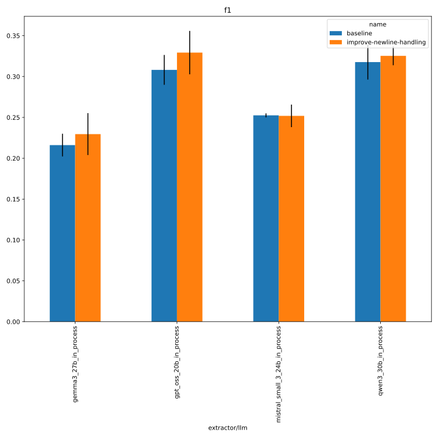
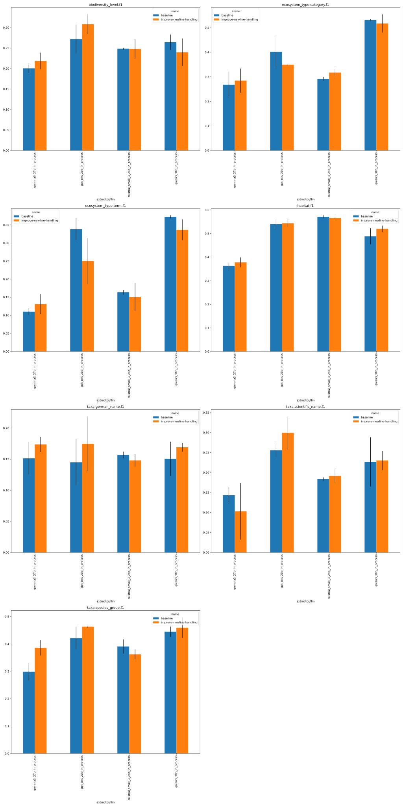
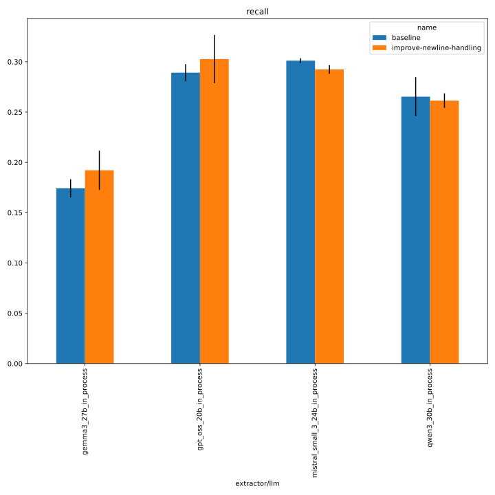
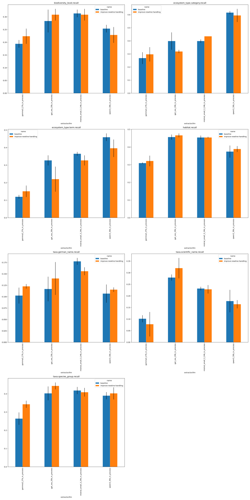
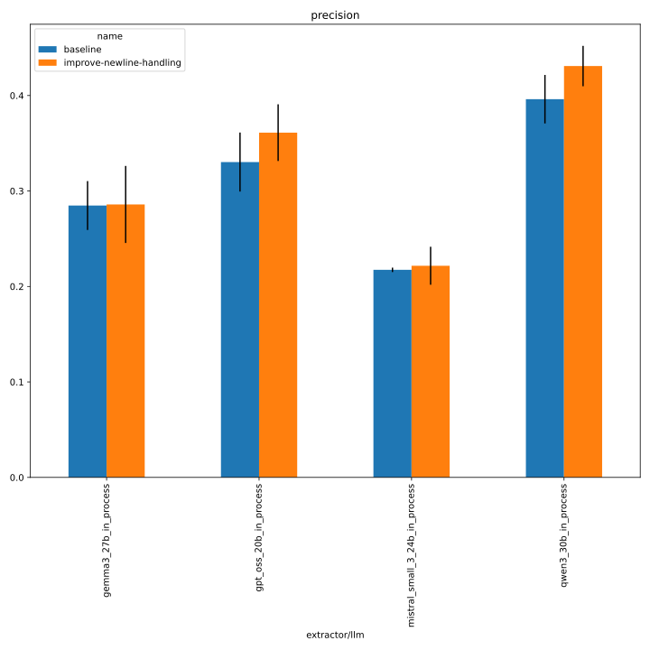
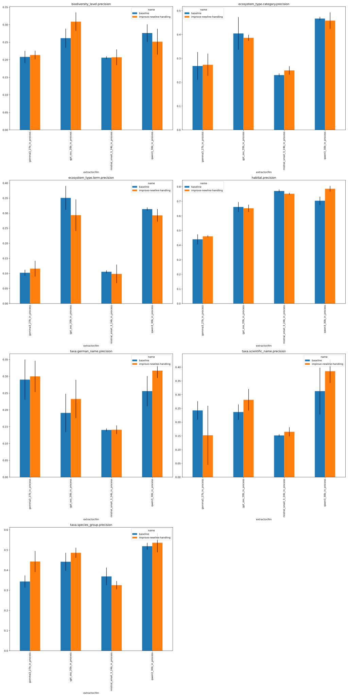
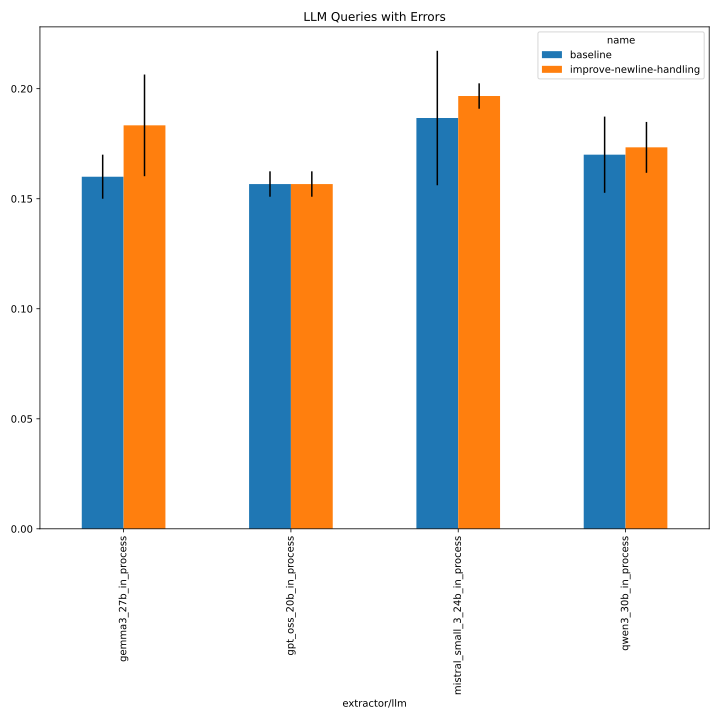
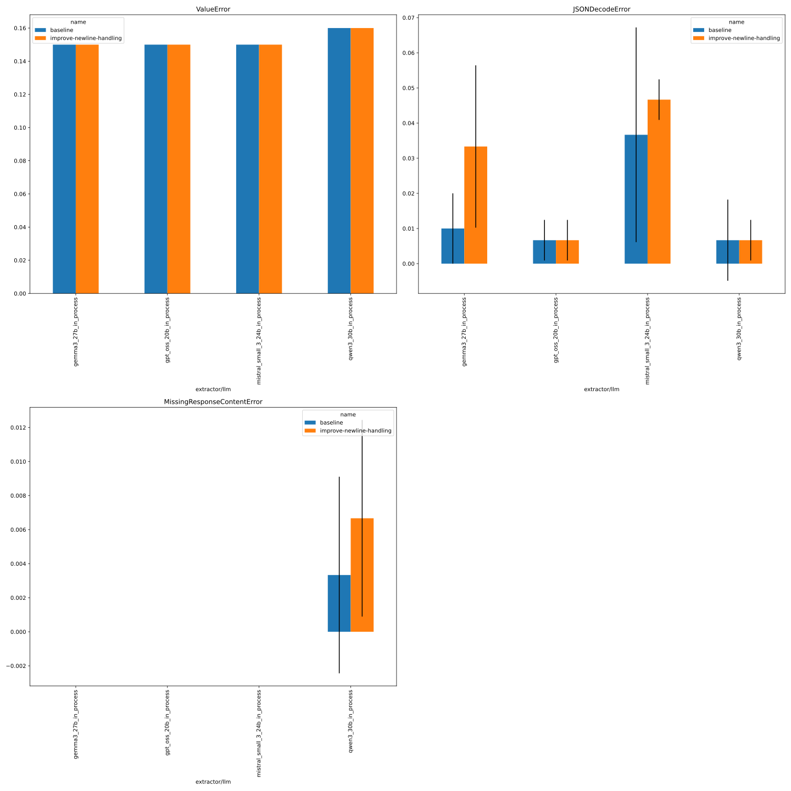

# 380_faktencheck_core

evaluate on Faktencheck core dev set. see https://github.com/DFKI-NLP/kibad-llm/pull/380 for details.

## comparison with baseline

baseline from [here](https://github.com/DFKI-NLP/kibad-llm/pull/371#issuecomment-3944979094)

```python
NAME = "380_faktencheck_core"

SUBDIR = [
    "evaluate", 
    "../371_faktencheck_core_fix_ecosystem_type/evaluate/multiruns/2026-02-27_10-23-23",
    "../371_faktencheck_core_fix_ecosystem_type/evaluate/multiruns/2026-02-27_10-24-59",
]

FILE_NAME_PREFIX = "baseline_"

MAP_VALUES = {
    "prediction.overrides.name": {
        "371_faktencheck_core_fix_ecosystem_type": "baseline",
        "380_faktencheck_core": "improve-newline-handling",
    }
}

METRICS = ["f1", "recall", "precision"]
# used to group the data
INDEX_COLUMNS = ["prediction.overrides.extractor/llm", "prediction.overrides.name"]
PLOT_KWARGS = {
    # can be either "metric" or one of the INDEX_COLUMNS (or multiple of them)
    "xgroup": ["prediction.overrides.name"],
    # add any more arguments passed to pd.DataFrame.plot
    "create_subplot_for_each": "metric",
    #"set_missing_values_to_zero": True,
    "subplot_columns": 2,
}
```


### f1


<details>
<summary>see detailed metrics</summary>



</details>

### recall


<details>
<summary>see detailed metrics</summary>



</details>

### precision


<details>
<summary>see detailed metrics</summary>



</details>

### errors


<details>
<summary>see detailed metrics</summary>



</details>


## Inference
- commit (this branch): [ba41778](https://github.com/DFKI-NLP/kibad-llm/pull/380/commits/ba4177888275db7c8dc2ddf46678dde450aa11f4)
- based on [this](https://github.com/DFKI-NLP/kibad-llm/pull/371#issuecomment-3944979094)
```
./run_in_process.sh \
-sr \
-r ba4177888275db7c8dc2ddf46678dde450aa11f4 \
-pa "H100-SLT,H100-Trails,H100,A100-80GB" \
-t "2-00:00:00" \
-u "-m kibad_llm.predict \
name=380_faktencheck_core \
experiment/predict=faktencheck_core_fields_schema_with_evidence \
pdf_directory=/ds/text/kiba-d/dev-set-100 \
extractor/llm=gpt_oss_20b_in_process,gemma3_27b_in_process,qwen3_30b_in_process,mistral_small_3_24b_in_process \
seed=42,1337,7331 \
--multirun"
```
run @ `screen -r kibad-llm-1`
```
>>> Syncing git refs (git fetch --prune --tags) in /netscratch/binder/projects/kibad-llm
From github-kibad-llm:DFKI-NLP/kibad-llm
 - [deleted]           (none)                                            -> origin/schema/fix-ecosystem_type-description-for-core
remote: Enumerating objects: 683, done.
remote: Counting objects: 100% (461/461), done.
remote: Compressing objects: 100% (151/151), done.
remote: Total 683 (delta 282), reused 397 (delta 276), pack-reused 222 (from 1)
Receiving objects: 100% (683/683), 11.53 MiB | 10.39 MiB/s, done.
Resolving deltas: 100% (384/384), completed with 26 local objects.
 + 8a0d04d9...ba417788 build_schema_description/improve-newline-handling -> origin/build_schema_description/improve-newline-handling  (forced update)
 + f15c5f6c...03423ecc feat/chunking-extractor                           -> origin/feat/chunking-extractor  (forced update)
   6791ea2c..0f553042  main                                              -> origin/main
>>> Validating git ref: ba4177888275db7c8dc2ddf46678dde450aa11f4
=============================================
>>> USING PARTITION H100-SLT,H100-Trails,H100,A100-80GB
>>> MAX TIME 2-00:00:00
>>> SUBMITTED Wed Mar 11 03:53:59 PM CET 2026
>>> UV_ARGS --cache-dir /netscratch/binder/cache/uv -m kibad_llm.predict name=380_faktencheck_core experiment/predict=faktencheck_core_fields_schema_with_evidence pdf_directory=/ds/text/kiba-d/dev-set-100 extractor/llm=gpt_oss_20b_in_process,gemma3_27b_in_process,qwen3_30b_in_process,mistral_small_3_24b_in_process seed=42,1337,7331 --multirun
>>> JOB_NAME kiba-d_66fd30bc-c8ef-42d5-b670-0644beb7bf52
>>> GIT_REF ba4177888275db7c8dc2ddf46678dde450aa11f4
=============================================
srun: jobinfo: version v1.0.0
srun: job 2616389 queued and waiting for resources
```

[2026-03-12 04:43:44,361][HYDRA] Contents of /netscratch/binder/tmp/kiba-d_66fd30bc-c8ef-42d5-b670-0644beb7bf52/repo/logs/380_faktencheck_core/predict/multiruns/2026-03-11_16-30-57/job_return_value.md:

<details>
<summary>click to see result</summary>

|                                                        | branch              | commit_hash                              | is_dirty   | output_file                                                                                       | output_file_absolute                                                                                                                                                      | overrides.experiment/predict                 | overrides.extractor/llm        | overrides.name       | overrides.pdf_directory     |   overrides.seed |   slurm_job_id |   time_end |   time_extraction |   time_pdf_conversion |   time_start |
|:-------------------------------------------------------|:--------------------|:-----------------------------------------|:-----------|:--------------------------------------------------------------------------------------------------|:--------------------------------------------------------------------------------------------------------------------------------------------------------------------------|:---------------------------------------------|:-------------------------------|:---------------------|:----------------------------|-----------------:|---------------:|-----------:|------------------:|----------------------:|-------------:|
| extractor/llm=gemma3_27b_in_process#seed=1337          | commit/ba4177888275 | ba4177888275db7c8dc2ddf46678dde450aa11f4 | False      | predictions/380_faktencheck_core/2026-03-11_16-30-57/2026-03-11_19-56-44_782245/predictions.jsonl | /netscratch/binder/tmp/kiba-d_66fd30bc-c8ef-42d5-b670-0644beb7bf52/repo/predictions/380_faktencheck_core/2026-03-11_16-30-57/2026-03-11_19-56-44_782245/predictions.jsonl | faktencheck_core_fields_schema_with_evidence | gemma3_27b_in_process          | 380_faktencheck_core | /ds/text/kiba-d/dev-set-100 |             1337 |        2616389 | 1773258191 |           2681.82 |            0.00308937 |   1773255404 |
| extractor/llm=gemma3_27b_in_process#seed=42            | commit/ba4177888275 | ba4177888275db7c8dc2ddf46678dde450aa11f4 | False      | predictions/380_faktencheck_core/2026-03-11_16-30-57/2026-03-11_18-51-09_014979/predictions.jsonl | /netscratch/binder/tmp/kiba-d_66fd30bc-c8ef-42d5-b670-0644beb7bf52/repo/predictions/380_faktencheck_core/2026-03-11_16-30-57/2026-03-11_18-51-09_014979/predictions.jsonl | faktencheck_core_fields_schema_with_evidence | gemma3_27b_in_process          | 380_faktencheck_core | /ds/text/kiba-d/dev-set-100 |               42 |        2616389 | 1773255404 |           3763.03 |            0.00290239 |   1773251469 |
| extractor/llm=gemma3_27b_in_process#seed=7331          | commit/ba4177888275 | ba4177888275db7c8dc2ddf46678dde450aa11f4 | False      | predictions/380_faktencheck_core/2026-03-11_16-30-57/2026-03-11_20-43-11_237491/predictions.jsonl | /netscratch/binder/tmp/kiba-d_66fd30bc-c8ef-42d5-b670-0644beb7bf52/repo/predictions/380_faktencheck_core/2026-03-11_16-30-57/2026-03-11_20-43-11_237491/predictions.jsonl | faktencheck_core_fields_schema_with_evidence | gemma3_27b_in_process          | 380_faktencheck_core | /ds/text/kiba-d/dev-set-100 |             7331 |        2616389 | 1773260829 |           2541.01 |            0.00307029 |   1773258191 |
| extractor/llm=gpt_oss_20b_in_process#seed=1337         | commit/ba4177888275 | ba4177888275db7c8dc2ddf46678dde450aa11f4 | False      | predictions/380_faktencheck_core/2026-03-11_16-30-57/2026-03-11_17-23-52_338540/predictions.jsonl | /netscratch/binder/tmp/kiba-d_66fd30bc-c8ef-42d5-b670-0644beb7bf52/repo/predictions/380_faktencheck_core/2026-03-11_16-30-57/2026-03-11_17-23-52_338540/predictions.jsonl | faktencheck_core_fields_schema_with_evidence | gpt_oss_20b_in_process         | 380_faktencheck_core | /ds/text/kiba-d/dev-set-100 |             1337 |        2616389 | 1773248833 |           2535.85 |            0.00330974 |   1773246232 |
| extractor/llm=gpt_oss_20b_in_process#seed=42           | commit/ba4177888275 | ba4177888275db7c8dc2ddf46678dde450aa11f4 | False      | predictions/380_faktencheck_core/2026-03-11_16-30-57/2026-03-11_16-30-59_754003/predictions.jsonl | /netscratch/binder/tmp/kiba-d_66fd30bc-c8ef-42d5-b670-0644beb7bf52/repo/predictions/380_faktencheck_core/2026-03-11_16-30-57/2026-03-11_16-30-59_754003/predictions.jsonl | faktencheck_core_fields_schema_with_evidence | gpt_oss_20b_in_process         | 380_faktencheck_core | /ds/text/kiba-d/dev-set-100 |               42 |        2616389 | 1773246231 |           2835.83 |            0.158088   |   1773243059 |
| extractor/llm=gpt_oss_20b_in_process#seed=7331         | commit/ba4177888275 | ba4177888275db7c8dc2ddf46678dde450aa11f4 | False      | predictions/380_faktencheck_core/2026-03-11_16-30-57/2026-03-11_18-07-13_597068/predictions.jsonl | /netscratch/binder/tmp/kiba-d_66fd30bc-c8ef-42d5-b670-0644beb7bf52/repo/predictions/380_faktencheck_core/2026-03-11_16-30-57/2026-03-11_18-07-13_597068/predictions.jsonl | faktencheck_core_fields_schema_with_evidence | gpt_oss_20b_in_process         | 380_faktencheck_core | /ds/text/kiba-d/dev-set-100 |             7331 |        2616389 | 1773251468 |           2576.33 |            0.00322866 |   1773248833 |
| extractor/llm=mistral_small_3_24b_in_process#seed=1337 | commit/ba4177888275 | ba4177888275db7c8dc2ddf46678dde450aa11f4 | False      | predictions/380_faktencheck_core/2026-03-11_16-30-57/2026-03-12_01-47-06_568328/predictions.jsonl | /netscratch/binder/tmp/kiba-d_66fd30bc-c8ef-42d5-b670-0644beb7bf52/repo/predictions/380_faktencheck_core/2026-03-11_16-30-57/2026-03-12_01-47-06_568328/predictions.jsonl | faktencheck_core_fields_schema_with_evidence | mistral_small_3_24b_in_process | 380_faktencheck_core | /ds/text/kiba-d/dev-set-100 |             1337 |        2616389 | 1773281827 |           5297.51 |            0.00339621 |   1773276426 |
| extractor/llm=mistral_small_3_24b_in_process#seed=42   | commit/ba4177888275 | ba4177888275db7c8dc2ddf46678dde450aa11f4 | False      | predictions/380_faktencheck_core/2026-03-11_16-30-57/2026-03-12_00-23-58_016877/predictions.jsonl | /netscratch/binder/tmp/kiba-d_66fd30bc-c8ef-42d5-b670-0644beb7bf52/repo/predictions/380_faktencheck_core/2026-03-11_16-30-57/2026-03-12_00-23-58_016877/predictions.jsonl | faktencheck_core_fields_schema_with_evidence | mistral_small_3_24b_in_process | 380_faktencheck_core | /ds/text/kiba-d/dev-set-100 |               42 |        2616389 | 1773276426 |           4809.62 |            0.00365828 |   1773271438 |
| extractor/llm=mistral_small_3_24b_in_process#seed=7331 | commit/ba4177888275 | ba4177888275db7c8dc2ddf46678dde450aa11f4 | False      | predictions/380_faktencheck_core/2026-03-11_16-30-57/2026-03-12_03-17-08_077011/predictions.jsonl | /netscratch/binder/tmp/kiba-d_66fd30bc-c8ef-42d5-b670-0644beb7bf52/repo/predictions/380_faktencheck_core/2026-03-11_16-30-57/2026-03-12_03-17-08_077011/predictions.jsonl | faktencheck_core_fields_schema_with_evidence | mistral_small_3_24b_in_process | 380_faktencheck_core | /ds/text/kiba-d/dev-set-100 |             7331 |        2616389 | 1773287023 |           5113.47 |            0.0036437  |   1773281828 |
| extractor/llm=qwen3_30b_in_process#seed=1337           | commit/ba4177888275 | ba4177888275db7c8dc2ddf46678dde450aa11f4 | False      | predictions/380_faktencheck_core/2026-03-11_16-30-57/2026-03-11_22-27-25_398485/predictions.jsonl | /netscratch/binder/tmp/kiba-d_66fd30bc-c8ef-42d5-b670-0644beb7bf52/repo/predictions/380_faktencheck_core/2026-03-11_16-30-57/2026-03-11_22-27-25_398485/predictions.jsonl | faktencheck_core_fields_schema_with_evidence | qwen3_30b_in_process           | 380_faktencheck_core | /ds/text/kiba-d/dev-set-100 |             1337 |        2616389 | 1773267946 |           3427.5  |            0.00306183 |   1773264445 |
| extractor/llm=qwen3_30b_in_process#seed=42             | commit/ba4177888275 | ba4177888275db7c8dc2ddf46678dde450aa11f4 | False      | predictions/380_faktencheck_core/2026-03-11_16-30-57/2026-03-11_21-27-09_460921/predictions.jsonl | /netscratch/binder/tmp/kiba-d_66fd30bc-c8ef-42d5-b670-0644beb7bf52/repo/predictions/380_faktencheck_core/2026-03-11_16-30-57/2026-03-11_21-27-09_460921/predictions.jsonl | faktencheck_core_fields_schema_with_evidence | qwen3_30b_in_process           | 380_faktencheck_core | /ds/text/kiba-d/dev-set-100 |               42 |        2616389 | 1773264445 |           3419.37 |            0.00313214 |   1773260829 |
| extractor/llm=qwen3_30b_in_process#seed=7331           | commit/ba4177888275 | ba4177888275db7c8dc2ddf46678dde450aa11f4 | False      | predictions/380_faktencheck_core/2026-03-11_16-30-57/2026-03-11_23-25-46_648450/predictions.jsonl | /netscratch/binder/tmp/kiba-d_66fd30bc-c8ef-42d5-b670-0644beb7bf52/repo/predictions/380_faktencheck_core/2026-03-11_16-30-57/2026-03-11_23-25-46_648450/predictions.jsonl | faktencheck_core_fields_schema_with_evidence | qwen3_30b_in_process           | 380_faktencheck_core | /ds/text/kiba-d/dev-set-100 |             7331 |        2616389 | 1773271437 |           3416.86 |            0.00330019 |   1773267946 |

</details>

## metrics
```
uv run -m kibad_llm.evaluate \
name=380_faktencheck_core  \
experiment/evaluate=faktencheck_core_f1_micro_flat \
prediction_logs=logs/380_faktencheck_core/predict \
+hydra.callbacks.save_job_return.multirun_markdown_group_by=prediction.overrides.extractor/llm \
--multirun
```

[2026-03-12 15:33:01,827][HYDRA] Contents of /netscratch/binder/projects/kibad-llm/logs/380_faktencheck_core/evaluate/multiruns/2026-03-12_15-32-54/job_return_value.md:

<details>
<summary>click to see result</summary>

| prediction.overrides.extractor/llm   |   ALL.f1.mean |   ALL.f1.std |   ALL.precision.mean |   ALL.precision.std |   ALL.recall.mean |   ALL.recall.std |   ALL.support.mean |   ALL.support.std |   AVG.f1.mean |   AVG.f1.std |   AVG.precision.mean |   AVG.precision.std |   AVG.recall.mean |   AVG.recall.std |   AVG.support.mean |   AVG.support.std |   biodiversity_level.f1.mean |   biodiversity_level.f1.std |   biodiversity_level.precision.mean |   biodiversity_level.precision.std |   biodiversity_level.recall.mean |   biodiversity_level.recall.std |   biodiversity_level.support.mean |   biodiversity_level.support.std |   ecosystem_type.category.f1.mean |   ecosystem_type.category.f1.std |   ecosystem_type.category.precision.mean |   ecosystem_type.category.precision.std |   ecosystem_type.category.recall.mean |   ecosystem_type.category.recall.std |   ecosystem_type.category.support.mean |   ecosystem_type.category.support.std |   ecosystem_type.term.f1.mean |   ecosystem_type.term.f1.std |   ecosystem_type.term.precision.mean |   ecosystem_type.term.precision.std |   ecosystem_type.term.recall.mean |   ecosystem_type.term.recall.std |   ecosystem_type.term.support.mean |   ecosystem_type.term.support.std |   habitat.f1.mean |   habitat.f1.std |   habitat.precision.mean |   habitat.precision.std |   habitat.recall.mean |   habitat.recall.std |   habitat.support.mean |   habitat.support.std |   prediction.job_return_value.time_end.mean |   prediction.job_return_value.time_end.std |   prediction.job_return_value.time_extraction.mean |   prediction.job_return_value.time_extraction.std |   prediction.job_return_value.time_pdf_conversion.mean |   prediction.job_return_value.time_pdf_conversion.std |   prediction.job_return_value.time_start.mean |   prediction.job_return_value.time_start.std |   taxa.german_name.f1.mean |   taxa.german_name.f1.std |   taxa.german_name.precision.mean |   taxa.german_name.precision.std |   taxa.german_name.recall.mean |   taxa.german_name.recall.std |   taxa.german_name.support.mean |   taxa.german_name.support.std |   taxa.scientific_name.f1.mean |   taxa.scientific_name.f1.std |   taxa.scientific_name.precision.mean |   taxa.scientific_name.precision.std |   taxa.scientific_name.recall.mean |   taxa.scientific_name.recall.std |   taxa.scientific_name.support.mean |   taxa.scientific_name.support.std |   taxa.species_group.f1.mean |   taxa.species_group.f1.std |   taxa.species_group.precision.mean |   taxa.species_group.precision.std |   taxa.species_group.recall.mean |   taxa.species_group.recall.std |   taxa.species_group.support.mean |   taxa.species_group.support.std | overrides.dataset.predictions.log                                                                                                                                                                                 | overrides.experiment/evaluate                                                                          | overrides.name                                                           | overrides.prediction_logs                                                                                       | prediction.job_return_value.branch                                    | prediction.job_return_value.commit_hash                                                                                              | prediction.job_return_value.is_dirty   | prediction.job_return_value.output_file                                                                                                                                                                                                                                                                         | prediction.job_return_value.output_file_absolute                                                                                                                                                                                                                                                                                                                                                                                                                                                                                        | prediction.job_return_value.slurm_job_id   | prediction.overrides.experiment/predict                                                                                                          | prediction.overrides.name                                                | prediction.overrides.pdf_directory                                                            | prediction.overrides.seed   |
|:-------------------------------------|--------------:|-------------:|---------------------:|--------------------:|------------------:|-----------------:|-------------------:|------------------:|--------------:|-------------:|---------------------:|--------------------:|------------------:|-----------------:|-------------------:|------------------:|-----------------------------:|----------------------------:|------------------------------------:|-----------------------------------:|---------------------------------:|--------------------------------:|----------------------------------:|---------------------------------:|----------------------------------:|---------------------------------:|-----------------------------------------:|----------------------------------------:|--------------------------------------:|-------------------------------------:|---------------------------------------:|--------------------------------------:|------------------------------:|-----------------------------:|-------------------------------------:|------------------------------------:|----------------------------------:|---------------------------------:|-----------------------------------:|----------------------------------:|------------------:|-----------------:|-------------------------:|------------------------:|----------------------:|---------------------:|-----------------------:|----------------------:|--------------------------------------------:|-------------------------------------------:|---------------------------------------------------:|--------------------------------------------------:|-------------------------------------------------------:|------------------------------------------------------:|----------------------------------------------:|---------------------------------------------:|---------------------------:|--------------------------:|----------------------------------:|---------------------------------:|-------------------------------:|------------------------------:|--------------------------------:|-------------------------------:|-------------------------------:|------------------------------:|--------------------------------------:|-------------------------------------:|-----------------------------------:|----------------------------------:|------------------------------------:|-----------------------------------:|-----------------------------:|----------------------------:|------------------------------------:|-----------------------------------:|---------------------------------:|--------------------------------:|----------------------------------:|---------------------------------:|:------------------------------------------------------------------------------------------------------------------------------------------------------------------------------------------------------------------|:-------------------------------------------------------------------------------------------------------|:-------------------------------------------------------------------------|:----------------------------------------------------------------------------------------------------------------|:----------------------------------------------------------------------|:-------------------------------------------------------------------------------------------------------------------------------------|:---------------------------------------|:----------------------------------------------------------------------------------------------------------------------------------------------------------------------------------------------------------------------------------------------------------------------------------------------------------------|:----------------------------------------------------------------------------------------------------------------------------------------------------------------------------------------------------------------------------------------------------------------------------------------------------------------------------------------------------------------------------------------------------------------------------------------------------------------------------------------------------------------------------------------|:-------------------------------------------|:-------------------------------------------------------------------------------------------------------------------------------------------------|:-------------------------------------------------------------------------|:----------------------------------------------------------------------------------------------|:----------------------------|
| gemma3_27b_in_process                |         0.23  |        0.026 |                0.286 |               0.04  |             0.192 |            0.02  |                838 |                 0 |         0.239 |        0.026 |                0.28  |               0.039 |             0.219 |            0.025 |            119.714 |                 0 |                        0.218 |                       0.02  |                               0.214 |                              0.012 |                            0.224 |                           0.03  |                                67 |                                0 |                             0.284 |                            0.049 |                                    0.273 |                                   0.047 |                                 0.297 |                                0.055 |                                     46 |                                     0 |                         0.131 |                        0.028 |                                0.116 |                               0.026 |                             0.151 |                            0.033 |                                 53 |                                 0 |             0.378 |            0.021 |                    0.46  |                   0.007 |                 0.321 |                0.03  |                    138 |                     0 |                                 1.77326e+09 |                                    2712.84 |                                            2995.29 |                                           668.605 |                                                  0.003 |                                                 0     |                                   1.77326e+09 |                                      3377.3  |                      0.174 |                     0.012 |                             0.3   |                            0.047 |                          0.123 |                         0.005 |                             231 |                              0 |                          0.103 |                         0.071 |                                 0.152 |                                0.107 |                              0.078 |                             0.053 |                                 197 |                                  0 |                        0.386 |                       0.028 |                               0.443 |                              0.052 |                            0.343 |                           0.02  |                               106 |                                0 | ['logs/380_faktencheck_core/predict/multiruns/2026-03-11_16-30-57/3', 'logs/380_faktencheck_core/predict/multiruns/2026-03-11_16-30-57/4', 'logs/380_faktencheck_core/predict/multiruns/2026-03-11_16-30-57/5']   | ['faktencheck_core_f1_micro_flat', 'faktencheck_core_f1_micro_flat', 'faktencheck_core_f1_micro_flat'] | ['380_faktencheck_core', '380_faktencheck_core', '380_faktencheck_core'] | ['logs/380_faktencheck_core/predict', 'logs/380_faktencheck_core/predict', 'logs/380_faktencheck_core/predict'] | ['commit/ba4177888275', 'commit/ba4177888275', 'commit/ba4177888275'] | ['ba4177888275db7c8dc2ddf46678dde450aa11f4', 'ba4177888275db7c8dc2ddf46678dde450aa11f4', 'ba4177888275db7c8dc2ddf46678dde450aa11f4'] | [np.False_, np.False_, np.False_]      | ['predictions/380_faktencheck_core/2026-03-11_16-30-57/2026-03-11_18-51-09_014979/predictions.jsonl', 'predictions/380_faktencheck_core/2026-03-11_16-30-57/2026-03-11_19-56-44_782245/predictions.jsonl', 'predictions/380_faktencheck_core/2026-03-11_16-30-57/2026-03-11_20-43-11_237491/predictions.jsonl'] | ['/netscratch/binder/tmp/kiba-d_66fd30bc-c8ef-42d5-b670-0644beb7bf52/repo/predictions/380_faktencheck_core/2026-03-11_16-30-57/2026-03-11_18-51-09_014979/predictions.jsonl', '/netscratch/binder/tmp/kiba-d_66fd30bc-c8ef-42d5-b670-0644beb7bf52/repo/predictions/380_faktencheck_core/2026-03-11_16-30-57/2026-03-11_19-56-44_782245/predictions.jsonl', '/netscratch/binder/tmp/kiba-d_66fd30bc-c8ef-42d5-b670-0644beb7bf52/repo/predictions/380_faktencheck_core/2026-03-11_16-30-57/2026-03-11_20-43-11_237491/predictions.jsonl'] | ['2616389', '2616389', '2616389']          | ['faktencheck_core_fields_schema_with_evidence', 'faktencheck_core_fields_schema_with_evidence', 'faktencheck_core_fields_schema_with_evidence'] | ['380_faktencheck_core', '380_faktencheck_core', '380_faktencheck_core'] | ['/ds/text/kiba-d/dev-set-100', '/ds/text/kiba-d/dev-set-100', '/ds/text/kiba-d/dev-set-100'] | ['42', '1337', '7331']      |
| gpt_oss_20b_in_process               |         0.329 |        0.027 |                0.361 |               0.03  |             0.303 |            0.024 |                838 |                 0 |         0.341 |        0.025 |                0.377 |               0.029 |             0.317 |            0.023 |            119.714 |                 0 |                        0.309 |                       0.024 |                               0.309 |                              0.026 |                            0.308 |                           0.023 |                                67 |                                0 |                             0.349 |                            0.004 |                                    0.387 |                                   0.013 |                                 0.319 |                                0.013 |                                     46 |                                     0 |                         0.25  |                        0.063 |                                0.293 |                               0.052 |                             0.22  |                            0.071 |                                 53 |                                 0 |             0.544 |            0.016 |                    0.652 |                   0.024 |                 0.466 |                0.011 |                    138 |                     0 |                                 1.77325e+09 |                                    2618.52 |                                            2649.34 |                                           162.77  |                                                  0.055 |                                                 0.089 |                                   1.77325e+09 |                                      2891.72 |                      0.175 |                     0.044 |                             0.233 |                            0.057 |                          0.14  |                         0.036 |                             231 |                              0 |                          0.299 |                         0.041 |                                 0.281 |                                0.039 |                              0.32  |                             0.044 |                                 197 |                                  0 |                        0.463 |                       0.004 |                               0.486 |                              0.025 |                            0.443 |                           0.019 |                               106 |                                0 | ['logs/380_faktencheck_core/predict/multiruns/2026-03-11_16-30-57/0', 'logs/380_faktencheck_core/predict/multiruns/2026-03-11_16-30-57/1', 'logs/380_faktencheck_core/predict/multiruns/2026-03-11_16-30-57/2']   | ['faktencheck_core_f1_micro_flat', 'faktencheck_core_f1_micro_flat', 'faktencheck_core_f1_micro_flat'] | ['380_faktencheck_core', '380_faktencheck_core', '380_faktencheck_core'] | ['logs/380_faktencheck_core/predict', 'logs/380_faktencheck_core/predict', 'logs/380_faktencheck_core/predict'] | ['commit/ba4177888275', 'commit/ba4177888275', 'commit/ba4177888275'] | ['ba4177888275db7c8dc2ddf46678dde450aa11f4', 'ba4177888275db7c8dc2ddf46678dde450aa11f4', 'ba4177888275db7c8dc2ddf46678dde450aa11f4'] | [np.False_, np.False_, np.False_]      | ['predictions/380_faktencheck_core/2026-03-11_16-30-57/2026-03-11_16-30-59_754003/predictions.jsonl', 'predictions/380_faktencheck_core/2026-03-11_16-30-57/2026-03-11_17-23-52_338540/predictions.jsonl', 'predictions/380_faktencheck_core/2026-03-11_16-30-57/2026-03-11_18-07-13_597068/predictions.jsonl'] | ['/netscratch/binder/tmp/kiba-d_66fd30bc-c8ef-42d5-b670-0644beb7bf52/repo/predictions/380_faktencheck_core/2026-03-11_16-30-57/2026-03-11_16-30-59_754003/predictions.jsonl', '/netscratch/binder/tmp/kiba-d_66fd30bc-c8ef-42d5-b670-0644beb7bf52/repo/predictions/380_faktencheck_core/2026-03-11_16-30-57/2026-03-11_17-23-52_338540/predictions.jsonl', '/netscratch/binder/tmp/kiba-d_66fd30bc-c8ef-42d5-b670-0644beb7bf52/repo/predictions/380_faktencheck_core/2026-03-11_16-30-57/2026-03-11_18-07-13_597068/predictions.jsonl'] | ['2616389', '2616389', '2616389']          | ['faktencheck_core_fields_schema_with_evidence', 'faktencheck_core_fields_schema_with_evidence', 'faktencheck_core_fields_schema_with_evidence'] | ['380_faktencheck_core', '380_faktencheck_core', '380_faktencheck_core'] | ['/ds/text/kiba-d/dev-set-100', '/ds/text/kiba-d/dev-set-100', '/ds/text/kiba-d/dev-set-100'] | ['42', '1337', '7331']      |
| mistral_small_3_24b_in_process       |         0.252 |        0.014 |                0.222 |               0.02  |             0.292 |            0.004 |                838 |                 0 |         0.283 |        0.012 |                0.277 |               0.014 |             0.331 |            0.008 |            119.714 |                 0 |                        0.248 |                       0.023 |                               0.207 |                              0.022 |                            0.308 |                           0.023 |                                67 |                                0 |                             0.317 |                            0.014 |                                    0.25  |                                   0.018 |                                 0.435 |                                0     |                                     46 |                                     0 |                         0.15  |                        0.039 |                                0.098 |                               0.031 |                             0.327 |                            0.029 |                                 53 |                                 0 |             0.566 |            0.005 |                    0.752 |                   0.006 |                 0.454 |                0.004 |                    138 |                     0 |                                 1.77328e+09 |                                    5298.83 |                                            5073.54 |                                           246.384 |                                                  0.004 |                                                 0     |                                   1.77328e+09 |                                      5196.38 |                      0.148 |                     0.01  |                             0.141 |                            0.013 |                          0.156 |                         0.009 |                             231 |                              0 |                          0.192 |                         0.017 |                                 0.165 |                                0.017 |                              0.228 |                             0.018 |                                 197 |                                  0 |                        0.362 |                       0.018 |                               0.326 |                              0.02  |                            0.409 |                           0.024 |                               106 |                                0 | ['logs/380_faktencheck_core/predict/multiruns/2026-03-11_16-30-57/10', 'logs/380_faktencheck_core/predict/multiruns/2026-03-11_16-30-57/11', 'logs/380_faktencheck_core/predict/multiruns/2026-03-11_16-30-57/9'] | ['faktencheck_core_f1_micro_flat', 'faktencheck_core_f1_micro_flat', 'faktencheck_core_f1_micro_flat'] | ['380_faktencheck_core', '380_faktencheck_core', '380_faktencheck_core'] | ['logs/380_faktencheck_core/predict', 'logs/380_faktencheck_core/predict', 'logs/380_faktencheck_core/predict'] | ['commit/ba4177888275', 'commit/ba4177888275', 'commit/ba4177888275'] | ['ba4177888275db7c8dc2ddf46678dde450aa11f4', 'ba4177888275db7c8dc2ddf46678dde450aa11f4', 'ba4177888275db7c8dc2ddf46678dde450aa11f4'] | [np.False_, np.False_, np.False_]      | ['predictions/380_faktencheck_core/2026-03-11_16-30-57/2026-03-12_01-47-06_568328/predictions.jsonl', 'predictions/380_faktencheck_core/2026-03-11_16-30-57/2026-03-12_03-17-08_077011/predictions.jsonl', 'predictions/380_faktencheck_core/2026-03-11_16-30-57/2026-03-12_00-23-58_016877/predictions.jsonl'] | ['/netscratch/binder/tmp/kiba-d_66fd30bc-c8ef-42d5-b670-0644beb7bf52/repo/predictions/380_faktencheck_core/2026-03-11_16-30-57/2026-03-12_01-47-06_568328/predictions.jsonl', '/netscratch/binder/tmp/kiba-d_66fd30bc-c8ef-42d5-b670-0644beb7bf52/repo/predictions/380_faktencheck_core/2026-03-11_16-30-57/2026-03-12_03-17-08_077011/predictions.jsonl', '/netscratch/binder/tmp/kiba-d_66fd30bc-c8ef-42d5-b670-0644beb7bf52/repo/predictions/380_faktencheck_core/2026-03-11_16-30-57/2026-03-12_00-23-58_016877/predictions.jsonl'] | ['2616389', '2616389', '2616389']          | ['faktencheck_core_fields_schema_with_evidence', 'faktencheck_core_fields_schema_with_evidence', 'faktencheck_core_fields_schema_with_evidence'] | ['380_faktencheck_core', '380_faktencheck_core', '380_faktencheck_core'] | ['/ds/text/kiba-d/dev-set-100', '/ds/text/kiba-d/dev-set-100', '/ds/text/kiba-d/dev-set-100'] | ['1337', '7331', '42']      |
| qwen3_30b_in_process                 |         0.325 |        0.011 |                0.431 |               0.021 |             0.261 |            0.007 |                838 |                 0 |         0.353 |        0.012 |                0.433 |               0.021 |             0.327 |            0.008 |            119.714 |                 0 |                        0.24  |                       0.034 |                               0.252 |                              0.037 |                            0.229 |                           0.031 |                                67 |                                0 |                             0.517 |                            0.037 |                                    0.459 |                                   0.034 |                                 0.594 |                                0.05  |                                     46 |                                     0 |                         0.336 |                        0.029 |                                0.293 |                               0.021 |                             0.396 |                            0.05  |                                 53 |                                 0 |             0.52  |            0.014 |                    0.786 |                   0.019 |                 0.389 |                0.017 |                    138 |                     0 |                                 1.77327e+09 |                                    3496    |                                            3421.24 |                                             5.56  |                                                  0.003 |                                                 0     |                                   1.77326e+09 |                                      3558.66 |                      0.169 |                     0.007 |                             0.317 |                            0.022 |                          0.115 |                         0.005 |                             231 |                              0 |                          0.23  |                         0.024 |                                 0.385 |                                0.042 |                              0.164 |                             0.018 |                                 197 |                                  0 |                        0.46  |                       0.038 |                               0.536 |                              0.047 |                            0.403 |                           0.033 |                               106 |                                0 | ['logs/380_faktencheck_core/predict/multiruns/2026-03-11_16-30-57/6', 'logs/380_faktencheck_core/predict/multiruns/2026-03-11_16-30-57/7', 'logs/380_faktencheck_core/predict/multiruns/2026-03-11_16-30-57/8']   | ['faktencheck_core_f1_micro_flat', 'faktencheck_core_f1_micro_flat', 'faktencheck_core_f1_micro_flat'] | ['380_faktencheck_core', '380_faktencheck_core', '380_faktencheck_core'] | ['logs/380_faktencheck_core/predict', 'logs/380_faktencheck_core/predict', 'logs/380_faktencheck_core/predict'] | ['commit/ba4177888275', 'commit/ba4177888275', 'commit/ba4177888275'] | ['ba4177888275db7c8dc2ddf46678dde450aa11f4', 'ba4177888275db7c8dc2ddf46678dde450aa11f4', 'ba4177888275db7c8dc2ddf46678dde450aa11f4'] | [np.False_, np.False_, np.False_]      | ['predictions/380_faktencheck_core/2026-03-11_16-30-57/2026-03-11_21-27-09_460921/predictions.jsonl', 'predictions/380_faktencheck_core/2026-03-11_16-30-57/2026-03-11_22-27-25_398485/predictions.jsonl', 'predictions/380_faktencheck_core/2026-03-11_16-30-57/2026-03-11_23-25-46_648450/predictions.jsonl'] | ['/netscratch/binder/tmp/kiba-d_66fd30bc-c8ef-42d5-b670-0644beb7bf52/repo/predictions/380_faktencheck_core/2026-03-11_16-30-57/2026-03-11_21-27-09_460921/predictions.jsonl', '/netscratch/binder/tmp/kiba-d_66fd30bc-c8ef-42d5-b670-0644beb7bf52/repo/predictions/380_faktencheck_core/2026-03-11_16-30-57/2026-03-11_22-27-25_398485/predictions.jsonl', '/netscratch/binder/tmp/kiba-d_66fd30bc-c8ef-42d5-b670-0644beb7bf52/repo/predictions/380_faktencheck_core/2026-03-11_16-30-57/2026-03-11_23-25-46_648450/predictions.jsonl'] | ['2616389', '2616389', '2616389']          | ['faktencheck_core_fields_schema_with_evidence', 'faktencheck_core_fields_schema_with_evidence', 'faktencheck_core_fields_schema_with_evidence'] | ['380_faktencheck_core', '380_faktencheck_core', '380_faktencheck_core'] | ['/ds/text/kiba-d/dev-set-100', '/ds/text/kiba-d/dev-set-100', '/ds/text/kiba-d/dev-set-100'] | ['42', '1337', '7331']      |

</details>

## errors
```
uv run -m kibad_llm.evaluate \
name=380_faktencheck_core  \
experiment/evaluate=prediction_errors \
prediction_logs=logs/380_faktencheck_core/predict \
+hydra.callbacks.save_job_return.multirun_markdown_group_by=prediction.overrides.extractor/llm \
--multirun
```

[2026-03-12 15:36:19,173][HYDRA] Contents of /netscratch/binder/projects/kibad-llm/logs/380_faktencheck_core/evaluate/multiruns/2026-03-12_15-36-14/job_return_value.md:

<details>
<summary>click to see result</summary>

| prediction.overrides.extractor/llm   |   JSONDecodeError.mean |   JSONDecodeError.std |   MissingResponseContentError.mean |   MissingResponseContentError.std |   ValueError.mean |   ValueError.std |   no_error.mean |   no_error.std |   prediction.job_return_value.time_end.mean |   prediction.job_return_value.time_end.std |   prediction.job_return_value.time_extraction.mean |   prediction.job_return_value.time_extraction.std |   prediction.job_return_value.time_pdf_conversion.mean |   prediction.job_return_value.time_pdf_conversion.std |   prediction.job_return_value.time_start.mean |   prediction.job_return_value.time_start.std |   with_error.mean |   with_error.std | overrides.dataset.predictions.log                                                                                                                                                                                 | overrides.experiment/evaluate                                   | overrides.name                                                           | overrides.prediction_logs                                                                                       | prediction.job_return_value.branch                                    | prediction.job_return_value.commit_hash                                                                                              | prediction.job_return_value.is_dirty   | prediction.job_return_value.output_file                                                                                                                                                                                                                                                                         | prediction.job_return_value.output_file_absolute                                                                                                                                                                                                                                                                                                                                                                                                                                                                                        | prediction.job_return_value.slurm_job_id   | prediction.overrides.experiment/predict                                                                                                          | prediction.overrides.name                                                | prediction.overrides.pdf_directory                                                            | prediction.overrides.seed   |
|:-------------------------------------|-----------------------:|----------------------:|-----------------------------------:|----------------------------------:|------------------:|-----------------:|----------------:|---------------:|--------------------------------------------:|-------------------------------------------:|---------------------------------------------------:|--------------------------------------------------:|-------------------------------------------------------:|------------------------------------------------------:|----------------------------------------------:|---------------------------------------------:|------------------:|-----------------:|:------------------------------------------------------------------------------------------------------------------------------------------------------------------------------------------------------------------|:----------------------------------------------------------------|:-------------------------------------------------------------------------|:----------------------------------------------------------------------------------------------------------------|:----------------------------------------------------------------------|:-------------------------------------------------------------------------------------------------------------------------------------|:---------------------------------------|:----------------------------------------------------------------------------------------------------------------------------------------------------------------------------------------------------------------------------------------------------------------------------------------------------------------|:----------------------------------------------------------------------------------------------------------------------------------------------------------------------------------------------------------------------------------------------------------------------------------------------------------------------------------------------------------------------------------------------------------------------------------------------------------------------------------------------------------------------------------------|:-------------------------------------------|:-------------------------------------------------------------------------------------------------------------------------------------------------|:-------------------------------------------------------------------------|:----------------------------------------------------------------------------------------------|:----------------------------|
| gemma3_27b_in_process                |                  3.333 |                 2.309 |                                  0 |                                 0 |                15 |                0 |          81.667 |          2.309 |                                 1.77326e+09 |                                    2712.84 |                                            2995.29 |                                           668.605 |                                                  0.003 |                                                 0     |                                   1.77326e+09 |                                      3377.3  |            18.333 |            2.309 | ['logs/380_faktencheck_core/predict/multiruns/2026-03-11_16-30-57/3', 'logs/380_faktencheck_core/predict/multiruns/2026-03-11_16-30-57/4', 'logs/380_faktencheck_core/predict/multiruns/2026-03-11_16-30-57/5']   | ['prediction_errors', 'prediction_errors', 'prediction_errors'] | ['380_faktencheck_core', '380_faktencheck_core', '380_faktencheck_core'] | ['logs/380_faktencheck_core/predict', 'logs/380_faktencheck_core/predict', 'logs/380_faktencheck_core/predict'] | ['commit/ba4177888275', 'commit/ba4177888275', 'commit/ba4177888275'] | ['ba4177888275db7c8dc2ddf46678dde450aa11f4', 'ba4177888275db7c8dc2ddf46678dde450aa11f4', 'ba4177888275db7c8dc2ddf46678dde450aa11f4'] | [np.False_, np.False_, np.False_]      | ['predictions/380_faktencheck_core/2026-03-11_16-30-57/2026-03-11_18-51-09_014979/predictions.jsonl', 'predictions/380_faktencheck_core/2026-03-11_16-30-57/2026-03-11_19-56-44_782245/predictions.jsonl', 'predictions/380_faktencheck_core/2026-03-11_16-30-57/2026-03-11_20-43-11_237491/predictions.jsonl'] | ['/netscratch/binder/tmp/kiba-d_66fd30bc-c8ef-42d5-b670-0644beb7bf52/repo/predictions/380_faktencheck_core/2026-03-11_16-30-57/2026-03-11_18-51-09_014979/predictions.jsonl', '/netscratch/binder/tmp/kiba-d_66fd30bc-c8ef-42d5-b670-0644beb7bf52/repo/predictions/380_faktencheck_core/2026-03-11_16-30-57/2026-03-11_19-56-44_782245/predictions.jsonl', '/netscratch/binder/tmp/kiba-d_66fd30bc-c8ef-42d5-b670-0644beb7bf52/repo/predictions/380_faktencheck_core/2026-03-11_16-30-57/2026-03-11_20-43-11_237491/predictions.jsonl'] | ['2616389', '2616389', '2616389']          | ['faktencheck_core_fields_schema_with_evidence', 'faktencheck_core_fields_schema_with_evidence', 'faktencheck_core_fields_schema_with_evidence'] | ['380_faktencheck_core', '380_faktencheck_core', '380_faktencheck_core'] | ['/ds/text/kiba-d/dev-set-100', '/ds/text/kiba-d/dev-set-100', '/ds/text/kiba-d/dev-set-100'] | ['42', '1337', '7331']      |
| gpt_oss_20b_in_process               |                  1     |                 0     |                                  0 |                                 0 |                15 |                0 |          84.333 |          0.577 |                                 1.77325e+09 |                                    2618.52 |                                            2649.34 |                                           162.77  |                                                  0.055 |                                                 0.089 |                                   1.77325e+09 |                                      2891.72 |            15.667 |            0.577 | ['logs/380_faktencheck_core/predict/multiruns/2026-03-11_16-30-57/0', 'logs/380_faktencheck_core/predict/multiruns/2026-03-11_16-30-57/1', 'logs/380_faktencheck_core/predict/multiruns/2026-03-11_16-30-57/2']   | ['prediction_errors', 'prediction_errors', 'prediction_errors'] | ['380_faktencheck_core', '380_faktencheck_core', '380_faktencheck_core'] | ['logs/380_faktencheck_core/predict', 'logs/380_faktencheck_core/predict', 'logs/380_faktencheck_core/predict'] | ['commit/ba4177888275', 'commit/ba4177888275', 'commit/ba4177888275'] | ['ba4177888275db7c8dc2ddf46678dde450aa11f4', 'ba4177888275db7c8dc2ddf46678dde450aa11f4', 'ba4177888275db7c8dc2ddf46678dde450aa11f4'] | [np.False_, np.False_, np.False_]      | ['predictions/380_faktencheck_core/2026-03-11_16-30-57/2026-03-11_16-30-59_754003/predictions.jsonl', 'predictions/380_faktencheck_core/2026-03-11_16-30-57/2026-03-11_17-23-52_338540/predictions.jsonl', 'predictions/380_faktencheck_core/2026-03-11_16-30-57/2026-03-11_18-07-13_597068/predictions.jsonl'] | ['/netscratch/binder/tmp/kiba-d_66fd30bc-c8ef-42d5-b670-0644beb7bf52/repo/predictions/380_faktencheck_core/2026-03-11_16-30-57/2026-03-11_16-30-59_754003/predictions.jsonl', '/netscratch/binder/tmp/kiba-d_66fd30bc-c8ef-42d5-b670-0644beb7bf52/repo/predictions/380_faktencheck_core/2026-03-11_16-30-57/2026-03-11_17-23-52_338540/predictions.jsonl', '/netscratch/binder/tmp/kiba-d_66fd30bc-c8ef-42d5-b670-0644beb7bf52/repo/predictions/380_faktencheck_core/2026-03-11_16-30-57/2026-03-11_18-07-13_597068/predictions.jsonl'] | ['2616389', '2616389', '2616389']          | ['faktencheck_core_fields_schema_with_evidence', 'faktencheck_core_fields_schema_with_evidence', 'faktencheck_core_fields_schema_with_evidence'] | ['380_faktencheck_core', '380_faktencheck_core', '380_faktencheck_core'] | ['/ds/text/kiba-d/dev-set-100', '/ds/text/kiba-d/dev-set-100', '/ds/text/kiba-d/dev-set-100'] | ['42', '1337', '7331']      |
| mistral_small_3_24b_in_process       |                  4.667 |                 0.577 |                                  0 |                                 0 |                15 |                0 |          80.333 |          0.577 |                                 1.77328e+09 |                                    5298.83 |                                            5073.54 |                                           246.384 |                                                  0.004 |                                                 0     |                                   1.77328e+09 |                                      5196.38 |            19.667 |            0.577 | ['logs/380_faktencheck_core/predict/multiruns/2026-03-11_16-30-57/10', 'logs/380_faktencheck_core/predict/multiruns/2026-03-11_16-30-57/11', 'logs/380_faktencheck_core/predict/multiruns/2026-03-11_16-30-57/9'] | ['prediction_errors', 'prediction_errors', 'prediction_errors'] | ['380_faktencheck_core', '380_faktencheck_core', '380_faktencheck_core'] | ['logs/380_faktencheck_core/predict', 'logs/380_faktencheck_core/predict', 'logs/380_faktencheck_core/predict'] | ['commit/ba4177888275', 'commit/ba4177888275', 'commit/ba4177888275'] | ['ba4177888275db7c8dc2ddf46678dde450aa11f4', 'ba4177888275db7c8dc2ddf46678dde450aa11f4', 'ba4177888275db7c8dc2ddf46678dde450aa11f4'] | [np.False_, np.False_, np.False_]      | ['predictions/380_faktencheck_core/2026-03-11_16-30-57/2026-03-12_01-47-06_568328/predictions.jsonl', 'predictions/380_faktencheck_core/2026-03-11_16-30-57/2026-03-12_03-17-08_077011/predictions.jsonl', 'predictions/380_faktencheck_core/2026-03-11_16-30-57/2026-03-12_00-23-58_016877/predictions.jsonl'] | ['/netscratch/binder/tmp/kiba-d_66fd30bc-c8ef-42d5-b670-0644beb7bf52/repo/predictions/380_faktencheck_core/2026-03-11_16-30-57/2026-03-12_01-47-06_568328/predictions.jsonl', '/netscratch/binder/tmp/kiba-d_66fd30bc-c8ef-42d5-b670-0644beb7bf52/repo/predictions/380_faktencheck_core/2026-03-11_16-30-57/2026-03-12_03-17-08_077011/predictions.jsonl', '/netscratch/binder/tmp/kiba-d_66fd30bc-c8ef-42d5-b670-0644beb7bf52/repo/predictions/380_faktencheck_core/2026-03-11_16-30-57/2026-03-12_00-23-58_016877/predictions.jsonl'] | ['2616389', '2616389', '2616389']          | ['faktencheck_core_fields_schema_with_evidence', 'faktencheck_core_fields_schema_with_evidence', 'faktencheck_core_fields_schema_with_evidence'] | ['380_faktencheck_core', '380_faktencheck_core', '380_faktencheck_core'] | ['/ds/text/kiba-d/dev-set-100', '/ds/text/kiba-d/dev-set-100', '/ds/text/kiba-d/dev-set-100'] | ['1337', '7331', '42']      |
| qwen3_30b_in_process                 |                  1     |                 0     |                                  1 |                                 0 |                16 |                0 |          82.667 |          1.155 |                                 1.77327e+09 |                                    3496    |                                            3421.24 |                                             5.56  |                                                  0.003 |                                                 0     |                                   1.77326e+09 |                                      3558.66 |            17.333 |            1.155 | ['logs/380_faktencheck_core/predict/multiruns/2026-03-11_16-30-57/6', 'logs/380_faktencheck_core/predict/multiruns/2026-03-11_16-30-57/7', 'logs/380_faktencheck_core/predict/multiruns/2026-03-11_16-30-57/8']   | ['prediction_errors', 'prediction_errors', 'prediction_errors'] | ['380_faktencheck_core', '380_faktencheck_core', '380_faktencheck_core'] | ['logs/380_faktencheck_core/predict', 'logs/380_faktencheck_core/predict', 'logs/380_faktencheck_core/predict'] | ['commit/ba4177888275', 'commit/ba4177888275', 'commit/ba4177888275'] | ['ba4177888275db7c8dc2ddf46678dde450aa11f4', 'ba4177888275db7c8dc2ddf46678dde450aa11f4', 'ba4177888275db7c8dc2ddf46678dde450aa11f4'] | [np.False_, np.False_, np.False_]      | ['predictions/380_faktencheck_core/2026-03-11_16-30-57/2026-03-11_21-27-09_460921/predictions.jsonl', 'predictions/380_faktencheck_core/2026-03-11_16-30-57/2026-03-11_22-27-25_398485/predictions.jsonl', 'predictions/380_faktencheck_core/2026-03-11_16-30-57/2026-03-11_23-25-46_648450/predictions.jsonl'] | ['/netscratch/binder/tmp/kiba-d_66fd30bc-c8ef-42d5-b670-0644beb7bf52/repo/predictions/380_faktencheck_core/2026-03-11_16-30-57/2026-03-11_21-27-09_460921/predictions.jsonl', '/netscratch/binder/tmp/kiba-d_66fd30bc-c8ef-42d5-b670-0644beb7bf52/repo/predictions/380_faktencheck_core/2026-03-11_16-30-57/2026-03-11_22-27-25_398485/predictions.jsonl', '/netscratch/binder/tmp/kiba-d_66fd30bc-c8ef-42d5-b670-0644beb7bf52/repo/predictions/380_faktencheck_core/2026-03-11_16-30-57/2026-03-11_23-25-46_648450/predictions.jsonl'] | ['2616389', '2616389', '2616389']          | ['faktencheck_core_fields_schema_with_evidence', 'faktencheck_core_fields_schema_with_evidence', 'faktencheck_core_fields_schema_with_evidence'] | ['380_faktencheck_core', '380_faktencheck_core', '380_faktencheck_core'] | ['/ds/text/kiba-d/dev-set-100', '/ds/text/kiba-d/dev-set-100', '/ds/text/kiba-d/dev-set-100'] | ['42', '1337', '7331']      |

</details>