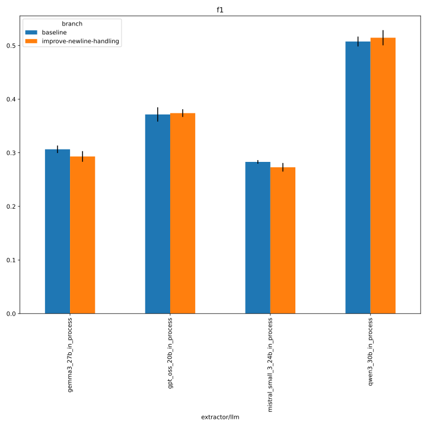
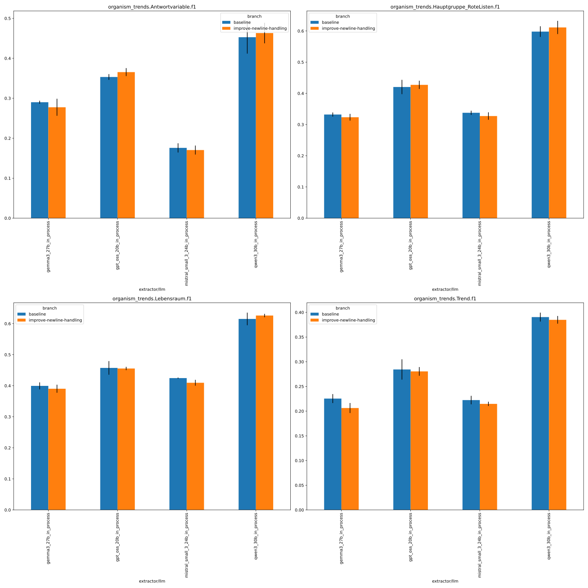
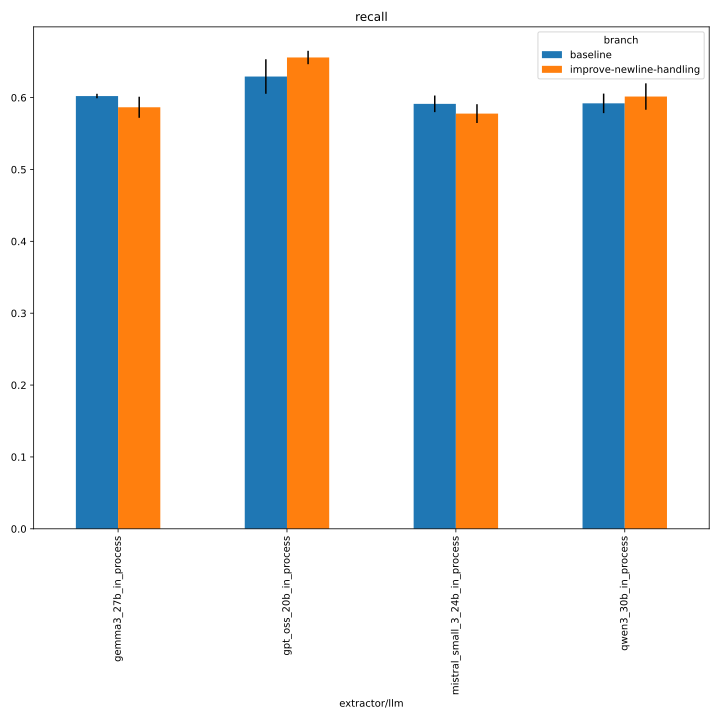
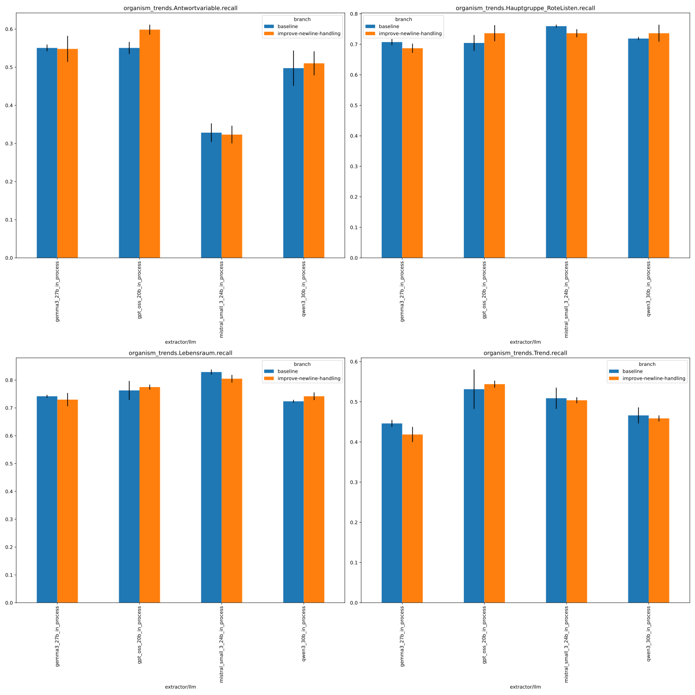
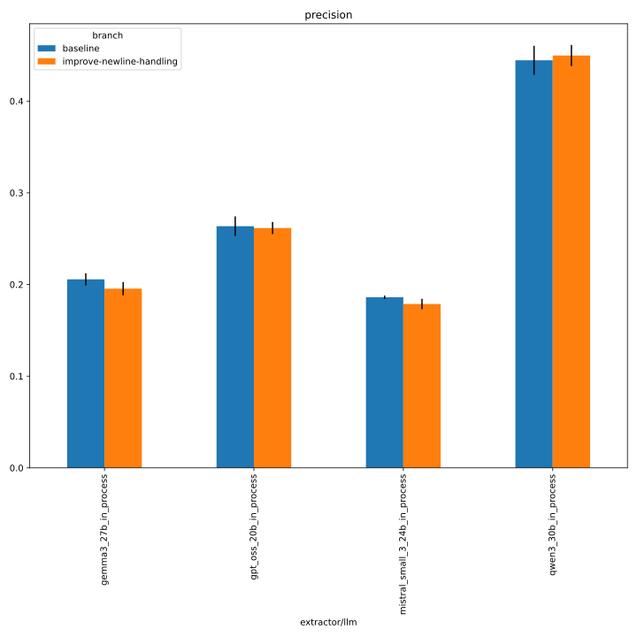
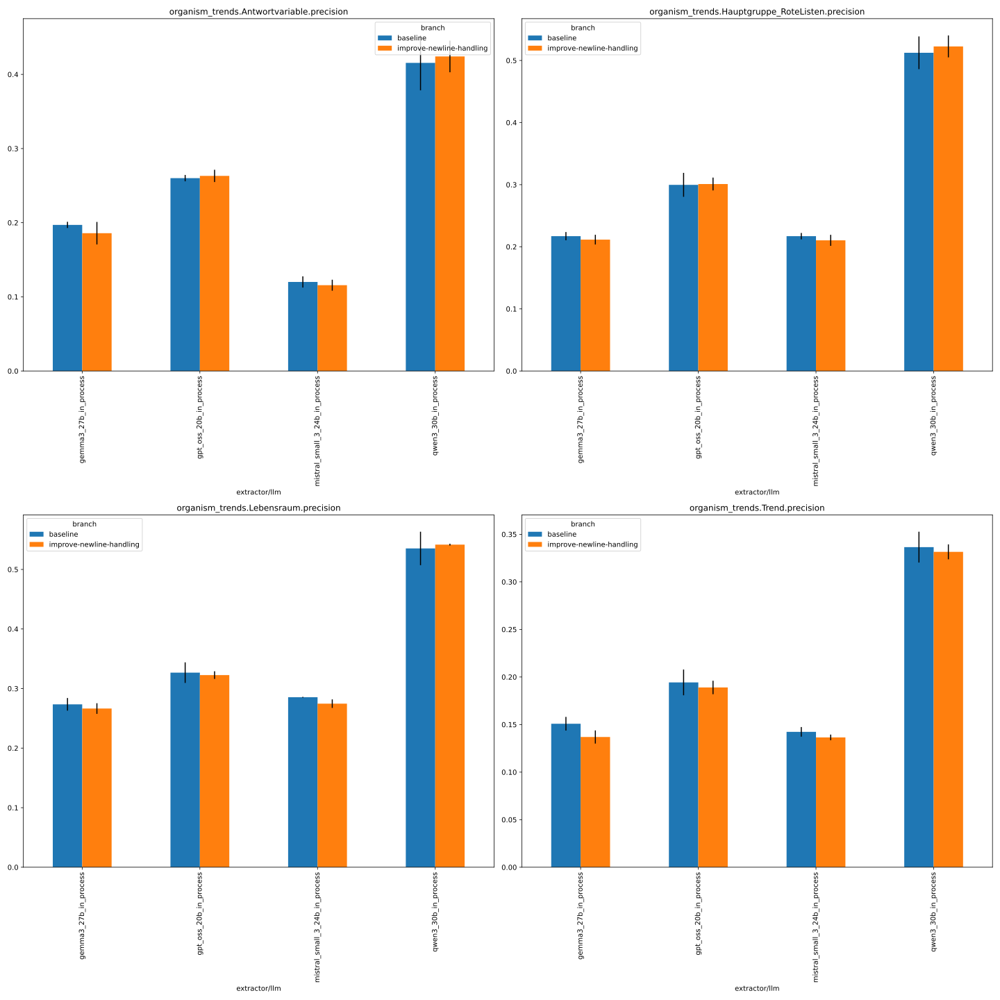
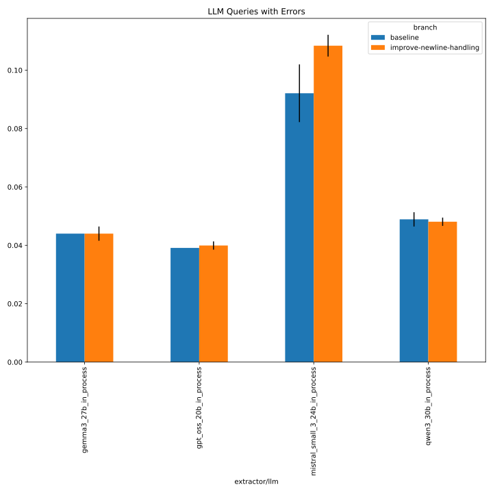
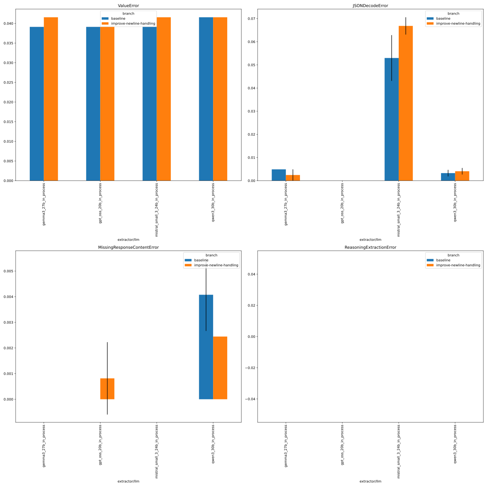

# 380_organism_trends

## comparison with baseline

```python
NAME = "380_organism_trends"

SUBDIR = ["evaluate", "../333_organism_trends_with_persona/evaluate"]

FILE_NAME_PREFIX = "baseline_"

MAP_VALUES = {
    "prediction.job_return_value.branch": {
        "organism-trends-with-persona": "baseline",
        "build_schema_description/improve-newline-handling": "improve-newline-handling",
    }
}

METRICS = ["f1", "recall", "precision"]
# used to group the data
INDEX_COLUMNS = ["prediction.overrides.extractor/llm", "prediction.job_return_value.branch"]
PLOT_KWARGS = {
    # can be either "metric" or one of the INDEX_COLUMNS (or multiple of them)
    "xgroup": ["prediction.job_return_value.branch"],
    # add any more arguments passed to pd.DataFrame.plot
    "create_subplot_for_each": "metric",
    #"set_missing_values_to_zero": True,
    "subplot_columns": 2,
}
```

### f1


<details>
<summary>see detailed metrics</summary>



</details>

### recall


<details>
<summary>see detailed metrics</summary>



</details>

### precision


<details>
<summary>see detailed metrics</summary>



</details>

### errors


<details>
<summary>see detailed metrics</summary>



</details>
