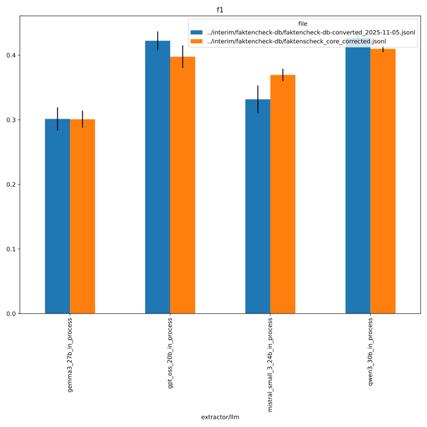
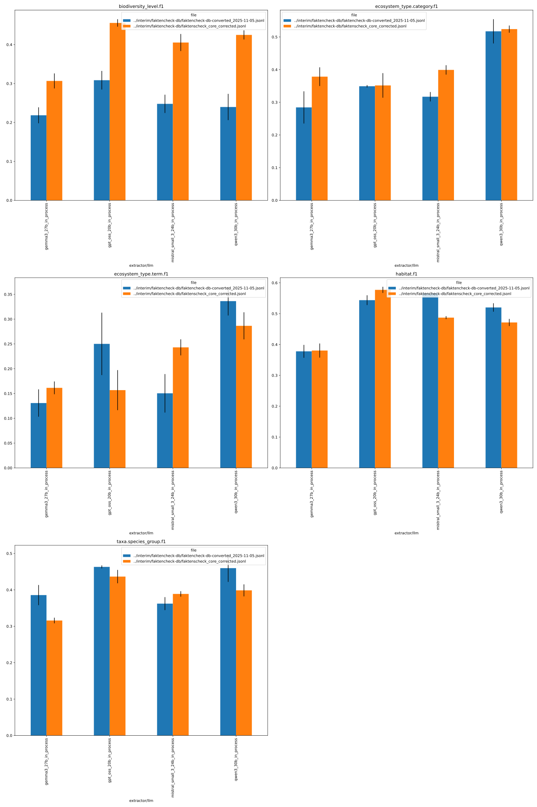
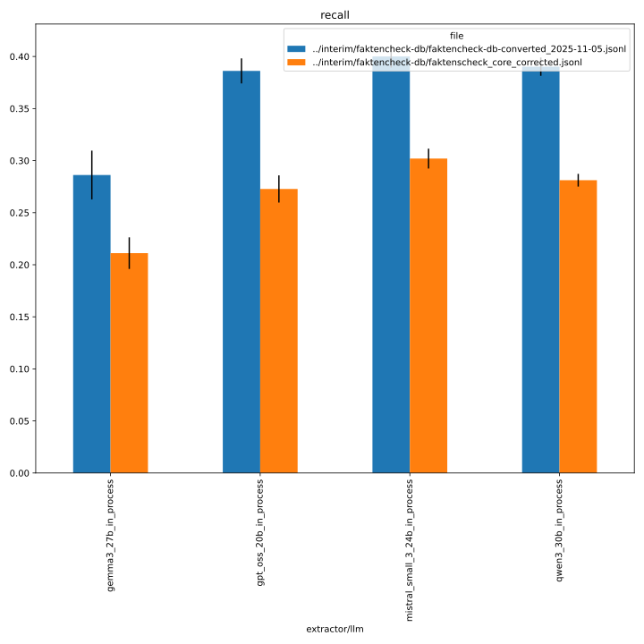
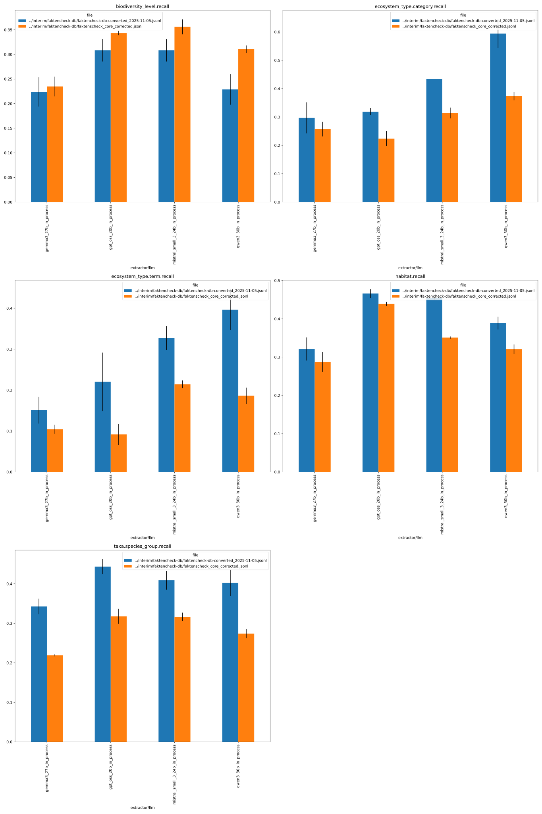
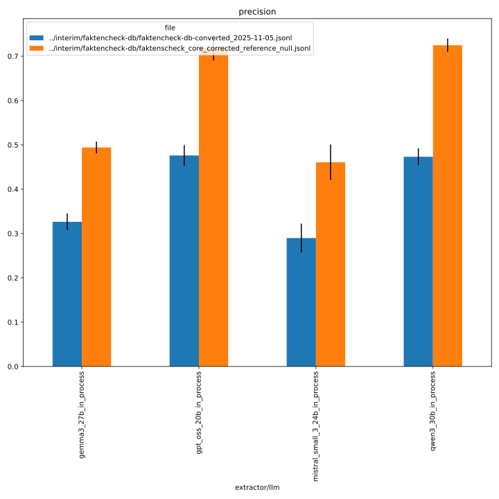
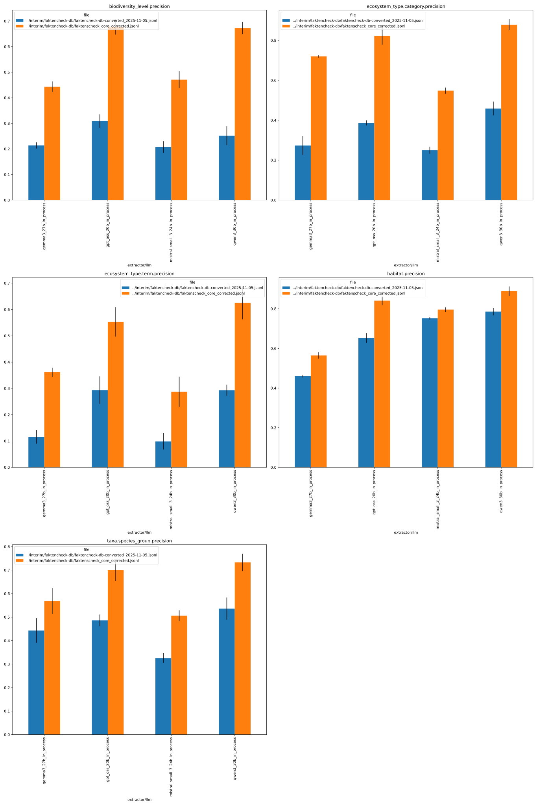

# 387_faktencheck_core

comparison vs. corrected reference data

- This uses the predictions from [380_faktencheck_core](../380_faktencheck_core) and compares them to the original reference data ([faktencheck-db-converted_2025-11-05.jsonl](../../../interim/faktencheck-db/faktencheck-db-converted_2025-11-05.jsonl)) as well as the corrected reference data ([faktenscheck_core_corrected.jsonl](../../../interim/faktencheck-db/faktenscheck_core_corrected.jsonl)).
- We evaluate only the fields that were corrected in the reference data, i.e., `habitat`, `biodiversity_level`, `ecosystem_type.term`, `ecosystem_type.category`, and `taxa.species_group` (*not* `taxa.german_name`, `taxa.scientific_name` from the Faktencheck core schema).

## F1 micro flat

eval command:
```
uv run -m kibad_llm.evaluate \
name=387_faktencheck_core  \
experiment/evaluate=faktencheck_core_f1_micro_flat \
dataset.references.file=../interim/faktencheck-db/faktencheck-db-converted_2025-11-05.jsonl,../interim/faktencheck-db/faktenscheck_core_corrected.jsonl \
metric.fields=[habitat,biodiversity_level,ecosystem_type.term,ecosystem_type.category,taxa.species_group] \
prediction_logs=logs/380_faktencheck_core/predict \
+hydra.callbacks.save_job_return.multirun_markdown_group_by=[prediction.overrides.extractor/llm,overrides.dataset.references.file] \
--multirun
```

```
[2026-03-26 13:35:31,132][HYDRA] Saving job_return in /home/arbi01/projects/kibad-llm/logs/387_faktencheck_core/evaluate/multiruns/2026-03-26_13-35-21/job_return_value.json
```

notebook parameters:
```python
NAME = "387_faktencheck_core"

SUBDIR = ["evaluate/multiruns/2026-03-26_13-35-21"]

FILE_NAME_PREFIX = "baseline_"

METRICS = ["f1", "recall", "precision"]
# used to group the data
INDEX_COLUMNS = ["prediction.overrides.extractor/llm", "overrides.dataset.references.file"]
PLOT_KWARGS = {
    # can be either "metric" or one of the INDEX_COLUMNS (or multiple of them)
    "xgroup": ["overrides.dataset.references.file"],
    # add any more arguments passed to pd.DataFrame.plot
    "create_subplot_for_each": "metric",
    #"set_missing_values_to_zero": True,
    "subplot_columns": 2,
}
```


### f1


<details>
<summary>see detailed metrics</summary>



</details>

### recall


<details>
<summary>see detailed metrics</summary>



</details>

### precision


<details>
<summary>see detailed metrics</summary>



</details>

## Confusion matrices

### biodiversity_level
eval command:
```
uv run -m kibad_llm.evaluate \
name=387_faktencheck_core \
experiment/evaluate=faktencheck_confusion_matrix \
dataset.references.file=../interim/faktencheck-db/faktenscheck_core_corrected.jsonl \
metric.field=biodiversity_level \
prediction_logs=logs/380_faktencheck_core/predict \
+hydra.callbacks.save_job_return.multirun_markdown_group_by=[prediction.overrides.extractor/llm] \
--multirun
```
```
[2026-03-26 13:27:56,914][HYDRA] Saving job_return in /home/arbi01/projects/kibad-llm/logs/387_faktencheck_core/evaluate/multiruns/2026-03-26_13-27-53/job_return_value.json
```

### habitat
eval command:
```
uv run -m kibad_llm.evaluate \
name=387_faktencheck_core \
experiment/evaluate=faktencheck_confusion_matrix \
dataset.references.file=../interim/faktencheck-db/faktenscheck_core_corrected.jsonl \
metric.field=habitat \
prediction_logs=logs/380_faktencheck_core/predict \
+hydra.callbacks.save_job_return.multirun_markdown_group_by=[prediction.overrides.extractor/llm] \
--multirun
```
```
[2026-03-26 13:28:19,981][HYDRA] Saving job_return in /home/arbi01/projects/kibad-llm/logs/387_faktencheck_core/evaluate/multiruns/2026-03-26_13-28-16/job_return_value.json
```

### ecosystem_type.term
eval command:
```
uv run -m kibad_llm.evaluate \
name=387_faktencheck_core \
experiment/evaluate=faktencheck_confusion_matrix \
dataset.references.file=../interim/faktencheck-db/faktenscheck_core_corrected.jsonl \
+metric.flatten_dicts=true \
metric.field=ecosystem_type.term \
prediction_logs=logs/380_faktencheck_core/predict \
+hydra.callbacks.save_job_return.multirun_markdown_group_by=[prediction.overrides.extractor/llm] \
--multirun
```
```
[2026-03-26 13:29:44,108][HYDRA] Saving job_return in /home/arbi01/projects/kibad-llm/logs/387_faktencheck_core/evaluate/multiruns/2026-03-26_13-29-40/job_return_value.json
```

### ecosystem_type.category
eval command:
```
uv run -m kibad_llm.evaluate \
name=387_faktencheck_core \
experiment/evaluate=faktencheck_confusion_matrix \
dataset.references.file=../interim/faktencheck-db/faktenscheck_core_corrected.jsonl \
+metric.flatten_dicts=true \
metric.field=ecosystem_type.category \
prediction_logs=logs/380_faktencheck_core/predict \
+hydra.callbacks.save_job_return.multirun_markdown_group_by=[prediction.overrides.extractor/llm] \
--multirun
```
```
[2026-03-26 13:30:15,732][HYDRA] Saving job_return in /home/arbi01/projects/kibad-llm/logs/387_faktencheck_core/evaluate/multiruns/2026-03-26_13-30-12/job_return_value.json
```

### taxa.species_group
eval command:
```
uv run -m kibad_llm.evaluate \
name=387_faktencheck_core \
experiment/evaluate=faktencheck_confusion_matrix \
dataset.references.file=../interim/faktencheck-db/faktenscheck_core_corrected.jsonl \
+metric.flatten_dicts=true \
metric.field=taxa.species_group \
prediction_logs=logs/380_faktencheck_core/predict \
+hydra.callbacks.save_job_return.multirun_markdown_group_by=[prediction.overrides.extractor/llm] \
--multirun
```
```
[2026-03-26 13:30:40,630][HYDRA] Saving job_return in /home/arbi01/projects/kibad-llm/logs/387_faktencheck_core/evaluate/multiruns/2026-03-26_13-30-36/job_return_value.json
```