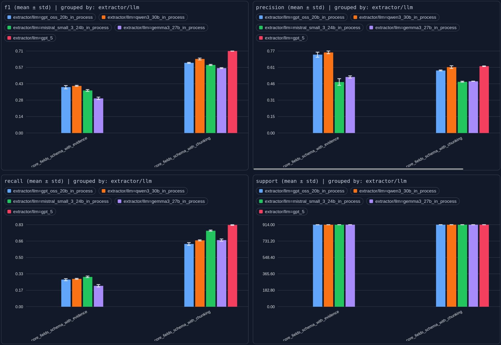
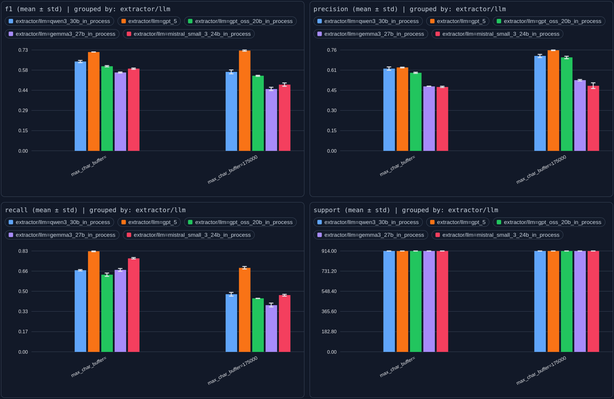
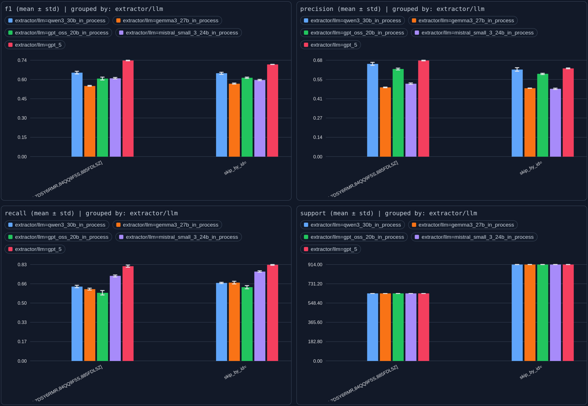
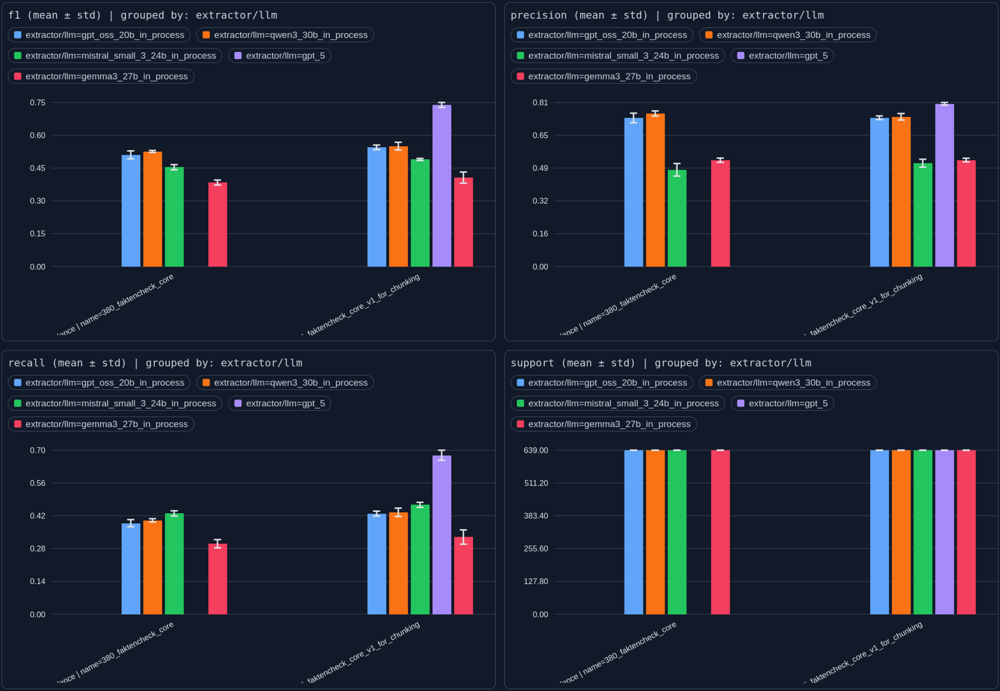
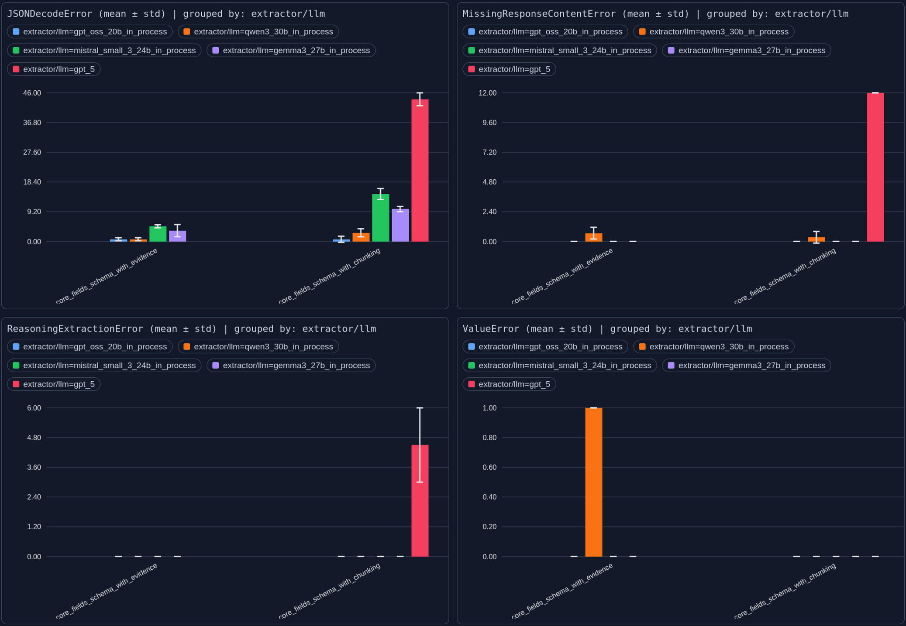

# 397_faktencheck_core_v1_for_chunking

The inference commands are based on #277.

All runs use [this commit](https://github.com/DFKI-NLP/kibad-llm/pull/397/changes/81d3de5422270e9a0394c3560def173b4373b2f2).

## Table of contents
- [397\_faktencheck\_core\_v1\_for\_chunking](#397_faktencheck_core_v1_for_chunking)
  - [Table of contents](#table-of-contents)
  - [Analysis](#analysis)
    - [f1 large chunks vs small chunks on all documents](#f1-large-chunks-vs-small-chunks-on-all-documents)
    - [f1 large chunks on short documents - chunking extractor vs baseline](#f1-large-chunks-on-short-documents---chunking-extractor-vs-baseline)
    - [f1 small chunks on short documents - chunking extractor vs baseline](#f1-small-chunks-on-short-documents---chunking-extractor-vs-baseline)
    - [Errors](#errors)
    - [Conclusion](#conclusion)
  - [Inference with small chunks](#inference-with-small-chunks)
    - [gpt\_oss\_20b](#gpt_oss_20b)
    - [gemma3\_27b](#gemma3_27b)
    - [qwen3\_30b](#qwen3_30b)
    - [mistral\_small\_3\_24b](#mistral_small_3_24b)
    - [gpt\_5](#gpt_5)
  - [Inference with large chunks](#inference-with-large-chunks)
    - [gpt\_oss\_20b](#gpt_oss_20b-1)
    - [gemma3\_27b](#gemma3_27b-1)
    - [qwen3\_30b](#qwen3_30b-1)
    - [mistral\_small\_3\_24b](#mistral_small_3_24b-1)
    - [gpt\_5](#gpt_5-1)
  - [Evaluation on 397 and baseline 380](#evaluation-on-397-and-baseline-380)
    - [f1 - on all documents](#f1---on-all-documents)
    - [f1 - on previously working documents](#f1---on-previously-working-documents)
    - [errors - on all documents](#errors---on-all-documents)
    - [errors - on previously working documents](#errors---on-previously-working-documents)

## Analysis

### Comparison to baseline
The following graphs compare the old baseline, meaning the previous best extractor (left), to the new chunking extractor without stride (right).



Despite slightly worse precision, we observe such a stark improvement in recall that the final f1 moves from 0.41 to 0.64 for the oss models, and to 0.71 for the proprietary gpt-5.

This is a considerable improvement in performance.

### Details
#### Effect of smaller input sizes
Comparing the chunking extractor on all docs, small chunks vs large.



These graphs paint a similar picture to the comparison of the old baseline to the new chunking extractor. 

Small chunks lead to a noticeable increase in performance as measured by the f1, due to a small dip in precision being balanced by a large increase in recall. At least that is the case for the oss models. GPT-5 however performs slightly better on the large documents as its recall doesn't drop as much on large contexts.

#### Effect of processing all documents
Comparing the chunking extractor using small chunks, on only short docs (left) vs all docs (right).



The similarity between the performance over all docs vs only the short docs, shows that the chunking extractor can handle documents mostly independently of their length.

#### Sanity check
Comparing the chunking extractor with large chunks vs old extractor, both on short docs only is a very apples to apples comparison. Basically, both extractors should work with almost exactly the same chunks in this setup. The results should therefore be very similar too.



Since there is no large regression or improvement here, we can conclude that it is just the size of the chunks and no other factor that leads to an improvement of the chunking extractor over the old baseline.

#### Errors
Comparing the number of errors made on the short docs shows the effect of the number of requests on the number of errors.



GPT-5, being the model with the highest f1, returns a _significantly larger_ amount of errors.

gpt_oss and qwen3, being the oss models with the highest f1, perform not much worse on the larger number of chunks than on the smaller.

mistral\_small\_3 and gemma3 are not the best performing models when it comes to the f1 and show a considerable increase in errors on the larger number of chunks, though not nearly as bad as GPT-5.

### Conclusion
- The new chunking extractor (without stride) is better than the old baseline.
- GPT-5 is the best performing model, with significant drawbacks. It is very slow, processing about 200 documents in three entire days, though that could be fixed with a concurrent approach. It also is very expensive at 0.50$ to 1.0$ per document. Additionally it makes very many mistakes, further driving up the cost.
- qwen3, the best oss model, is not as performant as GPT-5 at an f1 of 0.64 vs 0.71. However it can be self-hosted, does not require an api key to either huggingface or openai, is faster, less error prone, and independent of openai.

## Inference with small chunks
This approach breaks down large texts into smaller chunks to prevent context window degradation, as models perform worst in the middle of long context. (Known as the "lost in the middle" problem)

### gpt_oss_20b
```sh
./run_in_process.sh -t "2-00:00:00" -pa "H100-SLT,H100-Trails,H100,H200,B200,A100-80GB" -sr \
-r 81d3de5422270e9a0394c3560def173b4373b2f2 \
-u "-m kibad_llm.predict \
name=397_faktencheck_core_v1_for_chunking \
experiment/predict=faktencheck_core_fields_schema_with_chunking \
pdf_directory=/ds/text/kiba-d/dev-set-100 \
extractor/llm=gpt_oss_20b_in_process \
seed=42,1337,7331 \
--multirun"
```
 
```
=============================================
>>> USING PARTITION H100-SLT,H100-Trails,H100,H200,B200,A100-80GB
>>> MAX TIME 2-00:00:00
>>> SUBMITTED Wed Apr  8 04:33:22 PM CEST 2026
>>> UV_ARGS --cache-dir /netscratch/hmeinhof/cache/uv -m kibad_llm.predict name=397_faktencheck_core_v1_for_chunking experiment/predict=faktencheck_core_fields_schema_with_chunking pdf_directory=/ds/text/kiba-d/dev-set-100 extractor/llm=gpt_oss_20b_in_process seed=42,1337,7331 --multirun
>>> JOB_NAME kiba-d_c5a2bb47-5644-4b48-94b0-ee7968bab1a8
>>> GIT_REF 81d3de5422270e9a0394c3560def173b4373b2f2
=============================================
```

Saved to `logs/397_faktencheck_core_v1_for_chunking/predict/multiruns/2026-04-08_19-06-32`

### gemma3_27b
**IMPORTANT: Running this requires a huggingface token**
```sh
./run_in_process.sh -t "2-00:00:00" -pa "H100-SLT,H100-Trails,H100,H200,B200,A100-80GB" -sr \
-r 81d3de5422270e9a0394c3560def173b4373b2f2 \
-u "-m kibad_llm.predict \
name=397_faktencheck_core_v1_for_chunking \
experiment/predict=faktencheck_core_fields_schema_with_chunking \
pdf_directory=/ds/text/kiba-d/dev-set-100 \
extractor/llm=gemma3_27b_in_process \
seed=42,1337,7331 \
--multirun"
```
 
```
=============================================
>>> USING PARTITION H100-SLT,H100-Trails,H100,H200,B200,A100-80GB
>>> MAX TIME 2-00:00:00
>>> SUBMITTED Wed Apr  8 04:33:13 PM CEST 2026
>>> UV_ARGS --cache-dir /netscratch/hmeinhof/cache/uv -m kibad_llm.predict name=397_faktencheck_core_v1_for_chunking experiment/predict=faktencheck_core_fields_schema_with_chunking pdf_directory=/ds/text/kiba-d/dev-set-100 extractor/llm=gemma3_27b_in_process seed=42,1337,7331 --multirun
>>> JOB_NAME kiba-d_c322e037-9461-422b-b59b-b0de96caee7d
>>> GIT_REF 81d3de5422270e9a0394c3560def173b4373b2f2
=============================================
```

Saved to `logs/397_faktencheck_core_v1_for_chunking/predict/multiruns/2026-04-08_19-02-33`

### qwen3_30b
```sh
./run_in_process.sh -t "2-00:00:00" -pa "H100-SLT,H100-Trails,H100,H200,B200,A100-80GB" -sr \
-r 81d3de5422270e9a0394c3560def173b4373b2f2 \
-u "-m kibad_llm.predict \
name=397_faktencheck_core_v1_for_chunking \
experiment/predict=faktencheck_core_fields_schema_with_chunking \
pdf_directory=/ds/text/kiba-d/dev-set-100 \
extractor/llm=qwen3_30b_in_process \
seed=42,1337,7331 \
--multirun"
```
 
```
=============================================
>>> USING PARTITION H100-SLT,H100-Trails,H100,H200,B200,A100-80GB
>>> MAX TIME 2-00:00:00
>>> SUBMITTED Thu Apr  2 03:47:41 PM CEST 2026
>>> UV_ARGS --cache-dir /netscratch/hmeinhof/cache/uv -m kibad_llm.predict name=397_faktencheck_core_v1_for_chunking experiment/predict=faktencheck_core_fields_schema_with_chunking pdf_directory=/ds/text/kiba-d/dev-set-100 extractor/llm=qwen3_30b_in_process seed=42,1337,7331 --multirun
>>> JOB_NAME kiba-d_d4a27f3a-153c-48da-9ccb-ac9aeed76b0a
>>> GIT_REF 81d3de5422270e9a0394c3560def173b4373b2f2
=============================================
```

Saved to `logs/397_faktencheck_core_v1_for_chunking/predict/multiruns/2026-04-02_15-50-22`

### mistral_small_3_24b
```
./run_in_process.sh -t "3-00:00:00" -pa "H100-SLT,H100-Trails,H100,H200,B200" -r 81d3de5422270e9a0394c3560def173b4373b2f2 -u "-m kibad_llm.predict \
name=397_faktencheck_core_v1_for_chunking \
experiment/predict=faktencheck_core_fields_schema_with_chunking \
pdf_directory=/ds/text/kiba-d/dev-set-100 \
extractor/llm=mistral_small_3_24b_in_process \
seed=42,1337,7331 \
--multirun"
```

```
=============================================
>>> USING PARTITION H100-SLT,H100-Trails,H100,H200,B200
>>> MAX TIME 3-00:00:00
>>> SUBMITTED Wed Apr  8 12:54:13 PM CEST 2026
>>> UV_ARGS --cache-dir /netscratch/hmeinhof/cache/uv -m kibad_llm.predict name=397_faktencheck_core_v1_for_chunking experiment/predict=faktencheck_core_fields_schema_with_chunking pdf_directory=/ds/text/kiba-d/dev-set-100 extractor/llm=mistral_small_3_24b_in_process seed=42,1337,7331 --multirun
>>> JOB_NAME kiba-d_441a373b-2848-4913-9bbd-c518e5486260
>>> GIT_REF 81d3de5422270e9a0394c3560def173b4373b2f2
=============================================
```

Saved to `logs/397_faktencheck_core_v1_for_chunking/predict/multiruns/2026-04-08_20-34-00`

### gpt_5
**IMPORTANT: Running this requires an openai token**  
This run does not need a gpu and is hence run with `-ng 0`.
```sh
./run_in_process.sh -t "3-00:00:00" -ng 0 -pa "H100-SLT,H100-Trails,H100,H200,B200,A100-80GB,batch" -sr \
-r 81d3de5422270e9a0394c3560def173b4373b2f2 \
-u "-m kibad_llm.predict \
name=397_faktencheck_core_v1_for_chunking \
experiment/predict=faktencheck_core_fields_schema_with_chunking \
pdf_directory=/ds/text/kiba-d/dev-set-100 \
extractor/llm=gpt_5 \
seed=42,1337,7331 \
--multirun"
```

```
=============================================
>>> USING PARTITION H100-SLT,H100-Trails,H100,H200,B200,A100-80GB,batch
>>> MAX TIME 3-00:00:00
>>> SUBMITTED Thu Apr  2 04:39:58 PM CEST 2026
>>> UV_ARGS --cache-dir /netscratch/hmeinhof/cache/uv -m kibad_llm.predict name=397_faktencheck_core_v1_for_chunking experiment/predict=faktencheck_core_fields_schema_with_chunking pdf_directory=/ds/text/kiba-d/dev-set-100 extractor/llm=gpt_5 seed=42,1337,7331 --multirun
>>> JOB_NAME kiba-d_eef94652-f99e-4609-b938-9829381dbee6
>>> GIT_REF 81d3de5422270e9a0394c3560def173b4373b2f2
=============================================
```

Saved to `logs/397_faktencheck_core_v1_for_chunking/predict/multiruns/2026-04-02_16-41-44`

This run took too long and was terminated prematurely. Only the first two seeds have been evaluated. Due to the exorbitant money and time consumption, this will not be reevaluated and instead used as is.


## Inference with large chunks
This evaluation aims to create similar conditions to the other extractors for better comparability.

### gpt_oss_20b
```sh
./run_in_process.sh -t "2-00:00:00" -pa "H100-SLT,H100-Trails,H100,H200,B200,A100-80GB" -sr \
-r 81d3de5422270e9a0394c3560def173b4373b2f2 \
-u "-m kibad_llm.predict \
name=397_faktencheck_core_v1_for_chunking \
experiment/predict=faktencheck_core_fields_schema_with_chunking \
pdf_directory=/ds/text/kiba-d/dev-set-100 \
extractor/llm=gpt_oss_20b_in_process \
seed=42,1337,7331 \
extractor.max_char_buffer=175000 \
--multirun"
```
 
```
=============================================
>>> USING PARTITION H100-SLT,H100-Trails,H100,H200,B200,A100-80GB
>>> MAX TIME 2-00:00:00
>>> SUBMITTED Thu Apr  2 04:47:16 PM CEST 2026
>>> UV_ARGS --cache-dir /netscratch/hmeinhof/cache/uv -m kibad_llm.predict name=397_faktencheck_core_v1_for_chunking experiment/predict=faktencheck_core_fields_schema_with_chunking pdf_directory=/ds/text/kiba-d/dev-set-100 extractor/llm=gpt_oss_20b_in_process seed=42,1337,7331 extractor.max_char_buffer=175000 --multirun
>>> JOB_NAME kiba-d_6c63c275-2b36-4b2f-bc4f-5a5ce7ff82f4
>>> GIT_REF 81d3de5422270e9a0394c3560def173b4373b2f2
=============================================
```

Saved to `logs/397_faktencheck_core_v1_for_chunking/predict/multiruns/2026-04-02_16-54-02`

### gemma3_27b
**IMPORTANT: Running this requires a huggingface token**
```sh
./run_in_process.sh -t "2-00:00:00" -pa "H100-SLT,H100-Trails,H100,H200,B200,A100-80GB" -sr \
-r 81d3de5422270e9a0394c3560def173b4373b2f2 \
-u "-m kibad_llm.predict \
name=397_faktencheck_core_v1_for_chunking \
experiment/predict=faktencheck_core_fields_schema_with_chunking \
pdf_directory=/ds/text/kiba-d/dev-set-100 \
extractor/llm=gemma3_27b_in_process \
seed=42,1337,7331 \
extractor.max_char_buffer=175000 \
--multirun"
```
 
```
=============================================
>>> USING PARTITION H100-SLT,H100-Trails,H100,H200,B200,A100-80GB
>>> MAX TIME 2-00:00:00
>>> SUBMITTED Thu Apr  2 04:47:56 PM CEST 2026
>>> UV_ARGS --cache-dir /netscratch/hmeinhof/cache/uv -m kibad_llm.predict name=397_faktencheck_core_v1_for_chunking experiment/predict=faktencheck_core_fields_schema_with_chunking pdf_directory=/ds/text/kiba-d/dev-set-100 extractor/llm=gemma3_27b_in_process seed=42,1337,7331 extractor.max_char_buffer=175000 --multirun
>>> JOB_NAME kiba-d_f01b5887-bcf0-4475-bbab-b1542a1e39c0
>>> GIT_REF 81d3de5422270e9a0394c3560def173b4373b2f2
=============================================
```

Saved to `logs/397_faktencheck_core_v1_for_chunking/predict/multiruns/2026-04-02_16-54-15`

### qwen3_30b
```sh
./run_in_process.sh -t "2-00:00:00" -pa "H100-SLT,H100-Trails,H100,H200,B200,A100-80GB" -sr \
-r 81d3de5422270e9a0394c3560def173b4373b2f2 \
-u "-m kibad_llm.predict \
name=397_faktencheck_core_v1_for_chunking \
experiment/predict=faktencheck_core_fields_schema_with_chunking \
pdf_directory=/ds/text/kiba-d/dev-set-100 \
extractor/llm=qwen3_30b_in_process \
seed=42,1337,7331 \
extractor.max_char_buffer=175000 \
--multirun"
```
 
```
=============================================
>>> USING PARTITION H100-SLT,H100-Trails,H100,H200,B200,A100-80GB
>>> MAX TIME 2-00:00:00
>>> SUBMITTED Thu Apr  2 04:48:20 PM CEST 2026
>>> UV_ARGS --cache-dir /netscratch/hmeinhof/cache/uv -m kibad_llm.predict name=397_faktencheck_core_v1_for_chunking experiment/predict=faktencheck_core_fields_schema_with_chunking pdf_directory=/ds/text/kiba-d/dev-set-100 extractor/llm=qwen3_30b_in_process seed=42,1337,7331 extractor.max_char_buffer=175000 --multirun
>>> JOB_NAME kiba-d_57defed2-37c5-4b53-ba43-232dd518697f
>>> GIT_REF 81d3de5422270e9a0394c3560def173b4373b2f2
=============================================
```

Saved to `logs/397_faktencheck_core_v1_for_chunking/predict/multiruns/2026-04-02_16-54-29`

### mistral_small_3_24b
```sh
./run_in_process.sh -t "2-00:00:00" -pa "H100-SLT,H100-Trails,H100,H200,B200,A100-80GB" -sr \
-r 81d3de5422270e9a0394c3560def173b4373b2f2 \
-u "-m kibad_llm.predict \
name=397_faktencheck_core_v1_for_chunking \
experiment/predict=faktencheck_core_fields_schema_with_chunking \
pdf_directory=/ds/text/kiba-d/dev-set-100 \
extractor/llm=mistral_small_3_24b_in_process \
seed=42,1337,7331 \
extractor.max_char_buffer=175000 \
--multirun"
```
 
```
=============================================
>>> USING PARTITION H100-SLT,H100-Trails,H100,H200,B200,A100-80GB
>>> MAX TIME 2-00:00:00
>>> SUBMITTED Thu Apr  2 04:49:02 PM CEST 2026
>>> UV_ARGS --cache-dir /netscratch/hmeinhof/cache/uv -m kibad_llm.predict name=397_faktencheck_core_v1_for_chunking experiment/predict=faktencheck_core_fields_schema_with_chunking pdf_directory=/ds/text/kiba-d/dev-set-100 extractor/llm=mistral_small_3_24b_in_process seed=42,1337,7331 extractor.max_char_buffer=175000 --multirun
>>> JOB_NAME kiba-d_f05ece31-ef79-4e3a-a7c1-d666b9b18915
>>> GIT_REF 81d3de5422270e9a0394c3560def173b4373b2f2
=============================================
```

Saved to `logs/397_faktencheck_core_v1_for_chunking/predict/multiruns/2026-04-02_16-56-31`

### gpt_5
**IMPORTANT: Running this requires an openai token**  
This run does not need a gpu and is hence run with `-ng 0`.
```sh
./run_in_process.sh -t "3-00:00:00" -ng 0 -pa "H100-SLT,H100-Trails,H100,H200,B200,A100-80GB,batch" -sr \
-r 81d3de5422270e9a0394c3560def173b4373b2f2 \
-u "-m kibad_llm.predict \
name=397_faktencheck_core_v1_for_chunking \
experiment/predict=faktencheck_core_fields_schema_with_chunking \
pdf_directory=/ds/text/kiba-d/dev-set-100 \
extractor/llm=gpt_5 \
seed=42,1337,7331 \
extractor.max_char_buffer=175000 \
--multirun"
```

```
=============================================
>>> USING PARTITION H100-SLT,H100-Trails,H100,H200,B200,A100-80GB,batch
>>> MAX TIME 3-00:00:00
>>> SUBMITTED Thu Apr  2 04:49:24 PM CEST 2026
>>> UV_ARGS --cache-dir /netscratch/hmeinhof/cache/uv -m kibad_llm.predict name=397_faktencheck_core_v1_for_chunking experiment/predict=faktencheck_core_fields_schema_with_chunking pdf_directory=/ds/text/kiba-d/dev-set-100 extractor/llm=gpt_5 seed=42,1337,7331 extractor.max_char_buffer=175000 --multirun
>>> JOB_NAME kiba-d_04fc4171-08b5-4ee5-856e-9010c1d0f45c
>>> GIT_REF 81d3de5422270e9a0394c3560def173b4373b2f2
=============================================
```

Saved to `logs/397_faktencheck_core_v1_for_chunking/predict/multiruns/2026-04-02_16-50-38`

## Evaluation on 397 and baseline 380
```
# gpt-oss: redoing small chunks
# gemma-3: redoing small chunks
# qwen-3: done
# mistral-small-3: redoing small chunks
# gpt-5: done
```

### f1 - on all documents

```
uv run -m kibad_llm.evaluate \
name=397_faktencheck_core_v1_for_chunking \
experiment/evaluate=faktencheck_core_f1_micro_flat \
hydra.callbacks.save_job_return.multirun_show_file_contents=null \
dataset.references.file=../interim/faktencheck-db/faktenscheck_core_corrected.jsonl \
metric.fields=[habitat,biodiversity_level,ecosystem_type.term,ecosystem_type.category,taxa.species_group] \
prediction_logs=[\
logs/397_faktencheck_core_v1_for_chunking/predict/,\
logs/380_faktencheck_core/predict/\
] \
--multirun
```

Saved to [2026-04-10\_16-17-05](evaluate/multiruns/)

### f1 - on previously working documents

```
uv run -m kibad_llm.evaluate \
name=397_faktencheck_core_v1_for_chunking \
experiment/evaluate=faktencheck_core_f1_micro_flat \
hydra.callbacks.save_job_return.multirun_show_file_contents=null \
dataset.references.file=../interim/faktencheck-db/faktenscheck_core_corrected.jsonl \
metric.fields=[habitat,biodiversity_level,ecosystem_type.term,ecosystem_type.category,taxa.species_group] \
prediction_logs=[\
logs/397_faktencheck_core_v1_for_chunking/predict/,\
logs/380_faktencheck_core/predict/\
] \
+dataset.predictions.skip_by_id=[2E9XWUUE,2EUNPHDZ,2P53UVJA,2RXMDX8I,3LGPK6BL,3WEEGFGW,46RX4AEN,4YXRYRJC,4Z67G9T5,5SIYLM9W,6D23L7B5,6G2THNDX,7DSY6RMR,84QQ9F5S,885FDL5Z] \
--multirun
```

Saved to [2026-04-10\_16-12-49](evaluate/multiruns/)

### errors - on all documents

```
uv run -m kibad_llm.evaluate \
name=397_faktencheck_core_v1_for_chunking \
experiment/evaluate=prediction_errors \
hydra.callbacks.save_job_return.multirun_show_file_contents=null \
prediction_logs=[\
logs/397_faktencheck_core_v1_for_chunking/predict/,\
logs/380_faktencheck_core/predict/\
] \
--multirun
```

Saved to [2026-04-10\_16-14-18](evaluate/multiruns/)

### errors - on previously working documents

```
uv run -m kibad_llm.evaluate \
name=397_faktencheck_core_v1_for_chunking \
experiment/evaluate=prediction_errors \
hydra.callbacks.save_job_return.multirun_show_file_contents=null \
prediction_logs=[\
logs/397_faktencheck_core_v1_for_chunking/predict/,\
logs/380_faktencheck_core/predict/\
] \
+dataset.predictions.skip_by_id=[2E9XWUUE,2EUNPHDZ,2P53UVJA,2RXMDX8I,3LGPK6BL,3WEEGFGW,46RX4AEN,4YXRYRJC,4Z67G9T5,5SIYLM9W,6D23L7B5,6G2THNDX,7DSY6RMR,84QQ9F5S,885FDL5Z] \
--multirun
```

Saved to [2026-04-10\_16-14-42](evaluate/multiruns/)
