# 422_organism_trends

see https://github.com/DFKI-NLP/kibad-llm/pull/422 for details

## flat


| f1 | support |
| --- | --- |
| 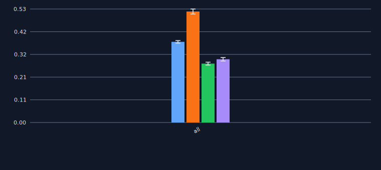 | 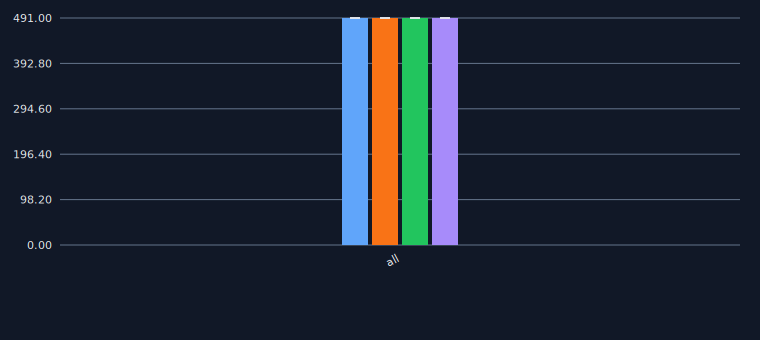 |

| precision | recall |
| --- | --- |
| 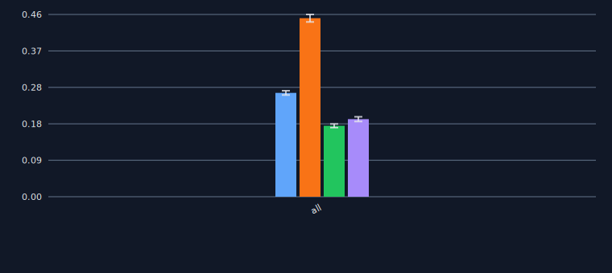 | 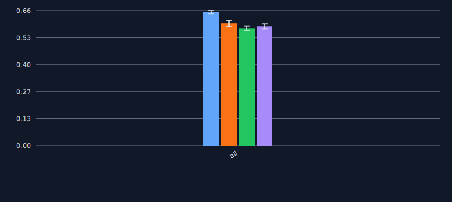 |

## full compounds
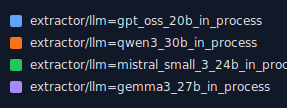

| f1 | support |
| --- | --- |
| 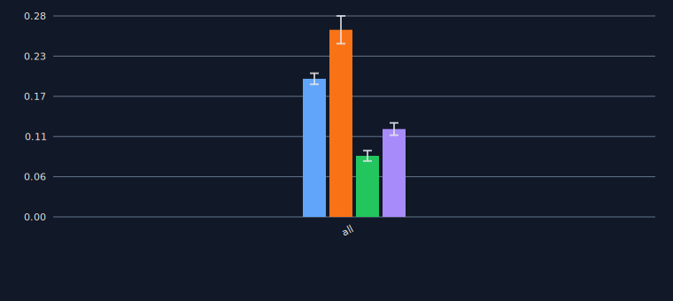 |  |

| precision | recall |
| --- | --- |
| 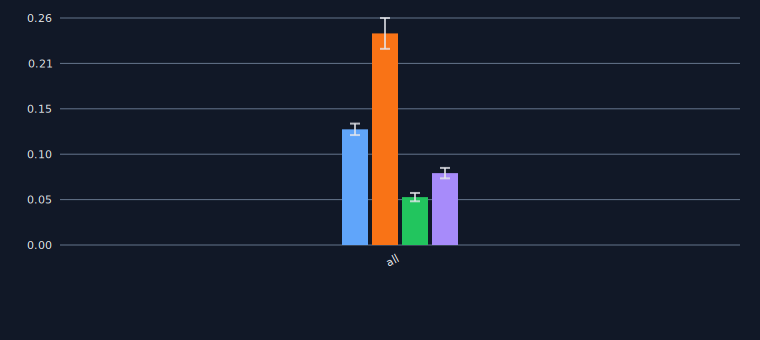 | 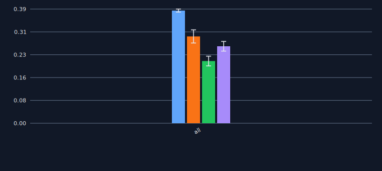 |

## base elements


| f1 | support |
| --- | --- |
| 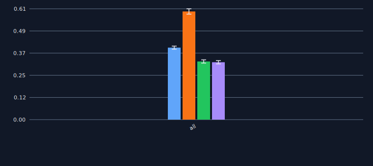 |  |

| precision | recall |
| --- | --- |
| 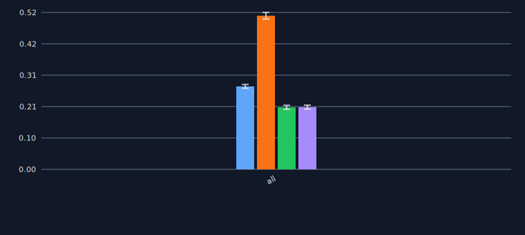 | 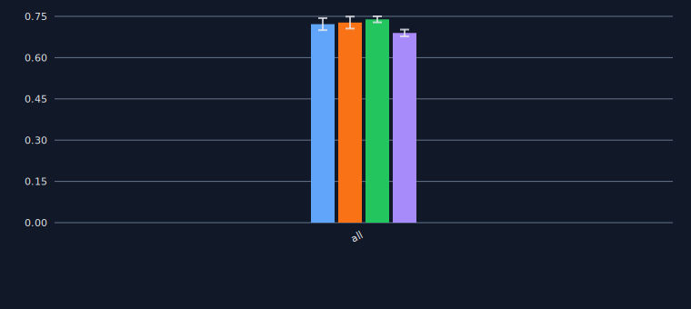 |

## conditional - variable only


| f1 | support |
| --- | --- |
| 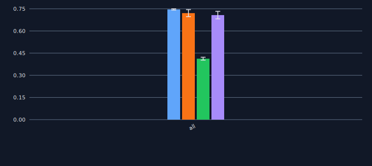 | 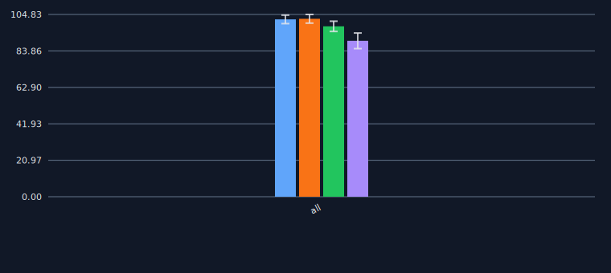 |

| precision | recall |
| --- | --- |
| 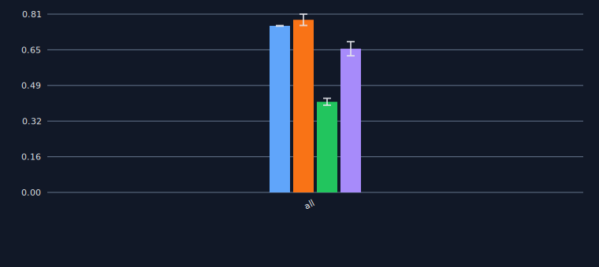 | 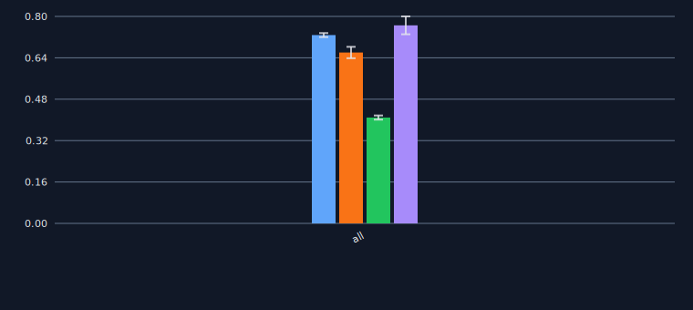 |

## conditional - variable & trend


| f1 | support |
| --- | --- |
| 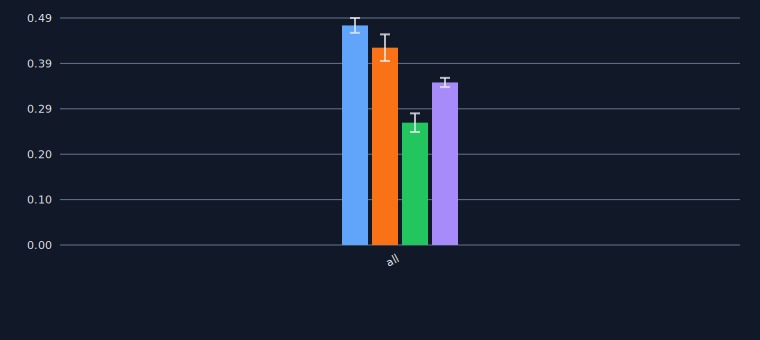 | 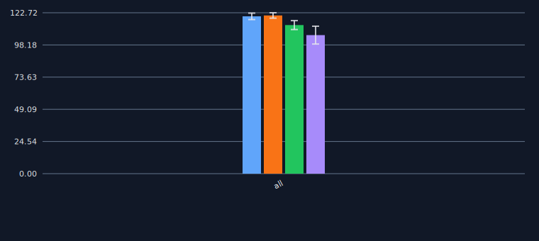 |

| precision | recall |
| --- | --- |
| 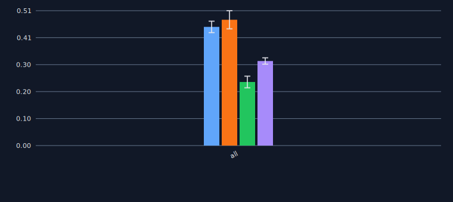 | 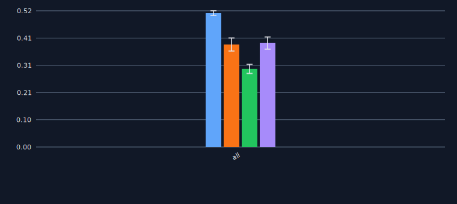 |

## details

### evaluation - flat
 - without `Untergruppe_RoteListen`
 ```
 uv run -m kibad_llm.evaluate \
name=422_organism_trends \
experiment/evaluate=organism_trends_f1_micro_flat \
prediction_logs=logs/380_organism_trends/predict \
hydra.callbacks.save_job_return.multirun_show_file_contents=null \
--multirun
```

result location: `422_organism_trends/evaluate/multiruns/2026-04-28_18-21-06`

<details>
<summary>click to see results</summary>

|                                                                                           |   ALL.f1 |   ALL.precision |   ALL.recall |   ALL.support |   AVG.f1 |   AVG.precision |   AVG.recall |   AVG.support |   organism_trends.Antwortvariable.f1 |   organism_trends.Antwortvariable.precision |   organism_trends.Antwortvariable.recall |   organism_trends.Antwortvariable.support |   organism_trends.Hauptgruppe_RoteListen.f1 |   organism_trends.Hauptgruppe_RoteListen.precision |   organism_trends.Hauptgruppe_RoteListen.recall |   organism_trends.Hauptgruppe_RoteListen.support |   organism_trends.Lebensraum.f1 |   organism_trends.Lebensraum.precision |   organism_trends.Lebensraum.recall |   organism_trends.Lebensraum.support |   organism_trends.Trend.f1 |   organism_trends.Trend.precision |   organism_trends.Trend.recall |   organism_trends.Trend.support | overrides.dataset.predictions.log                                 | overrides.experiment/evaluate   | overrides.name      | overrides.prediction_logs        | prediction.job_return_value.branch                | prediction.job_return_value.commit_hash   | prediction.job_return_value.is_dirty   | prediction.job_return_value.output_file                                                          | prediction.job_return_value.output_file_absolute                                                                                       |   prediction.job_return_value.slurm_job_id |   prediction.job_return_value.time_end |   prediction.job_return_value.time_extraction |   prediction.job_return_value.time_pdf_conversion |   prediction.job_return_value.time_start | prediction.overrides.experiment/predict   | prediction.overrides.extractor/llm   | prediction.overrides.name   | prediction.overrides.pdf_directory   |   prediction.overrides.seed |
|:------------------------------------------------------------------------------------------|---------:|----------------:|-------------:|--------------:|---------:|----------------:|-------------:|--------------:|-------------------------------------:|--------------------------------------------:|-----------------------------------------:|------------------------------------------:|--------------------------------------------:|---------------------------------------------------:|------------------------------------------------:|-------------------------------------------------:|--------------------------------:|---------------------------------------:|------------------------------------:|-------------------------------------:|---------------------------:|----------------------------------:|-------------------------------:|--------------------------------:|:------------------------------------------------------------------|:--------------------------------|:--------------------|:---------------------------------|:--------------------------------------------------|:------------------------------------------|:---------------------------------------|:-------------------------------------------------------------------------------------------------|:---------------------------------------------------------------------------------------------------------------------------------------|-------------------------------------------:|---------------------------------------:|----------------------------------------------:|--------------------------------------------------:|-----------------------------------------:|:------------------------------------------|:-------------------------------------|:----------------------------|:-------------------------------------|----------------------------:|
| dataset.predictions.log=logs/380_organism_trends/predict/multiruns/2026-02-24_22-06-17/0  | 0.367963 |        0.257305 |     0.645621 |           491 | 0.376369 |        0.264967 |     0.652754 |        122.75 |                             0.355658 |                                    0.255814 |                                 0.583333 |                                       132 |                                    0.41206  |                                           0.289753 |                                        0.713043 |                                              115 |                        0.456989 |                               0.32567  |                            0.765766 |                                  111 |                   0.280769 |                          0.18863  |                       0.548872 |                             133 | logs/380_organism_trends/predict/multiruns/2026-02-24_22-06-17/0  | organism_trends_f1_micro_flat   | 422_organism_trends | logs/380_organism_trends/predict | build_schema_description/improve-newline-handling | 67cce08ad646158085c4b7fc53c8fa2216227125  | False                                  | predictions/380_organism_trends/2026-02-24_22-06-17/2026-02-24_22-06-18_939465/predictions.jsonl | /netscratch/binder/projects/kibad-llm/predictions/380_organism_trends/2026-02-24_22-06-17/2026-02-24_22-06-18_939465/predictions.jsonl |                                    2573358 |                             1771980625 |                                       7635.29 |                                     5656.72       |                               1771967178 | organism_trends_with_evidence             | gpt_oss_20b_in_process               | 380_organism_trends         | /ds/text/kiba-d/dev-set-Wald-WVC     |                          42 |
| dataset.predictions.log=logs/380_organism_trends/predict/multiruns/2026-02-24_22-06-17/1  | 0.382022 |        0.269167 |     0.657841 |           491 | 0.389955 |        0.276326 |     0.665036 |        122.75 |                             0.375587 |                                    0.272109 |                                 0.606061 |                                       132 |                                    0.435233 |                                           0.309963 |                                        0.730435 |                                              115 |                        0.459893 |                               0.326996 |                            0.774775 |                                  111 |                   0.289109 |                          0.196237 |                       0.548872 |                             133 | logs/380_organism_trends/predict/multiruns/2026-02-24_22-06-17/1  | organism_trends_f1_micro_flat   | 422_organism_trends | logs/380_organism_trends/predict | build_schema_description/improve-newline-handling | 67cce08ad646158085c4b7fc53c8fa2216227125  | False                                  | predictions/380_organism_trends/2026-02-24_22-06-17/2026-02-25_01-50-25_638921/predictions.jsonl | /netscratch/binder/projects/kibad-llm/predictions/380_organism_trends/2026-02-24_22-06-17/2026-02-25_01-50-25_638921/predictions.jsonl |                                    2573358 |                             1771988214 |                                       7518.83 |                                        0.00314244 |                               1771980625 | organism_trends_with_evidence             | gpt_oss_20b_in_process               | 380_organism_trends         | /ds/text/kiba-d/dev-set-Wald-WVC     |                        1337 |
| dataset.predictions.log=logs/380_organism_trends/predict/multiruns/2026-02-24_22-06-17/10 | 0.268514 |        0.175406 |     0.572301 |           491 | 0.275351 |        0.180382 |     0.58693  |        122.75 |                             0.160321 |                                    0.108992 |                                 0.30303  |                                       132 |                                    0.32567  |                                           0.208845 |                                        0.73913  |                                              115 |                        0.402715 |                               0.268882 |                            0.801802 |                                  111 |                   0.212698 |                          0.134809 |                       0.503759 |                             133 | logs/380_organism_trends/predict/multiruns/2026-02-24_22-06-17/10 | organism_trends_f1_micro_flat   | 422_organism_trends | logs/380_organism_trends/predict | build_schema_description/improve-newline-handling | 67cce08ad646158085c4b7fc53c8fa2216227125  | True                                   | predictions/380_organism_trends/2026-02-24_22-06-17/2026-02-26_03-02-50_216387/predictions.jsonl | /netscratch/binder/projects/kibad-llm/predictions/380_organism_trends/2026-02-24_22-06-17/2026-02-26_03-02-50_216387/predictions.jsonl |                                    2573358 |                             1772091726 |                                      20257.9  |                                        0.00356886 |                               1772071370 | organism_trends_with_evidence             | mistral_small_3_24b_in_process       | 380_organism_trends         | /ds/text/kiba-d/dev-set-Wald-WVC     |                        1337 |
| dataset.predictions.log=logs/380_organism_trends/predict/multiruns/2026-02-24_22-06-17/11 | 0.26814  |        0.175472 |     0.568228 |           491 | 0.275484 |        0.181005 |     0.582239 |        122.75 |                             0.168337 |                                    0.114441 |                                 0.318182 |                                       132 |                                    0.31619  |                                           0.202439 |                                        0.721739 |                                              115 |                        0.40553  |                               0.272446 |                            0.792793 |                                  111 |                   0.211878 |                          0.134694 |                       0.496241 |                             133 | logs/380_organism_trends/predict/multiruns/2026-02-24_22-06-17/11 | organism_trends_f1_micro_flat   | 422_organism_trends | logs/380_organism_trends/predict | build_schema_description/improve-newline-handling | 67cce08ad646158085c4b7fc53c8fa2216227125  | True                                   | predictions/380_organism_trends/2026-02-24_22-06-17/2026-02-26_08-42-07_578243/predictions.jsonl | /netscratch/binder/projects/kibad-llm/predictions/380_organism_trends/2026-02-24_22-06-17/2026-02-26_08-42-07_578243/predictions.jsonl |                                    2573358 |                             1772111454 |                                      19640.5  |                                        0.00640966 |                               1772091727 | organism_trends_with_evidence             | mistral_small_3_24b_in_process       | 380_organism_trends         | /ds/text/kiba-d/dev-set-Wald-WVC     |                        7331 |
| dataset.predictions.log=logs/380_organism_trends/predict/multiruns/2026-02-24_22-06-17/2  | 0.371934 |        0.25832  |     0.663951 |           491 | 0.380247 |        0.265539 |     0.672224 |        122.75 |                             0.365297 |                                    0.261438 |                                 0.606061 |                                       132 |                                    0.434568 |                                           0.303448 |                                        0.765217 |                                              115 |                        0.449612 |                               0.315217 |                            0.783784 |                                  111 |                   0.271511 |                          0.182051 |                       0.533835 |                             133 | logs/380_organism_trends/predict/multiruns/2026-02-24_22-06-17/2  | organism_trends_f1_micro_flat   | 422_organism_trends | logs/380_organism_trends/predict | build_schema_description/improve-newline-handling | 67cce08ad646158085c4b7fc53c8fa2216227125  | False                                  | predictions/380_organism_trends/2026-02-24_22-06-17/2026-02-25_03-56-54_663404/predictions.jsonl | /netscratch/binder/projects/kibad-llm/predictions/380_organism_trends/2026-02-24_22-06-17/2026-02-25_03-56-54_663404/predictions.jsonl |                                    2573358 |                             1771995996 |                                       7714.41 |                                        0.00318247 |                               1771988214 | organism_trends_with_evidence             | gpt_oss_20b_in_process               | 380_organism_trends         | /ds/text/kiba-d/dev-set-Wald-WVC     |                        7331 |
| dataset.predictions.log=logs/380_organism_trends/predict/multiruns/2026-02-24_22-06-17/3  | 0.296069 |        0.197548 |     0.590631 |           491 | 0.301757 |        0.201849 |     0.599479 |        122.75 |                             0.275862 |                                    0.184615 |                                 0.545455 |                                       132 |                                    0.327869 |                                           0.214477 |                                        0.695652 |                                              115 |                        0.386473 |                               0.264026 |                            0.720721 |                                  111 |                   0.216822 |                          0.144279 |                       0.43609  |                             133 | logs/380_organism_trends/predict/multiruns/2026-02-24_22-06-17/3  | organism_trends_f1_micro_flat   | 422_organism_trends | logs/380_organism_trends/predict | build_schema_description/improve-newline-handling | 67cce08ad646158085c4b7fc53c8fa2216227125  | False                                  | predictions/380_organism_trends/2026-02-24_22-06-17/2026-02-25_06-06-36_898414/predictions.jsonl | /netscratch/binder/projects/kibad-llm/predictions/380_organism_trends/2026-02-24_22-06-17/2026-02-25_06-06-36_898414/predictions.jsonl |                                    2573358 |                             1772004325 |                                       8092.81 |                                        0.00386589 |                               1771995996 | organism_trends_with_evidence             | gemma3_27b_in_process                | 380_organism_trends         | /ds/text/kiba-d/dev-set-Wald-WVC     |                          42 |
| dataset.predictions.log=logs/380_organism_trends/predict/multiruns/2026-02-24_22-06-17/4  | 0.282116 |        0.187416 |     0.570265 |           491 | 0.288378 |        0.192214 |     0.57937  |        122.75 |                             0.257089 |                                    0.171285 |                                 0.515152 |                                       132 |                                    0.311111 |                                           0.202632 |                                        0.669565 |                                              115 |                        0.379808 |                               0.259016 |                            0.711712 |                                  111 |                   0.205505 |                          0.135922 |                       0.421053 |                             133 | logs/380_organism_trends/predict/multiruns/2026-02-24_22-06-17/4  | organism_trends_f1_micro_flat   | 422_organism_trends | logs/380_organism_trends/predict | build_schema_description/improve-newline-handling | 67cce08ad646158085c4b7fc53c8fa2216227125  | False                                  | predictions/380_organism_trends/2026-02-24_22-06-17/2026-02-25_08-25-25_533804/predictions.jsonl | /netscratch/binder/projects/kibad-llm/predictions/380_organism_trends/2026-02-24_22-06-17/2026-02-25_08-25-25_533804/predictions.jsonl |                                    2573358 |                             1772013011 |                                       8571.55 |                                        0.00424511 |                               1772004325 | organism_trends_with_evidence             | gemma3_27b_in_process                | 380_organism_trends         | /ds/text/kiba-d/dev-set-Wald-WVC     |                        1337 |
| dataset.predictions.log=logs/380_organism_trends/predict/multiruns/2026-02-24_22-06-17/5  | 0.301384 |        0.20137  |     0.598778 |           491 | 0.308088 |        0.206455 |     0.60856  |        122.75 |                             0.299611 |                                    0.201571 |                                 0.583333 |                                       132 |                                    0.331263 |                                           0.217391 |                                        0.695652 |                                              115 |                        0.404819 |                               0.276316 |                            0.756757 |                                  111 |                   0.19666  |                          0.130542 |                       0.398496 |                             133 | logs/380_organism_trends/predict/multiruns/2026-02-24_22-06-17/5  | organism_trends_f1_micro_flat   | 422_organism_trends | logs/380_organism_trends/predict | build_schema_description/improve-newline-handling | 67cce08ad646158085c4b7fc53c8fa2216227125  | False                                  | predictions/380_organism_trends/2026-02-24_22-06-17/2026-02-25_10-50-12_127897/predictions.jsonl | /netscratch/binder/projects/kibad-llm/predictions/380_organism_trends/2026-02-24_22-06-17/2026-02-25_10-50-12_127897/predictions.jsonl |                                    2573358 |                             1772020961 |                                       7839.25 |                                        0.00294831 |                               1772013012 | organism_trends_with_evidence             | gemma3_27b_in_process                | 380_organism_trends         | /ds/text/kiba-d/dev-set-Wald-WVC     |                        7331 |
| dataset.predictions.log=logs/380_organism_trends/predict/multiruns/2026-02-24_22-06-17/6  | 0.517935 |        0.453988 |     0.602851 |           491 | 0.524831 |        0.459471 |     0.613183 |        122.75 |                             0.456747 |                                    0.420382 |                                 0.5      |                                       132 |                                    0.625455 |                                           0.5375   |                                        0.747826 |                                              115 |                        0.625954 |                               0.543046 |                            0.738739 |                                  111 |                   0.391167 |                          0.336957 |                       0.466165 |                             133 | logs/380_organism_trends/predict/multiruns/2026-02-24_22-06-17/6  | organism_trends_f1_micro_flat   | 422_organism_trends | logs/380_organism_trends/predict | build_schema_description/improve-newline-handling | 67cce08ad646158085c4b7fc53c8fa2216227125  | False                                  | predictions/380_organism_trends/2026-02-24_22-06-17/2026-02-25_13-02-41_450689/predictions.jsonl | /netscratch/binder/projects/kibad-llm/predictions/380_organism_trends/2026-02-24_22-06-17/2026-02-25_13-02-41_450689/predictions.jsonl |                                    2573358 |                             1772031056 |                                       9957.84 |                                        0.00281203 |                               1772020961 | organism_trends_with_evidence             | qwen3_30b_in_process                 | 380_organism_trends         | /ds/text/kiba-d/dev-set-Wald-WVC     |                          42 |
| dataset.predictions.log=logs/380_organism_trends/predict/multiruns/2026-02-24_22-06-17/7  | 0.499127 |        0.436641 |     0.582485 |           491 | 0.5063   |        0.442687 |     0.592513 |        122.75 |                             0.441379 |                                    0.405063 |                                 0.484848 |                                       132 |                                    0.586957 |                                           0.503106 |                                        0.704348 |                                              115 |                        0.62069  |                               0.54     |                            0.72973  |                                  111 |                   0.376176 |                          0.322581 |                       0.451128 |                             133 | logs/380_organism_trends/predict/multiruns/2026-02-24_22-06-17/7  | organism_trends_f1_micro_flat   | 422_organism_trends | logs/380_organism_trends/predict | build_schema_description/improve-newline-handling | 67cce08ad646158085c4b7fc53c8fa2216227125  | False                                  | predictions/380_organism_trends/2026-02-24_22-06-17/2026-02-25_15-50-56_888883/predictions.jsonl | /netscratch/binder/projects/kibad-llm/predictions/380_organism_trends/2026-02-24_22-06-17/2026-02-25_15-50-56_888883/predictions.jsonl |                                    2573358 |                             1772041008 |                                       9854.97 |                                        0.00283212 |                               1772031056 | organism_trends_with_evidence             | qwen3_30b_in_process                 | 380_organism_trends         | /ds/text/kiba-d/dev-set-Wald-WVC     |                        1337 |
| dataset.predictions.log=logs/380_organism_trends/predict/multiruns/2026-02-24_22-06-17/8  | 0.526863 |        0.458522 |     0.619145 |           491 | 0.532944 |        0.462895 |     0.629345 |        122.75 |                             0.491468 |                                    0.447205 |                                 0.545455 |                                       132 |                                    0.621429 |                                           0.527273 |                                        0.756522 |                                              115 |                        0.631579 |                               0.541935 |                            0.756757 |                                  111 |                   0.387302 |                          0.335165 |                       0.458647 |                             133 | logs/380_organism_trends/predict/multiruns/2026-02-24_22-06-17/8  | organism_trends_f1_micro_flat   | 422_organism_trends | logs/380_organism_trends/predict | build_schema_description/improve-newline-handling | 67cce08ad646158085c4b7fc53c8fa2216227125  | True                                   | predictions/380_organism_trends/2026-02-24_22-06-17/2026-02-25_18-36-48_972111/predictions.jsonl | /netscratch/binder/projects/kibad-llm/predictions/380_organism_trends/2026-02-24_22-06-17/2026-02-25_18-36-48_972111/predictions.jsonl |                                    2573358 |                             1772050754 |                                       9663.96 |                                        0.0028848  |                               1772041008 | organism_trends_with_evidence             | qwen3_30b_in_process                 | 380_organism_trends         | /ds/text/kiba-d/dev-set-Wald-WVC     |                        7331 |
| dataset.predictions.log=logs/380_organism_trends/predict/multiruns/2026-02-24_22-06-17/9  | 0.28225  |        0.185232 |     0.592668 |           491 | 0.290623 |        0.191533 |     0.606852 |        122.75 |                             0.18254  |                                    0.123656 |                                 0.348485 |                                       132 |                                    0.339921 |                                           0.219949 |                                        0.747826 |                                              115 |                        0.420323 |                               0.282609 |                            0.81982  |                                  111 |                   0.219709 |                          0.139918 |                       0.511278 |                             133 | logs/380_organism_trends/predict/multiruns/2026-02-24_22-06-17/9  | organism_trends_f1_micro_flat   | 422_organism_trends | logs/380_organism_trends/predict | build_schema_description/improve-newline-handling | 67cce08ad646158085c4b7fc53c8fa2216227125  | True                                   | predictions/380_organism_trends/2026-02-24_22-06-17/2026-02-25_21-19-15_090512/predictions.jsonl | /netscratch/binder/projects/kibad-llm/predictions/380_organism_trends/2026-02-24_22-06-17/2026-02-25_21-19-15_090512/predictions.jsonl |                                    2573358 |                             1772071369 |                                      20419    |                                        0.00302929 |                               1772050755 | organism_trends_with_evidence             | mistral_small_3_24b_in_process       | 380_organism_trends         | /ds/text/kiba-d/dev-set-Wald-WVC     |                          42 |

</details>

### evaluation - full compounds
 - without `Untergruppe_RoteListen`
```
uv run -m kibad_llm.evaluate \
name=422_organism_trends \
experiment/evaluate=organism_trends_f1_micro \
prediction_logs=logs/380_organism_trends/predict \
hydra.callbacks.save_job_return.multirun_show_file_contents=null \
--multirun
```

result location: `422_organism_trends/evaluate/multiruns/2026-04-28_18-26-31`

<details>
<summary>click to see results</summary>

|                                                                                           |    ALL.f1 |   ALL.precision |   ALL.recall |   ALL.support |    AVG.f1 |   AVG.precision |   AVG.recall |   AVG.support |   organism_trends.f1 |   organism_trends.precision |   organism_trends.recall |   organism_trends.support | overrides.dataset.predictions.log                                 | overrides.experiment/evaluate   | overrides.name      | overrides.prediction_logs        | prediction.job_return_value.branch                | prediction.job_return_value.commit_hash   | prediction.job_return_value.is_dirty   | prediction.job_return_value.output_file                                                          | prediction.job_return_value.output_file_absolute                                                                                       |   prediction.job_return_value.slurm_job_id |   prediction.job_return_value.time_end |   prediction.job_return_value.time_extraction |   prediction.job_return_value.time_pdf_conversion |   prediction.job_return_value.time_start | prediction.overrides.experiment/predict   | prediction.overrides.extractor/llm   | prediction.overrides.name   | prediction.overrides.pdf_directory   |   prediction.overrides.seed |
|:------------------------------------------------------------------------------------------|----------:|----------------:|-------------:|--------------:|----------:|----------------:|-------------:|--------------:|---------------------:|----------------------------:|-------------------------:|--------------------------:|:------------------------------------------------------------------|:--------------------------------|:--------------------|:---------------------------------|:--------------------------------------------------|:------------------------------------------|:---------------------------------------|:-------------------------------------------------------------------------------------------------|:---------------------------------------------------------------------------------------------------------------------------------------|-------------------------------------------:|---------------------------------------:|----------------------------------------------:|--------------------------------------------------:|-----------------------------------------:|:------------------------------------------|:-------------------------------------|:----------------------------|:-------------------------------------|----------------------------:|
| dataset.predictions.log=logs/380_organism_trends/predict/multiruns/2026-02-24_22-06-17/0  | 0.188383  |       0.125523  |     0.377358 |           159 | 0.188383  |       0.125523  |     0.377358 |           159 |            0.188383  |                   0.125523  |                 0.377358 |                       159 | logs/380_organism_trends/predict/multiruns/2026-02-24_22-06-17/0  | organism_trends_f1_micro        | 422_organism_trends | logs/380_organism_trends/predict | build_schema_description/improve-newline-handling | 67cce08ad646158085c4b7fc53c8fa2216227125  | False                                  | predictions/380_organism_trends/2026-02-24_22-06-17/2026-02-24_22-06-18_939465/predictions.jsonl | /netscratch/binder/projects/kibad-llm/predictions/380_organism_trends/2026-02-24_22-06-17/2026-02-24_22-06-18_939465/predictions.jsonl |                                    2573358 |                             1771980625 |                                       7635.29 |                                     5656.72       |                               1771967178 | organism_trends_with_evidence             | gpt_oss_20b_in_process               | 380_organism_trends         | /ds/text/kiba-d/dev-set-Wald-WVC     |                          42 |
| dataset.predictions.log=logs/380_organism_trends/predict/multiruns/2026-02-24_22-06-17/1  | 0.206667  |       0.14059   |     0.389937 |           159 | 0.206667  |       0.14059   |     0.389937 |           159 |            0.206667  |                   0.14059   |                 0.389937 |                       159 | logs/380_organism_trends/predict/multiruns/2026-02-24_22-06-17/1  | organism_trends_f1_micro        | 422_organism_trends | logs/380_organism_trends/predict | build_schema_description/improve-newline-handling | 67cce08ad646158085c4b7fc53c8fa2216227125  | False                                  | predictions/380_organism_trends/2026-02-24_22-06-17/2026-02-25_01-50-25_638921/predictions.jsonl | /netscratch/binder/projects/kibad-llm/predictions/380_organism_trends/2026-02-24_22-06-17/2026-02-25_01-50-25_638921/predictions.jsonl |                                    2573358 |                             1771988214 |                                       7518.83 |                                        0.00314244 |                               1771980625 | organism_trends_with_evidence             | gpt_oss_20b_in_process               | 380_organism_trends         | /ds/text/kiba-d/dev-set-Wald-WVC     |                        1337 |
| dataset.predictions.log=logs/380_organism_trends/predict/multiruns/2026-02-24_22-06-17/10 | 0.0765306 |       0.048     |     0.188679 |           159 | 0.0765306 |       0.048     |     0.188679 |           159 |            0.0765306 |                   0.048     |                 0.188679 |                       159 | logs/380_organism_trends/predict/multiruns/2026-02-24_22-06-17/10 | organism_trends_f1_micro        | 422_organism_trends | logs/380_organism_trends/predict | build_schema_description/improve-newline-handling | 67cce08ad646158085c4b7fc53c8fa2216227125  | True                                   | predictions/380_organism_trends/2026-02-24_22-06-17/2026-02-26_03-02-50_216387/predictions.jsonl | /netscratch/binder/projects/kibad-llm/predictions/380_organism_trends/2026-02-24_22-06-17/2026-02-26_03-02-50_216387/predictions.jsonl |                                    2573358 |                             1772091726 |                                      20257.9  |                                        0.00356886 |                               1772071370 | organism_trends_with_evidence             | mistral_small_3_24b_in_process       | 380_organism_trends         | /ds/text/kiba-d/dev-set-Wald-WVC     |                        1337 |
| dataset.predictions.log=logs/380_organism_trends/predict/multiruns/2026-02-24_22-06-17/11 | 0.0892857 |       0.056     |     0.220126 |           159 | 0.0892857 |       0.056     |     0.220126 |           159 |            0.0892857 |                   0.056     |                 0.220126 |                       159 | logs/380_organism_trends/predict/multiruns/2026-02-24_22-06-17/11 | organism_trends_f1_micro        | 422_organism_trends | logs/380_organism_trends/predict | build_schema_description/improve-newline-handling | 67cce08ad646158085c4b7fc53c8fa2216227125  | True                                   | predictions/380_organism_trends/2026-02-24_22-06-17/2026-02-26_08-42-07_578243/predictions.jsonl | /netscratch/binder/projects/kibad-llm/predictions/380_organism_trends/2026-02-24_22-06-17/2026-02-26_08-42-07_578243/predictions.jsonl |                                    2573358 |                             1772111454 |                                      19640.5  |                                        0.00640966 |                               1772091727 | organism_trends_with_evidence             | mistral_small_3_24b_in_process       | 380_organism_trends         | /ds/text/kiba-d/dev-set-Wald-WVC     |                        7331 |
| dataset.predictions.log=logs/380_organism_trends/predict/multiruns/2026-02-24_22-06-17/2  | 0.192429  |       0.128421  |     0.383648 |           159 | 0.192429  |       0.128421  |     0.383648 |           159 |            0.192429  |                   0.128421  |                 0.383648 |                       159 | logs/380_organism_trends/predict/multiruns/2026-02-24_22-06-17/2  | organism_trends_f1_micro        | 422_organism_trends | logs/380_organism_trends/predict | build_schema_description/improve-newline-handling | 67cce08ad646158085c4b7fc53c8fa2216227125  | False                                  | predictions/380_organism_trends/2026-02-24_22-06-17/2026-02-25_03-56-54_663404/predictions.jsonl | /netscratch/binder/projects/kibad-llm/predictions/380_organism_trends/2026-02-24_22-06-17/2026-02-25_03-56-54_663404/predictions.jsonl |                                    2573358 |                             1771995996 |                                       7714.41 |                                        0.00318247 |                               1771988214 | organism_trends_with_evidence             | gpt_oss_20b_in_process               | 380_organism_trends         | /ds/text/kiba-d/dev-set-Wald-WVC     |                        7331 |
| dataset.predictions.log=logs/380_organism_trends/predict/multiruns/2026-02-24_22-06-17/3  | 0.13037   |       0.0852713 |     0.27673  |           159 | 0.13037   |       0.0852713 |     0.27673  |           159 |            0.13037   |                   0.0852713 |                 0.27673  |                       159 | logs/380_organism_trends/predict/multiruns/2026-02-24_22-06-17/3  | organism_trends_f1_micro        | 422_organism_trends | logs/380_organism_trends/predict | build_schema_description/improve-newline-handling | 67cce08ad646158085c4b7fc53c8fa2216227125  | False                                  | predictions/380_organism_trends/2026-02-24_22-06-17/2026-02-25_06-06-36_898414/predictions.jsonl | /netscratch/binder/projects/kibad-llm/predictions/380_organism_trends/2026-02-24_22-06-17/2026-02-25_06-06-36_898414/predictions.jsonl |                                    2573358 |                             1772004325 |                                       8092.81 |                                        0.00386589 |                               1771995996 | organism_trends_with_evidence             | gemma3_27b_in_process                | 380_organism_trends         | /ds/text/kiba-d/dev-set-Wald-WVC     |                          42 |
| dataset.predictions.log=logs/380_organism_trends/predict/multiruns/2026-02-24_22-06-17/4  | 0.11226   |       0.0733591 |     0.238994 |           159 | 0.11226   |       0.0733591 |     0.238994 |           159 |            0.11226   |                   0.0733591 |                 0.238994 |                       159 | logs/380_organism_trends/predict/multiruns/2026-02-24_22-06-17/4  | organism_trends_f1_micro        | 422_organism_trends | logs/380_organism_trends/predict | build_schema_description/improve-newline-handling | 67cce08ad646158085c4b7fc53c8fa2216227125  | False                                  | predictions/380_organism_trends/2026-02-24_22-06-17/2026-02-25_08-25-25_533804/predictions.jsonl | /netscratch/binder/projects/kibad-llm/predictions/380_organism_trends/2026-02-24_22-06-17/2026-02-25_08-25-25_533804/predictions.jsonl |                                    2573358 |                             1772013011 |                                       8571.55 |                                        0.00424511 |                               1772004325 | organism_trends_with_evidence             | gemma3_27b_in_process                | 380_organism_trends         | /ds/text/kiba-d/dev-set-Wald-WVC     |                        1337 |
| dataset.predictions.log=logs/380_organism_trends/predict/multiruns/2026-02-24_22-06-17/5  | 0.131098  |       0.0865191 |     0.27044  |           159 | 0.131098  |       0.0865191 |     0.27044  |           159 |            0.131098  |                   0.0865191 |                 0.27044  |                       159 | logs/380_organism_trends/predict/multiruns/2026-02-24_22-06-17/5  | organism_trends_f1_micro        | 422_organism_trends | logs/380_organism_trends/predict | build_schema_description/improve-newline-handling | 67cce08ad646158085c4b7fc53c8fa2216227125  | False                                  | predictions/380_organism_trends/2026-02-24_22-06-17/2026-02-25_10-50-12_127897/predictions.jsonl | /netscratch/binder/projects/kibad-llm/predictions/380_organism_trends/2026-02-24_22-06-17/2026-02-25_10-50-12_127897/predictions.jsonl |                                    2573358 |                             1772020961 |                                       7839.25 |                                        0.00294831 |                               1772013012 | organism_trends_with_evidence             | gemma3_27b_in_process                | 380_organism_trends         | /ds/text/kiba-d/dev-set-Wald-WVC     |                        7331 |
| dataset.predictions.log=logs/380_organism_trends/predict/multiruns/2026-02-24_22-06-17/6  | 0.249292  |       0.226804  |     0.27673  |           159 | 0.249292  |       0.226804  |     0.27673  |           159 |            0.249292  |                   0.226804  |                 0.27673  |                       159 | logs/380_organism_trends/predict/multiruns/2026-02-24_22-06-17/6  | organism_trends_f1_micro        | 422_organism_trends | logs/380_organism_trends/predict | build_schema_description/improve-newline-handling | 67cce08ad646158085c4b7fc53c8fa2216227125  | False                                  | predictions/380_organism_trends/2026-02-24_22-06-17/2026-02-25_13-02-41_450689/predictions.jsonl | /netscratch/binder/projects/kibad-llm/predictions/380_organism_trends/2026-02-24_22-06-17/2026-02-25_13-02-41_450689/predictions.jsonl |                                    2573358 |                             1772031056 |                                       9957.84 |                                        0.00281203 |                               1772020961 | organism_trends_with_evidence             | qwen3_30b_in_process                 | 380_organism_trends         | /ds/text/kiba-d/dev-set-Wald-WVC     |                          42 |
| dataset.predictions.log=logs/380_organism_trends/predict/multiruns/2026-02-24_22-06-17/7  | 0.253521  |       0.229592  |     0.283019 |           159 | 0.253521  |       0.229592  |     0.283019 |           159 |            0.253521  |                   0.229592  |                 0.283019 |                       159 | logs/380_organism_trends/predict/multiruns/2026-02-24_22-06-17/7  | organism_trends_f1_micro        | 422_organism_trends | logs/380_organism_trends/predict | build_schema_description/improve-newline-handling | 67cce08ad646158085c4b7fc53c8fa2216227125  | False                                  | predictions/380_organism_trends/2026-02-24_22-06-17/2026-02-25_15-50-56_888883/predictions.jsonl | /netscratch/binder/projects/kibad-llm/predictions/380_organism_trends/2026-02-24_22-06-17/2026-02-25_15-50-56_888883/predictions.jsonl |                                    2573358 |                             1772041008 |                                       9854.97 |                                        0.00283212 |                               1772031056 | organism_trends_with_evidence             | qwen3_30b_in_process                 | 380_organism_trends         | /ds/text/kiba-d/dev-set-Wald-WVC     |                        1337 |
| dataset.predictions.log=logs/380_organism_trends/predict/multiruns/2026-02-24_22-06-17/8  | 0.292958  |       0.265306  |     0.327044 |           159 | 0.292958  |       0.265306  |     0.327044 |           159 |            0.292958  |                   0.265306  |                 0.327044 |                       159 | logs/380_organism_trends/predict/multiruns/2026-02-24_22-06-17/8  | organism_trends_f1_micro        | 422_organism_trends | logs/380_organism_trends/predict | build_schema_description/improve-newline-handling | 67cce08ad646158085c4b7fc53c8fa2216227125  | True                                   | predictions/380_organism_trends/2026-02-24_22-06-17/2026-02-25_18-36-48_972111/predictions.jsonl | /netscratch/binder/projects/kibad-llm/predictions/380_organism_trends/2026-02-24_22-06-17/2026-02-25_18-36-48_972111/predictions.jsonl |                                    2573358 |                             1772050754 |                                       9663.96 |                                        0.0028848  |                               1772041008 | organism_trends_with_evidence             | qwen3_30b_in_process                 | 380_organism_trends         | /ds/text/kiba-d/dev-set-Wald-WVC     |                        7331 |
| dataset.predictions.log=logs/380_organism_trends/predict/multiruns/2026-02-24_22-06-17/9  | 0.0939948 |       0.0593081 |     0.226415 |           159 | 0.0939948 |       0.0593081 |     0.226415 |           159 |            0.0939948 |                   0.0593081 |                 0.226415 |                       159 | logs/380_organism_trends/predict/multiruns/2026-02-24_22-06-17/9  | organism_trends_f1_micro        | 422_organism_trends | logs/380_organism_trends/predict | build_schema_description/improve-newline-handling | 67cce08ad646158085c4b7fc53c8fa2216227125  | True                                   | predictions/380_organism_trends/2026-02-24_22-06-17/2026-02-25_21-19-15_090512/predictions.jsonl | /netscratch/binder/projects/kibad-llm/predictions/380_organism_trends/2026-02-24_22-06-17/2026-02-25_21-19-15_090512/predictions.jsonl |                                    2573358 |                             1772071369 |                                      20419    |                                        0.00302929 |                               1772050755 | organism_trends_with_evidence             | mistral_small_3_24b_in_process       | 380_organism_trends         | /ds/text/kiba-d/dev-set-Wald-WVC     |                          42 |

</details>

### evaluation - base elements
 - without `Untergruppe_RoteListen`
```
uv run -m kibad_llm.evaluate \
name=422_organism_trends \
experiment/evaluate=organism_trends_f1_micro_base_entries \
prediction_logs=logs/380_organism_trends/predict \
hydra.callbacks.save_job_return.multirun_show_file_contents=null \
--multirun
```

result location: `422_organism_trends/evaluate/multiruns/2026-04-28_18-27-04`

<details>
<summary>click to see results</summary>

|                                                                                           |   ALL.f1 |   ALL.precision |   ALL.recall |   ALL.support |   AVG.f1 |   AVG.precision |   AVG.recall |   AVG.support |   organism_trends.f1 |   organism_trends.precision |   organism_trends.recall |   organism_trends.support | overrides.dataset.predictions.log                                 | overrides.experiment/evaluate         | overrides.name      | overrides.prediction_logs        | prediction.job_return_value.branch                | prediction.job_return_value.commit_hash   | prediction.job_return_value.is_dirty   | prediction.job_return_value.output_file                                                          | prediction.job_return_value.output_file_absolute                                                                                       |   prediction.job_return_value.slurm_job_id |   prediction.job_return_value.time_end |   prediction.job_return_value.time_extraction |   prediction.job_return_value.time_pdf_conversion |   prediction.job_return_value.time_start | prediction.overrides.experiment/predict   | prediction.overrides.extractor/llm   | prediction.overrides.name   | prediction.overrides.pdf_directory   |   prediction.overrides.seed |
|:------------------------------------------------------------------------------------------|---------:|----------------:|-------------:|--------------:|---------:|----------------:|-------------:|--------------:|---------------------:|----------------------------:|-------------------------:|--------------------------:|:------------------------------------------------------------------|:--------------------------------------|:--------------------|:---------------------------------|:--------------------------------------------------|:------------------------------------------|:---------------------------------------|:-------------------------------------------------------------------------------------------------|:---------------------------------------------------------------------------------------------------------------------------------------|-------------------------------------------:|---------------------------------------:|----------------------------------------------:|--------------------------------------------------:|-----------------------------------------:|:------------------------------------------|:-------------------------------------|:----------------------------|:-------------------------------------|----------------------------:|
| dataset.predictions.log=logs/380_organism_trends/predict/multiruns/2026-02-24_22-06-17/0  | 0.387409 |        0.268456 |     0.695652 |           115 | 0.387409 |        0.268456 |     0.695652 |           115 |             0.387409 |                    0.268456 |                 0.695652 |                       115 | logs/380_organism_trends/predict/multiruns/2026-02-24_22-06-17/0  | organism_trends_f1_micro_base_entries | 422_organism_trends | logs/380_organism_trends/predict | build_schema_description/improve-newline-handling | 67cce08ad646158085c4b7fc53c8fa2216227125  | False                                  | predictions/380_organism_trends/2026-02-24_22-06-17/2026-02-24_22-06-18_939465/predictions.jsonl | /netscratch/binder/projects/kibad-llm/predictions/380_organism_trends/2026-02-24_22-06-17/2026-02-24_22-06-18_939465/predictions.jsonl |                                    2573358 |                             1771980625 |                                       7635.29 |                                     5656.72       |                               1771967178 | organism_trends_with_evidence             | gpt_oss_20b_in_process               | 380_organism_trends         | /ds/text/kiba-d/dev-set-Wald-WVC     |                          42 |
| dataset.predictions.log=logs/380_organism_trends/predict/multiruns/2026-02-24_22-06-17/1  | 0.405941 |        0.283737 |     0.713043 |           115 | 0.405941 |        0.283737 |     0.713043 |           115 |             0.405941 |                    0.283737 |                 0.713043 |                       115 | logs/380_organism_trends/predict/multiruns/2026-02-24_22-06-17/1  | organism_trends_f1_micro_base_entries | 422_organism_trends | logs/380_organism_trends/predict | build_schema_description/improve-newline-handling | 67cce08ad646158085c4b7fc53c8fa2216227125  | False                                  | predictions/380_organism_trends/2026-02-24_22-06-17/2026-02-25_01-50-25_638921/predictions.jsonl | /netscratch/binder/projects/kibad-llm/predictions/380_organism_trends/2026-02-24_22-06-17/2026-02-25_01-50-25_638921/predictions.jsonl |                                    2573358 |                             1771988214 |                                       7518.83 |                                        0.00314244 |                               1771980625 | organism_trends_with_evidence             | gpt_oss_20b_in_process               | 380_organism_trends         | /ds/text/kiba-d/dev-set-Wald-WVC     |                        1337 |
| dataset.predictions.log=logs/380_organism_trends/predict/multiruns/2026-02-24_22-06-17/10 | 0.318949 |        0.203349 |     0.73913  |           115 | 0.318949 |        0.203349 |     0.73913  |           115 |             0.318949 |                    0.203349 |                 0.73913  |                       115 | logs/380_organism_trends/predict/multiruns/2026-02-24_22-06-17/10 | organism_trends_f1_micro_base_entries | 422_organism_trends | logs/380_organism_trends/predict | build_schema_description/improve-newline-handling | 67cce08ad646158085c4b7fc53c8fa2216227125  | True                                   | predictions/380_organism_trends/2026-02-24_22-06-17/2026-02-26_03-02-50_216387/predictions.jsonl | /netscratch/binder/projects/kibad-llm/predictions/380_organism_trends/2026-02-24_22-06-17/2026-02-26_03-02-50_216387/predictions.jsonl |                                    2573358 |                             1772091726 |                                      20257.9  |                                        0.00356886 |                               1772071370 | organism_trends_with_evidence             | mistral_small_3_24b_in_process       | 380_organism_trends         | /ds/text/kiba-d/dev-set-Wald-WVC     |                        1337 |
| dataset.predictions.log=logs/380_organism_trends/predict/multiruns/2026-02-24_22-06-17/11 | 0.3138   |        0.200483 |     0.721739 |           115 | 0.3138   |        0.200483 |     0.721739 |           115 |             0.3138   |                    0.200483 |                 0.721739 |                       115 | logs/380_organism_trends/predict/multiruns/2026-02-24_22-06-17/11 | organism_trends_f1_micro_base_entries | 422_organism_trends | logs/380_organism_trends/predict | build_schema_description/improve-newline-handling | 67cce08ad646158085c4b7fc53c8fa2216227125  | True                                   | predictions/380_organism_trends/2026-02-24_22-06-17/2026-02-26_08-42-07_578243/predictions.jsonl | /netscratch/binder/projects/kibad-llm/predictions/380_organism_trends/2026-02-24_22-06-17/2026-02-26_08-42-07_578243/predictions.jsonl |                                    2573358 |                             1772111454 |                                      19640.5  |                                        0.00640966 |                               1772091727 | organism_trends_with_evidence             | mistral_small_3_24b_in_process       | 380_organism_trends         | /ds/text/kiba-d/dev-set-Wald-WVC     |                        7331 |
| dataset.predictions.log=logs/380_organism_trends/predict/multiruns/2026-02-24_22-06-17/2  | 0.404706 |        0.277419 |     0.747826 |           115 | 0.404706 |        0.277419 |     0.747826 |           115 |             0.404706 |                    0.277419 |                 0.747826 |                       115 | logs/380_organism_trends/predict/multiruns/2026-02-24_22-06-17/2  | organism_trends_f1_micro_base_entries | 422_organism_trends | logs/380_organism_trends/predict | build_schema_description/improve-newline-handling | 67cce08ad646158085c4b7fc53c8fa2216227125  | False                                  | predictions/380_organism_trends/2026-02-24_22-06-17/2026-02-25_03-56-54_663404/predictions.jsonl | /netscratch/binder/projects/kibad-llm/predictions/380_organism_trends/2026-02-24_22-06-17/2026-02-25_03-56-54_663404/predictions.jsonl |                                    2573358 |                             1771995996 |                                       7714.41 |                                        0.00318247 |                               1771988214 | organism_trends_with_evidence             | gpt_oss_20b_in_process               | 380_organism_trends         | /ds/text/kiba-d/dev-set-Wald-WVC     |                        7331 |
| dataset.predictions.log=logs/380_organism_trends/predict/multiruns/2026-02-24_22-06-17/3  | 0.321285 |        0.208877 |     0.695652 |           115 | 0.321285 |        0.208877 |     0.695652 |           115 |             0.321285 |                    0.208877 |                 0.695652 |                       115 | logs/380_organism_trends/predict/multiruns/2026-02-24_22-06-17/3  | organism_trends_f1_micro_base_entries | 422_organism_trends | logs/380_organism_trends/predict | build_schema_description/improve-newline-handling | 67cce08ad646158085c4b7fc53c8fa2216227125  | False                                  | predictions/380_organism_trends/2026-02-24_22-06-17/2026-02-25_06-06-36_898414/predictions.jsonl | /netscratch/binder/projects/kibad-llm/predictions/380_organism_trends/2026-02-24_22-06-17/2026-02-25_06-06-36_898414/predictions.jsonl |                                    2573358 |                             1772004325 |                                       8092.81 |                                        0.00386589 |                               1771995996 | organism_trends_with_evidence             | gemma3_27b_in_process                | 380_organism_trends         | /ds/text/kiba-d/dev-set-Wald-WVC     |                          42 |
| dataset.predictions.log=logs/380_organism_trends/predict/multiruns/2026-02-24_22-06-17/4  | 0.306163 |        0.198454 |     0.669565 |           115 | 0.306163 |        0.198454 |     0.669565 |           115 |             0.306163 |                    0.198454 |                 0.669565 |                       115 | logs/380_organism_trends/predict/multiruns/2026-02-24_22-06-17/4  | organism_trends_f1_micro_base_entries | 422_organism_trends | logs/380_organism_trends/predict | build_schema_description/improve-newline-handling | 67cce08ad646158085c4b7fc53c8fa2216227125  | False                                  | predictions/380_organism_trends/2026-02-24_22-06-17/2026-02-25_08-25-25_533804/predictions.jsonl | /netscratch/binder/projects/kibad-llm/predictions/380_organism_trends/2026-02-24_22-06-17/2026-02-25_08-25-25_533804/predictions.jsonl |                                    2573358 |                             1772013011 |                                       8571.55 |                                        0.00424511 |                               1772004325 | organism_trends_with_evidence             | gemma3_27b_in_process                | 380_organism_trends         | /ds/text/kiba-d/dev-set-Wald-WVC     |                        1337 |
| dataset.predictions.log=logs/380_organism_trends/predict/multiruns/2026-02-24_22-06-17/5  | 0.327869 |        0.214477 |     0.695652 |           115 | 0.327869 |        0.214477 |     0.695652 |           115 |             0.327869 |                    0.214477 |                 0.695652 |                       115 | logs/380_organism_trends/predict/multiruns/2026-02-24_22-06-17/5  | organism_trends_f1_micro_base_entries | 422_organism_trends | logs/380_organism_trends/predict | build_schema_description/improve-newline-handling | 67cce08ad646158085c4b7fc53c8fa2216227125  | False                                  | predictions/380_organism_trends/2026-02-24_22-06-17/2026-02-25_10-50-12_127897/predictions.jsonl | /netscratch/binder/projects/kibad-llm/predictions/380_organism_trends/2026-02-24_22-06-17/2026-02-25_10-50-12_127897/predictions.jsonl |                                    2573358 |                             1772020961 |                                       7839.25 |                                        0.00294831 |                               1772013012 | organism_trends_with_evidence             | gemma3_27b_in_process                | 380_organism_trends         | /ds/text/kiba-d/dev-set-Wald-WVC     |                        7331 |
| dataset.predictions.log=logs/380_organism_trends/predict/multiruns/2026-02-24_22-06-17/6  | 0.606498 |        0.518519 |     0.730435 |           115 | 0.606498 |        0.518519 |     0.730435 |           115 |             0.606498 |                    0.518519 |                 0.730435 |                       115 | logs/380_organism_trends/predict/multiruns/2026-02-24_22-06-17/6  | organism_trends_f1_micro_base_entries | 422_organism_trends | logs/380_organism_trends/predict | build_schema_description/improve-newline-handling | 67cce08ad646158085c4b7fc53c8fa2216227125  | False                                  | predictions/380_organism_trends/2026-02-24_22-06-17/2026-02-25_13-02-41_450689/predictions.jsonl | /netscratch/binder/projects/kibad-llm/predictions/380_organism_trends/2026-02-24_22-06-17/2026-02-25_13-02-41_450689/predictions.jsonl |                                    2573358 |                             1772031056 |                                       9957.84 |                                        0.00281203 |                               1772020961 | organism_trends_with_evidence             | qwen3_30b_in_process                 | 380_organism_trends         | /ds/text/kiba-d/dev-set-Wald-WVC     |                          42 |
| dataset.predictions.log=logs/380_organism_trends/predict/multiruns/2026-02-24_22-06-17/7  | 0.57971  |        0.496894 |     0.695652 |           115 | 0.57971  |        0.496894 |     0.695652 |           115 |             0.57971  |                    0.496894 |                 0.695652 |                       115 | logs/380_organism_trends/predict/multiruns/2026-02-24_22-06-17/7  | organism_trends_f1_micro_base_entries | 422_organism_trends | logs/380_organism_trends/predict | build_schema_description/improve-newline-handling | 67cce08ad646158085c4b7fc53c8fa2216227125  | False                                  | predictions/380_organism_trends/2026-02-24_22-06-17/2026-02-25_15-50-56_888883/predictions.jsonl | /netscratch/binder/projects/kibad-llm/predictions/380_organism_trends/2026-02-24_22-06-17/2026-02-25_15-50-56_888883/predictions.jsonl |                                    2573358 |                             1772041008 |                                       9854.97 |                                        0.00283212 |                               1772031056 | organism_trends_with_evidence             | qwen3_30b_in_process                 | 380_organism_trends         | /ds/text/kiba-d/dev-set-Wald-WVC     |                        1337 |
| dataset.predictions.log=logs/380_organism_trends/predict/multiruns/2026-02-24_22-06-17/8  | 0.614286 |        0.521212 |     0.747826 |           115 | 0.614286 |        0.521212 |     0.747826 |           115 |             0.614286 |                    0.521212 |                 0.747826 |                       115 | logs/380_organism_trends/predict/multiruns/2026-02-24_22-06-17/8  | organism_trends_f1_micro_base_entries | 422_organism_trends | logs/380_organism_trends/predict | build_schema_description/improve-newline-handling | 67cce08ad646158085c4b7fc53c8fa2216227125  | True                                   | predictions/380_organism_trends/2026-02-24_22-06-17/2026-02-25_18-36-48_972111/predictions.jsonl | /netscratch/binder/projects/kibad-llm/predictions/380_organism_trends/2026-02-24_22-06-17/2026-02-25_18-36-48_972111/predictions.jsonl |                                    2573358 |                             1772050754 |                                       9663.96 |                                        0.0028848  |                               1772041008 | organism_trends_with_evidence             | qwen3_30b_in_process                 | 380_organism_trends         | /ds/text/kiba-d/dev-set-Wald-WVC     |                        7331 |
| dataset.predictions.log=logs/380_organism_trends/predict/multiruns/2026-02-24_22-06-17/9  | 0.335283 |        0.21608  |     0.747826 |           115 | 0.335283 |        0.21608  |     0.747826 |           115 |             0.335283 |                    0.21608  |                 0.747826 |                       115 | logs/380_organism_trends/predict/multiruns/2026-02-24_22-06-17/9  | organism_trends_f1_micro_base_entries | 422_organism_trends | logs/380_organism_trends/predict | build_schema_description/improve-newline-handling | 67cce08ad646158085c4b7fc53c8fa2216227125  | True                                   | predictions/380_organism_trends/2026-02-24_22-06-17/2026-02-25_21-19-15_090512/predictions.jsonl | /netscratch/binder/projects/kibad-llm/predictions/380_organism_trends/2026-02-24_22-06-17/2026-02-25_21-19-15_090512/predictions.jsonl |                                    2573358 |                             1772071369 |                                      20419    |                                        0.00302929 |                               1772050755 | organism_trends_with_evidence             | mistral_small_3_24b_in_process       | 380_organism_trends         | /ds/text/kiba-d/dev-set-Wald-WVC     |                          42 |

</details>

### evaluation - `Antwortvariable` conditioned on base elements
 - without `Untergruppe_RoteListen`
```
uv run -m kibad_llm.evaluate \
name=422_organism_trends \
experiment/evaluate=organism_trends_f1_micro_conditional_variable_only \
prediction_logs=logs/380_organism_trends/predict \
hydra.callbacks.save_job_return.multirun_show_file_contents=null \
--multirun
```

result location: `422_organism_trends/evaluate/multiruns/2026-04-29_16-47-31`

<details>
<summary>click to see results</summary>

|                                                                                           |   ALL.f1 |   ALL.precision |   ALL.recall |   ALL.support |   AVG.f1 |   AVG.precision |   AVG.recall |   AVG.support |   organism_trends.Pflanzen&Wald.f1 |   organism_trends.Pflanzen&Wald.precision |   organism_trends.Pflanzen&Wald.recall |   organism_trends.Pflanzen&Wald.support |   organism_trends.Pilze_Flechten&Wald.f1 |   organism_trends.Pilze_Flechten&Wald.precision |   organism_trends.Pilze_Flechten&Wald.recall |   organism_trends.Pilze_Flechten&Wald.support |   organism_trends.Wirbellose&Wald.f1 |   organism_trends.Wirbellose&Wald.precision |   organism_trends.Wirbellose&Wald.recall |   organism_trends.Wirbellose&Wald.support |   organism_trends.Wirbeltiere&Wald.f1 |   organism_trends.Wirbeltiere&Wald.precision |   organism_trends.Wirbeltiere&Wald.recall |   organism_trends.Wirbeltiere&Wald.support | overrides.dataset.predictions.log                                 | overrides.experiment/evaluate                      | overrides.name      | overrides.prediction_logs        | prediction.job_return_value.branch                | prediction.job_return_value.commit_hash   | prediction.job_return_value.is_dirty   | prediction.job_return_value.output_file                                                          | prediction.job_return_value.output_file_absolute                                                                                       |   prediction.job_return_value.slurm_job_id |   prediction.job_return_value.time_end |   prediction.job_return_value.time_extraction |   prediction.job_return_value.time_pdf_conversion |   prediction.job_return_value.time_start | prediction.overrides.experiment/predict   | prediction.overrides.extractor/llm   | prediction.overrides.name   | prediction.overrides.pdf_directory   |   prediction.overrides.seed |
|:------------------------------------------------------------------------------------------|---------:|----------------:|-------------:|--------------:|---------:|----------------:|-------------:|--------------:|-----------------------------------:|------------------------------------------:|---------------------------------------:|----------------------------------------:|-----------------------------------------:|------------------------------------------------:|---------------------------------------------:|----------------------------------------------:|-------------------------------------:|--------------------------------------------:|-----------------------------------------:|------------------------------------------:|--------------------------------------:|---------------------------------------------:|------------------------------------------:|-------------------------------------------:|:------------------------------------------------------------------|:---------------------------------------------------|:--------------------|:---------------------------------|:--------------------------------------------------|:------------------------------------------|:---------------------------------------|:-------------------------------------------------------------------------------------------------|:---------------------------------------------------------------------------------------------------------------------------------------|-------------------------------------------:|---------------------------------------:|----------------------------------------------:|--------------------------------------------------:|-----------------------------------------:|:------------------------------------------|:-------------------------------------|:----------------------------|:-------------------------------------|----------------------------:|
| dataset.predictions.log=logs/380_organism_trends/predict/multiruns/2026-02-24_22-06-17/0  | 0.742268 |        0.757895 |     0.727273 |            99 | 0.711711 |        0.715    |     0.710915 |         24.75 |                           0.75     |                                  0.8      |                               0.705882 |                                      51 |                                 0.6      |                                        0.6      |                                     0.6      |                                             5 |                             0.736842 |                                    0.7      |                                 0.777778 |                                        18 |                              0.76     |                                    0.76      |                                 0.76      |                                         25 | logs/380_organism_trends/predict/multiruns/2026-02-24_22-06-17/0  | organism_trends_f1_micro_conditional_variable_only | 422_organism_trends | logs/380_organism_trends/predict | build_schema_description/improve-newline-handling | 67cce08ad646158085c4b7fc53c8fa2216227125  | False                                  | predictions/380_organism_trends/2026-02-24_22-06-17/2026-02-24_22-06-18_939465/predictions.jsonl | /netscratch/binder/projects/kibad-llm/predictions/380_organism_trends/2026-02-24_22-06-17/2026-02-24_22-06-18_939465/predictions.jsonl |                                    2573358 |                             1771980625 |                                       7635.29 |                                     5656.72       |                               1771967178 | organism_trends_with_evidence             | gpt_oss_20b_in_process               | 380_organism_trends         | /ds/text/kiba-d/dev-set-Wald-WVC     |                          42 |
| dataset.predictions.log=logs/380_organism_trends/predict/multiruns/2026-02-24_22-06-17/1  | 0.74     |        0.755102 |     0.72549  |           102 | 0.716008 |        0.712241 |     0.723145 |         25.5  |                           0.72     |                                  0.765957 |                               0.679245 |                                      53 |                                 0.615385 |                                        0.571429 |                                     0.666667 |                                             6 |                             0.648649 |                                    0.631579 |                                 0.666667 |                                        18 |                              0.88     |                                    0.88      |                                 0.88      |                                         25 | logs/380_organism_trends/predict/multiruns/2026-02-24_22-06-17/1  | organism_trends_f1_micro_conditional_variable_only | 422_organism_trends | logs/380_organism_trends/predict | build_schema_description/improve-newline-handling | 67cce08ad646158085c4b7fc53c8fa2216227125  | False                                  | predictions/380_organism_trends/2026-02-24_22-06-17/2026-02-25_01-50-25_638921/predictions.jsonl | /netscratch/binder/projects/kibad-llm/predictions/380_organism_trends/2026-02-24_22-06-17/2026-02-25_01-50-25_638921/predictions.jsonl |                                    2573358 |                             1771988214 |                                       7518.83 |                                        0.00314244 |                               1771980625 | organism_trends_with_evidence             | gpt_oss_20b_in_process               | 380_organism_trends         | /ds/text/kiba-d/dev-set-Wald-WVC     |                        1337 |
| dataset.predictions.log=logs/380_organism_trends/predict/multiruns/2026-02-24_22-06-17/10 | 0.4      |        0.39     |     0.410526 |            95 | 0.472636 |        0.442716 |     0.515782 |         23.75 |                           0.571429 |                                  0.580645 |                               0.5625   |                                      32 |                                 0.6      |                                        0.5      |                                     0.75     |                                             4 |                             0.590909 |                                    0.565217 |                                 0.619048 |                                        21 |                              0.128205 |                                    0.125     |                                 0.131579  |                                         38 | logs/380_organism_trends/predict/multiruns/2026-02-24_22-06-17/10 | organism_trends_f1_micro_conditional_variable_only | 422_organism_trends | logs/380_organism_trends/predict | build_schema_description/improve-newline-handling | 67cce08ad646158085c4b7fc53c8fa2216227125  | True                                   | predictions/380_organism_trends/2026-02-24_22-06-17/2026-02-26_03-02-50_216387/predictions.jsonl | /netscratch/binder/projects/kibad-llm/predictions/380_organism_trends/2026-02-24_22-06-17/2026-02-26_03-02-50_216387/predictions.jsonl |                                    2573358 |                             1772091726 |                                      20257.9  |                                        0.00356886 |                               1772071370 | organism_trends_with_evidence             | mistral_small_3_24b_in_process       | 380_organism_trends         | /ds/text/kiba-d/dev-set-Wald-WVC     |                        1337 |
| dataset.predictions.log=logs/380_organism_trends/predict/multiruns/2026-02-24_22-06-17/11 | 0.410526 |        0.419355 |     0.402062 |            97 | 0.486913 |        0.497024 |     0.479121 |         24.25 |                           0.611111 |                                  0.666667 |                               0.564103 |                                      39 |                                 0.666667 |                                        0.666667 |                                     0.666667 |                                             3 |                             0.585366 |                                    0.571429 |                                 0.6      |                                        20 |                              0.084507 |                                    0.0833333 |                                 0.0857143 |                                         35 | logs/380_organism_trends/predict/multiruns/2026-02-24_22-06-17/11 | organism_trends_f1_micro_conditional_variable_only | 422_organism_trends | logs/380_organism_trends/predict | build_schema_description/improve-newline-handling | 67cce08ad646158085c4b7fc53c8fa2216227125  | True                                   | predictions/380_organism_trends/2026-02-24_22-06-17/2026-02-26_08-42-07_578243/predictions.jsonl | /netscratch/binder/projects/kibad-llm/predictions/380_organism_trends/2026-02-24_22-06-17/2026-02-26_08-42-07_578243/predictions.jsonl |                                    2573358 |                             1772111454 |                                      19640.5  |                                        0.00640966 |                               1772091727 | organism_trends_with_evidence             | mistral_small_3_24b_in_process       | 380_organism_trends         | /ds/text/kiba-d/dev-set-Wald-WVC     |                        7331 |
| dataset.predictions.log=logs/380_organism_trends/predict/multiruns/2026-02-24_22-06-17/2  | 0.75     |        0.757282 |     0.742857 |           105 | 0.732494 |        0.709343 |     0.769321 |         26.25 |                           0.727273 |                                  0.782609 |                               0.679245 |                                      53 |                                 0.666667 |                                        0.571429 |                                     0.8      |                                             5 |                             0.702703 |                                    0.65     |                                 0.764706 |                                        17 |                              0.833333 |                                    0.833333  |                                 0.833333  |                                         30 | logs/380_organism_trends/predict/multiruns/2026-02-24_22-06-17/2  | organism_trends_f1_micro_conditional_variable_only | 422_organism_trends | logs/380_organism_trends/predict | build_schema_description/improve-newline-handling | 67cce08ad646158085c4b7fc53c8fa2216227125  | False                                  | predictions/380_organism_trends/2026-02-24_22-06-17/2026-02-25_03-56-54_663404/predictions.jsonl | /netscratch/binder/projects/kibad-llm/predictions/380_organism_trends/2026-02-24_22-06-17/2026-02-25_03-56-54_663404/predictions.jsonl |                                    2573358 |                             1771995996 |                                       7714.41 |                                        0.00318247 |                               1771988214 | organism_trends_with_evidence             | gpt_oss_20b_in_process               | 380_organism_trends         | /ds/text/kiba-d/dev-set-Wald-WVC     |                        7331 |
| dataset.predictions.log=logs/380_organism_trends/predict/multiruns/2026-02-24_22-06-17/3  | 0.720812 |        0.645455 |     0.816092 |            87 | 0.711988 |        0.633155 |     0.815413 |         21.75 |                           0.739726 |                                  0.692308 |                               0.794118 |                                      34 |                                 0.714286 |                                        0.625    |                                     0.833333 |                                             6 |                             0.666667 |                                    0.578947 |                                 0.785714 |                                        14 |                              0.727273 |                                    0.636364  |                                 0.848485  |                                         33 | logs/380_organism_trends/predict/multiruns/2026-02-24_22-06-17/3  | organism_trends_f1_micro_conditional_variable_only | 422_organism_trends | logs/380_organism_trends/predict | build_schema_description/improve-newline-handling | 67cce08ad646158085c4b7fc53c8fa2216227125  | False                                  | predictions/380_organism_trends/2026-02-24_22-06-17/2026-02-25_06-06-36_898414/predictions.jsonl | /netscratch/binder/projects/kibad-llm/predictions/380_organism_trends/2026-02-24_22-06-17/2026-02-25_06-06-36_898414/predictions.jsonl |                                    2573358 |                             1772004325 |                                       8092.81 |                                        0.00386589 |                               1771995996 | organism_trends_with_evidence             | gemma3_27b_in_process                | 380_organism_trends         | /ds/text/kiba-d/dev-set-Wald-WVC     |                          42 |
| dataset.predictions.log=logs/380_organism_trends/predict/multiruns/2026-02-24_22-06-17/4  | 0.670213 |        0.617647 |     0.732558 |            86 | 0.593607 |        0.552287 |     0.643673 |         21.5  |                           0.72     |                                  0.675    |                               0.771429 |                                      35 |                                 0.4      |                                        0.4      |                                     0.4      |                                             5 |                             0.551724 |                                    0.5      |                                 0.615385 |                                        13 |                              0.702703 |                                    0.634146  |                                 0.787879  |                                         33 | logs/380_organism_trends/predict/multiruns/2026-02-24_22-06-17/4  | organism_trends_f1_micro_conditional_variable_only | 422_organism_trends | logs/380_organism_trends/predict | build_schema_description/improve-newline-handling | 67cce08ad646158085c4b7fc53c8fa2216227125  | False                                  | predictions/380_organism_trends/2026-02-24_22-06-17/2026-02-25_08-25-25_533804/predictions.jsonl | /netscratch/binder/projects/kibad-llm/predictions/380_organism_trends/2026-02-24_22-06-17/2026-02-25_08-25-25_533804/predictions.jsonl |                                    2573358 |                             1772013011 |                                       8571.55 |                                        0.00424511 |                               1772004325 | organism_trends_with_evidence             | gemma3_27b_in_process                | 380_organism_trends         | /ds/text/kiba-d/dev-set-Wald-WVC     |                        1337 |
| dataset.predictions.log=logs/380_organism_trends/predict/multiruns/2026-02-24_22-06-17/5  | 0.726368 |        0.695238 |     0.760417 |            96 | 0.671882 |        0.639541 |     0.710969 |         24    |                           0.693878 |                                  0.693878 |                               0.693878 |                                      49 |                                 0.4      |                                        0.4      |                                     0.4      |                                             5 |                             0.8      |                                    0.75     |                                 0.857143 |                                        14 |                              0.793651 |                                    0.714286  |                                 0.892857  |                                         28 | logs/380_organism_trends/predict/multiruns/2026-02-24_22-06-17/5  | organism_trends_f1_micro_conditional_variable_only | 422_organism_trends | logs/380_organism_trends/predict | build_schema_description/improve-newline-handling | 67cce08ad646158085c4b7fc53c8fa2216227125  | False                                  | predictions/380_organism_trends/2026-02-24_22-06-17/2026-02-25_10-50-12_127897/predictions.jsonl | /netscratch/binder/projects/kibad-llm/predictions/380_organism_trends/2026-02-24_22-06-17/2026-02-25_10-50-12_127897/predictions.jsonl |                                    2573358 |                             1772020961 |                                       7839.25 |                                        0.00294831 |                               1772013012 | organism_trends_with_evidence             | gemma3_27b_in_process                | 380_organism_trends         | /ds/text/kiba-d/dev-set-Wald-WVC     |                        7331 |
| dataset.predictions.log=logs/380_organism_trends/predict/multiruns/2026-02-24_22-06-17/6  | 0.705263 |        0.770115 |     0.650485 |           103 | 0.65408  |        0.692513 |     0.628196 |         25.75 |                           0.634146 |                                  0.787879 |                               0.530612 |                                      49 |                                 0.5      |                                        0.5      |                                     0.5      |                                             4 |                             0.578947 |                                    0.578947 |                                 0.578947 |                                        19 |                              0.903226 |                                    0.903226  |                                 0.903226  |                                         31 | logs/380_organism_trends/predict/multiruns/2026-02-24_22-06-17/6  | organism_trends_f1_micro_conditional_variable_only | 422_organism_trends | logs/380_organism_trends/predict | build_schema_description/improve-newline-handling | 67cce08ad646158085c4b7fc53c8fa2216227125  | False                                  | predictions/380_organism_trends/2026-02-24_22-06-17/2026-02-25_13-02-41_450689/predictions.jsonl | /netscratch/binder/projects/kibad-llm/predictions/380_organism_trends/2026-02-24_22-06-17/2026-02-25_13-02-41_450689/predictions.jsonl |                                    2573358 |                             1772031056 |                                       9957.84 |                                        0.00281203 |                               1772020961 | organism_trends_with_evidence             | qwen3_30b_in_process                 | 380_organism_trends         | /ds/text/kiba-d/dev-set-Wald-WVC     |                          42 |
| dataset.predictions.log=logs/380_organism_trends/predict/multiruns/2026-02-24_22-06-17/7  | 0.699454 |        0.761905 |     0.646465 |            99 | 0.651269 |        0.685819 |     0.627296 |         24.75 |                           0.626506 |                                  0.764706 |                               0.530612 |                                      49 |                                 0.5      |                                        0.5      |                                     0.5      |                                             2 |                             0.55     |                                    0.55     |                                 0.55     |                                        20 |                              0.928571 |                                    0.928571  |                                 0.928571  |                                         28 | logs/380_organism_trends/predict/multiruns/2026-02-24_22-06-17/7  | organism_trends_f1_micro_conditional_variable_only | 422_organism_trends | logs/380_organism_trends/predict | build_schema_description/improve-newline-handling | 67cce08ad646158085c4b7fc53c8fa2216227125  | False                                  | predictions/380_organism_trends/2026-02-24_22-06-17/2026-02-25_15-50-56_888883/predictions.jsonl | /netscratch/binder/projects/kibad-llm/predictions/380_organism_trends/2026-02-24_22-06-17/2026-02-25_15-50-56_888883/predictions.jsonl |                                    2573358 |                             1772041008 |                                       9854.97 |                                        0.00283212 |                               1772031056 | organism_trends_with_evidence             | qwen3_30b_in_process                 | 380_organism_trends         | /ds/text/kiba-d/dev-set-Wald-WVC     |                        1337 |
| dataset.predictions.log=logs/380_organism_trends/predict/multiruns/2026-02-24_22-06-17/8  | 0.752577 |        0.820225 |     0.695238 |           105 | 0.724579 |        0.767157 |     0.694372 |         26.25 |                           0.674699 |                                  0.823529 |                               0.571429 |                                      49 |                                 0.666667 |                                        0.666667 |                                     0.666667 |                                             3 |                             0.631579 |                                    0.666667 |                                 0.6      |                                        20 |                              0.925373 |                                    0.911765  |                                 0.939394  |                                         33 | logs/380_organism_trends/predict/multiruns/2026-02-24_22-06-17/8  | organism_trends_f1_micro_conditional_variable_only | 422_organism_trends | logs/380_organism_trends/predict | build_schema_description/improve-newline-handling | 67cce08ad646158085c4b7fc53c8fa2216227125  | True                                   | predictions/380_organism_trends/2026-02-24_22-06-17/2026-02-25_18-36-48_972111/predictions.jsonl | /netscratch/binder/projects/kibad-llm/predictions/380_organism_trends/2026-02-24_22-06-17/2026-02-25_18-36-48_972111/predictions.jsonl |                                    2573358 |                             1772050754 |                                       9663.96 |                                        0.0028848  |                               1772041008 | organism_trends_with_evidence             | qwen3_30b_in_process                 | 380_organism_trends         | /ds/text/kiba-d/dev-set-Wald-WVC     |                        7331 |
| dataset.predictions.log=logs/380_organism_trends/predict/multiruns/2026-02-24_22-06-17/9  | 0.423645 |        0.425743 |     0.421569 |           102 | 0.47143  |        0.455879 |     0.501587 |         25.5  |                           0.641026 |                                  0.694444 |                               0.595238 |                                      42 |                                 0.6      |                                        0.5      |                                     0.75     |                                             4 |                             0.536585 |                                    0.52381  |                                 0.55     |                                        20 |                              0.108108 |                                    0.105263  |                                 0.111111  |                                         36 | logs/380_organism_trends/predict/multiruns/2026-02-24_22-06-17/9  | organism_trends_f1_micro_conditional_variable_only | 422_organism_trends | logs/380_organism_trends/predict | build_schema_description/improve-newline-handling | 67cce08ad646158085c4b7fc53c8fa2216227125  | True                                   | predictions/380_organism_trends/2026-02-24_22-06-17/2026-02-25_21-19-15_090512/predictions.jsonl | /netscratch/binder/projects/kibad-llm/predictions/380_organism_trends/2026-02-24_22-06-17/2026-02-25_21-19-15_090512/predictions.jsonl |                                    2573358 |                             1772071369 |                                      20419    |                                        0.00302929 |                               1772050755 | organism_trends_with_evidence             | mistral_small_3_24b_in_process       | 380_organism_trends         | /ds/text/kiba-d/dev-set-Wald-WVC     |                          42 |

</details>

### evaluation - `Antwortvariable` & `Trend` conditioned on base elements
 - without `Untergruppe_RoteListen`
```
uv run -m kibad_llm.evaluate \
name=422_organism_trends \
experiment/evaluate=organism_trends_f1_micro_conditional_variable_and_trend \
prediction_logs=logs/380_organism_trends/predict \
hydra.callbacks.save_job_return.multirun_show_file_contents=null \
--multirun
```

result location: `422_organism_trends/evaluate/multiruns/2026-04-29_16-47-38`

<details>
<summary>click to see results</summary>

|                                                                                           |   ALL.f1 |   ALL.precision |   ALL.recall |   ALL.support |   AVG.f1 |   AVG.precision |   AVG.recall |   AVG.support |   organism_trends.Pflanzen&Wald.f1 |   organism_trends.Pflanzen&Wald.precision |   organism_trends.Pflanzen&Wald.recall |   organism_trends.Pflanzen&Wald.support |   organism_trends.Pilze_Flechten&Wald.f1 |   organism_trends.Pilze_Flechten&Wald.precision |   organism_trends.Pilze_Flechten&Wald.recall |   organism_trends.Pilze_Flechten&Wald.support |   organism_trends.Wirbellose&Wald.f1 |   organism_trends.Wirbellose&Wald.precision |   organism_trends.Wirbellose&Wald.recall |   organism_trends.Wirbellose&Wald.support |   organism_trends.Wirbeltiere&Wald.f1 |   organism_trends.Wirbeltiere&Wald.precision |   organism_trends.Wirbeltiere&Wald.recall |   organism_trends.Wirbeltiere&Wald.support | overrides.dataset.predictions.log                                 | overrides.experiment/evaluate                           | overrides.name      | overrides.prediction_logs        | prediction.job_return_value.branch                | prediction.job_return_value.commit_hash   | prediction.job_return_value.is_dirty   | prediction.job_return_value.output_file                                                          | prediction.job_return_value.output_file_absolute                                                                                       |   prediction.job_return_value.slurm_job_id |   prediction.job_return_value.time_end |   prediction.job_return_value.time_extraction |   prediction.job_return_value.time_pdf_conversion |   prediction.job_return_value.time_start | prediction.overrides.experiment/predict   | prediction.overrides.extractor/llm   | prediction.overrides.name   | prediction.overrides.pdf_directory   |   prediction.overrides.seed |
|:------------------------------------------------------------------------------------------|---------:|----------------:|-------------:|--------------:|---------:|----------------:|-------------:|--------------:|-----------------------------------:|------------------------------------------:|---------------------------------------:|----------------------------------------:|-----------------------------------------:|------------------------------------------------:|---------------------------------------------:|----------------------------------------------:|-------------------------------------:|--------------------------------------------:|-----------------------------------------:|------------------------------------------:|--------------------------------------:|---------------------------------------------:|------------------------------------------:|-------------------------------------------:|:------------------------------------------------------------------|:--------------------------------------------------------|:--------------------|:---------------------------------|:--------------------------------------------------|:------------------------------------------|:---------------------------------------|:-------------------------------------------------------------------------------------------------|:---------------------------------------------------------------------------------------------------------------------------------------|-------------------------------------------:|---------------------------------------:|----------------------------------------------:|--------------------------------------------------:|-----------------------------------------:|:------------------------------------------|:-------------------------------------|:----------------------------|:-------------------------------------|----------------------------:|
| dataset.predictions.log=logs/380_organism_trends/predict/multiruns/2026-02-24_22-06-17/0  | 0.48     |        0.451128 |     0.512821 |           117 | 0.470234 |        0.456371 |     0.498712 |         29.25 |                           0.541353 |                                  0.537313 |                               0.545455 |                                      66 |                                 0.545455 |                                        0.6      |                                     0.5      |                                             6 |                             0.408163 |                                   0.333333  |                                 0.526316 |                                        19 |                             0.385965  |                                    0.354839  |                                 0.423077  |                                         26 | logs/380_organism_trends/predict/multiruns/2026-02-24_22-06-17/0  | organism_trends_f1_micro_conditional_variable_and_trend | 422_organism_trends | logs/380_organism_trends/predict | build_schema_description/improve-newline-handling | 67cce08ad646158085c4b7fc53c8fa2216227125  | False                                  | predictions/380_organism_trends/2026-02-24_22-06-17/2026-02-24_22-06-18_939465/predictions.jsonl | /netscratch/binder/projects/kibad-llm/predictions/380_organism_trends/2026-02-24_22-06-17/2026-02-24_22-06-18_939465/predictions.jsonl |                                    2573358 |                             1771980625 |                                       7635.29 |                                     5656.72       |                               1771967178 | organism_trends_with_evidence             | gpt_oss_20b_in_process               | 380_organism_trends         | /ds/text/kiba-d/dev-set-Wald-WVC     |                          42 |
| dataset.predictions.log=logs/380_organism_trends/predict/multiruns/2026-02-24_22-06-17/1  | 0.492063 |        0.469697 |     0.516667 |           120 | 0.444723 |        0.424094 |     0.47371  |         30    |                           0.573529 |                                  0.58209  |                               0.565217 |                                      69 |                                 0.428571 |                                        0.428571 |                                     0.428571 |                                             7 |                             0.340426 |                                   0.285714  |                                 0.421053 |                                        19 |                             0.436364  |                                    0.4       |                                 0.48      |                                         25 | logs/380_organism_trends/predict/multiruns/2026-02-24_22-06-17/1  | organism_trends_f1_micro_conditional_variable_and_trend | 422_organism_trends | logs/380_organism_trends/predict | build_schema_description/improve-newline-handling | 67cce08ad646158085c4b7fc53c8fa2216227125  | False                                  | predictions/380_organism_trends/2026-02-24_22-06-17/2026-02-25_01-50-25_638921/predictions.jsonl | /netscratch/binder/projects/kibad-llm/predictions/380_organism_trends/2026-02-24_22-06-17/2026-02-25_01-50-25_638921/predictions.jsonl |                                    2573358 |                             1771988214 |                                       7518.83 |                                        0.00314244 |                               1771980625 | organism_trends_with_evidence             | gpt_oss_20b_in_process               | 380_organism_trends         | /ds/text/kiba-d/dev-set-Wald-WVC     |                        1337 |
| dataset.predictions.log=logs/380_organism_trends/predict/multiruns/2026-02-24_22-06-17/10 | 0.23622  |        0.208333 |     0.272727 |           110 | 0.260892 |        0.22558  |     0.311517 |         27.5  |                           0.365591 |                                  0.333333 |                               0.404762 |                                      42 |                                 0.307692 |                                        0.25     |                                     0.4      |                                             5 |                             0.327273 |                                   0.28125   |                                 0.391304 |                                        23 |                             0.0430108 |                                    0.0377358 |                                 0.05      |                                         40 | logs/380_organism_trends/predict/multiruns/2026-02-24_22-06-17/10 | organism_trends_f1_micro_conditional_variable_and_trend | 422_organism_trends | logs/380_organism_trends/predict | build_schema_description/improve-newline-handling | 67cce08ad646158085c4b7fc53c8fa2216227125  | True                                   | predictions/380_organism_trends/2026-02-24_22-06-17/2026-02-26_03-02-50_216387/predictions.jsonl | /netscratch/binder/projects/kibad-llm/predictions/380_organism_trends/2026-02-24_22-06-17/2026-02-26_03-02-50_216387/predictions.jsonl |                                    2573358 |                             1772091726 |                                      20257.9  |                                        0.00356886 |                               1772071370 | organism_trends_with_evidence             | mistral_small_3_24b_in_process       | 380_organism_trends         | /ds/text/kiba-d/dev-set-Wald-WVC     |                        1337 |
| dataset.predictions.log=logs/380_organism_trends/predict/multiruns/2026-02-24_22-06-17/11 | 0.28     |        0.253623 |     0.3125   |           112 | 0.314563 |        0.28356  |     0.355581 |         28    |                           0.419048 |                                  0.4      |                               0.44     |                                      50 |                                 0.444444 |                                        0.4      |                                     0.5      |                                             4 |                             0.37037  |                                   0.3125    |                                 0.454545 |                                        22 |                             0.0243902 |                                    0.0217391 |                                 0.0277778 |                                         36 | logs/380_organism_trends/predict/multiruns/2026-02-24_22-06-17/11 | organism_trends_f1_micro_conditional_variable_and_trend | 422_organism_trends | logs/380_organism_trends/predict | build_schema_description/improve-newline-handling | 67cce08ad646158085c4b7fc53c8fa2216227125  | True                                   | predictions/380_organism_trends/2026-02-24_22-06-17/2026-02-26_08-42-07_578243/predictions.jsonl | /netscratch/binder/projects/kibad-llm/predictions/380_organism_trends/2026-02-24_22-06-17/2026-02-26_08-42-07_578243/predictions.jsonl |                                    2573358 |                             1772111454 |                                      19640.5  |                                        0.00640966 |                               1772091727 | organism_trends_with_evidence             | mistral_small_3_24b_in_process       | 380_organism_trends         | /ds/text/kiba-d/dev-set-Wald-WVC     |                        7331 |
| dataset.predictions.log=logs/380_organism_trends/predict/multiruns/2026-02-24_22-06-17/2  | 0.453532 |        0.417808 |     0.495935 |           123 | 0.411384 |        0.366219 |     0.492981 |         30.75 |                           0.58209  |                                  0.6      |                               0.565217 |                                      69 |                                 0.470588 |                                        0.363636 |                                     0.666667 |                                             6 |                             0.25     |                                   0.193548  |                                 0.352941 |                                        17 |                             0.342857  |                                    0.307692  |                                 0.387097  |                                         31 | logs/380_organism_trends/predict/multiruns/2026-02-24_22-06-17/2  | organism_trends_f1_micro_conditional_variable_and_trend | 422_organism_trends | logs/380_organism_trends/predict | build_schema_description/improve-newline-handling | 67cce08ad646158085c4b7fc53c8fa2216227125  | False                                  | predictions/380_organism_trends/2026-02-24_22-06-17/2026-02-25_03-56-54_663404/predictions.jsonl | /netscratch/binder/projects/kibad-llm/predictions/380_organism_trends/2026-02-24_22-06-17/2026-02-25_03-56-54_663404/predictions.jsonl |                                    2573358 |                             1771995996 |                                       7714.41 |                                        0.00318247 |                               1771988214 | organism_trends_with_evidence             | gpt_oss_20b_in_process               | 380_organism_trends         | /ds/text/kiba-d/dev-set-Wald-WVC     |                        7331 |
| dataset.predictions.log=logs/380_organism_trends/predict/multiruns/2026-02-24_22-06-17/3  | 0.363636 |        0.316547 |     0.427184 |           103 | 0.3455   |        0.309698 |     0.394246 |         25.75 |                           0.510204 |                                  0.471698 |                               0.555556 |                                      45 |                                 0.4      |                                        0.375    |                                     0.428571 |                                             7 |                             0.205128 |                                   0.173913  |                                 0.25     |                                        16 |                             0.266667  |                                    0.218182  |                                 0.342857  |                                         35 | logs/380_organism_trends/predict/multiruns/2026-02-24_22-06-17/3  | organism_trends_f1_micro_conditional_variable_and_trend | 422_organism_trends | logs/380_organism_trends/predict | build_schema_description/improve-newline-handling | 67cce08ad646158085c4b7fc53c8fa2216227125  | False                                  | predictions/380_organism_trends/2026-02-24_22-06-17/2026-02-25_06-06-36_898414/predictions.jsonl | /netscratch/binder/projects/kibad-llm/predictions/380_organism_trends/2026-02-24_22-06-17/2026-02-25_06-06-36_898414/predictions.jsonl |                                    2573358 |                             1772004325 |                                       8092.81 |                                        0.00386589 |                               1771995996 | organism_trends_with_evidence             | gemma3_27b_in_process                | 380_organism_trends         | /ds/text/kiba-d/dev-set-Wald-WVC     |                          42 |
| dataset.predictions.log=logs/380_organism_trends/predict/multiruns/2026-02-24_22-06-17/4  | 0.339286 |        0.304    |     0.383838 |            99 | 0.265394 |        0.244135 |     0.293106 |         24.75 |                           0.521739 |                                  0.489796 |                               0.55814  |                                      43 |                                 0.166667 |                                        0.166667 |                                     0.166667 |                                             6 |                             0.108108 |                                   0.0909091 |                                 0.133333 |                                        15 |                             0.26506   |                                    0.229167  |                                 0.314286  |                                         35 | logs/380_organism_trends/predict/multiruns/2026-02-24_22-06-17/4  | organism_trends_f1_micro_conditional_variable_and_trend | 422_organism_trends | logs/380_organism_trends/predict | build_schema_description/improve-newline-handling | 67cce08ad646158085c4b7fc53c8fa2216227125  | False                                  | predictions/380_organism_trends/2026-02-24_22-06-17/2026-02-25_08-25-25_533804/predictions.jsonl | /netscratch/binder/projects/kibad-llm/predictions/380_organism_trends/2026-02-24_22-06-17/2026-02-25_08-25-25_533804/predictions.jsonl |                                    2573358 |                             1772013011 |                                       8571.55 |                                        0.00424511 |                               1772004325 | organism_trends_with_evidence             | gemma3_27b_in_process                | 380_organism_trends         | /ds/text/kiba-d/dev-set-Wald-WVC     |                        1337 |
| dataset.predictions.log=logs/380_organism_trends/predict/multiruns/2026-02-24_22-06-17/5  | 0.352459 |        0.333333 |     0.373913 |           115 | 0.294728 |        0.284437 |     0.310268 |         28.75 |                           0.425197 |                                  0.421875 |                               0.428571 |                                      63 |                                 0.181818 |                                        0.2      |                                     0.166667 |                                             6 |                             0.294118 |                                   0.277778  |                                 0.3125   |                                        16 |                             0.277778  |                                    0.238095  |                                 0.333333  |                                         30 | logs/380_organism_trends/predict/multiruns/2026-02-24_22-06-17/5  | organism_trends_f1_micro_conditional_variable_and_trend | 422_organism_trends | logs/380_organism_trends/predict | build_schema_description/improve-newline-handling | 67cce08ad646158085c4b7fc53c8fa2216227125  | False                                  | predictions/380_organism_trends/2026-02-24_22-06-17/2026-02-25_10-50-12_127897/predictions.jsonl | /netscratch/binder/projects/kibad-llm/predictions/380_organism_trends/2026-02-24_22-06-17/2026-02-25_10-50-12_127897/predictions.jsonl |                                    2573358 |                             1772020961 |                                       7839.25 |                                        0.00294831 |                               1772013012 | organism_trends_with_evidence             | gemma3_27b_in_process                | 380_organism_trends         | /ds/text/kiba-d/dev-set-Wald-WVC     |                        7331 |
| dataset.predictions.log=logs/380_organism_trends/predict/multiruns/2026-02-24_22-06-17/6  | 0.39819  |        0.44     |     0.363636 |           121 | 0.340819 |        0.378053 |     0.320312 |         30.25 |                           0.466019 |                                  0.615385 |                               0.375    |                                      64 |                                 0.222222 |                                        0.25     |                                     0.2      |                                             5 |                             0.292683 |                                   0.285714  |                                 0.3      |                                        20 |                             0.382353  |                                    0.361111  |                                 0.40625   |                                         32 | logs/380_organism_trends/predict/multiruns/2026-02-24_22-06-17/6  | organism_trends_f1_micro_conditional_variable_and_trend | 422_organism_trends | logs/380_organism_trends/predict | build_schema_description/improve-newline-handling | 67cce08ad646158085c4b7fc53c8fa2216227125  | False                                  | predictions/380_organism_trends/2026-02-24_22-06-17/2026-02-25_13-02-41_450689/predictions.jsonl | /netscratch/binder/projects/kibad-llm/predictions/380_organism_trends/2026-02-24_22-06-17/2026-02-25_13-02-41_450689/predictions.jsonl |                                    2573358 |                             1772031056 |                                       9957.84 |                                        0.00281203 |                               1772020961 | organism_trends_with_evidence             | qwen3_30b_in_process                 | 380_organism_trends         | /ds/text/kiba-d/dev-set-Wald-WVC     |                          42 |
| dataset.predictions.log=logs/380_organism_trends/predict/multiruns/2026-02-24_22-06-17/7  | 0.416667 |        0.459184 |     0.381356 |           118 | 0.392068 |        0.444106 |     0.36124  |         29.5  |                           0.47619  |                                  0.609756 |                               0.390625 |                                      64 |                                 0.4      |                                        0.5      |                                     0.333333 |                                             3 |                             0.272727 |                                   0.272727  |                                 0.272727 |                                        22 |                             0.419355  |                                    0.393939  |                                 0.448276  |                                         29 | logs/380_organism_trends/predict/multiruns/2026-02-24_22-06-17/7  | organism_trends_f1_micro_conditional_variable_and_trend | 422_organism_trends | logs/380_organism_trends/predict | build_schema_description/improve-newline-handling | 67cce08ad646158085c4b7fc53c8fa2216227125  | False                                  | predictions/380_organism_trends/2026-02-24_22-06-17/2026-02-25_15-50-56_888883/predictions.jsonl | /netscratch/binder/projects/kibad-llm/predictions/380_organism_trends/2026-02-24_22-06-17/2026-02-25_15-50-56_888883/predictions.jsonl |                                    2573358 |                             1772041008 |                                       9854.97 |                                        0.00283212 |                               1772031056 | organism_trends_with_evidence             | qwen3_30b_in_process                 | 380_organism_trends         | /ds/text/kiba-d/dev-set-Wald-WVC     |                        1337 |
| dataset.predictions.log=logs/380_organism_trends/predict/multiruns/2026-02-24_22-06-17/8  | 0.466368 |        0.52     |     0.422764 |           123 | 0.478453 |        0.541481 |     0.437357 |         30.75 |                           0.529412 |                                  0.692308 |                               0.428571 |                                      63 |                                 0.571429 |                                        0.666667 |                                     0.5      |                                             4 |                             0.418605 |                                   0.428571  |                                 0.409091 |                                        22 |                             0.394366  |                                    0.378378  |                                 0.411765  |                                         34 | logs/380_organism_trends/predict/multiruns/2026-02-24_22-06-17/8  | organism_trends_f1_micro_conditional_variable_and_trend | 422_organism_trends | logs/380_organism_trends/predict | build_schema_description/improve-newline-handling | 67cce08ad646158085c4b7fc53c8fa2216227125  | True                                   | predictions/380_organism_trends/2026-02-24_22-06-17/2026-02-25_18-36-48_972111/predictions.jsonl | /netscratch/binder/projects/kibad-llm/predictions/380_organism_trends/2026-02-24_22-06-17/2026-02-25_18-36-48_972111/predictions.jsonl |                                    2573358 |                             1772050754 |                                       9663.96 |                                        0.0028848  |                               1772041008 | organism_trends_with_evidence             | qwen3_30b_in_process                 | 380_organism_trends         | /ds/text/kiba-d/dev-set-Wald-WVC     |                        7331 |
| dataset.predictions.log=logs/380_organism_trends/predict/multiruns/2026-02-24_22-06-17/9  | 0.277992 |        0.255319 |     0.305085 |           118 | 0.310126 |        0.274231 |     0.362558 |         29.5  |                           0.418182 |                                  0.403509 |                               0.433962 |                                      53 |                                 0.461538 |                                        0.375    |                                     0.6      |                                             5 |                             0.313725 |                                   0.275862  |                                 0.363636 |                                        22 |                             0.0470588 |                                    0.0425532 |                                 0.0526316 |                                         38 | logs/380_organism_trends/predict/multiruns/2026-02-24_22-06-17/9  | organism_trends_f1_micro_conditional_variable_and_trend | 422_organism_trends | logs/380_organism_trends/predict | build_schema_description/improve-newline-handling | 67cce08ad646158085c4b7fc53c8fa2216227125  | True                                   | predictions/380_organism_trends/2026-02-24_22-06-17/2026-02-25_21-19-15_090512/predictions.jsonl | /netscratch/binder/projects/kibad-llm/predictions/380_organism_trends/2026-02-24_22-06-17/2026-02-25_21-19-15_090512/predictions.jsonl |                                    2573358 |                             1772071369 |                                      20419    |                                        0.00302929 |                               1772050755 | organism_trends_with_evidence             | mistral_small_3_24b_in_process       | 380_organism_trends         | /ds/text/kiba-d/dev-set-Wald-WVC     |                          42 |

</details>