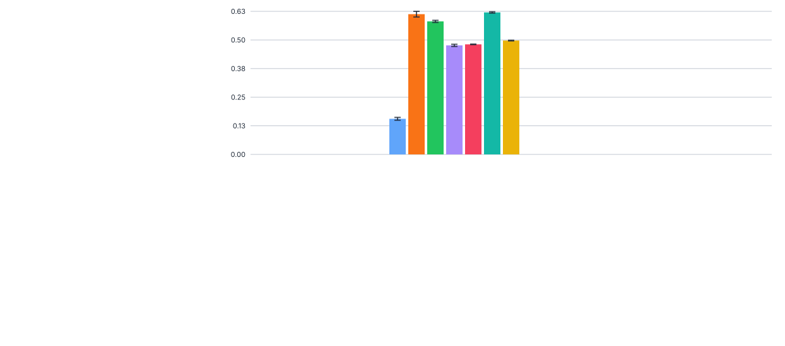
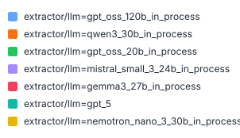
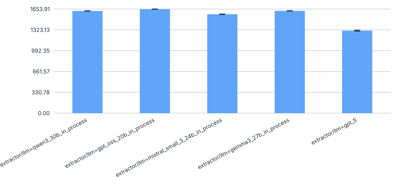

# 440_gpt_oss_120b_faktencheck_core

Evaluate `openai/gpt-oss-120b` with the chunking extractor on the Faktencheck core fields schema
(`faktencheck_core_fields_schema_with_chunking`), using the in-process vLLM config.
Goal: establish a performance baseline for a 120B-scale open-weights model and compare it against
smaller models already evaluated on this experiment.

## Config

Config file: `configs/extractor/llm/gpt_oss_120b_in_process.yaml`

### Non-default parameters

- `vllm_kwargs.max_model_len=65536`: overrides the vLLM default to cap the context window.
  `131072` requires ~5 GiB KV cache but only ~3.3 GiB is available on cluster GPUs, causing
  vLLM to refuse to start. `65536` was confirmed working on serv-3341 (2026-06-11).
  See [issue #440](https://github.com/DFKI-NLP/kibad-llm/issues/440) for test details.
- `extractor.max_char_buffer=100000`: overrides the chunking extractor default to allow larger
  chunks, matching the available context window of the model.

## Prediction

```bash
./run_in_process.sh -pa "H100-SLT,H100-Trails,H100,H200,B200" -ng 1 \
  -u "-m kibad_llm.predict \
       name=440_gpt_oss_120b_faktencheck_core \
       experiment/predict=faktencheck_core_fields_schema_with_chunking \
       extractor/llm=gpt_oss_120b_in_process \
       pdf_directory=/ds/text/kiba-d/dev-set-100 \
       extractor.max_char_buffer=100000 \
       seed=42,1337,7331 \
       --multirun"
```

### Issues encountered during setup

#### 1. `max_model_len=131072` causes OOM at engine startup (2026-06-11)

vLLM refused to start with the full context length because the required KV cache (~5 GiB) exceeded
available GPU memory (~3.3 GiB on H100/A100-80GB with `gpu_memory_utilization=0.95`). Error:

```
ValueError: ... The model's max seq len ... is larger than the maximum number of tokens
that can be stored in KV cache.
```

Fix: set `max_model_len: 65536` in the config. Confirmed working on serv-3341 (2026-06-11).

#### 2. First predict run failed with `ConnectionError` on compute node (2026-06-18)

The predict job (all three seeds) crashed immediately with:

```
ConnectionError: HTTPSConnectionPool(host='huggingface.co', port=443):
Max retries exceeded ... Failed to establish a new connection: [Errno 101] Network is unreachable
```

Root cause: compute nodes have no outbound internet access. vLLM's `download_dir` (set via
`VLLM_DOWNLOAD_DIR` in `.env`) pointed to `/netscratch/asafari/models`, but the model had been
downloaded to `/netscratch/asafari/cache/hf/hub/models--openai--gpt-oss-120b` (the `HF_HOME`
cache set by `run_in_process.sh`). Since the model was not in `download_dir`, vLLM tried to
download it from HuggingFace Hub — which is unreachable from compute nodes.

Contributing factor: the `.env` file had a typo in the `VLLM_DOWNLOAD_DIR` line
(`VLLM_DOWNLOAD_DIR=VLLM_DOWNLOAD_DIR=/netscratch/asafari/models` — double assignment),
causing the resolved path to be the literal string `VLLM_DOWNLOAD_DIR=/netscratch/asafari/models`,
which is not a valid filesystem path.

Fix applied:
1. Corrected the typo in `.env`: `VLLM_DOWNLOAD_DIR=/netscratch/asafari/models`
2. Created a symlink so vLLM finds the already-cached model at the expected path:
   ```bash
   mkdir -p /netscratch/asafari/models
   ln -s /netscratch/asafari/cache/hf/hub/models--openai--gpt-oss-120b \
         /netscratch/asafari/models/models--openai--gpt-oss-120b
   ```

Note: if future runs fail again with the same network error even after the symlink (because
HuggingFace Hub still tries to ping the server to check for updates), add `HF_HUB_OFFLINE=1`
to `.env`. This tells the HF Hub library to skip all network calls and use only the local cache.

Result location: `logs/440_gpt_oss_120b_faktencheck_core/predict/multiruns/2026-06-18_15-07-45`

## Evaluation

### F1 scores

Run from within `data/prediction_results/`:

```bash
uv run -m kibad_llm.evaluate \
  name=440_gpt_oss_120b_faktencheck_core \
  experiment/evaluate=faktencheck_core_f1_micro_flat \
  prediction_logs=logs/440_gpt_oss_120b_faktencheck_core/predict/multiruns/2026-06-18_15-07-45 \
  --multirun
```

Result location: `logs/440_gpt_oss_120b_faktencheck_core/evaluate/multiruns/2026-06-22_13-20-17`

### Comparison with other models


#### F1


#### Precision


#### Recall


### Errors

```bash
uv run -m kibad_llm.evaluate \
  name=440_gpt_oss_120b_faktencheck_core \
  experiment/evaluate=prediction_errors \
  hydra.callbacks.save_job_return.multirun_show_file_contents=null \
  prediction_logs=logs/440_gpt_oss_120b_faktencheck_core/predict/multiruns/2026-06-18_15-07-45 \
  --multirun
```

Result location: `logs/440_gpt_oss_120b_faktencheck_core/evaluate/multiruns/2026-06-22_13-22-29`



#### total - no errors


#### total - with errors


## Outcome

The error rate is very low: only 5–6 errors per seed out of ~367 total chunks (~1.6%), compared to
~22–23% for Nemotron-Nano-30B. All errors come from a single document (`84QQ9F5S`) whose chunks
exceed `max_model_len=65536`. The dominant error type is `ValueError` (4 per seed — context too
long), with 1 `MissingResponseContentError` and occasionally 1 `JSONDecodeError` per seed.
`ReasoningExtractionError` was not observed.

F1 scores (7-field config including `taxa.german_name` and `taxa.scientific_name`):

| field | seed=42 | seed=1337 | seed=7331 |
|---|---|---|---|
| habitat | 0.731 | 0.728 | 0.719 |
| ecosystem_type.category | 0.432 | 0.426 | 0.429 |
| taxa.species_group | 0.448 | 0.455 | 0.448 |
| biodiversity_level | 0.356 | 0.347 | 0.327 |
| ecosystem_type.term | 0.251 | 0.252 | 0.249 |
| taxa.scientific_name | 0.112 | 0.121 | 0.100 |
| taxa.german_name | 0.071 | 0.093 | 0.099 |
| **ALL** | **0.226** | **0.243** | **0.235** |
| **AVG** | **0.343** | **0.346** | **0.339** |

Note: the ALL F1 here (mean ≈ 0.235) is not directly comparable to experiments that used the
5-field subset (without `taxa.german_name` and `taxa.scientific_name`), as those two fields have
very low precision (~0.05–0.07), pulling the overall ALL F1 down significantly.
