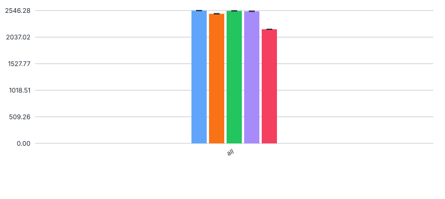
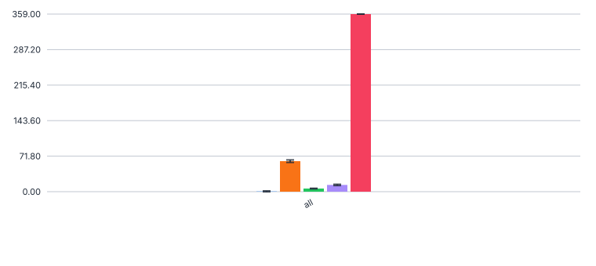
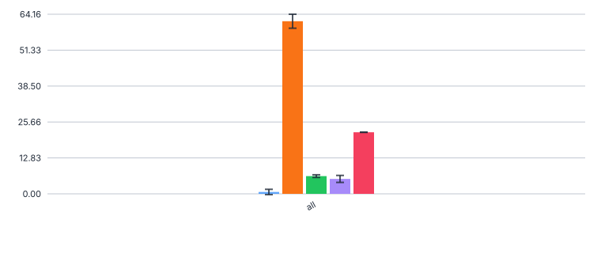
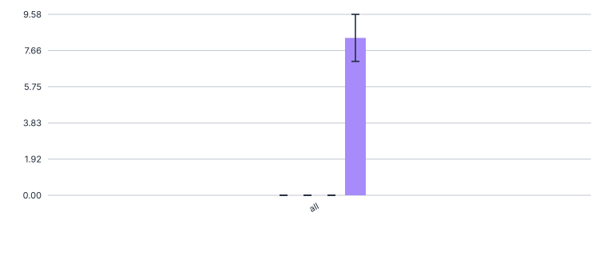

# 549_organism_trends_bestconfig_testset

Evaluation of the best setup (with chunking) from [428_organism_trends_with_chunking](../428_organism_trends_with_chunking), but on the
true test set (`/ds/text/kiba-d/test-set-AuO-WVC`). 

## Prediction

Base for the commands is https://github.com/DFKI-NLP/kibad-llm/tree/main/data/prediction_results/logs/428_organism_trends_with_chunking 

### gpt_oss_20b

```sh
./run_in_process.sh -t "3-00:00:00" -pa "H100-SLT,H100-Trails,H100,H200,B200,A100-80GB"  \
-u "-m kibad_llm.predict \
name=549_organism_trends_bestconfig_testset \
experiment/predict=organism_trends_with_chunking \
pdf_directory=/ds/text/kiba-d/test-set-AuO-WVC \
extractor/llm=gpt_oss_20b_in_process \
seed=42,1337,7331 \
--multirun"
```

```sh
=============================================
>>> USING PARTITION H100-SLT,H100-Trails,H100,H200,B200,A100-80GB
>>> MAX TIME 3-00:00:00
>>> SUBMITTED Thu Jul  9 02:48:54 PM CEST 2026
>>> UV_ARGS --cache-dir /netscratch/hennig/cache/uv -m kibad_llm.predict name=549_organism_trends_bestconfig_testset experiment/predict=organism_trends_with_chunking pdf_directory=/ds/text/kiba-d/test-set-AuO-WVC extractor/llm=gpt_oss_20b_in_process seed=42,1337,7331 --multirun
>>> JOB_NAME kiba-d_3a6a2839-f1be-4e9b-b8a7-e03cd63986d7
>>> GIT_REF (none; using current working tree)
=============================================
```

Saved to `logs/549_organism_trends_bestconfig_testset/predict/multiruns/2026-07-09_15-18-29/`

### gemma3_27b

**IMPORTANT: Running this requires a huggingface token**

```sh
./run_in_process.sh -t "3-00:00:00" -pa "H100-SLT,H100-Trails,H100,H200,B200,A100-80GB"  \
-u "-m kibad_llm.predict \
name=549_organism_trends_bestconfig_testset \
experiment/predict=organism_trends_with_chunking \
pdf_directory=/ds/text/kiba-d/test-set-AuO-WVC \
extractor/llm=gemma3_27b_in_process \
seed=42,1337,7331 \
--multirun"
```

```sh
=============================================
>>> USING PARTITION H100-SLT,H100-Trails,H100,H200,B200,A100-80GB
>>> MAX TIME 3-00:00:00
>>> SUBMITTED Thu Jul  9 02:49:18 PM CEST 2026
>>> UV_ARGS --cache-dir /netscratch/hennig/cache/uv -m kibad_llm.predict name=549_organism_trends_bestconfig_testset experiment/predict=organism_trends_with_chunking pdf_directory=/ds/text/kiba-d/test-set-AuO-WVC extractor/llm=gemma3_27b_in_process seed=42,1337,7331 --multirun
>>> JOB_NAME kiba-d_333c7f52-7f3e-4d88-a76a-49a1235ffcba
>>> GIT_REF (none; using current working tree)
=============================================
```

Saved to `logs/549_organism_trends_bestconfig_testset/predict/multiruns/2026-07-09_15-31-12/`

### qwen3_30b

```sh
./run_in_process.sh -t "3-00:00:00" -pa "H100-SLT,H100-Trails,H100,H200,B200,A100-80GB"  \
-u "-m kibad_llm.predict \
name=549_organism_trends_bestconfig_testset \
experiment/predict=organism_trends_with_chunking \
pdf_directory=/ds/text/kiba-d/test-set-AuO-WVC \
extractor/llm=qwen3_30b_in_process \
seed=42,1337,7331 \
--multirun"
```

```sh
=============================================
>>> USING PARTITION H100-SLT,H100-Trails,H100,H200,B200,A100-80GB
>>> MAX TIME 3-00:00:00
>>> SUBMITTED Thu Jul  9 02:49:30 PM CEST 2026
>>> UV_ARGS --cache-dir /netscratch/hennig/cache/uv -m kibad_llm.predict name=549_organism_trends_bestconfig_testset experiment/predict=organism_trends_with_chunking pdf_directory=/ds/text/kiba-d/test-set-AuO-WVC extractor/llm=qwen3_30b_in_process seed=42,1337,7331 --multirun
>>> JOB_NAME kiba-d_63ec886f-3c9c-450a-97bc-5330eb3d8684
>>> GIT_REF (none; using current working tree)
=============================================
```

Saved to `logs/549_organism_trends_bestconfig_testset/predict/multiruns/2026-07-09_15-31-13/`

### mistral_small_3_24b

```sh
./run_in_process.sh -t "3-00:00:00" -pa "H100-SLT,H100-Trails,H100,H200,B200,A100-80GB"  \
-u "-m kibad_llm.predict \
name=549_organism_trends_bestconfig_testset \
experiment/predict=organism_trends_with_chunking \
pdf_directory=/ds/text/kiba-d/test-set-AuO-WVC \
extractor/llm=mistral_small_3_24b_in_process \
seed=42,1337,7331 \
--multirun"
```

```sh
=============================================
>>> USING PARTITION H100-SLT,H100-Trails,H100,H200,B200,A100-80GB
>>> MAX TIME 3-00:00:00
>>> SUBMITTED Thu Jul  9 02:49:41 PM CEST 2026
>>> UV_ARGS --cache-dir /netscratch/hennig/cache/uv -m kibad_llm.predict name=549_organism_trends_bestconfig_testset experiment/predict=organism_trends_with_chunking pdf_directory=/ds/text/kiba-d/test-set-AuO-WVC extractor/llm=mistral_small_3_24b_in_process seed=42,1337,7331 --multirun
>>> JOB_NAME kiba-d_365175c4-6fbc-47a5-96b2-b22a598a5888
>>> GIT_REF (none; using current working tree)
=============================================
```

Saved to `logs/549_organism_trends_bestconfig_testset/predict/multiruns/2026-07-09_16-29-00/`

### gpt_5

**IMPORTANT: Running this requires an openai token**  
This run does not need a gpu and is hence run with `-ng 0. It is also run with only a single seed to limit costs, and 
since the random seed would not change anything on the OpenAI side anyways.

```sh
./run_in_process.sh -t "3-00:00:00" -ng 0 -pa "H100-SLT,H100-Trails,H100,H200,B200,A100-80GB,batch"  \
-u "-m kibad_llm.predict \
name=549_organism_trends_bestconfig_testset \
experiment/predict=organism_trends_with_chunking \
pdf_directory=/ds/text/kiba-d/test-set-AuO-WVC \
extractor/llm=gpt_5 \
seed=42 \
--multirun"
```

```sh
=============================================
>>> USING PARTITION H100-SLT,H100-Trails,H100,H200,B200,A100-80GB,batch
>>> MAX TIME 3-00:00:00
>>> SUBMITTED Thu Jul  9 02:49:56 PM CEST 2026
>>> UV_ARGS --cache-dir /netscratch/hennig/cache/uv -m kibad_llm.predict name=549_organism_trends_bestconfig_testset experiment/predict=organism_trends_with_chunking pdf_directory=/ds/text/kiba-d/test-set-AuO-WVC extractor/llm=gpt_5 seed=42 --multirun
>>> JOB_NAME kiba-d_7f1f9ea7-ec26-4766-ad58-f8aaca8fff19
>>> GIT_REF (none; using current working tree)
=============================================
```

Saved to `logs/549_organism_trends_bestconfig_testset/predict/multiruns/2026-07-09_14-51-33/`

## Evaluation

### F1, P, R
Base for the command is https://github.com/DFKI-NLP/kibad-llm/tree/main/data/prediction_results/logs/428_organism_trends_with_chunking

##### flattened
```sh
uv run -m kibad_llm.evaluate \
name=549_organism_trends_bestconfig_testset \
experiment/evaluate=organism_trends_f1_micro_flat \
prediction_logs=logs/549_organism_trends_bestconfig_testset/predict \
hydra.callbacks.save_job_return.multirun_show_file_contents=null \
dataset.references.file="../external/organism_trends/Weighted Vote Count Agrar- und Offenland Literatur - Sheet1.csv" \
--multirun
```

Saved to `logs/549_organism_trends_bestconfig_testset/evaluate/multiruns/2026-07-13_11-02-03/12/`

##### full compounds

```sh
uv run -m kibad_llm.evaluate \
name=549_organism_trends_bestconfig_testset \
experiment/evaluate=organism_trends_f1_micro \
prediction_logs=logs/549_organism_trends_bestconfig_testset/predict \
hydra.callbacks.save_job_return.multirun_show_file_contents=null \
dataset.references.file="../external/organism_trends/Weighted Vote Count Agrar- und Offenland Literatur - Sheet1.csv" \
--multirun
```

Saved to `logs/549_organism_trends_bestconfig_testset/evaluate/multiruns/2026-07-13_11-03-11/`

##### base elements

```sh
uv run -m kibad_llm.evaluate \
name=549_organism_trends_bestconfig_testset \
experiment/evaluate=organism_trends_f1_micro_base_entries \
prediction_logs=logs/549_organism_trends_bestconfig_testset/predict \
hydra.callbacks.save_job_return.multirun_show_file_contents=null \
dataset.references.file="../external/organism_trends/Weighted Vote Count Agrar- und Offenland Literatur - Sheet1.csv" \
--multirun
```

Saved to `logs/549_organism_trends_bestconfig_testset/evaluate/multiruns/2026-07-13_11-03-50/`

##### `Antwortvariable` conditioned on base elements

```sh
uv run -m kibad_llm.evaluate \
name=549_organism_trends_bestconfig_testset \
experiment/evaluate=organism_trends_f1_micro_conditional_variable_only \
prediction_logs=logs/549_organism_trends_bestconfig_testset/predict \
hydra.callbacks.save_job_return.multirun_show_file_contents=null \
dataset.references.file="../external/organism_trends/Weighted Vote Count Agrar- und Offenland Literatur - Sheet1.csv" \
--multirun
```

Saved to `logs/549_organism_trends_bestconfig_testset/evaluate/multiruns/2026-07-13_11-46-09/`

##### `Antwortvariable` & `Trend` conditioned on base elements

```sh
uv run -m kibad_llm.evaluate \
name=549_organism_trends_bestconfig_testset \
experiment/evaluate=organism_trends_f1_micro_conditional_variable_and_trend \
prediction_logs=logs/549_organism_trends_bestconfig_testset/predict \
hydra.callbacks.save_job_return.multirun_show_file_contents=null \
dataset.references.file="../external/organism_trends/Weighted Vote Count Agrar- und Offenland Literatur - Sheet1.csv" \
--multirun
```

Saved to `logs/549_organism_trends_bestconfig_testset/evaluate/multiruns/2026-07-13_11-04-21/`

### Errors

```sh
uv run -m kibad_llm.evaluate \
name=549_organism_trends_bestconfig_testset \
experiment/evaluate=prediction_errors \
hydra.callbacks.save_job_return.multirun_show_file_contents=null \
prediction_logs=[\
logs/549_organism_trends_bestconfig_testset/predict \
] \
--multirun
```

Saved to `logs/549_organism_trends_bestconfig_testset/evaluate/multiruns/2026-07-13_11-05-06/`

## Outcome

### F1, P, R
The results in this folder can serve as a basis for the [Journal experiments](https://github.com/DFKI-NLP/kibad-llm/issues/521),
namely for the Organism Trend schema plots:

Legend


Micro-F1, All.F1

 

Precision, ALL.F1


Recall, ALL.F1


Habitat F1


### Errors

Legend


No errors



Total errors



JSONDecode Errors



MissingResponseContent errors



