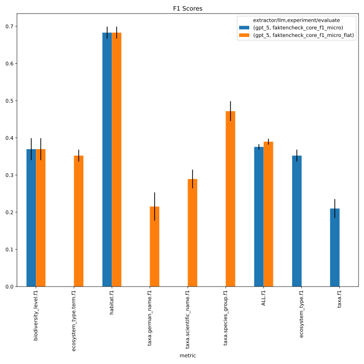
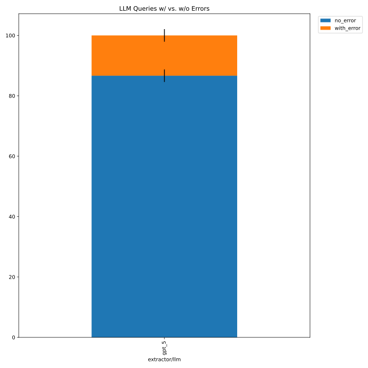
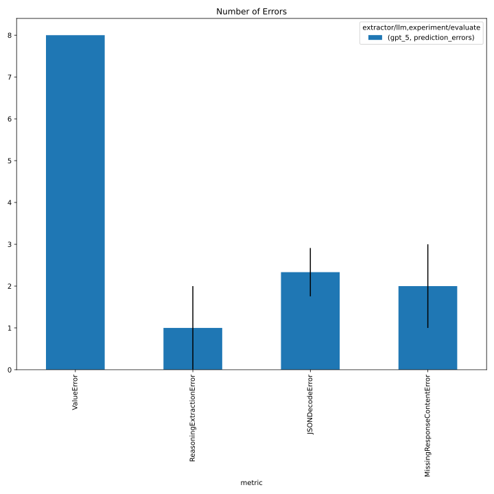

# 88_faktencheck_core_gpt5_baseline
From https://github.com/DFKI-NLP/kibad-llm/issues/88#issuecomment-3828699824, but additionally with non-flattened evaluation (executed locally) which uses this:
```yaml
  ignore_subfields:
    ecosystem_type: [ "category", "description"]
    taxa: [ "german_name", "collective_term" ]
```

## notebook parameters
```python
NAME = "88_faktencheck_core_gpt5_baseline"

# used to group the data
INDEX_COLUMNS = ["prediction.overrides.extractor/llm", "overrides.experiment/evaluate"]
PLOT_KWARGS = {
    # can be either "metric" or one of the INDEX_COLUMNS (or multiple of them)
    "xgroup": ["prediction.overrides.extractor/llm", "overrides.experiment/evaluate"],
    # add any more arguments passed to pd.DataFrame.plot
}
```







details below.

---

 - use distinct `name=88_faktencheck_core_gpt5_baseline` so this can be easily used in future comparisons
 - requires #342 for `-ng 0`
```
./run_in_process.sh \
-ng 0 \
-pa "H100-SLT,H100-Trails,H100,A100-80GB" \
-u "-m kibad_llm.predict \
name=88_faktencheck_core_gpt5_baseline \
experiment/predict=faktencheck_core_fields_schema_with_evidence \
pdf_directory=/ds/text/kiba-d/dev-set-100 \
extractor.return_reasoning=true \
extractor/llm=gpt_5 \
seed=42,1337,7331 \
--multirun"
```
started at `screen -r kibad-llm`
Job 2500552: Running on node(s) serv-3340
Job 2500552: Started at 2026-01-31 16:22:10+0100
Monitor this job here: http://monitoring.pegasus.kl.dfki.de/d/slurm-job-details/job-details?var-jobid=2500552&from=1769872930000

[2026-01-31 22:07:36,024][HYDRA] Contents of /netscratch/binder/projects/kibad-llm/logs/88_faktencheck_core_gpt5_baseline/predict/multiruns/2026-01-31_16-22-31/job_return_value.md:

|           | branch                          | commit_hash                              | is_dirty   | output_file                                                                                                    | output_file_absolute                                                                                                                                 | overrides.experiment/predict                 | overrides.extractor.return_reasoning   | overrides.extractor/llm   | overrides.name                    | overrides.pdf_directory     |   overrides.seed |   time_extraction |   time_pdf_conversion |
|:----------|:--------------------------------|:-----------------------------------------|:-----------|:---------------------------------------------------------------------------------------------------------------|:-----------------------------------------------------------------------------------------------------------------------------------------------------|:---------------------------------------------|:---------------------------------------|:--------------------------|:----------------------------------|:----------------------------|-----------------:|------------------:|----------------------:|
| seed=1337 | run-script/parametrize-num-gpus | dd1413a20fc344dbbb95a79b18a4ab5c625cd3c5 | False      | predictions/88_faktencheck_core_gpt5_baseline/2026-01-31_16-22-31/2026-01-31_18-38-49_281164/predictions.jsonl | /netscratch/binder/projects/kibad-llm/predictions/88_faktencheck_core_gpt5_baseline/2026-01-31_16-22-31/2026-01-31_18-38-49_281164/predictions.jsonl | faktencheck_core_fields_schema_with_evidence | True                                   | gpt_5                     | 88_faktencheck_core_gpt5_baseline | /ds/text/kiba-d/dev-set-100 |             1337 |           6390.37 |            0.00464766 |
| seed=42   | run-script/parametrize-num-gpus | dd1413a20fc344dbbb95a79b18a4ab5c625cd3c5 | False      | predictions/88_faktencheck_core_gpt5_baseline/2026-01-31_16-22-31/2026-01-31_16-22-31_957220/predictions.jsonl | /netscratch/binder/projects/kibad-llm/predictions/88_faktencheck_core_gpt5_baseline/2026-01-31_16-22-31/2026-01-31_16-22-31_957220/predictions.jsonl | faktencheck_core_fields_schema_with_evidence | True                                   | gpt_5                     | 88_faktencheck_core_gpt5_baseline | /ds/text/kiba-d/dev-set-100 |               42 |           8128.77 |            0.036147   |
| seed=7331 | run-script/parametrize-num-gpus | dd1413a20fc344dbbb95a79b18a4ab5c625cd3c5 | False      | predictions/88_faktencheck_core_gpt5_baseline/2026-01-31_16-22-31/2026-01-31_20-25-20_287885/predictions.jsonl | /netscratch/binder/projects/kibad-llm/predictions/88_faktencheck_core_gpt5_baseline/2026-01-31_16-22-31/2026-01-31_20-25-20_287885/predictions.jsonl | faktencheck_core_fields_schema_with_evidence | True                                   | gpt_5                     | 88_faktencheck_core_gpt5_baseline | /ds/text/kiba-d/dev-set-100 |             7331 |           6135.3  |            0.00290389 |

## evaluate

### f1

```
uv run -m kibad_llm.evaluate \
name=88_faktencheck_core_gpt5_baseline  \
experiment/evaluate=faktencheck_core_f1_micro_flat \
prediction_logs=logs/88_faktencheck_core_gpt5_baseline/predict \
+hydra.callbacks.save_job_return.multirun_markdown_group_by=prediction.overrides.extractor/llm \
--multirun
```


[2026-02-01 18:01:53,852][HYDRA] Contents of /netscratch/binder/projects/kibad-llm/logs/88_faktencheck_core_gpt5_baseline/evaluate/multiruns/2026-02-01_18-01-52/job_return_value.md:

<details>
<summary>click to see result</summary>

| prediction.overrides.extractor/llm   |   ALL.f1.mean |   ALL.f1.std |   ALL.precision.mean |   ALL.precision.std |   ALL.recall.mean |   ALL.recall.std |   ALL.support.mean |   ALL.support.std |   AVG.f1.mean |   AVG.f1.std |   AVG.precision.mean |   AVG.precision.std |   AVG.recall.mean |   AVG.recall.std |   AVG.support.mean |   AVG.support.std |   biodiversity_level.f1.mean |   biodiversity_level.f1.std |   biodiversity_level.precision.mean |   biodiversity_level.precision.std |   biodiversity_level.recall.mean |   biodiversity_level.recall.std |   biodiversity_level.support.mean |   biodiversity_level.support.std |   ecosystem_type.term.f1.mean |   ecosystem_type.term.f1.std |   ecosystem_type.term.precision.mean |   ecosystem_type.term.precision.std |   ecosystem_type.term.recall.mean |   ecosystem_type.term.recall.std |   ecosystem_type.term.support.mean |   ecosystem_type.term.support.std |   habitat.f1.mean |   habitat.f1.std |   habitat.precision.mean |   habitat.precision.std |   habitat.recall.mean |   habitat.recall.std |   habitat.support.mean |   habitat.support.std |   prediction.job_return_value.time_extraction.mean |   prediction.job_return_value.time_extraction.std |   prediction.job_return_value.time_pdf_conversion.mean |   prediction.job_return_value.time_pdf_conversion.std |   taxa.german_name.f1.mean |   taxa.german_name.f1.std |   taxa.german_name.precision.mean |   taxa.german_name.precision.std |   taxa.german_name.recall.mean |   taxa.german_name.recall.std |   taxa.german_name.support.mean |   taxa.german_name.support.std |   taxa.scientific_name.f1.mean |   taxa.scientific_name.f1.std |   taxa.scientific_name.precision.mean |   taxa.scientific_name.precision.std |   taxa.scientific_name.recall.mean |   taxa.scientific_name.recall.std |   taxa.scientific_name.support.mean |   taxa.scientific_name.support.std |   taxa.species_group.f1.mean |   taxa.species_group.f1.std |   taxa.species_group.precision.mean |   taxa.species_group.precision.std |   taxa.species_group.recall.mean |   taxa.species_group.recall.std |   taxa.species_group.support.mean |   taxa.species_group.support.std | overrides.dataset.predictions.log                                                                                                                                                                                                                      | overrides.experiment/evaluate                                                                          | overrides.name                                                                                                  | overrides.prediction_logs                                                                                                                              | prediction.job_return_value.branch                                                                        | prediction.job_return_value.commit_hash                                                                                              | prediction.job_return_value.is_dirty   | prediction.job_return_value.output_file                                                                                                                                                                                                                                                                                                                | prediction.job_return_value.output_file_absolute                                                                                                                                                                                                                                                                                                                                                                                                                         | prediction.overrides.experiment/predict                                                                                                          | prediction.overrides.extractor.return_reasoning   | prediction.overrides.name                                                                                       | prediction.overrides.pdf_directory                                                            | prediction.overrides.seed   |
|:-------------------------------------|--------------:|-------------:|---------------------:|--------------------:|------------------:|-----------------:|-------------------:|------------------:|--------------:|-------------:|---------------------:|--------------------:|------------------:|-----------------:|-------------------:|------------------:|-----------------------------:|----------------------------:|------------------------------------:|-----------------------------------:|---------------------------------:|--------------------------------:|----------------------------------:|---------------------------------:|------------------------------:|-----------------------------:|-------------------------------------:|------------------------------------:|----------------------------------:|---------------------------------:|-----------------------------------:|----------------------------------:|------------------:|-----------------:|-------------------------:|------------------------:|----------------------:|---------------------:|-----------------------:|----------------------:|---------------------------------------------------:|--------------------------------------------------:|-------------------------------------------------------:|------------------------------------------------------:|---------------------------:|--------------------------:|----------------------------------:|---------------------------------:|-------------------------------:|------------------------------:|--------------------------------:|-------------------------------:|-------------------------------:|------------------------------:|--------------------------------------:|-------------------------------------:|-----------------------------------:|----------------------------------:|------------------------------------:|-----------------------------------:|-----------------------------:|----------------------------:|------------------------------------:|-----------------------------------:|---------------------------------:|--------------------------------:|----------------------------------:|---------------------------------:|:-------------------------------------------------------------------------------------------------------------------------------------------------------------------------------------------------------------------------------------------------------|:-------------------------------------------------------------------------------------------------------|:----------------------------------------------------------------------------------------------------------------|:-------------------------------------------------------------------------------------------------------------------------------------------------------|:----------------------------------------------------------------------------------------------------------|:-------------------------------------------------------------------------------------------------------------------------------------|:---------------------------------------|:-------------------------------------------------------------------------------------------------------------------------------------------------------------------------------------------------------------------------------------------------------------------------------------------------------------------------------------------------------|:-------------------------------------------------------------------------------------------------------------------------------------------------------------------------------------------------------------------------------------------------------------------------------------------------------------------------------------------------------------------------------------------------------------------------------------------------------------------------|:-------------------------------------------------------------------------------------------------------------------------------------------------|:--------------------------------------------------|:----------------------------------------------------------------------------------------------------------------|:----------------------------------------------------------------------------------------------|:----------------------------|
| gpt_5                                |          0.39 |        0.008 |                0.384 |               0.004 |             0.396 |            0.019 |                792 |                 0 |         0.397 |        0.011 |                0.381 |               0.003 |             0.473 |            0.016 |                132 |                 0 |                         0.37 |                        0.03 |                               0.318 |                               0.03 |                            0.443 |                           0.031 |                                67 |                                0 |                         0.352 |                        0.016 |                                0.237 |                               0.012 |                             0.686 |                            0.029 |                                 53 |                                 0 |             0.683 |            0.016 |                    0.664 |                   0.014 |                 0.703 |                0.019 |                    138 |                     0 |                                            6884.81 |                                           1084.82 |                                                  0.015 |                                                 0.019 |                      0.215 |                     0.038 |                             0.353 |                            0.015 |                          0.157 |                         0.039 |                             231 |                              0 |                          0.289 |                         0.025 |                                  0.32 |                                0.021 |                              0.266 |                             0.038 |                                 197 |                                  0 |                        0.472 |                       0.027 |                               0.396 |                              0.028 |                            0.585 |                           0.025 |                               106 |                                0 | ['logs/88_faktencheck_core_gpt5_baseline/predict/multiruns/2026-01-31_16-22-31/0', 'logs/88_faktencheck_core_gpt5_baseline/predict/multiruns/2026-01-31_16-22-31/1', 'logs/88_faktencheck_core_gpt5_baseline/predict/multiruns/2026-01-31_16-22-31/2'] | ['faktencheck_core_f1_micro_flat', 'faktencheck_core_f1_micro_flat', 'faktencheck_core_f1_micro_flat'] | ['88_faktencheck_core_gpt5_baseline', '88_faktencheck_core_gpt5_baseline', '88_faktencheck_core_gpt5_baseline'] | ['logs/88_faktencheck_core_gpt5_baseline/predict', 'logs/88_faktencheck_core_gpt5_baseline/predict', 'logs/88_faktencheck_core_gpt5_baseline/predict'] | ['run-script/parametrize-num-gpus', 'run-script/parametrize-num-gpus', 'run-script/parametrize-num-gpus'] | ['dd1413a20fc344dbbb95a79b18a4ab5c625cd3c5', 'dd1413a20fc344dbbb95a79b18a4ab5c625cd3c5', 'dd1413a20fc344dbbb95a79b18a4ab5c625cd3c5'] | [np.False_, np.False_, np.False_]      | ['predictions/88_faktencheck_core_gpt5_baseline/2026-01-31_16-22-31/2026-01-31_16-22-31_957220/predictions.jsonl', 'predictions/88_faktencheck_core_gpt5_baseline/2026-01-31_16-22-31/2026-01-31_18-38-49_281164/predictions.jsonl', 'predictions/88_faktencheck_core_gpt5_baseline/2026-01-31_16-22-31/2026-01-31_20-25-20_287885/predictions.jsonl'] | ['/netscratch/binder/projects/kibad-llm/predictions/88_faktencheck_core_gpt5_baseline/2026-01-31_16-22-31/2026-01-31_16-22-31_957220/predictions.jsonl', '/netscratch/binder/projects/kibad-llm/predictions/88_faktencheck_core_gpt5_baseline/2026-01-31_16-22-31/2026-01-31_18-38-49_281164/predictions.jsonl', '/netscratch/binder/projects/kibad-llm/predictions/88_faktencheck_core_gpt5_baseline/2026-01-31_16-22-31/2026-01-31_20-25-20_287885/predictions.jsonl'] | ['faktencheck_core_fields_schema_with_evidence', 'faktencheck_core_fields_schema_with_evidence', 'faktencheck_core_fields_schema_with_evidence'] | ['True', 'True', 'True']                          | ['88_faktencheck_core_gpt5_baseline', '88_faktencheck_core_gpt5_baseline', '88_faktencheck_core_gpt5_baseline'] | ['/ds/text/kiba-d/dev-set-100', '/ds/text/kiba-d/dev-set-100', '/ds/text/kiba-d/dev-set-100'] | ['42', '1337', '7331']      |

</details>

### f1 - no flattening 
```
uv run -m kibad_llm.evaluate \
name=88_faktencheck_core_gpt5_baseline  \
experiment/evaluate=faktencheck_core_f1_micro \
prediction_logs=logs/88_faktencheck_core_gpt5_baseline/predict \
+hydra.callbacks.save_job_return.multirun_markdown_group_by=prediction.overrides.extractor/llm \
--multirun
```

[2026-02-03 00:41:40,252][HYDRA] Contents of /home/arbi01/projects/kibad-llm/logs/88_faktencheck_core_gpt5_baseline/evaluate/multiruns/2026-02-03_00-41-39/job_return_value.md:

<details>
<summary>click to see result</summary>

| prediction.overrides.extractor/llm   |   ALL.f1.mean |   ALL.f1.std |   ALL.precision.mean |   ALL.precision.std |   ALL.recall.mean |   ALL.recall.std |   ALL.support.mean |   ALL.support.std |   AVG.f1.mean |   AVG.f1.std |   AVG.precision.mean |   AVG.precision.std |   AVG.recall.mean |   AVG.recall.std |   AVG.support.mean |   AVG.support.std |   biodiversity_level.f1.mean |   biodiversity_level.f1.std |   biodiversity_level.precision.mean |   biodiversity_level.precision.std |   biodiversity_level.recall.mean |   biodiversity_level.recall.std |   biodiversity_level.support.mean |   biodiversity_level.support.std |   ecosystem_type.f1.mean |   ecosystem_type.f1.std |   ecosystem_type.precision.mean |   ecosystem_type.precision.std |   ecosystem_type.recall.mean |   ecosystem_type.recall.std |   ecosystem_type.support.mean |   ecosystem_type.support.std |   habitat.f1.mean |   habitat.f1.std |   habitat.precision.mean |   habitat.precision.std |   habitat.recall.mean |   habitat.recall.std |   habitat.support.mean |   habitat.support.std |   prediction.job_return_value.time_extraction.mean |   prediction.job_return_value.time_extraction.std |   prediction.job_return_value.time_pdf_conversion.mean |   prediction.job_return_value.time_pdf_conversion.std |   taxa.f1.mean |   taxa.f1.std |   taxa.precision.mean |   taxa.precision.std |   taxa.recall.mean |   taxa.recall.std |   taxa.support.mean |   taxa.support.std | overrides.dataset.predictions.log                                                                                                                                                                                                                      | overrides.experiment/evaluate                                                           | overrides.name                                                                                                  | overrides.prediction_logs                                                                                                                              | prediction.job_return_value.branch                                                                        | prediction.job_return_value.commit_hash                                                                                              | prediction.job_return_value.is_dirty   | prediction.job_return_value.output_file                                                                                                                                                                                                                                                                                                                | prediction.job_return_value.output_file_absolute                                                                                                                                                                                                                                                                                                                                                                                                                         | prediction.overrides.experiment/predict                                                                                                          | prediction.overrides.extractor.return_reasoning   | prediction.overrides.name                                                                                       | prediction.overrides.pdf_directory                                                            | prediction.overrides.seed   |
|:-------------------------------------|--------------:|-------------:|---------------------:|--------------------:|------------------:|-----------------:|-------------------:|------------------:|--------------:|-------------:|---------------------:|--------------------:|------------------:|-----------------:|-------------------:|------------------:|-----------------------------:|----------------------------:|------------------------------------:|-----------------------------------:|---------------------------------:|--------------------------------:|----------------------------------:|---------------------------------:|-------------------------:|------------------------:|--------------------------------:|-------------------------------:|-----------------------------:|----------------------------:|------------------------------:|-----------------------------:|------------------:|-----------------:|-------------------------:|------------------------:|----------------------:|---------------------:|-----------------------:|----------------------:|---------------------------------------------------:|--------------------------------------------------:|-------------------------------------------------------:|------------------------------------------------------:|---------------:|--------------:|----------------------:|---------------------:|-------------------:|------------------:|--------------------:|-------------------:|:-------------------------------------------------------------------------------------------------------------------------------------------------------------------------------------------------------------------------------------------------------|:----------------------------------------------------------------------------------------|:----------------------------------------------------------------------------------------------------------------|:-------------------------------------------------------------------------------------------------------------------------------------------------------|:----------------------------------------------------------------------------------------------------------|:-------------------------------------------------------------------------------------------------------------------------------------|:---------------------------------------|:-------------------------------------------------------------------------------------------------------------------------------------------------------------------------------------------------------------------------------------------------------------------------------------------------------------------------------------------------------|:-------------------------------------------------------------------------------------------------------------------------------------------------------------------------------------------------------------------------------------------------------------------------------------------------------------------------------------------------------------------------------------------------------------------------------------------------------------------------|:-------------------------------------------------------------------------------------------------------------------------------------------------|:--------------------------------------------------|:----------------------------------------------------------------------------------------------------------------|:----------------------------------------------------------------------------------------------|:----------------------------|
| gpt_5                                |         0.376 |        0.007 |                0.325 |               0.005 |             0.446 |            0.015 |                481 |                 0 |         0.404 |        0.006 |                0.353 |               0.004 |             0.516 |            0.014 |             120.25 |                 0 |                         0.37 |                        0.03 |                               0.318 |                               0.03 |                            0.443 |                           0.031 |                                67 |                                0 |                    0.352 |                   0.016 |                           0.237 |                          0.012 |                        0.686 |                       0.029 |                            53 |                            0 |             0.683 |            0.016 |                    0.664 |                   0.014 |                 0.703 |                0.019 |                    138 |                     0 |                                            6884.81 |                                           1084.82 |                                                  0.015 |                                                 0.019 |           0.21 |         0.025 |                 0.192 |                 0.02 |              0.232 |             0.034 |                 223 |                  0 | ['logs/88_faktencheck_core_gpt5_baseline/predict/multiruns/2026-01-31_16-22-31/0', 'logs/88_faktencheck_core_gpt5_baseline/predict/multiruns/2026-01-31_16-22-31/1', 'logs/88_faktencheck_core_gpt5_baseline/predict/multiruns/2026-01-31_16-22-31/2'] | ['faktencheck_core_f1_micro', 'faktencheck_core_f1_micro', 'faktencheck_core_f1_micro'] | ['88_faktencheck_core_gpt5_baseline', '88_faktencheck_core_gpt5_baseline', '88_faktencheck_core_gpt5_baseline'] | ['logs/88_faktencheck_core_gpt5_baseline/predict', 'logs/88_faktencheck_core_gpt5_baseline/predict', 'logs/88_faktencheck_core_gpt5_baseline/predict'] | ['run-script/parametrize-num-gpus', 'run-script/parametrize-num-gpus', 'run-script/parametrize-num-gpus'] | ['dd1413a20fc344dbbb95a79b18a4ab5c625cd3c5', 'dd1413a20fc344dbbb95a79b18a4ab5c625cd3c5', 'dd1413a20fc344dbbb95a79b18a4ab5c625cd3c5'] | [np.False_, np.False_, np.False_]      | ['predictions/88_faktencheck_core_gpt5_baseline/2026-01-31_16-22-31/2026-01-31_16-22-31_957220/predictions.jsonl', 'predictions/88_faktencheck_core_gpt5_baseline/2026-01-31_16-22-31/2026-01-31_18-38-49_281164/predictions.jsonl', 'predictions/88_faktencheck_core_gpt5_baseline/2026-01-31_16-22-31/2026-01-31_20-25-20_287885/predictions.jsonl'] | ['/netscratch/binder/projects/kibad-llm/predictions/88_faktencheck_core_gpt5_baseline/2026-01-31_16-22-31/2026-01-31_16-22-31_957220/predictions.jsonl', '/netscratch/binder/projects/kibad-llm/predictions/88_faktencheck_core_gpt5_baseline/2026-01-31_16-22-31/2026-01-31_18-38-49_281164/predictions.jsonl', '/netscratch/binder/projects/kibad-llm/predictions/88_faktencheck_core_gpt5_baseline/2026-01-31_16-22-31/2026-01-31_20-25-20_287885/predictions.jsonl'] | ['faktencheck_core_fields_schema_with_evidence', 'faktencheck_core_fields_schema_with_evidence', 'faktencheck_core_fields_schema_with_evidence'] | ['True', 'True', 'True']                          | ['88_faktencheck_core_gpt5_baseline', '88_faktencheck_core_gpt5_baseline', '88_faktencheck_core_gpt5_baseline'] | ['/ds/text/kiba-d/dev-set-100', '/ds/text/kiba-d/dev-set-100', '/ds/text/kiba-d/dev-set-100'] | ['42', '1337', '7331']      |

</details>

### errors

```
uv run -m kibad_llm.evaluate \
name=88_faktencheck_core_gpt5_baseline \
experiment/evaluate=prediction_errors \
prediction_logs=logs/88_faktencheck_core_gpt5_baseline/predict \
+hydra.callbacks.save_job_return.multirun_markdown_group_by=prediction.overrides.extractor/llm \
--multirun
```

[2026-02-01 18:07:23,568][HYDRA] Contents of /netscratch/binder/projects/kibad-llm/logs/88_faktencheck_core_gpt5_baseline/evaluate/multiruns/2026-02-01_18-07-22/job_return_value.md:


<details>
<summary>click to see result</summary>

| prediction.overrides.extractor/llm   |   JSONDecodeError.mean |   JSONDecodeError.std |   MissingResponseContentError.mean |   MissingResponseContentError.std |   ReasoningExtractionError.mean |   ReasoningExtractionError.std |   ValueError.mean |   ValueError.std |   no_error.mean |   no_error.std |   prediction.job_return_value.time_extraction.mean |   prediction.job_return_value.time_extraction.std |   prediction.job_return_value.time_pdf_conversion.mean |   prediction.job_return_value.time_pdf_conversion.std |   with_error.mean |   with_error.std | overrides.dataset.predictions.log                                                                                                                                                                                                                      | overrides.experiment/evaluate                                   | overrides.name                                                                                                  | overrides.prediction_logs                                                                                                                              | prediction.job_return_value.branch                                                                        | prediction.job_return_value.commit_hash                                                                                              | prediction.job_return_value.is_dirty   | prediction.job_return_value.output_file                                                                                                                                                                                                                                                                                                                | prediction.job_return_value.output_file_absolute                                                                                                                                                                                                                                                                                                                                                                                                                         | prediction.overrides.experiment/predict                                                                                                          | prediction.overrides.extractor.return_reasoning   | prediction.overrides.name                                                                                       | prediction.overrides.pdf_directory                                                            | prediction.overrides.seed   |
|:-------------------------------------|-----------------------:|----------------------:|-----------------------------------:|----------------------------------:|--------------------------------:|-------------------------------:|------------------:|-----------------:|----------------:|---------------:|---------------------------------------------------:|--------------------------------------------------:|-------------------------------------------------------:|------------------------------------------------------:|------------------:|-----------------:|:-------------------------------------------------------------------------------------------------------------------------------------------------------------------------------------------------------------------------------------------------------|:----------------------------------------------------------------|:----------------------------------------------------------------------------------------------------------------|:-------------------------------------------------------------------------------------------------------------------------------------------------------|:----------------------------------------------------------------------------------------------------------|:-------------------------------------------------------------------------------------------------------------------------------------|:---------------------------------------|:-------------------------------------------------------------------------------------------------------------------------------------------------------------------------------------------------------------------------------------------------------------------------------------------------------------------------------------------------------|:-------------------------------------------------------------------------------------------------------------------------------------------------------------------------------------------------------------------------------------------------------------------------------------------------------------------------------------------------------------------------------------------------------------------------------------------------------------------------|:-------------------------------------------------------------------------------------------------------------------------------------------------|:--------------------------------------------------|:----------------------------------------------------------------------------------------------------------------|:----------------------------------------------------------------------------------------------|:----------------------------|
| gpt_5                                |                  2.333 |                 0.577 |                                  2 |                                 1 |                             1.5 |                          0.707 |                 8 |                0 |          86.667 |          2.082 |                                            6884.81 |                                           1084.82 |                                                  0.015 |                                                 0.019 |            13.333 |            2.082 | ['logs/88_faktencheck_core_gpt5_baseline/predict/multiruns/2026-01-31_16-22-31/0', 'logs/88_faktencheck_core_gpt5_baseline/predict/multiruns/2026-01-31_16-22-31/1', 'logs/88_faktencheck_core_gpt5_baseline/predict/multiruns/2026-01-31_16-22-31/2'] | ['prediction_errors', 'prediction_errors', 'prediction_errors'] | ['88_faktencheck_core_gpt5_baseline', '88_faktencheck_core_gpt5_baseline', '88_faktencheck_core_gpt5_baseline'] | ['logs/88_faktencheck_core_gpt5_baseline/predict', 'logs/88_faktencheck_core_gpt5_baseline/predict', 'logs/88_faktencheck_core_gpt5_baseline/predict'] | ['run-script/parametrize-num-gpus', 'run-script/parametrize-num-gpus', 'run-script/parametrize-num-gpus'] | ['dd1413a20fc344dbbb95a79b18a4ab5c625cd3c5', 'dd1413a20fc344dbbb95a79b18a4ab5c625cd3c5', 'dd1413a20fc344dbbb95a79b18a4ab5c625cd3c5'] | [np.False_, np.False_, np.False_]      | ['predictions/88_faktencheck_core_gpt5_baseline/2026-01-31_16-22-31/2026-01-31_16-22-31_957220/predictions.jsonl', 'predictions/88_faktencheck_core_gpt5_baseline/2026-01-31_16-22-31/2026-01-31_18-38-49_281164/predictions.jsonl', 'predictions/88_faktencheck_core_gpt5_baseline/2026-01-31_16-22-31/2026-01-31_20-25-20_287885/predictions.jsonl'] | ['/netscratch/binder/projects/kibad-llm/predictions/88_faktencheck_core_gpt5_baseline/2026-01-31_16-22-31/2026-01-31_16-22-31_957220/predictions.jsonl', '/netscratch/binder/projects/kibad-llm/predictions/88_faktencheck_core_gpt5_baseline/2026-01-31_16-22-31/2026-01-31_18-38-49_281164/predictions.jsonl', '/netscratch/binder/projects/kibad-llm/predictions/88_faktencheck_core_gpt5_baseline/2026-01-31_16-22-31/2026-01-31_20-25-20_287885/predictions.jsonl'] | ['faktencheck_core_fields_schema_with_evidence', 'faktencheck_core_fields_schema_with_evidence', 'faktencheck_core_fields_schema_with_evidence'] | ['True', 'True', 'True']                          | ['88_faktencheck_core_gpt5_baseline', '88_faktencheck_core_gpt5_baseline', '88_faktencheck_core_gpt5_baseline'] | ['/ds/text/kiba-d/dev-set-100', '/ds/text/kiba-d/dev-set-100', '/ds/text/kiba-d/dev-set-100'] | ['42', '1337', '7331']      |

</details>