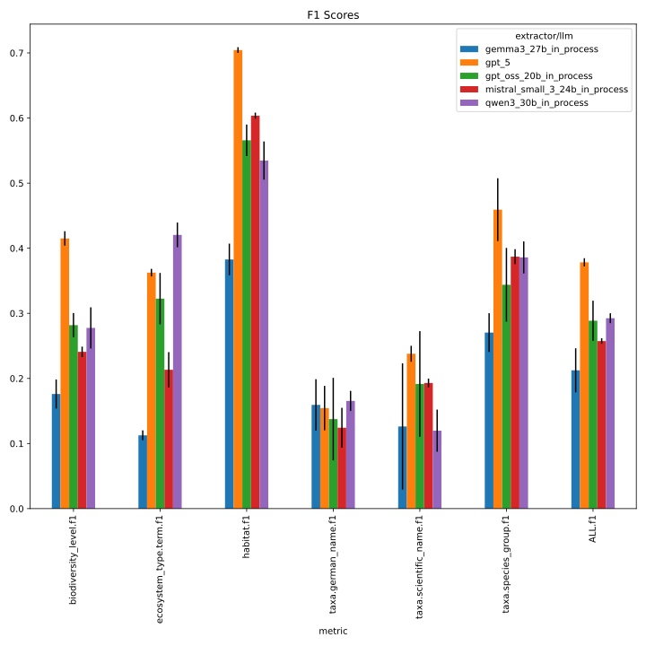
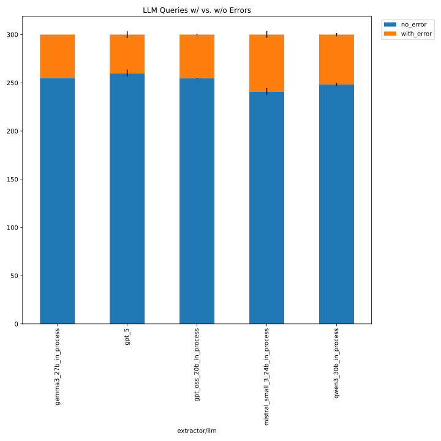
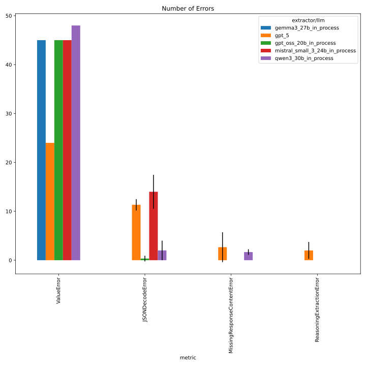
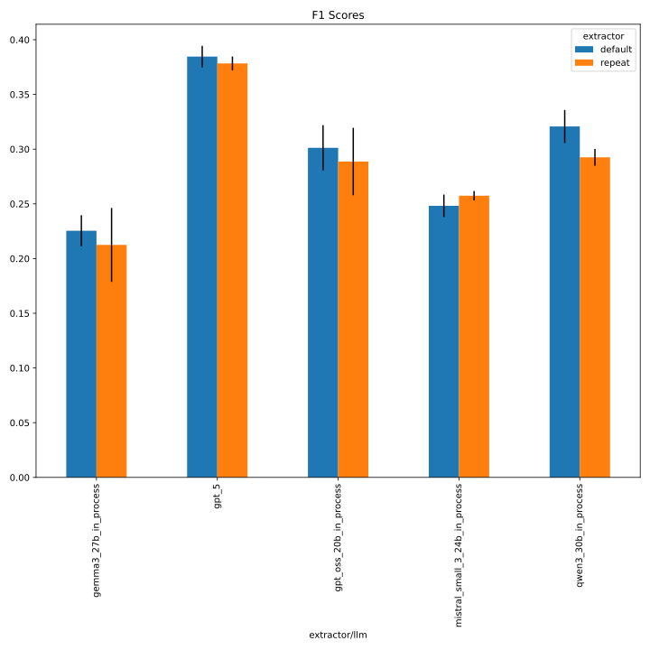
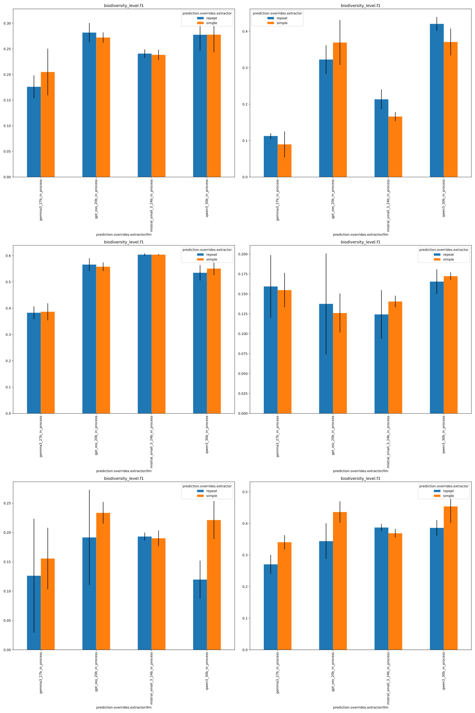
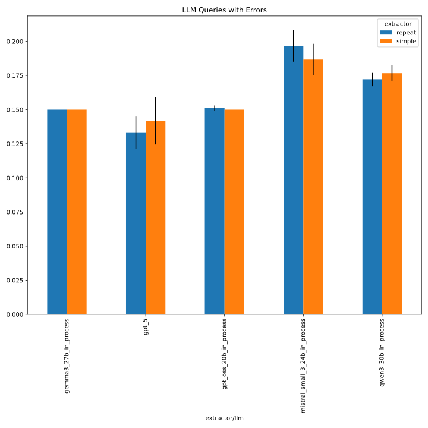
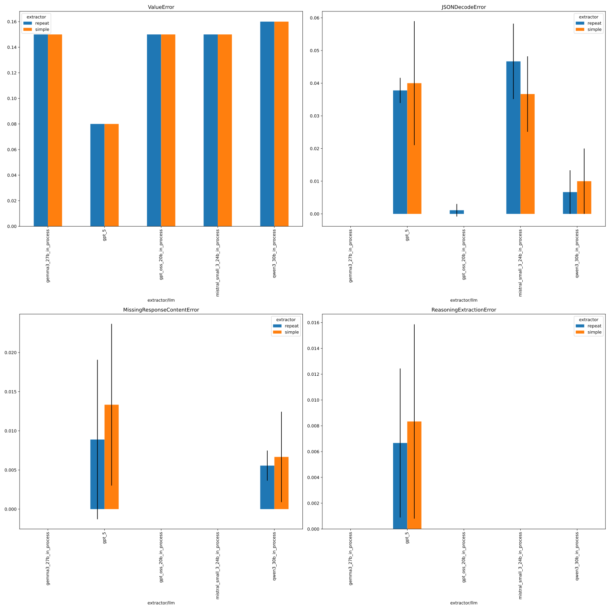

# 88_repeat_faktencheck_core

See #88 for details. Without gpt-5 since OpenAI budget is nearly reached.

## notebook parameters

### just this experiment

```python
NAME = "88_repeat_faktencheck_core"

# used to group the data
INDEX_COLUMNS = ["prediction.overrides.extractor/llm"]
PLOT_KWARGS = {
    # can be either "metric" or one of the INDEX_COLUMNS (or multiple of them)
    "xgroup": "prediction.overrides.extractor/llm",
    # add any more arguments passed to pd.DataFrame.plot
}
```





## comparison with baseline (327_faktencheck_core_with_persona)
```python
NAME = "88_repeat_faktencheck_core"

SUBDIR = ["evaluate", "../327_faktencheck_core_with_persona/evaluate"]

# used to group the data
INDEX_COLUMNS = ["prediction.overrides.extractor/llm", "prediction.overrides.extractor"]
PLOT_KWARGS = {
    # can be either "metric" or one of the INDEX_COLUMNS (or multiple of them)
    "xgroup": "prediction.overrides.extractor",
    "create_subplot_for_each": "metric",
    # add any more arguments passed to pd.DataFrame.plot
    "subplot_columns": 2,
}
```






## inference
 - based on command from [here](https://github.com/DFKI-NLP/kibad-llm/issues/311#issuecomment-3790517808)
 - use `name=88_repeat_faktencheck_core`
 - set `extractor=repeat`
 - with `extractor.return_reasoning=true`
 - **without Nemotron** (since it performed worse than other models, see #311), but **with gpt5**
```
./run_in_process.sh -pa "H100-SLT,H100-Trails,H100,A100-80GB" \
-u "-m kibad_llm.predict \
name=88_repeat_faktencheck_core \
experiment/predict=faktencheck_core_fields_schema_with_evidence \
extractor=repeat \
pdf_directory=/ds/text/kiba-d/dev-set-100 \
extractor.return_reasoning=true \
extractor/llm=gpt_oss_20b_in_process,gemma3_27b_in_process,qwen3_30b_in_process,mistral_small_3_24b_in_process,gpt_5 \
seed=42,1337,7331 \
--multirun"
```

WIP (@ `screen -r kibad-llm`)
srun: job 2493510 queued and waiting for resources
time stamp: `2026-01-28_22-20-19`

terminated because of time limit

error: *** STEP 2493510.0 ON serv-3310 CANCELLED AT 2026-01-29T22:20:24 DUE TO TIME LIMIT ***
srun: Job step aborted: Waiting up to 32 seconds for job step to finish.
srun: error: serv-3310: task 0: Terminated

finished for llms: 'gpt_oss_20b_in_process', 'mistral_small_3_24b_in_process', 'gemma3_27b_in_process', 'qwen3_30b_in_process'
however, don't re-do for `llm=gpt_5` because of OpenAI budget limit is nearly reached

## evaluate

- compare with results from [here](https://github.com/DFKI-NLP/kibad-llm/tree/main/data/prediction_results/logs/327_faktencheck_core_with_persona)

### f1

```
uv run -m kibad_llm.evaluate \
name=88_repeat_faktencheck_core  \
experiment/evaluate=faktencheck_core_f1_micro_flat \
prediction_logs=logs/88_repeat_faktencheck_core/predict \
+hydra.callbacks.save_job_return.multirun_markdown_group_by=prediction.overrides.extractor/llm \
--multirun
```

[2026-01-30 17:30:28,773][HYDRA] Contents of /netscratch/binder/projects/kibad-llm/logs/88_repeat_faktencheck_core/evaluate/multiruns/2026-01-30_17-30-23/job_return_value.md:

<details>
<summary>click to see result</summary>

| prediction.overrides.extractor/llm   |   ALL.f1.mean |   ALL.f1.std |   ALL.precision.mean |   ALL.precision.std |   ALL.recall.mean |   ALL.recall.std |   ALL.support.mean |   ALL.support.std |   AVG.f1.mean |   AVG.f1.std |   AVG.precision.mean |   AVG.precision.std |   AVG.recall.mean |   AVG.recall.std |   AVG.support.mean |   AVG.support.std |   biodiversity_level.f1.mean |   biodiversity_level.f1.std |   biodiversity_level.precision.mean |   biodiversity_level.precision.std |   biodiversity_level.recall.mean |   biodiversity_level.recall.std |   biodiversity_level.support.mean |   biodiversity_level.support.std |   ecosystem_type.term.f1.mean |   ecosystem_type.term.f1.std |   ecosystem_type.term.precision.mean |   ecosystem_type.term.precision.std |   ecosystem_type.term.recall.mean |   ecosystem_type.term.recall.std |   ecosystem_type.term.support.mean |   ecosystem_type.term.support.std |   habitat.f1.mean |   habitat.f1.std |   habitat.precision.mean |   habitat.precision.std |   habitat.recall.mean |   habitat.recall.std |   habitat.support.mean |   habitat.support.std |   prediction.job_return_value.time_extraction.mean |   prediction.job_return_value.time_extraction.std |   prediction.job_return_value.time_pdf_conversion.mean |   prediction.job_return_value.time_pdf_conversion.std |   taxa.german_name.f1.mean |   taxa.german_name.f1.std |   taxa.german_name.precision.mean |   taxa.german_name.precision.std |   taxa.german_name.recall.mean |   taxa.german_name.recall.std |   taxa.german_name.support.mean |   taxa.german_name.support.std |   taxa.scientific_name.f1.mean |   taxa.scientific_name.f1.std |   taxa.scientific_name.precision.mean |   taxa.scientific_name.precision.std |   taxa.scientific_name.recall.mean |   taxa.scientific_name.recall.std |   taxa.scientific_name.support.mean |   taxa.scientific_name.support.std |   taxa.species_group.f1.mean |   taxa.species_group.f1.std |   taxa.species_group.precision.mean |   taxa.species_group.precision.std |   taxa.species_group.recall.mean |   taxa.species_group.recall.std |   taxa.species_group.support.mean |   taxa.species_group.support.std | overrides.dataset.predictions.log                                                                                                                                                                                                   | overrides.experiment/evaluate                                                                          | overrides.name                                                                             | overrides.prediction_logs                                                                                                         | prediction.job_return_value.branch   | prediction.job_return_value.commit_hash                                                                                              | prediction.job_return_value.is_dirty   | prediction.job_return_value.output_file                                                                                                                                                                                                                                                                                           | prediction.job_return_value.output_file_absolute                                                                                                                                                                                                                                                                                                                                                                                                    | prediction.overrides.experiment/predict                                                                                                          | prediction.overrides.extractor   | prediction.overrides.extractor.return_reasoning   | prediction.overrides.name                                                                  | prediction.overrides.pdf_directory                                                            | prediction.overrides.seed   |
|:-------------------------------------|--------------:|-------------:|---------------------:|--------------------:|------------------:|-----------------:|-------------------:|------------------:|--------------:|-------------:|---------------------:|--------------------:|------------------:|-----------------:|-------------------:|------------------:|-----------------------------:|----------------------------:|------------------------------------:|-----------------------------------:|---------------------------------:|--------------------------------:|----------------------------------:|---------------------------------:|------------------------------:|-----------------------------:|-------------------------------------:|------------------------------------:|----------------------------------:|---------------------------------:|-----------------------------------:|----------------------------------:|------------------:|-----------------:|-------------------------:|------------------------:|----------------------:|---------------------:|-----------------------:|----------------------:|---------------------------------------------------:|--------------------------------------------------:|-------------------------------------------------------:|------------------------------------------------------:|---------------------------:|--------------------------:|----------------------------------:|---------------------------------:|-------------------------------:|------------------------------:|--------------------------------:|-------------------------------:|-------------------------------:|------------------------------:|--------------------------------------:|-------------------------------------:|-----------------------------------:|----------------------------------:|------------------------------------:|-----------------------------------:|-----------------------------:|----------------------------:|------------------------------------:|-----------------------------------:|---------------------------------:|--------------------------------:|----------------------------------:|---------------------------------:|:------------------------------------------------------------------------------------------------------------------------------------------------------------------------------------------------------------------------------------|:-------------------------------------------------------------------------------------------------------|:-------------------------------------------------------------------------------------------|:----------------------------------------------------------------------------------------------------------------------------------|:-------------------------------------|:-------------------------------------------------------------------------------------------------------------------------------------|:---------------------------------------|:----------------------------------------------------------------------------------------------------------------------------------------------------------------------------------------------------------------------------------------------------------------------------------------------------------------------------------|:----------------------------------------------------------------------------------------------------------------------------------------------------------------------------------------------------------------------------------------------------------------------------------------------------------------------------------------------------------------------------------------------------------------------------------------------------|:-------------------------------------------------------------------------------------------------------------------------------------------------|:---------------------------------|:--------------------------------------------------|:-------------------------------------------------------------------------------------------|:----------------------------------------------------------------------------------------------|:----------------------------|
| gemma3_27b_in_process                |         0.212 |        0.034 |                0.361 |               0.046 |             0.151 |            0.026 |                792 |                 0 |         0.205 |        0.024 |                0.338 |               0.046 |             0.158 |            0.019 |                132 |                 0 |                        0.176 |                       0.022 |                               0.19  |                              0.019 |                            0.164 |                           0.026 |                                67 |                                0 |                         0.113 |                        0.008 |                                0.158 |                               0.008 |                             0.088 |                            0.011 |                                 53 |                                 0 |             0.383 |            0.024 |                    0.46  |                   0.022 |                 0.329 |                0.029 |                    138 |                     0 |                                            2033.62 |                                            64.202 |                                                  0.003 |                                                 0     |                      0.159 |                     0.039 |                             0.455 |                            0.081 |                          0.097 |                         0.025 |                             231 |                              0 |                          0.126 |                         0.097 |                                 0.307 |                                0.232 |                              0.08  |                             0.061 |                                 197 |                                  0 |                        0.27  |                       0.03  |                               0.459 |                              0.049 |                            0.192 |                           0.022 |                               106 |                                0 | ['logs/88_repeat_faktencheck_core/predict/multiruns/2026-01-28_22-20-19/3', 'logs/88_repeat_faktencheck_core/predict/multiruns/2026-01-28_22-20-19/4', 'logs/88_repeat_faktencheck_core/predict/multiruns/2026-01-28_22-20-19/5']   | ['faktencheck_core_f1_micro_flat', 'faktencheck_core_f1_micro_flat', 'faktencheck_core_f1_micro_flat'] | ['88_repeat_faktencheck_core', '88_repeat_faktencheck_core', '88_repeat_faktencheck_core'] | ['logs/88_repeat_faktencheck_core/predict', 'logs/88_repeat_faktencheck_core/predict', 'logs/88_repeat_faktencheck_core/predict'] | ['main', 'main', 'main']             | ['c5b7387b495e7871fc5b3e3abec22a61dfd9bd74', 'c5b7387b495e7871fc5b3e3abec22a61dfd9bd74', 'c5b7387b495e7871fc5b3e3abec22a61dfd9bd74'] | [np.False_, np.False_, np.False_]      | ['predictions/88_repeat_faktencheck_core/2026-01-28_22-20-19/2026-01-29_01-44-24_127533/predictions.jsonl', 'predictions/88_repeat_faktencheck_core/2026-01-28_22-20-19/2026-01-29_02-18-54_731254/predictions.jsonl', 'predictions/88_repeat_faktencheck_core/2026-01-28_22-20-19/2026-01-29_02-54-06_866742/predictions.jsonl'] | ['/netscratch/binder/projects/kibad-llm/predictions/88_repeat_faktencheck_core/2026-01-28_22-20-19/2026-01-29_01-44-24_127533/predictions.jsonl', '/netscratch/binder/projects/kibad-llm/predictions/88_repeat_faktencheck_core/2026-01-28_22-20-19/2026-01-29_02-18-54_731254/predictions.jsonl', '/netscratch/binder/projects/kibad-llm/predictions/88_repeat_faktencheck_core/2026-01-28_22-20-19/2026-01-29_02-54-06_866742/predictions.jsonl'] | ['faktencheck_core_fields_schema_with_evidence', 'faktencheck_core_fields_schema_with_evidence', 'faktencheck_core_fields_schema_with_evidence'] | ['repeat', 'repeat', 'repeat']   | ['True', 'True', 'True']                          | ['88_repeat_faktencheck_core', '88_repeat_faktencheck_core', '88_repeat_faktencheck_core'] | ['/ds/text/kiba-d/dev-set-100', '/ds/text/kiba-d/dev-set-100', '/ds/text/kiba-d/dev-set-100'] | ['42', '1337', '7331']      |
| gpt_oss_20b_in_process               |         0.289 |        0.031 |                0.404 |               0.052 |             0.225 |            0.025 |                792 |                 0 |         0.307 |        0.02  |                0.402 |               0.031 |             0.258 |            0.015 |                132 |                 0 |                        0.282 |                       0.019 |                               0.291 |                              0.015 |                            0.274 |                           0.023 |                                67 |                                0 |                         0.323 |                        0.039 |                                0.355 |                               0.054 |                             0.296 |                            0.029 |                                 53 |                                 0 |             0.566 |            0.024 |                    0.693 |                   0.033 |                 0.478 |                0.019 |                    138 |                     0 |                                            4005.85 |                                            78.102 |                                                  0.003 |                                                 0     |                      0.138 |                     0.063 |                             0.286 |                            0.104 |                          0.092 |                         0.046 |                             231 |                              0 |                          0.192 |                         0.081 |                                 0.266 |                                0.122 |                              0.151 |                             0.061 |                                 197 |                                  0 |                        0.344 |                       0.057 |                               0.519 |                              0.046 |                            0.258 |                           0.052 |                               106 |                                0 | ['logs/88_repeat_faktencheck_core/predict/multiruns/2026-01-28_22-20-19/0', 'logs/88_repeat_faktencheck_core/predict/multiruns/2026-01-28_22-20-19/1', 'logs/88_repeat_faktencheck_core/predict/multiruns/2026-01-28_22-20-19/2']   | ['faktencheck_core_f1_micro_flat', 'faktencheck_core_f1_micro_flat', 'faktencheck_core_f1_micro_flat'] | ['88_repeat_faktencheck_core', '88_repeat_faktencheck_core', '88_repeat_faktencheck_core'] | ['logs/88_repeat_faktencheck_core/predict', 'logs/88_repeat_faktencheck_core/predict', 'logs/88_repeat_faktencheck_core/predict'] | ['main', 'main', 'main']             | ['c5b7387b495e7871fc5b3e3abec22a61dfd9bd74', 'c5b7387b495e7871fc5b3e3abec22a61dfd9bd74', 'c5b7387b495e7871fc5b3e3abec22a61dfd9bd74'] | [np.False_, np.False_, np.False_]      | ['predictions/88_repeat_faktencheck_core/2026-01-28_22-20-19/2026-01-28_22-20-21_613056/predictions.jsonl', 'predictions/88_repeat_faktencheck_core/2026-01-28_22-20-19/2026-01-28_23-28-16_982662/predictions.jsonl', 'predictions/88_repeat_faktencheck_core/2026-01-28_22-20-19/2026-01-29_00-37-20_663966/predictions.jsonl'] | ['/netscratch/binder/projects/kibad-llm/predictions/88_repeat_faktencheck_core/2026-01-28_22-20-19/2026-01-28_22-20-21_613056/predictions.jsonl', '/netscratch/binder/projects/kibad-llm/predictions/88_repeat_faktencheck_core/2026-01-28_22-20-19/2026-01-28_23-28-16_982662/predictions.jsonl', '/netscratch/binder/projects/kibad-llm/predictions/88_repeat_faktencheck_core/2026-01-28_22-20-19/2026-01-29_00-37-20_663966/predictions.jsonl'] | ['faktencheck_core_fields_schema_with_evidence', 'faktencheck_core_fields_schema_with_evidence', 'faktencheck_core_fields_schema_with_evidence'] | ['repeat', 'repeat', 'repeat']   | ['True', 'True', 'True']                          | ['88_repeat_faktencheck_core', '88_repeat_faktencheck_core', '88_repeat_faktencheck_core'] | ['/ds/text/kiba-d/dev-set-100', '/ds/text/kiba-d/dev-set-100', '/ds/text/kiba-d/dev-set-100'] | ['42', '1337', '7331']      |
| mistral_small_3_24b_in_process       |         0.257 |        0.004 |                0.235 |               0.004 |             0.284 |            0.006 |                792 |                 0 |         0.294 |        0.004 |                0.302 |               0.004 |             0.324 |            0.006 |                132 |                 0 |                        0.241 |                       0.008 |                               0.204 |                              0.008 |                            0.294 |                           0.009 |                                67 |                                0 |                         0.213 |                        0.027 |                                0.144 |                               0.022 |                             0.415 |                            0.019 |                                 53 |                                 0 |             0.604 |            0.005 |                    0.798 |                   0.017 |                 0.486 |                0     |                    138 |                     0 |                                            6835.16 |                                           703.144 |                                                  0.003 |                                                 0.001 |                      0.124 |                     0.031 |                             0.12  |                            0.029 |                          0.128 |                         0.032 |                             231 |                              0 |                          0.193 |                         0.007 |                                 0.169 |                                0.007 |                              0.225 |                             0.011 |                                 197 |                                  0 |                        0.387 |                       0.012 |                               0.376 |                              0.006 |                            0.399 |                           0.022 |                               106 |                                0 | ['logs/88_repeat_faktencheck_core/predict/multiruns/2026-01-28_22-20-19/10', 'logs/88_repeat_faktencheck_core/predict/multiruns/2026-01-28_22-20-19/11', 'logs/88_repeat_faktencheck_core/predict/multiruns/2026-01-28_22-20-19/9'] | ['faktencheck_core_f1_micro_flat', 'faktencheck_core_f1_micro_flat', 'faktencheck_core_f1_micro_flat'] | ['88_repeat_faktencheck_core', '88_repeat_faktencheck_core', '88_repeat_faktencheck_core'] | ['logs/88_repeat_faktencheck_core/predict', 'logs/88_repeat_faktencheck_core/predict', 'logs/88_repeat_faktencheck_core/predict'] | ['main', 'main', 'main']             | ['c5b7387b495e7871fc5b3e3abec22a61dfd9bd74', 'c5b7387b495e7871fc5b3e3abec22a61dfd9bd74', 'c5b7387b495e7871fc5b3e3abec22a61dfd9bd74'] | [np.False_, np.False_, np.False_]      | ['predictions/88_repeat_faktencheck_core/2026-01-28_22-20-19/2026-01-29_11-29-31_787600/predictions.jsonl', 'predictions/88_repeat_faktencheck_core/2026-01-28_22-20-19/2026-01-29_13-11-18_096920/predictions.jsonl', 'predictions/88_repeat_faktencheck_core/2026-01-28_22-20-19/2026-01-29_09-25-26_568851/predictions.jsonl'] | ['/netscratch/binder/projects/kibad-llm/predictions/88_repeat_faktencheck_core/2026-01-28_22-20-19/2026-01-29_11-29-31_787600/predictions.jsonl', '/netscratch/binder/projects/kibad-llm/predictions/88_repeat_faktencheck_core/2026-01-28_22-20-19/2026-01-29_13-11-18_096920/predictions.jsonl', '/netscratch/binder/projects/kibad-llm/predictions/88_repeat_faktencheck_core/2026-01-28_22-20-19/2026-01-29_09-25-26_568851/predictions.jsonl'] | ['faktencheck_core_fields_schema_with_evidence', 'faktencheck_core_fields_schema_with_evidence', 'faktencheck_core_fields_schema_with_evidence'] | ['repeat', 'repeat', 'repeat']   | ['True', 'True', 'True']                          | ['88_repeat_faktencheck_core', '88_repeat_faktencheck_core', '88_repeat_faktencheck_core'] | ['/ds/text/kiba-d/dev-set-100', '/ds/text/kiba-d/dev-set-100', '/ds/text/kiba-d/dev-set-100'] | ['1337', '7331', '42']      |
| qwen3_30b_in_process                 |         0.293 |        0.008 |                0.47  |               0.02  |             0.213 |            0.01  |                792 |                 0 |         0.317 |        0.01  |                0.477 |               0.028 |             0.273 |            0.015 |                132 |                 0 |                        0.278 |                       0.032 |                               0.282 |                              0.03  |                            0.274 |                           0.034 |                                67 |                                0 |                         0.421 |                        0.019 |                                0.36  |                               0.021 |                             0.509 |                            0.05  |                                 53 |                                 0 |             0.535 |            0.029 |                    0.784 |                   0.018 |                 0.406 |                0.029 |                    138 |                     0 |                                            7041.96 |                                           137.505 |                                                  0.003 |                                                 0.001 |                      0.165 |                     0.015 |                             0.493 |                            0.093 |                          0.1   |                         0.007 |                             231 |                              0 |                          0.12  |                         0.032 |                                 0.265 |                                0.03  |                              0.078 |                             0.025 |                                 197 |                                  0 |                        0.386 |                       0.025 |                               0.677 |                              0.084 |                            0.27  |                           0.014 |                               106 |                                0 | ['logs/88_repeat_faktencheck_core/predict/multiruns/2026-01-28_22-20-19/6', 'logs/88_repeat_faktencheck_core/predict/multiruns/2026-01-28_22-20-19/7', 'logs/88_repeat_faktencheck_core/predict/multiruns/2026-01-28_22-20-19/8']   | ['faktencheck_core_f1_micro_flat', 'faktencheck_core_f1_micro_flat', 'faktencheck_core_f1_micro_flat'] | ['88_repeat_faktencheck_core', '88_repeat_faktencheck_core', '88_repeat_faktencheck_core'] | ['logs/88_repeat_faktencheck_core/predict', 'logs/88_repeat_faktencheck_core/predict', 'logs/88_repeat_faktencheck_core/predict'] | ['main', 'main', 'main']             | ['c5b7387b495e7871fc5b3e3abec22a61dfd9bd74', 'c5b7387b495e7871fc5b3e3abec22a61dfd9bd74', 'c5b7387b495e7871fc5b3e3abec22a61dfd9bd74'] | [np.False_, np.False_, np.False_]      | ['predictions/88_repeat_faktencheck_core/2026-01-28_22-20-19/2026-01-29_03-30-31_687437/predictions.jsonl', 'predictions/88_repeat_faktencheck_core/2026-01-28_22-20-19/2026-01-29_05-26-24_925826/predictions.jsonl', 'predictions/88_repeat_faktencheck_core/2026-01-28_22-20-19/2026-01-29_07-26-48_906414/predictions.jsonl'] | ['/netscratch/binder/projects/kibad-llm/predictions/88_repeat_faktencheck_core/2026-01-28_22-20-19/2026-01-29_03-30-31_687437/predictions.jsonl', '/netscratch/binder/projects/kibad-llm/predictions/88_repeat_faktencheck_core/2026-01-28_22-20-19/2026-01-29_05-26-24_925826/predictions.jsonl', '/netscratch/binder/projects/kibad-llm/predictions/88_repeat_faktencheck_core/2026-01-28_22-20-19/2026-01-29_07-26-48_906414/predictions.jsonl'] | ['faktencheck_core_fields_schema_with_evidence', 'faktencheck_core_fields_schema_with_evidence', 'faktencheck_core_fields_schema_with_evidence'] | ['repeat', 'repeat', 'repeat']   | ['True', 'True', 'True']                          | ['88_repeat_faktencheck_core', '88_repeat_faktencheck_core', '88_repeat_faktencheck_core'] | ['/ds/text/kiba-d/dev-set-100', '/ds/text/kiba-d/dev-set-100', '/ds/text/kiba-d/dev-set-100'] | ['42', '1337', '7331']      |

</details>

### errors
```
uv run -m kibad_llm.evaluate \
name=88_repeat_faktencheck_core \
experiment/evaluate=prediction_errors \
prediction_logs=logs/88_repeat_faktencheck_core/predict \
+hydra.callbacks.save_job_return.multirun_markdown_group_by=prediction.overrides.extractor/llm \
--multirun
```

[2026-01-30 17:31:55,035][HYDRA] Contents of /netscratch/binder/projects/kibad-llm/logs/88_repeat_faktencheck_core/evaluate/multiruns/2026-01-30_17-31-50/job_return_value.md:

<details>
<summary>click to see result</summary>

| prediction.overrides.extractor/llm   |   JSONDecodeError.mean |   JSONDecodeError.std |   MissingResponseContentError.mean |   MissingResponseContentError.std |   ValueError.mean |   ValueError.std |   no_error.mean |   no_error.std |   prediction.job_return_value.time_extraction.mean |   prediction.job_return_value.time_extraction.std |   prediction.job_return_value.time_pdf_conversion.mean |   prediction.job_return_value.time_pdf_conversion.std |   with_error.mean |   with_error.std | overrides.dataset.predictions.log                                                                                                                                                                                                   | overrides.experiment/evaluate                                   | overrides.name                                                                             | overrides.prediction_logs                                                                                                         | prediction.job_return_value.branch   | prediction.job_return_value.commit_hash                                                                                              | prediction.job_return_value.is_dirty   | prediction.job_return_value.output_file                                                                                                                                                                                                                                                                                           | prediction.job_return_value.output_file_absolute                                                                                                                                                                                                                                                                                                                                                                                                    | prediction.overrides.experiment/predict                                                                                                          | prediction.overrides.extractor   | prediction.overrides.extractor.return_reasoning   | prediction.overrides.name                                                                  | prediction.overrides.pdf_directory                                                            | prediction.overrides.seed   |
|:-------------------------------------|-----------------------:|----------------------:|-----------------------------------:|----------------------------------:|------------------:|-----------------:|----------------:|---------------:|---------------------------------------------------:|--------------------------------------------------:|-------------------------------------------------------:|------------------------------------------------------:|------------------:|-----------------:|:------------------------------------------------------------------------------------------------------------------------------------------------------------------------------------------------------------------------------------|:----------------------------------------------------------------|:-------------------------------------------------------------------------------------------|:----------------------------------------------------------------------------------------------------------------------------------|:-------------------------------------|:-------------------------------------------------------------------------------------------------------------------------------------|:---------------------------------------|:----------------------------------------------------------------------------------------------------------------------------------------------------------------------------------------------------------------------------------------------------------------------------------------------------------------------------------|:----------------------------------------------------------------------------------------------------------------------------------------------------------------------------------------------------------------------------------------------------------------------------------------------------------------------------------------------------------------------------------------------------------------------------------------------------|:-------------------------------------------------------------------------------------------------------------------------------------------------|:---------------------------------|:--------------------------------------------------|:-------------------------------------------------------------------------------------------|:----------------------------------------------------------------------------------------------|:----------------------------|
| gemma3_27b_in_process                |                      0 |                 0     |                              0     |                             0     |                45 |                0 |         255     |          0     |                                            2033.62 |                                            64.202 |                                                  0.003 |                                                 0     |            45     |            0     | ['logs/88_repeat_faktencheck_core/predict/multiruns/2026-01-28_22-20-19/3', 'logs/88_repeat_faktencheck_core/predict/multiruns/2026-01-28_22-20-19/4', 'logs/88_repeat_faktencheck_core/predict/multiruns/2026-01-28_22-20-19/5']   | ['prediction_errors', 'prediction_errors', 'prediction_errors'] | ['88_repeat_faktencheck_core', '88_repeat_faktencheck_core', '88_repeat_faktencheck_core'] | ['logs/88_repeat_faktencheck_core/predict', 'logs/88_repeat_faktencheck_core/predict', 'logs/88_repeat_faktencheck_core/predict'] | ['main', 'main', 'main']             | ['c5b7387b495e7871fc5b3e3abec22a61dfd9bd74', 'c5b7387b495e7871fc5b3e3abec22a61dfd9bd74', 'c5b7387b495e7871fc5b3e3abec22a61dfd9bd74'] | [np.False_, np.False_, np.False_]      | ['predictions/88_repeat_faktencheck_core/2026-01-28_22-20-19/2026-01-29_01-44-24_127533/predictions.jsonl', 'predictions/88_repeat_faktencheck_core/2026-01-28_22-20-19/2026-01-29_02-18-54_731254/predictions.jsonl', 'predictions/88_repeat_faktencheck_core/2026-01-28_22-20-19/2026-01-29_02-54-06_866742/predictions.jsonl'] | ['/netscratch/binder/projects/kibad-llm/predictions/88_repeat_faktencheck_core/2026-01-28_22-20-19/2026-01-29_01-44-24_127533/predictions.jsonl', '/netscratch/binder/projects/kibad-llm/predictions/88_repeat_faktencheck_core/2026-01-28_22-20-19/2026-01-29_02-18-54_731254/predictions.jsonl', '/netscratch/binder/projects/kibad-llm/predictions/88_repeat_faktencheck_core/2026-01-28_22-20-19/2026-01-29_02-54-06_866742/predictions.jsonl'] | ['faktencheck_core_fields_schema_with_evidence', 'faktencheck_core_fields_schema_with_evidence', 'faktencheck_core_fields_schema_with_evidence'] | ['repeat', 'repeat', 'repeat']   | ['True', 'True', 'True']                          | ['88_repeat_faktencheck_core', '88_repeat_faktencheck_core', '88_repeat_faktencheck_core'] | ['/ds/text/kiba-d/dev-set-100', '/ds/text/kiba-d/dev-set-100', '/ds/text/kiba-d/dev-set-100'] | ['42', '1337', '7331']      |
| gpt_oss_20b_in_process               |                      1 |                 0     |                              0     |                             0     |                45 |                0 |         254.667 |          0.577 |                                            4005.85 |                                            78.102 |                                                  0.003 |                                                 0     |            45.333 |            0.577 | ['logs/88_repeat_faktencheck_core/predict/multiruns/2026-01-28_22-20-19/0', 'logs/88_repeat_faktencheck_core/predict/multiruns/2026-01-28_22-20-19/1', 'logs/88_repeat_faktencheck_core/predict/multiruns/2026-01-28_22-20-19/2']   | ['prediction_errors', 'prediction_errors', 'prediction_errors'] | ['88_repeat_faktencheck_core', '88_repeat_faktencheck_core', '88_repeat_faktencheck_core'] | ['logs/88_repeat_faktencheck_core/predict', 'logs/88_repeat_faktencheck_core/predict', 'logs/88_repeat_faktencheck_core/predict'] | ['main', 'main', 'main']             | ['c5b7387b495e7871fc5b3e3abec22a61dfd9bd74', 'c5b7387b495e7871fc5b3e3abec22a61dfd9bd74', 'c5b7387b495e7871fc5b3e3abec22a61dfd9bd74'] | [np.False_, np.False_, np.False_]      | ['predictions/88_repeat_faktencheck_core/2026-01-28_22-20-19/2026-01-28_22-20-21_613056/predictions.jsonl', 'predictions/88_repeat_faktencheck_core/2026-01-28_22-20-19/2026-01-28_23-28-16_982662/predictions.jsonl', 'predictions/88_repeat_faktencheck_core/2026-01-28_22-20-19/2026-01-29_00-37-20_663966/predictions.jsonl'] | ['/netscratch/binder/projects/kibad-llm/predictions/88_repeat_faktencheck_core/2026-01-28_22-20-19/2026-01-28_22-20-21_613056/predictions.jsonl', '/netscratch/binder/projects/kibad-llm/predictions/88_repeat_faktencheck_core/2026-01-28_22-20-19/2026-01-28_23-28-16_982662/predictions.jsonl', '/netscratch/binder/projects/kibad-llm/predictions/88_repeat_faktencheck_core/2026-01-28_22-20-19/2026-01-29_00-37-20_663966/predictions.jsonl'] | ['faktencheck_core_fields_schema_with_evidence', 'faktencheck_core_fields_schema_with_evidence', 'faktencheck_core_fields_schema_with_evidence'] | ['repeat', 'repeat', 'repeat']   | ['True', 'True', 'True']                          | ['88_repeat_faktencheck_core', '88_repeat_faktencheck_core', '88_repeat_faktencheck_core'] | ['/ds/text/kiba-d/dev-set-100', '/ds/text/kiba-d/dev-set-100', '/ds/text/kiba-d/dev-set-100'] | ['42', '1337', '7331']      |
| mistral_small_3_24b_in_process       |                     14 |                 3.464 |                              0     |                             0     |                45 |                0 |         241     |          3.464 |                                            6835.16 |                                           703.144 |                                                  0.003 |                                                 0.001 |            59     |            3.464 | ['logs/88_repeat_faktencheck_core/predict/multiruns/2026-01-28_22-20-19/10', 'logs/88_repeat_faktencheck_core/predict/multiruns/2026-01-28_22-20-19/11', 'logs/88_repeat_faktencheck_core/predict/multiruns/2026-01-28_22-20-19/9'] | ['prediction_errors', 'prediction_errors', 'prediction_errors'] | ['88_repeat_faktencheck_core', '88_repeat_faktencheck_core', '88_repeat_faktencheck_core'] | ['logs/88_repeat_faktencheck_core/predict', 'logs/88_repeat_faktencheck_core/predict', 'logs/88_repeat_faktencheck_core/predict'] | ['main', 'main', 'main']             | ['c5b7387b495e7871fc5b3e3abec22a61dfd9bd74', 'c5b7387b495e7871fc5b3e3abec22a61dfd9bd74', 'c5b7387b495e7871fc5b3e3abec22a61dfd9bd74'] | [np.False_, np.False_, np.False_]      | ['predictions/88_repeat_faktencheck_core/2026-01-28_22-20-19/2026-01-29_11-29-31_787600/predictions.jsonl', 'predictions/88_repeat_faktencheck_core/2026-01-28_22-20-19/2026-01-29_13-11-18_096920/predictions.jsonl', 'predictions/88_repeat_faktencheck_core/2026-01-28_22-20-19/2026-01-29_09-25-26_568851/predictions.jsonl'] | ['/netscratch/binder/projects/kibad-llm/predictions/88_repeat_faktencheck_core/2026-01-28_22-20-19/2026-01-29_11-29-31_787600/predictions.jsonl', '/netscratch/binder/projects/kibad-llm/predictions/88_repeat_faktencheck_core/2026-01-28_22-20-19/2026-01-29_13-11-18_096920/predictions.jsonl', '/netscratch/binder/projects/kibad-llm/predictions/88_repeat_faktencheck_core/2026-01-28_22-20-19/2026-01-29_09-25-26_568851/predictions.jsonl'] | ['faktencheck_core_fields_schema_with_evidence', 'faktencheck_core_fields_schema_with_evidence', 'faktencheck_core_fields_schema_with_evidence'] | ['repeat', 'repeat', 'repeat']   | ['True', 'True', 'True']                          | ['88_repeat_faktencheck_core', '88_repeat_faktencheck_core', '88_repeat_faktencheck_core'] | ['/ds/text/kiba-d/dev-set-100', '/ds/text/kiba-d/dev-set-100', '/ds/text/kiba-d/dev-set-100'] | ['1337', '7331', '42']      |
| qwen3_30b_in_process                 |                      3 |                 1.414 |                              1.667 |                             0.577 |                48 |                0 |         248.333 |          1.528 |                                            7041.96 |                                           137.505 |                                                  0.003 |                                                 0.001 |            51.667 |            1.528 | ['logs/88_repeat_faktencheck_core/predict/multiruns/2026-01-28_22-20-19/6', 'logs/88_repeat_faktencheck_core/predict/multiruns/2026-01-28_22-20-19/7', 'logs/88_repeat_faktencheck_core/predict/multiruns/2026-01-28_22-20-19/8']   | ['prediction_errors', 'prediction_errors', 'prediction_errors'] | ['88_repeat_faktencheck_core', '88_repeat_faktencheck_core', '88_repeat_faktencheck_core'] | ['logs/88_repeat_faktencheck_core/predict', 'logs/88_repeat_faktencheck_core/predict', 'logs/88_repeat_faktencheck_core/predict'] | ['main', 'main', 'main']             | ['c5b7387b495e7871fc5b3e3abec22a61dfd9bd74', 'c5b7387b495e7871fc5b3e3abec22a61dfd9bd74', 'c5b7387b495e7871fc5b3e3abec22a61dfd9bd74'] | [np.False_, np.False_, np.False_]      | ['predictions/88_repeat_faktencheck_core/2026-01-28_22-20-19/2026-01-29_03-30-31_687437/predictions.jsonl', 'predictions/88_repeat_faktencheck_core/2026-01-28_22-20-19/2026-01-29_05-26-24_925826/predictions.jsonl', 'predictions/88_repeat_faktencheck_core/2026-01-28_22-20-19/2026-01-29_07-26-48_906414/predictions.jsonl'] | ['/netscratch/binder/projects/kibad-llm/predictions/88_repeat_faktencheck_core/2026-01-28_22-20-19/2026-01-29_03-30-31_687437/predictions.jsonl', '/netscratch/binder/projects/kibad-llm/predictions/88_repeat_faktencheck_core/2026-01-28_22-20-19/2026-01-29_05-26-24_925826/predictions.jsonl', '/netscratch/binder/projects/kibad-llm/predictions/88_repeat_faktencheck_core/2026-01-28_22-20-19/2026-01-29_07-26-48_906414/predictions.jsonl'] | ['faktencheck_core_fields_schema_with_evidence', 'faktencheck_core_fields_schema_with_evidence', 'faktencheck_core_fields_schema_with_evidence'] | ['repeat', 'repeat', 'repeat']   | ['True', 'True', 'True']                          | ['88_repeat_faktencheck_core', '88_repeat_faktencheck_core', '88_repeat_faktencheck_core'] | ['/ds/text/kiba-d/dev-set-100', '/ds/text/kiba-d/dev-set-100', '/ds/text/kiba-d/dev-set-100'] | ['42', '1337', '7331']      |

</details>