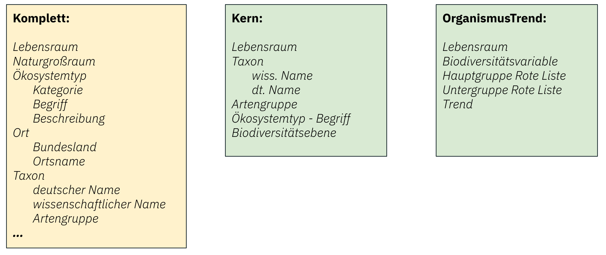

## 2.1. Implementierung

Die technische Umsetzung des in Teilleistung 2 konzipierten Proof-of-Concept-Workflows für ausgewählte Content-Extraktionsaufgaben erfolgt über das Python-basierte Framework `kibad-llm`. Die Codebasis ist modular aufgebaut und nutzt Hydra zur Konfigurations- und Experiment-Orchestrierung. Dadurch können unterschiedliche LLM-Backends, Extraktionsschemata, Promptvarianten, Datensätze und Evaluationskonfigurationen flexibel über Konfigurationsdateien wie `configs/predict.yaml` und `configs/evaluate.yaml` kombiniert werden, ohne dass der Kerncode angepasst werden muss. Die Qualitätssicherung der Implementierung wird durch automatisierte Tests mit `pytest` sowie lokale Qualitätsprüfungen über `pre-commit` unterstützt.

Kern der Umsetzung ist eine dokumentzentrierte Extraktionspipeline, die über den Einstiegspunkt `predict.py` ausgeführt wird. Die Verarbeitung erfolgt in Batchform über eine Hugging-Face-`datasets`-Pipeline und unterstützt – abhängig von der gewählten Konfiguration – auch parallele Verarbeitungsschritte, insbesondere bei der PDF-Konvertierung und Extraktion.

Abbildung "Eingabe-Processing-Ausgabe"

### 2.1.1. Vorverarbeitung und PDF-Konvertierung

Vor der eigentlichen Extraktion werden die Eingabe-PDFs in eine maschinenlesbare Textrepräsentation überführt. Standardmäßig nutzt das Modul `kibad_llm.preprocessing` hierfür `PyMuPDF4LLM`, um PDF-Dokumente in Markdown zu konvertieren. Diese Darstellung erhält wesentliche semantische und strukturelle Informationen des Dokuments, etwa Überschriften, Absätze oder Tabellen, und ist damit besser für die nachgelagerte Verarbeitung durch Sprachmodelle geeignet als reiner Fließtext.

Die Vorverarbeitungskomponente ist bewusst einfach gehalten und über Hydra austauschbar. Damit ist die Architektur offen für spätere Erweiterungen, beispielsweise um OCR-basierte Verarbeitung von Scan-PDFs oder um zusätzliche Konverter für andere Dokumentformate.

Abbildung "Pipeline - Teil 1 - Schemata und Vorverarbeitung"

### 2.1.2. Schema-Definition und dynamisches Prompting

Zur Abbildung der in Teilleistung 2 beschriebenen, unterschiedlich komplexen Informationsbedarfe werden die Zielstrukturen der Extraktion als Pydantic-Modelle in `src/kibad_llm/schema/types.py` definiert. Implementiert sind unter anderem Schemata für das Kernset an Faktencheck-Annotationen sowie für Organismentrends. Aus diesen Modellen werden JSON-Schemata erzeugt, die sowohl für die Strukturvorgabe an das Modell als auch für die nachgelagerte Validierung verwendet werden.

Abbildung "Schemata für unterschiedliche Informationsbedarfe"

Eine zentrale Rolle übernimmt dabei `src/kibad_llm/schema/utils.py`. Dieses Modul erzeugt aus den Schemadefinitionen eine textuelle Beschreibung des erwarteten Ausgabeformats, die in die Prompts eingebettet werden kann. Zusätzlich kann das Schema so erweitert werden, dass das Modell neben den eigentlichen Feldinhalten auch Evidenz-Anker, also möglichst wörtliche Belegstellen aus dem Dokument, zurückliefert.

Das Prompting ist insgesamt konfigurationsgetrieben. Das finale Prompt setzt sich aus dem gewählten Prompt-Template, der automatisch erzeugten Schemabeschreibung und dem konvertierten Dokumenttext zusammen. Auf diese Weise können unterschiedliche Promptvarianten für verschiedene Aufgaben und Experimente eingesetzt werden, etwa Varianten mit Evidenzanforderung, mit zusätzlicher fachlicher Instruktion oder mit angepasster Platzierung der Schemabeschreibung innerhalb der Nachrichtenstruktur.

Abbildung "Prompt"

### 2.1.3. LLM-Engine und Inferenz

Die Anbindung der Sprachmodelle erfolgt über eine einheitliche Abstraktionsschicht in `src/kibad_llm/llms/`. Diese kapselt unterschiedliche Backends und erleichtert damit den Austausch zwischen proprietären und selbst gehosteten Modellen. Für proprietäre Modelle, insbesondere OpenAI-Modelle, erfolgt die Einbindung über LlamaIndex-basierte Wrapper. Für lokal oder serverseitig betriebene Open-Source-Modelle wird vLLM genutzt, entweder über eine OpenAI-kompatible Schnittstelle oder in einem In-Process-Setup.

Für die strukturierte Ausgabe nutzt das System JSON-Schema-basiertes Guided Decoding. Dadurch wird die Erzeugung von Ausgaben unterstützt, die dem erwarteten Schema möglichst genau entsprechen. Zusätzlich kann die generierte Antwort nach dem Modellaufruf gegen das jeweilige Schema validiert werden. Dieser Mechanismus ist zentral für die zuverlässige Weiterverarbeitung der Extraktionsergebnisse.

Sofern das verwendete Modell dies unterstützt, können außerdem zusätzliche Reasoning-Informationen bzw. Begründungszusammenfassungen mitgeführt und gespeichert werden. Diese Informationen dienen vor allem der späteren Analyse und Fehlerdiagnose, nicht aber als eigener Bestandteil der fachlichen Zielannotation.

Zur Erhöhung der Robustheit unterstützt das System außerdem verschiedene Extraktions- und Aggregationsstrategien in `src/kibad_llm/extractors/`. Dazu gehören wiederholte Abfragen desselben Dokuments, Vereinigungs- und Mehrheitsentscheidungsstrategien für mehrere Modellantworten sowie mehrstufige bzw. bedingte Extraktionsabläufe für komplexere Schemata. Die Architektur ist damit so angelegt, dass perspektivisch auch weitergehende orchestrierte oder mehrschrittige Prompt-Workflows integriert werden können.

Abbildung "Pipeline - Teil 2 - LLM Engine"

### 2.1.4. Post-Processing und finales Datenformat

Nach dem Modellaufruf werden die strukturierten Ausgaben im Post-Processing weiterverarbeitet. Wenn Evidenz-Anker angefordert wurden, versucht das System, diese Anker im konvertierten Dokumenttext wiederzufinden. Für gefundene Anker werden zusätzliche Metadaten erzeugt, darunter die Anzahl der Treffer, die Position des ersten Treffers im Text sowie ein Evidenz-Snippet mit umgebendem Kontext. Auf diese Weise wird die Herkunft extrahierter Informationen auf Feldebene besser nachvollziehbar.

Die Ergebnisse der Pipeline werden als JSONL-Dateien gespeichert. Im finalen Ausgabedatensatz stehen sowohl die bereinigten strukturierten Inhalte als auch – sofern aktiviert – erweiterte Metadaten zur Verfügung. Dazu gehören insbesondere:

- die strukturierte Extraktion im Zielschema,
- optional eine Variante mit zusätzlichen Evidenz-Metadaten,
- die rohe Modellantwort,
- gegebenenfalls Reasoning-Informationen,
- Evidenz-Snippets und Positionsangaben im konvertierten Dokumenttext,
- sowie aufgetretene Fehler und weitere Diagnoseinformationen.

Dieses Ausgabeformat dient sowohl der qualitativen Analyse einzelner Vorhersagen als auch der späteren automatischen Evaluation.

Abbildung "Extraktions-Ergebnis"

### 2.1.5. Evaluation (`evaluate.py`)

Die Extraktionspipeline wird durch das Modul `evaluate.py` ergänzt. Dieses Modul lädt Vorhersagen und Referenzdaten, instanziiert die jeweils konfigurierte Metrik und führt die Evaluation über den gesamten Datensatz aus. Auch hier folgt die Implementierung dem in Teilleistung 2 beschriebenen, modularen Ansatz: Datensätze und Metriken werden nicht fest im Code verdrahtet, sondern über Hydra konfiguriert.

Die Referenz- und Vorhersagedaten werden über Komponenten aus `src/kibad_llm/dataset/` geladen. Die eigentliche Evaluationslogik liegt in `src/kibad_llm/metrics/` bzw. `src/kibad_llm/metric.py`. Implementiert sind unter anderem feldbasierte Precision-, Recall- und F1-Metriken, aggregierte Kennzahlen über mehrere Felder, Konfusionsmatrizen sowie Fehlerstatistiken. Sowohl die feldbasierten Metriken als auch die Konfusionsmatrix unterstützen über die Konfigurationsoption `flatten_dicts` eine flache Evaluation zusammengesetzter Annotationen. Dabei werden strukturierte Einträge, in den Vorhersagen sowie in den Referenzdaten, vor dem Vergleich in ihre Teilfelder zerlegt und anschließend auf Attributebene ausgewertet. Die derzeit betrachteten Evaluationen nutzen durchgängig diese flache Evaluationssicht. Sie ist insbesondere für die Analyse von Fehlerschwerpunkten einzelner Felder hilfreich, abstrahiert jedoch von der Zusammengehörigkeit komplexer Objekte und kann dadurch bei mehrfach vorkommenden zusammengesetzten Annotationen mögliche Zuordnungsfehler nur eingeschränkt sichtbar machen.

Für die Durchführung größerer Versuchsreihen nutzt das Projekt zudem Hydra-Callbacks aus `src/kibad_llm/hydra_callbacks/`, insbesondere zur Speicherung von Rückgabewerten einzelner Runs und Multiruns. Dadurch lassen sich Evaluationsergebnisse, Laufmetadaten und Konfigurationen konsistent dokumentieren und später reproduzierbar auswerten.

Abbildung "Pipeline - Teil 3 - Evaluation"

