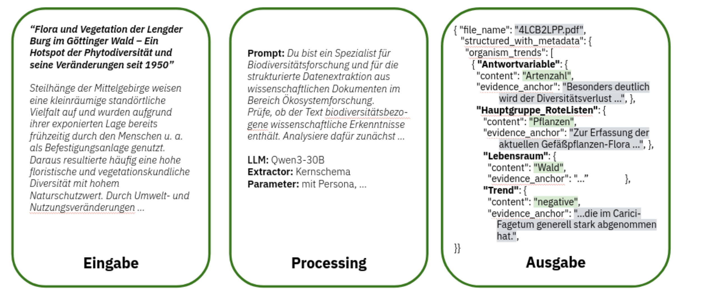
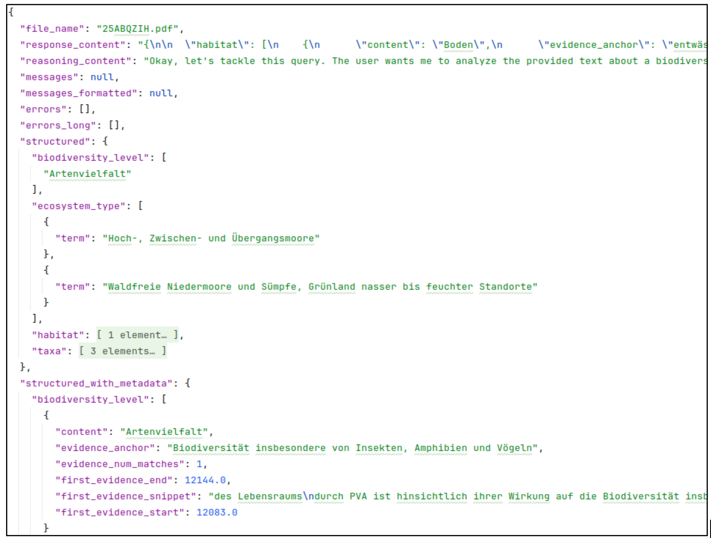

# Dokumentation Teilleistung 3 "LLM-basierte Content-Extraktion"

Kontinuierliche KI-basierte Biodiversitäts-Assessments für Deutschland (KIBA-D)

202501 KIBA-D
Version: 1.0
Status: final

**DFKI GmbH** Tel: +49 631 20575 0
Trippstadter Straße 122 Email: info@dfki.de
67663 Kaiserslautern Web: www.dfki.de

**iDiv e.V.** Tel: +49 341 9733105
Puschstraße 4 Email: info@idiv.de
04103 Leipzig Web: www.idiv.de

______________________________________________________________________

## Inhaltsverzeichnis

1. Einleitung
   1.1. Überblick AP 1
   1.2. Ziele Teilleistung 3
   1.3. Struktur des Dokuments
1. LLM-basierte Contentextraktion
   2.1. Implementierung
   2.2. Eingesetzte Software
   2.3. IT Infrastruktur / Ressourcenbedarf
1. Aufbereitung von Testdatensätzen
1. Bereitgestellte Daten für TL 4

______________________________________________________________________

# 1. Einleitung

## 1.1. Überblick AP 1

Das Projekt KIBA-D "Kontinuierliche KI-basierte Biodiversitäts-Assessments für Deutschland" hat sich die Aufgabe gesetzt, die Grundlagen für ein KI-basiertes System zu entwickeln, das auf Basis des Korpus des Faktenchecks Artenvielfalt KI-Modelle trainiert, die relevante Daten zu Biodiversitätstrends, zu kausalen Zusammenhängen, zu Bewertungen der Wirksamkeit von Instrumenten und Maßnahmen aus Textinformation extrahieren und - in einem zusätzlichen Schritt - auch analysieren können. Ziel des ersten Arbeitspakets AP1 ist dabei die Etablierung eines Workflows zur KI-gestützten Extraktion biodiversitätsrelevanter Informationen aus Textquellen. Der Workflow soll aus drei Elementen bestehen: (1) Die Erstellung eines digitalen Referenz-Korpus aus möglichst allen Dokumenten des Faktencheck Artenvielfalt, (2) die Auswahl und das Training von LLM-basierten Modellen mithilfe dieses Korpus und (3) das Rekreieren der "Annotationen" des Faktenchecks zu Testzwecken mit anschließender Validierung und Sensitivitätsanalyse.

Dieser Zwischenbericht stellt einen vorläufigen Projektbericht für die Teilleistung 3 in AP1 dar und dient zur Dokumentation des Projektstands und zur Abnahme der Teilleistung.

## 1.2. Ziele Teilleistung 3

Ziel von Teilleistung 3 ist die Implementierung des Proof-of-Concept Workflows aus Teilleistung 2. Sie dient dazu, die Umsetzbarkeit des konzipierten Workflows zu validieren. Die Implementierung fokussiert auf die Extraktion der wichtigsten Annotationen der Originalpublikationen, wie z.B. Artengruppe, Lebensraum, Biodiversitätsebene, Trends, etc., um aggregierende Analysen u.a. für die Weighted Vote Counts zu ermöglichen. Die Ergebnisse der Content-Extraktion werden in einem geeigneten Format für die Validierung und die Sensitivitätsanalysen zur Verfügung gestellt. Konkret umgesetzt wurden, in Absprache mit der FEdA und den Expert\*innen des iDiv, die Workflows für Anwendungsfälle 1 & 2 zur Rekreierung der Annotationen der Literaturdatenbank des Faktencheck Artenvielfalts und zur Extraktion der Trenddaten für die Weighted Vote Counts / Sensitivitätsanalysen (Anwendungsfälle 5 & 8).

## 1.3. Struktur des Dokuments

Das folgende Kapitel 2 beschreibt die Implementierung der Workflows. Anschließend geben wir noch einen kurzen Überblick über die Aufbereitung der Testdatensätze sowie die für die in TL4 anschließenden Analysen bereitgestellten Modell-Outputs.

# 2. LLM-basierte Contentextraktion

## 2.1. Implementierung

Die technische Umsetzung des in Teilleistung 2 konzipierten Proof-of-Concept-Workflows für ausgewählte Content-Extraktionsaufgaben erfolgt über das Python-basierte Framework `kibad-llm`. Die Codebasis ist modular aufgebaut und nutzt Hydra zur Konfigurations- und Experiment-Orchestrierung. Dadurch können unterschiedliche LLM-Backends, Extraktionsschemata, Promptvarianten, Datensätze und Evaluationskonfigurationen flexibel über Konfigurationsdateien wie `configs/predict.yaml` und `configs/evaluate.yaml` kombiniert werden, ohne dass der Kerncode angepasst werden muss. Die Qualitätssicherung der Implementierung wird durch automatisierte Tests mit `pytest` sowie lokale Qualitätsprüfungen über `pre-commit` unterstützt.

Kern der Umsetzung ist eine dokumentzentrierte Extraktionspipeline, die über den Einstiegspunkt `predict.py` ausgeführt wird. Die Verarbeitung erfolgt in Batchform über eine Hugging-Face-`datasets`-Pipeline und unterstützt – abhängig von der gewählten Konfiguration – auch parallele Verarbeitungsschritte, insbesondere bei der PDF-Konvertierung und Extraktion.

Abbildung "Eingabe-Processing-Ausgabe"


### 2.1.1. Vorverarbeitung und PDF-Konvertierung

Vor der eigentlichen Extraktion werden die Eingabe-PDFs in eine maschinenlesbare Textrepräsentation überführt. Standardmäßig nutzt das Modul `kibad_llm.preprocessing` hierfür `PyMuPDF4LLM`, um PDF-Dokumente in Markdown zu konvertieren. Diese Darstellung erhält wesentliche semantische und strukturelle Informationen des Dokuments, etwa Überschriften, Absätze oder Tabellen, und ist damit besser für die nachgelagerte Verarbeitung durch Sprachmodelle geeignet als reiner Fließtext.

Die Vorverarbeitungskomponente ist bewusst einfach gehalten und über Hydra austauschbar. Damit ist die Architektur offen für spätere Erweiterungen, beispielsweise um OCR-basierte Verarbeitung von Scan-PDFs oder um zusätzliche Konverter für andere Dokumentformate.

Abbildung "Pipeline - Teil 1 - Schemata und Vorverarbeitung"


### 2.1.2. Schema-Definition und dynamisches Prompting

Zur Abbildung der in Teilleistung 2 beschriebenen, unterschiedlich komplexen Informationsbedarfe werden die Zielstrukturen der Extraktion als Pydantic-Modelle in `src/kibad_llm/schema/types.py` definiert. Implementiert sind unter anderem Schemata für das Kernset an Faktencheck-Annotationen sowie für Organismentrends. Aus diesen Modellen werden JSON-Schemata erzeugt, die sowohl für die Strukturvorgabe an das Modell als auch für die nachgelagerte Validierung verwendet werden.

Eine zentrale Rolle übernimmt dabei `src/kibad_llm/schema/utils.py`. Dieses Modul erzeugt aus den Schemadefinitionen eine textuelle Beschreibung des erwarteten Ausgabeformats, die in die Prompts eingebettet werden kann. Zusätzlich kann das Schema so erweitert werden, dass das Modell neben den eigentlichen Feldinhalten auch Evidenz-Anker, also möglichst wörtliche Belegstellen aus dem Dokument, zurückliefert.

Das Prompting ist insgesamt konfigurationsgetrieben. Das finale Prompt setzt sich aus dem gewählten Prompt-Template, der automatisch erzeugten Schemabeschreibung und dem konvertierten Dokumenttext zusammen. Auf diese Weise können unterschiedliche Promptvarianten für verschiedene Aufgaben und Experimente eingesetzt werden, etwa Varianten mit Evidenzanforderung, mit zusätzlicher fachlicher Instruktion oder mit angepasster Platzierung der Schemabeschreibung innerhalb der Nachrichtenstruktur.

Abbildung "Prompt"


### 2.1.3. LLM-Engine und Inferenz

Die Anbindung der Sprachmodelle erfolgt über eine einheitliche Abstraktionsschicht in `src/kibad_llm/llms/`. Diese kapselt unterschiedliche Backends und erleichtert damit den Austausch zwischen proprietären und selbst gehosteten Modellen. Für proprietäre Modelle, insbesondere OpenAI-Modelle, erfolgt die Einbindung über LlamaIndex-basierte Wrapper. Für lokal oder serverseitig betriebene Open-Source-Modelle wird vLLM genutzt, entweder über eine OpenAI-kompatible Schnittstelle oder in einem In-Process-Setup.

Für die strukturierte Ausgabe nutzt das System JSON-Schema-basiertes Guided Decoding. Dadurch wird die Erzeugung von Ausgaben unterstützt, die dem erwarteten Schema möglichst genau entsprechen. Zusätzlich kann die generierte Antwort nach dem Modellaufruf gegen das jeweilige Schema validiert werden. Dieser Mechanismus ist zentral für die zuverlässige Weiterverarbeitung der Extraktionsergebnisse.

Sofern das verwendete Modell dies unterstützt, können außerdem zusätzliche Reasoning-Informationen bzw. Begründungszusammenfassungen mitgeführt und gespeichert werden. Diese Informationen dienen vor allem der späteren Analyse und Fehlerdiagnose, nicht aber als eigener Bestandteil der fachlichen Zielannotation.

Zur Erhöhung der Robustheit unterstützt das System außerdem verschiedene Extraktions- und Aggregationsstrategien in `src/kibad_llm/extractors/`. Dazu gehören wiederholte Abfragen desselben Dokuments, Vereinigungs- und Mehrheitsentscheidungsstrategien für mehrere Modellantworten sowie mehrstufige bzw. bedingte Extraktionsabläufe für komplexere Schemata. Die Architektur ist damit so angelegt, dass perspektivisch auch weitergehende orchestrierte oder mehrschrittige Prompt-Workflows integriert werden können.

Abbildung "Pipeline - Teil 2 - LLM Engine"


### 2.1.4. Post-Processing und finales Datenformat

Nach dem Modellaufruf werden die strukturierten Ausgaben im Post-Processing weiterverarbeitet. Wenn Evidenz-Anker angefordert wurden, versucht das System, diese Anker im konvertierten Dokumenttext wiederzufinden. Für gefundene Anker werden zusätzliche Metadaten erzeugt, darunter die Anzahl der Treffer, die Position des ersten Treffers im Text sowie ein Evidenz-Snippet mit umgebendem Kontext. Auf diese Weise wird die Herkunft extrahierter Informationen auf Feldebene besser nachvollziehbar.

Die Ergebnisse der Pipeline werden als JSONL-Dateien gespeichert. Im finalen Ausgabedatensatz stehen sowohl die bereinigten strukturierten Inhalte als auch – sofern aktiviert – erweiterte Metadaten zur Verfügung. Dazu gehören insbesondere:

- die strukturierte Extraktion im Zielschema,
- optional eine Variante mit zusätzlichen Evidenz-Metadaten,
- die rohe Modellantwort,
- gegebenenfalls Reasoning-Informationen,
- Evidenz-Snippets und Positionsangaben im konvertierten Dokumenttext,
- sowie aufgetretene Fehler und weitere Diagnoseinformationen.

Dieses Ausgabeformat dient sowohl der qualitativen Analyse einzelner Vorhersagen als auch der späteren automatischen Evaluation.

Abbildung "Extraktions-Ergebnis"


### 2.1.5. Evaluation (`evaluate.py`)

Die Extraktionspipeline wird durch das Modul `evaluate.py` ergänzt. Dieses Modul lädt Vorhersagen und Referenzdaten, instanziiert die jeweils konfigurierte Metrik und führt die Evaluation über den gesamten Datensatz aus. Auch hier folgt die Implementierung dem in Teilleistung 2 beschriebenen, modularen Ansatz: Datensätze und Metriken werden nicht fest im Code verdrahtet, sondern über Hydra konfiguriert.

Die Referenz- und Vorhersagedaten werden über Komponenten aus `src/kibad_llm/dataset/` geladen. Die eigentliche Evaluationslogik liegt in `src/kibad_llm/metrics/` bzw. `src/kibad_llm/metric.py`. Implementiert sind unter anderem feldbasierte Precision-, Recall- und F1-Metriken, aggregierte Kennzahlen über mehrere Felder, Konfusionsmatrizen sowie Fehlerstatistiken. Damit können sowohl einfache Feldvergleiche als auch komplexere, geschachtelte Strukturen ausgewertet werden.

Für die Durchführung größerer Versuchsreihen nutzt das Projekt zudem Hydra-Callbacks aus `src/kibad_llm/hydra_callbacks/`, insbesondere zur Speicherung von Rückgabewerten einzelner Runs und Multiruns. Dadurch lassen sich Evaluationsergebnisse, Laufmetadaten und Konfigurationen konsistent dokumentieren und später reproduzierbar auswerten.

Abbildung "Pipeline - Teil 3 - Evaluation"


## 2.2. Eingesetzte Software

Tabelle mit OSS + Lizenz? siehe schon TL 2 Abschnitt

## 2.3. IT Infrastruktur / Ressourcenbedarf

self-hosted: eine GPU pro Run (welche Modelle?), Zeit?

OpenAI API: Kosten (in €) pro Run?

vielleicht hier nur eine knappe Beschreibung, was bisher so verwendet wurde bzw. wie lange es dauert

- GPUs: H100 / A100 GPUs
- grobe Dauer, für 100 Test-PDFs ca X Minuten für Inferenz

# 3. Aufbereitung von Testdatensätzen

Für die zwei Extraktionsaufgaben - Literaturdatenbank bzw. Weighted Vote Count Trenderkennung - wurden die bereitgestellten Daten (siehe TL1) genutzt, um Trainings- und Testdatensätze zu erstellen.

Die Annotationen der Literaturdatenbank wurden mit einem Pythonskript[1] aus dem SQL-Dump der Literaturdatenbank in eine Datei im JSON-Line-Format - also eine als JSON formatierte Zeile pro Dokument - überführt. Das JSON-Schema für die Datei wurde in Absprache mit den iDiv-Expert\*innen entworfen und orientiert sich an der Tabellenstruktur der Datenbank. Es enthält alle relevanten Annotationen und Metadaten des jeweiligen PDFs. Komplexe Typen mit Subfeldern (z.B. Ökosystemtyp) werden dabei als Dictionary von Key-Value-Paaren gespeichert, alle anderen Informationen als Einzelwerte bzw. Listen. Für eine konsistente Repräsentation wurden Felder im Vergleich zur Datenbank teilweise umbenannt und Schreibweisen normalisiert. Dies erleichtert die Verwendung im Prompt bzw. im Pydantic-Datenschema des Modells.

Für das Einlesen der Trenddatensätze, die in Form von Exceltabellen vorliegen, wurde durch das DFKI ein CSV-Reader[2] implementiert, der direkt die Daten in eine analoge JSON-Schemastruktur überführt (ohne den Zwischenschritt der Konvertierung in eine JSONL-Datei). Die folgende Abbildung zeigt einen Ausschnitt der konvertierten Testdaten für die Literaturdatenbankeinträge im JSONL-Format. Die Testdaten für die Organismentrends bzw. ÖSL-Trends sehen ähnlich aus, allerdings mit anderen Feldern pro Trend (entsprechend den in den Exceltabellen definierten Attributen / Spalten).

Abbildung X Testdatenformat für Literaturdatenbank

Literaturdatenbank: Alle Einträge der Literaturdatenbank, für die ein PDF vorhanden ist, wurden zur Erstellung eines Train / Dev / Test-Splits für die Optimierung bzw. Evaluation der Workflows genutzt. Annotierte Dokumente wurden zufällig den 3 Splits zugeordnet. Nicht annotierte Dokumente bilden einen separaten Split. Tabelle X zeigt die Verteilung auf die Splits.

Tabelle X Verteilung der Dokumente auf die Splits

| Train | Validation | Test | Unlabeled | Total |
| :---: | :--------: | :--: | :-------: | :---: |
|  900  |    900     | 500  |   1.609   | 3.917 |

Für die initiale Entwicklung und erste Experimente wurde zusätzlich ein kleineres Testset von 100 Dokumenten erstellt. Dokumente wurden dabei zufällig ausgewählt, es wurde jedoch darauf geachtet, dass die Verteilung über Dokumentarten (wiss. Artikel, Buch, Bericht; Doktorarbeit, Präsentation) in etwa repräsentativ für den Gesamtkorpus war. Die Auswahl für das Testset ist hier[3] dokumentiert.

Trenderkennung / Weighted Vote Counts: Für die Trenderkennung beschränkten wir uns zunächst auf die Erstellung eines Testsets für die organismenbezogenen Trends. Auf Vorschlag von iDiv wurden dafür die Literatur des Kapitels "Wald" des Faktencheck Artenvielfalt sowie alle weiteren Publikationen aus den Weighted Vote Count Analysen zum Lebensraum Wald verwendet, weil in diesem Lebensraum sowohl positive als auch negative Trends beobachtet wurden. Insgesamt besteht das Testset aus 409 Publikationen, für die PDFs verfügbar sind. Von diesen 409 sind 172 mit Trendinformationen annotiert (insgesamt 312 Trendaussagen), die restlichen enthalten keine Trends. Die Verteilung der Trends ist positiv: 110, negativ zu positiv: 30, kein Trend: 73, negativ: 85, positiv zu negativ: 14.

Weitere Testdatensätze, z.B. für die ÖSL-Trends bzw. für weitere LLM-Aufgaben, werden im Verlauf des Projekts nach Bedarf erstellt.

# 4. Bereitgestellte Daten für TL 4

Für die Analysen in TL4 haben wir eine Reihe von Experimenten mit verschiedenen Modellen, Prompts, Hyperparametern, und anderen Änderungen durchgeführt (für Details siehe TL4). Pro Durchlauf, also einer konkreten Konfiguration eines Experiments, werden sowohl Modellausgaben als auch Loggingdaten (während Inferenz und während Evaluation) gespeichert. Die Modellausgaben werden in dem in Abschnitt 2.1 beschriebenen, "finalen" JSON-Line-Format abgelegt. Die Inhalte der "structured" bzw. "structured_with_metadata" Elemente entsprechen dabei im Wesentlichen dem Format der aufbereiteten Testdaten, bis auf die zusätzlichen Informationen wie Evidenzsnippets. Die Loggingdaten werden mit dem Standard "logging"-Paket von Python erzeugt. Die Daten werden in folgender Struktur abgelegt:

Abbildung: Struktur der bereitgestellten Experimentdaten

```
results/
    predictions/
        experiment_name/time_stamp/
            run_id_1/
                predictions.jsonl
            run_id_2/
                predictions.jsonl
            …
    logs/
        experiment_name/
                readme.md
                metrics.svg
                errors.svg
                …
                evaluate/multiruns/timestamp/
                    0/
                        job_return_value.json
                        .hydra/
                            config.yaml
                            hydra.yaml
                            overrides.yaml
                    1/
                        job_return_value.json
                        …
                    …
                    multirun.yaml
                predict/ (selbe Struktur wie in evaluate/)
```

Der Top-Level-Ordner enthält separate Unterordner für die logs/ und predictions/. Predictions werden über ein benanntes Experiment gruppiert und jeder Run enthält einen Zeitstempel. Die Logdateien speichern im Unterordner ".hydra" die Metadaten zu den einzelnen Runs, insbesondere die exakte Hydra-Konfiguration (config.yaml), die für diesen Run spezifischen Parameter (overrides.yaml) sowie weitere, während des Runs produzierte Metadaten (job_return_value.json). Darüber ist jederzeit nachvollziehbar, welche Prediction-Datei mit welchen Hyperparametern, Random Seed, Modell, Commit oder Branch, etc. erzeugt wurde. Über den Commit-Hash kann das Experiment ggf. reproduziert werden. Die Zeitstempel für predictions/ und dem zugehörigen logs/predict/ Ordner sind identisch, für leichtere Zuordnung. Die logs/evaluate Zeitstempel sind, weil die Evaluation separat gestartet wird, verschieden von den predict/ - Zeitstempeln.

Im logs/-Ordner werden zusätzlich eine "readme.md" sowie die mit einem Jupyter Notebook[4] erzeugten Grafiken zu den automatischen Metriken und Fehlern abgelegt. Die Readme enthält alle notwendigen Informationen zur Reproduktion des Experiments, inklusive einer Beschreibung des Experiments, relevanter Log-Ausgaben, Konfigurationsparameter für das Jupyter Notebook, der Dokumentation der Inferenz- und Evaluationsskriptaufrufe sowie Links zu relevanten Github Issues und weiterer Dokumentation.

Insgesamt wurden für die Analysen in TL4 die Ergebnisse von 18 Experimenten aufbereitet. Die meisten Experimente nutzen alle in Teilleistung 2, Abschnitt 2.4 aufgeführten Modelle, bis auf Ministral 3[5]. Von den Experimenten entfallen 10 auf das Faktencheck Kernschema, und 8 auf das Organismentrendschema. Je Experiment und Modell wurden meist 3 Durchläufe mit verschiedenen Random Seeds ausgeführt. Ausnahme war GPT 5, wo wir oft nur einen Durchlauf verwendeten, um die Kosten niedrig zu halten. Insgesamt entstanden so mehr als 120 Modelldurchläufe für das Kernschema, und etwas mehr als 90 Durchläufe für die Organismentrends.

______________________________________________________________________

[1] kibad-llm/src/kibad_llm/data_integration/db_converter.py (Hinweis: Der Pfad bezieht sich auf das kibad-llm Coderepository, das separat zur Verfügung gestellt wird)
[2] kibad-llm/src/kibad_llm/datasets/csv.py
[3] Copy of Faktencheck Artenvielfalt Literaturdatenbank-neu.xlsx
[4] kibad-llm/notebooks/plot_multirun_evaluation.ipynb
[5] Das Modell Ministral 3 wurde nach den ersten Tests nicht mehr verwendet, da es zu viele Fehler produzierte.
