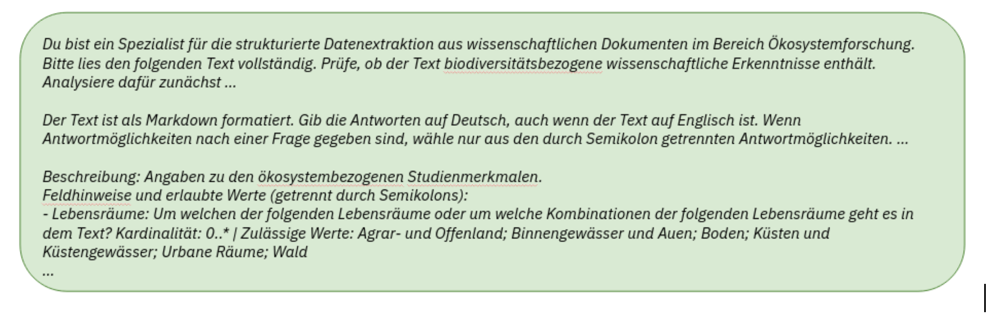

### 2.1. Implementation

Die Implementierung des in Teilleistung 2 konzipierten Proof-of-Concept Workflows erfolgt über das Python-basierte System `kibad-llm`. Dieses ist als Hydra-konfiguriertes Framework aufgebaut, was eine flexible Orchestrierung verschiedener Extraktions-Szenarien, LLM-Backends und Datensätze ermöglicht. Die technische Umsetzung lässt sich in die Phasen Vorverarbeitung, schema-gesteuerte Extraktion und Post-Processing unterteilen.

Abbildung "Eingabe-Processing-Ausgabe"

#### 2.1.1. Vorverarbeitung und PDF-Konvertierung
Die Basis der Extraktion bilden wissenschaftliche Publikationen im PDF-Format. Da Large Language Models (LLMs) primär auf Text- oder Markdown-Eingaben optimiert sind, wurde eine Vorverarbeitungspipeline implementiert, die `PyMuPDF4LLM` nutzt, um PDFs strukturerhaltend in Markdown zu konvertieren.

* [cite_start]**Formatkonvertierung:** PDF-Strukturen (Überschriften, Listen, Tabellen) werden in Markdown-Syntax überführt, um dem Modell semantische Hinweise auf die Dokumentstruktur zu geben[cite: 7].
* **Batch-Verarbeitung:** Über den zentralen Einstiegspunkt `predict.py` wird die Verarbeitung ganzer Verzeichnisse parallelisiert unterstützt, um auch große Korpora des Faktenchecks effizient zu verarbeiten.

Abbildung "Pipeline - Teil 1 - Schemata und Vorverarbeitung"

#### 2.1.2. Schema-gesteuerte Konfiguration und Prompting
Ein Kernaspekt der Implementierung ist die strikte Typisierung der Extraktionsziele mittels **Pydantic-Datenmodellen**. [cite_start]Dies löst die in Teilleistung 2 identifizierte Herausforderung unterschiedlicher Schwierigkeitsgrade der Extraktion (von einfachen Entitäten bis zu komplexen Trendaussagen)[cite: 6].

* **Automatisierung:** Aus den Pydantic-Klassen (z. B. für die Schemata `Kern`, `Full` oder `OrganismTrend`) werden automatisch JSON-Schemata und textuelle Beschreibungen für den Prompt generiert.
* **Prompt-Design:** Der System-Prompt integriert eine spezifische Persona (Spezialist für Ökosystemforschung) sowie strikte Anweisungen zur Einhaltung der Antwortvorgaben und der Sprachwahl (Deutsch).

Abbildung 1 "Prompt"

#### 2.1.3. LLM-Orchestrierung (Extraction Engine)
Die `kibad-llm` Engine unterstützt verschiedene Backends, um sowohl kommerzielle APIs als auch lokal gehostete Open-Source-Modelle flexibel einsetzen zu können.

* **Inferenz-Strategien:** Das System nutzt Techniken wie *Guided Decoding* und *Reasoning Traces* (Chain-of-Thought), um die Validität des ausgegebenen JSON-Formats sicherzustellen.
* **Backend-Flexibilität:** Über Hydra-Konfigurationen kann zwischen Modellen wie Qwen (via vLLM) oder OpenAI-Modellen gewechselt werden, ohne die Extraktionslogik anzupassen.

Abbildung "Pipeline - Teil 2 - LLM Engine"

#### 2.1.4. Post-Processing und Evidenz-Generierung
Nach der Generierung durch das LLM erfolgt eine automatisierte Aufbereitung der Daten, um sie für die nachfolgenden Analysen in Teilleistung 4 nutzbar zu machen.

* **Evidenz-Anker:** Ein entscheidendes Merkmal ist die Generierung von Belegen (*Evidence Anchors*). [cite_start]Das System fordert das Modell auf, zu jedem extrahierten Fakt ein exaktes Zitat aus dem Quelltext anzugeben[cite: 7].
* **Metadaten-Anreicherung:** Mittels regulärer Ausdrücke sucht das System die exakten Positionen (`first_evidence_start`, `first_evidence_end`) dieser Zitate im Original-Markdown, was eine spätere manuelle Verifikation durch Experten massiv erleichtert.
* **Output-Format:** Die Ergebnisse werden als strukturierte JSONL-Dateien gespeichert, die sowohl die extrahierten Werte als auch die verknüpften Metadaten enthalten.

Abbildung "Extraktions-Ergebnis"

#### 2.1.5. Evaluation (Vorschau auf Teilleistung 4)
Obwohl die Evaluation Fokus der nächsten Teilleistung ist, wurde die Infrastruktur dafür bereits implementiert. Über `evaluate.py` können die Extraktionsergebnisse gegen Referenzdatensätze (z. B. die iDiv-Literaturdatenbank) verglichen werden, um Metriken wie Precision, Recall und F1-Score auf Feldebene zu berechnen.

Abbildung "Pipeline - Teil 3 - Evaluation"
